# 清洁通信 – 接口和事件观察者模式

在本章中，我们将探讨两种设计模式，这些模式使我们能够改进演员之间如何相互通信。利用接口和事件观察者模式，我们可以构建更好、更干净的通信解决方案，从而降低通信的内存和处理成本。为了探索这些模式，我们将通过实现一个可以添加到任何演员的健康组件来扩展 RTS 游戏。我们将从查看 C++中的接口开始，遵循接口设计模式的概念，然后探索事件观察者模式，包括在蓝图中的事件调度器和 C++中的事件委托实现。

在本章中，我们将涵盖以下主题：

+   在 UE5 中跨类进行通信接口

+   在 UE5 中实现事件委托通信

# 技术要求

在本章中，我们将汇集我们在前几章中构建的孤立系统。假设你一直跟随着，你应该能够在本章中将它们全部联系起来。

如果你想要直接进入这个阶段，你可以从 GitHub 下载`chapter6`分支，网址为[`github.com/PacktPublishing/Game-Development-Patterns-with-Unreal-Engine-5/tree/main/Chapter06`](https://github.com/PacktPublishing/Game-Development-Patterns-with-Unreal-Engine-5/tree/main/Chapter06)

# 在 UE5 中跨类进行通信接口

接口是一种促进不同类之间通信的类，而无需任何类知道另一个类的类型。接口类包含一组可以在任何类上通过多态实现的通用函数。

为了抽象化这一点，让我们考虑一个荒谬的情况，你有一摞页面，有人要求你验证它确实是一份缺少封面的*《战争与和平》*副本。真正确信的唯一方法是将每一页上的每个单词与经过验证的副本进行比较。这是耗时且与虚幻引擎在将类强制转换为其他类型时所做的类似。

重要提示

这并不是引擎所做的。其中内置了一些效率，可以加快这个过程，确保不是整个类被检查，但这个观点仍然成立，即强制转换可能是多余的。

如果我们深入这个假设，了解为什么要求你验证书籍的性质可以有很大差别。如果是为了验证书籍的完整性，那么就没有其他办法了，但如果请求只是为了看看是否有特定的章节，那么我们就不需要做那么多工作。我们只需查看目录页，跳到请求的章节，然后从那里开始阅读。这就是接口的作用；它就像一本书的目录页。书籍承诺所需的章节将出现在目录页标记的区域。

在构建两个参与者之间更清洁的通信方法的最常用解决方案之一是实施蓝图接口，这消除了将类型强制转换为参与者特定类的需求，允许你使用参与者引用代替。在我们继续探讨 C++ 中的接口之前，让我们先深入了解一下蓝图接口。

## 蓝图接口

我们在改善级联强制转换链问题时，在*第二章*中已经使用了一个**蓝图接口**，在那个时刻我们创建了一个蓝图接口，设置了一个函数定义，并将其用作各种武器蓝图的可调用事件。然后，从角色蓝图调用该事件，允许它调用附加武器（子参与者组件）的事件，而不需要将引用强制转换为特定类，这提高了系统的效率，同时也减少了内存影响。

因此，从*第二章*中，我们已经知道如何创建蓝图接口，在接口内创建函数，并将它们作为事件调用，但让我们看看一些我们尚未遇到的蓝图接口的特性。

让我们通过一个新的接口来探索这个问题。请创建一个新的蓝图接口资产，并将其命名为 `BI_Test`，因为这个类只是为了探索目的而临时创建的。

在我们添加任何函数之前，让我们通过点击顶部菜单中的**类设置**来查看各种设置，这将更改详细信息面板以显示与蓝图类相关的一系列变量。

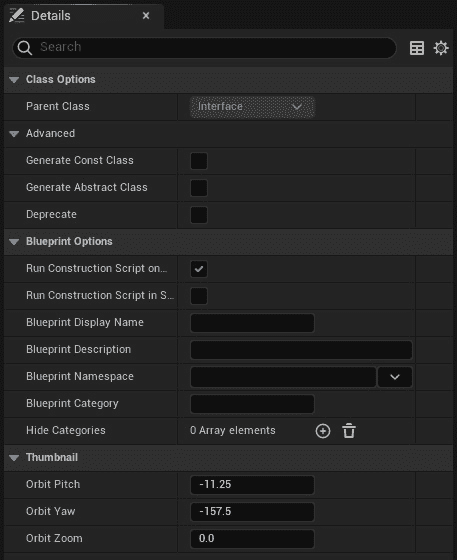

图 6.1 – 蓝图接口类设置在详细信息面板中显示

在构建系统时，最有益的设置是**蓝图显示名称**和**蓝图描述**，因为两者都提供了在使用蓝图接口时的用户体验改进。如果没有设置这些，Unreal 将仅显示资产名称，并提供无描述信息，这对于当前的单人开发者来说可能没问题，但在开发后期或与他人合作时则不太有帮助。

为了亲自看到设置的效果，我们建议创建并使用一个测试蓝图类，`BP_Test`。一旦你确信你理解了设置，就可以将其删除。

让我们看看如何设置这些，以及它们对用户体验有何影响。

### 蓝图显示名称

**蓝图显示名称**设置提供了一个字符串输入，允许你定义当接口实现时，在蓝图类的**类设置**中接口如何显示。

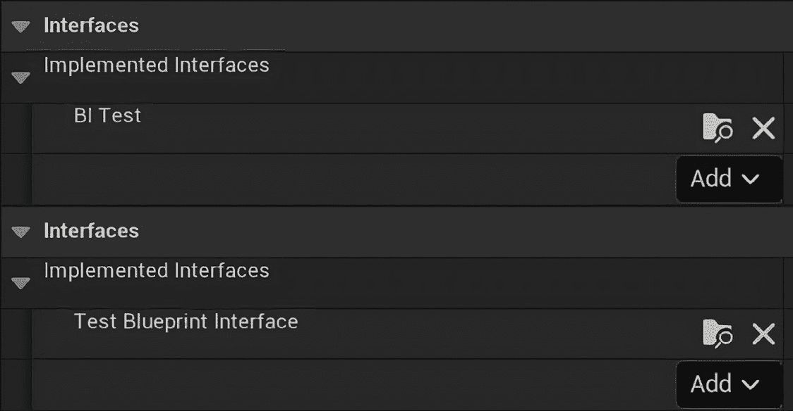

图 6.2 – 具有和没有蓝图显示名称的蓝图类实现接口的类设置

*图 6.2* 展示了当在左侧图像中实现接口时，带有或没有 `BI_Test` 的蓝图类设置之间的比较。当从 **添加** 下拉菜单中选择 `BI_Test 蓝图` 接口时，没有 `已实现接口` 列表。

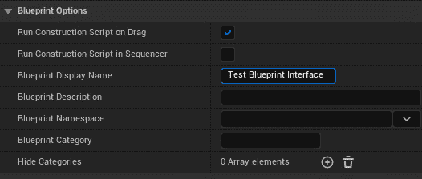

图 6.3 – 设置了蓝图显示名称的 BI_Test 的蓝图选项展开视图。

这使得我们作为系统设计师，在保持核心命名约定的同时，确保接口的格式对设计师和其他团队成员始终清晰可见。

### 蓝图描述

**蓝图描述** 设置提供了一个字符串输入，允许您在从蓝图类的类设置中的 **添加** 下拉菜单选择要实现的接口时定义鼠标悬停提示。

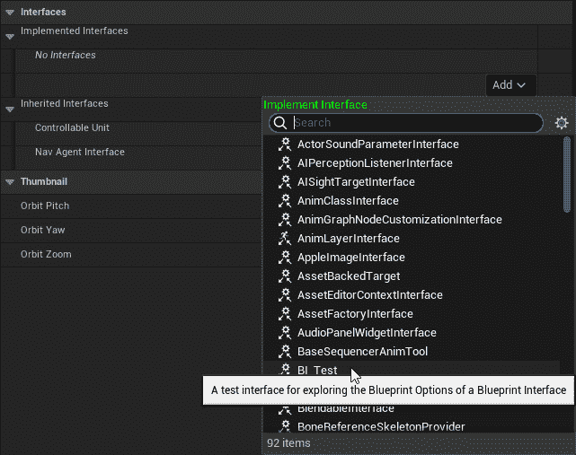

图 6.4 – 选择要实现的接口时，类设置中的添加下拉菜单，带有蓝图描述

*图 6.4* 展示了在 *图 6.4* 的左侧，`BI_Test` 没有蓝图描述。在右侧，蓝图描述已设置为 `BI_Test`，在 **添加** 下拉菜单中。

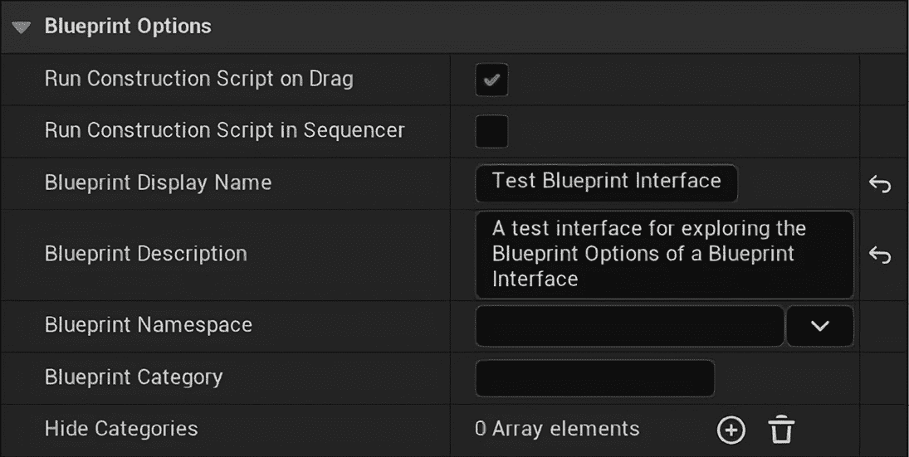

图 6.5 – 设置了蓝图描述的 BI_Test 的蓝图选项展开视图

这使得在选择接口时，我们可以清楚地知道它应该用于什么。消息可以包括具体信息，例如 `Required on all classes required to interact with doors` 或更一般的消息，例如 `Adds functions for shooting weapons`。关键是要确保描述有助于其他用户识别接口提供的内容。

## 接口事件与函数

当向蓝图接口的 *functions* 列表中添加函数时，将其实现到蓝图类中时可能会产生一个函数或一个事件。

使用 `BI_Test` 和 `BP_Test` 类，我们可以在一个安全的空间中探索它们之间的差异。让我们开始：

1.  让我们从使用 `ExampleEvent` 和 `ExampleFunction` 添加两个函数开始。

1.  从 *函数* 列表中选择 `ExampleFunction`，并通过点击 **+** 图标将输出变量添加到 **输出** 列表中。

1.  将新变量命名为 `BoolOutput`，并将类型设置为 **布尔型**。

这将创建一个事件和一个用于蓝图的功能。一旦添加了输出变量，该函数将作为蓝图函数运行，如果没有输出，它将作为事件运行。

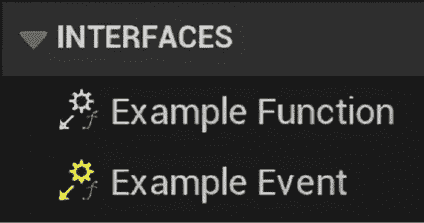

图 6.6 – 蓝图类中的接口函数和接口事件

注意函数（灰色图标）和事件（黄色图标）的图标是不同的。这还不是唯一的区别；向函数添加逻辑的方式与事件不同。双击事件将在**事件图**中添加一个事件节点：

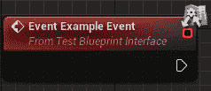

图 6.7 – 接口事件添加到事件图时的情况

双击函数将在新标签页中打开函数图，包括一个**返回节点**。

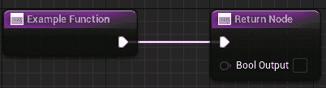

图 6.8 – 带有返回节点的接口函数

当调用接口函数或事件时，它们在蓝图图中会略有不同。主要区别是图标和包含输出执行引脚（节点右侧的白色轮廓箭头）：

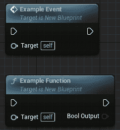

图 6.9 – 蓝图图中接口事件和接口功能节点的比较

从接口函数生成的蓝图节点还有两种可能的视觉结果；这些是在蓝图接口函数具有**紧凑****节点标题**时出现的紧凑节点。

要测试这些，请在 `BI_Test` 蓝图接口中创建两个新函数；将这些函数命名为 `ExampleCompactedEvent` 和 `ExampleCompactedFunction`，在输出列表中添加一个布尔变量，就像之前一样。然而，这次，设置每个函数的紧凑节点标题。目前，请将函数名称重复一遍，并在单词之间留空格。

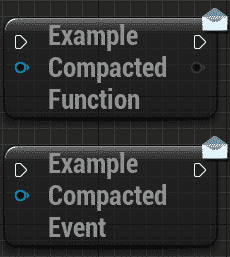

图 6.10 – 蓝图图中接口事件和接口功能的紧凑节点示例

紧凑节点放置时，如图 *图 6*.10* 所示。紧凑节点没有标题或引脚名称；在 Blueprint 中工作时不常用，但如果需要则可用。

## C++ 中的接口

在 C++ 中，事情变得有点奇怪。Unreal 的原始核心更接近 Objective C 而不是 C++，这在处理接口时表现得最为明显。建议从编辑器创建接口，因为从模板中添加到文件中的内容很少，从头开始全部输入是浪费时间。

在编辑器中，打开您的 C++ 类内容部分。右键单击并添加一个新的 C++ 类。在选择要继承的父类时，滚动到底部的常用类并选择**Unreal 接口**。这将创建一个新的头文件，如下面的模板所示：

Unreal 接口模板项目特定元素被替换为占位符

```cpp
#include "CoreMinimal.h"
#include "UObject/Interface.h"
#include "<class name>.generated.h"
UINTERFACE(MinimalAPI)
class U<class name> : public UInterface
{
    GENERATED_BODY()
};
class <module name>_API I<class name>
{
    GENERATED_BODY()
public:
}
```

如您在模板中看到的，同一个头文件中有两个类。顶部的类使用您选择的类名创建，前面加一个 *U*。这个类从 `UInterface` 类继承，允许您的类成为 Unreal 接口系统的一部分，与 `UKismetSystemLibrary::DoesImplementInterface` 等函数一起工作。第二个类扩展了您的模块，具有类似的名字，但以一个 *I* 开头。这是您应该添加公共函数并从中多继承的类。

当从一个接口调用函数时，假设持有的引用不是正确的类类型，而是最可能是一个 `AActor*`。如果不是这种情况，那么接口就没有任何好处，应该重新思考通信策略。Unreal 提供了一些通过接口调用函数的方法。两种主要方法是将接口作为类型进行转换并调用函数实例，或者静态调用函数。将接口类型进行转换正好如其名，会涉及以下内容：

```cpp
if(IInterface* cachedRef = Cast<IInterface>(actorRef))
{ cachedRef->Function(arg1); }
```

注意 `Cast` 返回转换后的指针和布尔值，用于 `if` 语句。这是因为 Unreal 中的指针 `if` 会自动检查指针是否不是 `nullptr`。然而，它仍然使用了一个转换，无论转换多小。使用以下静态函数调用会更快：

```cpp
IInterface::Execute_Function(actorRef, arg1);
```

如您所见，这可以更快地到达函数调用，并且声明了更少的临时变量。这种方法的权衡是调用的安全性。在此方法中，我们假设 `actorRef` 实现了我们从其调用函数的接口。这种假设意味着如果相关的类没有实现所需的接口，我们将得到一个逻辑错误。解决方案是设计一种避免这种情况的方法，或者在不进行转换的情况下检查接口，使用 `UKismetSystemLibrary` 中的上述 `DoesImplementInterface` 函数。

因此，带着这些一般概念，让我们看看如何在 C++ 中创建我们自己的接口。

## 构建示例接口通信

要实现类似于前面示例中的功能，其中演员可以是可燃的，我们可以从一个名为 `IFlammable` 的接口开始，该接口需要一个名为 `Ignite` 的公共虚拟函数。这看起来如下所示：

IFlammable.h

```cpp
#include "CoreMinimal.h"
#include "UObject/Interface.h"
#include "flammable.generated.h"
UINTERFACE(MinimalAPI)
class UFlammable : public UInterface
{
    GENERATED_BODY()
};
class EXAMPLE_API IFlammable
{
    GENERATED_BODY()
public:
    virtual void Ignite();
}
```

要在其他类中实现这一点，您只需使用多态并覆盖接口函数。以下示例显示了一个树演员从接口多继承以实现它：

从可能的示例可燃接口使用 Tree.h 中摘录

```cpp
#include "flammable.h"
UCLASS()
class Example_API ATree : public AActor, public IFlammable
{
    //other code
public:
    void Ignite() override;
}
```

在调用端，如果我们有一个火焰火炬，我们可以在火焰粒子的碰撞处理器中添加以下代码：

从可能的可燃接口使用中摘录

```cpp
if(UKismetSystemLibrary::DoesImplementInterface(otherActor,     UFlammable::StaticClass()))
{
    IFlammable::Execute_Ignite(otherActor);
}
```

这段代码将使火炬点燃任何可燃物，而忽略不可燃物，不会引起任何错误或需要执行任何不必要的转换。

在蓝图和 C++中，接口都为我们提供了保持通信清洁和高效的关键好处，允许我们将函数名捆绑起来以供实现类使用。现在我们已经探讨了创建这两种类型接口的好处和过程，我们可以看看另一种匿名通信方法——事件。

# 在 UE5 中实现事件代理通信

另一种匿名通信的形式是事件代理。代理本质上是指针函数，允许我们在运行时动态地改变逻辑流程。当被调用时，它们允许向程序中的多个其他部分发送信号，而发送者并不知道信号传到了哪里。使用这些作为事件驱动方法的一部分称为事件代理。

事件代理可以比作一个广播电台。代理作为电台存在，当被要求时向空中发送信号。然后，有收音机可以选择订阅这个电台，接收信号。这形成了一种一对多的关系，单向通信。收音机不能向电台发送消息，电台也不知道有多少收音机正在收听。

就像我们探索接口时一样，让我们先从蓝图实现开始，然后再转向更复杂的 C++方法。

## 蓝图中的事件代理

在蓝图中，通过公开一个变体使代理变得简单。这些被称为事件调度器。然而，它们确实以预期的这种方式工作。

事件调度器需要在将要进行广播的类中创建（就像电台一样）。我们通过点击“**我的蓝图**”选项卡中的“**事件调度器**”下拉列表中的**+**符号来完成此操作。


图 6.11 – 在“我的蓝图”选项卡中的事件调度器展开

事件调度器可以像蓝图中的任何事件一样有一系列输入。这些是在“**详情**”选项卡的顶部添加的。您还可以使用“**从以下下拉列表复制签名**”来选择当前蓝图中的现有事件。这将复制该事件在事件调度器中的所有输入。

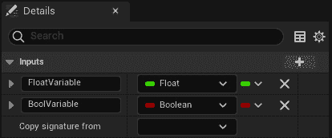

图 6.12 – 事件调度器变量和“从以下下拉列表复制签名”下拉列表

蓝图可以像任何监听代理一样响应自己的调度器。调度器需要绑定到某个事件，然后执行所需的响应。

这就是为什么，如果您从事件调度器列表中将调度器拖放到蓝图图中，您将看到一个包含**调用**、**绑定**、**解绑**、**全部解绑**、**事件**和**分配**的弹出窗口。

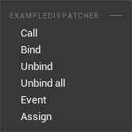

图 6.13 – 将事件调度器拖动到蓝图图上时的事件调度器弹出窗口

这些选项在您选择响应调度器的地方都可用（除了事件）。然而，您通常会通过正常弹出窗口访问它们，当从持有调度器的对象拖动时创建蓝图节点。

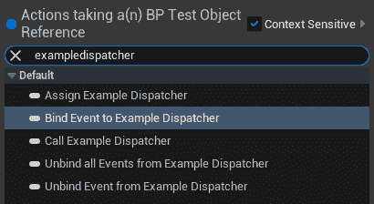

图 6.14 – 通过名称搜索事件调度器的蓝图上下文弹出窗口，在从包含事件调度器的类引用拖动后

让我们探索这些弹出窗口中提供的每个选项，以便您知道何时以及如何使用它们。

### 调用

**调用**选项激活事件调度器，将消息发送到任何订阅的委托，这些委托正在监听该事件。这通常用于具有事件的蓝图上，但也可以从具有对具有调度器的演员的直接引用的单独蓝图中调用。

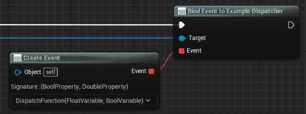

图 6.15 – 一个具有两个变量输入（浮点数和布尔值）的调用调度器节点

**绑定**选项用于确定在调用调度器时应运行哪个事件；当使用时，相关事件被添加到与调度器相关联的事件列表中。在蓝图上，**绑定事件到**节点和**事件**节点之间的红色线条表示要绑定到哪个事件。

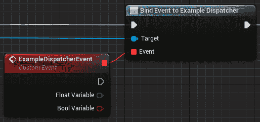

图 6.16 – 一个绑定事件节点连接到一个自定义事件，该事件将在调用事件调度器时运行

这可以通过使用**创建事件**节点来替换，该节点可以创建具有匹配签名（相同的变量）的函数或事件，或指向现有事件。这些通常用于尝试保持蓝图图整洁，但需要链接到函数，而不是事件。

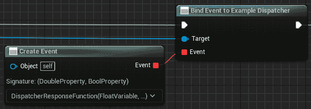

图 6.17–一个绑定事件节点连接到一个创建事件节点

### 解除绑定和解除所有绑定

**解除绑定**节点与绑定节点相反。当使用**解除绑定**时，事件将从与事件调度器相关联的事件列表中移除。

**解除所有**选项做的是同样的事情，但不是仅仅移除链接的事件，而是移除所有事件，使调度器无法与任何东西通信，直到使用绑定事件节点关联另一个事件。 

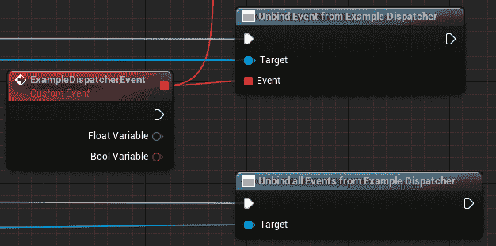

图 6.18 – 解除绑定事件节点，连接到自定义事件，以及解除所有事件节点

**绑定**和**解绑**节点允许我们动态地将不同的事件或函数链接到事件分发器，使我们能够完全控制在任何游戏时刻响应分发器的对象。

### 事件和分配

**事件**和**分配**选项存在是为了帮助你创建响应事件分发器所需的节点。

**事件**选项创建了一个具有匹配签名的**自定义事件**节点，以便你稍后将其连接到绑定事件节点。

**分配**选项会创建绑定事件节点和匹配的自定义事件节点，这在创建蓝图逻辑时可以节省一点时间。

现在我们已经掌握了蓝图事件实现的实现，接下来让我们探索 C++的实现。

## C++中的事件代表

在 C++中，事件代表稍微复杂一些，但这也带来了更多的控制。首先，在将事件从代表中创建出来之前，你可以给每个代表赋予一些不同的属性。让我们来看看它们：

+   `DYNAMIC`: 这个代表可以被序列化到编辑器中，以便于蓝图绑定

+   `MULTICAST`: 这个代表可以同时拥有多个监听器，并移除了返回值的能力

+   `SPARSE`: 这个代表在订阅之前不会占用内存中的 1 个字节（这确实会使使用速度变慢，但对于很少绑定的事件（如市场工具）来说，效率更高）

在决定代表应该如何表现之后，你需要将其声明为一个新类型。这通过以下大写模式进行描述：

`DECLARE_<属性>_DELEGATE_<参数数量>(<类型名>, <arg1 类型>, <arg1 名称>… );`

这可以举例说明如下：

`DECLARE_DYNAMIC_MULTICAST_DELEGATE_TwoParams(FExampleSignature, float, number, AActor*, actorRef);`

这个代表将被序列化到编辑器中，可能包含多个绑定的函数。每个绑定的函数将有两个`float`类型的参数和`AActor*`类型的参数。这在行为上与蓝图事件分发器最为接近。

此外，还有一种称为事件的代表类型。这是多播代表的版本，其中第一个参数是拥有类型，只有该类型可以作为成员拥有事件，并且只有定义对象可以广播事件。有了这种额外的安全性，你可以将事件公开而不必担心其他类会广播该事件。然而，这也带来了额外的设计挑战，以使你的系统以整洁的方式工作。

重要提示

从现在开始，所有使用的事件代表都将使用动态多播，以避免混淆。这不一定是最优策略，但这是一个很好的起点，以便随后根据需要修改和限制行为。

这就是如何定义一个新的代表类型并从该类型创建一个新的代表实例。为了使代表执行某些操作，你还需要知道如何将函数绑定到它们并触发它们。这会根据在声明中赋予事件的属性而有所不同。

通过了解代表者具有的不同属性，我们可以看到非动态代表者有八个不同的函数，可以将监听函数绑定到每个单播和多播上。建议您使用`BindUObject`函数为单播代表者，使用`AddUObject`函数为多播代表者。这两个函数都接受一个引用`UObject*`作为第一个参数和一个函数地址作为第二个参数，格式为：`&ClassName::FunctionName`。

对于动态代表者，选择较少；单播动态代表者应使用`BindDynamic`函数，对于多播，建议您使用`AddUniqueDynamic`函数，这两个函数与之前提到的非动态代表者具有相同的参数。如果知道函数实例尚未绑定到该代表者，则可以使用`AddDynamic()`函数与多播动态代表者一起使用，否则它可能会被多次绑定到同一个事件分发器。

最后，如果代表者是单播的，您应该使用代表者上的`ExecuteIfBound()`成员函数来调用它们，并根据需要传递参数。对于任何多播代表者，使用`Broadcast`成员函数。在原型设计时，我们将大量使用多播动态代表者，因为它们提供了最大的灵活性，可以根据需要钩入更多的监听器，这导致我们大量使用`Broadcast`函数。

在了解了 C++中代表者的核心概念后，让我们继续创建我们自己的事件代表者。

## 构建有用的代表者工具

现在，让我们看看构建一个可以放入任何项目的有用类。我们将在 Unreal Engine 中现有的伤害系统中构建。这利用了接口和引擎的多态性，允许您对任何演员造成伤害，并从任何演员那里接收伤害。作为一个扩展，我们将探讨制作一个可以放在任何演员上的健康组件，它可以自动将自己绑定到这个伤害系统中，并为任何游戏系统提供一些有用的端点。

首先，我们需要一个新的 C++类，所以请转到编辑器中的 C++文件夹，并基于**演员组件**创建一个新的类。演员组件是用于逻辑的组件，因为它们在世界上没有关联的渲染或变换。

有用提示

如果您正在使用 Rider 2022 或更高版本，那么在您的模块基础文件夹上右键单击将为您提供**添加 Unreal 类**的选项。在弹出窗口中，您可以选择一个演员组件，它将以相同的方式工作，但不需要引擎运行。

首先要考虑的是我们需要哪些代表者定义。显然的一个是当组件耗尽健康时，需要让拥有该组件的演员知道它已经死亡。这可能需要传递一个引用到引发链的控制器，这样最终游戏模式就可以将分数分配给正确的控制器：

```cpp
DECLARE_DYNAMIC_MULTICAST_DELEGATE_OneParam(FHealthDeadSignature, AController*, instigator);
```

需要传递给组件的下一个有用的信息是每次造成伤害时发出的信号。有很多选项可以选择传递的数据。例如，如果目标是更偏向于《使命召唤》风格的游戏，你可能想知道伤害来自哪个方向，以便通过某种形式的 UI 将信息反馈给玩家。在这种情况下，我们将传递有关新和最大生命值以及刚刚发生的变化的信息。这将使我们能够更新 UI 生命条，并可能在世界中生成一些伤害数字：

```cpp
DECLARE_DYNAMIC_MULTICAST_DELEGATE_ThreeParams(FHealthDamagedSignature, float, newHealth, float, maxHealth, float, healthChange);
```

我们可以查看头文件定义。需要公开的只有构造函数以及之前声明的每种委托类型中的一个。在受保护部分，我们需要一些浮点变量来跟踪当前和最大生命值。这些变量被标记为受保护，以便在`UPROPERTY`标签指定的反射能够与编辑器一起工作。除此之外，我们还将使用`BeginPlay`重写来设置一些自动行为。最后，我们将在私有部分添加一个处理函数。这将用于将此组件附加到的 actor 中已经存在的伤害接口系统挂钩。所有这些写出来后，类定义应该看起来像这样：

HealthComponent.h 类定义

```cpp
UCLASS(ClassGroup=(Custom), meta=(BlueprintSpawnableComponent))
class <module name>_API UHealthComponent : public UActorComponent
{
    GENERATED_BODY()
public:
    UHealthComponent();
    UPROPERTY(BlueprintAssignable)
    FHealthDeadSignature OnHealthDead;
    UPROPERTY(BlueprintAssignable)
    FHealthDamagedSignature OnHealthDamaged;
protected:
    UPROPERTY(EditAnywhere, BlueprintReadWrite)
    float _MaxHealth;
    UPROPERTY(VisibleAnywhere, BlueprintReadOnly)
    float _CurrentHealth;
    virtual void BeginPlay() override;
private:
    UFUNCTION()
    void DamageTaken(AActor* damagedActor, float damage,
        const UDamageType* dmgType, AController* instigator,
        AActor* causer);
};
```

在生成这些函数的定义之后，我们可以在构造函数中为`maxHealth`添加一个默认值，比如`100.f`，但这行代码并不是很重要。`BeginPlay`重写需要将我们的私有`DamageTaken`函数绑定到所附加 actor 的`OnTakeAnyDamage`事件，以及设置`_CurrentHealth`的初始值：

HealthComponent.cpp 构造函数和 BeginPlay

```cpp
UHealthComponent::UHealthComponent()
{
    _MaxHealth = 100.f;
}
void UHealthComponent::BeginPlay()
{
    Super::BeginPlay();
    _CurrentHealth = _MaxHealth;
    GetOwner()->OnTakeAnyDamage.AddDynamic         (this, &UHealthComponent::DamageTaken);
}
```

然后，关于如何承受伤害以及如何触发事件的逻辑都将放入`DamageTaken`函数中。注意使用`FMath::Min`确保收到的伤害永远不会超过剩余的生命值。这可以轻松修改为允许类似《毁灭战士》风格的宽恕机制，其中玩家不能在一次攻击中从>1%的生命值降到 0%，只能从 1%的生命值死亡。或者，如果这对游戏玩法很重要，可以将其删除以允许过载计算：

HealthComponent.cpp DamageTaken 函数

```cpp
UHealthComponent::DamageTaken(AActor* damagedActor,
    float damage, const UDamageType* dmgType,
    AController* instigator, AActor* causer)
{
    float change = FMath::Min(damage, _CurrentHealth);
    _CurrentHealth -= change;
    OnHealthDamaged.Broadcast(_CurrentHealth, _MaxHealth,
    change);
    if(_CurrentHealth == 0.f)
    {
        OnHealthDead.Broadcast(instigator);
}
}
```

要使用此组件，你现在可以前往任何 actor 并添加此组件到其层次结构中。它将自动绑定自身，并且我们已经内置了两个可以绑定到蓝图和 C++函数的事件。

在示例项目中，将健康组件添加到敌方单位的**蓝图编辑器**中。通过在**层次结构**面板中选择新组件，并在**详情** > **事件**面板中点击事件旁边的加号按钮来创建**OnHealthDead**事件的监听器。

将红色注释块中标记为**处理单元死亡**的蓝图函数链接起来，如图*6.19*所示，你会看到，由于玩家是在考虑到伤害系统的情况下构建的，你现在可以四处移动并摧毁敌方单位。

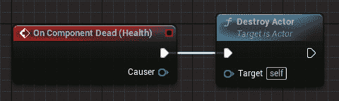

图 6.19 – 完全链接的事件

这个功能示例展示了如何使用事件委托来匿名通信，从而消除了在所有地方都需要对象引用的需求。有效地使用这种通信方法有助于减少代码库的耦合，使得随着时间的推移，随着更多内容的添加，它们更容易维护。

# 摘要

本章介绍了在代码库中清理通信的两种主要方法。我们已经介绍了如何在我们的 C++设置中使用接口和事件委托的功能示例，以及技术设置，正确使用接口的`U`和`I`前缀，以及每个委托特性的含义。现在功能理解已经整理好，下一步应该是通过使用这些工具来更好地理解它们如何影响代码库进行实践。我们将在下一章通过查看我们如何通过函数调用部署接口和事件委托，实现一个尽可能匿名的完美解耦系统，其中通信尽可能匿名。这自然地创造了模块化代码设计，使得团队内部更容易实现协同。
