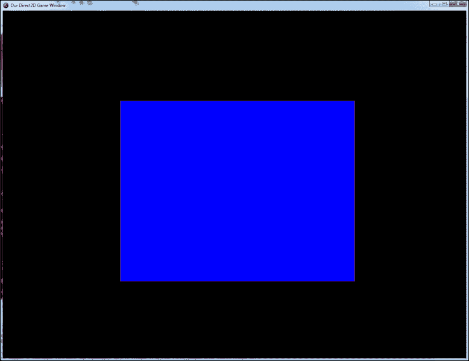
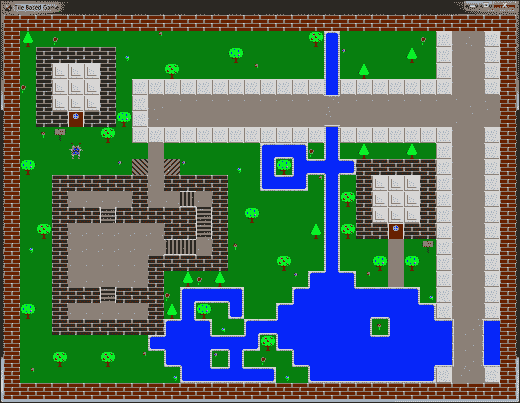
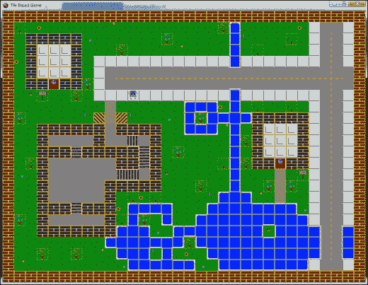

# 第三章。渲染 2D 图形

在视频游戏中，最大的一个方面就是图形。这也是为什么我们称之为视频游戏！那么我们如何在屏幕上创建图像呢？就像我们在上一章中处理用户输入一样，我们这里有几个选择。它们是**Direct2D**和**Direct3D**。在本章中，我们将专注于 Direct2D，并将 Direct3D 留到以后的章节中。

在本章中，我们将涵盖以下主题：

+   创建 Direct2D 游戏窗口类

+   在屏幕上绘制矩形

+   创建一个基于 2D 瓦片的游戏世界和实体

# 创建 Direct2D 游戏窗口类

我们终于准备好在屏幕上放置一些图形了！对我们来说，第一步是创建一个新的游戏窗口类，它将使用 Direct2D。这个新的游戏窗口类将派生自我们的原始游戏窗口类，同时添加 Direct2D 功能。

### 注意

您需要下载本章的代码，因为为了节省空间，一些代码被省略了。

打开 Visual Studio，我们将开始我们的`Ch03`项目。向`Ch03`项目添加一个名为`GameWindow2D`的新类。我们需要将其声明更改为：

```cpp
public class GameWindow2D : GameWindow, IDispoable
```

如您所见，它继承自`GameWindow`类，这意味着它具有`GameWindow`类的所有公共和受保护成员，就像我们在这个类中再次实现了它们一样。它还实现了`IDisposable`接口，就像`GameWindow`类一样。另外，如果您还没有这样做，请别忘了将 SlimDX 添加到这个项目中。

我们还需要在这个类文件顶部添加一些`using`语句。它们都是`GameWindow`类中相同的`using`语句，再加上一个。新的一个是`SlimDX.Direct2D`。它们如下所示：

```cpp
using System.Windows.Forms;
using System.Diagnostics;
using System.Drawing;
using System;
using SlimDX;
using SlimDX.Direct2D;
using SlimDX.Windows;
```

接下来，我们需要创建一些成员变量：

```cpp
WindowRenderTarget m_RenderTarget;
Factory m_Factory;
PathGeometry m_Geometry;
SolidColorBrush m_BrushRed;
SolidColorBrush m_BrushGreen;
SolidColorBrush m_BrushBlue;
```

第一个变量是一个`WindowRenderTarget`对象。术语**渲染目标**用于指代我们将要绘制的表面。在这种情况下，它就是我们的游戏窗口。然而，情况并不总是如此。游戏也可以渲染到其他地方。例如，将渲染到纹理对象用于创建各种效果。一个例子就是一个简单的安全摄像头效果。比如说，我们在一个房间里有一个安全摄像头，在另一个房间里有一个监视器。我们想让监视器显示安全摄像头所看到的内容。为此，我们可以将摄像头的视图渲染到纹理中，然后可以使用这个纹理来纹理化监视器的屏幕。当然，这必须在每一帧重新执行，以便监视器屏幕显示摄像头当前看到的内容。这个想法在 2D 中也很实用。

回到我们的成员变量，第二个是一个`Factory`对象，我们将用它来设置我们的 Direct2D 相关内容。它用于创建 Direct2D 资源，例如`RenderTargets`。第三个变量是一个`PathGeometry`对象，它将保存我们将要绘制的第一个图形的几何形状，这将是一个矩形。最后三个变量都是`SolidColorBrush`对象。我们使用这些对象来指定我们想要用其绘制的颜色。它们还有更多功能，但现阶段我们只需要这些。

## 构造函数

现在，让我们将注意力转向我们的 Direct2D 游戏窗口类的构造函数。它将做两件事。首先，它将调用基类构造函数（记住基类是原始的`GameWindow`类），然后初始化我们的 Direct2D 相关内容。以下是我们构造函数的初始代码：

```cpp
public GameWindow2D(string title, int width, int height,bool fullscreen)
    : base(title, width, height, fullscreen)
{
    m_Factory = new Factory();

    WindowRenderTargetProperties properties = new WindowRenderTargetProperties();
    properties.Handle = FormObject.Handle;
    properties.PixelSize = new Size(width, height);

    m_RenderTarget = new WindowRenderTarget(m_Factory, properties);
}
```

在前面的代码中，以冒号开始的行是在为我们调用基类构造函数。这确保了从基类继承的所有内容都被初始化。在构造函数的主体中，第一行创建了一个新的`Factory`对象，并将其存储在我们的`m_Factory`成员变量中。接下来，我们创建了一个`WindowRenderTargetProperties`对象，并将我们的`RenderForm`对象的句柄存储在其中。请注意，`FormObject`是我们定义在第一章，*入门*中`GameWindow`基类中的一个属性，但我们没有在书中详细讨论这个属性。你可以在本书的可下载代码中看到它。记住，`RenderForm`对象是一个 SlimDX 对象，它代表了一个我们可以绘制的窗口。下一行将游戏窗口的大小保存到`PixelSize`属性中。`WindowRenderTargetProperties`对象基本上是我们创建`WindowRenderTarget`对象时指定其初始配置的方式。构造函数中的最后一行创建我们的`WindowRenderTarget`对象，并将其存储在我们的`m_RenderTarget`成员变量中。我们传递的两个参数是我们刚刚创建的`Factory`对象和`WindowRenderTargetProperties`对象。`WindowRenderTarget`对象是一个指向窗口客户端区域的渲染目标。我们使用`WindowRenderTarget`对象在窗口中绘制。

## 创建我们的矩形

现在我们已经设置了渲染目标，我们准备开始绘制内容，但首先我们需要创建一些可以绘制的东西！因此，我们将在构造函数的底部添加一些额外的代码。首先，我们需要初始化我们的三个`SolidColorBrush`对象。在构造函数的底部添加以下三行代码：

```cpp
m_BrushRed = new SolidColorBrush(m_RenderTarget, new Color4(1.0f, 1.0f, 0.0f, 0.0f));
m_BrushGreen = new SolidColorBrush(m_RenderTarget, new Color4(1.0f, 0.0f, 1.0f, 0.0f));
m_BrushBlue = new SolidColorBrush(m_RenderTarget, new Color4(1.0f, 0.0f, 0.0f, 1.0f));
```

这段代码相当简单。对于每个画笔，我们传入两个参数。第一个参数是我们将在其上使用此画笔的渲染目标。第二个参数是画笔的颜色，它是一个 **ARGB**（**Alpha 红绿蓝**）值。我们给颜色的第一个参数是 `1.0f`。末尾的 `f` 字符表示这个数字是 `float` 数据类型。我们将 alpha 设置为 `1.0`，因为我们希望画笔是完全不透明的。值为 `0.0` 将使其完全透明，值为 `0.5` 将是 50% 透明。接下来，我们有红色、绿色和蓝色参数。这些都是在 `0.0` 到 `1.0` 范围内的 `float` 值。正如您所看到的，对于红色画笔，我们将红色通道设置为 `1.0f`，绿色和蓝色通道都设置为 `0.0f`。这意味着我们颜色中有最大红色，但没有绿色或蓝色。

我们已经设置了 `SolidColorBrush` 对象，现在我们有三个画笔可以用来绘制，但我们仍然缺少绘制的内容！所以，让我们通过添加一些代码来创建我们的矩形。将以下代码添加到构造函数的末尾：

```cpp
m_Geometry = new PathGeometry(m_RenderTarget.Factory);

using (GeometrySink sink = m_Geometry.Open())
{
    int top = (int) (0.25f * FormObject.Height);
    int left = (int) (0.25f * FormObject.Width);
    int right = (int) (0.75f * FormObject.Width);
    int bottom = (int) (0.75f * FormObject.Height);

    PointF p0 = new Point(left, top);
    PointF p1 = new Point(right, top);
    PointF p2 = new Point(right, bottom);
    PointF p3 = new Point(left, bottom);

    sink.BeginFigure(p0, FigureBegin.Filled);
    sink.AddLine(p1);
    sink.AddLine(p2);
    sink.AddLine(p3);
    sink.EndFigure(FigureEnd.Closed);
    sink.Close();
}
```

这段代码稍微长一些，但仍然相当简单。第一行创建了一个新的 `PathGeometry` 对象，并将其存储在我们的 `m_Geometry` 成员变量中。下一行开始 `using` 块，并创建了一个新的 `GeometrySink` 对象，我们将使用它来构建矩形的几何形状。`using` 块将在程序执行到达 `using` 块的末尾时自动为我们释放 `GeometrySink` 对象。

### 注意

`using` 块仅与实现 `IDisposable` 接口的对象一起工作。

接下来的四行计算矩形的每条边的位置。例如，第一行计算矩形顶边的垂直位置。在这种情况下，我们使矩形的顶边从屏幕顶部向下延伸的 25%。然后，我们对矩形的其他三边做同样的处理。第二组四行代码创建了四个 `Point` 对象，并使用我们刚刚计算出的值初始化它们。这四个 `Point` 对象代表矩形的角点。一个点也常被称为 **顶点**。当我们有多个顶点时，我们称它们为 **顶点**（发音为 *vert-is-ces*）。

最后一段代码有六行。它们使用我们刚刚创建的`GeometrySink`和`Point`对象来设置矩形在`PathGeometry`对象内部的几何形状。第一行使用`BeginFigure()`方法开始创建一个新的几何图形。接下来的三行各自通过添加另一个点或顶点来向图形添加一个线段。当所有四个顶点都添加完毕后，我们调用`EndFigure()`方法来指定我们已完成顶点的添加。最后一行调用`Close()`方法来指定我们已完成几何图形的添加，因为我们可能想要添加多个。在这种情况下，我们只添加了一个几何图形，即我们的矩形。

## 绘制我们的矩形

由于我们的矩形从不改变，所以我们不需要在我们的`UpdateScene()`方法中添加任何代码。无论如何，我们都会覆盖基类的`UpdateScene()`方法，以防我们以后需要在这里添加一些代码，如下所示：

```cpp
public override void UpdateScene(double frameTime)
{
    base.UpdateScene(frameTime);
}
```

如您所见，我们在这个基类`UpdateScene()`方法的`override`修饰符中只有一行代码。它只是调用基类版本的此方法。这很重要，因为基类的`UpdateScene()`方法包含我们每帧获取最新用户输入数据的代码，您可能还记得上一章的内容。

现在，我们终于准备好编写代码，将我们的矩形绘制到屏幕上了！我们将覆盖`RenderScene()`方法，以便我们可以添加我们的自定义代码：

```cpp
public override void RenderScene()

{
    if ((!this.IsInitialized) || this.IsDisposed)
    {
        return;
    }

    m_RenderTarget.BeginDraw();
    m_RenderTarget.Clear(ClearColor);
    m_RenderTarget.FillGeometry(m_Geometry, m_BrushBlue);
    m_RenderTarget.DrawGeometry(m_Geometry, m_BrushRed, 1.0f);
    m_RenderTarget.EndDraw();
}
```

首先，我们有一个`if`语句，碰巧与我们在基类的`RenderScene()`方法中放置的那个相同。这是因为我们没有调用基类的`RenderScene()`方法，因为其中唯一的代码就是这个`if`语句。不调用这个方法的基类版本将给我们带来轻微的性能提升，因为我们没有函数调用的开销。我们也可以用`UpdateScene()`方法做同样的事情。在这种情况下我们没有这样做，因为基类版本的该方法中有很多代码。在你的项目中，你可能想要将那段代码复制粘贴到你的`UpdateScene()`方法覆盖版本中。

下一条代码调用渲染目标的 `BeginDraw()` 方法，告诉它我们已准备好开始绘制。然后，在下一条代码中，我们通过填充由我们的 `GameWindow` 基类定义的 `ClearColor` 属性中存储的颜色来清除屏幕。最后三条代码绘制我们的几何形状两次。首先，我们使用渲染目标的 `FillGeometry()` 方法绘制它。这将使用指定的画笔（在这种情况下，纯蓝色）填充我们的矩形。然后，我们再次绘制矩形，但这次使用 `DrawGeometry()` 方法。这次只绘制形状的线条，不填充它，因此在矩形上绘制一个边框。`DrawGeometry()` 方法上的额外参数是可选的，并指定了我们正在绘制的线条的宽度。我们将其设置为 `1.0f`，这意味着线条将是一像素宽。最后一行调用 `EndDraw()` 方法，告诉渲染目标我们已经完成绘制。

## 清理

如同往常，当程序关闭后，我们需要自己清理。因此，我们需要添加基类 `Dispose(bool)` 方法的 `override`，就像我们在上一章所做的那样。我们已经做过几次了，所以这应该相当熟悉，这里不再展示。查看本章的可下载代码以查看此代码。



我们带有红色边框的蓝色矩形

如你所猜，你可以用绘制几何图形做更多的事情。例如，你可以绘制曲线线段，也可以使用渐变画笔绘制形状。你还可以使用渲染目标的 `DrawText()` 方法在屏幕上绘制文本。但由于这些页面空间有限，我们将探讨如何在屏幕上绘制位图图像。这些图像构成了大多数二维游戏图形的一部分。

# 位图渲染

我们不会简单地演示在屏幕上绘制单个位图，而是将创建一个小的二维基于瓦片的游戏世界。在二维图形中，瓦片是指代表二维世界中一个空间方格的小位图图像。**瓦片集**或**瓦片图**是一个包含多个瓦片的单个位图文件。单个二维图形瓦片也被称为**精灵**。要开始，请向 `SlimFramework` 解决方案中添加一个名为 `TileWorld` 的新项目。到目前为止，我们直接使用了我们制作的游戏窗口类。这次，我们将看看如何在现实世界的游戏项目中这样做。

向 `TileWorld` 项目添加一个新类文件，并将其命名为 `TileGameWindow.cs`。正如你可能猜到的，我们将使这个新类继承自 `SlimFramework` 项目中的 `GameWindow` 类。但首先，我们需要添加对 `SlimFramework` 项目的引用。我们已经讨论过这一点，所以请继续添加引用。别忘了也要添加对 SlimDX 的引用。如果你还没有，你还需要添加对 `System.Drawing` 的引用。另外，别忘了将 `TileWorld` 设置为启动项目。

接下来，我们需要将`using`语句添加到`TileGameWindow.cs`文件的顶部。我们需要添加以下`using`语句：

```cpp
using System.Windows.Forms;
using System.Collections,Generic;
using System.Diagnostics;
using System.Drawing;
using System;

using SlimDX;
using SlimDX.Direct2D;
using SlimDX.DirectInput;
using SlimDX.Windows;
```

接下来，我们需要创建几个结构体和成员变量。首先，让我们在这个类的顶部定义以下**常量**：

```cpp
const float PLAYER_MOVE_SPEED = 0.05f;
```

这个常量定义了玩家的移动速度。常量只是一个初始化后其值不能改变的变量，因此其值始终相同。现在，我们需要一个地方来存储关于我们的玩家角色的信息。我们将创建一个名为`Player`的结构体。只需在以下代码中将其添加到我们刚刚创建的常量下方：

```cpp
public struct Player
{
    public float PositionX;
    public float PositionY;
    public int AnimFrame;
    public double LastFrameChange;
}
```

这个结构体的前两个成员变量存储玩家在 2D 世界中的当前位置。`AnimFrame`变量跟踪玩家角色当前所在的动画帧，最后一个变量跟踪玩家角色在当前动画帧上的时间。这是为了确保动画的运行速度大致相同，无论您的 PC 速度有多快。

现在，我们需要在这个结构体下方添加第二个结构体。我们将把这个结构体命名为`Tile`。它存储单个瓦片的信息。正如你可能猜到的，我们将创建一个包含我们游戏世界中每种瓦片类型的结构体列表。以下是一个`Tile`结构体的示例：

```cpp
public struct Tile
{
    public bool IsSolid;
    public int SheetPosX;
    public int SheetPosY;
}
```

第一个变量表示这个瓦片是否是实心的。如果一个瓦片是实心的，这意味着玩家不能在其上或穿过它行走。例如，砖墙瓦片将设置为`true`，因为我们不希望玩家穿过砖墙！这个结构体的最后两个成员变量持有瓦片图像在瓦片图中的坐标。

接下来，让我们将注意力转向为`TileGameWindow`类创建成员变量。您可以将这些变量添加到我们刚刚创建的结构体下方，如下所示：

```cpp
WindowRenderTarget m_RenderTarget;
Factory m_Factory;

Player m_Player;
SlimDX.Direct2D.Bitmap m_PlayerSprites;
SlimDX.Direct2D.Bitmap m_TileSheet;

List<Tile> m_TileList;
int[ , ] m_Map;
SolidColorBrush m_DebugBrush;
```

前两个成员变量应该与我们本章开头编写的矩形程序中熟悉。`m_Player`变量持有`Player`对象。这是我们之前创建的第一个结构体。接下来的两个变量将持有我们将用于此程序的位图图像。一个持有组成玩家角色动画的精灵，另一个将持有我们将用于绘制游戏世界的瓦片图。下一个变量是一个名为`m_TileList`的列表。我们将为每种瓦片类型添加一个条目。`m_Map`变量，正如你可能猜到的，将包含我们的游戏世界地图。最后，我们有一个名为`m_DebugBrush`的`SolidColorBrush`成员变量。

## 初始化

现在，是时候创建构造函数并开始初始化一切了。首先，我们需要设置渲染目标。这与我们在创建矩形的程序中所做的方法非常相似，但略有不同。以下是一段代码：

```cpp
m_Factory = new Factory();

RenderTargetProperties rtProperties = new RenderTargetProperties();
rtProperties.PixelFormat = new PixelFormat(SlimDX.DXGI.Format.B8G8R8A8_UNorm, AlphaMode.Premultiplied);

WindowRenderTargetProperties properties = new WindowRenderTargetProperties();
properties.Handle = FormObject.Handle;
properties.PixelSize = new Size(width, height);

m_RenderTarget = new WindowRenderTarget(m_Factory, rtProperties, properties);

m_DebugBrush = new SolidColorBrush(m_RenderTarget, new Color4(1.0f, 1.0f, 1.0f, 0.0f));
```

正如我们在创建矩形的程序中所做的那样，我们首先创建工厂对象。然后，事情略有不同。这次我们需要创建两个属性对象而不是一个。新的一个是 `RenderTargetProperties` 对象。我们使用它来设置渲染目标的像素格式。正如你所见，我们正在使用一个 32 位格式，每个通道（蓝色、绿色、红色和 alpha）有 8 位。是的，这与我们之前讨论过的 ARGB 格式相反。不过没关系，因为我们的 `LoadBitmap()` 方法会为我们将 ARGB 格式翻转成 BGRA。下一行代码创建了一个 `WindowRenderTargetProperties` 对象，就像我们在本章早些时候的 *Rectangle* 程序中所做的那样。我们使用这个对象来指定我们想要绘制的窗口句柄以及窗口的大小。最后，我们创建渲染目标对象，并将我们的调试画笔初始化为不透明的黄色画笔。

那么，我们现在已经完成了初始化工作，对吧？嗯，不；还不是。我们还有一些东西需要初始化。但首先，我们需要创建我们的 `LoadBitmap()` 方法，这样我们就可以加载我们的图形了！以下就是代码：

```cpp
public SlimDX.Direct2D.Bitmap LoadBitmap(string filename)
{
    // This will hold the Direct2D Bitmap that we will return at the end of this function.SlimDX.Direct2D.Bitmap d2dBitmap = null;

    // Load the bitmap using the System.Drawing.Bitmap class.
      System.Drawing.Bitmap originalImage = new System.Drawing.Bitmap(filename);
    // Create a rectangle holding the size of the bitmap image.
    Rectangle bounds = new Rectangle(0, 0, originalImage.Width, originalImage.Height);

    // Lock the memory holding this bitmap so that only we are allowed to mess with it.
    System.Drawing.Imaging.BitmapData imageData = originalImage.LockBits(bounds, System.Drawing.Imaging.ImageLockMode.ReadOnly, System.Drawing.Imaging.PixelFormat.Format32bppPArgb);

    // Create a DataStream attached to the bitmap.
    SlimDX.DataStream dataStream = new DataStream(imageData.Scan0,  imageData.Stride * imageData.Height, true, false);

    // Set the pixel format and properties.
    PixelFormat pFormat = new PixelFormat(SlimDX.DXGI.Format.B8G8R8A8_UNorm, AlphaMode.Premultiplied);
    BitmapProperties bmpProperties = new BitmapProperties();
    bmpProperties.PixelFormat = pFormat;

    // Copy the image data into a new SlimDX.Direct2D.Bitmap object.
    d2dBitmap = new SlimDX.Direct2D.Bitmap(m_RenderTarget, new Size(bounds.Width, bounds.Height), dataStream, imageData.Stride, bmpProperties);

    // Unlock the memory that is holding the original bitmap object.
    originalImage.UnlockBits(imageData);

    // Get rid of the original bitmap object since we no longer need it.
    originalImage.Dispose();
    // Return the Direct2D bitmap.
    return d2dBitmap;
}
```

这个方法有点令人困惑，所以我保留了代码列表中的注释。你可能已经注意到，在调用 `LockBits()` 方法的行中，有一个像素格式参数，但它与我们本章稍早前看到的格式不同；它是 `System.Drawing.Imaging.PixelFormat.Format32bppPArgb`。这是我们正在使用的相同格式，但那里的 `P` 是什么意思呢？`P` 是指 **预先计算的 alpha**。这基本上意味着在渲染之前，红色、绿色和蓝色通道会根据 alpha 值自动调整。所以，如果你将红色通道设置为最大值，而 alpha 通道为 50%，红色通道的强度将减半。

还有 **直接 alpha**，它比预先计算的 alpha 效率低。红色、绿色和蓝色通道的值保持不变。它们的强度根据渲染时的 alpha 通道值进行调整。预先计算的 alpha 比较快，因为它在渲染发生之前只调整一次颜色通道，而直接 alpha 每次我们渲染新帧时都必须调整颜色通道。最后，还有一个 **忽略 alpha** 模式。在这个模式下，alpha 通道被完全忽略，因此你不能使用透明位图。

在这个情况下，我们正在使用预先计算的 alpha 模式，并且这很重要。如果你不这样做，玩家角色在机器人图像的所有透明区域都会有白色，这看起来相当滑稽。我们使用 `LockBits()` 方法锁定包含位图的内存，因为如果在另一个线程上的其他代码在访问该内存的同时我们在对其进行操作，这可能会导致崩溃和其他奇怪的行为。

现在，让我们回到构造函数，初始化玩家角色，它将是一个相当愚蠢的机器人。在构造函数的底部添加以下代码：

```cpp
m_PlayerSprites = LoadBitmap(Application.StartupPath + "\\Robot.png");

m_Player = new Player();
m_Player.PositionX = 4;
m_Player.PositionY = 8;
```

代码的第一行使用我们的`LoadBitmap()`方法来加载机器人精灵图集并将其存储在`m_PlayerSprites`成员变量中。第二行创建玩家对象以保存有关玩家角色的信息。最后两行设置玩家的起始位置。请注意，坐标（0，0）代表屏幕的左上角。机器人精灵图集只是我们机器人的一系列动画帧，我们将快速连续显示这些帧来动画化机器人。

现在玩家对象已经初始化，我们需要初始化游戏世界！以下代码是第一部分：

```cpp
m_TileSheet = LoadBitmap(Application.StartupPath + "\\TileSheet.png");

m_TileList = new List<Tile>();

// First row of sprites in the sprite sheet.
m_TileList.Add(new Tile() { IsSolid = false, SheetPosX = 0, SheetPosY = 0 });
m_TileList.Add(new Tile() { IsSolid = false, SheetPosX = 1, SheetPosY = 0 });
m_TileList.Add(new Tile() { IsSolid = false, SheetPosX = 2, SheetPosY = 0 });
m_TileList.Add(new Tile() { IsSolid = false, SheetPosX = 3, SheetPosY = 0 });
m_TileList.Add(new Tile() { IsSolid = false, SheetPosX = 4, SheetPosY = 0 });
m_TileList.Add(new Tile() { IsSolid = false, SheetPosX = 5, SheetPosY = 0 });
m_TileList.Add(new Tile() { IsSolid = false, SheetPosX = 6, SheetPosY = 0 });
m_TileList.Add(new Tile() { IsSolid = true, SheetPosX = 7, SheetPosY = 0 });
```

第一行再次调用我们的`LoadBitmap()`方法来加载瓦片图集并将其存储在`m_TileSheet`成员变量中。第二行创建我们的瓦片列表对象。这将存储有关每种瓦片类型的信息。底部八行代码在瓦片列表中为瓦片图集的第一行的所有瓦片创建条目。当然，瓦片图集中有不止一行瓦片，但在这里我不会展示其他行的代码，因为它非常相似，并且会占用几页纸。

为了完成初始化游戏世界，我们还有一件事要做。这包括初始化地图。地图简单地是一个二维数组。数组中的每个元素代表游戏世界中的一个瓦片位置。因此，数组的数据类型是`int`；它是`int`类型，因为每个元素存储一个瓦片列表中的数字索引。所以基本上，数组中的每个元素都包含一个数字，告诉我们游戏世界中这个位置上的瓦片类型。由于填充这个数组的代码太宽，无法适应页面，我将在这里展示一个简短的初始化示例：

```cpp
m_Map = new int[,] { {14, 14, 14 },
                     {14, 0, 14 },
                     {14, 14, 14 } };
```

如您所见，我们正在创建一个新的二维`int`数组。在这个示例代码中，我们有一个 3 x 3 的世界。我们使用瓦片类型`14`（一块砖墙瓦片）来围绕这个小世界的边缘建造墙壁。在中心，我们有瓦片类型`0`，在我们的游戏演示中，这是一个草地瓦片。每个值行都有一对括号`{}`，后面跟着一个逗号。这基本上就是设置 2D 瓦片地图的方法。当然，你可以使它更加复杂。例如，你可以在游戏中实现动画瓦片类型。这些动画将与我们将要动画化的机器人角色非常相似。查看本章的可下载代码，以查看完整的数组初始化代码，它比之前的示例要大得多。

## 渲染游戏世界

为了清晰起见，我们将创建几个不同的渲染方法，每个方法都将从我们的 `RenderScene()` 方法中调用。由于我们需要首先绘制的是游戏世界本身，让我们首先创建这个方法。我们将把这个方法命名为 `RenderWorld`：

```cpp
public void RenderWorld()
{
    Tile s;
    // Loop through the y axis.
    for (int y = 0; y < m_Map.GetLength(0); y++)
    {
        // Loop through the x axis.
        for (int x = 0; x < m_Map.GetLength(1); x++)
        {
            // Get the tile at the current coordinates.
            s = m_TileList[ m_Map[y, x] ];

            // Render the tile.
            m_RenderTarget.DrawBitmap(m_TileSheet,
                new Rectangle(x * 32, y * 32, 32, 32),
                1.0f,
                InterpolationMode.Linear,
                new Rectangle(s.SheetPosX * 32,
                              s.SheetPosY * 32,
                               32, 32));
        }
    }
}
```

这段代码相当直接。第一行创建了一个 `Tile` 对象变量。接下来，我们有两个嵌套的 `for` 循环，它们遍历游戏世界中每个瓦片的位置。在内层 `for` 循环中，我们获取地图上这个位置的瓦片类型，并在瓦片列表中查找它。我们将结果存储在变量 `s` 中，这样我们就可以方便地之后使用它。最后一行渲染瓦片。这里的第一个参数是包含瓦片的位图。第二个参数是一个矩形，指定我们在屏幕上想要绘制瓦片的位置。第三个参数是不透明度。我们将其设置为 `1.0f`，这样瓦片就完全不透明。第三个参数是插值模式。最后一个参数是另一个矩形，它指定我们在屏幕上想要绘制瓦片图的一部分。为此，我们指定包含我们想要绘制的瓦片的瓦片图的一部分。对于两个矩形参数的 x 和 y 坐标，你可能已经注意到我们正在乘以 32。这是因为每个瓦片的大小是 32 x 32 像素。因此，我们必须乘以 32 来正确获取瓦片在瓦片图中的位置。我们的瓦片大小为 32 x 32 像素的事实也是为什么我们在这里创建的两个矩形都指定了它们的 `width` 和 `height` 参数的值为 `32`。

## 渲染玩家角色

现在我们已经有了绘制世界的代码，我们需要绘制玩家角色！为此，我们将创建一个名为 `RenderPlayer()` 的方法。与 `RenderWorld()` 方法相比，这个方法相当简短。以下是对应的代码：

```cpp
public void RenderPlayer()
{
    // Render the player character.
    m_RenderTarget.DrawBitmap(m_PlayerSprites,
          new Rectangle((int) (m_Player.PositionX * 32),
                        (int) (m_Player.PositionY * 32),
                        32, 32),
                       1.0f,
                       InterpolationMode.Linear,new Rectangle(m_Player.AnimFrame * 32,
                                      0, 32, 32));
}
```

这个方法只包含一行。它与我们在 `RenderWorld()` 方法中用来绘制每个瓦片的代码非常相似。但这次我们使用的是玩家精灵图，而不是瓦片图。你可能也会注意到，我们是根据玩家对象的 `AnimFrame` 变量来确定要绘制哪个精灵的，我们使用这个变量来跟踪机器人当前所在的动画帧。

## 渲染调试信息

这并不是严格必要的，但了解如何做总是一件好事。我们将创建一个新的方法，称为 `RenderDebug()`。它将在游戏世界中每个实心瓦片上绘制一个黄色边框。以下是对应的代码：

```cpp
public void RenderDebug()
{
    Tile s;

     // Loop through the y axis.
     for (int y = 0; y < m_Map.GetLength(0); y++)
     {
         // Loop through the x axis.
         for (int x = 0; x < m_Map.GetLength(1); x++)
         {
             // Get the tile at the current coordinates.
             s = m_TileList[m_Map[y, x]];

             // Check if the tile is solid. If so, draw a yellow border on it.
             if (s.IsSolid)
                 m_RenderTarget.DrawRectangle(m_DebugBrush,
                     new Rectangle(x * 32, y * 32, 32, 32));
        }
    }
}
```

如你所见，这个方法看起来与 `RenderWorld()` 方法非常相似；它像那个方法一样遍历游戏世界中的每个位置。唯一的重大区别是我们在这里使用的是 `DrawRectangle()` 方法，而不是 `DrawBitmap()` 方法。使用我们的黄色调试画笔，它会在游戏世界中任何实心瓦片上绘制一个黄色边框。

## 完成渲染代码

现在我们需要在`RenderScene()`方法中添加代码来调用我们刚才创建的方法。以下是`RenderScene()`代码：

```cpp
public override void RenderScene()
{
    if ((!this.IsInitialized) || this.IsDisposed)
    {
        return;
    }

    m_RenderTarget.BeginDraw();
    m_RenderTarget.Clear(ClearColor);

    RenderWorld();

#if DEBUG
    RenderDebug();
#endif

    RenderPlayer();

    // Tell the render target that we are done drawing.
    m_RenderTarget.EndDraw();
}
```

有了这些，我们的渲染代码现在已经完成。顶部的`if`语句防止程序在启动或关闭时崩溃。接下来的两行通过调用`BeginDraw()`方法通知渲染目标我们准备开始绘制，然后通过调用`Clear()`方法清除屏幕。下一行调用我们的`RenderWorld()`方法来绘制游戏世界。但是，调用`RenderDebug()`方法之前是`#if DEBUG`，之后是`#endif`。这些被称为**预处理器指令**。这个指令检查一个名为`DEBUG`的符号是否已定义，如果是，则这个`if`指令内部的代码将被编译进程序。预处理器指令由**预处理器**处理，它在编译代码之前运行。预处理器完成工作后，编译器将运行。除了`#if`之外，还有许多其他的预处理器指令，但它们超出了本文的范围。当你以`Debug`配置编译代码时，`DEBUG`符号会自动为我们定义，这意味着我们的`RenderDebug()`调用将被编译进游戏。在 Visual Studio 中，你可以通过点击位于**开始**按钮右侧的下拉列表框来更改编译配置，点击该按钮以编译和运行你的程序。Visual Studio 提供`Debug`和`Release`配置。你也可以通过按*F5*键来运行程序。

下一行调用我们的`RenderPlayer()`方法，使用机器人精灵图集中的适当动画帧来绘制玩家角色。最后，我们调用`EndDraw()`方法来告知渲染目标我们已经完成了这一帧的渲染。

## 处理用户输入

现在，我们需要在我们的`UpdateScene()`方法中添加一些代码来处理玩家输入：

```cpp
base.UpdateScene(frameTime);

// Figure out which grid square each corner of the player sprite is currently in.
PointF TL = new PointF(m_Player.PositionX + 0.25f, m_Player.PositionY + 0.25f); // Top left corner
PointF BL = new PointF(m_Player.PositionX + 0.25f, m_Player.PositionY + 0.75f); // Bottom left corner
PointF TR = new PointF(m_Player.PositionX + 0.75f, m_Player.PositionY + 0.25f); // Top right corner
PointF BR = new PointF(m_Player.PositionX + 0.75f, m_Player.PositionY + 0.75f); // Bottom right corner
```

第一行调用基类的`UpdateScene()`方法，以便它能够执行其功能。接下来的四行可能看起来有些奇怪。为什么我们需要找出玩家精灵每个角落所在的网格方块？这与我们的玩家移动方式有关。具体来说，这是由我们的碰撞检测代码使用的。

你可能也会注意到，前四行代码将四个角落向内倾斜了 25%。你可以将这些四个角落视为我们的碰撞检测边界框。以这种方式缩小边界框使得玩家更容易进入只有一格宽的狭窄空间。注意，`TL`代表左上角，`TR`代表右上角，`BL`代表左下角，`BR`代表右下角。以下是我们碰撞检测代码的第一部分：

```cpp
// Check if the user is pressing left.
if (m_UserInput.KeyboardState_Current.IsPressed(Key.A) ||
   (m_UserInput.KeyboardState_Current.IsPressed(Key.LeftArrow)))
{
    if ((!m_TileList[m_Map[(int) TL.Y, (int) (TL.X - PLAYER_MOVE_SPEED)]].IsSolid) && (!m_TileList[m_Map[(int) BL.Y, (int) (BL.X – PLAYER_MOVE_SPEED)]].IsSolid)){
         m_Player.PositionX -= PLAYER_MOVE_SPEED;
     }
}
```

这段代码从一个复合的`if`语句开始，检查用户是否按下了*A*键或左箭头键。是的，你可以使用*W*、*A*、*S*或*D*键，或者如果你希望使用键盘移动角色，可以使用箭头键来控制我们的游戏角色。接下来，我们还有一个`if`语句。这个`if`语句检查将玩家向左移动是否会导致碰撞。如果没有，我们就将玩家向左移动。正如你所见，我们使用了我们在本章早期创建的`PLAYER_MOVE_SPEED`常量来控制机器人移动的距离。显然，我们需要再添加三个这样的`if`语句来处理右、上和下方向。由于代码非常相似，这里我就不再描述了。

### 注意

本章的可下载代码也支持使用摇杆/游戏手柄来控制机器人。它向`TileGameWindow`类添加了一个名为`m_UseDirectInput`的成员变量。将此变量设置为`true`以使用 DirectInput 进行摇杆/游戏手柄控制，或将此变量设置为`false`以使程序使用 XInput 进行摇杆/游戏手柄控制。我们需要`m_UseDirectInput`成员变量，因为如果我们同时使用 DirectInput 和 XInput 来控制同一个游戏控制器设备，这将导致玩家每帧移动两次。

## 玩家角色的动画

用户输入和碰撞检测代码完成后，现在在`UpdateScene()`中只剩下一件事要做。我们需要添加一些代码来动画化玩家角色：

```cpp
m_Player.LastFrameChange += frameTime;
if (m_Player.LastFrameChange > 0.1)
{
    m_Player.LastFrameChange = 0;
    m_Player.AnimFrame++;
    if (m_Player.AnimFrame > 7)
       m_Player.AnimFrame = 0;
}
```

这段代码相当简单。第一行将`frameTime`添加到玩家对象的`LastFrameChange`变量中。记住，`frameTime`是`UpdateScene()`方法的参数，它包含了自上一帧以来经过的时间量。接下来，我们有一个`if`语句，检查玩家对象的`LastFrameChange`变量是否有大于`0.1`的值。如果是这样，这意味着自上次我们更改动画帧以来已经过去了 1/10 秒或更长时间，因此我们将再次更改它。在`if`语句内部，我们将`LastFrameChange`变量重置为`0`，这样我们就会知道何时再次更改动画帧。下一行增加玩家对象的`AnimFrame`变量的值。最后，我们还有一个`if`语句，检查`AnimFrame`变量的新值是否太大。如果是，我们将它重置为`0`，动画从头开始。

## 运行游戏

我们几乎准备好运行游戏了，但别忘了你需要添加`Dispose(bool)`方法。在这个程序中，只有四个对象需要释放。它们是`m_RenderTarget`、`m_Factory`、`m_TileSheet`和`m_DebugBrush`。它们应该在`Dispose(bool)`方法的托管部分被释放。你可以在本章的可下载代码中看到这一点。

在清理代码就绪后，我们就可以运行游戏了。正如你所见，你控制着一个相当滑稽的机器人。请注意，玩家精灵在`Robot.png`文件中，而瓦片图集保存在`TileSheet.png`文件中。当然，这两个文件都包含在本章可下载的代码中。随后的截图显示了关闭调试覆盖层时的游戏窗口外观。

你可能已经注意到我们没有实现全屏模式。这是因为 Direct2D 不幸地不支持全屏模式。然而，在 Direct2D 应用程序中实现全屏模式是可能的。要做到这一点，你需要创建一个 Direct3D 渲染目标并将其与 Direct2D 共享。这样你就可以用 Direct2D 在上面绘制，并且能够使用全屏模式。



运行中的 2D 游戏

下面的截图显示了开启调试覆盖层时的游戏。



开启调试覆盖层时的 2D 游戏运行情况

# 实体

我们创建的这个 2D 游戏演示中只有一个**实体**（玩家角色）。在游戏开发中，实体这个术语指的是可以与游戏世界或其他游戏世界中的对象交互的对象。实体通常会被实现为一个类。因此，我们会创建一个类来表示我们的玩家对象。在这个演示中，我们的玩家对象非常简单，里面没有方法，所以我们只是将它做成一个结构体。在一个真正的游戏引擎中，你可能会有一个`Entity`基类，所有其他的实体类都会从这个基类继承。这个基类会定义如`Update()`和`Draw()`等方法，以便每个实体都有这些方法。然后每个实体类会重写它们以提供自己的自定义更新和绘制代码。

一个单独的水平或游戏世界可以有数百个实体，那么我们如何管理它们呢？一种方法是为当前加载的水平或世界中的实体集合创建一个`EntityManager`类。`EntityManager`类将有一个`Update()`方法和一个`Draw()`方法。`Update()`方法当然会被我们的游戏窗口类的`UpdateScene()`方法每帧调用一次。同样，`Draw()`方法也会被`RenderScene()`方法每帧调用一次。实体管理器的`Update()`方法会遍历所有实体并调用每个实体的`Update()`方法，以便实体可以更新自己。当然，实体管理器的`Draw()`方法也会做同样的事情，但它会调用每个实体的`Draw()`方法，以便实体可以绘制自己。

在一些游戏中，实体可以通过某种消息系统相互通信。一个很好的例子是《半条命 2》中使用的输入和输出系统。例如，在门旁边墙上有一个按钮。我们将在按钮上设置一个输出，当按钮被按下时触发。我们将将其连接到门的输入，使门打开。所以，基本上，当按钮的输出触发时，它会激活门上的指定输入。简而言之，按钮向门发送一条消息，告诉它打开。一个对象的输出可以潜在地向其目标输入发送参数。这里的重大好处是，许多对象之间的交互可以像这样处理，并且不需要专门编码，而只需在游戏关卡编辑器中简单设置即可。

## 基于组件的实体

实现我们的实体还有另一种方法。它实现了一个用于表示任何可能实体的`Entity`类。不同之处在于，这个`Entity`类包含了一组`Components`。**组件**是一个类，它代表游戏世界中一个对象可以拥有的特定动作或特性。例如，你可能有一个**装甲**组件，允许实体拥有装甲值，或者一个**健康**组件，允许实体拥有健康和承受伤害的能力。这个健康组件可能有一个属性来设置实体的最大健康值，另一个属性用于获取实体的当前健康值。

这是一种非常强大的方法，因为你可以通过将健康组件（以及承受伤害的能力）添加到任何实体中，来赋予任何实体健康（和承受伤害的能力）。所以，正如你所看到的，每个实体都由基本的`Entity`类表示，并从添加到其中的组件中获得所有特性和属性。这就是这种方法如此强大的原因。你只需编写一次健康代码，然后就可以在任意数量的实体上重用它，而无需为每个实体重新编写。然而，基于组件的实体编程比常规实体要复杂一些。例如，我们需要在`Entity`类上添加一个方法，让你可以传入一个组件类型来指定你想要访问哪个组件。然后它会找到指定类型的组件，并将其返回给你使用。你通常会设计你的实体系统，使其不允许一个实体拥有任何给定类型的多个组件，因为这通常也没有太多意义。例如，给一个实体添加两个健康组件就没有太多意义。

# 摘要

在本章中，我们首先创建了一个简单的演示应用程序，它在屏幕上绘制了一个矩形。然后，我们变得更加雄心勃勃，构建了一个基于 2D 瓦片的游戏世界。在这个过程中，我们介绍了如何在屏幕上渲染位图、基本的碰撞检测以及回顾了一些基本的用户输入处理。我们还探讨了如何创建一个实用的调试覆盖层。当然，这个调试覆盖层相当简单，但它们可以显示各种有用的信息。当涉及到解决 bug 时，它们是非常强大的工具。在下一章中，我们将探讨播放音乐和音效，以增加我们在这章中构建的 2D 游戏世界的活力！
