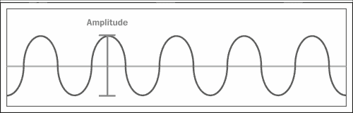
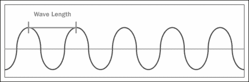
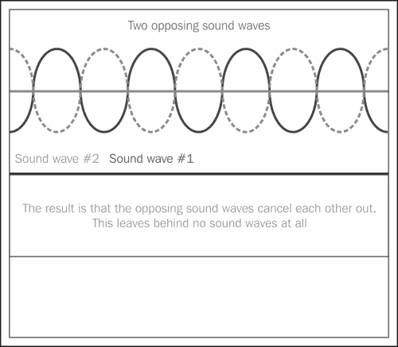

# 第四章：添加声音

如您无疑已经注意到的，我们在上一章中制作的那个小游戏演示在没有声音的情况下显得有些死气沉沉。这说明了声音和音乐对于创造游戏完整体验的重要性。音乐为场景设定了基调，而音效则为游戏世界增添了更多深度。

在本章中，我们将涵盖以下主题：

+   DirectSound 与 XAudio2 的比较

+   声音的基本原理

+   DirectSound

+   XAudio2

# DirectSound 与 XAudio2 的比较

与用户输入和图形渲染一样，在声音方面我们也有一些选择；它们是 **DirectSound** 和 **XAudio2**。所以，让我们来看看这两个。

首先，是 DirectSound。当 DirectSound 开发时，游戏音频仍然相当简单。当游戏世界中发生特定事件时，游戏会播放一个单一的 `.wav` 音频文件，DirectSound 允许如果你的 PC 中有声音卡，通过将声音处理从 **CPU**（中央处理单元）卸载到声音卡来提高性能。这与图形卡处理图形的方式非常相似，允许 CPU 做其他事情。

随着时间的推移，PC 和游戏机的处理能力都大幅提升，DirectSound 所使用的简单声音模型对于游戏开发者开始创建的日益复杂的音效系统来说已经不够用了。

在开发 Xbox 360 游戏机的过程中，微软意识到 DirectSound 简直无法满足需求。因此，他们创建了 XAudio 来满足视频游戏行业中作曲家和音效设计师日益增长的需求。同时，Windows Vista（代号 **Longhorn**）也在开发中。负责该项目的团队创建了一个新的音频 API，称为 **Longhorn 可扩展音频处理器**。

Xbox 360 和 Windows Vista 推出不久后，微软将注意力重新转向创建一个跨平台音频 API 以取代 DirectSound 的想法。他们从 Xbox 360 游戏开发者那里收到了对 XAudio API 的积极反馈，但与此同时，Longhorn 可扩展音频处理器 API 在 XAudio 上有一些优势，例如提供更流畅、更高效的音频引擎以及 XAudio 所不具备的一些附加功能。因此，微软决定取两者之长，XAudio2 就是结果。

因此，这显然意味着我们肯定想使用 XAudio2，对吧？答案是肯定的，但这并不是全部答案。但这又引出了另一个潜在的问题：为什么 DirectSound 仍然包含在 DirectX 中，尽管它已经被取代了？答案是，当然是为了向后兼容。如果从 DirectX 中移除 DirectSound，将破坏所有使用 DirectSound API 编写的应用程序。他们保留它，以便这些应用程序仍然可以工作。

正如我所说的，XAudio2 并不是我们为游戏音效需求应该使用的 API 的完整解决方案。你可能希望支持 DirectSound，以适应可能拥有较老系统的用户。然而，正如之前提到的，XAudio2 是一个多平台 API。你可以使用它来处理 Xbox 360、Windows Phone 和 Windows PC（Windows XP 及以上版本）应用程序的音效需求。

为了完整性，我们将在本章中查看 DirectSound 和 XAudio2，但首先让我们看看声音究竟是什么以及它的某些属性。

# 声音的基本原理

在我们开始进行声音编程之前，让我们先了解声音的基本原理。在我们开始声音编程之前，我们需要对声音有一个基本了解。

声音由波组成。**声波**本质上就是通过空气传播的压力波。当它撞击你的耳膜时，大脑就会接收到一个信号，告诉它有关撞击它的声波。大脑将这个信息转换成我们认为是声音的东西。

我们赋予声音的最常见属性之一是**音量**的概念。那么，音量究竟是什么呢？简单来说，它就是声波的振幅。如果你想象一下声波的图示，波的高度就是它的振幅。换句话说，振幅就是波的大小。查看以下图表以了解这一点：



声波的振幅或音量

声音的另一个非常重要的属性是**频率**的概念。因此，在波的图示中，波长就是波有多宽，波的长度决定了它们的频率。频率指的是波撞击的频率，而不是单个波的长度。声波的频率越高，声音的**音调**就越高。同样，低频声音的音调较低。音调这个术语当然指的是声音的高低。以下图表展示了频率的概念：



声波的波长或频率

频率以**赫兹**（**Hz**）为单位测量。赫兹这个术语通常意味着每秒的周期数。所以，如果一个声音的频率是 100 Hz，这意味着每秒有 100 个声波撞击我们的耳膜。赫兹这个单位可以应用于任何发生规律的事件，比如时钟的滴答声、心脏的跳动或计算机处理器的速度。现代计算机处理器的速度通常以**千兆赫兹**（**GHz**）表示。如果你考虑到 1 千赫兹（**KHz**）是 1,000 Hz，1 兆赫兹是 1,000 千赫兹（或 1 百万赫兹），1 千兆赫兹是 1,000 兆赫兹（或 10 亿赫兹），那么这相当快。人类的听觉范围平均在 20 到 20,000 Hz 之间。

好吧，既然你的脑袋可能已经“赫兹”了，那就足够了。明白了吗？无论如何，我们现在知道声音的频率是什么了。那么，让我们继续前进，看看**立体声**的概念。

# 立体声音

当立体声播放声音时，这意味着声音有两个通道：一个通道由左扬声器播放，另一个通道由右扬声器播放。这给听众带来了一定的 3D 效果。换句话说，声音由两个独立的声音轨道组成，每个扬声器一个。

这引出了**相位**的概念。你可以将其视为指声音中的通道彼此同步的程度。如果通道完全同步，则称它们为**同相**。否则，它们被称为**异相**。所以如果你将其中一个通道延迟一秒钟的几分之一，你的声音就处于异相，因为左右扬声器中的声音没有正确同步。

声音还有一个有趣的特性，我们将简要探讨。它与相位的概念直接相关。以下图表展示了这一点：



在前面的图中，我们有两套声波：一个是连续的，另一个是点划线的。正如你所见，点划线的是连续波的倒置。所以结果是，我们有两个音频轨道，其中一个与另一个具有相反的相位。那么当我们播放这个声音时会发生什么？什么也没有！没错，绝对什么也没有。为什么？因为相反相位的声波会相互抵消。换句话说，如果两个相同幅度和频率的声波相遇，但其中一个被倒置，那么它们会相互抵消。前面图表的后半部分展示了这一点。由于它们相互抵消，所以没有声波留下，因此我们得到了静音。

# DirectSound

我们将向上一章创建的 2D 世界中添加一些简单的声音。所以，打开 Visual Studio，让我们开始吧！

### 注意

在我们开始之前，应该注意的是，我们在这章使用的音乐轨道（`lost_village_128.wav`）由 [`wrathgames.com/blog`](http://wrathgames.com/blog) (*WrathGames Studio*) 提供。所以，非常感谢他们。

当然，这个声音文件包含在本章可下载的代码中。

打开 `TileGameWindow.cs` 文件。首先，我们需要在文件顶部添加以下 `using` 语句，以便我们可以使用 DirectSound：

```cpp
using SlimDX.DirectSound;
using SlimDX.Multimedia;
```

现在，我们需要向这个类添加一些新的成员变量。我们将首先添加一个名为 `m_UseDirectSound` 的布尔变量。这个变量可以设置为 `true` 或 `false`。当它设置为 `true` 时，程序将使用 DirectSound；如果这个变量设置为 `false`，程序将使用 XAudio2。以下是这个变量的声明：

```cpp
bool m_UseDirectSound = true; 
```

接下来，我们需要创建三个额外的成员变量来存储我们的 `DirectSound` 对象。具体如下：

```cpp
DirectSound m_DirectSound;  
PrimarySoundBuffer m_DSoundPrimaryBuffer; 
SecondarySoundBuffer m_DSoundBuffer;
```

第一个变量将存储我们的 `DirectSound` 对象。第二个是主要声音缓冲区，第三个变量是一个次要声音缓冲区，它将存储我们想要播放的声音。

现在，我们将向`TileGameWindow`类添加一个名为`InitDirectSound()`的新方法。以下是它的代码：

```cpp
public void InitDirectSound()
{
    // Create our DirectSound object.
    m_DirectSound = new DirectSound();

    // Set the cooperative level.
    m_DirectSound.SetCooperativeLevel(m_Form.Handle, SlimDX.DirectSound.CooperativeLevel.Priority);

    // Create the primary sound buffer.
    SoundBufferDescription desc = new SoundBufferDescription();
    desc.Flags = SlimDX.DirectSound.BufferFlags.PrimaryBuffer;
    m_DSoundPrimaryBuffer = new PrimarySoundBuffer(m_DirectSound, desc);

    // Create our secondary sound buffer.
    using (WaveStream wavFile = new WaveStream(Application.StartupPath + "\\" + "lost_village_128.wav"))
    {
        SoundBufferDescription DSoundBufferDesc;
        DSoundBufferDesc = new SoundBufferDescription();
        DSoundBufferDesc.SizeInBytes = (int) wavFile.Length;
        DSoundBufferDesc.Flags = SlimDX.DirectSound.BufferFlags.ControlVolume;
        DSoundBufferDesc.Format = wavFile.Format;

        m_DSoundBuffer = new SecondarySoundBuffer(m_DirectSound, DSoundBufferDesc);

        // Now load the sound.
        byte[] wavData = new byte[DSoundBufferDesc.SizeInBytes];
        wavFile.Read(wavData, 0, (int)wavFile.Length);
        m_DSoundBuffer.Write(wavData, 0, LockFlags.None);

        // Play our music and have it loop continuously.
        m_DSoundBuffer.Play(0, SlimDX.DirectSound.PlayFlags.Looping);
    }

}
```

此方法的第一行创建了我们的`DirectSound`对象。

### 提示

在一个真正的程序中，您将会有比我们在这本书中的演示中更好的错误处理。为了节省空间，这部分内容已被省略。

在这种情况下，我们需要处理创建`DirectSound`对象失败的情况。例如，当用户在其系统中未安装 DirectSound 兼容的声音卡时，这可能会发生。如果发生这种情况，SlimDX 将抛出一个`DirectSound`异常（或错误）。我们可以通过在初始化代码周围放置一个`try`块来捕获异常，如下所示：

```cpp
try
{
    // Create our DirectSound object.
    m_DirectSound = new DirectSound();
}
catch (DirectSoundException dsException)
{
    return;
}
```

在`catch`块内部，我们输入我们的代码来处理错误条件。在这种情况下，我们只是让构造函数返回而不完成初始化。这可以防止程序崩溃，但它仍然不会工作，对吧？（它不会有声音。）所以，基本上，如果`DirectSound`对象的初始化失败，`catch`块中的代码将会运行。

在现实世界的应用程序中，错误处理非常重要，所以不要忘记它！

接下来，我们设置协作级别。协作级别决定了系统允许此程序使用设备的程度。这是因为 Windows 是一个多任务环境，因此可能有多个应用程序同时使用声音设备。协作级别是系统确保我们不会有两个程序试图在完全相同的时间使用设备的方式，因为这可能会引起问题。如您所见，我们在这里将协作级别设置为`CooperativeLevel.Priority`。如果您应用程序是一个游戏，通常您会希望将其设置为这个值。

下三行代码创建我们的`PrimarySoundBuffer`对象，并给它赋予`BufferFlags.PrimaryBuffer`标志。

下一段代码设置了我们的`SecondarySoundBuffer`对象。它从一个`using`块开始，该块创建了一个使用我们的声音文件的`WaveStream`对象。在`using`块内部，我们创建了一个`SoundBufferDescription`对象，我们将使用它来指定创建`SecondarySoundBuffer`对象时的属性。我们将`SizeInBytes`属性设置为我们的波形文件的大小。然后，我们将`Flags`属性设置为具有`BufferFlags.ControlVolume`标志。设置此标志允许我们控制声音的音量。当然，还有其他缓冲区标志。一些例子包括`ControlPan`，它允许您控制声音的左右平衡，`ControlFrequency`，它允许您控制声音的频率，以及`ControlEffects`，它允许您对声音应用效果。

接下来，我们从`WaveStream`对象获取波形格式，并将其复制到`SoundBufferDescription`对象的`Format`属性中。然后，我们使用`DirectSound`对象和刚刚填写好的`SoundBufferDescription`对象创建`SecondarySoundBuffer`对象。

下一段代码加载我们的声音文件。这里的第一行创建了一个与波形文件大小相同的字节数组。下一行将波形文件中的所有数据读取到字节数组中。第三行将数据从字节数组复制到我们的`SecondarySoundBuffer`对象中。这里的第二个参数是我们想要开始写入数据的缓冲区偏移量。由于我们想要从缓冲区的开始处开始，我们指定`0`。如果我们指定`10`，波形数据将从缓冲区开始处的`10`个字节处写入。

最后的行通过调用其`Play()`方法来告诉`SecondarySoundBuffer`对象开始播放我们的声音。第一个参数是此声音的优先级。第二个参数指定了影响声音播放方式的标志。在这种情况下，我们使用`PlayFlags.Looping`来使我们的音乐连续循环。

### 注意

你需要确保你的声音文件正确设置了循环。如果一个声音文件不是为循环设计的，那么当它循环回起点时可能听起来不太好。一个为循环设计的声音文件在结尾处有一个平滑的过渡，这样结尾可以很好地过渡到开始，从而使声音可以无缝重复。

`SecondarySoundBuffer`对象还有其他方法。例如，`Pause()`方法将暂停声音。当你再次开始播放时，它将从上次停止的地方继续播放。另一方面，`Stop()`方法停止播放并将声音回滚到其开始处。所以当你再次开始播放声音时，它将从开始处重新开始。

在这一点上，我们需要回到构造函数中添加一行代码来调用我们刚刚创建的`InitDirectSound()`方法。为此，我们只需在构造函数的末尾添加以下`if`语句：

```cpp
if (m_UseDirectSound)
    InitDirectSound();
```

尽管如此，我们还没有完全完成。我们仍然需要在完成使用`DirectSound`对象后将其释放。因此，将以下代码添加到我们的`Dispose(bool)`方法的托管部分：

```cpp
if (m_DSoundBuffer != null)
    m_DSoundBuffer.Dispose();

if (m_DSoundPrimaryBuffer != null)
    m_DSoundPrimaryBuffer.Dispose();

if (m_DirectSound != null)
    m_DirectSound.Dispose();
```

到这里，我们的 DirectSound 代码就完成了。如果你现在运行程序，你应该会注意到在我们的 2D 基于瓦片的世界上正在播放音乐。你也可能注意到，如果窗口失去焦点，音乐将会暂停。如果你再次点击窗口以将其聚焦，音乐将从上次停止的地方重新开始播放。

我们还应该讨论声音缓冲区的`Status`属性，你可以通过它来获取声音缓冲区的当前状态。例如，你可以使用它来检查声音是否正在播放或循环，以及其他事项。

## 音量控制

在本节代码中，我们提到了几个缓冲区标志，并在我们的 `SecondarySoundBuffer` 对象上设置了 `BufferFlags.ControlVolume` 标志，这告诉 DirectSound 我们想要改变声音音量的能力。我们实际上并没有修改这个设置，但要改变音量，您只需更改声音缓冲区的 `Volume` 属性的值。在 DirectSound 中，音量以分贝（dB）的百分之一来指定。此属性的合法范围是 `0` 到 `10,000`。请注意，`10,000` 的最大值代表声音的原始音量。如您所见，这意味着 DirectSound 不支持放大，正如他们的文档中所述。

## 频率控制

这与控制音量类似。您可以通过设置 `BufferFlags.ControlFrequency` 标志并更改声音缓冲区的 `Frequency` 属性的值来改变声音的频率。此属性的值的有效范围是 `100` 到 `100,000`。如果您想使用音频轨道的原始频率，请将此属性设置为 `0`。如果您想将声音的播放速度加倍，例如，您需要将其频率加倍。

## 平衡控制

如果在缓冲区上设置了 `BufferFlags.ControlPan` 标志，您可以通过编辑声音缓冲区的 `Pan` 属性来改变声音的左右平衡。如果您将其向右移动，声音将比左扬声器更多地从右扬声器输出。此属性的值的有效范围是 `-10,000` 到 `10,000`。在 `-10,000` 时，声音将只从左扬声器输出，在 `10,000` 时将只从右扬声器输出。`0` 的值指定中心，换句话说，声音将从两个扬声器中均匀输出。

当然，除了这些之外，还有更多标志和其他可以应用于您声音的效果，但我们没有足够的空间在这里介绍它们。这些标志都在 `BufferFlags` 枚举中定义。

### 注意

在您可以使用这些各种控制来调整声音之前，需要设置之前提到的适当缓冲区标志。

# XAudio2

XAudio2 当然比 DirectSound 更新且功能更强大。我们将向我们在本章第一部分工作的同一文件（`TileGameWindow.cs`）中添加一些代码。

如同往常，我们首先需要在文件顶部添加一些 `using` 语句，以便我们可以使用 XAudio2。

```cpp
using SlimDX.XAudio2;
```

接下来，我们将创建一些成员变量来保存我们的 `XAudio2` 对象。这次有四个。

```cpp
XAudio2 m_XAudio2;
MasteringVoice m_MasteringVoice;
AudioBuffer m_AudioBuffer;
SourceVoice m_SourceVoice;
```

第一个，`m_XAudio2`，将保存我们的 `XAudio2` 对象。第二个将保存我们的**主音**。在 XAudio2 中，`MasteringVoice` 类用于表示声音输出设备。第三个变量是我们将存储声音的缓冲区。最后，我们有一个 `SourceVoice` 对象。这是用于将音频数据提交给 `MasteringVoice` 对象进行处理的。

下一步我们应该做的是编辑我们在本章早期构造函数底部添加的`if`语句。以下代码需要更改：

```cpp
if (m_UseDirectSound)
    InitDirectSound();
```

必须进行以下更改：

```cpp
if (m_UseDirectSound)
    InitDirectSound();
else
    InitXAudio2();
```

这个更改使得当`m_UseDirectSound`成员变量设置为`false`时，程序将使用 XAudio2 而不是 DirectSound。所以，去到类文件的顶部，找到那个变量，并将其值更改为`false`。

处理完这些后，我们需要创建`InitXAudio2()`方法，以便如果`m_UseDirectSound`变量设置为`false`，该方法将被调用。以下是这个方法的代码：

```cpp
public void InitXAudio2()
{
    // Create the XAudio2 object.
    m_XAudio2 = new XAudio2();

    // Check that we have a valid sound device to use.
    if (m_XAudio2.DeviceCount == 0)
        return;

    // Create our mastering voice object. This object represents the sound output device.
    m_MasteringVoice = new MasteringVoice(m_XAudio2);

    // Open the .wav file that contains our sound.
    using (WaveStream wavFile = new WaveStream(Application.StartupPath + "\\" + "lost_village_128.wav"))
    {
        // Create the audio buffer and store the audio data from the file in it.
        m_AudioBuffer = new AudioBuffer();
        m_AudioBuffer.AudioData = wavFile;
        m_AudioBuffer.AudioBytes = (int) wavFile.Length;

        // Setup our audio buffer for looping.
        m_AudioBuffer.LoopCount = XAudio2.LoopInfinite;

        // Create the source voice object. This is used to submit our audio data to the
        // mastering voice object so we can play it.
        m_SourceVoice = new SourceVoice(m_XAudio2, wavFile.Format);
        m_SourceVoice.SubmitSourceBuffer(m_AudioBuffer);
        m_SourceVoice.Start();
    }
}
```

这个方法可能有点令人困惑，所以我保留了之前代码列表中的注释。正如你所见，我们首先创建我们的 XAudio2 对象。然后，我们有一个`if`语句，检查是否有任何有效的声音设备可以使用。如果没有，那么`XAudio2`对象的`DeviceCount`属性将返回`0`。在这种情况下，如果没有声音设备可用，我们只需返回，并不要尝试继续初始化 XAudio2，因为这可能会引起崩溃。这回到了本章*DirectSound*部分中的提示；在实际游戏中，错误处理非常重要，所以不要忘记它或推迟它！接下来，我们创建`MasteringVoice`对象。我知道你可能可能在想“到底什么是主声音？”好吧，它是一个表示音频输出设备的类；然而，你不能直接将音频缓冲区提交给主声音对象。我们将使用我们的`SourceVoice`对象在稍后完成。

现在，我们有一个与我们在`InitDirectSound()`方法中使用的`using`块相似的块。它打开我们的声音文件，以便我们可以获取音频数据并将其放入缓冲区。

### 注意

记住，当程序执行到达`using`块的末尾时，`using`块将自动释放我们的`WaveStream`，并且只有实现了`IDisposable`接口的类型才能这样工作。

在`using`块内部的代码的前四行设置了我们的音频缓冲区。第一行创建了`AudioBuffer`对象。第二行将缓冲区的`AudioData`属性设置为我们的`WaveStream`对象，以便从`.wav`文件获取音频数据并将其放入音频缓冲区。第三行将缓冲区的`AudioBytes`属性设置为`.wav`文件的长度，这样缓冲区就知道我们已将其中的多少数据放入其中。

下一行代码告诉 XAudio2 我们想要循环播放这个声音。这是通过将 `LoopCount` 属性设置为 `XAudio2.LoopInfinite` 来实现的。`LoopCount` 属性设置我们想要循环播放声音的次数。你可以通过 `AudioBuffer` 的 `BeginLoop` 和 `EndLoop` 属性设置循环的开始位置和结束位置。如果你的音频文件已经包含循环数据，则这不是必需的。在这种情况下，这些属性已经根据文件中的数据为我们设置好了。请注意，`AudioBuffer` 类还有一个 `PlayBegin` 和 `PlayLength` 属性，允许你设置你希望播放的声音部分。这些属性默认设置为声音文件的开始和结束。

### 注意

我们刚才使用的 `BufferFlags` 枚举与我们之前在处理 DirectSound 时不相同。DirectSound 的缓冲区标志枚举是 `SlimDX.DirectSound.BufferFlags`，而 XAudio2 的缓冲区标志枚举是 `SlimDX.XAudio2.BufferFlags`。

代码的最后三行设置了我们的 `SourceVoice` 对象。这个对象用于将我们的音频数据提交给 `MasteringVoice` 对象，以便我们可以播放它。因此，这三行中的第一行创建了 `SourceVoice` 对象。第二行提交了来自我们的 `AudioBuffer` 的音频数据，以便我们可以播放它，最后一行播放了我们的声音。

在我们测试 XAudio2 代码之前，还需要注意一个小细节。我们需要在我们的 `Dispose(bool)` 方法的托管部分添加一些新的代码。我们需要处理四个对象，所以代码看起来如下所示：

```cpp
// XAudio2 Stuff
if (m_SourceVoice != null)
    m_SourceVoice.Dispose();

if (m_AudioBuffer != null)
    m_AudioBuffer.Dispose();

if (m_MasteringVoice != null)
    m_MasteringVoice.Dispose();

if (m_XAudio2 != null)
    m_XAudio2.Dispose();
```

我们现在可以测试我们的新代码了。如果你运行程序，音乐将持续循环播放，直到你关闭程序。你可能还会注意到，与 DirectSound 示例不同，如果窗口失去焦点，XAudio2 仍然会继续播放声音。

就像在 DirectSound 中一样，我们当然可以在 XAudio2 中改变声音的音量，或者将其平移。那么我们如何实现这一点呢？

## 音量控制

我们可以通过改变 `SourceVoice` 对象的 `Volume` 属性的值来改变我们声音的整体音量。这个属性的值是一个范围在 -`2`²⁴ 到 `2`²⁴ 的浮点幅值乘数。当值为 `1.0f` 时，没有衰减也没有增益。值为 `0` 时结果是静音。负值可以用来反转音频的相位。

## 频率控制

在 XAudio2 中调整声音频率与在 DirectSound 中有所不同。在 XAudio2 中，这表示为频率比率。你可以通过改变`SourceVoice`对象`FrequencyRatio`属性的值来更改它。1:1 的比率意味着没有音调变化。这是此属性的默认值。值的有效范围是`1/1,024`到`1,024/1`。在 1:1,024 的比率下，声音的音调会降低 10 个八度。另一方面，1,024:1 的比率会将声音的音调提高 10 个八度。此属性是`float`类型，因此你必须计算比率并将其传递。所以如果你想传递 1:1 的比率，这个属性将被设置为`1`，因为一除以一是等于一的。

为了使这个更具体，默认比率具有我们刚才所说的`1`的值。`2`的值将使声音频率加倍，并将音调提高一个八度。`0.5`的比率将频率减半，使音轨播放时间加倍，并将音调降低一个八度。所以例如，如果你想使声音以三倍正常速度播放，你将把`FrequencyRatio`属性设置为`3`。

### 注意

每次将声音频率减半，其音调就会降低一个八度，同样地，每次将频率加倍，音调就会提高一个八度。

## 扬声器控制

在 XAudio2 中，声像比在 DirectSound 中要复杂一些。我们必须采取一系列步骤来在 XAudio2 中进行声像处理。第一步是创建一个输出**矩阵**。矩阵只是一个数字的二维表。它仅包含每个通道的计算声像值。我们创建数组的步骤如下：

```cpp
float[] outputMatrix = new float[8];
```

我们使用八个元素创建了这个数组，以便它可以支持高达 7.1 的扬声器配置。为了简化，我们这里的示例代码将仅用于立体声输出。接下来，我们需要计算或设置左右扬声器的值。因此，在这种情况下，我们将创建两个额外的变量来存储这些值。

```cpp
float left = 0.5f;
float right = 0.5f;
```

我们将这两个值都设置为`0.5`，这意味着声音将均匀地从两个扬声器播放。如果我们把左边的值设置为`1.0`，右边的值设置为`0.0`，声音将只从左扬声器播放。当然，如果我们把左边的值设置为`0.0`，右边的值设置为`1.0`，那么声音将只从右扬声器播放。所以正如你所看到的，这些值本质上就是声音左右通道的音量级别。

现在，我们需要将这些值设置到我们之前创建的`outputMatrix`数组中的正确索引。我们首先需要获取**通道掩码**，这样我们才知道我们正在处理哪种扬声器配置。具体如何操作取决于你是为 Windows 7 及更早版本还是 Windows 8 开发。对于 Windows 7 及更早版本，我们通过使用`XAudio2`对象的`GetDeviceDetails()`方法来获取通道掩码：

```cpp
m_XAudio2.GetDeviceDetails(0).OutputFormat.ChannelMask
```

注意，`GetDeviceDetails()`方法的参数只是要查询的设备的索引，`0`是默认设备。在 XAudio2 的 Windows 8 版本中，我们从`MasteringVoice`对象的`ChannelMask`属性获取通道掩码：

```cpp
m_MasteringVoice.ChannelMask
```

如您所见，与 DirectX SDK 版本（Windows 7 及更早版本）相比，XAudio2 的 Windows 8 版本中的此代码要短一些。

那么，这个通道掩码值是什么意思呢？嗯，它只是一个带有各种标志的标志变量，用于指定 PC 的扬声器配置。每个不同的扬声器类型都有一个标志。这些标志由`Speakers`枚举（位于`SlimDX.Multimedia`命名空间中）定义，如下所示：

+   `BackCenter`

+   `BackLeft`

+   `BackRight`

+   `FrontCenter`

+   `FrontLeft`

+   `FrontLeftOfCenter`

+   `FrontRight`

+   `FrontRightOfCenter`

+   `SideLeft`

+   `SideRight`

+   `LowFrequency`

+   `TopBackCenter`

+   `TopBackLeft`

+   `TopBackRight`

+   `TopCenter`

+   `TopFrontCenter`

+   `TopFrontLeft`

+   `TopFrontRight`

因此，基本上，这些标志用于指示正在使用哪些类型的扬声器。你可能不需要使用这些标志中的大多数，但我将它们包含在之前的列表中供参考。然而，`Speakers`枚举实际上还有一些额外的标志，使我们的编程生活变得简单一些。这些标志与之前的列表不同，因为它们不指定单个扬声器；相反，这些标志中的每一个都是之前列出的标志的组合。它们如下所示：

+   `All`

+   `FourPointOne`

+   `FivePointOne`

+   `FivePointOneSurround`

+   `None`

+   `Mono`

+   `Quadraphonic`

+   `SevenPointOne`

+   `SevenPointOneSurround`

+   `Stereo`

+   `Surround`

+   `TwoPointOne`

我们将在示例代码中使用这些简单的标志。现在我们了解了这些标志，我们可以使用它们来编写测试扬声器配置的代码。我们不会使用第一个列表中的任何标志，而是将检查某些扬声器配置，使用之前列出的第二组标志中的某些标志。例如，一个检查是否有两个输出通道的`if`语句可能如下所示：

```cpp
if (channelMask.HasFlag(Speakers.Stereo) ||
     channelMask.HasFlag(Speakers.TwoPointOne) ||
     channelMask.HasFlag(Speakers.Surround))
    {
        outputMatrix[0] = left;
        outputMatrix[1] = 0.0f;
        outputMatrix[2] = 0.0f;
        outputMatrix[3] = right;
     }
```

如果这段代码正在检查使用两个扬声器的配置，为什么在这里设置四个值？原因是因为我们有两个输入通道。因此，对于左扬声器，我们为两个通道设置音量级别。数组中的索引`0`被设置为我们的`left`变量的值。数组的索引`1`代表右通道的音量级别。由于我们不希望右通道的声音从左扬声器播放，我们将此设置为`0.0f`。同样，元素`2`和`3`正在设置右扬声器的音量级别。我们将元素`2`设置为`0.0f`，因为我们不希望左通道的声音从右扬声器播放。最后，元素`3`被设置为我们的`right`变量。所以，如您所见，对于每个将输出声音的扬声器，我们必须为声音的所有通道设置音量级别。

您可以在本章的可下载代码中找到此示例代码。不过，这段声像代码已被注释掉。只需取消注释并尝试使用它。

注意，更好的声音配置，如 5.1 或 7.1，将使用此数组的更多元素，因为它们有更多的通道需要设置音量级别。

### 小贴士

XAudio2 对象具有许多在特定情况下需要的实用方法和常量。这一点也适用于本书中我们迄今为止讨论的许多其他主要 DirectX 对象，例如本章早些时候提到的`DirectSound`对象，或者前一章中讨论的`Direct2D`对象。

如果您想使用`.ogg`或`.mp3`文件而不是本章中使用的`.wav`文件，您将需要编写一个方法来加载每种文件类型，因为您必须在播放之前对其进行解码。当然，您也可以将文件转换为`.wav`格式，然后直接使用它们。

# 摘要

在本章中，我们进入了声音编程的世界。首先，我们探讨了声音是什么以及它的一些基本属性。然后，我们比较了 DirectSound 和 XAudio2 之间的区别。我们使用 DirectSound 将音乐添加到我们的 2D 瓦片世界演示中。接下来，我们添加了一些代码来完成相同的功能，但使用 XAudio2，并创建了一个成员变量来控制程序是否使用 DirectSound 或 XAudio2 来播放声音。我们还探讨了如何在 DirectSound 和 XAudio2 中控制声音的音量、频率和声像。在下一章中，我们将探讨 Direct3D 以及如何渲染简单的 3D 图形。
