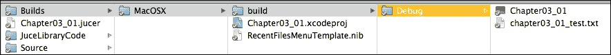
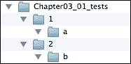
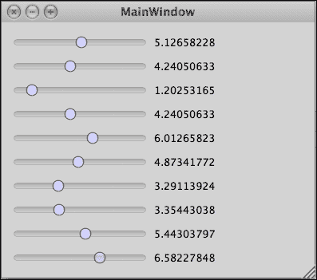

# 第三章。基本数据结构

JUCE 包含了一系列重要的数据结构，其中许多可以被视为标准库类的一些替代品。本章介绍了 JUCE 开发所必需的类。在本章中，我们将涵盖以下主题：

+   理解数值类型

+   使用 `String` 类指定和操作文本字符串

+   测量和显示时间

+   使用 `File` 类以跨平台方式指定文件路径（包括对用户主目录、桌面和文档位置的访问）

+   使用动态分配的数组：`Array` 类

+   使用智能指针类

到本章结束时，你将能够创建和操作 JUCE 的基本类中的数据。

# 理解数值类型

一些基本数据类型（如 `char`、`int`、`long` 等）的字长在不同的平台、编译器和 CPU 架构中是不同的。一个很好的例子是 `long` 类型。在 Mac OS X 的 Xcode 中，当编译 32 位代码时，`long` 是 32 位宽，而当编译 64 位代码时，`long` 是 64 位宽。在 Windows 的 Microsoft Visual Studio 中，`long` 总是 32 位宽。（同样适用于无符号版本。）JUCE 定义了一些原始类型来帮助编写平台无关的代码。许多这些类型都有熟悉的名字，并且可能与你的代码中使用的其他库和框架中使用的名字相同。这些类型在 `juce` 命名空间中定义；因此，如果需要，可以使用 `juce::` 前缀来消除歧义。这些原始类型包括：`int8`（8 位有符号整数）、`uint8`（8 位无符号整数）、`int16`（16 位有符号整数）、`uint16`（16 位无符号整数）、`int32`（32 位有符号整数）、`uint32`（32 位无符号整数）、`int64`（64 位有符号整数）、`uint64`（64 位无符号整数）、`pointer_sized_int`（与平台上的指针具有相同字长的有符号整数）、`pointer_sized_uint`（与平台上的指针具有相同字长的无符号整数），以及 `juce_wchar`（32 位 Unicode 字符类型）。

在许多情况下，内置类型是足够的。例如，JUCE 在内部使用 `int` 数据类型用于许多目的，但前面的类型在字长至关重要时可用。此外，JUCE 没有为 `char`、`float` 或 `double` 定义特殊的数据类型。两种浮点类型都假定符合 IEEE 754 标准，并且假定 `float` 数据类型是 32 位宽，`double` 数据类型是 64 位宽。

在此方面，一个最终的实用工具解决了代码中编写 64 位字面量在不同编译器中存在差异的问题。如果需要，可以使用 `literal64bit()` 宏来编写这样的字面量：

```cpp
int64 big = literal64bit (0x1234567890);
```

JUCE 还声明了一些基本的模板类型，用于定义某些几何形状；`Component` 类特别使用这些类型。一些有用的例子是 `Point<ValueType>`、`Line<ValueType>` 和 `Rectangle<ValueType>`。

# 指定和操作文本字符串

在 JUCE 中，文本通常使用`String`类进行操作。在许多方面，这个类可以被视为 C++标准库`std::string`类的替代品。我们已经在早期章节中使用了`String`类进行基本操作。例如，在第二章中，*构建用户界面*，字符串被用来设置`TextButton`对象上显示的文本，并用来存储在鼠标活动响应中显示的动态变化的字符串。尽管这些例子相当简单，但它们利用了`String`类的力量，使得对用户来说设置和操作字符串变得简单直接。

实现这一点的第一种方式是通过使用**引用计数**的对象来存储字符串。也就是说，当创建一个字符串时，在幕后 JUCE 为该字符串分配了一些内存，存储了该字符串，并返回一个指向该分配内存的`String`对象。这个字符串的直拷贝（即没有任何修改）仅仅是新的`String`对象，它们指向相同的共享内存。这有助于保持代码效率，允许在函数之间通过值传递`String`对象，而无需在过程中复制大量内存的开销。

为了说明一些这些特性，我们首先将使用控制台，而不是图形用户界面（GUI）应用程序。创建一个新的名为`Chapter03_01`的 Introjucer 项目；将**项目类型**更改为**控制台应用程序**，并在**自动生成文件**菜单中仅选择**创建 Main.cpp 文件**。保存项目并将其打开到你的集成开发环境（IDE）中。

## 将日志消息发布到控制台

要将消息发布到控制台窗口，最好使用 JUCE 的`Logger`类。日志可以设置为记录到文本文件，但默认行为是将日志消息发送到控制台。以下是一个简单的“Hello world!”项目，它使用 JUCE `String`对象和`Logger`类：

```cpp
#include "../JuceLibraryCode/JuceHeader.h"

int main (int argc, char* argv[])
{
  Logger *log = Logger::getCurrentLogger();
  String message ("Hello world!");     
  log->writeToLog (message);

  return 0;
}
```

`main()`函数中的第一行代码存储了对当前日志记录器的指针，这样我们就可以在后面的例子中多次重用它。第二行从字面量 C 字符串`"Hello world!"`创建一个 JUCE `String`对象，第三行使用其`writeToLog()`函数将此字符串发送到日志记录器。构建并运行此应用程序，控制台窗口应该看起来像以下这样：

```cpp
JUCE v2.1.2
Hello world!

```

JUCE 会自动报告第一行；如果你使用的是来自 GIT 仓库的 JUCE 的较新版本，这可能会不同。随后是来自你应用程序的任何日志消息。

## 字符串操作

虽然这个例子比使用标准 C 字符串的等效例子更复杂，但 JUCE 的`String`类的强大功能是通过字符串的存储和处理来实现的。例如，为了连接字符串，`+`操作符被重载用于此目的：

```cpp
int main (int argc, char* argv[])
{
  Logger *log = Logger::getCurrentLogger();
  String hello ("Hello");
  String space (" ");
  String world ("world!");
  String message = hello + space + world;

  log->writeToLog (message);

  return 0;
}
```

在这里，从字面量构造了`"Hello"`、中间的空格和`"world!"`等单独的字符串，然后通过连接这三个字符串来构造最终的`message`字符串。流操作符`<<`也可以用于此目的，以获得类似的结果：

```cpp
int main (int argc, char* argv[])
{
  Logger *log = Logger::getCurrentLogger();
  String hello ("Hello");
  String space (" ");
  String world ("world!");
  String message;

  message << hello;
  message << space;
  message << world;

  log->writeToLog (message);

  return 0;
}
```

流操作符将表达式的右侧连接到左侧，就地完成。实际上，使用这个简单的例子，当应用于字符串时，`<<`操作符等同于`+=`操作符。为了说明这一点，将代码中所有`<<`实例替换为`+=`。

主要区别在于`<<`操作符可以更方便地链入更长的表达式，而不需要额外的括号（这是由于 C++中`<<`和`+=`操作符优先级的差异）。因此，如果需要，可以像使用`+`操作符一样，在一行内完成连接：

```cpp
int main (int argc, char* argv[])
{
  Logger *log = Logger::getCurrentLogger();
  String message;

  message << "Hello" << " " << "world!";

  log->writeToLog (message);

  return 0;
}
```

要使用`+=`达到相同的结果，需要在表达式的每一部分都使用繁琐的括号：`(((message += "Hello") += " ") += "world!")`。

JUCE 中字符串内部引用计数的实现方式意味着你很少需要担心意外的副作用。例如，以下列表的工作方式可能正如你从阅读代码中预期的那样：

```cpp
int main (int argc, char* argv[])
{
  Logger *log = Logger::getCurrentLogger();
  String string1 ("Hello");
  String string2 = string1;

  string1 << " world!";

  log->writeToLog ("string1: " + string1);
  log->writeToLog ("string2: " + string2);

  return 0;
}
```

这会产生以下输出：

```cpp
string1: Hello world!
string2: Hello

```

将其分解为步骤，我们可以看到发生了什么：

+   `String string1 ("Hello");`: `string1`变量使用字面量字符串初始化。

+   `String string2 = string1;`: `string2`变量使用`string1`初始化；它们现在在幕后指向完全相同的数据。

+   `string1 << " world!";`: `string1`变量附加了另一个字面量字符串。此时`string1`指向一个包含连接字符串的新内存块。

+   `log->writeToLog ("string1: " + string1);`: 这条日志记录了`string1`，显示了连接后的字符串`Hello world!`。

+   `log->writeToLog ("string2: " + string2);`: 这条日志记录了`string2`；这表明`string1`仍然指向初始字符串`Hello`。

`String`类的一个非常有用的功能是其数值转换能力。通常，你可以将数值类型传递给`String`构造函数，生成的`String`对象将表示该数值。例如：

```cpp
String intString (1234);    // string will be "1234"
String floatString (1.25f); // string will be "1.25"
String doubleString (2.5);  // string will be "2.5" 
```

其他有用的功能包括转换为大写和小写。字符串也可以使用`==`操作符进行比较。

# 测量和显示时间

JUCE 的 `Time` 类提供了一种跨平台的方法，以人类可读的方式指定、测量和格式化日期和时间信息。内部，`Time` 类以相对于 1970 年 1 月 1 日午夜毫秒为单位存储一个值。要创建表示当前时间的 `Time` 对象，使用 `Time::getCurrentTime()`，如下所示：

```cpp
Time now = Time::getCurrentTime();
```

要绕过创建 `Time` 对象，可以直接以 64 位值的形式访问毫秒计数器：

```cpp
int64 now = Time::currentTimeMillis();
```

`Time` 类还提供了访问自系统启动以来的 32 位毫秒计数器的功能，用于测量时间：

```cpp
uint32 now = Time::getMillisecondCounter();
```

关于 `Time::getMillisecondCounter()` 的重要点是，它是独立于系统时间的，并且不会受到用户更改时间、由于国家夏令时变化等原因的系统时间更改的影响。

## 显示和格式化时间信息

显示时间信息很简单；以下示例从操作系统获取当前时间，将其格式化为字符串，并输出到控制台：

```cpp
int main (int argc, char* argv[])
{
  Logger *log = Logger::getCurrentLogger();

  Time time (Time::getCurrentTime());

  bool includeDate = true;
  bool includeTime = true;
  bool includeSeconds = true;
  bool use24HourClock = true;

  String timeStr (time.toString (includeDate, includeTime,
                                 includeSeconds, use24HourClock));

  log->writeToLog ("the time is: " + timeStr);

  return 0;
}
```

这说明了 `Time::toString()` 函数可用的四个选项标志。控制台上的输出将类似于以下内容：

```cpp
the time is: 7 Jul 2013 15:05:55

```

对于更全面的选择，`Time::formatted()` 函数允许用户使用特殊的格式字符串（使用与标准 C `strftime()` 函数等效的系统）指定格式。或者，你可以获取日期和时间信息的各个部分（日、月、时、分、时区等），并将它们组合成字符串。例如，可以使用以下方式实现相同的前置格式：

```cpp
int main (int argc, char* argv[])
{
  Logger *log = Logger::getCurrentLogger();

  Time time (Time::getCurrentTime());

  String timeStr;

  bool threeLetterMonthName = true;

  timeStr << time.getDayOfMonth() << " ";
  timeStr << time.getMonthName (threeLetterMonthName) << " ";
  timeStr << time.getYear() << " ";
  timeStr << time.getHours() << ":";
  timeStr << time.getMinutes() << ":";
  timeStr << time.getSeconds();

  log->writeToLog ("the time is: " + timeStr);

  return 0;
}
```

## 操作时间数据

`Time` 对象也可以被操作（借助 `RelativeTime` 类的帮助）并与其他 `Time` 对象进行比较。以下示例展示了基于当前时间创建三个时间值，使用一小时偏移量：

```cpp
int main (int argc, char* argv[])
{
  Logger *log = Logger::getCurrentLogger();

  Time time (Time::getCurrentTime());
  RelativeTime oneHour (RelativeTime::hours (1));

  Time oneHourAgo (time - oneHour);
  Time inOneHour (time + oneHour);
  Time inTwoHours (inOneHour + oneHour);

  log->writeToLog ("the time is:" +
                   time.toString (true, true, true, true));
  log->writeToLog ("one hour ago was:" +
                   oneHourAgo.toString (true, true, true, true));
  log->writeToLog ("in one hour it will be:" +
                   inOneHour.toString (true, true, true, true));
  log->writeToLog ("in two hours it will be:" +
                   inTwoHours.toString (true, true, true, true));

  return 0;
}
```

这个输出的结果应该类似于这样：

```cpp
the time is:             7 Jul 2013 15:42:27
one hour ago was:        7 Jul 2013 14:42:27
in one hour it will be:  7 Jul 2013 16:42:27
in two hours it will be: 7 Jul 2013 17:42:27

```

要比较两个 `Time` 对象，可以使用标准比较运算符。例如，你可以等待特定的时间，如下所示：

```cpp
int main (int argc, char* argv[])
{
  Logger *log = Logger::getCurrentLogger();

  Time now (Time::getCurrentTime());
  Time trigger (now + RelativeTime (5.0));

  log->writeToLog ("the time is now:      " +
                   now.toString (true, true, true, true));

  while (Time::getCurrentTime() < trigger) {
    Thread::sleep (10);
    log->writeToLog ("waiting...");
  }

  log->writeToLog ("the time has reached: " +
                   trigger.toString (true, true, true, true));

  return 0;
}
```

这里有两个需要注意的地方是：

+   传递给 `RelativeTime` 构造函数的值以秒为单位（所有其他时间值都需要使用前面显示的静态函数，例如小时、分钟等）。

+   `Thread::sleep()` 函数的调用使用毫秒值，这将使调用线程休眠。`Thread` 类将在 第五章，*有用的工具* 中进一步探讨。

## 测量时间

从 `Time::getCurrentTime()` 函数返回的时间值对于大多数用途应该是准确的，但如前所述，*当前时间* 可以通过用户修改系统时间而改变。以下是一个等效的示例，使用 `Time::getMillisecondCounter()`，它不受此类变化的影响：

```cpp
int main (int argc, char* argv[])
{
  Logger *log = Logger::getCurrentLogger();

  uint32 now = Time::getMillisecondCounter();
  uint32 trigger = now + 5000;

  log->writeToLog ("the time is now: " +
                   String (now) + "ms");

  while (Time::getMillisecondCounter() < trigger) {
    Thread::sleep (10);
    log->writeToLog ("waiting...");
  }

  log->writeToLog ("the time has reached: " +
                   String (trigger) + "ms");

  return 0;
}
```

`Time::getCurrentTime()`和`Time::getMillisecondCounter()`函数具有相似的精度，在大多数平台上都在几毫秒之内。然而，`Time`类还提供了一个更高分辨率的计数器，返回双精度（64 位）浮点值。这个函数是`Time::getMillisecondCounterHiRes()`，与`Time::getMillisecondCounter()`函数返回的值一样，也是相对于系统启动的。一个应用这个函数的例子是测量某些代码片段执行所需的时间，如下面的示例所示：

```cpp
int main (int argc, char* argv[])
{
  Logger *log = Logger::getCurrentLogger();

  double start = Time::getMillisecondCounterHiRes();

  log->writeToLog ("the time is now: " +
                   String (start) + "ms");

  float value = 0.f;
  const int N = 10000;

  for (int i = 0; i < N; ++i)
    value += 0.1f;

  double duration = Time::getMillisecondCounterHiRes() - start;

  log->writeToLog ("the time taken to perform " + String (N) +
                   " additions was: " + String (duration) + "ms");

  return 0;
}
```

这通过轮询更高分辨率的计数器，执行大量浮点数加法，然后再次轮询更高分辨率的计数器来确定这两个时间点之间的持续时间。输出应该类似于以下内容：

```cpp
the time is now: 267150354ms
the time taken to perform 10000 additions was: 0.0649539828ms

```

当然，这里的结果取决于编译器和运行时系统中的优化设置。

## 指定文件路径

JUCE 通过`File`类提供了一种相对跨平台的方式来指定和操作文件路径。特别是，这提供了一种访问用户系统上各种特殊目录的方法，例如`桌面`目录、他们的用户`文档`目录、应用程序首选项目录等等。`File`类还提供了访问文件信息的功能（例如，创建日期、修改日期、文件大小）以及读写文件内容的基本机制（尽管对于大型或复杂文件，其他技术可能更合适）。在以下示例中，一个字符串被写入磁盘上的文本文件（使用`File::replaceWithText()`函数），然后被读入第二个字符串（使用`File::loadFileAsString()`函数），并在控制台中显示：

```cpp
int main (int argc, char* argv[])
{
  Logger *log = Logger::getCurrentLogger();

  String text ("The quick brown fox jumps over the lazy dog.");
  File file ("./chapter03_01_test.txt");
  file.replaceWithText (text);
  String fileText = file.loadFileAsString();

  log->writeToLog ("fileText: " + fileText);

  return 0;
}
```

在这种情况下，`File`对象被初始化为路径`./chapter03_01_test.txt`。需要注意的是，此时该文件可能不存在，并且在第一次运行时，它将在调用`File::replaceWithText()`函数之前不存在（在后续运行中，该文件将存在，但在那个点将被覆盖）。路径前面的`./`字符序列是一个常见的惯用语，指定路径的其余部分应该是相对于当前目录（或当前工作目录）。在这个简单的情况下，当前工作目录很可能是可执行文件所在的目录。以下截图显示了在 Mac 平台上相对于 Introjucer 项目的这个位置： 



这不是一个可靠的方法；然而，如果工作目录正好是你想要保存文件的地方，它将会工作。

## 访问各种特殊目录位置

使用`File`类的一个特殊位置会更精确，如下所示：

```cpp
int main (int argc, char* argv[])
{
  Logger *log = Logger::getCurrentLogger();

  String text ("The quick brown fox jumps over the lazy dog.");
  File exe (File::getSpecialLocation(
            File::currentExecutableFile));
  File exeDir (exe.getParentDirectory());
  File file (exeDir.getChildFile ("chapter03_01_test.txt"));
  file.replaceWithText (text);
  String fileText = file.loadFileAsString();

  log->writeToLog ("fileText: " + fileText);

  return 0;
}
```

为了使代码清晰，访问此目录中的文件位置的步骤被拆分在多行中。在这里，你可以看到获取当前可执行文件位置、然后是其父目录，然后为相对于此目录的文本文件创建文件引用的代码。大部分这段代码可以通过使用函数调用链在单逻辑行中压缩：

```cpp
...
  File file (File::getSpecialLocation(
             File::currentExecutableFile)
             .getParentDirectory()
             .getChildFile ("chapter03_01_test.txt"));
...
```

由于此代码中某些标识符的长度和本书的页面宽度，这段代码仍然占据了四行物理代码。尽管如此，这说明了你可以如何使用这些函数调用来满足你的需求和代码布局偏好。

## 获取有关文件的各种信息

`File`类可以提供有关文件的有用信息。一个重要的测试是文件是否存在；这可以通过使用`File::exists()`来确定。如果文件确实存在，则可以获得更多信息，例如其创建日期、修改日期和大小。以下示例中展示了这些信息：

```cpp
int main (int argc, char* argv[])
{
  Logger *log = Logger::getCurrentLogger();

  File file (File::getSpecialLocation(File::currentExecutableFile)
             .getParentDirectory()
             .getChildFile("chapter03_01_test.txt"));

  bool fileExists = file.exists();

  if (!fileExists) {
    log->writeToLog ("file " +
                     file.getFileName() +
                     " does not exist");
    return -1;
  }

  Time creationTime = file.getCreationTime();
  Time modTime = file.getLastModificationTime();
  int64 size = file.getSize();

  log->writeToLog ("file " +
                   file.getFileName() + " info:");
  log->writeToLog ("created: " +
                   creationTime.toString(true, true, true, true));
  log->writeToLog ("modified:" +
                   modTime.toString(true, true, true, true));
  log->writeToLog ("size:" +
                   String(size) + " bytes");

  return 0;
}
```

假设你运行了所有前面的示例，文件应该存在于你的系统上，信息将在控制台以类似以下方式报告：

```cpp
file chapter03_01_test.txt info:
created: 8 Jul 2013 17:08:25
modified: 8 Jul 2013 17:08:25
size: 44 bytes

```

## 其他特殊位置

除了`File::currentExecutableFile`，JUCE 还知道的其他特殊位置包括：

+   `File::userHomeDirectory`

+   `File::userDocumentsDirectory`

+   `File::userDesktopDirectory`

+   `File::userApplicationDataDirectory`

+   `File::commonApplicationDataDirectory`

+   `File::tempDirectory`

+   `File::currentExecutableFile`

+   `File::currentApplicationFile`

+   `File::invokedExecutableFile`

+   `File::hostApplicationPath`

+   `File::globalApplicationsDirectory`

+   `File::userMusicDirectory`

+   `File::userMoviesDirectory`

+   `File::userPicturesDirectory`

每个这些名称都相当直观。在某些情况下，这些特殊位置在某些平台上不适用。例如，iOS 平台上没有所谓的`Desktop`。

## 导航目录结构

最终，一个`File`对象在用户的系统上解析为一个绝对路径。如果需要，可以使用`File::getFullPathName()`函数来获取：

```cpp
int main (int argc, char* argv[])
{
  Logger *log = Logger::getCurrentLogger();

  File file (File::getSpecialLocation(
              File::currentExecutableFile)
                .getParentDirectory()
                .getChildFile ("chapter03_01_test.txt"));
  log->writeToLog ("file path: " + file.getFullPathName());

  return 0;
}
```

此外，传递给`File::getChildFile()`的相对路径可以包含一个或多个使用双点表示法（即，“`..`”字符序列）引用父目录的引用。在下面的示例中，我们创建了一个简单的目录结构，如代码列表后面的截图所示：

```cpp
int main (int argc, char* argv[])
{
  Logger *log = Logger::getCurrentLogger();

  File root (File::getSpecialLocation (File::userDesktopDirectory)
             .getChildFile ("Chapter03_01_tests"));
  File dir1 (root.getChildFile ("1"));
  File dir2 (root.getChildFile ("2"));
  File dir1a (dir1.getChildFile ("a"));
  File dir2b (dir2.getChildFile ("b"));

  Result result (Result::ok());

  result = dir1a.createDirectory();

  if (!result.wasOk()) {
    log->writeToLog ("Creating dir 1/a failed");
    return -1;
  }

  result = dir2b.createDirectory();

  if (!result.wasOk()) {
    log->writeToLog ("Creating dir 2/b failed");
    return -1;
  }

  File rel = dir1a.getChildFile ("../../2/b");

  log->writeToLog ("root: " + root.getFullPathName());
  log->writeToLog ("dir1: " + dir1.getRelativePathFrom (root));
  log->writeToLog ("dir2: " + dir2.getRelativePathFrom (root));
  log->writeToLog ("dir1a: " + dir1a.getRelativePathFrom (root));
  log->writeToLog ("dir2b: " + dir2b.getRelativePathFrom (root));
  log->writeToLog ("rel: " + rel.getRelativePathFrom (root));

  return 0;
}
```



这总共创建了五个目录，只使用了两次 `File::createDirectory()` 函数调用。由于这取决于用户在此目录中创建文件的权限，该函数返回一个 `Result` 对象。该对象包含一个状态来指示函数是否成功（我们通过 `Result::wasOk()` 函数进行检查），如果需要，还可以获取有关任何错误的更多信息。每次调用 `File::createDirectory()` 函数都确保如果需要，它将创建任何中间目录。因此，在第一次调用时，它创建了根目录、目录 `1` 和目录 `1/a`。在第二次调用时，根目录已经存在，因此它只需要创建目录 `2` 和 `2/a`。

控制台输出应该是这样的：

```cpp
root: /Users/martinrobinson/Desktop/Chapter03_01_tests
dir1: 1
dir2: 2
dir1a: 1/a
dir2b: 2/b
rel: 2/b

```

当然，第一行将根据您的系统而有所不同，但剩余的五行应该是相同的。这些路径是相对于我们使用 `File::getRelativePathFrom()` 函数创建的目录结构根目录显示的。注意，最后一行显示 `rel` 对象指向与 `dir2b` 对象相同的目录，但我们通过使用函数调用 `dir1a.getChildFile("../../2/b")` 相对于 `dir1a` 对象创建了此 `rel` 对象。也就是说，我们在目录结构中向上导航两级，然后访问下面的目录。

`File` 类还包括检查文件是否存在的功能，在文件系统中移动和复制文件（包括将文件移动到 **垃圾桶** 或 **回收站**），以及在特定平台上创建合法的文件名（例如，避免冒号和斜杠字符）。

# 使用动态分配的数组

虽然大多数 JUCE 对象的实例可以存储在常规 C++ 数组中，但 JUCE 提供了一些更强大的数组，与 C++ 标准库类（如 `std::vector`）有些相似。JUCE 的 `Array` 类提供了许多功能；这些数组可以是：

+   动态大小；可以在任何索引处添加、删除和插入项目

+   使用自定义比较器进行排序

+   搜索特定内容

`Array` 类是一个模板类；其主模板参数 `ElementType` 必须满足某些标准。`Array` 类在调整大小和插入元素时通过复制内存来移动其内容，这可能会与某些类型的对象造成问题。作为 `ElementType` 模板参数传递的类必须同时具有复制构造函数和赋值运算符。特别是，`Array` 类与原始类型和一些常用的 JUCE 类（例如 `File` 和 `Time` 类）配合得很好。在以下示例中，我们创建了一个整数数组，向其中添加了五个项目，并遍历数组，将内容发送到控制台：

```cpp
int main (int argc, char* argv[])
{
  Logger *log = Logger::getCurrentLogger();

  Array<int> array;

  for (int i = 0; i < 5; ++i)
    array.add (i * 1000);

  for (int i = 0; i < array.size(); ++i) {
    int value = array[i];
    log->writeToLog ("array[" + String (i) + "]= " + String (value));
  }

  return 0;
}
```

这应该会产生以下输出：

```cpp
array[0]= 0
array[1]= 1000
array[2]= 2000
array[3]= 3000
array[4]= 4000

```

注意到 JUCE 的 `Array` 类支持 C++ 索引下标操作符 `[]`。即使数组索引超出范围，它也会始终返回一个有效值（与内置数组不同）。进行此检查涉及一些开销；因此，您可以通过使用 `Array::getUnchecked()` 函数来避免边界检查，但您必须确保索引在范围内，否则您的应用程序可能会崩溃。第二个 `for()` 循环可以重写如下以使用此替代函数，因为我们已经检查了索引将在范围内：

```cpp
...
  for (int i = 0; i < array.size(); ++i) {
 int value = array.getUnchecked (i);
    log->writeToLog("array[" + String (i) + "] = " + 
                    String (value));
  }
...
```

## 在目录中查找文件

JUCE 库使用 `Array` 对象来完成许多目的。例如，`File` 类可以使用 `File::findChildFiles()` 函数将包含的子文件和目录列表填充到一个 `File` 对象数组中。以下示例应将用户 `Documents` 目录中的文件和目录列表输出到控制台：

```cpp
int main (int argc, char* argv[])
{
  Logger *log = Logger::getCurrentLogger();

  File file =
    File::getSpecialLocation (File::userDocumentsDirectory);

  Array<File> childFiles;

  bool searchRecursively = false;
  file.findChildFiles (childFiles,
                       File::findFilesAndDirectories,
                       searchRecursively);

  for (int i = 0; i < childFiles.size(); ++i)
    log->writeToLog (childFiles[i].getFullPathName());

  return 0;
}
```

在这里，`File::findChildFiles()` 函数被传递了一个 `File` 对象数组，它应该添加搜索结果。它还被指示使用值 `File::findFilesAndDirectories`（其他选项是 `File::findDirectories` 和 `File::findFiles` 值）来查找文件和目录。最后，它被指示不要递归搜索。

## 字符串标记化

虽然可以使用 `Array<String>` 来存储 JUCE `String` 对象的数组，但有一个专门的 `StringArray` 类，在将数组操作应用于字符串数据时提供了额外的功能。例如，可以使用 `String::addTokens()` 函数将字符串**标记化**（即将原始字符串中的空白字符分割成更小的字符串），或者使用 `String::addLines()` 函数将其分割成表示文本行的字符串（基于原始字符串中找到的换行符序列）。以下示例将一个字符串标记化，然后遍历生成的 `StringArray` 对象，将其内容输出到控制台：

```cpp
int main (int argc, char* argv[])
{
  Logger *log = Logger::getCurrentLogger();

  StringArray strings;
  bool preserveQuoted = true;
  strings.addTokens("one two three four five six",
                     preserveQuoted);

  for (int i = 0; i < strings.size(); ++i) {
    log->writeToLog ("strings[" + String (i) + "]=" +
                     strings[i]);
  }

  return 0;
}
```

## 组件数组

由类似控件（如按钮和滑块）组成的用户界面可以使用数组有效地管理。然而，JUCE 的 `Component` 类及其子类不符合在 JUCE `Array` 对象中作为对象（即按值）存储的标准。这些必须存储为指向这些对象的指针数组。为了说明这一点，我们需要一个新的 Introjucer 项目，其中包含一个基本的窗口，如 第二章 中使用的，*构建用户界面*。创建一个新的 Introjucer 项目，例如，命名为 `Chapter03_02`，并在您的 IDE 中打开它。在 `Main.cpp` 中 `MainWindow` 构造函数的末尾添加以下行：

```cpp
setResizable (true, true);
```

在 `MainComponent.h` 文件中修改代码如下：

```cpp
#ifndef __MAINCOMPONENT_H__
#define __MAINCOMPONENT_H__

#include "../JuceLibraryCode/JuceHeader.h"

class MainContentComponent : public Component
{
public:
  MainContentComponent();
  ~MainContentComponent();

  void resized();

private:
  Array<TextButton*> buttons;
};

#endif
```

注意，这里的 `Array` 对象是一个指向 `TextButton` 对象的指针数组（即 `TextButton*`）。在 `MainComponent.cpp` 文件中修改代码如下：

```cpp
#include "MainComponent.h"

MainContentComponent::MainContentComponent()
{
  for (int i = 0; i < 10; ++i)
  {
    String buttonName;
    buttonName << "Button " << String (i);
    TextButton* button = new TextButton (buttonName);
    buttons.add (button);
    addAndMakeVisible (button);
  }

  setSize (500, 400);
}

MainContentComponent::~MainContentComponent()
{
}

void MainContentComponent::resized()
{
  Rectangle<int> rect (10, 10, getWidth() - 20, getHeight() - 20);

  int buttonHeight = rect.getHeight() / buttons.size();

  for (int i = 0; i < buttons.size(); ++i) {
    buttons[i]->setBounds (rect.getX(),
                           i * buttonHeight + rect.getY(),
                           rect.getWidth(),
                           buttonHeight);
  }
}
```

在这里，我们创建了 10 个按钮，使用`for()`循环将它们添加到数组中，并基于循环计数器命名按钮。按钮使用`new`运算符分配（而不是在第二章中使用的静态分配，即*构建用户界面*），并且这些指针被存储在数组中。（注意，在调用`Component::addAndMakeVisible()`函数时不需要`&`运算符，因为值已经是指针。）在`resized()`函数中，我们使用`Rectangle<int>`对象创建一个矩形，该矩形从`MainContentComponent`对象的外边距矩形向内缩进 10 像素。按钮位于这个较小的矩形内。每个按钮的高度通过将矩形的高度除以按钮数组中的按钮数量来计算。然后`for()`循环根据其在数组中的索引定位每个按钮。构建并运行应用程序；其窗口应显示 10 个按钮，排列成单列。

前面的代码有一个主要缺陷。使用`new`运算符分配的按钮从未被删除。代码应该可以正常运行，尽管当应用程序退出时，你将得到一个断言失败。控制台中的消息可能类似于：

```cpp
*** Leaked objects detected: 10 instance(s) of class TextButton
JUCE Assertion failure in juce_LeakedObjectDetector.h:95

```

为了解决这个问题，我们可以在`MainComponent`析构函数中删除按钮，如下所示：

```cpp
MainContentComponent::~MainContentComponent()
{
  for (int i = 0; i < buttons.size(); ++i)
    delete buttons[i];
}
```

然而，在编写复杂代码时很容易忘记执行此类操作。

## 使用`OwnedArray`类

JUCE 提供了一个针对指针类型定制的`Array`类的有用替代品：`OwnedArray`类。`OwnedArray`类始终存储指针，因此模板参数中不应包含`*`字符。一旦指针被添加到`OwnedArray`对象中，它将接管指针的所有权，并在必要时（例如，当`OwnedArray`对象本身被销毁时）负责删除它。在`MainComponent.h`文件中修改声明，如下所示：

```cpp
...
private:
 OwnedArray<TextButton> buttons;
};
```

你还应该从`MainComponent.cpp`文件中的析构函数中删除代码，因为删除对象多次同样有问题：

```cpp
...
MainContentComponent::~MainContentComponent()
{
}
... 
```

构建并运行应用程序，注意应用程序现在将无问题退出。

这种技术可以扩展到使用广播者和听众。像之前一样创建一个新的基于 GUI 的 Introjucer 项目，并将其命名为`Chapter03_03`。将`MainComponent.h`文件修改为：

```cpp
#ifndef __MAINCOMPONENT_H__
#define __MAINCOMPONENT_H__

#include "../JuceLibraryCode/JuceHeader.h"

class MainContentComponent :  public Component,
                              public Button::Listener
{
public:
MainContentComponent();

void resized();
void buttonClicked (Button* button);

private:
OwnedArray<Button> buttons;
Label label;
};

#endif
```

这次我们使用`OwnedArray<Button>`对象而不是`OwnedArray<TextButton>`对象。这仅仅避免了在数组中搜索指针时需要将我们的按钮指针强制转换为不同类型的需求，就像我们在以下代码中所做的那样。注意，在这里我们还添加了一个`Label`对象到我们的组件中，使我们的组件成为按钮监听器，并且我们不需要析构函数。将`MainComponent.cpp`文件修改为：

```cpp
#include "MainComponent.h"

MainContentComponent::MainContentComponent()
{
  for (int i = 0; i < 10; ++i) {
    String buttonName;
    buttonName << "Button " << String (i);
    TextButton* button = new TextButton (buttonName);
    button->addListener (this);
    buttons.add (button);
    addAndMakeVisible (button);
  }

  addAndMakeVisible (&label);
  label.setJustificationType (Justification::centred);
  label.setText ("no buttons clicked", dontSendNotification);

  setSize (500, 400);
}

void MainContentComponent::resized()
{
  Rectangle<int> rect (10, 10, 
                       getWidth() / 2 - 20, getHeight() - 20);

  int buttonHeight = rect.getHeight() / buttons.size();

  for (int i = 0; i < buttons.size(); ++i) {
    buttons[i]->setBounds (rect.getX(),
                           i * buttonHeight + rect.getY(),
                           rect.getWidth(),
                           buttonHeight);
  }

  label.setBounds (rect.getRight(),
                   rect.getY(),
                   getWidth() - rect.getWidth() - 10,
                   20);
}

void MainContentComponent::buttonClicked (Button* button)
{
  String labelText;
  nt buttonIndex = buttons.indexOf (button);
  labelText << "Button clicked: " << String (buttonIndex);
  label.setText (labelText, dontSendNotification);
}
```

在这里，我们在构造函数中添加了标签，将按钮组的宽度减小到只占用组件的左侧一半，并将标签定位在右侧的上部。在按钮监听器回调中，我们可以使用`OwnedArray::indexOf()`函数来获取按钮的索引，以搜索指针（顺便说一句，`Array`类也有一个`indexOf()`函数用于搜索项）。构建并运行应用程序，注意我们的标签报告了哪个按钮被点击。当然，这个代码优雅的地方在于，我们只需在构造函数中更改`for()`循环中的值，就可以更改创建的按钮数量；其他所有事情都会自动完成。

## 其他控件组

这种方法可以应用于其他控件组。以下示例创建了一个滑块和标签的控件组，并确保每个对应组件都使用适当的值进行更新。创建一个新的基于 GUI 的 Introjucer 项目，并将其命名为`Chapter03_04`。将`MainComponent.h`文件更改为：

```cpp
#ifndef __MAINCOMPONENT_H__
#define __MAINCOMPONENT_H__

#include "../JuceLibraryCode/JuceHeader.h"

class MainContentComponent :  public Component,
                              public Slider::Listener,
                              public Label::Listener
{
public:
  MainContentComponent();

  void resized();
  void sliderValueChanged (Slider* slider);
  void labelTextChanged (Label* label);

private:
  OwnedArray<Slider> sliders;
  OwnedArray<Label> labels;
};

#endif
```

在这里，我们有滑块和标签的数组，我们的组件既是标签监听器也是滑块监听器。现在，更新`MainComponent.cpp`文件以包含包含指令、构造函数和`resized()`函数：

```cpp
#include "MainComponent.h"

MainContentComponent::MainContentComponent()
{
  for (int i = 0; i < 10; ++i) {
    String indexString (i);
    String sliderName ("slider" + indexString);
    Slider* slider = new Slider (sliderName);
    slider->setTextBoxStyle (Slider::NoTextBox, false, 0, 0);
    slider->addListener (this);
    sliders.add (slider);
    addAndMakeVisible (slider);

    String labelName ("label" + indexString);
    Label* label = new Label (labelName,
                              String (slider->getValue()));
    label->setEditable (true);
    label->addListener (this);
    labels.add (label);
    addAndMakeVisible (label);
  }

  setSize (500, 400);
}

void MainContentComponent::resized()
{
  Rectangle<int> slidersRect (10, 10,
                              getWidth() / 2 - 20, 
                              getHeight() - 20);
  Rectangle<int> labelsRect (slidersRect.getRight(), 10,
                             getWidth() / 2 - 20, 
                             getHeight() - 20);

  int cellHeight = slidersRect.getHeight() / sliders.size();

  for (int i = 0; i < sliders.size(); ++i) {
    sliders[i]->setBounds (slidersRect.getX(),
                           i * cellHeight + slidersRect.getY(),
                           slidersRect.getWidth(),
                           cellHeight);
    labels[i]->setBounds (labelsRect.getX(),
                          i * cellHeight + labelsRect.getY(),
                          labelsRect.getWidth(),
                          cellHeight);
  }
}
```

在这里，我们使用`for()`循环创建组件并将它们添加到相应的数组中。在`resized()`函数中，我们创建了两个辅助矩形，一个用于滑块组，一个用于标签组。这些矩形分别定位在主组件的左侧和右侧一半。

在监听器回调函数中，广播组件的索引在其数组中查找，并使用此索引设置其他对应组件的值。将这些监听器回调函数添加到`MainComponent.cpp`文件中：

```cpp
void MainContentComponent::sliderValueChanged (Slider* slider)
{
  int index = sliders.indexOf (slider);
  labels[index]->setText (String (slider->getValue()), 
                          sendNotification);
}

void MainContentComponent::labelTextChanged (Label* label)
{
  int index = labels.indexOf (label);
  sliders[index]->setValue (label->getText().getDoubleValue());
}
```

在这里，我们使用`String`类来执行数值转换。移动一些滑块后，应用程序窗口应类似于以下截图：



希望这些示例说明了将 JUCE 数组类与其他 JUCE 类结合使用的强大之处，以编写优雅、易读且功能强大的代码。

# 使用智能指针类

`OwnedArray`类可以被视为智能指针的管理器，从它管理的对象的生命周期来看。JUCE 包括一系列其他智能指针类型，以帮助解决在编写使用指针的代码时遇到的一些常见问题。特别是，这些有助于避免内存和其他资源的误管理。

可能最简单的智能指针是由`ScopedPointer`类实现的。它管理单个指针，并在不再需要时删除它所指向的对象。这可能以两种方式发生：

+   当`ScopedPointer`对象本身被销毁时

+   当一个新的指针被分配给`ScopedPointer`对象时

`ScopedPointer` 类的一个用途是作为存储 `Component` 对象（或其子类之一）的替代方法。实际上，在 Introjucer 应用程序的图形编辑器中添加子组件会将组件以 `ScopedPointer` 对象的形式添加到代码中，这与下面的示例类似。创建一个新的 Introjucer 项目，命名为 `Chapter03_05`。以下示例实现了与 `Chapter02_02` 项目相同的结果，但使用 `ScopedPointer` 对象来管理组件，而不是静态分配它们。将 `MainComponent.h` 文件修改如下：

```cpp
#ifndef __MAINCOMPONENT_H__
#define __MAINCOMPONENT_H__

#include "../JuceLibraryCode/JuceHeader.h"

class MainContentComponent :  public Component,
                              public Button::Listener,
                              public Slider::Listener
{
public:
  MainContentComponent();
  void resized();

  void buttonClicked (Button* button);
  void sliderValueChanged (Slider* slider);

private:
 ScopedPointer<Button> button1;
 ScopedPointer<Slider> slider1;
 ScopedPointer<Label> label1;
};

#endif
```

注意，我们使用 `ScopedPointer<Button>` 对象而不是 `ScopedPointer<TextButton>` 对象，原因与之前我们更倾向于使用 `OwnedArray<Button>` 对象而不是 `OwnedArray<TextButton>` 对象的原因相同。将 `MainComponent.cpp` 文件修改如下：

```cpp
#include "MainComponent.h"

MainContentComponent::MainContentComponent()
{
 button1 = new TextButton ("Zero Slider");
 slider1 = new Slider (Slider::LinearHorizontal, 
 Slider::NoTextBox);
 label1 = new Label();
  slider1->setRange (0.0, 100.0);
  slider1->addListener (this);
  button1->addListener (this);
  slider1->setValue (100.0, sendNotification);

  addAndMakeVisible (button1);
  addAndMakeVisible (slider1);
  addAndMakeVisible (label1);
  setSize (200, 100);
}

void MainContentComponent::resized()
{
  button1->setBoundsRelative (0.05, 0.05, 0.90, 0.25);
  slider1->setBoundsRelative (0.05, 0.35, 0.90, 0.25);
  label1->setBoundsRelative (0.05, 0.65, 0.90, 0.25);
}

void MainContentComponent::buttonClicked (Button* button)
{
 if (button1 == button)
    slider1->setValue (0.0, sendNotification);
}

void MainContentComponent::sliderValueChanged (Slider* slider)
{
 if (slider1 == slider)
    label1->setText (String (slider1->getValue()), 
                     sendNotification);
}
```

这里的主要变化是使用 `->` 操作符（`ScopedPointer` 类重载以返回其包含的指针）而不是 `.` 操作符。组件都是显式使用 `new` 操作符分配的，但除此之外，代码几乎与 `Chapter02_02` 项目相同。

JUCE 中其他有用的内存管理类包括：

+   `ReferenceCountedObjectPtr<ReferenceCountedObjectClass>`：这允许您编写类，使得实例可以像 `String` 对象一样在代码中传递。生命周期由维护其自己的计数器的对象管理，该计数器统计代码中对对象的引用数量。这在多线程应用程序和生成图或树结构时特别有用。`ReferenceCountedObjectClass` 模板参数需要继承自 `ReferenceCountedObject` 类。

+   `MemoryBlock`：这管理一块可调整大小的内存，是管理原始内存的推荐方法（例如，而不是使用标准的 `malloc()` 和 `free()` 函数）。

+   `HeapBlock<ElementType>`：类似于 `MemoryBlock` 类（实际上，`MemoryBlock` 对象包含一个 `HeapBlock<char>` 对象），但这是一个智能指针类型，并支持 `->` 操作符。由于它是一个模板类，它也指向特定类型的对象或对象。

# 摘要

本章概述了 JUCE 中的一些核心类，这些类为构建 JUCE 应用程序提供了基础，并为构建符合 JUCE 风格的应用程序提供了框架。这些类为本书的其余部分提供了进一步的基础。这些类中包含的功能远不止这里概述的。再次强调，您必须查看本章中引入的每个类的 JUCE 类文档。许多这些类在 JUCE 示例应用程序和 Introjucer 应用程序的代码中被大量使用。这些也应该对进一步阅读很有帮助。下一章将介绍用于处理文件（特别是媒体文件，如图像和声音文件）的类。
