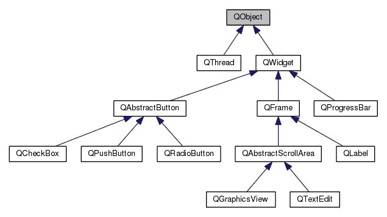
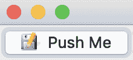
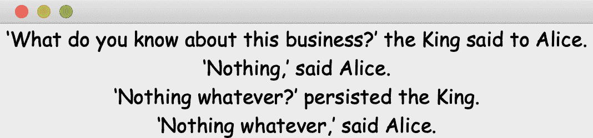
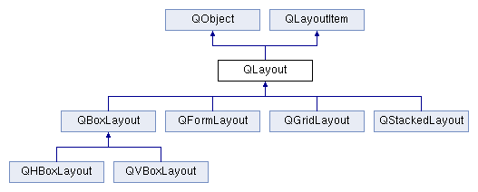
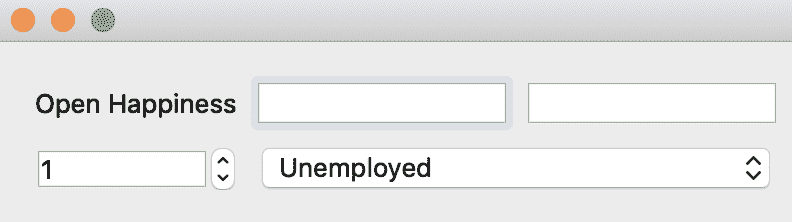
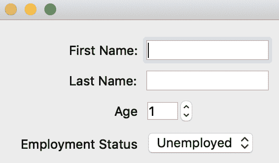
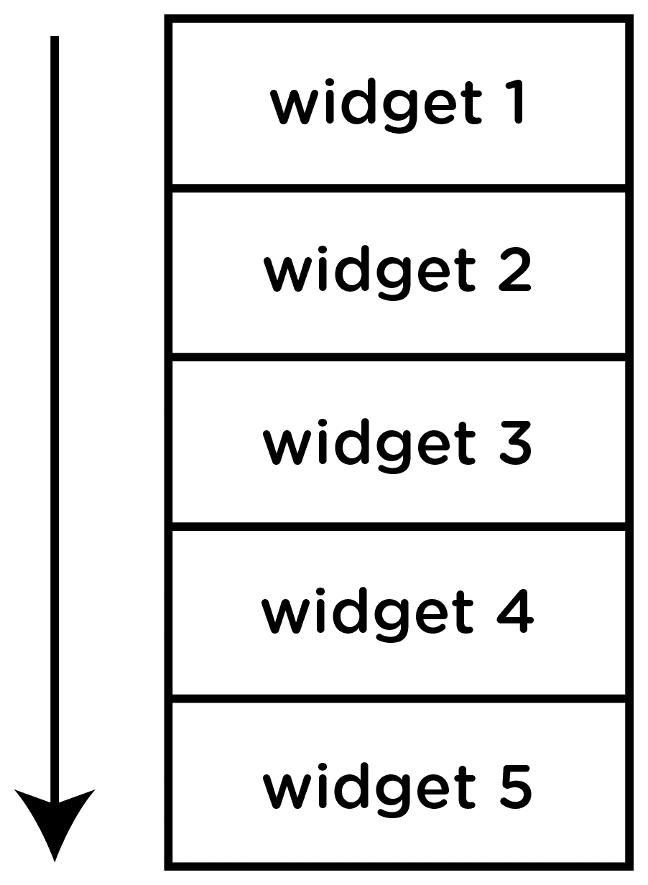
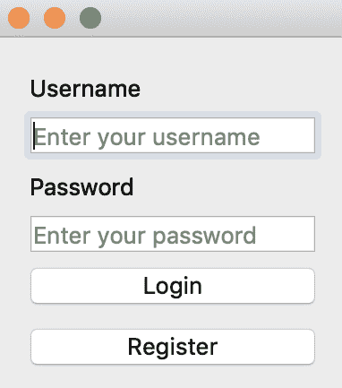
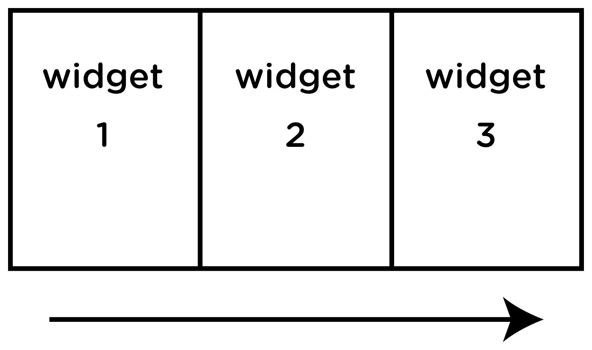
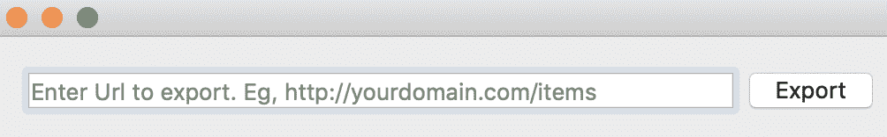

# 创建窗口小部件和布局

在本章中，我们将探讨窗口小部件是什么以及可用于创建 GUI 的各种类型。对于你将要编写的绝大多数 GUI 应用程序，Qt 都提供了足够的窗口小部件来实现它。与窗口小部件一起使用的布局类帮助我们安排和定位窗口小部件，以使其更具吸引力。

到本章结束时，你应该了解以下内容：

+   理解并知道如何使用窗口小部件

+   了解需要用于布局的类

# 窗口小部件

**窗口小部件**是我们构建用户界面的图形组件。一个熟悉的例子是文本框。这是在 GUI 应用程序表单中用来捕获我们的电子邮件地址或姓氏和名字的组件。

在 Qt 中关于窗口小部件有几个关键点需要注意：

+   信息通过事件传递给窗口小部件。对于文本框，一个事件示例可能是用户在文本框内点击或当文本框光标闪烁时按下 `return` 键。

+   每个窗口小部件都可以有一个父窗口小部件或子窗口小部件。

+   没有父窗口小部件的窗口小部件在调用`show()`函数时将变成一个窗口。这样的窗口小部件将被包含在一个带有关闭、最大化、最小化按钮的窗口中。

+   子窗口小部件在其父窗口小部件内显示。

Qt 通过大量使用继承来组织其类，因此掌握这一点非常重要。考虑以下图表：



在层次结构的顶部是 **QObject**。许多类都继承自 **QObject** 类。**QObject** 类还包含信号和槽以及事件管理的机制，等等。

此外，具有共同行为的窗口小部件被分组在一起。**QCheckBox**、**QPushButton** 和 **QRadioButton** 都是同一类型的按钮，因此它们继承自 **QAbstractButton**，该类包含所有按钮共享的属性和函数。这一原则也适用于 **QAbstractScrollArea** 及其子类，**QGraphicsView** 和 **QTextEdit**。

为了将我们刚刚学到的一些知识付诸实践，让我们创建一个只有一个窗口小部件的简单 Qt 程序。

这个 Qt 应用程序只显示一个按钮。打开一个文本文件，并给它起一个你想要的名称，后缀为 `.cpp`。

大多数示例将需要你创建一个新的文件夹，源代码将存储在那里。这将允许你轻松地将程序作为项目编译。

插入以下代码行。创建一个新的文件夹，并将 `.cpp` 文件移动到其中：

```cpp
#include <QApplication>
#include <QPushButton>
int main(int argc, char *argv[])
{
   QApplication app(argc, argv);
   QPushButton myButton(QIcon("filesaveas.png"),"Push Me");
   myButton.setToolTip("Click this to turn back the hands of time");
   myButton.show();
   return app.exec();
}
```

本应用程序的目的是展示一个没有父对象窗口小部件在执行时如何成为主窗口。将要创建的按钮将包括一个图标和工具提示。

首先，这个应用程序看起来与我们写在第一章结尾的部分相似，即*介绍 Qt 5*。在这个应用程序中，声明了一个名为`myButton`的按钮。将`QIcon`的一个实例作为`QPushButton`默认构造函数的第一个参数。这读取名为`filesaveas.png`的文件（目前应该与 GitHub 上的源代码文件在同一文件夹中）。将文本`"Push Me"`作为第二个参数传递。这段文本将显示在按钮上。

下一个行，`myButton.setToolTip("Click this to turn back the hands of time");`，用于设置按钮的工具提示。工具提示是一段文本或消息，当你在小部件上悬停鼠标光标时显示。它通常包含比小部件可能显示的额外或解释性信息。

最后，我们在`myButton`对象上调用`show()`函数来显示它并在屏幕上绘制。在这个应用程序中，我们只有一个小部件，`QPushButton`。这个小部件的父级是什么？好吧，如果没有指定，父级默认为`NULL`，这告诉 Qt 该小部件没有父级。由于这个原因，显示此类小部件时，它将被包含在一个窗口中。

保存文件并运行以下命令以编译你的应用程序。将目录更改到包含`.cpp`文件的新文件夹：

应在终端或命令行中运行的命令以`%`符号开头，它代表终端上的提示符。根据你的终端设置，这可能会略有不同，但命令是`%`符号后面的所有字符。

```cpp
% qmake -project
```

从`.pro`文件的名字来看，它告诉我们`.cpp`文件所在的文件夹名为`qbutton`。因此，当你发出前面的命令时，这个名称应该更改为`.cpp`文件所在的文件夹名。

现在，请记住在`qbutton.pro`文件中在`INCLUDEPATH += .`下面添加以下行：

```cpp
QT += widgets
```

继续以下命令：

```cpp
% qmake
% make
```

根据问题，从命令行运行应用程序：

```cpp
% ./qbutton
```

你应该获得以下截图：



前一个截图显示了程序首次运行时你会看到的内容：


当我们将光标放在按钮上时，会显示在代码中指定的工具提示，如前一个截图所示。

按钮还显示了那些你想在按钮上添加图像以增强 UI 直观性的情况。

以下是一些值得注意的观察结果：

+   在`QPushButton`类中找不到`setToolTip()`函数。相反，它是属于`QWidget`类的一组函数之一。

+   这突出了通过继承方式类获得的有用性。

+   存储工具提示值的`QWiget`类的属性或成员是`toolTip`。

为了结束关于控件的这一部分，让我们自定义一个`QLabel`并显示它。这次，`QLabel`的字体将被更改，并且将显示比通常更长的文本。

在新创建的文件夹中创建一个名为`qlabel_long_text.cpp`的文件，并插入以下代码：

```cpp
#include <QApplication>
#include <QString>
#include <QLabel>
int main(int argc, char *argv[])
{
            QApplication app(argc, argv);
            QString message = "'What do you know about this business?' the King said to Alice.\n'Nothing,' said Alice.\n'Nothing whatever?' persisted the King.\n'Nothing whatever,' said Alice.";
            QLabel label(message);
            label.setFont(QFont("Comic Sans MS", 18));
            label.setAlignment(Qt::AlignCenter);
            label.show();
            return app.exec();
}
```

我们 Qt 程序的结构并没有发生太大的变化。前三行包含`include`指令，添加了我们将要使用的类的头文件。

如往常一样，将`main()`函数的参数传递给`app()`。`message`变量是一个`QString`对象，它包含一个长字符串。`QString`是在处理字符串时使用的类。它具有许多在 C++字符串中不可用的功能。

创建了一个`QLabel`实例，命名为`label`，并将`message`传递给它。为了改变标签字符串的显示样式，我们向`setFont`函数传递了一个`QFont`实例。我们选择了字体样式*Comic Sans MS*，字号为*18*，传递给`QFont`的构造函数。

为了使所有文本居中，我们在`label`对象上调用`setAlignment`函数，并传递`Qt::AlignCenter`常量。

最后，我们通过在`label`对象上调用`show`函数来显示控件。

如往常一样，我们将在命令行上输入以下代码来编译和运行此程序：

```cpp
% qmake -project
% qmake
% ./qlabel_long_text
```

记得在`.pro`文件中添加`QT += widgets`。

程序的输出如下。所有文本行都居中显示：



再次强调，`label`应用程序中唯一的控件成为主窗口，因为它没有与之关联的父对象。其次，控件成为窗口，因为调用了`label`上的`show()`方法。

# 布局

到目前为止，我们创建的应用程序只有一个控件作为主要组件，并且由此扩展，也是一个窗口。然而，GUI 应用程序通常由多个控件组成，这些控件共同向用户传达一个过程。我们可以利用多个控件的一种方法是通过使用布局作为画布，我们将控件插入其中。

考虑以下类继承关系图：



在布局控件时考虑使用的类是很重要的。通常，从`QLayout`抽象类继承的顶级类是`QObject`。此外，`QLayout`通过从`QLayoutItem`继承实现了多重继承。这里的具体类有`QBoxLayout`、`QFormLayout`、`QGridLayout`和`QStackedLayout`。`QHBoxLayout`和`QVBoxLayout`通过添加布局内控件可能排列的方向来进一步细化`QBoxLayout`类。

以下表格简要描述了主要布局的功能：

| **布局类** | **描述** |
| --- | --- |
| `QFormLayout` | `QFormLayout` 类 ([`doc.qt.io/qt-5/qformlayout.html`](https://doc.qt.io/qt-5/qformlayout.html)) 管理输入小部件及其关联的标签。 |
| `QGridLayout` | `QGridLayout` 类 ([`doc.qt.io/qt-5/qgridlayout.html`](https://doc.qt.io/qt-5/qgridlayout.html)) 以网格形式排列小部件。 |
| `QStackedLayout` | `QStackedLayout` 类 ([`doc.qt.io/qt-5/qstackedlayout.html`](https://doc.qt.io/qt-5/qstackedlayout.html)) 提供了一个小部件堆栈，一次只显示一个小部件。 |
| `QVBoxLayout` | `QVBoxLayout` 类 ([`doc.qt.io/qt-5/qvboxlayout.html`](https://doc.qt.io/qt-5/qvboxlayout.html)) 将小部件垂直排列。 |
| `QHBoxLayout` | `QHBoxLayout` 类 ([`doc.qt.io/qt-5/qhboxlayout.html`](https://doc.qt.io/qt-5/qhboxlayout.html)) 将小部件水平排列。 |

我们需要布局小部件有两个主要原因：

+   为了允许我们显示多个小部件。

+   为了将我们界面中的许多小部件以良好且直观的方式呈现，以便使 UI 有用。并非所有 GUI 都允许用户很好地完成工作。糟糕的布局可能会让系统用户感到困惑，并使他们难以正确使用。

让我们创建一个简单的程序来展示如何使用一些布局类。

# QGridLayout

`QGridLayout` 通过指定将被多个小部件填满的行数和列数来排列小部件。类似于表格的网格结构，它有行和列，小部件被插入到行和列相交的单元格中。

创建一个新的文件夹，并使用任何编辑器创建一个名为 `main.cpp` 的文件：

```cpp
#include <QApplication>
#include <QPushButton>
#include <QGridLayout>
#include <QLineEdit>
#include <QDateTimeEdit>
#include <QSpinBox>
#include <QComboBox>
#include <QLabel>
#include <QStringList>
int main(int argc, char *argv[])
{
   QApplication app(argc, argv);
   QWidget *window = new QWidget;
   QLabel *nameLabel = new QLabel("Open Happiness");
   QLineEdit *firstNameLineEdit= new QLineEdit;
   QLineEdit *lastNameLineEdit= new QLineEdit;
   QSpinBox *ageSpinBox = new QSpinBox;
   ageSpinBox->setRange(1, 100);
   QComboBox *employmentStatusComboBox= new QComboBox;
   QStringList employmentStatus = {"Unemployed", "Employed", "NA"};
   employmentStatusComboBox->addItems(employmentStatus);
   QGridLayout *layout = new QGridLayout;
   layout->addWidget(nameLabel, 0, 0);
   layout->addWidget(firstNameLineEdit, 0, 1);
   layout->addWidget(lastNameLineEdit, 0, 2);
   layout->addWidget(ageSpinBox, 1, 0);
   layout->addWidget(employmentStatusComboBox, 1, 1,1,2);
   window->setLayout(layout);
   window->show();
   return app.exec();
}
```

程序的目的是展示如何使用布局对象。为了填充布局，还将讨论其他小部件。

在前面的代码中，`*window` 是 `QWidget` 的一个实例。目前，请保留此对象以查看我们将如何将其转换为窗口。

我们将要插入到布局中的小部件将在之后创建，即 `name`、`firstnameLineEdit` 和 `lastNameLineEdit`。

一些开发者喜欢通过在其名称后附加他们实例化的类的名称来命名变量。这里也使用了驼峰命名法。

`QLineEdit` 是创建文本框的基本类。`QSpinbox` 是一个允许在给定范围内选择值的控件。在这种情况下，`ageSpinBox->setRange(1, 100)` 设置了可能的值范围在 `1` 到 `100` 之间。

接下来，我们实例化 `QComboBox` 类以创建一个具有由存储在 `QStringList` 中的字符串列表指定的下拉值的控件。然后，通过调用其 `addItems()` 方法将字符串列表 `employmentStatus` 传递给 `employmentStatusComboBox`。这些将成为当控件被点击时显示的选项。

由于我们想要以网格布局排列小部件，因此我们创建了一个`QGridLayout`对象，`*layout`。为了将小部件添加到布局中，我们调用`addWIdget()`方法，并且每次都指定小部件，以及两个（2）数字，这些数字指定了小部件要插入的行和列：

```cpp
layout->addWidget(nameLabel, 0, 0);
layout->addWidget(firstNameLineEdit, 0, 1);
layout->addWidget(lastNameLineEdit, 0, 2);
layout->addWidget(ageSpinBox, 1, 0);
layout->addWidget(employmentStatusComboBox, 1, 1,1,2);
```

首先被插入到布局对象中的小部件是标签，`nameLabel`。它占据了网格的第一行和第一列。第一行由第二个参数`0`表示，而第一列由`0`表示。这对应于选择网格的第一个单元格以保留`nameLabel`。

被添加到布局中的第二个小部件是`firstNameLineEdit`。这个小部件将被插入到第一行，标记为`0`，以及第二列，标记为`1`。紧邻此小部件的是添加的`lastNameLineEdit`小部件，它也位于同一行，`0`。

`ageSpinBox`小部件将被固定在第二行，标记为`1`，以及第一列，标记为`0`。

`employmentStatusComboBox`小部件被添加到`layout`对象中，并通过指定最后一个`(1, 2)`参数进一步扩展：

```cpp
window->setLayout(layout);
window->show();
```

`window`对象没有布局。为了设置小部件的布局，调用`setLayout`并传入包含其他小部件的布局对象。

由于`window`（基本上是一个小部件）没有父对象，因此当我们对其调用`show()`方法时，它将成为一个窗口。此外，通过`addWidget()`方法添加到布局对象的所有小部件都是`layout`对象的子对象。

通过在命令行中发出创建项目和编译的命令来运行项目。

在成功编译后，你应该会看到以下内容：



注意下拉小部件如何扩展以填充第三列。小部件的放置符合我们调用`addWidget()`时设置的布局。

在下一节中，我们将查看一个有用的布局类，称为`QFormLayout`。

# QFormLayout

对于那些只需要在两列布局中将多个小部件放在一起的情况，`QFormLayout`非常有用。你可以选择使用`QGridLayout`构建表单，但对于表单的展示，`QFormLayout`最为合适。

以以下代码为例。它展示了一个表单，其中第一列包含标签，第二列包含用于接收用户输入的实际控件：

```cpp
#include <QApplication>
#include <QFormLayout>
#include <QPushButton>
#include <QLineEdit>
#include <QSpinBox>
#include <QComboBox>
#include <QStringList>
int main(int argc, char *argv[])
{
   QApplication app(argc, argv);
   QWidget *window = new QWidget;
   QLineEdit *firstNameLineEdit= new QLineEdit;
   QLineEdit *lastNameLineEdit= new QLineEdit;
   QSpinBox *ageSpingBox = new QSpinBox;
   QComboBox *employmentStatusComboBox= new QComboBox;
   QStringList employmentStatus = {"Unemployed", "Employed", "NA"};
   ageSpingBox->setRange(1, 100);
   employmentStatusComboBox->addItems(employmentStatus);
   QFormLayout *personalInfoformLayout = new QFormLayout;
   personalInfoformLayout->addRow("First Name:", firstNameLineEdit);
   personalInfoformLayout->addRow("Last Name:", lastNameLineEdit );
   personalInfoformLayout->addRow("Age", ageSpingBox);
   personalInfoformLayout->addRow("Employment Status",
   employmentStatusComboBox);
   window->setLayout(personalInfoformLayout);
   window->show();
   return app.exec();
}
```

到现在为止，代码应该看起来很熟悉了。我们实例化了在表单中想要显示的各种小部件的对象。然后，创建布局：

```cpp
QFormLayout *personalInfoformLayout = new QFormLayout;
```

创建了一个`QFormLayout`实例。任何我们想要将小部件添加到布局中，`*personalInformformLayout`，我们都会调用`addRow()`方法，传递一个表示标签的字符串，最后是我们要与标签对齐的小部件：

```cpp
personalInfoformLayout->addRow("First Name:", firstNameLineEdit);
```

`"First Name: "` 是标签，而这里的部件是 `firstNameLineEdit`。

其他部件以这种方式添加到布局中：

```cpp
window->setLayout(personalInfoformLayout);
```

然后，将 `personalInfoformLayout` 传递给 `QWidget` 实例的 `setLayout()` 方法。这意味着应用程序窗口 `window` 的布局是 `personalInfoformLayout`。

记住，`QWidget` 实例 `window` 将成为应用程序的主窗口，因为它的 `show()` 方法被调用。

`QForm` 通过提供一种简单的方式来添加行到我们的布局中，消除了指定列和行的需要，每次我们这样做时，我们都可以指定要显示的标签和部件。

当你编译并运行项目时，你应该看到以下输出：



上述截图显示了部件在这些布局中的对齐方式。表单以问答方式呈现。标签通常位于左侧，而接收用户输入的部件位于右侧。

# 带方向的布局

有一些布局在添加部件时提供了增长方向。有些情况下，我们希望将布局中的所有部件水平或垂直对齐。

`QHBoxLayout` 和 `QVBoxLayout` 类提供了这种功能。

# QVBoxLayout

在 `QVBoxLayout` 布局中，部件是垂直对齐的，并且从上到下打包在布局中。

考虑以下图示：



对于 `QVBoxLayout`，箭头指示部件添加到布局中的增长方向。第一个部件 **widget 1** 将占据布局的顶部，而 `addWidget()` 的最后一次调用将使 **widget 5** 占据布局的底部。

要说明如何使用 `QVBoxLayout`，考虑以下程序：

```cpp
#include <QApplication>
#include <QVBoxLayout>
#include <QPushButton>
#include <QLabel>
#include <QLineEdit>
int main(int argc, char *argv[])
{
   QApplication app(argc, argv);
   QWidget *window = new QWidget;
   QLabel *label1 = new QLabel("Username");
   QLabel *label2 = new QLabel("Password");
   QLineEdit *usernameLineEdit = new QLineEdit;
   usernameLineEdit->setPlaceholderText("Enter your username");
   QLineEdit *passwordLineEdit = new QLineEdit;
   passwordLineEdit->setEchoMode(QLineEdit::Password);
   passwordLineEdit->setPlaceholderText("Enter your password");
   QPushButton *button1 = new QPushButton("&Login");
   QPushButton *button2 = new QPushButton("&Register");
   QVBoxLayout *layout = new QVBoxLayout;
   layout->addWidget(label1);
   layout->addWidget(usernameLineEdit);
   layout->addWidget(label2);
   layout->addWidget(passwordLineEdit);
   layout->addWidget(button1);
   layout->addWidget(button2);
   window->setLayout(layout);
   window->show();
   return app.exec();
}
```

在之前的例子中，我们说明了创建 `QWidget` 实例的原因。创建了两个带有字符串 `"Username"` 和 `"Password"` 的标签。还创建了一个用于接收用户名和密码输入的文本框，`QLineEdit` 实例。在 `passwordLineEdit` 对象上，通过传递常量 `QLineEdit::Password` 给 `setEchoMode()` 方法来隐藏该文本框的输入，并用点替换以防止输入的字符可读。

通过 `setPlaceholderText()` 方法设置 `passwordLineEdit` 中的占位文本。占位文本提供了关于文本框用途的更多信息。

同样创建了两个按钮，`button1` 和 `button2`。创建了一个 `QVBoxLayout` 的实例。为了向布局中添加小部件，调用 `addWidget()` 方法并传递特定的部件。传递给 `addWidget` 的第一个部件将在显示时出现在顶部。同样，最后添加的部件将显示在底部，在这个例子中是 `button2`。

通过将 `layout` 传递给 `setLayout()` 方法来设置 `window` 小部件实例的布局。

最后，在窗口上调用 `show()` 方法。编译项目并运行它以查看输出：



在前面的屏幕截图中，我们可以看到首先添加到布局中的小部件是标签 `label1`，而带有文本“注册”的 `button2` 是最后一个占据底部的小部件。

# QHBoxLayout

`QHBoxLayout` 布局类在用法上与 `QVBoxLayout` 非常相似。通过调用 `addWidget()` 方法将小部件添加到布局中。

考虑以下图表：



图表中的箭头显示了小部件随着添加到 `QHBoxLayout` 而增长的方向。首先添加到这个布局中的是 **小部件 1**，而 **小部件 3** 是最后添加到布局中的小部件。

一个允许用户输入 URL 的小应用程序使用了这种布局类型：

```cpp
#include <QApplication>
#include <QHBoxLayout>
#include <QPushButton>
#include <QLineEdit>
int main(int argc, char *argv[])
{
   QApplication app(argc, argv);
   QWidget *window = new QWidget;
   QLineEdit *urlLineEdit= new QLineEdit;
   QPushButton *exportButton = new QPushButton("Export");
   urlLineEdit->setPlaceholderText("Enter Url to export. Eg, http://yourdomain.com/items");
   urlLineEdit->setFixedWidth(400);
   QHBoxLayout *layout = new QHBoxLayout;
   layout->addWidget(urlLineEdit);
   layout->addWidget(exportButton);
   window->setLayout(layout);
   window->show();
   return app.exec();
}
```

创建了一个文本框或 `QLineEdit` 和按钮。在 `QLineEdit` 实例 `urlLineEdit` 上设置了占位符。为了使占位符可见，我们通过将 `setFixedWidth` 设置为 `400` 来拉伸 `urlLineEdit`。

创建了一个 `QHBoxLayout` 实例并将其传递给 `layout` 指针。通过 `addWidget()` 方法将两个小部件 `urlLineEdit` 和 `exportButton` 添加到 `layout` 中。

布局被设置在 `window` 上，并调用了窗口的 `show()` 方法。

编译应用程序并运行它。你应该看到以下输出：



请参阅第一章，*介绍 Qt 5*，以编译应用程序。为了简化编译过程，请记住创建一个新的文件夹并将 `.cpp` 文件添加到其中。像往常一样，需要将 `.pro` 文件更改为包含小部件模块。

因为按钮是在文本框之后添加到布局中的，所以它相应地显示，紧邻文本框。如果另一个小部件被添加到布局中，它也会出现在按钮 `exportButton` 之后。

# 摘要

在本章中，我们探讨了在创建 GUI 应用程序时非常有用的许多小部件。编译过程保持不变。我们还学习了如何使用布局来展示和排列多个小部件。

到目前为止，我们的应用程序没有任何功能。当点击 `QPushButton` 实例时，它们以及其他由动作驱动的其他小部件都不会执行任何操作。

在下一章中，我们将学习如何使我们的应用程序能够响应用户操作，从而使它们变得有用。
