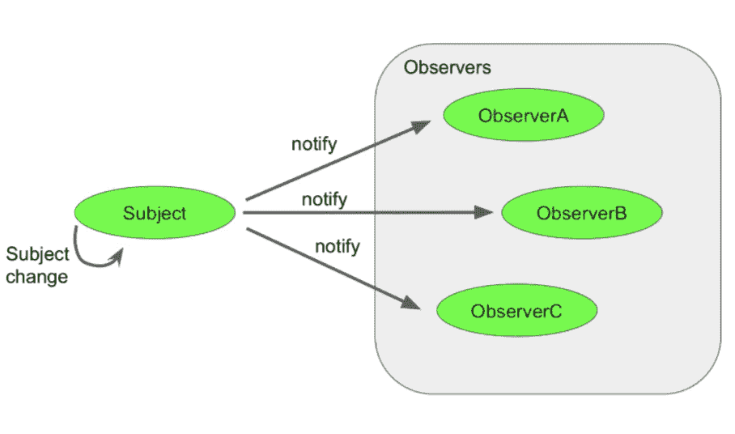
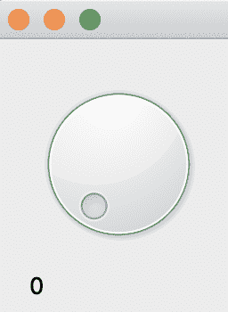
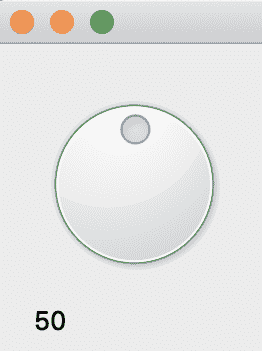
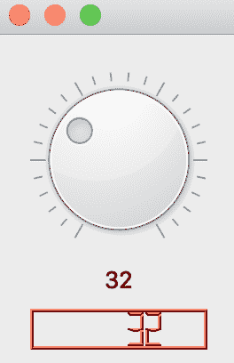
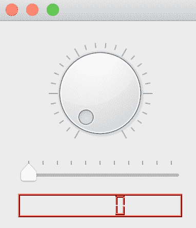
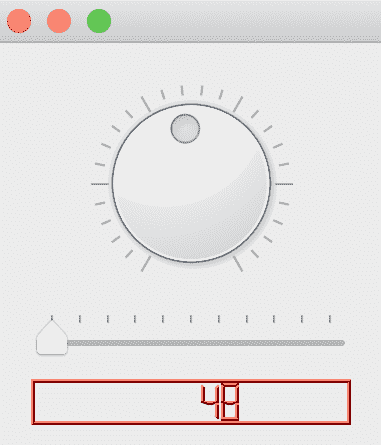
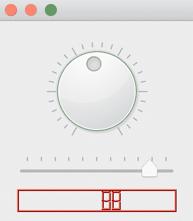

# 使用信号和槽

到目前为止，我们已经学习了如何创建应用程序并显示各种类型的窗口部件。如果 GUI 应用程序只由这些组成，那么事情就结束了。但是，为了使我们的应用程序可用，我们还需要做更多的事情。在本章中，我们将着手以下内容：

+   理解信号和槽背后的概念

+   学习连接信号和槽的不同方法

GUI 工具包通常提供一种方法来响应应用程序内部发生的事情。不会留下任何偶然。应用程序内部发生的每一个动作都会被注册并记录下来。例如，当你移动一个窗口或调整其大小时，该动作会被注册，并且如果已经编写了足够的代码，它将作为对窗口移动或调整大小的反应来执行。对于发生的每一个动作，可能会有许多结果发生。本质上，我们想要回答的问题是：当特定的动作或事件发生时，我们该怎么办？我们如何处理它？

实现对已发生动作的响应能力的一种方法是通过使用称为**观察者模式**的设计模式。

在观察者模式设计中，一个可观察对象将其状态变化通知给正在观察它的其他对象。例如，任何时间一个对象（A）想要通知另一个对象（B）的状态变化，它首先必须识别该对象（B）并将自己注册为应该接收此类状态变化通知的对象之一。在未来某个时刻，当对象（B）的状态发生变化时，对象（B）将遍历它保持的想要了解状态变化的对象列表，此时将包括对象（A）：



从前面的图中可以看出，**主题**圆圈被称为可观察对象，而边界框中的圆圈是观察者。它们正在被通知**主题**的状态变化，因为其计数变量从 1 增加到 5。

我们的应用程序中可能发生的一些事件或动作，我们可能会感兴趣并希望对其做出反应，包括以下内容：

+   窗口正在调整大小

+   按钮被点击

+   按下回车键

+   窗口部件正在被拖动

+   鼠标悬停在窗口部件上

对于按钮来说，对鼠标点击的典型响应可能是启动下载过程或发送电子邮件。

# 信号和槽

在 Qt 中，这种动作-响应方案由信号和槽处理。本节将包含一些定义，然后我们将通过一个示例进行进一步解释。

信号是一个传递的消息，用于传达对象状态已发生变化。这个信号可能携带有关发生变化的额外信息。例如，当一个窗口被调整大小时，信号通常会携带新状态（或大小）的坐标。有时，信号可能不携带额外信息，例如按钮点击。

槽是对象的一个特定函数，每当发出某个信号时都会被调用。由于槽是函数，它们将包含执行动作的代码行，例如关闭窗口、禁用按钮和发送电子邮件，仅举几例。

信号和槽必须被连接（在代码中）。如果不编写代码来连接信号和槽，它们将作为独立的实体存在。

大多数 Qt 中的部件都自带一系列的信号和槽。然而，你也可以编写自己的信号和槽。

那么，信号和槽看起来是什么样子？

考虑以下代码列表：

```cpp
#include <QApplication>
#include <QPushButton>
int main(int argc, char *argv[])
{
   QApplication app(argc, argv);
   QPushButton *quitButton = new QPushButton("Quit");
   QObject::connect(quitButton, SIGNAL(clicked()),
           &app, SLOT(quit()));
   quitButton->show();
   return app.exec();
}
```

如同往常，我们将使用以下步骤来编译项目：

1.  创建一个具有适当名称的新文件夹

1.  创建一个名为`main.cpp`的`.cpp`文件

1.  在终端中输入以下命令：

```cpp
% qmake -project
% qmake 
% make 
% ./executable_file
```

一定要编辑`.pro`文件，在编译时包含`widget`模块。

编译并运行应用。

创建一个`QPushButton`的实例，命名为`quitButton`。这里的`quitButton`实例是可观察对象。任何时候点击这个按钮，都会发出`clicked()`信号。这里的`clicked()`信号是`QPushButton`类的一个方法，它已经被标记为信号。

`app`对象的`quit()`方法被调用，这终止了`event`循环。

为了指定当`quitButton`被点击时应该发生什么，我们传递`app`并说明`app`对象上的`quit()`方法应该被调用。这四个参数通过`QObject`类的静态函数`connect()`连接起来。

通用格式是（`objectA`，*信号*（`methodOnObjectA()`），`objectB`，*槽*（`methodOnObjectB()`））。

第二个和最后一个参数是表示信号和槽的方法的签名。第一个和第三个参数是指针，应该包含对象的地址。由于`quitButton`已经是一个指针，我们只需按原样传递它。另一方面，`&app`会返回`app`的地址。

现在，点击按钮，应用将会关闭：


当这个应用运行时，你应该看到以下内容。

我们刚刚所展示的例子相当原始。让我们编写一个应用，其中一个部件状态的变化传递给另一个部件。信号不仅会连接到一个槽，还会携带数据：

```cpp
#include <QApplication>
#include <QVBoxLayout>
#include <QLabel>
#include <QDial>
int main(int argc, char *argv[])
{
   QApplication app(argc, argv);
   QWidget *window = new QWidget;
   QVBoxLayout *layout = new QVBoxLayout;
   QLabel *volumeLabel = new QLabel("0");
   QDial *volumeDial= new QDial;
   layout->addWidget(volumeDial);
   layout->addWidget(volumeLabel);
   QObject::connect(volumeDial, SIGNAL(valueChanged(int)), volumeLabel,
   SLOT(setNum(int)));
   window->setLayout(layout);
   window->show();
   return app.exec();
}
```

这是一个说明如何在信号和槽之间传递数据的另一个简单程序。创建了一个`QVBoxLayout`实例，命名为`layout`。创建了一个`QLabel`实例，命名为`volumeLabel`，它将用于显示发生的变化。它被初始化为字符串`0`。接下来，创建了一个`QDial`实例，命名为`QDial *volumeDial = new QDial`。`QDial`小部件是一个类似旋钮的控件，带有最小和最大数值范围。借助鼠标，可以旋转旋钮，就像你会上调扬声器或收音机的音量一样。

这两个小部件`volumeLabel`和`volumeDial`随后使用`addWidget()`方法添加到布局中。

每当我们改变`QDial`的旋钮时，都会发出一个名为`valueChanged(int)`的信号。`volumeLabel`对象的名为`setNum(int)`的槽是一个接受`int`值的函数。

注意以下代码中信号与槽之间的连接是如何建立的：

```cpp
QObject::connect(volumeDial, SIGNAL(valueChanged(int)), volumeLabel, SLOT(setNum(int)));
```

这实际上建立了一个连接，该连接读取“*每当* `QDial` *改变其值时，调用* `volumeLabel` *对象的* `setNum()` *方法，并传递一个* `int` *值*。”`QDial`中可能发生许多状态变化。该连接进一步明确指出，我们只对旋钮（`QDial`）移动时发出的已更改的值感兴趣，这反过来又通过`valueChanged(int)`信号发出其当前值。

为了进行干燥运行程序，让我们假设`QDial`的范围代表从`0`到`100`的广播音量范围。如果`QDial`的旋钮改变到范围的一半，将发出`valueChanged(50)`信号。现在，值 50 将被传递给`setNum(50)`函数。这将用于设置标签的文本，在我们的例子中是`volumeLabel`，以显示 50。

编译应用程序并运行它。第一次运行时将显示以下输出：



正如你所见，`QDial`的初始状态为零。下面的标签也显示了这一点。移动旋钮，你会看到标签的值会相应地改变。以下截图显示了旋钮移动到范围一半后的应用程序状态：



移动旋钮并观察标签如何相应地改变。这一切都是通过信号和槽机制实现的。

# 信号和槽配置

不仅可以将一个信号连接到一个槽，还可以将一个信号连接到多个槽。这涉及到重复`QObject::connect()`调用，并在每个实例中指定当特定信号发出时应调用的槽。

# 单个信号，多个槽

在本节中，我们将关注如何将单个信号连接到多个槽。

检查以下程序：

```cpp
#include <QApplication>
#include <QVBoxLayout>
#include <QLabel>
#include <QDial>
#include <QLCDNumber>
int main(int argc, char *argv[])
{
   QApplication app(argc, argv);
   QWidget *window = new QWidget;
   QVBoxLayout *layout = new QVBoxLayout;
   QLabel *volumeLabel = new QLabel("0");
   QDial *volumeDial= new QDial;
   QLCDNumber *volumeLCD = new QLCDNumber;
   volumeLCD->setPalette(Qt::red);
   volumeLabel->setAlignment(Qt::AlignHCenter);
   volumeDial->setNotchesVisible(true);
   volumeDial->setMinimum(0);
   volumeDial->setMaximum(100);
   layout->addWidget(volumeDial);
   layout->addWidget(volumeLabel);
   layout->addWidget(volumeLCD);
   QObject::connect(volumeDial, SIGNAL(valueChanged(int)), volumeLabel,
   SLOT(setNum(int)));
   QObject::connect(volumeDial, SIGNAL(valueChanged(int)), volumeLCD ,   
   SLOT(display(int)));
   window->setLayout(layout);
   window->show();
   return app.exec();
}
```

我们想说明一个信号如何连接到两个不同的槽，或者更确切地说，连接到多个槽。将要发出信号的部件是`QDial`的一个实例，即`volumeDial`。创建了一个`QLCDNumber`的实例，即`volumeLCD`。此小部件以类似 LCD 的数字形式显示信息。注意`volumeLabel`是`QLabel`的一个实例。这两个小部件将提供两个槽。

为了使`volumeLCD`的文本突出，我们使用`volumeLCD->setPalette(Qt::red);`将显示器的颜色设置为红色。

`layout`是一个`QVBoxLayout`的实例，这意味着添加到该布局中的小部件将从上到下流动。每个添加到布局中的小部件都将围绕中间对齐，因为我们已经在`volumeLabel`上设置了`setAlignment(Qt::AlignHCenter);`：

```cpp
volumeDial->setNotchesVisible(true);
volumeDial->setMinimum(0);
volumeDial->setMaximum(100);
```

当调用`setNotchesVisible(true)`方法时，`volumeDial`上的刻度可见。`setNotchesVisible()`方法的默认参数是`false`，这使得刻度（刻度）不可见。我们通过调用`setMinimum(0)`和`setMaximum(100)`来设置`QDial`实例的范围。

使用`addWidget()`方法调用相应地添加了三个小部件：

```cpp
layout->addWidget(volumeDial);
layout->addWidget(volumeLabel);
layout->addWidget(volumeLCD);
```

现在，`volumeDial`发出信号`valueChanged(int)`，我们将其连接到`volumeLabel`的`setNum(int)`槽。当`volumeDial`的旋钮改变时，当前值将被发送到`volumeLabel`进行显示：

```cpp
QObject::connect(volumeDial, SIGNAL(valueChanged(int)), volumeLabel, SLOT(setNum(int)));
QObject::connect(volumeDial, SIGNAL(valueChanged(int)), volumeLCD , SLOT(display(int)));
```

与此相同的信号，`volumeDial`的`valueChanged(int)`，也连接到了`volumeLCD`的`display(int)`槽。

这两个连接的总效果是，当`volumeDial`发生变化时，`volumeLabel`和`volumeLCD`都会更新为`volumeDial`的当前值。所有这些都在同一时间发生，应用程序没有阻塞，这都要归功于信号和槽的高效设计。

编译并运行项目。程序的典型输出如下：



在前面的屏幕截图中，当`QDial`小部件（即看起来像圆形的对象）移动到 32 时，`volumeLabel`和`volumeLCD`都进行了更新。当你移动旋钮时，`volumeLabel`和`volumeLCD`将通过信号接收更新，并相应地更新自己。

# 单槽，多信号

在下一个示例中，我们将连接来自不同小部件的两个信号到一个单独的槽。让我们按照以下方式修改我们之前的程序：

```cpp
#include <QApplication>
#include <QVBoxLayout>
#include <QLabel>
#include <QDial>
#include <QSlider>
#include <QLCDNumber>
int main(int argc, char *argv[])
{
   QApplication app(argc, argv);
   QWidget *window = new QWidget;
   QVBoxLayout *layout = new QVBoxLayout;
   QDial *volumeDial= new QDial;
   QSlider *lengthSlider = new QSlider(Qt::Horizontal);
   QLCDNumber *volumeLCD = new QLCDNumber;
   volumeLCD->setPalette(Qt::red);
   lengthSlider->setTickPosition(QSlider::TicksAbove);
   lengthSlider->setTickInterval(10);
   lengthSlider->setSingleStep(1);
   lengthSlider->setMinimum(0);
   lengthSlider->setMaximum(100);
   volumeDial->setNotchesVisible(true);
   volumeDial->setMinimum(0);
   volumeDial->setMaximum(100);
   layout->addWidget(volumeDial);
   layout->addWidget(lengthSlider);
   layout->addWidget(volumeLCD);
   QObject::connect(volumeDial, SIGNAL(valueChanged(int)), volumeLCD ,
   SLOT(display(int)));
   QObject::connect(lengthSlider, SIGNAL(valueChanged(int)), volumeLCD 
   , SLOT(display(int)));
   window->setLayout(layout);
   window->show();
   return app.exec();
}
```

在`include`语句中，我们添加了`#include <QSlider>`这一行，以添加`QSlider`类，这是一个可以设置在给定范围内的值的部件：

```cpp
QApplication app(argc, argv);
QWidget *window = new QWidget;
QVBoxLayout *layout = new QVBoxLayout;
QDial *volumeDial= new QDial;
QSlider *lengthSlider = new QSlider(Qt::Horizontal);
QLCDNumber *volumeLCD = new QLCDNumber;
volumeLCD->setPalette(Qt::red);
```

实例化了`QSlider`小部件，并传递了`Qt::Horizontal`，这是一个常数，它改变了小部件的方向，使其水平显示。其他一切都是与之前示例中看到的一样。实例化了窗口和布局，以及`QDial`和`QSlider`对象：

```cpp
lengthSlider->setTickPosition(QSlider::TicksAbove);
lengthSlider->setTickInterval(10);
lengthSlider->setSingleStep(1);
lengthSlider->setMinimum(0);
```

在本例中，第一个应该发出信号的部件是`volumeDial`对象。但现在，`QSlider`实例也发出一个信号，允许我们在`QSlider`状态改变时获取其状态。

为了在`QSlider`上显示刻度，我们调用`setTickPosition()`方法并传递常量`QSlider::TicksAbove`。这将显示在滑块顶部的刻度，非常类似于直边上的刻度显示。

`setMinimum()`和`setMaximum()`变量用于设置`QSlider`实例的值范围。这里的范围是`0`到`100`。

`lengthSlider`对象上的`setTickInterval(10)`方法用于设置刻度之间的间隔。

`QVBoxLayout`对象`layout`通过以下行将`lengthSlider`部件对象添加到它将容纳的部件列表中，`layout->addWidget(lengthSlider);`：

```cpp
QObject::connect(volumeDial, SIGNAL(valueChanged(int)), volumeLCD , SLOT(display(int)));
QObject::connect(lengthSlider, SIGNAL(valueChanged(int)), volumeLCD , SLOT(display(int)));
```

有两个对静态方法`connect()`的调用。第一个调用将在`volumeDial`的`valueChanged(int)`信号与`volumeLCD`的`display(int)`槽之间建立连接。结果，每当`QDial`对象改变时，值将被传递到`display(int)`槽进行显示。

从不同的对象，我们将`lengthSlider`的`valueChanged(int)`信号连接到`volumeLCD`对象的相同槽`display()`。

程序的其余部分与往常一样。

按照我们为前一个示例所做的那样，从命令行编译并运行程序。

第一次运行应用程序时，输出应类似于以下内容：



`QDial`和`QSlider`都处于零的位置。现在，我们将`QDial`移动到 48。看看`QLCDNumber`是如何相应更新的：



通过我们设置的信号和槽，`QSlider`也可以更新相同的部件，即`volumeLCD`。当我们移动`QSlider`时，我们会看到`volumeLCD`会立即根据其值更新：



如所示，`QSlider`已经移动到其范围的末端，并且值已经传递到`volumeLCD`。

# 摘要

在本章中，我们探讨了 Qt 中信号和槽的核心概念。在创建我们的第一个应用程序后，我们研究了信号和槽可以连接的各种方式。

我们看到了如何将一个部件的信号连接到多个槽。这是一种典型的设置信号和槽的方式，尤其是在部件状态的变化需要通知许多其他部件时。

为了展示信号和槽可以如何灵活地配置，我们还查看了一个例子，其中多个信号连接到部件的一个槽。这种安排在可以使用不同的部件在部件上实现相同效果时很有用。

在第四章，*实现窗口和对话框*，我们将改变编写应用程序的风格，并学习如何制作完整的窗口应用程序。
