# 实现窗口和对话框

在上一章中，我们学习了如何通过使用信号和槽来触发和响应应用程序内部发生的行为来使我们的应用程序动画化。到目前为止，我们一直专注于只包含在一个文件中的示例，并且没有明确描述一个完整的工作应用程序。要做到这一点，我们需要改变我们编写应用程序的方式，并采用一些新的约定。

在本章中，我们将使用 Qt 中的窗口，因此到本章结束时，你应该能够做到以下事情：

+   理解如何派生和创建自定义窗口应用程序

+   向窗口添加菜单栏

+   向窗口添加工具栏

+   使用各种对话框（框）向用户传达信息

# 创建自定义窗口

要创建一个窗口（应用程序），我们通常在一个`QWidget`实例上调用`show()`方法，这将使该小部件包含在一个自己的窗口中，以及在其中显示的子小部件。

对于这样一个简单的应用程序的回顾如下：

```cpp
#include <QApplication>
#include <QMainWindow>
#include <QLabel>
int main(int argc, char *argv[])
{
   QApplication a(argc, argv);
   QMainWindow mainWindow;
   mainWindow.show();
   return a.exec();
}
```

`mainWindow`在这里是`QMainWindow`的一个实例，它继承自`QWidget`。因此，通过调用`show()`方法，会出现一个窗口。如果你将`QMainWindow`替换为`QLabel`，这仍然有效。

但这种编写应用程序的方式并不是最好的。相反，从现在开始，我们将定义我们自己的自定义小部件，在其中定义子小部件，并在信号和插槽之间建立连接。

现在，让我们通过派生`QMainWindow`来重写前面的应用程序。我们选择派生`QMainWindow`是因为我们需要展示菜单和工具栏。

我们首先创建一个新的文件夹并定义一个头文件。我们这里的头文件名为`mainwindow.h`，但你可以随意命名，并记得添加`.h`后缀。这个文件基本上应该包含以下内容：

```cpp
#ifndef MAINWINDOW_H
#define MAINWINDOW_H
#include <QMainWindow>
#include <QLabel>
class MainWindow : public QMainWindow
{
   Q_OBJECT
   public:
       MainWindow();
};
#endif
```

我们在我们的头文件中包含了 Qt 类`QMainWindow`和`QLabel`。然后，我们派生自`QMainWindow`并称它为`MainWindow`。这个新类的构造函数声明如下：

```cpp
public:
   MainWindow();
```

整个类定义被包裹在一个`#ifndef ... #endif`指令中，这个指令告诉预处理器如果它意外地在一个文件中多次包含其内容，则忽略其内容。

可以使用非标准的但广泛使用的预处理器指令`#pragma once`。

注意`Q_OBJECT`宏。这是使信号和槽机制成为可能的原因。记住，C++语言不知道用于设置信号和槽的关键字。通过包含这个宏，它就成为了 C++语法的组成部分。

我们到目前为止定义的只是头文件。主程序的主体必须存在于某个其他的`.cpp`文件中。为了便于识别，我们称之为`mainwindow.cpp`。在同一个文件夹中创建这个文件，并添加以下代码行：

```cpp
#include "mainwindow.h"
MainWindow::MainWindow()
{
   setWindowTitle("Main Window");
   resize(400, 700);
   QLabel *mainLabel = new QLabel("Main Widget");
   setCentralWidget(mainLabel);
   mainLabel->setAlignment(Qt::AlignCenter);
}
```

我们包含了之前定义的头文件。定义了我们的子类小部件 `MainWindow` 的默认构造函数。

注意我们是如何调用设置窗口标题的方法的。`setWindowTitle()` 被调用，并且由于它是一个从 `QWindow` 继承的方法，可以在构造函数内部访问。因此，不需要使用 `this` 关键字。窗口的大小是通过调用 `resize()` 方法并传递两个整数来指定的，这两个整数用作窗口的尺寸。

创建了一个 `QLabel` 的实例，`mainLabel`。通过调用 `mainLabel->setAlignment(Qt::AlignCenter)` 将标签内的文本对齐到中心。

调用 `setCentralWidget()` 是很重要的，因为它将任何从 `QWidget` 继承的类定位在窗口的内部。在这里，`mainLabel` 被传递给 `setCentralWidget`，这将使其成为窗口内唯一显示的小部件。

考虑以下图中 `QMainWindow` 的结构：

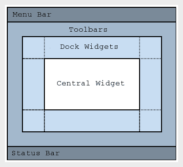

在每个窗口的顶部是 **菜单栏**。文件、编辑和帮助菜单等元素都放在那里。下面是 **工具栏**。工具栏中包含 **停靠小部件**，它们是可以折叠的面板。现在，窗口中的主要控制必须放在 **中央小部件** 位置。由于 UI 由多个小部件组成，因此创建一个包含子小部件的小部件将是有益的。这个父小部件是你将放入 **中央小部件** 区域的部件。为此，我们调用 `setCentralWidget()` 并传递父小部件。在窗口底部是 **状态栏**。

要运行应用程序，我们需要创建我们自定义窗口类的实例。在头文件和 `.cpp` 文件所在的同一文件夹中创建一个名为 `main.cpp` 的文件。将以下代码行添加到 `main.cpp` 中：

```cpp
#include <QApplication>
#include "mainwindow.h"
int main(int argc, char *argv[])
{
   QApplication app(argc, argv);
   MainWindow mainwindow;
   mainwindow.show();
   return app.exec();
}
```

我们包含了头文件 `mainwindow.h`，其中包含了我们自定义类 `MainWindow` 的声明。没有这个头文件，编译器将不知道在哪里找到 `MainWindow` 类的定义。

创建了一个 `MainWindow` 的实例，并调用了它的 `show()` 方法。我们仍然需要在 `mainwindow` 上调用 `show()` 方法。`MainWindow` 是 `QMainWindow` 的子类，并且表现得就像任何其他小部件一样。此外，正如我们已经知道的，要使小部件出现，必须在该小部件上调用 `show()` 方法。

要运行程序，通过命令行进入文件夹，并执行以下命令：

```cpp
% qmake -project
```

将 `QT += widgets` 添加到生成的 `.pro` 文件中。现在继续执行下一组命令：

```cpp
% qmake
% make
```

再次检查 `.pro` 文件。在文件的底部，我们有以下几行：

```cpp
HEADERS += mainwindow.h
SOURCES += main.cpp mainwindow.cpp
```

标头文件会自动收集并添加到`HEADERS`中。同样，`.cpp`文件会被收集并添加到`SOURCES`中。始终记得在出现编译错误时检查此文件，以确保已添加所有必需的文件。

要运行程序，请发出以下命令：

```cpp
% ./classSimpleWindow
```

对于在 macOS 上工作的人来说，为了运行可执行文件，你需要发出的正确命令如下：

```cpp
% ./classSimpleWindow.app/Contents/MacOS/classSimpleWindow
```

运行中的应用程序应如下所示：

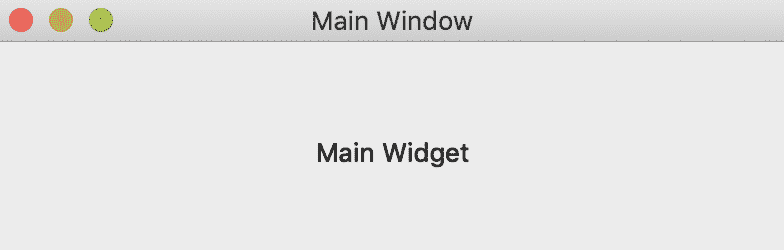

# 菜单栏

大多数应用程序都包含一组可点击的菜单项，这些菜单项会显示另一组动作列表，从而向用户展示更多功能。其中最受欢迎的是文件、编辑和帮助菜单。

在 Qt 中，菜单栏占据窗口的顶部。我们将创建一个简短的程序来使用菜单栏。

在新创建的文件夹中必须创建三个文件。这些如下所示：

+   `main.cpp`

+   `mainwindow.h`

+   `mainwindow.cpp`

在内容方面，`main.cpp`文件将保持不变。因此，从上一节复制`main.cpp`文件。让我们检查`mainwindow.h`文件：

```cpp
#ifndef MAINWINDOW_H
#define MAINWINDOW_H
#include <QMainWindow>
#include <QApplication>
#include <QAction>
#include <QtGui>
#include <QAction>
#include <QMenuBar>
#include <QMenu>
#include <Qt>
class MainWindow : public QMainWindow
{
   Q_OBJECT
   public:
       MainWindow();
   private slots:
   private:
       // Menus
       QMenu *fileMenu;
       QMenu *helpMenu;
       // Actions
       QAction *quitAction;
       QAction *aboutAction;
       QAction *saveAction;
       QAction *cancelAction;
       QAction *openAction;
       QAction *newAction;
       QAction *aboutQtAction;

};
#endif
```

再次，头文件被包含在一个`ifndef`指令中，以防止由于多次包含此文件而可能发生的错误。

要在窗口内创建一个菜单，你需要`QMenu`的实例。每个菜单，如文件菜单，都将有子菜单或项目，这些项目构成了菜单。文件菜单通常有打开、新建和关闭子菜单。

菜单栏的典型图像如下，包括文件、编辑和帮助菜单。文件菜单下的文件菜单项包括新建...、打开...、保存、另存为...和退出：

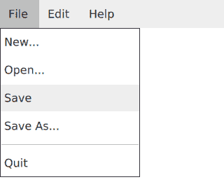

我们的应用程序将只有两个菜单，即`fileMenu`和`helpMenu`。其他`QAction`实例是单个菜单项：`quitAction`、`saveAction`、`cancelAction`和`newAction`。

菜单和子菜单项都被定义为头文件中的类的成员。此外，这种声明将允许用户修改它们的行为，并在将它们连接到套接字时轻松访问它们。

现在，让我们切换到`mainwindow.cpp`。将以下代码复制到`mainwindow.cpp`中：

```cpp
#include "mainwindow.h"
MainWindow::MainWindow()
{
   setWindowTitle("SRM System");
   setFixedSize(500, 500);
   QPixmap newIcon("new.png");
   QPixmap openIcon("open.png");
   QPixmap closeIcon("close.png");
   // Setup File Menu
   fileMenu = menuBar()->addMenu("&File");
   quitAction = new QAction(closeIcon, "Quit", this);
   quitAction->setShortcuts(QKeySequence::Quit);
   newAction = new QAction(newIcon, "&New", this);
   newAction->setShortcut(QKeySequence(Qt::CTRL + Qt::Key_C));
   openAction = new QAction(openIcon, "&New", this);
   openAction->setShortcut(QKeySequence(Qt::CTRL + Qt::Key_O));
   fileMenu->addAction(newAction);
   fileMenu->addAction(openAction);
   fileMenu->addSeparator();
   fileMenu->addAction(quitAction);
   helpMenu = menuBar()->addMenu("Help");
   aboutAction = new QAction("About", this);
   aboutAction->setShortcut(QKeySequence(Qt::CTRL + Qt::Key_H));
   helpMenu->addAction(aboutAction);
   // Setup Signals and Slots
   connect(quitAction, &QAction::triggered, this, &QApplication::quit);
}
```

在文件的开始处包含头文件`mainwindow.h`，以便在程序中使用类声明和 Qt 类。

在我们自定义类`MainWindow`的默认构造函数中，我们首先通过调用`setWindowTitle()`并给出一个合适的名称来设置窗口的名称。然后通过调用`setFixedSize()`确定窗口的大小。以下代码块展示了这一点：

```cpp
QPixmap newIcon("new.png");
QPixmap openIcon("open.png");
QPixmap closeIcon("close.png");
```

菜单项可以显示带有图像的旁边。要将图像或图标与菜单项`QAction`关联，首先需要在一个`QPixmap`实例中捕获该图像。`newIcon`、`openIcon`和`closeIcon`变量中捕获了三个这样的图像。这些将在代码的下方使用。

让我们按照以下方式设置`fileMenu`：

```cpp
fileMenu = menuBar()->addMenu("&File");
quitAction = new QAction(closeIcon, "Quit", this);
quitAction->setShortcuts(QKeySequence::Quit);
```

要将菜单添加到窗口中，需要调用`menuBar()`。这将返回一个`QMenu`实例，我们调用该对象的`addMenu`方法，指定要添加的菜单名称。在这里，我们调用我们的第一个菜单，文件。文件中的 F 前面的`"&"`符号将使得按下键盘上的*Alt* + *F*成为可能。

`quitAction`传递了一个`QAction()`实例。`closeIcon`是我们想要与这个子菜单关联的图像。"Quit"是显示名称，`this`关键字使`quitAction`成为`MainWindow`的子小部件。

通过调用`setShortcuts()`将子菜单的快捷键与`quitAction`关联。通过使用`QKeySequence::Quit`，我们掩盖了对平台特定键序列的需求。

`newAction`和`openAction`在其创建中遵循相同的逻辑。

现在我们已经有了`fileMenu`中的菜单和`quitAction`、`newAction`以及`openActions`中的菜单项，我们需要将它们链接在一起：

```cpp
fileMenu->addAction(newAction);
fileMenu->addAction(openAction);
fileMenu->addSeparator();
fileMenu->addAction(quitAction);
```

要添加子菜单项，我们在`QMenu`实例`fileMenu`上调用`addAction()`方法，并传递所需的`QAction`实例。`addSeparator()`用于在我们的菜单项列表中插入一个视觉标记。它也返回一个`QAction`实例，但在此刻我们对此对象不感兴趣。

在应用程序中添加了一个新的菜单及其唯一的子菜单项：

```cpp
helpMenu = menuBar()->addMenu("Help");
aboutAction = new QAction("About", this);
aboutAction->setShortcut(QKeySequence(Qt::CTRL + Qt::Key_H));
helpMenu->addAction(aboutAction);
```

`QAction`封装了一个可以插入到小部件中的通用动作概念。在这里，我们使用`QAction`将动作插入到我们的菜单中。

这些`QAction`实例发出`triggered`信号，可以将该信号连接到套接字以使应用程序发生变化，如下所示：

```cpp
connect(quitAction, &QAction::triggered, this, &QApplication::quit);
```

在类定义中将信号连接到槽时，只需调用`connect()`方法并传递参数，就像通常做的那样。第一个参数是将要发出我们感兴趣信号的对象。`&QAction::triggered`是指定触发信号的一种方式。这等同于写`SIGNAL(triggered())`。`this`关键字指的是将来将要创建的`MainWindow`对象。退出槽由`&QApplication::quit`指定。

连接的信号和槽将创建一种情况，当打开文件菜单并点击关闭按钮时，应用程序将关闭。

运行此示例所需的最后一个文件是`main.cpp`文件。应该将之前创建的`main.cpp`文件复制到这个项目中。

编译并运行项目。典型的输出应该如下所示：

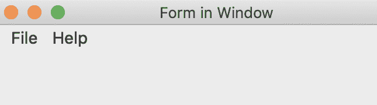

在 Mac 上，按*Command* + *Q*键组合，这将关闭应用程序。在 Linux 和 Windows 上，*Alt* + *F4*应该做同样的事情。这是以下代码行实现的：

```cpp
quitAction->setShortcuts(QKeySequence::Quit);
```

这行代码通过依赖于 Qt 的`QKeySequence::Quit`来模糊不同操作系统之间的差异。

点击文件菜单并选择新建：

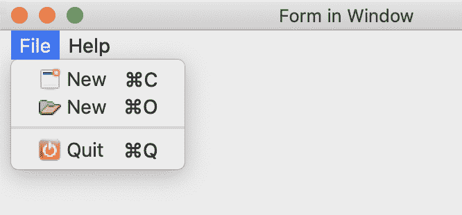

没有发生任何事情。这是因为我们没有定义当用户点击该操作时应发生什么。另一方面，最后一个菜单项“退出”根据我们声明的套接字和槽关闭应用程序。

此外，请注意每个菜单项前面都有一个适当的图标或图像。

访问 Packt 网站以获取本书的图像。

# 工具栏

在菜单栏下方是一个通常被称为工具栏的面板。它包含一组控件，可以是小部件或`QAction`的实例，就像我们在创建菜单栏时看到的那样。这也意味着你可以选择用小部件替换`QAction`，例如一个普通的`QPushButton`或`QComboBox`。

工具栏可以固定在窗口顶部（菜单栏下方），可以将其固定在那里或使其在停靠小部件周围浮动。

再次强调，我们需要创建一个新的项目或修改本章前一部分的项目。我们将创建的文件是`main.cpp`、`mainwindow.h`和`mainwindow.cpp`。

`main.cpp`文件保持不变，如下所示。我们仅实例化我们的自定义类，并在其上调用`show()`：

```cpp
#include <QApplication>
#include "mainwindow.h"
int main(int argc, char *argv[])
{
   QApplication app(argc, argv);
   QCoreApplication::setAttribute(Qt::AA_DontUseNativeMenuBar); //
   MainWindow mainwindow;
   mainwindow.show();
   return app.exec();
}
```

`mainwindow.h`文件将基本上包含将持有我们工具栏中的操作的`QAction`成员：

```cpp
#ifndef MAINWINDOW_H
#define MAINWINDOW_H
#include <QMainWindow>
#include <QApplication>
#include <QAction>
#include <QPushButton>
#include <QAction>
#include <QMenuBar>
#include <QMenu>
#include <QtGui>
#include <Qt>
#include <QToolBar>
#include <QTableView>
class MainWindow : public QMainWindow
{
   Q_OBJECT
   public:
       MainWindow();
   private slots:
   private:
       // Menus
       QMenu *fileMenu;
       QMenu *helpMenu;
       // Actions
       QAction *quitAction;
       QAction *aboutAction;
       QAction *saveAction;
       QAction *cancelAction;
       QAction *openAction;
       QAction *newAction;
       QAction *aboutQtAction;
       QToolBar *toolbar;
       QAction *newToolBarAction;
       QAction *openToolBarAction;
       QAction *closeToolBarAction;
};
#endif
```

此头文件看起来与之前相同。唯一的不同之处在于`QToolbar`实例`*toolbar`和将在工具栏中显示的`QAction`对象。这些是`newToolBarAction`、`openToolBarAction`和`closeToolBarAction`。在菜单中使用的`QAction`实例与工具栏中使用的相同。

注意没有声明槽。

`mainwindow.cpp`文件将包含以下内容：

```cpp
#include "mainwindow.h"
MainWindow::MainWindow()
{
   setWindowTitle("Form in Window");
   setFixedSize(500, 500);
   QPixmap newIcon("new.png");
   QPixmap openIcon("open.png");
   QPixmap closeIcon("close.png");
   // Setup File Menu
   fileMenu = menuBar()->addMenu("&File");
   quitAction = new QAction(closeIcon, "Quit", this);
   quitAction->setShortcuts(QKeySequence::Quit);
   newAction = new QAction(newIcon, "&New", this);
   newAction->setShortcut(QKeySequence(Qt::CTRL + Qt::Key_C));
   openAction = new QAction(openIcon, "&New", this);
   openAction->setShortcut(QKeySequence(Qt::CTRL + Qt::Key_O));
   fileMenu->addAction(newAction);
   fileMenu->addAction(openAction);
   fileMenu->addSeparator();
   fileMenu->addAction(quitAction);
   helpMenu = menuBar()->addMenu("Help");
   aboutAction = new QAction("About", this);
   aboutAction->setShortcut(QKeySequence(Qt::CTRL + Qt::Key_H));
   helpMenu->addAction(aboutAction);
   // Setup Tool bar menu
   toolbar = addToolBar("main toolbar");
   // toolbar->setMovable( false );
   newToolBarAction = toolbar->addAction(QIcon(newIcon), "New File");
   openToolBarAction = toolbar->addAction(QIcon(openIcon), "Open File");
   toolbar->addSeparator();
   closeToolBarAction = toolbar->addAction(QIcon(closeIcon), "Quit Application");
   // Setup Signals and Slots
   connect(quitAction, &QAction::triggered, this, &QApplication::quit);
   connect(closeToolBarAction, &QAction::triggered, this, &QApplication::quit);
}
```

用于菜单栏的相同图标集也将用于工具栏。

要获取用于进一步操作的 Windows 工具栏的实例，请调用`addTooBar()`方法，它将返回一个`QToolBar`的实例。该方法接受任何用作窗口标题的文本。它还将工具栏添加到窗口中。

到目前为止的工具栏可以在窗口内移动。要将它固定在窗口顶部，请在`QToolBar`实例`toolbar`上调用`toolbar->setMovable(false);`函数：

```cpp
newToolBarAction = toolbar->addAction(QIcon(newIcon), "New File");
openToolBarAction = toolbar->addAction(QIcon(openIcon), "Open File");
toolbar->addSeparator();
closeToolBarAction = toolbar->addAction(QIcon(closeIcon), "Quit Application");
```

创建了两个`QAction`对象，并将它们传递给`newToolBarAction`和`openToolBarAction`对象。我们传递了`QIcon`对象，它将成为`QAction`上的图像，以及一个用作工具提示的名称或文本。通过调用`addSeparator()`方法，在工具栏中添加了一个分隔符。最后一个控件`closeToolBarAction`包含要在工具栏上显示的图像。

将`closeToolBarAction`的触发信号链接到窗口的退出槽，我们进行以下操作：

```cpp
connect(closeToolBarAction, &QAction::triggered, this, &QApplication::quit);
```

要编译此项目作为复习，请运行以下命令：

```cpp
% qmake -project
```

将`QT += widgets`添加到生成的`.pro`文件中，并确保文件底部列出所有三个文件：

按顺序发出以下命令以构建项目：

```cpp
% qmake
% make
% ./name_of_executable
```

如果一切顺利，您将看到以下内容：

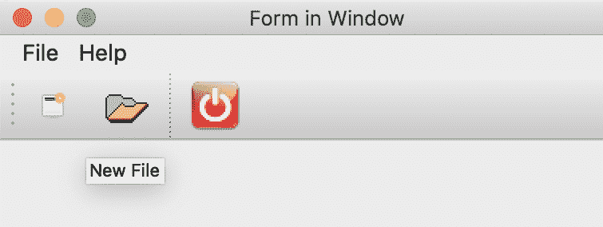

上一张截图显示了文件和帮助菜单下方的工具栏。三个图标显示了代表新建、打开和关闭操作的三个`QAction`对象。只有最后一个按钮（关闭应用程序）的操作是有效的。这是因为我们只为`closeToolBarAction`和`QAction`对象定义了一个信号-槽连接。

通过将鼠标悬停在工具栏菜单项上，会出现一些文本。这个消息被称为工具提示。如前图所示，打开文件消息是从以下行的最后一个参数派生出来的：

```cpp
openToolBarAction = toolbar->addAction(QIcon(openIcon), "Open File");
```

如前所述，工具栏可以在窗口内移动，如下所示：

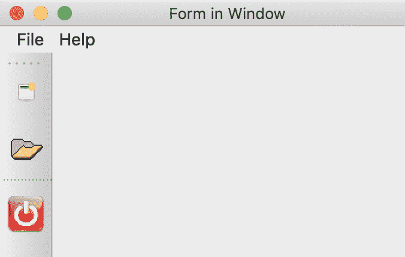

如您所见，通过点击工具栏左侧的三个垂直点并移动它，您可以将工具栏从顶部移至左侧、右侧或底部。要显示此类功能，请发出以下命令：

```cpp
toolbar->setMovable(false);
```

这将使工具栏固定在顶部，使其不能移动。

# 添加其他小部件

到目前为止，我们只向窗口添加了菜单栏和工具栏。为了添加可能使我们的应用程序更有用的其他小部件，我们必须向头文件中添加更多成员。在本节中，我们将创建一个简单的应用程序，将个人详细信息追加到可显示的列表中。

将会收到一个表单，其中包含多个联系人的详细信息。这些详细信息随后将被添加到窗口上的一个列表中。随着联系人的增加，列表也会增长。我们将基于前一个部分的代码并在此基础上继续构建。

如常，您创建一个包含三个文件的新文件夹，分别是`main.cpp`、`mainwindow.cpp`和`mainwindow.h`。`main.cpp`文件将保持与之前章节相同。

`mainwindow.h`文件应包含以下代码行：

```cpp
#ifndef MAINWINDOW_H
#define MAINWINDOW_H
#include <QMainWindow>
#include <QApplication>
#include <QLabel>
#include <QLineEdit>
#include <QDate>
#include <QDateEdit>
#include <QVBoxLayout>
#include <QHBoxLayout>
#include <QGridLayout>
#include <QPushButton>
#include <QMessageBox>
#include <QAction>
#include <QMenuBar>
#include <QMenu>
#include <QtGui>
#include <Qt>
#include <QToolBar>
#include <QTableView>
#include <QHeaderView>
```

该文件导入了将在自定义类内部声明成员的类。整个文件被`#ifndef`指令包裹，以便头文件可以被多次包含而不会产生错误。

将以下代码行添加到相同的头文件`mainwindow.h`中：

```cpp
class MainWindow : public QMainWindow
{
   Q_OBJECT
   public:
       MainWindow();
   private slots:
       void saveButtonClicked();
```

然后我们声明我们类的默认构造函数。

在我们的应用程序中只有一个槽，它将被用来将多个小部件的内容移动到列表中。

通过添加以下代码行继续代码列表，这些代码将添加类的成员并定义一些`helper`方法的原型：

```cpp
   private:
       // Widgets
       QWidget *mainWidget;
       QVBoxLayout *centralWidgetLayout;
       QGridLayout *formLayout;
       QHBoxLayout *buttonsLayout;
       QLabel *nameLabel;
       QLabel *dateOfBirthLabel;
       QLabel *phoneNumberLabel;
       QPushButton *savePushButton;
       QPushButton *newPushButton;
       QLineEdit *nameLineEdit;
       QDateEdit *dateOfBirthEdit;
       QLineEdit *phoneNumberLineEdit;
       QTableView *appTable;
       QStandardItemModel *model;
       // Menus
       QMenu *fileMenu;
       QMenu *helpMenu;
       // Actions
       QAction *quitAction;
       QAction *aboutAction;
       QAction *saveAction;
       QAction *cancelAction;
       QAction *openAction;
       QAction *newAction;
       QAction *aboutQtAction;
       QAction *newToolBarAction;
       QAction *openToolBarAction;
       QAction *closeToolBarAction;
       QAction *clearToolBarAction;
       // Toolbar
       QToolBar *toolbar;
       // Icons
       QPixmap newIcon;
       QPixmap openIcon;
       QPixmap closeIcon;
       QPixmap clearIcon;
       // init methods
       void clearFields();
       void createIcons();
       void createMenuBar();
       void createToolBar();
       void setupSignalsAndSlot();
       void setupCoreWidgets();
};
#endif
```

成员包括布局和其他小部件类，以及我们的菜单、工具栏及其关联的`QAction`对象。

如您所见，代码是从前一个部分借用的，除了添加的控件。

私有方法`createIcons()`、`createMenuBar()`、`createToolBar()`、`setupSignalsAndSlot()`和`setupCoreWidgets()`将被用来重构应该存在于我们的默认构造函数中的代码。`clearFields()`方法将被用来清除多个小部件中的数据。

在`mainwindow.cpp`文件中，我们将使用以下代码行定义我们的类：

```cpp
#include "mainwindow.h"
#include "mainwindow.h"
MainWindow::MainWindow()
{
   setWindowTitle("Form in Window");
   setFixedSize(500, 500);
   createIcons();
   setupCoreWidgets();
   createMenuBar();
   createToolBar();
   centralWidgetLayout->addLayout(formLayout);
   centralWidgetLayout->addWidget(appTable);
   centralWidgetLayout->addLayout(buttonsLayout);
   mainWidget->setLayout(centralWidgetLayout);
   setCentralWidget(mainWidget);
   setupSignalsAndSlots();
}
```

在这里，默认构造函数已经进行了大量的重构。代码的构建块已经被移动到函数中，以帮助使代码可读。

现在，我们只设置了应用程序窗口的标题和大小。接下来，我们将调用一个方法来创建各种小部件将使用的图标。通过调用`setupCoreWidgets()`方法，我们再次进行函数调用以设置核心小部件。通过调用`createMenuBar()`和`createToolBar()`方法，创建了菜单和工具栏。

布局对象`centralWidgetLayout`是我们应用程序的主要布局。我们首先添加`formLayout`对象，然后是`appTable`对象。正如你所见，可以将布局插入到另一个布局中。最后，我们插入包含我们的按钮的`buttonsLayout`对象。

将`mainWidget`对象的布局设置为`centralWidgetLayout`。然后，将此`mainWidget`对象设置为应该占据窗口中心的主体小部件，正如本章第一图所示。

所有信号和槽都将设置在`setupSignalsAndSlot()`方法中。

将以下代码行添加到定义`createIcons()`方法的`mainwindow.cpp`文件中：

```cpp
void MainWindow::createIcons() {
    newIcon = QPixmap("new.png");
    openIcon = QPixmap("open.png");
    closeIcon = QPixmap("close.png");
    clearIcon = QPixmap("clear.png");
}
```

`createIcons()`方法将`QPixmap`实例传递给在`mainwindow.h`中声明的成员。

`setupCoreWidgets()`的定义如下，位于`mainwindow.cpp`中：

```cpp
void MainWindow::setupCoreWidgets() {
   mainWidget = new QWidget();
   centralWidgetLayout = new QVBoxLayout();
   formLayout = new QGridLayout();
   buttonsLayout = new QHBoxLayout();
   nameLabel = new QLabel("Name:");
   dateOfBirthLabel= new QLabel("Date Of Birth:");
   phoneNumberLabel = new QLabel("Phone Number");
   savePushButton = new QPushButton("Save");
   newPushButton = new QPushButton("Clear All");
   nameLineEdit = new QLineEdit();
   dateOfBirthEdit = new QDateEdit(QDate::currentDate());
   phoneNumberLineEdit = new QLineEdit();
   // TableView
   appTable = new QTableView();
   model = new QStandardItemModel(1, 3, this);
   appTable->setContextMenuPolicy(Qt::CustomContextMenu);
   appTable->horizontalHeader()->setSectionResizeMode(QHeaderView::Stretch); /** Note **/
   model->setHorizontalHeaderItem(0, new QStandardItem(QString("Name")));
   model->setHorizontalHeaderItem(1, new QStandardItem(QString("Date of Birth")));
   model->setHorizontalHeaderItem(2, new QStandardItem(QString("Phone Number")));   appTable->setModel(model)

   QStandardItem *firstItem = new QStandardItem(QString("G. Shone"));
   QDate dateOfBirth(1980, 1, 1);
   QStandardItem *secondItem = new QStandardItem(dateOfBirth.toString());
   QStandardItem *thirdItem = new QStandardItem(QString("05443394858"));
   model->setItem(0,0,firstItem);
   model->setItem(0,1,secondItem);
   model->setItem(0,2,thirdItem);
   formLayout->addWidget(nameLabel, 0, 0);
   formLayout->addWidget(nameLineEdit, 0, 1);
   formLayout->addWidget(dateOfBirthLabel, 1, 0);
   formLayout->addWidget(dateOfBirthEdit, 1, 1);
   formLayout->addWidget(phoneNumberLabel, 2, 0);
   formLayout->addWidget(phoneNumberLineEdit, 2, 1);
   buttonsLayout->addStretch();
   buttonsLayout->addWidget(savePushButton);
   buttonsLayout->addWidget(newPushButton);
}
```

在这里，我们只是实例化在应用程序中使用的对象。这里没有什么不同寻常的。`nameLineEdit`和`phoneNumberLineEdit`将被用来收集即将保存的联系人姓名和电话号码。`dateOfBirthEdit`是一种特殊的文本框，允许你指定日期。`savePushButton`和`newPushButton`是按钮，将被用来触发联系人的保存和列表的清除。

标签和行编辑控件将被用于`formLayout`对象，这是一个`QGridLayout`实例。`QGridLayout`允许通过列和行指定小部件。

要保存联系人，这意味着我们将将其保存到可以显示项目列表的小部件中。Qt 有多个此类小部件。这些包括`QListView`、`QTableView`和`QTreeView`。

当使用`QListView`显示信息时，它通常如下所示：

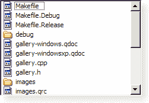

`QTableView`将使用列和行在单元格中显示数据或信息，如下所示：

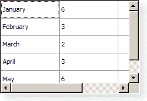

为了显示层次信息，`QTreeView` 也被使用，如下面的截图所示：

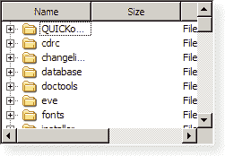

将 `QTableView` 的一个实例传递给 `appTable`。我们需要为我们的 `QTableView` 实例提供一个模型。该模型将保存将在表格中显示的数据。当数据被添加或从模型中删除时，其相应的视图将自动更新以显示发生的变化。这里的模型是 `QStandardItemModel` 的一个实例。`QStandardItemModel(1, 3, this)` 这行代码将创建一个具有一行三列的实例。`this` 关键字用于使模型成为 `MainWindow` 对象的子对象：

```cpp
appTable->setContextMenuPolicy(Qt::CustomContextMenu);
```

这行代码用于帮助我们定义当我们在表格上打开上下文菜单时应发生的自定义操作：

```cpp
appTable->horizontalHeader()->setSectionResizeMode(
QHeaderView::Stretch); /** Note **/
```

前面的这一行很重要，它使得我们的表格标题可以完全拉伸。这是省略该行时的结果（如红色方框所示区域）：

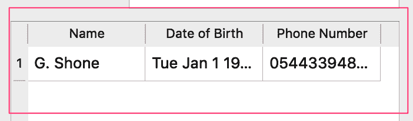

理想情况下，我们希望我们的表格具有以下标题，以便看起来像这样：

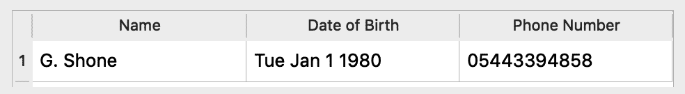

要设置表格的标题，我们可以使用以下代码行：

```cpp
model->setHorizontalHeaderItem(0, new QStandardItem(QString("Name")));
```

显示联系人的表格需要标题。模型对象上的 `setHorizontalHeaderItem()` 方法使用第一个参数来指示新 `QStandardItem(QString())` 应该插入的位置。由于我们的表格使用三列，因此标题行重复三次，分别是姓名、出生日期和电话号码：

```cpp
appTable->setModel(model);
QStandardItem *firstItem = new QStandardItem(QString("G. Shone"));
QDate dateOfBirth(1980, 1, 1);
QStandardItem *secondItem = new QStandardItem(dateOfBirth.toString());
QStandardItem *thirdItem = new QStandardItem(QString("05443394858"));
model->setItem(0,0,firstItem);
model->setItem(0,1,secondItem);
model->setItem(0,2,thirdItem);
```

我们通过在 `appTable` 上调用 `setModel()` 并将 `model` 作为参数传递，使 `model` 成为我们的 `QTableView` 的模型。

为了填充我们的模型，从而更新其视图 `QTableView`，我们将创建 `QStandardItem` 的实例。我们的表格中的每个单元格都必须封装在这个类中。`dateOfBirth` 是 `QDate` 类型，因此我们在其上调用 `toString()` 并将其传递给 `new QStandardItem()`。通过指定行和列，`firstItem` 被插入到我们的模型中，如 `model->setItem(0, 0, firstItem);` 这行代码所示。

这也适用于第二个和第三个 `QStandardItem` 对象。

现在，让我们填充我们的 `formLayout` 对象。这是一个 `QGridLayout` 类型的对象。要向布局中插入小部件，请使用以下代码行：

```cpp
formLayout->addWidget(nameLabel, 0, 0);
formLayout->addWidget(nameLineEdit, 0, 1);
formLayout->addWidget(dateOfBirthLabel, 1, 0);
formLayout->addWidget(dateOfBirthEdit, 1, 1);
formLayout->addWidget(phoneNumberLabel, 2, 0);
formLayout->addWidget(phoneNumberLineEdit, 2, 1);
```

我们通过调用 `addWidget()` 并提供小部件及其应填充的行和列来向布局添加小部件。`0, 0` 将填充第一个单元格，`0, 1` 将填充第一行的第二个单元格，而 `1, 0` 将填充第二行的第一个单元格。

以下代码向 `buttonsLayout` 的 `QHBoxLayout` 实例添加按钮：

```cpp
buttonsLayout->addStretch();
buttonsLayout->addWidget(savePushButton);
buttonsLayout->addWidget(newPushButton);
```

要将 `savePushButton` 和 `newPushButton` 推送到右侧，我们首先通过在调用 `addWidget()` 添加小部件之前调用 `addStretch()` 来添加一个拉伸，以填充空余空间。

在我们来到应用程序的菜单之前，请添加以下代码。为了将菜单和工具栏添加到我们的应用程序中，请将`createMenuBar()`和`createToolBar()`的定义添加到`mainwindow.cpp`文件中：

```cpp
void MainWindow::createMenuBar() {
   // Setup File Menu
   fileMenu = menuBar()->addMenu("&File");
   quitAction = new QAction(closeIcon, "Quit", this);
   quitAction->setShortcuts(QKeySequence::Quit);
   newAction = new QAction(newIcon, "&New", this);
   newAction->setShortcut(QKeySequence(Qt::CTRL + Qt::Key_C));
   openAction = new QAction(openIcon, "&New", this);
   openAction->setShortcut(QKeySequence(Qt::CTRL + Qt::Key_O));
   fileMenu->addAction(newAction);
   fileMenu->addAction(openAction);
   fileMenu->addSeparator();
   fileMenu->addAction(quitAction);
   helpMenu = menuBar()->addMenu("Help");
   aboutAction = new QAction("About", this);
   aboutAction->setShortcut(QKeySequence(Qt::CTRL + Qt::Key_H));
   helpMenu->addAction(aboutAction);
}
void MainWindow::createToolBar() {
   // Setup Tool bar menu
   toolbar = addToolBar("main toolbar");
   // toolbar->setMovable( false );
   newToolBarAction = toolbar->addAction(QIcon(newIcon), "New File");
   openToolBarAction = toolbar->addAction(QIcon(openIcon), "Open File");
   toolbar->addSeparator();
   clearToolBarAction = toolbar->addAction(QIcon(clearIcon), "Clear All");
   closeToolBarAction = toolbar->addAction(QIcon(closeIcon), "Quit Application");
}
```

前面的代码是添加工具栏和菜单到我们窗口的熟悉代码。代码的最后几行定义了`setupSignalsAndSlots()`方法：

```cpp
void MainWindow::setupSignalsAndSlots() {
   // Setup Signals and Slots
   connect(quitAction, &QAction::triggered, this, &QApplication::quit);
   connect(closeToolBarAction, &QAction::triggered, this, &QApplication::quit);
   connect(savePushButton, SIGNAL(clicked()), this, SLOT(saveButtonClicked()));
}
```

在前面的代码中，我们将`quitAction`的触发信号连接到`QApplication`的退出槽。`closeToolBarAction`的触发信号也被连接到相同的槽，以实现关闭应用程序的效果。

`savePushButton`的`clicked()`信号被连接到槽`saveButtonClicked()`。因为它是在我们的类中定义的，所以在第三个参数中使用`this`关键字。

确保输入到表单中的信息被保存的确切操作是由充当槽的`saveButtonClicked()`函数定义的。

要定义我们的槽，请将以下代码添加到`mainwindow.cpp`中：

```cpp
void MainWindow::saveButtonClicked()
{
  QStandardItem *name = new QStandardItem(nameLineEdit->text());
  QStandardItem *dob = new QStandardItem(dateOfBirthEdit->date().toString());
   QStandardItem *phoneNumber = new QStandardItem(phoneNumberLineEdit->text());
   model->appendRow({ name, dob, phoneNumber});
   clearFields();
}
```

当`saveButtonClicked()`被调用时，我们将从控件`nameLinedEdit`、`dateOfBirthEdit`和`phoneNumberLineEdit`中提取值。通过在模型对象上调用`appendRow()`，我们将它们追加到模型中。我们可以访问模型对象，因为它是我们类定义中的一个成员指针变量。

将新联系人信息添加到列表后，所有字段都会通过调用`clearFields()`方法被清除并重置。

为了清除字段，我们调用`clearFields()`，该函数在`mainwindow.cpp`中定义如下：

```cpp
void MainWindow::clearFields()
{
   nameLineEdit->clear();
   phoneNumberLineEdit->setText("");
   QDate dateOfBirth(1980, 1, 1);
   dateOfBirthEdit->setDate(dateOfBirth);
}
```

通过调用`clear()`方法，`nameLineEdit`对象被重置为空字符串。此方法也充当槽。将`QLineEdit`对象设置为空字符串的另一种方法是调用`setText("")`来设置文本：

因为`QDateEdit`接受日期，所以我们必须创建一个`date`实例并将其传递给`dateOfBirthEdit`的`setDate()`。

编译并运行项目。你应该会看到以下输出：

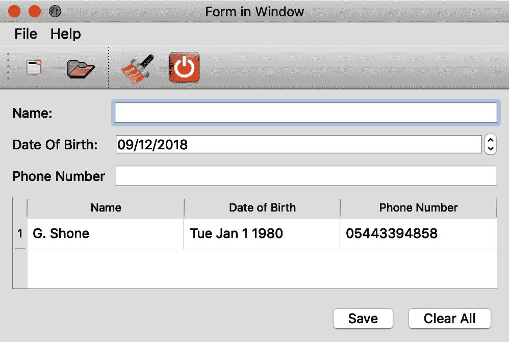

添加新联系人，请填写表格并点击保存按钮：

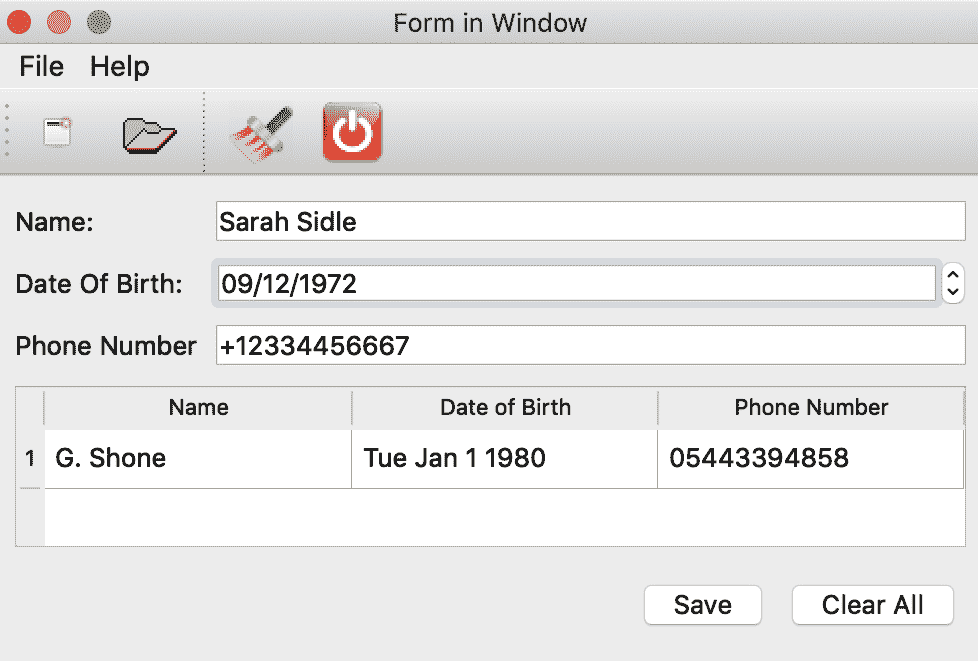

在点击保存按钮后，你应该会看到以下内容：

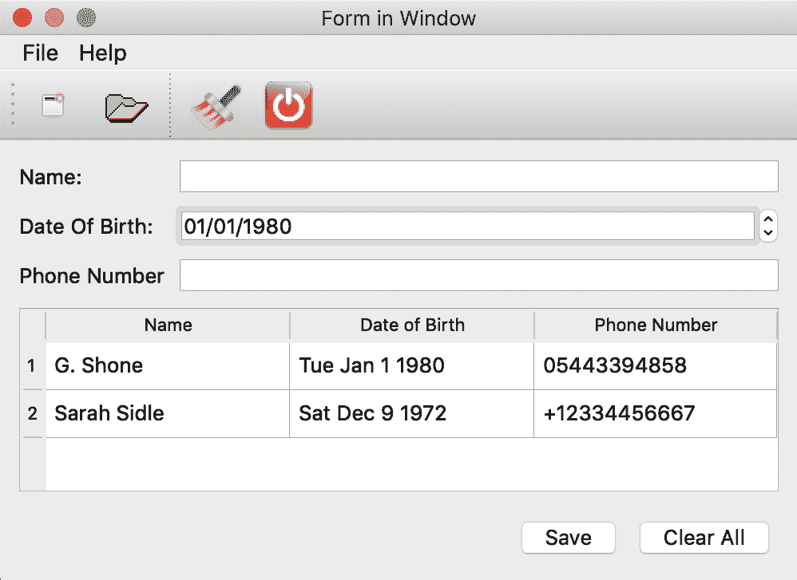

# 添加对话框

有时候，应用程序需要通知用户一个动作或接收输入以进行进一步处理。通常，会出现另一个窗口，通常是小型窗口，其中包含此类信息或说明。在 Qt 中，`QMessageBox`为我们提供了使用`QInputDialog`发出警报和接收输入的功能。

如下表所述，有不同的消息：

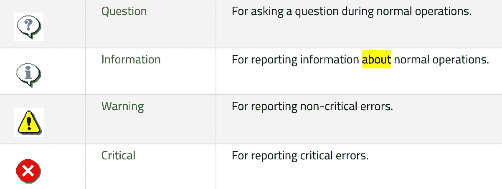

为了向用户传达最近完成的任务，可以创建`QMessage`实例的以下代码列表作为示例：

```cpp
QMessageBox::information(this, tr("RMS System"), tr("Record saved successfully!"),QMessageBox::Ok|QMessageBox::Default,
QMessageBox::NoButton, QMessageBox::NoButton);
```

前面的代码列表将产生如下输出：

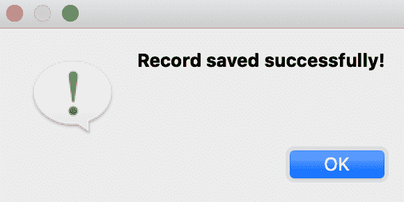

这个 `QMessageBox` 实例正在被用来向用户传达操作成功。

`QMessageBox` 实例的图标和按钮数量是可以配置的。

让我们完成正在编写的联系应用，以展示如何使用 `QMessageBox` 和 `QInputDialog`。

选择基于上一节中的示例进行构建，或者创建一个包含我们迄今为止一直在使用的三个主要文件的新文件夹，即 `main.cpp`、`mainwindow.cpp` 和 `mainwindow.h`。

`mainwindow.h` 文件应包含以下内容：

```cpp
#ifndef MAINWINDOW_H
#define MAINWINDOW_H
#include <QMainWindow>
#include <QApplication>
#include <QLabel>
#include <QLineEdit>
#include <QDate>
#include <QDateEdit>
#include <QVBoxLayout>
#include <QHBoxLayout>
#include <QGridLayout>
#include <QPushButton>
#include <QMessageBox>
#include <QAction>
#include <QMenuBar>
#include <QMenu>
#include <QtGui>
#include <Qt>
#include <QToolBar>
#include <QTableView>
#include <QHeaderView>
#include <QInputDialog>
class MainWindow : public QMainWindow
{
   Q_OBJECT
   public:
       MainWindow();
   private slots:
       void saveButtonClicked();
       void aboutDialog();
       void clearAllRecords();
       void deleteSavedRecord();
   private:
       // Widgets
       QWidget *mainWidget;
       QVBoxLayout *centralWidgetLayout;
       QGridLayout *formLayout;
       QHBoxLayout *buttonsLayout;
       QLabel *nameLabel;
       QLabel *dateOfBirthLabel;
       QLabel *phoneNumberLabel;
       QPushButton *savePushButton;
       QPushButton *clearPushButton;
       QLineEdit *nameLineEdit;
       QDateEdit *dateOfBirthEdit;
       QLineEdit *phoneNumberLineEdit;
       QTableView *appTable;
       QStandardItemModel *model;
       // Menus
       QMenu *fileMenu;
       QMenu *helpMenu;
       // Actions
       QAction *quitAction;
       QAction *aboutAction;
       QAction *saveAction;
       QAction *cancelAction;
       QAction *openAction;
       QAction *newAction;
       QAction *aboutQtAction;
       QAction *newToolBarAction;
       QAction *openToolBarAction;
       QAction *closeToolBarAction;
       QAction *clearToolBarAction;
       QAction *deleteOneEntryToolBarAction;
       // Icons
       QPixmap newIcon;
       QPixmap openIcon;
       QPixmap closeIcon;
       QPixmap clearIcon;
       QPixmap deleteIcon;
       // Toolbar
       QToolBar *toolbar;
       void clearFields();
       void createIcons();
       void createMenuBar();
       void createToolBar();
       void setupSignalsAndSlots();
       void setupCoreWidgets();
};
#endif
```

唯一值得注意的是槽的数量有所增加。`saveButtonClicked()` 槽将被重新实现，以弹出一个消息告知用户保存操作成功。`aboutDialog()` 槽将用于显示关于信息。这通常是一个传达有关程序信息的窗口，通常包含版权、帮助和联系方式。

`clearAllRecords()` 槽将调用一个询问消息框，提示用户即将执行破坏性操作。`deleteSavedRecord()` 将使用 `QInputDialog` 接受用户输入，以确定从我们的联系人列表中删除哪一行。

`QAction *aboutQtAction` 将用于调用显示关于页面或消息的插槽。我们还将添加一个工具栏操作 `QAction *deleteOneEntryToolBarAction`，它将用于调用一个接收用户输入的对话框。观察这三个输入，`QPixmap deleteIcon`、`QPixmap clearIcon` 和 `QPixmap deleteIcon`，随着我们向窗口添加更多操作，同样还有 `QPushButton*clearPushButton`，它正在替换上一个示例中的 `newPushButton`。

关于头文件的其他内容保持不变。额外导入的两个类是 `QMessageBox` 和 `QInputDialog` 类。

在 `mainwindow.cpp` 文件中，我们定义 `MainWindow` 类的默认构造函数如下：

```cpp
#include "mainwindow.h"
MainWindow::MainWindow()
{
   setWindowTitle("RMS System");
   setFixedSize(500, 500);
   setWindowIcon(QIcon("window_logo.png"));
   createIcons();
   setupCoreWidgets();
   createMenuBar();
   createToolBar();
   centralWidgetLayout->addLayout(formLayout);
   centralWidgetLayout->addWidget(appTable);
   //centralWidgetLayout->addStretch();
   centralWidgetLayout->addLayout(buttonsLayout);
   mainWidget->setLayout(centralWidgetLayout);
   setCentralWidget(mainWidget);
   setupSignalsAndSlots();
}
```

这次，我们希望给整个应用程序添加一个图标，当它在运行时会在任务栏或托盘上显示。为此，我们调用 `setWindowIcon()` 方法，并传入 `QIcon("window_logo.png")` 实例。

`window_logo.png` 文件包含在项目中，以及其他用作此书 Packt 网站附件的图像文件。

在之前的示例中，一切保持不变。设置应用程序各个部分的方法已经略有修改。

`setupSignalsAndSlots()` 方法使用以下代码实现：

```cpp
void MainWindow::setupSignalsAndSlots() {
   // Setup Signals and Slots
   connect(quitAction, &QAction::triggered, this, &QApplication::quit);
   connect(aboutAction, SIGNAL(triggered()), this, SLOT(aboutDialog()));
   connect(clearToolBarAction, SIGNAL(triggered()), this, SLOT(clearAllRecords()));
   connect(closeToolBarAction, &QAction::triggered, this, &QApplication::quit);
   connect(deleteOneEntryToolBarAction, SIGNAL(triggered()), this, SLOT(deleteSavedRecord()));
   connect(savePushButton, SIGNAL(clicked()), this, SLOT(saveButtonClicked()));
   connect(clearPushButton, SIGNAL(clicked()), this, SLOT(clearAllRecords()));
}
```

`aboutAction` 的 `triggered()` 信号连接到 `aboutDialog()` 插槽。此方法会弹出一个对话框，用于显示包含有关应用程序的一些信息和应用程序标志（我们通过调用 `setWindowIcon()` 定义）的窗口：

```cpp
void MainWindow::aboutDialog()
{
   QMessageBox::about(this, "About RMS System","RMS System 2.0" "<p>Copyright &copy; 2005 Inc." "This is a simple application to demonstrate the use of windows," "tool bars, menus and dialog boxes");
}
```

静态方法`QMessageBox::about()`以`this`作为其第一个参数被调用。窗口的标题是第二个参数，第三个参数是一个描述应用程序的字符串。

在运行时，点击帮助菜单，然后点击关于。你应该看到以下输出：

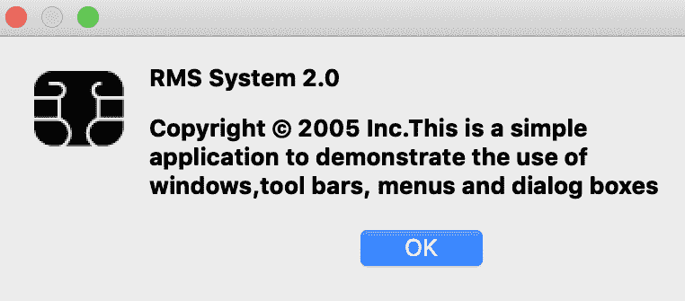

在`setupSignalsAndSlots()`方法中建立的第三个信号-槽连接如下：

```cpp
connect(clearToolBarAction, SIGNAL(triggered()), this, SLOT(clearAllRecords()));
```

在`clearAllRecords()`槽中，我们将首先使用提示来询问用户，他们是否确定要删除模型中的所有项目。这可以通过以下代码实现：

```cpp
int status = QMessageBox::question( this, tr("Delete Records ?"), tr("You are about to delete all saved records "
"<p>Are you sure you want to delete all records "),                                   QMessageBox::No|QMessageBox::Default, QMessageBox::No|QMessageBox::Escape, QMessageBox::NoButton);
if (status == QMessageBox::Yes)
   return model->clear();
```

`QMessageBox::question`用于弹出一个对话框来询问用户问题。它有两个主要按钮，是和否。`QMessageBox::No|QMessageBox::Default`将“否”选项设置为默认选择。`QMessageBox::No|QMessageBox::Escape`使得 Esc 键具有与点击“否”选项相同的效果。

用户选择的任何选项都将存储为`int`类型的`status`变量。然后，它将与`QMessageBox::Yes`常量进行比较。这种方式询问用户是或否的问题信息不足，尤其是在用户点击“是”时将执行破坏性操作的情况下。我们将在`clearAllRecords()`中使用定义的替代形式：

```cpp
void MainWindow::clearAllRecords()
{
   */
   int status = QMessageBox::question( this, tr("Delete all Records ?"), tr("This operation will delete all saved records. " "<p>Do you want to remove all saved records ? "
 ), tr("Yes, Delete all records"), tr("No !"),  QString(), 1, 1);
   if (status == 0) {
       int rowCount = model->rowCount();
       model->removeRows(0, rowCount);
   }
}
```

如同往常，父对象由`this`指向。第二个参数是对话框的标题，接下来是问题的字符串。我们将第一个选项描述得详细一些，通过传递“是，删除所有记录”。用户阅读后，将知道点击按钮会有什么效果。`No !`参数将显示在代表问题另一个答案的按钮上。传递`QString()`是为了不显示第三个按钮。当点击第一个按钮时，`status`将返回`0`。当点击第二个按钮或选项时，将返回`1`。通过指定`1`，我们使`"No !"`按钮成为对话框的默认按钮。我们再次选择`1`，因为最后一个参数指定当按下 Esc 键时应该选择`"No !"`按钮。

如果用户点击“是，删除所有记录”按钮，则`status`将存储`0`。在`if`语句的主体中，我们获取我们的模型对象的行数。调用`removeRows`并指定从第一个（由`0`表示）到`rowCount`的所有条目都应该被删除。然而，如果用户点击“No !”按钮，应用程序将不执行任何操作，因为我们没有在`if`语句中指定这一点。

当点击“清除所有”按钮时，对话框窗口应如下显示：

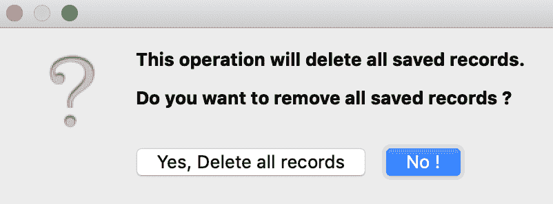

`saveButtonClicked()`槽也被修改，向用户显示一个简单的消息，表明操作已成功，如下代码块所示：

```cpp
void MainWindow::saveButtonClicked()
{
   QStandardItem *name = new QStandardItem(nameLineEdit->text());
   QStandardItem *dob = new QStandardItem(dateOfBirthEdit->date().toString());
   QStandardItem *phoneNumber = new QStandardItem(phoneNumberLineEdit->text());
   model->appendRow({ name, dob, phoneNumber});
   clearFields();
   QMessageBox::information(this, tr("RMS System"), tr("Record saved successfully!"),
                            QMessageBox::Ok|QMessageBox::Default,
                            QMessageBox::NoButton, QMessageBox::NoButton);
}
```

最后两个参数是常数，用于防止按钮在消息框中显示。

为了允许应用程序从表中删除某些行，使用`deleteSaveRecords()`方法来弹出一个基于输入的对话框，该对话框接收我们想要删除的行的`rowId`：

```cpp
void MainWindow::deleteSavedRecord()
{
   bool ok;
   int rowId = QInputDialog::getInt(this, tr("Select Row to delete"), tr("Please enter Row ID of record (Eg. 1)"),
  1, 1, model->rowCount(), 1, &ok );
   if (ok)
   {
       model->removeRow(rowId-1);
   }
}
```

`this`关键字指的是父对象。静态方法`QInputDialog::getInt()`的第二个参数用作对话框窗口的标题。请求被捕获在第二个参数中。这里的第三个参数用于指定输入字段的默认数值。`1`和`model->rowCount()`是应接受的最低和最高值。

倒数第二个参数`1`是最低值和最高值之间的增量步长。`True`或`False`将被存储在`&ok`中。当用户点击“确定”时，`True`将被存储在`&ok`中，基于这一点，`if`语句将调用模型对象的`removeRow`。用户输入的任何值都将传递给`rowId`。我们传递`rowId-1`以获取模型中行的实际索引。

通过执行以下命令建立与此槽的连接：

```cpp
connect(deleteOneEntryToolBarAction, SIGNAL(triggered()), this, 
SLOT(deleteSavedRecord()));
```

`deleteOneEntryToolBarAction`是工具栏上的倒数第二个操作。

以下截图是用户点击此操作时将出现的界面：

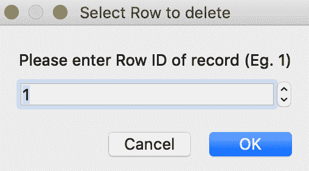

设置工具栏的方法如下所示：

```cpp
void MainWindow::createToolBar() {
   // Setup Tool bar menu
   toolbar = addToolBar("main toolbar");
   // toolbar->setMovable( false );
   newToolBarAction = toolbar->addAction(QIcon(newIcon), "New File");
   openToolBarAction = toolbar->addAction(QIcon(openIcon), "Open File");
   toolbar->addSeparator();
   clearToolBarAction = toolbar->addAction(QIcon(clearIcon), "Clear All");
   deleteOneEntryToolBarAction = toolbar->addAction(QIcon(deleteIcon), "Delete a record");
   closeToolBarAction = toolbar->addAction(QIcon(closeIcon), "Quit Application");
}
```

所有其他方法都是从上一节借用的，可以从本书附带的源代码中获得。

总结一下，编译并运行项目后你应该看到以下内容：

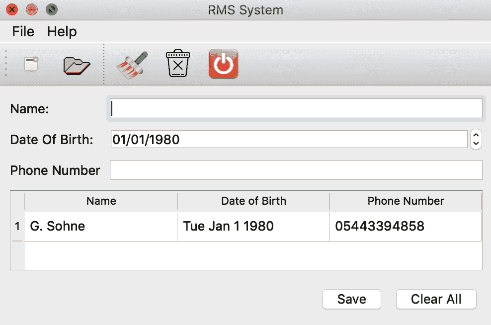

记住，我们已经在模型对象中有一个条目的原因是因为我们在`setupCoreWidgets()`方法中创建了这样一个条目。

填写姓名、出生日期和电话号码字段，然后点击保存。这将向窗口中的表格添加一行。一个对话框消息将告诉你操作是否成功。

要在表中删除一行，选择所需的行并点击回收站图标，然后确认你是否真的想要删除条目。

# 摘要

在本章中，我们看到了如何创建菜单、工具栏，以及如何使用对话框接收进一步输入并向用户显示信息。

在第五章“管理事件、自定义信号和槽”中，我们将探讨事件的使用以及更多关于信号和槽的内容。
