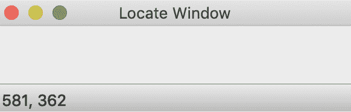
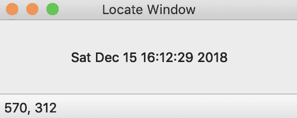
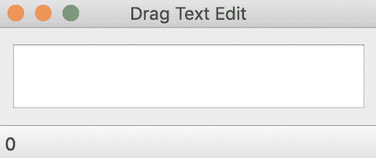
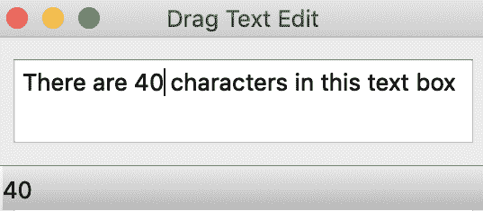
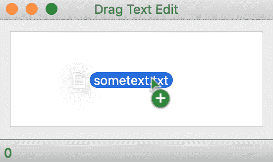
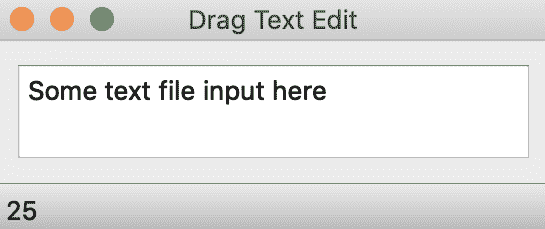
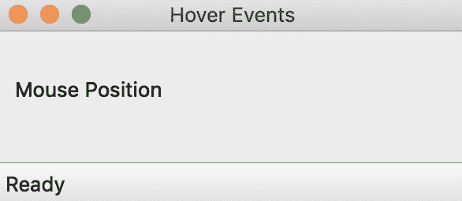
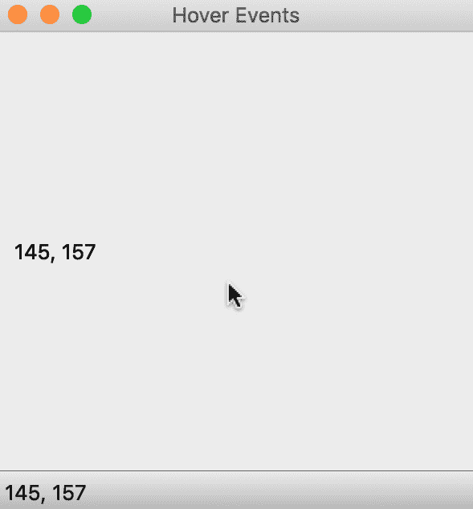

# 管理事件、自定义信号和槽

本章介绍了事件的概念。为了保持工作状态，消息从窗口系统传递到应用程序，并在应用程序内部传递。这些消息可能包含在某个目的地交付时可能有用的数据。这里讨论的消息在 Qt 中被称为事件。

在本章中，我们将涵盖以下主题：

+   事件

+   事件处理程序

+   拖放

+   自定义信号

# 事件

在 Qt 中，所有发生的事件都被封装在继承自 `QEvent` 抽象类的对象中。一个发生事件的例子是窗口被调整大小或移动。应用程序状态的改变将被注意到，并将创建一个适当的 `QEvent` 对象来表示它。

应用程序的事件循环将此对象传递给继承自 `QObject` 的某些对象。这个 `QEvent` 对象将通过调用一个将被调用的方法来处理。

有不同类型的事件。当鼠标被点击时，将创建一个 `QMouseEvent` 对象来表示这个事件。该对象将包含额外的信息，例如被点击的具体鼠标按钮以及事件发生的位置。

# 事件处理程序

所有 `QObjects` 都有一个 `event()` 方法，它接收事件。对于 `QWidgets`，此方法将事件对象传递给更具体的事件处理程序。可以通过子类化感兴趣的控件并重新实现该事件处理程序来重新定义事件处理程序应该做什么。

让我们创建一个应用程序，我们将重新实现一个事件处理程序。

创建一个包含 `main.cpp`、`mainwindow.cpp` 和 `mainwindow.h` 文件的文件夹。`mainwindow.h` 文件应包含以下代码：

```cpp
#include <QMainWindow>
#include <QMoveEvent>
#include <QMainWindow>
class MainWindow: public QMainWindow {
   Q_OBJECT
   public:
       MainWindow(QWidget *parent = 0);
   protected:
       void moveEvent(QMoveEvent *event);
};
```

在前面的代码中，我们只对 `QMainWindow` 进行了子类化。声明了一个默认构造函数，并重写或重新实现了我们想要重写的事件处理程序，即 `moveEvent(QMoveEvent *event)` 处理程序。

当窗口被移动时，`QMainWindow` 对象的 `event()` 方法将被调用。事件将被进一步封装在 `QMoveEvent` 对象中，并转发给 `moveEvent()` 事件处理程序。由于我们感兴趣的是在窗口移动时改变窗口的行为，我们定义了自己的 `moveEvent()`。

将以下代码行添加到 `mainwindow.cpp` 中：

```cpp
#include "mainwindow.h"
MainWindow::MainWindow(QWidget *parent) : QMainWindow (parent){
   setWindowTitle("Locate Window with timer");
}
void MainWindow::moveEvent(QMoveEvent *event) {
   int xCord = event->pos().x();
   int yCord = event->pos().y();
   QString text = QString::number(xCord) + ", " + QString::number(yCord);
   statusBar()->showMessage(text);
}
```

在默认构造函数中，设置了窗口的标题。事件对象携带窗口当前所在位置的坐标。然后调用 `event->pos().x()` 获取 *x* 坐标，同样通过调用 `event->pos().y()` 获取 *y* 坐标。

我们将 `yCord` 和 `xCord` 转换为文本，并存储在 `text` 中。要访问窗口的状态栏，调用 `statusBar()` 并将 `text` 传递给从 `statusBar()` 调用返回的状态栏对象的 `showMessage()` 方法。

`main.cpp` 文件将包含以下代码，如往常一样：

```cpp
#include <QApplication>
#include "mainwindow.h"
int main(int argc, char *argv[]){
   QApplication app(argc, argv);
   MainWindow window;
   window.resize(300, 300);
   window.show();
   return app.exec();
}
```

编译并运行应用程序。注意当移动应用程序窗口时状态栏的变化。

这里有两个屏幕截图显示了当窗口移动时，位于窗口底部的状态栏如何变化。

窗口的第一个状态显示在下述屏幕截图：


当窗口被移动时，稍后显示了如下所示的输出：



注意窗口的底部以及其变化。持续移动窗口并观察状态栏的变化。

让我们再写一个例子来提高我们对 Qt 事件的理解。

除了由窗口系统生成的事件外，Qt 还会生成其他事件。以下示例将说明如何让 Qt 在特定间隔发送基于定时器的应用程序事件。

如同往常，我们将从通常创建的三个主要文件开始，即`main.cpp`、`mainwindow.cpp`和`mainwindow.h`。项目基于之前的示例。

在`mainwindow.h`文件中，插入以下代码行：

```cpp
#ifndef MAINWINDOW_H
#define MAINWINDOW_H
#include <QMainWindow>
#include <QMoveEvent>
#include <QMainWindow>
#include <QStatusBar>
#include <QLabel>
class MainWindow: public QMainWindow {
   Q_OBJECT
   public:
       MainWindow(QWidget *parent = 0);
   protected:
       void moveEvent(QMoveEvent *event);
       void timerEvent(QTimerEvent *event);
   private:
       QLabel *currentDateTimeLabel;
};
#endif
```

为了接收定时器事件，我们将实现自己的`timerEvent`方法，这将作为定时器到期时发出的事件的目的地。这就是添加 void `timerEvent(QTimerEvent *event)`签名的基本原理。`QLabel` `currentDateTimeLabel`实例将用于显示日期和时间。

在`mainwindow.cpp`文件中，默认构造函数由以下代码定义：

```cpp
#include <QDateTime>
#include "mainwindow.h"
MainWindow::MainWindow(QWidget *parent) : QMainWindow (parent){
 setWindowTitle("Locate Window");
 currentDateTimeLabel = new QLabel("Current Date and Time");
 currentDateTimeLabel->setAlignment(Qt::AlignCenter);
 setCentralWidget(currentDateTimeLabel);
 startTimer(1000);
}
```

窗口的标题已设置。创建了一个`QLabel`实例，并通过调用`setAlignment`确保其内容居中。然后`currentDateTimeLabel`传递给`setCentralWidget()`方法。`startTimer(1000)`方法启动一个定时器，并且每秒触发一个`QTimerEvent`对象，表示为`1000`。

对于每一秒，我们现在需要通过重新实现`timerEvent()`方法来定义应该发生什么。

将以下代码添加到`mainwindow.cpp`：

```cpp
void MainWindow::timerEvent(QTimerEvent *event){
   Q_UNUSED(event);
   QString dateTime = QDateTime::currentDateTime().toString();
   currentDateTimeLabel->setText(dateTime);
}
```

每秒，`timerEvent()`将被调用并传递一个`QTimerEvent`实例。`Q_UNUSED(event)`用于防止编译器抱怨`event()`没有被以任何方式使用。当前日期和时间的字符串表示形式传递给`dateTime`并设置为`currentDateTimeLabel`实例变量的文本。

`main.cpp`文件与之前相同。作为参考，以下代码再次呈现，如下所示：

```cpp
#include <QApplication>
#include "mainwindow.h"
int main(int argc, char *argv[]){
   QApplication app(argc, argv);
   MainWindow window;
   window.resize(300, 300);
   window.show();
   return app.exec();
}
```

编译并运行应用程序，如下所示：



应用程序最初将显示文本、当前日期和时间，但一秒后应更改并显示更新的时间。每过去一秒，文本也会更新。

# 拖放

在本节中，我们将组合一个简单的应用程序，它可以处理从外部源到应用程序中的拖放操作。

该应用程序是一个小型文本编辑器。当文本文件被拖放到文本区域时，它将打开并将该文本文件的內容插入到文本区域中。窗口的状态将显示文本区域的字符数，这是一个 `QTextEdit` 的实例。

此示例应用程序还说明了关于事件的一个非常重要的观点。要自定义小部件，必须通过重写其事件处理程序来改变该小部件的现有行为。在尝试自定义小部件时（除了事件外），不考虑信号和槽。

要开始此项目，请执行以下步骤：

1.  创建一个您选择的名称的新文件夹

1.  创建 `main.cpp`、`mainwindow.cpp`、`mainwindow.h`、`dragTextEdit.h` 和 `dragTextEdit.cpp` 文件

`dragTextEdit.h` 和 `dragTextEdit.cpp` 文件将包含我们自定义小部件的定义。`mainwindow.cpp` 和 `mainwindow.h` 文件将用于构建应用程序。

让我们从自定义的 `QTextEdit` 小部件开始。将以下代码行插入到 `dragTextEdit.h`：

```cpp
#ifndef TEXTEDIT_H
#define TEXTEDIT_H
#include <QMoveEvent>
#include <QMouseEvent>
#include <QDebug>
#include <QDateTime>
#include <QTextEdit>
#include <QMimeData>
#include <QMimeDatabase>
#include <QMimeType>
class DragTextEdit: public QTextEdit
{
   Q_OBJECT
   public:
       explicit DragTextEdit(QWidget *parent = nullptr);
   protected:
       void dragEnterEvent(QDragEnterEvent *event) override;
       void dragMoveEvent(QDragMoveEvent *event) override;
       void dragLeaveEvent(QDragLeaveEvent *event) override;
       void dropEvent(QDropEvent *event) override;
};
#endif
```

`DragTextEdit` 自定义小部件继承自 `QTextEdit`。声明了默认构造函数。为了接受拖放事件，我们需要重写以下方法以确保适当的行为，如下面的代码所示：

```cpp
protected:
   void dragEnterEvent(QDragEnterEvent *event) override;
   void dragMoveEvent(QDragMoveEvent *event) override;
   void dragLeaveEvent(QDragLeaveEvent *event) override;
   void dropEvent(QDropEvent *event) override
```

现在已经创建了头文件，打开 `dragTextEdit.cpp` 文件并添加默认构造函数的定义，如下面的代码所示：

```cpp
#include "dragTextEdit.h"
DragTextEdit::DragTextEdit(QWidget *parent) : QTextEdit(parent)
{
   setAcceptDrops(true);
}
```

`#include` 指令导入头文件，之后定义默认构造函数。为了使我们的小部件能够接受拖放事件，我们需要通过调用 `setAcceptDrops(true)` 方法来声明这一点。

我们现在必须添加我们想要重写的函数的定义。将以下行添加到 `dragTextEdit.cpp`：

```cpp
void DragTextEdit::dragMoveEvent(QDragMoveEvent *event)
{
   event->acceptProposedAction();
}
void DragTextEdit::dragLeaveEvent(QDragLeaveEvent *event)
{
   event->accept();
}
void DragTextEdit::dragEnterEvent(QDragEnterEvent *event)
{   event->acceptProposedAction();
}
```

这些事件处理程序处理将要进行拖放操作时涉及的主要步骤。在 `dragEnterEvent()` 和 `dragMoveEvent()` 方法中，会调用事件对象上的 `acceptProposedAction()` 方法。这些事件在拖动模式下的光标位于调用 `setAcceptDrops()` 方法的窗口边界时被调用。如果您拒绝调用 `acceptProposedAction()` 方法，拖放行为可能会出现异常。

当光标在感兴趣的小部件内时，会调用 `dragMoveEvent()` 事件处理程序。但为了定义拖放事件发生时会发生什么，我们需要定义 `dropEvent()` 处理程序。

将以下代码添加到 `dragTextEdit.cpp`：

```cpp
void DragTextEdit::dropEvent(QDropEvent *event)
{
   const QMimeData *mimeData = event->mimeData();
   if (mimeData->hasText()) {
       QTextStream out(stdout);
       QFile file(mimeData->urls().at(0).path());
       file.open(QFile::ReadOnly | QFile::Text);
       QString contents = file.readAll();
       setText(contents);
       event->acceptProposedAction();
   }
   else{
       event->ignore();
   }
}
```

通过调用`event->mimeData()`从事件对象中获取文件的 mime 数据。如果它包含文本数据，我们将提取文件的正文并调用`QTextEdit`的`setText()`方法。这将用该文本填充`DragTextEdit`实例。请注意，我们继续调用`event->acceptProposedAction()`来告诉 Qt 我们已经处理了这个事件。另一方面，如果调用`event->ignore()`，它被视为不受欢迎的事件或操作，因此被传播到父小部件。

这完成了自定义`QTextEdit`的实现。现在我们需要创建`mainwindow.h`和`mainwindow.cpp`，它们将构建主应用程序窗口并使用`DragTextEdit`。

创建`mainwindow.h`文件并插入以下代码：

```cpp
#ifndef MAINWINDOW_H
#define MAINWINDOW_H
#include <QMainWindow>
#include <QLabel>
#include <QMoveEvent>
#include <QMouseEvent>
#include <QVBoxLayout>
#include <QDebug>
#include <QDateTime>
#include <QMainWindow>
#include <QStatusBar>
#include "dragTextEdit.h"
class MainWindow: public QMainWindow
{
   Q_OBJECT
   public:
       MainWindow(QWidget *parent = 0);
   private slots:
       void updateStatusBar();
private:
       DragTextEdit *slateDragTextEdit;
};
#endif
```

导入`QMainWindow`、`QLabel`类和其他常用类，以及`dragTextEdit.h`头文件，这允许包含我们的自定义类。声明一个将在任何文本被添加到或从`DragTextEdit`小部件中删除时被调用的槽。最后，创建一个`DragTextEdit`实例。

创建并打开`mainwindow.cpp`文件，并插入以下代码：

```cpp
#include "mainwindow.h"
MainWindow::MainWindow(QWidget *parent) : QMainWindow (parent)
{
   QWidget *mainWidget = new QWidget;
   QVBoxLayout *layout = new QVBoxLayout;
   slateDragTextEdit = new DragTextEdit();
   layout->addWidget(slateDragTextEdit);
   mainWidget->setLayout(layout);
   setCentralWidget(mainWidget);
   statusBar()->showMessage(QString::number(0));
   connect(slateDragTextEdit, SIGNAL(textChanged()), this, SLOT(updateStatusBar()));
}
void MainWindow::updateStatusBar()
{   int charCount = slateDragTextEdit->toPlainText().count();
  statusBar()->showMessage(QString::number(charCount));
}
```

在构造函数中，创建`QWidget`和`QVBoxLayout`对象以容纳主小部件和布局。然后通过调用`setCentralWdiget()`将此小部件插入，如下面的代码所示：

```cpp
slateDragTextEdit = new DragTextEdit();
layout->addWidget(slateDragTextEdit);
```

创建一个`DragTextEdit`自定义类的实例，并将其传递给`slateDragTextEdit`。此小部件被添加到我们的主布局中，如下面的代码所示：

```cpp
statusBar()->showMessage(QString::number(0));
```

窗口的状态栏设置为`0`。

每当`slateDragTextEdit`发出`textChanged()`信号时，都会调用`updateStatusBar()`槽。在这个槽中，将从`slateDragTextEdit`中提取并计算字符。因此，当字符被添加到或从`slateDragTextEdit`中删除时，状态栏将被更新。

`main.cpp`文件将只包含以下几行代码来实例化窗口并显示它：

```cpp
#include <QApplication>
#include <Qt>
#include "mainwindow.h"
int main(int argc, char *argv[]){
   QApplication app(argc, argv);
   MainWindow window;
   window.setWindowTitle("Drag Text Edit");
   window.show();
   return app.exec();
}
```

项目结束时，你应该在你的文件夹中有五个（5）个文件。要在命令行中编译项目，请在文件夹内执行以下命令：

```cpp
% qmake -project
```

不要忘记将`QT += widgets`添加到生成的`.pro`文件中。`.pro`文件应包含头文件和程序文件。它应该如下所示：

```cpp
# Input
HEADERS += dragTextEdit.h mainwindow.h
SOURCES += dragTextEdit.cpp main.cpp mainwindow.cpp
```

继续执行以下命令：

```cpp
% qmake
% make
% ./program_executable
```

运行中的程序将如下截图所示：



由于程序执行时没有字符，状态栏将显示 0，如前述截图所示。

在文本区域中输入一些输入，并找出每次按键时状态栏是如何更新的，如下面的截图所示：



本节中的示例说明了文本区域如何接受应用程序外部的项目。将任何文本（`.txt`）文件或包含文本的任何文件拖放到文本区域，看看其内容是如何用于填充文本框的，如下面的截图所示：



从前面的截图可以看出，包含文本的`sometext.txt`文件的内容将被粘贴到文本区域中，如下面的截图所示：



通过移除对`acceptProposedAction()`和`accept()`的调用进行实验，看看拖放是如何变化的。

本章的最后部分将涉及自定义信号的制作。

# 自定义信号

在前面的章节中，我们看到了如何使用槽和创建自定义槽来在信号发出时实现一些功能。现在，在本节中，我们将探讨如何创建可以发出并连接到其他槽的自定义信号。

要创建自定义信号，需要声明一个方法签名并使用`Q_OBJECT`宏将其标记为信号。声明时，信号没有返回类型，但可以接受参数。

让我们通过一个项目来实践一下。像往常一样，应该创建一个包含三个（3）个文件的新文件夹，即`main.cpp`、`mainwindow.cpp`和`mainwindow.h`。

在此示例中，我们将重写`mousePressEvent`并发出一个自定义信号，该信号将连接到一个槽以在窗口上执行多个更新。

在`mainwindow.h`文件中，插入以下代码行：

```cpp
#ifndef MAINWINDOW_H
#define MAINWINDOW_H
#include <QMainWindow>
#include <QMoveEvent>
#include <QMouseEvent>
#include <QVBoxLayout>
#include <QDebug>
#include <QDateTime>
#include <QStatusBar>
#include <QLabel>
class MainWindow: public QMainWindow
{
   Q_OBJECT
   public slots:
       void updateMousePosition(QPoint pos);
   signals:
       void mouseMoved(QPoint pos);
   public:
       MainWindow(QWidget *parent = 0);
   protected:
       void mousePressEvent(QMouseEvent *event);
   private:
       QLabel *mousePosition;
       QWidget *windowCentralWidget;
};
#endif
```

此处自定义信号使用以下行声明：

```cpp
signals:
   void mouseMoved(QPoint pos);
```

当此信号发出时，它将传递一个`QPoint`实例作为参数。如果我们不想我们的信号传递任何参数，它将用`void` `mouseMoved()`编写。

自定义信号不应返回任何内容。当我们在`mousePressEvent()`处理程序中重新实现时，将发出信号。

`void updateMousePosition(QPoint pos)`，槽将连接到自定义信号。其定义可在`mainwindow.cpp`中找到。

成员指针`mousePosition`将在鼠标点击时显示鼠标的坐标。

在`mainwindow.cpp`文件中，我们将定义三个（3）方法。这些是默认构造函数、槽`updateMousePosition()`和`mousePressEvent()`重写方法，如下面的代码所示：

```cpp
#include "mainwindow.h"
void MainWindow::mousePressEvent(QMouseEvent *event){
   emit mouseMoved(event->pos());
}
```

`include`语句必须位于文件的顶部。在此`override`方法中，我们通过调用`event->pos()`来获取鼠标按下事件生成的坐标。

通过调用`x()`和`y()`分别获得`x`和`y`坐标。

`emit mouseMoved(event->pos())`行用于发出在头文件中声明的信号。此外，`event->pos()`将返回一个`QPoint`对象，该对象符合信号的签名。

下面的截图显示了在`mainwindow.cpp`文件中定义的槽：

```cpp
void MainWindow::updateMousePosition(QPoint point){
   int xCord = point.x();
   int yCord = point.y();
   QString text = QString::number(xCord) + ", " + QString::number(yCord);
   mousePosition->setText(text);
   statusBar()->showMessage(text);
}
```

插槽接收 `QPoint` 实例作为参数。通过调用 `point.x()` 和 `point.y()` 分别获取其 `x` 和 `y` 坐标。使用 `QString` 实例 `text` 将两个值 `xCord` 和 `yCord` 连接到一个更长的字符串中。

将使用 `QLabel` 实例 `mousePosition` 通过调用其 `setText()` 方法来显示此坐标。同样，可以通过调用 `statusBar()->showMessage(text)` 来设置窗口的状态栏。

要将自定义信号连接到我们的插槽进行管道连接，我们需要定义默认构造函数。将以下行添加到 `mainwindow.cpp` 中：

```cpp
MainWindow::MainWindow(QWidget *parent) : QMainWindow (parent){
   windowCentralWidget = new QWidget();
   mousePosition = new QLabel("Mouse Position");
   QVBoxLayout *innerLayout = new QVBoxLayout();
   innerLayout->addWidget(mousePosition);
   windowCentralWidget->setLayout(innerLayout);
   setCentralWidget(windowCentralWidget);
   statusBar()->showMessage("Ready");
   connect(this, SIGNAL(mouseMoved(QPoint)), this, SLOT(updateMousePosition(QPoint)));
}
```

如我们之前所做的那样，`windowCentralWidget` 被用作我们应用程序中的主小部件。向其布局 `innerLayout` 中添加了 `QLabel`，并将状态栏的初始值设置为 `"Ready"`。

将 `mouseMoved(QPoint)` 信号连接到 `updateMousePosition(QPoint)` 插槽。

在 `main.cpp` 文件中，我们将实例化我们的窗口并启动主事件循环，如下面的代码所示：

```cpp
#include <QApplication>
#include <Qt>
#include "mainwindow.h"
int main(int argc, char *argv[]){
   QApplication app(argc, argv);
   MainWindow window;
   window.resize(300, 300);
   window.setWindowTitle("Hover Events");
   window.show();
   return app.exec();
}
```

按照以下截图编译并运行可执行文件：



状态栏显示 "Ready"，而组成窗口主小部件的 `QLabel` 显示 "鼠标位置"。现在，点击窗口内的任何部分，并查看状态栏和标签更改以显示鼠标点击处的坐标。

以下截图为例：



光标的位置是 145，157，其中 145 位于 *x* 轴上，157 位于 *y* 轴上。当光标移动时，此值不会改变。然而，当鼠标点击时，将发出 `mouseMoved()` 信号，并带有坐标以更新屏幕。

# 摘要

本章进一步阐述了如何在 Qt 中使用事件。我们了解了在不同情况下使用事件而不是信号-槽机制的不同情况。最初的例子涉及如何覆盖和实现自定义事件处理程序。我们实现的事件捕获了窗口的位置，并在示例应用程序中重新定义了每秒应发生的事情。

在拖放操作中，借助事件，我们还实现了一个简单的放下事件，创建了一个简单的文本编辑器来接受在文本区域中放下的文件。最后，本章说明了如何创建在事件发生时发出的自定义信号。

在 第六章，*将 Qt 与数据库连接*，我们将关注在构建 Qt 应用程序时存储数据和检索数据的各种方法。
