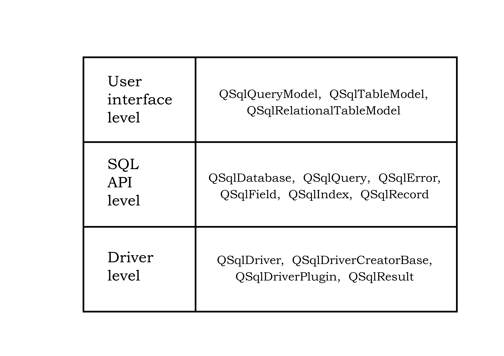
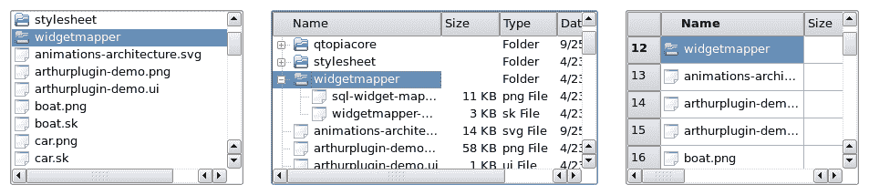
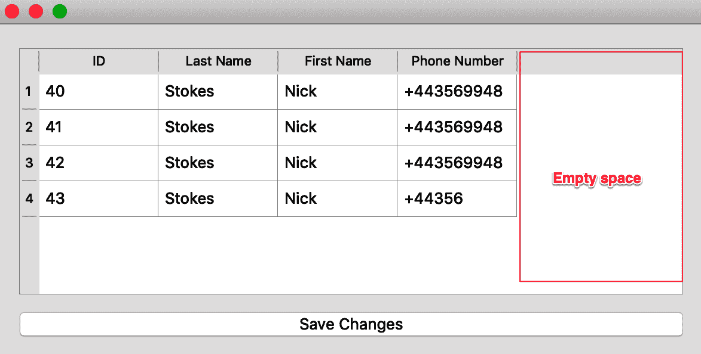
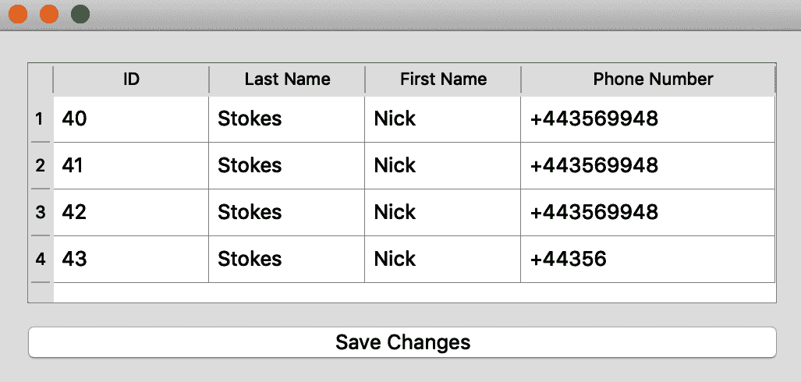

# 将 Qt 与数据库连接

近年来，大多数应用程序都会集成一些数据库来存储信息，以便进行进一步处理和未来使用。

Qt 附带了一些模块和类，使得连接到数据库变得轻而易举。本章将使用 MySql 数据库来演示示例，但相同的原理也适用于其他数据库。

到本章结束时，你应该能够执行以下操作：

+   连接到数据库并读取

+   通过小部件显示和编辑数据库条目

# QtSql

QtSql 模块配备了访问数据库的类和驱动程序。要继续前进，你应该在系统上安装 Qt 时进行了必要的配置，以启用数据库访问。

对于使用 Homebrew 的 macOS 用户，请记住按照第一章，“Qt 5 简介”中先前描述的命令执行。

对于 Linux 用户，必须在编译时安装模块并启用正确的标志，以便 QtSql 模块能够工作，但大多数情况下，第一章，“Qt 5 简介”中的说明应该足够。

QtSql 模块由以下层组成：

+   用户界面层

+   SQL API 层

+   驱动层



每个级别都使用了类，如前图所示。

# 建立连接

我们需要为编写我们的应用程序奠定基础，在这种情况下，我们需要有一个运行中的 MySql 实例。XAMPP 是一个很好的候选者，可以快速访问一个工作数据库。

XAMPP 是由 Apache Friends 开发的一个免费开源、跨平台的 Web 服务器解决方案堆栈包，主要由 Apache HTTP 服务器、MariaDB（或 MySql）数据库以及用于 PHP 和 Perl 编程语言脚本的解释器组成。从[`www.apachefriends.org/download.html`](https://www.apachefriends.org/download.html)下载最新版本。

让我们通过以下语句创建以下表的数据库：

```cpp
 use contact_db;
   CREATE TABLE IF NOT EXISTS contacts (
   id INT AUTO_INCREMENT,
   last_name VARCHAR(255) NOT NULL,
   first_name VARCHAR(255) NOT NULL,
   phone_number VARCHAR(255) NOT NULL,
   PRIMARY KEY (id)
)  ENGINE=INNODB;
```

数据库名为`contact_db`，假设你已经在安装的 MySql 实例中创建了它。

SQL 语句创建了一个名为`contacts`的表，其中包含一个自增的`id`字段，以及存储字符的`last_name`、`first_name`和`phone_number`字段。

现在，创建一个新的文件夹，并添加一个名为`main.cpp`的文件。插入以下代码行：

```cpp
#include <QApplication>
#include <QtSql>
#include <QDebug>
/*
 use contact_db;
   CREATE TABLE IF NOT EXISTS contacts (
   id INT AUTO_INCREMENT,
   last_name VARCHAR(255) NOT NULL,
   first_name VARCHAR(255) NOT NULL,
   phone_number VARCHAR(255) NOT NULL,
   PRIMARY KEY (id)
)  ENGINE=INNODB;
*/
int main(int argc, char *argv[]) {
   // Setup db connection
   QSqlDatabase db_conn =
           QSqlDatabase::addDatabase("QMYSQL", "contact_db");
   db_conn.setHostName("127.0.0.1");
   db_conn.setDatabaseName("contact_db");
   db_conn.setUserName("root");
   db_conn.setPassword("");
   db_conn.setPort(3306);
   // Error checks
   if (!db_conn.open()) {
       qDebug() << db_conn.lastError();
       return 1;
   } else {
       qDebug() << "Database connection established !";
   }
}
```

要建立数据库连接，我们需要包含`QtSql`。`QDebug`提供了一个输出流，我们可以在开发过程中将有用的（调试）信息写入文件、设备或标准输出。

在前面的代码中，数据库表的结构已被注释掉，但作为提醒，以防你没有创建它。

要打开到数据库的连接，将调用`QSqlDatabase::addDatabase()`。`QMYSQL`参数是驱动程序类型，`contact_db`是连接名称。一个程序可以与同一数据库有多个连接。此外，`addDatabase()`调用将返回一个`QSqlDatabase`实例，本质上就是数据库的连接。

此连接`db_conn`随后使用使连接工作的参数进行初始化。主机名、我们想要连接的特定数据库、用户名、密码和端口号都设置在数据库连接对象`db_conn`上：

```cpp
db_conn.setHostName("127.0.0.1");
db_conn.setDatabaseName("contact_db");
db_conn.setUserName("root");
db_conn.setPassword("");
db_conn.setPort(3306);
```

根据不同的情况，您可能需要指定比这些参数更多的信息才能访问数据库，但大多数情况下，这应该可以工作。此外，请注意，密码是一个空字符串。这只是为了说明目的。您必须根据您的数据库更改密码。

为了建立连接，我们需要在连接对象上调用`open()`：

```cpp
// Error checks
if (!db_conn.open()) {
   qDebug() << db_conn.lastError();
   return 1;
} else {
   qDebug() << "Database connection established !";
}
```

调用`open()`将返回一个布尔值以确定数据库连接是否成功。`!db_conn.open()`测试返回值是否为`False`。

注意我们编译和运行此程序的方式。

在您位于`main.cpp`文件所在的文件夹中时，在命令行上执行以下操作：

```cpp
% qmake -project
```

打开生成的`.pro`文件，并添加以下行：

```cpp
QT += widgets sql
```

我们打算在本章中使用小部件，因此它已被列为第一个要包含的模块。同样，我们也包括 SQL 模块。继续以下命令：

```cpp
% qmake
% make
% ./program_executable
```

如果您收到`Database connection established!`的响应，那么这意味着您的程序能够顺利地连接到数据库。另一方面，您可能会收到一个错误，该错误将描述连接无法建立的原因。当您遇到错误时，请通过以下列表确保您处于正确的路径：

+   确保数据库服务正在运行

+   确保您尝试连接的数据库实际上存在

+   确保由模式给出的表存在

+   确保数据库的用户名和密码存在

+   确保 Qt 已编译了 MySql 模块

现在，让我们更新程序，以便我们可以展示如何在 Qt 中发出各种 SQL 语句。

# 列出记录

为了对数据库执行查询语句，我们将使用`QSqlQuery`类。这些语句包括数据更改语句，如`INSERT`、`SELECT`和`UPDATE`。也可以发出数据定义语句，如`CREATE TABLE`。

考虑以下代码片段以列出联系人表中的所有条目：

```cpp
QSqlQuery statement("SELECT * FROM contacts", db_conn);
QSqlRecord record = statement.record();
while (statement.next()){
   QString firstName = statement.value(record.indexOf("first_name")).toString();
   QString lastName = statement.value(record.indexOf("last_name")).toString();
   QString phoneNumber = statement.value(record.indexOf("phone_number")).toString();
   qDebug() << firstName << " - " << lastName << " - " << phoneNumber;
}
```

查询语句和数据库连接作为参数传递给`QSqlQuery`语句的一个实例。`QSqlRecord`用于封装数据库行或视图。我们将使用其实例`record`来获取行中列的索引。`statement.record()`返回当前查询的字段信息。

如果`statement`中有任何与查询匹配的行，`statement.next()`将允许我们遍历返回的行。我们可以调用`previous()`、`first()`和`last()`来使我们能够前后移动返回的行或数据。

对于每行通过调用`statement.next()`返回并访问的行，使用`statement`对象根据代码`statement.value(0).toString()`获取其对应的数据。这应该返回第一列转换为字符串以存储在`firstName`中。而不是这种方法，我们可以使用`record`来获取我们感兴趣的列的索引。因此，为了提取姓名列，我们编写`statement.value(record.indexOf("first_name")).toString()`。

`qDebug()`调用有助于打印出`firstName`、`lastName`和`phoneNumber`中的数据，类似于我们使用`cout`所做的那样。

# `INSERT`操作

要执行数据库操作并将数据存储到数据库中，有几种方式可以发出`INSERT`语句。

考虑 Qt 中`INSERT`操作的一种形式：

```cpp
// Insert new contacts
QSqlQuery insert_statement(db_conn);
insert_statement.prepare("INSERT INTO contacts (last_name, first_name, phone_number)"
                        "VALUES (?, ?, ?)");
insert_statement.addBindValue("Sidle");
insert_statement.addBindValue("Sara");
insert_statement.addBindValue("+14495849555");
insert_statement.exec();
```

`QSqlQuery`对象`insert_statement`通过传递数据库连接来实例化。接下来，将`INSERT`语句字符串传递给`prepare()`方法的调用。注意，我们如何使用三个（3）`?, ?, ?`（问号）来使我们的语句不完整。这些问号将被用作占位符。为了填充这些占位符，将调用`addBindValue()`方法。`insert_statement.addBindValue("Sidle")`这一行将用于填充`contacts`表中的`last_name`列中的数据。对`addBindValue("Sara")`的第二次调用将用于填充第二个占位符。

要执行语句，必须调用`insert_statement.exec()`。整体效果是在表中插入一条新记录。

要改变插入数据顺序，我们可以使用`insert_statement.bindValue()`函数。`INSERT`语句有三个（3）位置占位符，编号从`0`到`2`。我们可以首先填充最后一个占位符，如下所示：

```cpp
insert_statement.prepare("INSERT INTO contacts (last_name, first_name, phone_number)"
                        "VALUES (?, ?, ?)");
insert_statement.bindValue(2, "+144758849555");
insert_statement.bindValue(1, "Brass");
insert_statement.bindValue(0, "Jim");
insert_statement.exec();
```

电话号码列的占位符首先通过指定`bind(2, "+144758849555")`来填充，其中`2`是`(phone_number)`占位符的索引。

使用占位符的位置作为替代方案的一种方法是命名它们。考虑以下`INSERT`语句：

```cpp
insert_statement.prepare("INSERT INTO contacts (last_name, first_name, phone_number)"
                        "VALUES (:last_name, :first_name, :phone_number)");
insert_statement.bindValue(":last_name", "Brown");
insert_statement.bindValue(":first_name", "Warrick");
insert_statement.bindValue(":phone_number", "+7494588594");
insert_statement.exec();
```

在完成 SQL 语句时，而不是使用占位符的位置索引，使用命名占位符来引用`VALUES`部分中的数据。这样，占位符的名称与相应的值一起传递到每个`bindValue()`调用。

要持久化数据，必须调用`insert_statement.exec()`函数。

# `DELETE`操作

`DELETE`操作是可以在表上执行的其他操作之一。为此，我们需要传递数据库连接的引用，并将`DELETE`语句传递给`QSqlQuery`的`exec()`方法。

考虑以下代码片段：

```cpp
// Delete a record
QSqlQuery delete_statement(db_conn);
delete_statement.exec("DELETE FROM contacts WHERE first_name = 'Warrick'");
qDebug() << "Number of rows affected: " << delete_statement.numRowsAffected();
```

`numRowsAffected()` 是一个用于确定影响了多少记录的方法。这个方法的一个好处是它有助于确定我们的查询是否改变了数据库。如果它返回 `-1`，则意味着查询的操作产生了不确定的结果。

# 更新操作

`UPDATE` 操作遵循与 `DELETE` 操作相同的逻辑。考虑以下代码行：

```cpp
// Update a record
QSqlQuery update_statement(db_conn);
update_statement.exec("UPDATE contacts SET first_name='Jude' WHERE id=1 ");
qDebug() << "Number of rows affected: " << update_statement.numRowsAffected();
```

此处的语句将 ID 为 `1` 的记录的 `first_name` 设置为 `'Jude'`。`update_statement.numRowsAffected()` 将返回空值，尤其是在表中的第一条记录 `id=1` 缺失的情况下。请特别注意这一点。

以下概述了展示主要操作的完整程序：

```cpp
#include <QApplication>
#include <QtSql>
#include <QDebug>
int main(int argc, char *argv[]) {
   // Setup db connection
   QSqlDatabase db_conn =
           QSqlDatabase::addDatabase("QMYSQL", "contact_db");
   db_conn.setHostName("127.0.0.1");
   db_conn.setDatabaseName("contact_db");
   db_conn.setUserName("root");
   db_conn.setPassword("");
   db_conn.setPort(3306);
   // Error checks
   if (!db_conn.open()) {
       qDebug() << db_conn.lastError();
       return 1;
   } else {
       qDebug() << "Database connection established !";
   }
   // Create table
   QString table_definition = "use contact_db;\n"
                           "    CREATE TABLE IF NOT EXISTS contacts (\n"
                           "    id INT AUTO_INCREMENT,\n"
                           "    last_name VARCHAR(255) NOT NULL,\n"
                           "    first_name VARCHAR(255) NOT NULL,\n"
                           "    phone_number VARCHAR(255) NOT NULL,\n"
                           "    PRIMARY KEY (id)\n"
                           ")  ENGINE=INNODB;";
   QSqlQuery table_creator(table_definition, db_conn);
   // Issue SELECT statement
   QSqlQuery statement("SELECT * FROM contacts", db_conn);
   QSqlRecord record = statement.record();
   while (statement.next()){
       QString firstName = 
       statement.value(record.indexOf("first_name")).toString();
       QString lastName =
       statement.value(record.indexOf("last_name")).toString();
       QString phoneNumber = 
       statement.value(record.indexOf("phone_number")).toString();
       qDebug() << firstName << " - " << lastName << " - " << 
       phoneNumber;
   }
   // Insert new contacts
   QSqlQuery insert_statement(db_conn);
   insert_statement.prepare("INSERT INTO contacts (last_name, 
   first_name, phone_number)"
                            "VALUES (?, ?, ?)");
   insert_statement.addBindValue("Sidle");
   insert_statement.addBindValue("Sara");
   insert_statement.addBindValue("+14495849555");
   insert_statement.exec();
   //QSqlQuery insert_statement(db_conn);
   insert_statement.prepare("INSERT INTO contacts (last_name, 
   first_name, phone_number)"
                            "VALUES (?, ?, ?)");
   insert_statement.bindValue(2, "+144758849555");
   insert_statement.bindValue(1, "Brass");
   insert_statement.bindValue(0, "Jim");
   insert_statement.exec();
   insert_statement.prepare("INSERT INTO contacts (last_name, 
   first_name, phone_number)"
                            "VALUES (:last_name, :first_name,
                            :phone_number)");
   insert_statement.bindValue(":last_name", "Brown");
   insert_statement.bindValue(":first_name", "Warrick");
   insert_statement.bindValue(":phone_number", "+7494588594");
   insert_statement.exec();
   // Delete a record
   QSqlQuery delete_statement(db_conn);
   delete_statement.exec("DELETE FROM contacts WHERE first_name = 
   'Warrick'");
   qDebug() << "Number of rows affected: " << 
   delete_statement.numRowsAffected();
   // Update a record
   QSqlQuery update_statement(db_conn);
   update_statement.exec("UPDATE contacts SET first_name='Jude' WHERE 
   id=1 ");
   qDebug() << "Number of rows affected: " << 
   update_statement.numRowsAffected();
}
```

特别重要的是数据库表的创建方式。从前面的代码列表中，`QString` 实例 `table_definition` 保存了我们即将创建的表的结构。当 `table_definition` 和数据库连接传递给 `QSqlQuery` 的一个实例时，表就创建了。这就是创建表的全部过程。

编译并运行程序。

记得编辑 `.pro` 文件以包含 `sql` 模块。

从命令行运行程序的典型输出如下所示：

```cpp
./dbBasics.app/Contents/MacOS/dbBasics
Database connection established !
"Jude"  -  "Sidle"  -  "+14495849555"
"Brass"  -  "Jim"  -  "+144758849555"
Number of rows affected:  1
Number of rows affected:  0
```

# 使用数据模型进行数据库访问

有两个类可以用于访问数据库。这些是 `QSqlTableModel` 和 `QSqlQueryModel` 类。`QSqlQueryModel` 类仅向数据库提供只读模型。`QSqlTableModel` 提供对数据库的读写模型访问。

在应用程序开发中，你面临着一个挑战，那就是如何展示数据，以及如何维护数据与展示（视图）之间的关系，以便数据的变化反映在视图中。

在 PHP 语言的早期，数据、展示和业务逻辑都混杂在一个或多个脚本中。这使得调试和最终的代码维护变得噩梦般。这种困境有时也会出现在语言和框架设计中。

**模型-视图-控制器**（**MVC**）方法试图解决这个问题。它认识到软件的一个关键部分是数据。通过认识到这一点，它将数据抽象为所谓的模型。模型基本上是软件中数据的表示。这些数据可以是字符串或整数的列表。它也可以是父文件夹下的文件夹和文件。数据也可以是从对数据库的查询返回的行列表。

获得的数据需要显示或呈现给用户。通过这些组件传输数据的组件称为视图。例如，显示学生名单列表的 HTML 页面可以称为视图。在 Qt 中，有许多小部件可以用于在模型中显示数据。以下是一些典型的数据展示视图：



这些视图类针对显示信息进行了优化，因此当它们与模型关联时，模型的变化将导致视图自动更新。视图维护自己的状态，并在模型发生变化时得到通知。

例如，当在 `QListView` 中显示姓名列表时，对模型调用 `remove()` 将同时从模型列表中删除项目，并通过减少显示的项目数量来更新视图。

与直接编写代码来更新视图不同，视图类会代表我们这样做。让我们创建一个示例项目，该项目将使用模型从数据库中访问数据：

创建一个新的文件夹，并在其中创建一个名为 `main.cpp` 的文件。将以下代码行复制到 `main.cpp` 文件中：

```cpp
#include <QtSql>
#include <QDebug>
/*
int main(int argc, char *argv[])
{
   // Setup db connection
   QSqlDatabase db_conn =
           QSqlDatabase::addDatabase("QMYSQL", "contact_db");
   db_conn.setHostName("127.0.0.1");
   db_conn.setDatabaseName("contact_db");
   db_conn.setUserName("root");
   db_conn.setPassword("");
   db_conn.setPort(3306);
   // Error checks
   if (!db_conn.open()) {
       qDebug() << db_conn.lastError(); return 1;
   }
   // Use Database model
   QSqlTableModel *contactsTableModel = new QSqlTableModel(0, db_conn);
   contactsTableModel->setTable("contacts");
   contactsTableModel->select();
   for (int i = 0; i < contactsTableModel->rowCount(); ++i) {
       QSqlRecord record = contactsTableModel->record(i);
       QString id = record.value("id").toString();
       QString last_name = record.value("last_name").toString();
       QString first_name = record.value("first_name").toString();
       QString phone_number = record.value("phone_number").toString();
       qDebug() << id  << " : " << first_name << " : " << last_name << " : " << phone_number;
   }
   // Insert Row
   int row = contactsTableModel->rowCount();
   contactsTableModel->insertRows(row, 1);
   contactsTableModel->setData(contactsTableModel->index(row, 1), "Stokes");
   contactsTableModel->setData(contactsTableModel->index(row, 2), "Nick");
   contactsTableModel->setData(contactsTableModel->index(row, 3), "+443569948");
   contactsTableModel->submitAll();
   // Custom filter
   qDebug() << "\nCustom filter: \n";
   contactsTableModel->setFilter("id=12 AND last_name like'Stokes'");
   contactsTableModel->select();
   for (int i = 0; i < contactsTableModel->rowCount(); ++i) {
       QSqlRecord record = contactsTableModel->record(i);
       QString id = record.value("id").toString();
       QString last_name = record.value("last_name").toString();
       QString first_name = record.value("first_name").toString();
       QString phone_number = record.value("phone_number").toString();
       qDebug() << id  << " : " << first_name << " : " << last_name << " : " << phone_number;
   }
}
```

该程序的目的在于连接到数据库，列出特定表中的行，并对它发出一个 `SELECT` 语句。

在建立数据库连接后，我们使用以下行创建 `QSqlTableModel` 实例：`QSqlTableModel *contactsTableModel = new QSqlTableModel(0, db_conn);`。这个实例接收一个指向父对象的指针和数据库连接。这个 `QSqlTableModel` 模型也允许编辑表中的行。

要选择我们想要操作的数据库中的表，在 `contactsTableModel` 上调用 `setTable()` 方法。将 `contacts` 字符串传递为表名。

要用表中的信息填充 `contactsTableModel` 模型，发出一个 `select()` 调用。现在使用循环遍历模型中的数据：

```cpp
for (int i = 0; i < contactsTableModel->rowCount(); ++i) {
   QSqlRecord record = contactsTableModel->record(i);
   QString id = record.value("id").toString();
   QString last_name = record.value("last_name").toString();
   QString first_name = record.value("first_name").toString();
   QString phone_number = record.value("phone_number").toString();
   qDebug() << id  << " : " << first_name << " : " << last_name << " : " << phone_number;
}
```

使用索引获取表中的每一行。这里的索引 `0` 指的是模型中的第一个项目。这个索引与表中的 **主键** 无关。它是一种简单地引用表中行的方法。

`rowCount()` 方法很有用，因为它有助于了解与最新的 `SELECT` 语句关联的总行数。

要获取表中的每一行，循环中的索引 `i` 被传递给 `contactsTableModel->record(i)`。`QSqlRecord` 实例将持有对表中行的引用，该行是通过调用 `record(i)` 返回的。

对于每一行，通过传递列名给 `value` 获取交叉列中存储的值。因此，`record.value("id")` 将返回存储在联系人表 `id` 列中的值。`toString()` 将输出作为字符串返回。相同的调用用于获取表中每一行（`QSqlRecord` record）的 `last_name`、`first_name` 和 `phone_number` 的值。

然后使用 `qDebug()` 语句输出每一行的所有值。

由于 `QSqlTableModel` 允许编辑表，以下语句插入了一个包含数据的新的行：

```cpp
// Insert Row
int row = contactsTableModel->rowCount();
contactsTableModel->insertRows(row, 1);
contactsTableModel->setData(contactsTableModel->index(row, 1), "Stokes");
contactsTableModel->setData(contactsTableModel->index(row, 2), "Nick");
contactsTableModel->setData(contactsTableModel->index(row, 3), "+443569948");
contactsTableModel->submitAll();
```

通过调用`rowCount()`获取表中的总项数。要向表中插入单行，请调用`insertRows(row, 1)`。这里的单行由位置`row`处的`1`表示。

在列`1`中，新行的`last_name`列在调用`setData()`后获得值`"Stokes"`。`contactsTableModel->index(row,1)`代表插入`"Stokes"`的索引位置。

为了持久化数据，将发出对`submitAll()`的调用。这将把内存中任何悬而未决的更改写入数据库。

注意，此时模型已成为访问数据库中数据的接口。我们也不需要知道应用程序与不同类型的数据库交互时，语句映射到的特定查询。这是一个巨大的优势。

如果此模型与视图相关联，则新插入的行将自动填充到屏幕上，而无需执行此类操作的任何代码。

为了细化选择语句，使用`setFilter()`方法：

```cpp
// Custom filter
qDebug() << "\nCustom filter: \n";
contactsTableModel->setFilter("id=12 AND last_name like 'Stokes'");
contactsTableModel->select();
```

SQL 语句的`WHERE`子句部分是传递给`setFilter()`的。在这种情况下，`WHERE`子句是从表中选择`id`等于`12`且`last_name`字段为`'Stokes'`的行。

要应用过滤器，请在`contactsTableModel`上调用`select()`方法。然后循环用于遍历结果。

编译并运行项目：

```cpp
% qmake -project
```

请确保在`.pro`文件中包含以下行：

```cpp
QT += sql widgets
```

编译并运行项目：

```cpp
% qmake
% make
% ./executable_file
```

# 显示模型

在上一节中，我们看到了如何使用模型作为抽象来访问数据库。现在，我们将尝试将其与用于显示的模型相链接。使用上一节中的代码列表，修改`main.cpp`如下所示：

```cpp
#include <QApplication>
#include <QtSql>
#include <QVBoxLayout>
#include <QPushButton>
#include <QDebug>
#include <Qt>
#include <QTableView>
#include <QHeaderView>
int main(int argc, char *argv[])
{
   QApplication app(argc, argv);
   // Setup db connection
   QSqlDatabase db_conn =
           QSqlDatabase::addDatabase("QMYSQL", "contact_db");
   db_conn.setHostName("127.0.0.1");
   db_conn.setDatabaseName("contact_db");
   db_conn.setUserName("root");
   db_conn.setPassword("");
   db_conn.setPort(3306);
   // Error checks
   if (!db_conn.open()) {
       qDebug() << db_conn.lastError(); return 1;
   }
```

由于我们想要显示模型，因此已包含小部件类。数据库连接保持不变。

现在，将以下代码行添加到`main.cpp`中：

```cpp
enum {
   ID = 0,
   LastName = 1,
   FirstName = 2,
   PhoneNumber = 3,
};
QSqlTableModel *contactsTableModel = new QSqlTableModel(0, db_conn);
contactsTableModel->setTable("contacts");
contactsTableModel->select();
contactsTableModel->setHeaderData(ID, Qt::Horizontal, QObject::tr("ID"));
contactsTableModel->setHeaderData(LastName, Qt::Horizontal, QObject::tr("Last Name"));
contactsTableModel->setHeaderData(FirstName, Qt::Horizontal, QObject::tr("First Name"));
contactsTableModel->setHeaderData(PhoneNumber, Qt::Horizontal, QObject::tr("Phone Number"));
contactsTableModel->setEditStrategy(
       QSqlTableModel::OnManualSubmit);
```

与使用如`0`、`1`等魔法数字相比，枚举提供了一些上下文，用于常数`0`、`1`等。

使用连接对象`db_conn`创建`QSqlTableModel`的实例。选择数据库表`contacts`进行操作。当模型被显示时，使用标题来标记列。为此，我们传递枚举值和列应显示的名称。例如，调用`setHeaderData(FirstName, Qt::Horizontal, QObject::tr("First Name"))`将第一列`FirstName`（其实际值为 0）设置为水平显示`"First Name"`。

我们说过，`模型-视图`概念有一个额外的优点，即对视图所做的更改可以反映在数据库中，而无需编写额外的代码：

```cpp
contactsTableModel->setEditStrategy(
       QSqlTableModel::OnManualSubmit);
```

前面的行规定，不应将视图显示的数据更改传播到数据库。相反，应有一个独立的过程触发视图与数据库中数据的同步。与手动进行同步过程相比，替换已被注释掉的代码：

```cpp
//contactsTableModel->setEditStrategy(
//        QSqlTableModel::OnRowChange);
```

`setEditStrategy(QSqlTableModel::OnRowChange)` 的意思是，通过视图对数据进行更改时，当行中的数据发生变化时，这些更改将反映在数据库中。我们将在运行完成的程序时看到更多关于这一点的内容。

由于我们已经创建了模型，现在是时候添加视图了。将以下代码行添加到 `main.cpp` 中：

```cpp
//contactsTableModel->setEditStrategy(
//        QSqlTableModel::OnRowChange);
// continue from here ...
QTableView *contactsTableView = new QTableView();
contactsTableView->setModel(contactsTableModel);
contactsTableView->setSelectionMode(QAbstractItemView::SingleSelection);
contactsTableView->setSelectionBehavior(QAbstractItemView::SelectRows);
QHeaderView *header = contactsTableView->horizontalHeader();
header->setStretchLastSection(true);
```

为了显示数据库表中的条目，这里使用了视图类 `QTableView`。`QTableView` 类特别之处在于它是一个实现了模型和视图一体化的类。这意味着在内部，这个类有一个内部模型，可以插入数据以供显示。就我们的目的而言，我们将替换这个模型。

`QTableView` 以表格形式呈现数据，具有行和列。我们选择使用这个视图，因为它类似于关系数据库中数据的组织方式。

实例化 `QTableView` 后，我们将模型设置为 `contactsTableModel`，这是我们通过调用 `setModel()` 方法创建的模型。

当调用 `setSelectionMode()` 方法时，表格中项目的选择被限制为单个项目。如果我们想允许在表格中进行多选，则应将 `QAbstractItemView::MultiSelection` 常量传递给 `setSelectionMode()`。在这种情况下，选择是通过点击并拖动鼠标到表格中你感兴趣的项目来进行的。

为了指定可以选择的内容，将 `QAbstractItemView::SelectRows` 常量传递给 `setSelectionBehavior()`。这个常量允许只选择整个行。

当 `QTableView` 渲染时，在小部件右侧有未使用的空间。

以下截图展示了这个问题：



考虑一下标记为“空空间”的区域在界面中呈现的巨大缺口。

为了使最后一列扩展以填充包含的小部件，我们需要获取 `QTableView` 的标题对象实例，并将所需的属性 `setStretchLastSection()` 设置为 `true`，如下面的代码所示：

```cpp
QHeaderView *header = contactsTableView->horizontalHeader();
header->setStretchLastSection(true);
```

在这一点上，我们需要为应用程序构建一个简单的窗口和布局。将以下行添加到 `main.cpp` 中：

```cpp
QWidget window;
QVBoxLayout *layout = new QVBoxLayout();
QPushButton *saveToDbPushButton = new QPushButton("Save Changes");
layout->addWidget(contactsTableView);
layout->addWidget(saveToDbPushButton);
```

`QVBoxLayout` 实例将作为应用程序窗口的主要布局。对表格条目的更改不会持久化到数据库。我们有意这样做，以便使用按钮手动将更改写入数据库。因此，创建了一个 `QPushButton` 实例。将表格和按钮添加到布局对象中。

`main.cpp` 的最后一行代码如下：

```cpp
   QObject::connect(saveToDbPushButton, SIGNAL(clicked()), contactsTableModel, SLOT(submitAll()));
 window.setLayout(layout);
 window.show();
 return app.exec();
}
```

`saveToDbPushButton` 对象的 `clicked()` 信号连接到了模型 `contactsTableModel` 的 `submitAll()` 插槽。在应用程序中修改表格中的条目后，点击推送按钮会将更改写入数据库。

其余的代码与以往一样。

要编译应用程序，执行以下命令：

```cpp
% qmake -project
```

确保在 `.pro` 文件中的 `QT` 变量具有以下行：

```cpp
QT += widgets sql
```

继续执行以下命令：

```cpp
% qmake
% make
% ./name_of_executable
```

假设联系人表不为空，应用程序的输出将填充表格中的列表：



注意最后一列已经扩展到了窗口的边缘。从前面的屏幕截图可以看到已经持久化到数据库中的数据。双击任何单元格并编辑其内容。点击“保存更改”按钮。当你访问数据库时，你会看到应用程序中的更改已经反映在应用中。

# 摘要

本章说明了在开发 Qt 应用程序时如何连接到数据库。我们学习了如何使用模型作为操作数据库中数据的抽象。最后，借助 `Model-View` 类展示了数据库表中的信息。这些类使得提取数据以供显示变得容易，同时允许在视图中做出的更改传播到数据库。
