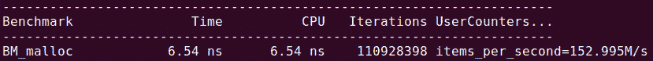

# RAII 的全面审视

资源管理可能是程序做的第二频繁的事情，仅次于计算。但仅仅因为它是频繁进行的，并不意味着它是可见的——某些语言会隐藏大部分或全部的资源管理，不让用户看到。而且，即使它被隐藏，并不意味着它不存在。

每个程序都需要使用一些内存，而内存是一种资源。如果程序从未以某种方式与外界交互（至少要打印结果），那么它将毫无用处，输入输出通道（文件、套接字等）也是资源。

在本章中，我们将首先回答以下问题：

+   在 C++ 程序中，什么被认为是资源？

+   在 C++ 中管理资源的关键关注点是什么？

然后，我们将介绍**资源获取即初始化**（**RAII**）并解释它如何通过回答以下问题来帮助 C++ 中的高效资源管理：

+   在 C++ 中管理资源的标准方法（RAII）是什么？

+   RAII 如何解决资源管理的问题？

我们将结束本章的讨论，通过回答以下问题来探讨使用 RAII 的影响和可能的关注点：

+   在编写 RAII 对象时必须采取哪些预防措施？

+   使用 RAII 进行资源管理会有什么后果？

C++ 具有零开销抽象哲学，它不会在核心语言级别隐藏资源或其管理。但我们最好不要将隐藏资源与资源管理混淆。

# 技术要求

这里有一些有用的链接：

+   Google Test 单元测试框架：[`github.com/google/googletest`](https://github.com/google/googletest)

+   Google Benchmark 库：[`github.com/google/benchmark`](https://github.com/google/benchmark)

+   示例代码：[`github.com/PacktPublishing/Hands-On-Design-Patterns-with-CPP-Second-Edition/tree/master/Chapter05`](https://github.com/PacktPublishing/Hands-On-Design-Patterns-with-CPP-Second-Edition/tree/master/Chapter05)

# C++ 中的资源管理

每个程序都在操作资源，并需要管理它们。最常用的资源当然是内存。因此，你经常会在 C++ 中读到**内存****管理**。但事实上，资源可以是任何东西。许多程序专门用于管理真实的有形物理资源，或者更短暂的（但同样有价值）数字资源。银行账户中的钱、航班座位、汽车零件和组装好的汽车，甚至牛奶箱——在当今世界，如果需要计数和跟踪的东西，某个地方总有一款软件在做这件事。但即使在只做纯计算的程序中，也可能存在各种复杂资源，除非程序也放弃了抽象，在纯数字级别上操作。例如，一个物理模拟程序可能有粒子作为资源。

所有这些资源有一个共同点——它们都需要被考虑在内。它们不应该无影无踪地消失，程序也不应该虚构不存在资源。通常，需要特定实例的资源——你不会希望别人的购买从你的银行账户中扣除；资源的特定实例很重要。因此，在评估不同资源管理方法时最重要的考虑因素是正确性——设计如何确保资源得到适当管理，犯错的难易程度，以及发现此类错误的难度如何？因此，我们使用测试框架来展示本章中资源管理的编码示例也就不足为奇了。

## 安装微基准测试库

在我们的案例中，我们对内存分配效率和可能包含此类分配的小段代码的效率感兴趣。测量小段代码性能的适当工具是微基准测试。市面上有许多微基准测试库和工具；在本章中，我们将使用 Google Benchmark 库。要跟随本章的示例，你必须首先下载并安装库（按照`Readme.md`文件中的说明操作）。然后你可以编译并运行示例。你可以构建库中包含的样本文件，以了解如何在你的特定系统上构建基准测试；你也可以使用本章存储库中的示例基准测试：

```cpp
// Example 01
#include <stdlib.h>
#include "benchmark/benchmark.h"
void BM_malloc(benchmark::State& state) {
  constexpr size_t size = 1024;
  for (auto _ : state) {
    void* p = malloc(size);
    benchmark::DoNotOptimize(p);
    free(p);
  }
  state.SetItemsProcessed(state.iterations());
}
BENCHMARK(BM_malloc);
BENCHMARK_MAIN();
```

注意对`DoNotOptimize()`的调用：这是一个不会生成任何代码但欺骗编译器认为其参数是必要的且不能被优化掉的特殊函数。没有这个，编译器可能会推断出整个基准测试循环没有可观察的效果，可以被优化为无。

在 Linux 机器上，构建并运行名为`01_benchmark.C`的基准测试程序的命令可能看起来像这样：

```cpp
$CXX 01_benchmark.C -I. -I$GBENCH_DIR/include –O3 \
  --std=c++17 $GBENCH_DIR/lib/libbenchmark.a -lpthread \
  -o 01_benchmark && ./01_benchmark
```

这里，`$CXX`是你的 C++编译器，例如`g++`或`clang++`，而`$GBENCH_DIR`是基准测试安装的目录。

上述示例应该打印出类似以下内容：



在这台特定的机器上，单个迭代（一次对`malloc()`和`free()`的调用）需要 6.37 纳秒，这相当于每秒 1.57 亿次内存分配。

有时我们必须对非常短的操作进行基准测试：

```cpp
void BM_increment(benchmark::State& state) {
  size_t i = 0;
  for (auto _ : state) {
    ++i;
    benchmark::DoNotOptimize(i);
  }
  state.SetItemsProcessed(state.iterations());
}
```

我们可能会对基准测试循环本身的开销表示合理的关注。在这种情况下，我们可以在循环体中执行多个基准测试操作的副本。我们甚至可以让 C++预处理器为我们复制：

```cpp
// Example 02
#define REPEAT2(x) x x
#define REPEAT4(x) REPEAT2(x) REPEAT2(x)
#define REPEAT8(x) REPEAT4(x) REPEAT4(x)
#define REPEAT16(x) REPEAT8(x) REPEAT8(x)
#define REPEAT32(x) REPEAT16(x) REPEAT16(x)
#define REPEAT(x) REPEAT32(x)
void BM_increment32(benchmark::State& state) {
  size_t i = 0;
  for (auto _ : state) {
    REPEAT(
      ++i;
      benchmark::DoNotOptimize(i);
    )
  }
  state.SetItemsProcessed(32*state.iterations());
}
```

“*单个*”迭代的现在包括 32 次迭代，因此使用每秒项目数值要容易得多。请记住在处理的项目数量中包含重复计数：


编写快速程序固然很好，但它们首先必须是正确的。为此，我们需要编写测试，因此我们还需要一个测试框架。

## 安装 Google Test

我们将测试非常小的代码片段的正确性。一方面，这仅仅是因为每个片段说明了特定的概念或想法。另一方面，即使在大型软件系统中，资源管理也是通过小的代码块来完成的。它们可能组合成一个相当复杂的资源管理器，但每个块执行特定的功能并且是可测试的。这种情况下的适当测试系统是单元测试框架。有许多这样的框架可供选择；在本章中，我们将使用 Google Test 单元测试框架。要跟随本章中的示例，您必须首先下载并安装该框架（遵循 `README` 文件中的说明）。一旦安装，您就可以编译并运行示例。您可以构建库中包含的示例测试，以了解如何在您的特定系统上构建和链接 Google Test；您还可以使用本章存储库中的示例：

```cpp
#include <vector>
#include "gtest/gtest.h"
TEST(Memory, Vector) {
  std::vector<int> v(10);
  EXPECT_EQ(10u, v.size());
  EXPECT_LE(10u, v.capacity());
}
```

在 Linux 机器上，构建和运行 `02_test.C` 测试的命令可能看起来像这样：

```cpp
$CXX 02_test.C -I. -I$GTEST_DIR/include -g -O0 -I. \
  -Wall -Wextra -Werror -pedantic --std=c++17 \
  $GTEST_DIR/lib/libgtest.a $GTEST_DIR/lib/libgtest_main.a\
  -lpthread -lrt -lm -o -2_test && ./02_test
```

在这里，`$CXX` 是您的 C++ 编译器，例如 `g++` 或 `clang++`，而 `$GTEST_DIR` 是 Google Test 安装的目录。如果所有测试都通过，您应该得到以下输出：

```cpp
Running main() from gtest_main.cc
[==========] Running 1 test from 1 test case.
[----------] Global test environment set-up.
[----------] 1 test from Memory
[ RUN      ] Memory.Vector
[       OK ] Memory.Vector (0 ms)
[----------] 1 test from Memory (0 ms total)
[----------] Global test environment tear-down
[==========] 1 test from 1 test case ran. (0 ms total)
[  PASSED  ] 1 test.
```

编写好的测试是一种艺术。我们必须确定代码中需要验证的方面，并想出观察这些方面的方法。在本章中，我们关注资源管理，让我们看看我们如何测试资源的利用和释放。

## 资源计数

单元测试框架，如 Google Test，允许我们执行一些代码并验证结果是否符合预期。我们可以查看的结果包括从测试程序可以访问的任何变量或表达式。这个定义并不包括例如当前使用的内存量。因此，如果我们想验证资源没有消失，我们必须计数。

在以下简单的测试用例中，我们使用一个特殊的资源类而不是，比如说，`int` 关键字。这个类被配置为统计已创建的此类对象的数量以及当前活跃的对象数量：

```cpp
// Example 03
struct object_counter {
  static int count;
  static int all_count;
  object_counter() { ++count; ++all_count; }
  ~object_counter() { --count; }
};
int object_counter::count = 0;
int object_counter::all_count = 0;
```

现在我们可以测试我们的程序是否正确管理资源，如下所示：

```cpp
// Example 03
#include "gtest/gtest.h"
TEST(Memory, NewDelete) {
  object_counter::all_count = object_counter::count = 0;
  object_counter* p = new object_counter;
  EXPECT_EQ(1, object_counter::count);
  EXPECT_EQ(1, object_counter::all_count);
  delete p;
  EXPECT_EQ(0, object_counter::count);
  EXPECT_EQ(1, object_counter::all_count);
}
```

在 Google Test 中，每个测试都实现为一个 **测试用例**。有几种类型；最简单的一种是独立的测试函数，就像我们在这里使用的那样。运行这个简单的测试程序告诉我们测试已经通过，如下所示：

```cpp
[----------] 1 test from Memory
[ RUN      ] Memory.NewDelete
[       OK ] Memory.NewDelete (0 ms)
[----------] 1 test from Memory (0 ms total)
[  PASSED  ] 1 test.
```

预期结果是通过使用 `EXPECT_*` 宏之一来验证的，任何测试失败都会被报告。这个测试验证了在创建和删除 `object_counter` 类型的实例之后，没有留下这样的对象，并且恰好创建了一个实例。

# 手动资源管理的危险

C++允许我们在几乎硬件级别上管理资源，实际上，某处确实有人在这个级别上管理它们。对于每种语言来说，这实际上都是正确的，即使是那些不向程序员暴露此类细节的高级语言。但“某处”不必就在你的程序中！在我们学习 C++的资源管理解决方案和工具之前，让我们首先了解不使用此类工具会引发的问题。

## 手动资源管理容易出错

手动管理每个资源，通过显式调用获取和释放每个资源的方式，最明显的危险是很容易忘记释放。例如，看看以下情况：

```cpp
{
  object_counter* p = new object_counter;
  ... many more lines of code ...
  // Were we supposed to do something here?
  // Can't remember now...
}
```

我们现在正在泄露一个资源（在这种情况下是`object_counter`对象）。如果我们在一个单元测试中这样做，它将会失败，如下所示：

```cpp
// Example 04
TEST(Memory, Leak1) {
  object_counter::all_count = object_counter::count = 0;
  object_counter* p = new object_counter;
  EXPECT_EQ(1, object_counter::count);
  EXPECT_EQ(1, object_counter::all_count);
  //delete p;  // Forgot that
  EXPECT_EQ(0, object_counter::count); // This test fails!
  EXPECT_EQ(1, object_counter::all_count);
}
```

你可以看到失败的测试和失败的地点，这是由单元测试框架报告的：

```cpp
[ RUN      ] Memory.Leak1
04_memory.C:31: Failure
Expected equality of these values:
  0
  object_counter::count
    Which is: 1
[  FAILED  ] Memory.Leak1 (0 ms)
```

在一个真实程序中，找到这样的错误要困难得多。内存调试器和清理器可以帮助处理内存泄露，但它们需要程序实际执行有缺陷的代码，因此它们依赖于测试覆盖率。

资源泄露可能更加微妙且难以发现。考虑以下代码，我们并没有忘记释放资源：

```cpp
bool process(... some parameters ... ) {
  object_counter* p = new object_counter;
  ... many more lines of code ...
  delete p;    // A-ha, we remembered!
  return true;    // Success
}
```

在后续的维护中，发现了一个可能的问题状态，并添加了相应的测试：

```cpp
bool process(... some parameters ... ) {
  object_counter* p = new object_counter;
  ... many more lines of code ...
  if (!success) return false;   // Failure, cannot continue
  ... even more lines of code ...
  delete p;    // Still here
  return true;    // Success
}
```

这个更改引入了一个微妙的错误——现在，只有在中间计算失败并触发提前返回时才会泄露资源。如果失败足够罕见，这个错误可能会逃过所有测试，即使测试过程使用了常规的内存清理器运行。这个错误也很容易犯，因为编辑可能是在远离对象构建和删除的地方进行的，而且立即的上下文中没有任何东西给程序员提示需要释放资源。

在这种情况下，资源泄露的替代方案是释放它。请注意，这会导致一些代码重复：

```cpp
bool process(... some parameters ... ) {
  object_counter* p = new object_counter;
  ... many more lines of code ...
  if (!success) {
    delete p;
    return false;    // Failure, cannot continue
  }
  ... even more lines of code ...
  delete p;    // Still here
  return true;    // Success
}
```

就像任何代码重复一样，存在代码分歧的危险。假设下一轮代码增强需要多个`object_counter`，现在它们作为一个数组被分配如下：

```cpp
bool process(... some parameters ... ) {
  object_counter* p = new object_counter[10]; // Array now
  ... many more lines of code ...
  if (!success) {
    delete p;
    return false;     // Old scalar delete
  }
  ... even more lines of code ...
  delete [] p;    // Matching array delete
  return true;    // Success
}
```

如果我们将`new`改为`new`数组，我们必须也将`delete`改为数组形式的`delete`；这种想法是，函数的末尾可能有一个。谁知道中间还有一个呢？即使程序员没有忘记资源，随着程序变得更加复杂，手动资源管理会变得不成比例地容易出错。并不是所有资源都像计数器对象那样宽容。考虑以下执行一些并发计算并必须获取和释放互斥锁的代码。注意，**获取**和**释放**这两个词，作为锁的通用术语，暗示锁被当作一种资源（这里的资源是锁保护的数据的独占访问）：

```cpp
std::mutex m1, m2, m3;
bool process_concurrently(... some parameters ... ) {
  m1.lock();
  m2.lock();
  ... need both locks in this section ...
  if (!success) {
    m1.unlock();
    m2.unlock();
    return false;
  } // Both locks unlocked
  ... more code ...
  m2.unlock();    // Don't need access to m1-guarded data
                // Still need m1
  m3.lock();
  if (!success) {
    m1.unlock();
    return false;
  } // No need to unlock m2 here
  ... more code ...
  m1.unlock();
  m3.unlock();
  return true;
}
```

这段代码既有重复也有分歧。它还包含一个错误——看看你是否能找到它（提示——计算`m3`解锁的次数，与它之后有多少`return`语句）。随着资源变得越来越多且管理起来越来越复杂，这样的错误将会更频繁地出现。

## 资源管理和异常安全

记得上一节开头提到的代码吗——我们说它是正确的，因为我们没有忘记释放资源？考虑以下代码：

```cpp
bool process(... some parameters ... ) {
  object_counter* p = new object_counter;
  ... many more lines of code ...
  delete p;
  return true;    // Success
}
```

我有一个坏消息要告诉你——这段代码可能也不正确。如果任何更多的代码行可以抛出异常，那么`delete p`永远不会被执行：

```cpp
bool process(... some parameters ... ) {
  object_counter* p = new object_counter;
  ... many more lines of code ...
  if (!success) // Cannot continue
    throw process_exception();
  ... even more lines of code ...
  // Won't do anything if an exception is thrown!
  delete p;
  return true;
}
```

这看起来与早期的`return`问题非常相似，但更糟糕——异常可以由`process()`函数调用的任何代码抛出。异常甚至可以添加到`process()`函数调用的某些代码中，而函数本身没有任何变化。它曾经工作得很好，然后有一天它就不行了。

除非我们改变资源管理的方法，否则唯一的解决方案是使用`try …` `catch`块：

```cpp
bool process(... some parameters ... ) {
  object_counter* p = new object_counter;
  try {
    ... many more lines of code ...
    if (!success) // Cannot continue
      throw process_exception();
      ... even more lines of code ...
  } catch ( ... ) {
    delete p;    // For exceptional case
  }
  delete p;    // For normal case return true;
}
```

这里明显的问题是代码重复，以及`try … catch`块无处不在的泛滥。更糟糕的是，如果我们需要管理多个资源，或者只是管理比单个获取和释放更复杂的事情，这种方法就不适用了：

```cpp
std::mutex m;
bool process(... some parameters ... ) {
  m.lock(); // Critical section starts here
  object_counter* p = new object_counter;
  // Problem #1: constructor can throw
  try {
    ... many more lines of code ...
    m.unlock();    // Critical section ends here
    ... even more lines of code ...
  } catch ( ... ) {
    delete p;    // OK, always needed
    m.unlock();    // Do we need this? Maybe…
    throw;    // Rethrow the exception for the client to handle
  }
  delete p;    // For normal case, no need to unlock mutex
  return true;
}
```

现在，我们甚至不能决定是否在捕获块中释放互斥锁——这取决于异常是在`unlock()`操作之前还是之后抛出的。此外，`object_counter`构造函数可能会抛出异常（不是我们之前遇到的简单异常，而是一个更复杂的异常，我们的代码可能会演变成）。这将会发生在`try … catch`块之外，互斥锁将永远不会被解锁。

到现在为止，我们应该很清楚，我们需要一个完全不同的解决方案来处理资源管理问题，而不仅仅是修补。在下一节中，我们将讨论成为 C++中资源管理黄金标准的模式。

# RAII 习语

我们在前一节中看到了尝试管理资源是如何变得不可靠，然后是错误倾向，最终失败的。我们需要确保资源获取始终与资源释放配对，并且这两个动作分别在使用资源的代码段之前和之后发生。在 C++ 中，这种通过一对动作括起来的代码序列称为 Execute Around 设计模式。

小贴士

更多信息，请参阅 Kevlin Henney 撰写的文章 *C++ Patterns – Executing Around Sequences*，可在 [`www.two-sdg.demon.co.uk/curbralan/papers/europlop/ExecutingAroundSequences.pdf`](http://www.two-sdg.demon.co.uk/curbralan/papers/europlop/ExecutingAroundSequences.pdf) 获取。

当具体应用于资源管理时，这种模式更广为人知的是 **资源获取即初始化**（**RAII**）。

## RAII 简而言之

RAII（资源获取即初始化）背后的基本思想非常简单——在 C++ 中有一种函数可以保证自动调用，那就是在栈上创建的对象的析构函数，或者另一个对象的数据成员的析构函数（在后一种情况下，保证仅在包含的类本身被销毁时成立）。如果我们能将资源的释放与这种对象的析构函数挂钩，那么释放就不会被遗忘或跳过。从逻辑上讲，如果释放资源由析构函数处理，那么获取资源应该由构造函数在对象的初始化期间处理。因此，本章标题中介绍的 RAII 的完整意义——*全面了解 RAII*。

让我们看看在内存分配的最简单情况下，通过 `operator new` 是如何工作的。首先，我们需要一个可以从新分配的对象的指针初始化的类，并且其析构函数将删除该对象：

```cpp
// Example 05
template <typename T> class raii {
  public:
  explicit raii(T* p) : p_(p) {}
  ~raii() { delete p_; }
  private:
  T* p_;
};
```

现在确保删除永远不会被遗漏变得非常容易，我们可以通过使用 `object_counter` 的测试来验证它是否按预期工作：

```cpp
// Example 05
TEST(RAII, AcquireRelease) {
  object_counter::all_count = object_counter::count = 0;
  {
    raii<object_counter> p(new object_counter);
    EXPECT_EQ(1, object_counter::count);
    EXPECT_EQ(1, object_counter::all_count);
  } // No need to delete p, it's automatic
  EXPECT_EQ(0, object_counter::count);
  EXPECT_EQ(1, object_counter::all_count);
}
```

注意，在 C++17 中，类模板类型是从构造函数推导出来的，我们可以简单地写出以下内容：

```cpp
raii p(new object_counter);
```

当拥有对象因任何原因被销毁时，RAII 资源释放就会发生；因此，在抛出异常后的清理工作会自动完成：

```cpp
// Example 05
struct my_exception {};
TEST(Memory, NoLeak) {
  object_counter::all_count = object_counter::count = 0;
  try {
    raii p(new object_counter);
    throw my_exception();
  } catch ( my_exception& e ) {
  }
  EXPECT_EQ(0, object_counter::count);
  EXPECT_EQ(1, object_counter::all_count);
}
```

当然，我们可能希望使用新对象做更多的事情，而不仅仅是创建和删除它，因此能够访问 RAII 对象内部存储的指针会很好。没有理由以外的方式授予这种访问权限，除了标准的指针语法，这使得我们的 RAII 对象本身就像一个指针：

```cpp
// Example 06
template <typename T> class scoped_ptr {
  public:
  explicit scoped_ptr(T* p) : p_(p) {}
  ~scoped_ptr() { delete p_; }
  T* operator->() { return p_; }
  const T* operator->() const { return p_; }
  T& operator*() { return *p_; }
  const T& operator*() const { return *p_; }
  private:
  T* p_;
};
```

这个指针可以在作用域结束时自动删除它所指向的对象（因此得名）：

```cpp
// Example 06
TEST(Scoped_ptr, AcquireRelease) {
  object_counter::all_count = object_counter::count = 0;
  {
    scoped_ptr p(new object_counter);
    EXPECT_EQ(1, object_counter::count);
    EXPECT_EQ(1, object_counter::all_count);
  }
  EXPECT_EQ(0, object_counter::count);
  EXPECT_EQ(1, object_counter::all_count);
}
```

析构函数会在包含 `scoped_ptr` 对象的作用域退出时被调用。无论以何种方式退出——函数中的早期 `return`，循环中的 `break` 或 `continue` 语句，或者抛出异常——都会以完全相同的方式处理，并且不会发生泄漏。当然，我们可以通过测试来验证这一点：

```cpp
// Example 06
TEST(Scoped_ptr, EarlyReturnNoLeak) {
  object_counter::all_count = object_counter::count = 0;
  do {
    scoped_ptr p(new object_counter);
    break;
  } while (false);
  EXPECT_EQ(0, object_counter::count);
  EXPECT_EQ(1, object_counter::all_count);
}
TEST(Scoped_ptr, ThrowNoLeak) {
  object_counter::all_count = object_counter::count = 0;
  try {
    scoped_ptr p(new object_counter);
   throw 1;
  } catch ( ... ) {}
  EXPECT_EQ(0, object_counter::count);
  EXPECT_EQ(1, object_counter::all_count);
}
```

所有测试都通过，确认没有泄漏：

```cpp
[----------] 6 tests from Scoped_ptr
[ RUN      ] Scoped_ptr.AcquireRelease
[       OK ] Scoped_ptr.AcquireRelease (0 ms)
[ RUN      ] Scoped_ptr.EarlyReturnNoLeak
[       OK ] Scoped_ptr.EarlyReturnNoLeak (0 ms)
[ RUN      ] Scoped_ptr.ThrowNoLeak
[       OK ] Scoped_ptr.ThrowNoLeak (0 ms)
[ RUN      ] Scoped_ptr.DataMember
[       OK ] Scoped_ptr.DataMember (0 ms)
[ RUN      ] Scoped_ptr.Reset
[       OK ] Scoped_ptr.Reset (0 ms)
[ RUN      ] Scoped_ptr.Reseat
[       OK ] Scoped_ptr.Reseat (0 ms)
[----------] 6 tests from Scoped_ptr (0 ms total)
```

同样，我们可以在另一个类中将作用域指针用作数据成员——一个具有二级存储并在销毁时必须释放它的类：

```cpp
class A {
  public:
  A(object_counter* p) : p_(p) {}
  private:
  scoped_ptr<object_counter> p_;
};
```

这样，我们就不需要在类 `A` 的析构函数中手动删除对象，实际上，如果类 `A` 的每个数据成员都以类似的方式自行处理，类 `A` 甚至可能不需要显式的析构函数。

任何熟悉 C++11 的人都会认出我们的 `scoped_ptr` 是 `std::unique_ptr` 的一个非常基础的版本，它可以用于相同的目的。正如你所期望的，标准唯一指针的实现要复杂得多，而且有很好的理由。我们将在本章后面回顾一些这些理由，但为了清楚起见：你应该在你的代码中使用 `std::unique_ptr`，我们在这里实现自己的 `scoped_ptr` 的唯一原因是为了理解 RAII 指针的工作原理。

最后要考虑的一个问题是性能。C++在可能的情况下总是追求零开销抽象。在这种情况下，我们将原始指针包装到智能指针对象中。然而，编译器不需要生成任何额外的机器指令；包装器只是迫使编译器生成代码，在正确的程序中，它本来就会这样做。我们可以通过简单的基准测试来确认我们的 `scoped_ptr`（或者说是 `std::unique_ptr`，无论如何）的构造/删除和解除引用操作与原始指针上的相应操作所需时间完全相同。例如，以下微基准测试（使用 Google 基准库）比较了三种指针类型解除引用的性能：

```cpp
// Example 07
void BM_rawptr_dereference(benchmark::State& state) {
  int* p = new int;
  for (auto _ : state) {
    REPEAT(benchmark::DoNotOptimize(*p);)
  }
  delete p;
  state.SetItemsProcessed(32*state.iterations());
}
void BM_scoped_ptr_dereference(benchmark::State& state) {
  scoped_ptr<int> p(new int);
  for (auto _ : state) {
    REPEAT(benchmark::DoNotOptimize(*p);)
  }
  state.SetItemsProcessed(32*state.iterations());
}
void BM_unique_ptr_dereference(benchmark::State& state) {
  std::unique_ptr<int> p(new int);
  for (auto _ : state) {
     REPEAT(benchmark::DoNotOptimize(*p);)
  }
  state.SetItemsProcessed(32*state.iterations());
}
BENCHMARK(BM_rawptr_dereference);
BENCHMARK(BM_scoped_ptr_ dereference);
BENCHMARK(BM_unique_ptr_dereference);
BENCHMARK_MAIN();
```

基准测试显示智能指针确实没有开销：

```cpp
----------------------------------------------------------------------
Benchmark                   Time        CPU Iterations UserCounters...
BM_rawptr_dereference      3.42 ns  3.42 ns  817698667 items_per_second=9.35646G/s
BM_scoped_ptr_dereference  3.37 ns  3.37 ns  826869427 items_per_second=9.48656G/s
BM_unique_ptr_dereference  3.42 ns  3.42 ns  827030287 items_per_second=9.36446G/s
```

我们已经详细介绍了 RAII 在管理内存中的应用。但还有其他资源需要 C++程序进行管理和跟踪，因此我们现在必须扩展我们对 RAII 的看法。

## 对于其他资源的 RAII

名称 RAII 指的是*资源*而不是*内存*，并且确实相同的策略适用于其他资源。对于每种资源类型，我们需要一个特殊对象，尽管泛型编程和 lambda 表达式可以帮助我们编写更少的代码（我们将在*第十一章*，*作用域保护者*)中了解更多）。资源在构造函数中获取，在析构函数中释放。请注意，RAII 有两种略微不同的风格。第一种是我们已经看到的选择——资源的实际获取是在初始化时，但不在 RAII 对象的构造函数外部。

构造函数仅捕获由此获取的结果句柄（例如指针）。这正是我们刚才看到的`scoped_ptr`对象的情况——内存分配和对象构造都是在`scoped_ptr`对象的构造函数之外完成的，但仍然在其初始化期间。RAII 对象的构造函数的第二个选项是实际获取资源。让我们看看这是如何工作的，以下是一个管理互斥锁的 RAII 对象的例子：

```cpp
// Example 08
class mutex_guard {
  public:
  explicit mutex_guard(std::mutex& m) : m_(m) {
    m_.lock();
  }
  ~mutex_guard() { m_.unlock(); }
  private:
  std::mutex& m_;
};
```

在这里，`mutex_guard`类的构造函数本身获取资源；在这种情况下，是互斥锁保护的共享数据的独占访问。析构函数释放该资源。再次强调，这种模式完全消除了*泄漏*锁的可能性（即在没有释放锁的情况下退出作用域），例如，当抛出异常时：

```cpp
// Example 08
std::mutex m;
TEST(MutexGuard, ThrowNoLeak) {
  try {
    mutex_guard lg(m);
    EXPECT_FALSE(m.try_lock());    // Expect to be locked
    throw 1;
  } catch ( ... ) {}
  EXPECT_TRUE(m.try_lock());    // Expect to be unlocked
  m.unlock();    // try_lock() will lock, undo it
}
```

在这个测试中，我们通过调用`std::mutex::try_lock()`来检查互斥锁是否被锁定——如果互斥锁已经被锁定，我们不能调用`lock()`，因为这会导致死锁。通过调用`try_lock()`，我们可以检查互斥锁的状态，而不会面临死锁的风险（但请记住，如果`try_lock()`成功，则必须解锁互斥锁，因为我们只是使用`try_lock()`来测试，不希望再次锁定互斥锁）。

再次强调，标准提供了一个用于互斥锁定的 RAII 对象，`std::lock_guard`。它以类似的方式使用，但可以应用于任何具有`lock()`和`unlock()`成员函数的互斥锁类型：

```cpp
  try {
    std::lock_guard lg(m);        // C++17 constructor
    EXPECT_FALSE(m.try_lock());    // Expect to be locked
    throw 1;
  } catch ( ... ) {}
  EXPECT_TRUE(m.try_lock());    // Expect to be unlocked
```

在 C++17 中，我们有一个用于锁定多个互斥锁的类似 RAII 对象——`std::scoped_lock`。除了 RAII 释放之外，它还提供了一种在同时锁定多个互斥锁时的死锁避免算法。当然，C++程序可能需要管理的资源种类还有很多，所以我们经常需要编写自己的 RAII 对象。有时，标准会提供帮助，例如 C++20 中添加的`std::jthread`（线程也是一种资源，“*释放*”它通常意味着连接线程，这是`std::jthread`在其析构函数中所做的）。随着可以使用 RAII 技术管理的资源种类繁多，有时我们的需求超出了在作用域结束时自动释放资源。

## 提前发布

函数或循环体的作用域并不总是与持有资源的期望持续时间相匹配。如果我们不想在作用域的非常开始处获取资源，这很简单——RAII 对象可以在任何地方创建，而不仅仅是作用域的开始。资源只有在 RAII 对象被构造时才会获取，如下所示：

```cpp
void process(...) {
  ... do work that does not need exclusive access ...
  mutex_guard lg(m);    // Now we lock
  ... work on shared data, now protected by mutex ...
} // lock is released here
```

然而，释放仍然发生在函数体作用域的末尾。如果我们只想在函数内部锁定一小段代码怎么办？最简单的答案是创建一个额外的作用域：

```cpp
void process(...) {
  ... do work that does not need exclusive access ...
  {
    mutex_guard lg(m);    // Now we lock
    ... work on shared data, now protected by mutex ...
  } // lock is released here
  ... more non-exclusive work ...
}
```

如果你以前从未见过，可能会感到惊讶，但在 C++中，任何语句序列都可以包含在大括号`{ ... }`中。这样做会创建一个新的作用域，它有自己的局部变量。与跟在循环或条件语句后面的花括号不同，这个作用域的唯一目的是控制这些局部变量的生命周期。广泛使用 RAII 的程序通常有许多这样的作用域，它们包围着生命周期比整体函数或循环体更短的不同变量。这种做法也通过明确指出某些变量在某个点之后将不再使用来提高可读性，因此读者不需要扫描代码的其余部分来寻找对这些变量的可能引用。此外，如果意图是*过期*一个变量并且不再使用它，用户也不太可能意外地添加这样的引用。

如果资源可能提前释放，但只有满足某些条件时才释放，那会怎样？一种可能的方法是，再次，将资源的使用包含在作用域内，当资源不再需要时退出该作用域。能够使用`break`来退出作用域会非常方便。实现这一点的常见方法是编写一个`do` `once`循环：

```cpp
// Example 08
void process(...) {
  ... do work that does not need exclusive access ...
  do {    // Not really a loop
    mutex_guard lg(m);    // Now we lock
    ... work on shared data, now protected by mutex ...
    if (work_done) break;    // Exit the scope
    ... work on the shared data some more ...
  } while (false);        // lock is released here
  ... more non-exclusive work ...
}
```

然而，这种方法并不总是有效（我们可能想要释放资源，但不是在同一作用域中定义的其他局部变量），随着控制流的复杂化，代码的可读性也受到影响。抵制通过使用`operator new`动态分配 RAII 对象来完成这一点的冲动！这完全违背了 RAII 的整个目的，因为你现在必须记得调用`operator delete`。我们可以通过添加客户端触发的释放，除了析构函数自动释放之外，来增强我们的资源管理对象。我们只需确保同一资源不会被释放两次。考虑以下使用`scoped_ptr`的示例：

```cpp
// Example 06
template <typename T> class scoped_ptr {
  public:
  explicit scoped_ptr(T* p) : p_(p) {}
  ~scoped_ptr() { delete p_; }
  ...
  void reset() {
    delete p_;
    p_ = nullptr;     // Releases resource early private:
  }
  T* p_;
};
```

在调用`reset()`之后，由`scoped_ptr`对象管理的对象被删除，`scoped_ptr`对象的指针数据成员被重置为 null。请注意，我们不需要在析构函数中添加条件检查，因为按照标准，对 null 指针调用 delete 是允许的——它什么也不做。资源只释放一次，要么是显式地通过`reset()`调用，要么是在包含`scoped_ptr`对象的范围结束时隐式地释放。正如我们之前提到的，你不需要自己编写`scoped_ptr`，除非是为了学习 RAII 指针的工作原理：`std::unique_ptr`也可以重置。

对于`mutex_guard`类，仅从锁定操作中无法推断出是否调用了提前释放，我们需要一个额外的数据成员来跟踪这一点：

```cpp
// Example 08
class mutex_guard {
  public:
  explicit mutex_guard(std::mutex& m) :
    m_(m), must_unlock_(true) { m_.lock(); }
  ~mutex_guard() { if (must_unlock_) m_.unlock(); }
   void reset() { m_.unlock(); must_unlock_ = false; }
  private:
  std::mutex& m_;
  bool must_unlock_;
};
```

现在我们可以通过这个测试来验证互斥锁只被释放一次，在正确的时间：

```cpp
TEST(MutexGuard, Reset) {
  {
    mutex_guard lg(m);
    EXPECT_FALSE(m.try_lock());
    lg.reset();
    EXPECT_TRUE(m.try_lock()); m.unlock();
  }
  EXPECT_TRUE(m.try_lock()); m.unlock();
}
```

标准的`std::unique_ptr`指针支持`reset()`，而`std::lock_guard`不支持，因此如果你需要提前释放互斥锁，你需要使用不同的标准 RAII 对象，即`std::unique_lock`：

```cpp
// Example 08
TEST(LockGuard, Reset) {
  {
    std::unique_lock lg(m);
    EXPECT_FALSE(m.try_lock());
    lg.unlock();
    EXPECT_TRUE(m.try_lock()); m.unlock();
  }
  EXPECT_TRUE(m.try_lock()); m.unlock();
}
```

对于其他资源，你可能需要编写自己的 RAII 对象，这通常是一个相当简单的类，但在开始编写之前，请先完成本章的阅读，因为有一些需要注意的陷阱。

注意，`std::unique_ptr`的`reset()`方法实际上做的不仅仅是提前删除对象。它还可以通过在删除旧对象的同时使指针指向新对象来**重置**指针。它的工作方式大致如下（标准中的实际实现要复杂一些，因为唯一指针具有额外的功能）：

```cpp
template <typename T> class scoped_ptr {
  public:
  explicit scoped_ptr(T* p) : p_(p) {}
  ~scoped_ptr() { delete p_; }
  ...
  void reset(T* p = nullptr) {
    delete p_; p_ = p;    // Reseat the pointer
  }
  private:
  T* p_;
};
```

注意，如果作用域指针被重置为其自身（例如，如果`reset()`被调用时使用与存储在`p_`中的相同值），则此代码会出错。我们可以检查这种条件并什么都不做；值得注意的是，标准并不要求对`std::unique_ptr`进行此类检查。

## 资源获取即初始化对象的谨慎实现

显然，资源管理对象不误管理它们所托管的资源非常重要。不幸的是，我们迄今为止编写的简单 RAII 对象有几个明显的漏洞。

第一个问题出现在有人试图复制这些对象时。在本章中我们考虑的每个 RAII 对象都负责管理其资源的唯一实例，然而，没有任何东西阻止我们复制这个对象：

```cpp
scoped_ptr<object_counter> p(new object_counter);
scoped_ptr<object_counter> p1(p);
```

此代码调用了默认的复制构造函数，它只是简单地复制对象内部的位；在我们的例子中，指针被复制到`object_counter`。现在我们有两个 RAII 对象，它们都控制着相同的资源。最终将调用两个析构函数，并且它们都将尝试删除相同的对象。第二次删除是未定义的行为（如果我们非常幸运，程序将在那个点崩溃）。

RAII 对象的赋值同样存在问题：

```cpp
scoped_ptr<object_counter> p(new object_counter);
scoped_ptr<object_counter> p1(new object_counter);
p = p1;
```

默认赋值运算符也会复制对象的位。同样麻烦的是，我们没有 RAII 对象来管理第二个`object_counter`，`p1`内部的旧指针已经消失，而且没有其他引用指向此对象，所以我们没有删除它的方法。

`mutex_guard`的表现也好不到哪里去——尝试复制它会导致两个将解锁相同互斥锁的互斥锁。第二次解锁将是在一个未锁定（至少不是由调用线程锁定）的互斥锁上进行的，根据标准，这是未定义的行为。`mutex_guard`对象的赋值是不可能的，因为默认情况下不会为具有引用数据成员的对象生成赋值运算符。

您可能已经注意到了，问题是由 **默认** 复制构造函数和默认赋值运算符引起的。这意味着我们应该实现自己的吗？它们会做什么？每个构造的对象应该只调用一个析构函数；互斥量在被锁定后只能解锁一次。这表明 RAII 对象根本不应该被复制，我们应该禁止复制和赋值：

```cpp
template <typename T> class scoped_ptr {
  public:
  explicit scoped_ptr(T* p) : p_(p) {}
  ~scoped_ptr() { delete p_; }
  ...
  private:
  T* p_;
  scoped_ptr(const scoped_ptr&) = delete;
  scoped_ptr& operator=(const scoped_ptr&) = delete;
};
```

有些 RAII 对象是可以复制的。这些是引用计数的资源管理对象；它们跟踪同一托管资源实例的 RAII 对象的副本数量。最后一个 RAII 对象在删除时必须释放资源。我们将在 *第三章* 中更详细地讨论资源的共享管理，*内存* *和所有权*。

对于移动构造函数和赋值运算符，存在不同的考虑因素。移动对象并不违反只有一个 RAII 对象拥有特定资源的假设。它只是改变了哪个 RAII 对象。在许多情况下，例如互斥量保护，移动 RAII 对象是没有意义的（实际上，标准不使 `std::lock_guard` 或 `std::scoped_lock` 可移动，但 `std::unique_lock` 是可移动的，可以用来转移互斥量的所有权）。在某些情况下，移动唯一指针是可能的，并且是有意义的，我们也会在第三章，*内存* *和所有权* 中探讨这一点。

然而，对于作用域指针，移动是不希望的，因为它允许托管对象的生命周期扩展到创建它的作用域之外。请注意，如果我们已经删除了复制构造函数或复制赋值运算符，我们不需要删除移动构造函数或移动赋值运算符（尽管这样做没有坏处）。另一方面，`std::unique_ptr` 是一个可移动对象，这意味着将其用作作用域保护智能指针不会提供相同的保护，因为资源可能会被移动出去。然而，如果您需要一个作用域指针，有一个非常简单的方法可以使 `std::unique_ptr` 完美地完成这项工作——您只需声明一个 `const` `std::unique_ptr` 对象：

```cpp
std::unique_ptr<int> p;
{
  // Can be moved out of the scope
  std::unique_ptr<int> q(new int);
  q = std::move(p);    // and here it happens
  // True scoped pointer, cannot be moved anywhere
  const std::unique_ptr<int> r(new int);
  q = std::move(r);    // Does not compile
}
```

到目前为止，我们已经保护了我们的 RAII 对象免受资源复制或丢失。但我们还没有考虑的一种资源管理错误。显然，资源应该以与获取时匹配的方式释放。然而，没有任何东西可以保护我们的 `scoped_ptr` 对象免受构造和删除之间的这种不匹配：

```cpp
scoped_ptr<int> p(new int[10]);
```

这里的问题是，我们使用 `operator new` 的数组版本分配了多个对象；它应该使用 `operator delete` 的数组版本来删除 - `delete [] p_` 必须在 `scoped_ptr` 析构函数内部调用，而不是我们现在使用的 `delete p_`。

更普遍地，一个在初始化期间接受资源句柄而不是直接获取资源的 RAII 对象（例如`mutex_guard`所做的那样）必须以某种方式确保资源以与获取方式相匹配的正确方式释放。显然，这在一般情况下是不可能的。事实上，即使是对于简单的`new`数组与`delete`标量的不匹配情况，自动执行也是不可能的（尽管像`std::make_unique`这样的工具使得编写此类代码的错误更少）。

通常，RAII 类要么被设计为以特定方式释放资源，要么调用者必须指定资源释放的方式。前者当然更容易，在许多情况下也相当足够。特别是，如果 RAII 类也获取资源，例如我们的`mutex_guard`，它当然知道如何释放它。即使是对于`scoped_ptr`，创建两个版本也不会太难，即`scoped_ptr`和`scoped_array`；后者是为由`operator new`数组分配的对象设计的。标准通过为数组特化唯一指针来处理它：你可以写`std::unique_ptr<int[]>`，数组`delete`将被使用（程序员仍然需要确保由`new[]`分配的数组由指针的正确实例拥有）。

RAII 类的更通用版本不仅由资源类型参数化，还由用于释放此类型的可调用对象参数化，通常称为删除器。删除器可以是一个函数指针、成员函数指针或定义了`operator()`的对象——基本上，任何可以像函数一样调用的东西。请注意，删除器必须在构造函数中传递给 RAII 对象，并存储在 RAII 对象内部，这使得对象更大。此外，删除器的类型是 RAII 类的模板参数，除非它从 RAII 类型中被擦除（这将在*第六章*，*理解类型擦除*）中讨论）。标准为我们提供了两个示例：`std::unique_ptr`有删除器模板参数，而`std::shared_ptr`使用类型擦除。

## RAII 的缺点

实际上，RAII 没有显著的缺点。它无疑是 C++中资源管理最广泛使用的惯用法。唯一需要关注的重要问题是与异常有关。释放资源可能会失败，就像其他任何东西一样。在 C++中，表示失败的一种常用方法是抛出异常。当这不可取时，我们退回到从函数返回错误代码。在 RAII 中，我们无法做到这两者中的任何一项。

很容易理解为什么错误代码不是一种选择——析构函数不返回任何内容。此外，我们也不能将错误代码写入对象的一些状态数据成员，因为对象正在被销毁，其数据成员以及其他包含 RAII 对象的作用域中的局部变量都消失了。唯一保存错误代码以供将来检查的方法是将它写入某种全局状态变量，或者至少是包含作用域中的变量。这在绑定中是可能的，但这样的解决方案非常不优雅且容易出错。这正是 C++在引入异常时试图解决的问题：手动传播的错误代码是容易出错且不可靠的。

那么，如果异常是 C++中错误报告的答案，为什么不用在这里呢？通常的回答是“C++中的析构函数不能抛出异常”。这抓住了问题的关键，但实际的限制要微妙一些。首先，在 C++11 之前，析构函数在技术上可以抛出异常，但异常会传播，并且（希望）最终会被捕获和处理。在 C++11 中，所有析构函数默认都是`noexcept`，除非明确指定为`noexcept(false)`。如果一个`noexcept`函数抛出了异常，程序将立即终止。

因此，在 C++11 中，析构函数不能抛出异常，除非你明确允许它们这样做。但在析构函数中抛出异常有什么问题呢？如果析构函数被执行是因为对象被删除，或者因为控制流到达了栈对象的作用域末尾，那么就没有问题。如果控制流没有正常到达作用域的末尾，而是因为已经抛出了一个异常而执行了析构函数，那么就会出现问题。在 C++中，两个异常不能同时传播。如果发生这种情况，程序将立即终止（注意，析构函数可以抛出和捕获异常，这没有问题，只要该异常不会从析构函数中传播出去）。当然，在编写程序时，没有办法知道在特定作用域中从某个地方调用的某个函数何时会抛出异常。如果资源释放抛出了异常，并且 RAII 对象允许该异常从其析构函数中传播出去，那么如果在异常处理期间调用了该析构函数，程序将会终止。唯一安全的方法是永远不允许异常从析构函数中传播。

这并不意味着释放资源的函数本身不能抛出异常，但如果它抛出了异常，RAII 析构函数必须捕获该异常：

```cpp
class raii {
  ...
  ~raii() {
    try {
      release_resource();    // Might throw
    } catch ( ... ) {
      ... handle the exception, do NOT rethrow ...
    }
  }
};
```

这仍然没有给我们提供一种方法来指示在资源释放过程中发生了错误——抛出了一个异常，我们不得不捕获它并防止其逃逸。

这个问题有多严重？实际上并不严重。首先，释放内存——最常管理的资源——不会抛出异常。通常，内存不是简单地释放，而是通过删除对象来释放。但请记住，析构函数不应该抛出异常，这样通过删除对象释放内存的整个过程也不会抛出异常。在这个时候，读者可能会寻找一个反例，查看标准中如果解锁互斥锁失败会发生什么（这将迫使`std::lock_guard`的析构函数处理错误）。答案是既令人惊讶又发人深省——解锁互斥锁不能抛出异常，但如果它失败了，将产生未定义的行为。这不是偶然；互斥锁旨在与 RAII 对象一起工作。总的来说，这是 C++释放资源的方法：如果释放失败，不应该抛出异常，或者至少不允许其传播。它可以被捕获并记录，例如，但调用程序通常不会意识到失败，这可能会以未定义行为为代价。

尽管语言从 C++11 之前的版本到 C++20 发生了显著变化，RAII 仍然是一个非常成功的技巧，其发展变化很小（除了诸如构造函数参数推导等小的语法便利之外）。这是因为它实际上没有任何显著的缺点。但是，随着语言获得新的功能，有时我们发现方法来改进甚至最好的和最成熟的模式，这就是其中之一。

# 非常现代的 RAII

如果我们真的想挑剔一点，我们还可以对 RAII 提出另一个抱怨；在现实中，这只有在获取或释放代码很长且复杂时才是一个缺点。获取和释放分别在 RAII 对象的构造函数和析构函数中完成，而这段代码可能相当远离资源获取的地方（因此我们不得不在程序中跳来跳去才能弄清楚它做了什么）。

类似地，如果资源管理需要很多状态（例如，根据几个因素和条件采取的适当行动），我们必须在 RAII 对象中捕获所有这些状态。一个真正挑战 RAII 可读性的例子，在书页上也会完全不可读，因此我们不得不对其进行压缩。假设我们想要一个 RAII 锁保护器，它在锁定和解锁互斥锁时执行多个操作，甚至它处理资源的方式也取决于一些外部参数：

```cpp
// Example 09a
class lock_guard {
  std::mutex& m_;
  const bool log_;
  const bool mt_;
  public:
  lock_guard(std::mutex& m, bool log, bool mt);
  ~lock_guard();
};
lock_guard ::lock_guard(std::mutex& m, bool log, bool mt)
  : m_(m), log_(log), mt_(mt) {
  if (log_) std::cout << "Before locking" << std::endl;
  if (mt_) m.lock();
}
lock_guard::~lock_guard() {
  if (mt_) m.unlock();
  if (log_) std::cout << "After locking" << std::endl;
}
```

下面是如何使用这个保护对象的示例：

```cpp
#include <mutex>
std::mutex m;
const bool mt_run = true;
void work() {
  try {
    lock_guard lg(m, true, mt_run);
    … this code might throw …
    std::cout << "Work is happening" << std::endl;
  } catch (...) {}
}
```

在这里，我们除了锁定和解锁之外，只执行一个可能的行为——我们可以选择性地记录这些事件；你现在已经可以看到，构造函数和析构函数的实现，这两段必须紧密匹配的代码，已经有些分离。此外，跟踪状态（我们需要记录事件吗？我们是在多线程还是单线程上下文中运行？）变得有些冗长。再次强调，你必须记住这是一个简化的例子：在实际程序中，这仍然是一个很好的 RAII 对象。但是，如果代码变得更长，你可能希望有更好的方法。

在这种情况下，更好的方法借鉴自 Python（具体来说，来自 `contextmanager` 装饰器）。这种技术使用了协程，因此需要 C++20（所以我们成功地将 C++ 中最古老的工具之一与最前沿的工具结合在一起）。关于协程的一般解释以及 C++ 协程机制的特殊解释超出了本书的范围（你可以在我的书中找到，例如，“*高效编程的艺术*”，([`www.packtpub.com/product/the-art-of-writing-efficient-programs/9781800208117`](https://www.packtpub.com/product/the-art-of-writing-efficient-programs/9781800208117))）。

现在，记住两件事就足够了：

+   首先，C++ 协程本质上与常规函数相同，除了它们可以在任何时候挂起自己并将控制权返回给调用者。调用者可以恢复协程，它将从挂起点继续执行，就像什么都没发生一样。

+   其次，C++ 协程需要大量的标准样板代码。在接下来的示例中，我们将突出显示重要的片段；你可以安全地假设其余的代码是由标准所要求的，以便协程机制能够工作。

让我们先看看使用这种基于协程的 RAII 方法编写的锁卫代码是什么样的：

```cpp
#include <mutex>
std::mutex m;
const bool mt_run = true;
co_resource<std::mutex> make_guard(std::mutex& m, bool log)
{
  if (log) std::cout << "Before locking" << std::endl;
  if (mt_run) m.lock();
  co_yield m;
  if (mt_run) m.unlock();
  if (log) std::cout << "After locking" << std::endl;
}
void work () {
  try {
    co_resource<std::mutex> lg { make_guard(m, true) };
    … this code might throw …
    std::cout << "Work is happening" << std::endl;
  } catch (...) {}
}
```

我们没有使用 `lock_guard` 对象，而是有 `make_guard` 函数。这个函数是一个协程；你可以通过它具有 `co_yield` 操作符来判断——这是 C++ 协程向调用者返回值的好几种方式之一。`co_yield` 之前的代码是资源获取，它在资源获取时执行，相当于我们 `lock_guard` 对象的构造函数。`co_yield` 之后的代码与 `lock_guard` 的析构函数相同。可以说，这更容易阅读和维护（至少在你不再盯着协程语法之后），因为所有代码都在同一个地方。你可以把 `co_yield` 看作是调用者将要执行的工作的占位符（在我们的例子中是互斥锁）。此外，没有要写的类成员和成员初始化——协程执行期间函数参数都是可访问的。

协程返回一个 `co_resource<std::mutex>` 类型的对象：这就是我们的现代 RAII 类型作为 `co_resource` 类模板实现的；它的实现如下：

```cpp
// Example 09
#include <cassert>
#include <coroutine>
#include <cstddef>
#include <memory>
#include <utility>
template <typename T> class co_resource {
  public:
  using promise_type = struct promise_type<T>;
  using handle_type = std::coroutine_handle<promise_type>;
  co_resource(handle_type coro) : coro_(coro) {}
  co_resource(const co_resource&) = delete;
  co_resource& operator=(const co_resource&) = delete;
  co_resource(co_resource&& from)
     : coro_(std::exchange(from.coro_, nullptr)) {}
  co_resource& operator=(co_resource&& from) {
    std::destroy_at(this);
    std::construct_at(this, std::move(from));
    return *this;
  }
  ~co_resource() {
    if (!coro_) return;
    coro_.resume();     // Resume from the co_yield point
    coro_.destroy();    // Clean up
  }
  private:
  handle_type coro_;
};
```

这是拥有资源的对象，但你无法直接看到资源或其类型 `T`：它隐藏在协程句柄 `coro_` 里面。这个句柄就像指向协程状态的指针。如果你暂时将句柄视为资源，我们有一个相当常规的资源拥有对象。它在构造函数中获取资源并保持独占所有权：除非通过移动转移所有权，否则不允许复制资源，句柄在 `co_resource` 对象的析构函数中被销毁。

这个资源拥有对象将由协程函数返回；每个这样的对象都必须包含一个名为 `promise_type` 的嵌套类型。通常，它是一个嵌套类，但也可以是一个单独的类型（在这个例子中，我们将其设置为这样的类型主要是为了避免一个非常长的代码片段）。标准对承诺类型的接口提出了几个要求，下面是我们为了这个目的满足这些要求的类型：

```cpp
template <typename T> struct promise_type {
  const T* yielded_value_p = nullptr;
  std::suspend_never initial_suspend() noexcept {
    return {};
  }
  std::suspend_always final_suspend() noexcept {
    return {};
  }
  void return_void() noexcept {}
  void unhandled_exception() { throw; }
  std::suspend_always yield_value(const T& val) noexcept {
    yielded_value_p = &val;
    return {};
  }
  using handle_type = std::coroutine_handle<promise_type>;
  handle_type get_return_object() {
    return handle_type::from_promise(*this);
  }
};
```

我们的承诺类型包含一个指向协程返回值的指针。这个值是如何到达那里的？当协程通过 `co_yield` 返回结果时，会调用成员函数 `yield_value()`（编译器会生成这个调用）。`co_yield` 返回的值被传递给这个函数，该函数反过来捕获其地址（值的生命周期与协程本身相同）。承诺类型的另一个重要成员函数是 `get_return_object()`：它由编译器调用，以将 `co_resource` 对象本身返回给 `make_guard()` 协程的调用者。请注意，它并不返回一个 `co_resource` 对象，而是一个可以隐式转换为 `co_resource` 的句柄（它有一个从 `handle_type` 的隐式构造函数）。对于我们的目的，`promise_type` 接口的其他部分是标准所要求的样板代码。

下面是如何 `co_resource` RAII 工作的：首先，我们调用函数 `make_guard()`：

```cpp
co_resource<std::mutex> make_guard(std::mutex& m, bool log)
{
  if (log) std::cout << "Before locking" << std::endl;
  if (mt_run) m.lock();
  co_yield m;
  if (mt_run) m.unlock();
  if (log) std::cout << "After locking" << std::endl;
}
```

从调用者的角度来看，它就像任何其他函数一样开始执行，尽管内部细节相当不同。在执行 `co_yield` 之前的所有代码都会被执行，然后协程被挂起，并且 `co_resource<std::mutex>` 对象被构造并返回给调用者，然后它被移动到一个栈变量中：

```cpp
co_resource<std::mutex> lg { make_guard(m, true) };
```

执行过程如常，由锁定的互斥锁保护。在作用域结束时，对象 `lg` 被销毁；这无论我们是正常退出作用域还是通过抛出异常退出都会发生。在 `co_resource` 对象的析构函数中，通过调用协程句柄 `coro_` 的成员函数 `resume()` 来恢复协程。这导致协程在停止之前立即恢复执行，因此控制权跳转到 `co_yield` 之后的下一行。我们编写在那里释放资源的代码被执行，协程通过作用域的底部退出，现在最后一次。`co_resource` 的析构函数有一些清理工作要做，但除此之外，我们（主要）完成了。

我们在避免过度扩展示例的过程中省略了一些内容。首先，按照目前的写法，如果资源类型 `T` 是引用，则 `co_resource` 模板将无法正常工作。这可能完全是可以接受的：通过 RAII 处理引用并不常见。在这种情况下，使用静态断言或概念检查就足够了。否则，我们必须在模板内部仔细处理依赖类型。其次，对协程的隐式要求，例如 `make_guard()`，是它必须通过 `co_yield` 返回一个值恰好一次（协程体中可以有多个 `co_yield`，但针对特定调用只能执行一个）。为了使代码健壮，我们必须使用运行时断言来验证这一要求是否得到满足。

现在，获取和释放代码紧挨在一起，我们不需要像构造函数和析构函数处理 RAII 那样将函数参数转换为数据成员。唯一可能使它变得更好的事情是，我们不需要为它编写单独的 `make_guard()` 函数，至少在我们只有一个调用的情况下是这样。结果证明，我们可以将协程和 lambda 结合起来达到这样的效果：

```cpp
void work(){
  try {
    auto lg { &->co_resource<std::mutex> {
      if (log) std::cout << "Before locking" << std::endl;
      if (mt_run) m.lock();
      co_yield m;
      if (mt_run) m.unlock();
      if (log) std::cout << "After locking" << std::endl;
    }(true) };
    … this code might throw …
    std::cout << "Work is happening" << std::endl;
  } catch (...) {}
}
```

在这里，协程是 lambda 表达式的 `operator()`；请注意，我们必须显式指定返回类型。lambda 立即被调用；并且，像往常一样，在这种情况下，使用捕获或参数归结为每种情况下更方便的做法。

基于协程的 RAII 资源管理使我们能够将所有相关的代码部分保持得很近。当然，这是有代价的：启动、挂起和恢复协程需要时间（以及一点内存）。基本的 RAII 对象总是更快，所以不要尝试用`co_resource`类替换`std::unique_pointer`。但请记住，我们最初对 RAII 的不满始于观察到，当执行资源获取或释放的代码很长、很复杂且使用大量状态变量时，RAII 类可能难以阅读。在这种情况下，协程的开销可能不太重要（我们也应该指出，稍后将在*第十一章*，*作用域保护者*模式中描述的“作用域保护者”模式解决了相同的一些问题，有时是一个更好的选择）。

我们学到的 RAII 技术是一些最持久的 C++模式；它们从 C++的第一天开始使用，并继续从最新的语言特性中受益。在这本书中，我们将随意使用类，例如`std::unique_ptr`或`std::lock_guard`，而无需再思考。现在，我们留下这些最后的思考。

# 摘要

在这一章之后，你应该对资源管理临时方法的风险有清醒的认识。幸运的是，我们已经学习了 C++中最广泛使用的资源管理惯用语——RAII 惯用语。使用这种惯用语，每个资源都由一个对象拥有。对象的构造（或初始化）会获取资源，而对象的删除会释放资源。我们看到了使用 RAII 如何解决资源管理的问题，例如资源泄漏、意外共享资源和不正确释放资源。我们还学习了编写异常安全代码的基础，至少就资源泄漏或其他不当处理而言。编写 RAII 对象足够简单，但有几个注意事项需要记住。最后，我们回顾了当错误处理必须与 RAII 结合时出现的复杂性。

RAII 是一种资源管理惯用语，但它也可以被视为一种抽象技术：复杂的资源被隐藏在简单的资源句柄之后。下一章将介绍另一种抽象惯用语，类型擦除：我们将不再隐藏复杂对象，而是隐藏复杂类型。

# 问题

1.  程序可以管理哪些资源？

1.  在 C++程序中管理资源时，主要考虑因素是什么？

1.  什么是 RAII？

1.  RAII 是如何解决资源泄漏问题的？

1.  RAII 是如何解决悬挂资源句柄问题的？

1.  C++标准库提供了哪些 RAII 对象？

1.  在编写 RAII 对象时必须采取哪些预防措施？

1.  如果释放资源失败会发生什么？

# 进一步阅读

+   [`www.packtpub.com/application-development/expert-c-programming`](https://www.packtpub.com/application-development/expert-c-programming)

+   [`www.packtpub.com/application-development/c-data-structures-and-algorithms`](https://www.packtpub.com/application-development/c-data-structures-and-algorithms)

+   [`www.packtpub.com/application-development/rapid-c-video`](https://www.packtpub.com/application-development/rapid-c-video)
