# 标准 Qt Widgets

Qt Widgets 不是新出现的，但它们在针对移动和嵌入式设备的应用程序中仍然有其位置。它们结构良好、可预测，并且具有标准 UI 元素。

可识别的 UI 元素可以在 Qt Widgets 中找到，并且在笔记本电脑上运行得很好，笔记本电脑只是移动的桌面。在本章中，你将学习如何设计看起来标准的应用程序。基本控件，如菜单、图标和列表，将进行讨论，重点是如何将用户界面限制在中型和小型显示屏上。我们将讨论的主题包括如何使用 Qt 的动态布局来处理方向变化。将使用 `QGraphicsScene`、`QGraphicsView` 和 `QGraphicsItem` 等类。还将讨论 `QVBoxLayout`、`QGridLayout` 和 `QStackedLayout` 等布局 API。

在本章中，我们将涵盖：

+   使用 Qt Creator 和 Qt Widgets 创建移动应用程序并在设备上运行

+   桌面应用程序和移动应用程序之间的差异，包括屏幕尺寸、内存、手势

+   使用 Qt Widgets 在动态布局中实现屏幕尺寸和方向变化的便捷性

+   使用 `QGraphicsView` 进行图形应用程序开发

# 嗨，移动世界！

你想使用 Qt 开发移动和嵌入式设备的应用程序，这是一个非常好的选择，因为 Qt 是为了跨平台开发而设计的。为了帮助你入门，我们将简要介绍使用 Qt Creator 创建、构建和运行应用程序的基本步骤。我们将简要探讨在创建移动和嵌入式应用程序时需要考虑的不同方面，例如如何使用 Qt Creator 添加菜单。在设计师中添加 `QWidget` 并不困难，我将向你展示如何操作。

Qt 在移动设备上运行有着悠久的历史，始于 2000 年首次发布的 Qt Embedded。Qt Embedded 是 UI Qtopia 的基础框架，最初在 Sharp Zaurus 的 SL-5000D 开发版上发布。

现在，你可以使用 Qt 开发应用程序，并在 iOS App Store、Android Google Play 商店或其他 Linux 移动手机上销售。Qt 应用程序可以在电视上运行，你甚至可以看到它们在汽车和飞机的娱乐系统中运行。它还可以在医疗设备和工厂地面的工业自动化机器上运行。

在移动和嵌入式设备上使用 Qt 时需要考虑一些因素，例如内存限制和显示尺寸限制。手机有触摸屏，而嵌入式设备可能根本就没有屏幕。

当你安装 Qt 时，你可以使用 Qt Creator IDE 来编辑、构建和运行你的代码。它是免费和开源的，因此你可以对其进行自定义。我曾经有一个补丁，它以允许我打印出 Qt Creator 所使用的所有键盘命令的方式自定义了 Qt Creator，这样我就可以有一个快速参考表。让我们快速了解一下 Qt Creator，它曾经被称为 Workbench。

# Qt Creator

我们不会深入探讨 Qt Creator 的细节，但我认为应该提一下，以展示我们如何使用它来开发一个跨平台的基于 `QWidget` 的应用程序，该应用程序可以在桌面和移动平台上运行。我们将讨论两者之间的差异。然后，我们将演示如何使用动态布局来帮助您针对多种不同的屏幕尺寸并处理设备方向变化。您可能已经熟悉 Qt Creator，所以我们将刷新您的记忆。

# 基本 Qt Creator 步骤

在设置好环境后，跨编译和构建在移动设备上运行的应用程序的基本步骤是直接的。我们理论上会遵循以下步骤：

1.  文件 | 新建文件或项目... | Qt Widgets 应用程序，点击选择...按钮

1.  编写一些令人惊叹的代码

1.  在 Qt Creator 左侧选择“项目”图标，然后选择你想要的目标平台，例如为 iOS 选择 Qt 5.12.0。

1.  按 *Ctrl* + *B*，或 *Command* + *B* 构建

1.  按 *Ctrl* + *R*，或 *Command* + *R* 运行

1.  按 *F5*，或 *Command* + *Y* 调试

对于本章，我们将使用 Qt Widgets，这些是更接近传统桌面计算机应用程序的 UI 元素。它们对移动和嵌入式设备仍然很有用。

# Qt Designer

Qt Creator 随附一个名为 Qt Designer 的设计工具。当您创建一个新的模板应用程序时，您将在左侧看到一个文件列表。当您点击任何 `.ui` 文件时，它将在 Qt Designer 中打开您的应用程序表单。

源代码可以在 Git 仓库的 `Chapter01-a` 目录下的 `cp1` 分支中找到。

导航到表单 | mainwindow.ui 并双击。这将打开 UI 文件在 Qt Creator 的 Designer 中。UI 文件只是一个 XML 格式的文本文件，如果您选择，可以直接编辑该文件。以下图片显示了在 Qt Designer 中打开时的样子：

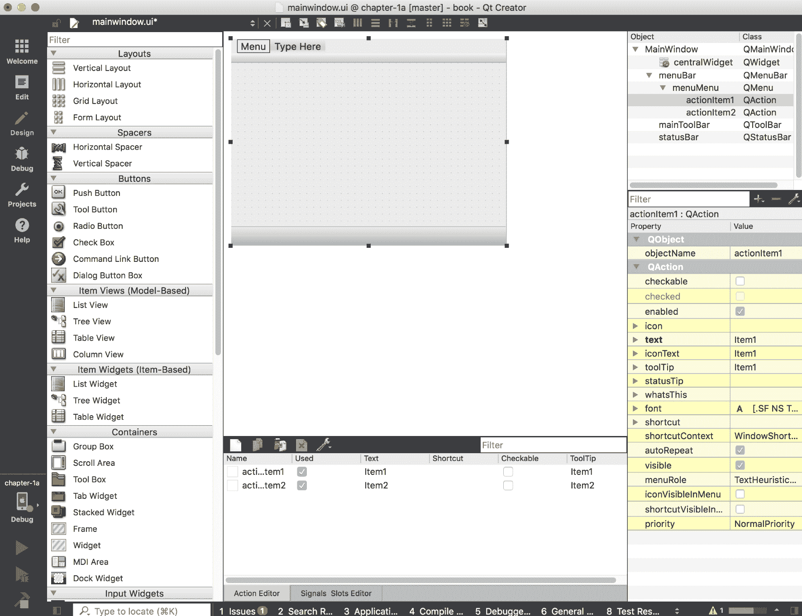

让我们从几乎每个桌面应用程序都有的菜单开始。您的移动或嵌入式应用程序可能也需要一个菜单。如您所见，Qt 应用程序向导已经为我们生成了一个模板菜单。我们需要对其进行自定义以使其可用。我们可以添加一些子菜单项来演示基本的 Qt Creator 功能。

# 添加 QMenu

点击应用程序表单中标记为菜单的位置，添加菜单项。输入类似 `Item1` 的内容，按 *Enter*。添加另一个菜单项，如下图所示：

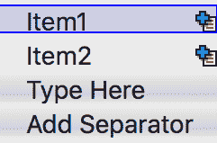

如果您现在构建它，您将得到一个带有菜单的空应用程序，所以让我们添加更多内容来演示如何从 Qt Creator 左侧的控件列表中添加控件。

# 添加 QListView

我们的 UI 表单需要一些内容。我们将为桌面构建和运行它，然后为移动模拟器构建和运行它，以比较两者。这里的步骤很简单，就像拖放一样。

在 Qt Creator 的左侧是一个 Widget、布局和间隔的列表，你可以简单地拖放它们到模板表单上，创建你的杰作 Qt 应用程序。让我们开始吧：

1.  拖动 ListView 并将其放置在表单上。

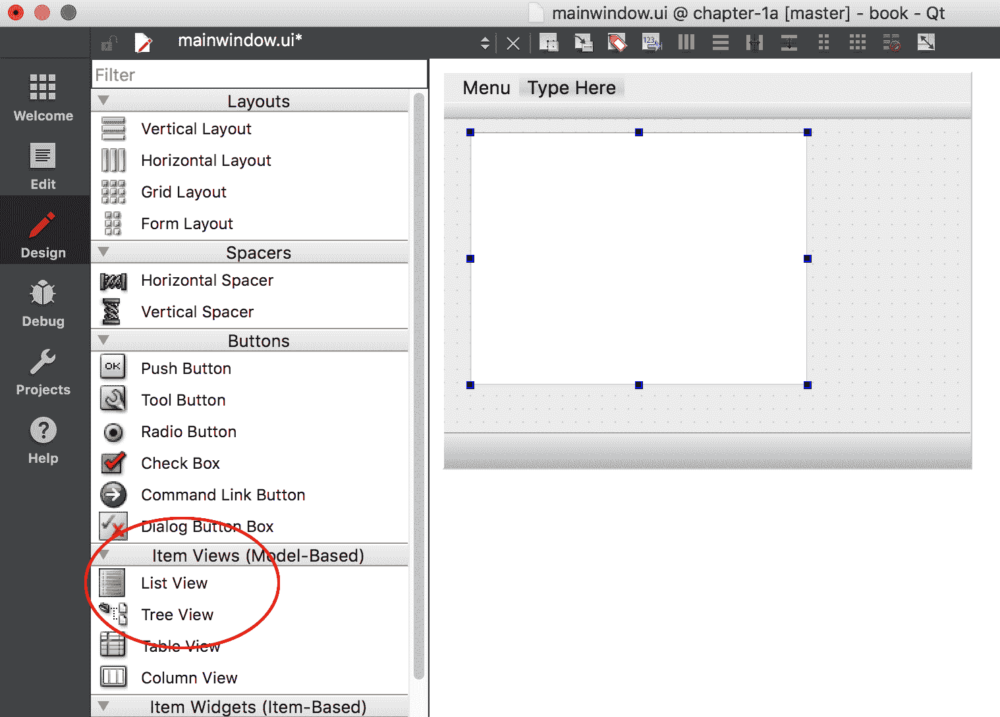

1.  选择桌面工具包，然后通过点击“运行”按钮来构建和运行它。如果你对表单或源代码进行了任何更改，Qt Creator 可以在同一步骤中构建和运行你的应用程序。当你运行它时，应用程序应该看起来类似于以下图片：

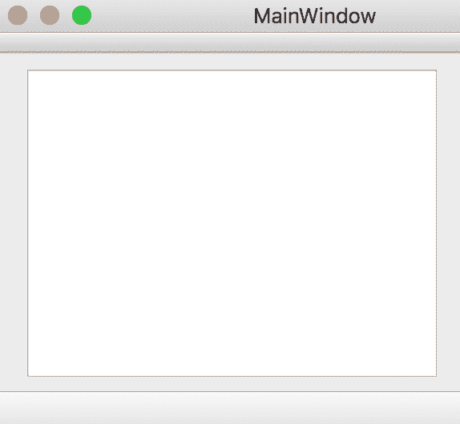

这一切看起来都很完美，但它并没有在像手机这样的小设备上运行。

Qt Creator 自带 iOS 和 Android 模拟器，你可以使用它们来查看你的应用程序在小型屏幕设备上的运行情况。它不是一个仿真器，也就是说，它并不试图模拟设备硬件，而只是模拟机器。实际上，Qt Creator 正在构建和运行目标架构。

1.  现在选择 iOS 模拟器工具包，或在绿色项目工具中选择`Android`，如图所示：


1.  构建并运行它，这将启动它在模拟器中。

这是这个应用在 iOS 模拟器上的运行情况：

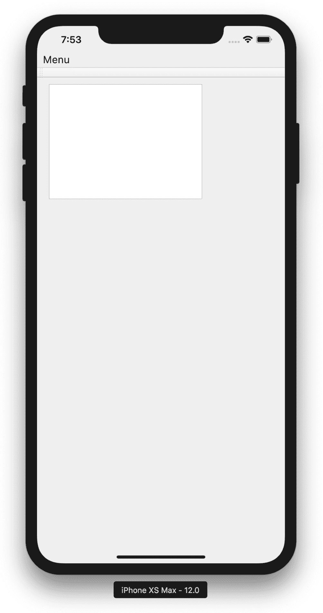

好了！你已经制作了一个移动应用！感觉不错，不是吗？正如你所见，它在模拟器中看起来略有不同。

# 调整屏幕尺寸

将为桌面开发的程序移植到较小的移动设备上可能是一项艰巨的任务，这取决于应用程序。即使是为移动设备创建新应用，也需要考虑一些因素，例如屏幕分辨率、内存限制以及处理方向变化。触摸屏增加了提供触摸手势的另一种奇妙方式，但由于手指点与鼠标指针大小的差异，可能会带来挑战！然后还有传感器、GPS 和网络需要考虑！

# 屏幕分辨率

如你在“添加 QListView”部分之前看到的图片所示，桌面和移动电话之间的应用程序范式相当不同。当你移动到一个更小的显示时，关于如何在屏幕上放置所有内容的问题开始变得棘手。

幸运的是，Qt Widgets 可以帮助。C++类`QScrollArea`、`QStackedWidget`和`QTabbedWidget`可以更合适地显示内容。将你的屏幕小部件委托到不同的页面上，将允许你的用户享受到与桌面应用程序相同的导航便捷性。

在使用`QMenu`时，移动设备可能会有问题。它们可能很长、难以控制，并且菜单树对于小屏幕来说钻得太深。以下是一个在桌面上运行良好的菜单：

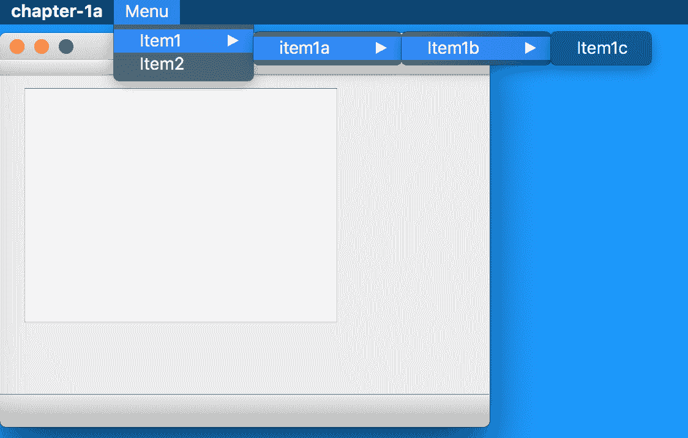

在移动设备上，这个菜单的最后几项变得无法触及和无法使用。我们需要重新设计它！

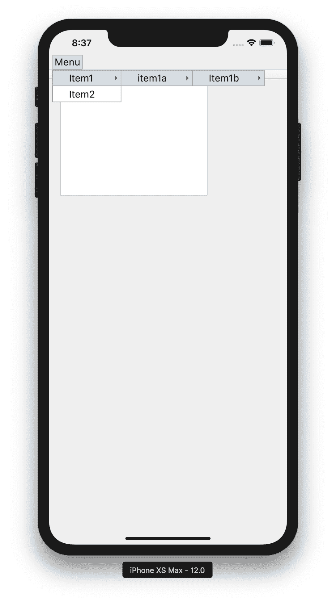

可以通过消除菜单或重构以减少其深度，或者使用类似 `QStackedWidget` 的东西来展示菜单选项来固定菜单。

Qt 支持高（**每英寸点数**）**DPI** 显示器。Qt 的新版本自动补偿 iOS 和 Wayland 显示服务器协议中高 DPI 和低 DPI 显示器之间的差异。对于 Android，需要将环境变量 `QT_AUTO_SCALE_FACTOR` 设置为 true。要测试不同的缩放因子，设置 `QT_SCALE_FACTOR`，通常使用整数，通常是 1 或 2。

让我们通过一些小部件的例子和它们如何在不同的屏幕上更好地使用来运行一遍：

+   类似 `QScrollBar` 的小部件可以增大尺寸，以便更好地适应手指作为指针，或者更好的是隐藏并使用小部件本身来滚动。UI 通常需要简化。

+   长的 `QListViews` 可能会带来一些挑战。你可以尝试为这样的长列表添加筛选或搜索功能，以便在较小的显示上使数据更易于访问且更美观。

+   即使 `QStackedWidget` 或 `QTabbedWidget` 也可能太大。不要让用户左右翻页超过几页。更多内容可能会让用户感到繁琐和烦恼，不断翻页以获取内容。

+   `QStyleSheets` 是针对较小显示器的缩放的好方法，允许开发者对任何小部件进行自定义设置。你可以增加填充和边距，使其更容易进行手指触摸输入。你可以为特定的小部件设置样式，或者将其应用于整个 `QApplication` 的某个类的小部件。

```cpp
qApp->setStyleSheet("QButton {padding: 10px;}");
```

或者对于特定的小部件，可以这样：

```cpp
myButton->setStyleSheet("padding: 10px;");
```

让我们只在设备上有触摸屏时应用这个样式。这将使按钮稍微大一些，更容易用手指点击：

```cpp
if (!QTouchScreen::devices().isEmpty()) {
   qApp->setStyleSheet("QButton {padding: 10px;}");
}
```

如果你使用样式表设置了一个样式，你很可能还需要自定义其他属性和子控件。应用一个样式表会移除默认样式。

当然，在 Qt Designer 中设置样式表也很容易，只需在目标小部件上右键单击，并在上下文菜单中选择“更改样式表”。如下所示，在苹果 Mac 上：

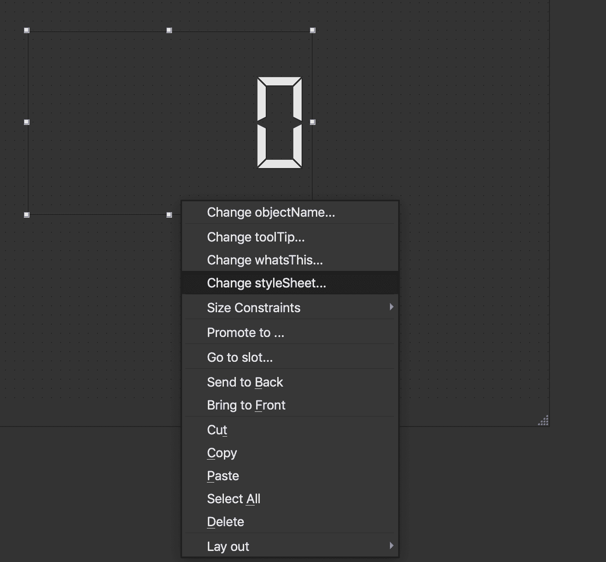

手机和嵌入式设备具有较小的显示屏，它们的 RAM 和存储空间也较少。

# 内存和存储

手机和嵌入式设备通常比桌面机器的内存要少。特别是对于嵌入式设备，RAM 和存储空间都有限。

通过优化图像，如果需要则压缩，可以降低使用的存储空间。如果不使用不同的屏幕尺寸，可以手动调整图像大小，而不是在运行时缩放。

还有一些堆栈考虑因素，通常总是通过使用 `&`（和号）运算符将参数按引用传递给函数。你将在大多数 Qt 代码中注意到这一点。

编译器优化可以极大地影响性能和可执行文件的大小。一般来说，Qt 的`qmake mkspec`构建文件在正确使用优化方面做得相当不错。

如果存储空间是一个关键考虑因素，那么自己构建 Qt 是一个好主意。使用`-no-feature-*`配置来排除可能不需要的任何 Qt 功能，这是一种减少其占用空间的好方法。例如，如果一个设备只有一个静态以太网连接并且不需要网络承载管理，只需使用`-no-feature-bearermanagement`配置 Qt 即可。如果你知道你不会使用 SQL，为什么还要提供那些存储库？使用`--list-features`参数运行 configure 将列出所有可用的功能。

# 方向

移动设备可以移动（谁会想到？）有时在横屏模式下查看特定应用程序比在竖屏模式下更好。在 Android 和 iOS 上，响应方向变化是内置的，并且默认根据用户的配置发生。你可能需要做的一件事，实际上是禁用方向变化。

在**iOS**上，你需要编辑`plist.info`文件。对于`UISupportedInterfaceOrientations`键，你需要添加以下内容：

```cpp
<array><string>UIInterfaceOrientationLandscapeLeft</string></array>
```

在**Android**上，编辑`AndroidManifest.xml`文件，将`android:screenOrientation="landscape"`设置为横向。

如果一个图片框架设备有一个定制的操作系统，它可能需要其照片查看应用程序在用户切换方向时做出响应。这就是 Qt 传感器能提供帮助的地方。关于这一点，稍后将在第七章的第一部分机器对话中详细介绍。

# 手势

触屏手势是移动设备与桌面设备不同的另一种方式。多点触控屏幕彻底改变了设备世界。`QPanGesture`、`QPinchGesture`和`QSwipeGesture`可以在这类设备上发挥巨大作用，Qt Quick 也为此类功能提供了组件——`Flickable`、`SwipeView`、`PinchArea`等。关于 Qt Quick 的更多内容将在稍后介绍。

要使用`QGestures`，首先创建一个包含你想要处理的动作手势的`QList`，然后为目标小部件调用`grabGesture`函数。

```cpp
QList<Qt::GestureType> gestures;
gestures << Qt::PanGesture;
gestures << Qt::PinchGesture;
gestures << Qt::SwipeGesture;
for (Qt::GestureType gesture : gestures)
    someWidget->grabGesture(gesture);
```

你需要从并覆盖小部件的事件循环来处理事件发生时的情况。

```cpp
bool SomeWidget::event(QEvent *event)
{
    if (event->type() == QEvent::Gesture)
        return handleGesture(static_cast<QGestureEvent *>(event));
    return QWidget::event(event);
}
```

要对手势进行有用的处理，我们可以这样处理：

```cpp
if (QGesture *swipe = event->gesture(Qt::SwipeGesture)) {
    if (swipe->state() == Qt::GestureFinished) {
        switch (gesture->horizontalDirection()) {
            case QSwipeGesture::Left:
            break;
            case QSwipeGesture::Right:
            break;
            case QSwipeGesture::Up:
            break;
            case QSwipeGesture::Down:
            break;
        }
    }
}
```

搭载传感器的设备还可以访问`QSensorGesture`，这允许实现如摇动等动作手势。关于这一点，稍后将在第七章机器对话中详细介绍。

# 动态布局

考虑到手机有各种各样的形状和大小，需要为每个不同的屏幕分辨率提供不同的包是荒谬的。因此，我们将使用动态布局。

源代码可以在 Git 仓库的`Chapter01-layouts`目录下的`cp1`分支中找到。

Qt 小部件支持使用`QVBoxLayout`和`QGridLayout`等类来实现这一功能。

Qt Creator 的设计器是开发动态布局的最简单方式。让我们看看我们如何做到这一点。

要设置布局，我们在应用程序表单上放置一个小部件，然后在键盘上按住*Command*或*Control*键，同时选择我们想要放入布局中的小部件。这里有两个选定的`QPushButtons`用于使用：

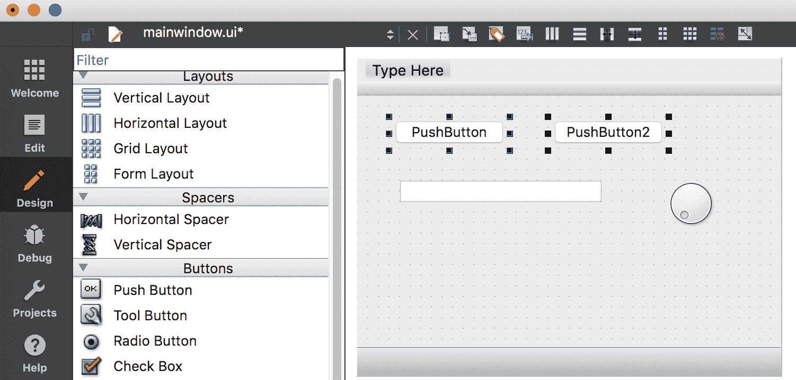

接下来，点击此处突出显示的水平布局图标：

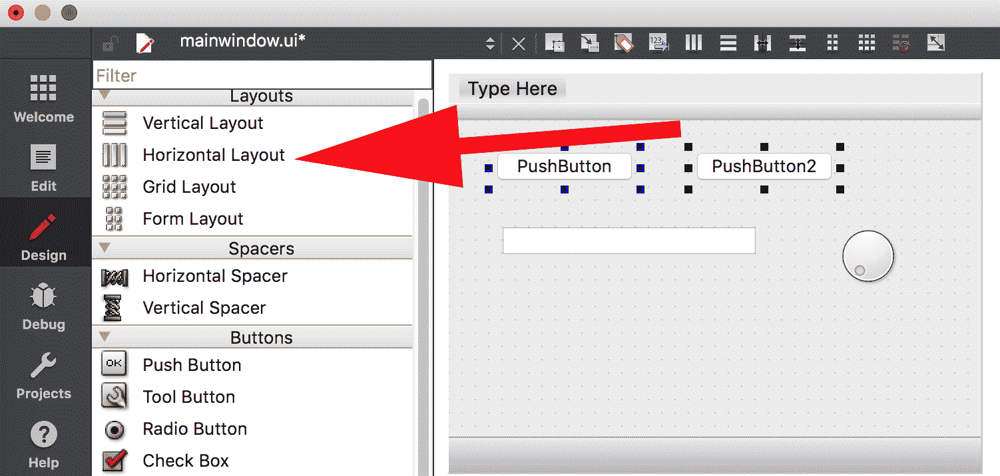

您将看到两个被薄红色框包围的小部件，如下面的截图所示：

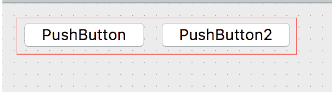

现在为剩余的小部件重复此操作。

要使小部件随着表单扩展和调整大小，请点击背景并选择网格布局：

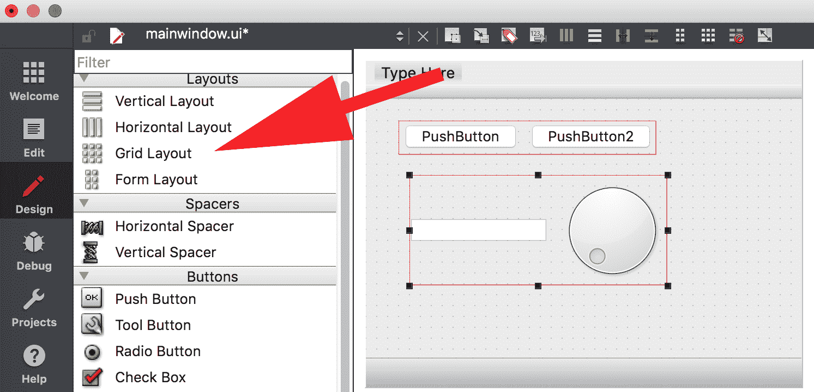

保存并构建此应用程序，现在它将能够根据方向变化调整大小，并且能够在不同尺寸的屏幕上工作。注意在纵向（垂直）方向上的外观：

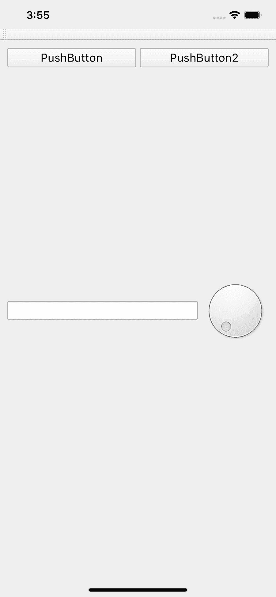

还要注意此应用程序在横向（水平）方向上的外观：

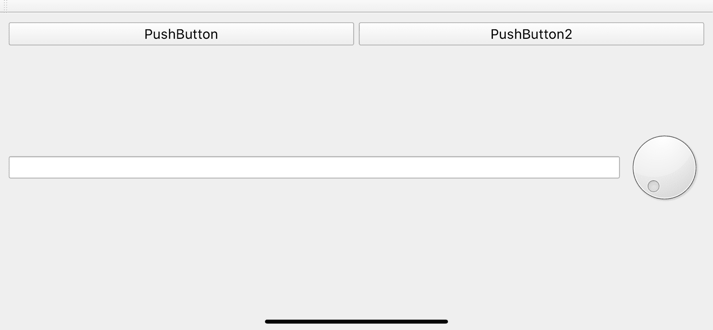

如您所见，此应用程序可以随着方向的变化而变化，但所有小部件都可见且可使用。使用`QSpacer`可以帮助引导小部件和布局定位。它们可以将小部件推到一起，分开，或将一些小部件保持在一边或另一边。

当然，可以在不接触 Qt Designer 的情况下使用布局。例如以下代码：

```cpp
QPushButton *button = new QPushButton(this);
QPushButton *button2 = new QPushButton(this);
QBoxLayout *boxLayout = new QVBoxLayout;
boxLayout->addWidget(button);
boxLayout->addWidget(button2);
QHBoxLayout *horizontalLayout = new QHBoxLayout;
horizontalLayout->setLayout(boxLayout); 
```

`QLayout`及其相关内容是编写能够适应目标设备众多屏幕分辨率和动态变化方向的跨平台应用程序的关键。

# 图形视图

`QGraphicsView`、`QGraphicScene`和`QGraphicsItem`为基于 Qt Widgets 的应用程序显示 2D 图形提供了一种方式。

源代码可以在 Git 仓库的`Chapter01-graphicsview`目录下的`cp1`分支中找到。

每个`QGraphicsView`都需要一个`QGraphicsScene`。每个`QGraphicsScene`都需要一个或多个`QGraphicsItem`。

`QGraphicsItem`可以是以下任何一种：

+   `QGraphicsEllipseItem`

+   `QGraphicsLineItem`

+   `QGraphicsLineItem`

+   `QGraphicsPathItem`

+   `QGraphicsPixmapItem`

+   `QGraphicsPolygonItem`

+   `QGraphicsRectItem`

+   `QGraphicsSimpleTextItem`

+   `QGraphicsTextItem`

Qt Designer 支持添加`QGraphicsView`。您可以按照以下步骤进行操作：

1.  将`QGraphicsView`拖动到新的应用程序表单中，并使用与之前相同的`QGridLayout`填充表单。

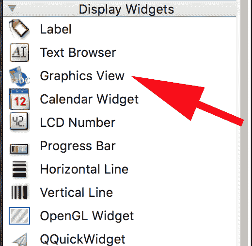

1.  在源代码中实现`QGraphicsScene`并将其添加到`QGraphicsView`

```cpp
QGraphicsScene *gScene = new QGraphicsScene(this);
ui->graphicsView->setScene(gScene);
```

1.  定义一个矩形，它将是`Scene`的范围。这里它比图形视图的大小小，因此我们可以继续定义一些碰撞检测。

```cpp
gScene->setSceneRect(-50, -50, 120, 120);

```

1.  创建一个红色矩形来显示边界矩形。为了使其呈现红色，创建一个 `QPen`，它将被用来绘制矩形，然后将矩形添加到 `Scene` 中。

```cpp
QPen pen = QPen(Qt::red);
gScene->addRect(gScene->sceneRect(), pen);
```

1.  构建并运行应用程序。你会注意到一个带有红色边框正方形的程序。

如前所述，`QGraphicsView` 显示 `QGraphicsItems`。如果我们想添加一些碰撞检测，我们需要从 `QGraphicsSimpleTextItem` 中派生一个子类。

该头文件的格式如下：

```cpp
#include <QGraphicsScene>
#include <QGraphicsSimpleTextItem>
#include <QGraphicsItem>
#include <QPainter>
class TextGraphic :public QGraphicsSimpleTextItem
{
public:
    TextGraphic(const QString &text);
    void paint(QPainter *painter, const QStyleOptionGraphicsItem *option, QWidget *widget);
    QString simpleText;
};
```

这个从 `QGraphicsSimpleTextItem` 派生的自定义类将重新实现 `paint(..)` 函数，并使用 `scene` 的 `collidingItems(...)` 函数来检测何时有东西与我们的文本对象发生碰撞。通常，`collidingItems` 会返回一个 `QList` 的 `QGraphicsItems`，但在这里它只是用来检测是否有任何项目发生碰撞。

由于这个类只包含一个项目，因此我们知道它是哪个项目。如果检测到碰撞，文本会改变。在我们更改文本之前，我们不需要检查项目文本是否不同，因为父类的 `setText(...)` 方法已经为我们做了这件事。

```cpp
TextGraphic::TextGraphic(const QString &text)
 : QGraphicsSimpleTextItem(text),
      simpleText(text)
{
}

void TextGraphic::paint(QPainter *painter, const QStyleOptionGraphicsItem *option, QWidget *widget)
{
    if (scene()->collidingItems(this).isEmpty())
        QGraphicsSimpleTextItem::setText("BOOM!");
    else
        QGraphicsSimpleTextItem::setText(simpleText);

    QGraphicsSimpleTextItem::paint(painter, option, widget);
}
```

现在创建我们的 `TextGraphic` 对象，并将其添加到 `Scene` 中以使用。

```cpp
TextGraphic *text = new TextGraphic(QStringLiteral("Qt Mobile!"));
gScene->addItem(text);
```

如果你构建并运行此应用程序，请注意，如果我们尝试拖动它，`text` 对象将不会移动。`QGraphicsItems` 有一个名为 `QGraphicsItem::ItemIsMovable` 的 `flag` 属性，可以设置为允许它被移动，无论是通过用户还是通过程序：

```cpp
text->setFlag(QGraphicsItem::ItemIsMovable);
```

当我们构建并运行此应用程序时，你可以抓住 `text` 对象并四处移动。如果它超出我们的边界矩形，文本将改变，只有在它再次移动到红色框内时才会返回原始文本。

如果你想对它进行动画处理，只需添加一个计时器，并在计时器触发时更改 `text` 对象的位置。

即使使用 Qt Quick 的软件渲染器，`QGraphicsView` 仍然是一个可行的图形动画解决方案。如果目标设备的存储空间非常紧张，可能没有足够的空间来添加 Qt Quick 库。或者，一个遗留应用程序可能难以导入到 Qt Quick 中。

# 概述

在本章中，我们讨论了移动和嵌入式开发者在尝试为较小显示设备开发时面临的一些问题，以及如何使用 `QStyleSheets` 在运行时更改界面以适应触摸屏输入。

我们讨论了存储和内存空间需求，以及配置 Qt 中不必要的功能以使其具有更小占位符的需求。

我们讨论了处理方向变化，并讨论了使用屏幕手势，如 `Pinch` 和 `Swipe`。

我们学习了如何使用 Qt Designer 添加 `QLayouts` 来创建动态调整大小的应用程序。

最后，我们讨论了如何使用 `QGraphicsView` 来利用图形元素，例如图形文本和图像。

接下来，我们将探讨移动和嵌入式开发中继切片面包之后最好的东西——Qt Quick 和 QML。然后我们将深入探讨有关图形效果的真实精彩内容，以增强任何界面！
