# 使用 Qt Quick 的流畅 UI

我的电视使用 Qt。我的手机使用 Qt。我可以买一辆使用 Qt 的汽车。我可以在使用 Qt 的信息娱乐中心飞行的飞机上。所有这些事情都使用 Qt Quick 作为它们的 UI。为什么？因为它提供了更快的开发——无需等待编译——语法易于使用，但复杂到足以超越你的想象。

Qt Quick 最初是在 Trolltech 的布里斯班开发办公室作为一位开发者的研究项目而开发的。我的一个工作是将早期版本的演示应用程序安装到诺基亚 N800 平板电脑上，我已将其定制为运行 Qtopia 而不是诺基亚的 Maemo 界面。在那之前，诺基亚已经收购了 Trolltech 公司。在我看来，它将成为下一代 Qtopia，Qtopia 已更名为 Qt Extended。到 2006 年，Qtopia 已经在数百万部手机上销售，包括 11 款手机和 30 种不同的手持设备。Qtopia 的某些部分被融合到 Qt 本身中——我最喜欢的，Qt Sensors 和 Qt Bearer Management 就是这些例子。这个新的类似 XML 的框架变成了 QML 和 Qt Quick。

Qt Quick 是一项真正令人兴奋的技术，它似乎正在接管世界。它被用于笔记本电脑、如 Jolla Sailfish 之类的手机以及医疗设备等。

它允许快速开发、流畅的转换、动画和特殊效果。Qt Quick 允许开发者设计定制的动画**用户界面**（**UI**）。结合相关的 Qt Quick Controls 2 和 Qt Charts API，任何人都可以创建炫酷的移动和嵌入式应用程序。

在本章中，我们将设计和构建一个动画用户界面。我们还将介绍基本组件，如 `项目`、`矩形`，以及更高级的元素，如 `GraphicsView`。我们将探讨使用锚点、状态、动画和过渡来定位项目，并还将介绍传统功能，如按钮、滑块和滚动条。还将展示显示数据的先进组件，如柱状图和饼图。

我们在本章中将涵盖以下主题：

+   学习 Qt Quick 基础

+   Qt Quick Controls 中的高级 QML 元素

+   显示数据的元素——Qt 数据可视化和 Qt Charts

+   使用 Qt Quick 进行基本动画

# Qt Quick 基础 – 任何事都可行

Qt Quick 是超现实的。你应该知道，在其核心，它只有几个基本构建块，称为组件。你无疑会经常使用这些组件：

+   `项目`

+   `矩形`

+   `文本`

+   `图像`

+   `文本输入`

+   `鼠标区域`

虽然可能有一百多个组件和类型，但这些项目是最重要的。还有几个用于文本、定位、状态、动画、过渡和转换的元素类别。视图、路径和数据处理都有自己的元素。

使用这些构建块，你可以创建充满动画的精彩用户界面（UI）。

编写 Qt Quick 应用程序的语言相当容易上手。让我们开始吧。

# QML

**Qt 模型语言**（**QML**）是 Qt Quick 使用的声明性编程语言。与 JavaScript 密切相关，它是 Qt Quick 的核心语言。你可以在 QML 文档中使用 JavaScript 函数，Qt Quick 将运行它。

我们在这本书中使用 Qt Quick 2，因为 Qt Quick 1.0 已被弃用。

所有 QML 文档都需要有一个或多个 `import` 语句。

这与 C 和 C++ 的 `#include` 语句大致相同。

最基本的 QML 至少有一个导入语句，例如这个：

```cpp
import QtQuick 2.12
```

`.12` 与 Qt 的次要版本相对应，这是应用程序将支持的最低版本。

如果你正在使用在某个 Qt 版本中添加的属性或组件，你需要指定该版本。

Qt Quick 应用程序是用称为元素或组件的构建块构建的。一些基本类型是 `Rectangle`、`Item` 和 `Text`。

输入交互通过 `MouseArea` 和其他项目，如 `Flickable` 来支持。

开始开发 Qt Quick 应用的一种方式是使用 Qt Creator 中的 Qt Quick 应用向导。你也可以抓取你喜欢的文本编辑器并开始编码！

让我们通过以下一些重要概念，作为构成 QML 语言的术语来了解：

+   组件、类型和元素

+   动态绑定

+   信号连接

# 组件

组件，也称为类型或元素，是代码的对象，可以包含 UI 和非 UI 方面。

一个 UI 组件的例子是 `Text` 对象：

```cpp
Text {
// this is a component
}
```

组件属性可以绑定到变量、其他属性和值。

# 动态绑定

动态绑定是一种设置属性值的方式，该值可以是硬编码的静态值，也可以绑定到其他动态属性值。在这里，我们将 `Text` 组件的 `id` 属性绑定到 `textLabel`。然后我们可以通过使用它的 `id` 来引用这个元素：

```cpp
Text {
   id: textLabel
}
```

一个组件可以有零个、一个或几个可以使用的信号。

# 信号连接

处理信号有两种方式。最简单的方式是在前面加上 `on` 并将特定信号的第一个字母大写。例如，`MouseArea` 有一个名为 `clicked` 的信号，可以通过声明 `onClicked` 并将其绑定到带有花括号 `{ }` 或单行的函数来连接：

```cpp
MouseArea {
    onClicked: console.log("mouse area clicked!")
}
```

你还可以使用 `Connections` 类型来针对其他组件的信号：

```cpp
Connections {
    target: mouseArea
    onClicked: console.log("mouse area clicked!")
}
```

模型-视图范式在 Qt Quick 中并未过时。有一些元素可以显示数据模型视图。

# 模型-视图编程

Qt Quick 的视图基于一个模型，该模型可以通过 `model` 属性或组件内的元素列表来定义。视图由一个代理控制，该代理是任何能够显示数据的 UI 元素。

你可以在代理中引用模型数据的属性。

例如，让我们声明一个 `ListModel`，并用两组数据填充它。`Component` 是一个可以声明的通用对象，在这里，我使用它来包含一个将作为代理的 `Text` 组件。具有 `carModel` ID 的模型数据可以在代理中引用。在这里，有一个绑定到 `Text` 元素的 `text` 属性：

源代码可以在 Git 仓库的 `Chapter02-1b` 目录下的 `cp2` 分支中找到。

```cpp
ListModel {
    id: myListModel
    ListElement { carModel: "Tesla" }
    ListElement { carModel: "Ford Sync 3" }
}

Component {
    id: theDelegate
    Text {
        text: carModel
    }
}
```

我们可以使用这个模型及其代理在不同视图中。Qt Quick 提供了一些不同的视图供选择：

+   `GridView`

+   `ListView`

+   `PathView`

+   `TreeView`

让我们看看我们如何使用这些中的每一个。

# GridView

`GridView` 类型在网格中显示模型数据，类似于 `GridLayout`。

网格的布局可以通过以下属性包含：

+   `flow`

    +   `GridView.FlowLeftToRight`

    +   `GridView.FlowTopToBottom`

+   `layoutDirection`

    +   `Qt.LeftToRight`

    +   `Qt.RightToLeft`

+   `verticalLayoutDirection`:

    +   `GridView.TopToBottom`

    +   `GridView.BottomToTop`

`flow` 属性包含数据展示的方式，当数据适合时，它会自动换行到下一行或列。它控制数据如何溢出到下一行或列。

下一个示例的图标来自 [`icons8.com`](https://icons8.com)。

`FlowLeftToRight` 意味着流是水平的。以下是 `FlowLeftToRight` 的图示：

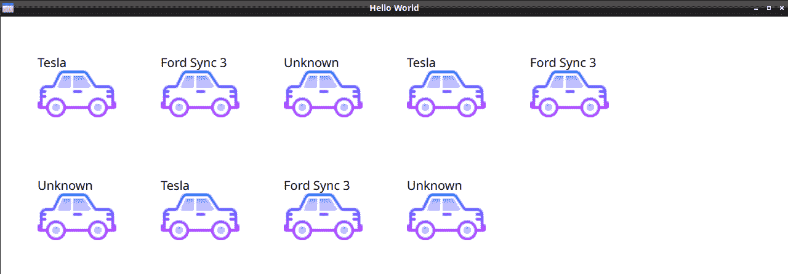

对于 `FlowTopToBottom`，流是垂直的；以下是 `FlowTopToBottom` 的表示：

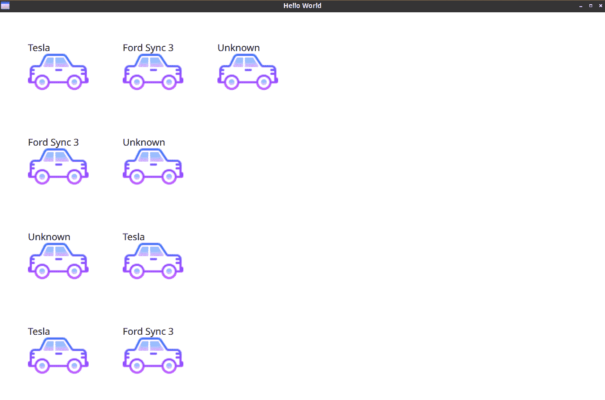

当这个示例构建并运行时，你可以通过用鼠标抓住角落来调整窗口大小。这将更好地帮助你理解流的工作方式。

`layoutDirection` 属性指示数据将如何布局的方向。在以下情况下，这是 `RightToLeft`：


`verticalLayoutDirection` 也指示数据将如何布局的方向，但这次将是垂直的。以下是 `GridView.BottomToTop` 的表示：


# ListView

QML 的 `Listview` 是一种 `Flickable` 元素类型，这意味着用户可以通过左右滑动或轻扫来浏览不同的视图。与桌面上的 `QListView` 不同，`ListView` 中的项目以自己的页面呈现，可以通过左右轻扫来访问。

布局由以下属性处理：

+   `orientation`:

    +   `Qt.horizontal`

    +   `Qt.vertical`

+   `layoutDirection`

    +   `Qt.LeftToRight`

    +   `Qt.RightToLeft`

+   `verticalLayoutDirection`:

    +   `ListView.TopToBottom`

    +   `ListView.BottonToTop`

# PathView

`PathView` 在 `Path` 中显示模型数据。其代理是一个用于显示模型数据的视图。它可以是简单的线条绘制，也可以是带有文本的图像。这可以产生流动的轮盘式数据展示。`Path` 可以通过以下一个或多个 `path` 段落构建：

+   `PathAngleArc`: 带有半径和中心的弧

+   `PathArc`: 带有半径的圆弧

+   `PathCurve`: 通过一系列点绘制路径

+   `PathCubic`: 贝塞尔曲线上的路径

+   `PathLine`: 一条直线

+   `PathQuad`: 二次贝塞尔曲线

在这里，我们使用`PathArc`来显示一个类似轮子的项目模型，使用我们的`carModel`：

源代码可以在 Git 仓库的`Chapter02-1c`目录下的`cp2`分支中找到。

```cpp
     PathView {
         id: pathView
         anchors.fill: parent
         anchors.margins: 30
         model: myListModel
         delegate:  Rectangle {
             id: theDelegate
             Text {                 
                 text: carModel
             }
              Image {
                source: "/icons8-sedan-64.png"
             }
         }
         path: Path {
             startX: 0; startY: 40
             PathArc { x: 0; y: 400; radiusX:5; radiusY: 5 }
         }
     }
```

你现在应该能看到类似这样的内容：

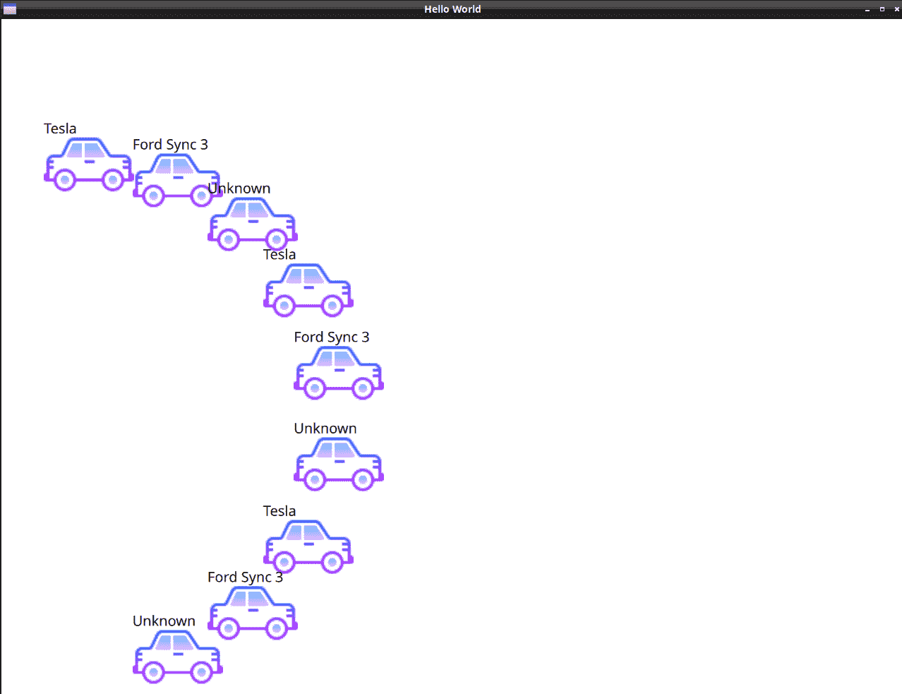

有几个特殊的`path`段可以增强和改变`path`的属性：

+   `PathAttribute`: 允许在路径的某些点上指定属性

+   `PathMove`: 将路径移动到新位置

# TreeView

`TreeView`可能是这些视图中最容易被识别的。它看起来非常类似于桌面版本。它显示其模型数据的树结构。`TreeView`有标题，称为`TableViewColumn`，你可以用它来添加标题以及指定其宽度。还可以使用`headerDelegate`、`itemDelegate`和`rowDelegate`进行进一步定制。

默认情况下没有实现排序，但可以通过几个属性来控制：

+   `sortIndicatorColumn`: `Int`，表示要排序的列

+   `sortIndicatorVisible`: `Bool`用于启用排序

+   `sortIndicatorOrder`: `Enum`可以是`Qt.AscendingOrder`或`Qt.DescendingOrder`

# 手势和触摸

触摸手势可以是与你的应用程序交互的创新方式。要在 Qt 中使用`QtGesture`类，你需要通过重写`QGestureEvent`类并处理内置的`Qt::GestureType`在 C++中实现处理程序。这样，以下手势可以被处理：

+   `Qt::TapGesture`

+   `Qt::TapAndHoldGesture`

+   `Qt::PanGesture`

+   `Qt::PinchGesture`

+   `Qt::SwipeGesture`

+   `Qt::CustomGesture`

`Qt::CustomGesture`标志是一个特殊标志，可以用来发明你自己的自定义手势。

Qt Quick 中有一个内置的手势项目——`PinchArea`。

# PinchArea

`PinchArea`处理捏合手势，这在 Qt Quick 中常用于从手机上放大图像，因此你可以使用简单的 QML 为任何基于`Item`的元素实现它。

你可以使用`onPinchFinished`、`onPinchStarted`和`onPinchUpdated`信号，或将`pinch.target`属性设置为要处理的手势的目标项。

# MultiPointTouchArea

`MultiPointTouchArea`不是一个手势，而是一种跟踪触摸屏多个接触点的途径。并非所有触摸屏都支持多点触摸。手机通常支持多点触摸，一些嵌入式设备也是如此。

要在 QML 中使用多点触摸屏，有`MultiPointTouchArea`组件，它的工作方式有点像`MouseArea`。通过将其`mouseEnabled`属性设置为`true`，它可以与`MouseArea`一起操作。这使得`MultiPointTouchArea`组件忽略鼠标事件，只响应触摸事件。

每个 `MultiPointTouchArea` 都接受一个 `TouchPoints` 数组。注意方括号的使用，`[ ]`——这表示它是一个数组。你可以定义一个或多个这些来处理一定数量的 `TouchPoints` 或手指。在这里，我们定义并处理了三个 `TouchPoints`。

如果你在一个非触摸屏上尝试这个，只有一个绿色点会追踪触摸点：

源代码可以在 Git 仓库的 `Chapter02-2a` 目录下的 `cp2` 分支中找到。

```cpp
import QtQuick 2.12
import QtQuick.Window 2.12
Window {
    visible: true
    width: 640
    height: 480
    color: "black"
    title: "You can touch this!"

    MultiPointTouchArea {        
        anchors.fill: parent
        touchPoints: [
            TouchPoint { id: touch1 },
            TouchPoint { id: touch2 },
            TouchPoint { id: touch3 }
        ]
        Rectangle {
            width: 45; height: 45
            color: "#80c342"
            x: touch1.x
            y: touch1.y
            radius: 50
            Behavior on x  {
                 PropertyAnimation {easing.type: Easing.OutBounce; duration: 500 }
             }
            Behavior on y  {
                 PropertyAnimation {easing.type: Easing.OutBounce; duration: 500 }
             }
     }
     Rectangle {
         width: 45; height: 45
         color: "#b40000"
         x: touch2.x
         y: touch2.y
         radius: 50
            Behavior on x  {
                 PropertyAnimation {easing.type: Easing.OutBounce; duration: 500 }
             }
            Behavior on y  {
                 PropertyAnimation {easing.type: Easing.OutBounce; duration: 500 }
             }
     }
     Rectangle {
         width: 45; height: 45
         color: "#6b11d8"
         x: touch2.x
         y: touch2.y
         radius: 50
            Behavior on x  {
                 PropertyAnimation {easing.type: Easing.OutBounce; duration: 500 }
             }
            Behavior on y  {
                 PropertyAnimation {easing.type: Easing.OutBounce; duration: 500 }
             }
         }
       }
}
```

当你在非触摸屏上运行它时，你应该看到这个：

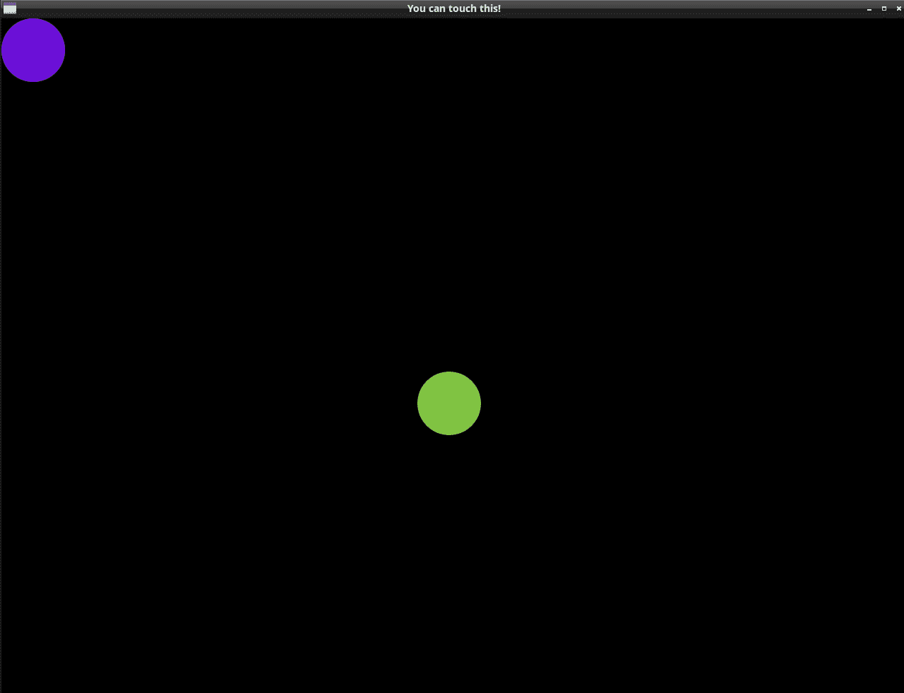

注意到 `PropertyAnimation` 吗？我们很快就会涉及到它；继续阅读。

# 定位

目前可用的各种不同尺寸的手机和嵌入式设备使得元素的动态定位变得更加重要。你可能不希望事物随机地放置在屏幕上。如果你在具有高 DPI 的 iPhone 上有一个看起来很棒的布局，它可能在小型的 Android 设备上看起来完全不同，图像覆盖了屏幕的一半。QML 中的自动布局被称为定位器。

移动和嵌入式设备具有各种屏幕尺寸。我们可以通过使用动态布局来更好地针对尺寸变化。

# 布局

这些是用于排列你可能想要使用的不同项目的定位元素：

+   `Grid`：在网格中定位项目

+   `Column`：垂直定位项目

+   `Row`：水平定位项目

+   `Flow`：以换行方式横向定位项目

此外，还有以下项目：

+   `GridLayout`

+   `ColumnLayout`

+   `RowLayout`

+   `StackLayout`

`Grid` 和 `GridLayout` 元素之间的区别在于，布局在调整大小方面更加动态。布局有附加属性，因此你可以轻松指定布局的各个方面，例如 `minimumWidth`、列数或行数。项目可以被设置为填充到网格或固定宽度。

你也可以使用更像表格的“刚性”布局。让我们看看使用稍微不那么动态的布局和使用静态尺寸。

# 刚性布局

我使用“刚性”这个词，因为它们比所有布局元素都缺乏动态性。单元格大小是固定的，并且基于它们所包含的空间的百分比。它们不能跨越行或列来填充下一个列或行。以这个代码为例。

它没有任何布局，当你运行它时，所有元素都会挤在一起：

源代码可以在 Git 仓库的 `Chapter02-3` 目录下的 `cp2` 分支中找到。

```cpp
import QtQuick 2.12
import QtQuick.Window 2.12

Window {
    visible: true
    width: 640
    height: 480
    title: qsTr("Hello World")
    Rectangle {
        width: 35
        height: 35
        gradient: Gradient {
            GradientStop { position: 0.0; color: "green"; }
            GradientStop { position: 0.25; color: "purple"; }
            GradientStop { position: 0.5; color: "yellow"; }
            GradientStop { position: 1.0; color: "black"; }
        }
    }
    Text {
        text: "Hands-On"
        color: "purple"
        font.pointSize: 20
    }
    Text {
        text: "Mobile"
        color: "red"
        font.pointSize: 20
    }
    Text {
        text: "and Embedded"
        color: "blue"
        font.pointSize: 20
    }
}
```

正如你在下面的屏幕截图中所看到的，所有元素都堆叠在一起，没有进行定位：


这可能不是设计团队所梦想的。除非，当然，他们确实这样做了，并且想要使用一个 `PropertyAnimation` 值来动画化元素移动到它们正确的布局位置。

当我们添加一个 `Column` QML 元素时会发生什么？检查以下代码：

源代码可以在 Git 仓库的 `Chapter02-3a` 目录下的 `cp2` 分支中找到。

```cpp

Rectangle {
 width: 500
 height: 500
     Column {
         Rectangle {
             width: 35
             height: 35
             gradient: Gradient {
                 GradientStop { position: 0.0; color: "green"; }
                 GradientStop { position: 0.25; color: "purple"; }
                 GradientStop { position: 0.5; color: "yellow"; }
                 GradientStop { position: 1.0; color: "black"; }
             }
         }

         Text {
             text: "Hands-On"
             color: "purple"
             font.pointSize: 20
         }

         Text {
             text: "Mobile"
             color: "red"
             font.pointSize: 20
         }

         Text {
             text: "and Embedded"
             color: "blue"
             font.pointSize: 20
         }
    }
}
```

当你构建此示例时，布局看起来像这样：


这更像是设计师的草图的样子！（我知道；便宜的设计师。）

`Flow` 是我们可以使用的另一个布局项。

源代码可以在 Git 仓库的 `Chapter02-3b` 目录下的 `cp2` 分支中找到。

```cpp
    Flow {
        anchors.fill: parent
        anchors.margins: 4
        spacing: 10
```

现在，从我们前面的代码中，将 `Column` 改为 `Flow`，添加一些锚定项目，然后在模拟器上构建并运行，以了解 `Flow` 项目在小屏幕上的工作方式：

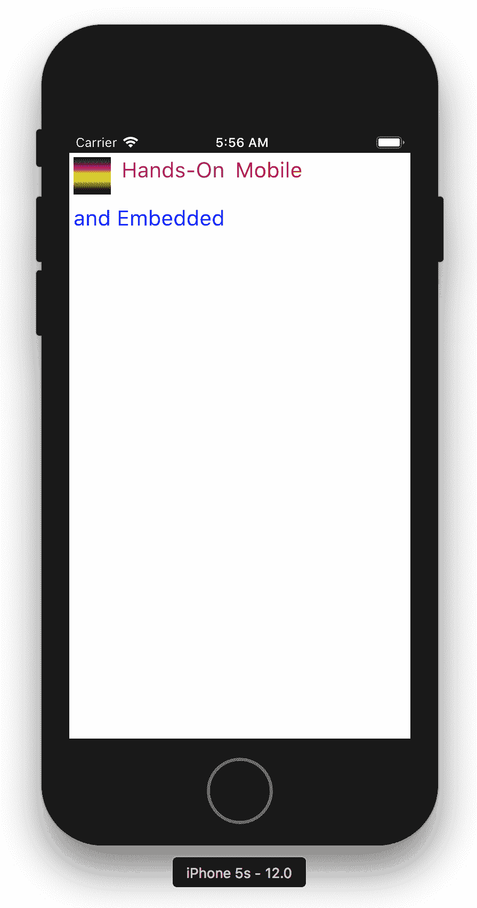

`Flow` 类型在需要时将围绕其内容进行包装，实际上，它已经在最后一个 `Text` 元素上进行了包装。如果将其重新调整为横向或平板电脑方向，则不需要包装，所有这些元素都将位于顶部的一行中。

# 动态布局

除了使用 `Grid` 元素来布局项目外，还有 `GridLayout`，它可以用来自定义布局。在针对具有不同屏幕尺寸和设备方向的移动和嵌入式设备时，可能最好使用 `GridLayout`、`RowLayout` 和 `ColumnLayout`。使用这些布局，你将能够使用其附加属性。以下是可以使用的附加属性列表：

| `Layout.alignment`  | 一个 `Qt.Alignment` 值，指定单元格内项目的对齐方式 |
| --- | --- |
| `Layout.bottomMargin`  | 空间底部边距 |
| `Layout.column`  | 指定列位置 |
| `Layout.columnSpan`  | 展开到多少列 |
| `Layout.fillHeight`  | 如果为 `true`，则项目填充到高度 |
| `Layout.fillWidth` | 如果为 `true`，则项目填充到宽度 |
| `Layout.leftMargin` | 空间左侧边距 |
| `Layout.margins ` | 空间的所有边距 |
| `Layout.maximumHeight ` | 项目最大高度 |
| `Layout.maximumWidth ` | 项目最大宽度 |
| `Layout.minimumHeight` | 项目最小高度 |
| `Layout.minimumWidth` | 项目最小宽度 |
| `Layout.preferredHeight` | 项目首选高度 |
| `Layout.preferredWidth` | 项目首选宽度 |
| `Layout.rightMargin`  | 空间右侧边距 |
| `Layout.row` | 指定行位置 |
| `Layout.rowSpan`  | 展开到多少行 |
| `Layout.topMargin`  | 空间顶部边距 |

在此代码中，我们使用 `GridLayout` 来定位三个 `Text` 元素。第一个 `Text` 元素将跨越或填充两行，以便第二个 `Text` 元素位于第二行：

源代码可以在 Git 仓库的 `Chapter02-3c` 目录下的 `cp2` 分支中找到。

```cpp
    GridLayout {
        rows: 3
        columns: 2
        Text {
            text: "Hands-On"
            color: "purple"
            font.pointSize: 20
        }
        Text {
            text: "Mobile"
            color: "red"
            font.pointSize: 20
        }
         Text {
            text: "and Embedded"
            color: "blue"
            font.pointSize: 20
            Layout.fillHeight: true
         }
    }
```

定位是一种获取动态变化的应用程序并允许它们在各种设备上工作而不必更改代码的方法。`GridLayout` 工作方式类似于布局，但具有更强大的功能。

让我们看看如何使用`锚点`动态定位这些组件。

# 锚点

`锚点`与定位相关，是相对于彼此定位元素的一种方式。它们是动态定位 UI 元素和布局的一种方法。

它们使用以下接触点：

+   `left`

+   `right`

+   `top`

+   `bottom`

+   `horizontalCenter`

+   `verticalCenter`

以两个图像为例；你可以通过指定锚点位置将它们组合在一起，就像拼图一样：

```cpp
Image{ id: image1; source: "image1.png"; }
Image{ id: image2; source: "image2.png; anchors.left: image1.right; }
```

这将使`image2`的左侧与`image1`的右侧对齐。如果你给`image1`添加`anchors.top: parent.top`，这两个项目就会相对于父元素的顶部位置进行定位。如果父元素是顶级元素，它们就会被放置在屏幕顶部。

锚点是一种实现相对于其他组件的列、行和网格组件的方式。你可以将项目对角锚定，也可以将它们彼此分开，等等。

例如，`Rectangle`的`anchor`属性，称为`fill`，是一个特殊术语，表示顶部、底部、左侧和右侧，并且绑定到其父元素上。这意味着它将填充到父元素的大小。

使用`anchors.top`表示元素的顶部锚点，这意味着它将绑定到父组件的顶部位置。例如，一个`Text`组件将位于`Rectangle`组件之上。

要使`Text`组件水平居中，我们使用`anchor.horizontal`属性并将其绑定到`parent.horizontalCenter`位置属性。

在这里，我们将`Text`标签锚定到`Rectangle`标签的顶部中心，而`Rectangle`标签本身锚定到`fill`其父元素，即`Window`：

```cpp
import QtQuick 2.12
import QtQuick.Window 2.12

Window {
   visible: true
   width: 500
   height: 500

   Rectangle {
     anchors.fill: parent

       Text {
           id: textLabel
           text: "Hands-On Mobile and Embedded"
           color: "purple"
           font.pointSize: 20
           anchors.top: parent.top
           anchors.horizontalCenter: parent.horizontalCenter
       }
   }
}
```

源代码可以在 Git 仓库的`Chapter02`目录下的`cp2`分支中找到。

`Window`组件是由 Qt Quick 应用程序向导提供的，默认情况下不可见，因此向导将`visible`属性设置为`true`，因为我们需要看到它。我们将使用`Window`作为`Rectangle`组件的父元素。我们的`Rectangle`组件将为`Text`组件提供一个区域，这是一个简单的标签类型。

每个组件都有自己的属性可以进行绑定。这里的绑定指的是将属性绑定到元素上。例如，`color: "purple"`这一行将颜色`"purple"`绑定到了`Text`元素的`color`属性上。这些绑定不必是静态的；它们可以动态更改，并且它们所绑定的属性值也会随之改变。这种值绑定将一直持续到属性被赋予另一个值。

这个应用程序的背景很无聊。我们何不在那里添加一个渐变效果？在 `Text` 组件的关闭括号下，但仍在 `Rectangle` 内部，添加这个渐变。`GradientStop` 是在渐变中指定某个点颜色的方式。`position` 属性是从零到一的百分比分数点，对应于颜色应该开始的位置。渐变将填充中间的空白：

```cpp
gradient: Gradient {
    GradientStop { position: 0.0; color: "green"; }
    GradientStop { position: 0.25; color: "purple"; }
    GradientStop { position: 0.75; color: "yellow"; }
    GradientStop { position: 1.0; color: "black"; }
}
```

源代码可以在 Git 仓库的 `Chapter02-1` 目录下的 `cp2` 分支中找到。

如您所见，渐变从顶部的绿色开始，平滑地过渡到紫色，然后是黄色，最后结束于黑色：

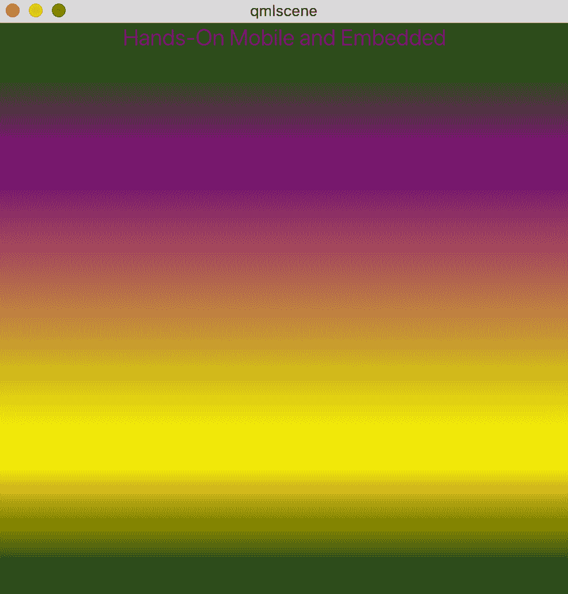

简单易行，轻松愉快！

布局和锚点对于能够控制 UI 非常重要。它们提供了一种简单的方法来处理显示尺寸的差异和在不同屏幕尺寸的数百种不同设备上的方向变化。您可以让一个 QML 文件在所有显示设备上工作，尽管建议为极端不同的设备使用不同的布局。一个应用程序可以在平板电脑上运行良好，甚至可以在手机上运行，但尝试将其放置在手表或其他嵌入式设备上，您将遇到许多用户可以使用但无法访问的细节。

Qt Quick 有许多构建块，可以在任何设备上创建有用的应用程序。当您不想自己创建所有 UI 元素时会发生什么？这就是 Qt Quick Controls 发挥作用的地方。

# Qt Quick Controls 2 按钮，按钮，谁有按钮？

在 Qt Quick 生命周期的某个阶段，只有一些基本组件，如 `Rectangle` 和 `Text`。开发者必须创建自己的按钮、旋钮以及几乎所有常见 UI 元素的实现。随着其成熟，它还增加了 `Window` 和甚至 `Sensor` 元素。一直有关于提供一组常见 UI 元素的讨论。最终，常见的 UI 元素被发布了。

关注 Qt Quick Controls。不再需要自己创建按钮和其他组件，太好了！开发者们也为此欢呼！

然后，他们找到了更好的做事方式，并发布了 Qt Quick Controls 2！

Qt Quick Controls 有两个版本，Qt Quick Controls 和 Qt Quick Controls 2。Qt Quick Controls（原始版本）已被 Qt Quick Controls 2 弃用。任何新使用这些组件的情况都应该使用 Qt Quick Controls 2。

您可以访问各种常见的 UI 元素，包括以下内容：

+   `按钮`

+   `容器`

+   `输入`

+   `菜单`

+   `单选按钮`

+   `进度条`

+   `弹出窗口`

让我们检查一个简单的 Qt Quick Controls 2 示例。

`ApplicationWindow` 有附加的 `menuBar`、`header` 和 `footer` 属性，您可以使用它们添加所需的内容。由于 `ApplicationWindow` 默认不可见，我们几乎总是需要添加 `visible: true`。

在这里，我们将在页眉中添加一个带有 `TextField` 的传统菜单。

菜单有一个 `onTriggered` 信号，在这里用于运行 `MessageDialog` 的 `open()` 函数：

源代码可以在 Git 仓库的 `Chapter02-4` 目录下找到，位于 `cp2` 分支。

```cpp
import QtQuick 2.12
import QtQuick.Controls 2.3
import QtQuick.Dialogs 1.1

ApplicationWindow {
   visible: true
   title: "Mobile and Embedded"
   menuBar: MenuBar {
      Menu { title: "File"
          MenuItem { text: "Open "
              onTriggered: helloDialog.open()
          }
      }
   }
   header: TextField {
       placeholderText: "Remember the Qt 4 Dance video?"
   }
   MessageDialog {
       id: helloDialog
       title: "Hello Mobile!"
       text: "Qt for Embedded devices to rule the world!"
   }
}
```

下面是我们的代码将产生的结果：

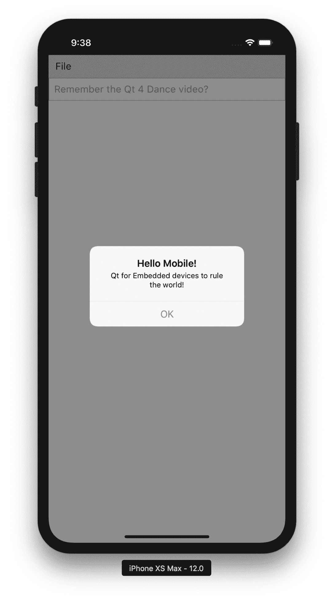

哇哦 – 真是太棒了！

Qt Quick Controls 2 提供了多种样式供选择 – `默认`, `融合`, `想象`, `材料`, 和 `通用`。这可以在 C++ 后端通过 `QQuickStyle::setStyle("Fusion");` 来设置。我猜你确实有一个 C++ 后端，对吧？

以下是一些在移动和嵌入式设备上可能会很有用的视图：

+   `ScrollView`

+   `StackView`

+   `SwipeView`

这些在小屏幕上可能很有帮助，因为它们提供了一种轻松查看和访问多个页面的方式，而无需太多麻烦。`Drawer` 元素也很方便，可以提供一种实现侧边菜单或工具栏的方式。

按钮很棒，Qt Quick Controls 2 也有按钮。它甚至有 `RoundButton` 组件，以及按钮的图标！在 Qt Quick Controls 之前，我们不得不自己实现这些功能。同时，很棒的是我们可以用很少的努力来实现这些功能，现在甚至更少了！

让我们测试一些这些功能，并在此基础上扩展我们的上一个示例。

我喜欢 `SwipeView`，所以让我们使用它，将两个 `Page` 元素作为 `SwipeView` 的子元素：

源代码可以在 Git 仓库的 `Chapter02-5` 目录下找到，位于 `cp2` 分支。

```cpp
    SwipeView {
        id: swipeView
        anchors.fill: parent

        Page {
            id: page1
            anchors.fill: parent.fill
            header: Label {
                text: "Working"
                font.pixelSize: Qt.application.font.pixelSize * 2
                padding: 10
            }
            BusyIndicator {
                id: busyId
                anchors.centerIn: parent
                running: true;
            }
            Label {
                text: "Busy Working"
                anchors.top: busyId.bottom
                anchors.horizontalCenter: parent.horizontalCenter
            }
        }

        Page {
            id: page2
            anchors.fill: parent.fill
            header: Label {
                text: "Go Back"
                font.pixelSize: Qt.application.font.pixelSize * 2
                padding: 10
            }
            Label {
                text: "Nothing here to see. Move along, move along."
                anchors.centerIn: parent
            }
        }
 }

 PageIndicator {
     id: indicator
     count: swipeView.count
     currentIndex: swipeView.currentIndex
     anchors.bottom: swipeView.bottom
     anchors.horizontalCenter: parent.horizontalCenter
 }
```

我认为在底部添加一个 `PageIndicator` 来指示我们当前所在的页面，可以为用户导航提供一些视觉反馈。我们通过将 `SwipeView` 的 `count` 和 `currentIndex` 属性绑定到同名属性上来整合 `PageIndicator`。多么方便啊！

我们可以像使用 `PageIndicator` 一样轻松地使用 `TabBar`。

# 自定义

你几乎可以自定义每个 Qt Quick Control 2 组件的外观和感觉。你可以覆盖控件的不同属性，例如 `background`。在前面的示例代码中，我们自定义了 `Page` 标题。在这里，我们覆盖背景为按钮，添加我们自己的 `Rectangle`，上色，用对比色添加边框，并通过 `radius` 属性使其两端圆润。下面是如何工作的：

源代码可以在 Git 仓库的 `Chapter02-5` 目录下找到，位于 `cp2` 分支。

```cpp
                Button {
                    text: "Click to go back"
                    background: Rectangle {
                        color: "#673AB7"
                        radius: 50
                        border.color: "#4CAF50"
                        border.width: 2
                    }
                    onClicked: swipeView.currentIndex = 0
                }
```


使用 Qt Quick 进行自定义非常简单。它是为了自定义而构建的。方法多种多样。几乎所有的 Qt Quick Controls 2 元素都有可自定义的视觉元素，包括大多数背景和内容项，尽管并非全部。

这些控件在桌面电脑上似乎效果最好，但它们可以被自定义以在移动设备和嵌入式设备上良好工作。`ScrollView` 的 `ScrollBar` 属性可以在触摸屏上增加宽度。

# 展示你的数据 – Qt 数据可视化和 Qt 图表

Qt Quick 提供了一种方便的方式来展示各种类型的数据。两个模块，Qt 数据可视化和 Qt Charts，都可以提供完整的 UI 元素。它们很相似，但 Qt 数据可视化以 3D 形式展示数据。

# Qt Charts

Qt Charts 展示二维图表并使用图形视图框架。

它添加了以下图表类型：

+   面积图

+   柱状图

+   箱线图

+   K 线图

+   线形图：简单的线形图

+   饼图：饼图切片

+   极坐标：圆形线

+   散点图：一组点集

+   样条图：带有曲线点的线形图

以下是从 Qt 中提供的示例，展示了几个可用的不同图表：

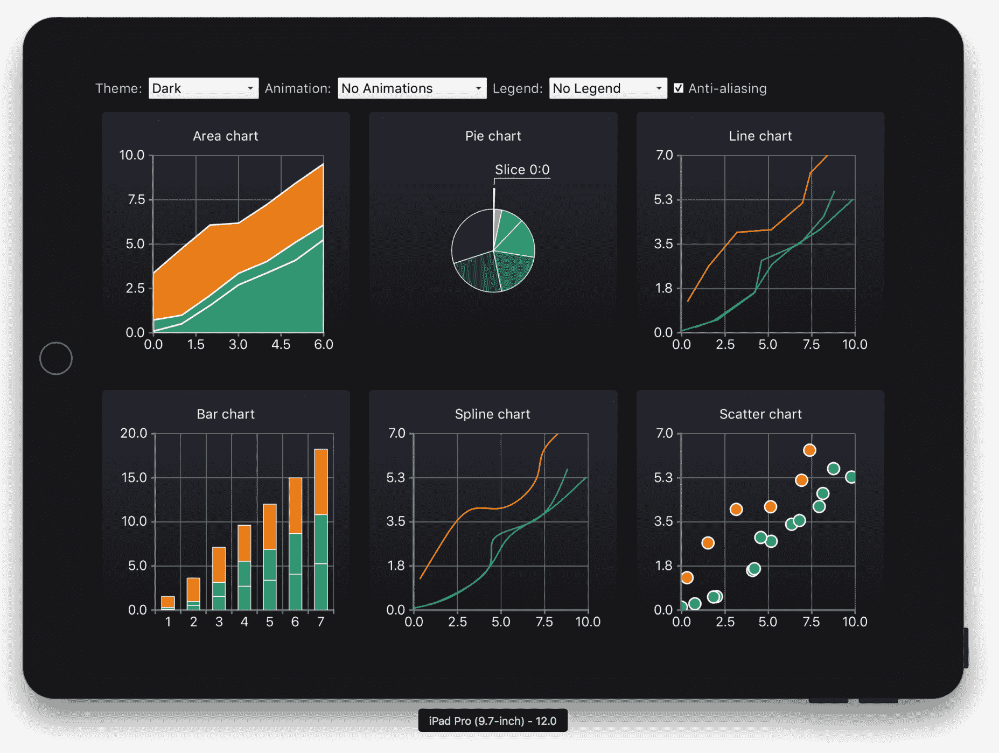

每个图表或图形至少有一个轴，可以有以下类型：

+   柱状图轴

+   类别

+   日期时间

+   对数值

+   值

Qt Charts 需要一个 `QApplication` 实例。如果您使用 Qt Creator 向导创建应用程序，它默认使用 `QGuiApplication` 实例。您需要将 `main.cpp` 中的 `QGuiApplication` 实例替换为 `QApplication`，并更改 `includes` 文件。

您可以在轴上使用网格线、阴影和刻度标记，这些也可以在这些图表中显示。

让我们看看如何创建一个简单的柱状图。

源代码可以在 Git 仓库的 `Chapter02-6` 目录下的 `cp2` 分支中找到。

```cpp
import QtCharts 2.0
ChartView {     
    title: "Australian Rain"     
    anchors.fill: parent     
    legend.alignment: Qt.AlignBottom     
    antialiasing: true     

    BarSeries {         
        id: mySeries         
        axisX: BarCategoryAxis { 
            categories: ["2015", "2016", "2017" ] 
        }         
        BarSet { label: "Adelaide"; values: [536, 821, 395] }         
        BarSet { label: "Brisbane"; values: [1076, 759, 1263] }         
        BarSet { label: "Darwin"; values: [2201, 1363, 1744] }
        BarSet { label: "Melbourne"; values: [526, 601, 401] }
        BarSet { label: "Perth"; values: [729, 674, 578] }
        BarSet { label: "Sydney"; values: [1076, 1386, 1338] }
   } 
}
```

看看这些图表看起来有多棒？来看看：

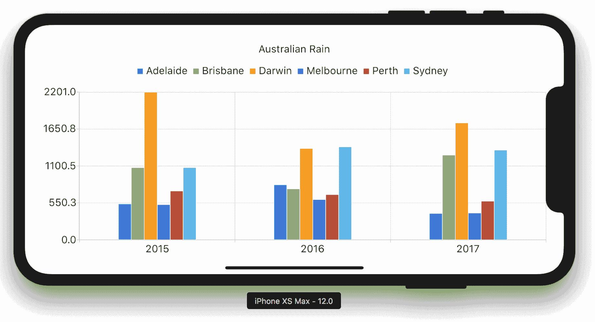

# Qt 数据可视化

Qt 数据可视化类似于 Qt Charts，但以 3D 形式展示数据。它可以通过 Qt Creator 的维护工具应用程序下载。它与 Qt Widget 和 Qt Quick 兼容。我们将使用 Qt Quick 版本。它使用 OpenGL 来展示数据的 3D 图形。

由于我们针对的是移动电话和嵌入式设备，我们讨论使用 OpenGL ES2。Qt 数据可视化的一些功能与 OpenGl ES2 不兼容，这是您在移动电话上会发现的情况：

+   抗锯齿

+   平滑着色

+   阴影

+   使用 3D 纹理的体积对象

让我们尝试使用来自之前示例中使用的澳大利亚某些城市总降雨量的 `Bars3D` 数据。

我将主题设置为 `Theme3D.ThemeQt`，这是一个基于绿色的主题。添加一些自定义，如字体大小，以便在小型移动显示屏上更好地查看内容。

`Bar3DSeries` 将管理诸如行、列和数据（此处为该年的总降雨量）的标签等视觉元素。`ItemModelBarDataProxy` 是显示数据的代理。此处模型数据是一个包含前三年城市降雨数据的 `ListModel`。我们将使用与之前 Qt Charts 示例中相同的数据，以便您可以比较柱状图显示数据的方式的差异：

源代码可以在 Git 仓库的 `Chapter02-7` 目录下的 `cp2` 分支中找到。

```cpp
import QtQuick 2.12
import QtQuick.Window 2.12
import QtDataVisualization 1.2
Window {
    visible: true
    width: 640
    height: 480
    title: qsTr("Australian Rain")
    Bars3D {
        width: parent.width
        height: parent.height
        theme: Theme3D {
            type: Theme3D.ThemeQt
            labelBorderEnabled: true
            font.pointSize: 75
            labelBackgroundEnabled: true
        }
        Bar3DSeries {
            itemLabelFormat: "@colLabel, @rowLabel: @valueLabel"
            ItemModelBarDataProxy {
                itemModel: dataModel
                rowRole: "year"
                columnRole: "city"
                valueRole: "total"
            }
        }
    }
    ListModel {
        id: dataModel
        ListElement{ year: "2017"; city: "Adelaide"; total: "536"; }
        ListElement{ year: "2016"; city: "Adelaide"; total: "821"; }
        ListElement{ year: "2015"; city: "Adelaide"; total: "395"; }
        ListElement{ year: "2017"; city: "Brisbane"; total: "1076"; }
        ListElement{ year: "2016"; city: "Brisbane"; total: "759"; }
        ListElement{ year: "2015"; city: "Brisbane"; total: "1263"; }
        ListElement{ year: "2017"; city: "Darwin"; total: "2201"; }
        ListElement{ year: "2016"; city: "Darwin"; total: "1363"; }
        ListElement{ year: "2015"; city: "Darwin"; total: "1744"; }
        ListElement{ year: "2017"; city: "Melbourne"; total: "526"; }
        ListElement{ year: "2016"; city: "Melbourne"; total: "601"; }
        ListElement{ year: "2015"; city: "Melbourne"; total: "401"; }
        ListElement{ year: "2017"; city: "Perth"; total: "729"; }
        ListElement{ year: "2016"; city: "Perth"; total: "674"; }
        ListElement{ year: "2015"; city: "Perth"; total: "578"; }
        ListElement{ year: "2017"; city: "Sydney"; total: "1076"; }
        ListElement{ year: "2016"; city: "Sydney"; total: "1386"; }
        ListElement{ year: "2015"; city: "Sydney"; total: "1338"; }
    }
}

```

您可以在触摸屏设备上运行此代码，然后可以在 3D 中移动图表：

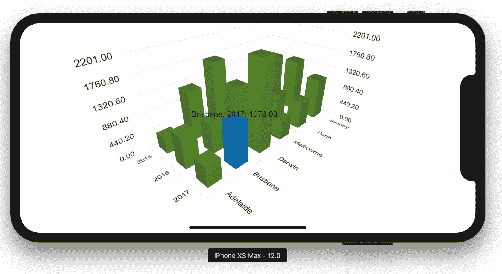

你可以抓取图表并旋转它以从不同的角度查看数据。你还可以放大和缩小。

`QtDataVisualization`模块还具有显示 3D 数据的散点图和表面图。

# 让它动起来！

这就是它变得复杂的地方。有各种类型的动画：

+   `ParallelAnimation`

+   `SmoothedAnimation`

+   `PauseAnimation`

+   `SequentialAnimation`

此外，还可以使用`PropertyAction`和`ScriptAction`。`PropertyAction`是指不涉及动画的任何属性的变化。我们在上一节关于*状态*的部分学习了`ScriptAction`。

还有其他类型的动画，它们操作各种值：

+   `AnchorAnimation`

+   `ColorAnimation`

+   `NumberAnimation`

+   `OpacityAnimator`

+   `PathAnimation`

+   `ParentAnimation`

+   `PropertyAnimation`

+   `RotationAnimation`

+   `SpringAnimation`

+   `Vector3DAnimation`

可以使用`Behavior`来指定属性变化时的动画。

让我们看看这些是如何被使用的。

# 转换

转换和状态被明确地联系在一起。当状态发生变化时，会发生`Transition`动画。

状态变化可以处理不同类型的更改：

+   `AnchorChanges`: 锚定布局的变化

+   `ParentChanges`: 父亲关系的变化（例如重新分配）

+   `PropertyChanges`: 目标属性的变化

你甚至可以使用`StateChangeScript`和`ScriptAction`在状态变化上运行 JavaScript。

要定义不同的`states`，一个元素有一个`states`数组，其中可以定义`State`元素。我们将添加一个`PropertyChanges`：

```cpp
states : [
    State {
        name: "phase1"
        PropertyChanges { target: someTarget; someproperty: "some value";}
    },
    State {
        name: "phase2"
        PropertyChanges { target: someTarget; someproperty: "some other value";}
    }
]
```

目标属性可以是几乎任何东西——`opacity`、`position`、`color`、`width`或`height`。如果一个元素具有可变属性，那么你很可能可以在状态变化中对其动画化。

如我之前提到的，要在状态变化中运行脚本，你可以在你想要运行脚本的`State`元素中定义一个`StateChangeScript`。在这里，我们只是输出一些日志文本：

```cpp
function phase3Script() {
    console.log("demonstrate a state running a script");
}

State {
    name: "phase3"
    StateChangeScript {
        name: "phase3Action"
        script: phase3Script()
    }
}
```

想象一下可能性！我们甚至还没有介绍动画！我们将在下一节介绍。

# 动画

动画可以用奇妙的方式为你的应用增添色彩。Qt Quick 使得几乎可以轻松地动画化应用的不同方面。同时，它允许你将它们定制为独特且更复杂的动画。

# PropertyAnimation

`PropertyAnimation`动画化一个项目的可变属性。通常，这是 x 或 y 颜色，或者可以是任何项目的其他属性：

```cpp
Behavior on activeFocus { PropertyAnimation { target: myItem; property: color; to: "green"; } }
```

`Behavior`指定器意味着当`activeFocus`在`myItem`上时，颜色将变为绿色。

# NumberAnimation

`NumberAnimation`从`PropertyAnimation`派生，但仅适用于具有可变`qreal`值的属性：

```cpp
NumberAnimation { target: myOtherItem; property: "y"; to: 65; duration: 250 }
```

这将在 250 微秒的时间内将`myOtherItem`元素的`y`位置移动到 65。

其中一些动画元素控制其他动画的播放方式，包括`SequentialAnimation`和`ParallelAnimation`。

# SequentialAnimation

`SequentialAnimation`是一种连续运行其他动画类型的动画，一个接一个，就像编号的程序：

```cpp
SequentialAnimation {
    NumberAnimation { target: myOtherItem; property: "x"; to: 35; duration: 1500 }
    NumberAnimation { target: myOtherItem; property: "y"; to: 65; duration: 1500 }
}
```

在这种情况下，首先播放的动画是`ColorAnimation`，一旦完成，就会播放`NumberAnimation`。将`myOtherItem`元素的`x`属性移动到位置`35`，然后将其`y`属性移动到位置`65`，分两步进行：

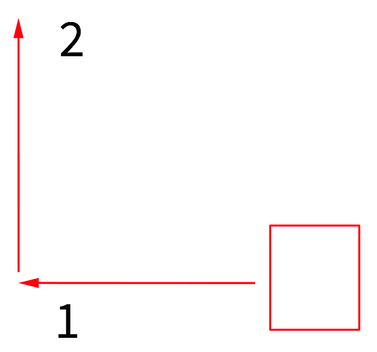

您可以使用`on <属性>`或`properties`来定位一个属性。

此外，还有`when`关键字，表示何时可以发生某事。如果它评估为`true`或`false`，则可以与任何属性一起使用，例如`when: y > 50`。例如，您可以在`running`属性上使用它。

# ParallelAnimation

`ParallelAnimation`同时异步播放所有定义的动画：

```cpp
ParallelAnimation {
    NumberAnimation { target: myOtherItem; property: "x"; to: 35; duration: 1500 }
    NumberAnimation { target: myOtherItem; property: "y"; to: 65; duration: 1500 }
}
```

这些是相同的动画，但它们会同时执行。

有趣的是，这个动画会直接将`myOtherItem`移动到位置`35`和`65`，就像它是一步一样：

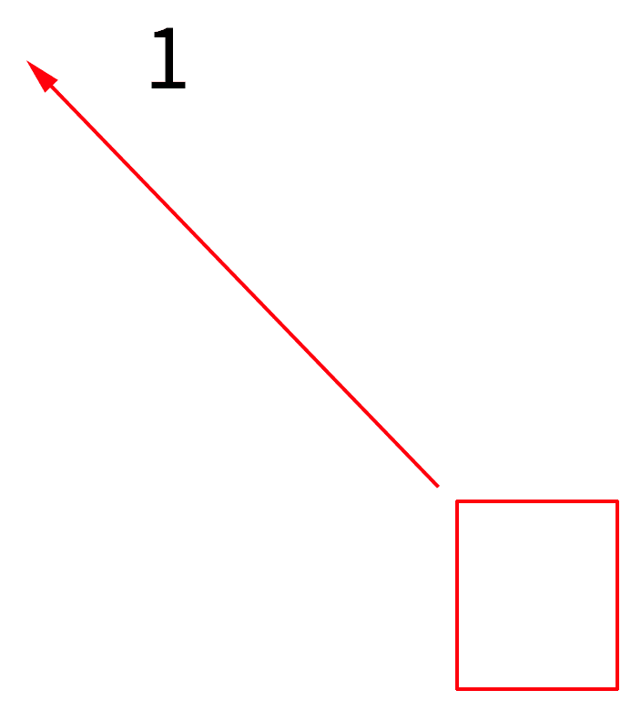

# SpringAnimation

`SpringAnimation`通过弹簧运动来动画化项目。有两个需要注意的属性——`spring`和`damping`：

+   `spring`:一个控制弹跳能量的`qreal`值

+   `damping`:弹跳停止的速度

+   `mass`:为弹跳添加重量，使其表现得像有重力和重量

+   `velocity`:指定最大速度

+   `modulus`:值将环绕到零的值

+   `epsilon`:四舍五入到零的量

源代码可以在 Git 仓库的`Chapter02-8`目录下的`cp2`分支中找到。

```cpp
import QtQuick 2.12
import QtQuick.Window 2.12
Window {
    visible: true
    width: 640
    height: 480
    color: "black"
    title: qsTr("Red Bouncy Box")
    Rectangle {
        id: redBox
        width: 50; height: 50
        color: "black"
        border.width: 4
        border.color: "red"
        Behavior on x { SpringAnimation { spring: 10; damping: 10; } }
        Behavior on y { SpringAnimation { spring: 10; damping: .1;  mass: 10 } }
    }    
    MouseArea {
        anchors.fill: parent
        hoverEnabled: true
        onClicked: animation.start()
        onPositionChanged: {
            redBox.x = mouse.x - redBox.width/2
            redBox.y = mouse.y - redBox.height/2
        }
    }
    ParallelAnimation {
        id: animation
        NumberAnimation { target: redBox; property: "x"; to: 35; duration: 1500 }
        NumberAnimation { target: redBox; property: "y"; to: 65; duration: 1500 }
    }
}
```

在这个例子中，一个红色方块跟随手指或鼠标光标移动，上下弹跳。当用户点击应用时，红色方块会移动到位置`35`和`65`。`spring`值为`10`使其非常弹跳，但`y`轴上的`mass`值为`10`会使它像有更多重量一样弹跳。`damping`值越低，它越快停下来。在这里，`x`轴上的`damping`值要大得多，所以它倾向于比侧向弹跳更多上下弹跳。

# 缓动

我应该在这里提到缓动。每个 Qt Quick 动画都有一个`easing`属性。缓动是一种指定动画进度速度的方式。默认的`easing`值是`Easing.Linear`。有 40 种不同的`easing`属性，这些属性最好在示例中运行，而不是在这里用图表展示。

您可以通过 Qt for WebAssembly 的魔法在我的 GitHub 网络服务器上看到这个演示。

[`lpotter.github.io/easing/easing.html`](https://lpotter.github.io/easing/easing.html).

Qt for WebAssembly 将 Qt 应用程序带到了网页上。在撰写本书时，Firefox 拥有最快的 WebAssembly 实现。我们将在 第十四章，*通用移动和嵌入式设备平台*中讨论 Qt for WebAssembly。

# SceneGraph

场景图基于 OpenGL 构建 Qt Quick。在移动和嵌入式设备上，通常是 OpenGL ES2。如前所述，场景图旨在管理大量的图形。OpenGL 是一个庞大的主题，值得有它自己的书籍——实际上，有成吨的关于 OpenGL ES2 编程的书籍。在这里我不会过多地详细介绍它，但只是提到 OpenGL 可用于移动电话和嵌入式设备，具体取决于硬件。

如果你打算使用场景图，大部分繁重的工作将在 C++ 中完成。你应该已经熟悉如何结合使用 C++ 和 QML，以及 OpenGL ES2。如果不熟悉，Qt 有关于它的优秀文档。

# 摘要

Qt Quick 为在移动和嵌入式设备上使用而预先准备。从基本 Qt Quick 项的简单构建块到 3D 数据图表，你可以使用各种数据集和 QML 中的展示来编写复杂的动画应用程序。

你现在应该能够使用基本组件，如 `Rectangle` 或 `Text`，来创建使用动态变量绑定和信号的 Qt Quick 应用程序。

我们还介绍了如何使用 `anchors` 来视觉定位组件，并能够接受目标设备的改变方向和各种屏幕尺寸。

你现在可以使用看起来更传统的组件，例如现成的 `Button`、`Menu` 和 `ProgressBar` 实例，以及更高级的图形元素，如 `PieChart` 和 `BarChart`。

我们还检查了 Qt Quick 中可用的不同动画方法，例如 `ProperyAnimation` 和 `NumberAnimation`。

在下一章中，我们将学习如何使用粒子和特殊图形效果。
