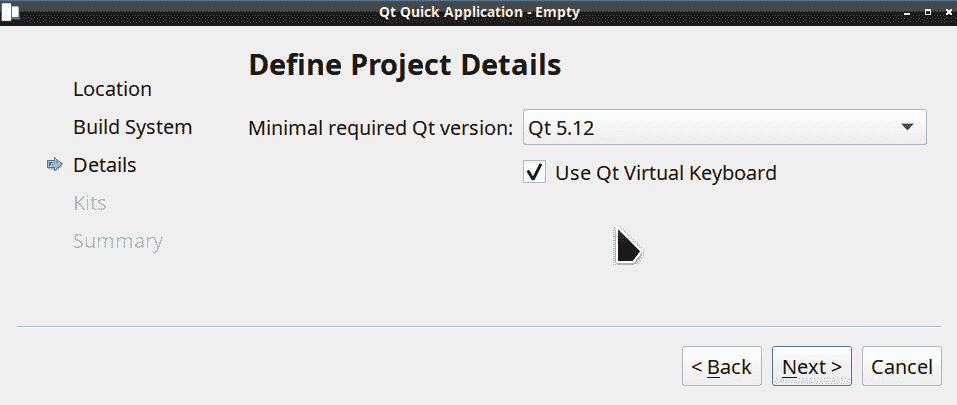
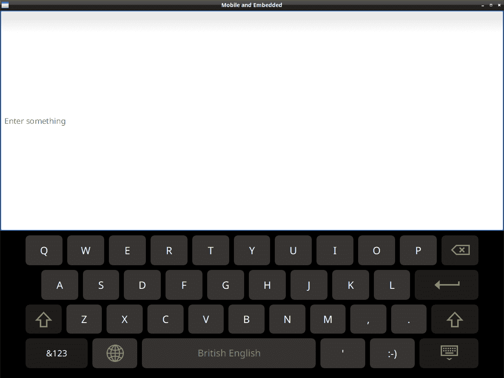
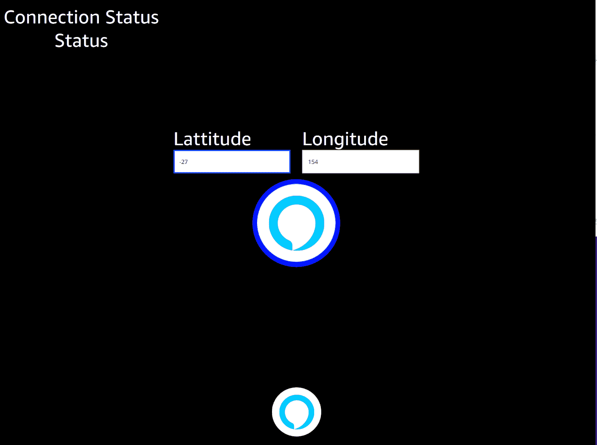

# 输入和触摸

并非所有设备都配备了现成的键盘。使用触摸屏设备，用户可以轻松使用按钮和其他 **用户界面** (**UI**) 功能。当没有键盘或鼠标时，例如在展台或交互式标牌上，您该怎么办？虚拟键盘和触摸交互定义了当今的移动和嵌入式应用程序。

在本章中，我们将涵盖以下主题：

+   我们将发现 Qt 的图形解决方案来整合用户输入。

+   将检查参考 Qt 虚拟键盘。

+   我们将演示触摸组件，例如 `TouchPoints`、`Flickable` 和 `PinchArea`。

# 没有键盘时怎么办

嘿，我的键盘在哪里？

计算机信息亭和汽车通常不配备键盘输入。它们使用虚拟输入，例如虚拟键盘、语音输入，甚至手势识别。

Qt 公司的人创建了一个名为 **Qt 虚拟键盘** (**QtVK**) 的虚拟输入法。它不仅仅是一个屏幕键盘，因为它还具有手写识别功能。它既提供商业许可证，也提供开源的 GPL 版本 3。

有其他虚拟键盘可以与 Qt 应用程序一起使用。在具有触摸屏的台式计算机上，例如二合一笔记本电脑，系统可能已经内置了虚拟键盘。这些应该作为 Qt 应用的输入方法，尽管它们可能在用户想要在文本区域输入时自动弹出或不弹出。

有两种方式集成 Qt 的虚拟键盘：

| 桌面系统 | 完全集成到应用程序中 |
| --- | --- |
| 应用程序 | Qt Widget 应用程序：设置环境变量 `QT_IM_MODULE=qtvirtualkeyboard`Qt Quick：在您的应用程序中使用 `InputPanel` |

我在这里有一个用于 Boot to Qt 的 Raspberry Pi 设置，它完全集成到 Qt Creator 中，因此我可以在 Qt Creator 中构建和运行 Raspberry Pi 上的 Qt 应用程序。您也可以从 `git://code.qt.io/qt/qtvirtualkeyboard.git` 获取源代码并自行构建。

要构建 QtVK，请下载以下源代码：

`git clone git://code.qt.io/qt/qtvirtualkeyboard.git`

可以通过 `qmake` 配置 QtVK 构建，使用 `CONFIG+=<配置>` 和以下配置选项：

+   `lang <code>`

    +   `language_country 的形式`

        +   语言为小写，为两个字母的语言代码

        +   国家名称为大写，为两个字母的国家代码

+   `lang-all`

+   `handwriting`

    +   处理自定义引擎

+   箭头键导航

例如，要仅配置澳大利亚英语并添加手写支持，您将运行 `qmake CONFIG+=lang-en_AU CONFIG+=handwriting` 然后执行 `make && make install`。

有许多其他配置可用。您可以通过禁用布局来创建自定义布局和桌面集成，以及其他配置。

QtVK 可以在 C++ 或 QML 中使用。让我们从使用 Qt Quick 开始，在创建新的 Qt Quick 应用程序模板时，在 Qt Creator 项目向导中勾选“使用 Qt 虚拟键盘”：



这是当你使用 Boot to Qt for Device Creation 时得到的样板代码：

```cpp
    InputPanel {
        id: inputPanel
        z: 99
        x: 0
        y: window.height
        width: window.width
        states: State {
            name: "visible"
            when: inputPanel.active
            PropertyChanges {
                target: inputPanel
                y: window.height - inputPanel.height
            }
        }
        transitions: Transition {
            from: ""
            to: "visible"
            reversible: true
            ParallelAnimation {
                NumberAnimation {
                    properties: "y"
                    duration: 250
                    easing.type: Easing.InOutQuad
                }
            }
        }
    }
```

源代码可以在 Git 仓库的`Chapter04-1`目录下的`cp4`分支中找到。

让我们添加一些接受文本输入的东西，比如一个`TextField`元素：

```cpp
    TextField {
        anchors {
            bottom: inputPanel.top
            top: parent.top
            right: parent.right
            left: parent.left
        }
        placeholderText: "Enter something"
    }

```

在这里，`anchors`用于在用户点击`TextField`时自动打开 QtVK 时调整此`TextField`元素的大小。

这应该是这样的：



实现触摸屏可以带来许多好处，我们可以通过使用 Qt 事件循环来实现。让我们详细看看如何使用触摸屏作为输入。

# 使用触摸输入

触摸屏如今无处不在。它们无处不在。虽然在手机或平板电脑中是必不可少的，但你也可以得到带有触摸屏的笔记本电脑或台式电脑。冰箱和汽车也通常配备触摸屏。知道如何在 Qt 应用程序中利用这些也是必不可少的。

在移动手机和平板电脑平台上，触摸屏支持来自系统，通常是内置的。如果你正在创建自己的嵌入式设备，你很可能需要告诉 Qt 如何使用触摸屏。Qt 支持嵌入式设备上的各种触摸屏系统。

# QEvent

`QEvent`是获取 C++中触摸输入事件的方式。它通过你可以添加到应用程序的事件过滤器来实现。有几种不同的方式来访问这些数据。

我们可以使用事件过滤器或事件循环。我们将首先查看事件过滤器。

# 事件过滤器

你可以通过使用事件过滤器来访问事件循环。首先需要调用以下函数：

```cpp
qApp->installEventFilter(this);
```

源代码可以在 Git 仓库的`Chapter04-2`目录下的`cp4`分支中找到。

然后你需要重写名为`eventFilter(QObject* obj, QEvent* event)`的函数，它返回一个`bool`值：

```cpp
bool MainWindow::eventFilter(QObject* obj, QEvent* event);
```

你将接收到任何和所有的事件。你也可以通过以下方式处理这些触摸事件：

+   `QEvent::TouchBegin`

+   `QEvent::TouchCancel`

+   `QEvent::TouchEnd`

+   `QEvent::TouchUpdate`

在`eventFilter`中使用`switch`语句是遍历不同选项的有效方式：

```cpp
bool MainWindow::eventFilter(QObject* obj, QEvent* event)
{
    switch(event->type()) {
        case QEvent::TouchBegin:
        case QEvent::TouchCancel:
        case QEvent::TouchEnd:
        case QEvent::TouchUpdate:
            qWarning("Touch event %d", event->type());
            break;
        default:
            break;
    };
    return false;
}
```

除非你需要拦截它们，否则请确保将这些事件传递给父类。要阻止传递，请返回`true`。使用事件循环是访问事件的另一种方式。让我们看看。

# 事件循环

要使用事件循环，你需要重写`event(QEvent *ev)`：

```cpp
bool MainWindow::event(QEvent *ev)
{
  switch (ev->type()) {
    case QEvent::TouchBegin:
      qWarning("TouchBegin event %d", ev->type());
        break;
    case QEvent::TouchEnd:
      qWarning("TouchEnd event %d", ev->type());
        break;
    case QEvent::TouchUpdate:
      qWarning("TouchUpdate event %d", ev->type());
        break;
};}
```

你还需要在类构造函数中添加`setAttribute(Qt::WA_AcceptTouchEvents, true);`，否则你的应用程序将不会接收到触摸事件。

让我们看看 Qt 如何处理触摸屏支持以及如何使用 Qt 访问触摸屏输入堆栈的更低级别。

# 触摸屏支持

Qt 对触摸屏的支持是通过**Qt 平台抽象**（**QPA**）平台插件实现的。

Qt 配置将自动检测正确的平台并确定是否已安装开发文件。如果找到开发文件，它将使用它们。

让我们看看各种操作系统中的触摸屏是如何工作的，从移动电话开始。

# Windows、iOS 和 Android

在 Windows、iOS 和 Android 上，触摸屏通过 Qt 事件系统得到支持。

使用 Qt 事件系统并允许平台插件进行扫描和读取，如果我们需要访问这些事件，我们可以使用 `QEvent`。

让我们看看如何使用 Qt 在嵌入式 Linux 上访问输入系统的底层。

# Linux

在 Linux 操作系统中，有各种可以使用 Qt 的输入系统。

Qt 内置了对这些类型的触摸屏接口的支持：

+   `evdev`: 一个事件设备接口

+   `libinput`: 一个用于处理输入设备的库

+   `tslib`: 一个 TypeScript 运行时库

我们将首先学习关于 Linux `evdev` 系统的知识，以便直接读取设备文件。

# evdev

Qt 内置了对 Linux 和嵌入式 Linux 的 `evdev` 标准事件处理系统的支持。如果没有配置或检测到其他系统，您将默认获得这个系统。它处理键盘、鼠标和触摸。然后您可以使用 Qt 正常处理键盘、触摸和鼠标事件。

您可以分配启动参数，例如设备文件路径和屏幕默认旋转，如下所示：

`QT_QPA_EVDEV_TOUCHSCREEN_PARAMETERS=/dev/input/input2:rotate=90`

可用的其他参数包括 `invertx` 和 `inverty`。当然，您不需要依赖于 Qt 来处理这些输入事件，可以直接在 Qt 以下的堆栈中访问它们。我称它们为原始事件，但实际上它们只是读取特殊的 Linux 内核设备文件。

让我们看看在使用 Qt 时如何自己处理这些 `evdev` 输入事件。这是低级系统文件访问，因此您可能需要 root 或管理员权限来运行使用这种方式的应用程序。

在 Linux 上，可以通过内核的 `dev` 节点访问输入事件，通常位于 `/dev/input`，但它们可能位于 `/dev` 目录树下的任何位置，具体取决于驱动程序。`QFile` 不应用于实际读取这些特殊的设备节点文件。

`QFile` 不适合读取 Unix 设备节点文件。这是因为 `QFile` 没有信号，而设备节点文件报告的大小为零，并且只有当您读取它们时才有数据。

读取输入节点的主体 `include` 文件如下：

```cpp
#include <linux/input.h>
```

源代码可以在 Git 仓库的 `cp4` 分支下的 `Chapter04-3` 目录中找到。

您将想要扫描设备文件以检测触摸屏产生的哪个文件。在 Linux 中，这些设备节点是动态命名的，因此您需要使用其他方法来识别正确的文件，而不仅仅是文件名。因此，您必须打开文件并要求它告诉您其名称。

我们可以使用 `QDir` 和其过滤器至少过滤掉一些我们知道不是我们想要的文件：

```cpp
     QDir inputDir = QDir("/dev/input");
     QStringList filters;
     filters << "event*";
     QStringList eventFiles = inputDir.entryList(filters,
QDir::System);
     int fd = -1;
     char name[256];
     for (QString file : eventFiles) {
         file.prepend(inputDir.absolutePath());
         fd = ::open(file.toLocal8Bit().constData(), O_RDONLY|O_NONBLOCK);
 if (fd >= 0) {
 ioctl(fd, EVIOCGNAME(sizeof(name)), name);
 ::close(fd);
 }
}
```

在 `open` 时务必包含 `O_NONBLOCK` 参数。

到目前为止，我们已经有了一个不同输入设备名称的列表。你可能只需要猜测使用哪个名称，然后进行 `String` 比较，以找到正确的设备。有时，驱动程序将具有正确的 `id` 信息，可以使用 `EVIOCGID` 获取，如下所示：

```cpp
unsigned short id[4];
ioctl(fd, EVIOCGID, &id);
```

有时，你可以使用 `EVIOCGBIT` 检测某些功能。这将告诉我们硬件驱动程序支持哪些按钮或键。当触摸触摸屏时，触摸屏驱动程序输出键码 `0x14a (BTN_TOUCH)`，因此我们可以使用这个来检测哪个输入事件将是我们的触摸屏：

```cpp
bool MainWindow::isTouchDevice(int fd)
{
    unsigned short id[4];
    long bitsKey[LONG_FIELD_SIZE(KEY_CNT)];
    memset(bitsKey, 0, sizeof(bitsKey));
    ioctl(fd, EVIOCGBIT(EV_KEY, sizeof(bitsKey)), bitsKey);
    if (testBit(BTN_TOUCH, bitsKey)) {
        return true;
    }
    return false;
}
```

现在，我们可以相当确信我们已经有了正确的设备文件。现在，我们可以设置一个 `QSocketNotifier` 对象来通知我们该文件何时被激活，然后我们可以读取它以获取触摸的 `X` 和 `Y` 值。我们使用 `QSocketNotifier` 类，因为我们不能使用 `QFile`，因为它没有任何信号来告诉我们 Linux 设备文件何时更改，这使得它更容易：

```cpp
int MainWindow::doScan(int fd)
{
    QSocketNotifier *notifier
        = new QSocketNotifier(fd, QSocketNotifier::Read,
         this);
        auto c = connect(notifier,  &QSocketNotifier::activated,
                     = {
        struct input_event ev;
        unsigned int size;
        size = read(fd, &ev, sizeof(struct input_event));
        if (size < sizeof(struct input_event)) {
            qWarning("expected %u bytes, got %u\n", sizeof(struct
            input_event), size);
            perror("\nerror reading");
            return EXIT_FAILURE;
        }
        if (ev.type == EV_KEY && ev.code == BTN_TOUCH)
            qWarning("Touchscreen value: %i\n", ev.value);
        if (ev.type == EV_ABS && ev.code == ABS_MT_POSITION_X)
             qWarning("X value: %i\n", ev.value);
         if (ev.type == EV_ABS && ev.code == ABS_MT_POSITION_Y)
             qWarning("Y value: %i\n", ev.value);
          return 0;
     });
 return true;
}
```

我们也使用标准的 `read()` 函数而不是 `QFile` 来读取这个。

`BTN_TOUCH` 事件值告诉我们触摸屏何时被按下或释放。

`ABS_MT_POSITION_X` 值将是触摸屏的 `X` 位置，而 `ABS_MT_POSITION_Y` 值将是 `Y` 位置。

有一个库可以用来做同样的事情，可能稍微容易一些。

# libevdev

当你使用库 `libevdev` 时，你不需要访问像 `QSocketNotifier` 这样的低级文件系统函数，也不需要自己读取文件。

要使用 `libevdev`，我们首先在我们的项目 `.pro` 文件中添加到 `LIBS` 条目。

```cpp
LIBS += -levdev
```

源代码可以在 Git 仓库的 `cp4` 分支下的 `Chapter04-4` 目录中找到。

这允许 `qmake` 设置正确的链接器参数。`include` 头文件如下所示：

```cpp
#include <libevdev-1.0/libevdev/libevdev.h>
```

我们可以从前面的代码中借用扫描目录以查找设备文件的初始代码，但 `isTouchDevice` 函数的代码会更简洁：

```cpp
bool MainWindow::isTouchDevice(int fd)
{
    int rc = 1;
    rc = libevdev_new_from_fd(fd, &dev);
    if (rc < 0) {
        qWarning("Failed to init libevdev (%s)\n", strerror(-rc));
        return false;
    }
    if (libevdev_has_event_code(dev, EV_KEY, BTN_TOUCH)) {
        qWarning("Device: %s\n", libevdev_get_name(dev));
        return true;
    }
    libevdev_free(dev);
    return false;
}
```

`Libevdev` 有一个很好的 `libevdev_has_event_code` 函数，可以用来轻松检测设备是否具有某个事件代码。这正是我们需要用来识别触摸屏的！注意 `libevdev_free` 函数，它将释放我们不需要使用的内存。

`doScan` 函数去掉了读取的调用，而是用 `libevdev_next_event` 的调用代替。它还可以通过调用 `libevdev_event_code_get_name` 输出有关实际事件代码的漂亮消息：

```cpp
int MainWindow::doScan(int fd)
{
    QSocketNotifier *notifier
            = new QSocketNotifier(fd, QSocketNotifier::Read,
this);
    auto c = connect(notifier,  &QSocketNotifier::activated,
                     = {
        int rc = -1;
        do {            struct input_event ev;
            rc = libevdev_next_event(dev,
LIBEVDEV_READ_FLAG_NORMAL, &ev);
            if (rc == LIBEVDEV_READ_STATUS_SYNC) {
                while (rc == LIBEVDEV_READ_STATUS_SYNC) {
                    rc = libevdev_next_event(dev, LIBEVDEV_READ_FLAG_SYNC, &ev);
                }
            } else if (rc == LIBEVDEV_READ_STATUS_SUCCESS) {
                if ((ev.type == EV_KEY && ev.code == BTN_TOUCH) ||
                        (ev.type == EV_ABS && ev.code ==
ABS_MT_POSITION_X) ||
                        (ev.type == EV_ABS && ev.code ==
ABS_MT_POSITION_Y)) {
                    qWarning("%s value: %i\n",
libevdev_event_code_get_name(ev.type, ev.code), ev.value);
                }
            }
        } while (rc == 1 || rc == 0 || rc == -EAGAIN);
        return 0;
    });
    return 0;
}
```

库 `libinput` 也使用 `evdev`，并且比其他库更新一些。

# libinput

`libinput` 库是 Wayland 合成器和 X.Org 窗口系统的输入处理。Wayland 是一种显示服务器协议，类似于古老 Unix 标准的 X11 的新版本。`Libinput` 依赖于 `libudev` 并支持以下输入类型：

+   `Keyboard`: 标准硬件键盘

+   `Gesture`: 触摸手势

+   `Pointer`: 鼠标事件

+   `Touch`: 触摸屏事件

+   `Switch`: 笔记本电脑盖子开关事件

+   `Tablet`: 平板工具事件

+   `Tablet pad:` 平板垫事件

`libinput` 库在构建时依赖于 `libudev`；因此，为了配置 Qt，你需要安装 `libudev` 以及 `libinput` 的开发文件或包。如果你需要硬件键盘支持，还需要安装 `xcbcommon` 包。

另一个触摸屏库是 `tslib`，它专门用于嵌入式设备，因为它具有小的文件系统占用和最小的依赖。

# Tslib

`Tslib` 是一个用于访问和过滤 Linux 设备上触摸屏事件的库；它支持多点触控，Qt 也支持使用它。你需要安装 `tslib` 的开发文件。Qt 会自动检测这一点，或者你可以使用以下方式显式配置 Qt：

```cpp
configure -qt-mouse-tslib
```

可以通过将环境变量 `QT_QPA_EGLFS_TSLIB` 或 `QT_QPA_FB_TSLIB` 设置为 `1` 来启用它。你可以通过将环境变量 `TSLIB_TSDEVICE` 设置为设备节点路径来更改实际的设备文件路径，如下所示：

```cpp
 export TSLIB_TSDEVICE=/dev/input/event4
```

现在我们来探讨如何使用 Qt 的高级 API 来利用触摸屏。

# 使用触摸屏

Qt 后端使用触摸屏有两种方式。事件以鼠标的形式传入，使用 `click` 和 `drag` 事件，或者作为多点触摸到处理的手势，例如 `pinch` 和 `swipe`。让我们更好地了解多点触摸。

# MultiPointTouchArea

如我之前所述，要在 QML 中使用多点触摸屏，有 `MultiPointTouchArea` 类型。如果你想在 QML 中使用手势，你或者必须使用 `MultiPointTouchArea` 并自己处理，或者在你的 C++ 中使用 `QGesture` 并在 QML 组件中处理自定义信号。

源代码可以在 Git 仓库的 cp4 分支下的 `/Chapter04-5` 目录中找到。

```cpp
    MultiPointTouchArea { 
          anchors.fill: parent 
          touchPoints: [ 
              TouchPoint { id: finger1 }, 
              TouchPoint { id: finger2 }, 
              TouchPoint { id: finger3 }, 
              TouchPoint { id: finger4 }, 
              TouchPoint { id: finger5 } 
          ] 
      } 

```

你使用 `TouchPoint` 元素声明 `MultiPointTouchArea` 的 `touchPoints` 属性，为每个你想要处理的手指声明一个元素。在这里，我们使用五指点。

你可以使用 `x` 和 `y` 属性来移动对象：

```cpp
      Rectangle { 
          width: 30; height: 30 
          color: "green" 
          radius: 50 
          x: finger1.x 
          y: finger1.y 
      }

```

你也可以在你的应用程序中使用触摸屏手势。

# Qt 手势

手势是利用用户输入的绝佳方式。正如我在 第二章 中提到的，*使用 Qt Quick 的流畅 UI*，我将在下面提到 C++ API，它比 QML 中的手势功能更丰富。请记住，这些是触摸屏手势，而不是设备或传感器手势，这些我将在后面的章节中探讨。`QGesture` 支持以下内置手势：

+   `QPanGesture`

+   `QPinchGesture`

+   `QSwipeGesture`

+   `QTapGesture`

+   `QTapAndHoldGesture`

QGesture 是一个基于事件的 API，所以它将通过事件过滤器传递，这意味着你需要重新实现你的 `event(QEvent *event)` 小部件，因为手势将针对你的小部件。它还支持通过子类化 `QGestureRecognizer` 并重新实现 `recognize` 来自定义手势。

要在你的应用中使用手势，你首先需要告诉 Qt 你想要接收触摸事件。如果你使用的是内置手势，这是由 Qt 内部完成的，但如果你有自定义手势，你需要这样做：

```cpp
setAttribute(Qt::WA_AcceptTouchEvents);
```

为了接受触摸事件，你需要调用 `QGraphicsItem::setAcceptTouchEvent(bool)` 并将参数设置为 `true`。

如果你想要使用未处理的鼠标事件作为触摸事件，你也可以设置 `Qt::WA_SynthesizeTouchEventsForUnhandledMouseEvents` 属性。

然后，你需要通过调用你的 `QWidget` 或 `QGraphicsObject` 类的 `grabGesture` 函数来告诉 Qt 你想要使用某些手势：

```cpp
grabGesture(Qt::SwipeGesture);
```

`QGesture` 事件被发送到特定的 `QWidget` 类，而不是像鼠标事件那样发送到当前拥有焦点的 `QWidget` 类。

在你的 `QWidget` 派生类中，你需要重新实现 `event` 函数，并在发生手势事件时处理 `gesture` 事件：

```cpp
bool MyWidget::event(QEvent *event)
{
    if (event->type() == QEvent::Gesture)
        handleSwipe();
    return QWidget::event(event);
}
```

由于我们只处理一种 `QGesture` 类型，我们知道这是我们目标的手势。你可以通过检查其 `pointer` 来确定这个事件是否由某种手势引起，该 `pointer` 是通过以下定义的 `gesture` 函数来检查的：

`QGesture * QGestureEvent::gesture(Qt::GestureType type) const`

这可以通过以下方式实现：

```cpp
if (QGesture *swipe = event->gesture(Qt::SwipeGesture))
```

如果调用 `swipe` 的 `QGesture` 对象是 `nullptr`，那么这个事件不是我们的目标手势。

还是一个好主意去检查手势的 `state()`，它可以是指以下任何一个：

+   `Qt::NoGesture`

+   `Qt::GestureStarted`

+   `Qt::GestureUpdated`

+   `Qt::GestureFinished`

+   `Qt::GestureCanceled`

你可以使用 `QGestureRecognizer` 通过派生 `QGestureRecognizer` 并重新实现 `recognize()` 来创建自己的手势。大部分的工作将在这里进行，因为你需要检测你的手势，更有可能检测到不是你的手势。你的 `recognize()` 函数需要返回 `enum` 值 `QGestureRecognizer::Result` 中的一个，它可以是指以下任何一个：

+   `QGestureRecognizer::Ignore`

+   `QGestureRecognizer::MayBeGesture`

+   `QGestureRecognizer::TriggerGesture`

+   `QGestureRecognizer::FinishGesture`

+   `QGestureRecognizer::CancelGesture`

+   `QGestureRecognizer::ConsumeEventHint`

在这里你需要处理大量的边缘情况，以准确判断哪些是你的手势，哪些不是。如果这个函数复杂或长，不要害怕。

另一种越来越受欢迎的输入形式是使用你的声音。让我们接下来看看这个。

# 语音作为输入

语音识别和 Qt 已经存在了一段时间。在 2003 年我成为 Qtopia 社区联络员的时候，IBM 的 ViaVoice 被移植到了 KDE，并且正在被移植到 Trolltech 的手机软件套件 Qtopia。因此，它是同一个开发者后来梦想成真成为 Qt Quick 的东西。虽然概念本质上保持不变，但技术已经得到了改进，现在你可以在许多不同的设备中找到语音控制，包括汽车。

有许多竞争系统，例如 Alexa、Google Voice、Cortana 和 Siri，以及一些开源 API。结合语音搜索，语音输入是一种无价工具。

在撰写本文时，Qt 公司及其合作伙伴之一 **Integrated Computer Solutions**（**ICS**）已宣布他们正在合作将亚马逊的 Alexa 系统集成到 Qt 中。我被告知这将被称为 `QtAlexaAuto` 并在 lgpl v3 许可下发布。由于在撰写本文时尚未发布，我无法详细介绍如何使用此实现。我相信，如果或当它发布时，API 将非常易于使用。

亚马逊的 **Alexa Voice Service**（**AVS**）**软件开发工具包**（**SDK**）支持 Windows、Linux、Android 和 MacOS。您甚至可以使用麦克风阵列组件，例如与 Raspberry Pi 配合使用的 MATRIX creator。 Siri 在 iOS 和 MacOS 上运行。Cortana 在 Windows 上运行。

虽然这些语音系统都没有集成到 Qt 中，但它们可以通过自定义集成来使用。根据您的应用程序将执行的操作和它将在哪种设备上运行，值得对其进行研究。

Alexa、Google Assistant 和 Cortana 提供了 C++ API，Siri 也可以使用其 Objective-C API：

+   Alexa: [`github.com/alexa/avs-device-sdk.git`](https://github.com/alexa/avs-device-sdk.git)

+   Google Assistant: [`developers.google.com/assistant/sdk/guides/library/python/embed/install-sample`](https://developers.google.com/assistant/sdk/guides/library/python/embed/install-sample)

+   Cortana: [`developer.microsoft.com/en-us/cortana`](https://developer.microsoft.com/en-us/cortana)

+   Siri: [`developer.apple.com/sirikit/`](https://developer.apple.com/sirikit/)

# QtAlexaAuto

QtAlexaAuto 是由 Integrated Computer Solutions（ICS）和 Qt 公司共同创建的一个模块，用于在 Qt 和 QtQuick 应用程序中启用亚马逊的 Alexa Voice Service（AVS）的使用。您可以使用 Raspberry Pi、Linux、Android 或其他机器来原型化一个使用语音作为输入的应用程序。

在撰写本书时，QtAlexaAuto 尚未发布，因此您需要在网上搜索下载源代码的 URL。官方发布的内容可能与本书中所述的内容有所不同。

您需要从亚马逊下载、构建和安装以下 SDK：

+   AVS Device SDK: git clone -b v1.9 [`github.com/alexa/avs-device-sdk`](https://github.com/alexa/avs-device-sdk)

+   Alexa Auto SDK: git clone -b 1.2.0 [`github.com/alexa/aac-sdk`](https://github.com/alexa/aac-sdk)

构建这些时，您应遵循此 URL 上的平台说明：

[`github.com/alexa/avs-device-sdk/wiki`](https://github.com/alexa/avs-device-sdk/wiki)

构建 QtAlexaAuto 的基本步骤如下：

1.  注册亚马逊开发者账户，并注册一个产品。[`developer.amazon.com/docs/alexa-voice-service/register-a-product.html`](https://developer.amazon.com/docs/alexa-voice-service/register-a-product.html)

1.  添加你的 clientID 和 productID

1.  安装 Alexa wiki 中提到的需求

1.  按照 install_aac_sdk.md 中的详细说明应用补丁。

1.  构建并安装 AVS 设备 SDK

1.  构建并安装 Alexa Auto SDK

1.  编辑 AlexaSamplerConfig.json

1.  构建 QtAlexaAuto

你需要应用几个补丁。幸运的是，install_aac_sdk.md 中有说明，指导你如何将补丁从 aac-sdk 应用到 avs-device-sdk。

需要编辑并重命名文件 AlexaSamplerConfig.json 为 AlexaClientSDKConfig_new_version_linux.json

然后将文件放入你从其中运行示例的目录中。

QtAlexaAuto 的主要 QML 组件名为 alexaApp，它对应于 QtAlexaAuto 类。

当你运行示例应用程序时，你需要登录到你的亚马逊开发者账户，并通过输入应用程序在首次启动时给出的代码来关联此应用程序。这些可以通过调用 acctLinkUrl() 和 acctLinkCode() 或在 QML 中通过名为 accountLinkCode 和 accountLinkUrl 的 alexaApp 属性提供给用户。

一旦此功能与账户关联，你就可以通过点击按钮使用语音输入和 Alexa 语音服务。

当用户按下说话按钮时运行的函数是 tapToTalk()，并且会发出 startTapToTalk 信号。



AVS 有一个 RenderTemplate 的概念，它从服务传递过来，这样应用程序就能向用户展示关于响应的视觉信息。QtAlexaAuto 处理天气、媒体播放器模板以及一些通用多用途模板。RenderTemplate 以 JSON 文档的形式发出，并在示例应用程序中使用 QML 组件显示，然后解析并显示数据。

这只是对 QtAlexaAuto 的快速浏览，因为我没有足够的时间在本书出版前真正深入研究这个新 API。

# 摘要

用户输入很重要，用户与应用程序交互的方式有很多。如果你正在创建自己的嵌入式设备，你需要决定使用哪些输入方法。触摸屏可以提高可用性，因为触摸东西是非常自然的事情。婴儿甚至猫都可以使用触摸屏设备！手势是使用触摸输入的绝佳方式，你甚至可以为你的应用程序开发自定义手势。语音输入现在正在兴起。虽然添加对其的支持可能需要一点工作，但在一些需要免提使用的设备上，这可能是一件正确的事情。

在下一章中，我们将学习网络及其功能。
