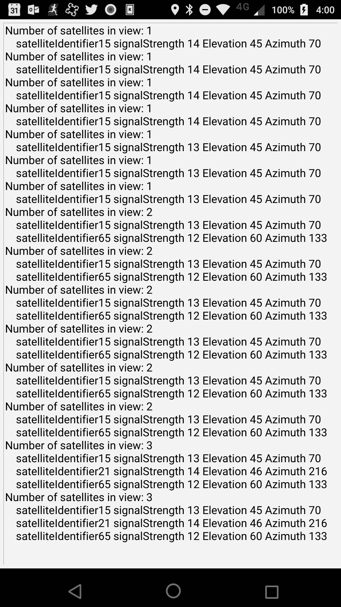
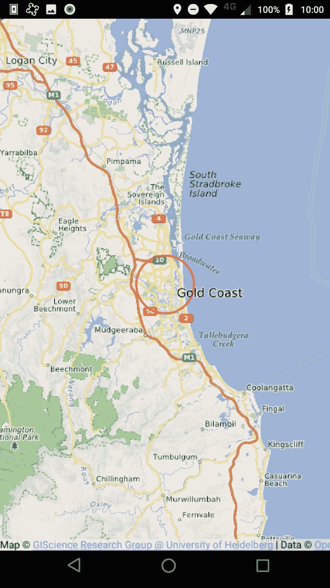
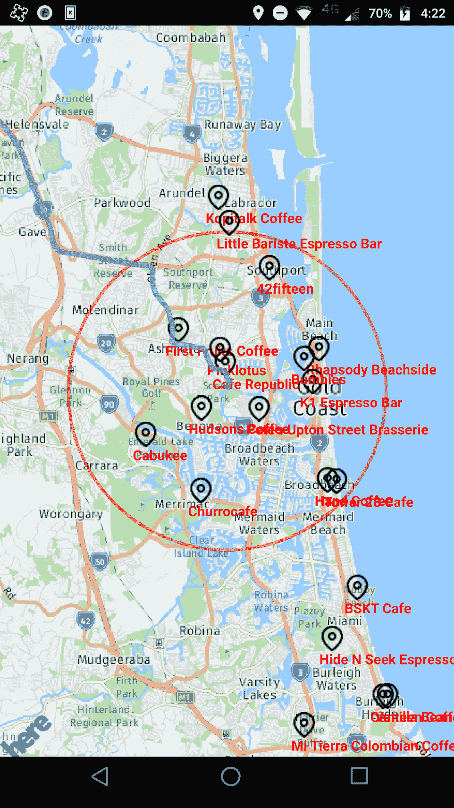

# 我在哪里？定位和定位

带有 GPS 芯片的设备无处不在。你甚至可以追踪你的猫或鸡！在本章中，你将学习如何使用 Qt 进行定位和定位服务。

Qt 定位包含来自各种来源的地理坐标，包括卫星、Wi-Fi 和日志文件。Qt 位置则是关于本地地点，例如服务，如餐厅或公共公园，以及路线信息。

在本章中，我们将涵盖以下主题：

+   使用卫星进行定位

+   映射位置

+   兴趣点

# 使用卫星进行定位

一部手机通常内置了 GPS 调制解调器，但也拥有其他定位信息来源，因此我将使用 Android 作为示例。我们将关注的 Qt 主要类如下：

这里是 Qt 定位 API：

+   `QGeoSatelliteInfo`

+   `QGeoLocation`

+   `QGeoPositionInfoSource`

+   `QGeoCoordinate`

这里是 Qt 位置 API：

+   `QPlaceSearchResult`

+   `QPlaceContent`

+   `QGeoRoute`

首先，我们需要编辑`.pro`文件并添加`QT += positioning`。

# QGeoSatelliteInfoSource

你可以使用`QGeoSatelliteInfoSource`来向用户展示卫星信息，它有一个`static`方法来获取`QGeoSatelliteInfoSource`。

源代码可以在 Git 仓库的`Chapter08-1`目录下的`cp8`分支中找到。

我们将首先调用`QGeoSatelliteInfoSource::createDefaultSource`。

```cpp
QGeoSatelliteInfoSource *source = QGeoSatelliteInfoSource::createDefaultSource(this);
```

在某些系统，如 iOS 上，卫星信息不会公开到公共 API，因此`QGeoSatelliteInfoSource`在该平台上将不起作用。

这将在系统上构建一个`QGeoSatelliteInfoSource`对象，该对象是最高优先级的插件，这大致等同于以下操作：

```cpp
QStringList geoSources = QGeoSatelliteInfoSource::availableSources();
QGeoSatelliteInfoSource *source = QGeoSatelliteInfoSource::createSource(geoSources.at(0),this);
```

有两个特别感兴趣的信号：`satellitesInUseUpdated`和`satellitesInViewUpdated`。此外，还有一个重载的`error`信号，因此我们需要使用特殊的`QOverload`语法：

```cpp
connect(source, QOverload<QGeoSatelliteInfoSource::Error>::
    of(&QGeoSatelliteInfoSource::error), 
    this, &SomeClass::error);
```

当系统使用的卫星数量发生变化时，会发出`satellitesInUseUpdated`信号。当系统可以看到的卫星数量发生变化时，会发出`satellitesInViewUpdated`信号。我们将接收到一个`QGeoSatelliteInfo`对象列表。

# QGeoSatelliteInfo

让我们连接`satellitesInViewUpdated`信号，以便我们可以检测到卫星被找到：

```cpp
connect(source, SIGNAL(satellitesInViewUpdated(QList<QGeoSatelliteInfo>)),
    this, SLOT(satellitesInViewUpdated(QList<QGeoSatelliteInfo>)));
```

我们可以通过这种方式接收单个卫星的信息。包括卫星标识符、信号强度、仰角和方位角等信息：

```cpp
void SomeClass::satellitesInViewUpdated(const QList<QGeoSatelliteInfo> &infos)
{
    if (infos.count() > 0)
        qWarning() << "Number of satellites in view:" << infos.count();

    foreach (const QGeoSatelliteInfo &info, infos) {
        qWarning() << "    "
            << "satelliteIdentifier" << info.satelliteIdentifier()
            << "signalStrength" << info.signalStrength()
            << (info.hasAttribute(QGeoSatelliteInfo::Elevation) ?  "Elevation "
+ QString::number(info.attribute(QGeoSatelliteInfo::Elevation)) : "")
            << (info.hasAttribute(QGeoSatelliteInfo::Elevation) ?  "Azimuth " +
QString::number(info.attribute(QGeoSatelliteInfo::Azimuth)) : "");
    }
}
```

在小屏幕上这里有很多东西可以看。每次更新都是新的一行，你可以看到它定位并添加不同的卫星，当它们进入视野时：



下一步是使用这些卫星来在全球上定位我们的位置。我们首先使用`QGeoPositionInfoSource`。

# QGeoPositionInfoSource

我们可以通过使用`QGeoPositionInfoSource`来获取设备的纬度和经度位置，它封装了位置数据。类似于`QGeoSatelliteInfoSource`，它有两个`static`方法来创建`source`对象：

源代码可以在 Git 仓库的`Chapter08-2`目录下的`cp8`分支中找到。

```cpp
QGeoPositionInfoSource *geoSource = QGeoPositionInfoSource::createDefaultSource(this);
```

我们感兴趣的`QGeoPositionInfoSource`信号是`positionUpdated(const QGeoPositionInfo &update)`：

```cpp
connect(geoSource, &QGeoPositionInfoSource::positionUpdated,
    this, &MainWindow::positionUpdated);
```

要开始接收更新，请调用`startUpdates();`：

```cpp
 geoSource->startUpdates();
```

`positionUpdated`信号接收一个`QGeoPositionInfo`。

# QGeoPositionInfo

`QGeoPositionInfo`包含一个`QGeoCoordinate`，其中包含我们的纬度和经度坐标，以及位置数据的时间戳。

它还可以包含以下可选属性：

+   `Direction`

+   `GroundSpeed`

+   `VerticalSpeed`

+   `MagneticVariation`

+   `HorizontalAccuracy`

+   `VerticalAccuracy`

可以使用`hasAttribute(QGeoPositionInfo::Attribute)`检查属性，并使用`attribute(QGeoPositionInfo::Attribute)`函数检索：

```cpp
if (positionInfo.hasAttribute(QGeoPositionInfo::MagneticVariation)
    qreal magneticVariation = positionInfo.attribute(QGeoPositionInfo::MagneticVariation);
```

要获取纬度和经度信息，请调用`QGeoPositionInfo`类中的`coordinate()`函数，它返回一个`QGeoCoordinate`。

# QGeoCoordinate

`QGeoCoordinate`包含纬度和经度坐标，可以通过调用相应的`latitude()`和`longitude()`函数找到。它可以由不同类型的数据组成，可以通过调用`type()`函数来发现，该函数返回一个`QGeoCoordinate::CoordinateType`的`enum`，它可以有以下值之一：

+   `InvalidCoordinate`：无效坐标

+   `Coordinate2D`：包含纬度和经度坐标

+   `Coordinate3D`：包含纬度、经度和高度坐标

我们可以通过调用`QGeoPositionInfo`对象的`coordinate()`函数从`QGeoPositionInfo`对象中获取`QGeoCoordinate`，该函数反过来具有`latitude`和`longitude`值：

```cpp
QGeoCoordinate coords = positionInfo.coordinate();
QString("Latitude %1\n").arg(coords.latitude());
QString("Longitude %1\n").arg(coords.longitude()); 

​if (coords.type() == QGeoCoordinate::Coordinate3D)
    QString("Altitude %1\n").arg(coords.altitude())
```

让我们看看我们如何使用 Qt Quick 和 QML 来完成这个操作。

# Qt Quick

有相应的 QML 元素可用于定位。

`import`语句将是`import QtPositioning 5.12`。

让我们用 QML 做同样简单的事情，并显示我们的纬度和经度值。

这里是之前提到的类的 Qt Quick 项目等效：

+   `PositionSource`：`QGeoPositionInfoSource`

+   `Position`：`QGeoPositionInfo`

+   `Coordinate`：`QGeoCoordinate`

Qt Quick 通常要简单得多，并且快速实现这些功能。

源代码可以在 Git 仓库的`Chapter08-3`目录下的`cp8`分支中找到。

我们使用 1,000 毫秒的`updateInterval`实现了`PositionSource`，这意味着设备的位置将每 1,000 毫秒更新一次。我们将其设置为`active`以开始更新：

```cpp
    PositionSource {
        id: positionSource
        updateInterval: 1000
        active: true
```

此组件有一个名为`onPositionChanged`的信号，当位置改变时会被调用。我们接收改变后的坐标，然后可以使用它们：

```cpp
        onPositionChanged: {
            var coord = positionSource.position.coordinate;
            console.log("Coordinate:", coord.longitude, coord.latitude);
            latitudeLabel.text = "Latitude: " + coord.latitude;
            longitudeLabel.text = "Longitude: " + coord.longitude;
            if (positionSource.position.altitudeValid)
                altitudeLabel.text = "Altitude: " + coord.altitude;
      }
 }
```

现在我们知道了我们的位置，我们可以使用这些位置细节来获取坐标周围的一些详细信息，比如地图和位置详情。

# 映射位置

我们现在需要一个某种地图来显示我们的位置发现。

QML 的 `Map` 组件是 Qt 提供的唯一地图功能，因此您必须使用 Qt Quick。

`Map` 组件可以由各种后端插件支持。实际上，您需要指定您正在使用哪个插件。`Map` 内置支持以下插件：

| **Provider** | **Key** | **Notes** | **Url** |
| --- | --- | --- | --- |
| Esri | esri | 需要订阅 | `www.esri.com` |
| HERE | here | 需要访问令牌 | `developer.here.com/terms-and-conditions` |
| Mapbox | mapbox | 需要访问令牌 | `www.mapbox.com/tos` |
| Mapbox GL | mapboxgl | 需要访问令牌 | `www.mapbox.com/tos` |
| **Open Street Map** (**OSM**) | osm | 免费访问 | `openstreetmap.org/` |

我将使用 OSM 和 HERE 提供商。

HERE 插件需要在 `developer.here.com` 上有一个账户。注册很容易，并且有一个免费版本。您需要应用程序 ID 和应用程序代码才能访问他们的地图和 API。

# 地图

要开始使用 `Map` 组件，在您选择的 `.qml` 文件中，在 `import` 行中添加 `QtLocation` 和 `QtPositioning`：

```cpp
import QtLocation 5.12
import QtPositioning 5.12
```

源代码可以在 Git 仓库的 `Chapter08-4` 目录下的 `cp8` 分支中找到。

`Map` 组件需要一个 `plugin` 对象，其 `name` 属性是前面表格中的一个键。您可以通过设置 `center` 属性为一个坐标来设置地图的中心位置。

我正在使用 OSM 后端，并且它以澳大利亚的黄金海岸为中心：

```cpp
    Map {
        anchors.fill: parent
        plugin: Plugin {
            name: "osm" 
        }
        center: QtPositioning.coordinate(-28.0, 153.4)
        zoomLevel: 10
    }
```

地图以 `center` 属性中我们指定的坐标为中心，该属性用于将地图定位到用户的当前位置。

我们将地图的 `plugin` 属性定义为 `"osm"` 插件，这是 Open Street Map 插件的标识符。

显示地图就这么简单。

# MapCircle

您可以通过在 `Map` 中放置一个 `MapCircle` 来突出显示一个区域。再次以黄金海岸为中心。

`MapCircle` 有一个 `center` 属性，我们可以通过使用一个带有符号十进制值的 `latitude` 和 `longitude` 位置来定义它。

这里 `radius` 属性的单位是米，根据地图。所以在我们这个例子中，`MapCircle` 的半径将是 5,000 米。

```cpp
        MapCircle {
             center {
                 latitude: -28.0
                 longitude: 153.4
             }
             radius: 5000.0
             border.color: 'red'
             border.width: 3
             opacity: 0.5
         }
```

每个地图后端都有自己的参数，可以使用 `Map` 组件中的 `PluginParameter` 组件来设置。

# PluginParameter

默认情况下，OSM 后端下载的是低分辨率的瓦片。如果您想要高分辨率的地图，您可以指定 `'osm.mapping.highdpi_tiles'` 参数：

```cpp
PluginParameter {
    name: 'osm.mapping.highdpi_tiles'
    value: true
}
```

每个 `PluginParameter` 元素只包含一个 `name`/`value` 参数对。如果您需要设置多个参数，您将需要一个 `PluginParameter` 元素来设置每个：

```cpp
PluginParameter { name: "osm.useragent"; value: "Mobile and Embedded Development with Qt5"; }
```

您可以考虑的其他 `PluginParameters` 包括各种地图提供商的令牌和应用程序 ID，例如 HERE 地图。

这是我们的地图在 Android 上运行的样子：



我们还可以使用地址在地图上使用其他 Qt Quick 元素。让我们看看路线规划。

# RouteModel

要在地图上显示路线，您需要使用`RouteModel`，它是`Map`项的一个属性，`RouteQuery`用于添加航点，以及`MapItemView`用于显示它。

`RouteModel`需要一个插件，所以我们只是重用了`Map`项的插件。它还需要一个`RouteQuery`来设置其`query`属性：

```cpp
        RouteQuery {
            id: routeQuery
        }
        RouteModel {
            id: routeModel
            plugin : map.plugin
            query: routeQuery
        }
```

`MapItemView`用于在地图上显示模型数据。它还需要一个`MapRoute`的代理。在我们的案例中，这是一条描述路线的线：

```cpp
        MapItemView {
            id: mapView
            model: routeModel
            delegate: routeDelegate
        }
        Component {
            id: routeDelegate
            MapRoute {
                id: route
                route: routeData
                line.color: "#46a2da"
                line.width: 5
                smooth: true
                opacity: 0.8
            }
        }
```

现在我们需要的是一个起点、一个终点以及任何中间点。在这个例子中，我保持简单，只指定起点和终点。您可以通过使用`QtPositioning.coordinate`来指定 GPS 坐标，它接受纬度和经度值作为参数：

```cpp
​property variant startCoordinate: QtPositioning.coordinate(-28.0, 153.4)
property variant endCoordinate: QtPositioning.coordinate(-27.579744, 153.100175)
```

起始点坐标位于澳大利亚黄金海岸的某个随机区域；终点是南半球最后一个 Trolltech 办公室的位置。`RouteQuery travelModes`属性决定了路线是如何计算的，是开车、步行还是公共交通。它可以有以下几种值：

+   `CarTravel`

+   `PedestrianTravel`

+   `BicycleTravel`

+   `PublicTransit`

+   `TruckTravel`

`RouteQuery`属性`routeOptimzations`限制了查询到以下不同的值：

+   `ShortestRoute`

+   `FastestRoute`

+   `MostEconomicRoute`

+   `MostScenicRoute`

在这个例子中，我在`Component.onCompleted`信号中触发了`routeQuery`。通常，这种操作会在用户配置查询后触发：

```cpp
Component.onCompleted: {
    routeQuery.clearWaypoints();
    routeQuery.addWaypoint(startCoordinate)
    routeQuery.addWaypoint(endCoordinate)
    routeQuery.travelModes = RouteQuery.CarTravel
    routeQuery.routeOptimizations = RouteQuery.FastestRoute
    routeModel.update();
 }
```

这是路线的显示方式。这条由蓝色线条指示的路线从大红色圆圈开始：


您可以添加更多`Waypoints`来建立不同的路线或通过将`routeModel`设置为`ListView`或类似的内容来获取逐段方向指示。

不仅 Qt Location 可以显示地图和路线，而且`Places` API 还支持显示兴趣点，如餐厅、加油站和国家公园。

# 兴趣点

在这一点上，我将切换到 HERE 地图插件。我尝试让 OpenStreetMaps 地点工作，但它找不到任何东西。

在我们地图构建的下一步中，我们使用`PlaceSearchModel`来搜索地点。与之前的`RouteModel`一样，`MapItemView`可以在我们的地图上显示此模型。

就像`RouteModel`一样，`PlaceSearchModel`需要一种显示数据的方式；我们可以选择`ListView`，这在某些用途上很有用，但让我们选择`MapItemView`以获得视觉效果。

我们需要使用`searchArea`和`searchTerm`来声明我们正在使用哪个插件：

```cpp
PlaceSearchModel {
    id: searchModel
    plugin: mapPlugin
    searchTerm: "coffee"
    searchArea: QtPositioning.circle(startCoordinate)
    Component.onCompleted: update()
}
```

我们的`MapItemView`和`delegate`代码如下。`searchView`代理将以图标的形式显示，其标题文本来自结果地点：

```cpp
MapItemView {
    id: searchView
    model: searchModel
    delegate: MapQuickItem {
        coordinate: place.location.coordinate
        anchorPoint.x: image.width * 0.5
        anchorPoint.y: image.height
        sourceItem: Column {
            Image { id: image; source: "map-pin.png" }
            Text { text: title; font.bold: true; color: "red"}
        }
    }
}
```

如您所见，地点点有些难以阅读，并且叠加在周围的点上。这表明附近有太多地点，对于缩放级别来说太近了，地图在放置名称时遇到了困难。您可以通过使用不同的缩放级别或使用一些碰撞检测和布局算法来解决这个问题，这里我不会深入讨论。



`map-pin.png` 图标来自 [`feathericons.com/`](https://feathericons.com/)，并采用开源 MIT 许可协议发布。

# 摘要

在本章中，我们使用 Qt Location 和 Qt Positioning 覆盖了映射的许多方面。我们可以使用 `QGeoSatelliteInfo` 获取卫星信息，并使用 `QGeoPositionInfo` 定位精确的当前位置坐标。我们学习了如何使用 Qt Quick `Map` 和不同的地图提供商来显示当前位置。我们介绍了如何使用 `RouteModel` 提供路线，使用 `PlaceSearchModel` 在附近搜索地点，并使用 `MapItemView` 显示它们。

在下一章中，我们将讨论使用 Qt Multimedia 的音频和视频。
