# 第十三章：部署到移动和嵌入式

手机、平板电脑和手表都有它们自己的平台方式来部署应用程序——通常是通过应用商店。部署插件和其他库需要特别注意。在本章中，我们将讨论其他操作系统，例如 Jolla 的 Sailfish OS，因为嵌入式设备有几种选择。我使用 Raspberry Pi 作为嵌入式 Linux 设备的示例。

对于主要的移动手机应用商店，您需要使用安全证书对您的包进行数字签名，系统使用该证书作为识别作者并足以信任应用程序的方式。

证书涉及一个公钥私钥对。私钥就是那个。您只需将其保密。公开证书可以公开分发。我不会深入讲解这里涉及的加密。Qt Creator 将这些证书称为密钥库，您可以使用 Qt Creator 生成这些自签名的证书。

我们将检查以下部署目标：

+   对于 Android

+   对于 iOS

+   对于其他操作系统

+   对于嵌入式 Linux

在备份您的数字证书时，因为如果您丢失它们，您将无法在商店中更新您的应用程序。

# 部署到 Android

Android 不需要 Google Play Store 来安装应用程序；这只是一个最方便的方式。还有其他市场可供选择，例如 Aptoid、Yandex、F-Droid 和 Amazon。

您还可以侧载应用程序。侧载是通过通过 USB、内存卡或通过互联网传输包来安装应用程序，而不使用官方商店。

从技术上讲，Qt Creator 可以侧载您正在工作的应用程序的包。它可以安装该包，或者在不安装的情况下简单地运行设备上的可执行文件。

实际上，您可以将包文件放在您的 web 服务器上，让人们将其下载到他们的手机或电脑上，并让他们手动安装。

您还可以通过官方发布使其在 Google Play Store 上可用。您需要能够使用从您的开发者账户获得的证书对其进行签名。这个 Android 证书不需要由证书颁发机构签名，但可以是自签名的。

# 包

在开发和测试您的应用程序之后，您需要制作一个包，以便人们可以安装它。制作包有几种方式，可以通过 Qt Creator 或通过命令行进行。

# androiddeployqt

命令行工具 `androiddeployqt` 随 Qt Creator 一起提供，用于 Android SDK。这是一个命令行工具，用于帮助构建和签名 Android 包。要查看其帮助输出，请运行 `/path/to/androiddeployqt --help`。除了说明它可用之外，我不会深入讲解命令行部署。

# Qt Creator

在 Qt Creator 中，数字证书在项目的构建设置页面上进行处理。现在，让我们构建：

1.  项目 | 构建 将带您进入构建设置页面。如果您正在制作发布版本，请确保您的项目在此页面的顶部处于发布模式：

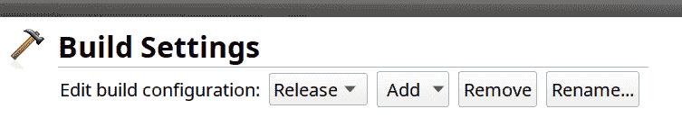

1.  导航到构建步骤 | 构建 Android APK：

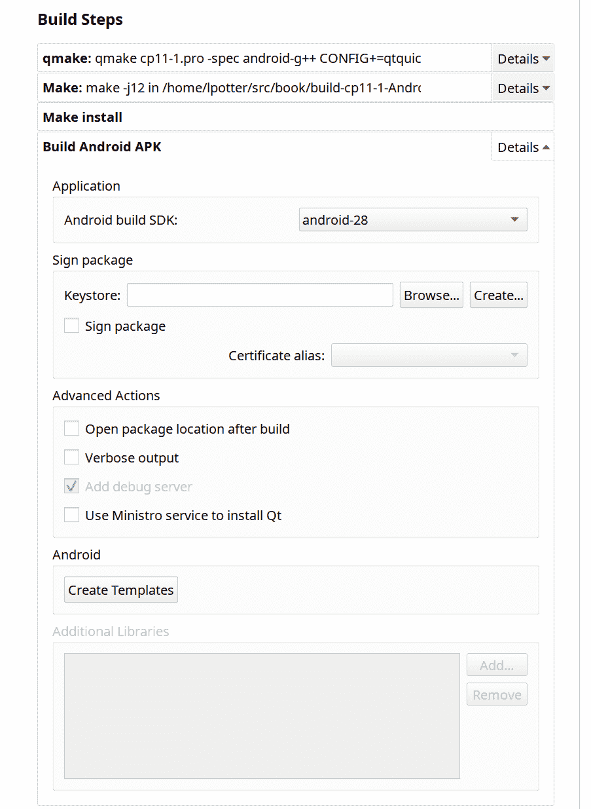

1.  您需要点击创建模板，这将创建商店所需的`manifest.xml`文件。两个主要条目是包名和应用程序图标。我使用 Android Studio 创建不同尺寸的图标，因为它在同时创建多个图标时效率最高。我从一个大 PNG 开始。务必选择正确的 SDK 版本，否则以后可能会出现问题：

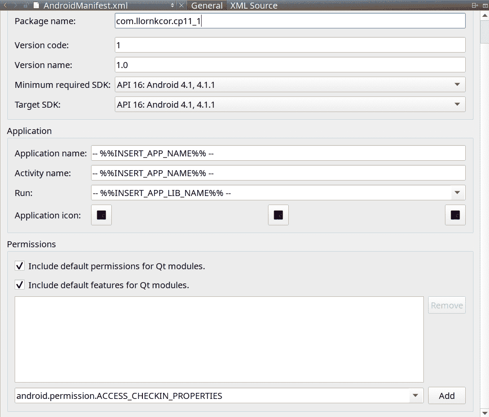

1.  您还需要生成证书。在构建步骤页面中，找到签名包部分。密钥库条目最右侧的按钮，上面写着创建...，将弹出此对话框：

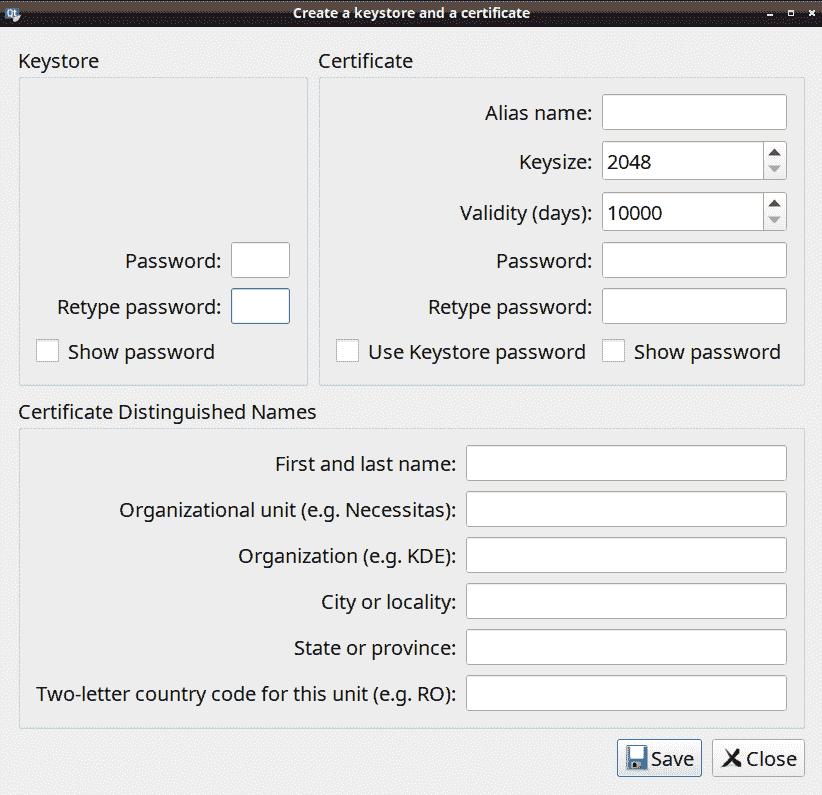

1.  您需要为密钥库和证书提供密码，它们是私钥和公钥。

1.  您还需要提供您的姓名、组织、城市、州和两位字母的国家代码。

进行另一个构建，它将创建一个已签名的 Android 包，您可以安装或上传到商店。现在您已经准备好在封闭的、内部的或公开的测试轨道中测试您的应用了。Qt Creator 在那里不会帮到您。

# 测试轨道

您可以为您的组织中的测试者设置一个内部测试轨道。如果您是一家一站式商店，那么您就是测试者！

# 内部测试

您最多可以有 100 名内部测试者。要在 Play Console 上创建测试者列表，请导航到：

设置 | 管理测试者 | 创建列表

您需要提供以下信息：

+   列表名称

+   电子邮件地址（您也可以上传 csv 电子邮件列表！）

您可以添加测试者到应用（您可能之前已经添加或尚未添加）。现在选择您的应用，导航到应用发布，并选择以下选项之一：

+   内部：一个内部封闭轨道

+   首次发布：一个封闭轨道

+   测试版：一个公开轨道

+   生产：发布

点击管理（内部）| 创建发布

您需要确保您的账户已设置好，提供以下项目：

+   商店列表—截图

    +   高分辨率图标（512 x 512 png）

    +   特色图形（1,024 x 500 jpg, png）

+   内容评级

+   定价和分发

在添加测试者之前，您需要上传一个应用包。一旦您上传了包应用，您将需要选择“审查”。

当您返回到应用发布页面时，您将被要求选择您的测试者列表。您应该会收到一个 URL，可以与您的测试者分享，以便他们可以下载并安装您内部测试的应用程序包。

页面顶部的那个红色图标意味着需要检查某些内容：

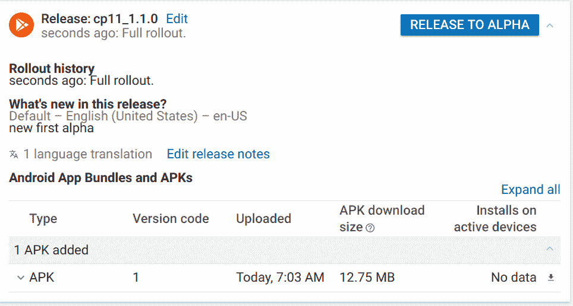

在我的情况下，我实际上还没有为这次发布选择任何测试者。

当您向测试者列表添加内容时，它应该看起来像这样：

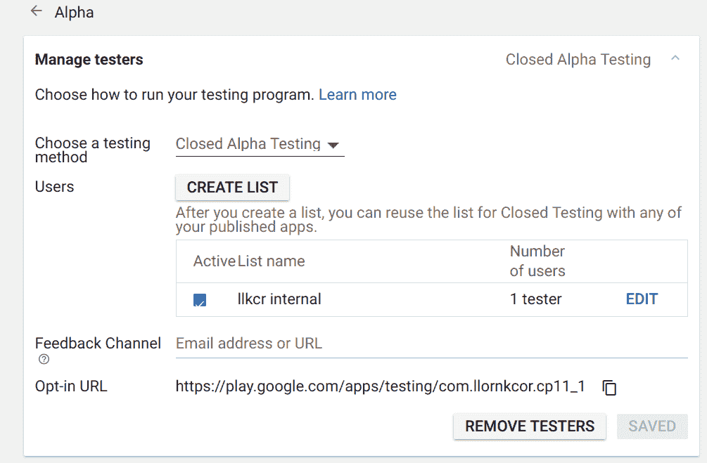

您的测试者将在 Google Play 商店看到以下内容：

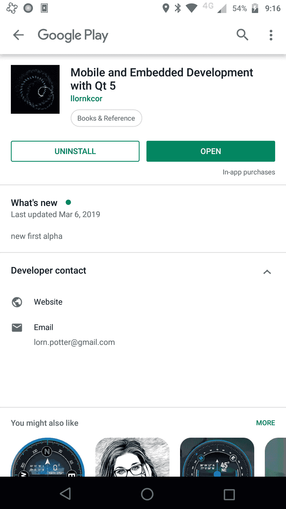

在 iOS 上的部署非常相似，所以让我们看看那个。

# iOS 部署

iOS 商店可能是所有移动应用商店中最具限制性和复杂的，要提交应用。它也有更详尽的提交指南，例如：不应复制原生应用的功能。到达提交应用这一点的过程也更加复杂。

# 包

Qt Creator 支持创建和签名 iOS 包。与 Android 一样，您需要从您的开发者账户获取证书。这是您在 Apple 开发者账户登录时看到的：

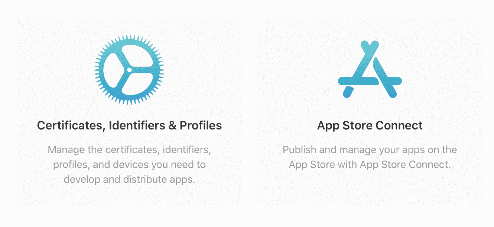

一旦进入您的开发者账户，点击标有“证书、标识符和配置文件”的图标以添加证书。注意左侧的证书列表：

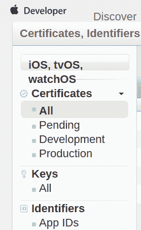

有两种类型的证书：开发证书和生产证书。生产证书用于发布分发。如果您没有生产证书，现在可以通过点击加号图标添加一个。

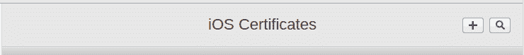

这将打开以下对话框：

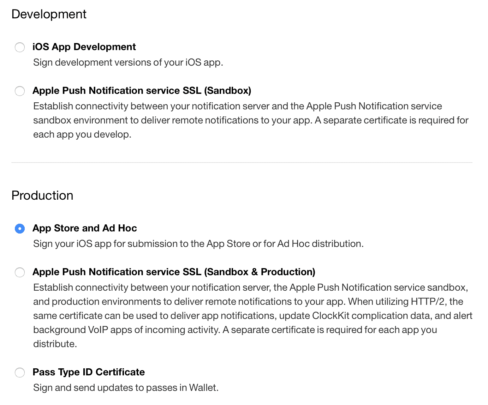

选择“App Store”和“Ad Hoc”。Ad Hoc 意味着您只能在少数测试设备上安装。

接下来，在“标识符”下，选择**App IDs**：

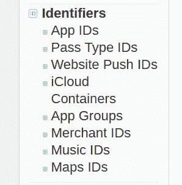

有两种类型的 App ID：

+   *通配符*，如果应用不需要 iCloud 或应用内购买，则可用于多个应用。

+   *显式*，用于每个应用的应用内购买。如果您有使用应用内购买的应用，您将需要其中之一。

您还需要配置文件：

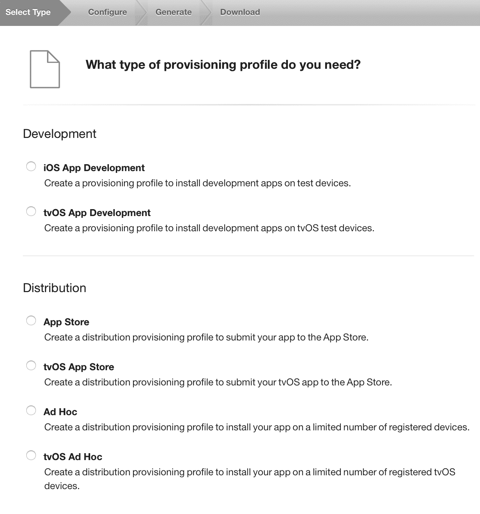

如您所见，这里有不同类型的配置文件。在“分发”下选择“App Store”，然后点击页面底部的“继续”按钮。选择您之前创建的 App ID。选择也之前创建的证书。您需要为此配置文件命名，并且它必须与您的包的 Bundle Identifier 匹配。下载此文件并将其保存在您记得的地方；您将需要此文件通过 XCode 对应用进行签名。

您还需要 App ID，因此从左侧选择 App IDs 并创建一个新的。

现在我们可以对发布模式的包进行签名。

# Qt Creator

Qt Creator 本身无法创建 iOS 包。我们需要使用 Qt Creator 生成的 Xcode 项目文件来使用 Xcode 创建包。

选择发布构建，然后运行 `qmake` 以创建我们将使用的 Xcode 项目文件。

# Xcode

从构建目录中，在 Xcode 中打开生成的 `<target>.xcodeproj` 文件。从左侧选择项目以打开项目设置。

点击“通用”，然后取消选择“自动管理签名”，以便能够手动选择包签名：

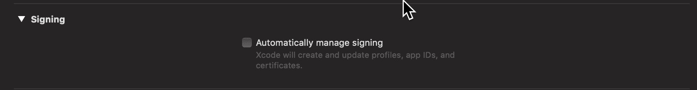

您可以通过从标记为“配置文件”的下拉列表中选择“导入配置文件...”来导入配置文件，然后选择“导入配置文件...”。一旦文件对话框打开，您可以导航到您放置`<profilename>.mobileprovision`文件的位置：

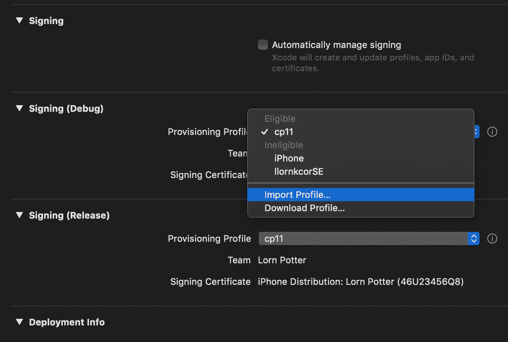

您可以为签名（调试）和签名（发布）都这样做。

您的 Bundle 标识符必须与配置文件名称匹配。如果不匹配，它会提醒您：

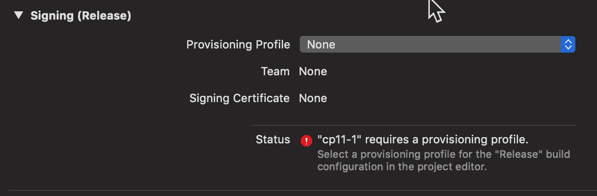

证书已经申请：

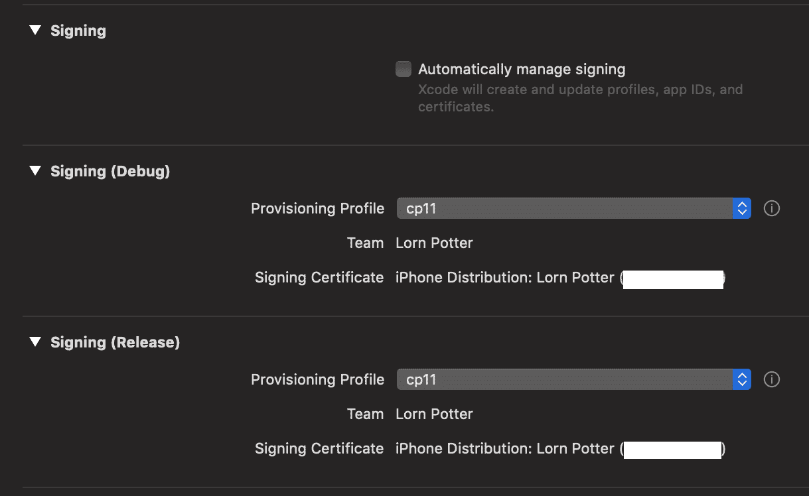

测试并构建包。在签名包时，它应该会要求您输入管理员密码。

要构建发布模式的包，请导航到产品 | 方案 | 编辑方案 | 信息 | 构建配置。

选择发布然后构建包。

从这里，您需要再次打开您的网络浏览器并导航到 App Store Connect，选择**我的应用**，然后点击+创建新应用：

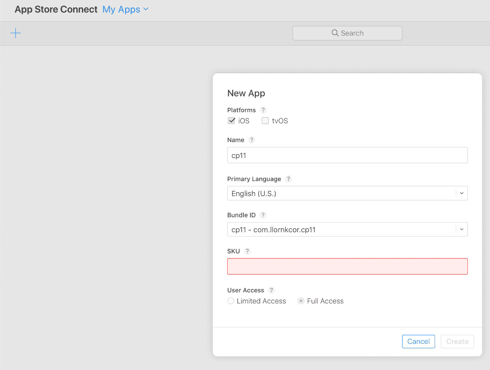

从这里，填写应用信息、定价和可用性。

接下来，为应用页面和 App Store 添加截图、图标、商店文本和其他项目。

要从 Xcode 上传您的应用，请选择产品 | 归档。

这将创建包并打开存档窗口。

在将包上传到 App Store 之前，您应该验证包，因此请选择“验证应用”，然后选择配置文件和证书：

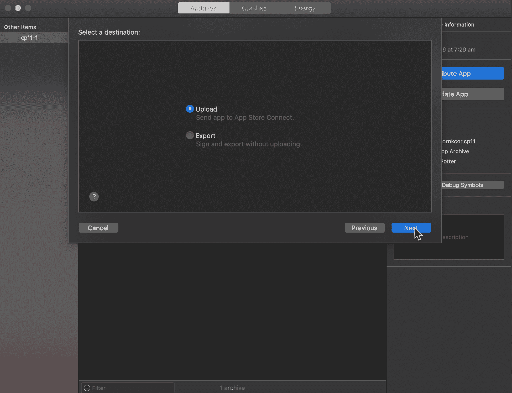

修复您可能遇到的所有问题。这还包括为应用商店的店面添加截图、应用图标等。然后您可以点击“分发应用”按钮。

# 替代操作系统

有其他可用的移动和嵌入式操作系统，您可能听说过，也可能没有听说过，例如我最喜欢的替代移动操作系统：Jolla 的 Sailfish。另一个操作系统是 UBports，它是 Canonical 现在已停用的移动手机操作系统 Ubuntu Touch 的开源版本。

# Sailfish OS

Sailfish OS 是诺基亚 MeeGo 的延续，而 MeeGo 又是 Maemo 的延续。

用户界面由 Jolla 开发，基础操作系统是开源的 Mer，由 Jolla 和社区开发。

Jolla 有一个名为 Harbour 的应用商店([`harbour.jolla.com`](http://harbour.jolla.com))。目前，您无法通过这个应用商店销售应用：

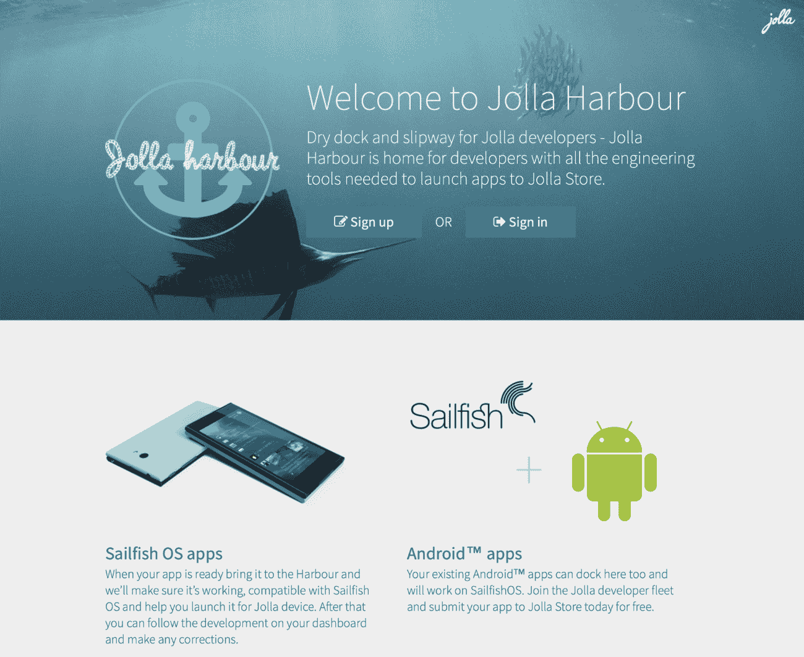

这就是我的开发者页面看起来像：

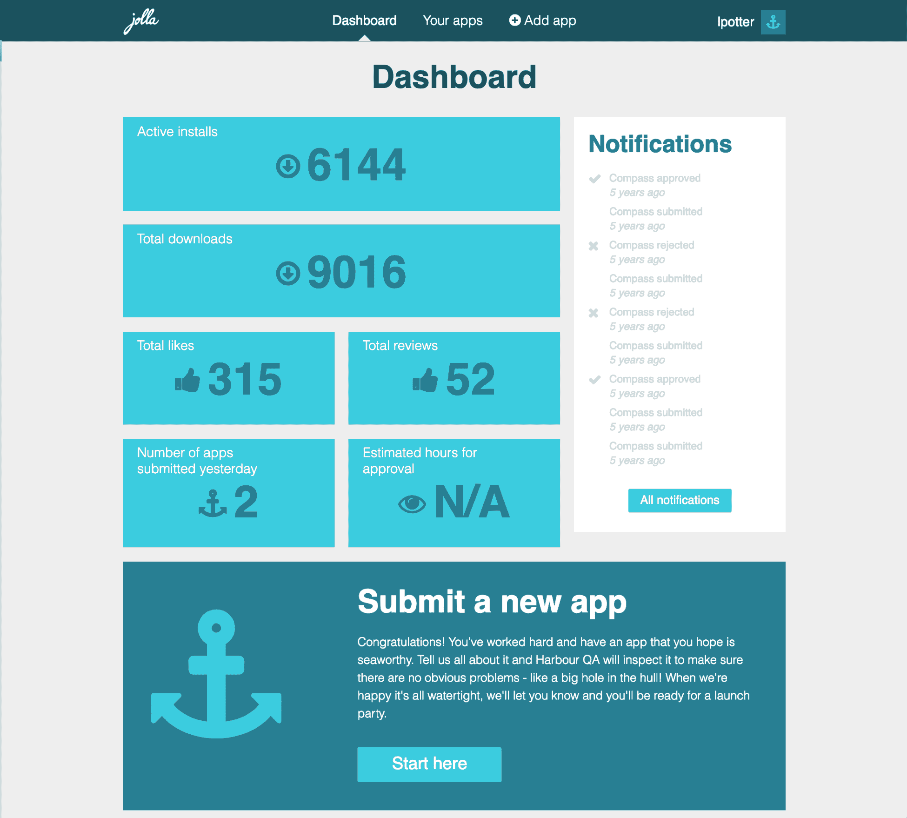

是的，自从我上次更新它以来已经过去了五年。

您可以将 Jolla 安装到某些 Android 手机上——如果您足够幸运拥有实际的 Jolla 硬件，或者如果您有一部预装了 Jolla 的手机，您可以通过商店应用访问 Harbour。以下是顶级应用页面的视图：

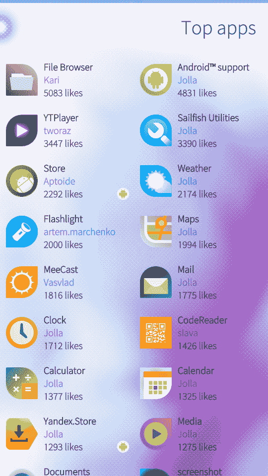

在那个商店里，我有一个名为 Compass 的老应用，我需要将其更新到新的 Sailfish OS 版本 3：

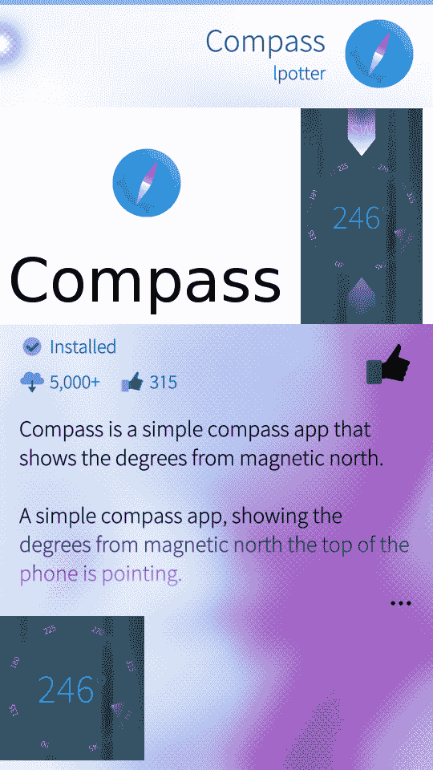

我需要从 [`releases.sailfishos.org/sdk/installers/1.24/`](https://releases.sailfishos.org/sdk/installers/1.24/) 下载应用程序 SDK。

我将其安装在以下 Linux 开发机上：

```cpp
chmod +x SailfishOSSDK-Beta-1.24-Qt5-linux-64-offline.run
./SailfishOSSDK-Beta-1.24-Qt5-linux-64-offline.run 
```

Sailfish OS SDK 已安装！

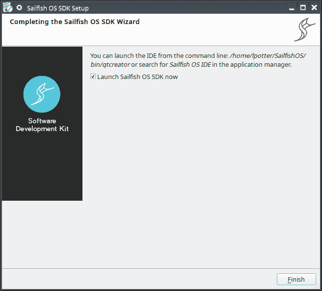

在 Qt Creator 打开并带有 Sailfish SDK 后，点击左侧的 Sailfish OS 图标：

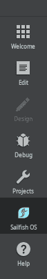

您应该会看到一个消息说构建引擎没有运行，因此我们需要启动它。点击“启动构建引擎！”：

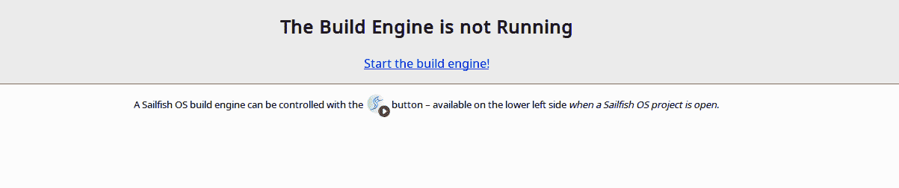

完成上述操作后，您将进入 Sailfish 控制中心，在那里您可以向 SDK 添加组件，并在需要时应用更新。

如果您有设备，请设置您的设备，并导航到“工具”|“选项”|“设备”。

到达那里后，点击“工具”|“选项”|“套件”，并选择 armv7hl 套件。

在“设备选项”部分，请确保选择您之前设置的 Jolla 设备而不是模拟器，除非您想将应用运行在模拟器上。

Jolla SDK 构建引擎在虚拟机中运行，因此可以从任何平台使用。它使用的 IDE 是 Qt Creator。Jolla 的独特之处在于您不仅可以运行 Jolla OS 的原生应用，还可以运行 Android 应用。关于 Android 支持的注意事项是，没有 Google Play API。

现在，构建引擎（交叉编译器）正在运行，我们可以构建我们的应用，测试，然后制作一个包上传到 Harbour。

从“项目”|“运行设置”中，确保选择了“通过复制二进制文件部署”或“作为 RPM 包部署”作为方法。如果您在没有安装包的情况下运行它，请选择“复制方法”。以下是我在 Jolla 手机上运行的更新后的 Compass 应用程序：

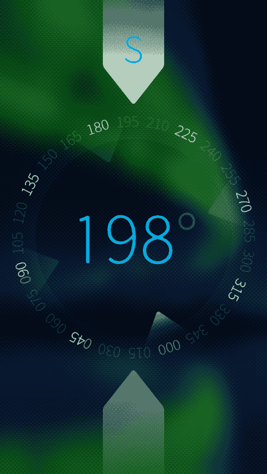

一旦构建了发布包，导航到 Sailfish OS | 发布，点击 RPM 验证器，并选择您的包文件进行验证。

Jolla 商店界面是这里移动应用商店中最简单的，部分原因是因为这里没有应用销售。

点击“添加应用”。您需要填写以下内容：

+   标题

+   详细信息：

    +   描述

    +   摘要

    +   近期更改

+   分类

+   兼容性

+   视觉辅助（截图、图标）

+   联系方式

+   任何给 QA 的信息

一旦您将应用程序提交到 Jolla 的 Harbour 商店，您将看到类似以下图片的内容：

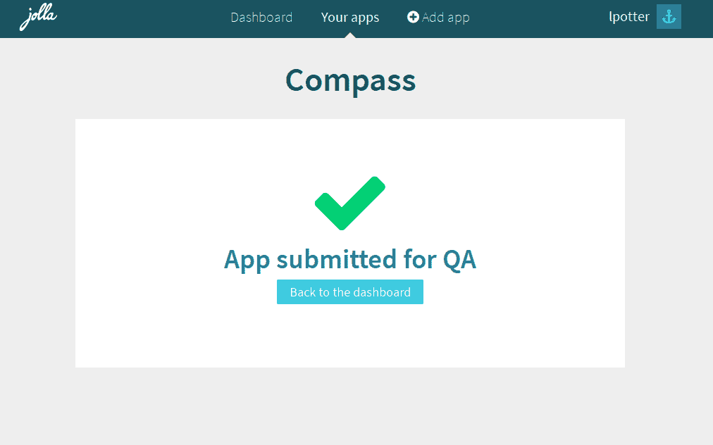

QA 将检查包，要么拒绝要么接受它。

# UBports

UBports 是基于 Canonical 现已停用的移动产品 Ubuntu Touch 的融合操作系统。融合意味着它被设计为可以在桌面和移动设备上运行。它运行在多种手机和平板电脑上，UI 基于 Qt 和 QML。我在 Nexus 4 上运行了我的系统。我不会详细介绍，但我想提一下。更多信息可以在：[`ubports.com/`](https://ubports.com/) 上找到。

在[`ubuntu-touch.io/get-ut`](https://ubuntu-touch.io/get-ut)有一个简单的安装程序，可以将 UBports 安装到支持的设备上。

你可以在[`docs.ubports.com/en/latest/appdev/index.html`](https://docs.ubports.com/en/latest/appdev/index.html)获取 SDK。

# 可点击的

UBports SDK 可以从命令行生成 click 包。Ubuntu Touch SDK IDE 不再由 Canonical 或 UBports 支持。商店被称为 OpenStore。你需要一个账户，提交应用的 URL 是[`open-store.io/submit`](https://open-store.io/submit)。

# 嵌入式 Linux

嵌入式 Linux 设备有多种不同的尺寸和种类。一些可能有应用商店，但大多数没有。有各种方法将操作系统和应用程序安装到设备上。

# 操作系统部署

操作系统的部署将直接在你的设备上进行，因为一些嵌入式设备有非常特定的方法来部署操作系统到设备上。以树莓派为例，将镜像复制到 SD 卡并放入 RPI 中启动非常简单。

我有一个名为`writeIso`的脚本，我使用它；它由两行组成：

```cpp
#!/bin/bash
sudo dd if=$1 of=$2 bs=4M status=progress
```

我运行它的方式如下：

`./writeIso /path/to/deviceImage.img /dev/sdc`

其他设备可能有一种`flash`方法，即镜像直接复制到设备上。这可能需要使用 JTAG 这样的低级方法，或者可能是使用 Android 的`adb`命令这样的高级方法。有时，你必须将镜像写入 SD 卡，将其放入设备中，然后通过一些按键或按钮的组合将镜像闪存到机器的 ROM 中。

# 应用部署

使用带有包管理器的发行版，如 Raspbian 或 Yocto，你可以轻松地分发你的应用程序，无论是直接在设备上安装还是添加到包仓库。在 Yocto 的情况下，你可以有一个本地仓库来分发。

要将包文件安装到设备上，你可以使用 Qt Creator 并设置一个通用的 Linux 设备。这需要在设备上运行一个 SSH 服务器，并建立某种类型的网络连接。

你还可以使用`scp`命令将包和/或二进制文件复制到设备上。这也需要一个 SSH 服务器。

# 摘要

操作系统和应用程序的部署有几种不同的方法。手机有应用商店，它们也有各种提交应用程序的方法。通常，这些操作是通过网页浏览器完成的。你应该能够将应用程序发布到 Android、iOS 和替代操作系统，如 Jolla 的 Sailfish 应用商店。

你也应该能够将你的应用程序分发到嵌入式设备上，例如树莓派。

在下一章中，我们将探讨 Qt for WebAssembly 这项全新的技术，它允许 Qt 应用程序在网页浏览器中运行。
