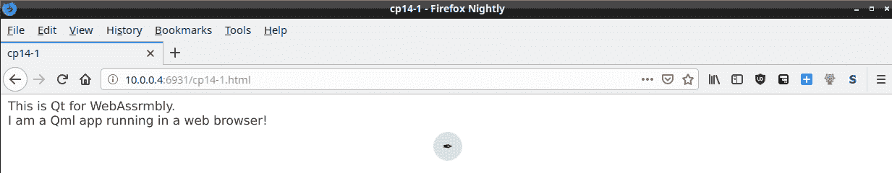
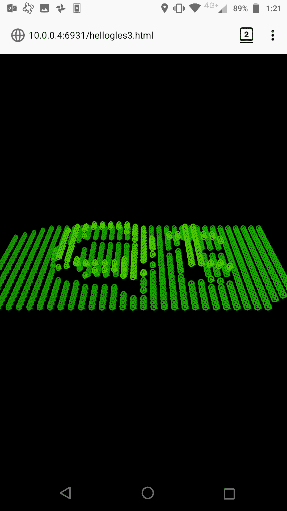
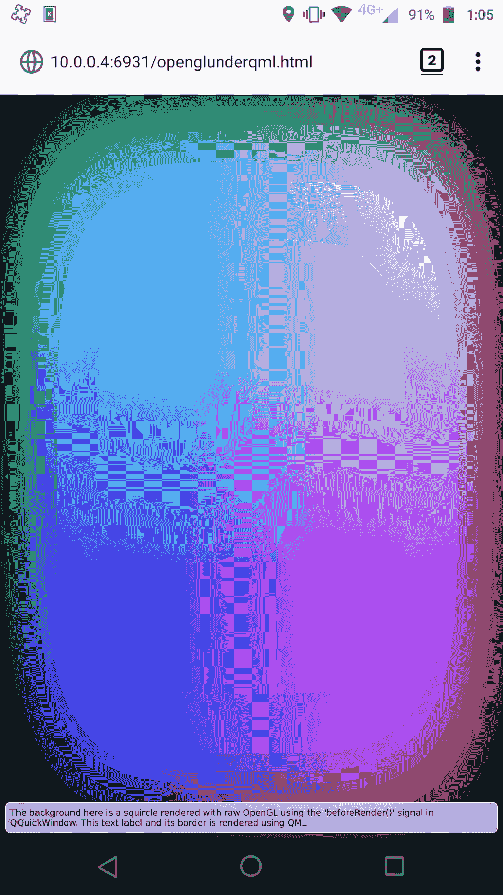
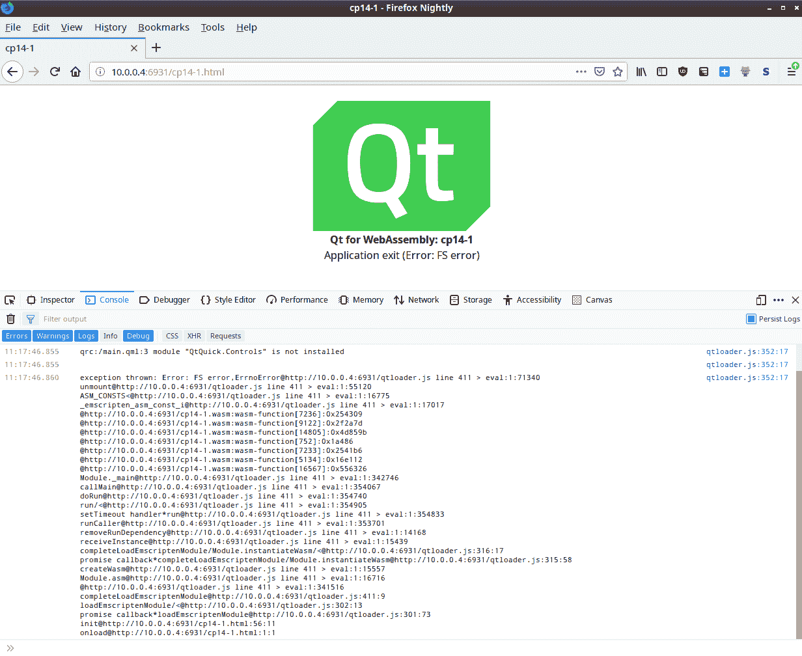

# 移动和嵌入式设备的通用平台

部署应用程序并针对所有不同的平台可能需要大量时间和数千美元的成本。有一个新的 Qt 应用程序目标平台，称为 Qt for WebAssembly，它允许 Qt 和 Qt Quick 应用程序通过网络从浏览器中运行。你将学习如何设置、交叉构建、部署和运行在任何具有现代浏览器的设备上运行的 Qt 应用程序。可以说，Qt for WebAssembly 是一个通用平台。

我们将详细介绍以下材料：

+   技术要求

+   入门

+   使用命令行构建

+   使用 Qt Creator 构建

+   针对移动和嵌入式设备进行部署

+   小贴士、技巧和建议

# 什么是 WebAssembly？

WebAssembly 既不是严格意义上的 Web，也不是 Assembly。同时，它两者都有一点。

在技术层面上，根据 WebAssembly 网站 [`webassembly.org`](http://webassembly.org) 的描述，它是一个基于栈的虚拟机的新二进制指令格式。它在现代浏览器中运行，但人们自然地在进行实验，现在它可以像任何其他应用程序一样独立和实验性地运行，同时正在编写支持 Linux 内核的代码。

通过使用 Emscripten 工具，它可以编译 C 和 C++。Emscripten 是一个用 Python 编写的工具，它使用 LLVM 将 C++ 代码转换为可以被浏览器加载的 WebAssembly 字节码。

WebAssembly 字节码在同一个沙盒中运行与 JavaScript，因此它对本地文件系统的访问以及生活在单个线程中的限制与 JavaScript 相同。它也具有相同的安全优势。尽管正在进行工作以完全支持 pthreads，但在撰写本文时，它仍然是实验性的。

# 技术要求

从以下 Git 仓库轻松安装二进制 SDK：

+   Emscripten sdk [`github.com/emscripten-core/emscripten.git`](https://github.com/emscripten-core/emscripten.git)

或者，手动编译 SDK。您可以从以下 Git 网址下载源代码：

+   Emscripten [`github.com/emscripten-core/emscripten.git`](https://github.com/emscripten-core/emscripten.git)

+   Binaryen [`github.com/WebAssembly/binaryen.git`](https://github.com/WebAssembly/binaryen.git)

+   LLVM [`github.com/llvm/llvm-project.git`](https://github.com/llvm/llvm-project.git)

# 入门

根据 Emscripten 网站 [`emscripten.org/:`](https://emscripten.org/)

*Emscripten 是一个使用 LLVM 将代码转换为 WebAssembly 以在浏览器中以接近原生速度运行的工具链。*

安装 Emscripten 有两种方式：

+   克隆仓库，安装预编译的二进制文件

+   克隆仓库，构建它们

我推荐第一个，因为构建 LLVM 非常耗时。也建议使用 Linux 或 macOS。如果您使用的是 Windows，您可以安装 Linux 子系统并使用它，或者使用 MinGW 编译器。Visual Studio 编译器似乎不支持 Emscripten 输出的四字母扩展名目标，即 `.wasm` 和 `.html`。

# 下载 Emscripten

您需要安装 Git 和 Python 才能进行此操作——只需克隆 `emscripten sdk`：

```cpp
git clone https://github.com/emscripten-core/emscripten.git.
```

在其中，有一些 Python 脚本可以帮助您，其中最重要的是 `emsdk`。

首先运行 `./emsdk --help` 以打印有关如何运行的文档。

然后您需要安装并激活 SDK，如下所示：

```cpp
./emsdk install latest
./emsdk activate latest
```

您可以针对特定的 SDK；您可以通过运行以下命令查看可用的选项：

```cpp
./emsdk list
```

然后通过运行以下命令安装特定版本的 SDK：

```cpp
./emsdk install sdk-1.38.16-64bit
./emsdk activate sdk-1.38.16-64bit
```

`activate` 命令会设置包含 Emscripten 所需环境设置的 `~/.emscripten` 文件。

要能够使用它进行构建，您需要按照以下方式源码 `emsdk_env.sh` 文件：

```cpp
source ~/emsdk/emsdk_env.sh
```

Qt 针对某个已知对该版本有良好支持的 Emscripten 版本。对于 Qt 5.11，Qt for WebAssembly 有自己的分支——`wip/webassembly`。它已集成到 5.12 作为技术预览，并在 5.13 中提供官方支持。截至本文撰写时，它计划作为二进制安装包含在 Qt Creator 中。

# 手动构建 Emscripten SDK

如果您想手动构建 Emscripten，例如编译支持直接转换为 WebAssembly 二进制文件而不是首先写入 JavaScript 然后转换为 WebAssembly 的上游 LLVM。这可以加快编译时间，但截至本文撰写时，这仍然是实验性的。这通过向链接器添加一个参数 `-s WASM_OBJECT_FILES=1` 来实现。

关于使用 `WASM_OBJECT_FILES` 的更多信息，请参阅 [`github.com/emscripten-core/emscripten/issues/6830`](https://github.com/emscripten-core/emscripten/issues/6830)。

# 技术要求

您需要从您的操作系统安装 `node.js` 和 `cmake` 软件包。克隆以下资源：

```cpp
mkdir emsdks
cd emsdks
git clone -b 1.38.27 https://github.com/kripken/emscripten.git
git clone -b 1.38.27 https://github.com/WebAssembly/binaryen.git
git clone https://github.com/llvm/llvm-project.git
```

Emscripten 不需要构建，因为它是用 Python 编写的。

要构建 `binaryen`，请输入以下代码：

```cpp
cd binaryen
cmake .
make
```

要构建 LLVM，请输入以下代码：

```cpp
mkdir llvm
cmake ../llvm-project/llvm -DLLVM_ENABLE_PROJECTS="clang;libcxx;libcxxabi;lld" -DCMAKE_BUILD_TYPE=Release -DLLVM_TARGETS_TO_BUILD=WebAssembly -DLLVM_EXPERIMENTAL_TARGETS_TO_BUILD=WebAssembly

make
```

运行 `emscripten` 以编写配置文件，如下所示：

```cpp
cd emscripten
./emcc --help
```

这将创建一个 `~/.emscripten` 文件。按照以下方式将此文件复制到您的 `emsdks` 目录：

```cpp
cp ~/.emscripten /path/to/emsdks/.emscripten-vanillallvm
```

设置环境时，请编写以下脚本：

```cpp
#!/bin/bash
SET EMSDK=/path/to/emscripten
SET LLVM=/path/to/llvm/bin
SET BINARYEN=/path/to/binaryen
SET PATH=%EMSDK%;%PATH%
SET EM_CONFIG=/path/to/emsdks/.emscripten-vanillallvm
SET EM_CACHE=/path/to/esdks/.emscripten-vanillallvm_cache
```

将其保存为 `emsdk-env.sh`。

您需要使其可执行，因此运行 `chmod +x emsdk-env.sh`。

每次您需要设置构建环境时，只需运行此脚本并使用相同的控制台进行构建。

现在我们已经准备好了，让我们看看如何配置和构建 Qt。

# 配置和编译 Qt

您可以在以下 URL 找到有关 Qt for WebAssembly 的信息：[`wiki.qt.io/Qt_for_WebAssembly`](https://wiki.qt.io/Qt_for_WebAssembly)

我猜我们需要源代码。您可以通过 Qt Creator 获取它们，或者您可以通过`git clone`克隆仓库。使用 Git，您可以对版本和任何需要的分支有更多的控制。

对于 5.12 和 5.13，您可以简单地克隆以下标签：

```cpp
git clone http://code.qt.io/qt/qtbase.git -b v5.12.1
```

或者，您可以克隆此标签：

```cpp
git clone http://code.qt.io/qt/qtbase.git -b v5.13.0
```

就像任何新技术一样，它发展迅速，所以请获取最新版本。对于这本书，我们使用 Qt 5.12，但我提到了其他版本，因为它们有很多错误修复和优化。

现在我们可以配置和编译 Qt 了！

对于 5.12 和 5.13，它简化为以下内容：

```cpp
configure -xplatform wasm-emscripten -nomake examples -nomake tests
```

如果您需要线程，5.13 支持多线程 WebAssembly，但您还需要配置浏览器以支持它。

一旦配置完成，您只需运行 make！

然后，为了构建在网页浏览器中运行的 Qt 应用程序，只需从构建目录使用`qmake`命令并在您的 app.pro 文件上运行即可。并非所有 Qt 功能都受支持——例如本地文件系统访问和线程。`QOpenGLWidget`也不受支持，尽管`QOpenGLWindow`运行良好。让我们看看如何使用命令行进行构建。

# 使用命令行构建

构建用于 WebAssembly 应用程序的 Qt 需要您源码 Emscripten 环境文件，因此请在控制台命令中运行以下内容：

```cpp
source /path/to/emsdk/emsdk_env.sh
```

您需要添加 Qt WebAssembly 的路径到`qmake`，如下所示：

```cpp
export PATH=/path/to/QtForWebAssembly/bin:$PATH.
```

当然，您必须将`/path/to`替换为实际的文件系统路径。

您现在可以开始操作了！您只需像其他任何 Qt 应用程序一样运行`qmake`即可，如下所示：

```cpp
qmake mycoolapp.pro && make.
```

如果需要调试，请按照以下方式重新运行带有`CONFIG+=debug`的`qmake`：

```cpp
qmake CONFIG+=debug mycoolapp.pro && make.
```

这将为编译器和链接器添加各种 Emscripten 特定参数。

一旦构建完成，您可以使用 Emscripten 的`emrun`命令运行它，这将启动一个简单的 Web 服务器并服务`<target>.html`文件。这将反过来加载`qtloader.js`，然后加载`<target>.js`文件，然后加载`<target>.wasm`二进制文件：

```cpp
emrun --browser firefox --hostname 10.0.0.4 <target>.html.
```

您也可以给`emrun`指定目录，例如：

```cpp
emrun --browser firefox --hostname 10.0.0.4 ..
```

这给您时间打开浏览器控制台进行调试。现在，让我们看看如何使用 Qt Creator 进行构建。

# 使用 Qt Creator 构建

一旦您从命令行编译了 Qt 本身，您就可以使用 Qt Creator 构建和运行您的 Qt 应用程序。

# 构建环境

在 Qt Creator 中，导航到工具 | 选项... | 套件

然后转到编译器选项卡。您需要添加`emcc`作为 C 编译器，并将`em++`作为 C++编译器，因此点击添加按钮并从下拉列表中选择自定义。

首先选择 C 并添加以下详细信息：

+   名称：`emcc (1.38.16)`

+   编译器路径：`/home/user/emsdk/emscripten/1.38.16/emcc`

+   Make 路径：`/usr/bin/make`

+   ABI：`x86 linux unknown elf 64bit`

+   Qt mkspecs: `wasm-emscripten`

选择 C++并添加以下详细信息：

+   名称：`emc++(1.38.16)`

+   编译器路径：`/home/user/emsdk/emscripten/1.38.16/em++`

+   Make 路径：`/usr/bin/make`

+   ABI：`x86 linux unknown elf 64bit`

+   Qt mkspecs: `wasm-emscripten`

点击应用。

前往标签页“Qt 版本”并点击添加按钮。导航到您构建 Qt for WebAssembly 的位置，然后在 `bin` 目录中选择 qmake。点击应用。

前往标签页“工具包”，然后点击添加按钮。添加以下详细信息：

+   名称：`Qt %{Qt:Version} (qt5-wasm)`

+   编译器：`C: emcc (1.38.16)`

+   编译：`C++: em++ (1.38.16)`

+   Qt 版本：`Qt (qt5-wasm)`

# 运行环境

您需要使应用程序的项目处于活动状态，以构建 Qt for WebAssembly。从 Qt Creator 左侧的按钮中选择“项目”，然后选择您的 Qt for WebAssembly 工具包。

在 Qt Creator 中运行 WebAssembly 应用目前有些棘手，因为你需要将 `emrun` 指定为一个自定义的可执行文件，然后将其构建目录或 `<target>.html` 文件作为其参数。你也可以指定要运行的浏览器。你可以使用 `--browser chrome` 参数运行 Chrome。

要获取已找到的浏览器列表，请运行命令 `emrun --list_browsers`。

您甚至可以使用 `--android` 参数在连接到 USB 的 Android 设备上运行应用。您需要安装并运行 **Android Debug Bridge** (`adb`) 命令。

无论如何，现在我们知道了如何运行应用，我们需要告诉 Qt Creator 项目运行它。

前往“项目”|“运行”。在“运行”部分，选择“添加”|“自定义可执行文件”，并添加以下详细信息：

+   可执行文件：`/home/user/emsdk/emrun <target>.html`

+   工作目录：`%{buildDir}`

现在我们已经准备好构建和运行。以下是它应该看起来的样子：



我们甚至可以运行 OpenGL 应用！以下是从 Android Firefox 浏览器中运行的 Qt 的 `hellogles3` 示例：



我们还可以运行声明性应用！以下是从 Qt Quick 的 `qopenglunderqml` 示例应用：



# 为移动和嵌入式设备部署

实际上，为移动和嵌入式设备部署只需将 Emscripten 构建的结果文件复制到支持 CORS 的 Web 服务器上。

任何支持 WebAssembly 的网络浏览器都能运行它。

当然，屏幕尺寸也是一个需要考虑的因素。

对于测试，您可以使用 Emscripten SDK 中的 `emrun` 命令运行您的应用程序。如果您计划从除 localhost 之外的其他设备进行测试，您需要使用 `--hostname` 参数设置它使用的 IP 地址。

还有用于测试 CORS 启用型 Web 服务器的 Python 脚本。Apache Web 服务器也可以配置为支持 CORS。

目前需要部署的文件有五个——`qtloader.js`、`qtlogo.svg`、`<target>.html`、`<target>.js` 和 `<target>.wasm`。`.wasm` 文件是大的 WebAssembly 二进制文件，静态链接。以下是一些建议，以帮助您完成此过程。

# 小贴士、技巧和建议

Qt for WebAssembly 被视为 Qt 的跨平台构建。它是一种新兴技术，因此，可能需要一些特殊设置配置来更改或启用所需的一些功能。在使用它作为目标时，你需要注意以下几点。

在这里，我提供了一些关于 Qt for WebAssembly 的技巧。

# 浏览器

所有主流浏览器现在都支持加载 WebAssembly。Firefox 似乎加载速度最快，尽管 Chrome 有一个可以设置为加速的配置（查看`chrome://flags for #enable-webassembly-baseline`）。随 Android 和 iOS 一起提供的移动浏览器也适用，尽管这些浏览器可能会遇到内存不足错误，这取决于正在运行的应用程序。

Qt 5.13 for WebAssembly 添加了对线程的实验性支持，这些线程依赖于浏览器中的`onSharedArrayBuffer`支持。由于 Spectre 漏洞，默认情况下已关闭，需要在浏览器中启用。

在 Chrome 中，导航到`chrome://flags`并启用`#enable-webassembly-threads`。

在 Firefox 中，导航到`about://config`并启用`javascript.options.shared.memory`。

# 调试

调试是通过在 Web 浏览器中使用调试控制台来完成的。可以通过调用带有`CONFIG+=debug`的`qmake`来启用额外的调试功能，即使是在发布模式下编译的 Qt。以下是崩溃可能看起来像什么：



你还可以从你的手机进行远程调试，并在你的桌面上查看远程浏览器的 JavaScript 控制台输出。请参阅以下链接：

[`developer.mozilla.org/en-US/docs/Tools/Remote_Debugging`](https://developer.mozilla.org/en-US/docs/Tools/Remote_Debugging)

# 网络

可以使用常规的`QNetworkAccessManager`进行简单的下载请求。这些将通过`XMLNetworkRequest`进行，并需要启用 CORS 的服务器才能下载。典型的`QTCPSocket`和`QUdpSockets`会被转换成 WebSockets。你的 Web 服务器需要支持 WebSockets，或者你可以使用 Websockify 工具，该工具可以从以下链接获取：

[`github.com/novnc/websockify`](https://github.com/novnc/websockify)

# 字体和文件系统访问

系统字体无法访问，必须包含并嵌入到应用程序中。Qt 嵌入了一种字体。

文件系统访问目前也不受支持，但将来将通过使用 Qt WebAssembly 特定 API 来实现。

# OpenGL

OpenGL 以 OpenGL ES2 的形式得到支持，并将其转换成 WebGL。

如果你计划在 WebAssembly 应用程序中使用 OpenGL，你应该注意 OpenGL ES2 和 WebGL 之间的一些差异。WebGL 通常更严格。

这里是一些关于 WebGL 的差异：

+   缓冲区在其生命周期内只能绑定到一个`ARRAY_BUFFER`或`ELEMENT_ARRAY_BUFFER`

+   没有客户端`Arrays`

+   没有二进制着色器，`ShaderBinary`

+   对`drawElements`强制执行`offset`；`vertexAttribPointer`和`vertexAttribPointer`的`stride`参数是数据类型大小的倍数

+   `drawArrays` 和 `drawElements` 被限制在缓冲区边界之外请求数据

+   添加 `DEPTH_STENCIL_ATTACHMENT` 和 `DEPTH_STENCIL`

+   `texImage2D` 和 `texSubImage2D` 的大小基于 `TexImageSource` 对象

+   `copyTexImage2D`、`copyTexSubImage2D` 和 `readPixels` 不能触及 `framebuffer` 之外的像素

+   模板测试和绑定的 `framebuffer` 限制了绘制

+   `vertexAttribPointer` 的值不得超过 255

+   `zNear` 不能大于 `zFar`

+   常量颜色和常量 alpha 不能与 `blendFunc` 一起使用

+   不支持 `GL_FIXED`

+   `compressedTexImage2D` 和 `compressedTexSubImage2D` 不受支持

+   GLSL 令牌大小限制为 256 个字符

+   GLSL 只支持 ASCII 字符

+   GLSL 限制为 1 级嵌套结构

+   通用和属性位置长度限制为 256 个字符

+   `INFO_LOG_LENGTH`、`SHADER_SOURCE_LENGTH`、`ACTIVE_UNIFORM_MAX_LENGTH` 和 `ACTIVE_ATTRIBUTE_MAX_LENGTH` 已被移除。

+   传递给 `texSubImage2D` 的纹理类型必须与 `texImage2D` 匹配

+   不允许对同一纹理（反馈循环）进行 `read` 和 `write` 调用

+   从缺失的附件中读取数据是不允许的

+   属性别名不允许

+   `gl_Position` 的初始值定义为 (0,0,0,0)

更多信息，请参阅以下网页：

WebGL 1.0 [`www.khronos.org/registry/webgl/specs/latest/1.0/#6`](https://www.khronos.org/registry/webgl/specs/latest/1.0/#6)

WebGL 2.0 [`www.khronos.org/registry/webgl/specs/latest/2.0/#5`](https://www.khronos.org/registry/webgl/specs/latest/2.0/#5)

# 支持的 Qt 模块

Qt for WebAssembly 支持以下 Qt 模块：

+   `qtbase`

+   `qtdeclarative`

+   `qtquickcontrols2`

+   `qtwebsockets`

+   `qtmqtt`

+   `qtsvg`

+   `qtcharts`

+   `qtgraphicaleffects`

# 其他注意事项

二级事件循环在 Qt for Webassembly 中不起作用。这是因为它需要连接的 Emscripten 事件循环不会返回。如果您需要弹出对话框，不要调用 `exec()`，而是调用 `show()`，并使用信号获取返回值。

在移动平台如 Android 和 iOS 上的虚拟键盘不会自动弹出。您可以直接在项目中使用 Qt 虚拟键盘。

# 摘要

Qt for WebAssembly 是 Qt 的新兴平台，可以在网络浏览器中运行 Qt 应用程序。

您现在应该能够下载或构建 Emscripten SDK，并用于构建 WebAssembly 的 Qt。您现在可以在网络浏览器中运行 Qt 应用程序，包括移动和嵌入式设备，只要浏览器支持 WebAssembly。

在最后一章，我们探讨了构建一个完整的 Linux 嵌入式操作系统。
