# 第一章：介绍网络和协议

在本章中，我们将回顾计算机网络的基本原理。我们将探讨试图解释网络主要问题的抽象模型，并解释主要网络协议——互联网协议的操作。我们将探讨地址族，并以编写程序列出计算机的本地 IP 地址结束。

本章涵盖了以下主题：

+   网络编程与 C 语言

+   OSI 层模型

+   TCP/IP 参考模型

+   互联网协议

+   IPv4 地址和 IPv6 地址

+   域名

+   互联网协议路由

+   网络地址转换

+   客户端-服务器模式

+   从 C 语言程序中列出 IP 地址

# 技术要求

本章的大部分内容集中在理论和概念上。然而，我们在本章末尾介绍了一些示例程序。要编译这些程序，您需要一个良好的 C 编译器。我们推荐在 Windows 上使用 MinGW，在 Linux 和 macOS 上使用 GCC。请参阅附录 B，*在 Windows 上设置您的 C 编译器*，附录 C，*在 Linux 上设置您的 C 编译器*，以及附录 D，*在 macOS 上设置您的 C 编译器*，以了解编译器的设置。

本书代码可在以下位置找到：[`github.com/codeplea/Hands-On-Network-Programming-with-C`](https://github.com/codeplea/Hands-On-Network-Programming-with-C)[.](https://github.com/codeplea/Hands-On-Network-Programming-with-C)

从命令行，您可以使用以下命令下载本章的代码：

```cpp
git clone https://github.com/codeplea/Hands-On-Network-Programming-with-C
cd Hands-On-Network-Programming-with-C/chap01
```

在 Windows 上，使用 MinGW，您可以使用以下命令来编译和运行代码：

```cpp
gcc win_list.c -o win_list.exe -liphlpapi -lws2_32
win_list
```

在 Linux 和 macOS 上，您可以使用以下命令：

```cpp
gcc unix_list.c -o unix_list
./unix_list
```

# 互联网与 C 语言

现在，互联网无需介绍。当然，数百万台台式机、笔记本电脑、路由器和服务器已经连接到互联网，并且已经连接了几十年。然而，现在还有数十亿额外的设备也连接到了互联网——移动电话、平板电脑、游戏系统、车辆、冰箱、电视、工业机械、监控系统、门铃，甚至灯泡。新的**物联网（IoT**）趋势使得每天都有越来越多的人急于连接更多不太可能的设备。

现在估计有超过 200 亿台设备连接到互联网。这些设备使用各种各样的硬件。它们通过以太网连接、Wi-Fi、蜂窝网络、电话线、光纤和其他媒体连接，但它们可能有一个共同点；它们可能都使用**C**语言。

C 编程语言的使用无处不在。几乎每个网络栈都是用 C 编写的。这适用于 Windows、Linux 和 macOS。如果你的手机使用 Android 或 iOS，那么尽管这些应用程序是用不同的语言编写的（Java 和 Objective C），但内核和网络代码是用 C 编写的。很可能你的互联网数据通过的网络路由器也是用 C 编写的。即使你的调制解调器或路由器的用户界面和高级功能是用另一种语言编写的，但网络驱动程序仍然很可能是用 C 实现的。

网络涵盖了多个不同抽象层次的关注点。你的网络浏览器在格式化网页时的关注点与你的路由器在转发网络数据包时的关注点大不相同。因此，有一个理论模型帮助我们理解这些不同抽象层次上的通信是有用的。现在让我们看看这些模型。

# OSI 层模型

很明显，如果构成互联网的所有不同设备都要无缝通信，那么必须有一套定义它们通信的标准。这些标准被称为**协议**。协议定义了从以太网电缆上的电压级别到网页上 JPEG 图像的压缩方式等所有内容。很明显，当我们谈论以太网电缆上的电压时，我们处于一个与谈论 JPEG 图像格式完全不同的抽象层次。如果你正在编写一个网站，你不想去考虑以太网电缆或 Wi-Fi 频率。同样，如果你正在编写一个互联网路由器，你也不想担心 JPEG 图像是如何压缩的。因此，我们将问题分解成许多更小的部分。

分解问题的常见方法是将关注层次放入层中。每一层随后为它上面的层提供服务，并且每一上层都可以依赖下面的层，而不必担心它们是如何工作的。

网络中最流行的层系统被称为**开放系统互联**模型（**OSI**模型）。它在 1977 年标准化，并作为 ISO 7498 发布。它有七个层次：

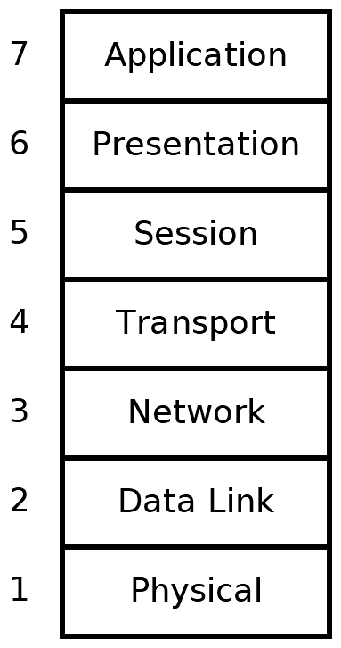

让我们逐个了解这些层：

+   **物理**（1）：这是现实世界中物理通信的层次。在这个层次上，我们有关于诸如以太网电缆上的电压级别、连接器上每个引脚的用途、Wi-Fi 的无线电频率以及光纤上的光闪烁等事物的规范。

+   **数据链路**（2）：这个层次建立在物理层之上。它处理两个节点之间直接通信的协议。它定义了节点之间直接消息的开始和结束（帧定界），错误检测和纠正，以及流量控制。

+   **网络层** (3)：网络层提供在不同网络节点之间传输数据序列（称为数据包）的方法。它提供方法通过许多中间节点将数据包从一个节点路由到另一个节点（无需直接物理连接）。这是定义互联网协议的层，我们将在稍后深入探讨。

+   **传输层** (4)：在这一层，我们有方法在主机之间可靠地传输可变长度的数据。这些方法涉及分割数据、重新组合数据、确保数据按顺序到达等。通常说**传输控制协议**（**TCP**）和**用户数据报协议**（**UDP**）存在于这一层。

+   **会话层** (5)：这一层通过添加建立、检查点、暂停、恢复和终止对话的方法来构建在传输层之上。

+   **表示层** (6)：这是定义应用程序数据结构和表示的最低层。在此层处理诸如数据编码、序列化和加密等问题。

+   **应用层** (7)：用户界面中的应用程序（例如，网页浏览器和电子邮件客户端）存在于这里。这些应用程序利用了下面六层提供的服务。

在 OSI 模型中，一个应用程序，例如网页浏览器，存在于应用层（第 7 层）。该层的一个协议，如用于传输网页的 HTTP，不必关心数据是如何传输的。它可以依赖其下层的服务来有效地传输数据。这在下图中得到了说明：

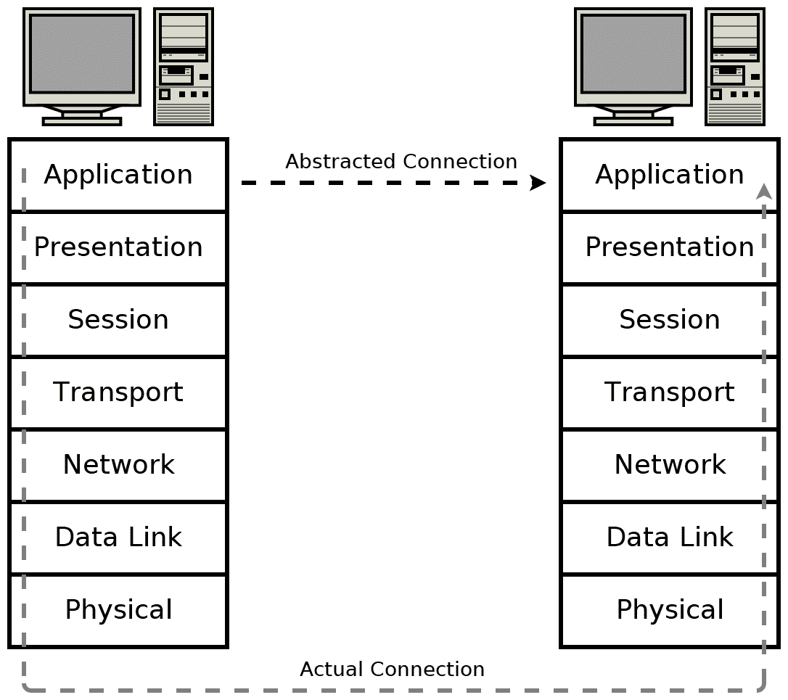

应该注意的是，根据 OSI 层不同，数据块通常有不同的名称。第 2 层的数据单元称为**帧**，因为第 2 层负责消息封装。第 3 层的数据单元被称为**数据包**，而第 4 层的数据单元如果是 TCP 连接的一部分，则称为**段**；如果是 UDP 消息，则称为**数据报**。

在这本书中，我们经常使用术语“数据包”作为任何层的数据单元的通用术语。然而，“段”一词仅用于 TCP 连接的上下文中，而“数据报”仅指 UDP 数据报。

正如我们在下一节中将要看到的，OSI 模型并不完全符合今天常用的协议。然而，它仍然是一个方便的模型来解释网络问题，并且今天它仍然被广泛用于这个目的。

# TCP/IP 层模型

**TCP/IP 协议族** 是目前最常用的网络通信模型。TCP/IP 参考模型与 OSI 模型略有不同，因为它只有四层而不是七层。

下图说明了 TCP/IP 模型的四层如何与 OSI 模型的七层相对应：

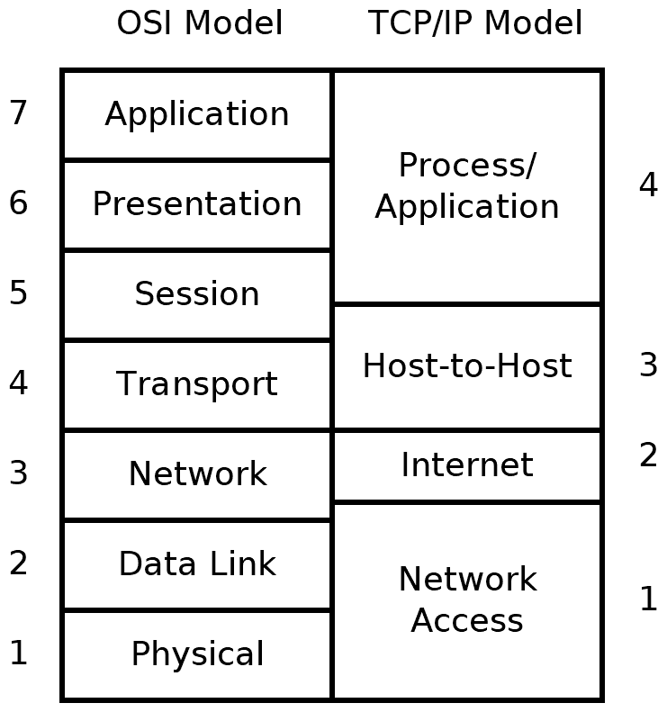

值得注意的是，TCP/IP 模型与 OSI 模型中的层并不完全匹配。这没关系。在这两个模型中，执行相同的函数；只是划分方式不同。

TCP/IP 参考模型是在 TCP/IP 协议已经普遍使用之后开发的。它通过采用一个不那么严格但仍然分层的模型与 OSI 模型不同。因此，OSI 模型有时更适合理解和推理网络问题，但 TCP/IP 模型反映了今天网络通常实施的一个更现实的视角。

TCP/IP 模型的四层如下：

+   **网络访问层（1）**：在这一层，发生物理连接和数据帧定界。发送以太网或 Wi-Fi 数据包是这一层关注的问题的例子。

+   **互联网层（2）**：这一层处理地址分组和通过多个互连网络路由分组的问题。在这一层定义了 IP 地址。

+   **主机到主机层（3）**：主机到主机层提供了 TCP 和 UDP 两种协议，我们将在下一章中讨论。这些协议解决数据顺序、数据分段、网络拥塞和错误纠正等问题。

+   **进程/应用层（4）**：进程/应用层是 HTTP、SMTP 和 FTP 等协议实现的地方。本书中大多数程序都可以被认为是发生在这一层，同时消耗操作系统对低层实现的提供的功能。

无论你选择哪种抽象模型，现实世界的协议确实在许多层面上工作。低层负责处理高层的数据。因此，这些低级数据结构必须封装来自高层的数據。现在让我们看看如何封装数据。

# 数据封装

这些抽象的优势在于，在编写应用程序时，我们只需要考虑最高层协议。例如，一个网页浏览器只需要实现专门处理网站的协议——HTTP、HTML、CSS 等。它不需要担心实现 TCP/IP，当然也不必理解以太网或 Wi-Fi 数据包是如何编码的。它可以依赖低层为这些任务提供的现成实现。这些实现由操作系统（例如 Windows、Linux 和 macOS）提供。

当通过网络进行通信时，数据必须在发送方的各层中进行处理，然后再在接收方的各层中重新进行。例如，如果我们有一个网页服务器，**主机 A**，它正在向接收方，**主机 B**，传输网页，它可能看起来像这样：

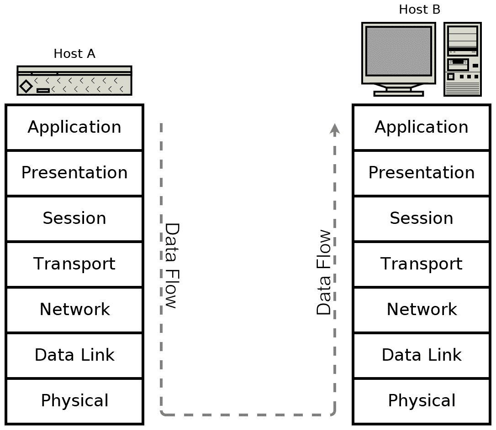

网页包含几段文本，但网页服务器并不仅仅发送文本本身。为了正确渲染文本，它必须被编码在**HTML**结构中：

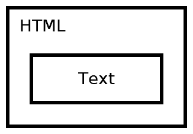

在某些情况下，文本已经预先格式化为 **HTML** 并以这种方式保存，但在这个例子中，我们正在考虑一个动态生成 **HTML** 的 Web 应用程序，这是动态网页最常见的方法。由于文本不能直接传输，**HTML** 也不能直接传输。它必须作为 **HTTP** 响应的一部分进行传输。Web 服务器通过将适当的 **HTTP** 响应头应用到 **HTML** 上来完成这项工作：

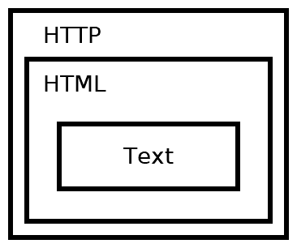

**HTTP** 作为 **TCP** 会话的一部分进行传输。这不是由 Web 服务器显式完成的，而是由操作系统的 TCP/IP 堆栈处理的：

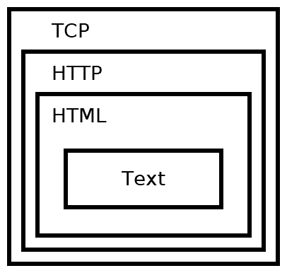

**TCP** 数据包由 **IP** 数据包路由：

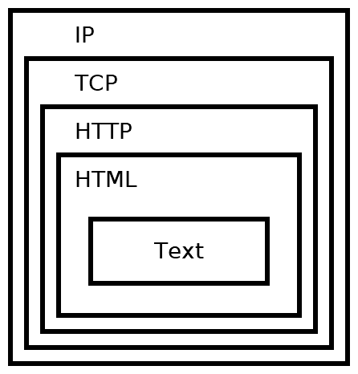

这通过以太网数据包（或其他协议）在网络上传输：

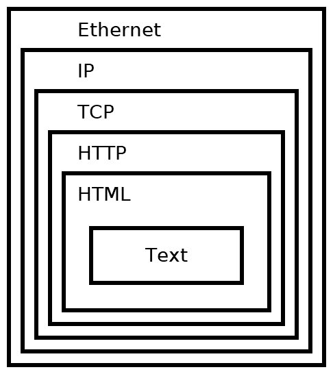

幸运的是，当我们使用套接字 API 进行网络编程时，低级问题会自动处理。了解幕后发生的事情仍然很有用。如果没有这些知识，处理故障或优化性能将是困难的，如果不是不可能的。

在理论部分介绍完毕后，让我们深入了解推动现代网络的实际协议。

# 互联网协议

二十年前，有许多相互竞争的网络协议。今天，一个协议非常普遍——互联网协议。它有两个版本——IPv4 和 IPv6。IPv4 完全无处不在，到处都有部署。如果你今天正在部署网络代码，你必须支持 IPv4，否则可能会有一大部分用户无法连接。

IPv4 使用 32 位地址，这限制了它最多只能地址 2³² 或 4,294,967,296 个系统。然而，这 43 亿个地址最初并没有被有效地分配，现在许多 **互联网服务提供商**（**ISPs**）被迫配给 IPv4 地址。

IPv6 被设计用来取代 IPv4，自 1998 年以来已被互联网工程任务组（**IETF**）标准化。它使用 128 位地址，这使得它可以地址理论上的 2¹²⁸ = 340,282,366,920,938,463,463,374,607,431,768,211,456，或大约 3.4 x 10³⁸ 个地址。

今天，每个主要的桌面和智能手机操作系统都支持 IPv4 和 IPv6，这被称为 **双栈配置**。然而，许多应用程序、服务器和网络仍然只配置为使用 IPv4。从实际的角度来看，这意味着你需要支持 IPv4 才能访问互联网的大部分内容。然而，你也应该支持 IPv6 以确保未来兼容性，并帮助世界过渡到 IPv4。

# 什么是地址？

所有互联网协议流量都会路由到某个地址。这类似于电话通话必须拨打电话号码。IPv4 地址长度为 32 位。它们通常分为四个 8 位部分。每个部分显示为一个介于 `0` 和 `255` 之间的十进制数，并由点分隔。

以下是一些 IPv4 地址的示例：

+   `0.0.0.0`

+   `127.0.0.1`

+   `10.0.0.0`

+   `172.16.0.5`

+   `192.168.0.1`

+   `192.168.50.1`

+   `255.255.255.255`

一个特殊地址，称为 **环回** 地址，被预留于 `127.0.0.1`。这个地址实际上意味着 *建立到自己的连接*。操作系统会短路这个地址，使得发送到该地址的数据包永远不会进入网络，而是保持在源系统上本地。

IPv4 为私有用途预留了一些地址范围。如果你通过路由器/NAT 使用 IPv4，那么你很可能正在使用这些范围之一中的 IP 地址。这些预留的私有范围如下：

+   `10.0.0.0` 至 `10.255.255.255`

+   `172.16.0.0` 至 `172.31.255.255`

+   `192.168.0.0` 至 `192.168.255.255`

IP 地址范围的概念在计算机网络中非常有用，经常出现。因此，存在一种简写表示法来书写它们。使用 **无类别域间路由**（**CIDR**）表示法，我们可以将前面提到的三个地址范围写成以下形式：

+   `10.0.0.0/8`

+   `172.16.0.0/12`

+   `192.168.0.0/16`

CIDR 表示法通过指定固定位的数量来工作。例如，`10.0.0.0/8` 指定 `10.0.0.0` 地址的前八个位是固定的，前八个位仅仅是第一个 `10.` 部分；地址的剩余 `0.0.0` 部分可以是任何东西，仍然位于 `10.0.0.0/8` 块中。因此，`10.0.0.0/8` 包括从 `10.0.0.0` 到 `10.255.255.255`。

IPv6 地址长度为 128 位。它们以八个由冒号分隔的四位十六进制字符组成。十六进制字符可以是 0-9 或 a-f。以下是一些 IPv6 地址的示例：

+   `0000:0000:0000:0000:0000:0000:0000:0001`

+   `2001:0db8:0000:0000:0000:ff00:0042:8329`

+   `fe80:0000:0000:0000:75f4:ac69:5fa7:67f9`

+   `ffff:ffff:ffff:ffff:ffff:ffff:ffff:ffff`

注意，IPv6 地址的标准是使用小写字母。这与计算机中许多其他十六进制用法形成对比。

有几条规则可以缩短 IPv6 地址，使其更容易使用。规则 1 允许省略每个部分前面的零（例如，`0db8` = `db8`）。规则 2 允许用双冒号（`::`）替换连续的零部分。规则 2 在每个地址中只能使用一次；否则，地址将是模糊的。

应用这两个规则，前面的地址可以缩短如下：

+   `::1`

+   `2001:db8::ff00:42:8329`

+   `fe80::75f4:ac69:5fa7:67f9`

+   `ffff:ffff:ffff:ffff:ffff:ffff:ffff:ffff`

与 IPv4 类似，IPv6 也有一个环回地址。它是 `::1`。

双栈实现还识别一类可以直接映射到 IPv4 地址的特殊 IPv6 地址。这些保留地址以 80 个零位开头，然后是 16 个一位，接着是 32 位的 IPv4 地址。使用 CIDR 表示法，这个地址块是`::ffff:0:0/96`。

这些映射地址通常以 IPv6 格式的前 96 位开头，然后是 IPv4 格式的剩余 32 位。以下是一些示例：

| **IPv6 地址** | **映射的 IPv4 地址** |
| --- | --- |
| `::ffff:10.0.0.0` | `10.0.0.0` |
| `::ffff:172.16.0.5` | `172.16.0.5` |
| `::ffff:192.168.0.1 ` | `192.168.0.1` |
| `::ffff:192.168.50.1` | `192.168.50.1` |

您还可能遇到 IPv6 **站点本地地址**。这些站点本地地址位于`fec0::/10`范围内，用于私有本地网络。站点本地地址现在已经过时，不应用于新的网络，但许多现有的实现仍在使用它们。

您还应该熟悉另一种地址类型，即**链路本地地址**。链路本地地址只能在本地链路上使用。路由器从不转发来自这些地址的数据包。它们对于系统在分配 IP 地址之前访问自动配置功能是有用的。链路本地地址位于 IPv4 的`169.254.0.0/16`地址块或 IPv6 的`fe80::/10`地址块。

应该注意的是，IPv6 除了地址范围大大扩展之外，还引入了许多 IPv4 没有的新特性。IPv6 地址有新的属性，如作用域和生存期，IPv6 网络接口通常具有多个 IPv6 地址是正常的。IPv6 地址的使用和管理与 IPv4 地址不同。

不论这些差异如何，在这本书中，我们努力编写适用于 IPv4 和 IPv6 都表现良好的代码。

如果您认为 IPv4 地址难以记忆，IPv6 地址则几乎不可能记忆，那么您并不孤单。幸运的是，我们有一个系统来为特定地址分配名称。

# 域名

互联网协议只能将数据包路由到 IP 地址，而不是名称。因此，如果您尝试连接到网站，例如`example.com`，则您的系统必须首先将那个域名`example.com`解析为托管该网站的服务器的 IP 地址。

这是通过连接到一个**域名系统**（**DNS**）服务器来实现的。您通过事先知道其 IP 地址来连接到域名服务器。域名服务器的 IP 地址通常由您的 ISP 分配。

许多其他域名服务器由不同的组织公开提供。以下是一些免费和公开的 DNS 服务器：

| **DNS 提供商** | **IPv4 地址** | **IPv6 地址** |
| --- | --- | --- |
| Cloudflare 1.1.1.1 | `1.1.1.1` | `2606:4700:4700::1111` |
|  | `1.0.0.1` | `2606:4700:4700::1001` |
| FreeDNS | `37.235.1.174` |  |
|  | `37.235.1.177` |  |
| Google Public DNS | `8.8.8.8` | `2001:4860:4860::8888` |
|  | `8.8.4.4` | `2001:4860:4860::8844` |
| OpenDNS | `208.67.222.222` | `2620:0:ccc::2` |
|  | `208.67.220.220` | `2620:0:ccd::2` |

为了解析主机名，你的计算机向你的域名服务器发送一个 UDP 消息，并请求为你正在尝试解析的域名获取一个 AAAA 类型的记录。如果此记录存在，则会返回一个 IPv6 地址。然后你可以连接到该地址的服务器以加载网站。如果没有 AAAA 记录，则你的计算机再次查询服务器，但请求一个 A 记录。如果此记录存在，你将收到服务器的 IPv4 地址。在许多情况下，网站将发布一个 A 记录和一个 AAAA 记录，它们都路由到同一服务器。

同样可能且常见的是存在多个相同类型的记录，每个记录指向不同的地址。这在多个服务器可以提供相同服务的情况下，用于冗余。

我们将在第五章中看到更多关于 DNS 查询的内容，*主机名解析和 DNS*。

现在我们对 IP 地址和名称有了基本的了解，让我们详细了解一下 IP 数据包如何在互联网上路由。

# 互联网路由

如果所有网络中只包含最多两个设备，那么就无需进行路由。计算机 A 只需直接通过电线发送其数据，而计算机 B 将作为唯一可能性接收它：


今天的互联网估计有 200 亿台设备连接。当你通过互联网建立连接时，你的数据首先传输到你的本地路由器。从那里，它被传输到另一个路由器，该路由器连接到另一个路由器，以此类推。最终，你的数据到达一个连接到接收设备的路由器，此时，数据已到达目的地：

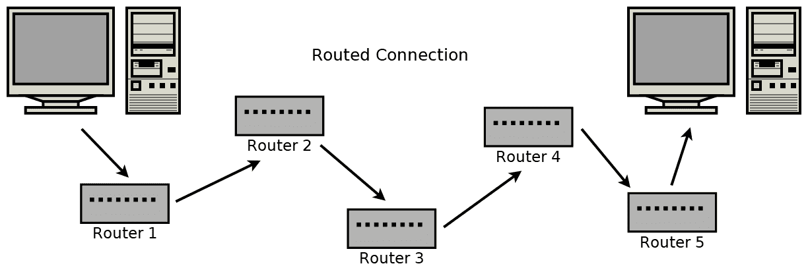

想象一下，前面图中的每个路由器都连接到成百上千个其他路由器和系统。IP 能够发现正确的路径并无缝地传输流量，这是一个惊人的成就。

Windows 包括一个名为`tracert`的实用程序，它列出了你的系统和目标系统之间的路由器。

下面是一个使用 Windows 10 上的`tracert`命令追踪到`example.com`路由的示例：

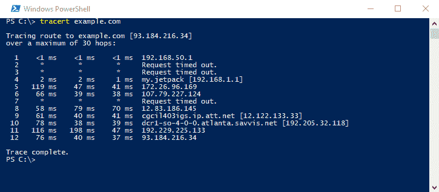

如示例所示，我们的系统和目标系统（`example.com`，`93.184.216.34`）之间有 11 个跳数。列出了许多这些中间路由器的 IP 地址，但有一些由于`Request timed out`消息而缺失。这通常意味着相关的系统不支持**互联网控制消息协议**（**ICMP**）协议的一部分。在运行`tracert`时看到几个这样的系统并不罕见。

在基于 Unix 的系统上，追踪路由的实用程序称为`traceroute`。例如，你会使用`traceroute example.com`，但获得的信息基本上是相同的。

关于`tracert`和`traceroute`的更多信息可以在第十二章找到，*网络监控和安全*。

有时，当 IP 数据包在网络之间传输时，它们的地址必须进行转换。这在使用 IPv4 时尤其常见。让我们看看这个机制的下一个部分。

# 本地网络和地址转换

家庭和组织通常会有小型的**局域网**（**LANs**）。如前所述，有一些 IPv4 地址范围是为这些小型本地网络预留的。

这些保留的私有范围如下：

+   `10.0.0.0` 至 `10.255.255.255`

+   `172.16.0.0` 至 `172.31.255.255`

+   `192.168.0.0` 至 `192.168.255.255`

当一个数据包从一个 IPv4 本地网络上的设备发出时，在它被路由到互联网之前，它必须经过**网络地址转换**（**NAT**）。实现 NAT 的路由器会记住连接是从哪个本地地址建立的。

同一局域网上的设备可以直接通过它们的本地地址相互通信。然而，任何发送到互联网的流量都必须通过路由器进行地址转换。路由器通过修改原始私有局域网 IP 地址为它的公网 IP 地址来完成这项工作：

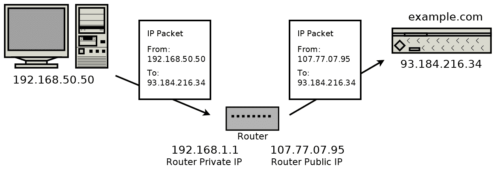

同样，当路由器接收到回传通信时，它必须将目标地址从其公网 IP 修改为原始发送者的私有 IP。因为它在第一次出站数据包后将其存储在内存中，所以它知道私有 IP 地址：


网络地址转换可能比最初看起来更复杂。除了在数据包中修改源 IP 地址外，它还必须更新数据包中的校验和。否则，数据包会被检测为包含错误并被下一个路由器丢弃。NAT 路由器还必须记住哪个私有 IP 地址发送了数据包，以便路由回复。如果没有记住转换地址，NAT 路由器就不会知道在私有网络上将回复发送到何处。

NAT 在某些情况下也会修改数据包数据。例如，在**文件传输协议**（**FTP**）中，一些连接信息作为数据包数据的一部分发送。在这些情况下，NAT 路由器将查看数据包数据，以便知道如何转发未来的入站数据包。IPv6 在很大程度上避免了 NAT 的需求，因为每个设备都有自己的公开可寻址的地址，这是可能的（也是常见的）。

你可能会想知道路由器如何知道一条消息是本地可投递的还是必须转发。这是通过使用子网掩码、子网掩码或 CIDR 来完成的。

# 子网划分和 CIDR

IP 地址可以被分成几个部分。最重要的位用于标识网络或子网络，而最不重要的位用于标识网络上的特定设备。

这与你的家庭地址可以被分割成部分的方式类似。你的家庭地址包括门牌号、街道名称和城市。城市相当于网络部分，街道名称可能是子网部分，而你的门牌号是设备部分。

IPv4 传统上使用掩码表示法来识别 IP 地址部分。例如，考虑一个位于`10.0.0.0`网络上的路由器，其子网掩码为`255.255.255.0`。这个路由器可以接收任何传入的数据包，并对其进行与子网掩码的位与操作，以确定数据包是否属于本地子网或需要转发。例如，这个路由器接收一个要发送到`10.0.0.105`的数据包。它对这个地址与子网掩码`255.255.255.0`进行位与操作，结果是`10.0.0.0`。这与路由器的子网匹配，所以流量是本地的。如果考虑一个目的地为`10.0.15.22`的数据包，与子网掩码进行位与操作的结果是`10.0.15.0`。这个地址不匹配路由器所在的子网，因此必须转发。

IPv6 使用 CIDR。网络和子网使用我们之前描述的 CIDR 表示法指定。例如，如果 IPv6 子网是`/112`，那么路由器知道任何匹配前 112 位地址的地址都在本地子网上。

到目前为止，我们只讨论了只有一个发送者和一个接收者的路由。虽然这是最常见的情况，但让我们也考虑一下其他情况。

# 组播、广播和单播

当一个数据包从一个发送者路由到单个接收者时，它使用**单播**寻址。这是最简单也是最常见的一种寻址方式。本书中我们讨论的所有协议都使用单播寻址。

**广播**寻址允许单个发送者同时将数据包发送给所有接收者。它通常用于将数据包发送到整个子网上的每个接收者。

如果广播是一对全的通信，那么**多播**就是一对多的通信。多播涉及一些群组管理，消息被寻址并发送给群组的成员。

**任播**寻址的数据包用于在不关心接收者是谁的情况下将消息发送给一个接收者。如果你有多个提供相同功能的服务器，而你只想让其中一个（你不在乎是哪一个）处理你的请求，这很有用。

IPv4 和较低的网络层支持本地广播寻址。IPv4 提供了一些可选（但通常实现）的多播支持。IPv6 强制支持多播，同时提供了比 IPv4 多播更多的功能。尽管 IPv6 不被认为是广播，但其多播功能本质上可以模拟它。

值得注意的是，这些替代寻址方法通常不适用于更广泛的互联网。想象一下，如果有一个对等体能够向所有连接的互联网设备广播一个数据包，那将是一团糟！

如果你可以在本地网络上使用 IP 多播，那么实现它是值得的。发送一个 IP 级别的多播消息比发送多次相同的单播消息节省带宽。

然而，多播通常在应用层进行。也就是说，当应用程序想要将相同的信息发送给多个接收者时，它会多次发送消息——一次发送给每个接收者。在第三章中，*TCP 连接的深入概述*，我们构建了一个聊天室。这个聊天室可以说使用了应用层多播，但它没有利用 IP 多播。

我们已经介绍了消息如何在网络中路由。现在，让我们看看消息到达特定系统后，如何知道由哪个应用程序负责处理它。

# 端口号

仅 IP 地址还不够。我们需要端口号。回到电话的比喻，如果 IP 地址是电话号码，那么端口号就像电话分机。

通常，一个 IP 地址会将数据包路由到特定的系统，但端口号用于将数据包路由到该系统上的特定应用程序。

例如，在你的系统上，你可能正在运行多个网络浏览器、电子邮件客户端和视频会议客户端。当你的计算机接收到 TCP 段或 UDP 数据报时，操作系统会查看该数据包中的目标端口号。该端口号用于查找哪个应用程序应该处理它。

端口号存储为无符号 16 位整数。这意味着它们在`0`到`65,535`之间，包括这两个数。

一些常见协议的端口号如下：

| **端口号** |  | **协议** |  |
| --- | --- | --- | --- |
| `20`, `21` | TCP | **文件传输协议** (**FTP**) |  |
| `22` | TCP | **安全外壳** (**SSH**) | 第十一章，*使用 libssh 建立 SSH 连接* |
| `23` | TCP | **Telnet** |  |
| `25` | TCP | **简单邮件传输协议** (**SMTP**) | 第八章，*让你的程序发送电子邮件* |
| `53` | UDP | **域名系统** (**DNS**) | 第五章，*主机名解析和 DNS* |
| `80` | TCP | **超文本传输协议** (**HTTP**) | 第六章，*构建简单的 Web 客户端* 第七章，*构建简单的 Web 服务器* |
| `110` | TCP | **邮局协议第 3 版** (**POP3**) |  |
| `143` | TCP | **互联网消息访问协议** (**IMAP**) |  |
| `194` | TCP | **互联网中继聊天** (**IRC**) |  |
| `443` | TCP | **通过 TLS/SSL 的 HTTP** (**HTTPS**) | 第九章，*使用 HTTPS 和 OpenSSL 加载安全网页* 第十章，*实现安全 Web 服务器* |
| `993` | TCP | **通过 TLS/SSL 的 IMAP** (**IMAPS**) |  |
| `995` | TCP | **POP3 over TLS/SSL** (**POP3S**) |  |

这些列出的端口号都是由**互联网数字分配机构**（**IANA**）分配的。它们负责为特定协议的端口号进行官方分配。对于实现自定义协议的应用程序，非官方的端口号使用非常普遍。在这种情况下，应用程序应尝试选择一个不常用的端口号，以避免冲突。

# 客户端和服务器

在电话类比中，通话必须首先由一方发起。发起方拨打接收方的电话号码，接收方接听。

这也是网络中一个常见的范式，称为**客户端-服务器**模型。在这个模型中，服务器监听连接。客户端知道服务器监听的地址和端口号，通过发送第一个数据包来建立连接。

例如，`example.com`上的 Web 服务器监听`80`端口（HTTP）和`443`端口（HTTPS）。一个网络浏览器（客户端）必须通过向 Web 服务器地址和端口发送第一个数据包来建立连接。

# 组装起来

套接字是系统之间通信链路的一端。它是一种抽象，您的应用程序可以通过网络发送和接收数据，这与您的应用程序使用文件句柄读取和写入文件的方式非常相似。

一个开放的套接字由以下五个元素组成的五元组唯一确定：

+   本地 IP 地址

+   本地端口

+   远程 IP 地址

+   远程端口

+   协议（UDP 或 TCP）

这个五元组很重要，因为它是操作系统知道哪个应用程序负责接收任何数据包的方式。例如，如果您使用两个网络浏览器同时连接到`example.com`的`80`端口，那么您的操作系统会通过查看本地 IP 地址、本地端口、远程 IP 地址、远程端口和协议来保持连接的分离。在这种情况下，本地 IP 地址、远程 IP 地址、远程端口（`80`）和协议（TCP）是相同的。

决定因素是本地端口（也称为**临时端口**），操作系统将选择一个不同的端口用于连接。这个五元组对于理解 NAT 的工作原理也很重要。一个私有网络可能有多个系统访问相同的公共资源，并且路由器 NAT 必须为每个连接存储这个五元组，以便知道如何将接收到的数据包路由回私有网络。

# 你的地址是什么？

您可以使用 Windows 上的`ipconfig`命令或基于 Unix 的系统（如 Linux 和 macOS）上的`ifconfig`命令来查找您的 IP 地址。

使用 Windows PowerShell 中的`ipconfig`命令看起来像这样：

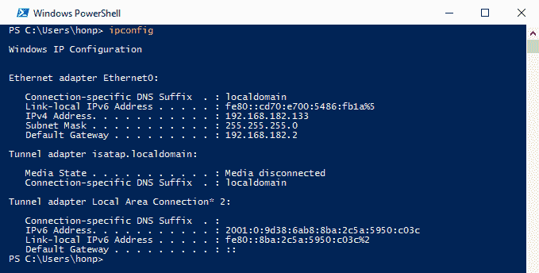

在这个例子中，你可以找到 IPv4 地址在`以太网适配器 Ethernet0`下列出。你的系统可能有更多的网络适配器，每个适配器都有自己的 IP 地址。我们可以判断这台计算机位于本地网络中，因为 IP 地址`192.168.182.133`位于私有 IP 地址范围内。

在基于 Unix 的系统上，我们使用`ifconfig`或`ip addr`命令。`ifconfig`命令是旧的方法，现在在某些系统上已弃用。`ip addr`命令是新的方法，但并非所有系统都支持它。

在 macOS 终端中使用`ifconfig`命令看起来是这样的：

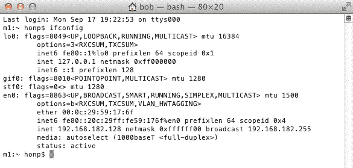

IPv4 地址列在`inet`旁边。在这种情况下，我们可以看到它是`192.168.182.128`。同样，我们看到这台计算机位于本地网络中，因为 IP 地址范围。相同的适配器在`inet6`旁边列出了 IPv6 地址。

以下截图显示了在 Ubuntu Linux 上使用`ip addr`命令的情况：

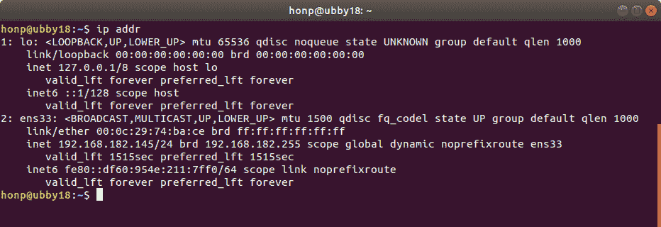

上一张截图显示了本地 IPv4 地址为`192.168.182.145`。我们还可以看到链路本地 IPv6 地址为`fe80::df60:954e:211:7ff0`。

这些命令，`ifconfig`、`ip addr`和`ipconfig`，显示了计算机上每个适配器的 IP 地址或地址。你可能有几个。如果你在一个本地网络中，你看到的 IP 地址将是你的本地私有网络 IP 地址。

如果你位于 NAT 后面，通常没有很好的方法知道你的公网 IP 地址。通常，唯一的办法是联系一个提供 API 的互联网服务器，该 API 会告诉你你的 IP 地址。

一些免费和公开的 API 如下：

+   `http://api.ipify.org/`

+   `http://helloacm.com/api/what-is-my-ip-address/`

+   `http://icanhazip.com/`

+   `http://ifconfig.me/ip`

你可以在网页浏览器中测试这些 API：

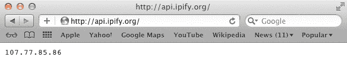

列出的每个网页都应该返回你的公网 IP 地址以及不多于其他信息。这些网站在你需要从 NAT 后面程序化地确定公网 IP 地址时很有用。我们在第六章，*构建简单的 Web 客户端*中讨论了编写能够下载这些网页和其他网页的小型 HTTP 客户端。

现在我们已经看到了确定本地 IP 地址的内置工具，接下来让我们看看如何从 C 语言中实现这一功能。

# 从 C 语言列出网络适配器

有时，让你的 C 程序知道你的本地地址是有用的。在这本书的大部分内容中，我们能够编写既适用于 Windows 也适用于基于 Unix 的系统（Linux 和 macOS）的代码。然而，列出本地地址的 API 在不同系统之间非常不同。因此，我们将这个程序分为两个：一个用于 Windows，一个用于基于 Unix 的系统。

我们将首先解决 Windows 的情况。

# 在 Windows 上列出网络适配器

Windows 网络 API 称为**Winsock**，我们将在下一章中详细介绍它。

每当我们使用 Winsock 时，我们必须做的第一件事就是初始化它。这是通过调用`WSAStartup()`来完成的。以下是一个小的 C 程序，`win_init.c`，展示了 Winsock 的初始化和清理：

```cpp
/*win_init.c*/

#include <stdio.h>
#include <winsock2.h>
#pragma comment(lib, "ws2_32.lib")

int main() {
    WSADATA d;

    if (WSAStartup(MAKEWORD(2, 2), &d)) {
        printf("Failed to initialize.\n");
        return -1;
    }

    WSACleanup();
    printf("Ok.\n");
    return 0;
}
```

`WSAStartup()`函数使用请求的版本调用，在本例中是 Winsock 2.2，以及一个`WSADATA`结构。`WSADATA`结构将由`WSAStartup()`填充，包含有关 Windows Sockets 实现的详细信息。`WSAStartup()`函数在成功时返回`0`，在失败时返回非零值。

当 Winsock 程序完成时，它应该调用`WSACleanup()`。

如果你使用 Microsoft Visual C 作为编译器，那么`#pragma comment(lib, "ws2_32.lib")`告诉 Microsoft Visual C 将可执行文件与 Winsock 库`ws2_32.lib`链接。

如果你使用 MinGW 作为编译器，则忽略该 pragma。你需要明确告诉编译器链接库，通过添加命令行选项`-lws2_32`。例如，你可以使用以下命令使用 MinGW 编译此程序：

```cpp
gcc win_init.c -o win_init.exe -lws2_32
```

我们将在第二章中更详细地介绍 Winsock 的初始化和使用，*掌握 Socket API*。

现在我们已经知道了如何初始化 Winsock，我们将开始编写一个完整的程序来列出 Windows 上的网络适配器。请参考`win_list.c`文件以了解整个过程。

首先，我们需要定义`_WIN32_WINNT`并包含所需的头文件：

```cpp
/*win_list.c*/

#ifndef _WIN32_WINNT
#define _WIN32_WINNT 0x0600
#endif

#include <winsock2.h>
#include <iphlpapi.h>
#include <ws2tcpip.h>
#include <stdio.h>
#include <stdlib.h>
```

`_WIN32_WINNT`宏必须首先定义，以便包含正确的 Windows 头文件版本。`winsock2.h`、`iphlpapi.h`和`ws2tcpip.h`是我们列出网络适配器所需的 Windows 头文件。我们还需要`stdio.h`用于`printf()`函数和`stdlib.h`用于内存分配。

接下来，我们包含以下 pragma 来告诉 Microsoft Visual C 必须与可执行文件链接哪些库：

```cpp
/*win_list.c continued*/

#pragma comment(lib, "ws2_32.lib")
#pragma comment(lib, "iphlpapi.lib")
```

如果你使用 MinGW 编译，这些行将没有效果。你需要在命令行上显式链接到这些库，例如，`gcc win_list.c -o win_list.exe -liphlpapi -lws2_32`。

然后我们进入`main()`函数，并使用前面描述的`WSAStartup()`初始化 Winsock 2.2。我们检查其返回值以检测任何错误：

```cpp
/*win_list.c continued*/

int main() {

    WSADATA d;
    if (WSAStartup(MAKEWORD(2, 2), &d)) {
        printf("Failed to initialize.\n");
        return -1;
    }
```

接下来，我们为适配器分配内存，并使用`GetAdapterAddresses()`函数从 Windows 请求适配器的地址：

```cpp
/*win_list.c continued*/

    DWORD asize = 20000;
    PIP_ADAPTER_ADDRESSES adapters;
    do {
        adapters = (PIP_ADAPTER_ADDRESSES)malloc(asize);

        if (!adapters) {
            printf("Couldn't allocate %ld bytes for adapters.\n", asize);
            WSACleanup();
            return -1;
        }

        int r = GetAdaptersAddresses(AF_UNSPEC, GAA_FLAG_INCLUDE_PREFIX, 0,
                adapters, &asize);
        if (r == ERROR_BUFFER_OVERFLOW) {
            printf("GetAdaptersAddresses wants %ld bytes.\n", asize);
            free(adapters);
        } else if (r == ERROR_SUCCESS) {
            break;
        } else {
            printf("Error from GetAdaptersAddresses: %d\n", r);
            free(adapters);
            WSACleanup();
            return -1;
        }
    } while (!adapters);
```

`asize`变量将存储我们适配器地址缓冲区的大小。一开始，我们将其设置为`20000`，并使用`malloc()`函数为`adapters`分配 20,000 字节。`malloc()`函数在失败时将返回`0`，因此我们检查这一点，如果分配失败则显示错误信息。

接下来，我们调用 `GetAdapterAddresses()`。第一个参数 `AF_UNSPEC` 告诉 Windows 我们想要 IPv4 和 IPv6 地址。你可以传入 `AF_INET` 或 `AF_INET6` 来请求只获取 IPv4 或只获取 IPv6 地址。第二个参数 `GAA_FLAG_INCLUDE_PREFIX` 是请求地址列表所必需的。下一个参数是保留的，应该传入 `0` 或 `NULL`。最后，我们传入我们的缓冲区 `adapters` 和其大小的指针 `asize`。

如果我们的缓冲区不足以存储所有地址，那么 `GetAdapterAddresses()` 将返回 `ERROR_BUFFER_OVERFLOW` 并将 `asize` 设置为所需的缓冲区大小。在这种情况下，我们释放 `adapters` 缓冲区，并使用更大的缓冲区再次尝试调用。

成功时，`GetAdapterAddresses()` 返回 `ERROR_SUCCESS`，在这种情况下，我们退出循环并继续。任何其他返回值都是错误。

当 `GetAdapterAddresses()` 成功返回时，它将在 `adapters` 中写入一个链表，其中包含每个适配器的地址信息。我们的下一步是遍历这个链表，并打印每个适配器和地址的信息：

```cpp
/*win_list.c continued*/

    PIP_ADAPTER_ADDRESSES adapter = adapters;
    while (adapter) {
        printf("\nAdapter name: %S\n", adapter->FriendlyName);

        PIP_ADAPTER_UNICAST_ADDRESS address = adapter->FirstUnicastAddress;
        while (address) {
            printf("\t%s",
                    address->Address.lpSockaddr->sa_family == AF_INET ?
                    "IPv4" : "IPv6");

            char ap[100];

            getnameinfo(address->Address.lpSockaddr,
                    address->Address.iSockaddrLength,
                    ap, sizeof(ap), 0, 0, NI_NUMERICHOST);
            printf("\t%s\n", ap);

            address = address->Next;
        }

        adapter = adapter->Next;
    }
```

我们首先定义一个新的变量 `adapter`，我们用它来遍历适配器的链表。第一个适配器在 `adapters` 的开始处，所以我们最初将 `adapter` 设置为 `adapters`。在每个循环的末尾，我们将 `adapter = adapter->Next;` 设置为获取下一个适配器。当 `adapter` 为 `0` 时，循环终止，这意味着我们已经到达了列表的末尾。

我们从 `adapter->FriendlyName` 获取适配器名称，然后使用 `printf()` 打印出来。

每个适配器的第一个地址在 `adapter->FirstUnicastAddress` 中。我们定义一个第二个指针 `address`，并将其设置为这个地址。地址也存储为链表，所以我们开始一个内部循环，遍历地址。

`address->Address.lpSockaddr->sa_family` 变量存储地址族类型。如果它被设置为 `AF_INET`，那么我们知道这是一个 IPv4 地址。否则，我们假设它是一个 IPv6 地址（在这种情况下，族是 `AF_INET6`）。

接下来，我们分配一个缓冲区 `ap` 来存储地址的文本表示。调用 `getnameinfo()` 函数将地址转换为标准表示的地址。我们将在下一章中详细介绍 `getnameinfo()`。

最后，我们可以使用 `printf()` 打印出我们缓冲区 `ap` 中的地址。

我们通过释放分配的内存并调用 `WSACleanup()` 来结束程序：

```cpp
/*win_list.c continued*/

    free(adapters);
    WSACleanup();
    return 0;
}
```

在 Windows 上，使用 MinGW，你可以使用以下命令编译和运行程序：

```cpp
gcc win_list.c -o win_list.exe -liphlpapi -lws2_32
win_list
```

它应该列出你每个适配器的名称和地址。

现在我们可以在 Windows 上列出本地 IP 地址了，让我们考虑基于 Unix 的系统上的相同任务。

# 在 Linux 和 macOS 上列出网络适配器

在类 Unix 系统上列出本地网络地址比在 Windows 上要容易一些。加载 `unix_list.c` 以便跟随。

首先，我们包含必要的系统头文件：

```cpp
/*unix_list.c*/

#include <sys/socket.h>
#include <netdb.h>
#include <ifaddrs.h>
#include <stdio.h>
#include <stdlib.h>
```

然后我们进入 `main` 函数：

```cpp
/*unix_list.c continued*/

int main() {

    struct ifaddrs *addresses;

    if (getifaddrs(&addresses) == -1) {
        printf("getifaddrs call failed\n");
        return -1;
    }
```

我们声明一个变量，`addresses`，用于存储地址。调用`getifaddrs()`函数分配内存并填充地址的链表。此函数在成功时返回`0`，在失败时返回`-1`。

接下来，我们使用一个新的指针，`address`，遍历地址的链表。考虑完每个地址后，我们将`address = address->ifa_next`设置为获取下一个地址。当`address == 0`时，我们停止循环，这发生在链表末尾：

```cpp
/*unix_list.c continued*/

    struct ifaddrs *address = addresses;
    while(address) {
        int family = address->ifa_addr->sa_family;
        if (family == AF_INET || family == AF_INET6) {

            printf("%s\t", address->ifa_name);
            printf("%s\t", family == AF_INET ? "IPv4" : "IPv6");

            char ap[100];
            const int family_size = family == AF_INET ?
                sizeof(struct sockaddr_in) : sizeof(struct sockaddr_in6);
            getnameinfo(address->ifa_addr,
                    family_size, ap, sizeof(ap), 0, 0, NI_NUMERICHOST);
            printf("\t%s\n", ap);

        }
        address = address->ifa_next;
    }
```

对于每个地址，我们识别地址族。我们感兴趣的是`AF_INET`（IPv4 地址）和`AF_INET6`（IPv6 地址）。`getifaddrs()`函数可以返回其他类型，所以我们跳过那些。

对于每个地址，我们继续打印其适配器名称和地址类型，IPv4 或 IPv6。

然后，我们定义一个缓冲区，`ap`，用于存储文本地址。调用`getnameinfo()`函数填充此缓冲区，然后我们可以打印它。我们将在下一章更详细地介绍`getnameinfo()`函数，第二章，*掌握套接字 API*。

最后，我们释放`getifaddrs()`分配的内存，我们完成了：

```cpp
/*unix_list.c continued*/

    freeifaddrs(addresses);
    return 0;
}
```

在 Linux 和 macOS 上，您可以使用以下命令编译和运行此程序：

```cpp
gcc unix_list.c -o unix_list
./unix_list
```

它应该列出您适配器的每个名称和地址。

# 摘要

在本章中，我们简要地探讨了互联网流量的路由方式。我们了解到存在两种互联网协议版本，IPv4 和 IPv6。IPv4 地址数量有限，这些地址正在耗尽。IPv6 的主要优势之一是它为每个系统提供了足够的地址空间，以便每个系统都有自己的唯一公开可路由地址。IPv4 有限的地址空间在很大程度上被路由器执行的地址转换所缓解。我们还探讨了如何使用操作系统提供的实用程序和 API 检测您的本地 IP 地址。

我们看到，用于列出本地 IP 地址的 API 在 Windows 和基于 Unix 的操作系统之间差异很大。在未来的章节中，我们将看到大多数其他网络功能在操作系统之间是相似的，我们可以编写一个在操作系统之间工作的可移植程序。

如果您没有完全掌握本章的细节，那没关系。大部分信息都是有益的背景知识，但对于大多数网络应用程序编程来说并非必需。例如，网络地址转换这样的细节由网络处理，并且通常不需要您的程序明确处理这些细节。

在下一章中，我们将通过介绍套接字编程 API 来巩固本章介绍的概念。

# 问题

尝试以下问题来测试您对本章知识的掌握：

1.  IPv4 和 IPv6 之间的主要区别是什么？

1.  使用`ipconfig`和`ifconfig`命令给出的 IP 地址与远程 Web 服务器看到的 IP 地址相同吗？

1.  什么是 IPv4 回环地址？

1.  什么是 IPv6 回环地址？

1.  域名（例如，`example.com`）是如何解析成 IP 地址的？

1.  你如何找到你的公网 IP 地址？

1.  操作系统是如何知道哪个应用程序负责处理传入的数据包的？

答案在附录 A，*问题解答*中。
