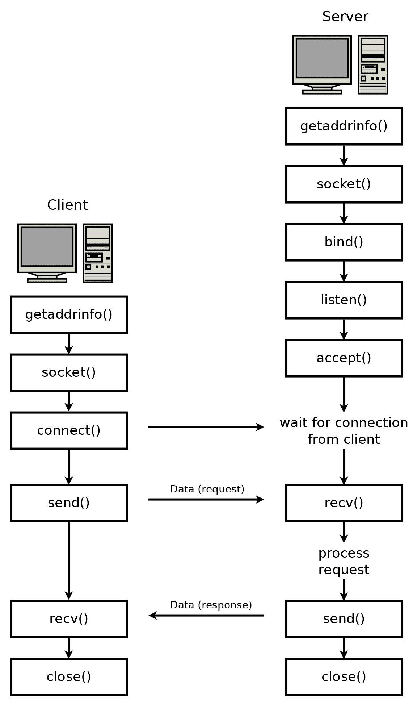
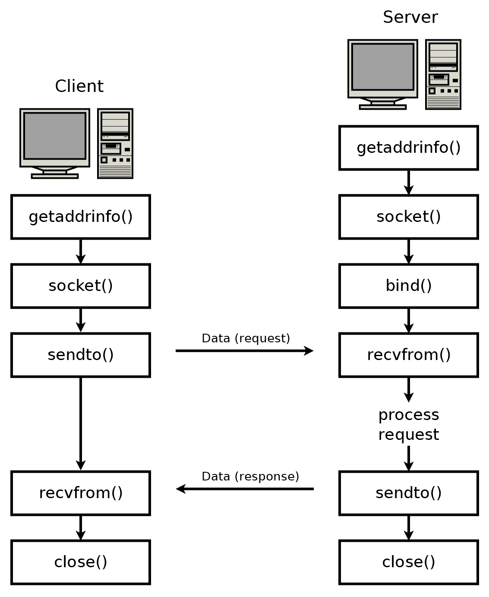
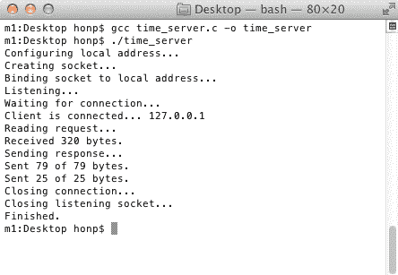
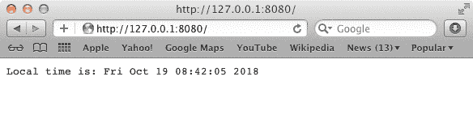
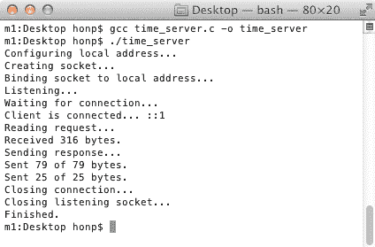
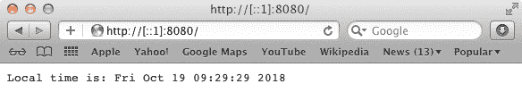
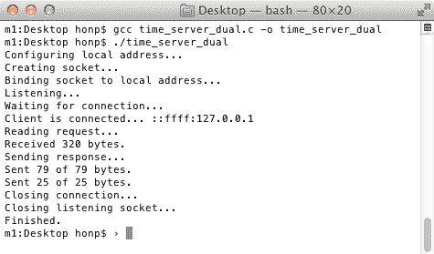
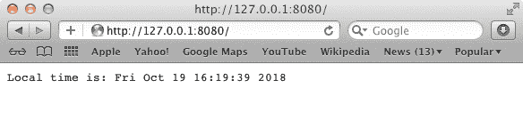

# 掌握套接字 API

在本章中，我们将真正开始学习网络编程。我们将介绍套接字的概念，并简要解释其背后的历史。我们将讨论 Windows 和类 Unix 操作系统提供的套接字 API 之间的重要差异，并回顾在套接字编程中常用的函数。本章以将一个简单的控制台程序转换为可以通过网页浏览器访问的网络程序的具体示例结束。

本章涵盖了以下主题：

+   什么是套接字？

+   套接字编程使用哪些头文件？

+   如何在 Windows、Linux 和 macOS 上编译套接字程序

+   面向连接和无连接套接字

+   TCP 和 UDP 协议

+   常见套接字函数

+   将简单的控制台程序构建成网络服务器

# 技术要求

本章中的示例程序可以使用任何现代 C 编译器编译。我们推荐在 Windows 上使用 MinGW，在 Linux 和 macOS 上使用 GCC。有关编译器设置，请参阅附录 B，*在 Windows 上设置您的 C 编译器*，附录 C，*在 Linux 上设置您的 C 编译器*，以及附录 D，*在 macOS 上设置您的 C 编译器*。

这本书的代码可以在以下位置找到：[`github.com/codeplea/Hands-On-Network-Programming-with-C`](https://github.com/codeplea/Hands-On-Network-Programming-with-C)。

从命令行，你可以使用以下命令下载本章的代码：

```cpp
git clone https://github.com/codeplea/Hands-On-Network-Programming-with-C
cd Hands-On-Network-Programming-with-C/chap02
```

本章中的每个示例程序都是独立的，每个示例都可以在 Windows、Linux 和 macOS 上运行。当为 Windows 编译时，请记住大多数示例程序都需要与 Winsock 库链接。

这可以通过向 `gcc` 传递 `-lws2_32` 选项来实现。我们提供了编译每个示例所需的精确命令，当介绍示例时。

# 什么是套接字？

套接字是系统间通信链路的一个端点。你的应用程序通过套接字发送和接收所有的网络数据。

存在几种不同的套接字**应用程序编程接口**（**API**）。第一种是伯克利套接字，它在 1983 年与 4.3BSD Unix 一起发布。伯克利套接字 API 获得了巨大的成功，并迅速演变成一个事实上的标准。从那时起，它经过少量修改后就被采纳为 POSIX 标准。术语伯克利套接字、BSD 套接字、Unix 套接字和**可移植操作系统接口**（**POSIX**）套接字通常可以互换使用。

如果你使用 Linux 或 macOS，那么你的操作系统提供了适当的伯克利套接字实现。

Windows 的套接字 API 被称为 **Winsock**。它是为了与伯克利套接字高度兼容而创建的。在这本书中，我们努力创建跨平台的代码，使其对伯克利套接字和 Winsock 都有效。

从历史上看，套接字被用于**进程间通信**（IPC）以及各种网络协议。在这本书中，我们只使用套接字与 TCP 和 UDP 进行通信。

在我们开始使用套接字之前，我们需要做一些设置。让我们直接进入正题！

# 套接字设置

在我们能够使用套接字 API 之前，我们需要包含套接字 API 头文件。这些文件取决于我们是否使用伯克利套接字或 Winsock。此外，Winsock 在使用之前需要初始化。它还要求在完成时调用清理函数。这些初始化和清理步骤在伯克利套接字中不使用。

我们将使用 C 预处理器来在 Windows 上运行适当的代码，与伯克利套接字系统相比。通过使用预处理器语句 `#if defined(_WIN32)`，我们可以在程序中包含仅在 Windows 上编译的代码。

下面是一个完整的程序，它包括每个平台所需的套接字 API 头文件，并在 Windows 上正确初始化 Winsock：

```cpp
/*sock_init.c*/

#if defined(_WIN32)
#ifndef _WIN32_WINNT
#define _WIN32_WINNT 0x0600
#endif
#include <winsock2.h>
#include <ws2tcpip.h>
#pragma comment(lib, "ws2_32.lib")

#else
#include <sys/types.h>
#include <sys/socket.h>
#include <netinet/in.h>
#include <arpa/inet.h>
#include <netdb.h>
#include <unistd.h>
#include <errno.h>

#endif

#include <stdio.h>

int main() {

#if defined(_WIN32)
    WSADATA d;
    if (WSAStartup(MAKEWORD(2, 2), &d)) {
        fprintf(stderr, "Failed to initialize.\n");
        return 1;
    }
#endif

    printf("Ready to use socket API.\n");

#if defined(_WIN32)
    WSACleanup();
#endif

    return 0;
}
```

第一部分包括 Windows 上的 `winsock.h` 和 `ws2tcpip.h`。为了 Winsock 头文件提供我们需要的所有功能，必须定义 `_WIN32_WINNT`。我们还包含了 `#pragma comment(lib,"ws2_32.lib")` 预编译语句。这告诉 Microsoft Visual C 编译器将你的程序链接到 Winsock 库，即 `ws2_32.lib`。如果你使用 MinGW 作为编译器，则 `#pragma` 被忽略。在这种情况下，你需要通过命令行使用 `-lws2_32` 选项告诉编译器链接 `ws2_32.lib`。

如果程序不是在 Windows 上编译的，那么 `#else` 之后的部分将被编译。这部分包括各种伯克利套接字 API 头文件以及在这些平台上我们需要的其他头文件。

在 `main()` 函数中，我们在 Windows 上调用 `WSAStartup()` 来初始化 Winsock。`MAKEWORD` 宏允许我们请求 Winsock 版本 2.2。如果我们的程序无法初始化 Winsock，它将打印错误消息并终止。

当使用伯克利套接字时，不需要特殊初始化，套接字 API 总是准备就绪，可以立即使用。

在我们的程序结束之前，如果我们在 Windows 上编译 Winsock，则需要调用 `WSACleanup()`。此函数允许 Windows 操作系统进行额外的清理。

在 Linux 或 macOS 上编译和运行此程序可以使用以下命令：

```cpp
gcc sock_init.c -o sock_init
./sock_init
```

在 Windows 上使用 MinGW 编译可以通过以下命令完成：

```cpp
gcc sock_init.c -o sock_init.exe -lws2_32
sock_init.exe
```

注意，使用 MinGW 需要使用 `-lws2_32` 标志来告诉编译器链接 Winsock 库，即 `ws2_32.lib`。

现在我们已经完成了开始使用套接字 API 所必需的设置，让我们更详细地看看我们将使用这些套接字做什么。

# 两种类型的套接字

套接字有两种基本类型——**面向连接**和**无连接**。这些术语指的是协议的类型。初学者有时会混淆**无连接**这个术语。当然，通过网络进行通信的两个系统在某种程度上是连接的。请记住，这些术语具有特殊含义，我们将在稍后讨论，不应暗示某些协议能够不通过连接发送数据。

今天使用的两种协议是**传输控制协议**（**TCP**）和**用户数据报协议**（**UDP**）。TCP 是一种面向连接的协议，而 UDP 是一种无连接的协议。

套接字 API 还支持其他不太常见或过时的协议，这些内容我们在这本书中不予涉及。

在无连接协议（如 UDP）中，每个数据包都是单独寻址的。从协议的角度来看，每个数据包是完全独立且与之前或之后到达的任何数据包无关的。

对于 UDP 的一个好的类比是**明信片**。当你发送明信片时，没有保证它会到达。也无法知道它是否真的到达了。如果你一次性发送很多明信片，也无法预测它们将按什么顺序到达。完全有可能你发送的第一张明信片被延误，并在最后一张明信片发送数周后才到达。

使用 UDP 时，这些相同的注意事项同样适用。UDP 不保证数据包会到达。UDP 通常不提供一种方法来知道数据包是否未到达，并且 UDP 也不保证数据包会按照发送的顺序到达。正如你所见，UDP 的可靠性并不比明信片高。事实上，你可能会认为它更不可靠，因为在使用 UDP 的情况下，单个数据包可能会重复到达两次！

如果你需要可靠的通信，你可能倾向于开发一种方案，其中为发送的每个数据包编号。对于第一个发送的数据包，编号为一，第二个发送的数据包编号为二，依此类推。你也可以要求接收方为每个数据包发送确认。当接收方收到第一个数据包时，它会发送一个回执消息，“**数据包一已接收**”。这样，接收方可以确信接收到的数据包是按正确顺序的。如果相同的包两次到达，接收方可以简单地忽略重复的副本。如果某个数据包根本未收到，发送方可以从缺失的确认中知道，并重新发送它。

这种方案本质上就是面向连接的协议，如 TCP 所做的那样。TCP 保证数据按照发送的顺序到达。它防止重复数据两次到达，并重新发送丢失的数据。它还提供了诸如连接终止时的通知和缓解网络拥塞的算法等附加功能。此外，TCP 以 UDP 之上叠加自定义可靠性方案无法达到的效率实现了这些功能。

由于这些原因，许多协议都使用 TCP。HTTP（用于提供网页服务）、FTP（用于文件传输）、SSH（用于远程管理）和 SMTP（用于发送电子邮件）都使用 TCP。我们将在接下来的章节中介绍 HTTP、SSH 和 SMTP。

UDP 被用于 DNS（用于解析域名）。它适合这个目的，因为整个请求和响应可以适合一个单独的数据包。

UDP 也常用于实时应用，如音频流、视频流和多玩家视频游戏。在实时应用中，通常没有必要重发丢失的数据包，因此 TCP 的保证是不必要的。例如，如果你正在流式传输实时视频，并且一些数据包丢失，视频将在下一个数据包到达时简单地继续。没有必要重发（甚至检测）丢失的数据包，因为视频已经超过了那个点。

在你想要发送消息而不期望从另一端得到响应的情况下，UDP 也有优势。这使得它在使用 IP 广播或多播时非常有用。另一方面，TCP 需要双向通信来提供其保证，TCP 也不与 IP 多播或广播一起工作。

如果不需要 TCP 提供的保证，那么 UDP 可以实现更高的效率。这是因为 TCP 通过对数据包编号增加了额外的开销。TCP 还必须延迟顺序错误的到达的数据包，这可能导致实时应用中不必要的延迟。然而，如果你确实需要 TCP 提供的保证，那么几乎总是更倾向于使用 TCP 而不是尝试将那些机制添加到 UDP 中。

既然我们已经了解了我们使用套接字进行通信的模型，让我们看看实际在套接字编程中使用的函数。

# 套接字函数

套接字 API 为网络编程提供了许多函数。以下是我们在本书中使用的常见套接字函数：

+   `socket()` 函数用于创建和初始化一个新的套接字。

+   `bind()` 函数将套接字与特定的本地 IP 地址和端口号关联。

+   `listen()` 函数用于服务器上，使 TCP 套接字监听新的连接。

+   `connect()` 函数用于客户端设置远程地址和端口。在 TCP 的情况下，它也建立了连接。

+   `accept()` 函数用于服务器上创建一个新的套接字以处理传入的 TCP 连接。

+   `send()` 和 `recv()` 用于通过套接字发送和接收数据。

+   `sendto()` 和 `recvfrom()` 用于在没有绑定远程地址的套接字上发送和接收数据。

+   `close()`（伯克利套接字）和 `closesocket()`（Winsock 套接字）用于关闭套接字。在 TCP 的情况下，这也终止了连接。

+   `shutdown()` 函数用于关闭 TCP 连接的一侧。它有助于确保有序地断开连接。

+   `select()` 函数用于在一个或多个套接字上等待事件。

+   `getnameinfo()` 和 `getaddrinfo()` 提供了一种与主机名和地址无关的协议方式。

+   `setsockopt()`用于更改一些套接字选项。

+   `fcntl()`（伯克利套接字）和`ioctlsocket()`（Winsock 套接字）也用于获取和设置一些套接字选项。

你可能会看到一些使用`read()`和`write()`的伯克利套接字网络程序。这些函数不能移植到 Winsock，所以我们在这里更喜欢使用`send()`和`recv()`。与伯克利套接字一起使用的其他一些常见函数是`poll()`和`dup()`。我们将避免使用这些函数，以保持我们的程序可移植。

本章后面将讨论伯克利套接字和 Winsock 套接字的其它差异。

既然我们已经了解了涉及的函数，接下来让我们考虑程序设计和流程。

# 套接字程序的结构

正如我们在第一章，“网络和协议简介”中提到的，网络编程通常使用客户端-服务器范式。在这个范式中，服务器在一个已发布的地址上监听新的连接。客户端知道服务器的地址，是建立初始连接的一方。一旦建立连接，客户端和服务器都可以发送和接收数据。这可以持续到客户端或服务器终止连接。

传统的客户端-服务器模型通常意味着客户端和服务器有不同的行为。例如，网页浏览的方式是服务器位于一个已知地址，等待连接。客户端（网页浏览器）建立连接并发送一个请求，包括它想要下载的网页或资源。然后服务器检查它是否知道如何处理这个请求，并相应地做出回应（通过发送网页）。

另一种范式是对等模型。例如，这个模型被 BitTorrent 协议使用。在对等模型中，每个对等方本质上都有相同的职责。虽然 Web 服务器被优化为从服务器向客户端发送请求的数据，但对等协议在数据在对等方之间交换上是平衡的。然而，即使在对等模型中，使用 TCP 或 UDP 的底层套接字也不尽相同。也就是说，对于每个对等连接，一个对等方在监听，另一个在连接。BitTorrent 通过有一个中央服务器（称为**追踪器**）来工作，该服务器存储了一个对等 IP 地址列表。列表上的每个对等方都同意表现得像服务器并监听新的连接。当一个新对等方想要加入群体时，它会从中央服务器请求一个对等方列表，然后尝试与列表上的对等方建立连接，同时监听来自其他对等方的新连接。总之，对等协议并不是要完全取代客户端-服务器模型；它只是预期每个对等方既是客户端也是服务器。

另一个推动客户端-服务器范式边界的常见协议是 FTP。FTP 服务器监听连接，直到 FTP 客户端连接。在初始连接之后，FTP 客户端向服务器发送命令。如果 FTP 客户端从服务器请求文件，服务器将尝试与 FTP 客户端建立新的连接以传输文件。因此，出于这个原因，FTP 客户端首先以 TCP 客户端的身份建立连接，但后来像 TCP 服务器一样接受连接。

网络程序通常可以描述为四种类型之一——TCP 服务器、TCP 客户端、UDP 服务器或 UDP 客户端。某些协议要求程序实现两种，甚至所有四种类型，但对我们来说，分别考虑这四种类型是有用的。

# TCP 程序流程

TCP 客户端程序必须首先知道 TCP 服务器的地址。这通常由用户输入。在网页浏览器的例子中，服务器地址要么是用户直接在地址栏中输入，要么是用户点击链接时已知的。TCP 客户端获取这个地址（例如，`http://example.com`），并使用`getaddrinfo()`函数将其解析为`struct addrinfo`结构。然后客户端通过调用`socket()`创建套接字。客户端随后通过调用`connect()`建立新的 TCP 连接。此时，客户端可以使用`send()`和`recv()`自由交换数据。

TCP 服务器在特定接口的特定端口号上监听连接。程序必须首先使用适当的监听 IP 地址和端口号初始化`struct addrinfo`结构。`getaddrinfo()`函数有助于以 IPv4/IPv6 独立的方式进行此操作。然后服务器通过调用`socket()`创建套接字。套接字必须绑定到监听 IP 地址和端口号。这是通过调用`bind()`实现的。

服务器程序随后调用`listen()`，这将套接字置于监听新连接的状态。然后服务器可以调用`accept()`，这将等待直到客户端与服务器建立连接。当新的连接建立后，`accept()`返回一个新的套接字。这个新的套接字可以用来通过`send()`和`recv()`与客户端交换数据。同时，第一个套接字仍然在监听新的连接，重复调用`accept()`允许服务器处理多个客户端。

从图形上看，TCP 客户端和服务器程序流程如下：



这里给出的程序流程应该作为基本客户端-服务器 TCP 程序交互的良好示例。话虽如此，在这个基本程序流程上可能会有相当大的变化。关于哪一方首先调用`send()`或`recv()`，或调用多少次，也没有规则。双方可以在连接建立后立即调用`send()`。

此外，请注意，如果 TCP 客户端对要使用的网络接口有特定要求，它可以在`connect()`之前调用`bind()`。这在具有多个网络接口的服务器上有时很重要。对于通用软件通常并不重要。

TCP 操作的其他许多变体也是可能的，我们将在第三章，“TCP 连接的深入概述”中探讨一些。

# UDP 程序流程

一个 UDP 客户端必须知道远程 UDP 对等方的地址，才能发送第一个数据包。UDP 客户端使用`getaddrinfo()`函数将地址解析为`struct addrinfo`结构。一旦完成，客户端将创建适当类型的套接字。然后，客户端可以在套接字上调用`sendto()`来发送第一个数据包。客户端可以继续在套接字上调用`sendto()`和`recvfrom()`来发送和接收额外的数据包。请注意，客户端必须使用`sendto()`发送第一个数据包。UDP 客户端不能先接收数据，因为远程对等方在没有先从客户端接收数据的情况下，将无法知道数据应该发送到哪里。这与 TCP 不同，TCP 首先通过握手建立连接。在 TCP 中，客户端或服务器都可以先发送第一个应用数据。

一个 UDP 服务器监听来自 UDP 客户端的连接。这个服务器应该使用正确的监听 IP 地址和端口号初始化`struct addrinfo`结构。可以使用`getaddrinfo()`函数以协议无关的方式完成此操作。然后，服务器使用`socket()`创建一个新的套接字，并使用`bind()`将其绑定到监听的 IP 地址和端口号。此时，服务器可以调用`recvfrom()`，这将使其阻塞，直到从 UDP 客户端接收数据。接收第一个数据后，服务器可以使用`sendto()`进行回复，或者使用`recvfrom()`监听更多数据（来自第一个客户端或任何新的客户端）。

从图形上看，UDP 客户端和服务器程序流程如下：



我们在第四章，“建立 UDP 连接”中讨论了此示例程序流程的一些变体。

我们几乎准备好开始实现我们的第一个网络程序了，但在开始之前，我们应该注意一些跨平台的问题。现在让我们来处理这个问题。

# 伯克利套接字与 Winsock 套接字

如我们之前所述，Winsock 套接字是基于伯克利套接字设计的。因此，它们之间有许多相似之处。然而，也有许多我们需要注意的差异。

在这本书中，我们将尝试创建每个程序，使其能够在 Windows 和基于 Unix 的操作系统中运行。通过定义一些 C 宏来帮助我们，这使得这个过程变得容易得多。

# 头文件

如我们之前提到的，所需的头文件在不同的实现之间有所不同。我们已经看到如何使用预处理语句轻松克服这些头文件差异。

# 套接字数据类型

在 UNIX 中，套接字描述符由标准文件描述符表示。这意味着你可以对套接字使用任何标准的 UNIX 文件 I/O 函数。在 Windows 上并非如此，所以我们简单地避免这些函数以保持可移植性。

此外，在 UNIX 中，所有文件描述符（因此也是套接字描述符）都是小的、非负整数。在 Windows 中，套接字句柄可以是任何东西。此外，在 UNIX 中，`socket()`函数返回一个`int`，而在 Windows 中返回一个`SOCKET`。`SOCKET`是 Winsock 头文件中`unsigned int`的`typedef`。作为一个解决方案，我发现将`typedef int SOCKET`或`#define SOCKET int`在非 Windows 平台上是有用的。这样，你可以在所有平台上将套接字描述符存储为`SOCKET`类型：

```cpp
#if !defined(_WIN32)
#define SOCKET int
#endif
```

# 无效套接字

在 Windows 上，如果`socket()`失败，则返回`INVALID_SOCKET`。在 Unix 上，如果`socket()`失败，则返回一个负数。这尤其成问题，因为 Windows 的`SOCKET`类型是无符号的。我发现定义一个宏来指示套接字描述符是否有效是有用的：

```cpp
#if defined(_WIN32)
#define ISVALIDSOCKET(s) ((s) != INVALID_SOCKET)
#else
#define ISVALIDSOCKET(s) ((s) >= 0)
#endif
```

# 关闭套接字

在 Unix 系统中，所有套接字也都是标准文件描述符。因此，Unix 系统上的套接字可以使用标准的`close()`函数关闭。在 Windows 上，则使用特殊的关闭函数——`closesocket()`。使用宏抽象出这种差异是有用的：

```cpp
#if defined(_WIN32)
#define CLOSESOCKET(s) closesocket(s)
#else
#define CLOSESOCKET(s) close(s)
#endif
```

# 错误处理

当套接字函数，如`socket()`、`bind()`、`accept()`等，在 Unix 平台上出现错误时，错误号会被存储在线程全局的`errno`变量中。在 Windows 上，可以通过调用`WSAGetLastError()`来检索错误号。同样，我们可以使用宏来抽象出这种差异：

```cpp
#if defined(_WIN32)
#define GETSOCKETERRNO() (WSAGetLastError())
#else
#define GETSOCKETERRNO() (errno)
#endif

```

除了获取错误代码外，检索错误条件的文本描述通常也很有用。请参阅第十三章，*套接字编程技巧与陷阱*，了解如何进行此操作。

在这些辅助宏处理完毕后，让我们深入到我们的第一个真正的套接字程序。

# 我们的第一个程序

现在我们对套接字 API 和网络程序的结构有了基本了解，我们准备开始我们的第一个程序。通过构建一个实际的真实世界程序，我们将学习套接字编程实际工作的有用细节。

作为示例任务，我们将构建一个可以告诉你现在是什么时间的 Web 服务器。这对于任何需要知道现在时间的智能手机或网页浏览器的用户来说可能是一个有用的资源。他们只需导航到我们的网页，就可以找到答案。这是一个很好的入门示例，因为它做了一些有用的事情，但仍然足够简单，不会分散我们对网络编程的学习。

# 一个激励性的例子

在我们开始编写联网程序之前，先解决我们的简单控制台程序问题是有用的。一般来说，在添加联网功能之前，在本地解决程序的功能是一个好主意。

我们的时间显示程序的本地、控制台版本如下：

```cpp
/*time_console.c*/

#include <stdio.h>
#include <time.h>

int main()
{
    time_t timer;
    time(&timer);

    printf ("Local time is: %s", ctime(&timer));

    return 0;
}
```

你可以像这样编译和运行它：

```cpp
$ gcc time_console.c -o time_console
$ ./time_console
Local time is: Fri Oct 19 08:42:05 2018
```

该程序通过使用内置的 C `time()`函数获取时间，然后使用`ctime()`函数将其转换为字符串。

# 使其联网

现在我们已经确定了程序的功能，我们可以开始编写相同程序的联网版本。

首先，我们需要包含所需的头文件：

```cpp
/*time_server.c*/

#if defined(_WIN32)
#ifndef _WIN32_WINNT
#define _WIN32_WINNT 0x0600
#endif
#include <winsock2.h>
#include <ws2tcpip.h>
#pragma comment(lib, "ws2_32.lib")

#else
#include <sys/types.h>
#include <sys/socket.h>
#include <netinet/in.h>
#include <arpa/inet.h>
#include <netdb.h>
#include <unistd.h>
#include <errno.h>

#endif
```

如我们之前讨论的，这检测编译器是否在 Windows 上运行，并为它运行的平台包含适当的头文件。

我们还定义了一些宏，这些宏抽象出了伯克利套接字和 Winsock API 之间的一些差异：

```cpp
/*time_server.c continued*/

#if defined(_WIN32)
#define ISVALIDSOCKET(s) ((s) != INVALID_SOCKET)
#define CLOSESOCKET(s) closesocket(s)
#define GETSOCKETERRNO() (WSAGetLastError())

#else
#define ISVALIDSOCKET(s) ((s) >= 0)
#define CLOSESOCKET(s) close(s)
#define SOCKET int
#define GETSOCKETERRNO() (errno)
#endif
```

我们需要几个标准 C 头文件，希望原因很明显：

```cpp
/*time_server.c continued*/

#include <stdio.h>
#include <string.h>
#include <time.h>
```

现在，我们准备开始编写`main()`函数。如果我们在 Windows 上编译，`main()`函数首先会初始化 Winsock：

```cpp
/*time_server.c continued*/

int main() {

#if defined(_WIN32)
    WSADATA d;
    if (WSAStartup(MAKEWORD(2, 2), &d)) {
        fprintf(stderr, "Failed to initialize.\n");
        return 1;
    }
#endif
```

我们现在必须确定我们的 Web 服务器应该绑定的本地地址：

```cpp
/*time_server.c continued*/

    printf("Configuring local address...\n");
    struct addrinfo hints;
    memset(&hints, 0, sizeof(hints));
    hints.ai_family = AF_INET;
    hints.ai_socktype = SOCK_STREAM;
    hints.ai_flags = AI_PASSIVE;

    struct addrinfo *bind_address;
    getaddrinfo(0, "8080", &hints, &bind_address);
```

我们使用`getaddrinfo()`将所需信息填充到`struct addrinfo`结构中。`getaddrinfo()`函数接受一个`hints`参数，它告诉它我们在寻找什么。在这种情况下，我们首先使用`memset()`将`hints`清零。然后，我们设置`ai_family = AF_INET`。`AF_INET`指定我们正在寻找一个 IPv4 地址。我们可以使用`AF_INET6`来使我们的 Web 服务器监听 IPv6 地址（关于这一点稍后讨论）。

接下来，我们设置`ai_socktype = SOCK_STREAM`。这表示我们将使用 TCP。如果我们正在做 UDP 服务器，将使用`SOCK_DGRAM`。最后，`ai_flags = AI_PASSIVE`被设置。这告诉`getaddrinfo()`我们希望它绑定到通配符地址。也就是说，我们要求`getaddrinfo()`设置地址，以便我们可以在任何可用的网络接口上监听。

一旦正确设置了`hints`，我们就声明一个指向`struct addrinfo`结构的指针，该结构保存了`getaddrinfo()`函数的返回信息。然后我们调用`getaddrinfo()`函数。`getaddrinfo()`函数有很多用途，但就我们的目的而言，它生成一个适合`bind()`的地址。为了使其生成这个地址，我们必须将第一个参数传递为`NULL`，并在`hints.ai_flags`中设置`AI_PASSIVE`标志。

`getaddrinfo()` 的第二个参数是我们监听连接的端口。标准的 HTTP 服务器会使用端口 `80`。然而，只有 Unix-like 操作系统上的特权用户才能绑定端口 `0` 到 `1023`。这里端口号的选择是任意的，但我们使用 `8080` 来避免问题。如果您以超级用户权限运行，如果您喜欢，可以随意将端口号更改为 `80`。请记住，一次只能有一个程序绑定到特定的端口。如果您尝试使用已被占用的端口，则 `bind()` 调用将失败。在这种情况下，只需将端口号更改为其他值并再次尝试即可。

常见的情况是程序在这里不使用 `getaddrinfo()`。相反，它们直接填充 `struct addrinfo` 结构。使用 `getaddrinfo()` 的优点是它是协议无关的。使用 `getaddrinfo()` 使得将我们的程序从 IPv4 转换为 IPv6 变得非常容易。实际上，我们只需要将 `AF_INET` 更改为 `AF_INET6`，我们的程序就可以在 IPv6 上运行。如果我们直接填充 `struct addrinfo` 结构，我们需要对程序进行许多繁琐的更改才能将其转换为 IPv6。

既然我们已经确定了我们的本地地址信息，我们就可以创建套接字：

```cpp
/*time_server.c continued*/

    printf("Creating socket...\n");
    SOCKET socket_listen;
    socket_listen = socket(bind_address->ai_family,
            bind_address->ai_socktype, bind_address->ai_protocol);
```

在这里，我们将 `socket_listen` 定义为 `SOCKET` 类型。回想一下，`SOCKET` 是 Windows 上的 Winsock 类型，而在其他平台上，我们使用宏将其定义为 `int`。我们调用 `socket()` 函数来生成实际的套接字。`socket()` 函数接受三个参数：套接字族、套接字类型和套接字协议。我们在调用 `socket()` 之前使用 `getaddrinfo()` 的原因是我们现在可以将 `bind_address` 的部分作为 `socket()` 的参数传递。再次强调，这使得在不进行重大重写的情况下更改我们程序的协议变得非常容易。

常见的情况是程序首先调用 `socket()`。这种做法的问题在于，它使得程序变得更加复杂，因为必须多次输入套接字族、类型和协议。像我们这里这样组织程序会更好。

我们应该检查 `socket()` 的调用是否成功：

```cpp
/*time_server.c continued*/ 

   if (!ISVALIDSOCKET(socket_listen)) {
       fprintf(stderr, "socket() failed. (%d)\n", GETSOCKETERRNO());
        return 1;
    }
```

我们可以使用我们之前定义的 `ISVALIDSOCKET()` 宏来检查 `socket_listen` 是否有效。如果套接字无效，我们打印一条错误信息。我们的 `GETSOCKETERRNO()` 宏用于以跨平台的方式检索错误号。

在套接字成功创建之后，我们可以调用 `bind()` 来将其与 `getaddrinfo()` 中的地址关联：

```cpp
/*time_server.c continued*/

    printf("Binding socket to local address...\n");
    if (bind(socket_listen,
                bind_address->ai_addr, bind_address->ai_addrlen)) {
        fprintf(stderr, "bind() failed. (%d)\n", GETSOCKETERRNO());
        return 1;
    }
    freeaddrinfo(bind_address);
```

`bind()` 在成功时返回 `0`，在失败时返回非零值。如果它失败了，我们会像处理 `socket()` 上的错误一样打印错误号。如果我们要绑定的端口已被占用，`bind()` 将失败。在这种情况下，要么关闭使用该端口的程序，要么更改您的程序以使用不同的端口。

在我们将地址绑定到 `bind_address` 之后，我们可以调用 `freeaddrinfo()` 函数来释放地址内存。

一旦创建并绑定到本地地址的套接字，我们可以使用`listen()`函数让它开始监听连接：

```cpp
/*time_server.c continued*/

    printf("Listening...\n");
    if (listen(socket_listen, 10) < 0) {
        fprintf(stderr, "listen() failed. (%d)\n", GETSOCKETERRNO());
        return 1;
    }
```

`listen()`的第二个参数，在这个例子中是`10`，告诉`listen()`它可以允许多少个连接排队。如果许多客户端同时连接到我们的服务器，而我们处理它们不够快，那么操作系统开始排队这些传入的连接。如果`10`个连接排队，那么操作系统将拒绝新的连接，直到我们从现有队列中移除一个。

`listen()`的错误处理方式与我们对`bind()`和`socket()`的处理方式相同。

在套接字开始监听连接后，我们可以使用`accept()`函数接受任何传入的连接：

```cpp
/*time_server.c continued*/

    printf("Waiting for connection...\n");
    struct sockaddr_storage client_address;
    socklen_t client_len = sizeof(client_address);
    SOCKET socket_client = accept(socket_listen,
            (struct sockaddr*) &client_address, &client_len);
    if (!ISVALIDSOCKET(socket_client)) {
        fprintf(stderr, "accept() failed. (%d)\n", GETSOCKETERRNO());
        return 1;
    }
```

`accept()`有几个功能。首先，当它被调用时，它将阻塞你的程序，直到建立新的连接。换句话说，你的程序将休眠，直到连接到监听套接字。当建立新的连接时，`accept()`将为它创建一个新的套接字。你的原始套接字继续监听新的连接，但`accept()`返回的新套接字可以用来通过新建立的连接发送和接收数据。`accept()`还填充了连接客户端的地址信息。

在调用`accept()`之前，我们必须声明一个新的`struct sockaddr_storage`变量来存储连接客户端的地址信息。`struct sockaddr_storage`类型保证足够大，可以容纳系统上支持的最大地址。我们还必须告诉`accept()`我们传递的地址缓冲区的大小。当`accept()`返回时，它将用连接客户端的地址填充`client_address`，并用该地址的长度填充`client_len`。`client_len`的值取决于连接是使用 IPv4 还是 IPv6。

我们将`accept()`的返回值存储在`socket_client`中。我们通过检测`client_socket`是否是一个有效的套接字来检查错误。这与我们对`socket()`的处理方式完全相同。

在这个阶段，已经与远程客户端建立了一个 TCP 连接。我们可以将客户端的地址打印到控制台：

```cpp
/*time_server.c continued*/

    printf("Client is connected... ");
    char address_buffer[100];
    getnameinfo((struct sockaddr*)&client_address,
            client_len, address_buffer, sizeof(address_buffer), 0, 0,
            NI_NUMERICHOST);
    printf("%s\n", address_buffer);
```

这一步完全是可选的，但将网络连接记录在某个地方是一个好的实践。

`getnameinfo()`接受客户端的地址和地址长度。地址长度是必需的，因为`getnameinfo()`可以与 IPv4 和 IPv6 地址一起工作。然后我们传递一个输出缓冲区和缓冲区长度。这是`getnameinfo()`将主机名输出写入的缓冲区。接下来的两个参数指定第二个缓冲区和其长度。`getnameinfo()`将服务名输出到这个缓冲区。我们对此不感兴趣，所以为这两个参数传递了`0`。最后，我们传递了`NI_NUMERICHOST`标志，指定我们希望以 IP 地址的形式看到主机名。

由于我们正在编写一个 Web 服务器，我们期望客户端（例如，一个 Web 浏览器）发送给我们一个 HTTP 请求。我们使用 `recv()` 函数读取这个请求：

```cpp
/*time_server.c continued*/

    printf("Reading request...\n");
    char request[1024];
    int bytes_received = recv(socket_client, request, 1024, 0);
    printf("Received %d bytes.\n", bytes_received);
```

我们定义了一个请求缓冲区，以便我们可以存储浏览器的 HTTP 请求。在这种情况下，我们分配了 1,024 字节给它，这对于这个应用程序来说应该足够了。然后使用客户端套接字、请求缓冲区和请求缓冲区大小调用 `recv()`。`recv()` 返回接收到的字节数。如果还没有收到任何内容，`recv()` 将阻塞，直到有内容。如果连接被客户端终止，`recv()` 返回 `0` 或 `-1`，具体取决于情况。在这里我们忽略这种情况以简化问题，但在生产环境中你应该始终检查 `recv() > 0`。`recv()` 的最后一个参数是标志。由于我们不做任何特殊的事情，我们简单地传递 `0`。

我们收到的客户请求应遵循正确的 HTTP 协议。我们将在第六章，*构建简单的 Web 客户端*，和第七章，*构建简单的 Web 服务器*中详细介绍 HTTP，在那里我们将处理 Web 客户端和服务器。一个真正的 Web 服务器需要解析请求并查看浏览器请求的是哪个资源。我们的 Web 服务器只有一个功能——告诉我们现在是什么时间。所以，现在我们只是完全忽略这个请求。

如果你想要将浏览器的请求打印到控制台，你可以这样做：

```cpp
    printf("%.*s", bytes_received, request);
```

注意我们使用的是 `printf()` 格式字符串，`"%.*s"`。这告诉 `printf()` 我们想要打印特定数量的字符——`bytes_received`。尝试直接将 `recv()` 接收到的数据作为 C 字符串打印是一个常见的错误。从 `recv()` 接收到的数据没有保证是空终止的！如果你尝试用 `printf(request)` 或 `printf("%s", request)` 打印它，你很可能会收到一个段错误错误（或者最多打印一些垃圾）。

现在，Web 浏览器已经发送了它的请求，我们可以发送我们的响应回：

```cpp
/*time_server.c continued*/

    printf("Sending response...\n");
    const char *response =
        "HTTP/1.1 200 OK\r\n"
        "Connection: close\r\n"
        "Content-Type: text/plain\r\n\r\n"
        "Local time is: ";
    int bytes_sent = send(socket_client, response, strlen(response), 0);
    printf("Sent %d of %d bytes.\n", bytes_sent, (int)strlen(response));
```

首先，我们将 `char *response` 设置为一个标准的 HTTP 响应头和我们的消息的开始（`Local time is:`）。我们将在第六章，*构建简单的 Web 客户端*，和第七章，*构建简单的 Web 服务器*中详细讨论 HTTP。现在，知道这个响应告诉浏览器三件事——你的请求是有效的；服务器将在所有数据发送完毕后关闭连接，你接收到的数据将是纯文本。

HTTP 响应头以一个空白行结束。HTTP 要求行结束以回车字符后跟换行字符的形式出现。所以，我们响应中的空白行是 `\r\n`。空白行之后的字符串部分，`Local time is:`，被浏览器视为纯文本。

我们使用`send()`函数将数据发送到客户端。这个函数接受客户端的套接字、要发送的数据的指针以及要发送的数据长度。`send()`的最后一个参数是标志。我们不需要做任何特殊的事情，所以我们传入`0`。

`send()`返回发送的字节数。你应该通常检查发送的字节数是否符合预期，如果不一致，你应该尝试发送剩余的数据。这里为了简单起见，我们忽略这个细节。（此外，我们只尝试发送几个字节；如果`send()`无法处理，那么可能非常严重的问题，重新发送也不会有帮助。）

在发送 HTTP 头和我们的消息的开始之后，我们可以发送实际的时间。我们以与`time_console.c`中相同的方式获取本地时间，并使用`send()`发送它：

```cpp
/*time_server.c continued*/

    time_t timer;
    time(&timer);
    char *time_msg = ctime(&timer);
    bytes_sent = send(socket_client, time_msg, strlen(time_msg), 0);
    printf("Sent %d of %d bytes.\n", bytes_sent, (int)strlen(time_msg));
```

我们必须关闭客户端连接，以向浏览器表明我们已经发送了所有数据：

```cpp
/*time_server.c continued*/

    printf("Closing connection...\n");
    CLOSESOCKET(socket_client);
```

如果我们不关闭连接，浏览器将等待更多数据，直到超时。

在这一点上，我们可以调用`socket_listen`上的`accept()`来接受额外的连接。这正是真实服务器会做的事情。然而，由于这是一个快速示例程序，我们将关闭监听套接字并终止程序：

```cpp
/*time_server.c continued*/

    printf("Closing listening socket...\n");
    CLOSESOCKET(socket_listen);

#if defined(_WIN32)
    WSACleanup();
#endif

    printf("Finished.\n");

    return 0;
}
```

这就是完整的程序。编译并运行它后，你可以使用网页浏览器导航到它，它将显示当前时间。

在 Linux 和 macOS 上，你可以这样编译和运行程序：

```cpp
gcc time_server.c -o time_server
./time_server
```

在 Windows 上，你可以使用 MinGW 编译和运行，以下是一些命令：

```cpp
gcc time_server.c -o time_server.exe -lws2_32
time_server
```

当你运行程序时，它会等待连接。你可以打开一个网页浏览器，导航到`http://127.0.0.1:8080`来加载网页。记住`127.0.0.1`是 IPv4 回环地址，它连接到运行程序的同台机器。URL 中的`:8080`部分指定了要连接的端口号。如果省略了这部分，你的浏览器将默认连接到端口`80`，这是 HTTP 连接的标准。

如果你编译并运行程序，然后在同一台计算机上使用网页浏览器连接到它，你应该看到以下内容：



这里是连接到我们`time_server`程序端口`8080`的网页浏览器：



# 使用 IPv6

请回忆一下在`main()`函数开头附近的`time_server.c`中的`hints.ai_family = AF_INET`部分。如果这一行改为`hints.ai_family = AF_INET6`，那么你的网络服务器将监听 IPv6 连接而不是 IPv4 连接。这个修改后的文件包含在 GitHub 仓库中，文件名为`time_server_ipv6.c`。

在这种情况下，你应该使用你的网络浏览器导航到`http://[::1]:8080`以查看网页。`::1`是 IPv6 回环地址，它告诉网络浏览器连接到运行它的同一台机器。为了在 URL 中使用 IPv6 地址，你需要将它们放在方括号`[]`中。`:8080`指定端口号，这与我们为 IPv4 示例所做的方式相同。

这里是编译、运行并将网络浏览器连接到我们的`time_server_ipv6`程序时应看到的内容：



这里是使用 IPv6 套接字连接到我们服务器的网络浏览器：



查看`time_server_ipv6.c`以获取完整的程序。

# 支持 IPv4 和 IPv6

监听的 IPv6 套接字也可以接受使用双栈套接字的 IPv4 连接。并非所有操作系统都支持双栈套接字。特别是 Linux，不同发行版之间的支持情况各不相同。如果你的操作系统支持双栈套接字，那么我强烈建议使用此功能实现你的服务器程序。这允许你的程序与 IPv4 和 IPv6 对等方通信，而无需你进行额外的工作。

我们可以修改`time_server_ipv6.c`以使用双栈套接字，只需进行微小的添加。在调用`socket()`之后和调用`bind()`之前，我们必须清除套接字上的`IPV6_V6ONLY`标志。这是通过`setsockopt()`函数完成的：

```cpp
/*time_server_dual.c excerpt*/

    int option = 0;
    if (setsockopt(socket_listen, IPPROTO_IPV6, IPV6_V6ONLY, (void*)&option, sizeof(option))) {
        fprintf(stderr, "setsockopt() failed. (%d)\n", GETSOCKETERRNO());
        return 1;
    }
```

我们首先将`option`声明为整数并将其设置为`0`。`IPV6_V6ONLY`默认启用，所以我们通过将其设置为`0`来清除它。在监听套接字上调用`setsockopt()`。我们传入`IPPROTO_IPV6`来告诉它我们在操作套接字的哪个部分，并传入`IPV6_V6ONLY`来告诉它我们正在设置哪个标志。然后我们传入一个指向我们的选项的指针及其长度。`setsockopt()`在成功时返回`0`。

Windows Vista 及以后的版本支持双栈套接字。然而，许多 Windows 头文件缺少`IPV6_V6ONLY`的定义。因此，在文件顶部包含以下代码片段可能是有意义的：

```cpp
/*time_server_dual.c excerpt*/

#if !defined(IPV6_V6ONLY)
#define IPV6_V6ONLY 27
#endif
```

请记住，套接字最初需要被创建为 IPv6 套接字。这可以通过我们代码中的`hints.ai_family = AF_INET6`行来完成。

当一个 IPv4 对等方连接到我们的双栈服务器时，连接会被重映射到 IPv6 连接。这会自动发生，并由操作系统处理。当你的程序看到客户端 IP 地址时，它仍然会以一个特殊的 IPv6 地址呈现。这些地址由 IPv6 地址表示，其中前 96 位是前缀——`0:0:0:0:0:ffff`。地址的最后 32 位用于存储 IPv4 地址。例如，如果一个客户端使用 IPv4 地址`192.168.2.107`连接，那么你的双栈服务器会将其视为 IPv6 地址`::ffff.192.168.2.107`。

这里是编译、运行并连接到`time_server_dual`时的样子：



这是一个通过回环 IPv4 地址连接到我们的 `time_server_dual` 程序的网页浏览器：



注意到浏览器正在导航到 IPv4 地址 `127.0.0.1`，但我们可以在控制台上看到服务器将连接视为来自 IPv6 地址 `::ffff:127.0.0.1`。

查看 `time_server_dual.c` 以获取完整的双栈套接字服务器。

# 使用 inetd 进行网络

在类 Unix 系统上，例如 Linux 或 macOS，可以使用名为 *inetd* 的服务将仅控制台应用程序转换为网络应用程序。您可以使用程序的位置、端口号、协议（TCP 或 UDP）以及您希望其运行的用户的配置 *inetd*（使用 `/etc/inetd.conf`）。然后 *inetd* 将在您指定的端口上监听连接。一旦 *inetd* 接受传入连接，它将启动您的程序并将所有套接字输入/输出通过 `stdin` 和 `stdout` 重定向。

使用 *inetd*，我们可以将 `time_console.c` 的行为修改得像 `time_server.c`，只需进行非常小的改动。我们只需要添加一个额外的 `printf()` 函数用于 HTTP 响应头，从 `stdin` 读取，并配置 *inetd*。

您可能可以通过 Cygwin 或 Windows Subsystem for Linux 在 Windows 上使用 *inetd*。

# 摘要

在本章中，我们学习了使用套接字进行网络编程的基础。尽管伯克利套接字（用于类 Unix 操作系统）和 Winsock 套接字（用于 Windows）之间存在许多差异，但我们通过预处理语句来缓解这些差异。这样，我们就可以编写一个可以在 Windows、Linux 和 macOS 上干净编译的程序。

我们介绍了 UDP 协议是无连接的，以及这意味着什么。我们了解到，作为面向连接的协议，TCP 提供了一些可靠性保证，例如自动检测和重发丢失的数据包。我们还看到 UDP 常用于简单的协议（例如 DNS）和实时流媒体应用程序。TCP 用于大多数其他协议。

之后，我们通过将控制台应用程序转换为网络服务器来处理了一个真实示例。我们学习了如何使用 `getaddrinfo()` 函数编写程序，以及为什么这对于使程序 IPv4/IPv6 无关很重要。我们在服务器上使用 `bind()`、`listen()` 和 `accept()` 等待来自网络浏览器的传入连接。然后使用 `recv()` 从客户端读取数据，并使用 `send()` 发送回复。最后，我们使用 `close()`（在 Windows 上为 `closesocket()`）终止连接。

当我们构建网络服务器 `time_server.c` 时，我们覆盖了很多内容。如果你没有完全理解也没有关系。我们将在第三章 An In-Depth Overview of TCP Connections 和本书的其余部分重新访问许多这些函数。

在下一章，第三章，*TCP 连接的深入概述*，我们将更深入地探讨 TCP 连接的编程。

# 问题

尝试这些问题来测试你对本章知识的掌握：

1.  什么是套接字？

1.  什么是无连接协议？什么是面向连接的协议？

1.  UDP 是无连接协议还是面向连接的协议？

1.  TCP 是无连接协议还是面向连接的协议？

1.  哪些类型的应用通常从使用 UDP 协议中获益？

1.  哪些类型的应用通常从使用 TCP 协议中获益？

1.  TCP 是否保证数据能够成功传输？

1.  哪些是伯克利套接字和 Winsock 套接字之间的一些主要区别？

1.  `bind()`函数的作用是什么？

1.  `accept()`函数的作用是什么？

1.  在 TCP 连接中，是客户端还是服务器首先发送应用数据？

答案在附录 A，*问题答案*中。
