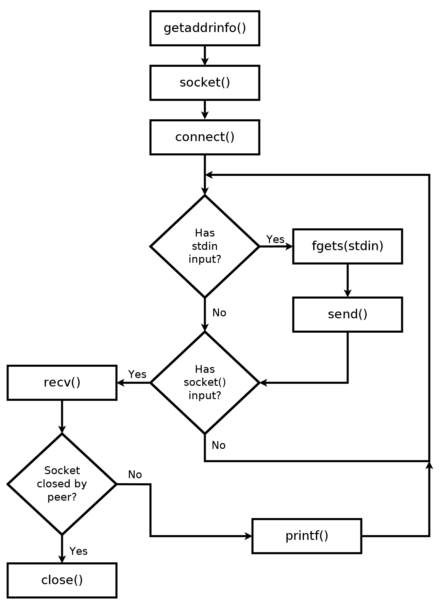
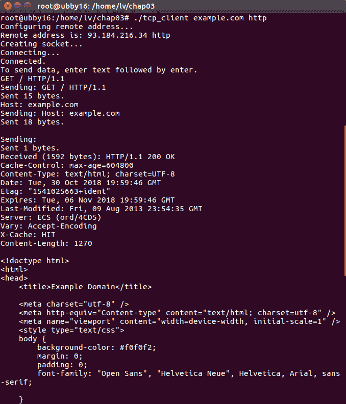
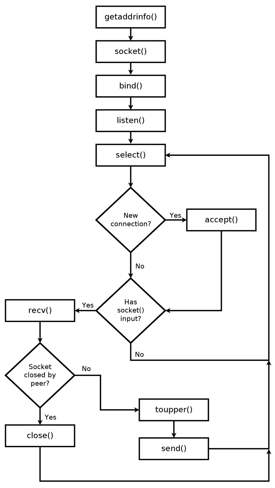
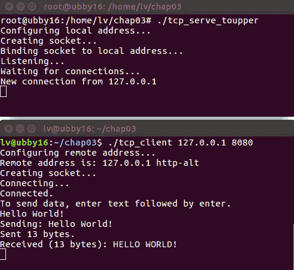
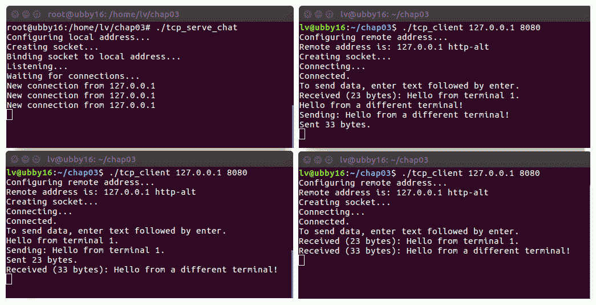

# TCP 连接的深入概述

在第二章，*掌握套接字 API*中，我们实现了一个简单的 TCP 服务器，该服务器使用 HTTP 提供网页服务。在本章中，我们将首先实现一个 TCP 客户端。这个客户端能够与任何监听的 TCP 服务器建立 IPv4 或 IPv6 TCP 连接。它将是一个有用的调试工具，我们可以在本书的其余部分中重用它。

我们上一章的 TCP 服务器仅限于接受一个连接。在本章中，我们将探讨多路复用技术，以便我们的程序能够同时处理多个单独的连接。

本章涵盖了以下主题：

+   使用`getaddrinfo()`配置远程地址

+   使用`connect()`初始化 TCP 连接

+   以非阻塞方式检测终端输入

+   使用`fork()`进行多路复用

+   使用`select()`进行多路复用

+   检测对等端断开连接

+   实现一个非常基本的微服务

+   TCP 的流式特性

+   `send()`的阻塞行为

# 技术要求

本章的示例程序可以使用任何现代 C 编译器编译。我们推荐在 Windows 上使用 MinGW，在 Linux 和 macOS 上使用 GCC。有关编译器设置的详细信息，请参阅附录 B，*在 Windows 上设置您的 C 编译器*，附录 C，*在 Linux 上设置您的 C 编译器*，以及附录 D，*在 macOS 上设置您的 C 编译器*。

本书代码可在本书的 GitHub 仓库中找到：[`github.com/codeplea/Hands-On-Network-Programming-with-C`](https://github.com/codeplea/Hands-On-Network-Programming-with-C)。

从命令行，你可以使用以下命令下载本章的代码：

```cpp
git clone https://github.com/codeplea/Hands-On-Network-Programming-with-C
cd Hands-On-Network-Programming-with-C/chap03
```

本章中的每个示例程序都在 Windows、Linux 和 macOS 上运行。在 Windows 上编译时，每个示例程序都需要链接 Winsock 库。这可以通过将`-lws2_32`选项传递给`gcc`来实现。

我们提供了编译每个示例所需的精确命令，正如它被介绍的那样。

本章中的所有示例程序都需要我们在第二章，*掌握套接字 API*中开发的相同头文件和 C 宏。为了简洁起见，我们将这些语句放在一个单独的头文件`chap03.h`中，我们可以在每个程序中包含它。有关这些语句的解释，请参阅第二章，*掌握套接字 API*。

`chap03.h`的内容如下：

```cpp
/*chap03.h*/

#if defined(_WIN32)
#ifndef _WIN32_WINNT
#define _WIN32_WINNT 0x0600
#endif
#include <winsock2.h>
#include <ws2tcpip.h>
#pragma comment(lib, "ws2_32.lib")

#else
#include <sys/types.h>
#include <sys/socket.h>
#include <netinet/in.h>
#include <arpa/inet.h>
#include <netdb.h>
#include <unistd.h>
#include <errno.h>

#endif

#if defined(_WIN32)
#define ISVALIDSOCKET(s) ((s) != INVALID_SOCKET)
#define CLOSESOCKET(s) closesocket(s)
#define GETSOCKETERRNO() (WSAGetLastError())

#else
#define ISVALIDSOCKET(s) ((s) >= 0)
#define CLOSESOCKET(s) close(s)
#define SOCKET int
#define GETSOCKETERRNO() (errno)
#endif

#include <stdio.h>
#include <string.h>
```

# 多路复用 TCP 连接

默认情况下，套接字 API 是阻塞的。当你使用`accept()`等待传入连接时，你的程序执行将被阻塞，直到实际有新的传入连接可用。当你使用`recv()`读取传入数据时，你的程序执行将被阻塞，直到实际有新数据可用。

在上一章中，我们构建了一个简单的 TCP 服务器。这个服务器只接受一个连接，并且只从这个连接中读取一次数据。当时阻塞不是问题，因为我们的服务器除了为其唯一的客户端提供服务外，没有其他目的。

然而，在一般情况下，阻塞 I/O 可能是一个重大问题。想象一下，我们的服务器来自第二章，*掌握套接字 API*，需要为多个客户端提供服务。然后，想象一个慢速客户端连接到它。也许这个慢速客户端需要一分钟才能发送它的第一条数据。在这分钟内，我们的服务器会简单地等待`recv()`调用返回。如果其他客户端正在尝试连接，它们将不得不等待。

类似于在`recv()`上阻塞实际上是不可接受的。真实的应用程序通常需要能够同时管理多个连接。这在服务器端显然是正确的，因为大多数服务器都是构建来管理许多已连接客户端的。想象一下运行一个网站，其中数百个客户端同时连接。一次只服务一个客户端将是不可行的。

在客户端，阻塞通常也是不可接受的。如果你想象构建一个快速的网页浏览器，它需要能够并行下载许多图片、脚本和其他资源。现代网页浏览器还拥有一个**标签页**功能，其中许多整个网页可以并行加载。

我们需要一种同时处理多个单独连接的技术。

# 轮询非阻塞套接字

可以配置套接字使用非阻塞操作。一种方法是调用`fcntl()`并带有`O_NONBLOCK`标志（在 Windows 上使用`ioctlsocket()`并带有`FIONBIO`标志），尽管也存在其他方法。一旦进入非阻塞模式，对`recv()`的调用在没有数据的情况下会立即返回。有关更多信息，请参阅第十三章，*套接字编程技巧和陷阱*。

以这种思路构建的程序可以简单地依次检查其每个活跃套接字，持续不断地进行。它会处理任何返回数据的套接字，并忽略任何没有数据的套接字。这被称为**轮询**。轮询可能会浪费计算机资源，因为大多数时候，没有数据可读。这也使得程序变得有些复杂，因为程序员需要手动跟踪哪些套接字是活跃的以及它们的状态。从`recv()`返回的值也必须与阻塞套接字的处理方式不同。

由于这些原因，我们在这本书中不会使用轮询。

# 分支和线程

另一种可能的解决方案是针对每个连接启动一个新的线程或进程。在这种情况下，阻塞套接字是可以接受的，因为它们只阻塞其服务线程/进程，不会阻塞其他线程/进程。这可能是一种有用的技术，但它也有一些缺点。首先，线程编程比较复杂。如果连接之间必须共享任何状态，这一点尤其正确。它也相对不太便携，因为每个操作系统都为这些功能提供了不同的 API。

在基于 Unix 的系统上，例如 Linux 和 macOS，启动一个新的进程非常简单。我们只需使用 `fork()` 函数。`fork()` 函数将正在执行的程序分割成两个独立的进程。一个多进程 TCP 服务器可以像这样接受连接：

```cpp
while(1) {
    socket_client = accept(socket_listen, &new_client, &new_client_length);
    int pid = fork();
    if (pid == 0) { //child process
        close(socket_listen);
        recv(socket_client, ...);
        send(socket_client, ...);
        close(socket_client);
        exit(0);
    }
    //parent process
    close(socket_client);
}
```

在这个例子中，程序在 `accept()` 上阻塞。当建立新的连接时，程序调用 `fork()` 来分割成两个进程。子进程（`pid == 0`），只服务这个连接。因此，子进程可以自由使用 `recv()` 而不用担心阻塞。父进程只是在新连接上调用 `close()` 并返回，继续使用 `accept()` 监听更多连接。

在 Windows 上使用多个进程/线程要复杂得多。Windows 提供了 `CreateProcess()`、`CreateThread()` 以及许多其他用于这些功能的函数。然而——我可以客观地说——它们的使用难度都比 Unix 的 `fork()` 函数要高。

与单进程情况相比，调试这些多进程/线程程序可能要困难得多。在套接字之间进行通信和管理共享状态也更加繁重。因此，我们将避免在本书的其余部分使用 `fork()` 和其他多进程/线程技术。

话虽如此，本章代码中包含了一个使用 `fork()` 的示例 TCP 服务器。它命名为 `tcp_serve_toupper_fork.c`。它不能在 Windows 上运行，但它应该在 Linux 和 macOS 上编译和干净地运行。我建议在查看它之前完成本章的其余部分。

# `select()` 函数

我们首选的多路复用技术是使用 `select()` 函数。我们可以给 `select()` 提供一组套接字，它会告诉我们哪些套接字准备好读取。它还可以告诉我们哪些套接字准备好写入，以及哪些套接字有异常。此外，它由 Berkeley 套接字和 Winsock 都支持。使用 `select()` 可以保持我们的程序便携性。

# 使用 `select()` 进行同步多路复用

`select()` 函数有几个有用的特性。给定一组套接字，它可以用来阻塞，直到该组中的某个套接字准备好读取。它还可以配置为在套接字准备好写入或套接字出现错误时返回。此外，我们还可以配置 `select()` 在没有这些事件发生的情况下，在指定时间后返回。

`select()` 函数的 C 函数原型如下：

```cpp
int select(int nfds, fd_set *readfds, fd_set *writefds,
    fd_set *exceptfds, struct timeval *timeout);
```

在调用 `select()` 之前，我们必须首先将我们的套接字添加到一个 `fd_set` 中。如果我们有三个套接字，`socket_listen`、`socket_a` 和 `socket_b`，我们将它们添加到一个 `fd_set` 中，如下所示：

```cpp
fd_set our_sockets;
FD_ZERO(&our_sockets);
FD_SET(socket_listen, &our_sockets);
FD_SET(socket_a, &our_sockets);
FD_SET(socket_b, &our_sockets);
```

在使用之前，非常重要的一点是使用 `FD_ZERO()` 将 `fd_set` 清零。

然后使用 `FD_SET()` 逐个将套接字描述符添加到 `fd_set` 中。可以使用 `FD_CLR()` 从 `fd_set` 中移除一个套接字，并且我们可以使用 `FD_ISSET()` 检查套接字是否存在于集合中。

你可能会看到一些程序直接操作 `fd_set`。我建议你只使用 `FD_ZERO()`、`FD_SET()`、`FD_CLR()` 和 `FD_ISSET()` 来保持伯克利套接字和 Winsock 之间的可移植性。

`select()` 还要求我们传递一个比我们要监控的最大套接字描述符更大的数字。（在 Windows 上，此参数被忽略，但我们仍然会这样做以提高可移植性。）我们将最大的套接字描述符存储在一个变量中，如下所示：

```cpp
SOCKET max_socket;
max_socket = socket_listen;
if (socket_a > max_socket) max_socket = socket_a;
if (socket_b > max_socket) max_socket = socket_b;
```

当我们调用 `select()` 时，它会修改我们的套接字 `fd_set` 来指示哪些套接字已准备好。因此，我们在调用它之前想要复制我们的套接字集。我们可以通过简单的赋值来复制一个 `fd_set`，然后像这样调用 `select()`：

```cpp
fd_set copy;
copy = our_sockets;

select(max_socket+1, &copy, 0, 0, 0);
```

这个调用会阻塞，直到至少有一个套接字准备好读取。当 `select()` 返回时，`copy` 被修改，使其只包含准备好读取的套接字。我们可以使用 `FD_ISSET()` 检查哪些套接字仍然在 `copy` 中，如下所示：

```cpp
if (FD_ISSET(socket_listen, &copy)) {
    //socket_listen has a new connection
    accept(socket_listen...
}

if (FD_ISSET(socket_a, &copy)) {
    //socket_a is ready to be read from
    recv(socket_a...
}

if (FD_ISSET(socket_b, &copy)) {
    //socket_b is ready to be read from
    recv(socket_b...
}
```

在前面的例子中，我们将我们的 `fd_set` 作为 `select()` 的第二个参数传递。如果我们想监控 `fd_set` 的可写性而不是可读性，我们将 `fd_set` 作为 `select()` 的第三个参数传递。同样，我们可以通过将 `fd_set` 作为 `select()` 的第四个参数传递来监控套接字集合的异常。

# `select()` 超时

`select()` 的最后一个参数允许我们指定一个超时时间。它期望一个指向 `struct timeval` 的指针。`timeval` 结构体声明如下：

```cpp
struct timeval {
    long tv_sec;
    long tv_usec;
}
```

`tv_sec` 包含秒数，`tv_usec` 包含微秒数（1/1,000,000 秒）。如果我们想让 `select()` 等待最多 1.5 秒，我们可以这样调用它：

```cpp
struct timeval timeout;
timeout.tv_sec = 1;
timeout.tv_usec = 500000;
select(max_socket+1, &copy, 0, 0, &timeout);
```

在这种情况下，`select()` 在 `fd_set copy` 中的套接字准备好读取或经过 1.5 秒后返回，以先到者为准。

如果 `timeout.tv_sec = 0` 且 `timeout.tv_usec = 0`，则 `select()` 立即返回（在适当更改 `fd_set` 之后）。正如我们之前看到的，如果我们为超时参数传递一个空指针，那么 `select()` 不会返回，直到至少有一个套接字准备好读取。

`select()` 还可以用来监控可写套接字（我们可以调用 `send()` 而不会阻塞的套接字），以及带有异常的套接字。我们可以通过一个调用检查所有三个条件：

```cpp
select(max_sockets+1, &ready_to_read, &ready_to_write, &excepted, &timeout);
```

成功时，`select()`自身返回它所监控的（最多）三个描述符集中的套接字描述符数量。如果在任何套接字可读/可写/异常之前超时，则返回值为零。`select()`返回`-1`以指示错误。

# 遍历 fd_set

我们可以使用简单的`for`循环遍历`fd_set`。本质上，我们从`1`开始，因为所有套接字描述符都是正数，然后继续到集合中已知的最大套接字描述符。对于每个可能的套接字描述符，我们只需使用`FD_ISSET()`来检查它是否在集合中。如果我们想为`fd_set master`中的每个套接字调用`CLOSESOCKET()`，我们可以这样做：

```cpp
SOCKET i;
for (i = 1; i <= max_socket; ++i) {
    if (FD_ISSSET(i, &master)) {
        CLOSESOCKET(i);
    }
}
```

这可能看起来像是一种暴力方法，实际上确实如此。然而，这些是我们必须使用的工具。`FD_ISSET()`运行非常快，并且处理器在其它套接字操作上花费的时间可能会远远超过以这种方式遍历它们所花费的时间。尽管如此，你可能可以通过将你的套接字存储在数组或链表中来优化这个操作。除非你分析了你的代码并发现简单的`for`循环迭代是一个显著的瓶颈，否则我不建议你进行这种优化。

# 非套接字的 select()

在基于 Unix 的系统上，`select()`也可以用于文件和终端 I/O，这可以非常实用。不过，在 Windows 上则不行。Windows 只支持`select()`用于套接字。

# TCP 客户端

拥有一个可以连接到任何 TCP 服务器的 TCP 客户端对我们来说将非常有用。这个 TCP 客户端将从命令行接收主机名（或 IP 地址）和端口号。它将尝试连接到该地址的 TCP 服务器。如果成功，它将把从该服务器接收到的数据中继到终端，并将终端输入的数据发送到服务器。它将继续，直到它被终止（使用*Ctrl* + *C*）或服务器关闭连接。

这对于学习如何编写 TCP 客户端程序非常有用，同时也有助于测试本书中开发的 TCP 服务器程序。

我们的基本程序流程看起来是这样的：



我们的程序首先使用`getaddrinfo()`从命令行参数解析服务器地址。然后，通过调用`socket()`创建套接字。新套接字上调用`connect()`以连接到服务器。我们使用`select()`来监控套接字输入。`select()`在非 Windows 系统上还会监控终端/键盘输入。在 Windows 上，我们使用`_kbhit()`函数来检测终端输入。如果终端输入可用，我们使用`send()`通过套接字发送它。如果`select()`指示套接字数据可用，我们使用`recv()`读取它并将它显示到终端。这个`select()`循环会一直重复，直到套接字关闭。

# TCP 客户端代码

我们通过包含本章开头打印的标题文件`chap03.h`来开始我们的 TCP 客户端。这个标题文件包含了我们进行跨平台网络所需的各个其他标题和宏：

```cpp
/*tcp_client.c*/

#include "chap03.h"
```

在 Windows 上，我们还需要`conio.h`标题。这是必需的，因为`_kbhit()`函数，它通过指示终端输入是否等待来帮助我们。我们条件性地包含这个标题，如下所示：

```cpp
/*tcp_client.c*/

#if defined(_WIN32)
#include <conio.h>
#endif
```

然后，我们可以开始`main()`函数并初始化 Winsock：

```cpp
/*tcp_client.c*/

int main(int argc, char *argv[]) {

#if defined(_WIN32)
    WSADATA d;
    if (WSAStartup(MAKEWORD(2, 2), &d)) {
        fprintf(stderr, "Failed to initialize.\n");
        return 1;
    }
#endif
```

我们希望我们的程序接受它应该连接的服务器的域名和端口号作为命令行参数。这使得我们的程序更加灵活。我们的程序会检查是否提供了这些命令行参数。如果没有，它将显示用法信息：

```cpp
/*tcp_client.c*/

    if (argc < 3) {
        fprintf(stderr, "usage: tcp_client hostname port\n");
        return 1;
    }
```

`argc`包含我们可用的参数值数量。因为第一个参数总是我们的程序名，所以我们检查总共有至少三个参数。实际的值存储在`argv[]`中。

然后，我们使用这些值来配置远程地址以建立连接：

```cpp
/*tcp_client.c*/

    printf("Configuring remote address...\n");
    struct addrinfo hints;
    memset(&hints, 0, sizeof(hints));
    hints.ai_socktype = SOCK_STREAM;
    struct addrinfo *peer_address;
    if (getaddrinfo(argv[1], argv[2], &hints, &peer_address)) {
        fprintf(stderr, "getaddrinfo() failed. (%d)\n", GETSOCKETERRNO());
        return 1;
    }
```

这与我们在第二章，“掌握套接字 API”中调用`getaddrinfo()`的方式相似。然而，在第二章，“掌握套接字 API”中，我们希望它配置本地地址，而这次，我们希望它配置远程地址。

我们将`hints.ai_socktype = SOCK_STREAM`设置为告诉`getaddrinfo()`我们想要一个 TCP 连接。记住，我们可以将`SOCK_DGRAM`设置为指示 UDP 连接。

在第二章，“掌握套接字 API”，我们也设置了族。在这里我们不需要设置族，因为我们可以让`getaddrinfo()`决定使用 IPv4 还是 IPv6 作为合适的协议。

对于`getaddrinfo()`本身的调用，我们传入主机名和端口号作为前两个参数。这些参数直接从命令行传入。如果它们不合适，则`getaddrinfo()`返回非零值，并打印错误信息。如果一切顺利，则远程地址存储在`peer_address`变量中。

`getaddrinfo()`在接收输入方面非常灵活。主机名可以是域名，如`example.com`，或 IP 地址，如`192.168.17.23`或`::1`。端口号可以是数字，如`80`，或协议，如`http`。

在`getaddrinfo()`配置远程地址后，我们将其打印出来。这实际上并不是必需的，但这是一个很好的调试措施。我们使用`getnameinfo()`将地址转换回字符串，如下所示：

```cpp
/*tcp_client.c*/

    printf("Remote address is: ");
    char address_buffer[100];
    char service_buffer[100];
    getnameinfo(peer_address->ai_addr, peer_address->ai_addrlen,
            address_buffer, sizeof(address_buffer),
            service_buffer, sizeof(service_buffer),
            NI_NUMERICHOST);
    printf("%s %s\n", address_buffer, service_buffer);
```

我们可以创建我们的套接字：

```cpp
/*tcp_client.c*/

    printf("Creating socket...\n");
    SOCKET socket_peer;
    socket_peer = socket(peer_address->ai_family,
            peer_address->ai_socktype, peer_address->ai_protocol);
    if (!ISVALIDSOCKET(socket_peer)) {
        fprintf(stderr, "socket() failed. (%d)\n", GETSOCKETERRNO());
        return 1;
    }
```

这个对`socket()`的调用与第二章，“掌握套接字 API”中的调用方式完全相同。我们使用`peer_address`来设置正确的套接字族和协议。这使得我们的程序非常灵活，因为`socket()`调用会根据需要创建 IPv4 或 IPv6 套接字。

在套接字创建之后，我们调用`connect()`来与远程服务器建立连接：

```cpp
/*tcp_client.c */

    printf("Connecting...\n");
    if (connect(socket_peer,
                peer_address->ai_addr, peer_address->ai_addrlen)) {
        fprintf(stderr, "connect() failed. (%d)\n", GETSOCKETERRNO());
        return 1;
    }
    freeaddrinfo(peer_address);
```

`connect()`函数接受三个参数——套接字、远程地址和远程地址长度。成功时返回`0`，因此如果它返回非零值，我们打印一条错误消息。这个`connect()`调用与我们在第二章，《掌握 Socket API》中调用`bind()`的方式极为相似。其中`bind()`将套接字与本地地址关联，而`connect()`将套接字与远程地址关联并初始化 TCP 连接。

在使用`peer_address`调用`connect()`之后，我们使用`freeaddrinfo()`函数释放`peer_address`的内存。

如果我们已经到达这里，那么已经与远程服务器建立了 TCP 连接。我们通过打印一条消息和发送数据的说明来通知用户：

```cpp
/*tcp_client.c */

    printf("Connected.\n");
    printf("To send data, enter text followed by enter.\n");
```

我们程序现在应该循环检查终端和套接字是否有新数据。如果终端有新数据，我们通过套接字发送它。如果从套接字读取到新数据，我们将其打印到终端。

很明显，我们在这里不能直接调用`recv()`。如果我们这样做，它将阻塞，直到从套接字接收数据。在此期间，如果我们的用户在终端输入数据，该输入将被忽略。相反，我们使用`select()`。我们开始循环并设置对`select()`的调用，如下所示：

```cpp
/*tcp_client.c */

    while(1) {

        fd_set reads;
        FD_ZERO(&reads);
        FD_SET(socket_peer, &reads);
#if !defined(_WIN32)
        FD_SET(0, &reads);
#endif

        struct timeval timeout;
        timeout.tv_sec = 0;
        timeout.tv_usec = 100000;

        if (select(socket_peer+1, &reads, 0, 0, &timeout) < 0) {
            fprintf(stderr, "select() failed. (%d)\n", GETSOCKETERRNO());
            return 1;
        }
```

首先，我们声明一个变量，`fd_set reads`，用于存储我们的套接字集合。然后我们使用`FD_ZERO()`将其清零，并添加我们的唯一套接字，`socket_peer`。

在非 Windows 系统上，我们同样使用`select()`来监控终端输入。我们通过`FD_SET(0, &reads)`将`stdin`添加到`reads`集合中。这是因为`0`是`stdin`的文件描述符。或者，我们也可以使用`FD_SET(fileno(stdin), &reads)`达到相同的效果。

Windows 的`select()`函数仅在套接字上工作。因此，我们无法使用`select()`来监控控制台输入。因此，我们将`select()`调用的超时设置为 100 毫秒（100,000 微秒）。如果在 100 毫秒后没有套接字活动，`select()`返回，我们可以手动检查终端输入。

在`select()`函数返回后，我们检查我们的套接字是否被设置为`reads`。如果是，那么我们知道需要调用`recv()`来读取新数据。新数据通过`printf()`打印到控制台：

```cpp
/*tcp_client.c*/

        if (FD_ISSET(socket_peer, &reads)) {
            char read[4096];
            int bytes_received = recv(socket_peer, read, 4096, 0);
            if (bytes_received < 1) {
                printf("Connection closed by peer.\n");
                break;
            }
            printf("Received (%d bytes): %.*s",
                    bytes_received, bytes_received, read);
        }
```

记住，`recv()`返回的数据不是以空字符终止的。因此，我们使用`%.*s` `printf()`格式说明符，它打印指定长度的字符串。

`recv()`通常返回读取的字节数。如果它返回小于`1`，则表示连接已结束，我们跳出循环以关闭它。

在检查新的 TCP 数据之后，我们还需要检查终端输入：

```cpp
/*tcp_client.c */

#if defined(_WIN32)
        if(_kbhit()) {
#else
        if(FD_ISSET(0, &reads)) {
#endif
            char read[4096];
            if (!fgets(read, 4096, stdin)) break;
            printf("Sending: %s", read);
            int bytes_sent = send(socket_peer, read, strlen(read), 0);
            printf("Sent %d bytes.\n", bytes_sent);
        }
```

在 Windows 上，我们使用 `_kbhit()` 函数来指示是否有任何控制台输入等待。如果有一个未处理的关键事件被排队，则 `_kbhit()` 返回非零值。对于基于 Unix 的系统，我们只需检查 `select()` 是否设置了 `stdin` 文件描述符，即 `0`。如果输入准备就绪，我们调用 `fgets()` 来读取下一行输入。然后，通过 `send()` 将此输入发送到我们的连接套接字。

注意，`fgets()` 包含输入中的换行符。因此，我们发送的输入总是以换行符结束。

如果套接字已关闭，`send()` 返回 `-1`。在这里我们忽略这种情况。这是因为关闭的套接字会导致 `select()` 立即返回，我们在下一次调用 `recv()` 时注意到关闭的套接字。这在 TCP 套接字编程中是一个常见的范式，即在 `send()` 上忽略错误，而在 `recv()` 上检测和处理它们。这允许我们将连接关闭逻辑全部放在一个地方，从而简化我们的程序。在本章的后面部分，我们将讨论关于 `send()` 的其他一些问题。

基于 `select()` 的终端监控在基于 Unix 的系统上工作得非常好。如果输入是通过管道传入的，它也工作得同样好。例如，您可以使用我们的 TCP 客户端程序通过以下命令发送一个文本文件：`cat my_file.txt | tcp_client 192.168.54.122 8080`。

Windows 终端处理还有待提高。Windows 不提供一种在不阻塞的情况下轻松判断 `stdin` 是否有输入可用的方法，所以我们使用 `_kbhit()` 作为一种较差的代理。然而，如果用户按下不可打印的键，例如箭头键，它仍然会触发 `_kbhit()`，即使没有可读的字符。此外，在第一次按键后，我们的程序将在 `fgets()` 上阻塞，直到用户按下 *Enter* 键。（在 Windows 外部，通常在 shell 中缓冲整行，这种情况不会发生。）这种阻塞行为是可以接受的，但您应该知道，任何接收到的 TCP 数据都将在此点之后才显示出来。`_kbhit()` 不适用于管道输入。当然，在 Windows 上进行适当的管道和控制台输入是可能的，但这非常复杂。

我们需要为每个（`PeekNamedPipe()` 和 `PeekConsoleInput()`）使用单独的函数，并且处理它们的逻辑将和整个程序一样长！由于处理终端输入不是本书的目的，我们将接受 `_kbhit()` 函数的限制并继续前进。

到目前为止，我们的程序基本上已经完成。我们可以结束 `while` 循环，关闭我们的套接字，并清理 Winsock：

```cpp
/*tcp_client.c */

    }

    printf("Closing socket...\n");
    CLOSESOCKET(socket_peer);

#if defined(_WIN32)
    WSACleanup();
#endif

    printf("Finished.\n");
    return 0;
}
```

这就是完整的程序。您可以在 Linux 和 macOS 上像这样编译它：

```cpp
gcc tcp_client.c -o tcp_client
```

在 Windows 上使用 MinGW 编译是这样做的：

```cpp
gcc tcp_client.c -o tcp_client.exe -lws2_32
```

要运行程序，请记住传递远程主机名/地址和端口号，例如：

```cpp
tcp_client example.com 80
```

或者，您可以使用以下命令：

```cpp
tcp_client 127.0.0.1 8080
```

测试 TCP 客户端的一个有趣方法是连接到一个实时 Web 服务器并发送一个 HTTP 请求。例如，您可以在端口 `80` 上连接到 `example.com` 并发送以下 HTTP 请求：

```cpp
GET / HTTP/1.1
Host: example.com
```

然后你必须发送一个空白行来表示请求的结束。你将收到一个 HTTP 响应。它可能看起来像这样：



# 一个 TCP 服务器

近年来，微服务变得越来越流行。微服务的想法是将大型编程问题分解成许多小的子系统，这些子系统通过网络进行通信。例如，如果你的程序需要格式化字符串，你可以在程序中添加代码来做这件事，但编写代码是困难的。或者，你可以保持程序简单，并连接到一个为你提供字符串格式化的服务。这还有一个额外的优点，即许多程序可以使用这个相同的服务，而无需重新发明轮子。

不幸的是，微服务范式在很大程度上避开了 C 生态系统；直到现在！

作为激励性的例子，我们将构建一个将字符串转换为大写的 TCP 服务器。如果客户端连接并发送 `Hello`，那么我们的程序将发送 `HELLO` 回去。这将作为一个非常基础的微服务。当然，现实世界的微服务可能会做些更高级的事情（比如左填充字符串），但这个将字符串转换为大写的服务非常适合我们的教学目的。

为了使我们的微服务变得有用，它确实需要处理许多同时传入的连接。我们再次使用 `select()` 来查看哪些连接需要服务。

我们的基本程序流程如下：



就像在第二章，*掌握 Socket API*中一样，我们的 TCP 服务器使用 `getaddrinfo()` 获取要监听的本地地址。它使用 `socket()` 创建一个套接字，使用 `bind()` 将本地地址关联到套接字，并使用 `listen()` 开始监听新的连接。直到那时，它与第二章，*掌握 Socket API*中的我们的 TCP 服务器基本相同。

然而，我们的下一步不是调用 `accept()` 来等待新的连接。相反，我们调用 `select()`，它会通知我们是否有新的连接可用，或者我们的任何已建立连接是否有新数据准备好。只有当我们知道有新的连接等待时，我们才调用 `accept()`。所有已建立的连接都放入一个 `fd_set` 中，该集合被传递给每个后续的 `select()` 调用。以同样的方式，我们知道哪些连接会在 `recv()` 上阻塞，我们只为那些我们知道不会阻塞的连接提供服务。

当数据通过 `recv()` 接收时，我们通过 `toupper()` 处理它，并使用 `send()` 将其返回给客户端。

这是一个包含许多新概念的复杂程序。现在不必担心理解所有细节。这个流程只是为了在我们深入研究实际代码之前，给你一个预期的概览。

# TCP 服务器代码

我们的 TCP 服务器代码首先包含所需的头文件，开始 `main()`，并初始化 Winsock。如果这看起来不熟悉，请参阅 第二章，《掌握套接字 API》：

```cpp
/*tcp_serve_toupper.c*/

#include "chap03.h"
#include <ctype.h>

int main() {

#if defined(_WIN32)
    WSADATA d;
    if (WSAStartup(MAKEWORD(2, 2), &d)) {
        fprintf(stderr, "Failed to initialize.\n");
        return 1;
    }
#endif
```

然后，我们获取本地地址，创建套接字，并执行 `bind()`。这一切都按照 第二章，《掌握套接字 API》中所述的方式进行：

```cpp
/*tcp_serve_toupper.c */

    printf("Configuring local address...\n");
    struct addrinfo hints;
    memset(&hints, 0, sizeof(hints));
    hints.ai_family = AF_INET;
    hints.ai_socktype = SOCK_STREAM;
    hints.ai_flags = AI_PASSIVE;

    struct addrinfo *bind_address;
    getaddrinfo(0, "8080", &hints, &bind_address);

    printf("Creating socket...\n");
    SOCKET socket_listen;
    socket_listen = socket(bind_address->ai_family,
            bind_address->ai_socktype, bind_address->ai_protocol);
    if (!ISVALIDSOCKET(socket_listen)) {
        fprintf(stderr, "socket() failed. (%d)\n", GETSOCKETERRNO());
        return 1;
    }
```

注意，我们将监听端口 `8080`。当然，您可以更改它。我们这里也在做 IPv4 服务器。如果您想监听 IPv6 连接，只需将 `AF_INET` 更改为 `AF_INET6`。

然后，我们将套接字绑定到本地地址，并使其进入监听状态。同样，这完全按照 第二章，《掌握套接字 API》中所述的方式进行：

```cpp
/*tcp_serve_toupper.c*/

    printf("Binding socket to local address...\n");
    if (bind(socket_listen,
                bind_address->ai_addr, bind_address->ai_addrlen)) {
        fprintf(stderr, "bind() failed. (%d)\n", GETSOCKETERRNO());
        return 1;
    }
    freeaddrinfo(bind_address);

    printf("Listening...\n");
    if (listen(socket_listen, 10) < 0) {
        fprintf(stderr, "listen() failed. (%d)\n", GETSOCKETERRNO());
        return 1;
    }
```

这是我们与之前方法的分歧点。我们现在定义一个 `fd_set` 结构，用于存储所有活动套接字。我们还维护一个 `max_socket` 变量，它保存最大的套接字描述符。目前，我们只将监听套接字添加到集合中。因为它是最唯一的套接字，所以它也必须是最大的，因此我们将 `max_socket = socket_listen` 也设置好：

```cpp
/*tcp_serve_toupper.c */

    fd_set master;
    FD_ZERO(&master);
    FD_SET(socket_listen, &master);
    SOCKET max_socket = socket_listen;
```

在程序稍后部分，我们将随着新连接的建立将它们添加到 `master`。

然后，我们打印状态消息，进入主循环，并设置我们的 `select()` 调用：

```cpp
/*tcp_serve_toupper.c */

    printf("Waiting for connections...\n");

    while(1) {
        fd_set reads;
        reads = master;
        if (select(max_socket+1, &reads, 0, 0, 0) < 0) {
            fprintf(stderr, "select() failed. (%d)\n", GETSOCKETERRNO());
            return 1;
        }
```

这是通过首先将我们的 `fd_set master` 复制到 `reads` 中来实现的。记住，`select()` 会修改它所提供的集合。如果我们没有复制 `master`，我们就会丢失其数据。

我们将 `0`（NULL）作为超时值传递给 `select()`，这样它就不会在 `master` 集合中的套接字准备好读取之前返回。在程序开始时，`master` 只包含 `socket_listen`，但随着程序的运行，我们会将每个新的连接添加到 `master`。

现在，我们遍历每个可能的套接字，查看它是否被 `select()` 标记为已准备好。如果一个套接字 `X` 被标记为 `select()`，则 `FD_ISSET(X, &reads)` 为真。套接字描述符是正整数，因此我们可以尝试从 `max_socket` 到 `socket_descriptor` 的每个可能的套接字描述符。我们的循环的基本结构如下：

```cpp
/*tcp_serve_toupper.c */

        SOCKET i;
        for(i = 1; i <= max_socket; ++i) {
            if (FD_ISSET(i, &reads)) {
                //Handle socket
            }
        }
```

记住，`FD_ISSET()` 只对准备好读取的套接字为真。在 `socket_listen` 的情况下，这意味着一个新连接准备好通过 `accept()` 建立连接。对于所有其他套接字，这意味着数据准备好通过 `recv()` 读取。我们首先确定当前套接字是否是监听套接字。如果是，我们调用 `accept()`。此代码片段和随后的代码替换了前面代码中的 `//Handle socket` 注释：

```cpp
/*tcp_serve_toupper.c */

                if (i == socket_listen) {
                    struct sockaddr_storage client_address;
                    socklen_t client_len = sizeof(client_address);
                    SOCKET socket_client = accept(socket_listen,
                            (struct sockaddr*) &client_address,
                            &client_len);
                    if (!ISVALIDSOCKET(socket_client)) {
                        fprintf(stderr, "accept() failed. (%d)\n",
                                GETSOCKETERRNO());
                        return 1;
                    }

                    FD_SET(socket_client, &master);
                    if (socket_client > max_socket)
                        max_socket = socket_client;

                    char address_buffer[100];
                    getnameinfo((struct sockaddr*)&client_address,
                            client_len,
                            address_buffer, sizeof(address_buffer), 0, 0,
                            NI_NUMERICHOST);
                    printf("New connection from %s\n", address_buffer);
```

如果套接字是 `socket_listen`，那么我们就像在 第二章 中所做的那样 `accept()` 连接。我们使用 `FD_SET()` 将新连接的套接字添加到 `master` 套接字集合中。这允许我们通过后续的 `select()` 调用来监控它。我们还维护 `max_socket`。作为最后一步，此代码使用 `getnameinfo()` 打印出客户端的地址。

如果套接字 `i` 不是 `socket_listen`，那么它就变成了对一个已建立连接的请求。在这种情况下，我们需要使用 `recv()` 来读取它，使用内置的 `toupper()` 函数将其转换为大写，并将数据发送回去：

```cpp
/*tcp_serve_toupper.c */

                } else {
                    char read[1024];
                    int bytes_received = recv(i, read, 1024, 0);
                    if (bytes_received < 1) {
                        FD_CLR(i, &master);
                        CLOSESOCKET(i);
                        continue;
                    }

                    int j;
                    for (j = 0; j < bytes_received; ++j)
                        read[j] = toupper(read[j]);
                    send(i, read, bytes_received, 0);
                }
```

如果客户端断开连接，那么 `recv()` 返回一个非正数。在这种情况下，我们从 `master` 套接字集合中删除该套接字，并且我们还调用 `CLOSESOCKET()` 来清理它。

我们程序现在几乎完成了。我们可以结束 `if FD_ISSET()` 语句，结束 `for` 循环，结束 `while` 循环，关闭监听套接字，并清理 Winsock：

```cpp
/*tcp_serve_toupper.c */

            } //if FD_ISSET
        } //for i to max_socket
    } //while(1)

    printf("Closing listening socket...\n");
    CLOSESOCKET(socket_listen);

#if defined(_WIN32)
    WSACleanup();
#endif

    printf("Finished.\n");
    return 0;
}
```

我们程序被设置为持续监听连接，所以 `while` 循环结束后的代码永远不会运行。尽管如此，我相信将其包含在内仍然是良好的实践，以防我们以后需要添加终止 `while` 循环的功能。

这就是完整的将小写转换为大写的微服务 TCP 服务器程序。您可以在 Linux 和 macOS 上编译并运行它，如下所示：

```cpp
gcc tcp_serve_toupper.c -o tcp_serve_toupper
./tcp_serve_toupper
```

使用 MinGW 在 Windows 上编译和运行的方法如下：

```cpp
gcc tcp_serve_toupper.c -o tcp_serve_toupper.exe -lws2_32
tcp_serve_toupper.exe
```

您可以使用 *Ctrl* + *C* 来终止程序的执行。

一旦程序开始运行，我建议打开另一个终端，并运行之前提到的 `tcp_client` 程序来连接到它：

```cpp
tcp_client 127.0.0.1 8080
```

在 `tcp_client` 中输入的任何内容都应该以大写形式发送回去。这可能看起来是这样的：



为了测试服务器程序的功能，请尝试打开几个额外的终端，并使用 `tcp_client` 进行连接。我们的服务器应该能够处理多个并发连接。

本章的代码中还包含了 `tcp_serve_toupper_fork.c`。这个程序仅在基于 Unix 的操作系统上运行，但它通过使用 `fork()` 而不是 `select()` 来执行与 `tcp_serve_toupper.c` 相同的功能。`fork()` 函数通常由 TCP 服务器使用，因此我认为熟悉它是很有帮助的。

# 构建聊天室

还有可能，并且很常见，需要在连接的客户端之间发送数据。我们可以修改我们的 `tcp_serve_toupper.c` 程序，并很容易地将其变成一个聊天室。

首先，在 `tcp_serve_toupper.c` 中找到以下代码：

```cpp
/*tcp_serve_toupper.c excerpt*/

                    int j;
                    for (j = 0; j < bytes_received; ++j)
                        read[j] = toupper(read[j]);
                    send(i, read, bytes_received, 0);
```

将前面的代码替换为以下代码：

```cpp
/*tcp_serve_chat.c excerpt*/

                    SOCKET j;
                    for (j = 1; j <= max_socket; ++j) {
                        if (FD_ISSET(j, &master)) {
                            if (j == socket_listen || j == i)
                                continue;
                            else
                                send(j, read, bytes_received, 0);
                        }
                    }
```

这是通过遍历 `master` 集合中的所有套接字来实现的。对于每个套接字 `j`，我们检查它不是监听套接字，并且它不是最初发送数据的同一个套接字。如果不是，我们调用 `send()` 将接收到的数据回显到它。

你可以像上一个程序一样编译和运行此程序。

在 Linux 和 macOS 上，操作如下：

```cpp
gcc tcp_serve_chat.c -o tcp_serve_chat
./tcp_serve_chat
```

在 Windows 上，操作如下：

```cpp
gcc tcp_serve_chat.c -o tcp_serve_chat.exe -lws2_32
tcp_serve_chat.exe
```

你应该打开两个或更多额外的窗口，并使用以下代码连接到它：

```cpp
tcp_client 127.0.0.1 8080
```

你在任何一个 `tcp_client` 终端中输入的内容都会发送到所有其他已连接的终端。

下面是一个示例，说明这可能看起来像什么：



在前面的屏幕截图中，我在左上角的终端窗口中运行 `tcp_serve_chat`。其他三个终端窗口正在运行 `tcp_client`。正如你所看到的，在任何一个 `tcp_client` 窗口中输入的任何文本都会发送到服务器，服务器将其转发给其他两个已连接的客户端。

# 在发送时阻塞

当我们用一定量的数据调用 `send()` 时，`send()` 首先将这些数据复制到操作系统提供的输出缓冲区中。如果我们在其输出缓冲区已满时调用 `send()`，它将阻塞，直到其缓冲区空出足够的空间以接受更多数据。

在某些情况下，如果 `send()` 会阻塞，它将返回而不复制所有请求的数据。在这种情况下，`send()` 的返回值指示实际复制的字节数。一个例子是，如果你的程序在 `send()` 上阻塞，然后从操作系统接收信号。在这些情况下，调用者需要尝试再次使用剩余的数据。

在本章的 *TCP 服务器代码* 部分，我们忽略了 `send()` 可能会阻塞或被中断的可能性。在一个完全健壮的应用程序中，我们需要做的是比较 `send()` 的返回值与我们尝试发送的字节数。如果实际发送的字节数少于请求的，我们应该使用 `select()` 确定套接字何时准备好接受新数据，然后使用剩余的数据调用 `send()`。正如你可以想象的那样，当跟踪多个套接字时，这可能会变得相当复杂。

由于操作系统通常提供足够大的输出缓冲区，我们能够通过我们早期的服务器代码避免这种情况。如果我们知道我们的服务器可能会尝试发送大量数据，我们绝对应该检查 `send()` 的返回值。

以下代码示例假设 `buffer` 包含要发送到名为 `peer_socket` 的套接字的数据，`buffer_len` 字节。此代码将阻塞，直到我们发送了所有 `buffer` 或发生错误（例如对等方断开连接）：

```cpp
int begin = 0;
while (begin < buffer_len) {
    int sent = send(peer_socket, buffer + begin, buffer_len - begin, 0);
    if (sent == -1) {
        //Handle error
    }
    begin += sent;
}
```

如果我们正在管理多个套接字并且不想阻塞，那么我们应该将所有具有挂起 `send()` 的套接字放入一个 `fd_set` 中，并将其作为 `select()` 的第三个参数传递。当 `select()` 在这些套接字上发出信号时，我们知道它们已准备好发送更多数据。

第十三章，*套接字编程技巧与陷阱*，更详细地讨论了 `send()` 函数的阻塞行为。

# TCP 是一种流协议

初学者常犯的一个错误是认为传递给 `send()` 的任何数据都可以以相同的数量在另一端的 `recv()` 中读取。实际上，发送数据类似于从文件中写入和读取。如果我们向文件写入 10 个字节，然后又写入另外 10 个字节，那么文件就有 20 个字节的数据。如果稍后要读取文件，我们可以读取 5 个字节和 15 个字节，或者一次性读取所有 20 个字节，等等。在任何情况下，我们都没有办法知道文件是分两次写入的，每次 10 个字节。

使用 `send()` 和 `recv()` 的方式是一样的。如果你发送了 20 个字节，无法知道这些字节被分成了多少个 `recv()` 调用。有可能一次 `recv()` 调用就返回了所有 20 个字节，但也有可能第一次 `recv()` 调用返回了 16 个字节，而需要第二次 `recv()` 调用来获取最后的 4 个字节。

这可能会使通信变得困难。在许多协议中，正如我们将在本书后面的章节中看到的，接收到的数据需要缓冲起来，直到积累到足够的数据以进行处理。在我们的将小写转换为大写的服务器中，我们避免了这个问题，我们定义了一个协议，它在处理 1 个字节和 100 个字节时效果一样好。这并不是大多数应用协议的情况。

以一个具体的例子来说明，假设我们想让我们的 `tcp_serve_toupper` 服务器在通过 TCP 套接字接收到 `quit` 命令时终止。你可以在客户端调用 `send(socket, "quit", 4, 0)`，你可能认为服务器上的 `recv()` 调用会返回 `quit`。确实，在你的测试中，这种方式很可能奏效。然而，这种行为并不保证。`recv()` 调用同样可能只返回 `qui`，可能需要第二次 `recv()` 调用来接收最后的 `t` 字符。如果是这样，考虑一下你将如何解释是否接收到 `quit` 命令。直接的方法是将从多个 `recv()` 调用接收到的数据缓冲起来。

我们将在本书的 第二部分，*应用层协议概述*中介绍处理 `recv()` 缓冲的技术。

与 TCP 相比，UDP 不是一个流协议。使用 UDP，接收到的数据包与发送时具有完全相同的内容。这有时会使处理 UDP 变得更容易，正如我们将在第四章中看到，*建立 UDP 连接*。

# 摘要

TCP 实际上是现代互联网体验的骨干。TCP 被用于 HTTP 协议，这是驱动网站运行的协议，以及用于电子邮件的 **简单邮件传输协议**（**SMTP**）。

在本章中，我们了解到构建 TCP 客户端相当直接。唯一真正棘手的部分是客户端在同时监控套接字数据时还要监控本地终端输入。我们能够在基于 Unix 的系统上通过`select()`实现这一点，但在 Windows 上则稍微复杂一些。许多实际应用不需要监控终端输入，因此这一步并不总是必要的。

构建适合许多并行连接的 TCP 服务器并没有难多少。在这里，`select()`非常有用，因为它允许以直接的方式监控监听套接字以寻找新连接，同时监控现有连接以寻找新数据。

我们还简要地提到了一些常见的问题点。TCP 不提供一种原生的数据分区方式。对于需要这种功能的更复杂的协议，我们必须从`recv()`缓冲数据，直到有足够的数据量可以解释。对于处理大量数据的 TCP 对等方，向`send()`缓冲也是必要的。

下一章，第四章，*建立 UDP 连接*，全部关于 UDP，它是 TCP 的对立面。在某些方面，UDP 编程比 TCP 编程简单，但它也非常不同。

# 问题

尝试回答这些问题以测试你对本章知识的掌握：

1.  我们如何判断下一次调用`recv()`是否会阻塞？

1.  你如何确保`select()`不会阻塞超过指定的时间？

1.  当我们使用我们的`tcp_client`程序连接到 Web 服务器时，为什么需要在 Web 服务器响应之前发送一个空白行？

1.  `send()`是否会阻塞？

1.  我们如何判断套接字是否被我们的对等方断开连接？

1.  通过`recv()`接收到的数据是否总是与通过`send()`发送的数据大小相同？

1.  考虑以下代码：

```cpp
recv(socket_peer, buffer, 4096, 0);
printf(buffer);
```

它有什么问题？

还请查看以下代码中存在的问题：

```cpp
recv(socket_peer, buffer, 4096, 0);
printf("%s", buffer);
```

答案可以在附录 A 中找到，*问题答案*。
