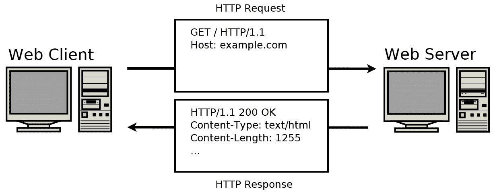
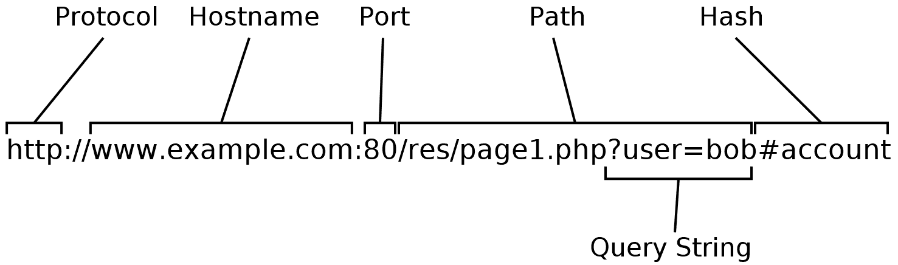
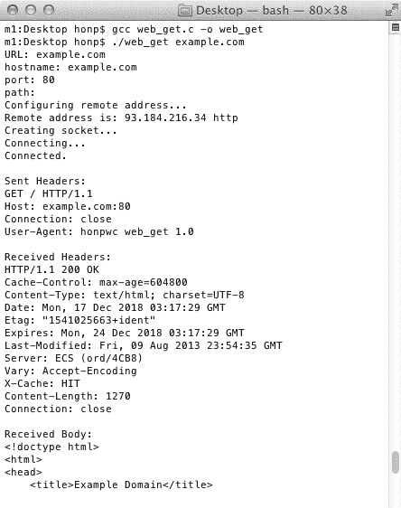
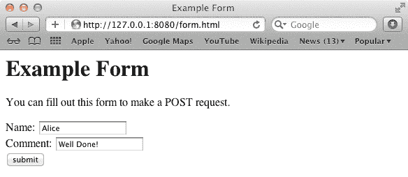

# 构建简单的 Web 客户端

**超文本传输协议**（**HTTP**）是推动万维网（WWW）的应用协议。每次您打开网络浏览器进行互联网搜索、浏览维基百科或在社会媒体上发帖时，您都在使用 HTTP。许多移动应用程序也暗中使用了 HTTP。可以说，HTTP 是互联网上使用最广泛的协议之一。

在本章中，我们将查看 HTTP 消息格式。然后我们将实现一个 C 程序，该程序可以请求和接收网页。

本章涵盖了以下主题：

+   HTTP 消息格式

+   HTTP 请求类型

+   常见 HTTP 头

+   HTTP 响应代码

+   HTTP 消息解析

+   实现 HTTP 客户端

+   编码表单数据（`POST`）

+   HTTP 文件上传

# 技术要求

本章的示例程序可以用任何现代 C 编译器编译。我们推荐在 Windows 上使用 MinGW，在 Linux 和 macOS 上使用 GCC。有关编译器设置的更多信息，请参阅附录 B、C 和 D。

本书代码可在[`github.com/codeplea/Hands-On-Network-Programming-with-C`](https://github.com/codeplea/Hands-On-Network-Programming-with-C)找到。

从命令行，您可以使用以下命令下载本章的代码：

```cpp
git clone https://github.com/codeplea/Hands-On-Network-Programming-with-C
cd Hands-On-Network-Programming-with-C/chap06
```

本章中的每个示例程序都在 Windows、Linux 和 macOS 上运行。在 Windows 上编译时，每个示例程序都需要与 Winsock 库链接。这是通过将`-lws2_32`选项传递给`gcc`来实现的。

我们提供编译每个示例所需的精确命令，正如它们被介绍时那样。

本章中的所有示例程序都需要我们在第二章，*掌握套接字 API*中开发的相同头文件和 C 宏。为了简洁起见，我们将这些语句放在一个单独的头文件`chap06.h`中，我们可以在每个程序中包含它。有关这些语句的解释，请参阅第二章，*掌握套接字 API*。

`chap06.h`的内容如下：

```cpp
//chap06.h//

#if defined(_WIN32)
#ifndef _WIN32_WINNT
#define _WIN32_WINNT 0x0600
#endif
#include <winsock2.h>
#include <ws2tcpip.h>
#pragma comment(lib, "ws2_32.lib")

#else
#include <sys/types.h>
#include <sys/socket.h>
#include <netinet/in.h>
#include <arpa/inet.h>
#include <netdb.h>
#include <unistd.h>
#include <errno.h>

#endif

#if defined(_WIN32)
#define ISVALIDSOCKET(s) ((s) != INVALID_SOCKET)
#define CLOSESOCKET(s) closesocket(s)
#define GETSOCKETERRNO() (WSAGetLastError())

#else
#define ISVALIDSOCKET(s) ((s) >= 0)
#define CLOSESOCKET(s) close(s)
#define SOCKET int
#define GETSOCKETERRNO() (errno)
#endif

#include <stdio.h>
#include <stdlib.h>
#include <string.h>
#include <clock.h>
```

# HTTP 协议

HTTP 是一种基于文本的客户端-服务器协议，它运行在 TCP 之上。纯 HTTP 运行在 TCP 端口`80`。

应注意，出于安全原因，纯 HTTP 已被大多数情况下弃用。今天，网站应使用 HTTPS，这是 HTTP 的安全版本。HTTPS 通过仅将 HTTP 协议通过**传输层安全性**（**TLS**）层运行来保护 HTTP。因此，本章中关于 HTTP 的所有内容也适用于 HTTPS。有关 HTTPS 的更多信息，请参阅第九章，*使用 HTTPS 和 OpenSSL 加载安全网页*。

HTTP 通过首先让网络客户端向网络服务器发送 HTTP 请求来工作。然后，网络服务器以 HTTP 响应的形式进行响应。通常，HTTP 请求指示客户端感兴趣的资源，而 HTTP 响应则提供所请求的资源。

从视觉上看，交易在以下图形中得到了说明：



前面的图形说明了**GET**请求。当**Web 客户端**只想让**Web 服务器**发送文档、图像、文件、网页等内容时，会使用**GET**请求。**GET**请求是最常见的。它们就是你的浏览器在加载网页或下载文件时发送给**Web 服务器**的请求。

还有几种其他请求类型也值得提及。

# HTTP 请求类型

虽然`GET`请求是最常见的，但可能有三类请求类型被广泛使用。以下三个常见的 HTTP 请求类型如下：

+   当客户端想要下载资源时，使用`GET`。

+   `HEAD`请求与`GET`请求类似，但客户端只想获取资源信息，而不是资源本身。例如，如果客户端只想知道托管文件的大小，它可以发送一个`HEAD`请求。

+   `POST`用于客户端需要向服务器发送信息时。例如，当你在网上提交表单时，你的网络浏览器通常使用`POST`请求。`POST`请求通常会导致网络服务器以某种方式改变其状态。网络服务器可能会发送电子邮件、更新数据库或响应`POST`请求更改文件。

除了`GET`、`HEAD`和`POST`之外，还有一些很少使用的 HTTP 请求类型。它们如下：

+   `PUT`用于将文档发送到网络服务器。`PUT`不常用。`POST`几乎被普遍用来改变网络服务器状态。

+   `DELETE`用于请求网络服务器删除文档或资源。同样，在实践中，`DELETE`很少使用。`POST`通常用于传达各种类型的网络服务器更新。

+   `TRACE`用于请求从 Web 代理获取诊断信息。大多数 Web 请求不会通过代理，而且许多 Web 代理不完全支持`TRACE`。因此，很少需要使用`TRACE`。

+   `CONNECT`有时用于通过代理服务器初始化 HTTP 连接。

+   `OPTIONS`用于询问服务器支持哪些 HTTP 请求类型。一个典型的实现`OPTIONS`的 Web 服务器可能会响应类似于`Allow: OPTIONS, GET, HEAD, POST`的内容。许多常见的 Web 服务器不支持`OPTIONS`。

如果你发送一个网络服务器不支持请求，那么服务器应该响应一个`400 Bad Request`代码。

现在我们已经看到了 HTTP 请求的类型，让我们更详细地看看请求格式。

# HTTP 请求格式

如果你打开你的网络浏览器并导航到`http://www.example.com/page1.htm`，你的浏览器需要向`www.example.com`上的网络服务器发送一个 HTTP 请求。这个 HTTP 请求可能看起来像这样：

```cpp
GET /page1.htm HTTP/1.1
User-Agent: Mozilla/5.0 (Windows NT 10.0; Win64; x64) AppleWebKit/537.36
Accept-Language: en-US
Accept: text/html,application/xhtml+xml,application/xml;q=0.9,*/*;q=0.8
Accept-Encoding: gzip, deflate
Host: example.com
Connection: Keep-Alive
```

如您所见，浏览器默认发送一个`GET`请求。这个`GET`请求是向服务器请求文档`/page1.htm`。一个`GET`请求只包含 HTTP 头部信息。因为没有 HTTP 主体，客户端没有向服务器发送数据。客户端只是请求服务器上的数据。相比之下，一个`POST`请求将包含一个 HTTP 主体。

HTTP 请求的第一行被称为**请求行**。请求行由三部分组成——请求类型、文档路径和协议版本。每个部分之间由空格分隔。在上面的例子中，请求行是`GET /page1.htm HTTP/1.1`。我们可以看到请求类型是`GET`，文档路径是`/page1.htm`，协议版本是`HTTP/1.1`。

当处理基于文本的网络协议时，始终明确行结束是很重要的。这是因为不同的操作系统采用了不同的行结束约定。HTTP 消息的每一行都以一个回车符，后跟一个换行符结束。在 C 语言中，这看起来像`\r\n`。实际上，一些 Web 服务器可能容忍其他行结束符。您应该确保您的客户端始终发送正确的`\r\n`行结束符以实现最大兼容性。

在请求行之后，有各种 HTTP 头部字段。每个头部字段由其名称后跟一个冒号，然后是其值组成。考虑一下`User-Agent: Mozilla/5.0 (Windows NT 10.0; Win64; x64) AppleWebKit/537.36`这一行。这条`User-Agent`行是在告诉 Web 服务器正在联系它的软件是什么。一些 Web 服务器会向不同的用户代理提供不同的文档。例如，一些网站向搜索引擎蜘蛛提供完整的文档，同时向实际访客提供付费墙。服务器通常使用用户代理 HTTP 头部字段来确定哪个是哪个。同时，在用户代理字段中存在许多 Web 客户端欺骗的历史。我建议您在您的应用程序中走正道，并使用一个独特的用户代理值清楚地标识您的应用程序。

唯一真正必需的头部字段是`Host`。`Host`字段告诉 Web 服务器客户端正在请求哪个 Web 主机上的资源。这很重要，因为一个 Web 服务器可能托管多个不同的网站。请求行告诉 Web 服务器想要`/page1.htm`文档，但它没有指定该页面在哪个服务器上。`Host`字段填补了这个角色。

`Connection: Keep-Alive`行告诉 Web 服务器，在当前请求完成后，HTTP 客户端希望发出额外的请求。如果客户端发送了`Connection: Close`，那么这表明客户端打算在收到 HTTP 响应后关闭 TCP 连接。

Web 客户端必须在 HTTP 请求头部之后发送一个空白行。这个空白行是 Web 服务器知道 HTTP 请求已经结束的方式。如果没有这个空白行，Web 服务器将不知道是否还有额外的头部字段正在发送。在 C 语言中，空白行看起来像这样：`\r\n\r\n`。

现在让我们考虑 Web 服务器会对 HTTP 请求发送什么响应。

# HTTP 响应格式

与 HTTP 请求一样，HTTP 响应也由头部部分和主体部分组成。同样，与 HTTP 请求类似，主体部分是可选的。尽管如此，大多数 HTTP 响应都有主体部分。

`www.example.com`服务器可以对我们发送的 HTTP 请求做出以下响应：

```cpp
HTTP/1.1 200 OK
Cache-Control: max-age=604800
Content-Type: text/html; charset=UTF-8
Date: Fri, 14 Dec 2018 16:46:09 GMT
Etag: "1541025663+gzip"
Expires: Fri, 21 Dec 2018 16:46:09 GMT
Last-Modified: Fri, 09 Aug 2013 23:54:35 GMT
Server: ECS (ord/5730)
Vary: Accept-Encoding
X-Cache: HIT
Content-Length: 1270

<!doctype html>
<html>
<head>
    <title>Example Domain</title>
...
```

HTTP 响应的第一行是**状态行**。状态行由协议版本、响应代码和响应代码描述组成。在上面的示例中，我们可以看到协议版本是`HTTP/1.1`，响应代码是`200`，响应代码描述是`OK`。`200 OK`是当一切顺利时对 HTTP `GET`请求的典型响应代码。如果服务器找不到客户端请求的资源，它可能会用`404 Page Not Found`响应代码来响应。

许多 HTTP 响应头部用于辅助缓存。`Date`、`Etag`、`Expires`和`Last-Modified`字段都可以被客户端用来缓存文档。

`Content-Type`字段告知客户端发送的资源类型。在上面的示例中，它是一个 HTML 网页，使用`text/html`指定。HTTP 可以用来发送所有类型的资源，例如图片、软件和视频。每种资源类型都有一个特定的`Content-Type`，它告诉客户端如何解释该资源。

`Content-Length`字段指定了 HTTP 响应主体的字节数。在这种情况下，我们看到请求的资源长度为`1270`字节。有几种方法可以确定主体长度，但`Content-Length`字段是最简单的方法。我们将在本章后面的“响应主体长度”部分探讨其他方法。

HTTP 响应头部部分通过一个空白行与 HTTP 响应主体部分分开。在这个空白行之后，跟随的是 HTTP 主体。请注意，HTTP 主体不一定是基于文本的。例如，如果客户端请求了一个图片，那么 HTTP 主体很可能是二进制数据。同时考虑，如果 HTTP 主体是基于文本的，例如一个 HTML 网页，它可以使用自己的行结束约定。它不必使用 HTTP 要求的`\r\n`行结束符。

如果客户端发送的是 HEAD 请求类型而不是`GET`，那么服务器将响应与之前完全相同的 HTTP 头部，但不会包含 HTTP 主体。

在定义了 HTTP 响应格式之后，让我们看看一些最常见的 HTTP 响应类型。

# HTTP 响应代码

存在许多不同类型的 HTTP 响应代码。

如果请求成功，则服务器会响应一个 200 范围的代码：

+   `200 OK`: 客户端的请求成功，服务器发送请求的资源

如果资源已移动，服务器可以响应一个 300 范围的代码。这些代码通常用于将流量从未加密的连接重定向到加密连接，或将流量从 `www` 子域名重定向到裸域名。如果网站经过重构但希望保持入站链接正常工作，也会使用这些代码。常见的 300 范围代码如下：

+   `301 永久移动`: 请求的资源已移动到新的位置。这个位置由服务器在 `Location` 头字段中指示。所有未来的对该资源的请求都应该使用这个新位置。

+   `307 临时移动`: 请求的资源已移动到新的位置。这个位置由服务器在 `Location` 头字段中指示。这种移动可能不是永久的，因此未来的请求仍然应该使用原始位置。

错误由 400 或 500 范围的响应代码指示。一些常见的如下：

+   `400 错误请求`: 服务器不理解/不支持客户端的请求

+   `401 未授权`: 客户端没有权限访问请求的资源

+   `403 禁止访问`: 客户端被禁止访问请求的资源

+   `500 内部服务器错误`: 服务器在尝试满足客户端请求时遇到了错误

除了响应类型之外，HTTP 服务器还必须能够明确地传达响应体的长度。

# 响应体长度

HTTP 响应体长度可以通过几种不同的方式来确定。最简单的方式是如果 HTTP 服务器在其响应中包含一个 `Content-Length` 头行。在这种情况下，服务器直接声明了体长度。

如果服务器希望在知道体长度之前开始发送数据，则不能使用 `Content-Length` 头行。在这种情况下，服务器可以发送一个 `Transfer-Encoding: chunked` 头行。这个头行指示客户端响应体将以单独的数据块发送。每个数据块以数据块长度开始，该长度以十六进制（十六进制）编码，后跟一个换行符，然后是数据块数据。整个 HTTP 主体以一个零长度的数据块结束。

让我们考虑一个使用分块编码的 HTTP 响应示例：

```cpp
HTTP/1.1 200 OK
Content-Type: text/plain; charset=ascii
Transfer-Encoding: chunked

44
Lorem ipsum dolor sit amet, consectetur adipiscing elit, sed do eius
37
mod tempor incididunt ut labore et dolore magna aliqua.
0
```

在前面的示例中，我们看到 HTTP 主体以 `44` 开头，后跟一个换行符。这个 `44` 应该被解释为十六进制。我们可以使用内置的 C `strtol()` 函数来解释十六进制数字。

十六进制数字通常以 `0x` 前缀来区分它们与十进制数字。我们在这里使用这个前缀来标识它们，但请记住，HTTP 协议不会添加这个前缀。

十六进制的 `0x44` 数字等于十进制的 68。在 `44` 和换行符之后，我们看到 68 个字符是请求资源的一部分。在 68 个字符的数据块之后，服务器发送一个换行符。

服务器随后发送了`37`。`0x37`的十进制值是 55。换行后，发送 55 个字符作为块数据。然后服务器发送一个零长度的块来指示响应已结束。

客户端应在解码分块后将完整的 HTTP 响应解释为`Lorem ipsum dolor sit amet, consectetur adipiscing elit, sed do eiusmod tempor incididunt ut labore et dolore magna aliqua`。

除了`Content-Length`和`Transfer-Encoding: chunked`之外，还有几种其他方式可以指示 HTTP 响应体长度。然而，除非客户端明确表示支持 HTTP 请求中的附加编码类型，否则服务器仅限于这两种。

您有时会看到服务器在传输完资源后简单地关闭 TCP 连接。这是`HTTP/1.0`中指示资源大小的一种常见方式。然而，不应使用`HTTP/1.1`。使用关闭的连接来指示响应长度的问题是它不明确为什么连接被关闭。这可能是因为所有数据都已发送，也可能是因为其他原因。考虑如果在数据传输过程中拔掉网络电缆会发生什么。

现在我们已经了解了 HTTP 请求和响应的基础，让我们看看如何识别网络资源。

# URL 中有什么

**统一资源定位符**（**URL**），也称为网页地址，提供了一种方便的方式来指定特定的网络资源。您可以通过在网页浏览器的地址栏中输入 URL 来导航到该 URL。或者，如果您正在浏览网页并点击链接，该链接将以 URL 的形式表示。

考虑`http://www.example.com:80/res/page1.php?user=bob#account`这个 URL。从视觉上看，URL 可以分解如下：



URL 可以指示协议、主机、端口号、文档路径和哈希。然而，主机是唯一必需的部分。其他部分可以隐含。

我们可以解析前面图表中的示例 URL：

+   **http://**：第一个**://**之前的部分表示协议。在这个例子中，协议是**http**，但它可以是不同的协议，如`ftp://`或`https://`。如果省略了协议，应用程序通常会做出假设。例如，您的网页浏览器会假设协议是**http**。

+   **www.example.com**：这指定了主机名。它用于解析 HTTP 客户端可以连接到的 IP 地址。此主机名还必须出现在 HTTP 请求的`Host`头字段中。这是必需的，因为多个主机名可以解析到同一个 IP 地址。这部分也可以是一个 IP 地址而不是名称。IPv4 地址可以直接使用（`http://192.168.50.1/`），但 IPv6 地址应放在方括号内（`http://[::1]/`）。

+   **:80**：端口号可以通过在主机名后使用冒号来显式指定。如果没有指定端口号，则客户端使用给定协议的默认端口号。**http**的默认端口号是**80**，**https**的默认端口号是**443**。非标准端口号在测试和开发中很常见。

+   **/res/page1.php?user/bob**：这指定了文档路径。HTTP 服务器通常会在问号之前和之后的部分之间做出区分，但 HTTP 客户端不应对此赋予任何意义。问号之后的部分通常被称为查询字符串。

+   **#account**：这被称为哈希。哈希指定了文档中的位置，哈希不会发送到 HTTP 服务器。相反，它允许浏览器在从 HTTP 服务器接收整个文档后滚动到文档的特定部分。

现在我们对 URL 有了基本的了解，让我们编写代码来解析它们。

# 解析 URL

我们将编写一个 C 函数来解析给定的 URL。

函数接受一个 URL 作为输入，并返回主机名、端口号和文档路径作为输出。为了避免需要手动管理内存，输出作为指向输入 URL 特定部分的指针返回。输入 URL 根据需要修改为终止的空指针。

我们的功能首先打印输入的 URL。这对于调试很有用。相应的代码如下：

```cpp
/*web_get.c excerpt*/

void parse_url(char *url, char **hostname, char **port, char** path) {
    printf("URL: %s\n", url);
```

函数随后尝试在 URL 中找到`://`。如果找到，它将读取 URL 的第一部分作为协议。我们的程序只支持 HTTP。如果给定的协议不是 HTTP，则返回错误。解析协议的代码如下：

```cpp
/*web_get.c excerpt*/

    char *p;
    p = strstr(url, "://");

    char *protocol = 0;
    if (p) {
        protocol = url;
        *p = 0;
        p += 3;
    } else {
        p = url;
    }

    if (protocol) {
        if (strcmp(protocol, "http")) {
            fprintf(stderr,
                    "Unknown protocol '%s'. Only 'http' is supported.\n",
                    protocol);
            exit(1);
        }
    }
```

在前面的代码中，声明了一个字符指针`p`。`protocol`也被声明并设置为`0`，以表示没有找到协议。调用`strstr()`在 URL 中搜索`://`。如果没有找到，则`protocol`保持为`0`，`p`被设置为指向 URL 的开始。然而，如果找到了`://`，则`protocol`被设置为 URL 的开始，其中包含协议。`p`被设置为`://`之后的一个位置，这应该是主机名开始的地方。

如果设置了`protocol`，代码将检查它是否指向`http`文本。

在代码的这个点上，`p`指向主机名的开始。代码可以将主机名保存到返回变量`hostname`中。然后代码必须通过查找第一个冒号、斜杠或井号来扫描主机名的结束。相应的代码如下：

```cpp
/*web_get.c excerpt*/

    *hostname = p;
    while (*p && *p != ':' && *p != '/' && *p != '#') ++p;
```

一旦`p`前进到主机名的末尾，我们必须检查是否找到了端口号。端口号以冒号开头。如果找到了端口号，我们的代码将把它返回到`port`变量中；否则，返回默认端口号`80`。检查端口号的代码如下：

```cpp
/*web_get.c excerpt*/

    *port = "80";
    if (*p == ':') {
        *p++ = 0;
        *port = p;
    }
    while (*p && *p != '/' && *p != '#') ++p;
```

在端口号之后，`p`指向文档路径。函数将这个 URL 的部分返回到`path`变量中。请注意，我们的函数省略了路径中的第一个`/`。这是为了简化，因为它允许我们避免分配任何内存。所有文档路径都以`/`开始，因此当构造 HTTP 请求时，函数调用者可以轻松地将其前置。

设置`path`变量的代码如下：

```cpp
/*web_get.c excerpt*/

    *path = p;
    if (*p == '/') {
        *path = p + 1;
    }
    *p = 0;
```

然后代码尝试找到一个哈希值，如果存在的话。如果存在，它会被一个终止的空字符覆盖。这是因为哈希值永远不会发送到 Web 服务器，并且被我们的 HTTP 客户端忽略。

跳转到哈希值的代码如下：

```cpp
/*web_get.c excerpt*/

    while (*p && *p != '#') ++p;
    if (*p == '#') *p = 0;
```

我们的功能现在已经解析出了主机名、端口号和文档路径。然后它打印出这些值以进行调试，并返回。`parse_url()`函数的最终代码如下：

```cpp
/*web_get.c excerpt*/

    printf("hostname: %s\n", *hostname);
    printf("port: %s\n", *port);
    printf("path: %s\n", *path);
}
```

现在我们有了解析 URL 的代码，我们离构建完整的 HTTP 客户端又近了一步。

# 实现网络客户端

我们现在将实现一个 HTTP 网络客户端。这个客户端接受一个 URL 作为输入。然后它尝试连接到主机并检索 URL 给出的资源。程序显示发送和接收的 HTTP 头信息，并尝试从 HTTP 响应中解析出请求的资源内容。

我们的项目开始于包含章节标题，`chap06.h`：

```cpp
/*web_get.c*/

#include "chap06.h"
```

我们接着定义一个常量，`TIMEOUT`。在程序的后半部分，如果 HTTP 响应完成需要超过`TIMEOUT`秒，那么我们的程序将放弃请求。你可以按自己的喜好定义`TIMEOUT`，但在这里我们给它赋值为五秒：

```cpp
/*web_get.c continued*/

#define TIMEOUT 5.0
```

现在，请包含上一节中给出的整个`parse_url()`函数。我们的客户端需要`parse_url()`来从一个给定的 URL 中找到主机名、端口号和文档路径。

另一个辅助函数用于格式化和发送 HTTP 请求。我们称它为`send_request()`，其代码如下：

```cpp
/*web_get.c continued*/

void send_request(SOCKET s, char *hostname, char *port, char *path) {
    char buffer[2048];

    sprintf(buffer, "GET /%s HTTP/1.1\r\n", path);
    sprintf(buffer + strlen(buffer), "Host: %s:%s\r\n", hostname, port);
    sprintf(buffer + strlen(buffer), "Connection: close\r\n");
    sprintf(buffer + strlen(buffer), "User-Agent: honpwc web_get 1.0\r\n");
    sprintf(buffer + strlen(buffer), "\r\n");

    send(s, buffer, strlen(buffer), 0);
    printf("Sent Headers:\n%s", buffer);
}
```

`send_request()`通过首先定义一个字符缓冲区来存储 HTTP 请求来实现。然后使用`sprintf()`函数将内容写入缓冲区，直到 HTTP 请求完成。HTTP 请求以一个空白行结束。这个空白行告诉服务器整个请求头已经接收完毕。

一旦请求被格式化为`buffer`，就使用`send()`通过一个打开的套接字发送`buffer`。`buffer`也被打印到控制台以进行调试。我们为我们的网络客户端定义了一个额外的辅助函数。这个函数，`connect_to_host()`，接受一个主机名和端口号，并尝试建立一个新的 TCP 套接字连接到它。

在`connect_to_host()`的第一部分，使用`getaddrinfo()`解析主机名。然后使用`getnameinfo()`打印出服务器 IP 地址以进行调试。相应的代码如下：

```cpp
/*web_get.c continued*/

SOCKET connect_to_host(char *hostname, char *port) {
    printf("Configuring remote address...\n");
    struct addrinfo hints;
    memset(&hints, 0, sizeof(hints));
    hints.ai_socktype = SOCK_STREAM;
    struct addrinfo *peer_address;
    if (getaddrinfo(hostname, port, &hints, &peer_address)) {
        fprintf(stderr, "getaddrinfo() failed. (%d)\n", GETSOCKETERRNO());
        exit(1);
    }

    printf("Remote address is: ");
    char address_buffer[100];
    char service_buffer[100];
    getnameinfo(peer_address->ai_addr, peer_address->ai_addrlen,
            address_buffer, sizeof(address_buffer),
            service_buffer, sizeof(service_buffer),
            NI_NUMERICHOST);
    printf("%s %s\n", address_buffer, service_buffer);
```

在`connect_to_host()`函数的第二部分，使用`socket()`创建一个新的套接字，并通过`connect()`建立 TCP 连接。如果一切顺利，函数将返回创建的套接字。`connect_to_host()`函数后半部分的代码如下：

```cpp
/*web_get.c continued*/

    printf("Creating socket...\n");
    SOCKET server;
    server = socket(peer_address->ai_family,
            peer_address->ai_socktype, peer_address->ai_protocol);
    if (!ISVALIDSOCKET(server)) {
        fprintf(stderr, "socket() failed. (%d)\n", GETSOCKETERRNO());
        exit(1);
    }

    printf("Connecting...\n");
    if (connect(server,
                peer_address->ai_addr, peer_address->ai_addrlen)) {
        fprintf(stderr, "connect() failed. (%d)\n", GETSOCKETERRNO());
        exit(1);
    }
    freeaddrinfo(peer_address);

    printf("Connected.\n\n");

    return server;
}
```

如果您从本书的开头开始工作，到`connect_to_host()`函数中的代码现在应该非常熟悉了。如果不熟悉，请参阅前面的章节，以获取关于`getaddrinfo()`、`socket()`和`connect()`的更详细解释。第三章，*TCP 连接的深入概述*，应该特别有帮助。

在处理完辅助函数后，我们现在可以开始定义`main()`函数。`main()`函数的起始代码如下：

```cpp
/*web_get.c continued*/

int main(int argc, char *argv[]) {

#if defined(_WIN32)
    WSADATA d;
    if (WSAStartup(MAKEWORD(2, 2), &d)) {
        fprintf(stderr, "Failed to initialize.\n");
        return 1;
    }
#endif

    if (argc < 2) {
        fprintf(stderr, "usage: web_get url\n");
        return 1;
    }
    char *url = argv[1];
```

在前面的代码中，如果需要，Winsock 被初始化，并检查程序的参数。如果提供了一个 URL 作为参数，它将被存储在`url`变量中。

我们可以使用以下代码将 URL 解析为其主机名、端口和路径部分：

```cpp
/*web_get.c continued*/

    char *hostname, *port, *path;
    parse_url(url, &hostname, &port, &path);
```

程序接着通过建立与目标服务器的连接并发送 HTTP 请求来继续。这可以通过使用我们之前定义的两个辅助函数`connect_to_host()`和`send_request()`来实现。相应的代码如下：

```cpp
/*web_get.c continued*/

    SOCKET server = connect_to_host(hostname, port);
    send_request(server, hostname, port, path);
```

我们的网络客户端有一个特性，即如果请求完成时间过长，则会超时。为了知道已经过去了多少时间，我们需要记录开始时间。这通过调用内置的`clock()`函数来完成。我们使用以下方式将开始时间存储在`start_time`变量中：

```cpp
/*web_get.c continued*/

    const clock_t start_time = clock();
```

现在需要定义一些变量，以便在接收和解析 HTTP 响应时进行记录。所需的变量如下：

```cpp
/*web_get.c continued*/

#define RESPONSE_SIZE 8192
    char response[RESPONSE_SIZE+1];
    char *p = response, *q;
    char *end = response + RESPONSE_SIZE;
    char *body = 0;

    enum {length, chunked, connection};
    int encoding = 0;
    int remaining = 0;
```

在前面的代码中，`RESPONSE_SIZE`是我们为 HTTP 响应预留内存的最大大小。我们的程序无法解析大于此大小的 HTTP 响应。如果您扩展此限制，可能需要使用`malloc()`在堆上而不是栈上预留内存。

`response`是一个字符数组，用于存储整个 HTTP 响应。`p`是一个`char`指针，用于跟踪到目前为止已写入`response`的长度。`q`是一个稍后使用的额外`char`指针。我们定义`end`为一个`char`指针，它指向`response`缓冲区的末尾。`end`非常有用，可以确保我们不会尝试写入预留内存的末尾。

`body`指针用于在收到 HTTP 响应体后记住其起始位置。

如果你还记得，HTTP 响应体长度可以通过几种不同的方法来确定。我们定义了一个枚举来列出方法类型，并定义了`encoding`变量来存储实际使用的方法。最后，`remaining`变量用于记录完成 HTTP 主体或主体块还需要多少字节。

然后我们开始一个循环来接收和处理 HTTP 响应。这个循环首先检查它是否花费了太多时间，并且我们是否还有足够的空间来存储接收到的数据。这个循环的第一部分如下：

```cpp
/*web_get.c continued*/

    while(1) {

        if ((clock() - start_time) / CLOCKS_PER_SEC > TIMEOUT) {
            fprintf(stderr, "timeout after %.2f seconds\n", TIMEOUT);
            return 1;
        }

        if (p == end) {
            fprintf(stderr, "out of buffer space\n");
            return 1;
        }
```

然后我们包含接收 TCP 套接字数据的代码。我们的代码使用 `select()` 并设置一个短的超时时间。这允许我们定期检查请求是否超时。您可能还记得，从前面的章节中，`select()` 涉及创建 `fd_set` 和 `timeval` 结构。以下代码创建了这些对象并调用了 `select()`：

```cpp
/*web_get.c continued*/

        fd_set reads;
        FD_ZERO(&reads);
        FD_SET(server, &reads);

        struct timeval timeout;
        timeout.tv_sec = 0;
        timeout.tv_usec = 200000;

        if (select(server+1, &reads, 0, 0, &timeout) < 0) {
            fprintf(stderr, "select() failed. (%d)\n", GETSOCKETERRNO());
            return 1;
        }
```

`select()` 在超时时间已过或可以从套接字读取新数据时返回。我们的代码需要使用 `FD_ISSET()` 来确定是否有可读取的新数据。如果是这样，我们将数据读取到 `p` 指针指向的缓冲区中。

或者，当尝试读取新数据时，我们可能会发现套接字已被网络服务器关闭。如果是这种情况，我们检查是否期望一个关闭的连接来指示传输的结束。如果是这样，即 `encoding == connection`，我们将打印接收到的 HTTP 主体数据。

读取新数据并检测连接已关闭的代码如下：

```cpp
/*web_get.c continued*/

        if (FD_ISSET(server, &reads)) {
            int bytes_received = recv(server, p, end - p, 0);
            if (bytes_received < 1) {
                if (encoding == connection && body) {
                    printf("%.*s", (int)(end - body), body);
                }

                printf("\nConnection closed by peer.\n");
                break;
            }

            /*printf("Received (%d bytes): '%.*s'",
                    bytes_received, bytes_received, p);*/

            p += bytes_received;
            *p = 0;
```

注意，在上述代码中，`p` 指针被向前移动以指向接收到的数据的末尾。`*p` 被设置为零，因此我们的接收数据始终以空终止符结束。这允许我们使用期望空终止字符串的标准函数来处理数据。例如，我们使用内置的 `strstr()` 函数在接收到的数据中搜索，而 `strstr()` 期望输入字符串是空终止的。

接下来，如果 HTTP 主体尚未找到，我们的代码会在接收到的数据中搜索一个空白行，该空白行指示 HTTP 标头的结束。空白行由两个连续的行结束符编码。HTTP 将行结束符定义为 `\r\n`，因此我们的代码通过搜索 `\r\n\r\n` 来检测空白行。

以下代码使用 `strstr()` 找到 HTTP 标头的结束（即 HTTP 主体的开始），并将 `body` 指针更新为指向 HTTP 主体开始的位置：

```cpp
/*web_get.c continued*/

            if (!body && (body = strstr(response, "\r\n\r\n"))) {
                *body = 0;
                body += 4;
```

打印 HTTP 标头以进行调试可能是有用的。这可以通过以下代码完成：

```cpp
/*web_get.c continued*/

                printf("Received Headers:\n%s\n", response);
```

现在已经接收了标头，我们需要确定 HTTP 服务器是使用 `Content-Length` 还是 `Transfer-Encoding: chunked` 来指示主体长度。如果它不发送任何一个，那么我们假设在连接关闭后已经接收了整个 HTTP 主体。

如果使用 `strstr()` 找到 `Content-Length`，我们将 `encoding` 设置为 `length` 并将主体长度存储在 `remaining` 变量中。实际长度是通过 `strtol()` 函数从 HTTP 标头中读取的。

如果找不到 `Content-Length`，则代码会搜索 `Transfer-Encoding: chunked`。如果找到，我们将 `encoding` 设置为 `chunked`。`remaining` 设置为 `0` 以指示我们尚未读取到块长度。

如果没有找到 `Content-Length` 或 `Transfer-Encoding: chunked`，则将 `encoding = connection` 设置为指示我们在连接关闭时认为已接收到 HTTP 正文。

确定使用哪种正文长度方法的代码如下：

```cpp
/*web_get.c continued*/

                q = strstr(response, "\nContent-Length: ");
                if (q) {
                    encoding = length;
                    q = strchr(q, ' ');
                    q += 1;
                    remaining = strtol(q, 0, 10);

                } else {
                    q = strstr(response, "\nTransfer-Encoding: chunked");
                    if (q) {
                        encoding = chunked;
                        remaining = 0;
                    } else {
                        encoding = connection;
                    }
                }
                printf("\nReceived Body:\n");
            }
```

前面的代码可以通过进行不区分大小写的搜索或允许一些灵活性来改进其鲁棒性。然而，它应该可以与大多数网络服务器一起正常工作，我们将继续保持其简单性。

如果已经识别出 HTTP 正文开始，并且 `encoding == length`，则程序只需等待接收 `remaining` 字节。以下代码检查这一点：

```cpp
/*web_get.c continued*/

            if (body) {
                if (encoding == length) {
                    if (p - body >= remaining) {
                        printf("%.*s", remaining, body);
                        break;
                    }
```

在前面的代码中，一旦接收到 `remaining` 字节的 HTTP 正文，它将打印接收到的正文并从 `while` 循环中退出。

如果使用 `Transfer-Encoding: chunked`，则接收逻辑要复杂一些。以下代码处理这种情况：

```cpp
/*web_get.c continued*/

                } else if (encoding == chunked) {
                    do {
                        if (remaining == 0) {
                            if ((q = strstr(body, "\r\n"))) {
                                remaining = strtol(body, 0, 16);
                                if (!remaining) goto finish;
                                body = q + 2;
                            } else {
                                break;
                            }
                        }
                        if (remaining && p - body >= remaining) {
                            printf("%.*s", remaining, body);
                            body += remaining + 2;
                            remaining = 0;
                        }
                    } while (!remaining);
                }
            } //if (body)
```

在前面的代码中，`remaining` 变量用于指示是否期望下一个块长度或块数据。当 `remaining == 0` 时，程序正在等待接收新的块长度。每个块长度以换行符结束；因此，如果在 `strstr()` 中找到换行符，我们知道已经接收到了整个块长度。在这种情况下，块长度使用 `strtol()` 读取，它解释了十六进制块长度。`remaining` 被设置为期望的块长度。分块消息由零长度的块终止，因此如果读取到 `0`，代码使用 `goto finish` 来跳出主循环。

如果 `remaining` 变量非零，则程序检查是否已接收到至少 `remaining` 字节的数据。如果是这样，则打印该块，并将 `body` 指针向前推进到当前块的末尾。这种逻辑会一直循环，直到找到终止的零长度块或数据耗尽。

到目前为止，我们已经展示了解析 HTTP 响应体的所有逻辑。我们只需要结束循环，关闭套接字，程序就完成了。以下是 `web_get.c` 的最终代码：

```cpp
/*web_get.c continued*/

        } //if FDSET
    } //end while(1)
finish:

    printf("\nClosing socket...\n");
    CLOSESOCKET(server);

#if defined(_WIN32)
    WSACleanup();
#endif

    printf("Finished.\n");
    return 0;
}
```

您可以使用以下命令在 Linux 和 macOS 上编译和运行 `web_get.c`：

```cpp
gcc web_get.c -o web_get
./web_get http://example.com/
```

在 Windows 上，使用 MinGW 编译和运行的命令如下：

```cpp
gcc web_get.c -o web_get.exe -lws2_32
web_get.exe http://example.com/
```

尝试使用不同的 URL 运行 `web_get` 并研究输出。你可能对 HTTP 响应头感到有趣。

以下截图显示了我们在 `http://example.com/` 上运行 `web_get` 时发生的情况：



`web_get` 只支持 `GET` 查询。`POST` 查询也很常见且有用。现在让我们看看 HTTP `POST` 请求。

# HTTP POST 请求

HTTP `POST` 请求将数据从网络客户端发送到网络服务器。与 HTTP `GET` 请求不同，`POST` 请求包含一个包含数据的正文（尽管这个正文可以是零长度的）。

`POST` 体的格式可能不同，应该通过 `Content-Type` 头部来识别。许多现代基于 Web 的 API 预期 `POST` 体的数据是 JSON 编码的。

考虑以下 HTTP `POST` 请求：

```cpp
POST /orders HTTP/1.1
Host: example.com
User-Agent: Mozilla/5.0 (Windows NT 10.0; Win64; x64; rv:64.0)
Content-Type: application/json
Content-Length: 56
Connection: close

{"symbol":"VOO","qty":"10","side":"buy","type":"market"}
```

在前面的例子中，你可以看到 HTTP `POST` 请求与 HTTP `GET` 请求相似。明显的区别如下：请求以 `POST` 开头而不是 `GET`；包含了一个 `Content-Type` 头部字段；存在一个 `Content-Length` 头部字段；并且包含了一个 HTTP 消息体。在那个例子中，HTTP 消息体是 JSON 格式，如 `Content-Type` 头部所指定的。

# 编码表单数据

如果你在一个网站（如登录表单）上遇到一个表单，该表单很可能使用 `POST` 请求将其数据传输到 web 服务器。标准的 HTML 表单使用称为 **URL 编码**（也称为 **百分编码**）的格式来编码它发送的数据。当 URL 编码的表单数据在 HTTP `POST` 请求中提交时，它使用 `Content-Type: application/x-www-form-urlencoded` 头部。

考虑以下可用于提交的 HTML 表单：

```cpp
<form method="post" action="/submission.php">

  <label for="name">Name:</label>
  <input name="name" type="text"><br>

  <label for="comment">Comment:</label>
  <input name="comment" type="text"><br>

  <input type="submit" value="submit">

</form>
```

在你的网页浏览器中，前面的 HTML 可能会渲染成以下截图所示：



当这个表单提交时，其数据被编码在以下类似的 HTTP 请求中：

```cpp
POST /submission.php HTTP/1.1
Host: 127.0.0.1:8080
User-Agent: Mozilla/5.0 (Macintosh; Intel Mac OS X 10_7)
Accept-Language: en-US
Accept-Encoding: gzip, deflate
Content-Type: application/x-www-form-urlencoded
Content-Length: 31
Connection: keep-alive

name=Alice&comment=Well+Done%21
```

在前面的 HTTP 请求中，你可以看到使用了 `Content-Type: application/x-www-form-urlencoded`。在这个格式中，每个表单字段和值通过等号配对，多个表单字段通过 ampersands 连接。

表单字段名称或值中的特殊字符必须进行编码。注意，`Well Done!` 被编码为 `Well+Done%21`。空格用加号符号编码，特殊字符由一个百分号后跟它们的两位十六进制值编码（因此，感叹号被编码为 `%21`）。百分号本身会被编码为 `%25`。

# 文件上传

当 HTML 表单包含文件上传时，浏览器使用不同的内容类型。在这种情况下，使用 `Content-Type: multipart/form-data`。当使用 `Content-Type: multipart/form-data` 时，包含了一个边界指定符。这个边界是一个特殊的分隔符，由发送者设置，用于分隔提交的表单数据的一部分。

考虑以下 HTML 表单：

```cpp
<form method="post" enctype="multipart/form-data" action="/submit.php">
    <input name="name" type="text"><br>
    <input name="comment" type="text"><br>
    <input name="file" type="file"><br>
    <input type="submit" value="submit">
</form>
```

如果用户导航到包含前面代码的 HTML 表单的网页，并输入名字 `Alice`，评论 `Well Done!`，并选择一个名为 `upload.txt` 的文件上传，那么浏览器可能会发送以下 HTTP `POST` 请求：

```cpp
POST /submit.php HTTP/1.1
Host: example.com
Content-Type: multipart/form-data; boundary=-----------233121195710604
Content-Length: 1727

-------------233121195710604
Content-Disposition: form-data; name="name"

Alice
-------------233121195710604
Content-Disposition: form-data; name="comment"

Well Done!
-------------233121195710604
Content-Disposition: form-data; name="file"; filename="upload.txt"
Content-Type: text/plain

Hello.... <truncated>
```

如你所见，当使用 `multipart/form-data` 时，每个数据部分由一个边界分隔。这个边界是接收者区分单独字段或上传文件的关键。确保这个边界被选择，以便它不会出现在任何提交的字段或上传的文件中！

# 摘要

HTTP 是推动现代互联网的协议。它背后是每个网页、每个链接点击、每个加载的图形以及每个表单提交。在本章中，我们了解到 HTTP 是一种基于文本的协议，它运行在 TCP 连接之上。我们学习了客户端请求和服务器响应的 HTTP 格式。

在本章中，我们还实现了一个简单的 C 语言 HTTP 客户端。这个客户端有几个非平凡的任务——解析 URL、格式化 `GET` 请求的 HTTP 头部、等待响应以及从 HTTP 响应中解析接收到的数据。特别是，我们探讨了处理两种不同的解析 HTTP 体的方法。第一种，也是最简单的方法是 `Content-Length`，其中整个体的长度被明确指定。第二种方法是分块编码，其中体被发送为单独的块，我们的程序需要在它们之间进行划分。

我们还简要地探讨了 `POST` 请求及其相关的内容格式。

在下一章，第七章，*构建简单的 Web 服务器*中，我们将开发 HTTP 客户端的对应物——HTTP 服务器。

# 问题

尝试以下问题来测试你对本章知识的掌握：

1.  HTTP 使用 TCP 还是 UDP？

1.  可以通过 HTTP 发送哪些类型的资源？

1.  常见的 HTTP 请求类型有哪些？

1.  通常使用哪种 HTTP 请求类型从服务器向客户端发送数据？

1.  通常使用哪种 HTTP 请求类型从客户端向服务器发送数据？

1.  确定 HTTP 响应体长度的两种常用方法是什么？

1.  如何格式化 `POST` 类型的 HTTP 请求体？

这些问题的答案可以在附录 A，*问题答案*中找到。

# 进一步阅读

如需了解更多关于 HTTP 和 HTML 的信息，请参阅以下资源：

+   **RFC 7230**：*超文本传输协议 (HTTP/1.1)：消息语法和路由* ([`tools.ietf.org/html/rfc7230`](https://tools.ietf.org/html/rfc7230))

+   **RFC 7231**：*超文本传输协议 (HTTP/1.1)：语义和内容* ([`tools.ietf.org/html/rfc7231`](https://tools.ietf.org/html/rfc7231))

+   **RFC 1866**：*超文本标记语言 – 2.0* ([`tools.ietf.org/html/rfc1866`](https://tools.ietf.org/html/rfc1866))

+   **RFC 3986**：*统一资源标识符 (URI)：通用语法* ([`tools.ietf.org/html/rfc3986`](https://tools.ietf.org/html/rfc3986))
