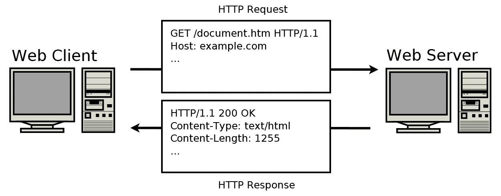
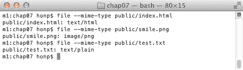
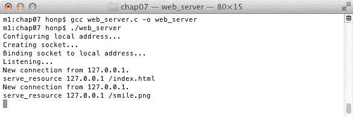
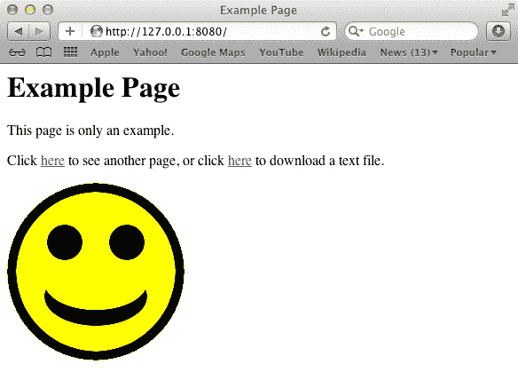

# 构建简单的 Web 服务器

本章基于前一章，从服务器的角度来查看 HTTP 协议。在其中，我们将构建一个简单的 Web 服务器。这个 Web 服务器将使用 HTTP 协议工作，您可以使用任何标准的 Web 浏览器连接到它。虽然它不会是功能齐全的，但它适合本地提供一些静态文件。它将能够同时处理来自多个客户端的几个并发连接。

本章涵盖了以下主题：

+   接受和缓冲多个连接

+   解析 HTTP 请求行

+   格式化 HTTP 响应

+   提供文件服务

+   安全考虑

# 技术要求

本章的示例程序可以使用任何现代的 C 编译器编译。我们推荐在 Windows 上使用 MinGW，在 Linux 和 macOS 上使用 GCC；有关编译器设置，请参阅附录 B，*在 Windows 上设置您的 C 编译器*，附录 C，*在 Linux 上设置您的 C 编译器*，以及附录 D，*在 macOS 上设置您的 C 编译器*。

本书代码可在[`github.com/codeplea/Hands-On-Network-Programming-with-C`](https://github.com/codeplea/Hands-On-Network-Programming-with-C)找到。

从命令行，您可以使用以下命令下载本章的代码：

```cpp
git clone https://github.com/codeplea/Hands-On-Network-Programming-with-C
cd Hands-On-Network-Programming-with-C/chap07
```

本章中的每个示例程序都在 Windows、Linux 和 macOS 上运行。在 Windows 上编译时，每个示例程序都需要链接到**Winsock**库。这可以通过将`-lws2_32`选项传递给`gcc`来实现。

我们提供了编译每个示例所需的精确命令，当它们被介绍时。

本章中的所有示例程序都需要我们在第二章，*掌握 Socket API*中开发的相同的头文件和 C 宏。为了简洁，我们将这些语句放在一个单独的头文件`chap07.h`中，我们可以在每个程序中包含它。有关这些语句的解释，请参阅第二章，*掌握 Socket API*。

`chap07.h`的内容如下：

```cpp
/*chap07.h*/

#if defined(_WIN32)
#ifndef _WIN32_WINNT
#define _WIN32_WINNT 0x0600
#endif
#include <winsock2.h>
#include <ws2tcpip.h>
#pragma comment(lib, "ws2_32.lib")

#else
#include <sys/types.h>
#include <sys/socket.h>
#include <netinet/in.h>
#include <arpa/inet.h>
#include <netdb.h>
#include <unistd.h>
#include <errno.h>

#endif

#if defined(_WIN32)
#define ISVALIDSOCKET(s) ((s) != INVALID_SOCKET)
#define CLOSESOCKET(s) closesocket(s)
#define GETSOCKETERRNO() (WSAGetLastError())

#else
#define ISVALIDSOCKET(s) ((s) >= 0)
#define CLOSESOCKET(s) close(s)
#define SOCKET int
#define GETSOCKETERRNO() (errno)
#endif

#include <stdio.h>
#include <stdlib.h>
#include <string.h>
```

# HTTP 服务器

在本章中，我们将实现一个可以从前目录提供静态文件的 HTTP Web 服务器。HTTP 是一种基于文本的客户端-服务器协议，它使用**传输控制协议**（**TCP**）。

在实现我们的 HTTP 服务器时，我们需要支持来自许多客户端的同时多个并发连接。每个接收到的**HTTP 请求**都需要被解析，并且我们的服务器需要回复适当的**HTTP 响应**。如果可能的话，这个**HTTP 响应**应包括请求的文件。

考虑以下图示中的 HTTP 事务：



在前面的图中，客户端正在从服务器请求`/document.htm`。服务器找到`/document.htm`并将其返回给客户端。

我们开发的 HTTP 服务器有些简化，我们只需要查看 HTTP 请求的第一行。这一行被称为**请求行**。我们的服务器只支持`GET`类型的请求，因此它需要首先检查请求行是否以`GET`开头。然后它会解析出请求的资源，在前面的例子中是`/document.htm`。

一个功能更全面的 HTTP 服务器会查看几个其他的 HTTP 头信息。它会查看`Host`头信息以确定它正在托管哪个网站。我们的服务器只支持托管一个网站，因此这个头信息对我们来说没有意义。

生产服务器还会查看诸如 Accept-Encoding 和 Accept-Language 等头信息，这些信息可以告知适当的响应格式。我们的服务器只是忽略这些，并且它以最直接的方式提供文件服务。

互联网有时可能是一个敌对的环境。一个生产级别的 Web 服务器需要在多个层次上包含安全性。它应该对文件访问和资源分配绝对细致入微。为了清晰解释和简洁，我们本章开发的这个服务器没有进行安全加固，因此出于这个原因，它不应该在公共互联网上使用。

# 服务器架构

HTTP 服务器是一个复杂的程序。它必须处理多个同时连接、解析复杂的基于文本的协议、以适当的错误处理格式不正确的请求，以及提供文件服务。我们本章开发的例子是从一个生产就绪的服务器中大大简化而来的，但它仍然是几百行代码。我们从将程序分解为单独的函数和数据结构中受益。

在全局层面，我们的程序存储了一个数据结构链表。这个链表为每个连接的客户端包含一个独立的数据结构。这个数据结构存储了有关每个客户端的信息，例如它们的地址、套接字以及迄今为止接收到的数据。我们实现了许多在全局链表上工作的辅助函数。这些函数用于添加新客户端、删除客户端、等待客户端数据、通过套接字查找客户端（因为套接字是由`select()`返回的）、向客户端提供文件以及向客户端发送错误信息。

我们的服务器主循环可以被简化。它等待新的连接或新的数据。当接收到新数据时，它会检查这些数据是否构成一个完整的 HTTP 请求。如果接收到一个完整的 HTTP 请求，服务器会尝试发送请求的资源。如果 HTTP 请求格式不正确或资源无法找到，那么服务器会向连接的客户端发送错误信息。

服务器的大部分复杂性在于处理多个连接、解析 HTTP 请求和处理错误条件。

服务器还负责告知客户端它发送的每个资源的类型。有几种方法可以实现这一点；让我们接下来考虑它们。

# 内容类型

这是 HTTP 服务器的职责，告诉其客户端发送的内容类型。这是通过`Content-Type`头完成的。`Content-Type`头的值应该是一个有效的媒体类型（以前称为**MIME 类型**），它已在**互联网数字分配机构**（**IANA**）注册。参见本章的**进一步阅读**部分，以获取 IANA 媒体类型列表的链接。

有几种方法可以确定文件的媒体类型。如果你使用的是基于 Unix 的系统，例如 Linux 或 macOS，那么你的操作系统已经提供了这个工具。

在 Linux 或 macOS 上尝试以下命令（将`example.txt`替换为实际文件名）：

```cpp
file --mime-type example.txt
```

以下截图显示了其用法：



如前一个截图所示，`file`实用程序告诉我们`index.html`的媒体类型是`text/html`。它还表示`smile.png`的媒体类型是`image/png`，`test.txt`的媒体类型是`text/plain`。

我们的 Web 服务器仅使用文件的扩展名来确定媒体类型。

常见的文件扩展名及其媒体类型列在以下表格中：

| **扩展名** | **媒体类型** |
| --- | --- |
| `.css` | `text/css` |
| `.csv` | `text/csv` |
| `.gif` | `image/gif` |
| `.htm` | `text/html` |
| `.html` | `text/html` |
| `.ico` | `image/x-icon` |
| `.jpeg` | `image/jpeg` |
| `.jpg` | `image/jpeg` |
| `.js` | `application/javascript` |
| `.json` | `application/json` |
| `.png` | `image/png` |
| `.pdf` | `application/pdf` |
| `.svg` | `image/svg+xml` |
| `.txt` | `text/plain` |

如果一个文件的媒体类型未知，那么我们的服务器应该使用`application/octet-stream`作为默认值。这表示浏览器应该将内容视为一个未知的二进制 blob。

让我们继续编写代码来从文件名获取`Content-Type`。

# 从文件名返回`Content-Type`

我们的服务器代码使用一系列`if`语句来确定基于请求文件的扩展名的正确媒体类型。这不是一个完美的解决方案，但这是一个常见的解决方案，并且适用于我们的目的。

确定文件媒体类型的代码如下：

```cpp
/*web_server.c except*/

const char *get_content_type(const char* path) {
    const char *last_dot = strrchr(path, '.');
    if (last_dot) {
        if (strcmp(last_dot, ".css") == 0) return "text/css";
        if (strcmp(last_dot, ".csv") == 0) return "text/csv";
        if (strcmp(last_dot, ".gif") == 0) return "image/gif";
        if (strcmp(last_dot, ".htm") == 0) return "text/html";
        if (strcmp(last_dot, ".html") == 0) return "text/html";
        if (strcmp(last_dot, ".ico") == 0) return "image/x-icon";
        if (strcmp(last_dot, ".jpeg") == 0) return "image/jpeg";
        if (strcmp(last_dot, ".jpg") == 0) return "image/jpeg";
        if (strcmp(last_dot, ".js") == 0) return "application/javascript";
        if (strcmp(last_dot, ".json") == 0) return "application/json";
        if (strcmp(last_dot, ".png") == 0) return "image/png";
        if (strcmp(last_dot, ".pdf") == 0) return "application/pdf";
        if (strcmp(last_dot, ".svg") == 0) return "image/svg+xml";
        if (strcmp(last_dot, ".txt") == 0) return "text/plain";
    }

    return "application/octet-stream";
}
```

`get_content_type()`函数通过将文件名扩展名与已知扩展名列表进行匹配来工作。这是通过使用`strrchr()`函数在文件名中找到最后一个点（`.`）来完成的。如果找到点，则使用`strcmp()`检查每个扩展名的匹配。当找到匹配项时，返回适当的媒体类型。否则，返回默认值`application/octet-stream`。

让我们继续为我们的服务器构建辅助函数。

# 创建服务器套接字

在处理 HTTP 服务器的激动人心部分，如消息解析之前，让我们先解决基础知识。我们的 HTTP 服务器，像所有服务器一样，需要创建一个监听套接字以接受新的连接。我们定义了一个名为`create_socket()`的函数来完成这个目的。此函数首先使用`getaddrinfo()`来查找监听地址：

```cpp
/*web_server.c except*/

SOCKET create_socket(const char* host, const char *port) {
    printf("Configuring local address...\n");
    struct addrinfo hints;
    memset(&hints, 0, sizeof(hints));
    hints.ai_family = AF_INET;
    hints.ai_socktype = SOCK_STREAM;
    hints.ai_flags = AI_PASSIVE;

    struct addrinfo *bind_address;
    getaddrinfo(host, port, &hints, &bind_address);
```

`create_socket()`函数接着使用`socket()`创建套接字，使用`bind()`将套接字绑定到监听地址，并使用`listen()`使套接字进入监听状态。以下代码在调用这些函数的同时检测错误条件：

```cpp
/*web_server.c except*/

    printf("Creating socket...\n");
    SOCKET socket_listen;
    socket_listen = socket(bind_address->ai_family,
            bind_address->ai_socktype, bind_address->ai_protocol);
    if (!ISVALIDSOCKET(socket_listen)) {
        fprintf(stderr, "socket() failed. (%d)\n", GETSOCKETERRNO());
        exit(1);
    }

    printf("Binding socket to local address...\n");
    if (bind(socket_listen,
                bind_address->ai_addr, bind_address->ai_addrlen)) {
        fprintf(stderr, "bind() failed. (%d)\n", GETSOCKETERRNO());
        exit(1);
    }
    freeaddrinfo(bind_address);

    printf("Listening...\n");
    if (listen(socket_listen, 10) < 0) {
        fprintf(stderr, "listen() failed. (%d)\n", GETSOCKETERRNO());
        exit(1);
    }

    return socket_listen;
}
```

如果您按照本书的顺序学习，前面的代码应该非常熟悉。如果不熟悉，请参阅第三章，*TCP 连接的深入概述*，以获取有关设置 TCP 服务器的信息。

# 多个连接缓冲

在实现任何服务器软件时，克服的一个重要障碍是同时接受和解析来自多个客户的请求。

考虑一个只发送 HTTP 请求开头，然后延迟，再发送剩余 HTTP 请求的客户。在这种情况下，我们无法在接收到整个 HTTP 请求之前对该客户做出响应。然而，同时，我们也不希望等待时延迟服务其他已连接的客户。因此，我们需要为每个客户分别缓冲接收到的数据。只有当我们从客户那里接收到完整的 HTTP 请求后，我们才能对该客户做出响应。

定义一个 C `struct`来存储每个已连接客户的详细信息是有用的。我们的程序使用以下结构：

```cpp
/*web_server.c except*/

#define MAX_REQUEST_SIZE 2047

struct client_info {
    socklen_t address_length;
    struct sockaddr_storage address;
    SOCKET socket;
    char request[MAX_REQUEST_SIZE + 1];
    int received;
    struct client_info *next;
};
```

这个`struct`允许我们存储有关每个已连接客户的详细信息。客户的地址存储在`address`字段中，地址长度在`address_length`中，套接字在`socket`字段中。迄今为止从客户那里接收到的所有数据都存储在`request`数组中；`received`指示该数组中存储的字节数。`next`字段是一个指针，允许我们将`client_info`结构存储在链表中。

为了简化我们的代码，我们将链表的根存储在全局变量`clients`中。声明如下：

```cpp
/*web_server.c except*/

static struct client_info *clients = 0;
```

将`clients`声明为全局变量有助于使我们的代码略微简短且清晰。然而，如果您需要代码可重入（例如，如果您想同时运行多个服务器），您将想要避免全局状态。这可以通过将链表根作为单独的参数传递给每个函数调用来实现。本章的代码仓库在`web_server2.c`文件中包含了这个替代技术的示例。

定义一些辅助函数，这些函数在`client_info`数据结构和`clients`链表上工作，是有用的。我们实现了以下辅助函数来完成这些目的：

+   `get_client()` 函数接收一个 `SOCKET` 变量并在我们的链表中搜索相应的 `client_info` 数据结构。

+   `drop_client()` 关闭与客户端的连接并将其从 `clients` 链表中移除。

+   `get_client_address()` 返回客户端的 IP 地址作为字符串（字符数组）。

+   `wait_on_clients()` 使用 `select()` 函数等待直到有客户端有数据可用或新的客户端尝试连接。

+   `send_400()` 和 `send_404()` 用于处理 HTTP 错误条件。

+   `serve_resource()` 尝试将文件传输到已连接的客户端。

现在我们将逐个实现这些函数。

# `get_client()`

我们的 `get_client()` 函数接受一个 `SOCKET` 并在连接客户端的链表中搜索，以返回该 `SOCKET` 对应的 `client_info`。如果在链表中找不到匹配的 `client_info`，则分配一个新的 `client_info` 并将其添加到链表中。因此，`get_client()` 具有两个作用——它可以找到现有的 `client_info`，或者它可以创建一个新的 `client_info`。

`get_client()` 函数接收一个 `SOCKET` 作为输入，并返回一个 `client_info` 结构体。以下代码是 `get_client()` 函数的第一部分：

```cpp
/*web_server.c except*/

struct client_info *get_client(SOCKET s) {
    struct client_info *ci = clients;

    while(ci) {
        if (ci->socket == s)
            break;
        ci = ci->next;
    }

    if (ci) return ci;
```

在前面的代码中，我们创建了 `get_client()` 函数并实现了我们的链表搜索功能。首先，将链表根 `clients` 保存到一个临时变量 `ci` 中。如果 `ci->socket` 是我们要搜索的套接字，则循环中断并返回 `ci`。如果找不到给定套接字的 `client_info` 结构体，则代码继续执行并必须创建一个新的 `client_info` 结构体。以下代码实现了这一点：

```cpp
/*web_server.c except*/

    struct client_info *n =
        (struct client_info*) calloc(1, sizeof(struct client_info));

    if (!n) {
        fprintf(stderr, "Out of memory.\n");
        exit(1);
    }

    n->address_length = sizeof(n->address);
    n->next = clients;
    clients = n;
    return n;
}
```

在前面的代码中，使用了 `calloc()` 函数为新 `client_info` 结构体分配内存。`calloc()` 函数还会将数据结构清零，这在这种情况下很有用。然后代码检查内存分配是否成功，如果失败则打印错误信息。

然后代码将 `n->address_length` 设置为适当的大小。这允许我们稍后直接在 `client_info` 地址上使用 `accept()`，因为 `accept()` 需要最大地址长度作为输入。

将 `n->next` 字段设置为当前全局链表根，并将全局链表根 `clients` 设置为 `n`。这实现了在链表开头添加新的数据结构。

`get_client()` 函数通过返回新分配的 `client_info` 结构体 `n` 来结束。

# `drop_client()`

`drop_client()` 函数搜索我们的客户端链表并移除指定的客户端。

整个函数的代码如下：

```cpp
/*web_server.c except*/

void drop_client(struct client_info *client) {
    CLOSESOCKET(client->socket);

    struct client_info **p = &clients;

    while(*p) {
        if (*p == client) {
            *p = client->next;
            free(client);
            return;
        }
        p = &(*p)->next;
    }

    fprintf(stderr, "drop_client not found.\n");
    exit(1);
}
```

如前所述的代码所示，首先使用 `CLOSESOCKET()` 关闭并清理客户端的连接。

函数随后声明了一个指针的指针变量，`p`，并将其设置为`clients`。这个指针的指针变量很有用，因为我们可以用它直接更改`clients`的值。确实，如果要删除的客户是链表中的第一个元素，那么`clients`需要更新，以便`clients`指向列表中的第二个元素。

代码使用一个`while`循环遍历链表。一旦找到`*p == client`，就将`*p`设置为`client->next`，这实际上从链表中移除了客户，随后释放了分配的内存，并返回函数。

虽然`drop_client()`是一个简单的函数，但它很方便，因为它可以在几种情况下调用。当完成向客户发送资源后必须调用它，同样，当完成向客户发送错误消息后也必须调用它。

# `get_client_address()`

有一个辅助函数将给定客户的 IP 地址转换为文本很有用。这个函数在下面的代码片段中给出：

```cpp
/*web_server.c except*/

const char *get_client_address(struct client_info *ci) {
    static char address_buffer[100];
    getnameinfo((struct sockaddr*)&ci->address,
            ci->address_length,
            address_buffer, sizeof(address_buffer), 0, 0,
            NI_NUMERICHOST);
    return address_buffer;
}
```

`get_client_address()`是一个简单的函数。它首先分配一个`char`数组来存储 IP 地址。这个`char`数组被声明为`static`，这确保了在函数返回后其内存仍然是可用的。这意味着我们不需要担心调用者`free()`内存。这种方法的不利之处在于`get_client_address()`具有全局状态，并且不是可重入安全的。请参阅`web_server2.c`以获取一个可重入安全的替代版本。

在获得`char`缓冲区后，代码简单地使用`getnameinfo()`将二进制 IP 地址转换为文本地址；`getnameinfo()`在前面章节中有详细的介绍，但第五章，*主机名解析和 DNS*，有特别详细的解释。

# `wait_on_clients()`

我们的服务器能够处理许多并发连接。这意味着我们的服务器必须有一种方式来同时等待来自多个客户的数据。我们定义了一个函数，`wait_on_clients()`，该函数会阻塞，直到现有客户发送数据，或者新客户尝试连接。这个函数使用了在前面章节中描述的`select()`。第三章，*TCP 连接的深入概述*，对`select()`有详细的解释。

`wait_on_clients()`函数定义如下：

```cpp
/*web_server.c except*/

fd_set wait_on_clients(SOCKET server) {
    fd_set reads;
    FD_ZERO(&reads);
    FD_SET(server, &reads);
    SOCKET max_socket = server;

    struct client_info *ci = clients;

    while(ci) {
        FD_SET(ci->socket, &reads);
        if (ci->socket > max_socket)
            max_socket = ci->socket;
        ci = ci->next;
    }

    if (select(max_socket+1, &reads, 0, 0, 0) < 0) {
        fprintf(stderr, "select() failed. (%d)\n", GETSOCKETERRNO());
        exit(1);
    }

    return reads;
}
```

在前面的代码中，首先声明了一个新的`fd_set`并将其清零。然后，将服务器套接字首先添加到`fd_set`中。然后代码遍历已连接客户的链表，并依次添加每个客户的套接字。在整个过程中维护一个变量`max_socket`，以存储`select()`所需的最大套接字号。

在将所有套接字添加到`fd_set reads`之后，代码调用`select()`，并且当`reads`中的一个或多个套接字准备好时，`select()`返回。

`wait_on_clients()` 函数返回 `reads`，以便调用者可以看到哪个套接字已准备好。

# send_400()

在客户端发送的 HTTP 请求是我们服务器不理解的情况下，发送代码 `400` 错误是有帮助的。因为这种类型的错误可以在几种情况下出现，所以我们把这个功能封装在 `send_400()` 函数中。整个函数如下：

```cpp
/*web_server.c except*/

void send_400(struct client_info *client) {
    const char *c400 = "HTTP/1.1 400 Bad Request\r\n"
        "Connection: close\r\n"
        "Content-Length: 11\r\n\r\nBad Request";
    send(client->socket, c400, strlen(c400), 0);
    drop_client(client);
}
```

`send_400()` 函数首先声明一个包含整个 HTTP 响应的文本数组，该响应是硬编码的。使用 `send()` 函数发送此文本，然后通过调用我们之前定义的 `drop_client()` 函数来断开客户端连接。

# send_404()

除了处理 `400 Bad Request` 错误之外，我们的服务器还需要处理请求的资源未找到的情况。在这种情况下，应返回 `404 Not Found` 错误。我们定义了一个辅助函数来返回此错误，如下所示：

```cpp
/*web_server.c except*/

void send_404(struct client_info *client) {
    const char *c404 = "HTTP/1.1 404 Not Found\r\n"
        "Connection: close\r\n"
        "Content-Length: 9\r\n\r\nNot Found";
    send(client->socket, c404, strlen(c404), 0);
    drop_client(client);
}
```

`send_404()` 函数与之前定义的 `send_400()` 函数工作方式完全相同。

# serve_resource()

`serve_resource()` 函数向连接的客户端发送请求的资源。我们的服务器期望所有托管文件都在名为 `public` 的子目录中。理想情况下，我们的服务器不应允许访问 `public` 目录之外的任何文件。然而，正如我们将看到的，实施这种限制可能比最初看起来更困难。

我们的 `serve_resource()` 函数接受一个已连接客户端和一个请求的资源路径作为参数。函数开始如下：

```cpp
/*web_server.c except*/

void serve_resource(struct client_info *client, const char *path) {

    printf("serve_resource %s %s\n", get_client_address(client), path);
```

将连接客户端的 IP 地址和请求的路径打印出来，以帮助调试。在生产服务器中，您还希望打印其他信息。大多数生产服务器至少记录日期、时间、请求方法、客户端的用户代理字符串和响应代码。

我们的功能随后将请求的路径标准化。有几个事项需要检查。首先，如果路径是 `/`，那么我们需要提供默认文件。在这种情况下，有一个提供名为 `index` 的文件的惯例，实际上这正是我们的代码所做的事情。

我们还检查路径长度是否过长。一旦我们确保路径长度低于最大长度，我们就可以使用固定大小的数组来存储它，而不用担心缓冲区溢出。

我们的代码还检查路径中不包含两个连续的点——`..`。在文件路径中，两个点表示对父目录的引用。然而，出于安全考虑，我们只想允许访问我们的 `public` 目录。我们不想提供对任何父目录的访问。如果我们允许包含 `..` 的路径，那么恶意客户端可以发送 `GET /../web_server.c HTTP/1.1` 并获取我们的服务器源代码的访问权限！

以下代码用于重定向根请求以及防止长或明显恶意的请求：

```cpp
/*web_server.c except*/

    if (strcmp(path, "/") == 0) path = "/index.html";

    if (strlen(path) > 100) {
        send_400(client);
        return;
    }

    if (strstr(path, "..")) {
        send_404(client);
        return;
    }
```

我们现在的代码需要将路径转换为指向 `public` 目录中的文件。这是通过 `sprintf()` 函数完成的。首先，预留一个文本数组 `full_path`，然后使用 `sprintf()` 将完整路径存储到其中。我们能够为 `full_path` 预留一个固定分配，因为之前的代码确保了 `path` 的长度不超过 `100` 个字符。

设置 `full_path` 的代码如下：

```cpp
/*web_server.c except*/

    char full_path[128];
    sprintf(full_path, "public%s", path);
```

重要的是要注意，目录分隔符在 Windows 和其他操作系统之间是不同的。虽然基于 Unix 的系统使用斜杠 (`/`)，但 Windows 使用反斜杠 (`\`) 作为其标准。许多 Windows 函数会自动处理转换，但有时这种差异很重要。对于我们的简单服务器，斜杠转换不是绝对必要的。然而，我们仍然包括它作为一种良好的实践。

以下代码在 Windows 上将斜杠转换为反斜杠：

```cpp
/*web_server.c except*/

#if defined(_WIN32)
    char *p = full_path;
    while (*p) {
        if (*p == '/') *p = '\\';
        ++p;
    }
#endif
```

上述代码通过遍历 `full_path` 文本数组并检测斜杠字符来工作。当找到斜杠时，它被简单地覆盖为反斜杠。请注意，C 代码 `'\\'` 等价于一个反斜杠。这是因为反斜杠在 C 中有特殊含义，因此第一个反斜杠用于转义第二个反斜杠。

在这一点上，我们的服务器可以检查请求的资源是否实际存在。这是通过使用 `fopen()` 函数完成的。如果 `fopen()` 由于任何原因失败，那么我们的服务器假设该文件不存在。以下代码在请求的资源不可用的情况下发送一个 `404` 错误：

```cpp
/*web_server.c except*/

    FILE *fp = fopen(full_path, "rb");

    if (!fp) {
        send_404(client);
        return;
    }
```

如果 `fopen()` 成功，那么我们可以使用 `fseek()` 和 `ftell()` 来确定请求文件的尺寸。这是重要的，因为我们需要在 `Content-Length` 头部中使用文件的大小。以下代码找到文件大小并将其存储在 `cl` 变量中：

```cpp
/*web_server.c except*/

    fseek(fp, 0L, SEEK_END);
    size_t cl = ftell(fp);
    rewind(fp);
```

一旦知道文件大小，我们还想获取文件的类型。这在 `Content-Type` 头部中使用。我们已定义了一个函数 `get_content_type()`，这使得这项任务变得简单。内容类型通过以下代码存储在变量 `ct` 中：

```cpp
/*web_server.c except*/

    const char *ct = get_content_type(full_path);
```

一旦找到文件并获取其长度和类型，服务器就可以开始发送 HTTP 响应。我们首先预留一个临时缓冲区来存储头部字段：

```cpp
/*web_server.c except*/

#define BSIZE 1024
    char buffer[BSIZE];
```

一旦预留了缓冲区，服务器将相关头部打印到其中，然后依次发送这些头部到客户端。这是通过 `sprintf()` 和 `send()` 完成的。以下代码发送 HTTP 响应头部：

```cpp
/*web_server.c except*/

    sprintf(buffer, "HTTP/1.1 200 OK\r\n");
    send(client->socket, buffer, strlen(buffer), 0);

    sprintf(buffer, "Connection: close\r\n");
    send(client->socket, buffer, strlen(buffer), 0);

    sprintf(buffer, "Content-Length: %u\r\n", cl);
    send(client->socket, buffer, strlen(buffer), 0);

    sprintf(buffer, "Content-Type: %s\r\n", ct);
    send(client->socket, buffer, strlen(buffer), 0);

    sprintf(buffer, "\r\n");
    send(client->socket, buffer, strlen(buffer), 0);
```

注意，最后的 `send()` 语句发送 `\r\n`。这会产生发送一个空白行的效果。这个空白行被客户端用来区分 HTTP 头部与 HTTP 主体开始。

服务器现在可以发送实际的文件内容。这是通过重复调用 `fread()` 直到整个文件发送完毕来完成的：

```cpp
/*web_server.c except*/

    int r = fread(buffer, 1, BSIZE, fp);
    while (r) {
        send(client->socket, buffer, r, 0);
        r = fread(buffer, 1, BSIZE, fp);
    }
```

在前面的代码中，`fread()`用于读取足够的数据以填充`buffer`。然后，使用`send()`将这个缓冲区传输给客户端。这些步骤会一直循环，直到`fread()`返回`0`；这表示已经读取了整个文件。

注意，`send()`在处理大文件时可能会阻塞。在一个真正健壮、准备投入生产的服务器中，你需要处理这种情况。这可以通过使用`select()`来确定每个套接字何时准备好读取来实现。另一种常见的方法是使用`fork()`或类似的 API 为每个连接的客户端创建单独的线程/进程。为了简单起见，我们的服务器接受`send()`在处理大文件时可能会阻塞的限制。请参阅第十三章，*Socket 编程技巧与陷阱*，以获取有关`send()`阻塞行为的更多信息。

函数可以通过关闭文件句柄并使用`drop_client()`来断开客户端的连接：

```cpp
/*web_server.c except*/

    fclose(fp);
    drop_client(client);
}
```

这就完成了`serve_resource()`函数。

请记住，虽然`serve_resource()`函数试图限制访问仅限于`public`目录，但这并不充分，且在生产代码中不应在没有仔细考虑额外的访问漏洞的情况下使用`serve_resource()`。我们将在本章后面讨论更多的安全问题。

在这些辅助函数处理完毕后，实现我们的主服务器循环就变得容易多了。我们将在下一节开始介绍。

# 主循环

在处理完许多辅助函数后，我们现在可以完成`web_server.c`。请记住，首先`#include chap07.h`，并添加我们之前定义的所有类型和函数—`struct client_info`、`get_content_type()`、`create_socket()`、`get_client()`、`drop_client()`、`get_client_address()`、`wait_on_clients()`、`send_400()`、`send_404()`和`serve_resource()`。

然后，我们可以开始编写`main()`函数。它首先在 Windows 上初始化 Winsock：

```cpp
/*web_server.c except*/

int main() {

#if defined(_WIN32)
    WSADATA d;
    if (WSAStartup(MAKEWORD(2, 2), &d)) {
        fprintf(stderr, "Failed to initialize.\n");
        return 1;
    }
#endif
```

然后，我们使用之前定义的函数`create_socket()`来创建监听套接字。我们的服务器监听端口`8080`，但你可以自由更改它。在基于 Unix 的系统上，监听低端口是为特权账户保留的。出于安全原因，我们的 Web 服务器应该仅以非特权账户运行。这就是为什么我们使用`8080`作为端口号而不是 HTTP 标准端口`80`。

创建服务器套接字的代码如下：

```cpp
/*web_server.c except*/

    SOCKET server = create_socket(0, "8080");
```

如果你只想接受来自本地系统的连接，而不是来自外部系统的连接，请使用以下代码：

```cpp
/*web_server.c except*/

    SOCKET server = create_socket("127.0.0.1", "8080");
```

然后，我们开始一个无限循环，等待客户端连接。我们调用`wait_on_clients()`等待新的客户端连接或旧的客户端发送新数据：

```cpp
/*web_server.c except*/

    while(1) {

        fd_set reads;
        reads = wait_on_clients(server);
```

`server`随后检测是否有新的`client`连接。这种情况由`server`在`fd_set reads`中被设置来指示。我们使用`FD_ISSET()`宏来检测这种条件：

```cpp
/*web_server.c except*/

        if (FD_ISSET(server, &reads)) {
            struct client_info *client = get_client(-1);

            client->socket = accept(server,
                    (struct sockaddr*) &(client->address),
                    &(client->address_length));

            if (!ISVALIDSOCKET(client->socket)) {
                fprintf(stderr, "accept() failed. (%d)\n",
                        GETSOCKETERRNO());
                return 1;
            }

            printf("New connection from %s.\n",
                    get_client_address(client));
        }
```

一旦检测到新的客户端连接，就使用带有参数`-1`的`get_client()`进行调用；`-1`不是一个有效的套接字指定符，因此`get_client()`创建一个新的`struct client_info`。这个`struct client_info`被分配给`client`变量。

`accept()`套接字函数用于接受新的连接，并将连接的客户端地址信息放入相应的`client`字段。`accept()`返回的新套接字存储在`client->socket`中。

客户端的地址通过调用`get_client_address()`来打印。这对于调试很有帮助。

然后，我们的服务器必须处理已经连接的客户端发送数据的情况。这要复杂一些。我们首先遍历客户端链表，并对每个客户端使用`FD_ISSET()`来确定哪些客户端有可用数据。回想一下，链表根存储在`clients`全局变量中。

我们从以下内容开始我们的链表遍历：

```cpp
/*web_server.c except*/

        struct client_info *client = clients;
        while(client) {
            struct client_info *next = client->next;

            if (FD_ISSET(client->socket, &reads)) {
```

然后我们检查是否有内存可用来存储更多为`client`接收到的数据。如果客户端的缓冲区已经完全填满，则发送一个`400`错误。以下代码检查这种条件：

```cpp
/*web_server.c except*/

                if (MAX_REQUEST_SIZE == client->received) {
                    send_400(client);
                    continue;
                }
```

知道我们至少还有一些内存来存储接收到的数据，我们可以使用`recv()`来存储客户端的数据。以下代码使用`recv()`将新数据写入客户端的缓冲区，同时小心不要溢出该缓冲区：

```cpp
/*web_server.c except*/

                int r = recv(client->socket,
                        client->request + client->received,
                        MAX_REQUEST_SIZE - client->received, 0);
```

一个意外断开的客户端会导致`recv()`返回一个非正数。在这种情况下，我们需要使用`drop_client()`来清理为该客户端分配的内存：

```cpp
/*web_server.c except*/

                if (r < 1) {
                    printf("Unexpected disconnect from %s.\n",
                            get_client_address(client));
                    drop_client(client);
```

如果接收到的数据已成功写入，我们的服务器会在该客户端数据缓冲区的末尾添加一个空终止字符。这允许我们使用`strstr()`来搜索缓冲区，因为空终止字符告诉`strstr()`何时停止。

回想一下，HTTP 头和正文由一个空白行分隔。因此，如果`strstr()`找到一个空白行（`\r\n\r\n`），我们知道已经接收到了 HTTP 头，我们可以开始解析它。以下代码检测是否已接收到 HTTP 头：

```cpp
/*web_server.c except*/

                } else {
                    client->received += r;
                    client->request[client->received] = 0;

                    char *q = strstr(client->request, "\r\n\r\n");
                    if (q) {
```

我们的服务器只处理`GET`请求。我们还强制任何有效的路径应以斜杠字符开始；`strncmp()`在以下代码中用于检测这两个条件：

```cpp
/*web_server.c except*/

                        if (strncmp("GET /", client->request, 5)) {
                            send_400(client);
                        } else {
                            char *path = client->request + 4;
                            char *end_path = strstr(path, " ");
                            if (!end_path) {
                                send_400(client);
                            } else {
                                *end_path = 0;
                                serve_resource(client, path);
                            }
                        }
                    } //if (q)
```

在前面的代码中，一个合适的`GET`请求会导致执行`else`分支。在这里，我们将`path`变量设置为请求路径的开始，它从 HTTP 请求的第五个字符开始（因为 C 数组从零开始，第五个字符位于`client->request + 4`）。

请求路径的结束通过找到下一个空格字符来指示。如果找到了，我们就调用我们的`serve_resource()`函数来满足客户端的请求。

到目前为止，我们的服务器基本上是功能性的。我们只需要完成我们的循环并关闭`main()`函数。以下代码实现了这一点：

```cpp
/*web_server.c except*/

                }
            }

            client = next;
        }

    } //while(1)

    printf("\nClosing socket...\n");
    CLOSESOCKET(server);

#if defined(_WIN32)
    WSACleanup();
#endif

    printf("Finished.\n");
    return 0;
}
```

注意，我们的服务器实际上没有一种方法可以跳出无限循环。它只是永远地监听连接。作为一个练习，您可能想要添加允许服务器干净关闭的功能。这被省略了，只是为了使代码更简单。也可能有用的是，使用此行代码——`while(clients) drop_client(clients);`——断开所有已连接客户端。

这就完成了 `web_server.c` 的代码。我建议您从本书的代码库中下载 `web_server.c` 并尝试运行它。

您可以使用以下命令在 Linux 和 macOS 上编译和运行 `web_server.c`：

```cpp
gcc web_server.c -o web_server
./web_server
```

在 Windows 上，使用 MinGW 编译和运行的命令如下：

```cpp
gcc web_server.c -o web_server.exe -lws2_32
web_server.exe
```

以下截图显示了在 macOS 上编译和运行服务器的情况：



如果您使用标准网络浏览器连接到服务器，您应该看到以下截图所示的内容：



您也可以将不同的文件拖放到 `public` 文件夹中，并尝试创建更复杂的网站。

本章的代码库中还提供了一个替代源文件 `web_server2.c`。它的行为与我们开发的代码完全一样，但它避免了全局状态（以牺牲一点额外的冗长为代价）。这可能使 `web_server2.c` 更适合集成到更重要的项目中，并继续开发。

尽管我们开发的 Web 服务器确实可以工作，但它确实存在一些缺点。请在非常仔细地考虑这些缺点之后，再部署此服务器（或任何其他网络代码），其中一些缺点我们将在下面讨论。

# 安全性和健壮性

在开发网络代码时，最重要的规则之一是您的程序永远不应该信任连接的对方。您的代码永远不应该假设连接的对方以特定的格式发送数据。这对于可能同时与多个客户端通信的服务器代码尤其重要。

如果您的代码没有仔细检查错误和意外条件，那么它将容易受到攻击。

考虑以下代码，它将数据读入缓冲区，直到找到 **空格** 字符：

```cpp
char buffer[1028] = {0};
char *p = buffer;

while (!strstr(p, " "))
    p += recv(client, p, 1028, 0);
```

上述代码很简单。它预留了 1,028 字节的缓冲区空间，然后使用 `recv()` 将接收到的数据写入该空间。每次读取时，`p` 指针都会更新，以指示下一个数据应该写入的位置。然后代码循环，直到 `strstr()` 函数检测到空格字符。

该代码可以用来从客户端读取数据，直到检测到 HTTP 动词。例如，它可以接收数据直到接收到 `GET`，此时服务器可以开始处理 `GET` 请求。

前面代码的一个问题是`recv()`可能会超出为`buffer`分配的空间的末尾进行写入。这是因为即使已经写入了一些数据，也会将`1028`传递给`recv()`。如果一个网络客户能够让你的代码写入到缓冲区末尾之外，那么该客户可能能够完全破坏你的服务器。这是因为数据和可执行代码都存储在你的服务器内存中。恶意客户可能能够在`buffer`数组之后写入可执行代码，并导致你的程序执行它。即使恶意代码没有被执行，客户仍然可以覆盖服务器内存中的其他重要数据。

前面代码可以通过只传递给`recv()`剩余的缓冲区空间来修复：

```cpp
char buffer[1028] = {0};
char *p = buffer;

while (!strstr(p, " "))
    p += recv(client, p, 1028 - (p - buffer), 0);
```

在这种情况下，`recv()`无法将超过 1,028 个字节的总量写入`buffer`。你可能认为内存错误已经解决，但你仍然会犯错。考虑一个发送 1,028 个字节但不含空格字符的客户。然后你的代码调用`strstr()`寻找空格字符。考虑到`buffer`现在已完全填满，`strstr()`无法找到空格字符或空终止字符！在这种情况下，`strstr()`会继续读取到`buffer`末尾之后的未分配内存。

因此，你通过只允许`recv()`写入总共 1,027 个字节来解决这个问题。这保留了一个字节作为空终止字符：

```cpp
char buffer[1028] = {0};
char *p = buffer;

while (!strstr(p, " "))
    p += recv(client, p, 1027 - (p - buffer), 0);
```

现在你的代码不会超出`buffer`数组的边界进行写入或读取，但代码仍然非常糟糕。考虑一个发送 1,027 个字符的客户。或者考虑一个只发送单个空字符的客户。在任一情况下，前面的代码会持续无限循环，从而锁定你的服务器，阻止其他客户被服务。

希望前面的例子说明了在 C 语言中实现服务器所需的谨慎。确实，在任何编程语言中创建错误都很容易，但在 C 语言中需要特别注意以避免内存错误。

服务器软件的另一个问题是，服务器希望允许访问系统上的某些文件，但不允许访问其他文件。恶意客户可以发送一个尝试从你的服务器系统下载任意文件的 HTTP 请求。例如，如果发送了一个如`GET /../secret_file.c HTTP/1.1`这样的 HTTP 请求到一个天真的 HTTP 服务器，那个服务器可能会将`secret_file.c`发送给连接的客户，即使它存在于`public`目录之外！

我们在`web_server.c`中的代码通过搜索包含`..`的请求并拒绝这些请求来检测这种尝试的最明显尝试。

一个健壮的服务器应该使用操作系统功能来检测请求的文件是否实际存在于允许的目录中。不幸的是，没有跨平台的方法来做这件事，并且平台相关的选项相当复杂。

请理解，这些问题并非纯粹的理论担忧，而是实际可利用的漏洞。例如，如果你在 Windows 上运行我们的`web_server.c`程序，并且一个客户端发送了请求`GET /this_will_be_funny/PRN HTTP/1.1`，你认为会发生什么？

`this_will_be_funny`目录不存在，并且在该不存在的目录中肯定不存在`PRN`文件。这些事实可能会让你认为服务器会简单地返回预期的`404 Not Found`错误。然而，事实并非如此。在 Windows 中，`PRN`是一个特殊的文件名。当你的服务器调用`fopen()`对这个特殊名称时，Windows 不会寻找文件，而是连接到一个*打印机*接口！其他特殊名称包括`COM1`（连接到串行端口 1）和`LPT1`（连接到并行端口 1），尽管还有其他。即使这些文件名有扩展名，例如`PRN.txt`，Windows 也会重定向而不是寻找文件。

一条普遍适用的安全建议是——在只有访问执行所需的最小资源的非特权账户下运行你的网络程序。换句话说，如果你要运行网络服务器，创建一个新的账户来运行它。只给该账户读取访问服务器需要服务的文件。这不是编写安全代码的替代品，而是在作为非特权用户运行时创建了一个最后的障碍。即使运行经过加固、经过行业测试的服务器软件，你也应该应用这条建议。

希望前面的例子能说明编程是复杂的，使用 C 进行安全网络编程可能很困难。最好谨慎处理。通常，你无法确定你已经覆盖了所有漏洞。操作系统并不总是有充分的文档。操作系统 API 的行为往往是非直观的。请小心。

# 开源服务器

本章开发的代码适用于在受信任网络上运行的受信任应用程序。例如，如果你正在开发一款视频游戏，让它提供显示调试信息的网页可能非常有用。这不必成为安全担忧，因为它可以限制连接到本地机器。

如果你必须在互联网上部署 Web 服务器，我建议你考虑使用已经可用的免费和开源实现。例如，Nginx 和 Apache 等 Web 服务器性能卓越，跨平台，安全，用 C 语言编写，并且完全免费。它们也具有良好的文档，并且容易找到支持。

如果你想要将你的程序暴露在互联网上，你可以使用 CGI 或 FastCGI 与 Web 服务器通信。使用 CGI 时，Web 服务器处理 HTTP 请求。当请求到来时，它会运行你的程序，并在 HTTP 响应体中返回你的程序输出。

或者，许多网络服务器（如 Nginx 或 Apache）作为反向代理工作。这实际上将网络服务器置于你的代码和互联网之间。网络服务器接受并转发 HTTP 消息到你的 HTTP 服务器。这可以稍微保护你的代码免受攻击者侵害。

# 摘要

在本章中，我们从零开始实现了 C 语言中的 HTTP 服务器。这可不是一件小事！尽管 HTTP 的文本性质使得解析 HTTP 请求变得简单，但我们仍需付出大量努力以确保能够同时服务多个客户端。我们通过为每个客户端分别缓冲接收到的数据来实现这一点。每个客户端的状态信息被组织成一个链表。

另一个困难是确保接收到的数据的安全处理和错误检测。我们了解到，程序员在处理网络数据时必须非常小心，以避免创建安全风险。我们还看到，即使是微不足道的问题，例如 Windows 的特殊文件名，也可能为网络服务器应用程序造成潜在的危险安全漏洞。

在下一章，第八章，*让你的程序发送电子邮件*，我们将从 HTTP 转向考虑与电子邮件相关的主要协议——**简单邮件传输协议** (**SMTP**)。

# 问题

尝试以下问题以测试你对本章知识的掌握：

1.  HTTP 客户端如何表明它已经完成了 HTTP 请求的发送？

1.  HTTP 客户端如何知道 HTTP 服务器发送的内容类型？

1.  HTTP 服务器如何识别文件的媒体类型？

1.  你如何判断文件是否存在于文件系统中，并且你的程序可以读取它？`fopen(filename, "r") != 0`是一个好的测试吗？

这些问题的答案可以在附录 A，*问题答案*中找到。

# 进一步阅读

关于 HTTP 和 HTML 的更多信息，请参考以下内容：

+   **RFC 7230**：*超文本传输协议 (HTTP/1.1)：消息语法和路由* ([`tools.ietf.org/html/rfc7230`](https://tools.ietf.org/html/rfc7230))

+   **RFC 7231**：*超文本传输协议 (HTTP/1.1)：语义和内容* ([`tools.ietf.org/html/rfc7231`](https://tools.ietf.org/html/rfc7231))

+   *媒体类型* ([`www.iana.org/assignments/media-types/media-types.xhtml`](https://www.iana.org/assignments/media-types/media-types.xhtml))
