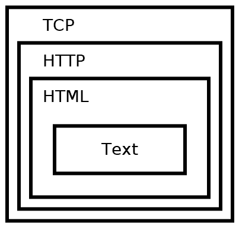
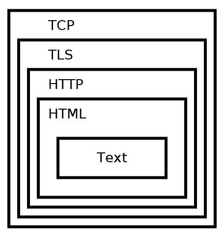
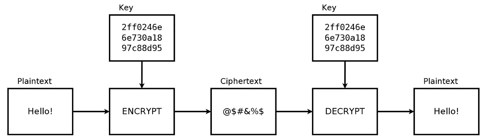
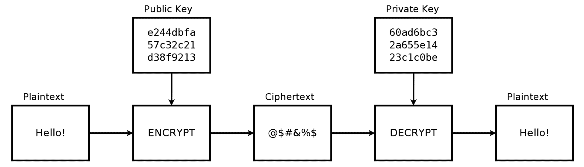
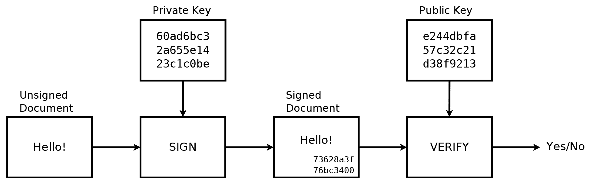
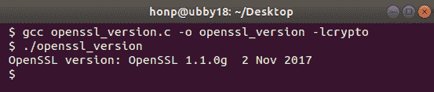
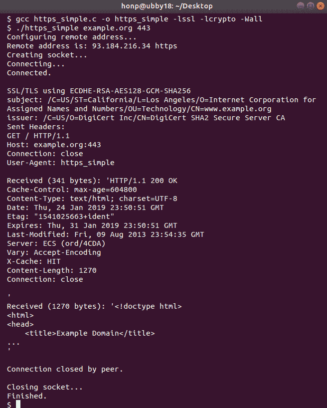

# 使用 HTTPS 和 OpenSSL 加载安全网页

本章我们将学习如何使用 **超文本传输协议安全**（**HTTPS**）来建立与 Web 服务器的安全连接。HTTPS 相比 HTTP 提供了多项优势。HTTPS 提供了一种身份验证方法来识别服务器并检测冒名者。它还保护了所有传输数据的安全性，防止拦截者篡改或伪造传输数据。

在 HTTPS 中，通信是通过 **传输层安全性**（**TLS**）来加密的。在本章中，我们将学习如何使用流行的 OpenSSL 库来提供 TLS 功能。

本章涵盖了以下主题：

+   HTTPS 的背景信息

+   加密算法类型

+   服务器如何进行身份验证

+   基本 OpenSSL 使用

+   创建简单的 HTTPS 客户端

# 技术要求

本章的示例程序可以使用任何现代 C 编译器编译。我们推荐 Windows 使用 MinGW，Linux 和 macOS 使用 GCC。你还需要安装 OpenSSL 库。请参阅附录 B 在 Windows 上设置您的 C 编译器、附录 C 在 Linux 上设置您的 C 编译器 和附录 D 在 macOS 上设置您的 C 编译器，了解编译器和 OpenSSL 的安装设置。

本书中的代码可以在 [`github.com/codeplea/Hands-On-Network-Programming-with-C`](https://github.com/codeplea/Hands-On-Network-Programming-with-C) 找到。

从命令行，你可以使用以下命令下载本章的代码：

```cpp
git clone https://github.com/codeplea/Hands-On-Network-Programming-with-C
cd Hands-On-Network-Programming-with-C/chap09
```

本章中的每个示例程序都可在 Windows、Linux 和 macOS 上运行。在 Windows 上编译时，每个示例程序都需要与 Winsock 库链接。这可以通过向 `gcc` 传递 `-lws2_32` 选项来实现。

每个示例还需要链接到 OpenSSL 库，`libssl.a` 和 `libcrypto.a`。这可以通过向 `gcc` 传递 `-lssl -lcrypto` 来实现。

我们提供了编译每个示例所需的精确命令。

本章中的所有示例程序都需要与我们在第二章 掌握套接字 API 中开发的相同头文件和 C 宏。为了简洁，我们将这些语句放在一个单独的头文件 `chap09.h` 中，我们可以在每个程序中包含它。有关这些语句的解释，请参阅第二章 掌握套接字 API。

`chap09.h` 文件的内容首先包含必要的网络头文件。相应的代码如下：

```cpp
#if defined(_WIN32)
#ifndef _WIN32_WINNT
#define _WIN32_WINNT 0x0600
#endif
#include <winsock2.h>
#include <ws2tcpip.h>
#pragma comment(lib, "ws2_32.lib")

#else
#include <sys/types.h>
#include <sys/socket.h>
#include <netinet/in.h>
#include <arpa/inet.h>
#include <netdb.h>
#include <unistd.h>
#include <errno.h>

#endif
```

我们还定义了一些宏来帮助编写可移植的代码，如下所示：

```cpp
/*chap09.h continued*/

#if defined(_WIN32)
#define ISVALIDSOCKET(s) ((s) != INVALID_SOCKET)
#define CLOSESOCKET(s) closesocket(s)
#define GETSOCKETERRNO() (WSAGetLastError())

#else
#define ISVALIDSOCKET(s) ((s) >= 0)
#define CLOSESOCKET(s) close(s)
#define SOCKET int
#define GETSOCKETERRNO() (errno)
#endif
```

最后，`chap09.h` 包含了一些额外的头文件，包括 OpenSSL 库的头文件。以下代码展示了这一点：

```cpp
/*chap09.h continued*/

#include <stdio.h>
#include <string.h>
#include <stdlib.h>
#include <time.h>

#include <openssl/crypto.h>
#include <openssl/x509.h>
#include <openssl/pem.h>
#include <openssl/ssl.h>
#include <openssl/err.h>
```

# HTTPS 概述

HTTPS 为 HTTP 提供安全。我们在第六章“构建简单的 Web 客户端”中介绍了 HTTP。HTTPS 通过在端口`443`上使用 TCP 的 TLS 来保护 HTTP。TLS 是一种可以为任何 TCP 连接提供安全的协议。

**TLS**是**安全套接字层**（**SSL**）的继任者，SSL 是一个较早的协议，也被 HTTPS 使用。TLS 和 SSL 是兼容的，本章的大部分信息也适用于 SSL。通常，建立 HTTPS 连接涉及客户端和服务器协商使用哪种协议。理想的结果是客户端和服务器就使用最安全、相互支持的协议和密钥协商一致。

当我们谈论协议安全时，我们通常寻找以下三个要素：

+   **身份验证**：我们需要一种方法来防止冒充者伪装成合法的通信伙伴。TLS 提供对等身份验证方法来解决这个问题。

+   **加密**：TLS 使用加密来混淆传输的数据。这阻止了窃听者正确解释截获的数据。

+   **完整性**：TLS 还确保接收到的数据没有被篡改或伪造。

**HTTP**最常用于传输网页。网页上的文本首先被编码为**超文本标记语言**（**HTML**）。**HTML**为网页提供格式化、布局和样式。然后使用**HTTP**传输**HTML**，而**HTTP**本身是通过**TCP**连接传输的。

从视觉上看，一个**HTTP**会话封装如下：



**TLS**在 TCP 内部工作，以提供安全的通信通道。然后 HTTPS 基本上与**HTTP**协议相同，但它是在**TLS**通道中发送的。

从视觉上看，HTTPS 是以以下方式封装的：



当然，如果使用**HTTP**传输图像、视频或其他数据而不是**HTML**，相同的抽象仍然适用。

请务必记住，这些抽象在概念层面上是准确的，但有些细节超越了层次。例如，一些 HTTPS 头信息用于引用**TLS**应用的安全参数。不过，总的来说，将**TLS**视为保护 HTTPS 使用的**TCP**连接是合理的。

虽然**TLS**最常用于 HTTPS 安全，但**TLS**也被用于保护许多基于**TCP**的其他协议。我们在第八章“让你的程序发送电子邮件”中提到的电子邮件协议 SMTP 也通常通过**TLS**进行加密。

在进一步详细介绍使用**TLS**之前，了解一些加密的必要背景信息是有用的。

# 加密基础

**加密**是一种编码数据的方法，只有授权的当事人才能访问它。加密不能防止拦截或干扰，但它阻止了潜在的攻击者访问原始数据。

加密算法被称为**密码**。加密密码将未加密的数据作为输入，称为**明文**。密码产生加密数据，称为**密文**，作为其输出。将明文转换为密文的过程称为加密，将其反向转换的过程称为**解密**。

现代密码使用密钥来控制数据的加密和解密。密钥通常是相对较短的伪随机数据序列。使用给定密钥加密的密文，如果没有正确的密钥，则无法解密。

广义上，密码分为两大类——对称密码和非对称密码。对称密码在加密和解密时使用相同的密钥，而非对称密码则使用两个不同的密钥。

# 对称密码

下面的图示说明了对称密码：



在前面的图中，明文**Hello!**使用对称密码进行加密。使用密钥与密码结合产生密文。这个密文可以传输到不安全的通道上，窃听者如果没有知道密钥，就无法解密它。密文的特权接收者使用解密算法和密钥将其转换回明文。

一些通用对称密码（不仅限于 TLS）如下：

+   **美国加密标准**（**AES**），也称为**Rijndael**

+   Camellia

+   **数据加密标准**（**DES**）

+   三重 DES

+   **国际数据加密算法**（**IDEA**）

+   QUAD

+   RC4

+   Salsa20, Chacha20

+   **小型加密算法**（**TEA**）

对称加密的一个问题是，相同的密钥必须为发送者和接收者所知。生成和传输这个密钥的安全性问题。如果双方没有安全的通信渠道，如何将密钥在双方之间发送？如果他们已经有了安全的通信渠道，那么为什么还需要加密呢？

密钥交换算法试图解决这些问题。密钥交换算法通过允许双方通信方生成相同的秘密密钥来工作。一般来说，双方首先同意一个公开的非秘密密钥。然后，每一方生成自己的秘密密钥并将其与公开密钥结合。这些组合密钥被交换。然后，每一方将其自己的秘密添加到组合密钥中，以得到一个组合的秘密密钥。这个组合的秘密密钥然后为双方所知，但窃听者无法推导出来。

目前最常用的密钥交换算法是**Diffie-Hellman 密钥交换算法**。

虽然密钥交换算法对窃听者具有抵抗力，但它们对拦截没有抵抗力。在拦截的情况下，攻击者可以站在密钥交换的中间，同时假装是相应的每一方。这被称为**中间人攻击**。

非对称密码可以用来解决这些问题中的某些问题。

# 非对称密码

**非对称加密**，也称为 **公钥加密**，试图解决对称加密中的密钥交换和认证问题。在非对称加密中，使用两个密钥。一个密钥可以加密数据，而另一个密钥可以解密它。这些密钥一起生成，并且数学上相关。然而，在事后从其中一个密钥推导出另一个密钥是不可能的。

下图展示了一个非对称加密算法：



使用非对称加密建立安全的通信通道更为简单。每一方都可以生成自己的非对称加密密钥。加密密钥可以无担忧地传输，而解密密钥则保持私密。在这个方案中，这些密钥分别被称为 **公钥** 和 **私钥**。

**Rivest-Shamir-Adleman** (**RSA**) 加密算法是第一种公钥加密算法之一，并且至今仍被广泛使用。较新的 **椭圆曲线加密** (**ECC**) 算法承诺更高的效率，并且正在迅速增加市场份额。

非对称加密也用于实现数字签名。数字签名用于验证数据的真实性。数字签名是通过使用私钥为文档生成签名来创建的。然后可以使用公钥来验证文档是否由私钥持有者签署。

下图说明了数字签名和验证过程：



TLS 使用这些方法的组合来实现安全性。

# TLS 使用加密算法的方式

数字签名在 TLS 中至关重要；它们用于验证服务器。如果没有数字签名，TLS 客户端将无法区分真实服务器和冒充者。

TLS 也可以使用数字签名来验证客户端，尽管在实践中这并不常见。大多数网络应用要么不关心客户端认证，要么使用其他更简单的方法，例如密码。

理论上，非对称加密可以用来保护整个通信通道。然而，在实践中，现代的非对称加密算法效率低下，只能保护少量数据。因此，在可能的情况下，首选对称加密算法。TLS 仅使用非对称加密来验证服务器。TLS 使用密钥交换算法和对称加密来保护实际的通信。

对于加密算法，总是会发现漏洞。因此，TLS 连接能够选择双方都支持的最好算法至关重要。这是通过 **加密套件** 来实现的。加密套件是一系列算法，通常包括 **密钥交换算法**、**批量加密算法** 和 **消息认证算法** (**MAC**)。

当 TLS 连接首次建立时，TLS 客户端向服务器发送一个首选的**加密套件**列表。TLS 服务器将从中选择一个用于连接的加密套件。如果服务器不支持客户端提供的任何加密套件，那么将无法建立安全的 TLS 连接。

在处理完一些关于安全性的背景信息之后，我们可以更详细地讨论 TLS。

# TLS 协议

在 TCP 连接建立之后，TLS 握手由客户端发起。客户端向服务器发送一系列规范，包括它正在运行的 SSL/TLS 版本、它支持的加密套件以及它希望使用的压缩方法。

服务器选择 SSL/TLS 协议中双方都支持的最高版本来使用。它还从客户端提供的选项中选择一个加密套件和压缩方法。

如果客户端和服务器都不支持任何共同的加密套件，那么将无法建立 TLS 连接。当使用非常旧的浏览器与较新的服务器一起使用时，这种情况并不少见。

在基本设置完成后，服务器向客户端发送其证书。客户端使用这个证书来验证它是否连接到了合法的服务器。我们将在下一节中更详细地讨论证书。

一旦客户端验证了服务器确实是它所声称的身份，就会发起密钥交换。密钥交换完成后，客户端和服务器都拥有一个共享的秘密密钥。所有后续的通信都使用这个密钥和它们选择的对称加密算法进行加密。

证书用于通过数字签名验证服务器身份。接下来让我们探讨它们是如何工作的。

# 证书

每个 HTTPS 服务器使用一个或多个证书来验证其身份。这个证书必须要么被客户端本身信任，要么被客户端信任的第三方信任。在常见的用法中，例如在网页浏览器中，实际上不可能列出所有受信任的证书。因此，最常见的方法是通过验证受信任的第三方是否信任它们来验证证书。这种信任是通过数字签名来证明的。

例如，一个流行的数字证书颁发机构是 DigiCert Inc. 假设你信任 DigiCert Inc. 并已将他们提供的证书存储在本地；然后你连接到网站 `example.com`。你可能不信任 `example.com`，因为你之前没有见过他们的证书。然而，`example.com` 向你展示，他们的证书已被你信任的 DigiCert Inc. 证书数字签名。因此，你也信任 `example.com` 网站的证书。

实际上，证书链可以有几层深。只要你能验证数字签名回溯到你信任的证书，你就能验证整个链。

这种方法是 HTTPS 用于验证服务器的常用方法。它确实存在一些问题；即，你必须完全信任证书颁发机构。这是因为证书颁发机构理论上可以向冒名顶替者颁发证书，在这种情况下，你将被迫信任冒名顶替者。证书颁发机构会小心避免这种情况，因为这会破坏它们的声誉。

在撰写本文时，最受欢迎的证书颁发机构如下：

+   IdenTrust

+   Comodo

+   DigiCert

+   GoDaddy

+   GlobalSign

前五个证书颁发机构负责了网络上 90%以上的 HTTPS 证书。

也可能自行签名证书。在这种情况下，不使用任何证书颁发机构。在这些情况下，客户端需要以某种可靠的方式获取并验证您的证书副本，然后才能信任它。

证书通常与域名匹配，但它们也可以识别其他信息，例如公司名称、地址等。

在下一章第十章《实现安全 Web 服务器》中，将更详细地介绍证书。

现在通常一个服务器托管多个不同的域名，每个域名都需要自己的证书。现在让我们考虑这些服务器如何知道要发送哪个证书。

# 服务器名称标识

许多服务器托管多个域名。证书与域名相关联；因此，TLS 必须提供一种方法让客户端指定它正在连接到哪个域名。你可能还记得，HTTP *Host* 标头用于此目的。问题是，TLS 连接应在发送 HTTP 数据之前建立。因此，服务器必须在接收到 HTTP *Host* 标头之前决定要传输哪个证书。

这是通过使用**服务器名称指示**（**SNI**）来实现的。SNI 是一种技术，当 TLS 使用时，要求客户端向服务器表明它正在尝试连接到哪个域名。然后服务器可以找到用于 TLS 连接的匹配证书。

SNI 相对较新，较旧的浏览器和服务器不支持它。在 SNI 流行之前，服务器有两个选择——它们可以每个 IP 地址只托管一个域名，或者它们可以为每个连接发送所有托管域的证书。

应该注意的是，SNI 涉及在网络中发送未加密的域名。这意味着窃听者可以看到客户端正在连接到哪个主机，尽管他们不知道客户端正在请求该主机的哪些资源。较新的协议，如**加密服务器名称标识**（**ESNI**），解决了这个问题，但尚未广泛部署。

在对 TLS 协议有基本了解之后，我们准备查看实现它的最流行库——OpenSSL。

# OpenSSL

**OpenSSL** 是一个广泛使用的开源库，为应用程序提供 SSL 和 TLS 服务。我们在本章中使用它来实现 HTTPS 所需的安全连接。

OpenSSL 的安装可能会有些挑战。有关更多信息，请参阅附录 B，*在 Windows 上设置您的 C 编译器*，附录 C，*在 Linux 上设置您的 C 编译器*，以及附录 D，*在 macOS 上设置您的 C 编译器*。

您可以通过运行以下命令来检查是否已安装 OpenSSL 命令行工具：

```cpp
openssl version
```

以下截图显示了在 Ubuntu Linux 上的情况：


您还需要确保已安装 OpenSSL 库。以下程序可以用来测试这一点。如果它编译并成功运行，那么您确实已安装并正在使用 OpenSSL 库：

```cpp
/*openssl_version.c*/

#include <openssl/ssl.h>

int main(int argc, char *argv[]) {
    printf("OpenSSL version: %s\n", OpenSSL_version(SSLEAY_VERSION));
    return 0;
}
```

如果您正在使用较旧的 OpenSSL 版本，您可能需要将 `OpenSSL_version()` 函数调用替换为 `SSLeay_version()`。然而，更好的解决方案是直接升级到较新的 OpenSSL 版本。

以下命令用于在 macOS 和 Linux 上编译前面的 `openssl_version.c` 程序：

```cpp
gcc openssl_version.c -o openssl_version -lcrypto
./openssl_version
```

以下截图显示了编译和运行 `openssl_version.c`：



在 Windows 上，`openssl_version` 可以使用 MinGW 和以下命令进行编译：

```cpp
gcc openssl_version.c -o openssl_version.exe -lcrypto
openssl_version.exe
```

一旦 OpenSSL 库安装并可用，我们就可以开始使用加密套接字。

# 使用 OpenSSL 加密套接字

OpenSSL 提供的 TLS 可以应用于任何 TCP 套接字。

在您的程序中使用 OpenSSL 之前，初始化它是很重要的。以下代码执行此操作：

```cpp
SSL_library_init();
OpenSSL_add_all_algorithms();
SSL_load_error_strings();
```

在前面的代码中，调用 `SSL_library_init()` 是初始化 OpenSSL 库所必需的。第二个调用（调用 `OpenSSL_add_all_algorithms()`）导致 OpenSSL 加载所有可用的算法。作为替代，您也可以只加载您知道需要的算法。对于我们来说，加载所有算法很容易。第三个调用 `SSL_load_error_strings()` 导致 OpenSSL 加载错误字符串。此调用不是严格必需的，但在出错时提供易于阅读的错误消息很有用。

一旦初始化 OpenSSL，我们就可以创建 SSL 上下文。这是通过调用 `SSL_CTX_new()` 函数来完成的，它返回一个 `SSL_CTX` 对象。您可以将此对象视为 SSL/TLS 连接的某种工厂。它包含您想要用于连接的初始设置。大多数程序只需要创建一个 `SSL_CTX` 对象，并且可以将其用于所有连接。

以下代码创建 SSL 上下文：

```cpp
SSL_CTX *ctx = SSL_CTX_new(TLS_client_method());
if (!ctx) {
    fprintf(stderr, "SSL_CTX_new() failed.\n");
    return 1;
}
```

`SSL_CTX_new()`函数接受一个参数。我们使用`TLS_client_method()`，这表示我们想要通用的、版本灵活的 TLS 方法。我们的客户端在连接时自动与服务器协商最佳相互支持的算法。

如果您使用的是较旧的 OpenSSL 版本，您可能需要在前面代码中将`TLS_client_method()`替换为`TLSv1_2_client_method()`。然而，一个更好的解决方案是升级到较新的 OpenSSL 版本。

要安全地建立 TCP 连接，您必须首先有一个 TCP 连接。这个 TCP 连接应该以正常方式建立。以下伪代码展示了这一点：

```cpp
getaddrinfo(hostname, port, hints, address);
socket = socket(address, type, protocol);
connect(socket, address, type);
```

关于设置 TCP 连接的更多信息，请参阅第三章，*TCP 连接的深入概述*。

一旦`connect()`成功返回，并建立了 TCP 连接，您可以使用以下代码来初始化 TLS 连接：

```cpp
SSL *ssl = SSL_new(ctx);
if (!ctx) {
    fprintf(stderr, "SSL_new() failed.\n");
    return 1;
}

if (!SSL_set_tlsext_host_name(ssl, hostname)) {
    fprintf(stderr, "SSL_set_tlsext_host_name() failed.\n");
    ERR_print_errors_fp(stderr);
    return 1;
}

SSL_set_fd(ssl, socket);
if (SSL_connect(ssl) == -1) {
    fprintf(stderr, "SSL_connect() failed.\n");
    ERR_print_errors_fp(stderr);
    return 1;
}
```

在前面的代码中，`SSL_new()`用于创建一个`SSL`对象。此对象用于跟踪新的 SSL/TLS 连接。

然后我们使用`SSL_set_tlsext_host_name()`来设置我们试图连接的服务器的域名。这允许 OpenSSL 使用 SNI。此调用是可选的，但如果没有它，当服务器托管多个站点时，服务器不知道应该发送哪个证书。

最后，我们调用`SSL_set_fd()`和`SSL_connect()`在我们的现有 TCP 套接字上初始化新的 TLS/SSL 连接。

可以查看 TLS 连接正在使用哪种加密套件。以下代码展示了这一点：

```cpp
printf ("SSL/TLS using %s\n", SSL_get_cipher(ssl));
```

一旦 TLS 连接建立，可以使用`SSL_write()`和`SSL_read()`分别发送和接收数据。这些函数的用法几乎与标准套接字`send()`和`recv()`函数相同。

以下示例展示了通过 TLS 连接传输简单消息：

```cpp
char *data = "Hello World!";
int bytes_sent = SSL_write(ssl, data, strlen(data));
```

接收数据，通过`SSL_read()`完成，如下面的示例所示：

```cpp
char read[4096];
int bytes_received = SSL_read(ssl, read, 4096);
printf("Received: %.*s\n", bytes_received, read);
```

当连接结束时，通过调用`SSL_shutdown()`和`SSL_free(ssl)`释放使用的资源非常重要。以下代码展示了这一点：

```cpp
SSL_shutdown(ssl);
CLOSESOCKET(socket);
SSL_free(ssl);
```

当您完成 SSL 上下文的工作时，也应该调用`SSL_CTX_free()`。在我们的例子中，它看起来像这样：

```cpp
SSL_CTX_free(ctx);
```

如果您的程序需要验证连接的对方，那么在 TLS 初始化期间发送的证书非常重要。让我们考虑一下。

# 证书

一旦 TLS 连接建立，我们可以使用`SSL_get_peer_certificate()`函数获取服务器的证书。打印证书主题和发行者也很简单，如下面的代码所示：

```cpp
    X509 *cert = SSL_get_peer_certificate(ssl);
    if (!cert) {
        fprintf(stderr, "SSL_get_peer_certificate() failed.\n");
        return 1;
    }

    char *tmp;
    if (tmp = X509_NAME_oneline(X509_get_subject_name(cert), 0, 0)) {
        printf("subject: %s\n", tmp);
        OPENSSL_free(tmp);
    }

    if (tmp = X509_NAME_oneline(X509_get_issuer_name(cert), 0, 0)) {
        printf("issuer: %s\n", tmp);
        OPENSSL_free(tmp);
    }

    X509_free(cert);
```

OpenSSL 在 TLS/SSL 握手过程中自动验证证书。您可以使用`SSL_get_verify_result()`函数获取验证结果。其用法在以下代码中展示：

```cpp
long vp = SSL_get_verify_result(ssl);
if (vp == X509_V_OK) {
    printf("Certificates verified successfully.\n");
} else {
    printf("Could not verify certificates: %ld\n", vp);
}
```

如果 `SSL_get_verify_result()` 返回 `X509_V_OK`，则 OpenSSL 已验证证书链，并且可以信任连接。如果 `SSL_get_verify_result()` 不返回 `X509_V_OK`，则 HTTPS 认证失败，应该放弃连接。

为了使 OpenSSL 成功验证证书，我们必须告诉它我们信任哪些证书颁发机构。这可以通过使用 `SSL_CTX_load_verify_locations()` 函数来完成。它必须传递存储所有受信任根证书的文件名。假设您的受信任证书存储在 `trusted.pem` 中，以下代码设置了这一配置：

```cpp
if (!SSL_CTX_load_verify_locations(ctx, "trusted.pem", 0)) {
    fprintf(stderr, "SSL_CTX_load_verify_locations() failed.\n");
    ERR_print_errors_fp(stderr);
    return 1;
}
```

决定信任哪些根证书并不容易。每个操作系统都提供了一份受信任证书列表，但没有一种通用的、简单的方法来导入这些列表。使用操作系统的默认列表也不总是适合每个应用程序。出于这些原因，本章的示例中省略了证书验证。然而，为了确保您的 HTTPS 连接安全，适当地实现证书验证是绝对必要的。

除了验证证书的签名外，验证证书实际上是否适用于您连接的特定服务器也很重要！较新的 OpenSSL 版本提供了帮助完成这一任务的函数，但使用较旧的 OpenSSL 版本时，您需要自行处理。有关更多信息，请参阅 OpenSSL 文档。

我们现在已经涵盖了关于 TLS 和 OpenSSL 的足够背景信息，可以开始处理一个具体的示例程序。

# 一个简单的 HTTPS 客户端

为了将本章的概念结合起来，我们构建了一个简单的 HTTPS 客户端。这个客户端可以连接到指定的 HTTPS 网络服务器并请求根文档 `/`。

我们的程序首先包含所需的章节头文件，定义 `main()` 函数，并初始化 Winsock，如下所示：

```cpp
/*https_simple.c*/

#include "chap09.h"

int main(int argc, char *argv[]) {

#if defined(_WIN32)
    WSADATA d;
    if (WSAStartup(MAKEWORD(2, 2), &d)) {
        fprintf(stderr, "Failed to initialize.\n");
        return 1;
    }
#endif
```

然后，我们使用以下代码初始化 OpenSSL 库：

```cpp
   /*https_simple.c continued*/

    SSL_library_init();
    OpenSSL_add_all_algorithms();
    SSL_load_error_strings();
```

`SSL_load_error_strings()` 函数调用是可选的，但如果遇到问题，它非常有用。

我们还可以创建一个 OpenSSL 上下文。这是通过调用 `SSL_CTX_new()` 来完成的，如下面的代码所示：

```cpp
   /*https_simple.c continued*/ 

    SSL_CTX *ctx = SSL_CTX_new(TLS_client_method());
    if (!ctx) {
        fprintf(stderr, "SSL_CTX_new() failed.\n");
        return 1;
    }
```

如果我们要进行证书验证，这将是一个包含 `SSL_CTX_load_verify_locations()` 函数调用的好地方，正如本章的 *证书* 部分所解释的。为了简化示例，我们省略了证书验证，但在实际应用中，包含它是很重要的。

我们的程序随后检查是否在命令行中传递了主机名和端口号，如下所示：

```cpp
/*https_simple.c continued*/

    if (argc < 3) {
        fprintf(stderr, "usage: https_simple hostname port\n");
        return 1;
    }

    char *hostname = argv[1];
    char *port = argv[2];
```

标准的 HTTPS 端口号是 `443`。我们的程序允许用户指定任何端口号，这在测试中可能很有用。

然后我们配置套接字连接的远程地址。此代码使用自第三章深入概述 TCP 连接以来我们所使用的相同技术。该代码如下：

```cpp
/*https_simple.c continued*/

    printf("Configuring remote address...\n");
    struct addrinfo hints;
    memset(&hints, 0, sizeof(hints));
    hints.ai_socktype = SOCK_STREAM;
    struct addrinfo *peer_address;
    if (getaddrinfo(hostname, port, &hints, &peer_address)) {
        fprintf(stderr, "getaddrinfo() failed. (%d)\n", GETSOCKETERRNO());
        exit(1);
    }

    printf("Remote address is: ");
    char address_buffer[100];
    char service_buffer[100];
    getnameinfo(peer_address->ai_addr, peer_address->ai_addrlen,
            address_buffer, sizeof(address_buffer),
            service_buffer, sizeof(service_buffer),
            NI_NUMERICHOST);
    printf("%s %s\n", address_buffer, service_buffer);
```

我们继续使用 `socket()` 调用创建套接字，并使用 `connect()` 函数连接它，如下所示：

```cpp
/*https_simple.c continued*/

    printf("Creating socket...\n");
    SOCKET server;
    server = socket(peer_address->ai_family,
            peer_address->ai_socktype, peer_address->ai_protocol);
    if (!ISVALIDSOCKET(server)) {
        fprintf(stderr, "socket() failed. (%d)\n", GETSOCKETERRNO());
        exit(1);
    }

    printf("Connecting...\n");
    if (connect(server,
                peer_address->ai_addr, peer_address->ai_addrlen)) {
        fprintf(stderr, "connect() failed. (%d)\n", GETSOCKETERRNO());
        exit(1);
    }
    freeaddrinfo(peer_address);

    printf("Connected.\n\n");
```

到目前为止，已建立 TCP 连接。如果我们不需要加密，我们可以直接通过它进行通信。然而，我们将使用 OpenSSL 在我们的 TCP 连接上初始化 TLS/SSL 连接。以下代码创建一个新的 SSL 对象，设置 SNI 的主机名，并初始化 TLS/SSL 握手：

```cpp
/*https_simple.c continued*/

    SSL *ssl = SSL_new(ctx);
    if (!ctx) {
        fprintf(stderr, "SSL_new() failed.\n");
        return 1;
    }

    if (!SSL_set_tlsext_host_name(ssl, hostname)) {
        fprintf(stderr, "SSL_set_tlsext_host_name() failed.\n");
        ERR_print_errors_fp(stderr);
        return 1;
    }

    SSL_set_fd(ssl, server);
    if (SSL_connect(ssl) == -1) {
        fprintf(stderr, "SSL_connect() failed.\n");
        ERR_print_errors_fp(stderr);
        return 1;
    }
```

前面的代码在本章前面的 *使用 OpenSSL 的加密套接字* 部分中进行了说明。

`SSL_set_tlsext_host_name()` 调用是可选的，但如果您可能连接到托管多个域的服务器，则很有用。如果没有这个调用，服务器将不知道哪些证书与这个连接相关。

有时了解客户端和服务器同意的加密套件也很有用。我们可以使用以下代码打印选定的加密套件：

```cpp
/*https_simple.c continued*/

    printf("SSL/TLS using %s\n", SSL_get_cipher(ssl));
```

看看服务器的证书也很有用。以下代码打印服务器的证书：

```cpp
/*https_simple.c continued*/

    X509 *cert = SSL_get_peer_certificate(ssl);
    if (!cert) {
        fprintf(stderr, "SSL_get_peer_certificate() failed.\n");
        return 1;
    }

    char *tmp;
    if ((tmp = X509_NAME_oneline(X509_get_subject_name(cert), 0, 0))) {
        printf("subject: %s\n", tmp);
        OPENSSL_free(tmp);
    }

    if ((tmp = X509_NAME_oneline(X509_get_issuer_name(cert), 0, 0))) {
        printf("issuer: %s\n", tmp);
        OPENSSL_free(tmp);
    }

    X509_free(cert);
```

证书的 *主题* 应该与我们连接到的域名匹配。发行者应该是我们信任的证书机构。注意，前面的代码 *不* 验证证书。有关更多信息，请参阅本章的 *证书* 部分。

我们可以发送我们的 HTTPS 请求。此请求与使用纯 HTTP 相同。我们首先将请求格式化到缓冲区中，然后使用 `SSL_write()` 通过加密连接发送它。以下代码展示了这一点：

```cpp
/*https_simple.c continued*/

    char buffer[2048];

    sprintf(buffer, "GET / HTTP/1.1\r\n");
    sprintf(buffer + strlen(buffer), "Host: %s:%s\r\n", hostname, port);
    sprintf(buffer + strlen(buffer), "Connection: close\r\n");
    sprintf(buffer + strlen(buffer), "User-Agent: https_simple\r\n");
    sprintf(buffer + strlen(buffer), "\r\n");

    SSL_write(ssl, buffer, strlen(buffer));
    printf("Sent Headers:\n%s", buffer);
```

有关 HTTP 协议的更多信息，请参阅第六章构建简单的 Web 客户端。

我们的客户端现在简单地等待来自服务器的数据，直到连接关闭。这是通过在循环中使用 `SSL_read()` 实现的。以下代码接收 HTTPS 响应：

```cpp
/*https_simple.c continued*/

    while(1) {
        int bytes_received = SSL_read(ssl, buffer, sizeof(buffer));
            if (bytes_received < 1) {
                printf("\nConnection closed by peer.\n");
                break;
            }

            printf("Received (%d bytes): '%.*s'\n",
                    bytes_received, bytes_received, buffer);
    }
```

前面的代码还打印了通过 HTTPS 连接接收到的任何数据。请注意，它不会解析接收到的 HTTP 数据，这会更复杂。请参阅本章代码库中的 `https_get.c` 程序，它是一个更高级的程序，可以解析 HTTP 响应。

我们简单的客户端几乎完成了。我们只需关闭 TLS/SSL 连接，关闭套接字，并进行清理。以下代码执行此操作：

```cpp
/*https_simple.c continued*/

    printf("\nClosing socket...\n");
    SSL_shutdown(ssl);
    CLOSESOCKET(server);
    SSL_free(ssl);
    SSL_CTX_free(ctx);

#if defined(_WIN32)
    WSACleanup();
#endif

    printf("Finished.\n");
    return 0;
}
```

这就完成了 `https_simple.c`。

您应该能够在 Windows 上使用 MinGW 和以下命令编译和运行它：

```cpp
gcc https_simple.c -o https_simple.exe -lssl -lcrypto -lws2_32
https_simple example.org 443
```

如果你使用某些较旧的 OpenSSL 版本，可能还需要额外的链接器选项—`-lgdi32`。

在 macOS 和 Linux 上编译和执行可以使用以下方法：

```cpp
gcc https_simple.c -o https_simple -lssl -lcrypto
./https_simple example.org 443
```

如果遇到链接错误，你应该检查你的 OpenSSL 库是否正确安装。尝试首先编译 `openssl_version.c` 程序可能会有所帮助。

以下截图显示了成功编译 `https_simple.c` 并使用它连接到 `example.org`：



`https_simple` 程序应该作为连接作为 HTTPS 客户端的技术的入门级示例。这些相同的技巧可以应用于任何 TCP 连接。

将这些技术应用于书中早期开发的某些程序，如 `tcp_client` 和 `web_get`，是很容易的。

值得注意的是，虽然 TLS 只与 TCP 连接一起工作，但**数据报传输层安全**（**DTLS**）旨在为**用户数据报协议**（**UDP**）数据报提供许多相同的保证。OpenSSL 也提供了对 DTLS 的支持。

# 其他示例

本章的存储库中还包括了一些其他示例。它们如下：

+   `tls_client.c`：这是 第三章，*TCP 连接的深入概述* 中的 `tcp_client.c`，但它已被修改以建立 TLS 连接。

+   `https_get.c`：这是 第六章，*构建简单的 Web 客户端* 中的 `web_get.c` 程序，但它已被修改为支持 HTTPS。你可以将其视为 `https_simple.c` 的扩展版本。

+   `tls_get_cert.c`：这个程序类似于 `https_simple.c`，但它只是打印出已连接服务器的证书并退出。

请记住，本章中的所有示例都不执行证书验证。在使用这些程序在实际环境中之前，这是一个必须添加的重要步骤。

# 摘要

在本章中，我们学习了 HTTPS 相较于 HTTP 提供的功能，例如身份验证和加密。我们了解到 HTTPS 实际上是在 TLS 连接上的 HTTP，并且 TLS 可以应用于任何 TCP 连接。

我们还学习了基本的加密概念。我们看到了非对称加密如何使用两个密钥，以及这如何允许数字签名。我们简要介绍了证书的基础知识，并探讨了验证它们的一些困难。

最后，我们通过一个具体的示例建立了与 HTTPS 服务器的 TLS 连接。

本章全部关于 HTTPS 客户端，但在下一章中，我们将关注 HTTPS 服务器的工作方式。

# 问题

尝试以下问题来测试你对本章知识的掌握：

1.  HTTPS 通常在哪个端口上运行？

1.  对称加密使用多少个密钥？

1.  非对称加密使用多少个密钥？

1.  TLS 使用的是对称加密还是非对称加密？

1.  SSL 和 TLS 之间的区别是什么？

1.  证书有什么作用？

答案在 附录 A，*问题解答* 中。

# 进一步阅读

关于 HTTPS 和 OpenSSL 的更多信息，请参阅以下内容：

+   OpenSSL 文档 ([`www.openssl.org/docs/`](https://www.openssl.org/docs/))

+   **RFC 5246**: *传输层安全性协议（**TLS**）* ([`tools.ietf.org/html/rfc5246`](https://tools.ietf.org/html/rfc5246))
