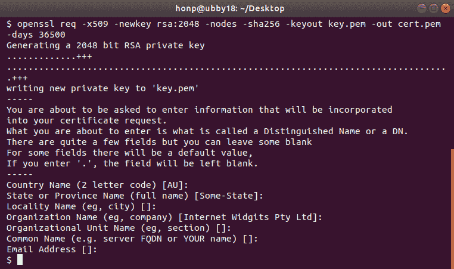
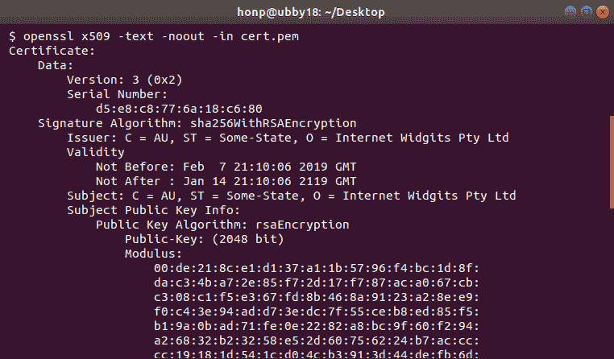
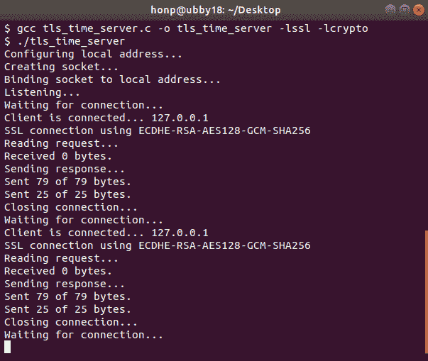
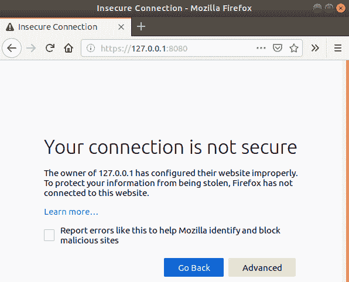
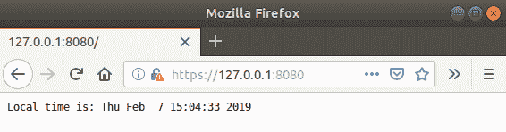
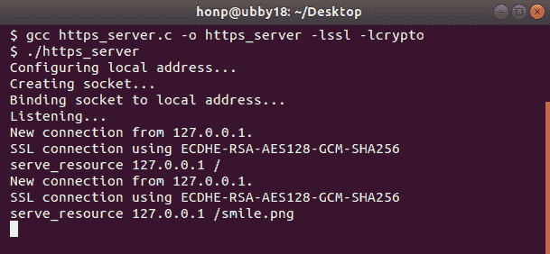
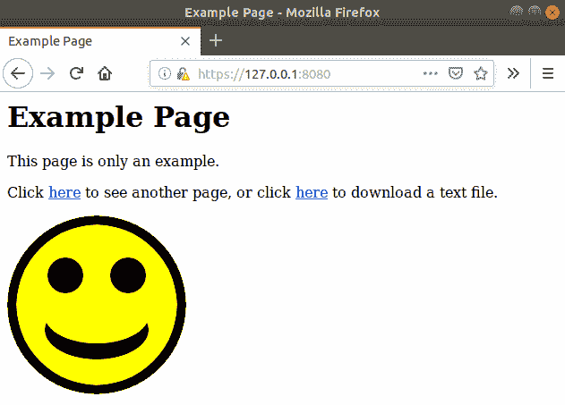

# 实现安全 Web 服务器

在本章中，我们将构建一个简单的 HTTPS 服务器程序。这作为我们在上一章中工作的 HTTPS 客户端的对立面。

HTTPS 由**传输层安全性**（**TLS**）提供支持。与 HTTPS 客户端不同，HTTPS 服务器预计会使用证书来识别自己。我们将介绍如何监听 HTTPS 连接、提供证书以及通过 TLS 发送 HTTP 响应。

本章涵盖了以下主题：

+   HTTPS 概述

+   HTTPS 证书

+   使用 OpenSSL 设置 HTTPS 服务器

+   接受 HTTPS 连接

+   常见问题

+   OpenSSL 替代方案

+   直接 TLS 终止替代方案

# 技术要求

本章从第九章，“使用 HTTPS 和 OpenSSL 加载安全 Web 页面”的结尾继续。本章将继续使用 OpenSSL 库。您必须安装 OpenSSL 库，并且需要了解使用 OpenSSL 编程的基础知识。有关 OpenSSL 的基本信息，请参阅第九章，“使用 HTTPS 和 OpenSSL 加载安全 Web 页面”。

本章中的示例程序可以使用任何现代 C 编译器编译。我们推荐 Windows 上的**MinGW**和 Linux 及 macOS 上的**GCC**。您还需要安装 OpenSSL 库。有关编译器和 OpenSSL 安装的说明，请参阅附录 B，“在 Windows 上设置您的 C 编译器”；附录 C，“在 Linux 上设置您的 C 编译器”；以及附录 D，“在 macOS 上设置您的 C 编译器”。

本书代码可在[`github.com/codeplea/Hands-On-Network-Programming-with-C`](https://github.com/codeplea/Hands-On-Network-Programming-with-C)找到。

您可以从命令行使用以下命令下载本章的代码：

```cpp
git clone https://github.com/codeplea/Hands-On-Network-Programming-with-C
cd Hands-On-Network-Programming-with-C/chap10
```

本章中的每个示例程序都可在 Windows、Linux 和 macOS 上运行。在 Windows 上编译时，每个示例程序都需要与**Winsock**库链接。这可以通过向`gcc`传递`-lws2_32`选项来实现。

每个示例还需要链接到 OpenSSL 库，`libssl.a`和`libcrypto.a`。这可以通过向 GCC 传递`-lssl -lcrypto`来实现。

我们将提供编译每个示例所需的精确命令。

本章中所有示例程序都需要与我们在第二章，“掌握 Socket API”，中开发的相同头文件和 C 宏。为了简洁，我们将这些语句放在一个单独的头文件`chap10.h`中，可以在每个程序中包含它。有关这些语句的解释，请参阅第二章，“掌握 Socket API”。

`chap10.h` 的内容首先包含所需的网络头文件。相应的代码如下：

```cpp
/*chap10.h*/

#if defined(_WIN32)
#ifndef _WIN32_WINNT
#define _WIN32_WINNT 0x0600
#endif
#include <winsock2.h>
#include <ws2tcpip.h>
#pragma comment(lib, "ws2_32.lib")

#else
#include <sys/types.h>
#include <sys/socket.h>
#include <netinet/in.h>
#include <arpa/inet.h>
#include <netdb.h>
#include <unistd.h>
#include <errno.h>

#endif
```

我们还定义了一些宏来帮助编写可移植的代码：

```cpp
/*chap10.h continued*/

#if defined(_WIN32)
#define ISVALIDSOCKET(s) ((s) != INVALID_SOCKET)
#define CLOSESOCKET(s) closesocket(s)
#define GETSOCKETERRNO() (WSAGetLastError())

#else
#define ISVALIDSOCKET(s) ((s) >= 0)
#define CLOSESOCKET(s) close(s)
#define SOCKET int
#define GETSOCKETERRNO() (errno)
#endif
```

最后，`chap10.h` 包含了这一章程序所需的额外头文件：

```cpp
/*chap10.h continued*/

#include <stdio.h>
#include <string.h>
#include <stdlib.h>
#include <time.h>

#include <openssl/crypto.h>
#include <openssl/x509.h>
#include <openssl/pem.h>
#include <openssl/ssl.h>
#include <openssl/err.h>
```

# HTTPS 和 OpenSSL 概述

我们首先快速回顾一下 HTTPS 协议，这部分内容在第九章中有详细说明，即*使用 HTTPS 和 OpenSSL 加载安全网页*。然而，我们仍然建议你在开始这一章之前，先阅读第九章，*使用 HTTPS 和 OpenSSL 加载安全网页*。

HTTPS 使用 TLS 为 HTTP 添加安全性。你会记得从第六章，*构建简单的 Web 客户端*和第七章，*构建简单的 Web 服务器*中了解到，HTTP 是一种基于文本的协议，它在 TCP 的 `80` 端口上工作。TLS 协议可以用于为任何基于 TCP 的协议添加安全性。具体来说，TLS 用于为 HTTPS 提供安全性。所以简单来说，HTTPS 就是带有 TLS 的 HTTP。默认的 HTTPS 端口是 `443`。

OpenSSL 是一个流行的开源库，它提供了 TLS/SSL 和 HTTPS 的功能。我们在本书中使用它来提供实现 HTTPS 客户端和服务器所需的方法。

通常，HTTPS 连接首先使用 TCP 套接字建立。一旦 TCP 连接建立，OpenSSL 就用于在开放的 TCP 连接上协商 TLS 连接。从那时起，OpenSSL 函数用于通过 TLS 连接发送和接收数据。

通信安全的一个重要部分是能够信任连接是到预期的当事人。如果你连接到了冒名顶替者，那么任何数据加密都无法帮助。TLS 使用证书来防止连接到冒名顶替者和中间人攻击。

在我们继续进行 HTTPS 服务器之前，我们需要更详细地了解证书。

# 证书

**证书**是 TLS 协议的重要组成部分。尽管证书可以在客户端和服务器端都使用，但 HTTPS 通常只使用服务器证书。这些证书向客户端表明，他们连接到了一个受信任的服务器。

没有证书，客户端就无法判断自己是否连接到了预期的服务器或冒名顶替的服务器。

证书使用**信任链**模型工作。每个 HTTPS 客户端都有几个他们明确信任的证书颁发机构，证书颁发机构提供数字签名证书的服务。这项服务通常需要收取少量费用，并且通常在请求者进行一些简单的验证之后才会进行。

当 HTTPS 客户端看到一个它信任的权威机构签发的证书时，它也信任该证书。确实，这些信任链可以非常深入。例如，大多数证书颁发机构也允许转售商。在这些情况下，证书颁发机构签发一个中间证书供转售商使用。然后，转售商使用这个中间证书来签发新的证书。客户端信任中间证书，因为它们是由受信任的证书颁发机构签发的，客户端信任转售商签发的证书，因为他们信任中间证书。

证书颁发机构通常提供两种类型的验证。**域名验证**是指仅在验证证书接收者可以在指定的域名下被访问后，就颁发一个已签名的证书。这通常是通过让证书请求者临时修改 DNS 记录，或回复发送到他们*whois*联系人的电子邮件来完成的。

**Let's Encrypt**是一个相对较新的证书颁发机构，它免费颁发证书。他们通过自动化模型来完成这项工作。**域名验证**是通过让证书请求者通过 HTTP 或 HTTPS 服务一个小文件来完成的。

域名验证是最常见的验证类型。使用域名验证的 HTTPS 服务器向 HTTPS 客户端保证，他们连接到的域名是他们认为的域名。这意味着他们的连接没有被静默劫持或以其他方式拦截。

证书颁发机构还提供**扩展验证**（**EV**）证书。EV 证书只有在权威机构验证了接收者的身份后才会颁发。这通常是通过使用公共记录和电话通话来完成的。

对于面向公众的 HTTPS 应用程序，从公认的证书颁发机构获取证书是很重要的。然而，这有时可能会很繁琐，对于开发和测试目的，获取一个**自签名**证书通常要方便得多。我们现在就来做这件事。

# 使用 OpenSSL 的自签名证书

由公认的权威机构签发的证书对于建立公共网站所需的信任链至关重要。然而，对于测试或开发来说，获取一个自签名证书要容易得多。

对于某些私有的应用程序，其中客户端可以部署带有证书的副本，并且只信任该证书，使用自签名证书也是可以接受的。这被称为**证书固定**。确实，当正确使用时，证书固定可能比使用证书颁发机构更安全。然而，它不适合面向公众的网站。

我们需要一个证书来测试我们的 HTTPS 服务器。我们使用自签名证书，因为它们最容易获得。这种方法的不利之处在于，网络浏览器不会信任我们的服务器。我们可以通过在浏览器中点击几个警告来解决这个问题。

OpenSSL 提供了工具，使得自签名证书的签发变得非常简单。

自签名证书的基本命令如下：

```cpp
openssl req -x509 -newkey rsa:2048 -nodes -sha256 -keyout key.pem \
-out cert.pem -days 365
```

OpenSSL 会询问有关证书上应放置的内容，包括主题、您的姓名、公司、位置等。您可以在所有这些方面使用默认值，因为这对我们的测试目的并不重要。

上述命令将新证书放置在`cert.pem`中，并将对应的密钥放在`key.pem`中。我们的 HTTPS 服务器需要这两个文件。`cert.pem`是发送给连接客户端的证书，而`key.pem`为我们服务器提供加密密钥，以证明它拥有该证书。保护此密钥的秘密至关重要。

下面是一张显示生成新自签名证书的截图：



您还可以使用 OpenSSL 查看证书。以下命令可以完成此操作：

```cpp
openssl x509 -text -noout -in cert.pem
```

如果您在 Windows 上使用 MSYS，您可能会从之前的命令中得到乱码的行结束符。如果是这样，请尝试使用`unix2dos`来修复它，如下所示：

```cpp
openssl x509 -text -noout -in cert.pem | unix2dos
```

下面是一个典型的自签名证书的外观：



现在我们有了可用的证书，我们就可以开始我们的 HTTPS 服务器编程了。

# 使用 OpenSSL 的 HTTPS 服务器

在开始具体示例之前，让我们先回顾一下在服务器应用程序中使用 OpenSSL 库的一些基本知识。

在使用 OpenSSL 之前，必须对其进行初始化。以下代码初始化了 OpenSSL 库，加载必要的加密算法，并加载有用的错误字符串：

```cpp
SSL_library_init();
OpenSSL_add_all_algorithms();
SSL_load_error_strings();
```

请参考之前的第九章，*使用 HTTPS 和 OpenSSL 加载安全网页*，获取更多信息。

我们的服务器还需要创建一个 SSL 上下文对象。该对象充当一种工厂，我们可以从中创建 TLS/SSL 连接。

以下代码创建`SSL_CTX`对象：

```cpp
SSL_CTX *ctx = SSL_CTX_new(TLS_server_method());
if (!ctx) {
    fprintf(stderr, "SSL_CTX_new() failed.\n");
    return 1;
}
```

如果您正在使用较旧的 OpenSSL 版本，您可能需要在上述代码中将`TLS_server_method()`替换为`TLSv1_2_server_method()`。然而，更好的解决方案是升级到较新的 OpenSSL 版本。

在创建`SSL_CTX`对象之后，我们可以将其设置为使用我们的自签名证书和密钥。以下代码执行此操作：

```cpp
if (!SSL_CTX_use_certificate_file(ctx, "cert.pem" , SSL_FILETYPE_PEM)
|| !SSL_CTX_use_PrivateKey_file(ctx, "key.pem", SSL_FILETYPE_PEM)) {
    fprintf(stderr, "SSL_CTX_use_certificate_file() failed.\n");
    ERR_print_errors_fp(stderr);
    return 1;
}
```

这就完成了 HTTPS 服务器所需的最低限度的 OpenSSL 设置。

服务器应随后监听传入的 TCP 连接。这在第三章，*TCP 连接的深入概述*中已有详细说明。

在建立新的 TCP 连接后，我们使用`accept()`返回的套接字创建我们的 TLS/SSL 套接字。

首先，使用我们之前创建的 SSL 上下文创建一个新的`SSL`对象。以下代码演示了这一点：

```cpp
SSL *ssl = SSL_new(ctx);
if (!ctx) {
    fprintf(stderr, "SSL_new() failed.\n");
    return 1;
}
```

然后使用`SSL_set_fd()`将`SSL`对象链接到我们的打开的 TCP 套接字。调用`SSL_accept()`函数以建立 TLS/SSL 连接。以下代码演示了这一点：

```cpp
SSL_set_fd(ssl, socket_client);
if (SSL_accept(ssl) <= 0) {
    fprintf(stderr, "SSL_accept() failed.\n");
    ERR_print_errors_fp(stderr);
    return 1;
}

printf ("SSL connection using %s\n", SSL_get_cipher(ssl));
```

你可能会注意到这段代码与第九章中 HTTPS 客户端代码非常相似，使用 HTTPS 和 OpenSSL 加载安全网页。唯一的真正区别在于 SSL 上下文对象的设置。

一旦建立了 TLS 连接，就可以使用`SSL_write()`和`SSL_read()`发送和接收数据。这些函数替换了与 TCP 套接字一起使用的`send()`和`recv()`函数。

连接完成后，释放资源很重要，如下面的代码所示：

```cpp
SSL_shutdown(ssl);
CLOSESOCKET(socket_client);
SSL_free(ssl);
```

当你的程序完成接受新连接后，你也应该释放 SSL 上下文对象。下面的代码展示了这一点：

```cpp
SSL_CTX_free(ctx);
```

在理解了基础知识之后，让我们通过实现一个简单的示例程序来巩固我们的知识。

# 时间服务器示例

在本章中，我们开发了一个简单的显示时间给 HTTPS 客户端的时间服务器。这个程序是`time_server.c`的改编，来自第二章，*掌握 Socket API 入门*，它通过纯 HTTP 提供了时间。我们的程序首先包含章节头文件，定义`main()`，并在 Windows 上初始化 Winsock。代码如下：

```cpp
/*tls_time_server.c*/

#include "chap10.h"

int main() {

#if defined(_WIN32)
    WSADATA d;
    if (WSAStartup(MAKEWORD(2, 2), &d)) {
        fprintf(stderr, "Failed to initialize.\n");
        return 1;
    }
#endif
```

然后使用以下代码初始化 OpenSSL 库：

```cpp
/*tls_time_server.c continued*/

    SSL_library_init();
    OpenSSL_add_all_algorithms();
    SSL_load_error_strings();
```

必须为我们的服务器创建一个 SSL 上下文对象。这是通过调用`SSL_CTX_new()`完成的。下面的代码展示了这个调用：

```cpp
/*tls_time_server.c continued*/

    SSL_CTX *ctx = SSL_CTX_new(TLS_server_method());
    if (!ctx) {
        fprintf(stderr, "SSL_CTX_new() failed.\n");
        return 1;
    }
```

如果你使用的是较旧的 OpenSSL 版本，你可能需要在前面代码中将`TLS_server_method()`替换为`TLSv1_2_server_method()`。然而，你可能最好升级到较新的 OpenSSL 版本。

一旦创建了 SSL 上下文，我们就可以将我们的服务器证书与之关联。下面的代码将 SSL 上下文设置为使用我们的证书：

```cpp
/*tls_time_server.c continued*/

    if (!SSL_CTX_use_certificate_file(ctx, "cert.pem" , SSL_FILETYPE_PEM)
    || !SSL_CTX_use_PrivateKey_file(ctx, "key.pem", SSL_FILETYPE_PEM)) {
        fprintf(stderr, "SSL_CTX_use_certificate_file() failed.\n");
        ERR_print_errors_fp(stderr);
        return 1;
    }
```

确保你已经生成了适当的证书和密钥。请参考本章早些时候的*使用 OpenSSL 的自签名证书*部分。

一旦使用适当的证书配置了 SSL 上下文，我们的程序就会以正常方式创建一个监听 TCP 套接字。它从调用`getaddrinfo()`和`socket()`开始，如下面的代码所示：

```cpp
/*tls_time_server.c continued*/

    printf("Configuring local address...\n");
    struct addrinfo hints;
    memset(&hints, 0, sizeof(hints));
    hints.ai_family = AF_INET;
    hints.ai_socktype = SOCK_STREAM;
    hints.ai_flags = AI_PASSIVE;

    struct addrinfo *bind_address;
    getaddrinfo(0, "8080", &hints, &bind_address);

    printf("Creating socket...\n");
    SOCKET socket_listen;
    socket_listen = socket(bind_address->ai_family,
            bind_address->ai_socktype, bind_address->ai_protocol);
    if (!ISVALIDSOCKET(socket_listen)) {
        fprintf(stderr, "socket() failed. (%d)\n", GETSOCKETERRNO());
        return 1;
    }
```

前面代码创建的套接字使用`bind()`绑定到监听地址。`listen()`函数用于将套接字设置为监听状态。下面的代码演示了这一点：

```cpp
  /*tls_time_server.c continued*/

    printf("Binding socket to local address...\n");
    if (bind(socket_listen,
                bind_address->ai_addr, bind_address->ai_addrlen)) {
        fprintf(stderr, "bind() failed. (%d)\n", GETSOCKETERRNO());
        return 1;
    }
    freeaddrinfo(bind_address);

    printf("Listening...\n");
    if (listen(socket_listen, 10) < 0) {
        fprintf(stderr, "listen() failed. (%d)\n", GETSOCKETERRNO());
        return 1;
    }
```

如果前面的代码不熟悉，请参阅第三章，*TCP 连接的深入概述*。

注意，前面的代码将监听端口号设置为`8080`。HTTPS 的标准端口号是`443`。通常使用高端口进行测试会更方便，因为低端口在某些操作系统上需要特殊权限。

我们的服务器使用`while`循环接受多个连接。请注意，这并不是真正的多路复用，因为一次只处理一个连接。然而，对于测试目的来说，能够顺序处理多个连接是方便的。我们的自签名证书导致主流浏览器在第一次尝试时拒绝我们的连接。只有在添加异常之后，连接才能成功。通过让我们的代码循环，这使得添加此异常变得更容易。

我们的`while`循环首先使用`accept()`等待新的连接。这是通过以下代码完成的：

```cpp
/*tls_time_server.c continued*/

 while (1) {

        printf("Waiting for connection...\n");
        struct sockaddr_storage client_address;
        socklen_t client_len = sizeof(client_address);
        SOCKET socket_client = accept(socket_listen,
                (struct sockaddr*) &client_address, &client_len);
        if (!ISVALIDSOCKET(socket_client)) {
            fprintf(stderr, "accept() failed. (%d)\n", GETSOCKETERRNO());
            return 1;
        }
```

一旦连接被接受，我们使用`getnameinfo()`来打印客户端的地址。这有时对调试很有用。以下代码执行此操作：

```cpp
/*tls_time_server.c continued*/

        printf("Client is connected... ");
        char address_buffer[100];
        getnameinfo((struct sockaddr*)&client_address,
                client_len, address_buffer, sizeof(address_buffer), 0, 0,
                NI_NUMERICHOST);
        printf("%s\n", address_buffer);
```

一旦 TCP 连接建立，就需要创建一个 `SSL` 对象。这是通过调用`SSL_new()`完成的，如下所示：

```cpp
/*tls_time_server.c continued*/

        SSL *ssl = SSL_new(ctx);
        if (!ctx) {
            fprintf(stderr, "SSL_new() failed.\n");
            return 1;
        }
```

通过调用`SSL_set_fd()`将 SSL 对象与打开的套接字关联起来。然后，通过调用`SSL_accept()`初始化 TLS/SSL 连接。以下代码显示了这一点：

```cpp
/*tls_time_server.c continued*/

        SSL_set_fd(ssl, socket_client);
        if (SSL_accept(ssl) <= 0) {
            fprintf(stderr, "SSL_accept() failed.\n");
            ERR_print_errors_fp(stderr);

            SSL_shutdown(ssl);
            CLOSESOCKET(socket_client);
            SSL_free(ssl);

            continue;
        }

        printf ("SSL connection using %s\n", SSL_get_cipher(ssl));
```

在前面的代码中，调用`SSL_accept()`函数可能会因许多原因失败。例如，如果连接的客户端不相信我们的证书，或者客户端和服务器无法就加密套件达成一致，那么对`SSL_accept()`的调用就会失败。当它失败时，我们只需清理分配的资源并使用`continue`重复我们的监听循环。

一旦 TCP 和 TLS/SSL 连接完全打开，我们使用`SSL_read()`来接收客户端的请求。我们的程序忽略此请求的内容。这是因为我们的程序只提供时间。客户端请求的内容无关紧要——我们的服务器会以时间响应。

以下代码使用`SSL_read()`等待并读取客户端的请求：

```cpp
/*tls_time_server.c continued*/

        printf("Reading request...\n");
        char request[1024];
        int bytes_received = SSL_read(ssl, request, 1024);
        printf("Received %d bytes.\n", bytes_received);
```

以下代码使用`SSL_write()`将 HTTP 头部信息传输到客户端：

```cpp
/*tls_time_server.c continued*/

        printf("Sending response...\n");
        const char *response =
            "HTTP/1.1 200 OK\r\n"
            "Connection: close\r\n"
            "Content-Type: text/plain\r\n\r\n"
            "Local time is: ";
        int bytes_sent = SSL_write(ssl, response, strlen(response));
        printf("Sent %d of %d bytes.\n", bytes_sent, (int)strlen(response));
```

然后，使用`time()`和`ctime()`函数格式化当前时间。一旦时间在`time_msg`中格式化，它也会通过`SSL_write()`发送到客户端。以下代码显示了这一点：

```cpp
/*tls_time_server.c continued*/

        time_t timer;
        time(&timer);
        char *time_msg = ctime(&timer);
        bytes_sent = SSL_write(ssl, time_msg, strlen(time_msg));
        printf("Sent %d of %d bytes.\n", bytes_sent, (int)strlen(time_msg));
```

最后，在数据传输到客户端后，连接被关闭，循环重复。以下代码显示了这一点：

```cpp
/*tls_time_server.c continued*/

        printf("Closing connection...\n");
        SSL_shutdown(ssl);
        CLOSESOCKET(socket_client);
        SSL_free(ssl);
    }
```

如果循环终止，关闭监听套接字并清理 SSL 上下文将很有用，如下所示：

```cpp
/*tls_time_server.c continued*/

    printf("Closing listening socket...\n");
    CLOSESOCKET(socket_listen);
    SSL_CTX_free(ctx);
```

最后，如果需要，Winsock 应该被清理：

```cpp
/*tls_time_server.c continued*/

#if defined(_WIN32)
    WSACleanup();
#endif

    printf("Finished.\n");

    return 0;
}
```

这就完成了`tls_time_server.c`。

您可以使用以下命令在 macOS 或 Linux 上编译和运行程序：

```cpp
gcc tls_time_server.c -o tls_time_server -lssl -lcrypto
./tls_time_server
```

在 Windows 上，编译和运行程序使用以下命令：

```cpp
gcc tls_time_server.c -o tls_time_server.exe -lssl -lcrypto -lws2_32
tls_time_server
```

如果您遇到链接错误，请确保 OpenSSL 库已正确安装。尝试从第九章，*使用 HTTPS 和 OpenSSL 加载安全网页*编译`openssl_version.c`可能会有所帮助。

以下截图显示了运行`tls_time_server`可能的样子：



你可以通过在网页浏览器中导航到`https://127.0.0.1:8080`来连接到时间服务器。在第一次连接时，你的浏览器将拒绝自签名证书。以下截图显示了在 Firefox 中这种拒绝的样子：



要访问时间服务器，你需要在浏览器中添加一个异常。每种浏览器的这种方法都不同，但通常有一个高级按钮，可以引导到一个选项，要么添加证书异常，要么继续使用不安全的连接。

一旦浏览器连接建立，你将能够看到由我们的`tls_time_server`程序提供的当前时间：



`tls_time_server`程序证明了它在展示如何设置 TLS/SSL 服务器而无需陷入实现完整 HTTPS 服务器的细节中非常有用。然而，本章的代码库还包括了一个更完整的 HTTPS 服务器。

# 完整的 HTTPS 服务器

本章的代码库中包含了`https_server.c`。这个程序是对第七章中的`web_server.c`进行的修改，*构建一个简单的 Web 服务器*。它可以用来通过 HTTPS 提供简单的静态网站。

在`https_server.c`程序中，基本的 TLS/SSL 连接设置和建立方式与`tls_time_server.c`中所示相同。一旦建立了安全连接，连接就简单地被当作 HTTP 处理。

`https_server`使用与`tls_time_server`相同的技巧进行编译。以下截图显示了如何编译和运行`https_server`：



一旦`https_server`启动，你可以通过在网页浏览器中导航到`https://127.0.0.1:8080`来连接到它。你可能会在第一次连接时需要添加一个安全异常。代码被设置为从`chap07`目录提供静态页面。

以下截图是网页浏览器连接到`https_server`时的样子：



本章的示例程序展示了 HTTPS 服务器的基本知识。然而，实现一个真正健壮的 HTTPS 服务器确实涉及额外的挑战。现在让我们考虑一些这些挑战。

# HTTPS 服务器挑战

本章应仅作为 TLS/SSL 服务器编程的介绍。关于安全网络编程还有很多东西要学习。在部署使用 OpenSSL 的 HTTPS 服务器之前，仔细审查所有 OpenSSL 文档是至关重要的。许多 OpenSSL 函数在本章的示例代码中都被忽略了，它们有边缘情况。

多路复用在 OpenSSL 中也可能变得复杂。在典型的 TCP 服务器中，我们一直使用 `select()` 函数来指示数据可读。`select()` 函数直接作用于 TCP 套接字。在带有 TLS/SSL 的服务器上使用 `select()` 可能很棘手。这是因为 `select()` 指示 TCP 层上的数据是否可用。这通常，但不总是，意味着可以使用 `SSL_read()` 读取数据。如果你打算与 `select()` 一起使用 `SSL_read()`，那么仔细查阅 OpenSSL 的 `SSL_read()` 文档是很重要的。本章中的示例程序出于简单起见，忽略了这些可能性。

同样，也有 OpenSSL 的替代方案。现在让我们考虑一些替代方案。

# OpenSSL 的替代方案

虽然 **OpenSSL** 是实现 TLS 的最古老和最广泛部署的库之一，但近年来涌现了许多替代库。其中一些替代方案旨在提供比 OpenSSL 更好的功能、性能或质量控制。

下表包含了一些替代的开源 TLS 库：

| **TLS 库** | **网站** |
| --- | --- |
| cryptlib | [`www.cryptlib.com/`](https://www.cryptlib.com/) |
| GnuTLS | [`www.gnutls.org/`](https://www.gnutls.org/) |
| LibreSSL | [`www.libressl.org/`](https://www.libressl.org/) |
| mbed TLS | [`tls.mbed.org/`](https://tls.mbed.org/) |
| 网络安全服务 | [`developer.mozilla.org/en-US/docs/Mozilla/Projects/NSS`](https://developer.mozilla.org/en-US/docs/Mozilla/Projects/NSS) |
| s2n | [`github.com/awslabs/s2n`](https://github.com/awslabs/s2n) |
| wolfSSL | [`www.wolfssl.com/`](https://www.wolfssl.com/) |

同样，也有在应用程序中直接进行 TLS 终止的替代方案，这可以简化程序设计。让我们接下来考虑这一点。

# TLS 的替代方案

在实现 HTTPS 服务器时，确保一切正确可能很困难，遗漏任何细节都可能完全损害安全性。

作为在服务器本身直接使用 TLS 的替代方案，有时使用 **反向代理服务器** 是更好的选择。反向代理服务器可以被配置为接受来自客户端的安全连接，然后将这些连接作为纯 HTTP 代理到你的程序。

**Nginx** 和 **Apache** 是两个流行的开源服务器，它们可以作为 HTTPS 反向代理很好地工作。

下面的图示展示了这种设置：


以这种方式配置的反向代理服务器也被称为 **TLS 终止代理**。

更好的替代方案可能是使用 **CGI** 或 **FastCGI** 标准创建你的程序。在这种情况下，你的程序直接与标准 Web 服务器通信。Web 服务器处理所有的 HTTPS 和 HTTP 细节。这可以大大简化程序设计，在某些情况下，还可以降低维护成本。

如果你确实使用了现成的 HTTPS 服务器，仍然需要谨慎行事。配置不当可能会无意中危及安全性。

# 摘要

在本章中，我们从服务器的角度考虑了 HTTPS 协议。我们介绍了证书的工作原理，并展示了使用 OpenSSL 生成自签名证书的方法。

一旦我们有了证书，我们就学习了如何使用 OpenSSL 库来监听 TLS/SSL 连接。我们利用这些知识实现了一个简单的服务器，该服务器通过 HTTPS 显示当前时间。

我们还讨论了实现 HTTPS 服务器的一些陷阱和复杂性。许多应用程序可能从绕过 HTTPS 的实现并依赖反向代理中受益。

在下一章，第十一章 *使用 libssh 建立 SSH 连接*，我们将探讨另一个安全协议，**Secure Shell**（**SSH**）。

# 问题

尝试以下问题来测试你从本章获得的知识：

1.  客户端如何决定是否应该信任服务器的证书？

1.  自签名证书的主要问题是什么？

1.  什么可能导致 `SSL_accept()` 失败？

1.  可以使用 `select()` 来多路复用 HTTPS 服务器的连接吗？

这些问题的答案可以在附录 A *问题解答*中找到。

# 进一步阅读

关于 HTTPS 和 OpenSSL 的更多信息，请参阅以下内容：

+   OpenSSL 文档 ([`www.openssl.org/docs/`](https://www.openssl.org/docs/))

+   **RFC 5246**: *传输层安全性协议（**TLS**）版本 1.2* ([`tools.ietf.org/html/rfc5246`](https://tools.ietf.org/html/rfc5246))

+   *Let's Encrypt* ([`letsencrypt.org/`](https://letsencrypt.org/))
