# 网络监控和安全

在本章中，我们将探讨网络监控的常见工具和技术。这些技术既可以提醒我们注意潜在的问题，也可以帮助我们解决现有的问题。从网络安全的角度来看，网络监控可能有助于检测、记录甚至防止网络入侵。

本章涵盖了以下主题：

+   检查主机可达性

+   显示连接路由

+   显示打开的端口

+   列出打开的连接

+   数据包嗅探

+   防火墙和数据包过滤

# 技术要求

本章不包含 C 代码。相反，它侧重于有用的工具和实用程序。

本章中使用的工具和实用程序要么是操作系统内置的，要么是免费的开源软件。我们将为每个工具在介绍时提供说明。

# 网络监控的目的

网络监控是一个常见的 IT 术语，具有广泛的含义。网络监控可以指用于深入了解网络状态的实践、技术和工具。这些技术用于监控网络化系统的可用性和性能，并解决网络问题。

你可能想要练习网络监控的一些原因包括以下：

+   为了检测网络化系统的可达性

+   为了衡量网络化系统的可用性

+   为了确定网络化系统的性能

+   为了告知关于网络资源分配的决定

+   为了帮助故障排除

+   为了基准测试性能

+   为了逆向工程一个协议

+   为了调试程序

在本章中，我们探讨了一小部分传统的网络监控技术，这些技术可能在实现网络程序时有用。

在开发或部署网络程序时，你经常会遇到问题。当这种情况发生时，你面临两种可能性。第一种可能性是程序中可能存在错误。第二种可能性是问题是由网络问题引起的。本章中介绍的方法有助于识别和解决网络问题。

你可能问的最基本的问题之一是，这个系统能否到达那个系统？**Ping**实用程序，可能是最基础的网络工具，旨在回答正是这个问题。让我们接下来考虑它的用法。

# 测试可达性

可能最基本网络监控工具是 Ping。Ping 使用**互联网控制消息协议**(**ICMP**)来检查主机是否可达。它还通常报告往返总时间（延迟）。Ping 在所有常见的操作系统中都作为内置命令或实用程序提供。

ICMP 定义了一组特殊的 IP 消息，这些消息通常对诊断和控制目的非常有用。Ping 通过使用这些消息中的两个：**回显请求**和**回显响应**。Ping 实用程序向目标主机发送一个回显请求 ICMP 消息。当该主机接收到回显请求时，它应该用一个回显响应消息进行响应。

当接收到回显响应时，Ping 就知道目标主机可达。Ping 还可以报告从发送回显请求到接收到回显响应的往返时间。ICMP 回显消息通常很小且易于处理，因此这个往返时间通常作为网络延迟的最佳估计。

Ping 实用程序接受一个参数：你请求响应的主机名或地址。基于 Unix 的系统上的 Ping 会持续发送数据包。在 Windows 上，使用 `-t` 标志来启用此行为。按 *Ctrl +C* 停止。

以下截图显示了在 `example.com` 上使用 Ping 实用程序：

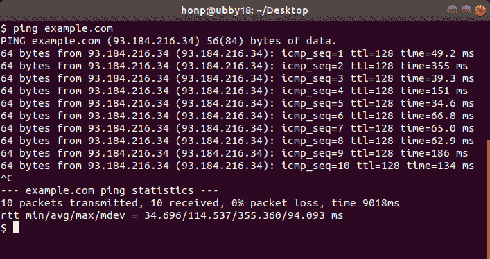

在前面的截图中，你可以看到发送了几个 ping 消息，并且每个都收到了响应。每个 ping 消息都会报告往返时间，并且还会报告所有发送数据包的摘要。摘要包括最小、平均和最大往返消息时间。

使用 ping 发送更大的消息也是可能的。在 Linux 和 macOS 上，`-s` 标志指定数据包大小。在 Windows 上，使用 `-l` 标志。有时，观察数据包大小如何影响延迟和可靠性是有趣的。

以下截图显示了使用更大的 1,000 字节 ping 消息 ping `example.com`：

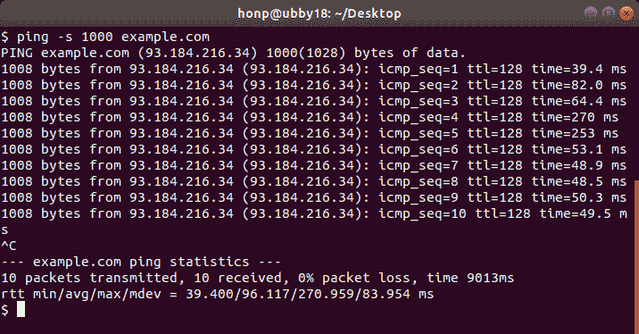

如果 ping 没有收到回显响应，这并不一定意味着目标主机不可达。这只意味着 ping 没有收到预期的回复。这可能是因为目标机器忽略了回显请求。然而，大多数系统 *确实* 设置为正确响应 ping 请求，回显请求超时通常意味着目标系统不可达。

有时候，仅仅知道主机可达就足够了，但有时候你可能需要更多信息。了解 IP 数据包在网络中确切路径可能很有用。**traceroute** 实用程序提供了这些信息。

# 检查路由

尽管我们在 第一章，“介绍网络和协议”中简要介绍了 traceroute，但更详细地回顾它是有价值的。

虽然 Ping 可以告诉我们两个系统之间是否存在网络路径，但 traceroute 可以揭示这个路径实际上是什么。

Traceroute 使用一个参数：你想要映射路由的主机名或地址。

在 Windows 上，traceroute 被称为 **tracert**。Tracert 的工作方式与 Linux 和 macOS 上找到的 traceroute 实用程序非常相似。

下面的截图显示了跟踪路由实用程序打印出用于将数据发送到`example.com`的路由器。`-n`标志告诉`traceroute`不要对每个跳数执行反向 DNS 查找。这些查找很少有用，省略它们可以节省一点时间和屏幕空间：

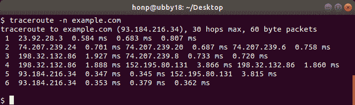

上一张截图显示，在我们和`example.com`的目标系统之间有四个或五个路由器（或跳数）。跟踪路由还显示了到达每个中间路由器的往返时间。

跟踪路由向每个路由器发送三条消息。这通常揭示了多个网络路径，并且不能保证任何两条消息会精确地走相同的路径。

在前面的例子中，我们看到消息必须首先通过`23.92.28.3`。从那里，它到达列出的三个不同系统中的一个。消息继续传递，直到它到达第五或第六个跳数，具体取决于它通过网络的确切路径。

这说明了一个有趣的观点：你不应该假设两个连续的数据包会走相同的网络路径。

# 跟踪路由的工作原理

要理解跟踪路由是如何工作的，我们必须了解**互联网协议**（**IP**）的一个细节。每个 IP 数据包头部都包含一个称为**生存时间**（**TTL**）的字段。TTL 是数据包在网络中存活的最大秒数，在此之后将被丢弃。这对于防止 IP 数据包简单地持续存在（即进入无限循环）在网络中非常重要。

一秒以下的 TTL 时间间隔会被向上取整。这意味着在实践中，每个处理 IP 数据包的路由器都会将 TTL 字段减`1`。因此，TTL 通常用作跳数计数。也就是说，TTL 字段仅仅代表了数据包在网络中还可以走的跳数。

跟踪路由实用程序使用 TTL 来识别网络中的中间路由器。跟踪路由首先将一个消息（例如，UDP 数据报或 ICMP 回显请求）发送到目标主机。然而，跟踪路由将 TTL 字段设置为`1`。当连接路径中的第一个路由器接收到这条消息时，它会将 TTL 减到零。然后路由器意识到消息已过期并丢弃它。一个表现良好的路由器随后会向原始发送者发送一个 ICMP **时间超限**消息。跟踪路由使用这个**时间超限**消息来识别连接中的第一个路由器。

跟踪路由会重复使用相同的流程，并附加额外的消息。第二条消息使用 TTL 为`2`发送，这条消息标识了网络路径中的第二个跳数。第三条消息使用 TTL 为`3`发送，以此类推。最终，消息到达最终目的地，跟踪路由就映射了整个网络路径。

下面的图示说明了跟踪路由使用的方法：

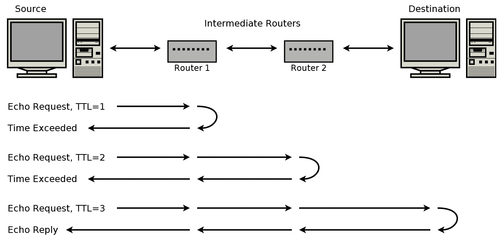

在前面的图中，第一条消息的 TTL 为 1。路由器 1 不会转发这条消息，而是返回一个 ICMP **超时** 消息。第二条消息的 TTL 为 2，在超时之前到达第二个路由器。第三条消息到达目的地，目的地回复一个 **回显应答** 消息。（如果这个 traceroute 是基于 UDP 的，它将期望收到一个 ICMP **端口不可达** 消息。）

并非所有路由器都会返回 ICMP **超时** 消息，有些网络会过滤掉这些消息。在这些情况下，traceroute 将无法知道这些路由器的地址。traceroute 会打印一个星号代替。理论上，如果连接路径中存在一个不递减 TTL 字段的路由器，那么 traceroute 将无法知道这个路由器的存在。

现在我们已经介绍了 ping 和 traceroute 的工作方式，你可能想知道它们如何用 C 语言实现。不幸的是，尽管它们的算法很简单，但说起来容易做起来难。继续阅读以了解更多信息。

# 原始套接字

你可能对实现自己的网络测试工具感兴趣。ping 工具看起来很简单，确实很简单。不幸的是，我们一直在使用的套接字编程 API 并没有提供对 ICMP 所基于的 IP 层的访问。

网络编程 API 理论上提供了对 **原始套接字** 的访问。使用原始套接字，C 程序可以构建要发送的确切 IP 数据包。也就是说，C 程序员可以从头开始构建一个 ICMP 数据包并将其发送到网络上。原始套接字还允许程序直接从网络接收未经解释的数据包。在这种情况下，用户程序将负责分解和解释 ICMP 数据包，而不是操作系统。

在支持原始套接字的系统上，开始使用可能就像将你的 `socket()` 函数调用更改为以下内容一样简单：

```cpp
socket(AF_INET, SOCK_RAW, IPPROTO_RAW);
```

然而，问题是原始套接字并不在所有平台上都得到支持。这是一个难以跨平台处理的主题。特别是 Windows，它对原始套接字的支持因操作系统版本而异。Windows 的最新版本几乎不支持原始套接字。因此，我们在这里不会更详细地介绍原始套接字。

现在我们已经介绍了两个基本的网络故障排除工具，接下来让我们看看那些能告诉我们自己的系统与网络关系的工具。

# 检查本地连接

了解你本地机器上正在建立哪些连接通常很有用。`netstat` 命令可以帮助你做到这一点。**Netstat** 在 Linux、macOS 和 Windows 上都可用。每个版本在命令行选项和输出上都有一些差异，但一般的使用原则是相同的。

我建议使用 `-n` 标志来运行 `netstat`。此标志阻止 `netstat` 对每个地址进行反向 DNS 查询，并且可以显著加快其速度。

在 Linux 上，我们可以使用以下命令来显示打开的 TCP 连接：

```cpp
netstat -nt
```

以下截图显示了在 Linux 上运行此命令的结果：

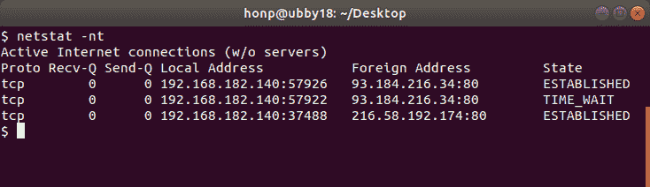

在前面的截图中，你可以看到`netstat`显示了六列。这些列显示了协议、发送和接收队列、本地地址、远程地址和连接状态。在这个例子中，我们看到有三个连接到端口`80`。这很可能表明这台电脑正在加载三个网页（因为 HTTP 使用端口`80`）。

在 Windows 上，`netstat -n -p TCP`命令显示相同的信息，但省略了套接字队列信息。

队列信息，在基于 Unix 的系统上显示，表示内核已排队等待程序读取的字节数，或者尚未被远程主机确认发送的字节数。小数字是健康的，但如果这些数字变得很大，可能表明网络有问题或程序中存在错误。

看看哪个程序负责每个连接也是有用的。在基于 Unix 的系统上使用`-p`标志。在 Windows 上，`-o`标志显示 PID，而`-b`标志显示可执行文件名。

如果你在一台服务器上工作，查看哪些监听套接字是打开的通常很有用。`-l`标志指示基于 Unix 的`netstat`仅显示监听套接字。以下截图显示了监听的 TCP 服务器套接字，包括程序名称：

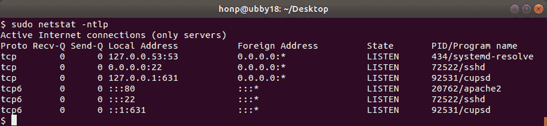

在前面的截图中，我们可以看到这个系统正在运行 DNS 解析器（`systemd-resolve`在端口`53`，仅 IPv4），SSH 守护进程（`sshd`在端口`22`），打印机服务（`cupsd`在端口`631`），以及一个 Web 服务器（`apache2`在端口`80`，仅 IPv6）。

在 Windows 上，`netstat`没有简单的方法来显示仅监听的套接字。相反，你可以使用`-a`标志来显示所有内容。使用以下命令可以过滤出仅监听的 TCP 套接字：

```cpp
netstat -nao -p TCP | findstr LISTEN
```

下面的截图显示了在 Windows 上使用`netstat`来仅显示监听 TCP 套接字：

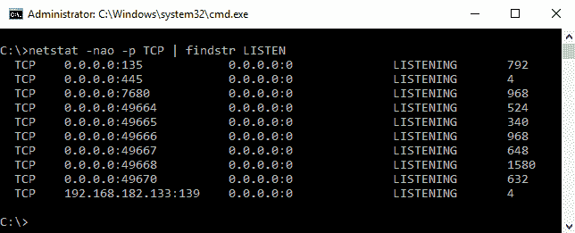

通过了解我们的机器上程序在通信什么，也许查看它们实际在通信什么也是有用的。像`tcpdump`和`tshark`这样的工具就专门用于此，我们将在下一节介绍它们。

# 监听连接

除了查看我们电脑上打开的套接字外，我们还可以捕获发送和接收的确切数据。

我们有几个工具选项可供选择：

+   **tcpdump**是在基于 Unix 的系统上用于数据包捕获的常用程序。然而，它在现代 Windows 系统上不可用。

+   **Wireshark**是一个非常流行的网络协议分析器，它包含一个非常好的图形用户界面。Wireshark 是免费软件，在 GNU GPL 许可下发布，可在许多平台上使用（包括 Windows、Linux 和 macOS）。

Wireshark 包含 Tshark，这是一个基于命令行的工具，允许我们转储和分析网络流量。程序员通常更喜欢命令行工具，因为它们的界面简单且易于脚本化。它们还有额外的优势，即在没有 GUI 的系统上也能使用。出于这些原因，我们在这个部分专注于使用 Tshark。

Tshark 可以从 [`www.wireshark.org`](https://www.wireshark.org) 获取。

如果你正在运行 Linux，你的发行版可能提供了 Tshark 的软件包。例如，在 Ubuntu Linux 上，以下命令将安装 Tshark：

```cpp
sudo apt-get update
sudo apt-get install tshark
```

安装完成后，Tshark 非常易于使用。

你首先需要决定你想要使用哪个或哪些网络接口来捕获流量。所需的接口或接口通过 `-i` 标志传递给 `tshark`。在 Linux 上，你可以通过传递 `-i any` 来监听所有接口。然而，Windows 不提供 `any` 接口。要在 Windows 上监听多个接口，你需要单独枚举它们，例如，`-i 1 -i 2 -i 3`。

Tshark 使用 `-D` 标志列出可用的接口。以下截图显示了 Tshark 在 Windows 上枚举可用的网络接口：

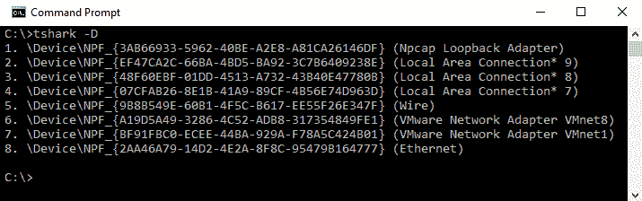

如果你想要监控本地流量（即，通信发生在同一台计算机上的两个程序之间），你将想要使用 `Loopback` 适配器。

一旦你确定了想要监控的网络接口，你可以使用 `-i` 标志启动 Tshark 并开始捕获流量。使用 *Ctrl* + *C* 停止捕获。以下截图显示了 Tshark 的使用情况：

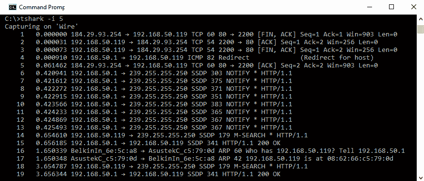

上述截图仅代表在典型 Windows 桌面上运行 Tshark 的几秒钟。正如你所见，即使是相对空闲的系统，也有大量的进出流量。

为了减少噪音，我们需要使用一个捕获过滤器。Tshark 实现了一种小型语言，允许轻松指定要捕获哪些数据包以及要忽略哪些数据包。

通过示例解释过滤器可能最为简单。

例如，如果我们只想捕获到或从 IP 地址 `8.8.8.8` 的流量，我们将使用 `host 8.8.8.8` 过滤器。

在以下截图中，我们使用 `host 8.8.8.8` 过滤器运行了 Tshark：

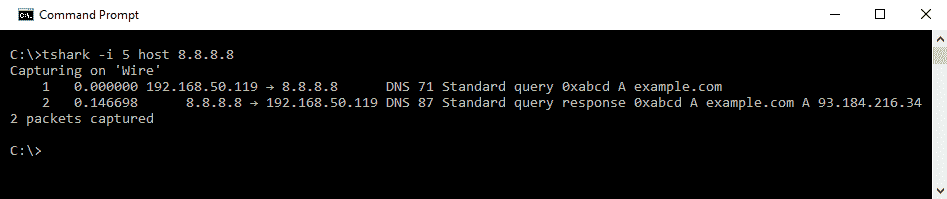

你可以看到，当 Tshark 运行时，它捕获了两个数据包。第一个数据包是发送到 `8.8.8.8` 的 DNS 请求。Tshark 通知我们这个 DNS 请求是针对 `example.com` 的 A 记录。第二个数据包是从 `8.8.8.8` 收到的 DNS 响应。Tshark 显示 DNS 查询响应指示 `example.com` 的 A 记录是 `93.184.216.34`。

Tshark 过滤器还支持布尔运算符 `and`、`or` 和 `not`。例如，要捕获仅涉及 IP 地址 `8.8.8.8` 和 `8.8.4.4` 的流量，你可以使用 `host 8.8.8.8` 过滤器或 `host 8.8.4.4` 过滤器。

通过端口号进行过滤也非常有用，可以使用 `port` 来实现。例如，以下截图展示了 Tshark 被用来捕获到 `93.184.216.34` 端口 `80` 的流量：


在前面的截图中，我们看到 Tshark 使用了 `tshark -i 5 host 93.184.216.34 and port 80` 命令。这会捕获网络接口 `5` 上所有到或来自 `93.184.216.34` 端口 `80` 的流量。

TCP 连接以一系列数据包的形式发送。尽管 Tshark 报告捕获了 11 个数据包，但这些数据包都与单个 TCP 连接相关联。

到目前为止，我们一直在以使 Tshark 显示每个数据包摘要的方式使用它。这通常足够了，但有时你可能会想看到数据包的完整内容。

# 深度数据包检查

如果我们给 `tshark` 传递 `-x` 标志，它会显示每个捕获的数据包的 ASCII 和十六进制转储。以下截图展示了这种用法：

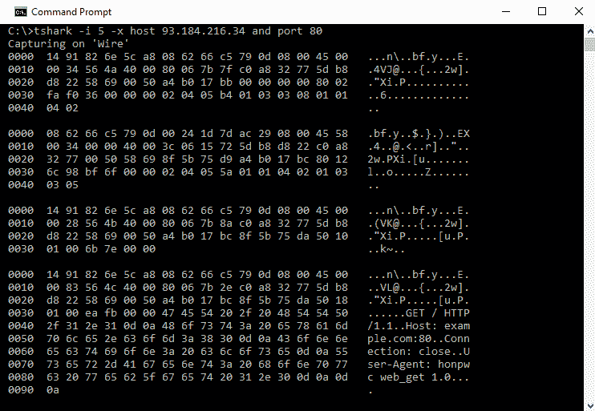

在前面的截图中，你可以看到整个 IP 数据包正在被转储。在这种情况下，我们看到前三个数据包代表了一个新的 TCP 连接的三次握手。第四个数据包包含一个 HTTP 请求。

对每个数据包内容的直接洞察并不总是方便的。通常，将数据包捕获到文件中并在稍后进行分析更为实际。使用 `tshark` 的 `-w` 选项可以将数据包捕获到文件。你可能还希望使用 `-c` 选项来限制捕获的数据包数量。这种简单的预防措施可以防止意外用网络流量填满你的整个硬盘。

以下截图展示了如何使用 Tshark 将 50 个数据包捕获到名为 `capture.pcap` 的文件中：

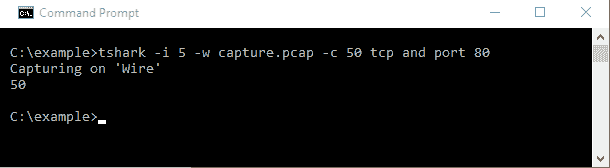

一旦流量被写入文件，我们就可以在方便的时候使用 Tshark 来分析它。只需运行 `tshark -r capture.pcap` 即可开始。对于基于文本的协议（如 HTTP 或 SMTP），在文本编辑器中打开捕获文件进行分析也常常很有用。

分析捕获流量的最终方式是使用 **Wireshark**。Wireshark 允许你加载由 `tshark` 或 `tcpdump` 生成的 `capture` 文件，并使用一个非常友好的图形用户界面进行分析。Wireshark 还能够理解许多标准协议。

以下截图展示了使用 Wireshark 显示从 Tshark 捕获的流量：

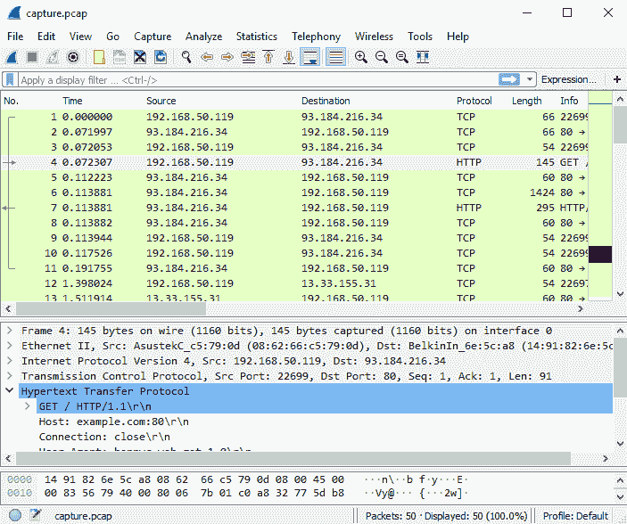

如果你需要捕获流量的系统有一个图形用户界面，你也可以使用 Wireshark 直接捕获你的流量。

如果你尝试使用 `tshark` 和 Wireshark，你会很快发现深入检查网络协议非常容易。你甚至可能会发现一些在你自己的系统上运行的软件做出的有疑问的安全选择。

尽管我们一直专注于监控我们本地系统上的网络流量，但也可以监控所有本地网络流量。

# 捕获所有网络流量

`tshark`只能看到到达你机器的流量。这通常意味着你只能用它来监控你电脑上的应用程序的流量。

要捕获你网络上的所有互联网流量，你必须以某种方式安排这些流量到达你的系统，尽管通常不会这样。有两种基本方法可以做到这一点。

第一种方法是使用支持镜像功能的路由器。这个功能使得它可以将所有流量镜像到指定的以太网端口。如果你正在使用这样的路由器，你可以配置它将所有网络流量镜像到特定的端口，然后把你电脑连接到那个端口。从那时起，任何流量捕获工具，如`tcpdump`或`tshark`，都可以用来记录这个流量。

另一种嗅探所有互联网流量的方法是，在你的路由器和互联网调制解调器之间安装一个集线器（或具有端口镜像功能的交换机）。集线器通过将所有流量镜像到所有端口来工作。集线器曾经是构建网络的一种常见方式。然而，它们已经被更高效的交换机所取代。

在你的路由器和互联网调制解调器之间安装集线器后，你就可以直接将你的系统连接到这个集线器。有了这样的设置，你可以接收所有进入或离开网络的互联网流量。

要监控所有网络流量（例如，甚至同一网络设备之间的流量），你需要使用支持端口镜像的集线器或交换机来构建你的网络。

应当注意的是，有了合适的调制解调器，你有可能无线捕获所有 Wi-Fi 流量。

从安全的角度来看，这是一个值得注意的教训。你不应该认为任何网络流量都是秘密的。只有使用加密适当保护的数据流量才能抵抗监控。

现在我们已经展示了几个用于测试和监控网络流量的工具和技术，接下来让我们考虑重要的网络安全话题。

# 网络安全

**网络安全**包括保护网络免受威胁的工具、技术和实践。这些工具包括硬件和软件，可以抵御各种威胁。

虽然这个话题在这里过于宽泛，无法详细讨论，但我们将涵盖你可能会遇到的一些话题。

**防火墙**是网络安全中最常见的技巧之一。防火墙在两个网络之间充当屏障。通常情况下，它们监控网络流量，并根据定义的一系列规则允许或阻止流量。

防火墙有两种类型：软件和硬件。现在大多数操作系统都提供了软件防火墙。软件防火墙通常配置为拒绝传入连接，除非设置了规则明确允许它。

还可以将软件防火墙配置为默认拒绝传出流量。在这种情况下，除非首先在防火墙配置中添加特定规则，否则程序不允许建立新的连接。

一定要小心，不要假设防火墙可以捕获所有流量。例如，Windows 10 防火墙默认情况下可以配置为拒绝所有出站流量，但它仍然允许 DNS 请求通过。攻击者可以利用这一点通过 DNS 请求窃取数据，尽管用户认为他们通过 Windows 防火墙得到了保护。

硬件防火墙具有各种功能。通常，它们被配置为阻止任何不符合预定义规则的入站连接。在没有防火墙的网络中，路由器通常隐式地提供相同的服务。如果你的路由器提供网络地址转换，那么除非为它预先建立了端口转发规则，否则它甚至不知道如何处理入站连接。

虽然了解网络安全的广泛基础很重要，但作为 C 程序员，我们通常更关心我们自己的程序的安全性。C 语言并没有使安全性变得容易，所以现在让我们更详细地考虑应用程序级的安全性。

# 应用程序安全和可靠性

在用 C 语言编程时，必须特别关注安全问题。这是因为 C 语言是一种低级编程语言，它可以直接访问系统资源。例如，内存管理在 C 语言中必须手动完成，内存管理中的错误可能会允许网络攻击者写入和执行任意代码。

使用 C 语言时，确保分配的内存缓冲区不会被写入到末尾至关重要。也就是说，每次从网络复制数据到内存时，你必须确保分配了足够的内存来存储数据。如果你的程序错过这一点，哪怕只有一次，也可能为攻击者打开一个窗口，从而控制你的程序。

从安全的角度来看，内存管理在许多高级编程语言中并不是一个关注点。在许多编程语言中，甚至无法编写超出分配内存的操作。当然，这些语言也无法提供 C 程序员所享受的精确控制内存布局和数据结构的能力。

即使你小心翼翼地完美管理内存，仍然有许多安全陷阱需要留意。在实现任何网络协议时，你绝不应该假设程序接收到的数据会遵循协议规范。如果你的程序确实做出了这些假设，它就会对那些不遵循协议的恶意程序开放攻击。这些协议错误在任何编程语言中都是一个关注点，而不仅仅是 C 语言。然而，关于 C 语言，这些协议实现错误可以迅速导致内存错误，而内存错误很快就会变得严重。

如果你正在实现一个作为服务器运行的 C 程序，你应该采用**多层次防御**的方法。也就是说，你应该以这种方式设置你的程序，使得攻击者在造成损害之前必须克服多个防御措施。

第一层防御是编写没有错误的程序。在处理接收到的网络数据时，仔细考虑如果接收到的数据根本不是你所期望的会发生什么。确保你的程序做正确的事情。

此外，不要以超出程序功能所需的任何更多权限运行你的程序。如果你的程序不需要访问一组敏感文件，确保你的操作系统不允许它访问这些文件。永远不要以 root 身份运行服务器软件。

如果你正在实现一个 HTTP 或 HTTPS 服务器，考虑不要直接将你的程序连接到互联网。相反，使用反向代理服务器作为与互联网的第一个接触点，并让你的软件仅与代理服务器接口。这为攻击提供了额外的隔离层。

最后，如果你能找到替代方案，考虑完全不要用 C 编写网络代码。许多 C 服务器可以被重写为不直接与网络交互的 CGI 程序。TCP 或 UDP 服务器通常可以被重写为使用`inetd`，从而完全避免套接字编程接口。如果你的程序需要加载网页，考虑使用经过良好测试的库，如`libcurl`，而不是自己编写。

我们已经介绍了一些网络测试技术。当在实时网络上部署这些技术时，重要的是要考虑周到。让我们以礼仪的注意事项结束。

# 网络测试礼仪

在进行网络测试时，始终要负责任和道德。一般来说，未经明确许可不要测试他人的网络。否则，最坏的情况可能会让你陷入严重的法律麻烦。

你还应该意识到，一些网络测试技术可能会触发警报。例如，许多网络管理员监控他们网络的负载和性能特征。如果你决定在不通知的情况下对这些网络进行负载测试，可能会触发自动警报，造成不便。

一些其他测试技术可能看起来像攻击。例如，端口扫描是一种有用的技术，其中测试者尝试在不同的端口上建立许多连接。它用于发现系统上哪些端口是开放的。然而，这是一种恶意攻击者用来寻找弱点的常用技术。一些系统管理员认为端口扫描是一种攻击，你永远不应该在没有许可的情况下对系统进行端口扫描。

# 摘要

在本章中，我们涵盖了网络监控和安全性的广泛主题。我们探讨了用于测试网络设备可达性的工具。我们学习了如何在网络中追踪路径，以及如何在本地机器上监控连接。我们还发现了如何记录和检查网络流量。

我们讨论了网络安全及其可能对 C 语言开发者产生的影响。通过展示如何直接检查网络流量，我们亲身体验了加密对于通信隐私的重要性。还讨论了在应用层进行安全的重要性。

在下一章中，我们将更深入地探讨我们的编码实践如何影响程序行为。我们还将讨论在 C 语言中编写健壮网络应用的一些基本要点。

# 问题

尝试这些问题来测试您对本章知识的掌握：

1.  您会使用哪个工具来测试目标系统的可达性？

1.  哪个工具列出了到达目标系统的路由器？

1.  原始套接字用于什么？

1.  哪个工具列出了您系统上的打开 TCP 套接字？

1.  对于网络化的 C 程序，最大的安全担忧是什么？

这些问题的答案可以在附录 A，*问题答案*中找到。

# 进一步阅读

关于本章涵盖主题的更多信息，请参考以下内容：

+   **RFC 792**: *互联网控制消息协议* ([`tools.ietf.org/html/rfc792`](https://tools.ietf.org/html/rfc792))

+   Wireshark ([`www.wireshark.org`](https://www.wireshark.org))
