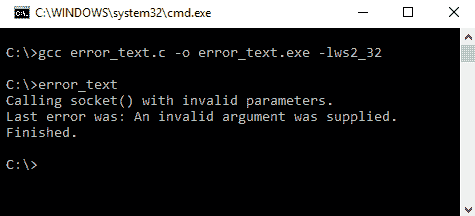
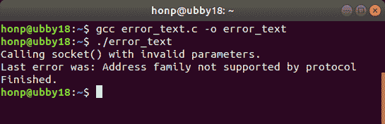
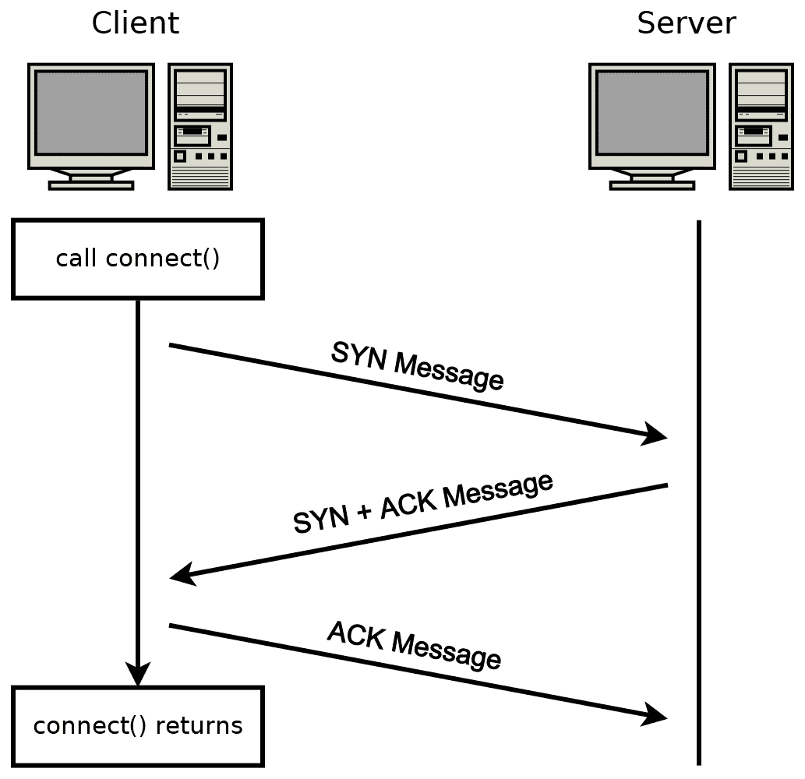
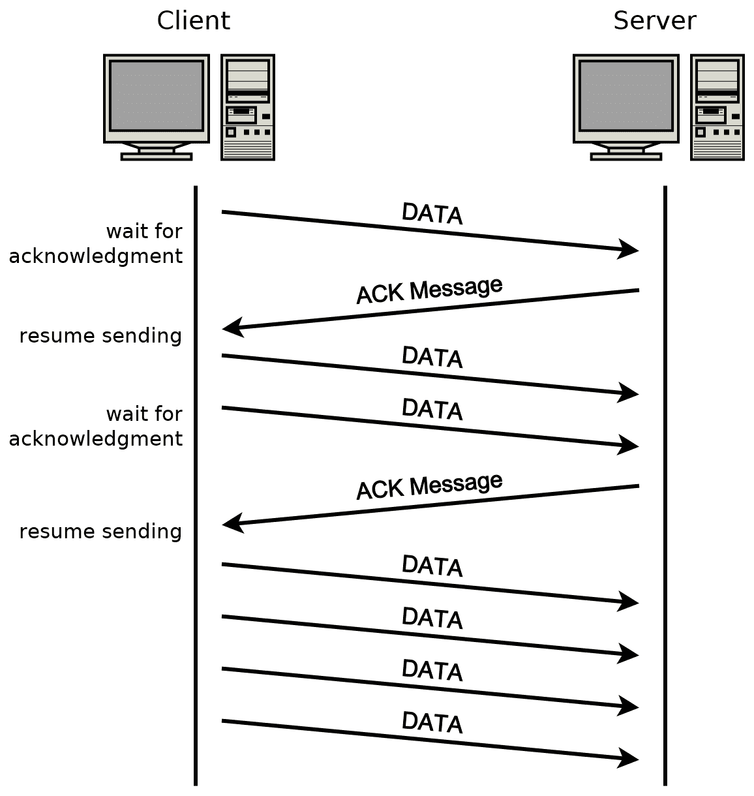
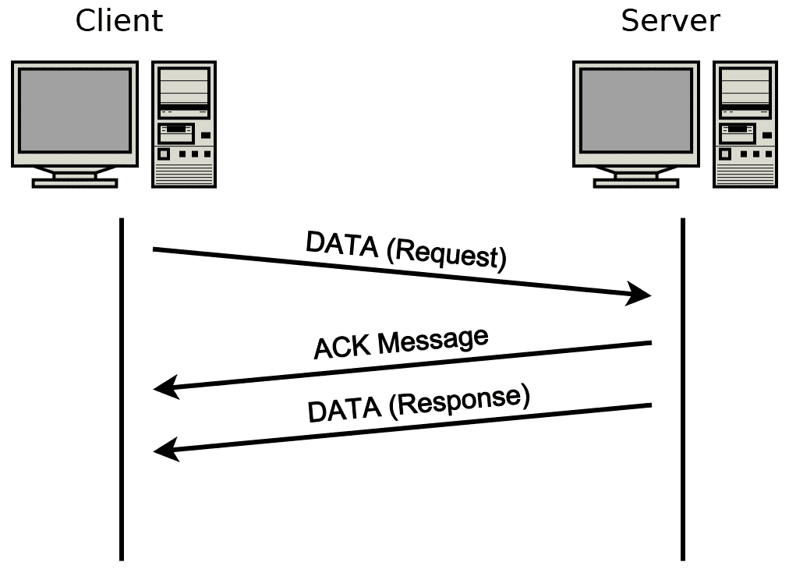
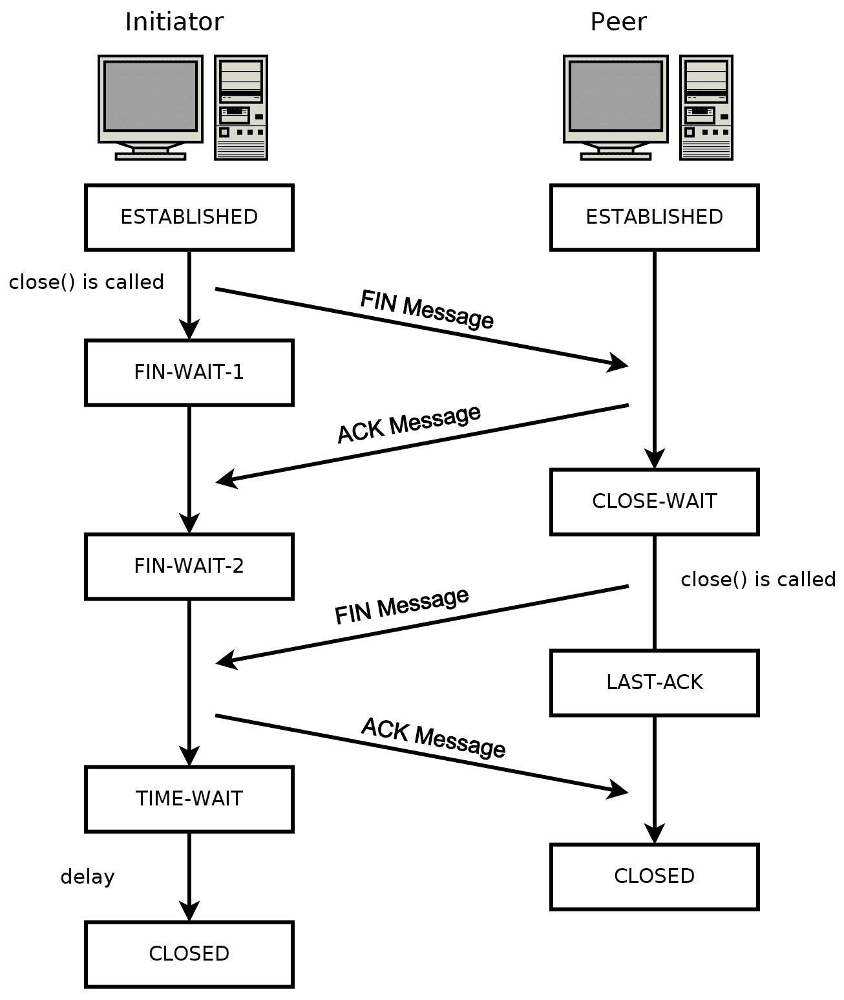
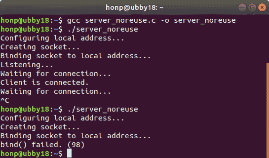
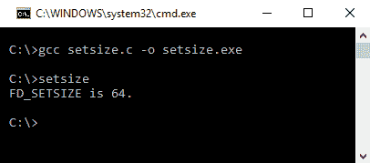

# 第十三章：套接字编程技巧和陷阱

本章基于你在本书中获得的全部知识。

**套接字编程**可能很复杂。有许多陷阱需要避免，以及需要实现的微妙编程技术。在本章中，我们考虑了一些对编写健壮程序至关重要的网络编程的细微细节。

本章涵盖了以下主题：

+   错误处理和错误描述

+   TCP 握手和有序释放

+   `connect()`的超时

+   防止 TCP 死锁

+   TCP 流量控制

+   避免地址已使用错误

+   防止`SIGPIPE`崩溃

+   `select()`的多路复用限制

# 技术要求

任何现代 C 编译器都可以编译本章的示例程序。我们建议在 Windows 上使用**MinGW**，在 Linux 和 macOS 上使用**GCC**。请参阅附录 B，*在 Windows 上设置您的 C 编译器*，附录 C，*在 Linux 上设置您的 C 编译器*，以及附录 D，*在 macOS 上设置您的 C 编译器*，以了解编译器设置。

本书代码可在以下位置找到：[`github.com/codeplea/Hands-On-Network-Programming-with-C`](https://github.com/codeplea/Hands-On-Network-Programming-with-C)。

从命令行，你可以使用以下命令下载本章的代码：

```cpp
git clone https://github.com/codeplea/Hands-On-Network-Programming-with-C
cd Hands-On-Network-Programming-with-C/chap13
```

本章中的每个示例程序都可在 Windows、Linux 和 macOS 上运行。在 Windows 上编译时，每个示例程序都需要链接到**Winsock**库。这可以通过向`gcc`传递`-lws2_32`选项来实现。

本章中的所有示例程序都需要我们在第二章，*掌握套接字 API*中开发的相同头文件和 C 宏。为了简洁起见，我们将这些语句放在了一个单独的头文件`chap13.h`中。有关这些语句的解释，请参阅第二章，*掌握套接字 API*。

`chap13.h`的第一部分包含了每个平台所需的网络头文件。相应的代码如下：

```cpp
/*chap13.h*/

#if defined(_WIN32)
#ifndef _WIN32_WINNT
#define _WIN32_WINNT 0x0600
#endif
#include <winsock2.h>
#include <ws2tcpip.h>
#pragma comment(lib, "ws2_32.lib")

#else
#include <sys/types.h>
#include <sys/socket.h>
#include <netinet/in.h>
#include <arpa/inet.h>
#include <netdb.h>
#include <unistd.h>
#include <errno.h>
#include <fcntl.h>

#endif
```

我们还定义了一些宏，以便更容易编写可移植的代码，并包含了我们的程序需要的附加头文件：

```cpp
/*chap13.h continued*/

#if defined(_WIN32)
#define ISVALIDSOCKET(s) ((s) != INVALID_SOCKET)
#define CLOSESOCKET(s) closesocket(s)
#define GETSOCKETERRNO() (WSAGetLastError())

#else
#define ISVALIDSOCKET(s) ((s) >= 0)
#define CLOSESOCKET(s) close(s)
#define SOCKET int
#define GETSOCKETERRNO() (errno)
#endif

#include <stdio.h>
#include <stdlib.h>
#include <string.h>
```

这就完成了`chap13.h`。

# 错误处理

**错误处理**在 C 语言中可能是一个有问题的主题，因为它并不“手把手”地指导程序员。任何分配的内存或资源都必须手动释放，并且这在每种情况下都可能很棘手。

当一个网络程序遇到错误或意外情况时，正常的程序流程会被中断。当设计一个处理多个并发连接的多路复用系统时，这会变得更加困难。

书中的示例程序在错误处理上采取了捷径。几乎所有的程序在检测到错误后都简单地终止。虽然这在现实世界的程序中有时是一个有效的策略，但现实世界的程序通常需要更复杂的错误恢复。

有时，你可以在遇到错误后仅让客户端程序终止。对于简单的命令行工具，这种行为通常是正确的响应。在其他时候，你可能需要让程序自动重试。

事件驱动编程可以提供简化这种逻辑所需的技术。主要的是，你的程序结构是如此设计，以便分配一个数据结构来存储有关每个连接的信息。你的程序使用一个主循环来检查事件，例如可读或可写套接字，然后处理这些事件。以这种方式结构化你的程序时，通常更容易标记一个连接需要执行操作，而不是立即调用一个函数来处理该操作。

通过仔细设计，错误可以像常规事项一样处理，而不是作为正常程序流程的例外。

最终，错误处理是一个非常专业的过程，需要仔细考虑应用需求。对某个系统合适的东西不一定对另一个系统正确。

在任何情况下，健壮的程序设计都要求你仔细考虑如何处理错误。许多程序员只关注成功的路径。也就是说，他们仔细设计程序流程，基于一切都会正确的假设。对于健壮的程序，这是一个错误。同样重要的是要考虑在一切出错的情况下的程序流程。

在本章的其余部分，我们将讨论网络编程可能出错的地方。网络编程可能很微妙，许多这些故障模式都令人惊讶。然而，经过适当的考虑，它们都是可以处理的。

在深入探讨连接可能失败的所有奇怪方式之前，让我们首先关注使错误记录变得更容易一些。在这本书中，到目前为止，我们一直在处理数字错误代码。获取错误文本描述通常更有用。我们将在下一节中查看这种方法。

# 获取错误描述

在第二章“掌握套接字 API”，我们开发了`GETSOCKETERRNO()`宏，作为一种跨平台的方法来获取系统调用失败后的错误代码。

为了您的方便，这里重复了`GETSOCKETERRNO()`宏：

```cpp
#if defined(_WIN32)
#define GETSOCKETERRNO() (WSAGetLastError())
#else
#define GETSOCKETERRNO() (errno)
#endif
```

前面的代码在本章中一直为我们服务。它具有简短和简单的优点。

在现实世界的程序中，你可能还想显示基于文本的错误消息，而不仅仅是错误代码。Windows 和基于 Unix 的系统都提供了用于此目的的函数。

我们可以构建一个简单的函数来返回最后一个错误消息作为 C 字符串。此函数的代码如下：

```cpp
/*error_text.c excerpt*/

const char *get_error_text() {

#if defined(_WIN32)

    static char message[256] = {0};
    FormatMessage(
        FORMAT_MESSAGE_FROM_SYSTEM|FORMAT_MESSAGE_IGNORE_INSERTS,
        0, WSAGetLastError(), 0, message, 256, 0);
    char *nl = strrchr(message, '\n');
    if (nl) *nl = 0;
    return message;

#else
    return strerror(errno);
#endif

}
```

前面的函数使用 Windows 上的 `FormatMessage()` 和其他操作系统上的 `strerror()` 格式化错误为文本。

基于 Unix 的系统提供了 `strerror()` 函数。这个函数只接受错误代码作为其参数，并返回一个指向错误信息字符串的指针。

在 Windows 上获取错误代码描述要复杂一些。我们使用 `FormatMessage()` 函数来获取文本描述。这个函数有很多选项，但前面代码片段中使用的参数对我们的目的来说效果很好。注意，Windows 错误描述通常以换行符结束。我们的函数使用 `strrchr()` 来找到最后一个换行符字符，并在该点截断描述。

本章的代码包括一个名为 `error_text.c` 的程序，该程序演示了这种方法。该程序使用无效参数调用 `socket()` 函数，然后使用 `get_error_text()` 显示错误信息：

```cpp
/*error_text.c excerpt*/

    printf("Calling socket() with invalid parameters.\n");
    socket(0, 0, 0);
    printf("Last error was: %s\n", get_error_text());
```

注意，错误代码和描述在操作系统之间差异很大。接下来的两个截图显示了该程序在 Windows 和 Linux 上显示的错误信息。

下面的截图显示了 `error_text` 在 Windows 上的运行情况：



下一个截图显示了 `error_text` 在 Ubuntu Linux 桌面上的运行情况：



如前两个截图所示，不同的操作系统通常不会以相同的方式报告错误。

现在我们有了更好的方法来调查错误，让我们继续考虑一些可能导致 **TCP 套接字**失败的方式。

# TCP 套接字技巧

**传输控制协议**（**TCP**）是一个出色的协议，TCP 套接字提供了一个美丽的抽象。它们将不可靠网络上的离散数据包呈现为可靠、连续的数据流。对于程序员来说，从世界任何地方的节点发送和接收数据几乎和读写文件一样简单。

TCP 在隐藏网络缺陷方面表现得非常好。当不稳定网络丢失几个数据包时，TCP 会忠实地整理混乱并按需重新传输。使用 TCP 的应用程序以完美的顺序接收数据。应用程序甚至不知道存在网络问题，当然也不需要解决这个问题。

与所有抽象一样，这种抽象也带来了一些固有的风险。TCP 尽力使网络看起来是可靠的。它通常能成功，但有时，抽象会泄漏。如果你的网络电缆被切断会发生什么？如果你连接的应用程序崩溃会发生什么？TCP 不是魔法。它不能修复这些问题。

当然，当面对严重的网络中断等问题时，抽象必须打破。然而，有时，一些被认为被抽象掉的具体细节可能会引起更微妙的问题。例如，当你尝试发送大量数据，但连接到的对端没有读取它时会发生什么？（答案：数据会积压。）

在本节中，我们更详细地探讨 TCP。我们特别关注这些边缘情况下 TCP 套接字的行为。

TCP 连接的生命周期可以分为三个不同的阶段。具体如下：

+   设置阶段

+   数据传输阶段

+   拆除阶段

每个步骤都可能存在问题。

在设置阶段，我们必须考虑如果目标系统没有响应会发生什么。默认情况下，`connect()`有时会等待很长时间，试图建立 TCP 连接。有时，你可能希望这样做，但通常并不是这样。

对于数据传输阶段，我们必须小心防止死锁。了解 TCP 拥塞控制机制也可以帮助我们防止我们的连接变得缓慢或使用比必要的更多带宽的退化情况。

最后，了解拆除阶段的具体细节有助于我们确保在连接结束时没有丢失数据。套接字终止的细节也可能导致操作系统在断开连接后长时间保持半死不活的状态。这些挂起的套接字可能会阻止新的程序绑定到它们的本地端口。

让我们从一些关于建立 TCP 连接的三次握手的信息开始，以及如何超时`connect()`调用。

# `connect()`调用超时

通常，当我们对一个 TCP 套接字调用`connect()`时，`connect()`会阻塞直到连接建立。

下面的图示说明了建立典型 TCP 连接的 TCP 三次握手以及它与标准阻塞`connect()`调用的关系：



标准的 TCP 三次握手包括三个部分。首先，**客户端**向**服务器**发送一个**同步（SYN**）消息。然后，**服务器**响应一个自己的**SYN 消息**，并结合一个对**客户端**的**SYN 消息**的**确认（ACK**）消息。然后，**客户端**对**服务器**的**SYN 消息**进行确认。此时，连接打开并准备好数据传输。

当在**客户端**侧调用`connect()`函数时，首先发送一个**SYN 消息**，`connect()`函数会阻塞直到从**服务器**收到**SYN+ACK 消息**。收到**SYN+ACK 消息**后，`connect()`将最终**ACK 消息**入队并返回。

这意味着 `connect()` 至少会阻塞一个往返网络时间。也就是说，它会从发送 **SYN 消息** 的时刻开始阻塞，直到接收到 **SYN+ACK 消息** 的时刻。虽然一个往返网络时间是最佳情况，但在最坏的情况下，它可能会阻塞更长的时间。考虑一下当过载的 **服务器** 收到 **SYN 消息** 时会发生什么。服务器可能需要一些时间来回复 **SYN+ACK 消息**。

如果 `connect()` 无法成功建立连接（即从未收到 **SYN+ACK 消息**），那么 `connect()` 调用最终会超时。这个超时时间由操作系统控制。确切的超时时间各不相同，但大约是 20 秒。

没有标准的方法可以扩展 `connect()` 的超时时间，但如果你想要继续尝试，可以始终再次调用 `connect()`。

有几种方法可以使 `connect()` 提前超时。一种方法是通过多个进程，如果子进程没有及时连接，则终止它。另一种方法是在基于 Unix 的系统上使用 `SIGALARM`。

通过使用 `select()` 可以实现跨平台的 `connect()` 超时。回想一下 第三章，*TCP 连接的深入概述*，其中提到 `select()` 允许我们等待带有指定超时的套接字操作。

`select()` 还有一个额外的优点，就是允许程序在等待 TCP 连接建立的同时执行有用的操作。也就是说，`select()` 可以用来等待多个 `connect()` 调用，以及其他套接字事件。这对于需要并行连接多个服务器的客户端来说可以很好地工作。

使用 `select()` 超时 `connect()` 调用涉及几个步骤。具体如下：

1.  将套接字设置为非阻塞操作。在基于 Unix 的系统上，这可以通过 `fcntl(O_NONBLOCK)` 实现，而在 Windows 上则是通过 `ioctlsocket(FIONBIO)` 实现。

1.  调用 `connect()`。如果步骤 1 成功，这个调用会立即返回。

1.  检查 `connect()` 的返回码。返回值为零表示连接成功，这通常表明非阻塞模式设置不正确。`connect()` 的非零返回值意味着我们应该检查错误码（在 Windows 上是 `WSAGetLastError()`，在其他平台上是 `errno`）。错误码 `EINPROGRESS`（在 Windows 上是 `WSAEWOULDBLOCK`）表示 TCP 连接正在进行中。任何其他值都表示实际错误。

1.  设置并调用 `select()`，指定所需的超时时间。

1.  将套接字设置回阻塞模式。

1.  检查套接字是否成功连接。

*步骤 1*，将套接字设置为非阻塞模式，可以通过以下代码实现：

```cpp
#if defined(_WIN32)
    unsigned long nonblock = 1;
    ioctlsocket(socket_peer, FIONBIO, &nonblock);
#else
    int flags;
    flags = fcntl(socket_peer, F_GETFL, 0);
    fcntl(socket_peer, F_SETFL, flags | O_NONBLOCK);
#endif
```

上述代码在 Windows 上运行时略有不同。在 Windows 上，使用带有`FIONBIO`标志的`ioctlsocket()`函数来指示非阻塞套接字操作。在非 Windows 系统上，使用`fcntl()`函数来设置`O_NONBLOCK`标志以实现相同的目的。

在*步骤 2*和*步骤 3*中，对`connect()`的调用是正常的。唯一的区别是，你应该在基于 Unix 的系统上预期`EINPROGRESS`错误代码，在 Windows 上预期`WSAEWOULDBLOCK`。

在*步骤 4*中，`select()`的设置非常简单。`select()`函数的使用方式与前面章节中描述的相同。为了方便起见，以下代码展示了使用`select()`实现此目的的一种方法：

```cpp
fd_set set;
FD_ZERO(&set);
FD_SET(socket_peer, &set);

struct timeval timeout;
timeout.tv_sec = 5; timeout.tv_usec = 0;
select(socket_peer+1, 0, &set, 0, &timeout);
```

注意在上述代码中，我们设置了五秒的超时。因此，这个`select()`调用在连接建立、连接出现错误或经过 5 秒后返回。

在*步骤 5*中，将套接字设置回非阻塞模式可以通过以下代码实现：

```cpp
#if defined(_WIN32)
    nonblock = 0;
    ioctlsocket(socket_peer, FIONBIO, &nonblock);
#else
    fcntl(socket_peer, F_SETFL, flags);
#endif
```

在*步骤 6*中，我们正在检查`select()`调用是否超时、因错误而提前返回，或者因为我们的套接字成功连接而提前返回。

令人惊讶的是，目前没有简单、健壮、跨平台的方法来检查套接字是否在此时刻已连接。我的建议是简单地假设任何被`select()`标记为可写的套接字已成功连接。只需尝试使用该套接字。大多数 TCP 客户端程序在连接后都会想要调用`send()`。这个第一次`send()`调用的返回值表明你是否存在问题。

如果你确实想尝试确定套接字状态而不使用`send()`，你应该意识到在这种情况下`select()`信号的一些差异。在基于 Unix 的系统上，一旦连接建立，`select()`会将套接字标记为可写。如果发生错误，`select()`会将套接字标记为可读和可写。然而，如果套接字已成功连接并且从远程对等方接收到数据，这也会产生可读和可写的情况。在这种情况下，可以使用`getsockopt()`函数来确定是否发生错误。在 Windows 上，如果发生错误，`select()`会将套接字标记为 excepted。

请参考本章代码库中的`connect_timeout.c`，以获取使用`select()`实现`connect()`超时方法的示例。另外，还包括一个用于比较的示例，`connect_blocking.c`。

一旦建立了新的连接，我们的关注点就转向防止数据传输问题。在最坏的情况下，我们的程序可能会与对等方发生死锁，阻止任何数据传输。我们将在下一节中更详细地考虑这个问题。

# TCP 流量控制和避免死锁

当设计应用协议和编写网络代码时，我们需要小心防止**死锁**状态。死锁是指连接两端的双方都在等待对方做某事。最坏的情况是双方最终都无限期地等待。

一个简单的死锁例子是，如果客户端和服务器在连接建立后立即调用`recv()`。在这种情况下，双方将永远等待永远不会到来的数据。

如果双方同时尝试发送数据，可能会出现一个不太明显的死锁情况。在我们考虑这种情况之前，我们必须首先了解 TCP 连接操作的一些更多细节。

当通过 TCP 连接发送数据时，这些数据会被分成段。一些段会立即发送，但额外的段不会在网络中发送，直到前几个段被连接的对端确认已接收。这是 TCP 的**流量控制**方案的一部分，有助于防止发送者发送数据比接收者能处理的速度更快。

考虑以下图示：


在前面的图中，**客户端**向**服务器**发送了三个 TCP 数据段。**客户端**还有额外的**数据**准备发送，但它必须等待已发送的数据被确认。一旦收到**确认消息**，**客户端**就继续发送其剩余的**数据**。

这是确保发送者不会比接收者处理速度更快的 TCP 流量控制机制。

现在，考虑到 TCP 套接字在需要接收确认之前只能发送有限量的数据，想象一下如果 TCP 连接的双方都试图同时发送大量数据会发生什么。在这种情况下，双方都会发送前几个 TCP 段。然后他们都等待对方确认接收后再发送更多。然而，如果双方都没有读取数据，那么双方都不会确认接收数据。这是一个死锁状态。双方都卡在永远等待的状态中。

许多应用协议通过设计防止了这个问题。这些协议自然地在发送和接收数据之间交替。例如，在 HTTP 中，客户端发送一个请求，然后服务器发送一个回复。服务器仅在客户端完成发送后才开始发送数据。

然而，TCP 是一个全双工协议。需要同时向两个方向发送数据的应用程序应该利用 TCP 的这一能力。

作为激励的例子，想象一下实现一个文件传输程序，其中 TCP 连接的双方都在同时发送文件的大块数据。我们如何防止死锁条件？

解决这个问题很简单。双方应该交替调用`send()`和`recv()`。大量使用`select()`将有助于我们有效地做到这一点。

回想一下，`select()`指示哪些套接字已准备好读取，哪些套接字已准备好写入。只有在你知道套接字已准备好写入时，才应调用`send()`函数。否则，你可能会遇到`send()`阻塞的风险。在最坏的情况下，`send()`可能会无限期地阻塞。

因此，发送大量数据的一个程序如下：

1.  使用剩余数据调用`send()`。

1.  `send()`的返回值指示`send()`实际消耗了多少字节。如果你发送的字节数少于预期，那么你的下一次`send()`调用应该用来传输剩余的数据。

1.  在读取和写入集合中调用`select()`时使用你的套接字。

1.  如果`select()`指示套接字已准备好读取，则在它上面调用`recv()`并按需处理接收到的数据。

1.  如果`select()`指示套接字已准备好再次写入，则回到*步骤 1*并使用剩余要发送的数据调用`send()`。

重要的是，`send()`调用与`recv()`调用交织在一起。这样，我们可以确保没有数据丢失，并且不会发生死锁条件。

此方法也很好地扩展到具有许多打开套接字的应用程序。每个套接字都添加到`select()`调用中，并根据需要服务就绪的套接字。你的应用程序需要跟踪每个连接剩余要发送的数据。

还应注意的是，将套接字设置为非阻塞模式可以在某些情况下简化你的程序逻辑。即使是非阻塞套接字，`select()`仍然可以用作中央阻塞点来等待套接字事件。

本章的代码库中包含两个文件，可以帮助演示死锁状态以及如何使用`select()`来防止它。第一个文件是`server_ignore.c`，它实现了一个简单的 TCP 服务器，接受连接然后忽略它们。第二个文件是`big_send.c`，它初始化一个 TCP 连接然后尝试发送大量数据。通过使用`big_send`程序连接到`server_ignore`程序，你可以自己调查`send()`的阻塞行为。

死锁只是 TCP 连接意外失败的一种方式。虽然死锁可能非常难以诊断，但通过仔细的编程是可以预防的。除了死锁的风险之外，TCP 还带来了其他数据传输的陷阱。接下来，让我们考虑另一个常见的性能问题。

# 队列控制

正如我们刚刚看到的，TCP 通过实现流量控制来防止发送方压倒接收方。这种流量控制通过只允许发送有限数量的 TCP 段，在需要接收确认之前进行工作。

TCP 还实现了作为网络**拥塞避免**方案一部分的**拥塞控制**方法。虽然流量控制对于防止压倒接收方至关重要，但拥塞控制对于防止压倒网络同样关键。

TCP 拥塞控制的一种方式是在发送一定量的数据后暂停，等待接收到的确认。当检测到网络拥塞时，这个数据限制会减少。这样，TCP 不会尝试在网络能够处理之前发送更多的数据。

另一种 TCP 实现拥塞控制的方式是通过**TCP 慢启动算法**。这种方法为 TCP 提供了一种逐步提升连接至其最大潜力的方式，而不是一次性将大量数据倾倒到网络上。

它的工作原理是这样的——当一个新的 TCP 连接建立时，只允许发送最小量的未确认数据。当这些数据被确认后，限制会增加。每次收到新的确认，限制会进一步增加，直到发生数据包丢失或限制达到期望的最大值。

下图展示了 TCP 慢启动的实际操作：



在前面的图中，你可以看到**客户端**开始时只发送少量数据。一旦这些数据被确认，**客户端**愿意在需要另一个确认之前发送更多的数据。一旦收到确认，**客户端**再次增加其限制，依此类推。

慢启动算法可能会对短暂连接造成问题。在实践中，如果一个连接只需要发送少量数据，那么这个连接永远不会达到其全部潜力。这导致许多协议被设计为保持连接更长时间。例如，过去 HTTP 连接通常只传输一个资源。现在，HTTP 连接保持打开以传输额外资源的情况要普遍得多。这种连接重用避免了 TCP 三次握手和慢启动的开销。

除了避免拥塞外，TCP 还提供了提高带宽效率的方法。

# Nagle 算法

TCP 用来提高效率的一种技术是**Nagle 算法**。Nagle 算法的工作原理是将发送方的小量数据合并在一起，直到有足够的数据可以证明发送的合理性。

考虑在 TCP 连接上发送仅一个字节的数据。每个 TCP 段使用 20 字节来传输 TCP 记账信息。还需要额外的 20 字节用于 IPv4 头部。因此，这 1 字节的应用数据在网络中变成了 41 字节。这是 4000%的额外开销，而且我们还没有计算来自低层（例如，以太网帧开销）的额外开销！

Nagle 算法指出，在任何给定时间，只能有一个小的、未确认的 TCP 段是未完成的。任何小于**最大段大小**（**MSS**）的段都被认为是小的段。

让我们看看这如何应用于执行小量写入的程序。考虑以下在已连接但其他方面处于空闲状态的 TCP 套接字上调用的代码：

```cpp
send(my_socket, "a", 1, 0);
send(my_socket, "b", 1, 0);
```

在第一次`send()`调用之后，`a`数据被封装进一个 TCP 消息并发送出去，同时附带其 40 字节的 TCP 和 IPv4 开销。

第二次`send()`调用会立即返回，但`b`数据实际上并不会立即发送。Nagle 算法会导致操作系统将`b`数据排队。它不会发送，直到第一个 TCP 消息被确认或者再次调用`send()`并带有足够的数据来填满一个完整的最大 TCP 段。

为了让接收方接收到`a`和`b`，需要的时间是一个往返网络时间的持续时间，加上额外的单向网络时间。

我们可以通过以下代码轻松地将 1.5 倍的往返网络时间缩短到 0.5 倍的往返网络时间：

```cpp
send(my_socket, "ab", 2, 0);
```

因此，在可能的情况下，你应该始终优先选择一次进行大量写入到`send()`，而不是多次小量写入。一次大量写入允许`ab`在同一 TCP 消息中发送，从而完全绕过 Nagle 算法。

在某些应用程序中，你确实需要在发送一个小数据包后立即发送另一个小数据包。例如，在实时多人在线视频游戏中，你不能排队存储玩家指令；它们必须连续发送。在这些情况下，为了减少延迟，牺牲带宽效率，禁用 Nagle 算法是有意义的。

可以使用`setsockopt()`函数来禁用 Nagle 算法。以下代码展示了这种方法的应用：

```cpp
int yes = 1;
if (setsockopt(my_socket, IPPROTO_TCP, TCP_NODELAY,
        (void*)&yes, sizeof(yes)) < 0) {
    fprintf(stderr, "setsockopt() failed. (%d)\n", GETSOCKETERRNO());
}
```

在禁用 Nagle 算法之前，务必考虑所有选项。当面对性能不佳的网络程序时，一些程序员会首先尝试禁用 Nagle 算法。实际上，禁用 Nagle 算法的决定应该谨慎对待。在实时应用程序中禁用 Nagle 算法通常是有意义的。在其他环境中很少这样做。

例如，假设你已经实现了一个 HTTP 客户端。它似乎有点缓慢，所以你尝试禁用 Nagle 算法。你这样做后，发现它现在运行得快多了。然而，通过禁用 Nagle 算法，你增加了网络开销。你可以通过简单地合并你的`send()`调用来实现同样的改进。

如果你正在实现一个确实需要发送小的时间敏感数据包的实时算法，使用`TCP_NODELAY`可能仍然不是适合你的方法。TCP 可以通过许多其他方式引入延迟。例如，如果网络中丢失了一个 TCP 数据包，那么在重新传输该数据包之前，无法发送更多数据。这可能会因为一个数据包的延迟而延迟许多数据包。

许多实时应用程序更喜欢使用 UDP 而不是 TCP。每个 UDP 数据包完全独立于之前或之后发送的任何其他数据包。当然，权衡是可靠性保证较低；消息可能以与设置不同的顺序到达，并且某些消息可能到达两次。尽管如此，许多应用程序可以容忍这种情况。例如，实时视频流可以使用 UDP，其中每个数据包存储视频的一个非常短、带时间戳的部分。如果数据包丢失，不需要重新传输；视频会暂时卡顿，然后在下一个数据包到达时继续。接收到的晚到或顺序错误的数据包可以安全忽略。

虽然 Nagle 算法通常可以很好地提高网络利用率，但如果不了解它是如何工作的，可能会导致问题。除了 Nagle 算法之外，TCP 还实现了许多其他方法来限制网络资源的无谓浪费。有时，这些其他方法之间工作得不好。**延迟 ACK**就是这样一种可能和 Nagle 算法一起工作得不好的方法。

# 延迟确认

我们已经看到，许多客户端-服务器协议是通过客户端发送请求然后服务器发送响应来工作的。我们还看到，当 TCP 对等方从网络中读取数据时，它会发送一个确认，让发送者知道数据已成功接收。

因此，典型的客户端-服务器交互可能看起来如下：



在前面的图中，**客户端**首先向**服务器**发送一个请求。**服务器**读取这个请求，并向**客户端**发送一个 TCP **ACK 消息**。然后**服务器**处理请求数据，并回复其响应。

一些 TCP 堆栈实现了一个**延迟确认**方法来减少网络拥塞。这种技术通过延迟接收数据的确认来实现。希望接收者很快就会发送一个响应，并且确认可以附加在这个响应上。当它起作用时，这通常是经常的，它可以节省带宽。

如果接收者没有发送回复，确认将在短暂的延迟后发送；200 毫秒是典型值。

如果之前的服务器实现了延迟确认，客户端-服务器交互可能看起来如下：


这就是延迟确认工作得很好的时候。

现在，考虑将 Nagle 算法与延迟确认结合使用。如果客户端通过两个小消息发送其请求，那么发送通道不仅会因为往返时间而被阻塞，还会因为额外的确认延迟时间而被阻塞。

这在以下图中得到了说明：


在前面的图中，我们看到**客户端**在小型数据包中发送了其请求的第一部分。Nagle 算法阻止它发送请求的第二部分，直到它从**服务器**那里收到确认。同时，**服务器**收到了请求，但它延迟确认，希望能够在回复上附加**ACK 消息**。**服务器**处理请求的第一部分，并看到它还没有完整的请求，因此不能发送回复。在延迟期过后，**服务器**最终发送了一个**ACK 消息**。**客户端**收到这个**ACK 消息**并发送剩余的回复。**服务器**回复其响应。

在这种退化情况下，Nagle 算法和延迟确认技术的交互导致**客户端**-**服务器**交互需要两个完整的往返网络时间加上延迟确认时间（这本身可能需要很多往返时间）。

一些程序员在这些情况下会跳出来禁用 Nagle 算法。有时这是必要的，但通常这不是正确的解决方案。

在我们的例子中，仅仅将更大的数据缓冲区传递给`send()`就可以完全解决这种退化交互。在一次调用中将整个请求传递给`send()`可以将事务时间从两个往返加上延迟减少到一个往返和没有延迟。

我的建议是，在可能的情况下，最好使用一次大的写入调用`send()`，而不是多次小的写入。当然，如果你正在实现一个使用 TCP 的实时应用程序，那么你不能池化`send()`调用。在这种情况下，禁用 Nagle 算法可能是正确的选择。

为了完整性，应该指出，延迟 ACK 通常可以禁用。这是通过在支持它的系统上向`setsockopt()`传递`TCP_QUICKACK`来完成的。再次强调，这通常不是必需的。

现在我们已经回顾了一些可能出现在活动 TCP 连接中的隐藏问题，现在是时候转向连接断开操作了。

# 连接断开

TCP 连接从建立连接过渡到关闭连接的过程是微妙的。让我们更详细地考虑这个问题。

TCP 连接是**全双工**的。这意味着发送的数据与接收的数据是独立的。数据同时发送和接收。这也意味着在真正断开连接之前，连接必须由双方关闭。

要关闭 TCP 连接，每一方都会发送一个**结束**（**FIN**）消息，并从其对等方接收一个 ACK 消息。

从每个对等方的角度来看，确切的断开过程取决于它是首先发送 FIN，还是首先收到 FIN。有三种基本的连接断开情况。具体如下：

1.  你通过发送第一个 FIN 消息来启动断开操作

1.  你从你的连接对等方收到一个 FIN 消息

1.  你和你的对等方同时发送 FIN 消息

在第 3 种情况下，双方同时发送 FIN 消息，每一方都认为它处于第 1 种情况。也就是说，每一方都认为它已经发送了第一个 FIN 消息，并且每一方都像第 1 种情况一样断开它的套接字。在实践中，这种情况相当罕见，但确实可能发生。

当一个 TCP 套接字用于全双工通信时，它处于`ESTABLISHED`状态。关闭的发起方向其对等方发送一个 FIN 消息。对等方回复一个 ACK。在这个时候，连接只是半关闭。发起方不能再发送数据，但它仍然可以接收数据。对等方可以选择继续向关闭的发起方发送更多数据。当对等方准备好完成关闭连接时，它发送自己的 FIN 消息。然后发起方回复最终的 ACK 消息，连接就完全关闭了。

在**发起方**上的 TCP 连接状态转换是`ESTABLISHED`、`FIN-WAIT-1`、`FIN-WAIT-2`、`TIME-WAIT`和`CLOSED`。在**接收方**上的 TCP 连接状态转换是`ESTABLISHED`、`CLOSE-WAIT`、`LAST-ACK`和`CLOSED`。

以下图示说明了正常的 TCP 四次关闭握手：



有时，**对等方**可以将它的**ACK 消息**和**FIN 消息**合并成一个消息。在这种情况下，连接可以通过只有三个消息而不是四个消息来断开。

在双方同时发起断开连接的情况下，双方都遵循**发起方**的状态转换。发送和接收的消息是相同的。

网络本质上是不可靠的，所以有可能**发起方**发送的最后一个**ACK 消息**会丢失。在这种情况下，由于没有收到**ACK 消息**，**对等方**会重发它的**FIN 消息**。如果**发起方**在发送最后一个**ACK 消息**后完全**关闭**了它的套接字，那么它将无法回复这个重发的**FIN 消息**。因此，**发起方**在发送最后一个**ACK 消息**后会进入`TIME-WAIT`状态。在这个`TIME-WAIT`状态下，它会用**ACK 消息**回复**对等方**重传的任何**FIN 消息**。经过一段延迟后，**发起方**离开`TIME-WAIT`状态并完全关闭它的套接字。

`TIME-WAIT`延迟通常是一分钟左右的量级，但可以配置得更长。

在这本书中，我们只使用了`close()`函数（在 Windows 上是`closesocket()`）来断开套接字。这个函数虽然使用简单，但有一个缺点，就是总是完全关闭套接字。也就是说，在调用`close()`的套接字上无法发送或接收数据。TCP 断开连接的握手过程确实允许在发送 FIN 消息后接收数据。接下来，让我们考虑如何通过程序来实现这一点。

# `shutdown()`函数

正如我们刚才看到的，TCP 连接是通过两个步骤断开的。首先，一方发送一个 FIN 消息，然后另一方发送。然而，每一方都有权继续发送数据，直到它发送了自己的 FIN 消息。

我们使用`close()`函数（在 Windows 上是`closesocket()`）来断开套接字，因为它很简单。然而，`close()`函数会关闭套接字的两个端。如果你在应用程序中使用`close()`，而远程对等方尝试发送更多数据，这将导致错误。然后，你的系统将发送一个**重置**（**RST**）消息，向对等方表明连接没有有序地关闭。

如果你想要关闭你的发送通道，但仍然保留接收更多数据的选择，你应该使用`shutdown()`函数。`shutdown()`函数接受两个参数。第一个参数是一个套接字，第二个是一个`int`类型的参数，表示如何关闭套接字。

理论上，`shutdown()`支持三种选项——关闭连接的发送端、关闭接收端和关闭两端。然而，TCP 协议本身并不反映这些选项，并且使用`shutdown()`来关闭接收端很少有用。

关于`shutdown()`函数的参数存在一个小的问题。在 Windows 下，你应该使用`SD_SEND`来调用它。在其他系统上，你应该使用`SHUT_WR`。这两个值都定义为`1`，因此你也可以这样调用它。

在跨平台方式下关闭套接字发送通道的代码如下：

```cpp
if (shutdown(my_socket, 1) /* 1 = SHUT_WR, SD_SEND */) {
    fprintf(stderr, "shutdown() failed. (%d)\n", GETSOCKETERRNO());
}
```

这种使用`shutdown()`的方式会导致 TCP FIN 消息在传输队列清空后传输。

你可能会想知道，如果你从对等方接收数据，并且`recv()`返回`0`，你如何知道你的对等方是调用了`shutdown()`还是`close()`？不幸的是，你无法知道，除非事先有协议。如果它们只使用`shutdown()`来关闭它们的发送数据通道，那么它们仍然可以接收额外的数据。如果它们使用`close()`，额外的数据将触发错误状态。

虽然半关闭连接有其用途，但通常使用一个明确指示事务结束的应用协议更容易。例如，考虑第六章中介绍的 HTTP 协议，*构建简单的 Web 客户端*。使用 HTTP 协议，客户端通过一个空白行来指示其请求的结束。服务器在看到这个空白行时知道它已经收到了完整的请求。然后，服务器通过`Content-Length`头指定它将发送多少数据。一旦客户端收到了这么多数据，它就知道它没有错过任何东西。然后客户端可以调用`close()`，并确信服务器不会发送额外的数据。

在许多应用程序中，知道关闭是否有序并不总是有用的。考虑来自第三章的聊天室程序(`tcp_serve_chat.c`)，*TCP 连接的深入概述*。这个程序没有真正的应用程序协议。那个程序只是将消息从一位客户端发送到其他所有客户端。当一个客户端决定断开连接时，它继续从服务器接收数据并不重要。保证有序的 TCP 释放不会带来任何好处。

因此，当何时使用`shutdown()`呢？基本上，当应用程序协议没有方法来表示它已经完成发送数据，并且你的应用程序不能容忍丢失数据时，TCP 有序释放是有用的。在这种情况下，`shutdown()`是一个有用的信号。

请注意，如果你使用线程或进程创建，`close()`与`shutdown()`的行为会有额外的差异，必须考虑。当调用`shutdown()`时，它总是影响套接字。相比之下，如果还有其他进程也持有套接字的句柄，`close()`函数就没有效果。

最后，请注意，即使使用`shutdown()`关闭套接字，也必须最终调用`close()`来释放相关的系统资源。

在 TCP 连接拆除过程中出现的一个问题是，发起关闭的一方在保持`TIME-WAIT`状态时会有较长的延迟。这有时会给 TCP 服务器带来问题。让我们接下来看看这个问题。

# 防止地址已使用错误

如果你长时间进行 TCP 服务器编程，你最终会遇到以下场景——你的 TCP 服务器有一个或多个打开的连接，然后你终止它（或它崩溃）。你重新启动服务器，但`bind()`调用失败，出现`EADDRINUSE`（Windows 上的`WSAEADDRINUSE`）错误。

当这种情况发生时，你可以等待几分钟，再次尝试，然后它就会工作。这里发生了什么？

实际上，当一个应用程序初始化 TCP 套接字关闭（或通过崩溃导致断开连接）时，该套接字进入`TIME-WAIT`状态。操作系统会持续跟踪这个套接字一段时间，可能是几分钟。

本章的代码库中包含了一个示例程序`server_noreuse.c`。你可以通过运行它、接受连接然后终止`server_noreuse`来重现地址已使用的问题。为了重现这个问题，服务器必须终止打开的连接，而不是客户端。

如果你立即再次启动`server_noreuse`，你会看到`bind()`错误。

以下截图显示了 Linux 桌面上的这一情况：



你可以使用`netstat`命令查看这些半死不活的连接，这些连接阻止了我们的服务器启动。以下命令显示了 Linux 上处于`TIME-WAIT`状态的连接：

```cpp
netstat -na | grep TIME
```

只要这些连接中的任何一个挂起，它就会阻止任何新的进程在相同的本地端口和地址上调用`bind()`。

通过在调用`bind()`之前在服务器套接字上设置`SO_REUSEADDR`标志，可以防止`bind()`调用失败。

以下代码演示了这一点：

```cpp
int yes = 1;
if (setsockopt(my_socket, SOL_SOCKET, SO_REUSEADDR,
        (void*)&yes, sizeof(yes)) < 0) {
    fprintf(stderr, "setsockopt() failed. (%d)\n", GETSOCKETERRNO());
}
```

一旦设置了`SO_REUSEADDR`标志，即使还有几个`TIME-WAIT`连接仍然挂在该本地端口和地址上，`bind()`也会成功。

包含了一个示例程序`server_reuse.c`，用于演示这项技术。

我建议您始终为 TCP 服务器使用`SO_REUSEADDR`，因为它的缺点很少。唯一的真正缺点是使用`SO_REUSEADDR`允许您的程序绑定到特定接口，即使另一个程序已经绑定了通配符地址。通常，这不会成为问题，但这是需要记住的事情。

有时候，您可能会看到尝试通过杀死`TIME-WAIT`状态中的套接字来修复此问题的程序。这可以通过设置套接字 linger 选项来实现。这是危险的！`TIME-WAIT`状态对于 TCP 的可靠性至关重要，干扰它可能会导致严重问题。

为什么这个地址已使用的问题只针对服务器而不是客户端？因为这个问题在调用`bind()`时显现出来。客户端程序通常不会调用`bind()`。如果他们这样做，这也会在客户端引起问题。

当我们还在讨论断开连接的套接字时，当你尝试向已经调用`close()`的对等方发送数据时会发生什么？让我们考虑一下这个问题。

# 向断开连接的对等方发送数据

TCP 连接可能失败的基本方式有三种。如下所示：

+   网络中断

+   对等应用程序崩溃

+   对等方的系统崩溃

网络中断阻止数据到达您的对等方。在这种情况下，TCP 会尝试重新传输数据。如果重新建立了连接，TCP 将简单地从上次停止的地方继续。否则，连接最终会超时。这个超时可能长达 10 分钟。

TCP 连接可能失败的第二种方式是对等的应用程序崩溃。在这种情况下，对等方的操作系统会发送一个 FIN 消息。这种情况与对等方在他们的端点调用`close()`无法区分。如果您的应用程序在收到 FIN 消息后继续发送数据，对等方的系统将发送一个 RST 消息来指示错误。

最后，连接可能会因为对等方的整个系统崩溃而失败。在这种情况下，它将无法发送一个 FIN 消息。这种情况看起来与网络中断相似，TCP 连接最终会超时。然而，考虑一下如果崩溃的系统在连接超时之前重新启动会发生什么。在这种情况下，重新启动的系统最终会从原始连接接收到 TCP 消息。重新启动的系统将不会识别 TCP 连接，并将发送一个 RST 消息作为响应，以指示错误状态。

再次强调，如果你在一个你认为已经关闭的套接字上使用 `send()`，那么对端会响应一个 RST 消息。这个状态可以通过 `recv()` 的返回值轻松检测到。

需要考虑的一个更严重的问题是，当在已经从对端收到 RST 消息的套接字上调用 `send()` 时会发生什么。在基于 Unix 的系统上，默认操作是向你的程序发送一个 `SIGPIPE` 信号。如果你不处理这个信号，操作系统将终止你的程序。

因此，对于 TCP 服务器来说，处理或禁用 `SIGPIPE` 信号是至关重要的。未能处理这种情况意味着一个粗鲁的客户端可能会杀死你的服务器。

信号很复杂。如果你已经在你的程序中使用了信号，你可能想处理 `SIGPIPE`。否则，我建议你通过将 `SIGPIPE` 处理程序设置为 `SIG_IGN` 来禁用它。

以下代码在基于 Unix 的系统上禁用 `SIGPIPE`：

```cpp
#if !defined(_WIN32)
#include <signal.h>
#endif

#if !defined(_WIN32)
signal(SIGPIPE, SIG_IGN);
#endif
```

作为一种替代方法，你可以在 `send()` 中使用 `MSG_NOSIGNAL`，如下面的代码所示：

```cpp
send(my_socket, buffer, sizeof(buffer), MSG_NOSIGNAL);
```

如果忽略信号或使用 `MSG_NOSIGNAL`，`send()` 将返回 `-1` 并将 `errno` 设置为 `EPIPE`。

在 Windows 上，尝试在已关闭的套接字上调用 `send()` 通常会导致 `WSAGetLastError()` 返回 `WSAECONNRESET`。

本章代码库中包含了一个示例程序，`server_crash.c`。该程序在端口 `8080` 上接受 TCP 连接。然后它等待客户端断开连接，然后尝试向该断开连接的客户端发送两次数据。这个程序作为一个工具，可以用来探索不同场景下的返回值、错误代码和函数行为。

# 套接字的本地地址

在实现服务器时，无论是 TCP 还是 UDP，将监听套接字绑定到本地地址和端口都是非常重要的。如果套接字没有绑定，那么客户端将不知道如何连接。

还可以在客户端使用 `bind()` 来将套接字与特定的地址和端口关联。在具有多个网络接口的机器上，有时使用 `bind()` 以这种方式是有用的。使用 `bind()` 可以允许选择用于出站连接的网络地址。

有时，`bind()` 用于设置出站连接的本地端口。这通常有几个原因是不好的。首先，它很少有什么实际用途。无论网络地址转换如何，提供给连接服务器的端口号可能都会不同。绑定到本地端口还可能邀请选择一个已经被使用的端口号的错误。通常，操作系统会负责选择一个空闲的端口号。这种使用 `bind()` 的方式还会引发 `TIME-WAIT` 的问题，这会导致在关闭一个连接后，没有显著延迟的情况下，无法建立新的连接。

在本书中，我们主要使用`bind()`将服务器绑定到特定的端口号。它也可以用来将服务器关联到特定的地址。如果一个服务器有多个网络接口，可能你只关心在某个地址上监听连接。在这种情况下，`bind()`可以很容易地用来限制连接到该地址。它也可以用来通过将套接字绑定到`127.0.0.1`来限制连接到本地机器。这可能是一些应用程序的重要安全措施。

我们已经使用了`select()`函数来完成许多任务——超时`connect()`、在数据可用时发出信号以及防止`send()`阻塞。然而，`select()`只适用于监控有限数量的套接字。让我们看看这个限制，以及如何绕过它。

# 使用大量套接字进行多路复用

在本书中，我们使用了`select()`在打开的套接字之间进行多路复用。`select()`函数很棒，因为它在许多平台上都可用。然而，如果你有大量的打开套接字，你可能会迅速遇到`select()`的限制。

你可以向`select()`传递的最大套接字数量。这个数字可以通过`FD_SETSIZE`宏获得。

本章的代码仓库包含一个程序，`setsize.c`，它打印出`FD_SETSIZE`的值。

下面的截图显示了在 Windows 10 上编译和运行此程序：



上一张截图显示，在这个系统中`FD_SETSIZE`的值为`64`。尽管 Windows 中`FD_SETSIZE`的默认值相当低，但在其他系统中通常可以看到更高的值。Linux 中`FD_SETSIZE`的默认值是`1024`。

在 Windows 上，可以很容易地增加`FD_SETSIZE`。你只需要在包含`winsock2.h`头文件之前自己定义`FD_SETSIZE`。例如，以下代码将 Windows 上的`FD_SETSIZE`增加到`1024`：

```cpp
#ifndef FD_SETSIZE
#define FD_SETSIZE 1024
#endif
#include <winsock2.h>
```

这之所以有效，是因为 Winsock 使用`FD_SETSIZE`来构建`fd_set`类型。

在 Linux 上，这个技巧不起作用。Linux 将`fd_set`定义为位掩码，并且在不重新编译内核的情况下无法增加其大小。

有可能的工作区可以有效地欺骗`select()`在 Linux 上接受大于`1023`的套接字描述符。通常有效的一个技巧是分配一个`fd_set`变量的数组。设置套接字的方式如下：

```cpp
FD_SET(s % FD_SETSIZE, &set_array[s / FD_SETSIZE])
```

然而，如果你不得不求助于像前面代码那样的黑客手段，你可能会更好地避免使用`select()`并使用不同的多路复用技术。例如，`poll()`函数提供了与`select()`相同的功能，但它没有处理文件描述符数量的限制。

# 概述

在本章中，我们涵盖了大量的内容。首先，我们回顾了错误处理方法，然后实现了一个函数来获取错误代码的文本描述。

我们随后直接深入 TCP 套接字的复杂细节。我们看到了 TCP 套接字如何隐藏大量复杂性，以及有时理解这些隐藏状态对于获得良好的应用程序性能是必要的。我们看到了 TCP `connect()`调用早期超时的一个方法，并探讨了如何通过有序释放来终止连接。

我们随后更详细地研究了`bind()`函数及其在服务器和客户端之间使用上的不同之处。最后，我们讨论了`select()`函数如何限制程序可以处理的套接字总数，以及如何绕过这一限制。

到目前为止，本书主要关注与个人电脑和服务器相关的网络代码。在下一章，第十四章，*物联网网络编程*中，我们将关注点转向将互联网接入日常对象——即，**物联网**。

# 问题

尝试这些问题来测试你从本章获得的知识：

1.  在检测到网络错误时，是否可以仅终止程序？

1.  哪些系统功能用于将错误代码转换为文本描述？

1.  在 TCP 套接字上，一个`connect()`调用完成需要多长时间？

1.  如果你在一个断开的 TCP 套接字上调用`send()`会发生什么？

1.  你如何确保下一次对`send()`的调用不会阻塞？

1.  如果 TCP 连接的两个端点同时尝试发送大量数据会发生什么？

1.  通过禁用 Nagle 算法，你能提高应用程序的性能吗？

1.  `select()`可以处理多少个连接？

这些问题的答案可以在附录 A，*问题解答*中找到。
