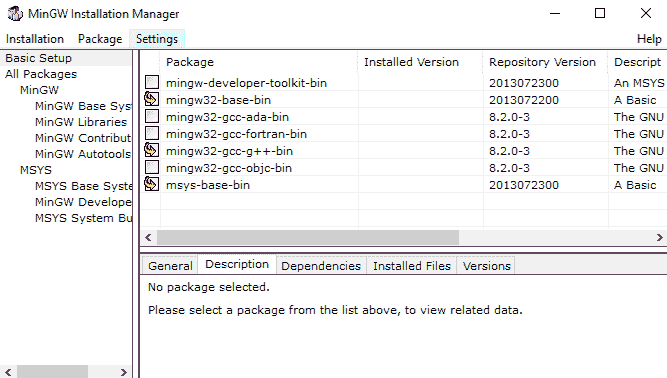
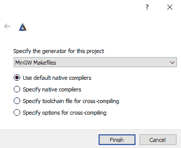

# 在 Windows 上设置您的 C 编译器

微软 Windows 是最受欢迎的桌面操作系统之一。

在开始之前，我强烈建议您从[`www.7-zip.org`](https://www.7-zip.org)安装**7-Zip**。7-Zip 将允许您提取库源代码分发的各种压缩归档格式。

让我们继续，并在 Windows 10 上设置 MinGW、OpenSSL 和`libssh`。

# 安装 MinGW GCC

MinGW 是将 GCC 移植到 Windows 的版本。这是我们推荐的用于本书的编译器。

您可以从[`www.mingw.org/`](http://www.mingw.org/)获取 MinGW。在该页面上找到下载链接，下载并运行**MinGW 安装管理器**（**mingw-get**）。

MinGW 安装管理器是一个用于安装 MinGW 的 GUI 工具。以下截图显示了它：


点击安装。然后，点击继续。等待一些文件下载，然后再次点击继续。

在这一点上，该工具将向您提供一个可以安装的包列表。您需要为安装标记 mingw32-base-bin、msys-base-bin 和 mingw32-gcc-g++-bin。以下截图显示了这一点：



您还希望选择 mingw32-libz-dev 包。它在 MinGW 库部分列出。以下截图显示了此选择：


我们选择的`g++`和`libz`包是稍后构建`libssh`所必需的。

当你准备好继续时，从菜单中选择安装并选择应用更改。

一个新的对话框将显示要进行的更改。以下截图显示了此对话框可能的外观：


点击应用按钮以下载和安装包。安装完成后，您可以关闭 MinGW 安装管理器。

为了能够轻松地从命令行使用 MinGW，您需要将 MinGW 添加到您的`PATH`。

将 MinGW 添加到您的`PATH`的步骤如下：

1.  打开系统控制面板（Windows 键 + *暂停*/*中断*）。

1.  选择高级系统设置：


1.  从系统属性窗口，导航到高级选项卡并点击环境变量...按钮：


1.  从这个屏幕上，在系统变量下找到`PATH`变量。选择它并按**编辑...**。

1.  点击新建并输入 MinGW 路径—`C:\mingw\bin`，如下截图所示：


1.  点击确定以保存您的更改。

一旦 MinGW 已添加到您的`PATH`，您就可以打开一个新的命令窗口并输入`gcc --version`以确保`gcc`已正确安装。以下截图显示了这一点：


# 安装 Git

您需要安装版本控制软件`git`来下载本书的代码。

`git`可以从[`git-scm.com/download`](https://git-scm.com/download)获取。提供了一个便捷的基于 GUI 的安装程序，您应该不会遇到任何问题。在安装时，请确保选中将`git`添加到您的`PATH`的选项。以下截图显示了这一步骤：


在`git`安装完成后，您可以通过打开一个新的命令窗口并输入`git --version`来测试它：


# 安装 OpenSSL

在 Windows 上启动 OpenSSL 库可能会有些棘手。

如果您有勇气，可以直接从[`www.openssl.org/source/`](https://www.openssl.org/source/)获取 OpenSSL 库的源代码。当然，在使用之前，您需要构建 OpenSSL。构建 OpenSSL 并不容易，但 OpenSSL 源代码中包含的`INSTALL`和`NOTES.WIN`文件提供了说明。

一个更简单的替代方案是安装预构建的 OpenSSL 二进制文件。您可以从 OpenSSL 维基百科[`wiki.openssl.org/index.php/Binaries`](https://wiki.openssl.org/index.php/Binaries)中找到预构建的 OpenSSL 二进制文件列表。您需要找到与您的操作系统和编译器匹配的二进制文件。安装它们只需将相关文件复制到 MinGW 的`include`、`lib`和`bin`目录即可。

以下截图显示了一个二进制 OpenSSL 发行版。应将`include`和`lib`文件夹复制到`c:\mingw\`并合并到现有文件夹中，而`openssl.exe`和两个 DLL 文件需要放置在`c:\mingw\bin\`：


您可以尝试从第九章 *使用 HTTPS 和 OpenSSL 加载安全网页* 中构建`openssl_version.c`来测试是否已正确安装了所有内容。它应该看起来像以下这样：


# 安装 libssh

您可以从[`www.libssh.org/`](https://www.libssh.org/)获取最新的`libssh`库。如果您擅长安装 C 库，不妨试试。否则，请继续阅读逐步说明。

在开始之前，请确保您已成功安装了 OpenSSL 库。这些是`libssh`库所必需的。

为了构建`libssh`，我们需要安装 CMake。您可以从[`cmake.org/`](https://cmake.org/)获取 CMake。他们提供了一个不错的 GUI 安装程序，您不应该遇到任何困难。确保在安装过程中选择将 CMake 添加到您的`PATH`选项：


一旦您安装了 CMake 工具和 OpenSSL 库，导航到`libssh`网站下载`libssh`源代码。在撰写本文时，版本 0.8.7 是最新的，可以从[`www.libssh.org/files/0.8/`](https://www.libssh.org/files/0.8/)获取。下载并解压`libssh`源代码。

请查看附带的`INSTALL`文件。

现在，在`libssh`源代码目录中打开一个命令窗口。使用以下命令创建一个新的`build`文件夹：

```cpp
mkdir build cd build
```

保持此命令窗口打开。我们将在一会儿进行构建。

从开始菜单或桌面快捷方式启动 CMake 3.14.3（**cmake-gui**）。

您需要使用“浏览源...”和“浏览构建...”按钮设置源代码和构建位置。以下截图显示了这一过程：


然后，点击“配置”。

在下一屏幕上，选择 MinGW Makefiles 作为此项目的生成器。点击“完成”。



处理可能需要一点时间。

在配置选项中，进行以下更改：

1.  取消选择 WITH_NACL

1.  取消选择 WITH_GSSAPI

1.  将`CMAKE_INSTALL_PREFIX`更改为`c:\mingw`

然后，再次点击“配置”。这可能需要一点时间。如果一切正常，点击“生成”。

现在，您应该能够构建`libssh`。

返回构建目录中的命令窗口。使用以下命令完成构建：

```cpp
mingw32-make
```

构建完成后，使用以下命令将文件复制到您的 MinGW 安装中：

```cpp
mingw32-make install
```

您可以尝试从第十一章“使用 libssh 建立 SSH 连接”构建`ssh_version.c`，以测试是否所有安装都正确。它应该看起来像以下这样：


# 替代方案

在本书中，我们尽可能推荐免费软件。这对于用户自由度很重要，这也是我们全书推荐 GCC 的一个原因。

此外，除了 MinGW GCC，Clang C 编译器也是开源且质量上乘的。本书中的代码也经过测试，在 Windows 上使用 Clang 成功运行。

GCC 和 Clang 等命令行工具通常更容易集成到大型项目所需的复杂工作流程中。这些开源工具还提供了比微软编译器更好的标准合规性。

话虽如此，本书中的代码也可以与微软的编译器一起使用。代码在 Microsoft Visual Studio 2015 和 Microsoft Visual Studio 2017 上进行了测试。
