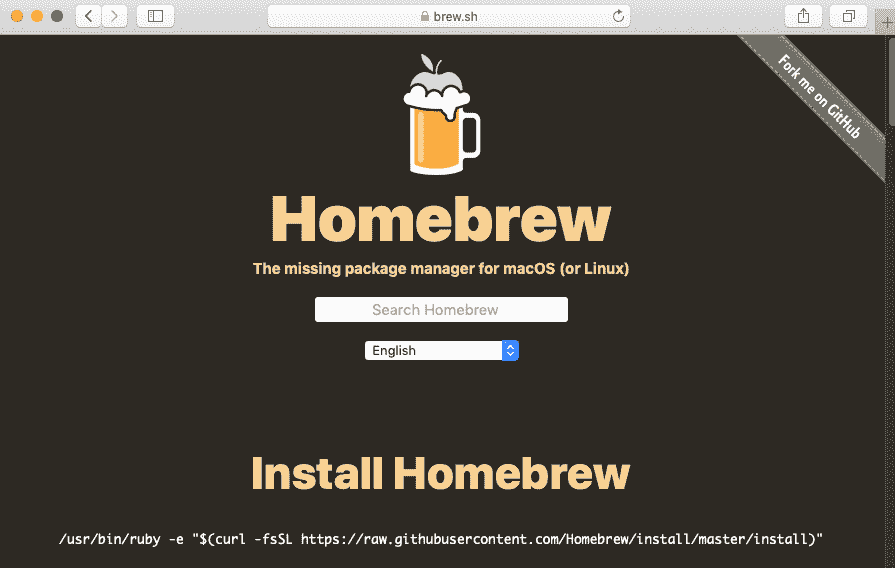
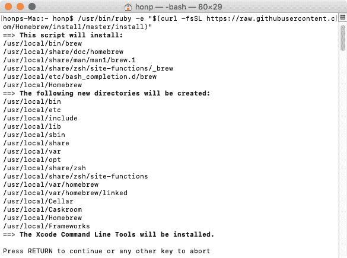
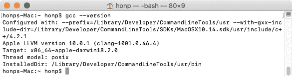
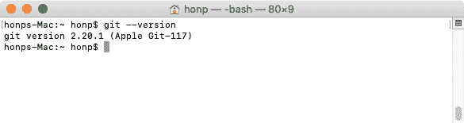
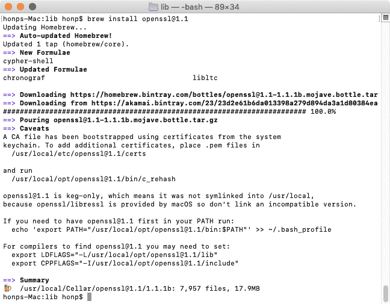
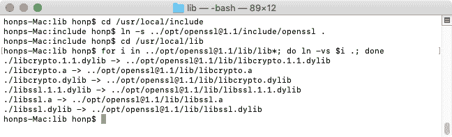
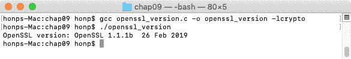
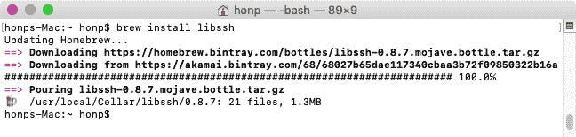
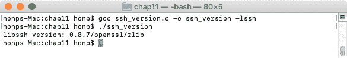

# 第十八章：在 macOS 上设置您的 C 编译器

macOS 可以是一个不错的 C 程序员开发环境。让我们开始吧。

# 安装 Homebrew 和 C 编译器

如果我们使用 **Homebrew** 软件包管理器，macOS 的设置将大大简化。

Homebrew 软件包管理器使得安装 C 编译器和开发库比其他方式要容易得多。

要安装 Homebrew，导航您的网络浏览器到 [`brew.sh/`](https://brew.sh/)：



网站提供了安装 Homebrew 的命令。您需要打开一个新的终端窗口并粘贴该命令：



只需按照说明操作，直到 Homebrew 安装完成。

安装 Homebrew 也会导致 Xcode 命令行工具一起安装。这意味着您将有一个准备好的 C 编译器。使用 `gcc --version` 命令测试您是否有一个工作的 C 编译器：



注意，macOS 安装了 Clang 编译器，但将其别名为 GCC。无论如何，它将适用于我们的目的。

Git 也应该已经安装。您可以使用 `git --version` 来验证：



# 安装 OpenSSL

假设您已经安装了 Homebrew，安装 OpenSSL 非常简单。

打开一个新的终端窗口并使用以下命令安装 OpenSSL 库：

```cpp
brew install openssl@1.1
```

在撰写本文时，默认的 Homebrew `openssl` 软件包已过时，因此我们将使用 `openssl@1.1` 软件包。

以下屏幕截图显示了 Homebrew 安装 `openssl@1.1` 软件包：



一定要阅读 `brew` 的任何输出。

`brew` 命令建议的方法要求您传递 `-L` 和 `-I` 到编译器，以告诉它 OpenSSL 库的位置。这很麻烦。

您可能更喜欢将已安装的库文件符号链接到 `/usr/local` 路径，以便您的编译器可以自动找到它们。是否要这样做取决于您。

如果您想创建符号链接以便编译器可以找到 OpenSSL，请尝试以下命令：

```cpp
cd /usr/local/include
ln -s ../opt/openssl@1.1/include/openssl .
cd /usr/local/lib
for i in ../opt/openssl@1.1/lib/lib*; do ln -vs $i .; done
```

这在下面的屏幕截图中显示：



您可以尝试从第九章 加载带有 HTTPS 和 OpenSSL 的安全网页构建 `openssl_version.c`，以测试是否正确安装了所有内容。它应该看起来像以下这样：



# 安装 libssh

安装了 Homebrew 后，安装 `libssh` 也非常简单。

打开一个新的终端窗口并使用以下命令安装 OpenSSL 库：

```cpp
brew install libssh
```

这在下面的屏幕截图中显示：



这次，我们不需要处理任何其他选项。您可以直接开始使用 `libssh`。

您可以从第十一章，*使用 libssh 建立 SSH 连接*，尝试构建 `ssh_version.c` 来测试是否已正确安装了所有内容。它应该看起来像以下这样：



这就完成了 macOS 的设置。
