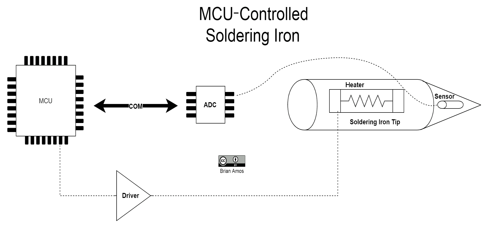
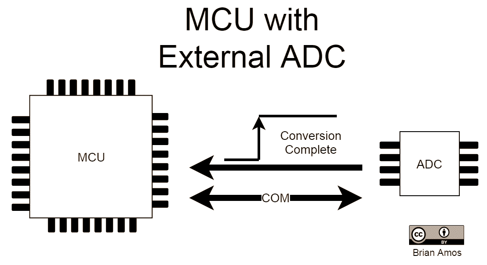
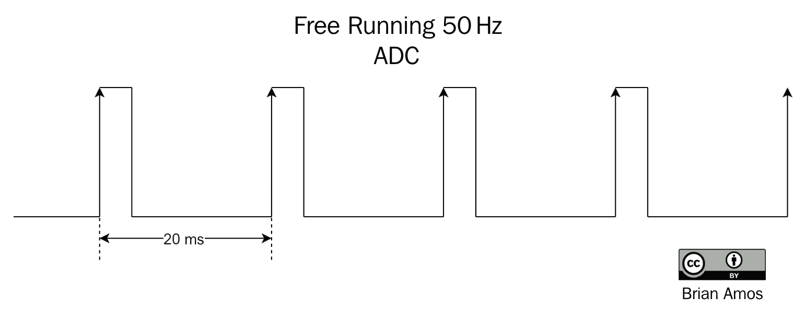
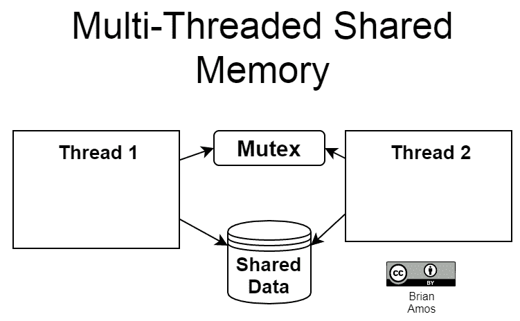
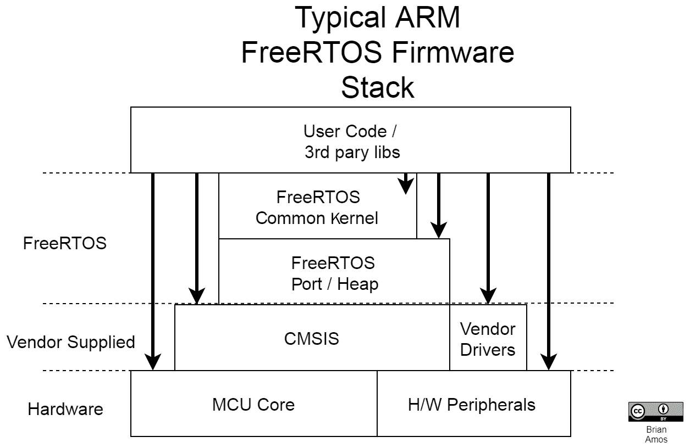

# 第一章：介绍实时系统

实时系统有各种各样的实现和使用案例。本书侧重于如何使用**实时操作系统**（**RTOS**）在**微控制器单元**（**MCU**）上创建实时应用程序。

在本章中，我们将从 RTOS（实时操作系统）的概述开始，了解具有实时要求的广泛系统。从那里，我们将探讨实现实时性能的不同方法，以及可能使用的系统类型（如硬件、固件和软件）的概述。我们将通过讨论在 MCU 应用中使用 RTOS 何时是可取的，以及何时可能根本不必要的来结束本章。

简而言之，在本章中我们将涵盖以下主题：

+   那么，“实时”究竟是什么呢？

+   定义 RTOS

+   决定何时使用 RTOS

# 技术要求

本章没有软件或硬件要求。

# 那么，什么是“实时”呢？

任何对给定事件有确定响应的系统都可以被认为是“实时”的。如果一个系统在未满足时间要求时被认为是*失败*的，那么它必须是实时的。失败的定义（以及系统失败的影响）可能会有很大的不同。认识到实时要求可能会有很大的变化，无论是时间要求的速度还是未满足所需实时截止日期的严重后果，这一点极为重要。

# 时间要求范围

为了说明可能遇到的定时要求范围，让我们考虑几个不同的系统，这些系统从**模拟-数字转换器**（**ADCs**）获取读数。

我们将首先研究的是一个控制温度的烙铁（如下图表所示）的控制系统。我们关注的系统部分是 MCU、ADC、传感器和加热器。

MCU 负责以下工作：

+   通过 ADC 从温度传感器读取数据

+   运行闭环控制算法（以保持烙铁尖端恒定温度）

+   根据需要调整加热器的输出

这些可以在以下图表中看到：

由于烙铁尖端的温度变化并不快，MCU 可能只需要每秒获取 50 个 ADC 样本（50 Hz）。负责调整加热器（以保持恒定温度）的控制算法运行速度更慢，为 5 Hz：

ADC 将激活一个硬件线路，表示转换已完成，并准备好将读数传输到 MCU 的内部存储。读取 ADC 的 MCU 有最多 20 毫秒的时间将数据从 ADC 传输到内部存储，然后需要取新的读数（如以下图所示）。MCU 还需要运行控制算法，以计算加热器输出的更新值，频率为 5Hz（200 毫秒）。这两个案例（尽管不是特别快）都是实时要求的例子：

现在，在 ADC 读取频谱的另一端，我们可能有一个高带宽网络分析仪或示波器，它将以每秒数十吉赫兹的速率读取 ADC！原始的 ADC 读数很可能会被转换到频域，并以每秒数十次的速度在高清前面板上图形化显示。这样的系统需要执行大量的处理，并且必须严格遵守极严格的时序要求，才能正常工作。

在频谱的中间部分，你会找到如闭环运动控制器这样的系统，这些系统通常需要在数百 Hz 到数十 kHz 之间执行其 PID 控制回路，以便在快速移动的系统提供稳定性。那么，**实时**有多快呢？好吧，正如你仅从 ADC 的例子中就能看到的，这取决于。

在一些先前的情况中，例如示波器或烙铁，未能满足时序要求会导致性能不佳或报告错误数据。在烙铁的情况下，这可能是温度控制不佳（这可能会损坏组件）。对于测试设备，错过截止日期可能会导致错误的读数，这是一种失败。对于一些人来说，这可能不是什么大问题，但对于依赖报告数据准确性的设备用户来说，这可能是非常重要的。一些用于标准验证的实验室设备提供了产品符合性的检查。如果设备中存在未检测到的故障，导致测量不准确，可能会报告错误值。可能可以重新运行可疑的测试。然而，如果需要频繁重新测试，并且无法保证可靠的读数，那么测试设备将开始变得可疑，被视为不可靠，销量将下降——所有这一切都是因为未能持续满足实时要求。

在其他系统中，例如无人机飞行控制或工业过程控制中的运动控制，未能及时运行控制算法可能会导致更严重的物理灾难，例如坠毁。在这种情况下，后果可能是致命的。

幸运的是，可以采取一些步骤来避免所有这些故障场景。

# 保证实时行为的方法

确保系统按预期工作的一种最简单的方法是确保它在满足要求的同时尽可能简单。这意味着抵制过度复杂化简单任务的冲动。如果烤面包机是用来烤一片面包的，那么不要在上面安装显示屏并让它告诉你天气；只需让它打开加热元件适当的时间即可。这个简单的任务多年来一直无需任何代码或可编程设备就能完成。

作为程序员，如果我们遇到一个问题，我们往往会立即伸手去拿最近的微控制器单元并开始编码。然而，某些产品的功能（尤其是如果产品具有机电组件）最好在不使用代码的情况下处理。汽车窗户实际上不需要带有轮询循环的微控制器来运行，通过驱动器打开电机，并监视传感器以获取反馈来关闭它们。这项任务实际上可以通过几个机械开关和二极管来处理。如果需要为给定的系统提供反馈报告机制——例如，在窗户卡住的情况下需要断言的错误——那么可能别无选择，只能使用更复杂的解决方案。然而，作为工程师，我们的目标始终应该是相同的——尽可能简单地解决问题，不要增加额外的复杂性。

如果一个问题可以通过硬件独立解决，那么首先与团队一起探索这个可能性，然后再考虑使用微控制器单元（MCU）。如果一个问题可以通过使用简单的 *while* 循环来执行一些传感器状态的轮询来处理，那么只需轮询传感器的状态即可；可能没有必要开始编写 **中断服务例程**（**ISRs**）。如果设备的功能是单一用途的，那么在许多情况下，一个完整的实时操作系统（RTOS）可能会起到反作用——所以不要使用它！

# 实时系统的类型

实现实时行为有许多不同的方法。以下部分是关于你可能会遇到的各种实时系统的讨论。此外，请注意，以下系统可以作为子系统一起工作。这些不同的子系统可以在产品、板或甚至芯片级别出现（这种方法在第十六章*多处理器和多核系统*）中讨论）。

# 硬件

原始的实时系统，硬件，仍然是对于极严格公差和/或快速时序要求的首选。它可以采用离散数字逻辑、模拟组件、可编程逻辑或**应用特定集成电路**（**ASIC**）。**可编程逻辑器件**（**PLDs**）、**复杂可编程逻辑器件**（**CPLDs**）和**现场可编程门阵列**（**FPGAs**）是这个解决方案中可编程逻辑器件部分的各个成员。基于硬件的实时系统可以涵盖从模拟滤波器、闭环控制、简单的状态机到复杂的视频编解码器等任何内容。如果考虑到节能，ASIC 可以比基于 MCU 的解决方案消耗更少的电力。一般来说，硬件的优势在于并行执行操作和**瞬间**（当然，这是一个过于简化的说法），而单核 MCU 只能提供并行处理的假象。

实时硬件开发的缺点通常包括以下内容：

+   非可编程设备的僵化性。

+   所需的专业知识通常不如软件/固件开发者常见。

+   完全功能可编程设备（例如，大型 FPGAs）的成本。

+   开发定制 ASIC 的高成本。

# 纯硬件固件

纯硬件固件（就我们的目的而言）被认为是任何不是建立在某种预存在内核/调度器之上的固件。一些工程师更进一步，认为真正的纯硬件固件不能使用任何预存在的库（例如供应商提供的硬件抽象库）——这种观点也有一定的合理性。纯硬件实现的优势在于用户的代码对硬件的所有方面都有**完全**的控制。主循环代码执行被中断的唯一方式是如果发生中断。在这种情况下，其他任何东西要控制 CPU 的唯一方式是现有的中断服务例程（ISR）完成或发生另一个更高优先级的中断。

当需要执行的任务数量少且相对简单时，或者有一个单一的任务时，纯硬件固件解决方案表现优异。如果固件保持专注并遵循最佳实践，由于 ISR（或在某些情况下，ISR 的缺乏）之间的交互相对较少，确定性的性能通常容易测量和保证。在某些极端情况下，对于负载很重的 MCU（或 ROM/RAM 高度受限的 MCU），纯硬件是唯一的选择。

当裸机实现处理异步事件变得更加复杂时，它们开始与 RTOS 提供的功能重叠。需要记住的一个重要考虑因素是，通过使用 RTOS——而不是尝试自己构建线程安全的系统——您可以自动受益于 RTOS 提供商所进行的所有测试。您还将有机会使用具有事后诸葛亮能力的代码——今天可用的所有 RTOS 都已经存在了几年。作者一直在适应和添加功能，使它们对不同应用具有鲁棒性和灵活性。

# 基于 RTOS 的固件

在微控制器（MCU）上运行调度内核的固件是基于 RTOS 的固件。调度器的引入和一些 RTOS 原语使得任务可以在拥有处理器的感觉下运行（详细讨论见第二章，*理解 RTOS 任务*）。使用 RTOS 可以使系统在执行其他复杂任务的同时，对最重要的事件保持响应。

所有这些任务同时运行有一些缺点。共享数据的任务之间可能会出现相互依赖性——如果处理不当，依赖性会导致任务意外阻塞。尽管有处理这种情况的措施，但它确实增加了代码的复杂性。中断通常使用任务信号来尽快处理中断，并将尽可能多的处理推迟到任务中。如果处理得当，这种解决方案对于保持复杂系统响应性是极好的，尽管存在许多复杂的交互。然而，如果处理不当，这种设计范式可能导致更多的时间抖动和更少的确定性。

# 基于 RTOS 的软件

在包含**内存管理单元**（**MMU**）和**中央处理单元**（**CPU**）的**完整**操作系统上运行的软件被认为是基于实时操作系统（RTOS）的软件。采用这种方法实现的应用程序可能非常复杂，需要各种内部和外部系统之间进行许多不同的交互。使用完整操作系统的优点是它所附带的所有能力——包括硬件和软件。

在硬件方面，通常有更多的 CPU 核心可用，运行在更高的时钟频率上。可能有数 GB 的 RAM 和持久性内存可用。添加外围硬件可能就像添加一张卡一样简单（前提是有现成的驱动程序）。

在软件方面，有大量的开源和供应商专有解决方案用于网络堆栈、UI 开发、文件处理等。在所有这些能力和选项之下，内核的实现方式仍然确保关键任务不会无限期地被阻塞，这是传统操作系统所能实现的。正因为如此，获得确定性的性能仍然在掌握之中，就像 RTOS 固件一样。

# 精心打造的操作系统软件

与基于实时操作系统（RTOS）的软件类似，标准操作系统拥有开发者可能需要的所有库和功能。然而，它缺少的是对满足时序要求的严格关注。一般来说，使用传统操作系统实现的系统将具有更少的确定性行为（在安全关键情况下，没有任何行为是可以真正依赖的）。如果没有灾难性的后果，如果软实时要求宽松，如果截止日期不按时完成，标准操作系统仍然可以工作，只要在选择运行的软件栈及其资源使用上保持谨慎。带有`PREEMPT_RT`补丁的 Linux 内核就是这种实时系统的良好例子。

因此，现在我们已经概述了实现实时系统的所有选项，是时候定义当我们说 RTOS 时，具体是指基于微控制器（MCU）的 RTOS 了。

# 定义 RTOS

操作系统（如 Windows、Linux 和 macOS）被创建作为一种提供一致编程环境的方式，它抽象了底层硬件，使得编写和维护计算机程序变得更容易。它们为应用程序程序员提供了许多不同的**原语**（如线程和互斥锁），可以用来创建更复杂的行为。例如，可以创建一个多线程程序，它提供了对共享数据的受保护访问：

前面的应用程序并没有**实现**线程和互斥锁原语，它只是使用了它们。线程和互斥锁的实际实现由操作系统处理。这有几个优点：

+   应用程序代码更简单。

+   更易于理解——无论程序员是谁，都使用相同的原语，这使得理解不同人编写的代码变得更容易。

+   更好的硬件可移植性——在适当的预防措施下，代码可以在操作系统支持的任何硬件上运行而无需修改。

在前面的例子中，使用了一个**互斥锁**来确保一次只有一个线程可以访问共享数据。在通用操作系统中，每个线程都会无限期地等待互斥锁变为可用，然后才继续访问共享数据。这就是 RTOS 与通用操作系统不同的地方。在 RTOS 中，所有阻塞的系统调用都有时间限制。而不是无限期地等待互斥锁，RTOS 允许指定最大延迟。例如，如果线程 1 尝试获取互斥锁，在 100 毫秒或 1 秒后仍然没有获取到，它将继续等待互斥锁变为可用。

在实时操作系统（RTOS）的实现中，指定了等待互斥锁（Mutex）可用的最大时间。如果线程 1 指定必须在 100 毫秒内获取互斥锁，但在 101 毫秒后仍未收到互斥锁，线程 1 将收到一个通知，表明互斥锁没有及时获取。这个超时是为了帮助创建一个确定性系统。

任何提供以确定性方式执行给定代码的 OS 都可以被认为是实时操作系统。这种 RTOS 的定义涵盖了相当大数量的系统。

有一些特性往往区分了一个 RTOS 应用程序与另一个：不满足实时截止日期的频率和严重性。RTOS 应用程序的不同范围通常被归纳为三个类别——硬实时、稳定实时和软实时系统。

不要过于纠结于稳定和软实时系统之间的差异。这些术语的定义甚至在我们行业内都没有达成一致意见。真正重要的是，你要了解你系统的需求，并设计一个解决方案来满足它们！

如果一个故障会导致生命丧失或重大财产损失，那么该故障的严重性通常被认为是**安全关键**的。有一些硬实时系统与安全性无关。

# 硬实时系统

硬实时系统必须 100%地按时完成其截止日期。如果系统没有按时完成截止日期，那么它被认为已经失败。这并不一定意味着如果在一个硬实时系统中发生故障会伤害到人——只是如果它错过了一个截止日期，那么系统**已经**失败了。

硬实时系统的例子可以在医疗设备中找到，例如起搏器和具有极严格参数控制的控制系统。在起搏器的例子中，如果起搏器错过在正确时间点发放电脉冲的截止日期，它可能会杀死患者（这就是为什么起搏器被定义为安全关键系统）。

相比之下，如果一个计算机数控（**CNC**）铣床上的运动控制系统没有及时响应一个命令，它可能会将工具插入到正在加工的部件的错误部分，从而损坏它。在我们提到的这些情况下，一个故障导致了生命丧失，而另一个将一些金属变成了废料——但两者都是由一个错过截止日期的单个故障引起的。

# 稳定实时系统

与硬实时系统相反，稳定实时系统需要几乎每次都能按时完成其截止日期。如果视频和音频暂时失去同步，这可能不会被视为系统故障，但很可能会让视频的消费者感到不满。

在大多数控制系统中（类似于之前例子中的烙铁），一些稍微超出指定时间读取的样本不太可能完全破坏系统控制。如果一个控制系统有一个自动获取新样本的 ADC，如果 MCU 没有及时读取新样本，它将被新的一个覆盖。这种情况偶尔会发生，但如果它发生得太频繁，温度稳定性就会被破坏。在一个特别要求高的系统中，可能只需要错过几个样本，整个控制系统就会*超出规格*。

# 软实时系统

软实时系统在系统必须满足其截止日期的频率方面最为宽松。这些系统通常只提供*尽力而为*的承诺来保持截止日期。

汽车上的巡航控制是一个软实时系统的良好例子，因为它没有硬性规格或期望。驾驶员通常不会期望他们的速度收敛到设定速度的±*x*英里/小时/公里。他们期望在*合理*的情况下，例如没有大坡，控制系统最终会让他们*接近*他们期望的速度*大多数时候*。

# RTOSes 的范围

RTOSes 的功能、架构以及它们最适合的处理器的大小各不相同。在较小的方面，我们有针对小型 8-32 位 MCU 的 RTOSes，如 FreeRTOS、Keil RTX、Micrium µC、ThreadX 以及更多。这类 RTOS 适用于微控制器，并提供一个紧凑的实时内核作为最基本的服务。当从 MCU 转向 32 位和 64 位应用处理器时，你往往会发现 RTOSes，如 Wind River VxWorks 和 Wind River Linux、Green Hills 的 Integrity OS，甚至带有`PREEMPT_RT`内核扩展的 Linux。这些完整的操作系统提供了大量的软件，为实时调度需求以及一般计算任务提供解决方案。即使是我们刚刚提到的操作系统，我们也只是触及了表面。在 RTOSes 的所有级别，无论是大是小，都有免费和付费的解决方案（一些成本超过 10,000 美元）。

那么，为什么你会选择为解决方案付费，当有免费的东西可用时呢？免费可用的 RTOS 解决方案和付费解决方案之间的主要区别因素是安全认证、中间件和客户支持。因为 RTOS 提供了一个高度确定的执行环境，它们通常用于复杂的安全关键应用。我们通常所说的 *安全关键* 是指一个系统，其故障可能会伤害人员或造成重大损害。这些系统需要确定性的操作，因为它们必须始终以可预测的方式行事。保证代码在固定时间内对事件做出响应是确保它们行为一致的重要步骤。大多数这些安全关键应用都受到监管，并有自己的监管机构和标准，例如飞机的 DO-178B 和 DO-178C 或工业应用的 IEC 61508 SIL 3 和 ISO 26262 ASILD。为了使安全关键认证更加经济实惠，设计人员通常会保持这些系统的代码极其简单（这样就可以从数学上证明系统将始终如一地运行，不会出错），或者将商业 RTOS 解决方案作为起点，这些解决方案已经通过了认证。WITTENSTEIN SafeRTOS 是 FreeRTOS 的一个分支，已经获得了工业、医疗和汽车使用的认证。

中间件也可以是复杂系统中极其重要的组成部分。中间件是介于 *用户代码*（即你，*应用开发者*编写的代码）和底层，例如实时操作系统（RTOS）或裸机（无 RTOS）之间的代码。付费解决方案的另一个价值主张是，生态系统提供了一套预先集成的、高质量的中件（例如文件系统、网络堆栈、GUI 框架、工业协议等），这最大限度地减少了开发工作并降低了整体项目风险。使用中间件而不是 *自行开发* 的原因是为了减少内部开发团队编写的原始代码量。这减少了团队的风险和总耗时——因此，这可以是一项值得的投资，这取决于项目复杂性和时间要求等因素。

付费解决方案通常还会附带来自固件供应商的一些级别的客户支持。工程师的雇佣和保留成本很高。经理最害怕的事情之一就是走进一个房间里满是工程师在困惑他们的工具，而不是解决需要解决的 *真正* 问题。拥有专家帮助，只需一封电子邮件或一个电话就能得到，可以显著提高团队的生产力，这导致周转时间缩短，每个人都更加快乐。

FreeRTOS 提供付费支持和培训选项，以及付费的中间件解决方案，可以集成。然而，也有开源和/或免费提供的中间件组件，其中一些将在本书中讨论。

# 本书使用的 RTOS

在所有可用的选项中，你可能想知道：为什么这本书只介绍了一种在单个 MCU 型号上的 RTOS？有几个原因，其中之一是，我们将涵盖的大部分概念几乎适用于任何可用的 RTOS，就像良好的编码习惯超越了你所使用的语言一样。通过专注于单个 MCU 上的 RTOS 的单个实现，我们将能够比如果尝试讨论所有替代方案更深入地探讨主题。

FreeRTOS 是针对 MCU 最流行的 RTOS 实现之一，并且非常广泛可用。它已经存在超过 15 年，并且已经移植到数十个平台。如果你曾经与一个真正熟悉 RTOS 编程的低级嵌入式系统工程师交谈过，他们肯定听说过 FreeRTOS，并且很可能至少使用过一次。通过关注 FreeRTOS，你将能够快速地将你对 FreeRTOS 的知识迁移到其他硬件，或者如果情况需要，过渡到另一个 RTOS。

我们使用 FreeRTOS 的另一个原因？嗯，它是免费的！FreeRTOS 在 MIT 许可下分发。有关许可和其他 FreeRTOS 衍生产品（如 SAFERTOS 和 OpenRTOS）的更多详细信息，请参阅[`www.freertos.org/a00114.html`](https://www.freertos.org/a00114.html)。

下面的图示显示了 FreeRTOS 在典型 ARM 固件堆栈中的位置。"堆栈"指的是构成系统的所有不同的**层**的固件组件以及它们是如何一层层堆叠的。这里的"用户"指的是使用 FreeRTOS 的程序员（而不是嵌入式系统的最终用户）：

一些值得注意的项目如下：

+   用户代码能够访问相同的 FreeRTOS API，无论底层硬件端口实现如何。

+   FreeRTOS 不会阻止用户代码使用供应商提供的驱动程序、CMSIS 或原始硬件寄存器。

拥有一个在硬件上保持一致的标准化 API 意味着代码可以轻松地在硬件目标之间迁移，而无需不断重写。能够让代码直接与硬件通信也提供了在必要时编写**极其**高效代码的手段（以牺牲可移植性为代价）。

既然我们已经知道了 RTOS 是什么，让我们更详细地看看何时使用 RTOS 是合适的。

# 决定何时使用 RTOS

有时，当某人第一次听说**实时操作系统**这个术语时，他们可能会错误地认为 RTOS 是唯一实现嵌入式系统中实时行为的方法。虽然这当然是可以理解的（尤其是考虑到这个名字），但这与事实相去甚远。有时，最好将 RTOS 视为一个**潜在**的解决方案，而不是用于所有事情的**解决方案**。一般来说，对于一个基于 MCU 的 RTOS 要成为特定问题的理想解决方案，它需要具有**金发姑娘**级别的复杂性——既不太简单，也不太复杂。

如果存在一个**极其**简单的问题，例如监控两个状态并在它们都存在时触发警报，解决方案可能是一个直接的硬件解决方案（例如 AND 门）。在这种情况下，可能没有必要进一步复杂化问题，因为 AND 门解决方案将会非常快，具有高确定性和极端可靠性。它也将需要非常少的发展时间。

现在，考虑一个只有一两个任务需要执行的情况，例如控制电机的速度并监控编码器以确保正确地行进了正确的距离。这当然可以通过离散的模拟和数字硬件实现，但具有可配置的距离会增加一些复杂性。此外，调整控制回路系数可能需要调整电位计设置（可能每个单独的板都需要），这在某些或大多数情况下，按照今天的制造标准是不理想的。因此，在硬件解决方案方面，我们只剩下 CPLD 或 FPGA 来实现运动控制算法并跟踪行进距离。这恰好非常适合两者，因为它可能足够小，可以放入 CPLD，但在某些情况下，FPGA 的成本可能无法接受。这个问题也经常由 MCU 处理。如果现有的内部资源没有与硬件语言或工具链相关的专业知识，那么裸机 MCU 固件解决方案可能是一个不错的选择。

假设问题更加复杂，例如一个控制多个不同执行器的设备，从一系列传感器读取数据，并将这些值存储在本地存储中。也许该设备还需要连接到某种网络，如以太网、Wi-Fi、**控制器局域网络**（**CAN**）等。实时操作系统可以很好地解决这个问题。需要完成许多不同的任务，这些任务或多或少是异步的，这使得很容易论证实时操作系统带来的额外复杂性是值得的。实时操作系统帮助我们确保低优先级、更复杂的任务（如网络和文件系统堆栈）不会干扰更时间敏感的任务（如控制执行器和读取传感器）。在许多情况下，可能存在某种控制系统，通常从时间上定义良好的间隔运行中获益——这是实时操作系统的优势。

现在，考虑一个与之前类似的系统，但现在有多个网络要求，例如提供网页服务、在复杂的企业环境中处理用户身份验证，以及将文件推送到需要不同网络文件协议的多个共享目录。这种复杂程度*可以*通过实时操作系统实现，但同样，根据可用的团队资源，这可能会更好留给一个完整的操作系统来处理（无论是实时操作系统还是通用操作系统），因为许多所需的复杂软件栈已经存在。有时，可能会采用多核方法，其中一个核心运行实时操作系统，而另一个核心运行通用操作系统。

到目前为止，可能已经很清楚，没有一种确定的方法可以精确地确定哪种实时解决方案适用于*所有*情况。每个项目和团队都会有他们自己独特的需求、背景、技能组合和情境，这些都为这一决策奠定了基础。选择解决方案时需要考虑许多因素；保持开放的心态，并选择最适合您团队和当时项目的解决方案是很重要的。

# 摘要

在本章中，我们介绍了如何识别实时需求，以及实现实时系统的不同平台。到现在，您应该对可能具有实时需求的广泛系统以及满足这些实时需求的各种方式有所认识。

在下一章中，我们将通过更深入地研究两种不同的编程模型——超级循环和实时操作系统任务，来开始探讨基于 MCU 的实时固件。

# 问题

如我们所总结，以下是一些问题，供您测试对本章材料的理解。您将在附录的*评估*部分找到答案：

1.  带有实时要求的系统是否总是需要非常快？

1.  实时系统是否总是需要实时操作系统？

1.  固件是否是满足实时性要求的唯一途径？

1.  什么是实时系统？

1.  列举 3-4 种实时系统的类型。

1.  在什么情况下使用实时操作系统（RTOS）来满足实时性要求是合适的？
