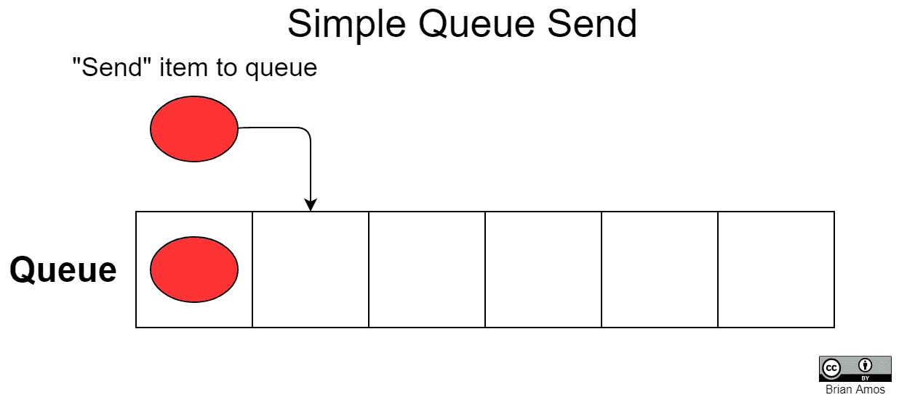
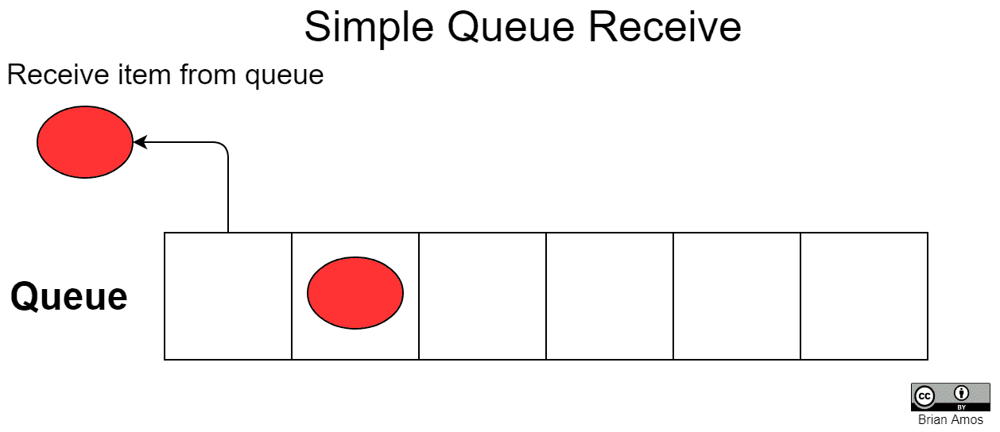
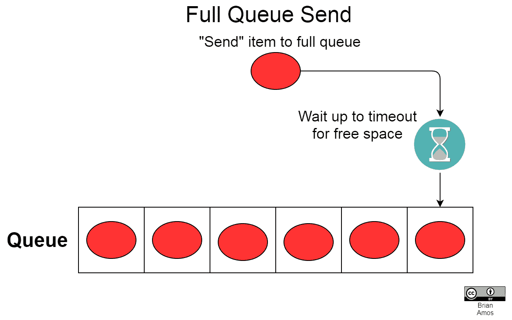
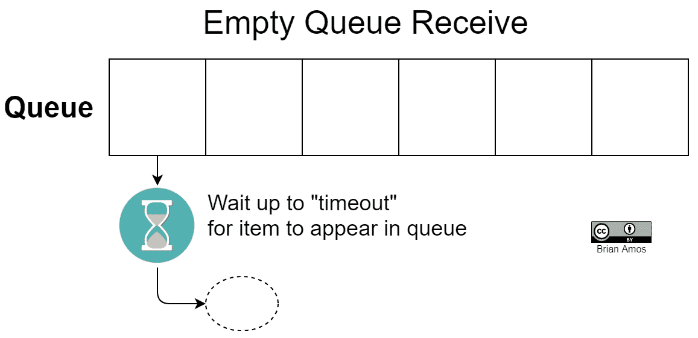
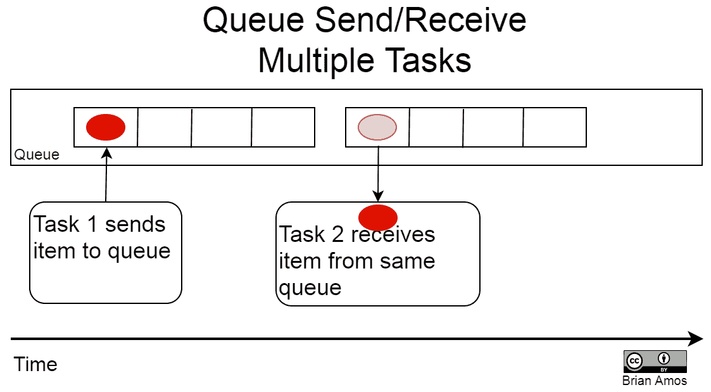
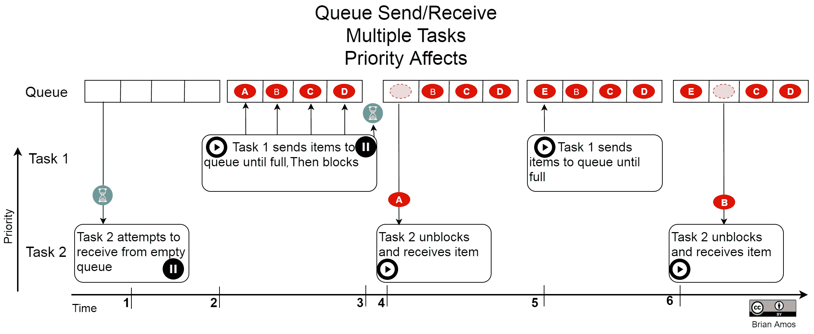
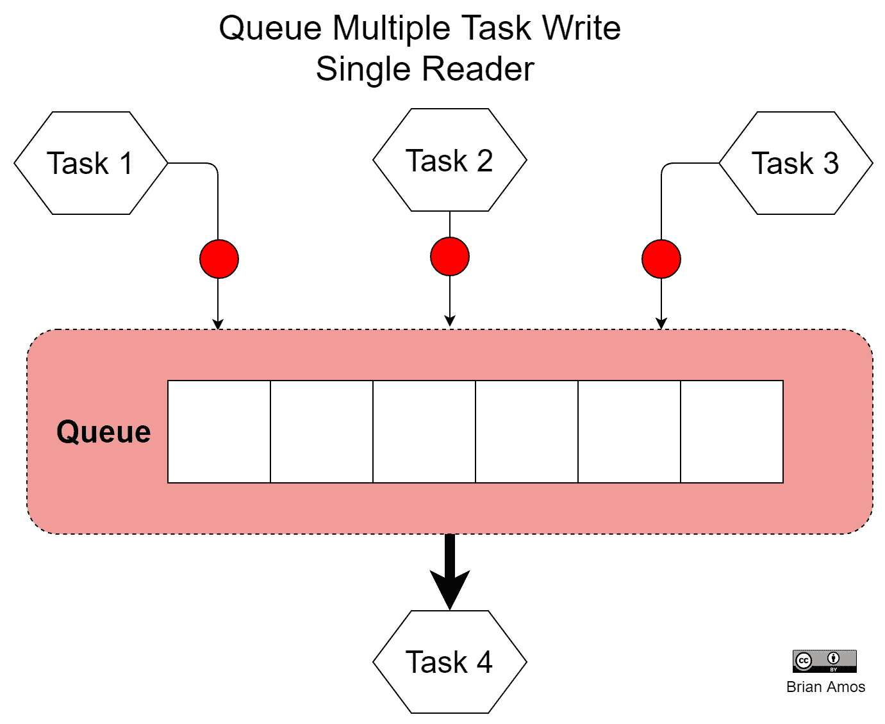
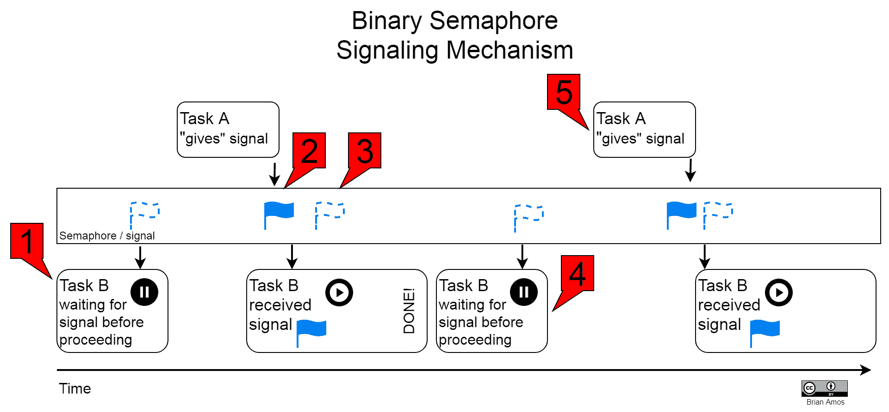
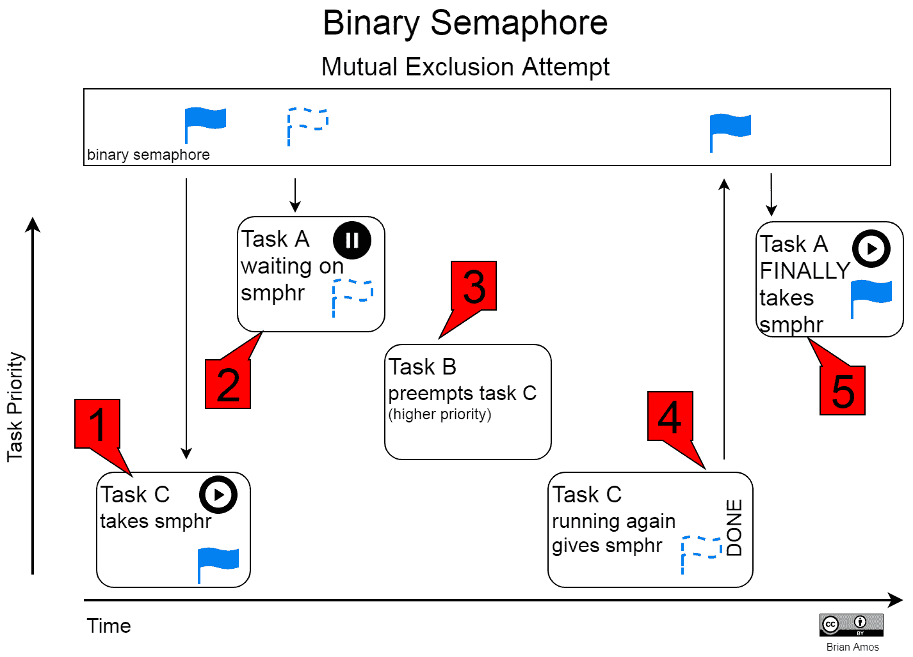
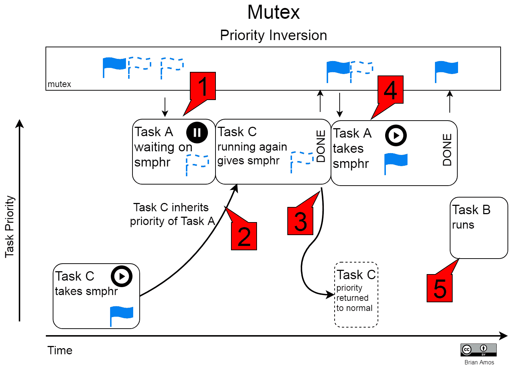

# 任务信号和通信机制

在上一章中，我们介绍了任务。在结尾处，我们查看了一些关于系统中多个任务的抢占式调度的示例，以及任务将在它不是在等待某事（处于阻塞状态）并且可以执行某些有用操作时运行的事实。在本章中，我们将简要介绍任务信号和任务间通信的核心机制。这些原语对于事件驱动并行编程是基本的，而事件驱动并行编程是良好实现的基于实时操作系统的应用程序的基础。

我们不会直接深入 FreeRTOS API，而是将每个原语与一些图形示例和一些关于何时可以使用每种机制的提示一起展示。不用担心：在后面的章节中，我们将深入了解如何使用 API。现在，让我们专注于基础知识。

在本章中，我们将介绍以下主题：

+   RTOS 队列

+   RTOS 信号量

+   RTOS 互斥锁

# 技术要求

本章没有软件或硬件要求。

# RTOS 队列

队列在概念上相当简单，但它们也非常强大和灵活，尤其是如果你传统上使用 C 语言在裸机上进行编程。在本质上，队列只是一个环形缓冲区。然而，这个缓冲区包含一些非常特殊的属性，例如原生的多线程安全性，每个队列可以持有任何类型的数据的灵活性，以及唤醒等待队列中出现项目的其他任务。默认情况下，数据使用**先进先出**（**FIFO**）顺序存储在队列中——首先放入队列的项目是首先从队列中移除的项目。

我们将首先查看队列在不同状态和不同使用方式（发送与接收）下的简单行为，然后继续讨论如何使用队列在任务之间传递信息。

# 简单队列发送

第一个队列示例仅仅是向队列中添加（也称为*发送)*一个有空间的项目：

当一个项目被添加到有可用空间的队列中时，添加操作会立即发生。因为队列中有可用空间，所以将项目*发送*到队列的任务会继续运行，除非有另一个更高优先级的任务正在等待队列中出现项目。

尽管与队列的交互通常发生在任务内部，但这并不是*总是*如此。有一些特殊情况，队列也可以从 ISR 内部访问（但该行为有不同的规则）。对于本章的示例，我们将假设任务是向队列发送和接收项目。

# 简单队列接收

在以下图中，一个任务被显示为从队列中*接收*一个项目：

当一个任务准备从队列中接收一个项目时，默认情况下，它将获取最老的项目。在这个例子中，由于队列中至少有一个项目，所以*接收*操作将立即处理，任务继续运行。

# 满队列发送

当队列满时，不会丢弃任何信息。相反，试图将项目发送到队列中的任务将等待直到预定的等待时间，以等待队列中有可用空间：

当队列满时，试图向队列发送项目的任务将等待直到队列中有空间可用，但只到指定的超时值。

在这个例子中，如果一项任务试图向一个满队列发送数据，并且它的超时时间是 10 毫秒——它将只等待 10 毫秒以等待队列中有空间可用。超时时间过后，调用将返回并通知调用代码发送失败。关于这种失败的处理方式由设置调用代码的程序员决定，并且会根据具体的使用情况而有所不同。对于真正非关键的功能，可以使用非常长的超时值。只是要注意，这会导致发送任务实际上永远等待队列中的空间变得可用（这显然不再是实时了）！

你的代码通常会被构建成尝试向队列发送数据不会超时。作为程序员，你需要根据具体情况确定可接受的时间长度。如果发生超时，你也负责确定其严重性和纠正措施。可能的纠正措施可能从什么也不做（比如视频通话中丢失的一帧）到紧急关闭。

# 空队列接收

另一个可能导致任务阻塞的情况是尝试从空队列中*接收*：

与等待空间变得可用的*发送*操作类似，从队列中*接收*的任务也有可能被延迟。在空队列的情况下，试图从队列中接收项目的任务将被阻塞，直到队列中出现项目。如果在超时时间之前没有可用项目，调用代码将被通知失败。再次强调，采取的具体行动会有所不同。

有时，会使用无限等待。你经常会遇到非常长的等待期，对于接收来自外部接口（如串行端口）输入的队列，这些接口可能不会持续发送数据。如果串行端口另一端的人类用户在一段时间内没有发送数据，这根本不会有任何问题。

另一方面，接收超时也可以用来确保你有足够的数据量来处理。让我们使用一个旨在以 10 Hz（每秒 10 次读取）提供新读数的传感器。如果你正在实现依赖于该传感器**新鲜**读数的算法，可以使用略大于 100 ms 的超时来触发错误。这个超时将保证算法始终在**新鲜**的传感器读数上操作。在这种情况下，超时可以用来触发某种纠正行动或通知传感器未按预期工作。

# 交互任务队列

现在我们已经覆盖了队列的简单行为，我们将看看它们如何用于在任务之间移动数据。队列的一个非常常见的用例是有一个任务填充队列，而另一个任务从同一个队列中读取。这通常很简单，但可能有一些细微差别，具体取决于系统的设置：

在前面的例子中，`任务 1`和`任务 2`都在与同一个队列交互。`任务 1`将项目**发送**到队列。只要`任务 2`的优先级高于`任务 1`，它就会立即**接收**该项目。

让我们考虑另一个在实践中经常发生的实例，即多个任务与队列交互。由于抢占式调度器始终运行具有最高优先级的任务，如果该任务始终有数据要写入队列，队列将在另一个任务有机会从队列中读取之前填满。以下是一个可能发生的情况的示例：

以下数字对应于时间轴上的索引：

1.  `任务 2`试图从空队列中接收一个项目。没有可用项目，因此`任务 2`被阻塞。

1.  `任务 1`向队列添加项目。由于它是系统中的最高优先级任务，`任务 1`会一直向队列添加项目，直到没有更多项目可添加，或者直到队列已满。

1.  队列已满，因此`任务 1`被阻塞。

1.  `任务 2`由调度器提供上下文，因为它现在是可能运行的最高优先级任务。

1.  一旦从队列中移除一个项目，`任务 1`再次被提供上下文（这是系统中的最高优先级任务，它现在能够运行，因为它在等待队列中有空间可用时被阻塞）。在添加单个项目后，队列已满，`任务 1`被阻塞。

1.  `任务 2`被提供上下文并从队列中接收一个项目：

上述情况的一个现实世界示例在第九章，“**任务间通信”*部分中的*通过队列传递数据*。`Chapter_9/src/*mainQueueCom**positePassByValue.c*`展示了确切的设置，并使用`SystemView`进行了彻底的经验性执行分析。

队列的另一个极其常见的用例是单个队列接受来自许多不同来源的输入。这对于像调试串行端口或日志文件这样的东西特别有用。许多不同的任务可以写入队列，而只有一个任务负责从队列接收数据并将其推送到共享资源。

当队列通常用于在任务之间传递数据时，信号量可以用于信号和同步任务。让我们接下来了解更多关于这一点。

# RTOS 信号量

信号量是另一个非常直接但强大的结构。单词*信号量*源自希腊语——其大致的英文翻译是*信号携带者*，这是一个非常直观的方式来思考它们。信号量用于指示发生了某事；它们是事件的信号。信号量的以下是一些示例用例：

+   一个中断服务例程（ISR）完成了对外围设备的处理。它可能*释放*一个信号量，向任务提供信号，表明数据已准备好进一步处理。

+   一个任务达到了一个需要等待系统中的其他任务*赶上*才能继续前进的交叉点。在这种情况下，可以使用信号量来同步任务。

+   限制对受限资源的同时用户数量。

使用实时操作系统（RTOS）的一个方便之处在于信号量的预先存在。由于它们的功能基础（且关键），它们被包含在 RTOS 的每个实现中。有两种不同类型的信号量来覆盖这些需求——计数信号量和二进制信号量。

# 计数信号量

计数信号量通常用于管理具有对同时用户数量限制的共享资源。在创建时，它们可以被配置为持有最大值，称为*上限*。计数信号量的例子通常是数据库中的读者... 好吧，我们在这里讨论的是一个基于 MCU 的嵌入式系统，所以让我们保持我们的例子相关。如果你对数据库感兴趣，你可能更适合使用通用操作系统！对于我们的例子，让我们假设你正在实现一个基于套接字的通信驱动程序，而你的系统只有足够的内存来支持有限数量的同时套接字连接。

在下面的图中，我们有一个可以容纳两个同时套接字连接的共享网络资源。然而，有三个任务需要访问。计数信号量用于限制同时套接字连接的数量。每次任务完成对共享资源的处理（即其套接字关闭）时，它必须释放其信号量，以便另一个任务可以访问网络。如果一个任务意外地*释放*了一个已经达到最大计数的信号量，计数将保持不变：

上述图示演示了一个只能同时服务两个任务（尽管系统中有三个任务需要使用该资源）的共享资源示例。如果一个任务要使用受计数信号量保护的套接字，它必须首先从池中获取一个信号量。如果没有可用的信号量，那么该任务必须等待直到信号量变得可用：

1.  初始时，创建一个最大（上限）为 2 且初始计数为 0 的信号量。

1.  当 `TaskA` 和 `TaskB` 尝试获取 `semphr` 时，它们立即成功。在这个时候，它们可以各自打开一个套接字并在网络上进行通信。

1.  `TaskC` 完成得稍晚一些，因此它需要等待 `semphr` 的计数小于 2，这时网络套接字才能被自由使用。

1.  在 `TaskB` 通过其套接字完成通信后，它归还信号量。

1.  现在信号量可用后，`TaskC` 完成其获取操作，并被允许访问网络。

1.  在 `TaskC` 获取访问权限不久后，`TaskB` 有另一条消息要发送，因此它尝试获取一个信号量，但需要等待一个信号量变得可用，所以它被置于睡眠状态。

1.  当 `TaskC` 在网络上进行通信时，`TaskA` 完成，并归还其信号量。

1.  `TaskB` 被唤醒并完成其任务，这使得它能够开始通过网络进行通信。

1.  在 `TaskB` 被赋予其信号量后，`TaskC` 完成其事务并归还它所持有的信号量。

在信号量等待中，实时操作系统（RTOS）与大多数其他信号量实现不同——任务在信号量等待期间可能会超时。如果一个任务未能及时获取信号量，它不得访问共享资源。相反，它必须采取替代措施。这种替代措施可以是多种多样的行动，从严重到足以触发紧急关闭序列，到轻微到只需在日志文件中提及或推送到调试串行端口以供以后分析。作为程序员，确定适当的行动方案取决于你，这有时可能会与其他学科进行一些困难的讨论。

# 二进制信号量

二进制信号量实际上只是最大计数为 1 的计数信号量。它们最常用于同步。当一个任务需要同步于一个事件时，它将尝试获取一个信号量，直到信号量变得可用或直到指定的超时时间已过。系统的另一个异步部分（无论是任务还是中断服务例程）将释放一个信号量。二进制信号量可以多次释放；不需要代码将它们返回。在以下示例中，`TaskA` 只释放信号量，而 `TaskB` 只获取信号量：

`TaskB` 在执行其任务之前被设置为等待一个信号（信号量）：

1.  初始时，`任务 B`试图*获取*信号量，但它不可用，所以`任务 B`进入了睡眠状态。

1.  在某个时候之后，`任务 A`发出信号。

1.  `任务 B`被唤醒（由调度器唤醒；这发生在后台），现在拥有了信号量。它将完成其所需的任务，直到完成。然而，请注意，`任务 B`不需要归还二进制信号量。相反，它只需再次等待它。

1.  `任务 B`再次被阻塞，因为信号量不可用（就像第一次一样），因此它进入睡眠状态，直到信号量可用。

1.  循环重复。

如果`任务 B`要“归还”二进制信号量，它将立即再次运行，而无需从`任务 A`那里获得许可。结果将是一个全速运行的循环，而不是从`任务 A`那里接收到信号。

接下来，我们将讨论一种具有一些额外属性的特殊类型的信号量，这些属性使其特别适合于保护可以从不同任务访问的项目——互斥锁。

# RTOS 互斥锁

术语**互斥锁**是**互斥**的缩写。在共享资源和任务的情况下，互斥意味着，如果一个任务正在使用共享资源，那么该任务是*唯一*被允许使用该资源的任务——所有其他任务都需要等待。

如果这一切听起来很像二进制信号量，那是因为它就是。然而，它有一个额外的特性，我们很快就会介绍。首先，让我们看看使用二进制信号量提供互斥时的问题。

# 优先级反转

让我们看看在尝试使用二进制信号量提供互斥功能时出现的一个常见问题。

考虑三个任务，A、B 和 C，其中 A 具有最高优先级，B 具有中等优先级，C 具有最低优先级。任务 A 和 C 依赖于一个信号量来访问它们之间共享的资源。由于任务 A 是系统中的最高优先级任务，它应该总是在其他任务之前运行。然而，由于任务 A 和任务 C 都依赖于它们之间共享的资源（由二进制信号量保护），这里存在一个意外的依赖关系：

让我们一步一步地通过这个例子来看看这个场景是如何展开的：

1.  `任务 C`（系统中的最低优先级任务）获取了一个二进制信号量并开始做一些工作。

1.  在`任务 C`完成其工作之前，`任务 A`（最高优先级任务）中断并尝试获取相同的信号量，但被迫等待，因为`任务 C`已经获取了信号量。

1.  `任务 B`也抢占`任务 C`，因为`任务 B`的优先级高于`任务 C`。`任务 B`执行其所有工作然后进入睡眠状态。

1.  `任务 C`使用共享资源完成剩余的工作，此时它将信号量归还。

1.  `任务 A`最终能够运行。

`Task A`最终能够运行，但不是直到两个低优先级任务都运行过。`Task C`完成其使用共享资源的工作是不可避免的（除非可以进行设计更改以防止它访问与`Task A`相同的共享资源）。然而，尽管`Task A`在等待并且具有更高的优先级，`Task B`也有机会运行完成！这是优先级反转——系统中一个高优先级任务正在等待运行，但它被迫等待一个低优先级任务运行——在这种情况下，两个任务的优先级实际上是*反转*的。

# 互斥锁最小化优先级反转

之前我们提到，在 FreeRTOS 中，互斥锁是二进制信号量，但有一个重要的附加功能。这个重要的功能是优先级继承——互斥锁具有暂时改变任务优先级的能力，以避免在系统中造成重大延迟。这发生在调度器发现一个高优先级任务试图获取一个由低优先级任务持有的互斥锁时。在这种情况下，调度器将暂时提高低优先级任务的优先级，直到它释放互斥锁。此时，低优先级任务的优先级将恢复到优先级继承之前的优先级。让我们看看前一个图中使用互斥锁（而不是二进制信号量）实现的完全相同的例子：

让我们一步一步地通过这个例子来看这个场景是如何展开的：

1.  `Task A`仍在等待`Task C`返回互斥锁。

1.  将`Task C`的优先级提高到与高优先级`Task A`相同。由于`Task C`持有互斥锁并且是高优先级任务，它将运行完成。

1.  `Task C`返回互斥锁，其优先级降低到它持有互斥锁之前的状态，从而延迟了高优先级任务。

1.  `Task A`获取互斥锁并完成其工作。

1.  允许`Task B`运行。

根据`Task C`使用共享资源所需的时间以及`Task A`的时间敏感性，这可能是引起严重关注的主要来源，也可能不是什么大问题。可以通过时间分析来确保`Task A`仍然能够按时完成任务，但跟踪所有可能导致优先级反转和其他高优先级异步事件的可能原因可能会很具挑战性。至少，用户应该利用为获取互斥锁提供的内置超时，并在互斥锁未能及时获取的情况下执行适当的替代操作。关于如何具体实现这一点的更多细节可以在第九章《任务间通信》中找到。

互斥锁和信号量是任务间信号的标准机制。它们在不同的实时操作系统（RTOSes）之间非常标准，提供了出色的灵活性。

# 摘要

本章介绍了队列、信号量和互斥锁。还从高层次讨论了这些 RTOS 应用核心构建块的一些常见用例，并突出了每个的微妙行为。本章中展示的图表应作为我们在后续章节中转向更复杂的真实世界示例时的参考点。

我们现在已经涵盖了 RTOS 的一些核心概念。在下一章中，我们将把注意力转向开发一个坚实的实时系统的另一个非常重要的步骤。这一步骤会影响固件运行的效率，并对系统性能产生重大影响——MCU 选择。

# 问题

在我们总结之际，这里有一份问题清单，供您测试对本章材料的理解。您将在附录的*评估*部分找到答案：

1.  哪个 RTOS 原语最常用于在任务之间发送和接收数据？

1.  队列是否可以与超过两个任务进行交互？

1.  哪个实时操作系统（RTOS）原语通常用于任务之间的信号和同步？

1.  哪种情况下可以使用计数信号量作为例子？

1.  请列举二进制信号量和互斥锁之间的一项主要区别。

1.  在保护任务间共享的资源时，应该使用二进制信号量还是互斥锁？

1.  优先级反转是什么，为什么它对实时系统来说很危险？
