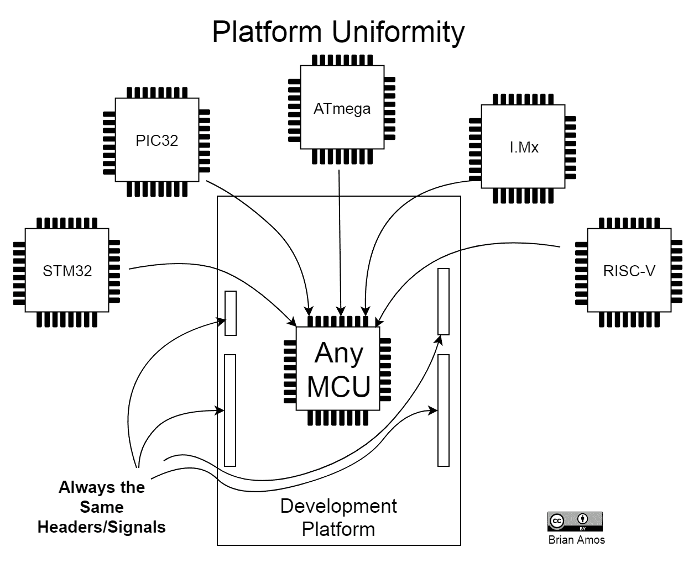
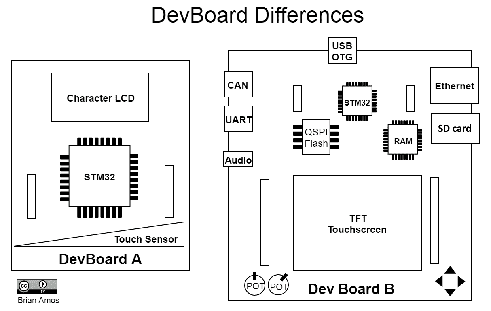
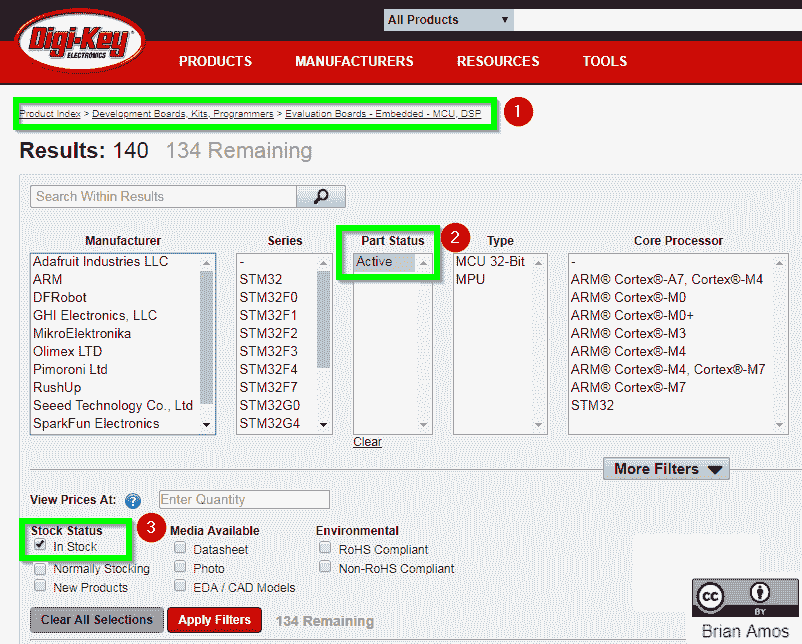
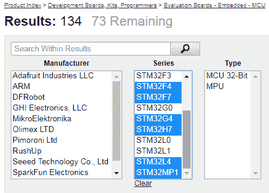
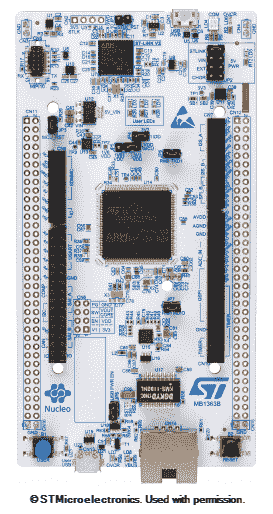

# 第四章：选择正确的 MCU

本章是关于**微控制器单元**（**MCU**）选择的快速课程，针对没有深厚硬件背景的工程师。它并不试图成为你选择硬件时需要了解和考虑的绝对一切内容的详尽列表。它确实提供了许多区分和选择 MCU 设备的影响因素的介绍。到结束时，你将了解足够的关键考虑因素，以便有效地研究 MCU 并与团队中的硬件工程师讨论潜在候选人。通过增加硬件/固件协作并选择适合项目的正确 MCU，你将避免硬件重设计和进度延误。

我们将首先介绍在选择适合你项目的合适 MCU 时需要考虑的广泛因素。之后，将讨论不同开发硬件之间的权衡。提供 STM32 系列线的简要介绍，以展示供应商如何分组他们的产品系列。在本章结束时，我们将比较几个以 STM32 MCU 为核心的不同**开发板**（**dev boards**），以展示我们为什么使用我们选择的开发板！

本章将涵盖以下主题：

+   MCU 选择的重要性

+   MCU 考虑因素

+   开发板考虑因素

+   介绍 STM32 MCU 产品线

+   我们如何选择我们的开发板

# 技术要求

为了浏览几个网站，你需要本章的互联网访问权限。

# MCU 选择的重要性

在阅读本节标题后，你可能会有这样的疑问：

“嘿！我以为这是一本关于如何使用 RTOS 编程微控制器的书——这些关于 MCU 选择的内容是什么？我是一个软件开发者！”

FreeRTOS 几乎完全针对 MCU。它主要是一个具有稳定 API 的调度内核，这使得它非常适合极低级别的设计。与具有几乎无限的虚拟寻址空间和比你知道的还要多的时钟周期的完整 CPU 系统不同，你将使用一个资源受限的系统。如果你在这种系统上开发固件，这意味着你将比编写软件时更接近硬件——反过来，这意味着你很可能比你的软件同行更可能“动手”，也就是说，你将需要做更多与*逻辑分析仪探针引脚*相关的工作。…*DMM 永久地放在你的桌子上*…*学习如何焊接，以便在四脚扁平封装的 MCU 上焊接引脚*…你明白这个意思！如果你来自纯软件背景，你需要学习一些东西，因为我们将要深入探讨软件和硬件之间的灰色区域——固件——这应该会很有趣！

固件和硬件联系非常紧密，这就是为什么在开发过程的早期就引入固件工程师如此重要的原因。在一些组织中，仍然只有一个人负责电气设计工作和编写固件。然而，有一种趋势正在推动各个学科在其专业领域内越来越专业化。即使在这样的情况下，也很重要，要尽早让多个团队成员参与进来，做出重要的设计决策，这样每个人都能意识到正在做出的权衡。

如果你不是直接负责选择 MCU 的人，那么有可能设计会被*推给你*。这几乎总是件坏事，因为它鼓励设计出次优的系统设计，以避免在系统的一些核心功能被发现后，由于硬件的重大重新设计而导致的进度延误。与其承诺进行重大的板级修订来解决主要的设计缺陷，许多团队都承受着压力，*只是用一些代码来修复它*。

因此，假设你在选择微控制器（MCU）方面有一些输入——即使你的参与只是“嘿，泰德，你对这个新项目的微控制器有什么看法？”这样的情况，*那么责任就在你身上，你需要武装自己，具备足够的背景知识，以便形成明智的观点（或者至少提出明智的问题）。本章的目的并不是提供一个详尽的列表，列出你选择新项目硬件时需要知道和考虑的每一件事，但它确实旨在介绍许多区分和选择 MCU 设备的不同影响因素。在阅读本章时，还要记住的是，它仅适用于在 MCU 之间做出选择。正如我们在*第一章，介绍实时系统*中看到的，设计实时系统的方式不止一种——MCU 并不*总是*是最好的选择。

为了限制本章的范围仅限于直接相关的内容，对于书中剩余部分提供的示例，我们将限制我们的讨论范围到基于 ARM Cortex-M 的设备中找到的功能。我们专注于 ARM Cortex-M 微控制器，因为这些基于 Cortex-M 内核的设备带来了一组非常实用的功能，使工程师能够使用**实时操作系统**（**RTOS**）创建中等到高度复杂的实时嵌入式系统，同时仍然能够以模块化的方式设计解决方案，以便模块可以在其他项目中重用。选择 STM32 微控制器是因为其受欢迎程度、广泛的微控制器系列、易于接近的**集成电路**（**IC**）封装以及包含的硬件外设。虽然本章我们专注于 STM32 产品，但请记住，市场上还有许多其他制造商提供了大量优秀的产品，而且大部分内容也适用于非 STM32（和非 ARM）产品。

# MCU 考虑因素

在选择微控制器本身时，需要考虑一些因素，而不是开发板。假设项目包含完全定制的电子设备，所选择的微控制器没有限制，就像你只选择开发板时会有限制一样。学生和爱好者有时会人为地进一步限制自己，有时会忠诚于某些生态系统，并且只从那些生态系统中的开发板中选择（例如 Arduino 或 mBed）。虽然这些生态系统本身确实没有固有的**错误**，但如果你无法考虑其他解决方案或欣赏每件硬件为特定项目带来的独特优势，你将无法作为一个专业工程师成长。

# 核心考虑因素

首先，我们将讨论如何解决一些关键问题，这些问题将立即缩小潜在 MCU 候选人的范围：

+   它是否合适？

+   它能否运行我的所有代码？

+   它的成本是多少？

+   它是否容易获得？

让我们逐一回答这些问题。

# 物理尺寸

根据设计不同，微控制器的尺寸可能是一个重要因素。如果你正在开发可穿戴或便携式设备，尺寸可能排在你的首要位置。有时，预包装的微控制器可能太大，设计师不得不求助于*板上芯片*（即微控制器硅晶圆直接焊接在**印刷电路板**（**PCB**）上，而不是放置在单独的塑料封装中）。另一方面，大型机架式设备通常有足够的空间容纳任何适合完成工作的微控制器尺寸。

对于那些对设计自己的硬件感兴趣的人来说——封装类型将在 PCB 复杂性以及组装的便利性（尤其是在原型阶段）中发挥作用。如果你的原型将手工组装，任何鱼鳍式封装，如**四边扁平封装**（**QFP**），都是最易接近的。在 QFP 之后，**无铅四边扁平封装**（**QFN**）封装仍然容易手工焊接。**球栅阵列**（**BGA**）通常最好避免手工组装，除非你是焊接大师！

# ROM

**只读存储器**（**ROM**）是同一家族中微控制器（MCU）的一个相当大的差异化因素，ROM 大小与价格密切相关。根据产品家族中可用的不同型号数量，可能会有多个具有非常相似外设集的 MCU。这些 MCU 可能具有相同的物理尺寸，但内存量却有很大差异。如果你的应用对成本敏感，但所需的 ROM 未知，请考虑以下方法：

1.  选择一个提供兼容尺寸中多个闪存大小的 MCU 家族。

1.  从具有家族中最大 ROM 的 MCU 开始开发。这为添加功能提供了最大的灵活性。

1.  在确定最终映像大小后，可以在开始大规模生产之前选择具有较小闪存大小的确切 MCU。

当采取这种方法时，你需要确保为未来的功能留出足够的空间，假设你的产品将能够接收固件现场更新。此外，务必在型号之间检查外设分配——*引脚兼容*并不总是意味着*固件兼容*！

需要的只读存储器（ROM）量差异很大，这取决于需要加载到设备上的代码量。如果你一直在使用 8 位微控制器（MCU），那么当你转向 ARM 这样的 32 位架构时，可能会遇到一个令人不快的惊喜。在 32 位架构上实现与 8 位架构上实现类似的程序需要更多的闪存空间。好消息是，闪存大小一直在增长，所以几乎总是可以找到具有足够板载闪存的 MCU 来满足你的应用需求。将第三方库拉入你的代码库在闪存方面通常成本较高，所以如果你选择走这条路，请务必谨慎。

# RAM

芯片上**随机存取存储器**（**RAM**）的量是另一个需要考虑的因素——它通常遵循特定设备上的闪存量。具有较大 ROM 的部件通常会有更多的 RAM。需要大量 RAM 的几个例子包括需要大缓冲区进行数据处理、复杂的网络堆栈、用于通信的深度缓冲区、GUI（特别是那些需要帧缓冲区的 GUI）以及运行虚拟机的任何解释型语言（即 MicroPython 和 Lua）。

例如，假设您的应用程序需要高分辨率显示屏。如果显示屏没有内置控制器和自己的帧缓冲区，那么您可能已经进入了外部 RAM 的领域。驱动这种类型显示屏所需的缓冲区大小可能会超过 MCU 上可用的 RAM。另一方面，如果您正在构建一个具有有限连接性和 UI 能力的简单控制系统，那么可能只需要少量 RAM。

此外，请注意，FreeRTOS 中的每个任务都需要自己的堆栈（通常在 Cortex-M 端口上至少需要 512 字节），因此如果需要大量任务，很快就会利用到几个 KB 的 RAM。

从固件工程师的角度来看，外部 RAM 似乎是一张免罪卡（谁不想将可用 RAM 增加近一个数量级）——但所有这些功能都需要付出代价。除非您的系统绝对需要它，否则最好避免在 MCU 的地址/数据总线上使用外部 RAM。它将需要额外的 PCB 空间，消耗更多电力，并最终推高 PCB 和物料清单（**BOM**）成本。由于长度调整要求和涉及的信号数量，添加用于访问外部 RAM 的外部高速并行总线会使 PCB 布局变得相当复杂。由于所有高速信号，设计也更有可能产生 EMI。尽管外部 RAM 提供了充足的空间，但通常比板载 RAM 慢一些，这可能导致链接器文件更加复杂（如果某些函数有非常严格的时序约束）。其他值得考虑的因素包括，如果您尝试通过使用数据缓存来加速外部 RAM 的访问，则需要正确设置 RAM 时序参数和缓存一致性问题（有关详细信息，请参阅*进一步阅读*部分）。

尽管有诸多缺点，但外部 RAM 能够实现许多功能，例如在 RAM 中缓存整个固件映像以进行升级、功能丰富的 GUI 框架、复杂的网络堆栈和复杂的信号处理技术。与其他任何要求一样，需要做出权衡。

# CPU 时钟频率

由于我们将讨论限制在具有相同底层架构的 MCU 上，具有更快核心时钟频率的 MCU 将比具有较慢时钟频率的 MCU 更快地执行同一组纯软件函数。注意前述语句中的关键词*纯*——有时，某些板载硬件外设可以极大地影响执行速度，而这些外设与 CPU 时钟频率无关（例如，Cortex-M4 核心上可用的硬件浮点数和 DSP 功能）。

另一个需要注意的问题是设备的绝对最大时钟频率与应用于应用的实用时钟频率之间的对比。例如，一些 MCU 的最大时钟频率与生成 USB 外设所需的内部 48 MHz 时钟不兼容，因此如果 USB 外设也使用，则无法以最大速度运行。

# 中断处理

在 ARM Cortex-M 系列中，中断处理都非常相似。所有设备都包括一个**嵌套向量中断控制器**（NVIC），具有可重定位的向量表和一个**外部中断控制器**（EXTI）。特定于设备的考虑因素包括确切的外设中断及其如何映射到 NVIC，以及外部中断如何多路复用到 EXTI。

# 价格

根据应用的不同，BOM（物料清单）的成本可能是一个重要的驱动因素，也可能几乎不被考虑。通常，在高产量应用中，BOM 成本会受到越来越多的审查。然而，对于低产量产品，通常更明智的做法是更多地关注最小化产品的开发时间和努力，而不是追求尽可能低的 BOM 成本。通过专注于最小化低产量产品的工程努力和开发时间，产品可以更快地进入市场。这不仅使产品更快地产生收入，而且也减少了**非重复工程**（NRE）成本。较少的 NRE 使得正在开发的产品能够更快地实现投资回报率（ROI）。更快的 ROI 最终会让经理和 CEO 们非常高兴！在这些情况下，担心为每年只销售几十个的产品花费几美元的 BOM——以牺牲数周或数月的发展努力为代价——通常不是一个明智的权衡。

# 可用性

初级工程师经常忽视的一个方面是 MCU 的预期和保证的可用性。仅仅因为一个部件在项目开始时可以购买，并不意味着在整个最终产品销售期间都可以购买。在消费设备的情况下，这可能不是一个大问题。这是因为这些设备可以具有极高的产量，但任何单一版本的生产时间都是有限的（从几个月到一两年）。

将消费电子产品的计划性淘汰心态与工业、电信或航空航天领域的某些产品进行对比。在这些行业中，开发时间表可以以年为单位衡量，所需的支持期通常为十年或更长。这就是为什么零部件的可用性是一个非常现实的考虑因素。务必调查制造保证的可用性，并将这些与他们的历史、声誉和项目风险进行权衡——在完成设计 80%的时候发现 MCU 在预生产阶段无法采购，这可不是什么愉快的体验！

现在我们已经讨论了一些需要了解的初步考虑因素，我们将继续讨论嵌入式处理器的一些更独特的考虑因素——硬件外围设备。

# 硬件外围设备

与桌面世界的 CPU 相比，处理器本身通常是关注的中心，由于范围的增加，选择**正确**的 MCU 更为复杂。同一芯片上包含了许多不同的硬件组件，这使得我们能够针对速度、功耗、CPU 利用率或 BOM 成本进行优化。在高度受限的设计中，所有这些因素都可能发挥作用，并且需要做出权衡。

本节将介绍一些在基于 Cortex-M 的 MCU 上常见的硬件外围设备，并旨在提供对这些设备的非常简短的介绍，目的是让您了解为什么在设计中有每种类型的外围设备可能会有所帮助。

# 连接性

在今天不断增长的物联网（**IoT**）生态系统中，MCU 上具有板载网络功能对于项目来说可能是一个福音……只要存在正确的固件来驱动它。重要的是要认识到，拥有外围设备并不意味着拥有完整的功能。例如，仅仅因为 MCU 支持**简化媒体独立接口**（**RMII**）和网络**物理层**（**PHY**），并不意味着您可以立即获得完整的 TCP/IP 堆栈——所有这些固件功能都需要从其他地方获得。设备中可能内置的潜在连接性包括以太网、RMII、802.11（WiFi）、802.15.1（蓝牙）和 802.15.4（Zigbee、HART 等）。

当涉及到无线通信时，事情会变得稍微复杂一些，因为产品需要根据地理位置通过适当的机构的审批流程。预认证的**射频**（**RF**）模块可以用来最小化开发一个正确认证的最终产品所需的工作量和成本。

由于专门的 PCB 布局、法规要求和复杂的网络堆栈，便于无线通信的板载 MCU 外围设备对于低量产品来说并不像最初看起来那么有用。再次提醒，不要因为仅仅指定了一个具有硬件的部分而陷入虚假的成就感，因为无线通信堆栈可能非常复杂，无线认证测试成本高昂。

# 内存保护单元

**内存保护单元**（**MPUs**）用于确保代码只访问它被允许访问的 RAM 范围。当正确使用时，MPUs 可以确保更高的系统稳定性和增强的安全性，因为应用程序由于不太可能通过访问它不应访问的内存而产生意外后果。

FreeRTOS 包括对 MPU 保护任务的支持，我们将在*第十五章，FreeRTOS 内存管理*中介绍。

# 硬件浮点单元

如果你的应用程序将要处理大量的浮点数，一个**硬件****浮点运算单元**（**FPU**）可以非常有帮助。直到过去十年左右，浮点数在大多数基于 MCU 的嵌入式系统中通常最好避免使用。更快处理器的可用性开始改变这一点。现在，FPUs 通常在硬件中实现。多亏了 FPUs，许多不同的应用程序可以受益于使用浮点数学，而不会遭受与基于软件库实现通常相关的 CPU 性能惩罚。

单精度（32 位）FPUs 在 Cortex-M4 处理器上是可选的，而基于 Cortex-M7 的处理器增加了对双精度（64 位）浮点运算的可选硬件支持。

# 数字信号处理功能

除了基于硬件的浮点支持的性能提升外，基于 Cortex-M4 和 Cortex-M7 的 MCU 还包含可选的**数字信号处理**（**DSP**）功能，这些功能集成在硬件中，可以极大地加速一些复杂算法，并可能有助于减轻固件工程师的编码负担。

# 直接内存访问通道

**直接内存访问**（**DMA**）在需要高带宽或高度事件驱动的代码的各种情况下可以非常有用。DMA 控制器通常能够与 MCU 外设以及 RAM 的不同部分交互。它们负责填充外设寄存器和 RAM，而无需涉及 CPU。这些自主传输通过大大减少中断负载和上下文切换，可以显著节省 CPU 时间。

关于 DMA 外设需要注意的一点是，并非所有通道都始终映射到所有外设。某些通道的带宽可能比其他通道高。这在需要多个高带宽设备的系统中尤为重要。对于这些具有挑战性的系统，固件和硬件工程师共同工作以确保硬件设计不会在将来给固件带来障碍是非常重要的。

# 通信接口

我们已经介绍了相对于以太网和无线技术的外部网络连接。有许多不同的通信接口更传统地与嵌入式设备相关联，并且通常作为 MCU 上的硬件外设可用。用于与板载和非板载传感器和执行器通信的接口如下：

+   **片上互连通信**（**I2C**）

+   **串行外设接口**（**SPI**）

+   **通用同步/异步收发器**（**USART**）

在汽车和工业环境中，以下外设通常用于模块间通信：

+   **USARTs**

+   **控制器局域网**（**CAN**）

+   **局部互连网络**（**LIN**）

# 硬件加密引擎

如果您的应用程序需要外部连接，那么您的心思也应该专注于安全性。与 FPUs 使浮点运算更高效一样，一些 MCU 上提供了基于硬件的加密引擎，这将在公共网络上安全传输数据时大大减轻 CPU 的负担。

# 定时硬件

在 MCU 上通常包含多个不同的定时外设。这些外设本身通常包括输入捕获、输出比较和**脉冲宽度调制**（**PWM**）功能作为最低要求。一些设备还会包括用于与正交编码器接口的定时硬件。

输入捕获处理的是 MCU 数字输入状态变化的**捕获**时间。MCU 外设使用高频率计数器和硬件门来捕获信号转换（而不是依赖于多个 CPU 指令），因此它们能够以比固件更高的分辨率完成这项工作。通常会有多个输入捕获通道可用，这些通道可以并行使用。输出比较实际上是输入捕获的相反操作（输出一个具有精确时序特性的信号）——**比较**指的是用于确定何时执行转换的硬件比较器。

PWM 和输入捕获在控制系统中都非常常用，用于与传感器和执行器交互。一些执行器将以 PWM 作为输入。PWM 还可以用于提供二进制驱动器（如晶体管）的比例控制，这可以用来精确地改变加到负载上的功率。许多不同的编码器通常也会以 PWM 格式提供信息，这些信息可以通过 MCU 使用定时器外设的输入捕获模式读取。

**正交编码器输入**（**QEIs**）在运动反馈系统中非常有用。尽管可以使用多个输入捕获通道（或缓慢地，不使用任何专用硬件）实现类似的功能，但拥有专门的 QEI 硬件允许在高速输入率下进行极少的 CPU 干预。

# 集成模拟

**数字到模拟转换器**（**DACs**）和**模拟到数字转换器**（**ADCs**）用于在连续变化的模拟值及其相关数字表示之间进行转换。这些类型的板载外设通常比外部芯片的分辨率和频率低。然而，根据您系统的需求，它们可以非常有用。另一个有用的外设是板载比较器，它会在模拟值高于或低于给定阈值时向处理器发出信号。

一些更专业的设备（例如，Cypress PSoC）包括完全可重新配置的模拟外设（包括运算放大器、数模转换器（DAC）和模数转换器（ADC））以及灵活的数字外设，灵活地将非常广泛的功能集集成到信号芯片中。模拟器件和 Maxim 提供了一些更奇特的混合信号微控制器（MCU），它们倾向于将特定应用组件集成到与 MCU 相同的芯片上，使得针对特定最终产品的开发更加容易。你可以找到针对从工业过程控制、汽车距离感应、物联网传感器到电视遥控器应用等各个领域的非常广泛的应用特定 MCU。

如果一个混合信号问题有一个流行的用例，那么很可能有一个完全集成的硅片，它集成了大多数所需的模拟前端 MCU，以解决大部分问题。那么问题就变成了平衡 BOM 成本、详细规格、尺寸、开发时间和长期采购风险缓解。

# 专用触摸接口

由于触摸界面的普及率提高，一些 MCU 现在包含了完整的触摸控制器实现。这可以大大减少实现一个完全功能性和健壮的触摸界面所需的专业知识和努力。

# 显示接口

通常存在于具有较高性能、较大引脚数、复杂的显示接口甚至图形加速的设备中。在大量部件上可以找到并行 LCD/TFT 接口（例如，6800 和 8080），这些接口能够驱动价格低廉、高分辨率的显示器，甚至只有几行的显示器。硬件协议转换 IC 可以用来适应多种不同的显示标准，如 LVDS 和 HDMI。现在微控制器（MCU）能够提供丰富的用户体验，包括硬件加速和高效编写的中间件和驱动程序。CPU 负载也是完全可以接受的。

# 外部存储器支持

在引脚数较多的封装中，可以期待找到对**静态随机存取存储器**（**SRAM**）的支持。**同步动态随机存取存储器**（**SDRAM**）的支持，由板载控制器负责处理严格的时序要求和刷新周期，可以在高性能设备中找到。针对性能的设备通常会引入对四线 SPI 的支持。通常，外部 RAM——甚至四线 SPI 设备——可以被内存映射并类似于内部存储器使用，尽管会有性能损失。许多设备还配备了**多媒体卡**（**MMC**）和**安全数字卡**（**SD 卡**）控制器，因此可以轻松添加商品级消费级可移动存储。

# 实时时钟

硬件日历在一些设备上也是可用的；所需的所有东西只是一个 32 kHz 的晶振和一个备用电源，例如 CR2032 的碱性锂电池。通常，这种功能还会附带一定量的由电池供电的 RAM。

# 音频支持

通过**Inter-IC Sound**（**I²S**）提供高保真音频支持是常见的。你可以期待在这些总线上找到连接到 I²S 外设的 DMA 通道，以最小化 CPU 干预的数据密集型 DAC 的喂食和从 ADC 收集数据所需的量。

这就结束了我们在评估 MCU 时需要关注的硬件外设的长列表。接下来是一个对任何对设计电池或能量收集设备感兴趣的人都有特定兴趣的话题：功耗。

# 功耗

低功耗 MCU 已经是一个超过十年的趋势。然而，由于市场上出现了大量电池供电的基于物联网的设备，历史上是一种具有有限选项的专用用例（如 16 位的 MSP430）现在已经成为主流。现在，完整的 32 位 MCU 已经可用，它们可以在低功耗深度睡眠和高时钟速率、数据处理运行模式之间快速切换。

# 功耗效率

虽然听起来很简单，但确保某物消耗更少电力的一个相当好的方法就是将其关闭（别笑——这可能会因涉及的部件而变得非常复杂，多亏了各种漏电流！）。如果具有数十个外设的复杂 MCU 有任何希望实现高效能，就需要有一种方法来关闭不需要的功能，以最小化浪费的电力。这通常是通过关闭未使用的外设的时钟，并确保基于 CMOS 的 I/O 引脚不悬浮（记住，CMOS 设备中的转换消耗了最多的电力）来实现的。

数据表中通常还会找到另一个规格，即 CPU 时钟频率每 MHz 消耗多少功率——通常以µA/MHz 表示。如果每次唤醒期间的处理器处理量相当恒定，这为比较不同的 MCU 型号提供了另一个指标。

# 低功耗模式

针对低功耗应用的设备通常会有几个不同的关闭状态可供选择。这些状态将允许程序员在电流消耗、可用功能（如保持 RAM 内容完整和某些外设开启）、可触发的唤醒事件的中断数量以及唤醒时间之间进行权衡。幸运的是，许多低功耗物联网应用的操作范围相当有限，因此有时某个特定 MCU 中的新颖特性组合将非常适合特定的应用。

# 唤醒时间

如果一个设备具有惊人的低关断电流，但需要异常长的时间来*唤醒*并进入可用的运行状态，那么它可能不是适用于需要频繁唤醒的应用的最佳选择，因为会有大量时间被花费在使系统启动和运行上，而不是进行必要的处理然后进入休眠状态。

# 电源电压

较低的电源电压通常会导致较低的电流消耗。根据设计，可以在消除功率调节电路（由于效率低于 100%而消耗电流）和扩展特定电池单元的可用工作电压范围之间进行权衡。MCU 的电压要求（以及任何辅助电路）将是影响调节方面灵活性的一个驱动因素。此外，请注意，最大时钟频率通常与供电电压成比例，因此不要期望能够在最大指定频率和最低可能的供电电压下驱动 CPU。

# 项目中期迁移 MCU

有时，项目需求在初期可能无法完全知晓，或者第一天可能没有人对如何确切解决每一个详细问题有 100%的信心。如果你幸运地意识到存在高度的不确定性，那么提前规划总是比被意外所困要好。以下是一些选择属于更大家族或生态系统的 MCU 可以帮助减轻与项目不确定性相关的一些风险的领域。

# 引脚兼容性的重要性

在规划潜在的 MCU 转换时，如果可能的话，提前确定具有引脚兼容性的替代 MCU。例如，NXP LPC1850 的部件与 LPC 4350 MCU 引脚兼容。STM32 设备在家族（和封装）内部都是引脚兼容的，但偶尔也会与其他家族*几乎*引脚兼容（例如 STM32M4 和 STM32M7）。ST 定期发布针对那些已经“成长”超过一个 MCU 家族并需要更强大功能的工程师的迁移指南。如果提前选择了几个可能的候选者和替代品，PCB 上的简单跳线配置可能有助于在不同性能（和成本）显著不同的 MCU 之间进行迁移，从而有助于减少项目中期 PCB 返工所需的时间。

# 外设相似性

大多数 MCU，在给定系列中，将继承相同的外围 IP。硅供应商并不一定每次创建一个新的 MCU 系列时都会从头开始重新设计外围设备，因此对于属于特定供应商的外围设备，在寄存器映射和行为上通常存在大量的重叠。通常，如果你的应用程序最初只使用最基本的外围功能的一部分，那么你可能很幸运地能够使用大量相同的驱动程序，即使供应商决定在 MCU 系列之间大幅改变他们的 API。讽刺的是，有时，原始硬件在时间上的稳定性比其上层的抽象层更高。

# MCU 系列的概念

许多硅供应商都有设备系列的概念，**意法半导体**（**STM**）也不例外——数据手册通常是针对整个设备系列编写的。STM 系列中设备之间最显著的区别通常是 RAM/ROM 和封装大小。然而，在更强大的设备中也会添加额外的外围设备——例如，更大的封装将开始包括并行 RAM 控制器。具有更多 RAM/ROM 的设备将包括更强大的定时器外围设备、更多的通信外围设备或特定领域的外围设备，例如加密模块。

在给定设备系列中的设备之间迁移应该很容易，因此建议从系列的某一端开始（通常建议从高端开始）并看看项目会走向何方。如果范围蔓延被控制在最小范围内，那么在所有主要功能开发完成后，可能可以轻松地将 MCU 降级，从而节省一些 BOM 成本。

这就结束了我们对原始 MCU 的考虑清单。然而，仅仅购买一个芯片并将其放在桌子上对我们编写固件并没有多大帮助。我们需要一种方法来供电设备，并与它通信——我们需要一个开发板！

# 开发板考虑事项

开发板是工程师在项目早期开发阶段使用的任何硬件。开发板不仅适用于 MCU；它们对许多不同类型的硬件都很有用——从运算放大器到**现场可编程门阵列**（FPGA）。

MCU 开发板应提供一些关键功能：

+   辅助电路，用于供电和运行 MCU

+   一种编程和与 MCU 通信的方法

+   用于轻松连接外部电路的连接器

+   可能包含一些有用的板载 IC，以测试一些外围设备

在评估 MCU 时，有许多不同的途径可以选择。我们目前正处于一个硬件便宜且普遍可用的时期。正因为如此，有大量的选项可供选择来评估硬件。一块原型硬件通常倾向于分为三个主要类别，每个类别都有其优势和劣势。当然，如果你有特定的要求，你也可以自己制作开发板或原型。

# 开发平台是什么以及为什么它很重要

就我们的目的而言，开发平台是一个产品生态系统，它允许在多个供应商之间实现高度抽象。平台的主要焦点是以尽可能少的努力提供大量功能，当主要目的是尽可能快地创建原型时，这是极好的。

为了在多个供应商之间提供大量功能，标准化接口、易用性和灵活性往往被强调。有了这些价值观，平台本身（正如它应该的那样）成为焦点，而特定设备的个别差异化特征往往被忽视，也就是说，除非你对它们进行特定编码，这需要额外的时间，并最终要求你更多地关注开发 *针对* 平台，而不是 *与* 平台一起开发。

生态系统围绕着平台发展，温和地引导平台用户进入工具、工作流程、最小公分母功能集和可用硬件。如果目标是尽可能快地制作出概念验证，这都很好。然而，如果使用平台方法要找到长期开发和生产级的解决方案，平台很可能会需要高质量、非常成熟和稳定。这通常意味着使用基于多个供应商提供的工业标准平台（如 SMARC、QSeven 和 COM Express），而不是当前创客空间中的“年度流行款”：

核心问题是，一个平台的主要兴趣通常在于使平台易于使用，以便获得更广泛的采用。这种易用性可能导致常见的接口（如前图所示），这在快速原型设计期间可以提高生产力，但会抽象掉底层硬件的相当大的差异。通常，平台特定的功能非常重要，以至于平台代码会简单地虚拟化接口以使其更易于访问，这通常伴随着非常显著的成本（即位打孔 PWM 或 SPI，以便它们可以被分配到特定的预定引脚）。因此，如果你选择使用平台来评估硬件（或具体来说，是微控制器），你应该意识到你很可能会评估的是该硬件上的平台及其实现，而不是硬件本身。

# 评估套件

当涉及到标准化尺寸与关注硬件本身之间的差异时，**评估套件**（**评估套件**）位于光谱的另一端。评估套件通常配备有最大的、功能最丰富的 MCU 型号，并且仅出于*展示*该硬件的目的而制造。这意味着它们通常不会在不同目标 MCU 之间共享相同的尺寸或连接器（参见图表）。因为每个 MCU 都有不同的主要功能和针对不同的市场。评估板将尽可能将外围设备连接到实际的连接器上（例如串行、以太网、SD 卡、CAN 总线以及多个 USB）。它们通常还包括一系列外围硬件，如 RAM、eMMC、按钮、滑块、电位计、显示屏和音频编解码器以驱动扬声器。它们几乎总是将所有有趣的 MCU 引脚连接到易于访问的引脚头上，这样开发者就可以快速尝试任何他们能想到的特定硬件配置。制造商通常还会在评估套件板上展示他们自己的其他非 MCU 硅芯片，以推动与自身产品相关的更多销售：

为了最好地展示设备的性能，评估套件还会附带大量的工作示例代码，允许工程师与包含的所有外围设备进行交互。与通常在基于平台的实现中找到的通用实现不同，这些示例针对的是要评估的目标设备的独特区分特性。在本章的第一部分，我们讨论了根据特定用例选择硬件。如果你在寻找针对设计挑战方面的特定解决方案，拥有一个指导性的示例代码，它展示了 MCU 的关键区分特性，可以节省大量时间（并且是启发性的），相比于从头开始实现所有这些功能来说。

所有这些功能都需要付出代价——完整的评估套件通常需要几百美元。然而，如果你的目标是快速评估具有特定目的的潜在 MCU，它们可以通过节省工程时间和降低风险来迅速收回成本。

# 低成本演示板

近年来，低成本演示板真正地发挥了它们的作用。价格已经大幅下降；制造商有时会将演示板以与它们上面放置的裸 IC 相同的成本出售（有时甚至比购买单个 IC 还要便宜！）。与硬件平台不同，这些板通常会有*相似*的尺寸，但并不一定有相同的连接器或引脚排列。

最近，市场上出现了更多低成本演示板，这些板模糊了平台和演示板（也称为演示板）之间的界限。得益于 Arduino®的普及，大多数低成本板至少会有一组与 Arduino 引脚兼容的引脚。然而，兼容引脚的可用性和拥有一个完全拥抱生态系统的开发板是两回事。演示板可能没有与这些引脚配套的软件；仅仅因为硬件存在并且可以插入板中，并不意味着你将自动获得用于驱动硬件的目标 MCU 的兼容库。这并不意味着它们不兼容，但要将它们启动并运行所需的努力将远大于简单地插入板子并跟随“hello world”演示。

一些制造商还在创建自己的标准化引脚，这些引脚在演示板之间是通用的，这至少在迁移到不同产品系列时是有帮助的（但显然仅限于该制造商）。ST Nucleo 和 NXP Freedom 标准化引脚是一些例子。为了使这些板更加用户友好，它们通常还会具备 mBed 兼容性。

现在你已经了解了不同类型的开发板，我们将更详细地研究单个制造商的微控制器系列——STM32 系列。

# 介绍 STM32 产品线

在过去的几年里，STM 已经开发了一系列相当广泛的 MCU。在这里，我们将讨论该产品组合中的一些主要部分是如何与本章“MCU 考虑因素”部分中讨论的考虑因素相对应的。大多数其他供应商也将他们的产品组织成主要部分，这通常使选择过程变得更容易一些。

# 主流

STM32 系列始于 2007 年的 STM32F1，这是一款基于 Cortex-M3 的 MCU。该产品线旨在服务于大多数高容量应用，在这些应用中，成本和性能必须平衡，且应用相对简单。STM32F0 和 STM32G0 部分是基于 Cortex-M0 和 Cortex-M0+的设备，旨在低成本应用。原始的 STM32F1 是基于 Cortex-M3 的，具有非常广泛的功能集，但与其他设备相比，其性能已经开始显得有些过时。

STM32F3 是 STM 首次尝试提供集成、更高精度的模拟外设（其他供应商提供的模拟组件精度高于 STM）；然而，该系列在提供真正高性能模拟方面有所不足。它包括一个 16 位 sigma delta ADC，但**有效位数**（**ENOB**）仅声明为 14 位，略好于 STM 的 12 位**逐次逼近**（**SAR**）ADC 外设，这些外设通常包括在内。基于 Cortex-M4+的较新 STM32G4 家族具有最多的模拟外设，包括许多**可编程增益运算放大器**（**PGA**）、DAC、ADC 和几个比较器，但在撰写本文时没有提供集成的高精度 ADC。

注意 STM32G0 和 STM32G4 系列，它们通过 2020 年增加了产品线的广度——它们都是较新的系列，STM 可能会开始用许多更多设备来填充这些系列。

# 高性能

STM 的高性能 MCU 始于基于 Cortex-M4 的 STM32F4。Cortex-M4 与 Cortex-M3 非常相似，但它包括（可选的）硬件 32 位 FPU 和 DSP 指令，这两者都存在于所有 STM32F4 设备上。高性能系列中的所有设备都能够舒适地驱动无控制器显示器的非常吸引人的 GUI，只要所需的 RAM 可用（通常位于 MCU 外部）。由各种硬件外设（如 MIPI **显示串行接口**（**DSI**）、通过 FMC 和 DMA 的内存传输以及使用**Chrom-Adaptive Real-Time**（**Chrom-ART**）加速器的某些基本图形加速）提供的加速，使得将大量与显示通信的工作卸载到各种外设成为可能，这样 CPU 就可以花时间执行其他任务。

这里快速概述了该家族的两个主要成员和一些显著特性：

| **MCU 系列** | **CPU** | **特性** |
| --- | --- | --- |
| STM32H7 | Cortex-M7 (480 MHz)Cortex-M4 (240 MHz) (opt) | STM 最高性能的 MCU64 位 FPU 和扩展 DSP 指令 |
| STM32F7 | Cortex-M7 (216 MHz) | 64 位 FPU 和扩展 DSP 指令 |
| STM32F2 | Cortex-M3 | 在性能与成本之间提供权衡高集成度（摄像头接口和 USB OTG） |

这类 MCU 可以被认为是*跨界* MCU。它们足够强大，可以用于一些传统上为全功能 CPU 保留的应用任务，但它们仍然具有 MCU 的易用性。

# 异构多核方法

2019 年，STM 推出了 STM32MP 系列，这是公司首次进入应用处理器领域。该系列提供单核或双核 Cortex-A7，频率为 650 MHz，以及一个运行在 209 MHz 的单核 Cortex-M4。STM 似乎通过关注较低的核心数量和需要较少 PCB 层以及使用成本较低的制造技术的封装，将这些解决方案定位在市场的高容量、低成本部分。

从软件角度来看，STM 的 MCU 产品与新的**微处理器单元**（**MPU**）之间的主要区别在于，由于 MPU 具有**内存管理单元**（**MMUs**），它们能够通过主线 Linux 内核运行**完整的操作系统**，这开辟了一个完全不同的开源软件生态系统（您不必亲自编写）。

异构多核方法允许设计人员将设计的一部分分割开来，并在最适合的领域解决它们。例如，一个具有 GUI 和网络功能的专业过程控制器可以使用 Cortex-A7 利用 Linux 并访问 Qt 框架和复杂的网络堆栈，同时使用 Cortex-M4 处理所有实时控制方面。

μClinux 的实现已经可用于 STM32F4 和 STM32F7 MCU 多年，但由于这些设备上缺乏 MMU，通常会有相当大的性能损失。

当然，随着功能的增加，复杂性也会增加。与 MCU 不同，STM32MP 系列没有绕过集成外部 RAM 的方法，因此请准备好进行一些相当复杂的 PCB 布局（与独立 MCU 解决方案相比）。

# 低功耗

STM 的低功耗系列直接针对电池供电的设备。以下是所有不同系列成员的快速比较：

| **MCU 版本** | **CPU** | **描述** |
| --- | --- | --- |
| STM32L | Cortex-M0 | 该系列性能和 RAM 以及 ROM 空间最低，但提供相当好的效率。 |
| STM32L1 | Cortex-M3 | 具有更高的 ROM 容量，以增加功耗为代价提供更快的性能。 |
| STM32L4 和 STM32L4+ | Cortex-M4 | 具有增强的计算能力（STM32L4+还提供更快的时钟速度和更大的内部闪存存储）。 |
| STM32L5 | Cortex-M33 | 将性能和功耗相结合，并集成了最新的 ARM v8 架构。Cortex-M33 提供了额外的安全功能，如 Trust.Zone，并且比 Cortex-M4 执行指令更高效，这允许在保持功耗可控的同时提供额外的性能。 |

根据特定物联网应用的精确工作负载，使用低功耗 32 位 MCU，如上表中的那些，可能是合理的。然而，对于非常简单的应用，也应考虑低功耗的 8 位和 16 位 MCU。

# 无线

STM32WB 实现了 Cortex-M4，并配备了一个专用的 Cortex-M0+来运行蓝牙 BLE 堆栈。这一系列提供了大量的集成，从大容量闪存和 RAM 到混合信号模拟外设，包括触摸传感器和小段 LCD。还提供了各种安全特性，如加密算法和随机数生成器。由于使用这一系列设备的产品需要 FCC 认证，因此它们对于大量应用来说最有意义。

由于有广泛的 MCU 可供选择，STM*可能*有我们可以用来实验实时操作系统的东西！现在是时候继续选择要使用的开发板了。

# 我们是如何选择开发板的

现在我们已经讨论了选择 MCU 的重要考虑因素和一般类型的发展硬件，让我们看看本书中将要使用的开发板是如何选择的。STM 是我们唯一评估的制造商，以便将示例限制在易于消化的事物上。在实际的产品工程工作中，设计师应该重新审视所有可能的供应商。虽然每个人都有自己的跨供应商搜索偏好方式，但使用分销商网站是一种简单的方法。

感谢精心制作的以原型设计为导向的分销商网站（如 Digikey 和 Mouser），工程师能够跨多个不同供应商执行参数搜索和比较。这种方法的缺点是搜索仅限于特定分销商所携带的产品线。另一个潜在的缺点是参数搜索结果取决于分销商的数据录入准确性和分类。直接使用分销商网站的好处是，许多不同的供应商都集中在一个地方，可以立即检查产品可用性，并且可以轻松查看和筛选半真实世界的定价。

原型设计导向的分销商的定价被认为是*半真实世界*的，因为通常在产品进入全面生产后，使用以数量为导向的分销商或直接向供应商购买大量产品通常更经济。

# 需求

到目前为止，我们已经从理论层面涵盖了选择项目 MCU 的所有考虑因素。现在，是时候将所有这些付诸实践，并选择用于所有实际*动手*练习的 MCU。以下是一些需要注意的事项：

+   我们将选择开发板和 MCU——因此，一些需求将针对开发板，这对于需要长期生产的产品来说通常不是一个好主意。

+   需求将专门针对这本书——使某物成为好书的选择标准可能不适用于你正在工作的项目。显然，你的选择标准将根据你的项目进行调整。

必需品——即*需求*——如下：

+   您开发板上的目标微控制器将是一个基于 STM32 Cortex-M 的 CPU。

+   目标微控制器必须有一个**内存保护单元**（**MPU**）。

+   开发板必须有可见的方式来显示状态。

+   相对较低的成本（例如< 50 美元）。

那些理想中的特性——即所需的*愿望*——如下：

+   通用性：如果开发板可以与其他硬件一起使用，那将是非常好的。

+   通过 USB 进行虚拟通信可作为调试端口。

+   多核。

# 需求合理性

我们将把搜索范围限制在 STM32 系列，因为这是我们在这本书中使用的示例系列。在第十五章，“FreeRTOS 内存管理”中，我们将介绍如何防止任务访问它们不应访问的内存，这需要我们使用具有内存保护单元的部件。本书的一个目标是将硬件交互尽可能易于访问，这导致了下一个两个需求：状态显示和成本。

一种显示*状态*的方式可能转化为简单的 LED（理想情况下是多个）。应该有一些形式的反馈，以便程序员能够一目了然地看到正在发生的事情，以确保代码实际上正在做些什么。在真实的嵌入式环境中，这可能会采取额外的仪器形式，例如示波器、逻辑分析仪和万用表。为了使尽可能多的人能够访问，我们将明确避免使用这些工具。因此，而不是仅仅依赖外部工具和调试器，我们将寻找板载指示器。

那些理想中的特性不是硬性要求，但它们是系统在理想世界中应具备的期望品质。理想情况下，目标开发板也应是更大硬件生态系统的一部分，这样人们就可以使用他们可能已经拥有的现有硬件来进一步探索本书中的概念。如果目标微控制器上有一个 USB 端口，那将是非常棒的——这样我们就可以使用虚拟通信端口来输出调试信息，而不仅仅依赖于调试器。最后，在第十六章，“多处理器和多核系统”，我们将简要介绍一些关于使用多个 CPU 开发我们的板子的技巧。尽管这个主题值得单独成书（已经有很多从架构角度写的书），但有一些我们可以实际在硬件上运行的代码将会很棒。

# 选择开发板

好的——我们现在知道我们要找什么了，所以让我们开始吧！如前所述，分销商网站是一个很好的起点，因为它们提供了出色的参数搜索功能。如果你是硬件人员，使用相同的搜索引擎将减少寻找零件所需的时间。当然，这种方法并不完美，所以如果你正在寻找一个非常具体的零件，你可能最好直接访问你最喜欢的制造商的网站并在那里搜索：

这里是我们使用美国一家流行的分销商 DigiKey 缩小搜索范围的步骤示例：

1.  从 DigiKey 的主页[`www.digikey.com/`](https://www.digikey.com/)，我们开始搜索 STM32，并从选择中选择了 MCU 和 DSP 的评估板。

1.  我们只对目前可用的零件感兴趣（不是过时的）。

1.  开发套件也必须备有库存。

这里是结果：

根据我们对 STM32 产品线的了解，已经选择了带有内存保护单元的 MCU。目前，这个标准提供了 73 个可用的开发平台，价格范围从 9-550 美元——相当广泛。我们已经覆盖了大多数硬性要求——除了板载指示器，这不太可能在搜索中出现。让我们看看是否可以通过包括一些*期望*来进一步缩小范围。

STM 将他们的微处理器称为微处理器单元（MPU），这创造了一个术语的过度使用，并在谈论内存保护单元（MPU）时也带来了一些歧义。当你浏览网站和文档时，你可能会遇到这个缩写的两种用法。

如果我们在寻找多核处理器，那么 STM32H7 和 STM32MP1 系列是有效的选择。结果证明，这些零件的发现板以相对合理的成本（考虑到它们包含的内容）80 美元出售，但我们理想中寻找的是接近 20 美元范围的硬件——不要让期望干扰了硬性要求！

将焦点缩小到不违反低于 50 美元定价要求的处理器，我们来到了 STM Nucleo 系列开发板。Nucleo 系列的所有产品都与 mBed 兼容，这将允许我们使用整个生态系统，如果我们选择使用的话。STM 对 Nucleo 的另一个认识是支持现有的流行平台是个好主意——因此，除了在专有引脚上几乎全部提供更相关的 MCU 引脚外，Nucleo 板还提供了各种 Arduino 风格的引脚。所有的 Nucleo 板还包括一个 ST-Link 板载编程器，其中一些可以重新编程以看起来与 SEGGER J-Link 相同，这是一个*巨大的*优点，并将消除购买额外硬件的需求：

| **制造商** | **零件编号** | **描述** | **相关特性** |
| --- | --- | --- | --- |
| NUCLEO-L432KC | Nucl32 平台 | Cortex-M4，一个用户 LED，用户 USB，Arduino Nano v3 兼容，未列为板载 SEGGER J-Link 兼容 |
| NUCLEO-F401RE | Nucleo64 平台 | Cortex-M4，一个用户 LED，用户 USB 通过重新枚举，Arduino Uno v3 引脚，板载 SEGGER J-Link 兼容 |
| NUCLEO-L4R5ZI | Nucleo144 平台 | Cortex-M4，三个用户 LED，专用用户 USB OTB，ST Morpho，Arduino Uno v3 引脚，板载 SEGGER J-Link 兼容 |
| **NUCLEO-F767ZI** | **Nucleo144 平台** | **Cortex-M7，三个用户 LED，专用用户 USB，以太网，Arduino Uno v3 引脚，板载 SEGGER J-Link 兼容** |

我们的目标平台将是 Nucleo-F767ZI，它集成了最广泛的连接性，并提供了最大的调试灵活性。我们将在第六章 Debugging Tools for Real-Time Systems 中介绍如何重新闪存板载 ST-Link 以使用 SEGGER J-Link 固件。三个用户 LED 将使反馈固件状态变得非常简单，因为不需要配置任何额外的接口。内置以太网允许开发网络应用程序。对于我们的目标平台，一个多核 MCU 将非常方便，但没有一个符合我们的成本要求：

虽然在选择 MCU 或开发板时有很多选择，但这个过程并不需要令人畏惧，尤其是当你知道你的需求和需要做出的权衡时。

# 摘要

本章讨论了选择合适微控制器（MCU）的许多考虑因素，我们通过分析本书中使用的开发板选择过程中所做出的权衡来解释了选择过程。你现在应该理解了选择 MCU 的重要性，并且有足够的背景知识开始研究和选择适合你项目的 MCU。如果你是跨学科团队的一员，你将更有能力与你的同事就使用各种 MCU 的权衡进行交流。

在下一章中，我们将进行类似的练习，比较各种类别的**集成开发环境（IDE**），并选择一个合适的 IDE 来编写本书中找到的练习，从第七章 The FreeRTOS Scheduler 开始。

# 问题

在我们总结时，这里有一份问题列表，供你测试你对本章材料的了解。你将在附录的*评估*部分找到答案：

1.  为什么固件工程师需要了解他们正在编程的 MCU 很重要？

1.  在选择性能型 MCU 时，时钟速度是唯一起作用的因素：

    +   正确

    +   错误

1.  今天的 MCU 除了 CPU 外还包含许多不同的硬件组件。这些硬件组件通常被称为什么？

    +   电池

    +   硬件外设

    +   缺陷

1.  列出使用*平台*方法进行开发的一个优点。

1.  列出使用功能齐全的评估板进行开发的一个优点。

1.  在设计低功耗应用时，列出两个重要的设备特性。

1.  为什么选择了一款价格低廉的开发板用于这本书？

# 进一步阅读

+   AN4839：关于 STM32F7 设备上 1 级缓存系统的 STM 应用笔记：[`www.st.com/content/ccc/resource/technical/document/application_note/group0/08/dd/25/9c/4d/83/43/12/DM00272913/files/DM00272913.pdf/jcr:content/translations/en.DM00272913.pdf`](https://www.st.com/content/ccc/resource/technical/document/application_note/group0/08/dd/25/9c/4d/83/43/12/DM00272913/files/DM00272913.pdf/jcr:content/translations/en.DM00272913.pdf)

+   关于 SEGGER ST-Link 板载调试器的更多信息：[`www.segger.com/products/debug-probes/j-link/models/other-j-links/st-link-on-board/`](https://www.segger.com/products/debug-probes/j-link/models/other-j-links/st-link-on-board/)
