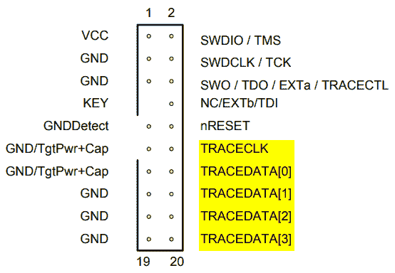
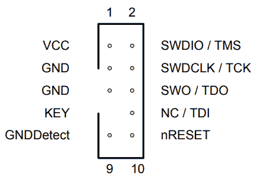
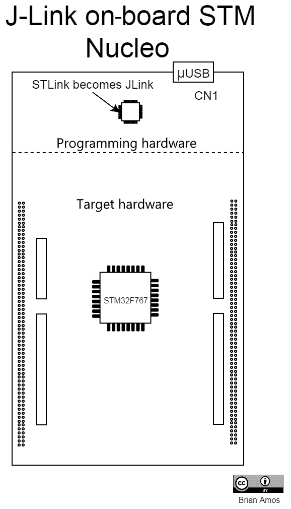
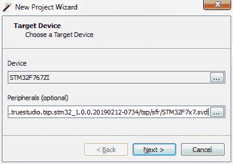
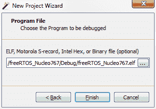
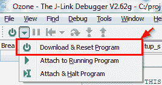
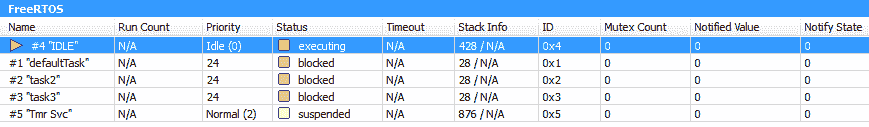
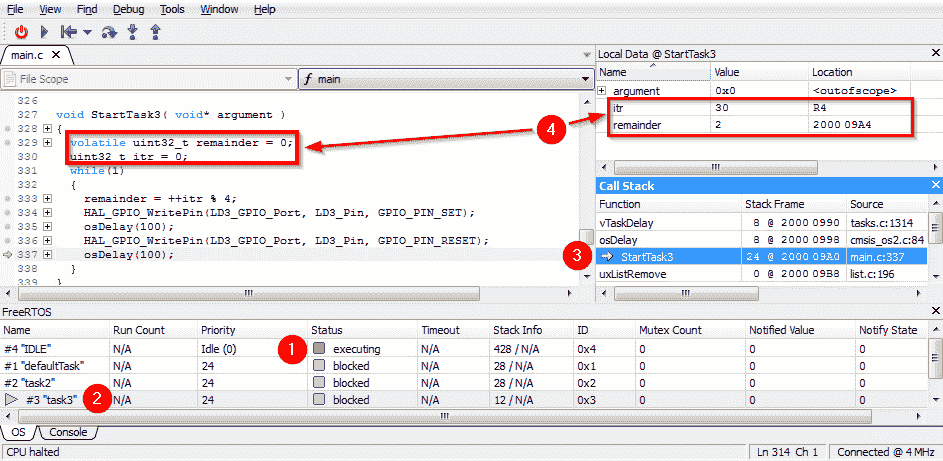
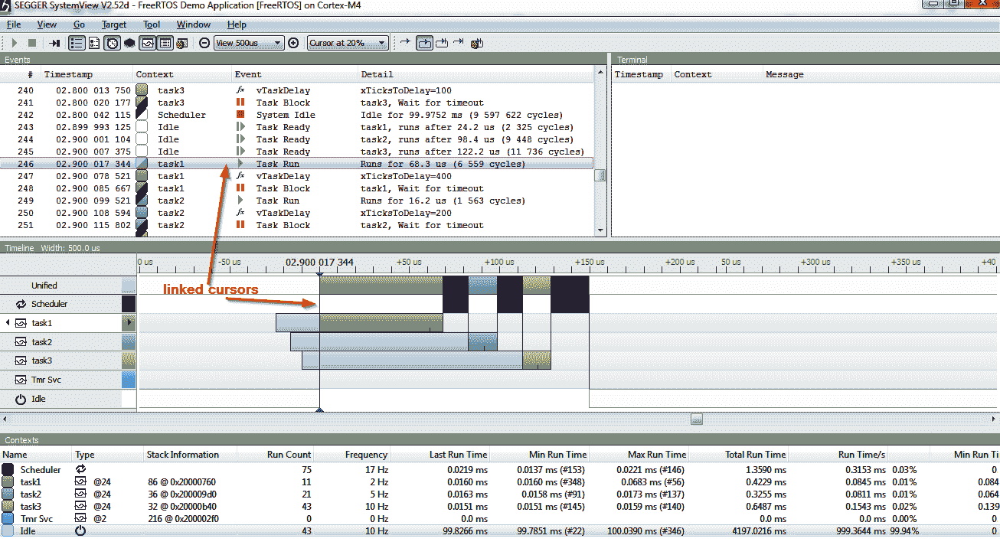

# 第六章：实时系统的调试工具

在严肃的嵌入式系统开发中，严肃的调试工具至关重要。基于复杂 RTOS 的系统可能有许多任务和数十个需要及时完成的 ISR。有了合适的工具，判断一切是否正常工作（或*为什么*不正常）会容易得多。如果您一直使用偶尔的打印语句或闪烁的 LED 进行故障排除，那么您将有一个惊喜！

我们将在本书的剩余部分大量使用 Ozone 和 SystemView，但首先，我们需要设置它们并查看快速介绍。在本章的末尾，我们将探讨其他调试工具，以及减少最初编写时产生的错误数量的技术。

简而言之，在本章中我们将涵盖以下内容：

+   优秀调试工具的重要性

+   使用 SEGGER J-Link

+   使用 SEGGER Ozone

+   使用 SEGGER SystemView

+   其他优秀工具

# 技术要求

在本章中，将安装和配置几款软件。以下是您应该已经准备好的物品：

+   一块 Nucleo F767 开发板

+   一条 micro-USB 线

+   一台 Windows PC（ST-Link Reflash 实用程序只需要 Windows 操作系统）

+   STM32CubeIDE（ST-Link Reflash 实用程序需要 ST-Link 驱动程序）

本章的所有源代码都可以从[`github.com/PacktPublishing/Hands-On-RTOS-with-Microcontrollers/tree/master/Chapters5_6`](https://github.com/PacktPublishing/Hands-On-RTOS-with-Microcontrollers/tree/master/Chapters5_6)下载。

# 优秀调试工具的重要性

在开发任何软件时，很容易在不考虑所有细节的情况下开始编写代码。多亏了代码生成工具和第三方库，我们能够非常快速地开发一个功能丰富的应用程序，并在相当短的时间内将其运行在实际硬件上。然而，当涉及到确保系统的每个部分 100%正常工作时，事情就变得有点困难了。如果一个系统建立得太快，并且组件在集成之前没有得到适当的测试，那么可能会有一些部分大多数时候都能正常工作，但并不总是如此。

在嵌入式系统中，通常只有底层应用程序的少数部分是可见的。从用户的角度来看，评估整个系统的健康状况可能具有挑战性。历史上，对于嵌入式工作来说，良好的调试工具比非嵌入式工作要少。到处放置打印语句只能走那么远，会导致时序问题，等等。闪烁的 LED 既麻烦又提供不了太多见解。通过硬件分析信号可以帮助验证症状，但并不总是隔离问题的根本原因。在没有帮助可视化执行的工具的情况下，试图弄清楚在事件驱动系统中实际运行的代码（以及何时运行）是非常具有挑战性的。

这就是为什么拥有各种熟悉的工具在您手中极为有用。它允许您自信地专注于开发应用程序的小部分。自信来自于严格验证每个功能，在开发过程中以及与系统其他部分的集成过程中。然而，为了执行验证，我们需要在代码的不同部分保持透明度（而不仅仅是系统外部可观察的部分）。在验证过程中，很多时候会出现需要观察任务间执行的情况。

有两个重要的领域有助于我们实现系统透明度和可观察的任务关系目标：基于实时操作系统的调试和实时操作系统可视化。

# 基于实时操作系统的调试

在用于裸机（例如，没有操作系统）编码的传统调试设置中，只有一个堆栈可以观察。由于编程模型是一个单超级循环和一些中断，这并不是一个大问题。在任何时候，系统的状态可以通过以下方式识别：

+   知道程序计数器（**PC**）所在的函数

+   知道哪些中断是激活的

+   查看关键全局变量的值

+   观察和展开堆栈

在基于实时操作系统的系统中，基本方法非常相似，但编程模型扩展到包括多个并行运行的*任务*。记住，每个任务实际上是一个隔离的无穷循环。由于每个任务都有自己的堆栈并且可能处于不同的操作状态，因此需要一些额外的信息来识别整体系统状态：

+   了解每个任务当前的运行状态

+   知道 PC 所在的任务和函数

+   了解哪些中断是激活的

+   查看关键全局变量的值

+   观察和展开每个任务的堆栈

由于嵌入式系统的限制性，堆栈使用通常是一个关注点，因为 MCU 的 RAM 有限。在裸机应用程序中，只有一个堆栈。在实时操作系统应用程序中，每个任务都有自己的堆栈，这意味着我们有更多要监控的内容。使用提供实时操作系统堆栈信息的调试系统有助于快速评估系统中每个任务的堆栈使用情况。

监控事件响应的最坏情况性能也是实时系统开发的一个关键方面。我们必须确保系统将及时响应关键事件。

有许多不同的方法来解决这个问题。假设事件起源于 MCU 外部的硬件信号（这在大多数情况下是正确的），可以使用逻辑分析仪或示波器来监控该信号。可以在应用程序中插入代码在事件被处理后切换 MCU 上的引脚，并监控时间差。根据系统、测试设备的访问权限以及相关事件，这种方法可能很方便。

另一种方法是结合 RTOS 中的 **仪器** 使用软件。使用这种方法时，会在 RTOS 中添加一些小的钩子，当事件发生时通知监控系统。然后，这些事件会被传输出 MCU 并发送到运行查看程序的开发 PC 上。这本书将重点关注这种方法——使用 SEGGER SystemView。这允许以非常少的开发工作收集大量的信息和统计数据。这种方法的一个小缺点是，由于它是一种纯软件/固件方法，因此增加了一点点不确定性。它依赖于 MCU 记录事件发生的时间，这意味着如果中断服务被显著延迟，则可能无法准确记录。此外，它还强烈依赖于 RAM 或 CPU 周期的可用性。在没有足够 RAM 的高负载系统中，这种方法可能会得出不可靠的结论。然而，这些缺点都有解决方案，并且在大多数系统中不会遇到。

# RTOS 可视化

能够看到哪些任务正在运行以及它们是如何交互的也很重要。在抢占式调度环境中，任务之间可能会形成复杂的关系。例如，为了处理一个事件，可能需要几个任务相互交互。除此之外，可能还有更多任务都在争夺处理器时间。在这种情况下，一个设计不佳且持续错过截止日期的系统可能只会从用户的角度被视为 *缓慢*。通过任务可视化，程序员可以真正地 *看到* 系统中所有任务之间的关系，这有助于分析。

我们将在第八章 保护数据和同步任务中通过 `mainSemPriorityInversion.c` 演示，通过一个真实世界的例子来可视化此类场景。

在解开复杂的任务间关系时，能够轻松地辨别任务在一段时间内的状态非常有帮助。SEGGER SystemView 也将用于可视化任务间关系。

为了对运行中的系统进行深入分析，我们需要一种方法来连接 MCU 并从中获取信息。在 Cortex-M MCU 上，这最有效地通过外部调试探针来完成。

# 使用 SEGGER J-Link

调试探针是一种允许计算机与 MCU 的非易失性闪存进行通信和编程的设备。它与 MCU 上的特殊硬件（在 ARM Cortex-M 处理器上称为 Coresight）进行通信。SEGGER J-Link 和 J-Trace 系列调试探针在行业中非常受欢迎。SEGGER 还提供免费集成的有用软件。这些工具的可用性和配套软件的质量使得它们非常适合在本书中使用。

如果你计划使用付费 IDE，IDE 供应商可能有自己的专有调试探针。许多优秀的软件功能可能与其硬件绑定。例如，ARM Keil uVision MDK 与 ARM Ulink 探针集成，IAR 提供他们的 I-Jet 调试探针。此类 IDE 还与第三方探针集成，但在做出购买决定之前，请注意可能存在的权衡。

在选择 SEGGER 调试探针时有很多选项——我们将简要介绍目前可用的选项，并查看每个选项的硬件要求。

# 硬件选项

SEGGER 有许多不同的硬件选项，覆盖了广泛的定价和能力。要获取完整和当前的列表，请访问他们的网站[`www.segger.com/products/debug-probes/j-link/models/model-overview/`](https://www.segger.com/products/debug-probes/j-link/models/model-overview/)。

模型通常分为两大类：具备完整 Cortex-M 迹线支持的调试器和不具备的。

# Segger J-Trace

具备完整迹线支持的调试器被称为 J-Trace。**Cortex 嵌入式迹线宏单元**（**Cortex ETM**）是 MCU 内部的一个额外硬件组件，它允许记录所有已执行的指令。将所有这些信息从 MCU 传输出去需要一些额外的引脚来时钟数据输出（一个时钟线和 1-4 个数据线）。能够追踪 MCU 执行的所有指令使得功能如代码覆盖率成为可能，这提供了关于已执行代码量的洞察（逐行）。确切知道哪些代码行已被执行以及何时执行，这给了我们机会看到程序大部分时间花在了哪里。当我们知道哪些单独的代码行被执行得最频繁时，在需要改进性能时，就有可能优化这部分代码。

为了充分利用高级迹线功能，以下所有条件都是必需的：

+   MCU 必须具备 ETM 硬件。

+   特定的 MCU 封装必须将 ETM 信号引出到引脚上。

+   外设配置不得与其他功能共享 ETM 信号。

+   系统电路必须设计成包含 ETM 信号和连接器。

用于调试和 ETM 信号的常用连接器是一个 0.05 英寸间距的排针，其引脚配置如下（迹线信号已突出显示）：



当然，所有这些功能都需要付出代价。J-Trace 模型在 SEGGER 的产品线中处于高端，无论是在功能还是价格方面（通常超过 1000 美元）。除非你正在开发完全定制的硬件，否则也请预期需要支付一个完整的评估板（超过 200 美元），而不是本书中使用的低成本开发硬件。虽然这些成本对于新产品开发期间的全额工程预算通常是完全合理的，但对于个人来说过于昂贵，难以广泛获取。

# SEGGER J-Link

SEGGER J-Link 在许多不同的形式中存在，并已发展到包括几个型号。通常，高端型号提供更快的时钟速度和更丰富的体验（更快的下载、响应式调试等）。一些**EDU**型号以极低折扣出售，用于教育目的（因此有**EDU**的标识）。这些型号功能齐全，但不能用于商业目的。

Cortex-M 最常用的连接器是一个 0.05" 前距的排针，具有以下引脚配置。请注意，此连接器的引脚配置与 Debug+Trace 连接器的第一个 10 个引脚相同（参见图表）。



SEGGER 在设计不依赖于底层硬件的软件接口方面做得非常出色。正因为如此，他们的软件工具无需修改即可在不同的硬件调试器模型上运行。这也导致了本书中我们将使用的硬件选项——板载 SEGGER J-Link。

# 板载 SEGGER J-Link

我们在练习中将使用的 ST-Link 具体硬件变体实际上不是由 SEGGER 制造的。它是 Nucleo 开发板上已经包含的 ST-Link 电路。Nucleo 板有两个独立的子电路：编程硬件和目标硬件。

编程硬件子电路通常被称为 ST-Link。这个**编程硬件**实际上是一个负责与 PC 通信并编程**目标硬件**（STM32F767）的 STM MCU。由于 Nucleo 硬件主要针对 ARM Mbed 生态系统，ST-Link MCU 被编程为固件，该固件实现了 ST-Link 和 Mbed 功能：



为了将 Nucleo 板上的编程硬件作为 SEGGER JLink 使用，我们将用 SEGGER J-Link 板载固件替换其固件。

# 安装 J-Link

详细安装说明可在 SEGGER 的[`www.segger.com/products/debug-probes/j-link/models/other-j-links/st-link-on-board/`](https://www.segger.com/products/debug-probes/j-link/models/other-j-links/st-link-on-board/)找到。这里也包含了一些方便的注意事项。为了将板载 ST-Link 转换为 J-Link，我们将下载并安装两个软件：J-Link 工具和 ST-Link 刷新实用程序。您应该已经从上一章中 STM32CubeIDE 安装中安装了必要的 ST-Link 驱动程序：

仅当需要使用 J-Link Reflash 实用程序（它作为`*.exe`文件分发）时，才需要 Windows PC。如果您不使用 Windows PC 进行开发且未安装 STM32CubeIDE，请确保安装 ST-Link 的 USB 驱动程序（以下列表中的可选*步骤 1*）。

1.  如果您尚未安装 STM32CubeIDE，请从[`www.st.com/en/development-tools/stsw-link009.html`](http://www.st.com/en/development-tools/stsw-link009.html)下载并安装 ST-Link 驱动程序（此步骤为可选）。

1.  从[`www.segger.com/downloads/jlink`](https://www.segger.com/downloads/jlink)下载适合您操作系统的 J-Link 工具。

1.  安装 J-Link 工具——默认选项即可。

1.  从[`www.segger.com/downloads/jlink#STLink_Reflash`](https://www.segger.com/downloads/jlink#STLink_Reflash)下载 SEGGER J-Link 刷新实用程序（仅适用于 Windows 操作系统）。

1.  解压`STLinkReflash_<version>.zip`文件的内容——它将包含两个文件：

    +   `JLinkARM.dll`

    +   `STLinkReflash.exe`

现在，我们将 ST-Link 转换为 J-Link。

# 将 ST-Link 转换为 J-Link

按照以下步骤将 J-Link 固件上传到 Nucleo 开发板上的 ST-Link：

1.  将微型 USB 线插入 Nucleo 板上的`CN1`并连接到您的 Windows PC。

1.  打开`STLinkReflash_<version>.exe`。

1.  阅读并接受两个许可协议。

1.  选择第一个选项：升级到 J-Link。

Nucleo 板上的调试硬件现在实际上是 SEGGER J-Link！

现在有了 J-Link，我们将能够使用其他 SEGGER 软件工具，如 Ozone 和 SystemView，来调试和可视化我们的应用。

# 使用 SEGGER Ozone

SEGGER Ozone 是一款用于调试已编写应用的软件。Ozone 与创建应用所使用的底层编程环境无关。它可以在许多不同的模式下使用，但我们将重点关注导入`*.elf`文件并与源代码交叉引用，为使用任何工具链创建的项目提供 FreeRTOS 感知的调试功能。让我们快速了解一下在 Ozone 中将要处理的文件类型。

# 示例中使用的文件类型

在编程和调试嵌入式系统时，会用到几种文件类型。这些文件类型适用于许多不同的处理器和软件产品，并不局限于 Cortex-M 微控制器或本书中使用的软件。

**可执行和链接格式**（**ELF**）文件是一种具有存储比直接 `*.bin` 或 `*.hex` 文件更多内容的执行格式。`*.elf` 文件与 `*.hex` 文件类似，它们包含加载到目标 MCU 上的完整功能项目所需的全部二进制机器代码。`*.elf` 文件还包含指向原始源代码文件名和行号的链接。Ozone 等软件使用这些链接在调试应用程序时显示源代码：

+   `*.bin`：一个直接的二进制文件（只有 1 和 0）。这种文件格式可以直接“烧录”到 MCU 的内部闪存中，从指定的地址开始。

+   `*.hex`：通常是摩托罗拉 S-record 格式的变体。这种基于 ASCII 的文件格式包含绝对内存地址及其内容。

+   `*.elf`：包含可执行代码以及一个用于交叉引用每个内存段到源文件的标题。这意味着单个 ELF 文件包含足够的信息来编程目标 MCU，并且可以交叉引用创建二进制内存段所使用的所有源代码。

ELF 文件不包含实际使用的源代码，它只包含指向内存段与原始源代码交叉引用的绝对文件路径。这就是我们能够在 Ozone 中打开 `*.elf` 文件并在调试时逐步执行 C 源代码的原因。

+   `*.svd`：包含将寄存器和描述映射到目标设备内存映射的信息。通过提供准确的 `*.svd` 文件，Ozone 将能够显示在调试 MCU 外设代码时非常有用的外设视图。

`*.svd` 文件是一种通常与支持您的 MCU 的 IDE 一起提供的文件。例如，STM32Cube IDE 中 `*.svd` 文件的位置是

*`C:\ST\STM32CubeIDE_1.2.0\STM32CubeIDE\plugins\com.st.stm32cube.ide.mcu.productdb.debug_1.2.0.201912201802\resources\cmsis\STMicroelectronics_CMSIS_SVD`.*

在嵌入式系统开发中，还有其他一些文件类型被使用。这绝对不是一份详尽的列表——只是我们在示例项目中会使用到的一些。

# 安装 SEGGER Ozone

要安装 SEGGER Ozone，请按照以下两个简单步骤操作：

1.  下载 SEGGER Ozone：[`www.segger.com/downloads/jlink/`](https://www.segger.com/downloads/jlink/)

1.  使用默认选项进行安装。

现在，让我们来介绍创建一个支持 FreeRTOS 的 Ozone 项目的必要步骤，并快速浏览一些有趣的功能。

# 创建 Ozone 项目

由于 Ozone 完全独立于编程环境，为了使用它进行调试，需要进行一些配置，这些配置将在以下步骤中介绍：

本书源代码树中包含的所有项目都已为它们创建了 Ozone 项目。以下步骤仅供参考——您只需为您的未来项目执行这些步骤。本书中所有项目的 Ozone 项目文件，即`*.jdebug`文件，都已包含。

1.  首次打开时，选择“创建新项目”提示。

1.  对于“设备”字段，选择 STM32F767ZI。

1.  对于外设，输入`STM32F7x7.svd`文件的目录和位置：



1.  在“连接设置”对话框屏幕上，默认值是可以接受的。

1.  在“程序文件”对话框屏幕上，导航到由 TrueStudio 生成的`.elf`文件。它应该位于您的项目“调试”文件夹中：



1.  保存`*.jdebug`项目文件并关闭 Ozone。

1.  使用文本编辑器打开`*.jdebug`文件。

1.  在`*.jdebug`项目文件中添加一行以启用 FreeRTOS 插件（仅添加加粗的最后一行）：

```cpp
void OnProjectLoad (void) {
  //
  // Dialog-generated settings
  //
  Project.SetDevice ("STM32F767ZI");
  Project.SetHostIF ("USB", "");
  Project.SetTargetIF ("JTAG");
  Project.SetTIFSpeed ("50 MHz");
  Project.AddSvdFile ("C:\Program Files (x86)\Atollic\TrueSTUDIO for STM32 9.3.0\ide\plugins\com.atollic.truestudio.tsp.stm32_1.0.0.20190212-0734\tsp\sfr\STM32F7x7.svd");
  Project.SetOSPlugin("FreeRTOSPlugin_CM7");
```

将`*.svd`文件复制到用于存储源代码或构建工具的位置是个好主意，因为 IDE 的安装目录可能会随时间和机器而改变。

这些步骤可以修改为设置任何由 SEGGER 系列调试器支持的 MCU 的 Ozone。

# 将 Ozone 附加到 MCU

是时候卷起袖子，动手实践了！如果您有一些硬件正在运行，接下来的部分将更有意义，您可以跟随操作并进行一些探索。让我们开始设置一切：

1.  打开 STM32Cube IDE 并打开`Chapter5_6`项目。

1.  右键单击`Chapter5_6`并选择构建。这将编译项目为`*.elf`文件（即`C:\projects\packtBookRTOS\Chapters5_6\Debug\Chapter5_6.elf`）。

1.  打开 Ozone。

1.  从向导中选择“选择打开现有项目”。

1.  选择`C:\projects\packtBookRTOS\Chapters5_6\Chapters5_6.jdebug`。

1.  使用 Ozone 将代码下载到 MCU（单击电源按钮）：



1.  按下播放按钮以启动应用程序（您应该看到红色、蓝色和绿色 LED 闪烁）。

如果您的路径与创建`*.jdebug`文件时使用的路径不同，您需要重新打开`.elf`文件（转到“文件 | 打开”并选择在*步骤 2*中构建的文件）。

这些相同的六个步骤可以重复用于本书中包含的任何项目。您也可以通过打开不同的`*.elf`文件为其他项目创建`.jdebug`文件的副本。

您可能想将此页面添加到书签。您将在本书剩余的 50 多个示例程序中遵循相同的步骤！

# 查看任务

通过启用 FreeRTOS 任务视图，可以快速查看任务概览。在开发 RTOS 应用程序时，使用这些任务可能非常有益：

1.  在 MCU 程序启动后，通过单击*暂停*按钮暂停执行。

1.  现在，导航到“查看 | FreeRTOS 任务视图”：



此视图可以一目了然地显示许多有用的信息：

+   任务名称和优先级。

+   超时：一个被阻塞的任务在被强制退出阻塞状态之前有多少个*滴答*。

+   每个任务的堆栈使用情况（默认情况下只显示当前堆栈使用情况）。在先前的屏幕截图中（通过 N/A 看到），最大堆栈使用被禁用——（配置 FreeRTOS 以监控最大堆栈使用的详细信息将在第十七章，*故障排除技巧和下一步行动*中介绍）。

+   互斥锁计数：一个任务当前持有的互斥锁数量。

+   通知：每个任务通知的详细信息。

在开发基于实时操作系统的应用程序时，对系统中所有任务的鸟瞰图可以提供巨大的帮助——尤其是在开发的初期阶段。

# 基于任务的堆栈分析

使用非实时操作系统感知工具调试实时操作系统的一个挑战是分析每个任务的调用堆栈。当系统停止时，每个任务都有自己的调用堆栈。在特定时间点需要分析多个任务的调用堆栈是很常见的。Ozone 通过结合使用 FreeRTOS 任务视图和调用堆栈视图来提供这种功能。

在打开两个视图后，FreeRTOS 任务视图中的每个任务都可以双击以在调用堆栈视图中揭示该任务的当前调用堆栈。要按函数逐个揭示每个任务的局部变量，请打开本地数据视图。在此视图中，将显示调用堆栈中当前突出显示的函数的局部变量。

这里展示了结合基于任务的调用堆栈分析与局部变量视图的示例：



注意以下从该截图中的信息：

1.  当 MCU 停止时，它处于“IDLE”任务状态（在状态列中通过执行来显示）。

1.  双击“task 3”显示“task 3”的调用堆栈。目前，`vTaskDelay`位于堆栈顶部。

1.  双击`StartTask3`会更新本地数据窗口，以显示`StartTask3`中所有局部变量的值。

1.  `StartTask3`的局部变量显示了`StartTask3`中所有局部变量的当前值。

SEGGER Ozone 提供了对系统中所有运行任务的基于任务的调用堆栈视图和前瞻视图。这种组合为我们提供了一款强大的工具，可以深入到系统中每个运行任务的细微细节。但当我们需要系统的更大视角时会发生什么？我们不是逐个查看每个任务，而是更愿意查看系统任务之间的交互*。*这是 SEGGER SystemView 可以提供帮助的领域。

# 使用 SEGGER SystemView

SEGGER SystemView 是另一个可以与 SEGGER 调试探针一起使用的软件工具。它提供了一种可视化系统任务和中断流的方法。SystemView 通过在项目中添加少量代码来实现。FreeRTOS 已经具有`Trace Hook Macros`，这是专门为添加此类第三方功能而设计的。

与 Ozone 不同，SystemView 没有编程或调试功能，它只是一个**查看器**。

# 安装 SystemView

要使您的系统通过 SystemView 可见，需要两个主要步骤。软件需要安装，源代码必须被配置，以便它可以通过调试接口通信其状态。

# SystemView 安装

要安装 SystemView，请按照以下步骤操作：

1.  下载适用于您的操作系统（OS）的 SystemView。这是主要的二进制安装程序（[`www.segger.com/downloads/free-utilities`](https://www.segger.com/downloads/free-utilities)）。

1.  使用默认选项安装。

# 源代码配置

为了使 SystemView 能够显示系统上运行的任务的可视化，它必须提供有关任务名称、优先级和任务当前状态等信息。FreeRTOS 中存在几乎满足 SystemView 所需的所有钩子。一些配置文件用于设置 FreeRTOS 中现有的跟踪钩子和 SystemView 使用的映射。需要收集信息，这就是特定 RTOS 配置和 SystemView 目标源发挥作用的地方：

本书附带源代码已经执行了所有这些修改，因此，如果您想将 SystemView 功能添加到**您自己的 FreeRTOS 项目**中，这些步骤**仅是必要的**。

1.  从[`www.segger.com/downloads/free-utilities`](https://www.segger.com/downloads/free-utilities)下载 SystemView FreeRTOS V10 配置（使用了 v 2.52d 版本）并将`FreeRTOSV10_Core.patch`应用到 FreeRTOS 源树中，使用您首选的 diff 工具。

1.  从[`www.segger.com/downloads/free-utilities`](https://www.segger.com/downloads/free-utilities)下载并集成 SystemView 目标源（使用了 v 2.52h 版本）。

    1.  将所有源文件复制到您的源树中的`.\SEGGER`文件夹，并在编译和链接时包含它们。在我们的源树中，`SEGGER`文件夹位于`.\Middlewares\Third_Party\SEGGER`。

    1.  将`SystemView Target Sources\Sample\FreeRTOSV10\SEGGER_SYSVIEW_FreeRTOS.c/h`复制到`SEGGER`文件夹中，并在编译和链接时包含它。

    1.  将`.\Sample\FreeRTOSV10\Config\SEGGER_SYSVIEW_Config_FreeRTOS.c`复制到`SEGGER`文件夹中，并在编译和链接时包含它。

1.  对`FreeRTOSConfig.h`做出以下更改：

    1.  在文件末尾添加对`SEGGER_SYSVIEW_FreeRTOS.h`的包含：`#include "SEGGER_SYSVIEW_FREERTOS.h"`。

    1.  添加`#define INCLUDE_xTaskGetIdleTaskHandle 1`。

    1.  添加`#define INCLUDE_pxTaskGetStackStart 1`。

1.  在`main.c`中做出以下更改：

    1.  包含`#include <SEGGER_SYSVIEW.h>`。

    1.  在初始化之后和启动调度器之前添加对`SEGGER_SYSVIEW_Conf()`的调用。

由于 SystemView 是在每个任务的上下文中调用的，你可能会发现需要增加最小任务堆栈大小以避免堆栈溢出。这是因为 SystemView 库需要在目标 MCU 上运行一小段代码（这增加了调用深度和放置在堆栈上的函数数量）。有关如何调试堆栈溢出（以及如何避免它们）的所有详细信息，请参阅第十七章*故障排除技巧和下一步*。

# 使用 SystemView

在整理完 SystemView 的源代码后，使用该应用程序非常简单。要开始捕获，请确保你有运行中的目标，并且你的调试器和 MCU 连接到计算机：

1.  点击*播放*按钮。

1.  选择适当的目标设备设置（如下所示）：


SystemView 需要一个*运行中的*目标。它不会显示停止的 MCU（因为它没有运行，所以没有事件可以显示）。确保板上的 LED 闪烁；如果它们没有闪烁，请按照*将 Ozone 连接到 MCU*部分的步骤操作。

1.  几秒钟后，事件将流进左上角的日志事件视图中，你将看到任务在时间线中当前执行的实时图形视图：



+   时间线显示了任务执行的视觉表示，包括不同的状态。

+   事件视图显示了事件列表。选中的事件与时间线相链接。

+   上下文视图显示了所有事件的统计数据。

+   终端可以用来显示代码中的 printf-like 消息。

还有更多有用的功能，这些功能将在探索代码时介绍。

我们终于完成了开发软件的安装！如果你一直跟随着，你现在拥有了一个完全可操作的 IDE、一个 RTOS 可视化解决方案以及一个功能强大的 RTOS 感知调试系统。让我们看看在嵌入式系统开发过程中还有哪些其他工具可能是有用的。

# 其他优秀工具

本章介绍的工具当然不是调试和故障排除嵌入式系统可用的唯一工具。还有许多其他工具和技术，我们无法涵盖（或者由于本书中使用的工具的具体限制，它们不适合）。这些主题在下一节中提到，并在章节末尾的*进一步阅读*部分提供了额外的链接。

# 测试驱动开发

由于本章的标题以单词 *debugging* 开头，因此提及理想情况下不编写有缺陷代码的调试方式似乎是合适的。单元测试不是一款单独的软件，而是 **测试驱动开发**（**TDD**）——一种开发方法，它颠倒了嵌入式工程师传统上开发系统的方式。

与编写大量无效代码然后进行调试不同，测试驱动开发从编写测试开始。编写测试后，再编写生产代码，直到测试通过。这种方法往往导致代码既可测试又易于重构。由于使用这种方法对单个函数进行测试，因此生成的生产代码与底层硬件的关联性要小得多（因为测试与真实硬件关联的代码并不容易）。强制在这一级别编写测试往往会导致松散耦合的架构，这在第十三章使用队列创建松散耦合中有详细讨论。第十三章中提到的使用队列创建松散耦合的技术与单元测试和 TDD 结合使用效果非常好。

通常，TDD 在嵌入式系统中并不那么受欢迎。但如果你对这个话题感兴趣并想了解更多，可以查看专门针对该主题编写的书籍——*嵌入式 C 的测试驱动开发*（Test Driven Development for Embedded C）由 J*ames Grenning 撰写。

# 静态分析

静态分析是减少代码库中渗入的缺陷数量的另一种方法。“静态”一词指的是代码不需要执行即可进行此分析。静态分析器寻找常见的编程错误，这些错误在语法上是正确的（例如，它们可以编译），但**可能**会生成有缺陷的代码（例如，越界数组访问等），并提供相关的警告。

市面上有许多静态分析的商业软件包，以及一些免费提供的软件。Cppcheck 包含在 STM32CubeIDE 中（只需在项目上右键单击并选择运行 C/C++ 代码分析）。本章末尾包含了一个来自 Clang 项目的 **免费开源软件**（**FOSS**）静态分析器的链接。PVS-Studio 分析器是商业软件包的一个例子，它可以免费用于非商业项目。

# Percepio Tracealyzer

Percepio Tracealyzer 是一款类似于 SEGGER SystemView 的工具，它帮助开发者可视化系统执行。Tracealyzer 的设置比 SystemView 更简单，并且提供了比 SystemView 更注重美学的用户体验。然而，由于它由不同的公司提供，因此软件的成本不包括 SEGGER 调试探头的购买。您可以在[`percepio.com/tracealyzer/`](https://percepio.com/tracealyzer/)了解更多关于 Tracealyzer 的信息。

# 传统测试设备

在所有用于在计算机屏幕上可视化 RTOS 行为的软件出现之前，这项任务将落到更传统的测试设备上。

逻辑分析仪自 MCU 首次出现以来就一直存在，并且仍然是嵌入式系统工程师工具箱中最通用的工具之一。使用逻辑分析仪，可以直接测量输入进入系统时和系统提供输出时的时间，以及每个任务之间的时间。查看进出 MCU 的原始低级信号提供了一种对系统中的问题时什么不对的直观感受，这是屏幕上的十六进制数字所无法提供的。习惯性地在硬件级别进行仪器化还有另一个优点——时序和其它异常行为往往在直接寻找之前就能被发现。

如果您刚开始接触嵌入式系统，您还希望获得手持式**数字多用表**（**DMM**）和示波器来测量模拟信号。

# 摘要

在本章中，我们讨论了为什么拥有优秀的调试工具很重要。我们将用于分析系统行为的精确工具（SEGGER Ozone 和 SystemView）已经介绍。您也被指导如何设置这些工具以供未来项目使用。在最后，我们简要提到了一些本书不会涵盖的其他工具，只是为了提高对这些工具的认识。

现在我们已经涵盖了 MCU 和 IDE 的选择，并且我们已经将所有工具整理妥当，我们有了足够的背景知识来进入 RTOS 应用开发的真正核心。

使用这个工具集将帮助您在深入探讨即将到来的章节中的工作示例时，对 RTOS 的行为和编程有更深入的理解。您还将能够使用这个相同的工具集在未来创建高性能的定制实时应用程序。

在下一章中，我们将开始编写一些代码，并更详细地介绍 FreeRTOS 调度器。

# 问题

1.  使用本书中的工具需要购买 J-Link 硬件。

    +   正确

    +   错误

1.  评估实时系统有效性的唯一方法就是等待并看看是否因为错过截止日期而出现问题。

1.  +   正确

    +   错误

1.  由于 RTOS 每个任务都有一个堆栈，因此使用调试器进行调试是不可能的，因为只有主系统堆栈是可见的。

1.  +   正确

    +   错误

1.  确保系统完全功能的方法是在项目结束时一次性编写所有代码并调试。

1.  +   正确

    +   错误

1.  被称为每个单独模块都进行测试的测试风格是什么？

    +   单元测试

    +   集成测试

    +   系统测试

    +   黑盒测试

1.  在开发生产代码之前编写测试的术语是什么？

# 进一步阅读

+   《嵌入式 C 的测试驱动开发》*James Grenning*著

+   SEGGER Ozone 手册 (UM08025): [`www.segger.com/downloads/jlink/UM08025`](https://www.segger.com/downloads/jlink/UM08025)

+   SEGGER SystemView 手册 (UM08027): [`www.segger.com/downloads/jlink/UM08027`](https://www.segger.com/downloads/jlink/UM08027)

+   Clang 静态分析器: [`clang-analyzer.llvm.org`](https://clang-analyzer.llvm.org)

+   PVS-Studio 分析器: [`www.viva64.com/en/pvs-studio/`](https://www.viva64.com/en/pvs-studio/)
