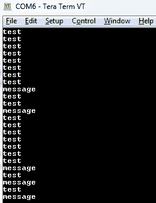
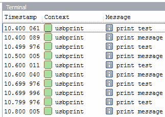
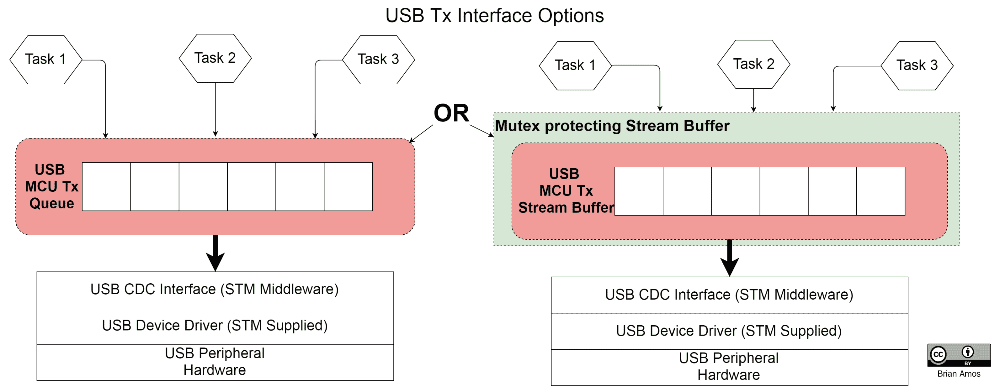
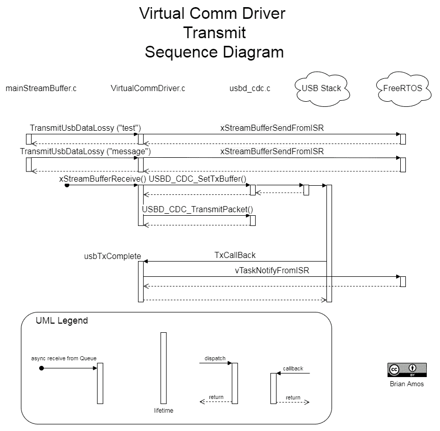
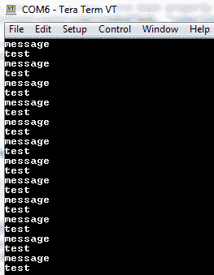
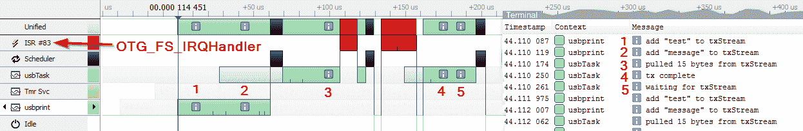
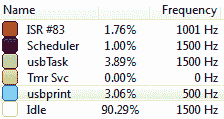
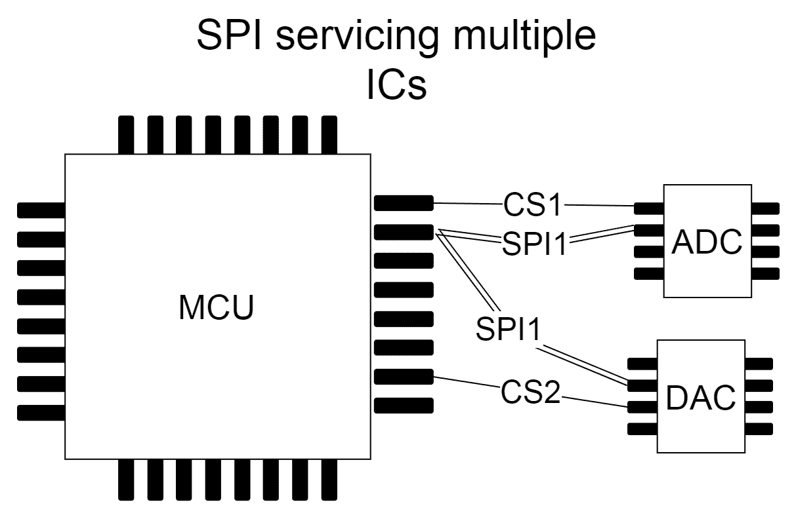

# 在任务间共享硬件外设

在上一章中，我们探讨了创建驱动程序的好几个例子，但它们仅被单个任务使用。由于我们正在创建一个多任务异步系统，需要考虑一些额外的因素以确保我们的驱动程序暴露的外设可以安全地被多个任务使用。为多个任务准备驱动程序需要考虑许多额外的因素。

因此，本章首先阐述了在多任务、实时环境中共享外设的陷阱。在理解我们要解决的问题之后，我们将研究如何将驱动程序封装起来，以便提供一个易于使用且在多个任务中安全使用的抽象层。我们将使用 STM32 USB 堆栈来实现一个**通信设备类**（**CDC**），以提供交互式的**虚拟串行端口**（**VPC**）。与上一章不同，上一章采用了极端低级的驱动程序开发方法，本章则侧重于在现有的驱动程序堆栈之上编写线程安全的代码。

简而言之，我们将涵盖以下主题：

+   理解共享外设

+   介绍 STM USB 驱动程序堆栈

+   开发 StreamBuffer USB 虚拟串行端口

+   使用互斥锁进行访问控制

# 技术要求

为了完成本章的动手实验，你需要以下工具：

+   Nucleo F767 开发板

+   Micro-USB 线（x2）

+   STM32CubeIDE 和源代码（第五章，*选择 IDE*，在*设置我们的 IDE*部分中提供说明）

+   SEGGER JLink、Ozone 和 SystemView（第六章，*实时系统调试工具*）

+   STM USB 虚拟串行端口驱动程序：

    +   Windows：驱动程序应自动从 Windows 更新中安装（[`www.st.com/en/development-tools/stsw-stm32102.html`](https://www.st.com/en/development-tools/stsw-stm32102.html)）。

    +   Linux/ macOS：这些系统使用内置的虚拟串行端口驱动程序。

+   串行终端客户端：

    +   Tera Term（或类似）(Windows)

    +   minicom（或类似）(Linux / macOS)

    +   miniterm.py（跨平台串行客户端，也包含在*第十三章，使用队列创建松散耦合*）中使用的 Python 模块

本章的所有源代码均可在[`github.com/PacktPublishing/Hands-On-RTOS-with-Microcontrollers/tree/master/Chapter_11`](https://github.com/PacktPublishing/Hands-On-RTOS-with-Microcontrollers/tree/master/Chapter_11)找到。

# 理解共享外设

硬件外围设备类似于任何其他共享资源。当有多个任务需要访问单个资源时，需要创建某种仲裁机制来保证任务间对资源的有序访问。在前一章中，我们关注了开发低级外围驱动程序的不同方法。提供了一些关于驱动程序选择的指导，并建议驱动程序提供的适当接口应根据驱动程序在系统中的使用方式来确定（第十章，*驱动程序和中断服务例程*，在*选择驱动程序模型*部分）。

在第三章中，*任务信号和通信机制*概念上介绍了共享资源。

在现实世界的应用中，共享外围设备的例子有很多。通信外围设备如 SPI、I2C、USART 和以太网外围设备都可以由多个任务同时使用，前提是应用的定时约束允许这样做，并且驱动程序以提供安全并发访问的方式编写。由于所有阻塞的 RTOS 调用都可以设置时间限制，因此很容易检测到访问共享外围设备是否导致定时问题。

重要的是要记住，在多个任务之间共享单个外围设备会导致延迟和定时不确定性。

在某些对定时要求严格的场合，最好避免共享外围设备，而是使用专用硬件。这也是为什么有多个基于总线的外围设备可用，包括 SPI、USART 和 I2C 的原因之一。尽管这些通信总线的硬件完全能够处理多个设备，但有时最好使用专用外围设备。

在其他情况下，一个硬件设备的驱动程序可能非常特定，出于性能考虑，最好为它分配一个完整的外围设备。通常，高带宽的外围设备会属于这一类别。一个例子是中等带宽的 ADC，每秒采样数千或数万个数据点。与这类设备交互的最高效方式是尽可能使用 DMA，将数据从通信总线（如 SPI）直接传输到 RAM。

# 定义外围设备驱动程序

本章提供了在现实世界情况下与驱动程序交互的完整示例。选择 USB 虚拟 COM 端口是因为它不需要任何额外的硬件，除了另一条微 USB 线。

我们的目标是使使用 USB CDC 与 Nucleo 板交互变得尽可能高效。交互的理想特性包括以下内容：

+   能够从多个任务中轻松写入 USB 虚拟 COM 端口。

+   高效的事件驱动执行（尽可能避免无用的轮询）。

+   数据应立即通过 USB 发送（尽可能避免延迟发送）。

+   调用应该是非阻塞的（任务可以添加要发送的数据，而无需等待实际的事务）。

+   任务可以选择在数据被丢弃之前等待空间可用的时长。

这些设计决策将产生几个影响：

+   **传输时间不确定性**：虽然数据以非阻塞方式排队，但传输的确切时间不能保证。这在这个特定示例中不是问题，但如果这是用于对时间敏感的交互，则可能是问题。USB CDC 一开始就不是非常适合对时间要求极为敏感的应用。

+   **缓冲区大小和延迟之间的权衡**：为了为传输大消息提供足够的空间，队列可以做得更大。然而，数据从大队列中退出所需的时间比从小队列中退出所需的时间更长。如果延迟或时间是一个考虑因素，则需要考虑这段时间。

+   **RAM 使用**：队列需要额外的 RAM，这超出了 USB 缓冲区已经需要的 RAM。

+   **效率**：此驱动程序代表了易用性和效率之间的权衡。实际上有两个缓冲区——USB 使用的缓冲区和队列。为了提供易用性，数据将被值复制**两次**，一次进入队列，一次进入 USB 传输缓冲区。根据所需的带宽，这可能会带来显著的性能限制。

首先，让我们从高层次上了解一下 STM USB 设备驱动程序堆栈，以便更好地理解我们在与 STM 提供的 CDC 驱动程序接口时拥有的选项。

# 介绍 STM USB 驱动程序堆栈

STM32CubeMX 被用作起点，以生成具有 CDC 支持的 USB 设备驱动程序堆栈。以下是重要的 USB 源文件及其相对于存储库根目录的位置概述：[`github.com/PacktPublishing/Hands-On-RTOS-with-Microcontrollers/tree/master/`](https://github.com/PacktPublishing/Hands-On-RTOS-with-Microcontrollers/tree/master/)

1.  低级 HAL USB 文件：

```cpp
DRIVERS\STM32F7XX_HAL_DRIVER\
|--Inc
|    |stm32f7xx_ll_usb.h
|--Src
     |stm32f7xx_ll_usb.c
```

`stm32f7xx_ll_usb.c/h`文件是最低级别的文件，提供了访问 USB 硬件外设的接口。这些文件被 STM 提供的 USB 驱动程序堆栈中间件使用。

1.  STM USB 设备堆栈：

```cpp
MIDDLEWARE\ST\
|--STM32_USB_Device_Library
    |----Class
    | |----CDC
    |     |----Inc
    |         | usbd_cdc.h
    | ----Src
    | usbd_cdc.c
    |----Core
        |----Inc
        |    usbd_core.h
        |     usbd_ctlreq.h
        |     usbd_def.h
        |     usbd_ioreq.h
        |----Src
               usbd_core.c
               usbd_ctlreq.c
               usbd_ioreq.c
```

前述文件实现了核心 USB 设备和 CDC 类功能。这些也是由 STM 提供的。这些提供了处理 USB 事务和枚举所需的大部分功能。

1.  与 USB 库的大部分交互将在 CDC 接口级别进行，在 BSP 文件夹中：

```cpp
BSP\
    Nucleo_F767ZI_Init.c
    Nucleo_F767ZI_Init.h
    usbd_cdc_if.c
    usbd_cdc_if.h
    usbd_conf.c
    usbd_conf.h
    usbd_desc.c
    usbd_desc.h
    usb_device.c
    usb_device.h
```

下面是每个源文件对及其用途的简要描述。这些文件在 USB 开发过程中最有可能被修改：

+   `Nucleo_F767ZI_Init.c/h`：MCU 的初始化代码，针对特定硬件。时钟和单个引脚配置等功能在这里发生。

+   `usbd_cdc_if.c/h`：（STM Cube 生成）。包含 USB 设备 CDC 接口函数。`CDC_Transmit_FS()`用于从 MCU 向 USB 主机（本例中的 PC）传输数据。`CDC_Receive_FS()`用于从 USB 主机接收数据。

+   `usbd_conf.c/h`：（STM Cube 生成）。用于将`stm32f7xx_hal_pcd.c`（USB 外设控制驱动程序）的函数和所需回调映射到`stm32f7xx_ll_usb.c`（低级 USB 外设接口驱动程序）。

+   `usbd_desc.c/h`：（STM Cube 生成）。定义在 USB 枚举期间使用的 USB 设备描述符。这是定义产品标识符和厂商标识符的地方（PID，VID）。

+   `usb_device.c/h`：（STM Cube 生成）。包含初始化 USB 堆栈的顶级函数。此文件包含`MX_USB_DEVICE_Init()`，用于初始化整个 USB 设备驱动程序堆栈。`MX_USB_DEVICE_Init()`应该在所有较低级别的时钟和引脚初始化完成之后调用（`Nucleo_F767ZI_Init.c`中的`HWInit()`执行此初始化）。

现在我们已经对代码的结构有了大致的了解，让我们创建一个简单的示例来更好地理解如何与之交互。

# 使用库存的 CDC 驱动程序

`mainRawCDC.c`包含少量代码来配置 MCU 硬件和 USB 设备堆栈。当将微型 USB 线缆插入 CN1（并连接到 USB 主机，如 PC）并通过 CN13 供电时，它将允许 MCU 作为虚拟 COM 端口通过 USB 进行枚举。它将尝试通过 USB 发送两条消息：*test*和*message*：

1.  USB 堆栈通过使用`MX_USB_Device_Init()`函数在硬件完全初始化后初始化：

```cpp
int main(void)
{
  HWInit();=
 MX_USB_DEVICE_Init();
```

1.  有一个单独的任务通过 USB 输出两个字符串，在第二次传输后使用简单的调用`usbd_cdc_if.c`：`CDC_Transmit_FS`强制延迟 100 个 tick：

```cpp
void usbPrintOutTask( void* NotUsed)
{
  while(1)
  {
    SEGGER_SYSVIEW_PrintfHost("print test over USB");
 CDC_Transmit_FS((uint8_t*)"test\n", 5);
    SEGGER_SYSVIEW_PrintfHost("print message over USB");
 CDC_Transmit_FS((uint8_t*)"message\n", 8);
    vTaskDelay(100);
  }
}
```

1.  在将此应用程序编译并加载到我们的目标板上之后，我们可以通过打开终端模拟器（本例中为 Tera Term）来观察 USB 端口的输出。你可能会看到以下截图类似的内容：



由于我们输出的是包含测试和消息的单行，我们希望虚拟串行端口包含相同的序列，但存在多个*test*行，并不总是随后跟有*message*行。

从 SystemView 中观察这个相同的应用程序运行，我们可以看到代码的执行顺序是我们预期的：



在仔细检查`CDC_Transmit_FS`之后，我们可以看到有一个返回值应该被检查。`CDC_Transmit_FS`首先检查在用新数据覆盖传输缓冲区之前，是否已经有一个传输正在进行。以下是`CDC_Transmit_FS`（由 STM Cube 自动生成）的内容：

```cpp
  uint8_t result = USBD_OK;
  /* USER CODE BEGIN 7 */
 USBD_CDC_HandleTypeDef *hcdc =
 (USBD_CDC_HandleTypeDef*)hUsbDeviceFS.pClassData

 if (hcdc->TxState != 0){
 return USBD_BUSY;
 }
  USBD_CDC_SetTxBuffer(&hUsbDeviceFS, Buf, Len);
  result = USBD_CDC_TransmitPacket(&hUsbDeviceFS);
  /* USER CODE END 7 */
  return result;
```

只有在没有正在进行的传输（由`hcdc->TxState`指示）时，才会进行数据传输。因此，为了确保所有消息都得到传输，我们这里有几个选择。

1.  我们可以简单地用条件语句包裹对`CDC_Transmit_FS`的每一个调用，以检查传输是否成功：

```cpp
int count = 10;
while(count > 0){
    count--;
      if(CDC_Transmit_FS((uint8_t*)"test\n", 5) == USBD_OK)
        break;
      else
        vTaskDelay(2);
}
```

这种方法有几个缺点：

+   +   在尝试连续发送多个消息时，速度较慢（因为每次尝试之间的延迟）。

    +   如果移除延迟，将极度浪费 CPU 资源，因为代码将基本上在传输完成时进行轮询。

    +   这是不希望看到的复杂性。通过强制调用代码评估低级 USB 事务是否有效，我们在可能非常简单的事情上添加了一个循环和嵌套条件语句。这将增加代码编写错误的概率并降低可读性。

1.  我们可以基于`usbd_cdc_if.c`编写一个新的包装器，使用 FreeRTOS 流缓冲区有效地将数据移动到 USB 堆栈。这种方法有几个注意事项：

    +   为了保持调用代码简单，我们将容忍丢失的数据（如果流缓冲区空间不足）。

    +   为了支持来自多个任务的调用，我们需要使用互斥锁保护对流缓冲区的访问。

    +   流缓冲区将实际上创建一个重复的缓冲区，从而消耗额外的 RAM。

1.  我们可以使用 FreeRTOS 队列代替流缓冲区。如第十章，*驱动程序和中断服务例程*）中所示，使用队列（相对于流缓冲区）时，由于每次只移动一个字节，因此会收到性能上的影响。然而，当在任务间使用时，队列不需要被互斥锁封装。

最佳解决方案取决于许多因素（有关考虑因素的列表见第十章，*驱动程序和中断服务例程*）。在此示例中，我们将使用流缓冲区实现。缓冲区所需的额外空间有足够的空间。这里的代码仅用于支持偶尔的短消息，而不是一个完全可靠的数据通道。这种限制主要是为了最小化复杂性，使示例更容易阅读。

现在我们来看看选项 2 和 3 相对于已存在的 STM HAL 驱动程序的样子：



对于这个驱动程序，我们将修改由 ST 提供的 HAL 生成的代码（`usbd_cdc_if.c`）作为起点。其功能将被我们新创建的`VirtualCommDriver.c`所取代。这将在下一节中详细介绍。

我们还将对 STM 提供的 CDC 中间件（`usbd_cdc.c/h`）进行非常小的修改，以启用一种非轮询方法来确定传输何时完成。`usbd_cdc.h` 中的 `USBD_CDC_HandleTypeDef` 结构体已经有一个名为 `TxState` 的变量，可以通过轮询来确定传输何时完成。但是，为了提高效率，我们希望避免轮询。为了实现这一点，我们将在结构体中添加另一个成员——一个在传输完成时将被调用的函数指针：`usbd_cdc.h`（**粗体**新增内容）：

```cpp
typedef struct
{
  uint32_t data[CDC_DATA_HS_MAX_PACKET_SIZE / 4U]; /* Force 32bits
                                                      alignment */
  uint8_t CmdOpCode;
  uint8_t CmdLength;
  uint8_t *RxBuffer;
  uint8_t *TxBuffer;
  uint32_t RxLength;
  uint32_t TxLength;
  //adding a function pointer for an optional call back function
 //when transmission is complete
 void (*TxCallBack)( void );
  __IO uint32_t TxState;
  __IO uint32_t RxState;
}
USBD_CDC_HandleTypeDef;
```

然后，我们将向 `usbd_cdc.c` 添加以下代码（**粗体**新增内容）：

```cpp
    }
    else
    {
      hcdc->TxState = 0U;
      if(hcdc->TxCallBack != NULL)
 {
 hcdc->TxCallBack();
 }
    }
    return USBD_OK;
  }
```

如果提供了 `TxCallBack` 函数指针（通过非空值指示），则执行该函数。这发生在 CDC 结构体中的 `TxState` 被设置为 0 时。`TxCallBack` 也在 `USBD_CDC_Init()` 中初始化为 NULL。

修改 STM 提供的驱动程序将使迁移到 HAL 的不同版本变得更加困难。必须权衡这些考虑与它们提供的任何优势。

注意：HAL 和 STMCubeIDE 的较新版本包括对 `TxCallBack` 的支持，因此如果你是从 ST 最新发布的代码开始，这个修改将不再必要。

# 开发 StreamBuffer USB 虚拟串行端口

`VirtualComDriver.c` 位于顶层 `Drivers` 文件夹中（因为我们很可能在未来的章节中使用它）。它在这里可用：[`github.com/PacktPublishing/Hands-On-RTOS-with-Microcontrollers/tree/master/Drivers/HandsOnRTOS/`](https://github.com/PacktPublishing/Hands-On-RTOS-with-Microcontrollers/tree/master/Drivers/HandsOnRTOS/)

首先，我们将逐一介绍创建的每个函数及其用途。

# 公共函数

`VirtualComDriver.c` 当前有三个公开可用的函数：

+   `TransmitUsbDataLossy`

+   `TransmitUsbData`

+   `VirtualCommInit`

`TransmitUsbDataLossy` 简单地是一个围绕流缓冲区函数调用的包装器。它使用了一个中断服务例程（ISR）安全的变体，这保证了它不会阻塞（但可能也不会将所有数据复制到缓冲区中）。返回的是复制到缓冲区中的字节数。在这种情况下，是否完成数据复制到缓冲区由调用代码来决定：

```cpp
int32_t TransmitUsbDataLossy(uint8_t const* Buff, uint16_t Len)
{
  int32_t numBytesCopied = xStreamBufferSendFromISR( txStream, Buff, Len,
                                                                   NULL);
  return numBytesCopied;
}
```

`TransmitUsbData` 提供了更多的便利性。它将阻塞最多两个滴答等待缓冲区中有空间可用。如果缓冲区在初始传输过程中部分填满，这将被分成两个调用。在第二次调用 `xStreamBufferSend` 时，很可能会有足够的空间可用。在大多数情况下，使用这种方法丢失的数据非常少：

```cpp
int32_t TransmitUsbData(uint8_t const* Buff, uint16_t Len)
{
  int32_t numBytesCopied = xStreamBufferSend( txStream, Buff, Len, 1);
  if(numBytesCopied != Len)
  {
    numBytesCopied += xStreamBufferSend( txStream, Buff+numBytesCopied,
                                                Len-numBytesCopied, 1);
  }
  return numBytesCopied;
}
```

`VirtualCommInit` 执行 USB 栈和必要的 FreeRTOS 任务所需的所有设置。流缓冲区正在以触发级别 1 初始化，以最小化 `TransmitUsbData` 被调用与数据移动到 USB 栈之间的延迟。此值可以与 `xStreamBufferReceive` 中使用的最大阻塞时间一起调整，以确保同时传输更大的数据块，从而实现更好的效率：

```cpp
void VirtualCommInit( void )
{
  BaseType_t retVal;
  MX_USB_DEVICE_Init();
  txStream = xStreamBufferCreate( txBuffLen, 1);
  assert_param( txStream != NULL);
  retVal = xTaskCreate(usbTask, "usbTask", 1024, NULL,
             configMAX_PRIORITIES, &usbTaskHandle);
  assert_param(retVal == pdPASS);
}
```

这些都是公开可用的函数。通过稍微修改与流缓冲区的交互，此驱动程序可以针对许多不同的用例进行优化。其余的功能由不可公开访问的函数提供。

# 私有函数

`usbTask` 是一个私有函数，负责我们 CDC 覆盖的初始设置。它还监控流缓冲区和任务通知，对 STM 提供的 CDC 实现进行必要的调用。

在开始主循环之前，有一些项目需要初始化：

1.  任务必须等待所有底层外设和 USB 栈初始化完成。这是因为任务将访问由 USB CDC 栈创建的数据结构：

```cpp
  USBD_CDC_HandleTypeDef *hcdc = NULL;

  while(hcdc == NULL)
  {
    hcdc = (USBD_CDC_HandleTypeDef*)hUsbDeviceFS.pClassData;
    vTaskDelay(10);
  }
```

1.  如果传输尚未进行，则提供任务通知。通知也被接受，这允许在传输正在进行时以高效的方式阻塞：

```cpp
  if (hcdc->TxState == 0)
  {
    xTaskNotify( usbTaskHandle, 1, eSetValueWithOverwrite);
  }
  ulTaskNotifyTake( pdTRUE, portMAX_DELAY );
```

1.  `usbTxComplete` 是当传输完成时将被执行的回调函数。USB CDC 栈已准备好接受更多要传输的数据。将 `TxCallBack` 变量设置为 `usbTxComplete` 配置 `usbd_cdc.c` 使用的结构，允许我们的函数在正确的时间被调用：

```cpp
hcdc->TxCallBack = usbTxComplete;
```

1.  `usbTxComplete` 很短，只包含几行代码，用于提供任务通知并强制进行上下文切换以进行评估（因此 `usbTask` 将尽可能快地被解除阻塞）：

```cpp
void usbTxComplete( void )
{
  portBASE_TYPE xHigherPriorityTaskWoken = pdFALSE;
  xTaskNotifyFromISR( usbTaskHandle, 1, eSetValueWithOverwrite,
                                    &xHigherPriorityTaskWoken);
  portYIELD_FROM_ISR(xHigherPriorityTaskWoken);
}
```

在 USB 中断服务例程（ISR）中执行由 `TxCallBack` 指向的函数，因此回调中执行的任何代码都必须非常简短，只能调用 FreeRTOS 函数的 ISR 安全版本，并且其优先级必须正确配置。

1.  `usbTask` 的无限 `while` 循环部分如下：

```cpp
while(1)
  {
    SEGGER_SYSVIEW_PrintfHost("waiting for txStream");
    uint8_t numBytes = xStreamBufferReceive( txStream, usbTxBuff,
                                       txBuffLen, portMAX_DELAY);
    if(numBytes > 0)
    {
      SEGGER_SYSVIEW_PrintfHost("pulled %d bytes from txStream",
                                                      numBytes);
      USBD_CDC_SetTxBuffer(&hUsbDeviceFS, usbTxBuff, numBytes);
      USBD_CDC_TransmitPacket(&hUsbDeviceFS);
      ulTaskNotifyTake( pdTRUE, portMAX_DELAY );
      SEGGER_SYSVIEW_PrintfHost("tx complete");
    }
  }

```

任务通知提供了一种高效的方式来控制传输，而不需要轮询：

+   每当传输完成时，回调（`usbTxComplete`）将从 USB 栈中执行。`usbTxComplete` 将提供通知，这将解除 `usbTask` 的阻塞，此时它将转到流缓冲区并尽可能在一次调用中收集尽可能多的数据，将所有可用数据复制到 `usbTxBuff`（最多 `numBytes` 字节）中。

+   如果传输完成，`usbTask` 将无限期地阻塞，直到流缓冲区（`txStream`）中出现数据。在阻塞期间，`usbTask` 不会消耗任何 CPU 时间，但它也会在数据可用时自动解除阻塞。

此方法提供了一种非常高效的数据排队方式，同时提供良好的吞吐量和低延迟。向队列添加数据的任何任务都不需要阻塞或等待其数据被传输。

# 将所有这些放在一起

这里有很多事情在进行中，有多个异步事件源。以下是所有这些函数如何组合在一起的时序图：



以下是前一个图中的一些值得注意的项目：

+   对 `TransmitUsbData` 和 `TransmitUsbDataLossy` 的调用是非阻塞的。如果空间可用，数据将被传输到流缓冲区 `txStream`，并返回复制的字节数。在极高负载下，当缓冲区被填满时，可能将部分消息复制到缓冲区中。

+   在通过 `USBD_CDC_TransmitPacket` 发送数据包之前，需要发生两件事：

    +   `usbTask` 必须接收到一个任务通知，表明可以发送数据。

    +   数据必须在 `txStream` 中可用。

+   传输开始后，USB 堆栈将在 `stm32f7xx_it.c` 中的 `OTG_FS_IRQHandler` 被调用，直到传输完成，此时将调用由 `TxCallBack` 指向的函数（`usbTxComplete`）。此回调在 USB 中断服务例程（ISR）内部执行，因此必须使用 ISR 安全版本的 `vTaskNotify`（`vTaskNotifyFromISR`）。

在 `mainStreamBuffer.c` 中（可在 [`github.com/PacktPublishing/Hands-On-RTOS-with-Microcontrollers/tree/master/Chapter_11/Src/mainUsbStreamBuffer.c`](https://github.com/PacktPublishing/Hands-On-RTOS-with-Microcontrollers/tree/master/Drivers/STM32F7xx_HAL_Driver) 获取），一旦完成硬件初始化，虚拟串口通过单行初始化：

```cpp
int main(void)
{
  HWInit();
 VirtualCommInit();
```

在 `mainStreamBuffer.c` 中创建了一个单独的任务来将数据推送到 USB：

```cpp
void usbPrintOutTask( void* NotUsed)
{
  const uint8_t testString[] = "test\n";
  const uint8_t messageString[] = "message\n";

  while(1)
  {
    SEGGER_SYSVIEW_PrintfHost("add \"test\" to txStream");
    TransmitUsbDataLossy(testString, sizeof(testString));
    SEGGER_SYSVIEW_PrintfHost("add \"message\" to txStream");
    TransmitUsbDataLossy(messageString, sizeof(messageString));
    vTaskDelay(2);
  }
}
```

这导致输出交替变化，正如我们所预期的那样，归功于流缓冲区提供的缓冲：



现在我们来看一个使用 SystemView 的单个传输示例：



所有任务和中断服务例程（ISRs）都按照升序优先级排列。在右侧的 SystemView 终端上的数字与时间线上的相应数字相对应：

1.  第一项，*test\n* 被添加到缓冲区。`usbTask` 现在准备运行（由蓝色框表示）。

1.  第二项，*message\n* 被添加到缓冲区。在 `usbPrint` 任务阻塞后，调度器将 `usbTask` 带入上下文。

1.  所有 15 个字节都从流缓冲区 `txStream` 复制到本地的 `usbTxBuff`。此缓冲区通过 `USBD_CDC_SetTxBuffer` 被喂入 USB 堆栈，并通过 `USBD_CDC_TransmitPacket` 启动传输。USB 堆栈负责传输并在完成后发出回调（`usbTxComplete`）。此回调向 `usbTask` 发送任务通知，表示传输已完成。

1.  `usbTask`接收任务通知并继续循环。

1.  `usbTask`开始等待`txStream`中有可用数据。

这个一般序列每 2 毫秒重复一次，这相当于每秒传输大约 1,000 行。请注意，延迟是为了使分析更容易。可以使用无损耗的`TransmitUsbData()`代替，但看到*确切地*发生了什么要困难一些：



总 CPU 时间消耗大约为 10%，大部分时间花在`usbTask`和`usbPrint`上。

如果我们想要最小化 CPU 使用率，以牺牲在消息首次打印和通过线路传输之间的延迟为代价，可以进行以下更改：

以下是从`VirtualCommDriver.c`的摘录：

1.  将用于初始化`txStream`的触发值从 1 增加到 500。这将导致缓冲区在返回数据之前尝试收集 500 个字节：

```cpp
void VirtualCommInit( void )
{
  MX_USB_DEVICE_Init();
 txStream = xStreamBufferCreate( txBuffLen, 500);
```

1.  将在流中等待数据可用的最大时间从无限超时减少到 100 个滴答。这将保证流至少每 100 个滴答（在当前配置下恰好是 100 毫秒）清空一次。这最小化了上下文切换以及`usbTask`需要运行的频率。它还允许一次传输更多数据到 USB 堆栈：

```cpp
uint8_t numBytes = xStreamBufferReceive( txStream, usbTxBuff,
                                             txBuffLen, 100);
```

将流缓冲区的触发值从 1 增加到 500 字节，并将可用块时间从 1 增加到 100 个滴答*将`usbTask`的 CPU 使用率降低了 94%*：


现在，这也意味着我们也有延迟的增加——从调用`TransmitUsbDataLossy`到消息通过 USB 电缆传输所需的时间。因此，需要做出权衡。在这个简单的例子中，使用场景只是简单的打印输出，由人查看文本，10 Hz 可能已经足够快了。

现在我们已经编写了大部分 USB 驱动程序，我们可以添加一些额外的安全措施来确保`VirtualCommDriver`可以在多个任务之间安全使用。

# 使用互斥锁进行访问控制

由于我们使用流缓冲区实现了我们的驱动程序，如果我们希望有多个任务写入它，则必须通过互斥锁来保护对流缓冲区的访问。大多数其他 FreeRTOS 原语，如队列，没有这种限制；它们可以在多个任务之间安全使用，无需额外努力。让我们看看扩展 VirtualCommDriver 使其能够被多个任务使用需要哪些改动。

# 扩展 VirtualCommDriver

为了使 VirtuCommPortDriver 的用户使用尽可能简单，我们可以在函数调用本身中包含所有互斥锁处理，而不是要求函数的用户管理互斥锁。

创建了一个额外的文件`VirtualCommDriverMultiTask.c`来展示这一点：

1.  定义并创建了一个互斥锁，以及在此源文件中跨多个函数所需的全部其他变量：

```cpp
#define txBuffLen 2048
uint8_t vcom_usbTxBuff[txBuffLen];
StreamBufferHandle_t vcom_txStream = NULL;
TaskHandle_t vcom_usbTaskHandle = NULL;
SemaphoreHandle_t vcom_mutexPtr = NULL;
```

为了防止为每个包含`VirtualComDriverMultitTask`的编译单元创建多个此互斥锁的副本，这次我们不会将我们的*私有全局*变量定义为具有*静态*作用域。由于 C 中没有命名空间，我们将名称前缀为`vcom_`，以尝试避免与其他全局变量发生命名冲突。

1.  互斥锁在`VirtualCommInit()`中初始化：

```cpp
vcom_mutexPtr = xSemaphoreCreateMutex();
assert_param(vcom_mutexPtr != NULL);
```

1.  定义了一个新的`TransmitUsbData()`函数。它现在包括一个最大延迟（以毫秒为单位）：

```cpp
int32_t TransmitUsbData(uint8_t const* Buff, uint16_t Len, int32_t DelayMs)
```

1.  定义一些变量以帮助跟踪经过的时间：

```cpp
const uint32_t delayTicks = DelayMs / portTICK_PERIOD_MS;
const uint32_t startingTime = xTaskGetTickCount();
uint32_t endingTime = startingTime + delayTicks;
```

之前的`xStreamBufferSend`调用被包含在互斥锁`vcom_mutexPtr`中。`remainingTime`在每次阻塞的 FreeRTOS API 调用后更新，以准确限制在此函数中花费的最大时间：

```cpp
  if(xSemaphoreTake(vcom_mutexPtr, delayTicks ) == pdPASS)
  {
    uint32_t remainingTime = endingTime - xTaskGetTickCount();
    numBytesCopied = xStreamBufferSend( vcom_txStream, Buff, Len,
 remainingTime);

    if(numBytesCopied != Len)
    {
      remainingTime = endingTime - xTaskGetTickCount();
      numBytesCopied += xStreamBufferSend(  vcom_txStream, 
                                            Buff+numBytesCopied, 
                                            Len-numBytesCopied,
 remainingTime);
    }

    xSemaphoreGive(vcom_mutexPtr);
  }
```

创建了一个新的主文件`mainUsbStreamBufferMultiTask`来展示用法：

1.  创建了`usbPrintOutTask`。它接受一个数字作为参数，以便容易区分哪个任务正在写入：

```cpp
void usbPrintOutTask( void* Number)
{
#define TESTSIZE 10
  char testString[TESTSIZE];
  memset(testString, 0, TESTSIZE);
  snprintf(testString, TESTSIZE, "task %i\n", (int) Number);
  while(1)
 {
 TransmitUsbData((uint8_t*)testString, sizeof(testString), 100);
 vTaskDelay(2);
 }
}

```

1.  创建了两个`usbPrintOutTask`实例，传入数字*1*和*2*。将类型转换为`(void*)`可以防止编译器报错：

```cpp
retVal = xTaskCreate(   usbPrintOutTask, "usbprint1", 
                        STACK_SIZE, (void*)1, tskIDLE_PRIORITY + 2, 
                        NULL);
assert_param( retVal == pdPASS);
retVal = xTaskCreate(    usbPrintOutTask, "usbprint2", 
                         STACK_SIZE, (void*)2, tskIDLE_PRIORITY + 
                         2, 
                         NULL);
assert_param( retVal == pdPASS);
```

现在，多个任务能够通过 USB 发送数据。每次调用`TransmitUsbData`可能阻塞的时间由每次函数调用指定。

# 保证原子事务

有时，发送一条消息并确信响应是针对该消息的，这是很有必要的。在这些情况下，可以在更高层次使用互斥锁。这允许将消息组聚集在一起。当这种技术特别有用的情况是一个外设为多个物理 IC 服务，这些 IC 分布在多个任务中：



在前面的图中，相同的外设（SPI1）用于服务两个不同的 IC。尽管 SPI 外设是共享的，但每个 IC 都有独立的片选线（CS1 和 CS2）。还有两个完全独立的驱动程序用于这些设备（一个是 ADC，另一个是 DAC）。在这种情况下，可以使用互斥锁将发送到同一设备的多条消息分组，以便它们在正确的片选线激活时同时发生；如果 ADC 在 CS2 被置位时接收数据（DAC 会接收数据），事情就不会顺利。

当以下所有条件都存在时，这种方法可以很好地工作：

+   单个传输很快。

+   外设具有低延迟。

+   转移发生的灵活性（至少几毫秒，如果不是 10 毫秒）。

共享硬件与其他共享资源没有太大区别。这里还没有讨论过许多其他现实世界的例子。

# 摘要

在本章中，我们深入探讨了创建一个高效接口，该接口用于一个非常方便使用的复杂驱动程序堆栈。使用流缓冲区，我们分析了降低延迟和最小化 CPU 使用之间的权衡。在基本接口就位后，它被扩展到可以在多个任务中使用。我们还看到了一个示例，展示了如何使用互斥锁来确保多阶段事务在多个任务之间共享外设时保持原子性。

在所有示例中，我们关注的是性能与易用性以及编码工作量之间的权衡。现在您已经很好地理解了为什么需要做出这些设计决策，您应该能够就您自己的代码库和实现做出明智的决策。当您准备实现设计时，您也将对确保对共享外设无竞争条件访问所需的步骤有坚实的理解。

到目前为止，我们一直在讨论创建驱动程序时的权衡，以便我们编写的东西尽可能接近我们用例的完美。如果（在新的项目开始时）我们不需要每次都通过复制、粘贴和修改所有这些驱动程序来重新发明轮子，那岂不是很好？我们不必不断地引入低级、难以发现的错误，而可以简单地引入我们所知道的一切有效内容，然后开始添加新项目所需的新功能？在良好的系统架构下，这种工作流程是完全可能的！在下一章中，我们将介绍创建灵活且不受复制粘贴修改陷阱困扰的固件架构的几个技巧。

# 问题

在我们总结之际，这里有一份问题列表，供您测试对本章节内容的理解。您将在附录的*评估*部分找到答案：

1.  总是最好最小化使用的硬件外设数量：

    +   正确

    +   错误

1.  当在多个任务之间共享硬件外设时，唯一关心的是创建线程安全的代码，确保一次只有一个任务可以访问外设：

    +   正确

    +   错误

1.  在创建流缓冲区时，我们允许做出哪些权衡？

    +   延迟

    +   CPU 效率

    +   所需 RAM 大小

    +   以上所有

1.  流缓冲区可以直接由多个任务使用：

    +   正确

    +   错误

1.  在整个多阶段消息期间，可以用来创建线程安全原子访问外设的机制之一是什么？
