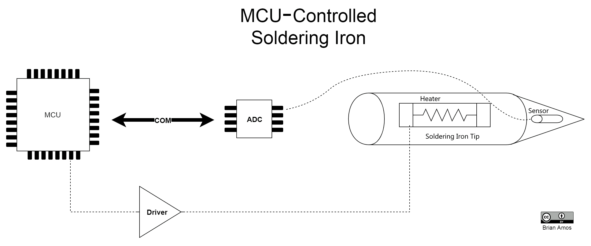
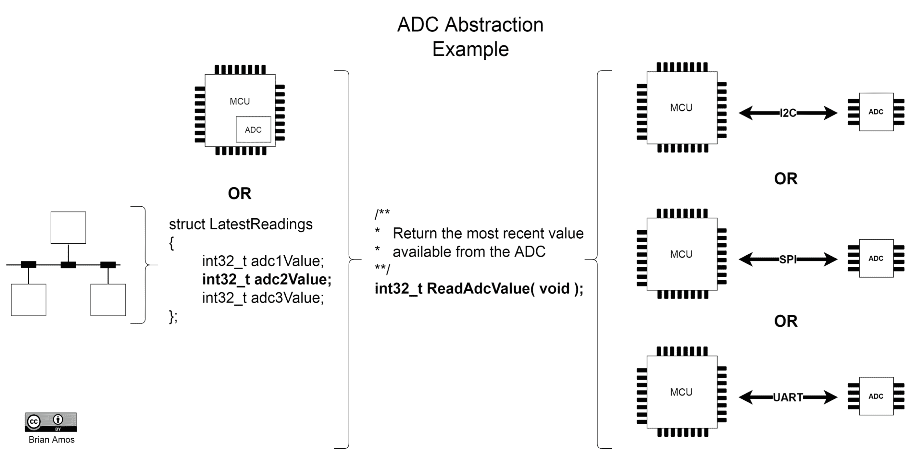
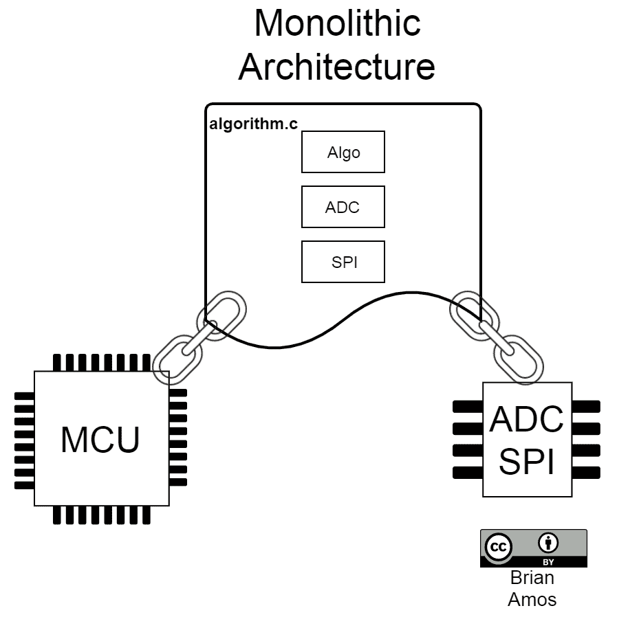
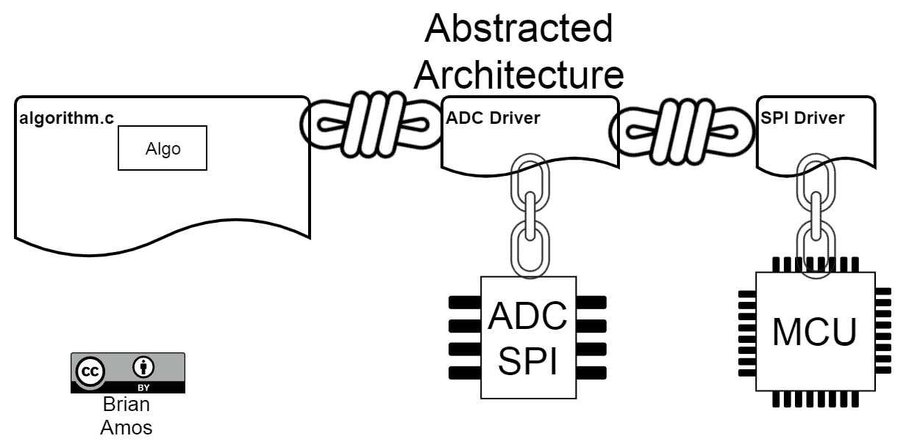
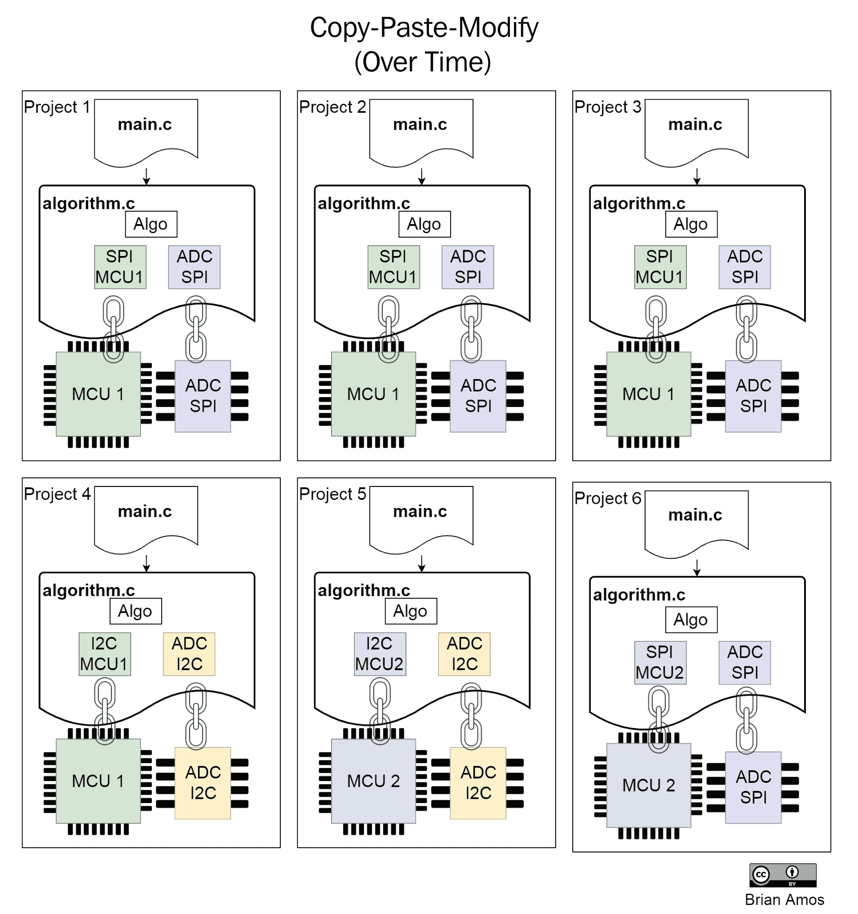
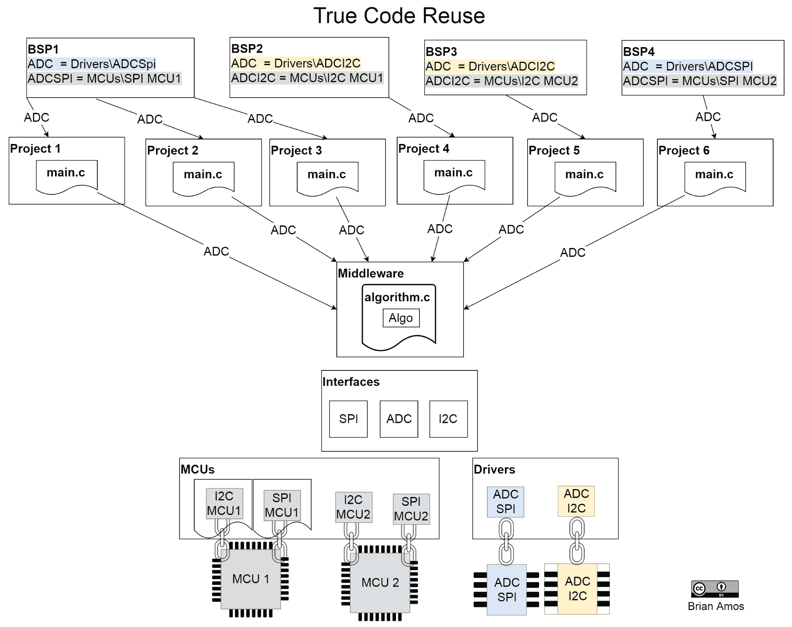
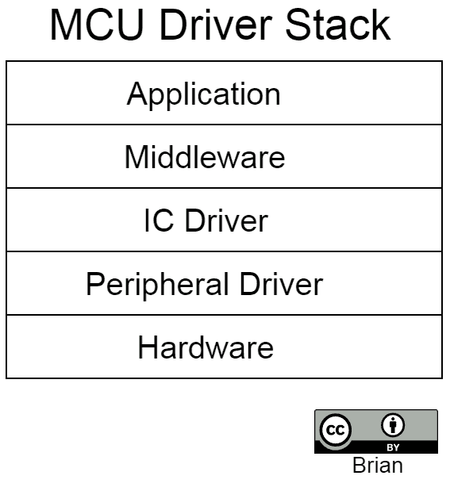

# 创建良好抽象架构的技巧

在整本书中，我们提供了简单且复杂度最低的示例。我们的重点是保持代码清晰易读，以说明正在处理的特定**实时操作系统**（**RTOS**）概念，并尽可能使与硬件的交互易于理解。然而，在现实世界中，最适合长期开发的代码库是那些允许开发者快速灵活且坚定地达成目标的代码库。本章提供了关于如何构建、创建、扩展和维护一个足够灵活的代码库的建议，以便长期使用。我们将通过清理早期章节中开发的一些代码，并增加灵活性和更好的可移植性到不同的硬件，来探索这些概念。

本章对任何对在多个项目中重用代码感兴趣的人都有价值。虽然这里提出的概念绝对不是原创的，但它们仅关注嵌入式系统中的固件。所涵盖的概念适用于裸机系统，以及高度可重用的基于 RTOS 的任务系统。通过遵循这里的指南，您将能够创建一个灵活的代码库，它能够适应许多不同的项目，无论它运行在什么硬件上。以这种方式构建代码库的另一个副作用（或直接意图）是代码的可测试性极高。

在本章中，我们将涵盖以下主题：

+   理解抽象

+   编写可重用代码

+   组织源代码

# 技术要求

要运行本章中介绍的代码，您需要以下内容：

+   Nucleo F767 开发板

+   微型 USB 线

+   STM32CubeIDE 和源代码（第五章，*选择 IDE*部分下的*设置我们的 IDE*说明）

+   SEGGER J-Link、Ozone 和 SystemView（第六章，*实时系统调试工具*中的说明）

本章的所有源代码可在[`github.com/PacktPublishing/Hands-On-RTOS-with-Microcontrollers/tree/master/Chapter_12`](https://github.com/PacktPublishing/Hands-On-RTOS-with-Microcontrollers/tree/master/Chapter_12)找到。

# 理解抽象

如果我们的目标是创建一个可以长期使用的代码库，我们需要灵活性。源代码（就像产品功能集和商业策略一样）并不是从石头上雕刻出来的——它往往会随着时间的推移而改变形态。如果我们的源代码要具有灵活性，它需要能够改变和适应。只有这样，它才能为实施产品（或整个产品线）的不同功能集提供一个坚实的基础，因为推动其发展的商业环境在变化。抽象是灵活性的核心原则。

在我们的上下文中，抽象意味着用一个可以应用于许多不同实例的表示来表示复杂实现的单个实例。例如，让我们再次看看第一章中的另一个早期例子，“实时系统简介”：



该图本身是闭环控制系统所需硬件的抽象表示。图中没有显示 ADC、驱动电路和**微控制器单元**（**MCU**）的确切部件编号；它们可以是任何东西。

在创建灵活的代码库时使用抽象至少有两个主要原因：

+   理解抽象很快。

+   抽象提供了灵活性。

# 理解抽象很快

理解代码中写得好的抽象与理解简单的流程图相似。正如你在观察流程图（而不是原理图）时不需要理解每个互连和电阻值一样，阅读一个抽象的、注释良好的头文件几乎可以提供使用任何底层实现所需的所有信息。没有必要陷入每个实现的细节和特性中。

这种有限的鸟瞰图意味着未来的开发者更有可能*消费*代码，因为它是以定义良好、文档齐全和一致的方式呈现的。掌握抽象所需的总知识和时间比从头开始实现相同功能所需的时间要少得多。

# 有抽象的例子

如果你看到了以下函数调用的调用，你很可能有机会猜出这个函数的功能，即使没有任何适当的注释：

```cpp
bufferX[i] = adcX->ReadAdcValue();
bufferY[i] = adcY->ReadAdcValue();
bufferZ[i] = adcZ->ReadAdcValue();
```

上述代码相当自解释——我们在读取 ADC 值并将它们存储在 3 个不同的缓冲区中。如果我们所有的获取 ADC 读数的调用都使用相同的`ReadAdcValue()`调用约定并描述性地命名 ADC 通道，理解代码就快而简单。

# 没有抽象的例子

反之，想象一下，如果你被给出了以下代码行（它们在功能上与前面的代码等效）：

```cpp
bufferX[i] = adc_avg(0, 1);
bufferY[i] = adc_avg(1, 1);
bufferZ[i] = HAL_ADC_GetValue(adc2_ch0_h);
```

这立即引发了一些问题，比如传递给`adc_avg()`和`HAL_ADC_GetValue()`的参数是什么。至少，我们可能需要找到相关的函数原型并阅读它们：

```cpp
/**
  * return an average of numSamp samples collected
  * by the ADC who's channel is defined by chNum
  * @param chNum channel number of the ADC 
  * @param numSamp number of samples to average
  * @retval avera 
**/
uint32_t adc_avg(uint8_t chNum, uint16_t numSamp);
```

好吧，所以`adc_avg()`将 ADC 通道作为第一个参数，将平均样本数作为第二个参数——将`1`传递给第二个参数提供单个读取。那么，关于对`HAL_ADC_GetValue(adc2_ch0_h)`的另一个调用呢？我们最好去找它的原型：

```cpp
/**
  * @brief Gets the converted value from 
  * data register of regular channel.
  * @param hadc pointer to a ADC_HandleTypeDef 
  * structure that contains
  * the configuration information for the 
  * specified ADC.
  * @retval Converted value
  */
uint32_t HAL_ADC_GetValue(ADC_HandleTypeDef* hadc)
```

结果表明`adc2_ch0_h`是一个句柄——可能是指 ADC2 STM32 外设上的通道`0`...现在，那个原理图在哪里...所有线路都连接正确吗？通道`0`真的应该存储在`bufferZ`中吗？这似乎有点奇怪...

好吧，这可能会有些牵强，但如果你编程时间足够长，你可能已经看到了更糟糕的情况。这里的要点是，一个好的抽象提供的一致性使得阅读代码比试图追踪和理解每个特定实现的细节要快得多和容易得多。

# 抽象提供灵活性

由于适当的抽象并没有直接与实现绑定，因此为功能创建抽象提供了在实现方式上的灵活性，尽管该功能的接口是一致的。在下面的图中，有五种不同的 ADC 值物理实现——都由相同的简单抽象表示，即`int32_t ReadAdcValue(void);`:



尽管函数调用保持一致，但 ADC 的实现可能会有很大的不同。仅在这个图中，就有五种不同的方式让 ADC 通过`ReadAdcValue`函数提供数据。ADC 可能位于本地通信总线（如 I2C、SPI 或 UART）上。它可能是一个存在于 MCU 本身的内部 ADC。或者，ADC 读取可能来自外部网络的远程节点。由于存在一致的抽象接口，底层实现并不那么重要。接口的消费者不需要关心配置 ADC、收集读取等所需的所有细节；ADC 只需要调用`ReadAdcValue`来访问最新的读取。

当然，这里需要考虑很多因素，例如阅读的时效性、收集速度的快慢、底层阅读的分辨率和缩放等。这些细节需要由每个实现抽象的提供者和消费者提供。自然，由于各种原因，这个层次的抽象在某些情况下可能不合适，这需要根据具体情况逐一评估。例如，如果每次读取新的数据时都需要运行一个算法，那么盲目地异步轮询`ReadAdValue`是不可靠的。

真实世界中有很多抽象的例子。假设你是一家制造许多不同产品的组织的开发者，这些产品都包含类似的核心组件。例如，如果你正在设计一个过程控制器系列，你很可能会与 ADC、DAC 和通信堆栈进行交互。每个控制器可能都有略微不同的用户界面功能集，但底层核心组件可以共享。ADC、DAC 和算法的驱动程序都可以共享通用代码。通过在多个产品之间共享通用代码，开发者只需编写一次通用代码。随着时间的推移，客户界面功能集发生变化时，可以根据需要替换个别组件，只要它们之间是松散耦合的。即使底层的 MCU 不需要相同，只要其硬件足够抽象，也是如此。

让我们以控制器中的 ADC 为例，更深入地了解一下。控制算法使用 ADC 读数的最简单方法是从设备中获取原始读数并直接使用它们。为了减少源文件的数量，ADC、通信外设和算法的驱动程序*可以*被合并到一个源文件中。

注意，对于精度应用，即使不考虑代码的优雅性和抽象，直接使用原始读数也存在许多问题。确保一致的缩放和偏移以及提供灵活的分辨率都更容易，当代码不直接与原始单位（ADC 计数）接口时。

当代码空间和 RAM 非常宝贵，或者只需要一个快速且简单的单次使用，或者只需要一个概念验证时，这种方法可能是可接受的。结果架构可能看起来像以下这样：



在查看这个架构时，应该有几个要点跳出来：

+   `algorithm.c` 文件与特定总线上特定 MCU 和特定 ADC 紧密耦合。

+   如果 MCU 或 ADC 中的任何一个发生变化，都需要创建一个新的 `algorithm.c` 版本。

+   MCU 和 ADC IC 链接之间的视觉相似性非常像链条。这不是偶然的。这种代码将 `algorithm.c` 内部的任何算法与底层硬件紧密绑定，这种方式非常不灵活。

也有一些副作用可能不那么明显：

+   `algorithm.c` 将非常难以（可能甚至不可能）独立于硬件运行。这使得在隔离状态下测试算法变得非常困难。这也使得测试所有仅在硬件出现问题时才会出现的边缘情况和错误条件变得非常困难。

+   `algorithm.c` 的直接有用寿命将限制在这个单个 MCU 和特定 ADC 上。要支持额外的 MCU 或 ADC IC，需要使用 `#define` 函数；否则，整个文件需要复制并修改。

另一方面，`algorithm.c`可以编写成不直接依赖于底层硬件。相反，它可以依赖于 ADC 的抽象接口。在这种情况下，我们的架构看起来更像这样：



在这个变体中需要观察的核心要点如下：

+   `algorithm.c`不直接依赖于任何特定的硬件配置。不同的 ADC 和 MCU 可以互换使用，前提是它们正确实现了所需的接口。这意味着它可以移动到完全不同的平台，并且无需修改即可使用。

+   链条已被绳索取代，这些绳索将抽象与其底层实现*绑定*在一起，而不是将`algorithm.c`紧密绑定到底层硬件。

+   只有实现与硬件紧密绑定。

一些不那么明显但同样值得提到的要点如下：

+   `ADC 驱动器`并非完全耦合到硬件。虽然这个特定的驱动器可能只支持单个 ADC，但 ADC 硬件本身对于使代码工作并非必需。可以通过模拟 SPI 流量来模拟硬件。这允许独立于底层硬件测试 ADC 驱动器。

+   `SPI 驱动器`和`ADC 驱动器`可以在其他应用中使用而无需重新编写。这对于编写可重用代码来说是一个很大的优势；它足够灵活，可以重新利用而无需额外的工作（或副作用）。

现在我们已经覆盖了一些抽象的例子，让我们考虑为什么使用抽象对于项目可能很重要。

# 抽象为什么重要

如果以下要点适用，确保您的架构正在使用抽象非常重要：

+   常用组件将在其他项目中重用。

+   可移植到不同硬件是可取的。

+   代码将进行单元测试。

+   团队将并行工作

对于是更大代码库一部分的项目，上述四个点通常都是可取的，因为它们都促进了中期上市时间的减少。它们还导致代码库的长期维护成本降低：

+   对于抽象，一次性创建高质量的文档比彻底记录每一块复杂的意大利面代码要容易得多，这些代码以略有不同的方式重新实现了相同的功能。

+   抽象提供了将硬件从项目中使用的许多其他接口中干净地解耦的方法。

+   抽象硬件接口使得单元测试代码更容易（允许程序员在他们的开发机器上而不是在目标硬件上运行单元测试）。

+   单元测试类似于一种始终更新的文档类型（如果它们定期运行）。它们提供了代码意图做什么的真相来源。它们还在进行更改或提供新实现时提供了一个安全网，确保没有忘记或意外更改任何内容。

+   一致的抽象使得代码库更容易被新团队成员快速理解。代码库中的每个项目都比上一个项目稍微熟悉一些，因为它们之间有很大的共同性和一致性。

+   松散耦合的代码更容易修改。理解一个良好封装的模块的心理负担远低于尝试理解跨越项目多个部分的庞大实现。对良好封装的模块的修改更有可能正确进行且没有副作用（尤其是在使用单元测试的情况下）。

当不使用抽象时，以下症状通常会发生：

+   新开发者很难进行修改，因为每次修改都会产生连锁反应。

+   新开发者需要很长时间才能足够理解一段代码，以便能够舒适地对其进行修改。

+   并行开发非常困难。

+   代码紧密耦合到特定的硬件平台。

对于需要抽象的真实世界示例，我们不需要再往远处看，FreeRTOS 本身就是一个例子。FreeRTOS 将所有设备特定的功能封装在两个文件中，`port.c`和`portmacros.h`。为了支持新的硬件平台，只需要创建/修改这些文件。FreeRTOS 的其他所有文件都只有一个副本，跨数十个不同硬件平台的端口共享。像 FatFs、lwIP 以及许多其他库也使用了硬件抽象；这是它们能够合理地为大量硬件提供支持的唯一方式。

# 识别代码复用的机会

在确定是否应该使用形式化的抽象（如果抽象尚未存在）时没有绝对规则可循。然而，有一些提示，如下所示：

+   **如果你正在编写可以被多个项目使用的代码**：应该通过抽象（前述章节中的 ADC 驱动程序和算法就是此类抽象的例子）与底层硬件进行接口。否则，代码将绑定到为其编写的特定硬件上。

+   **如果你的代码与特定供应商的 API 交互**：在其上方创建一个轻量级的抽象层将减少供应商锁定。在接口被普遍使用并设置之后，你将开始倾向于使特定供应商的 API 符合你的代码库，这使得尝试不同的实现变得快速且简单。这也有助于保护你的大部分代码免受供应商随时间对 API 所做的更改的影响。

+   **如果模块位于堆栈中心并与其他子模块交互**：使用形式化的接口将减少与其他模块的耦合，使得将来替换它们变得更容易。

关于代码复用的一个常见误解是，创建代码的副本与复用代码是相同的。如果已经创建了代码的副本，实际上它并没有被复用——让我们看看原因。

# 避免复制粘贴修改陷阱

因此，我们有一段经过验证的代码表现良好，而且我们有一个新的项目即将启动。我们应该如何创建这个新项目——只是复制工作项目并开始修改？毕竟，如果代码被复制，它就被重用了，对吧？随着时间的推移，创建这样的代码库副本可能会无意中积累大量的技术债务。问题不在于复制和修改代码的行为，而在于试图维护所有副本。

下面是查看`algorithm.c`在六个项目中的单体架构可能的样子。假设实际算法在所有六个项目中都是相同的：



下面是图中的一些主要点：

+   由于有六个文件副本，所以无法判断实际使用的算法是否相同。

+   在某些情况下，`algorithm.c`是用不同的硬件实现的。由于这些更改是在`algorithm.c`中进行的，所以很难不详细检查每个文件就判断所实现的算法是否真正相同。

现在，让我们来看看我们示例中复制粘贴修改的*缺点*：

+   如果`Algo`存在错误，它需要在六个不同的地方进行修复。

+   测试`Algo`的潜在修复需要为每个项目单独验证。唯一能够判断修复是否纠正了错误的方法可能是在实际硬件“系统内”进行测试；这可能是一个非常耗时的工作，并且可能技术上难以覆盖所有边缘情况。

+   分叉的`Algo`函数可能会随着时间的推移而发生变化（可能是无意中）；这将进一步使维护复杂化，因为检查实现之间的差异将变得更加困难。

+   由于六个项目之间存在细微的差异，错误更难找到、理解和修复。

+   创建项目 7 可能会伴随着很高的不确定性（很难确切地说`Algo`将引入哪些特性，`SPI`或`ADC`驱动程序将带来哪些复杂性/错误，等等）。

+   如果`MCU1`变得过时，`algorithm.c`的移植需要发生四次。

所有这些重复都可以通过为通用组件创建一致的、可重用的抽象来避免：

+   每个通用组件都需要有一个一致的*接口*。

+   任何打算重用的代码都应该使用*接口*而不是*实现（`Algo`将使用 ADC 接口）*。

+   通用驱动程序、接口和中间件应该只有一个副本。

+   通过使用**板级支持包**（**BSPs**）提供实现，这些包为所需的接口提供实现。

如果使用前面的指南设计相同的算法，我们可能会有更类似于以下的样子：



下面是图中的一些主要点：

+   `algorithm.c`只有一个副本——很明显，在所有六个项目中使用的算法是相同的。

+   尽管有六个项目，但只有四个 BSP 文件夹——`BSP1`在三个项目中已被重用。

+   `ADC`接口在公共位置（接口）中指定。

+   BSP 定义了 ADC 的实现，它与特定硬件相关联。这些实现被`main.c`使用，并传递给`algorithm.c`。

+   `Algo`引用的是`ADC`接口，而不是特定的实现。

+   `MCU1`和`MCU2`的`I2C`和`SPI`驱动程序只有一个副本。

+   基于 SPI 的 ADC 的驱动程序只有一个副本。

+   基于 I2C 的 ADC 的驱动程序只有一个副本。

重用代码有以下优点：

+   如果`Algo`存在错误，它只需要在一个地方修复。

+   尽管最终集成测试`Algo`仍然需要在系统内使用真实硬件（但可能只需要在四个 BSP 上进行，而不是所有六个项目），但大部分的测试和开发可以通过模拟 ADC 接口来完成，这既快又简单。

+   由于只有一个副本，`Algo`不可能随着时间的推移而发生变化。是否在项目之间使用了不同的算法总是很容易看出。

+   由于依赖项之间的相互依赖性降低，错误更容易被发现、理解和修复。`Algo`中的错误保证会在所有六个项目中出现（因为只有一个副本）。然而，由于在开发过程中测试`Algo`更容易，所以它出现的可能性较小，这得益于接口。

+   由于其他六个项目的一致性，创建项目 7 可能会非常快速和高效，具有很高的确定性。

+   如果`MCU1`过时，由于它没有直接依赖于 MCU——只有`ADC`接口，因此甚至不需要移植`algorithm.c`。相反，需要选择/开发不同的 BSP。

对于需要编写以支持类似但不同的硬件的极低级别代码，复制粘贴修改是一个例外。这通常是直接与 MCU 外围硬件寄存器接口的驱动级代码。当两个 MCU 系列共享相同的外围设备，只有细微差别时，尝试开发通用代码以实现它们可能会很有吸引力，但这通常会让每个人（包括原始作者和维护开发者）感到更加困惑。

在这些情况下，强制现有代码支持不同的硬件可能会非常耗时且容易出错，尤其是随着代码的陈旧和更多硬件平台的增加。最终，如果代码库足够老，新的硬件目标将会有显著的变化，以至于将那些更改纳入现有的底层代码将不再可行。只要底层驱动程序符合相同的接口，它们在长期内仍然具有相当大的价值。保持这种底层代码易于理解和无错误是最高的优先级，其次是符合一致的接口。

既然我们已经对抽象有了很好的理解，让我们更深入地看看一些现实世界的例子，了解如何编写易于重用的代码。

# 编写可重用代码

当你刚开始创建抽象时，可能很难确切知道应该抽象什么，以及应该直接使用什么。为了使代码完全可重用，模块应只执行一个功能并引用其他功能部分的接口。任何特定于硬件的调用都必须通过接口进行，而不是直接处理硬件。这适用于访问实际硬件（如特定引脚）以及 MCU 特定的 API（如 STM32 HAL）。

# 编写可重用驱动程序

在嵌入式开发中，存在几种不同级别的驱动程序，它们相当常见。MCU 外设驱动程序是用于为 MCU 上包含的硬件提供便利 API 的驱动程序。这些类型的驱动程序在第十章，*驱动程序和中断服务例程*中进行了开发。另一种常用的驱动程序是针对特定 IC 的驱动程序，这在先前的 ADC 示例中有所提及：



外设驱动程序位于硬件之上。IC 驱动程序位于堆栈中的外设驱动程序之上（并且通常使用它们）。如果一个 IC 驱动程序旨在跨多个 MCU 工作，它必须使用对底层 MCU 硬件完全无知的接口。例如，STM32 HAL 可以被视为一种外设驱动程序，但它不提供针对外设的 MCU 独立抽象。为了创建跨 MCU 可移植的 IC 驱动程序，它们必须只访问 MCU 独立接口。

# 开发 LED 接口

为了详细说明初始概念，让我们看看一个简单的驱动程序，自从本书中引入的第一个示例以来我们就一直在使用它——一个 LED 驱动程序。从早期章节中的第一个示例开始，我们就使用了简化版的驱动 Nucleo 板上 LED 的接口。这个接口位于 `BSP\Nucleo_F767ZI_GPIO.c/h`***.***。这段代码通过名为 `LED` 的结构体完全抽象了 LED 与底层硬件的关系。`LED` 结构体有两个函数指针：`On` 和 `Off`。正如预期的那样，这两个函数的目的是打开和关闭 LED。这种做法的美丽之处在于，调用代码根本不需要关心 LED 的实现。每个 LED 可能都有完全不同的硬件接口。它可能需要正逻辑或负逻辑来驱动外部晶体管，或者位于某种类型的串行总线上。LED 甚至可能位于一个远程面板上，需要通过 **远程过程调用** (**RPCs**) 到另一个完全不同的板。然而，无论 LED 是如何打开和关闭的，接口都是相同的。

为了尽量保持简单，`Nucleo_F767ZI_GPIO.c/h` 在头文件中定义了 LED 结构体。随着我们通过这个当前示例的进展，我们将从头文件中提取接口定义，使其完全独立，不需要任何外部依赖。没有依赖将保证我们可以将新的接口定义移动到完全不同的平台，而无需任何特定于特定 MCU 的代码。

我们新的、独立的 LED 接口将被称为 `iLED`。

小写 "i" 是一些 C++ 程序员用来表示只包含虚拟函数的类的一种约定，这实际上是一个接口定义。由于我们在这本书中只处理 C（不是 C++），我们将坚持使用结构体和函数指针来提供必要的解耦。这里概述的方法在概念上类似于 C++ 中的纯虚类。

接口定义在新的 `Interfaces***/***iLed.h` 文件中；内容的核心如下：

```cpp
typedef void (*iLedFunc)(void);

typedef struct
{
    //On turns on the LED - regardless of the driver logic
 const iLedFunc On;

    //Off turns off the LED, regardless of the driver logic
 const iLedFunc Off;
}iLed;
```

让我们具体分析一下前面的定义中正在发生的事情：

1.  我们创建了一个新的类型：`iLedFunc`。现在，`typedef void (*iLedFunc)(void);` 将 `iLedFunc` 类型定义为指向一个不接受任何参数且不返回任何内容的函数的函数指针。

1.  `iLed` 结构体被定义为任何其他结构体——我们现在可以创建这个结构体的实例。我们定义一个结构体是为了方便将所有的函数指针捆绑在一起，并传递对周围结构体的引用。

1.  每个 `iLedFunc` 成员都被定义为 `const`，因此它只能在定义时设置一次。这保护了我们（或其他开发者）免受意外覆盖函数指针值（这可能是灾难性的）的风险。编译器将捕获对 `On` 或 `Off` 函数指针的任何写入尝试，并抛出错误。

确保定义接口的头文件尽可能少地包含依赖项非常重要，以保持其尽可能松散耦合。这个文件包含的依赖项越多，未来的灵活性就越小。

接口定义到此结束。前面的代码没有提供任何功能；它只定义了一个接口。为了创建 `iLed` 接口的实现，我们还需要两个额外的文件。

以下是从 `ledImplementation.h` 的摘录：

```cpp
#include <iLed.h>
extern iLed BlueLed;
extern iLed GreenLed;
extern iLed RedLed;
```

此头文件引入了 `iLed.h` 接口定义并声明了三个 `iLed` 实例，分别是 `BlueLed`、`GreenLed` 和 `RedLed`。这些 `iLed` 接口的实现可以被任何包含 `ledImplementation.h` 的代码片段使用***。***`extern` 关键字确保无论多少不同的代码模块使用 `ledImplementation.h`，都只会创建一个副本。

接下来，我们需要为 `iLed` 实例提供定义；这是在 `ledImplementation.c` 中完成的。

这里只展示了 `GreenLed` 的代码。`BlueLed` 和 `RedLed` 的实现仅在它们设置的 GPIO 引脚上有所不同：

```cpp
void GreenOn ( void ) {HAL_GPIO_WritePin(GPIOB, GPIO_PIN_0, GPIO_PIN_SET);}
void GreenOff ( void ) {HAL_GPIO_WritePin(GPIOB, GPIO_PIN_0,
                                          GPIO_PIN_RESET);}
iLed GreenLed = { GreenOn, GreenOff };
```

分解来看，我们可以观察到以下内容：

1.  `GreenOn` 定义了一个内联函数，用于在 Nucleo 开发板上打开绿色 LED。它不接受任何参数也不返回任何内容，因此它可以作为 `iLedFunc` 使用，如前述代码中定义的那样。

1.  `GreenOff` 定义了一个内联函数，用于在 Nucleo 开发板上关闭绿色 LED。它也可以用作 `iLedFunc`。

1.  创建了一个名为 `GreenLed` 的 `iLed` 实例。在初始化期间传递了 `iLedFunc` 函数指针 `GreenOn` 和 `GreenOff`。`iLed` 中定义的函数顺序至关重要。由于 `On` 在 `iLed` 结构体中首先定义，因此传递的第一个函数指针（`GreenOn`）将被分配给 `On`。

到目前为止，唯一依赖于特定硬件的代码是 `ledImplementation.c`。

现在可以将指向 `GreenLed` 的指针传递给不同的代码片段，这些代码片段仅引入 `iLed.h`——它们不会以任何方式绑定到 `HAL_GPIO_WritePin`。一个例子是 `hardwareAgnosticLedDriver.c/h`。

以下是从 `hardwareAgnosticLedDriver.h` 的摘录：

```cpp
#include <iLed.h>
void doLedStuff( iLed* LedPtr );
```

此硬件无关驱动程序所需的唯一 `include` 函数是 `iLed.h`。

为了使 `hardwareAgnosticLedDriver.h` 真正实现硬件无关，它不能包含任何特定硬件的文件。它必须仅通过硬件无关的接口访问硬件，例如 `iLed`。

以下是一个简单的示例，它只是简单地打开或关闭单个 LED。摘录来自 `hardwareAgnosticLedDriver.c`：

```cpp
void doLedStuff( iLed* LedPtr )
{
    if( LedPtr != NULL )
    {
        if(LedPtr->On != NULL)
        {
              LedPtr->On();
        }

        if( LedPtr->Off != NULL )
        {
              LedPtr->Off();
        }
    }
}
```

分解来看，我们可以观察到以下内容：

1.  `doLedStuff` 接收一个指向 `iLed` 类型变量的指针作为参数。这允许将 `iLed` 接口的任何实现传递给 `doLedStuff`，从而在实现 `On` 和 `Off` 函数时提供完全的灵活性，而不会将 `hardwareAgnosticLedDriver` 绑定到任何特定硬件。

1.  如果你的接口定义支持通过设置指针为`NULL`来省略功能，那么它们需要被检查以确保它们没有被设置为`NULL`。根据设计，这些检查可能不是必需的，因为`On`和`Off`的值只能在初始化期间设置。

1.  通过使用`LedPtr`指针并像调用任何其他函数一样调用它们来调用`On`和`Off`的实际实现。

使用`doLedStuff`的完整示例可以在`mainLedAbstraction.c`中找到：

```cpp
#include <ledImplementation.h>
#include <hardwareAgnosticLedDriver.h>

HWInit();

while(1)
{
    doLedStuff(&GreenLed);
    doLedStuff(&RedLed);
    doLedStuff(&BlueLed);
}
```

分解来看，我们可以观察到以下内容：

1.  `GreenLed`、`RedLed`和`BlueLed`的实现是通过包含`ledImplementation.h`引入的。

1.  `doLedStuff`是通过包含`hardwareAgnosticLedDriver.h`引入的。

1.  我们通过传递指向所需`iLed`实例的指针来提供`doLedStuff`的实现。在这个例子中，我们通过将`GreenLed`、`RedLed`和`BlueLed`实现传递给`doLedStuff`来切换开发板上的每个绿色、红色和蓝色 LED。

这个示例只是简单地切换单个 LED，但复杂性是任意的。通过拥有定义良好的接口，可以创建接受接口实例指针的任务。这些任务可以在多个项目中重用，而无需修改它们的所有内容——当需要支持新的硬件时，只需创建接口的新实现即可。当硬件无关的任务实现了相当数量的代码时，这可以显著减少项目所花费的总时间。

让我们看看一个简单示例，将接口的实例传递到任务中。

# 重用包含任务的代码

RTOS 任务非常适合重用，因为（当编写得很好时）它们提供单一功能的功能，可以很容易地与其他系统必须执行的功能进行优先级排序。为了使它们能够长期轻松重用，它们需要尽可能少地直接与底层平台相关联。使用前面描述的接口对于这个目的非常有效，因为接口完全封装了所需的功能，同时将其与底层实现解耦。为了进一步简化 FreeRTOS 任务的设置，任务的创建可以封装在初始化函数中。

`mainLedTask.c`使用`ledTask.c/h`来展示这个示例。以下摘录来自`ledTask.h`：

```cpp
#include <iLed.h>
#include <FreeRTOS.h>
#include <task.h>

TaskHandle_t LedTaskInit( iLed* LedPtr, uint8_t Priority, uint16_t
                                                       StackSize);
```

关于这个简单头文件的一些重要说明如下：

+   只包含必要的文件，即用于 FreeRTOS 和`iLed.h`的文件，这些文件都不直接依赖于任何特定的硬件实现。

+   任务优先级作为初始化函数的参数引入。这对于灵活性很重要，因为随着时间的推移，LED 任务可能需要相对于系统其他功能的不同的优先级。

+   `StackSize`也是参数化的——这是必需的，因为根据`LedPtr`的底层实现，生成的任务可能需要使用不同数量的堆栈空间。

+   `LedTaskInit`返回`TaskHandle_t`，调用代码可以使用它来控制或删除生成的任务。

`ledTask.c`包含`LedTaskInit`的定义：

```cpp
TaskHandle_t LedTaskInit(iLed* LedPtr, uint8_t Priority, uint16_t StackSize)
{
  TaskHandle_t ledTaskHandle = NULL;
  if(LedPtr == NULL){while(1);}
  if(xTaskCreate(ledTask, "ledTask", StackSize, LedPtr, Priority, 
                 &ledTaskHandle) != pdPASS){while(1);}

  return ledTaskHandle;
}
```

此初始化函数执行与我们在`main`中通常看到的功能相同，但现在，它被整洁地封装到一个单独的文件中，可以在多个项目中使用。由`LedTaskInit`处理的函数包括以下内容：

+   检查`LedPtr`是否不是`NULL`。

+   创建一个运行`ledTask`函数的任务，并将`LedPtr`传递给它，这为该`ledTask`实例提供了`iLed`接口的特定实现。`ledTask`使用指定的`Priority`任务和`StackSize`创建。

+   在`LedTaskInit`返回创建的任务句柄之前，验证它是否已成功创建。

`ledTask.c`也包含`ledTask`的实际代码：

```cpp
void ledTask( void* LedPtr)
{
 iLed* led = (iLed*) LedPtr;
  while(1)
  {
 led->On();
    vTaskDelay(100);
 led->Off();
    vTaskDelay(100);
  }
}

```

首先，`LedPtr`需要从`void*`转换为`iLed*`。在此转换之后，我们能够调用我们的`iLed`接口的函数。底层硬件调用将取决于`LedPtr`的实现。这也是允许在初始化期间有`StackSize`变量的原因——在某些情况下，`LedPtr`可能有更复杂的实现，这可能需要更大的堆栈。

多亏了`LedTaskInit`，将`LedPtr`实现映射到任务中的任务创建变得极其简单。

以下是从`mainLedTask.c`摘录的内容：

```cpp
int main(void)
{
  HWInit();
  SEGGER_SYSVIEW_Conf();
  //ensure proper priority grouping for freeRTOS
  HAL_NVIC_SetPriorityGrouping(NVIC_PRIORITYGROUP_4);
  LedTaskInit(&GreenLed, tskIDLE_PRIORITY+1, 128);
 LedTaskInit(&BlueLed, tskIDLE_PRIORITY+2, 128);
 LedTaskInit(&RedLed, tskIDLE_PRIORITY+3, 128);
  vTaskStartScheduler();
```

`GreenLed`、`BlueLed`和`RedLed`被传递到`LedTaskInit`以创建三个具有不同优先级和可能不同堆栈大小的独立任务。所有特定于硬件的代码都已被保留在`ledTask.c/h`之外。当使用此技术处理复杂任务时，可以实现显著的时间节省和信心增加。沿着增加我们编写的代码的信心这一方向，让我们快速看一下提供抽象接口是如何使测试任务变得更容易的。

# 测试灵活的代码

由于`iLed`接口不直接依赖于任何硬件，因此将其替代实现推送到`ledTask`非常容易。我们不必传递`iLed`的实际硬件实现之一，而可以传递任何我们喜欢的内容到`LedTaskInit`（用于集成级测试）或`ledTask`（用于单元测试）。在这些情况下，实现可能会在调用时设置测试环境中的变量。例如，`On`在调用时可以将布尔值设置为`TRUE`，而`Off`可以将相同的布尔值设置为`FALSE`。这些类型的测试可以用来验证任务逻辑，而无需任何硬件，前提是在开发机上设置了编译器和替代环境。FreeRTOS 端口存在于桌面操作系统上，允许测试任务的相对优先级（没有实时保证）。这种方式无法测试特定的时序依赖，但它确实允许开发者对代码的中间层有相当大的信心。

请参阅*进一步阅读*部分，了解更详细地介绍单元测试的文章。

现在我们已经了解了如何编写可重用的代码，我们需要确保它以允许在多个项目中使用的方式存储，而不会创建不必要的副本或产生奇怪的跨项目依赖。

# 组织源代码

如果代码库打算随着时间的推移而演变和增长，一个良好的源代码树就极其重要。如果项目打算作为原子实体独立存在，彼此之间从不交互，那么在源代码控制方面制定策略就几乎没有理由；但如果代码重用是一个目标，那么明确了解特定项目应该如何与通用代码结合在一起是必须的。

# 选择源文件的位置

任何可能被用于最初创建它的项目之外的代码都应该位于一个通用位置（不与特定项目绑定）。即使代码最初是针对特定项目编写的，一旦被多个项目使用，就应该尽快将其移动。通用代码的片段对每个团队来说都可能不同，但可能包括以下内容：

+   **板级支持包（BSPs）**：通常为每个板创建多个固件。本书代码库中的 BSP 文件夹没有子文件夹（主要是因为在那里，代码只支持单个平台）。如果本书支持多个平台，BSP 文件夹可能会包含一个`Nucleo_F767`子文件夹。

+   **内部通用代码**：这可以包括针对特定领域定制的算法或用于多个产品或项目间常用的集成电路（IC）的驱动程序。这里的任何代码都应该能够很好地抽象化，并在多个微控制器（MCU）上使用。

+   **第三方通用代码**：如果多个项目包含第三方源代码，它们应该放在一个中心位置。例如 FreeRTOS 和其他中间件可以保存在这个中心位置。

+   **MCU 特定代码**：每个 MCU 系列理想情况下应该有自己的文件夹。这可能会包括 STM32 HAL 以及为该 MCU 开发的任何自定义外设驱动程序。理想情况下，这些 MCU 特定目录中引用的大多数代码将通过通用接口（如本章开头 ADC 示例中所示）来完成。

+   **接口定义**：如果广泛使用接口，将它们全部放在一个地方非常方便。

+   **项目文件夹**：每个项目可能都有自己的文件夹（有时包含子项目）。理想情况下，项目不会引用其他项目的代码——只有保存在公共区域的代码。如果项目开始有相互依赖性，退一步评估原因，并判断是否将那些依赖移动到公共位置是有意义的。

具体的文件夹结构可能会依赖于你的团队版本控制系统和分支策略。

# 应对变化

拥有众多项目中通用的代码的一个最大的缺点是变化的含义。目录结构的变化可能是最具挑战性的，特别是如果有很多项目。尽管痛苦，但随着团队需求和策略的变化，这种重构通常在一段时间后是必要的。进行定期检查和标记你的仓库应该就足够了，以确保目录重构变化虽然费时，但并不特别危险。

如果你来自高级语言，并听到“接口”这个词，你可能会立即想到第一次使用时就固定下来的东西。尽管保持接口一致性通常是好的，但有一些灵活性来更改它们（尤其是在刚开始时）。在这个特定用例中，内部接口比公共 API 更具宽容性，原因有几个：

+   几乎所有基于低级 MCU 的应用都将对给定的 *接口* 进行编译时检查。没有动态加载的库会在接口随时间变化时神秘地停止正常工作——（大多数）错误将在编译时被发现。

+   这些接口通常是内部的，具有对其使用位置的完全可见性，这使得评估潜在变化的影响成为可能。

对单个文件（如共享算法）的更改也是常见的关注点。在这里最好的建议是评估你所做的更改是否仍然提供相同的功能，或者它应该是一个扩展或全新的功能。有时，在孤立的项目中工作不会强迫我们明确地做出这些决定，但一旦那块代码被多个项目共享，风险就更高了。

# 摘要

在阅读本章后，你应该对代码重用为什么重要以及如何实现它有一个很好的理解。我们探讨了在嵌入式环境中使用抽象的细节，并创建了完全硬件无关的接口，这些接口增加了代码的灵活性。我们还学习了如何结合任务使用这些接口来增加项目间的代码重用。最后，我们简要讨论了存储共享源代码的一些方面。

到目前为止，你应该有足够的知识来开始思考如何将这些原则应用到自己的代码库和项目中。随着你的代码库开始拥有更多在项目间重用的公共代码，你将开始享受到共享代码库的好处，如更少的错误、更易于维护的代码和缩短的开发时间。记住，要擅长创建具有抽象接口的可重用代码需要实践。并不是所有的实现都需要同时迁移到完全可重用的组件，但开始这段旅程是很重要的。

现在我们对抽象有了背景知识，在下一章中，我们将通过更深入地研究队列如何用于提供松散耦合的架构来继续构建灵活的架构。

# 问题

在我们总结时，这里有一份问题列表，供你用来测试你对本章材料的理解。你将在附录的*评估*部分找到答案：

1.  创建抽象只是一种可以使用完整桌面操作系统来完成的事情：

    +   True

    +   False

1.  只有面向对象的代码，如 C++，才能从定义良好的接口中受益：

    +   True

    +   False

1.  提供了四个关于抽象重要性的例子。请说出其中一个。

1.  将代码复制到新项目中是重用代码的最佳方式：

    +   True

    +   False

1.  任务非常具体；它们不能在项目之间重用：

    +   True

    +   False

# 进一步阅读

+   要深入了解多层驱动程序，请参阅 TinyOS TEP101，它使用分层方法来处理驱动程序。本章中描述的接口方法与 TinyOS HPL、HAL 和 HIL 方法非常契合：[

    [`github.com/tinyos/tinyos-main/blob/master/doc/txt/tep101.txt`](https://github.com/tinyos/tinyos-main/blob/master/doc/txt/tep101.txt)

+   这里有一些额外的资源，应该会对你有所帮助：

    +   [`embeddedartistry.com/blog/2019/08/05/practical-decoupling-techniques-applied-to-a-c-based-radio-driver/`](https://embeddedartistry.com/blog/2019/08/05/practical-decoupling-techniques-applied-to-a-c-based-radio-driver/)

    +   [利用我们的构建系统支持可移植性](https://embeddedartistry.com/blog/2020/01/27/leveraging-our-build-systems-to-support-portability/)

    +   [为可移植性进行原型设计 - 轻量级架构策略](https://embeddedartistry.com/blog/2020/01/20/prototyping-for-portability-lightweight-architectural-strategies/)

    +   [单元测试 RTOS 依赖代码 - RTOS 测试双倍](https://blog.wingman-sw.com/archives/282)
