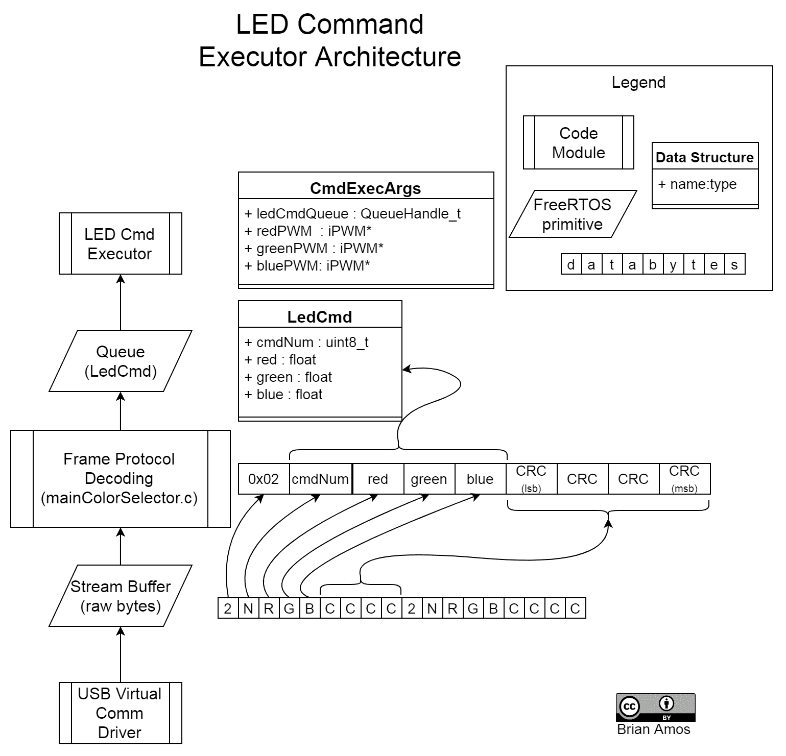
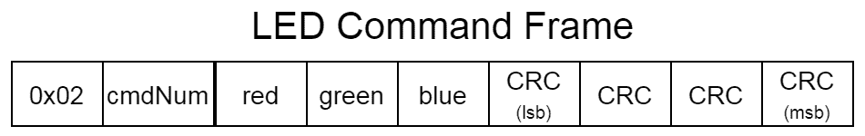
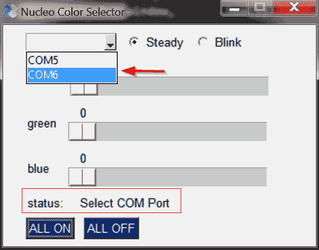
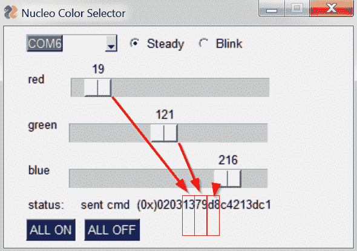
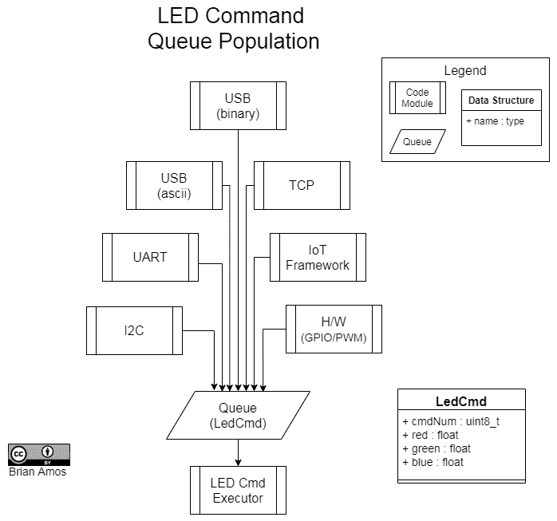

# 第十三章：使用队列创建松散耦合

现在我们已经讨论了如何为灵活性而架构源代码的方法，我们将更进一步，探讨如何使用队列来提供自然的数据交换接口定义。

在本章中，我们将开发一个简单的命令队列，可以从多个物理接口访问。到本章结束时，你将深刻理解为什么使用通用的队列定义是可取的，以及如何实现一个极其灵活的命令队列的两端。这将帮助你创建与底层硬件或物理接口无关的灵活架构。

在本章中，我们将涵盖以下主题：

+   理解队列作为接口

+   创建命令队列

+   为新目标重用队列定义

# 技术要求

为了完成本章中包含的动手实验，你需要以下设备：

+   Nucleo F767 开发板

+   Micro-USB 线

+   STM32CubeIDE 和源代码（有关说明，请访问第五章中的*设置我们的 IDE*部分，选择 IDE*）

+   SEGGER J-Link、Ozone 和 SystemView（有关说明，请访问第六章，*实时系统调试工具*）

+   Python >= 3.8

本章的所有源代码均可在[`github.com/PacktPublishing/Hands-On-RTOS-with-Microcontrollers/tree/master/Chapter_13`](https://github.com/PacktPublishing/Hands-On-RTOS-with-Microcontrollers/tree/master/Chapter_13)找到。

# 理解队列作为接口

如果你刚刚完成了上一章的阅读，你可能会注意到有许多技术可以用来一次性创建高质量的代码，然后在整个多个项目中重用相同的代码。就像使用抽象层是一种技术，可以增加代码在多个硬件平台间重用的可能性一样，使用队列作为接口也能增加代码被用于多个项目的可能性。

本章中提出的概念不仅限于队列——它们也适用于流和消息缓冲区。然而，由于队列自 FreeRTOS 开始以来就存在（并且是最常见的原始数据结构），我们将在示例中使用它们。让我们看看为什么使用队列是一个好主意。

# 队列是出色的接口定义

队列提供了一个非常清晰的抽象层次。为了通过队列传递数据并在另一侧获得期望的行为，所有数据都必须存在，并且发送方和接收方必须对数据格式有一个共同的理解。这条清晰的界限迫使人们进行深思熟虑，以确定需要传达的确切内容。有时，在实现单个功能时，这种积极思考的水平并不存在。队列提供的界限迫使人们进一步思考所需的确切信息及其格式。负责任的开发者更有可能确保这些类型的明确接口得到彻底的文档记录。

当将队列视为子系统的接口时，记录将要提供的功能以及使用子系统所需的精确格式是有益的。通常，接口定义得越好，重用的可能性就越大，因为它们更容易被理解。

# 队列增加了灵活性

队列以其简洁性而美丽——发送方将某物放入队列，而监控队列的任何任务都将接收数据并对其采取行动。发送方和接收方任务需要共享的唯一东西是用于与队列交互的代码以及通过队列流动的数据的定义。由于共享资源的列表如此之短，当使用队列时，自然会起到解耦的作用。

由于队列提供的清晰分离，功能的确切实现可能会随时间而改变。只要队列接口不变，同样的功能可以用许多不同的方式实现，这不会立即影响发送方。

这也意味着数据可以从任何地方发送到队列中；对物理接口没有明确的要求——只需要数据格式。这意味着队列可以被设计成从许多不同的接口接收相同的数据流，这可以提供系统级的灵活性。功能不需要绑定到特定的物理接口（如以太网、USB、UART、SPI、CAN 等）。

# 队列使测试变得更容易

与硬件抽象提供易于插入测试数据的位置的方式类似，队列也提供了极佳的测试数据输入点。这为开发中的代码提供了非常方便的测试数据输入点。前一部分提到的实现灵活性也适用于此处。如果一段代码正在向队列发送数据并期望从另一个队列获得响应，实际实现不一定需要使用——可以通过响应命令来模拟。这种方法使得在没有完全实现的功能（例如硬件或子系统仍在开发中）的情况下，开发代码的另一部分成为可能。这种方法在运行单元级测试时也非常有用；被测试的代码可以很容易地从系统其余部分隔离出来。

现在我们已经讨论了一些使用队列作为接口的原因，让我们通过一个示例来看看它是如何实现的。

# 创建命令队列

为了了解队列如何用于保持架构松散耦合，我们将查看一个通过 USB 接收命令并点亮 LED 的应用程序。虽然示例应用程序本身非常简单，但这里提出的概念具有极高的可扩展性。因此，无论命令只有几个还是几百个，都可以使用相同的方法来保持架构的灵活性。

此应用程序还展示了如何保持高级代码与底层硬件松散耦合的另一个示例。它确保 LED 命令代码仅使用定义的接口来访问**脉冲宽度调制**（**PWM**）实现，而不是直接与 MCU 寄存器/HAL 交互。该架构由以下主要组件组成：

+   **USB 驱动程序**：这是之前示例中已经使用过的相同的 USB 堆栈。`VirtualCommDriverMultiTask.c/h`已扩展以提供额外的流缓冲区，以有效地从 PC 接收数据（`Drivers/HandsOnRTOS/VirtualCommDriverMultiTask.c/h`）。

+   **iPWM**：为了描述非常简单的 PWM 功能（在`Chapter_13/Inc/iPWM.h`中定义），已创建了一个额外的接口定义（`iPWM`）。

+   **PWM 实现**：Nucleo 硬件的三个`iPWM`接口实现可以在`Chapter13/Src/pwmImplementation.c`和`Chapter13/Src/pwmImplementation.h`中找到。

+   **LED 命令执行器**：使用指向`iPWM`实现指针的状态机来驱动 LED 状态（`Chapter_13/Src/ledCmdExecutor.c`）。

+   `main`：将所有队列、驱动程序和接口连接在一起并启动 FreeRTOS 调度器的`main`函数（`Chapter_13/Src/mainColorSelector.c`）。

我们将详细讨论所有这些部分是如何组合在一起的以及它们的职责细节；但首先，让我们讨论将要放置在命令队列中的内容。

# 决定队列内容

当使用队列作为将命令传递到系统不同部分的方式时，重要的是要考虑队列实际上应该包含什么，而不仅仅是物理意义上可能通过线缆传递的内容。尽管队列可能用于持有具有头部和尾部信息的数据流的有效负载，但队列的实际内容通常只会包含解析后的有效负载，而不是整个消息。

使用这种方法可以在未来提供更大的灵活性，以便将队列重新定向到其他物理层工作。

由于 `LedCmdExecution()` 主要将操作 `iPWM` 指针以与 LED 接口，因此队列持有可以直接由 `iPWM` 使用的数据类型是方便的。

来自 `Chapter13/Inc/iPWM.h` 的 `iPWM` 定义如下：

```cpp
 typedef void (*iPwmDutyCycleFunc)( float DutyCycle );

 typedef struct
 {
   const iPwmDutyCycleFunc SetDutyCycle;
 }iPWM; 
```

这个结构体（目前）只包含一个单个函数指针：`iPwmDutyCycleFunc`。`iPwmDutyCycleFunc` 被定义为常量指针——在 `iPWM` 结构体初始化之后，指针不能被更改。这有助于保证指针不会被覆盖，因此不需要不断检查以确保它不是 `NULL`。

将函数指针包装在如 `iPWM` 这样的结构体中，可以在最小化重构的同时增加额外的功能。我们将能够传递一个指向 `iPWM` 结构体的单个指针到函数中，而不是单独的函数指针。

如果你正在创建一个将与其他开发者共享的 *接口* 定义，那么在团队中协调和沟通更改非常重要！

`DutyCycle` 参数定义为 `float`，这使得在与具有不同底层分辨率的硬件接口时保持接口一致性变得容易。在我们的实现中，MCU 的定时器 (`TIM`) 外设将被配置为具有 16 位分辨率，但实际与 `iPWM` 接口的代码不需要关心可用的分辨率；它只需将所需的输出从 `0.00`（关闭）映射到 `100.00`（开启）即可。

对于大多数应用来说，`int32_t` 比浮点数更受欢迎，因为它有统一的表示形式，并且更容易序列化。这里使用浮点数是为了更容易看到数据模型与通信之间的差异。此外，大多数人倾向于将 PWM 视为一个百分比，这自然地映射到 `float`。

在决定 `LedCmd` 包含哪些数据时有两个主要考虑因素：

+   `ledCmdExecutor` 将直接处理 `iPWM`，因此将浮点数存储在 `LedCmd` 中是有意义的。

+   我们还希望我们的 LED 控制器具有不同的操作模式，因此它还需要一种传递这些信息的方式。这里只有少数几个命令，所以一个 `uint8_t` 8 位无符号整数是一个很好的选择。每个 `cmdNum` 情况将由 `enum` 表示（稍后展示）。

这导致了 `LedCmd` 的以下结构：

```cpp
typedef struct
{
  uint8_t cmdNum;
  float red;
  float green;
  float blue;
}LedCmd;
```

**LED 命令执行器**的主要接口将是一个`LedCmd`队列。状态变化将通过在队列中写入新值来执行。

由于这个结构只有 13 个字节，我们将直接按值传递。通过引用（结构指针）传递会更快，但它也复杂化了数据的所有权。这些权衡在第九章，*任务间通信*中进行了讨论。

现在我们已经定义了数据模型，我们可以看看这个应用程序的其余组件。

# 定义架构

命令执行器架构由三个主要块组成；每个块异步于其他块执行并通过队列和流缓冲区进行通信：

+   **LED 命令执行器**：`ledCmdExecutor.c`中的`LedCmdExecution`从`ledCmdQueue`接收数据，并通过`iPWM`（每个颜色一个）指针激活 LED。`LedCmdExecution`是一个 FreeRTOS 任务，在创建时以`CmdExecArgs`作为参数。

+   **帧协议解码**：`mainColorSelector.c`从由 USB 虚拟通信驱动程序填充的流缓冲区接收原始数据，确保有效的帧结构，并填充`LedCmd`队列。

+   **USB 虚拟通信驱动程序**：USB 堆栈分布在许多文件中；主要用户入口点是`VirtualCommDriverMultiTask.c`。

下面是所有这些主要组件如何堆叠和协同工作的视觉表示。主要块列在左侧，而它们操作的数据表示在右侧：



让我们更详细地看看这些组件。

# ledCmdExecutor

`ledCmdExecutor.c`实现了一个简单的状态机，其状态在接收到队列中的命令时被修改。

可用的命令通过`LED_CMD_NUM`显式枚举。每个*命令*都已被赋予一个便于理解枚举，并附有明确的定义。枚举被显式定义，以便在 PC 端正确枚举。我们还需要确保分配的数字 <= 255，因为我们只会在帧中为命令号分配 1 个字节：

```cpp
typedef enum
{
  CMD_ALL_OFF = 0,
  CMD_ALL_ON = 1,
  CMD_SET_INTENSITY = 2,
  CMD_BLINK = 3
}LED_CMD_NUM;
```

唯一的公共函数是`LedCmdExecution`，它将被用作 FreeRTOS 任务：`void LedCmdExecution(void* Args)`。

`void* Args`实际上有一个类型为`CmdExecArgs`。然而，FreeRTOS 任务函数签名需要一个`void*`类型的单个参数。传递给`LedCmdExecution`的实际数据类型是这个结构的指针：

```cpp
typedef struct
{
  QueueHandle_t ledCmdQueue; 
  iPWM * redPWM;
  iPWM * bluePWM;
  iPWM * greenPWM;
}CmdExecArgs;
```

传递所有引用允许创建和同时运行多个任务实例。它还提供了对底层`iPWM`实现的极度松耦合。

`LedCmdExecution`有几个局部变量来跟踪状态：

```cpp
LED_CMD_NUM currCmdNum = CMD_ALL_OFF;
bool ledsOn = false;
LedCmd nextLedCmd;
param_assert(Args == NULL);
CmdExecArgs args = *(CmdExecArgs*)Args;
```

让我们更详细地看看这些变量：

+   `currCmdNum`：当前正在执行命令的本地存储。

+   `ledsOn`：由`blink`命令使用的本地存储，用于跟踪状态。

+   `nextLedCmd`：存储从队列中来的下一个命令。

+   `args`: 一个局部变量，包含通过我们的任务`void* Args`参数传入的参数（注意显式的类型转换和检查以确保没有传入`NULL`）。

为了确保没有指针发生变化，我们正在创建一个局部副本。这也可以通过定义`CmdExecArgs`结构体来包含只能初始化时设置的`const`变量，以节省一些空间来实现。

此主循环有两个职责。第一个职责，如以下代码所示，是将`ledCmdQueue`中的值复制到`nextLedCmd`读取中，设置适当的局部变量和 LED 的占空比。

`ledCmdExecutor.c`是主循环的一部分：

```cpp
if(xQueueReceive(args.ledCmdQueue, &nextLedCmd, 250) == pdTRUE)
{
    switch(nextLedCmd.cmdNum)
    {
        case CMD_SET_INTENSITY:
            currCmdNum = CMD_SET_INTENSITY;
            setDutyCycles( &args, nextLedCmd.red, 
                           nextLedCmd.green, nextLedCmd.blue);
            break;
        case CMD_BLINK:
            currCmdNum = CMD_BLINK;
            blinkingLedsOn = true;
            setDutyCycles(&args, nextLedCmd.red, 
                            nextLedCmd.green, nextLedCmd.blue);
            break;
        //additional cases not shown
    }
}
```

主循环的第二部分，如以下代码所示，在 250 个 tick（250 ms，因为我们的配置使用 1 kHz 的 tick）内没有从`ledCmdQueue`接收到命令时执行。此代码在最后命令的占空比和`OFF`之间切换 LED：

`ledCmdExecutor.c`是主循环的第二部分：

```cpp
else if (currCmdNum == CMD_BLINK)
{
    //if there is no new command and we should be blinking
    if(blinkingLedsOn)
    {
        blinkingLedsOn = false;
        setDutyCycles(&args, 0, 0, 0);
    }
    else
    {
        blinkingLedsOn = true;
        setDutyCycles(  &args, nextLedCmd.red, 
                        nextLedCmd.green, nextLedCmd.blue);
    }
}
```

最后，`setDutyCycles`辅助函数使用`iPWM`指针来激活 LED 的 PWM 占空比。在主循环之前已经验证了`iPWM`指针不是`NULL`，因此不需要在这里重复检查：

```cpp
void setDutyCycles( const CmdExecArgs* Args, float RedDuty,                            float GreenDuty, float BlueDuty)
{
  Args->redPWM->SetDutyCycle(RedDuty);
  Args->greenPWM->SetDutyCycle(GreenDuty);
  Args->bluePWM->SetDutyCycle(BlueDuty);
}
```

这就完成了我们 LED 命令执行器的高级功能。创建此类任务的主要目的是为了说明创建一个极其松散耦合且可扩展的系统的方法。虽然以这种方式切换几个 LED 很愚蠢，但这种设计模式完全可以扩展到复杂系统，并且可以在不同的硬件上使用而无需修改。

现在我们已经对代码在高级上做了了解，让我们看看`LedCmd`结构体是如何填充的。

# 帧解码

当 USB 上的数据到来时，USB 堆栈将其放置在流缓冲区中。可以从前面的`GetUsbRxStreamBuff()`在`Drivers/HandsOnRTOS/VirtualCommDriverMultiTask.c`中访问传入数据的`StreamBuffer`函数：

```cpp
StreamBufferHandle_t const * GetUsbRxStreamBuff( void )
{
  return &vcom_rxStream;
}
```

此函数返回一个指向`StreamBufferHandle_t`的常量指针。这样做是为了让调用代码可以直接访问流缓冲区，但不能更改指针的值。

该协议本身是一个严格二进制流，以 0x02 开始，以 CRC-32 校验和结束，以小端字节顺序传输：



有许多不同的方式来序列化数据。这里为了简单起见选择了一个简单的二进制流。应该考虑以下几点：

+   `0x02`头是一个方便的分隔符，可以用来找到（可能的）帧的开始。它并不足够独特，因为消息中的任何其他字节也可以是`0x02`（它是一个二进制流，不是 ASCII）。末尾的 CRC-32 提供了帧正确接收的保证。

+   由于每个 LED 值正好有 1 个字节，我们可以用 0-255 来表示 0-100%的占空比，并且我们保证有有效的、范围内的参数，无需任何额外的检查。

+   这种简单的帧方法非常僵化，并且完全没有任何灵活性。当我们需要通过电线发送其他东西时，我们就回到了起点。如果需要灵活性（并且更复杂），就需要一个更灵活的序列化方法。

`frameDecoder`函数定义在`mainColorSelector.c`中：

```cpp
void frameDecoder( void* NotUsed)
{
  LedCmd incomingCmd;
  #define FRAME_LEN 9
  uint8_t frame[FRAME_LEN];
  while(1)
  {
    memset(frame, 0, FRAME_LEN);
    while(frame[0] != 0x02)
    {
      xStreamBufferReceive( *GetUsbRxStreamBuff(), frame, 1,
                                             portMAX_DELAY);
    }
    xStreamBufferReceive( *GetUsbRxStreamBuff(),
      &frame[1],
      FRAME_LEN-1,
      portMAX_DELAY);
    if(CheckCRC(frame, FRAME_LEN))
    {
      incomingCmd.cmdNum = frame[1];
      incomingCmd.red = frame[2]/255.0 * 100;
      incomingCmd.green = frame[3]/255.0 * 100;
      incomingCmd.blue = frame[4]/255.0 * 100;
      xQueueSend(ledCmdQueue, &incomingCmd, 100);
    }
  }
}
```

让我们逐行分析：

+   创建了两个局部变量，`incomingCmd`和`frame`。`incomingCmd`用于存储完全解析的命令。`frame`是一个字节缓冲区，用于在函数解析/验证时存储恰好一个帧的数据：

```cpp
LedCmd incomingCmd;
#define FRAME_LEN 9
uint8_t frame[FRAME_LEN];
```

+   在循环开始时，`frame`的内容被清除。仅清除第一个字节是严格必要的，这样我们才能准确地检测到`0x02`，因为帧是二进制并且有明确的长度（只有可变长度的字符串*需要*以空字符终止）。然而，如果在调试过程中查看变量，看到`0`对于未填充的字节来说非常方便：

```cpp
memset(frame, 0, FRAME_LEN);
```

+   从`StreamBuffer`函数中复制一个字节到帧中，直到检测到`0x02`。这应该表示帧的开始（除非我们不幸在帧的中间开始获取数据，而有效载荷或 CRC 中的二进制值为`0x02`）：

```cpp
 while(frame[0] != 0x02)
 {
     xStreamBufferReceive( *GetUsbRxStreamBuff(), frame, 1, 
                                            portMAX_DELAY);
 }
```

+   帧的剩余字节从`StreamBuffer`接收。它们被放置在`frame`数组正确的索引位置：

```cpp
xStreamBufferReceive( *GetUsbRxStreamBuff(), &frame[1], 
                           FRAME_LEN-1, portMAX_DELAY);
```

+   对整个帧的 CRC 进行评估。如果 CRC 无效，则丢弃这些数据，并开始寻找下一个帧的开始：

```cpp
if(CheckCRC(frame, FRAME_LEN))
```

+   如果帧是完整的，`incomingCmd`将填充帧中的值：

```cpp
 incomingCmd.cmdNum = frame[1];
 incomingCmd.red = frame[2]/255.0 * 100;
 incomingCmd.green = frame[3]/255.0 * 100;
 incomingCmd.blue = frame[4]/255.0 * 100;
```

+   被填充的命令被发送到队列中，该队列正被`LedCmdExecutor()`监视。在命令被丢弃之前，可能需要等待多达`100`个 tick，以等待队列中有可用空间：

```cpp
 xQueueSend(ledCmdQueue, &incomingCmd, 100);
```

重要的一点是，没有任何帧协议被放置在`LedCmd`中，它将通过队列发送——只有有效载荷。这允许在数据入队之前有更多的灵活性，正如我们将在*为新的目标重用队列定义*部分中看到的那样。

选择队列中可用的槽位数可以对应用程序对传入命令的响应产生重要影响。可用的槽位越多，命令在执行前发生显著延迟的可能性就越高。对于需要更多确定性来决定何时（以及是否）执行命令的系统，将队列长度限制为仅一个槽位并基于命令是否成功入队进行协议级确认是一个好主意。

现在我们已经看到了帧是如何被解码的，剩下的唯一一个谜团是如何将数据放入 USB 接收流缓冲区中。

# USB 虚拟通信驱动程序

USB 的接收`StreamBuffer`由`Drivers/HandsOnRTOS/usbd_cdc_if.c`中的`CDC_Receive_FS()`填充。这看起来与第十一章中的代码类似，*在任务间共享硬件外围设备，*其中驱动程序的发送端被开发出来：

```cpp
static int8_t CDC_Receive_FS(uint8_t* Buf, uint32_t *Len)
{
  /* USER CODE BEGIN 6 */
  portBASE_TYPE xHigherPriorityTaskWoken = pdFALSE;

  USBD_CDC_SetRxBuffer(&hUsbDeviceFS, &Buf[0]);
  xStreamBufferSendFromISR( *GetUsbRxStreamBuff(),
        Buf,
        *Len,
        &xHigherPriorityTaskWoken);

  USBD_CDC_ReceivePacket(&hUsbDeviceFS);
  portYIELD_FROM_ISR(xHigherPriorityTaskWoken);
  return (USBD_OK);
  /* USER CODE END 6 */
}
```

使用流缓冲区而不是队列，允许从 USB 堆栈的内部缓冲区复制更大的内存块，同时提供一个类似队列的接口，该接口在从其中复制字节数量方面具有灵活性。这种灵活性是编写协议层如此直接的一个原因。

记住，由于使用了流缓冲区，因此只能指定一个任务作为指定的读取器。否则，必须对流缓冲区的访问进行同步（即，通过互斥锁）。

这就完成了这个例子中所有 MCU 端代码的封装。由于这个例子依赖于 USB 上的二进制协议，让我们看看代码是如何使用的。

# 使用代码

选择这个例子的一个目标是为了有一个易于接近、与实际应用相关的用例。大多数情况下，我们开发的嵌入式系统的用例并不包括有人在终端模拟器上键入。为此，使用 Python 创建了一个非常简单的 GUI，以便简单地向 Nucleo 板发送命令。脚本位于`Chapter_13/PythonColorSelectorUI/colorSelector.py`。

还包括了一个 Windows 可执行文件（`Chapter_13/PythonColorSelectorUI/colorSelector.exe`）。`.exe`不需要安装 Python。对于其他操作系统，您需要安装`Chapter_13/PythonColorSelectorUI/requirements.txt`中列出的必需软件包，并运行 Python 3 解释器来使用脚本：

1.  首先，您需要选择 STM 虚拟通信端口：



1.  在端口成功打开后，使用滑块和各种按钮来控制 Nucleo 开发板上的 LED。在每次 UI 更新事件中构建一个命令帧，并立即通过 USB 发送到 MCU。显示的是最后发送帧的 ASCII 编码十六进制转储：



或者，也可以使用能够发送二进制数据的终端应用程序（例如，Windows 上的 RealTerm）。

因此，我们有一些闪烁的灯光和一个（不那么）闪亮的用户界面。让我们来谈谈这个练习的真正收获——通过以我们这样做的方式使用队列，我们为我们的应用程序构建了灵活性。

# 重复使用队列定义以用于新目标

表面上，可能难以欣赏这种设置有多灵活。在命令输入方面，我们能够从任何地方获取命令，而不仅仅是 USB 上的二进制帧协议。由于放入队列中的数据被抽象化，不包括任何特定协议的信息，因此底层协议可以更改，而无需对下游进行任何更改。

让我们看看几个例子：

+   我们可以为解析传入的数据编写不同的例程，该例程使用以逗号分隔的 ASCII 字符串，其中占空比由 0 到 100 之间的百分比表示，并以换行符结束的基于字符串的枚举：`BLINK, 20, 30, 100\n`。这将导致以下值被放置在`ledCmdQueue`中：

```cpp
LedCmd cmd = {.cmdNum=3, .red=20, .blue=30, .green=100};
xQueueSend(ledCmdQueue, &cmd, 100);
```

+   底层接口可以完全改变（从 USB 到 UART、SPI、I2C、以太网、物联网框架等）。

+   命令可以是非序列化的数据源的形式（例如离散的占空比或 MCU 的物理引脚）：



没有任何理由让队列仅限于由单个任务填充。如果从系统设计角度来看是有意义的，命令执行器的队列可以由任何数量的同时源填充。将数据输入系统的可能性确实是无限的，这是一个好消息——特别是如果你正在开发一个相当复杂的将在多个系统中使用的产品。你可以自由地投资时间编写一次高质量的代码，因为确切的代码将在多个应用程序中使用，因为它足够灵活，可以适应同时保持一致的接口。

ledCmd 执行器有两个组件提供了灵活性——队列接口和`iPWM`接口。

# 队列接口

在`LedCmdExecution()`任务启动后，它与系统中的高级代码的唯一交互是通过其命令队列。正因为如此，我们可以自由地更改底层实现，而不会直接影响到高级代码（只要通过队列传递的数据具有相同的意义）。

例如，闪烁可以以不同的方式实现，而向队列提供数据的任何代码都不需要更改。由于通过队列传递数据的要求仅为`uint8_t`和三个浮点数，我们也可以完全重写`LedCmdExecution`（例如，没有`iPWM`接口）的实现。这种更改只会影响启动任务的单个文件——在这个例子中是`mainColorSelector.c`。任何直接处理队列的其他文件将不受影响。如果有多个源向队列提供数据（例如 USB、I2C、物联网框架等），即使完全更改了底层的`LedCmdExecution`实现，这些源也不需要修改。

# iPWM 接口

在这个实现中，我们通过使用灵活的接口来驱动 LED（`iPWM`）进一步提高了灵活性。由于所有调用（如`setDutyCycles`）都是由灵活的接口定义的（而不是直接与硬件交互），我们可以自由地用任何其他`iPWM`实现替换这里包含的 MCU 的`TIM`外围实现。

例如，`iPWM`接口另一端的 LED 可能是一个通过串行接口驱动的可寻址 LED，它需要一个串行数据流而不是 PWM。它甚至可能位于远程位置，并需要另一个协议来激活它。只要它可以表示为 0 到 100 之间的百分比，就可以通过此代码来控制。

现在——现实地讲——在现实世界中，你不太可能为了闪烁几个 LED 而费这么大的劲！记住，这是一个具有相当简单功能性的示例，所以我们能够将注意力集中在实际的架构元素上。在实践中，灵活的架构为构建长期存在的、可适应的代码库提供了基础。

所有这些灵活性都伴随着一个警告——始终要小心你正在设计的系统，并确保它们满足其主要要求。总会有一些权衡，无论是性能、初始开发时间、BOM 成本、代码优雅性、闪存空间还是可维护性之间的权衡。毕竟，一个美丽可扩展的设计如果无法适应可用的 ROM 和 RAM，对任何人都没有好处！

# 摘要

在本章中，你获得了创建简单端到端命令执行器架构的第一手经验。此时，你应该非常熟悉创建队列，并且已经开始更深入地了解它们如何被用来实现特定的设计目标，例如灵活性。你可以将这些技术的变体应用于许多实际项目。如果你特别有冒险精神，可以自由地实现建议的协议之一或添加另一个接口的入口点（例如 UART）。

在下一章中，我们将改变节奏，讨论 FreeRTOS 的可用的 API，探讨何时以及为什么你可能更喜欢其中一个而不是另一个。

# 问题

在我们总结时，这里有一份问题列表，供你测试对本章材料的了解。你将在附录的*评估*部分找到答案：

1.  队列减少了设计灵活性，因为它们创建了一个必须遵守的、对数据传输的严格定义：

    +   正确

    +   错误

1.  队列与其他抽象技术不兼容；它们必须只包含简单的数据类型：

    +   正确

    +   错误

1.  当使用从串行端口获取的命令的队列时，队列是否应该包含与底层序列化数据流完全相同的信息和格式？为什么？

1.  列出一个原因，说明为什么通过值传递数据到队列比通过引用传递更简单。

1.  列出一个原因，说明为什么在实时嵌入式系统中仔细考虑队列的深度是必要的？
