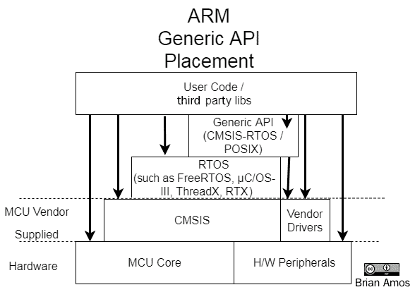
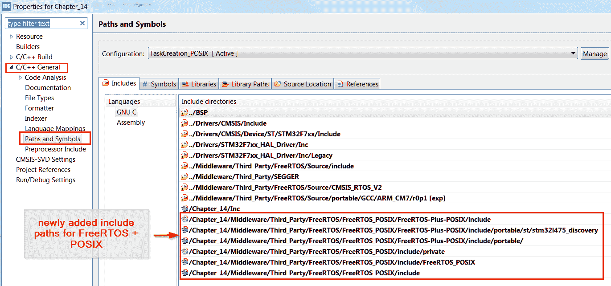

# 选择 RTOS API

到目前为止，我们一直在所有示例中使用本地的 FreeRTOS API。然而，这并不是使用 FreeRTOS 的唯一 API。有时，在开发代码时可能会有次要目标——它可能需要在其他项目（这些项目使用基于其他 MCU 的嵌入式操作系统）中重用。有时，代码需要与功能齐全的操作系统互操作。你也可能希望利用为全操作系统之前开发的代码。为了支持这些目标，除了本机 API 之外，还有两个其他 API 值得考虑——CMSIS-RTOS 和 POSIX。

在本章中，我们将研究这三个 API 在基于 FreeRTOS 创建应用程序时的功能、权衡和限制。

本章涵盖了以下主题：

+   理解通用的 RTOS API

+   比较 FreeRTOS 和 CMSIS-RTOS

+   比较 FreeRTOS 和 POSIX

+   决定使用哪个 API

# 技术要求

要完成本章的动手练习，你需要以下设备：

+   一块 Nucleo F767 开发板

+   一条微型 USB 线

+   STM32CubeIDE 和源代码（有关说明，请访问第五章，*选择 IDE*，并阅读*设置我们的 IDE*部分）

+   SEGGER JLink、Ozone 和 SystemView（有关说明，请阅读第六章，*实时系统的调试工具*）

本章的所有源代码均可在以下链接中找到：[`github.com/PacktPublishing/Hands-On-RTOS-with-Microcontrollers/tree/master/Chapter_14`](https://github.com/PacktPublishing/Hands-On-RTOS-with-Microcontrollers/tree/master/Chapter_13)。

# 理解通用 RTOS API

RTOS API 定义了用户在使用 RTOS 时与之交互的编程接口。本机 API 公开 RTOS 的所有功能。到目前为止，在这本书中，我们只使用了本机 FreeRTOS API。这样做是为了使查找给定函数的帮助更容易，并排除在 FreeRTOS 和通用 API 之间存在表现不佳的包装层的任何可能性。然而，这并不是 FreeRTOS 的唯一 API 选项。还有可用的通用 API，可以用来与 RTOS 功能接口——但它们不是绑定到特定 RTOS，而是可以在多个操作系统之间使用。

这些通用 API 通常作为本机 RTOS API（RTX 是例外，它只有 CMSIS-RTOS API）之上的包装层实现。在这里，我们可以看到典型 API 在通用**ARM**固件堆栈中的位置：



如前图中的箭头所示，没有单一的抽象可以阻止用户代码访问最低级别的功能。每一层都添加了另一个潜在的 API，而较低级别的功能仍然可用。

有两个通用的 API 可以用来访问 FreeRTOS 功能的一部分：

+   **CMSIS-RTOS**：ARM 定义了一个针对 MCU 的无供应商 API，称为 **Cortex 微控制器软件接口-RTOS**（CMSIS-RTOS）。

+   **POSIX**：**可移植操作系统接口**（**POSIX**）是另一个在多个供应商和硬件中常见的通用接口的例子。这个 API 更常用于全通用操作系统，如 Linux。

我们将在本章中深入讨论这些通用 API。但首先，让我们看看它们的优缺点。

# 通用 API 的优点

使用通用的 RTOS API，如 CMSIS-RTOS 或 POSIX，为程序员和中间件供应商提供了几个好处。程序员可以编写一次代码，然后在多个 MCU 上运行，只需对应用程序代码进行少量或没有更改，就可以根据需要更改 RTOS。中间件供应商也能够编写他们的代码以与单个 API 交互，然后支持多个 RTOS 和硬件。

如您可能从之前的图中注意到的那样，CMSIS-RTOS 和 POSIX API 不需要独占访问 FreeRTOS。由于这些 API 作为层在原生 FreeRTOS API 之上实现，代码可以同时使用更通用的 API 或原生 RTOS API。因此，应用程序的部分部分使用 CMSIS-RTOS 接口，而其他部分使用原生 FreeRTOS API 是完全可以接受的。

例如，如果 GUI 提供商发布了他们的代码并与 CMSIS-RTOS 交互，那么就没有什么可以阻止他们使用原生 FreeRTOS API 进行额外开发。GUI 供应商的代码可以使用 CMSIS-RTOS 带入，而系统中的其他代码则使用原生 FreeRTOS API，而不需要 CMSIS-RTOS 包装器。

虽然有这些好处，但似乎通用 API 会是解决所有问题的明显答案。但这并不正确。

# 通用 API 的缺点

一个通用 API 在统一性方面获得的收益，它就会在特定性方面失去。一个通用、一刀切的实现需要足够通用，以便适用于大多数 RTOS。这导致独特的部分被排除在标准化接口之外，有时甚至包括一些非常有趣的功能。

由于 RTOS 供应商本身并不总是提供 CMSIS-RTOS 的支持，因此存在 CMSIS-RTOS 版本落后于 RTOS 发布周期的可能性。这意味着 RTOS 更新可能不会像原生 API 那样频繁地包含到 CMSIS-RTOS 中。

如果遇到问题，获得支持也存在问题——RTOS 供应商通常更愿意（并且有能力）帮助解决他们实际提供的代码。通常，对于 RTOS 供应商没有编写的抽象，获得支持会非常困难——因为它们可能不熟悉它，而且抽象本身可能包含基 RTOS 代码中不存在的错误/功能。

现在我们已经对通用 RTOS API 有一个大致的了解，让我们更深入地了解并比较 FreeRTOS 和 CMSIS-RTOS API。

# 比较 FreeRTOS 和 CMSIS-RTOS

有一种常见的误解，即存在一个名为 CMSIS-RTOS 的 RTOS。实际上，CMSIS-RTOS 只是一个 API 定义。它的*实现*主要是底层 RTOS 的粘合层，但在两个之间存在功能差异的地方，将存在一些*粘合代码*来映射功能。

ARM 开发 CMSIS-RTOS 的目的是与开发 CMSIS 时的目标相同：添加一个一致的抽象层，以减少供应商锁定。原始 CMSIS 的目的是通过为中间件提供访问常见 Cortex-M 功能的一致方法来减少硅供应商锁定。它实现了这一目标——对于它支持的数千个基于 Cortex-M 的 MCU，只有 FreeRTOS *端口*的几个变体。同样，ARM 现在正试图通过使 RTOS 本身更容易更换来减少 RTOS 供应商锁定——通过提供一个供应商无关的一致 API（CMSIS-RTOS）。

本章主要介绍 CMSIS-RTOS，但这里的信息仅针对 CMSIS-RTOS 的当前版本，即 CMSIS-RTOS v2（与 CMSIS-RTOS v1 的 API 不同）。CMSIS-RTOS v2 也常被称为 CMSIS-RTOS2。本章所引用的确切版本是 CMSIS-RTOS 2.1.3。

一些主要的 FreeRTOS 功能也由 CMSIS-RTOS 暴露。以下是一个简要概述（更多详细信息请参阅“CMSIS-RTOS 和 FreeRTOS 函数交叉引用”部分）：

+   **任务**：这是创建和删除具有静态和动态分配堆栈的任务的功能。

+   **信号量/互斥锁**：CMSIS-RTOS 中存在二进制和计数信号量以及互斥锁。

+   **队列**：队列 API 在 FreeRTOS 原生 API 和 CMSIS-RTOS API 之间非常相似。

+   **软件定时器**：软件定时器 API 在 FreeRTOS 原生 API 和 CMSIS-RTOS API 之间非常相似。

+   **事件组**：用于同步多个任务。

+   **内核/调度器控制**：这两个 API 都有启动/停止任务和监控系统的能力。

FreeRTOS 和 CMSIS-RTOS 的功能集并不完全重叠。有一些 FreeRTOS 的功能在 CMSIS-RTOS 中不可用：

+   **流和消息缓冲区**：灵活且高效的队列替代方案。

+   **队列集**：用于在多个队列或信号量上阻塞。

+   **协程**：当 RAM 不足以运行多个任务时，运行多个函数的显式时间共享解决方案

同样，CMSIS-RTOS 也有一些功能在现成的 FreeRTOS 版本中不可用，主要是 MemoryPools。有关 CMSIS-RTOS2 函数的当前列表，请参阅 [`arm-software.github.io/CMSIS-FreeRTOS/General/html/functionOverview.html#rtos_api2`](https://arm-software.github.io/CMSIS-FreeRTOS/General/html/functionOverview.html#rtos_api2)。

**关于 ST Cube CMSIS-RTOS 的特别说明**

重要的是要注意，当使用 ST Cube 开发应用程序时，CMSIS-RTOS 版本适配层 `cmsis_os2.c` 是从 ARM 编写的原始 API 分支出来的。许多更改都与 CMSIS-RTOS 层如何与系统时钟交互有关。有关原始 ARM 提供的 CMSIS-FreeRTOS 实现的文档，请访问 [`arm-software.github.io/CMSIS-FreeRTOS`](https://arm-software.github.io/CMSIS-FreeRTOS)。

# 迁移过程中的注意事项

与使用 FreeRTOS API 相比，使用 CMSIS-RTOS API 编程有一些值得注意的差异。

CMSIS-RTOS 任务创建函数接受以 *字节* 为单位的堆栈大小，而 FreeRTOS 中是以 *字* 为单位的。因此，在 FreeRTOS 中使用堆栈大小为 128 字的 `xTaskCreate` 调用等同于调用 CMSIS-RTOS 的 `osThreadNew` 并以 512 字节作为参数。

CMSIS-RTOS 的功能比 FreeRTOS 少，但那些函数依赖于属性结构体作为输入。例如，在 FreeRTOS 中，有许多具有 `FromISR` 等效函数的函数系列。`FromISR` 变体通常不会阻塞——如果从 ISR 内部调用 RTOS API，它们*需要*被调用，但它们也可以在其他地方有选择性地使用。在 CMSIS-RTOS 层中，ISR 上下文会自动检测。`FromISR` API 会*自动*使用，取决于调用者是在 ISR 上下文还是应用上下文中执行。`portYIELD_FROM_ISR` 也会自动调用。这里的简单性是以忽略 ISR 调用内指定的任何阻塞延迟为代价的，因为 `FromISR` 变体都是非阻塞的（因为永远不希望在 ISR 内部阻塞数毫秒是不好的主意）。这与 FreeRTOS 方法中防止在 ISR 上下文中误用 RTOS API 相比——一个 `configASSERT` 实例将失败，导致无限循环并停止整个应用程序。

关于从 ISR 上下文防止滥用 RTOS API 功能，CMSIS-RTOS 在其函数被从 ISR 上下文中误用时将返回错误代码。在 FreeRTOS 中，同样的误用通常会导致一个失败的`configASSERT`实例，并带有详细的注释，这将使整个程序停止。只要程序员负责任并严格检查返回值，这些错误就会被检测到。FreeRTOS 在错误方面更为直言不讳，因为它不允许程序继续执行（在这种情况下，几乎总是会在 FreeRTOS 源代码中找到解释误配置原因和提出解决方案的详细注释）。

# CMSIS-RTOS 和 FreeRTOS 函数的交叉引用

这里是 CMSIS-RTOS 函数及其相关 FreeRTOS 函数的完整比较。如果你对了解各种 FreeRTOS 函数如何在 CMSIS-RTOS API 中被调用感兴趣，现在可以随意浏览这些表格。否则，在代码在 CMSIS-RTOS 和 FreeRTOS API 之间移植时，请将这些表格作为参考。

# 延迟函数

延迟函数在这两个 API 之间映射得很好：

| **CMSIS-RTOS 名称** | **调用的 FreeRTOS 函数** | **注释** |
| --- | --- | --- |
| `osDelay ` | `vTaskDelay` | `osDelay`的值以毫秒或滴答数表示，具体取决于你相信的文档和注释。如果使用非 1 kHz 的`Systick`频率，务必检查你的 CMSIS-RTOS 对`osDelay()`的实现！ |
| `osDelayUntil` | `vTaskDelayUntil`, `xTaskGetTickCount` |  |

这些基本的延迟函数工作方式非常相似——需要记住的最大区别是 CMSIS-RTOS 指定`osDelay`以毫秒为单位，而不是 FreeRTOS 中的*滴答数*。

# EventFlags

CMSIS-RTOS 中的`oseventFlags`映射到 FreeRTOS 中的`EventGroups`。当 CMSIS-RTOS 函数在 ISR 内部被调用时，将自动使用 FreeRTOS API 的`FromISR`变体：

| **CMSIS-RTOS 名称** | **调用的 FreeRTOS 函数** | **注释** |
| --- | --- | --- |
| `oseventFlagsClear` | `xEventGroupsClearBits`, `xEventGroupGetBitsFromISR` |  |
| `osEventFlagsDelete` | `vEventGroupDelete` |  |
| `osEventFlagsGet` | `xEventGroupGetBits, xEventGroupGetBitsFromISR` |  |
| `osEventFlagsNew` | `xEventGroupCreateStatic`, `xEventGroupCreate` |  |
| `osEventFlagsSet` | `xEventGroupSetBits, xEventGroupSetBitsFromISR` |  |
| `osEventFlagsWait` | `xEventGroupWaitBits` |  |

CMSIS-RTOS 中的 EventFlags 与 FreeRTOS 中的 EventGroups 工作方式相似，几乎是一对一映射。

# 内核控制和信息

内核接口相似，尽管 STM 提供的某些定时器实现并不那么直观，特别是`osKernelGetSysTimerCount`和`osKernelGetSysTimerCount`。此外，如果 ISR 上下文中有问题，某些函数将返回错误：

+   `osKernelInitialize`

+   `osKernelRestoreLock`

+   `osKernelStart3`

+   `osKernelUnlock`

请特别注意本表中的注释：

| **CMSIS-RTOS 名称** | **调用的 FreeRTOS 函数** | **注释** |
| --- | --- | --- |
| `osKernelGetInfo` | 表示 FreeRTOS 版本的静态字符串 |  |
| `osKernelGetState` | `xTaskGetSchedulerState` |  |
| `osKernelGetSysTimerCount` | `xTaskGetTickCount` | 这返回 `xTaskGetTickCount() *` (`SysClockFreq` / `configTICK_RATE_HZ`)。 |
| `osKernelGetSysTimerFreq` | ST HAL SystemCoreClock 全局变量 |  |
| `osKernelGetTickCount` | `xTaskGetTickCount` |  |
| `osKernelGetTickFreq` | `configTICK_RATE_HZ` | 这**不是**`SysTick`频率（即`1` kHz）（返回`SysClockFreq`，即 160 MHz）。 |
| `osKernelInitialize` | `vPortDefineHeapRegions`（仅当使用`Heap5`时） |  |
| `osKernelLock` | `xTaskGetSchedulerState`, `vTaskSuspendAll` |  |
| `osKernelRestoreLock` | `xTaskGetSchedulerState`, `vTaskSuspendAll` |  |
| `osKernelStart` | `vTaskStartScheduler` |  |
| `osKernelUnlock` | `xTaskGetSchedulerState`, `xTaskResumeAll` |  |

在使用 STM 提供的 CMSIS-RTOS 端口和原生 FreeRTOS API 在面向内核的函数之间移动时，请注意时间单位之间的细微差异。

# 消息队列

消息队列相当相似。在 CMSIS-RTOS 中，所有队列都通过名称注册，这可以提供更丰富的调试体验。此外，CMSIS-RTOS 支持通过作为函数参数传递的属性进行静态分配。

从 ISR 内部调用的任何函数都将自动强制使用`FromISR`等效函数，并通过调用`portYIELD_FROM_ISR`完成 ISR。这导致任何阻塞时间实际上被设置为`0`。因此，例如，如果队列没有可用空间，则即使在 ISR 内部指定了阻塞超时，对`osMessageQueuePut`的调用也将立即从 ISR 返回：

| **CMSIS-RTOS 名称** | **调用的 FreeRTOS 函数** | **注意** |
| --- | --- | --- |
| `osMessageQueueDelete` | `vQueueUnregisterQueue`, `vQueueDelete` |  |
| `osMessageQueueGet` | `xQueueReceive` | 如果在 ISR 内部，则自动调用`FromISR`变体，并自动调用`portYIELD_FROM_ISR`。 |
| `osMessageQueueGetCapacity` | `pxQueue->uxLength` |  |
| `osMessageQueueGetCount` | `uxQueueMessagesWaiting`, `uxQueueMessagesWaitingFromISR` |  |
| `osMessageQueueGetMsgSize` | `pxQueue->uxItemSize` |  |
| `osMessageQueueGetSpace` | `uxQueueSpacesAvailable` | 如果此函数在 ISR 中执行，则自动调用`taskENTER_CRITICAL_FROM_ISR`。 |
| `osMessageQueueNew` | `xQueueCreateStatic`, `xQueueCreate` |  |
| `osMessageQueuePut` | `xQueueSendToBack`, `xQueueSendToBackFromISR` | 在 STM 端口中忽略`msg_prior`参数。 |
| `osMessageQueueReset` | `xQueueReset` |  |

CMSIS-RTOS 和 FreeRTOS 之间的队列非常相似，但值得注意的是，CMSIS-RTOS 没有`xQueueSendToFront`的等效项，因此无法使用 CMSIS-RTOS 将项目放置在队列的前面。

# 互斥锁和信号量

互斥锁在这两个 API 之间也相当相似，但需要注意以下几点：

+   在 CMSIS-RTOS 中，递归互斥量 API 函数会根据创建的互斥量类型自动调用。

+   在 CMSIS-RTOS 中，通过作为函数参数传递的属性支持静态分配。

+   在 ISR 上下文中调用`osMutexAcquire`、`osMutexRelease`、`osMutexDelete`和`osMutexRelease`时，将始终通过返回`osErrorISR`失败。

+   从 ISR 内部调用`osMutexGetOwner`和`osMutexNew`时，将始终返回`NULL`。

考虑到这些点，以下是 CMSIS-RTOS 和 FreeRTOS API 中互斥量之间的关系：

| **CMSIS-RTOS 名称** | **调用的 FreeRTOS 函数** | **注意事项** |
| --- | --- | --- |
| `osMutexAcquire` | `xSemaphoreTake`, `xSemaphoreTakeRecursive` | 当互斥量是递归的时，会自动调用`takeRecursive`变体。 |
| `osMutexRelease` | `xSemaphoreGive`, `xSemaphoreGiveRecursive` | 当互斥量是递归的时，会自动调用`takeRecursive`变体。 |
| `osMutexDelete` | `vSemaphoreDelete`, `vQueueUnregisterQueue` |  |
| `osMutexGetOwner` | `xSemaphoreGetMutexHolder` | 如果在 ISR 内部调用，则始终返回`NULL`，这与互斥量可用时的预期行为相同。 |
| `osMutexNew` | `xSemaphoreCreateRecursiveMutexStatic`, `xSemaphoreCreateMutexStatic`,`xSemaphoreCreateRecursiveMutex`, `xSemaphoreCreateMutex`, `vQueueAddToRegistry` | 根据传递给函数的`osMutexAttr_t`指针的值，创建不同的互斥量类型。 |
| `osMutexRelease` | `xSemaphoreGiveRecursive`, `xSemaphoreGive` |  |

虽然在 API 之间互斥功能非常相似，但实现方式却相当不同。FreeRTOS 使用许多不同的函数来创建互斥量，而 CMSIS-RTOS 通过向少量函数添加参数来实现相同的功能。它还会记录互斥量类型，并自动调用递归互斥量适当的 FreeRTOS 函数。

# 信号量

当需要时，会自动使用信号量函数的`FromISR`等效函数。静态和动态分配的信号量，以及二进制和计数信号量，都是使用`osSemaphoreNew`创建的。

在这里，FreeRTOS 底层使用队列实现信号量的事实显而易见，这可以从使用队列 API 提取信号量信息中看出：

| **CMSIS-RTOS 名称** | **调用的 FreeRTOS 函数** | **注意事项** |
| --- | --- | --- |
| `osSemaphoreAcquire` | `xSemaphoreTakeFromISR`, `xSemaphoreTake`, `portYIELD_FROM_ISR` | 考虑到自动 ISR 上下文。 |
| `osSemaphoreDelete` | `vSemaphoreDelete`, `vQueueUnregisterQueue` |  |
| `osSemaphoreGetCount` | `osSemaphoreGetCount`, `uxQueueMessagesWaitingFromISR` |  |
| `osSemaphoreNew` | `xSemaphoreCreateBinaryStatic`, `xSemaphoreCreateBinary`, `xSemaphoreCreateCountingStatic`, `xSemaphoreCreateCounting`, `xSemaphoreGive`, `vQueueAddToRegistry` | 所有信号量类型都是使用此函数创建的。除非指定初始计数为`0`，否则信号量会自动释放。 |
| `osSemaphoreRelease` | `xSemaphoreGive,` `xSemaphoreGiveFromISR` |  |

通常，信号量功能在 CMSIS-RTOS 和 FreeRTOS 之间映射得非常清晰，尽管函数名不同。

# 线程标志

应独立审查 CMSIS-RTOS 线程标志的使用（提供了详细文档的链接）。正如从 FreeRTOS 调用的函数中可以看到，它们建立在`TaskNotifications`之上。同样，当在 ISR 上下文中调用时，会自动替换 ISR 安全的等效函数：

| **CMSIS-RTOS 名称** | **FreeRTOS 调用的函数** | **注意事项** |
| --- | --- | --- |
| `osThreadFlagsClear` | `xTaskGetCurrentTaskHandle,` `xTaskNotifyAndQuery,` `xTaskNotify` | [`www.keil.com/pack/doc/CMSIS/RTOS2/html/group__CMSIS__RTOS__ThreadFlagsMgmt.html`](https://www.keil.com/pack/doc/CMSIS/RTOS2/html/group__CMSIS__RTOS__ThreadFlagsMgmt.html) |
| `osThreadFlagsGet` | `xTaskGetCurrentTaskHandle,` `xTaskNotifyAndQuery` |  |
| `osThreadFlagsSet` | `xTaskNotifyFromISR,` `xTaskNotifyAndQueryFromISR,` `portYIELD_FROM_ISR,` `xTaskNotify,` `xTaskNotifyAndQuery` |  |
| `osThreadFlagsWait` | `xTaskNotifyWait` |  |

`ThreadFlags`和`TaskNotifications`在两个 API 之间具有最大的潜在行为差异。这大部分将取决于它们在特定应用中的使用方式，因此在尝试将`TaskNotifications`移植到`ThreadFlags`之前，最好详细审查`ThreadFlags`的文档。

# 线程控制/信息

CMSIS-RTOS 的基本线程 API 在 CMSIS-RTOS 和 FreeRTOS 之间非常相似，除了 CMSIS-RTOS 的`osThreadGetStackSize`在 FreeRTOS 中没有等效之外。其他一些小的差异包括添加了`osThreadEnumerate`，它在列出系统中的任务时使用几个 FreeRTOS 函数，以及状态名称的不同（CMSIS-RTOS 缺少`suspend`状态）。在 CMSIS-RTOS 中，静态和动态线程/任务堆栈分配都通过同一个函数`osThreadNew`支持。

如果在使用 FreeRTOS Heap1 实现（下一章将讨论）时调用`osThreadTerminate`，将会进入一个没有延迟的无穷循环。

注意，CMSIS-RTOS v2 的`osThreadAttr_t.osThreadPriority`需要 56 个不同的任务优先级！因此，`FreeRTOSConfig.h`中的`configMAX_PRIORITIES`必须设置为 56，否则`osThreadNew()`的实现需要缩放以适应可用的优先级数量：

| **CMSIS-RTOS 名称** | **FreeRTOS 调用的函数** | **注意事项** |
| --- | --- | --- |
| `osThreadEnumerate` | `vTaskSuspendAll,` `uxTaskGetNumberOfTasks,` `uxTaskGetSystemState,` `xTaskResumeAll` | 这将挂起系统并填充一个任务句柄数组。 |
| `osThreadExit` | `vTaskDelete` | 如果使用`HEAP1`，这将结束当前线程。此函数将导致调用者进入一个紧密的无穷循环，消耗尽可能多的 CPU 周期，这取决于调用者的优先级。 |
| `osThreadGetCount` | `uxTaskGetNumberOfTasks` |  |
| `osThreadGetId` `xTaskGetCurrentTaskHandle` |
| `osThreadGetName` `pcTaskGetName` |
| `osThreadGetPriority` `uxTaskPriorityGet` |
| `osThreadGetStackSize` 总是返回 `0` `[`github.com/ARM-software/CMSISFreeRTOS/issues/14`](https://github.com/ARM-software/CMSISFreeRTOS/issues/14)` |
| `osThreadGetStackSpace` `uxTaskGetStackHighWaterMark` |
| `osThreadGetState` `eTaskGetState` |

`**FreeRTOS 任务状态**` `**CMSIS-RTOS**`

`eRunning` `osThreadRunning`

`eReady` `osThreadReady`

`eBlocked` `osThreadBlocked`

`eSuspended`

`eDeleted` `osThreadTerminated`

`eInvalid` `osThreadError`

|

| `osThreadNew` `xTaskCreateStatic`,`xTaskCreate` |
| --- |
| `osThreadResume` `vTaskResume` |
| `osThreadSetPriority` `vTaskPrioritySet` |
| `osThreadSuspend` `vTaskSuspend` |
| `osThreadTerminate` `vTaskDelete` 如果使用 `Heap1`，此函数返回 `osError`。 |
| `osThreadYield` `taskYIELD` |

大多数线程控制都是简单的 1:1 映射，因此它们在两个 API 之间替换起来非常直接。

# 计时器

计时器是等效的，静态和动态分配都由相同的 `osTimerNew` 函数定义：

| `**CMSIS-RTOS 名称**` `**FreeRTOS 调用的函数**` `**注意**` |
| --- |
| `osTimerDelete` `xTimerDelete` 如果使用 `Heap1`，此函数返回 `osError`。它还释放了由要删除的计时器使用的 `TimerCallback_t*`。 |
| `osTimerGetName` `pcTimerGetName` |
| `osTimerIsRunning` `xTimerIsTimerActive` |
| `osTimerNew` `xTimerCreateStatic`, `xTimerCreate` 为 `TimerCallback_t` 自动分配。 |
| `osTimerStart` `xTimerChangePeriod` |
| `osTimerStop` `xTimerStop` |

两个 API 中的计时器非常相似，但请注意不要尝试使用 `osTimerDelete` 与 `Heap1` 一起使用。

# 内存池

内存池是嵌入式 RTOS 中常见的流行动态分配技术。FreeRTOS 目前没有提供内存池实现。在早期开发中，做出了一项设计决策，即消除它，因为它增加了额外的用户界面复杂性，并且浪费了太多的 RAM。

ARM 和 ST 选择不在 FreeRTOS 之上提供任何内存池实现。

这就完成了我们对 CMSIS-RTOS 和 FreeRTOS API 的完整交叉引用。这应该有助于快速确定你需要注意的差异。虽然 CMSIS-RTOS 可以与不同供应商的 RTOS 一起使用，但它并不包含 FreeRTOS 提供的所有功能（例如流缓冲区）。

现在我们已经看到了原生 FreeRTOS API 和 CMSIS-RTOS v2 API 之间的比较，让我们看看一个使用 CMSSI-RTOS v2 的应用程序示例。

# 创建一个简单的 CMSIS-RTOS v2 应用程序

带着对原生 FreeRTOS API 和 CMSIS-RTOS v2 API 之间差异的理解，我们可以开发一个仅依赖于 CMSIS-RTOS API 而不是 FreeRTOS API 的裸机应用程序，其中包含两个闪烁 LED 的任务。此应用程序的目标是开发仅依赖于 CMSIS-RTOS API 的代码。这里找到的所有代码都位于`main_taskCreation_CMSIS_RTOSV2.c`中。

此示例与第七章中找到的类似，*FreeRTOS 调度器*；此示例仅设置任务并闪烁 LED。请按照以下步骤操作：

1.  使用`osKernelInitialize(void)`初始化 RTOS，在继续之前检查返回值：

```cpp
osStatus_t status;
status = osKernelInitialize();
assert(status == osOK);
```

1.  由于 CMSIS-RTOS 使用结构体传递线程属性，因此请从`cmsis_os2.h`中填充一个`osThreadAttr_t`结构：

```cpp
/// Attributes structure for thread.
typedef struct {
  const char *name;    ///< name of the thread
  uint32_t attr_bits;  ///< attribute bits
  void *cb_mem;        ///< memory for control block
  ///< size of provided memory for control block
  uint32_t cb_size; 
  void *stack_mem;     ///< memory for stack
  uint32_t stack_size; ///< size of stack
  ///< initial thread priority (default: osPriorityNormal)
  osPriority_t priority;
  TZ_ModuleId_t tz_module; ///< TrustZone module identifier
  uint32_t reserved;       ///< reserved (must be 0)
} osThreadAttr_t;
```

**注意**：与 FreeRTOS 栈大小不同，FreeRTOS 栈大小是以堆栈将消耗的*字数*定义的（Cortex-M7 为 4 字节），CMSIS-RTOS 的大小始终以*字节*定义。以前，当使用 FreeRTOS API 时，我们使用 128 字节作为栈大小。在这里，为了达到相同的栈大小，我们将使用 128 * 4 = 512 字节。

```cpp
  #define STACK_SIZE 512
  osThreadAttr_t greenThreadAtrribs = {   .name = "GreenTask",
                                          .attr_bits = osThreadDetached,
                                          .cb_mem = NULL,
                                          .cb_size = 0,
                                          .stack_mem = NULL,
                                          .stack_size = STACK_SIZE,
                                          .priority = osPriorityNormal,
                                          .tz_module = 0,
                                          .reserved = 0};
```

在前面的代码中，我们可以看到以下内容：

+   +   仅支持`osThreadDetachted`用于`attr_bits`。

    +   需要创建的第一个任务将使用动态分配，因此控制块和与堆栈相关的变量（`cb_mem, cb_size, stack_mem, stack_size`）将被设置为`0`和`NULL`。

    +   这里将使用正常优先级。

    +   Cortex-M7 微控制器（STM32F759）没有信任区域。

1.  通过调用`osThreadNew()`并传递实现所需线程的函数指针、任何任务参数以及指向`osThreadAttr_t`结构的指针来创建线程。`osThreadNew()`的原型如下：

```cpp
osThreadId_t osThreadNew (    osThreadFunc_t func, 
                              void *argument, 
                              const osThreadAttr_t *attr);
```

这里是实际调用`osThreadNew()`的代码，它创建`GreenTask`线程。再次提醒，在继续之前，请确保线程已成功创建：

```cpp
greenTaskThreadID = osThreadNew( GreenTask, NULL,
                            &greenThreadAtrribs);
assert(greenTaskThreadID != NULL);
```

1.  `GreenTask`函数将闪烁绿色 LED（开启 200 毫秒，关闭 200 毫秒）：

```cpp
void GreenTask(void *argument)
{
  while(1)
  {
    GreenLed.On();
    osDelay(200);
    GreenLed.Off();
    osDelay(200);
  }
}
```

值得注意的是，与 FreeRTOS 的`vTaskDelay()`不同，其中延迟取决于底层滴答频率，CMSIS-RTOS 的`osDelay()`根据 Keil/ARM 文档建议指定为毫秒。然而，文档还提到该参数为*滴答*。由于滴答不一定是 1 毫秒，请确保检查您在`cmsis_os2.c`中实现的`osDelay()`。例如，从 STM 获得的`cmsis_os2.c`副本中，没有在滴答和毫秒之间进行转换。

1.  启动调度器：

```cpp
status = osKernelStart();
assert(status == osOK);
```

此调用在成功时不应返回。

`main_taskCreation_CMSIS_RTOSV2.c`还包含了一个示例，展示了如何使用静态分配的内存启动任务控制块和任务堆栈。

静态分配需要计算底层 RTOS 控制块（例如 `StaticTask_t`）的大小，这些控制块是针对底层 RTOS 特定的。为了减少代码与底层 RTOS 的耦合，应该使用一个额外的头文件来封装所有 RTOS 特定的大小。在这个例子中，这个文件被命名为 `RTOS_Dependencies.h`。

从静态分配的内存中创建的任务使用与之前相同的 `osThreadCreate()` 函数调用。这次，`cb_mem, cb_size, stack_mem, stack_size` 变量将被填充为指针和大小。

1.  定义一个数组，该数组将用作任务堆栈：

```cpp
#define STACK_SIZE 512
static uint8_t RedTask_Stack[STACK_SIZE];
```

1.  在 `RTOS_Dependencies.h` 中填充用于静态任务的 FreeRTOS 任务控制块的大小：

```cpp
#define TCB_SIZE (sizeof(StaticTask_t))
```

1.  定义一个足够大的数组来存储任务控制块：

```cpp
uint8_t RedTask_TCB[TCB_SIZE];
```

1.  创建一个包含所有名称、指针和任务优先级的 `osThreadAttr_t` 结构体：

```cpp
osThreadAttr_t redThreadAtrribs = { .name = "RedTask",
        .attr_bits = osThreadDetached,
        .cb_mem = RedTask_TCB,
        .cb_size = TCB_SIZE,
        .stack_mem = RedTask_Stack,
        .stack_size = STACK_SIZE,
        .priority = osPriorityNormal,
        .tz_module = 0,
        .reserved = 0};
```

1.  创建 `RedTask` 线程，确保在继续之前它已经成功创建：

```cpp
redTaskThreadID = osThreadNew( RedTask, NULL, &redThreadAtrribs);
assert(redTaskThreadID != NULL);
```

`main_taskCreate_CMSIS_RTOSV2.c` 可以编译并烧录到 Nucleo 板上，用作实验 CMSIS-RTOSv2 API 的起点。您可以使用这个基本程序来启动对 CMSIS-RTOSv2 API 的进一步实验。

现在我们已经了解了 FreeRTOS 常用的以 MCU 为主的 API，让我们继续探讨一个自 1980 年代以来一直存在且仍然活跃的标准。

# FreeRTOS 和 POSIX

**可移植操作系统接口**（**POSIX**）的开发是为了提供一个统一的接口来与操作系统交互，使得代码在不同系统之间更加可移植。

在撰写本文时，FreeRTOS 为 POSIX API 的一个子集提供了一个测试版实现。已经（部分）移植的 POSIX 头文件列表如下：

+   `errno.h`

+   `fcntl.h`

+   `mqueue.h`

+   `mqueue.h`

+   `sched.h`

+   `semaphore.h`

+   `signal.h`

+   `sys/types.h`

+   `time.h`

+   `unistd.h`

通常来说，线程、队列、互斥锁、信号量、定时器、睡眠以及一些时钟函数是由端口实现的。这个功能集有时足以覆盖足够的实际用例，从而使得将已经编写为 POSIX 兼容的应用程序移植到支持 FreeRTOS 的 MCU 上成为可能。请注意，FreeRTOS 本身不提供文件系统，除非有额外的中间件，因此任何需要文件系统访问的应用程序在功能正常之前都需要一些额外的组件。

让我们看看使用 POSIX API 的最小应用程序是什么样的。

# 创建一个简单的 FreeRTOS POSIX 应用程序

与 CMSIS API 示例类似，POSIX API 示例将只是在不同间隔下闪烁两个 LED。

注意，当 FreeRTOS POSIX 从 FreeRTOS Labs 移出后，下载位置（以及相应的说明）可能会发生变化。

首先，需要下载 POSIX 包装器并将其引入到源代码树中。执行以下步骤：

1.  下载 FreeRTOS Labs 发行版（[`www.freertos.org/a00104.html`](https://www.freertos.org/a00104.html)）。前往[`www.freertos.org/FreeRTOS-Plus/FreeRTOS_Plus_POSIX/index.html`](https://www.freertos.org/FreeRTOS-Plus/FreeRTOS_Plus_POSIX/index.html)获取最新的下载说明。

1.  将选定的 `FreeRTOS_POSIX` 文件导入到源树中。在示例中，它们位于 `Middleware\Third_Party\FreeRTOS\FreeRTOS_POSIX`。

1.  通过修改 STM32CubeIDE 中的项目属性，向编译器和链接器添加必要的 `include` 路径：



1.  确保将以下 `#define` 行添加到 `Inc/FreeRTOSConfig.h`：

```cpp
#define configUSE_POSIX_ERRNO 1
#define configUSE_APPLICATION_TASK_TAG 1
```

现在 POSIX API 可用后，我们将在 `main_task_Creation_POSIX.c` 中使用 `pthreads` 和 `sleep`：

1.  引入必要的头文件：

```cpp
// FreeRTOS POSIX includes
#include <FreeRTOS_POSIX.h>
#include <FreeRTOS_POSIX/pthread.h>
#include <FreeRTOS_POSIX/unistd.h>
```

1.  定义必要的函数原型：

```cpp
void GreenTask(void *argument);
void RedTask(void *argument);
void lookBusy( void );
```

1.  定义全局变量以存储线程 ID：

```cpp
pthread_t greenThreadId, redThreadId;
```

1.  使用 `pthread_create()` 创建线程/任务：

```cpp
int pthread_create( pthread_t *thread, const pthread_attr_t *attr,
                    void *(*start_routine) (void *), void *arg);
```

这里有一些关于前面代码的信息：

+   +   `thread`：指向 `pthread_t` 结构的指针，它将由 `pthread_create()` 填充

    +   `attr`：指向包含线程属性的结构的指针

    +   `start_routine`：指向实现线程的函数的指针

    +   `arg`：传递给线程函数的参数

    +   成功时返回 `0`，失败时返回 `errrno`（失败时 `pthread_t *thread` 的内容将是未定义的）

在这里，使用之前声明的函数启动两个线程 – `GreenTask()` 和 `RedTask()`：

```cpp
retVal = pthread_create( &greenThreadId, NULL, GreenTask, NULL);
assert(retVal == 0);

retVal = pthread_create( &redThreadId, NULL, RedTask, NULL);
assert(retVal == 0);
```

1.  启动调度器：

```cpp
vTaskStartScheduler();
```

当调度器启动时，`GreenTask()` 和 `ReadTask()` 将根据需要切换到上下文。让我们快速看一下这些函数中的每一个。

`GreenTask()` 使用从 `unistd.h` 中引入的 `sleep()`，现在 `sleep()` 将强制任务阻塞所需的时间（在这种情况下，LED 打开后 1 秒和关闭后 1 秒）：

```cpp
void GreenTask(void *argument)
{
  while(1)
  {
    GreenLed.On();
    sleep(1);
    GreenLed.Off();
    sleep(1);
  }
}
```

`RedTask()` 类似，在关闭红色 LED 后睡眠 2 秒：

```cpp
void RedTask( void* argument )
{
  while(1)
  {
    lookBusy();
    RedLed.On();
    sleep(1);
    RedLed.Off();
    sleep(2);
  }
}
```

现在 `TaskCreation_POSIX` 可以编译并加载到 Nucleo 板上。你可以自由地将其作为实验 POSIX API 更多部分的起点。接下来，让我们看看你可能想要使用 POSIX API 的一些原因。

# 使用 POSIX API 的优缺点

考虑使用 FreeRTOS 的 POSIX API 有两个主要的原因：

+   **通用操作系统的可移植性：**根据定义，POSIX 的目标是*可移植性。*有许多通用操作系统旨在在符合 POSIX 的 MMU CPU 上运行。日益增多的是，也有针对符合 POSIX 的 MCU 的几个轻量级操作系统。如果你的目标是让代码库在这些类型的系统上运行，POSIX API 是使用的接口。它是 FreeRTOS 唯一允许代码可移植到完整操作系统的 API（而不是实时内核）。

+   **第三方 POSIX 库**：许多开源库都是通过 POSIX 接口编写的。拥有引入一些 POSIX 兼容的第三方代码的能力（只要它只访问 FreeRTOS 已移植的部分），有可能快速提升项目的功能。

当然，使用 POSIX API 也有一些缺点：

+   **仍在测试阶段**：在撰写本文时（2020 年初），POSIX API 仍在 FreeRTOS 实验室。以下是来自 `freertos.org` 的解释：

<q>POSIX 库和文档位于 FreeRTOS 实验室。FreeRTOS 实验室下载目录中的库功能齐全，但正在优化或重构以提高内存使用、模块化、文档、演示可用性和测试覆盖率。它们作为 FreeRTOS-Labs 下载的一部分提供：[`www.freertos.org/a00104.html`](https://www.freertos.org/a00104.html)。</q>

+   **仅限于 POSIX API 可能会降低效率**：在运行在 MCU 和 CPU 上的多种不同操作系统之间具有可移植性的代码将付出一定的代价。任何你想移植到支持 POSIX 的任何平台的代码都需要只包含 POSIX 功能（由 FreeRTOS 实现）。由于只有 FreeRTOS API 的一小部分通过 POSIX 暴露，你将放弃一些更高效的实现。如果你旨在拥有仅使用 POSIX API 的超可移植代码，一些最耗时和 CPU 效率最高的功能（如流缓冲区和直接任务通知）将不可用。

将 POSIX API 提供给嵌入式开发者以简化第三方代码的添加是一个令人兴奋的发展。它有可能非常快速地将大量功能引入嵌入式空间。但请记住：尽管今天的 MCU 非常强大，但它们不是通用处理器。你需要注意所有代码的交互和资源需求，尤其是对有实时要求的系统。

因此，我们在选择与 FreeRTOS 交互时使用的 API 方面有三个主要选项。在选择它们时应该考虑哪些因素？

# 决定使用哪个 API

决定使用哪个 API 主要取决于你希望你的代码可移植到哪个地方以及团队成员有哪些经验。例如，如果你对尝试不同的 Cortex-M RTOS 供应商感兴趣，CMSIS-RTOS 是一个自然的选择。它将允许引入不同的操作系统，而无需更改应用层代码。

同样，如果你的应用程序代码需要在功能齐全的 CPU 上的 Linux 环境以及 MCU 上运行，FreeRTOS 的 POSIX 实现将非常有意义。

由于这两个 API 都是建立在原生 FreeRTOS API 之上的，因此你仍然可以使用任何所需的特定于 FreeRTOS 的功能。以下章节应提供一些考虑要点，并帮助你决定何时选择每个 API。通常情况下，没有绝对的对错选择，只是需要做出一系列权衡。

# 何时使用原生 FreeRTOS API

有一些情况下，仅使用原生 FreeRTOS API 是有利的：

+   **代码一致性**：如果现有的代码库已经使用原生 FreeRTOS API，那么在它之上编写增加额外复杂度（和不同 API）的新代码几乎没有好处。尽管功能相似，但实际函数签名和数据结构是不同的。由于这些差异，新旧代码之间 API 的不一致性可能会让不熟悉代码库的程序员感到非常困惑。

+   **支持**：如果你想使用的 API 不是由 RTOS 的同一作者编写的，那么 RTOS 供应商很可能无法/愿意为出现的问题提供支持（因为问题可能只与通用 API 包装器层相关，而不是底层的 RTOS）。当你刚开始使用 RTOS 时，如果你引用的是他们的代码而不是第三方包装器，你可能会发现更容易获得支持（无论是供应商还是论坛）。

+   **简单性**：当询问 RTOS 供应商使用哪个 API 时，通常的回答将是 "*我们编写的原生 API*"。表面上，这可能看起来有点自私。毕竟，如果你使用他们的原生 API，将代码移植到另一个供应商的操作系统中可能不会那么容易。然而，这个建议的深层含义远不止于此。每个 RTOS 供应商通常对其代码（和 API）所选择的风格有很强的偏好。将这个原生 API 与另一个 API 粘合可能是一种范式转变。有时，这个额外的粘合层非常薄，几乎不被注意。有时，它可能变成一个粘稠的混乱，需要在原生 API 上编写相当多的额外代码，使熟悉原生 API 的开发者感到更加困惑。

+   **代码空间**：由于每个通用 API 都是原生 FreeRTOS API 的包装器，它们将需要少量的额外代码空间。在较大的 32 位 MCU 上，这通常不会成为考虑因素。

# 何时使用 CMSIS-RTOS API

当你想让你的代码可移植到其他基于 ARM 的 MCU 时，请使用 CMSIS-RTOS。一些旨在针对 MCU 并支持 CMSIS-RTOS API 的其他 RTOS 包括以下内容：

+   Micrium uCOS

+   Express Logic ThreadX

+   Keil RTX

+   Zephyr 项目

通过仅使用 CMSIS-RTOS API 提供的函数，你的代码可以在任何兼容的操作系统中运行，而无需修改。

# 何时使用 POSIX API

当你想让你的代码可移植到这些操作系统，或者如果你想在 MCU 项目中包含依赖 POSIX API 的库时，请使用 POSIX 端口：

+   Linux

+   Android

+   Zephyr

+   Nuttx (POSIX)

+   黑莓 QNX

虽然上面列出的每个 POSIX 兼容的操作系统都实现了 POSIX 的一部分，但并非所有功能集都会必然相交。当编写旨在在多个目标上运行的代码时，需要采取 *最小公倍数* 方法 - 确保只使用所有目标平台都普遍可用的最少功能。

值得注意的是，由于 POSIX 兼容的开源应用程序是为功能齐全的 PC 设计的，它们可能使用不适合 MCU 的库（例如，使用核心 FreeRTOS 内核不存在的文件系统）。

# 摘要

在本章中，我们介绍了三种可以与 FreeRTOS 一起使用的 API - 原生 FreeRTOS API、CMSIS-RTOS 和 POSIX。你现在应该熟悉所有可用的 API，了解它们为什么存在，以及何时使用每个 API 是合适的。向前看，你将能够根据你特定项目的需求做出明智的 API 选择。

在下一章中，我们将从讨论如何以高级别与 FreeRTOS 交互转向讨论内存分配的一些低级细节。

# 问题

在我们结束之前，这里有一些问题供你测试你对本章材料的了解。你将在附录的 *评估* 部分找到答案：

1.  CMSIS-RTOS 是什么，哪个供应商提供其实现？

1.  列举一个大量使用 POSIX 的常见操作系统。

1.  在 CMSIS-RTOS 和 FreeRTOS API 之间明智地选择很重要，因为一次只能使用一个：

    +   True

    +   False

1.  通过使用 POSIX API，任何为 Linux 编写的程序都可以轻松移植到 FreeRTOS 上运行：

    +   True

    +   False

# 进一步阅读

+   CMSIS-RTOS v2 API 文档：[`www.keil.com/pack/doc/CMSIS/RTOS2/html/`](https://www.keil.com/pack/doc/CMSIS/RTOS2/html/group__CMSIS__RTOS.html)

+   FreeRTOS POSIX API - [`www.freertos.org/FreeRTOS-Plus/FreeRTOS_Plus_POSIX/index.html`](https://www.freertos.org/FreeRTOS-Plus/FreeRTOS_Plus_POSIX/index.html)

+   FreeRTOS POSIX 端口函数的详细列表

+   STM32 F7 Nucleo-144 开发板的 Zephyr POSIX 实现文档：[`docs.zephyrproject.org/latest/boards/arm/nucleo_f767zi/doc/index.html`](https://docs.zephyrproject.org/latest/boards/arm/nucleo_f767zi/doc/index.html)
