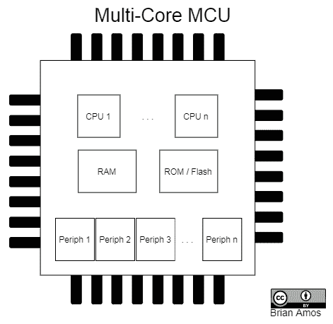
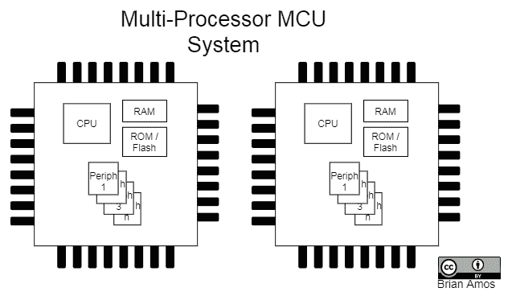
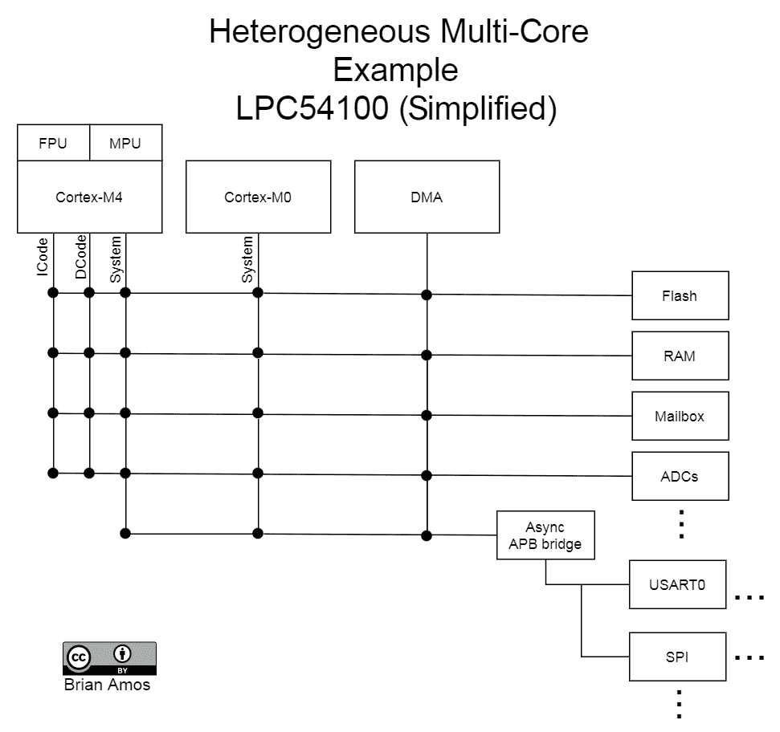
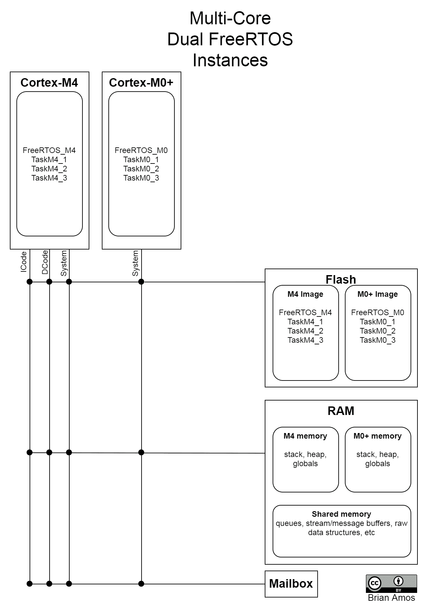
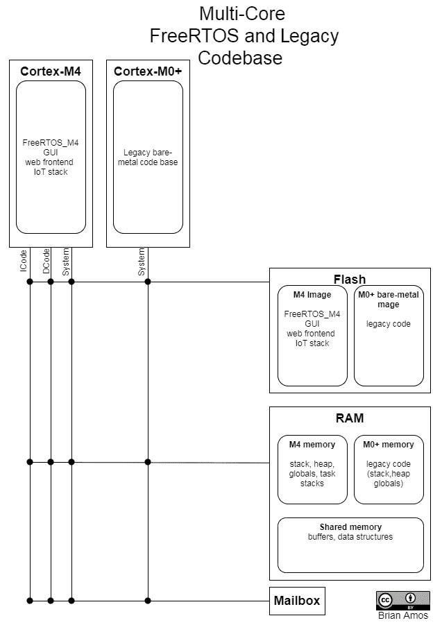
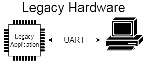
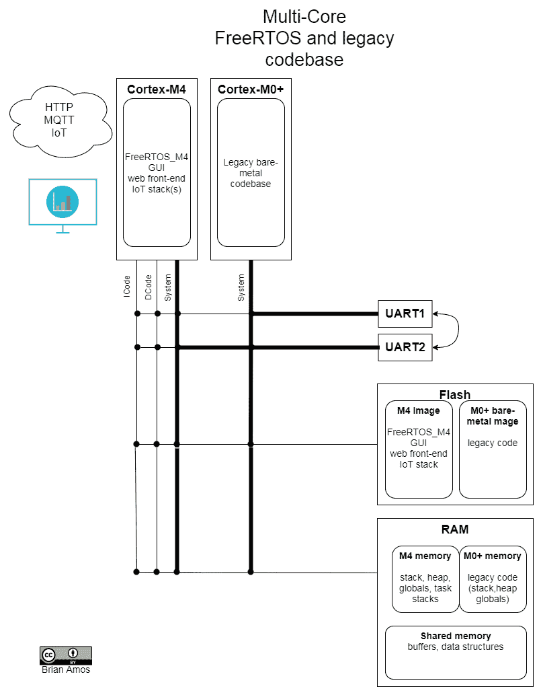
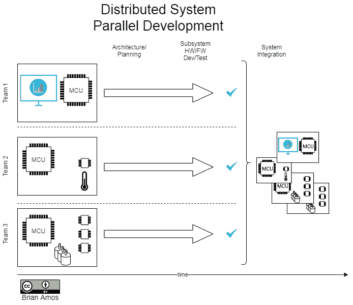

# 第十六章：多处理器和多核系统

到目前为止，我们已经讨论了许多编程单个**微控制器单元**（**MCU**）的不同方法。但如果手头的任务需要比单个核心 MCU 能提供的更多处理能力呢？如果系统的机械约束要求使用多个物理分布在系统中的 MCU 来协同完成任务呢？如果可靠性至关重要，单个处理器的故障会导致系统灾难性故障呢？所有这些情况都需要使用多个处理核心，在某些情况下，甚至需要多个 MCU。

本章探讨了多核和多处理器解决方案及其不同的应用。首先，我们将探讨可能推动多核/处理器解决方案的不同设计要求。然后，我们将更深入地探讨 FreeRTOS 在多核/处理器系统中的不同使用方式。最后，将提出一些关于选择处理器间通信方案的建议。

简而言之，我们将涵盖以下主题：

+   介绍多核和多处理器系统

+   探索多核系统

+   探索多处理器系统

+   探索处理器间通信

+   在多核和多处理器系统之间进行选择

# 技术要求

本章没有技术要求。

# 介绍多核和多处理器系统

首先，让我们明确一下术语。**多核**设计是指单个芯片内部有多个 CPU，其中至少有一些内存是核心间共享的：

多核部件范围非常广泛，从具有多个相同 CPU 核心的大型 64 位部件到 ARM big.LITTLE 架构，该架构在同一封装中结合了高带宽 CPU 和节能的 MCU。最近，多核 MCU 也变得更加常见。**图形处理单元**（**GPU**）也可以归类到多核类别。

**多处理器**系统是指设计中包含多个处理器芯片。在我们的讨论中，这些芯片可以位于同一**印刷电路板组装**（**PCBA**）上，或者分布在一个更大系统中的不同 PCBA 上：

多核和处理器拓扑结构可以在许多不同的地方找到，例如智能手机、小型网络传感设备、工业自动化设备、测试设备、医疗设备、家用电器，当然，还包括一系列计算设备，如台式机、笔记本电脑等。

使用这两种不同的拓扑结构有很多不同的驱动因素，而不仅仅是需要更多或更快的处理能力。有时，系统需要立即上线，而无需等待完整的**通用操作系统**（**GPOS**）启动。偶尔，通过将系统功能分割到多个核心（和代码库）中，可以更容易地满足监管要求，这样只需要部分总代码（或系统）通过严格的审查。在系统中可能存在一些电磁考虑因素（如到电机/执行器的长线或敏感的模拟信号），最好通过在物理上靠近的处理器来解决。在高可靠性系统中，冗余非常常见。

现在我们对术语有了大致的了解，让我们深入了解这些系统的更多细节和用例，从多核设计开始。

# 探索多核系统

首先，让我们介绍几种不同的多核系统类型。它们主要有两种配置/架构：异构和同构。异构系统是具有多个核心，但它们在某些方面是不同的。与此相对的是同构系统，其中所有 CPU 都可以同等对待并互换使用。

# 异构多核系统

异构多核系统在同一设备中至少包含两个处理核心，并且包括核心的处理器架构或核心访问共享资源（如系统内存、外围设备或 I/O）的方式的不同。例如，在频谱的较低端，我们可以在同一芯片上拥有多个 MCU 核心。NXP 的 LPC54100 系列集成了 Cortex-M0+和 Cortex-M4，两者都运行在 150 MHz，封装在同一芯片中。

在这个设备中，MCU 核心是不同的，但它们连接到系统外围设备的方式是相同的——除了指令和数据总线，这些总线仅在 Cortex-M4 上可用：

我们可以使用这些系统以不同的方式：

+   **将硬实时操作与更通用的计算分离**：M0+可以处理低级别的外围或硬件访问/控制，而 M4 处理所需的更高级功能，例如 GUI 和连接性。

+   **节能设计**：低级别控制和接口在低功耗的 M0+上执行，仅在需要计算密集型操作时激活 M4。

由于 LPC54100 有两个 MCU 核心，我们将关注裸机编程（无操作系统）以及不需要完整**内存管理单元**（**MMU**）的操作系统，如 FreeRTOS。在两个核心上运行不同的（或多个相同操作系统的副本）被称为**不对称多处理**。

“不对称”这个名字来源于两个核心被不同对待的事实——它们之间存在不对称。这与在基于桌面的操作系统上使用的对称多核方法大不相同，在那种方法中，各个核心都被同等对待。对称多核系统将在“同构多核系统”部分中介绍。

例如，我们可以在两个核心的每个核心上运行多个 FreeRTOS 副本：

在这种配置中，两个核心完全独立地运行。尽管 FreeRTOS 在两个核心上运行，但核心之间没有共享的闪存程序空间——每个核心都有一个与其他核心独立的固件映像。RAM 的行为方式相同——完整的 RAM 内存空间对两个核心都是可用的，但默认情况下，每个核心将接收自己的栈、堆、全局变量等区域。

因此，每个核心都在运行自己的程序——这两个程序如何协调彼此的活动？我们需要一种方式来回传递信息——但如何？

# 核间通信

核间信息共享是可能的，但受到与其他任何多线程环境相同的并发访问考虑因素的影响，这就是为什么通常在芯片上包含邮箱硬件。这种硬件专门用于促进两个核心之间的通信。邮箱通常具有以下功能：

+   **硬件互斥功能**：用于保护两个核心之间共享的 RAM。这个想法与纯软件环境中的互斥锁相同——它们用于提供对共享资源的互斥访问。

+   **中断到/自每个核心**：这些中断可以在核心向共享内存区域写入数据后触发，通知其他核心有消息/数据可用。

# 旧应用程序扩展

我们不仅限于在两个核心上运行 FreeRTOS——可以在核心之间混合或匹配任何 RTOS 或裸机。假设已经存在一个裸机旧应用程序，但需要一些新的附加功能来利用新的机会。例如，为了保持竞争力，设备可能需要进行“翻新”并添加 GUI、Web 前端或物联网堆栈。新功能可以独立于底层旧代码开发，从而让旧代码保持大体完整且不受干扰。

例如，旧代码可以在 Cortex-M0+上运行，而新功能则添加到 Cortex-M4 中：

在这样的设置中，是否使用共享 RAM 作为核心之间的数据交换，将很大程度上取决于团队修改遗留代码库的舒适度以及应用程序的结构。例如，与其修改现有的代码库以在访问共享数据结构之前使用适当的邮箱实现的互斥锁，不如使用现有的硬件接口作为数据传输机制，将辅助 CPU 更像是一个外部客户端。由于许多遗留系统使用 UART 作为系统的主要接口，因此可以使用这些数据流作为处理器之间的接口，将修改遗留代码的影响降到最低：

这种方法通过使用较慢的接口（物理外设比简单的内存传输慢且 CPU 密集型）以及将信号路由到处理器外部来避免对现有代码库进行重大修改。尽管这种方法远非理想，但它可以在投入大量工程努力于更优雅的解决方案之前，用来测试新机会的可行性：

这种类型的方法允许团队专注于为现有系统（其核心功能不需要改变）开发新的接口，对原始系统的影响最小。

根据具体情况，也可能更有意义将遗留代码留在原始 MCU 上，而不是将其移植到新 MCU 的核心内部。每个项目可能都会有其自身的约束条件，以指导这一决策。尽管从非常高的层面来看，所有这些都可能看起来像是一项简单的任务，但每个项目通常都有一些需要考虑的隐藏复杂性。

# 高需求硬实时系统

在 NXP LPC54100 这样的异构多核谱的另一端，将是一个如 NXP i.Mx8 这样的设备，它包含两个 Cortex-A72，四个 Cortex-A53，两个 Cortex-M4F，一个 DSP 和两个 GPU。这种类型的系统通常用于需要极高计算密集型操作的地方，以及需要与硬件进行低延迟或硬实时交互的地方。计算机视觉、AI、目标自适应机器学习和高级闭环控制系统都是 i.Mx8 的合理应用。因此，与其将 i.Mx8（或类似的 CPU）集成到产品中，为什么不使用更通用的计算解决方案来满足这种计算能力要求呢？毕竟，通用计算机已经拥有 GPU 和多核 CPU 十年或更长时间了，对吧？

在某些系统中，运行更通用的计算硬件和操作系统可能是完全可接受的。然而，当存在**硬实时需求**（如果错过了实时截止日期，系统被认为已经失败）时，一个通用型操作系统（GPOS）将不足以满足需求。使用像 i.Mx8 这样的设备而不是仅仅在 CPU/GPU 组合之上使用 GPOS 的一个令人信服的理由是，它使用了能够处理硬实时任务的低延迟核心，如 Cortex-M4，这些核心具有极低的延迟和极高的可靠性。高吞吐量硬件用于执行计算上**繁重**的操作，在这些操作中，吞吐量很重要，但可以容忍更高的延迟和更低的确定性：

较小的基于 MCU 的核心在执行与传感器和执行器等硬件的低级交换方面非常出色。需要使用专用定时外设的时序敏感操作最好留给 MCU 硬件处理。例如，一个电机控制系统可能需要直接控制 H 桥并从使用晦涩/专有定时格式的编码器读取数据。使用具有专用定时硬件的 MCU 来实现这一点相当直接。用于电机控制和高分辨率定时捕获的差分 PWM 信号和带死区插入的信号都是相当常见的功能。所有这些紧密控制、低延迟的控制结构都可以使用 MCU 及其专用外设（无论是在裸机还是在实时操作系统上）实现，然后可以将高级命令暴露给 GPOS。具体到 i.Mx8，我们现在可以使用 MCU 执行非常低级、时序敏感的操作，同时使用高性能的 Cortex-A 处理器、DSP 和 GPU 执行计算机视觉、机器学习和人工智能所需的高级、大规模并行操作。

异构系统并不仅限于嵌入式系统！异构拓扑结构在几十年的非常大型计算集群中就已经存在，但我们仍然专注于与嵌入式空间最相关的例子。

因此，既然我们已经讨论了一些异构多核系统的例子，那么同构多核系统又如何呢？

# 同构多核系统

如同名字所暗示的那样，同构多核系统是指所有核心都相同的一种系统。这类多核系统传统上在桌面计算中找到。与异构系统不同，异构系统中的每个核心都针对执行几种类型的任务非常出色（正如异构系统那样），这里有多达多个完全相同的核心。而不是用特定的任务编程特定的核心，所有核心都被同等对待。这种类型的做法被称为对称多处理（系统中的所有核心之间都有对称性）；它们都被同等对待。在对称系统中，核心将暴露给单个内核，而不是分成多个内核/调度器。

即使在不对称的多处理器设置中，也可能存在对称的组件。例如，前面提到的 i.Mx8 通常会将 Cortex-A53 核心设置为对称多处理配置，其中所有四个核心都可供单个内核（并且以相同的方式处理）进行调度。

但当需要在不同物理位置使用处理器时怎么办？或者如果单个处理器因为可用的引脚数量有限而限制了其功能，又会如何？

# 探索多处理器系统

与多核系统在分割固件功能并提供并行执行方面非常出色的方式类似，多处理器系统在许多情况下由于各种原因都很有用。让我们看看几个例子。

# 分布式系统

嵌入式系统通常与物理世界有大量的交互。与数字领域不同，在数字领域，1 和 0 可以毫无顾忌地发送到世界各地，而物理世界对敏感的模拟信号来说是一个残酷的地方——最小化穿越的距离可能是关键的。将模拟处理尽可能靠近其源头是一个好主意。对于一个具有模拟组件的混合信号系统，这意味着尽可能缩短信号路径，并将敏感的模拟信号处理并转换为尽可能靠近源头的数字表示：

在中等到高功率系统中，减少携带电流的电线穿越的距离，以控制电机、电磁阀和其他执行器，将减少系统的辐射电磁发射（总是一个好主意）。如果所讨论的 I/O 在物理上从系统其他部分分离出来，包括在附近放置一个 MCU，这是一种将敏感信号的数字化局部化的优秀方法，这使得系统对**电磁干扰**（**EMI**）的抵抗力更强，同时最大限度地减少布线量。在高振动和运动环境中，更少的电线意味着更少的潜在机械故障点，这导致更高的可靠性、更少的停机时间和更少的维修请求。

# 并行开发

使用多个处理器也使得在系统的实际开发中提供并行级别变得非常容易。由于团队通常会发现专注于一个定义良好的子系统是最容易的，因此创建多个子系统使得运行真正的并行开发（并减少整体进度）成为可能。每个子系统都可以由其自己的处理器和通信接口以及一个明确的子系统责任列表来界定：

这种方法也有鼓励每个团队独立全面测试其系统的优势，在开发过程中记录接口和功能。最后，它倾向于将集成过程中的任何惊喜降到最低，因为团队被迫在开始开发之前对整个架构进行更多思考。

# 设计重用

随着处理器开始连接大量的 I/O，它们可能仍然有足够的处理资源可用，但可用引脚却不足。这时，需要做出一个决定。提供端口扩展的 IC 是可用的，但应该使用它们吗？如果你在设计考虑重用的系统，重要的是要看看是否可以采用子系统方法，而不是创建一个巨大的单体设计，其中所有硬件和固件都交织在一起，紧密耦合。有时，当单个 MCU 的引脚容量达到极限时，这可能表明 MCU 正在执行几个不同子系统的功能。通常，如果将这些子系统分解并单独开发，它们可以无需修改地直接应用于未来的产品，这可以大大降低未来项目的风险和进度。

# 高可靠性系统

高可靠性系统通常会包括多个核心或处理器来执行其关键功能。然而，他们并不是使用额外的处理能力来运行单个并行操作，而是设置了某种程度的冗余。实现冗余的方式有很多种。创建冗余系统的一条途径是让核心同步运行。每个处理器的结果都会被仔细检查，以检测任何差异。如果发现问题，该核心（或处理器）将被离线并重置，运行一系列测试以确保它能够正确恢复——然后，它将被重新投入使用。

在这样的系统中，可能需要考虑环境因素，例如运行电机、电磁阀或其他执行器产生的 EMI。有时环境噪声的来源更为特殊，例如太阳辐射，这对于高空和太空系统通常是一个关注点。

既然我们已经探讨了在系统中拥有多个处理器可能有益的原因，那么让我们来看看如何让所有这些处理器相互通信。

# 探索处理器间通信

在分布式系统的背景下简要提到了处理器间通信。让我们看看在选择合适的处理器间总线时需要考虑的一些因素。

# 选择合适的通信介质

在选择处理器之间使用的通信介质时，有许多考虑因素，我们可以将其分为几个不同的主要类别。

第一点是**时间**。在实时系统中，时间考虑因素通常是至关重要的。如果一个节点之间发送的消息没有按时且完整地到达目的地，可能会产生严重的后果：

+   **延迟**：发送消息并接收响应需要多长时间？能够快速响应子系统之间的通信通常非常重要。

+   **最大抖动**：延迟有多少可变性？每个系统都有自己的要求，即可以接受的变异性。

+   **错误检测/可靠性**：通信介质是否提供了一种确定消息是否正确且及时接收的方法？

+   **吞吐量**：可以通过通信介质传输多少数据？对于包含控制数据的通信介质，吞吐量通常以消息来衡量，而不是原始数据（如 KB/秒或 MB/秒）。通常，最大可靠性和最小延迟会以原始数据传输吞吐量为代价——每个消息都会包含额外的开销和握手。

下一个考虑类别的重点是**物理要求**。有时，物理要求非常重要，而有时它们可能几乎不是限制。以下是一些简单的考虑点：

+   **抗噪声干扰性**：通信通道是否需要通过一个电气噪声环境？需要什么类型的电缆来进行适当的 EMI 屏蔽？

+   **系统中的节点数量**：完整的系统中需要多少个节点？由于电气限制，大多数标准都会对连接数量有一个上限。

+   **距离**：运行需要多长？它将是 PCB 内部的芯片到芯片的短距离运行，还是建筑物之间的长距离运行？分布式系统对不同开发者和行业可能有不同的含义。

+   **所需的周边设备**：可以接受多少额外的电路？可以容忍哪些类型/尺寸的连接器？

然后，我们面临的是**开发团队/项目限制**。每个团队和项目都是相当独特的，但有一些共同的主题应该被涵盖：

+   **复杂性**：需要多少代码才能使协议运行起来？所需的外部电路是否经过验证是功能性的？我们的团队是否认为解决方案提供的功能值得所需实现它所需的开发时间？

+   **现有熟悉度**：团队中是否有人之前使用过这种通信方案，并且这种经验是否与当前项目/产品直接相关？我们需要学习一些更适合的新东西，而不是使用我们已经熟悉但并非最佳解决方案的东西吗？

+   **预算**：这种通信方案是否需要任何昂贵的组件，例如特殊的集成电路、连接器或专有堆栈？在解决方案的某些方面购买或外包部分实现是否值得？

如您从长长的考虑因素列表中可以想象到的，没有一种通用的通信机制能够完美适用于所有应用。这就是为什么我们有这么多可供选择的原因。

例如，虽然工业以太网通信解决方案可能提供出色的延迟和噪声性能，但需要专用硬件的事实将使其不适合许多不需要明确要求这种硬件的应用。另一方面，低性能的串行协议，如 RS-232，可能非常容易实现，但可能会产生不可接受的电磁干扰，并且在高速使用时容易受到噪声的影响。另一方面，完整 TCP/IP 堆栈的复杂性可能会让许多潜在的采用者望而却步，除非团队中有人已经熟悉它，并且目标平台上有现成的驱动程序堆栈。

# 通信标准

从之前的考虑因素列表中，我们可以看出，选择处理器间通信的方法并不是一刀切。为了提供一个关于可用选项的概念，以下是一些常用总线示例，以及一些关于它们如何在多处理器系统中可能有用的简要评论。这个列表远非详尽无遗。此外，每种标准在不同的环境下都有其自身的优点。

# 控制器局域网

**控制器局域网**（**CAN**）是汽车行业许多子系统的通信骨干。CAN 的优点包括其健壮的物理层、优先级消息方案和多主总线仲裁。许多微控制器都包含专门的 CAN 外设，这有助于简化实现。由于扩展帧的数据字段可能仅包含多达 8 字节，因此 CAN 最适合短消息。

# 以太网

几乎所有中等到高性能的微控制器都提供了以太网支持，需要外部物理层、磁性和连接器进行硬件实现。这里的难点在于确保有合适的网络协议堆栈可用。这种方法的优点是，它为在 TCP 和 UDP 之上运行的流行协议提供了广泛的选择，以及易于获取且价格低廉的硬件，如果需要，可以用来构建完整的网络。

与 Modbus 类似，以太网通常会被选为外部接口，而不是处理器间总线。根据系统架构和硬件可用性，可能没有理由不能将其用于两者。

# 内部互连通信总线

**内部互连通信总线**（**I2C**）最常用于与低带宽外设通信，如传感器和 EEPROM。通常，MCU 将被配置为 I2C 总线主设备，带有一个或多个从 I2C。然而，许多 MCU 包含可以用于实现 I2C 主从任一侧的 I2C 控制器。I2C 协议的许多方面使其非确定性，例如，从机可以保持时钟线直到它们准备好接收更多数据（时钟拉伸）和多主仲裁。

# 局部互连网络

**局部互连网络**（**LIN**）是一个常用的汽车网络子系统，当完整的 CAN 过于复杂或昂贵而难以实现时，最多支持 16 个节点。LIN 物理层比 CAN 的容错性差，但它也更确定，因为只能有一个总线主设备。STM32 USARTS 通常会在外设中内置一些有用的 LIN 模式功能，但仍然需要外部 PHY IC。

# Modbus

**Modbus**是一个历史上运行在 RS-485 物理层之上的协议，在工业领域作为外部协议非常流行（尽管现在，该协议通常运行在 TCP 之上）。Modbus 是一个相当简单的以寄存器为导向的协议。

# 串行外设接口

**串行外设接口**（**SPI**）也可以作为一个易于实现、高度确定性的处理器间通信介质，特别适用于从机的精度不足以实现异步串行端口上高波特率所需的紧密公差时。所有针对自定义异步协议的缺点在基于 SPI 的自定义协议中也同样存在，额外的约束是，从设备将根据主设备需要从从机（们）快速获得响应的速度来施加硬实时约束。

由于 SPI 时钟由主设备驱动，因此它是唯一可以启动传输的设备。例如，如果从机需要在接收到主设备命令后的 30 µS 内准备好响应，而从机需要 31 S，那么传输很可能是无用的。这使得 SPI 在需要紧密确定性时非常吸引人，但在其他情况下不必要地难以实现。根据环境，MCU 的板载 SPI 外设可能需要与外部差分收发器一起使用，以提高信号完整性。

# USB 作为处理器间通信总线

现在更多中等到高性能的 MCU 包括 USB 主机，它作为处理器间通信总线变得越来越可行。USB 在特定应用中是否可行取决于节点数量以及完整的 USB 堆栈和能够利用它的开发者的可用性。虽然本书中使用的 USB 虚拟通信类不是确定性的，因为它使用了批量端点，但可以使用中断传输在 USB 上实现确定性的传输调度，因为它们在枚举期间以定义的速率被主机轮询。例如，在高速 USB 链路上（这通常需要外部 PHY），这相当于每 125 µS 轮询一次高达 1 KB 的消息。

在本节中，我们只是触及了处理器间通信的可能性——还有许多其他选项可供选择，每个选项都有其自己的特性、优势和劣势，具体取决于你项目的需求。

现在我们已经对多核和多处理器系统有了良好的理解，包括一些常见的拓扑结构以及处理器之间的一些通信方式，让我们退一步来评估是否需要多核或多处理器设计。

# 在多核和处理器系统之间进行选择

随着每月都有更强大的 MCU 和 CPU 被宣布，可供选择的选择几乎无穷无尽。多核 MCU 变得越来越普遍。但真正的问题是——你的设计中是否真的需要多个核心或多个处理器？是的，它们很容易获得，但最终这会帮助还是伤害设计呢？

# 何时使用多核 MCU

有几种情况下，多核 MCU 是绝佳的选择：

+   当需要真正的并行处理且空间受限时

+   当需要紧密耦合的并行执行线程时

如果你的设计空间受限，需要真正的并行处理，或者两个并行进程之间的通信速度极为关键，多核 MCU 可能是最佳选择。如果应用需要从多个核心进行并行处理，而无法使用 MCU 上已经存在的其他硬件实现——例如，并行运行多个 CPU 密集型算法——多核 MCU 可能最适合该应用。

然而，重要的是要意识到一些缺点和替代方案。多核 MCU 可能比离散 MCU 更难以替换（无论是寻找替代品还是移植代码）。应用是否真的需要在 CPU 级别进行并行执行，或者只是需要在并行执行某些操作（例如通信）？如果需要实现并行功能，而这些功能可以使用专用外设硬件（例如，使用连接到硬件外设的 DMA 填充通信缓冲区）实现，那么实现*并行*功能可以在不使用第二个核心的情况下完成。

多核 MCU 的一些潜在替代方案如下：

+   将一些处理任务卸载到硬件外设

+   确保尽可能多地使用 DMA。

+   多个 MCU

# 何时使用多处理器系统

在各种情况下，多处理器系统都很有用，例如以下情况：

+   当可能重用子系统时

+   当有多个团队可以并行处理一个大型项目时

+   当设备较大且物理上分散时

+   当 EMI（电磁干扰）考虑至关重要时

然而，尽管多处理器系统很有用，但它们确实有一些潜在的缺点：

+   与单个 MCU 相比，额外的延迟。

+   实时多处理器通信可能会变得复杂且耗时。

+   需要额外的前期规划以确保正确开发子系统。

# 摘要

在本章中，你被介绍了多核和多处理器系统，我们讨论了每种系统的几个例子。你现在应该了解它们之间的区别，以及在设计系统时使用这两种方法的适当性。还介绍了几个处理器间通信方案的例子，以及它们与嵌入式实时系统相关的亮点和优势。

多核和多处理器拓扑结构的好处在于，一旦你对并发系统设计的构建块有了扎实的理解（我们已经讨论过），创建具有更多核心的系统就只是将硬件放置在并发处理和抽象化影响最大的位置的问题。

在下一章中，我们将讨论你在开发过程中可能会遇到的一些问题以及一些潜在的解决方案。

# 问题

在我们总结的时候，这里有一份问题列表，供你测试对本章材料的理解。你将在附录的*评估*部分找到答案：

1.  多核架构和多处理器架构之间的区别是什么？

1.  在非对称多处理架构中，可以使用操作系统混合和裸机编程。

    +   正确

    +   错误

1.  在选择处理器间通信总线时，应始终使用具有最高可用传输速率的总线。

    +   正确

    +   错误

1.  是否应该避免使用多处理器解决方案，因为它们会增加架构的复杂性？

# 进一步阅读

+   NXP AN11609—LPC5410x 双核使用：[`www.nxp.com/docs/en/data-sheet/LPC5410X.pdf`](https://www.nxp.com/docs/en/data-sheet/LPC5410X.pdf)

+   Keil—USB 概念：[`www.keil.com/pack/doc/mw/USB/html/_u_s_b__concepts.html`](https://www.keil.com/pack/doc/mw/USB/html/_u_s_b__concepts.html)
