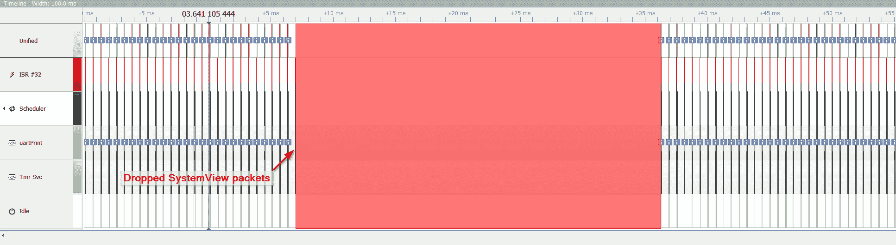
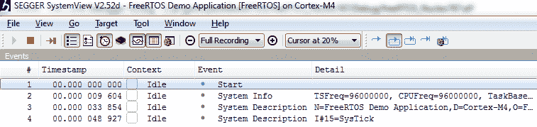
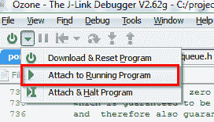
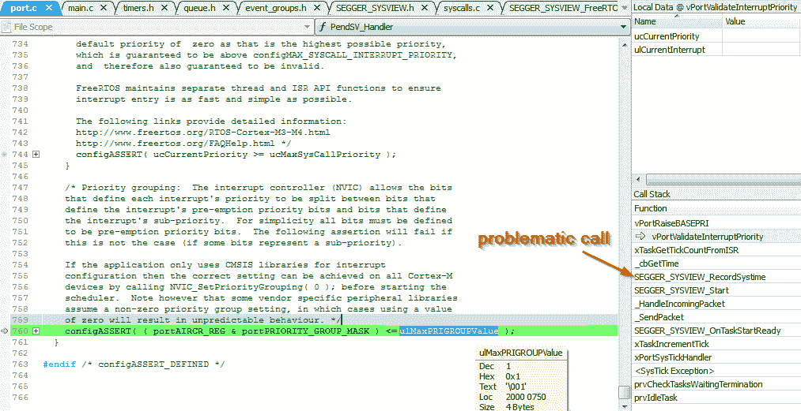
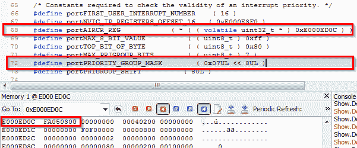
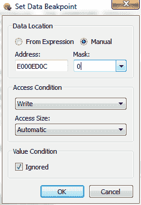
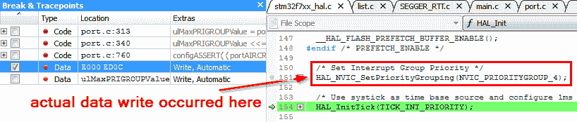
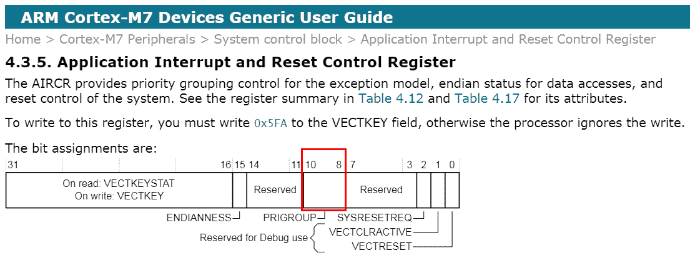
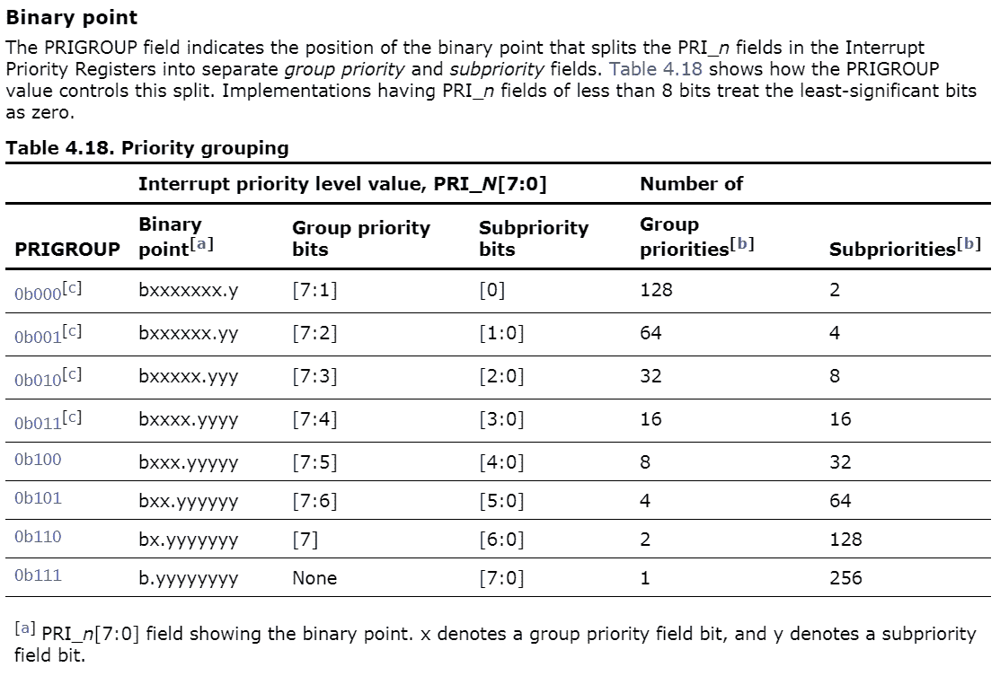
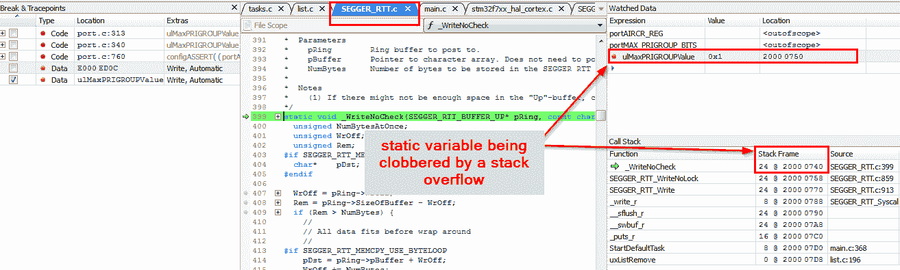

# 第十七章：故障排除技巧和下一步操作

本章探讨了分析并解决基于 RTOS 的系统的一些最有用的技巧和工具。在开发过程中定期检查您的系统，以及在故障排除时采取一些标准步骤，可以在评估有问题的系统时节省大量时间——事情并不总是按计划进行！在介绍了一些技巧之后，我们将探讨我们可以采取的一些下一步行动，以继续学习和提高我们的嵌入式编程技能。

在本章中，我们将涵盖以下主题：

+   有用技巧

+   使用断言

+   下一步操作

# 技术要求

本章不需要硬件或软件。

# 有用技巧

如果您只使用过*裸机*编程方法，那么开始使用 RTOS 可能会相当不同，尤其是如果您也从 8 位 MCU 切换到 32 位 MCU，如本书中使用的 STM32F7，那么更是如此。以下是一些可以帮助您保持项目进度并在出现问题时解决问题的技巧。

# 使用工具分析线程

能够清楚地了解系统中所有线程正在做什么对新手和专家都有很大帮助。工具在这方面特别有用。使用可视化工具，如 SEGGER SystemView 或 Percepio Tracealyzer，在理解系统中各种任务和中断之间的交互时可能非常有价值（有关详细信息，请参阅第六章，*实时系统调试工具*）。

拥有一个 RTOS 感知调试器也非常有帮助，因为它允许我们堆叠多个任务的分析。这个调试器可以是您 IDE 的一部分，也可以是像 SEGGER Ozone 这样的独立调试器（请参阅第五章，*选择 IDE*和第六章，*实时系统调试工具*）。

# 关注内存使用

在使用 RTOS 时，内存使用是一个非常重要的考虑因素。与具有单个堆栈的超循环不同——堆栈和堆栈会消耗任何剩余的 RAM——每个 FreeRTOS 任务的堆栈需要显式设置大小。在第十五章，*FreeRTOS 内存管理*，*关注堆栈空间*部分中，我们向您展示了如何观察可用的堆栈空间，以及如果检测到溢出如何实现钩子。

如果您的应用程序正在使用动态内存分配，您应强烈考虑启用并实施 FreeRTOS 提供的失败 MALLOC 钩子。这已在第十五章，*FreeRTOS 内存管理*，*关注堆空间*部分中介绍。

# 栈溢出检查

如果你有可用的内存保护单元，利用它是一个极好的主意，因为它将比任何基于软件的解决方案更可靠地检测到诸如堆栈溢出之类的访问违规（参见第十五章，*FreeRTOS 内存管理*，*使用内存保护单元*部分）。

另一种监视堆栈的方法是设置堆栈监控，这在第十五章，*FreeRTOS 内存管理*，*监视堆栈空间*部分也有介绍。

在下一节中，我们将介绍如何通过使用断言来调试具有堆栈溢出并检查内存的系统。

# 修复 SystemView 丢失的数据

在本书中我们查看的示例中，SystemView 显示我们可以通过在 MCU 上运行代码来存储事件到本地缓冲区，从而进行数据可视化流。然后，缓冲区的内容通过调试硬件传输到 PC 进行查看。有时，在高负载期间，你会在跟踪中看到大红色块，如下面的截图所示：



这些块表明 SystemView 检测到了丢失的数据包。可以通过以下任何一种方式来减少丢失数据包的频率：

+   增加 MCU 上 SystemView 缓冲区的大小。`SEGGER_SYSVIEW_Conf.h`在 132 行定义了缓冲区。重要的是要注意，由于此缓冲区位于 MCU 上，增加缓冲区的大小将减少其他代码可用的内存。

```cpp
#define SEGGER_SYSVIEW_RTT_BUFFER_SIZE
```

+   在目标接口和速度下增加调试器的时钟速度。在某些情况下，支持更快时钟的调试器可能会有所帮助（例如，专门的 SEGGER J-Link 或 J-Trace）。

+   在 SystemView 运行时减少对调试硬件的流量。为此，例如，你可以在打开的调试会话中关闭任何实时跟踪窗口（如 Ozone 或 STM32CubeIDE）。

在下一节中，我们将学习如何通过使用断言来调试我们的系统。

# 使用断言

断言是捕捉那些“根本不应该发生”的情况的绝佳工具。它们为我们提供了一种简单的方式来检查假设。请参阅第七章，*FreeRTOS 调度器*，*创建任务 – 检查返回值*部分，了解如何添加简单的断言以防止系统处于不可接受状态时运行代码的示例。

FreeRTOS 的断言构造的特殊版本是`configAssert`。

# `configAssert`

`configAssert`在 FreeRTOS 中被用作防止配置不当系统的一种方式。有时，它会在 ISR 内部调用 API 的非中断版本时被触发。通常，中断内部的代码会尝试调用 FreeRTOS API，但其逻辑优先级高于 RTOS 允许的优先级。

与其让应用程序在未定义的行为下运行，FreeRTOS 会定期测试一组断言以确保所有先决条件都已满足。单独来看，这些检查有助于防止系统完全失控，而无法找出问题所在。相反，当出现无效条件时，系统会立即停止。FreeRTOS 还包含了关于断言失败的根本原因的详细文档（有时会链接到基于网络的文档）。

千万不要通过任何方式**掩盖**`configAssert`。它们通常是存在严重配置问题的第一个通知。禁用断言只会使根本问题更加复杂，使得以后更难找到。

让我们通过一个例子来了解系统因`configAssert`而停止时的正常症状可能是什么样，以及可以采取的步骤来诊断和解决根本问题。

# 使用 configAssert()调试挂起系统

当你第一次启动代码库并创建一些示例代码来介绍 SystemView 时，需要解决几个问题。

这里是我们的例子：

确保所有代码在语法上正确，LED 闪烁后，是时候将 SystemView 连接到运行中的应用程序，并获取一些时序图。第一次连接 SystemView 时，会显示一些事件，但随后系统变得无响应：

+   LED 停止闪烁

+   在 SystemView 中没有显示任何其他事件，如下面的截图所示：



让我们在几个步骤中诊断并解决根本问题。

# 收集数据

有时候，猜测可能发生的事情或对系统做出假设是很诱人的。而不会做这两件事，我们只需将调试器连接到系统，看看问题是什么。

由于 SEGGER Ozone 在连接运行中的系统而不修改其状态方面特别出色，我们能够连接到挂起的应用程序而不会破坏任何东西。这允许我们在应用程序崩溃后开始调试，即使它之前**没有**通过调试器运行。这在产品开发期间非常有用，因为它允许我们正常运行系统，而无需不断从调试器启动。让我们学习如何做到这一点：

1.  使用与目标上运行相同的代码设置 Ozone。注意，开发板必须通过 USB 连接（有关详细信息，请参阅第六章，*实时系统调试工具*）。

1.  然后，选择附加到运行程序：



1.  在附加并暂停执行后，我们会看到以下屏幕，并立即能够进行一些观察：



注意以下内容：

+   由于断言失败，我们花费了所有的时间在一个无限循环中，因此 LED 停止闪烁。

+   通过查看调用栈，我们可以看到有问题的函数是 `SEGGER_SYSVIEW_RecordSystime`，它显然调用了名为 `_cbGetTime` 的函数，而 `_cbGetTime` 又调用了 `xTaskGetTickCountFromISR`。

+   阅读第 760 行以上的详细注释，听起来可能有一些配置错误的 NVIC 优先级位。

+   `ulMaxPROGROUPValue` 的最大可接受值（可以通过悬停在所选变量上查看）是 `1`。

既然我们知道哪个断言失败了，现在是时候找出它为什么失败的根本原因了。

# 深入挖掘 – SystemView 数据断点

到目前为止，我们已经确定了处理器卡住的地方，但还没有发现任何帮助我们确定需要更改什么才能使系统再次运行的信息。以下是我们需要采取的步骤来找出问题的根本原因：

1.  让我们再次查看断言。在这里，我们的目标是找出它为什么失败的确切原因。运行以下命令：

```cpp
configASSERT( ( portAIRCR_REG & portPRIORITY_GROUP_MASK ) <= ulMaxPRIGROUPValue );
```

1.  使用 SystemView 的内存查看器，分析 `port.c` 中 `portAIRCR_REG` 的值：



1.  由于这是一个硬编码的内存位置，我们可以设置数据断点，每次写入该内存位置时都会暂停执行。这可以是一种快速跟踪变量所有访问方式的方法，而无需尝试搜索代码：



1.  在重启 MCU 后，写入断点立即被触发。尽管程序计数器指向 `HAL_InitTick`，但实际写入 `0xE000ED0C` 地址的数据是在上一个函数中完成的，即 `HAL_NVIC_SetPriorityGrouping`。这正是我们所期望的，因为断言与中断优先级组相关：



1.  在代码中快速搜索 `NVIC_PRIORITYGROUP_4` 可以在 `stm32f7xx_hal_cortex.c` 中找到以下注释：

```cpp
* @arg NVIC_PRIORITYGROUP_4: 4 bits for preemption priority
*                            0 bits for subpriority
```

**优先级分组**：中断控制器（NVIC）允许定义每个中断优先级的位在定义中断抢占优先级的位和定义中断子优先级的位之间分割。为了简单起见，所有位都必须定义为抢占优先级位。如果这不是这样（如果某些位代表子优先级），以下断言将失败。

根据这些信息，子优先级应该有 `0` 个位。那么，为什么 `portAIRCR_REG` 中的优先级位值不为零呢？

根据 *ARM® Cortex® -M7 设备通用用户指南*，我们可以看到，为了达到 0 个子优先级位，**AIRCR** 寄存器与 **0x00000700** 进行掩码后的值必须为 0（当我们查看内存中的值时，它有 **3** 的值）：



这里是同一手册中关于`PRIGROUP`的解释。注意，`PRIGROUP`必须设置为 0b000 以有 0 个子优先级位：



这确实需要进一步调查...为什么`PRIOGROUP`的值是 3 而不是 0？让我们再次查看那个`configAssert()`行：

```cpp
configASSERT( ( portAIRCR_REG & portPRIORITY_GROUP_MASK ) <= ulMaxPRIGROUPValue );

```

注意以下`port.c`中`ulMaxPRIOGROUPValue`的定义。它被定义为*静态的*，这意味着它在内存中有一个永久的位置：

```cpp
#if( configASSERT_DEFINED == 1 )
 static uint8_t ucMaxSysCallPriority = 0;
  static uint32_t ulMaxPRIGROUPValue = 0;
```

让我们为`ulMaxPRIGROUPValue`设置另一个数据断点，并再次重启 MCU，但这次，我们将每次访问时都进行监视：

+   如预期，`BaseType_t xPortStartScheduler(void)`函数在`port.c`中访问了某个内容。

+   关于数据访问断点的好奇之处在于，它在程序计数器位于`SEGGER_RTT.c`时被触发，这看起来不太对，因为`ulMaxPRIGROUPValue`在`port.c`的`xPortStartScheduler`中是私有作用域。

+   查看调试器——问题就在眼前：

    +   `ulMaxPRIGROUPValue`静态变量存储在`0x2000 0750`。

    +   数据写入断点在栈指针为`0x200 0740`时被触发。

    +   栈已被越界：



我们刚刚发现了一个栈溢出**。**它表现为对静态变量的写入（恰好触发了一个与系统无关部分的`configAssert`）。这种完全出乎意料的行为是栈溢出的常见副作用。

目前，`main.c`中每个栈的最小值已被设置为 128 个单词（1 个单词=4 字节），因此将其增加到 256 个单词（1 KB）为我们提供了足够的余量。

*这个例子相当典型地展示了当向先前运行良好的现有任务添加功能时会发生什么。*如果新功能需要调用更多函数（每个函数都有自己的局部变量），这些变量将消耗栈空间。在这个例子中，这个问题是在向现有任务添加 SEGGER 打印功能后才出现的。因为没有额外的栈空间可用，任务溢出了栈并破坏了另一个任务使用的内存。

如果我们设置了栈溢出钩子，这个问题很可能会被发现——如果使用 MPU 端口，它肯定会被发现。

# 下一步

现在你已经通读了这本书，并对每个现成的示例进行了尝试——等等...你还没有运行示例吗？！现在是时候开始运行它们了！之所以包含这些示例，是因为实际操作经验将有助于加深这些概念的理解，同时为你提供宝贵的实践机会和可用于自己项目的开发环境。

因此，假设你已经运行了包含的示例，要更深入地了解 FreeRTOS，一个很好的下一步是阅读*理查德·巴里*的书籍，《Mastering the FreeRTOS™ Real-Time Kernel》。这本书侧重于如何应用开始嵌入式系统开发并建立未来发展的坚实基础所需的一般知识。然而，《Mastering FreeRTOS》专注于 FreeRTOS 的具体细节，并为每个 API 提供示例。拥有一个硬件环境、对基础知识的初步理解以及调试/可视化工具将帮助你最大限度地利用他的书籍。在系统运行起来之后，*Mastering the FreeRTOS™ Real-Time Kernel*中提供的代码可以很容易地使用真实硬件和可视化调试系统进行测试和实验。

当我们谈论构建坚实基础的话题时，你可能会想要考虑熟悉测试驱动开发。正如我们在第十二章《创建良好抽象架构的技巧》和第十三章《使用队列创建松耦合》中所做的那样，开始创建松耦合代码，测试这些子系统是自然的下一步。*詹姆斯·格林宁*在他的网站上提供了许多资源([`blog.wingman-sw.com`](https://blog.wingman-sw.com))，特别是针对嵌入式 C/C++的测试驱动开发资源。其他针对嵌入式 C 的 TDD 资源包括*马特·切尔诺斯基*的网站([`www.electronvector.com/`](http://www.electronvector.com/))和独特的*Throw the Switch*([`www.throwtheswitch.org/`](http://www.throwtheswitch.org/))。一个由数十年的实践经验积累而成的全面嵌入式资源是*杰克·甘斯勒*的网站，你可以通过[`www.ganssle.com/`](http://www.ganssle.com/)访问。

# 摘要

在这一章的最后一章中，我们介绍了一些技巧，这些技巧将帮助你平滑 RTOS 旅程中的一些颠簸，以及一些建议的下一步行动。

就这样，各位！我希望你们喜欢这个使用 FreeRTOS、STM32 和 SEGGER 工具开发实时嵌入式系统固件的动手介绍。现在，是时候出去开始理解系统、解决问题和分析你的解决方案了！我很乐意听听你是如何应用这本书中学到的知识的——在 LinkedIn、Twitter 或 GitHub 上给我留言！如果你真的很喜欢这本书，并认为其他人也会喜欢它，考虑留下评论——它们有助于传播信息！

# 问题

在我们结束这本书的时候，这里有一份问题列表，供你测试你对本章材料的了解。你将在附录的*评估*部分找到答案：

1.  当你在系统中添加中断或使用新的 RTOS 原语后，系统崩溃了，你应该采取哪些步骤？

1.  列举一个在开发实时操作系统（RTOS）时，由固件引起的意外行为（问题）的常见原因。

1.  由于您的系统没有输出数据的方式（没有暴露的串行端口或通信接口），将无法进行调试。

    +   正确

    +   错误
