# 第一章. 立即使用 StyleCop 代码分析教程

欢迎使用 *Instant StyleCop 代码分析教程*。如果我们看看我们是如何开始开发中型和大项目的，我们首先做的事情之一就是颁布基本原则，其中之一就是定义编码规范。这些规则，说明我们的代码必须是什么样子，是为了提高所有团队成员的可读性和可维护性。那里的选择相当随意，取决于制定它们的人（或开发团队）的背景以及他们的喜好和厌恶。项目开始后，然而，需要花费大量时间和代码审查来遵循它们。

这就是 **StyleCop** 发挥作用的地方。在这本书中，我们将查看一些从简单到高级水平的食谱，这些食谱将告诉您所有关于 StyleCop 以及它是如何用于分析代码的。

# 使用 Visual Studio 安装 StyleCop（简单）

在这个食谱中，我们将描述 StyleCop 的安装过程，学习如何配置要在项目中执行的规定，以及如何从 Visual Studio 中启动分析。

## 准备工作

为了遵循这个食谱，您至少需要安装以下 Visual Studio 程序之一：

+   Visual Studio 2008 专业版

+   Visual Studio 2010 专业版

+   Visual Studio 2012 专业版

## 如何做…

1.  从其网站下载 StyleCop ([`stylecop.codeplex.com`](http://stylecop.codeplex.com))。在撰写本文时，StyleCop 的当前版本是 4.7，发布于 2012 年 1 月 5 日。

1.  下载完成后，请确保您的 Visual Studio 已关闭，然后启动安装程序。该过程相对简单。唯一棘手的部分是根据您的使用选择正确的安装组件。

    安装向导在安装过程中会显示 MSBuild 集成步骤，如下面的截图所示。以下是关于安装过程的两点建议：

    +   对于仅在计算机上使用 Visual Studio 的开发者来说，只保留 Visual Studio 集成是完全可以的

    +   然而，如果您需要使用其他 IDE，例如 **SharpDevelop**，或者需要 StyleCop 在您的 CI 中使用，最佳方法是添加 MSBuild 集成，因为它可能需要。

    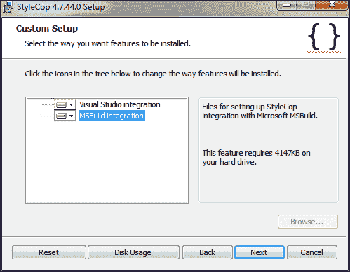

1.  安装过程完成后，让我们看看您的 Visual Studio 中添加了什么。

1.  在您的 Visual Studio 中打开一个项目。

1.  在资源管理器解决方案面板中右键单击项目文件，然后单击 **StyleCop 设置…** 以打开配置窗口，如下面的截图所示：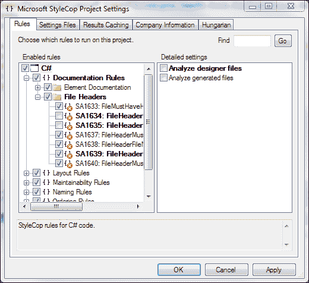

1.  一旦您完成了所需规则的选取，您就可以启动您的首次代码分析。

1.  在资源管理器解决方案中，右键单击项目文件以打开上下文菜单，然后单击 **运行 StyleCop…** 以启动分析。您可以通过不同的方式启动 StyleCop 来执行不同范围的分析：

    +   从 **工具** 菜单，你可以对当前 C# 文档执行扫描，或者对整个解决方案进行完整扫描

    +   在资源管理器解决方案中，从上下文菜单，你可以将分析范围限制为你当前选择的节点。

    +   并且从编码面板，你可以分析你目前正在修改的代码。

## 它是如何工作的...

StyleCop 配置是基于项目的，而不是解决方案。这意味着你必须为每个项目指定你将使用哪些规则和其他配置数据。

当打开 Visual Studio 解决方案时，你可以从资源管理器面板中每个项目的上下文菜单访问 StyleCop 配置。你还可以在项目文件夹的 `Settings.Stylecop` 文件中找到这种方式创建的配置。

如果你希望在不同项目中传播相同的设置，你也可以使用一些“主”配置文件。

## 还有更多...

现在让我们来谈谈设置中的一些有用选项，以及如何在不是 Visual Studio 的情况下在你的 favorite IDE 中显示 StyleCop 违规。

### 规则激活

每个规则部分可能包含一些额外的配置元素（它们将在 **规则** 选项卡的 **详细设置** 区域中显示。

目前你还有以下行的附加配置元素：

+   **C#**：这个部分的详细设置当然是最重要的，因为它们允许你排除由 StyleCop 进一步分析生成的和设计器文件。这很有帮助，因为设计器文件通常不遵循这些规则，并生成许多问题。

+   **文档规则**：在这个部分，你可以更改文档的检查范围。这意味着你可以移除对私有和内部代码的规则检查，并且你可以从其中排除字段。

+   **排序规则**：详细部分让你可以排除生成的代码进行检查。

### 合并 StyleCop 设置

在本章前面，我解释了 StyleCop 配置是基于项目的。虽然这是标准行为，但 **设置文件** 选项卡允许你更改默认行为并指定一个设置文件与你的当前项目设置合并，如下面的截图所示：


这样做允许你拥有一个全局配置文件，并依赖于它进行规则排除。如果你修改了任何设置，它们将在 **规则** 选项卡中以粗体显示，以表明它们已被覆盖。

### 在 Visual Studio Express 和 SharpDevelop 的 Express 版本中使用 StyleCop

为了使用 StyleCop 与 Visual Studio Express 或 SharpDevelop，我们必须启用 MSBuild 集成。对于 SharpDevelop，这就足够了。然后 SharpDevelop 将负责处理项目文件中缺失的行。

然而，对于 Visual Studio Express，你需要手动在你的项目文件中添加 StyleCop 分析。请参阅 *使用 MSBuild 自动化 StyleCop（简单）* 菜谱了解如何操作。

一旦你在解决方案的项目文件中设置了 StyleCop 分析，StyleCop 违规将被显示为编译时的警告或错误。

### 小贴士

**有没有一种方法可以自动化所有项目文件的 StyleCop 集成？**

自从 4.0 框架以来，也可以在`C:\Program Files\MSBuild\4.0\Microsoft.CSharp.targets\ImportAfter\`中包含`Stylecop.targets`文件。

这将允许默认在所有项目构建中集成`Stylecop.targets`。如果目录不存在，你必须创建它。

为了确保 MSBuild 使用的框架版本，你可以在你的 Visual Studio 命令行中运行以下命令：

```cpp
MSBuild /version
```

# 理解 Resharper 插件（简单）

在这个食谱中，我们将发现 Resharper 的 StyleCop 插件。我们将看到其实时分析和如何轻松修复大多数的 StyleCop 违规。

## 准备工作

对于这个食谱，你需要准备以下内容：

+   已安装 StyleCop 4.7。

+   已安装 Resharper 7.1。评估版本可在[`devnet.jetbrains.com/docs/DOC-280`](http://devnet.jetbrains.com/docs/DOC-280)获取。

+   Visual Studio 专业版（2008、2010 或 2012）。

+   一个需要修改的 C#项目样本。

## 如何操作...

### 注意

在开始看到 Resharper 与 StyleCop 结合使用的益处之前，我必须说安装并不容易。首先，每个版本的 StyleCop 似乎都紧密依赖于 Resharper 的特定版本。在撰写本文时，StyleCop 版本 4.7 与 Resharper v7.1.1000.900 兼容。你可以在[`stylecop.codeplex.com/`](http://stylecop.codeplex.com/)找到兼容性矩阵。

然后你需要按照特定的顺序安装它们，以便能够使用它们。安装它们的正确顺序是从 Resharper 开始，然后安装 StyleCop。如果你没有这样做，你必须删除这两个产品，并按正确的顺序重新安装。

1.  当你第一次打开安装了 Resharper 的 Visual Studio 时，你会被询问是否想要将 Resharper 的默认设置重置为符合 StyleCop 规则。点击**是**来执行此操作。

1.  现在我们打开我们的样本项目。首先可见的是代码屏幕右侧的新列，如下面的截图所示：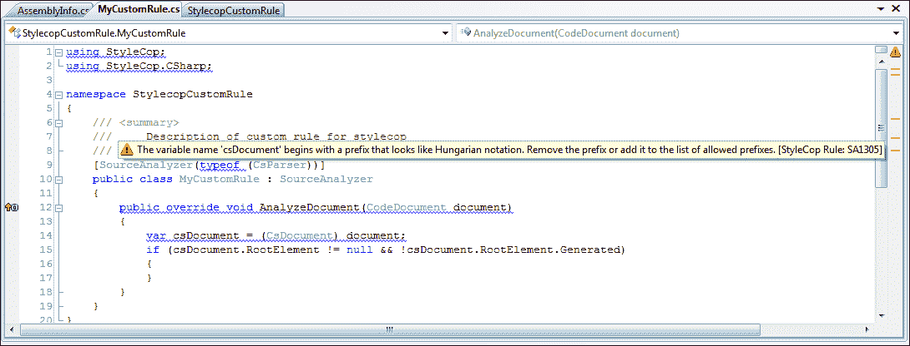

    这一列会实时更新，并显示你文档中所有的错误或警告。如果你浏览了文件中显示的任何警告，你将能够看到警告的描述。

1.  如果你点击它，一个灯泡图标将出现在你的代码左侧，并提供处理错误的选项。通常每个错误有三个选项：

    +   你可以选择自动修复规则，这同样被标记为一个灯泡图标

    +   你可以通过在代码中自动添加抑制消息来显式抑制错误。这被标记为一个锤子图标

    +   你可以更改这种错误级别在 Resharper 中的设置。这被标记为一个禁止的灯泡图标

    以下截图显示了处理 StyleCop 违规的选项：

    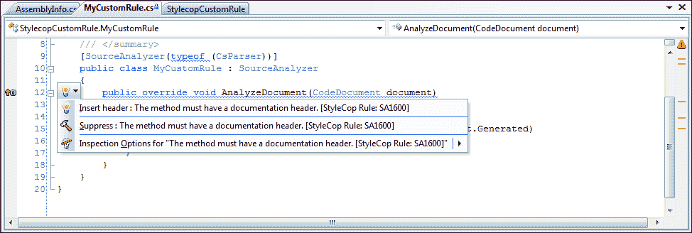

1.  由于这是一个相当长的任务，我们可以一次修复大多数违规。要这样做，请使用 **清理** 命令。此命令可在三个地方访问：

    +   从 **Resharper** | **工具** 菜单。

    +   在资源管理器解决方案中，从上下文菜单。

    +   并且从编码面板的上下文菜单。

## 它是如何工作的...

虽然 Resharper 的自动清理功能可以帮助快速修复大量违规，但它不会修复所有违规，你将不得不手动检查剩余的违规，或者借助 Resharper 的修复功能。

如果你想了解 Resharper 插件的自动修复功能，可以参考以下链接：

[`stylecop.codeplex.com/wikipage?title=ReSharper%20Fixes&referringTitle=Documentation`](http://stylecop.codeplex.com/wikipage?title=ReSharper%20Fixes&referringTitle=Documentation)

你可以在 **Resharper** | **选项…** 菜单中管理 Resharper 插件的行为。你有两个菜单针对 StyleCop。第一个是 **代码检查** | **检查严重性** 菜单，它允许你更改 StyleCop 违规在 Resharper 中的显示方式。

第二个允许你管理 StyleCop 在 Resharper 下的运行方式，如下截图所示：

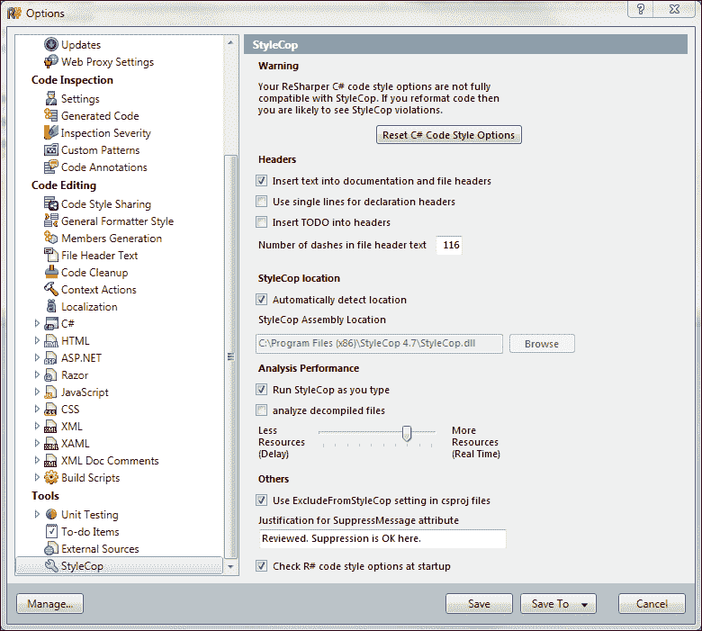

在此屏幕上最重要的部分是 **分析性能**，因为它允许你控制分配给 StyleCop 分析的资源。

## 还有更多...

虽然 Resharper 当然是自动修复违规最完整的工具，并且有直接由 StyleCop 团队支持的优点，但它并不是唯一能够自动纠正违规的程序。其他工具也存在，并且可以帮助修复 StyleCop 违规。

### Dev Express – Code Rush

这是 Resharper 的直接竞争对手。通过插件，它也可以拥有一些符合 StyleCop 的违规修复功能。然而，在撰写本文时，它们似乎只覆盖了 StyleCop 违规的一小部分。

你可以在以下地址下载 Code Rush：

[`www.devexpress.com/Products/Visual_Studio_Add-in/Coding_Assistance/index.xml`](http://www.devexpress.com/Products/Visual_Studio_Add-in/Coding_Assistance/index.xml)

用于包含 StyleCop 违规修复的插件是 **CR_StyleNinja**，可在以下网站找到：

[`code.google.com/p/dxcorecommunityplugins/wiki/CR_StyleNinja`](http://code.google.com/p/dxcorecommunityplugins/wiki/CR_StyleNinja)

### Code Maid

**Code Maid** 是一个免费的 Visual Studio 插件，允许你重新格式化你的代码。虽然它没有 StyleCop 插件，但它允许你重新格式化代码以移除布局和排序违规。

你可以在以下地址找到该工具：

[`www.codemaid.net/`](http://www.codemaid.net/)

### NArrange

**Narrange** 是另一个代码美化工具，但与 Code Maid 不同，它不是一个 Visual Studio 插件。所有配置都在一个 XML 文件中完成，并且你可以从 Visual Studio 的外部工具菜单中设置 NArrange 的启动。配置有一个工具可以简化其编辑。

这个工具的一个优点是它不依赖于 Visual Studio。你可以将其与其他开发工具（如 SharpDevelop 或 MonoDevelop）集成。

你可以在以下网站下载它：

[`www.narrange.net/`](http://www.narrange.net/)

# 使用 MSBuild 自动化 StyleCop（简单）

在这个菜谱中，我们将看到如何使用 MSBuild 自动化我们的构建过程。我们将描述需要添加到 MSBuild 项目的哪些行以启用 StyleCop 分析，以及如何在构建中断之前限制遇到的违规数量。

## 准备工作

对于这个菜谱，你需要具备：

+   安装了 StyleCop 4.7 并勾选了 MSBuild 集成选项

+   一个用于修改的 C# 项目示例

## 如何操作...

1.  使用文本编辑器打开你的项目文件，并找到以下行：

    ```cpp
    <Import Project="$(MSBuildBinPath)\Microsoft.CSharp.targets" />
    ```

1.  之后，添加以下行：

    ```cpp
    <Import Project="$(ProgramFiles)\MSBuild\StyleCop\v4.7\StyleCop.targets" />
    ```

    这使得 StyleCop 分析在项目中生效。

1.  现在我们来修改 StyleCop 任务的行为了，当遇到 100 个违规时停止。在项目文件中找到第一个 `PropertyGroup` 部分，然后添加一个新的 XML 元素 `StyleCopMaxViolationCount` 并将其值设为 `100`。例如：

    ```cpp
    <Project DefaultTargets="Build" >
      <PropertyGroup>
        <Configuration Condition=" '$(Configuration)' == '' ">
            Debug
        </Configuration>
        <Platform Condition=" '$(Platform)' == '' ">
            AnyCPU
        </Platform>
        <ProductVersion>8.0.50727</ProductVersion>
        <SchemaVersion>2.0</SchemaVersion>
        <ProjectGuid>
            {F029E8D9-743F-4C6F-95F3-6FBDA6477165}
        </ProjectGuid>
        <OutputType>Exe</OutputType>
        <AppDesignerFolder>Properties</AppDesignerFolder>
        <RootNamespace>VanillaProject</RootNamespace>
        <AssemblyName>VanillaProject</AssemblyName>
        <StyleCopMaxViolationCount>
            100
        </StyleCopMaxViolationCount>
      </PropertyGroup>
    ```

## 它是如何工作的...

我们添加的第一个元素是在项目中导入 StyleCop 任务。这实际上就是通过 MSBuild 启用 StyleCop 分析所必需的全部内容。该元素位于项目根节点之下。只要它是根节点的直接子节点，就可以放置在任意位置。正如你所见，用于定位 `StyleCop.Targets` 文件的路径取决于你在电脑上安装的版本。

在第二部分，我向你展示了如何通过在项目中添加属性来修改 StyleCop 的行为。

有 10 个属性可以通过这种方式进行修改；我将展示对我来说最重要的三个：

+   `StyleCopAdditionalAddinPaths`：这允许你指定自定义规则的其它路径

+   `StyleCopTreatErrorsAsWarnings`：这允许你将 StyleCop 违规转换为构建错误

+   `StyleCopMaxViolationCount`：这允许你指定在构建中断之前我们接受的项目中违规的最大数量

## 还有更多...

这里有一些可能在某些场景下有用的其他信息。

### 以更全局的方式设置任务的属性

在这个菜谱中，我们看到了如何在项目基础上修改 StyleCop 任务的行为了。然而，我们可以在机器上或构建环境命令窗口中将行为属性设置为环境变量。以这种方式设置属性将导致 StyleCop 在所有启用 StyleCop 构建集成的项目中以相同的方式表现。

### 排除 StyleCop 分析的文件

在某些场景下（例如在遗留项目中，或者当您添加第三方 `Mono.Options` 文件时），排除分析文件可能会有所帮助。要这样做，您需要打开您的项目文件并更改文件的编译节点：

```cpp
<Compile Include="File.cs"/>
```

应该变成：

```cpp
<Compile Include="File.cs"> 
  <ExcludeFromStyleCop>true</ExcludeFromStyleCop> 
</Compile>
```

# 使用命令行批处理自动化 StyleCop（简单）

在这道菜谱中，我将向您展示如何从命令行使用 StyleCop 分析您的项目。为此，我将使用一个名为 **StyleCopCmd** 的工具，并准备它以能够启动最新版本的 StyleCop。

## 准备工作

对于这道菜谱，您需要以下元素：

+   带有 MSBuild 集成的 StyleCop 4.7

+   StyleCopCmd 0.2.10（源代码）；它们可以从[`sourceforge.net/projects/stylecopcmd/files/stylecopcmd/stylecopcmd-0.2.1/StyleCopCmd-src-0.2.1.0.zip/download`](http://sourceforge.net/projects/stylecopcmd/files/stylecopcmd/stylecopcmd-0.2.1/StyleCopCmd-src-0.2.1.0.zip/download)下载

+   一个用于分析的示例 C# 项目

## 如何操作...

### 注意

如前一道菜谱中所示，StyleCopCmd 已不再维护。然而，该工具运行正确，只需稍作调整即可与最新版本的 StyleCop 一起运行。这就是我们将在这道菜谱中要做的。

1.  打开 StyleCopCmd 的 Visual Studio 项目。

1.  首先，我们必须将 StyleCop 库的引用从 4.3 更改为 4.7。这可以通过在所有项目中删除对以下内容的引用来完成：

    +   `Stylecop`

    +   `Stylecop.CSharp`

    +   `Stylecop.CSharp.Rules`

1.  使用 Visual Studio 将所有 `Microsoft.Stylecop` 出现的实例替换为 StyleCop。当项目被放在 CodePlex 上时，首先要做的一件事就是移除 Microsoft 引用。

1.  最后，在 StyleCopCmd 项目的 `ReportBuilder.cs` 文件中，删除第 437 行创建的方法中对 dispose 方法的调用。

1.  验证您能否生成您的二进制文件（右键点击**Net.SF.StyleCopCmd.Console**并点击**构建**）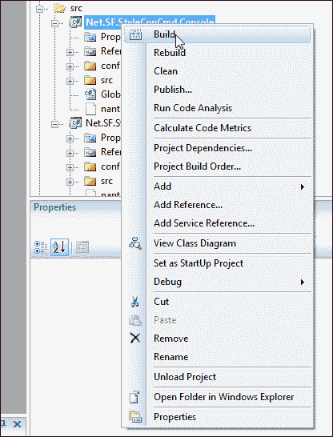

1.  现在我们有了最新的二进制文件，我们可以直接从命令行使用它们来启动 StyleCop。要这样做，打开一个命令提示符，然后转到 StyleCopCmd 目录，并输入以下命令：

    ```cpp
    Net.SF.StyleCopCmd.Console.exe -ifp "((.)*(Base*)(.)*(\.cs))|((.)*(\.Designer\.cs))|(AssemblyInfo\.cs)" -sf "..\StylecopCustomRule\StylecopCustomRule.sln" -of "stylecop-report.xml"

    ```

1.  在屏幕上，唯一出现的信息是违规总数和扫描的文件列表：

    ```cpp
    Pass 1:   StylecopCustomRule.csproj - MyCustomRule.cs
    9 violations encountered.

    ```

1.  如果我们查看生成的文件，您将在您的目录中找到两个文件：

    +   `stylecop-report.xml`

    +   `stylecop-report.violations.xml`

    两者都显示由 StyleCop 生成的违规列表；唯一的区别是文件的 XML 结构。第一个遵循 StyleCopCmd 内部架构和转换文件，而第二个是 StyleCop 的裸输出。

## 它是如何工作的...

StyleCopCmd 默认附带许多选项。

在前面的例子中，我让您提供了一个解决方案文件。然而，StyleCop 允许四种类型的入口点：

+   使用 `–sf` 参数的解决方案文件

+   使用 `–pf` 参数的项目文件

+   使用 `-d` 参数的目录，可选的 `-r` 选项允许您在给定目录上强制递归

+   以及使用 `-f` 参数的文件

`ipf` 参数允许您通过提供匹配文件名的正则表达式来从 StyleCop 扫描中删除一些文件。

最后，`-of` 选项允许您指定输出文件的名称。这用于与 `–tf` 一起使用，后者用于通过 XSLT 文件转换输出。它可以提供任何类型的人类可读报告。

要获取帮助，请使用 `-?` 选项启动 StyleCopCmd；这将显示以下截图所示的可用的选项：

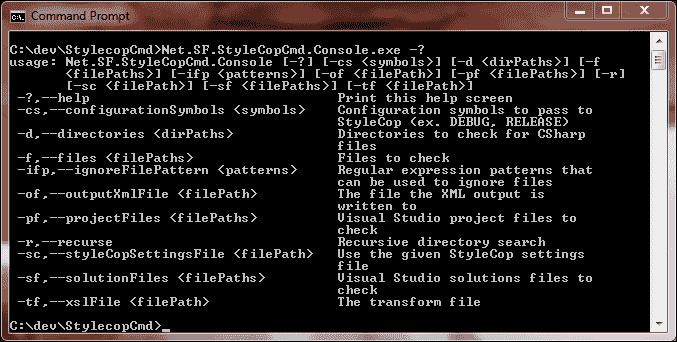

我将让您探索剩余的可能性。

## 还有更多...

StyleCopCmd 不是唯一可用于从命令行进行 StyleCop 分析的工具。正如我们稍后将要看到的，StyleCop 的 **API** 非常易于理解，尽管它们没有直接提供命令行，但已经有许多项目被制作出来以支持此功能。

### StyleCopCmd for Mono 和 Linux 系统

Ian Norton ([`github.com/inorton/StyleCopCmd`](https://github.com/inorton/StyleCopCmd)) 的努力使得 StyleCopCmd 可在 Mono 和 Linux 系统上使用。

StyleCopCmd 的原始版本仍然链接到 StyleCop 4.3，如果您想使用 StyleCop 的最新功能，您必须将项目升级到 StyleCop 4.7。

一些问题已知且文档齐全。对我来说，我遇到的主要问题是 StyleCop 使用的注册表键。它强制用户在第一次启动时以 root 权限执行 StyleCop 命令。

### StyleCop CLI

**StyleCop CLI** 与 StyleCopCmd 具有相同的宗旨。它允许在更广泛的自动化系统中从命令行集成 StyleCop。

与 StyleCopCmd 相比，此项目功能较少；最重要的缺失功能之一是转换 StyleCop 违规输出的能力。然而，该工具无需任何调整即可与 StyleCop 4.7 兼容，因为它已经内置了它。该工具可在以下网站获取：

[`sourceforge.net/projects/stylecopcli/`](http://sourceforge.net/projects/stylecopcli/)

### 构建自己的

如我之前所说，很多人已经为您开始了这项任务。然而，如果您对现有工具不满意，或者您只是想看看如何制作一个，一个好的开始是 StyleCop+ 团队制作的教程，它为您提供了如何开始构建此类工具的建议。教程可在以下网站获取：

[从您的代码中运行 StyleCop](http://stylecopplus.codeplex.com/wikipage?title=Running%20StyleCop%20from%20Your%20Code)

# 使用 NAnt 自动化 StyleCop（中级）

在这个配方中，我们将看到如何使用 StyleCopCmd 通过 NAnt 自动化我们的过程。

## 准备工作

对于这个配方，您需要具备：

+   StyleCop 4.7 已安装

+   NAnt 版本 0.89 或更高

+   在上一个食谱中使用的示例 C# 项目

我将假设您已经使用过 NAnt，我将专注于描述两种方法，以将 StyleCop 任务集成到您的 NAnt 脚本中。

## 如何做到...

### 注意

StyleCopCmd 自带其自己的 NAnt 任务。它包含在`Net.SF.StyleCopCmd.Core.dll`文件中。

1.  要将其包含在您的 NAnt 脚本中，您需要添加对该 dll 的引用，并在您的项目或目标元素中添加以下 XML 元素：

    ```cpp
    <styleCopCmd outputXmlFile="stylecop-report.xml"
                 transformFile=""
                 recursionEnabled="true"
                 ignorePatterns="AssemblyInfo\.cs"
                 processorSymbols="" 
                 styleCopSettingsFile="Stylecop.Settings" >
        <solutionFiles>
            <include name="StylecopCustomRule.sln" />
        </solutionFiles>
        <projectFiles />
        <directories />
        <files />
    </styleCopCmd>
    ```

1.  一旦我们的构建文件准备就绪，我们就可以在控制台中执行它，并获得以下输出：

    ```cpp
    NAnt 0.92 (Build 0.92.4543.0; release; 09/06/2012)
    Copyright (C) 2001-2012 Gerry Shaw
    http://nant.sourceforge.net

    Buildfile: file:///C:/dev/StylecopCustomRule/bin/test.build
    Target framework: Microsoft .NET Framework 4.0

    [styleCopCmd] Pass 1:   StylecopCustomRule.csproj - MyCustomRule.cs
    [styleCopCmd] 9 violations encountered.

    BUILD SUCCEEDED

    Total time: 1.6 seconds.

    ```

1.  与命令行版本一样，我们在目录中获得两个文件，可以在 CI 中利用这些文件来显示违规结果：

    +   `stylecop-report.xml`

    +   `stylecop-report.violations.xml`

## 它是如何工作的...

在上一个示例中，我试图向您提供完整的 NAnt 命令。在`StyleCopCmd`元素中，我们可以配置六个属性：

+   `outputXmlFile`: 此属性用于指定我们想要的结果文件。

+   `transformFile`: 此属性用于指定我们想要应用于结果文件的转换（XSLT）文件。

+   `recursionEnabled`: 此属性用于在要检查的目录中启用递归。

+   `ignorePatterns`: 此属性包含一个正则表达式模式，用于排除扫描中的文件名；在示例中，我从扫描中移除了`AssemblyInfo.cs`文件。

+   `processorSymbols`: 此属性用于指定 StyleCop 将使用的处理器符号列表（例如：`DEBUG`、`CODE_ANALYSIS`）。通常，在大多数场景中不使用。

+   `styleCopSettingsFile`: 此属性用于指定所有被扫描文件的通用设置文件。如果不存在通用设置文件，则应从任务中删除。

元素`solutionFiles`、`projectFiles`、`directories`和`files`用于指定要分析的不同类型的元素。

## 更多...

所解释的方法并非唯一可用于启动 StyleCopCmd 任务的。另一种方法是依赖于 NAnt 框架的`exec`元素。它允许您使用 StyleCopCmd 的命令行可执行文件（或如果您已创建，则使用您自己的）。该工具可在以下网站找到：

[`nant.sourceforge.net/release/0.92/help/tasks/exec.html`](http://nant.sourceforge.net/release/0.92/help/tasks/exec.html)

# 在 Jenkins/Hudson 中集成 StyleCop 分析结果（中级）

在本食谱中，我们将了解如何在 Jenkins/Hudson 作业中构建和显示 StyleCop 错误。为此，我们需要了解如何配置 Jenkins 作业，以对 C# 文件进行全面分析，以便显示项目的技术债务。由于我们希望它减少，我们还将设置作业自动记录上一次违规数量的功能。最后，如果与上一次构建相比添加了任何违规，我们将返回一个错误。

## 准备工作

对于这个食谱，您需要具备：

+   已安装 StyleCop 4.7，并选中 MSBuild 集成选项

+   Subversion 服务器

+   一个包含以下内容的运行中的 Jenkins 服务器：

    +   Jenkins 的 MSBuild 插件

    +   Jenkins 的违规插件

+   一个位于子版本仓库中的 C# 项目。

## 如何做…

1.  第一步是为您的项目构建一个有效的构建脚本。所有解决方案都有其优点和缺点。在这个配方中，我将使用 MSBuild。这里唯一的区别是我不会基于项目分离文件，而是采用“整个”解决方案：

    ```cpp
    <?xml version="1.0" encoding="utf-8" ?>
    <Project DefaultTargets="StyleCop" >
     <UsingTask TaskName="StyleCopTask" AssemblyFile="$(MSBuildExtensionsPath)\..\StyleCop 4.7\StyleCop.dll" />
      <PropertyGroup>
        <!-- Set a default value of 1000000 as maximum Stylecop violations found -->
        <StyleCopMaxViolationCount>1000000</StyleCopMaxViolationCount>
      </PropertyGroup>
      <Target Name="StyleCop">

        <!-- Get last violation count from file if exists -->
     <ReadLinesFromFile Condition="Exists('violationCount.txt')" File="violationCount.txt">
     <Output TaskParameter="Lines" PropertyName="StyleCopMaxViolationCount" />
     </ReadLinesFromFile>

        <!-- Create a collection of files to scan -->
        <CreateItem Include=".\**\*.cs">
          <Output TaskParameter="Include" ItemName="StyleCopFiles" />
        </CreateItem>

        <!-- Launch Stylecop task itself -->
        <StyleCopTask
          ProjectFullPath="$(MSBuildProjectFile)"
          SourceFiles="@(StyleCopFiles)"
          ForceFullAnalysis="true"
          TreatErrorsAsWarnings="true"
          OutputFile="StyleCopReport.xml"
          CacheResults="true"
          OverrideSettingsFile= "StylecopCustomRule\Settings.Stylecop"
          MaxViolationCount="$(StyleCopMaxViolationCount)">

          <!-- Set the returned number of violation -->
     <Output TaskParameter="ViolationCount" PropertyName="StyleCopViolationCount" />
        </StyleCopTask>

        <!-- Write number of violation founds in last build -->
     <WriteLinesToFile File="violationCount.txt" Lines="$(StyleCopViolationCount)" Overwrite="true" />
      </Target>
    </Project>
    ```

1.  之后，我们准备将被 StyleCop 引擎扫描的文件，并在其上启动 StyleCop 任务。我们将当前违规数重定向到 `StyleCopViolationCount` 属性。

1.  最后，我们将结果写入 `violationsCount.txt` 文件以找出剩余的技术债务水平。这是通过 `WriteLinesToFile` 元素完成的。

1.  现在我们已经有了我们的作业构建脚本，让我们看看如何使用 Jenkins。首先，我们必须创建 Jenkins 作业本身。我们将创建一个 **构建自由软件** 项目。之后，我们必须设置如何访问子版本仓库，如下面的屏幕截图所示：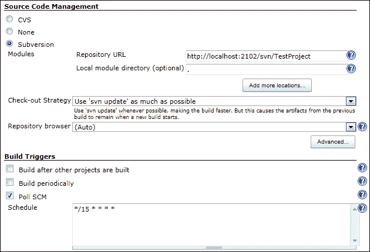

    我们还将其设置为每 15 分钟检查子版本仓库中的更改。

    然后，我们必须使用 MSBuild 任务启动我们的 MSBuild 脚本。该任务配置起来相当简单，并允许您填写三个字段：

    +   **MSBuild 版本**：您需要从 Jenkins 中配置的 MSBuild 版本中选择一个（**Jenkins** | **管理 Jenkins** | **配置系统**）

    +   **MSBuild 构建文件**：在这里我们将提供我们之前制作的 `Stylecop.proj` 文件

    +   **命令行参数**：在我们的情况下，我们没有提供任何内容，但在您 MSBuild 文件中有多个目标时可能很有用

1.  最后，我们必须配置 StyleCop 错误的显示。在这里我们将使用 Jenkins 的违规插件。它允许在同一图形上显示多个质量工具的结果。为了使其工作，您必须提供一个包含违规的 XML 文件。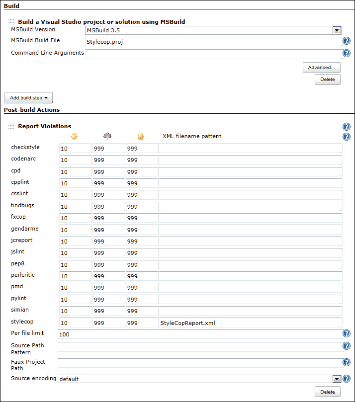

    正如您在前面的屏幕截图中看到的，Jenkins 的配置相当简单。在提供 StyleCop 的 XML 文件名后，您必须设置构建健康阈值和您想在每个违规文件的详细屏幕中显示的最大违规数。

## 它是如何工作的…

在 *如何做…* 部分的第一个部分，我们展示了一个构建脚本。让我们解释一下它做了什么：

首先，因为我们不使用预制的 MSBuild 集成，我们必须声明 StyleCop 任务定义在哪个程序集以及我们将如何调用它。这是通过使用 `UsingTask` 元素来实现的。

然后，我们尝试检索之前的违规数量并设置在项目当前阶段可接受的违规最大数量。这是 `ReadLinesFromFile` 元素的作用，它读取文件的内容。由于我们添加了一个条件来确认 `violationsCount.txt` 文件的存在，它只有在文件存在时才会执行。我们将输出重定向到属性 `StyleCopMaxViolationCount`。

之后，我们已配置 Jenkins 作业以使用 StyleCop 跟踪我们的项目。我们已配置了一些严格的规则以确保随着时间的推移没有人会添加新的违规，通过违规插件和我们对 StyleCop 的处理方式，我们能够在**违规**页面跟踪项目的 StyleCop 违规的技术债务。

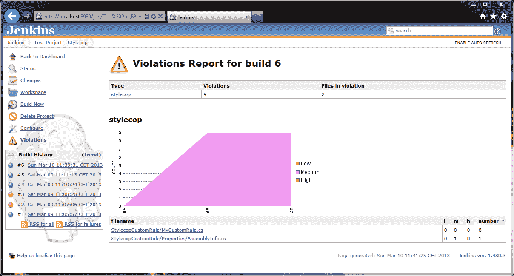

每个文件的摘要也在这里，如果我们点击其中一个，我们将能够跟踪该文件的违规。

### 小贴士

**如何处理具有自己 StyleCop 设置的多个项目**

就我所知，这是 MSBuild StyleCop 任务的限制。当我需要处理具有自己设置的多个项目时，我通常切换到使用 NAnt 或简单的批处理脚本和 StyleCopCmd，并通过 XSLT 处理 `stylecop-report.violations.xml` 文件以获取违规数量。

# 自定义文件头部（简单）

在这个配方中，我们将看到如何自定义文件头部以避免 StyleCop 违规，以及我们如何使用 Visual Studio 模板和代码片段来使我们的开发生活更轻松。

## 准备工作

对于这个配方，您需要具备：

+   已安装 StyleCop 4.7

+   Visual Studio 2008 或更高版本

## 如何操作...

### 注意

StyleCop 对头部的规则使用不多。基本上，它需要以下内容：文件名、版权信息、公司名称和摘要。

让我们尝试制作一个符合 StyleCop 的 LGPL 头部。由于没有关于如何集成 3.0 版本的建议，我们将坚持使用 2.1 版本提出的头部，该头部可以在 [`www.gnu.org/licenses/old-licenses/lgpl-2.1.html`](http://www.gnu.org/licenses/old-licenses/lgpl-2.1.html) 上查看。

1.  LGPL 许可证头部的唯一要求是给项目描述一行，项目的年份以及编写它的作者（我将使用公司名称作为作者）。因此，文件头部应该看起来像以下这样：

    ```cpp
    // <summary>
    // {one line to give the library's name and an idea of what it does.}
    // </summary>
    // <copyright file="{File}" company="{Company}">
    // Copyright (C) {year} {Company}
    //
    // This library is free software; you can redistribute it and/or
    // modify it under the terms of the GNU Lesser General Public
    // License as published by the Free Software Foundation; either
    // version 2.1 of the License, or (at your option) any later version.
    //
    // This library is distributed in the hope that it will be useful,
    // but WITHOUT ANY WARRANTY; without even the implied warranty of
    // MERCHANTABILITY or FITNESS FOR A PARTICULAR PURPOSE.  See the GNU
    // Lesser General Public License for more details.
    //
    // You should have received a copy of the GNU Lesser General Public
    // License along with this library; if not, write to the Free Software
    // Foundation, Inc., 51 Franklin Street, Fifth Floor, Boston, MA  02110-1301  USA
    // </copyright>

    ```

    ### 注意

    如您所见，我已经将项目的摘要与主要许可部分分开。我还将许可中的变量部分放在了括号中。有些人也喜欢添加一些联系信息。为此，我会在文件末尾添加一个作者元素。

1.  拥有这个许可本身就很不错；然而，在创建的每个文件中手动添加它将会相当无聊。为了自动化这个过程，我们将创建一个 Visual Studio 模板。这将帮助您在项目期间以最小的成本保持文件标题的一致性。首先，我们将创建一个新的库项目，并通过添加之前制作的 LGPL 标题来修改`Class1.cs`。现在，我们必须修改摘要部分的行以符合我们的项目描述；然后我们将修改第一行的版权信息，以便 Visual Studio 可以自动更改文本。版权部分的头两行需要按以下方式更改：

    ```cpp
    // <copyright file="$safeitemname$.cs" company="$registeredorganization$">
    // Copyright (C) $year$ $registeredorganization$

    ```

1.  在此代码中，我们仅介绍了一些 Visual Studio 模板参数：

    +   `safeitemname`：这是您在向项目添加新项目时提供的名称。

    +   `year`：这是您添加文件的那一年。

    +   `registeredorganization`：这是你在 Windows 安装过程中提供的公司名称。您可以在注册表中的`HKLM\Software\Microsoft\Windows NT\CurrentVersion\RegisteredOrganization`键下找到它。

1.  现在我们已经准备好了模板的模型，我们必须导出它。

1.  点击**文件**菜单并选择**导出模板**。

1.  选择`Class1.cs`项目，然后点击**下一步**。

1.  添加您想要包含在模板中的默认程序集，然后点击**下一步**。

1.  修改模板名称和模板描述以符合您的口味，然后点击**完成**。

当您创建新文件时，模板现在可在**我的模板**部分中找到。

## 它是如何工作的...

在这个菜谱中，我们看到如何在标题中包含您自己的许可部分。如果您的需求不是那么具体，以至于包括特定的许可，您可以查看这个网站 [`vstemplates.codeplex.com/`](http://vstemplates.codeplex.com/)，它提供了一些与 StyleCop 兼容的 Visual Studio 基本模板。

## 还有更多...

在接下来的段落中，我们将看到两个其他主题，旨在帮助您管理代码文件的标题。

### 处理标题的其他方法

虽然模板对新文件来说很理想，但您可能需要将模板应用到旧的工作中。Visual Studio 提供了多种方法来实现这一点。您至少可以依赖代码片段或宏。

**代码片段**创建起来相当简单。实际上，它是一个包含参数的简单 XML 文件，包含一段代码。让我们为 LGPL 许可创建一个：

```cpp
<?xml version="1.0" encoding="utf-8"?>
<CodeSnippets >
  <CodeSnippet Format="1.0.0">
    <Header>
      <Title>Add LGPL License</Title>
      <Author>Franck LEVEQUE</Author>
      <Description>Add LGPL License to a file</Description>
      <Shortcut>copyright</Shortcut>
    </Header>
    <Snippet>
      <Declarations>
        <Literal Editable="true">
          <ID>Description</ID>
          <ToolTip>Insert here your project description </ToolTip>
          <Default>Project description</Default>
        </Literal>
        <Literal Editable="true">
          <ID>ClassName</ID>
          <Default>ClassNamePlaceHolder</Default>
        </Literal>
        <Literal Editable="true">
          <ID>Company</ID>
          <Default>Company</Default>
        </Literal>
        <Literal Editable="true">
          <ID>year</ID>
          <Default>Year</Default>
        </Literal>
      </Declarations>
      <Code Language="csharp" Kind="" Delimiter="$"><![CDATA[// <summary>
// $Description$
// </summary>
// <copyright file="$ClassName$.cs" company="$Company$">
// Copyright (C) $year$ $Company$
//
// This library is free software; you can redistribute it and/or
// modify it under the terms of the GNU Lesser General Public
// License as published by the Free Software Foundation; either
// version 2.1 of the License, or (at your option) any later version.
//
// This library is distributed in the hope that it will be useful,
// but WITHOUT ANY WARRANTY; without even the implied warranty of
// MERCHANTABILITY or FITNESS FOR A PARTICULAR PURPOSE.  See the GNU
// Lesser General Public License for more details.
//
// You should have received a copy of the GNU Lesser General Public
// License along with this library; if not, write to the Free Software
// Foundation, Inc., 51 Franklin Street, Fifth Floor, Boston, MA  02110-1301  USA  
// </copyright>]]></Code>
    </Snippet>
  </CodeSnippet>
</CodeSnippets>
```

摘要中名为 `Header` 的第一部分描述了将在摘要菜单中显示的内容；我添加了一个 `Shortcut` 元素，以便可以通过输入版权后跟两个制表符来使用它。两个非常重要的部分是 `Declarations` 部分和 `Code` 部分。如你所见，`Code` 部分只是我们在第一部分创建的 LGPL 代码。我们只是将每个变量名替换为用 `$` 包围的参数名。`Declarations` 部分包含你在摘要代码中使用的所有参数的定义。每个 `Literal` 元素包含一个指定你可以编辑参数的 `Editable` 属性，一个 `ID` 元素，它是代码中用 `$` 包围的变量名，以及一个默认值。

你在 C# 中可用的摘要通常位于 `Documents\Visual Studio 2008\Code Snippets\Visual C#\My Code Snippets`。

### 注意

为了更容易地编辑摘要，你可以使用**摘要编辑器**。它可以在 [`snippeteditor.codeplex.com/`](http://snippeteditor.codeplex.com/) 下载。

### 公司配置

StyleCop 可以在版权部分强制执行特定的公司名称和版权文本。如果你想要确保你的项目中的所有文件都有相同的版权信息，这可能很有用。为此，你需要进入 StyleCop 设置中的**公司信息**选项卡。


**公司名称**字段对应于你的`版权`标签的`company`属性，而**版权**字段则指的是`版权`标签的内容。

# 创建自定义规则（中级）

在这个菜谱中，我们将看到如何为 StyleCop 引擎创建我们自己的自定义规则。我们还将看到如何向此规则添加参数。

## 准备工作

对于这个菜谱，你需要有以下条件：

+   已安装 StyleCop 4.7

+   Visual Studio 2008

## 如何做到这一点...

在 StyleCop 的早期阶段，微软选择的大量规则受到了批评。其中之一是开发者不能在私有实例字段的开头添加下划线。在这个菜谱中，我们将以此规则为例，尝试在非公共实例字段的开头实现它。

### 注意

此规则直接与以下 StyleCop 规则冲突：

**SA1306**: 变量名称和私有字段名称必须以小写字母开头

**SA1309**: 字段名称不能以下划线开头。

如果你想要使用此规则，你必须禁用它们。

1.  要创建我们的自定义规则，我们首先必须做的是在 Visual Studio 中创建一个新的类库项目。然后，我们需要将以下引用添加到我们的项目中：

    +   `Stylecop`

    +   `Stylecop.CSharp`

    这两个库都位于 StyleCop 的安装目录中。

1.  规则需要在代码分析器中实现。每个分析器由两个文件组成：

    +   包含将发现你的规则违规的类的文件

    +   包含规则描述的 XML 文件

1.  让我们从 XML 文件开始。这个文件应该与您的分析器类同名。其目的是描述分析器类别，描述它包含的规则，并准备您在规则中可能需要的参数。让我们看看我们自定义规则中包含的文件：

    ```cpp
    <?xml version="1.0" encoding="utf-8" ?>
    <SourceAnalyzer Name="NamingExtension">
     <Description>
        Naming rules extending Stylecop.
      </Description>
     <Properties>
        <BooleanProperty
          Name="UseTokenAnalysis"
          DefaultValue="true"
          FriendlyName="Token Analysis"
          Description="Indicates whether the analyzer of document will the token analysis or the visitor pattern analysis."
          DisplaySettings="true"/>
      </Properties>
     <Rules>
        <Rule Name="NonPublicFieldsMustBeginBy" CheckId="NE1001">
          <Context>Instance fields should be prefixed.</Context>
          <Description>Instance fields should be prefixed to allow a better visibility of non public fields.</Description>
        </Rule>
      </Rules>
    </SourceAnalyzer>
    ```

    该文件由三个重要元素组成：

    +   `描述`元素用于定义将显示给用户的类别描述。

    +   `属性`部分是可选的，允许您定义您想在分析器管理的不同规则中使用的参数。有四种可用的属性类型：`BooleanProperty`、`StringProperty`、`IntegerProperty`和`CollectionProperty`。您可以通过分析器的`GetSetting(Settings, String)`函数在代码中访问它们。

    +   `规则`部分用于描述您的分析器将管理的所有规则。

1.  接下来，我们需要创建我们的分析器类，该类继承自`SourceAnalyzer`并定义了`SourceAnalizerAttribute`，指定了该分析器适用于哪种解析器：

    ```cpp
    using System;
    using System.Linq;

    using StyleCop;
    using StyleCop.CSharp;

    namespace StylecopCustomRule
    {
        /// <summary>
        /// Description of custom rule for stylecop
        /// </summary>
     [SourceAnalyzer(typeof (CsParser))]
     public class NonPublicFieldsMustBeginBy : SourceAnalyzer
        {
     public override void AnalyzeDocument(CodeDocument document)
            {
                var csDocument = (CsDocument) document;

                // General settings
                var generalSettings = (from parser in document.Settings.ParserSettings
                             where parser.AddIn.GetType().Equals(typeof(CsParser))
                             select parser).Single();
                BooleanProperty analyseGeneratedFiles = (BooleanProperty)generalSettings[«AnalyzeGeneratedFiles»];

                if (csDocument.RootElement != null &&
                   (analyseGeneratedFiles.Value || !csDocument.RootElement.Generated))
                {
     csDocument.WalkDocument(new CodeWalkerElementVisitor<object>(this.VisitElement), null, null);
                }
            }

     private bool VisitElement(CsElement element, CsElement parentElement, object context)
            {
                if (element.ElementType == ElementType.Field && 
                    element.ActualAccess != AccessModifierType.Public &&
                    element.ActualAccess != AccessModifierType.Internal && 
                    !element.Declaration.Name.StartsWith("_"))
                {
     this.AddViolation(element, "NonPublicFieldsMustBeginBy", new object[0]);
                }

                return true;
            }
        }
    }
    ```

## 它是如何工作的...

主要入口点是`AnalyzeDocument`函数；这是文档将被分析以查看是否包含任何违规规则的地方。我们有两种选择。要么我们使用 StyleCop 提供的访问者模式，在这种情况下，我们必须为想要检查的构造类型定义代码遍历器（有四种遍历器可用：`CodeWalkerElementVisitor`、`CodeWalkerStatementVisitor`、`CodeWalkerExpressionVisitor`和`CodeWalkerQueryClauseVisitor`），或者您可以直接访问标记列表并直接检查它们。第二种方法稍微复杂一些，因为上层构造由一个或多个标记组成。为了在我们的示例中使用它，我们只需将访问者函数的调用替换为选择违反您规则的标记的**LINQ**请求。对于我们的示例，它将如下所示：

```cpp
if (csDocument.RootElement != null && (analyseGeneratedFiles.Value || !csDocument.RootElement.Generated))
{
   Array.ForEach(
       (from token in csDocument.Tokens
        let element = token.FindParentElement()
        where token.CsTokenClass == CsTokenClass.Token &&
        token.CsTokenType == CsTokenType.Other &&
        element.ElementType == ElementType.Field &&
        element.ActualAccess != AccessModifierType.Public &&
        element.ActualAccess != AccessModifierType.Internal &&
        !token.Text.StartsWith("_")
        select element).ToArray(),
        a => this.AddViolation(
        a, 
        "NonPublicFieldsMustBeginByUnderscore", 
        new object[0]));                
}
```

如您所见，强制执行我们的规则两种方式看起来相当相似，因为我们需要检查标记的父元素以轻松地确定标记是否是字段以及它是否遵守规则。为了排除元素构造中的标记，我不得不根据标记类和标记类型添加进一步的限制。

当您报告违规时，您必须注意违规的名称，因为 XML 文件中对未知规则的任何引用都将简单地丢弃违规。

在这个示例中，我们看到了如何实现一个规则。然而，您必须记住，分析器被设计成允许您创建一组规则，而不仅仅是单个规则。我们还看到了分析器的核心方法是`AnalyzeDocument`函数；这就是您必须分析规则违规并报告它们的地方。我们还快速了解了如何设置一些属性并使用它们。

## 还有更多...

然而，自定义任务是一个很大的主题。此外，您还可以自定义 StyleCop 设置，对规则进行单元测试，等等。

### 自定义 StyleCop 设置对话框

在分析器的 XML 文件中定义你的属性不会在 StyleCop 设置 UI 中显示它们。只有`BooleanProperty`可以通过`DisplaySettings`元素直接显示，如下面的截图所示：

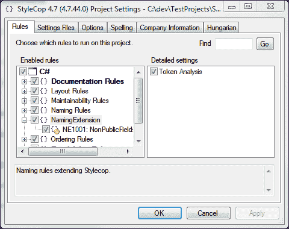

所有其他属性都需要自定义 UI。这是通过提供实现`Stylecop.IPropertyControlPage`的`UserControl`来实现的。

StyleCop SDK 中*添加自定义 StyleCop 设置页面*部分提供了一个非常好的教程。

### 单元测试你的规则

单元测试你的规则非常重要，并且可以相当容易地实现。为了这样做，我们必须依赖 StyleCop 团队提供的集成 API。在这个食谱代码中，我创建了一个项目，使用 NUnit 2.6.2 来单元测试我的规则。

由于只有一个规则，我没有在基类中抽象 StyleCop 集成，但应该这样做，因为所有规则都将依赖于相同的代码实现。

我还使用了放置在`TestFiles`目录中的测试文件。

# 在你的工具中集成 StyleCop（高级）

在这个食谱中，我们将看到如何将 StyleCop 嵌入到你的工具中。作为一个例子，我们将为 MonoDevelop/Xamarin Studio 创建一个*实时*分析插件。

## 准备工作

对于这个食谱，你需要有：

+   已安装 StyleCop 4.7

+   Xamarin Studio 4.0 或 MonoDevelop 4.0

## 如何做到这一点...

### 注意

MonoDevelop 插件是由两个强制性组件组成的库项目：

一个描述插件、其依赖项以及运行时需要加载的 dll 文件的`addin.xml`文件，以及你的插件代码。

我们将创建一个工具菜单中的可执行命令的插件，用于激活或停用实时分析。

让我们转到与 StyleCop 分析本身相关的部分；为此，我将大量依赖这个食谱中提供的代码：

1.  我们首先在命令处理程序构造函数中初始化一个 StyleCop 控制台（`RealTimeEgine.cs`行 85-87）：

    ```cpp
    this.console = new StyleCopConsole(null, true, null, null, true);
    this.console.OutputGenerated += this.OnOutputGenerated;
    this.console.ViolationEncountered += this.OnViolationEncountered;
    ```

    `StyleCopConsole`类是 StyleCop 分析系统的主入口点，它能够运行分析并报告发现的违规。

    我们目前使用默认设置，但如果你想要嵌入特定的设置或规则分析，传递给引擎的参数非常重要。

    五个构造函数参数是：

    +   第一个参数是你想要加载的设置路径。如果设置为 null 值，则使用默认项目设置文件。

    +   第二个参数表示我们是否想要写入结果缓存文件。

    +   第三个参数是我们想要写入的输出文件路径。

    +   第四个参数是搜索解析器和分析器插件的路径列表。如果没有提供插件，则可以设置为 null。

    +   最后一个参数表示我们是否想要从核心二进制文件所在的位置的默认路径加载插件。

1.  在我们控制台初始化之后，我们指定了其输出和遇到的违规的回调函数。

1.  现在让我们看看执行代码本身（`RealTimeEgine.cs`第 166-180 行）：

    ```cpp
    Configuration configuration = new Configuration(new string[0]);
    List<CodeProject> projects = new List<CodeProject>();
    CodeProject project = new CodeProject(IdeApp.ProjectOperations.CurrentSelectedProject.BaseDirectory.GetHashCode(),IdeApp.ProjectOperations.CurrentSelectedProject.BaseDirectory, 
    configuration);

    // Add each source file to this project.                              this.console.Core.Environment.AddSourceCode(project, tmpFileName, null);
    projects.Add(project);
    this.console.Start(projects, false);
    ```

## 如何工作...

为了执行分析，我们必须定义一个`Configuration`对象，这个对象用于允许 StyleCop 分析预处理器区域（例如，如果您想分析由`#if DEBUG`标记的区域，您应该将`DEBUG`字符串添加到这个对象中）。

之后，我们配置我们的项目本身；它是我们分析文件子集的通用单元。它需要一个 ID、一个基本路径和一个配置。

然后我们添加与项目相关的每个源文件，在我们的例子中，它是由当前正在编辑的文件内容组成的临时文件。

最后，我们启动控制台进程。我们在开始时设置回调将违规和进程消息传输到主机。

插件连接到 MonoDevelop 应用的两个事件：

+   `ActiveDocumentChanged`：当活动文档被另一个文档“替换”时，会调用此事件。

+   `DocumentParsed`：当文档被 MonoDevelop 正确解析后，会调用此事件。它几乎在文本编辑器的每次修改后都会运行。

以下是该插件的序列图：


您应该查看完整的源代码，以了解插件是如何真正工作的。

## 还有更多...

当前的插件只是开始。它目前存在一些缺点（StyleCop 的首次启动）并且可以从许多方面进行改进。以下是一些改进方法：

### 添加一个配置屏幕

当前插件不可配置。虽然如果您使用 StyleCop 的默认参数且没有自定义规则，这并不是很重要，但对于成品来说将是强制性的。它至少可以定义添加 StyleCop 设置和检查自定义规则路径的方法。

### 在后台线程中执行工作

当前实现的一个最显著的缺点是，在 StyleCop 分析首次启动时，UI 会冻结一到两秒。为了防止这种情况，我们应该将 StyleCop 分析放在一个单独的线程中，以便在分析期间用户可以与界面交互。

### 改变违规的显示

在这个例子中，我使用了错误垫，但 Xamarin Studio 在报告违规时与 Resharper 类似。因此，我们应该将违规报告的位置重新定位到文本编辑器右侧的栏中。
