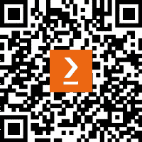

# 前言

本书教你如何将 Lua 集成到 C++中。

Lua 是一种简单高效的脚本语言，在游戏行业和嵌入式系统中得到了广泛的应用。在这两个领域，大部分的控制程序和应用都是用 C++编写的。

通过将 Lua 和 C++结合在一起，你可以为自己打开更多的门和机会。

# 本书面向的对象

本书面向愿意学习如何将 Lua 集成到他们项目中的 C++程序员。本书也可以帮助那些想通过结合 C++练习和相关信息来学习 C++的 Lua 程序员。

为了完全理解和参与本书，需要具备 C++编程语言的基本理解。尽管对 C++的深入了解可能会使阅读本书变得更容易，但你可以通过在线研究自学本书中遇到的先进 C++技术。

不需要具备 Lua 编程语言的前置知识，尽管一些 Lua 经验可能会有所帮助。你可以经常参考 Lua 参考手册，随着你在本书中的进展来学习 Lua 编程语言。

# 本书涵盖的内容

*第一章*，*让你的 C++项目 Lua-Ready*，探讨了如何获取和编译 Lua 源代码以用于自己的项目。

*第二章*，*Lua 基础*，介绍了 Lua 编程语言。

*第三章*，*如何从 C++调用 Lua*，指导你如何加载 Lua 脚本并从 C++调用 Lua 函数。

*第四章*，*将 Lua 类型映射到 C++*，深入探讨了将参数传递给 Lua 函数以及在 C++中检索返回值的机制。

*第五章*，*与 Lua 表一起工作*，训练你如何在 C++中处理 Lua 表。

*第六章*，*如何从 Lua 调用 C++*，详细解析了从 Lua 调用 C++代码的过程。

*第七章*，*与 C++类型一起工作*，深入探讨了将 C++类导出到 Lua。

*第八章*，*抽象 C++类型导出器*，指导你如何构建一个模板类，可以将任何 C++类导出到 Lua。

*第九章*，*回顾 Lua-C++通信机制*，回顾和总结了将 Lua 与 C++集成的机制。

*第十章*，*资源管理*，探讨了某些高级内存管理技术和资源管理原则。

*第十一章*，*Lua 的多线程*，使你能够在多线程环境中使用 Lua。

# 为了充分利用这本书

本书将构建一个 Lua 执行器。每一章将专注于一个领域，并为执行器添加一个功能组。如果提供了章节末尾的练习，那么这是为下一章做准备的关键部分。对于经验更丰富的读者来说，这就是为什么一些代码在最初章节中可能没有得到最佳实现。这将帮助你专注于当前的主题。

本书假设您了解 C++并且愿意学习 Lua。如果您没有成为 Lua 程序员的打算，您只需要关注相关的 Lua 概念，而不是 Lua 编程。

由于这本书不是专门教授任何编程语言的书籍，当你遇到不熟悉的某个 API 时，你可以从 Lua 或 C++参考手册中获取更多信息。你可以通过经常在线研究来填补知识空白，从而丰富你的学习之旅。

根据您的学习风格，您可以选择亲自输入所有示例以获得更多实践经验，或者从 GitHub 下载源代码，快速跳过章节，并在开始实现自己的项目时根据需要回到特定章节。

*如果您正在使用本书的数字版，我们建议您亲自输入代码或从本书的 GitHub 仓库（下一节中提供链接）获取代码。这样做将帮助您避免与代码复制和粘贴相关的任何潜在错误。*

# 下载示例代码文件

您可以从 GitHub 下载本书的示例代码文件[`github.com/PacktPublishing/Integrate-Lua-with-CPP`](https://github.com/PacktPublishing/Integrate-Lua-with-CPP)。如果代码有更新，它将在 GitHub 仓库中更新。

我们还有其他来自我们丰富图书和视频目录的代码包，可在[`github.com/PacktPublishing/`](https://github.com/PacktPublishing/)找到。查看它们吧！

# 使用的约定

本书使用了多种文本约定。

`文本中的代码`：表示文本中的代码单词、文件夹名称、文件名、文件扩展名、路径名、用户输入和程序输出。

以下是一个示例：“然后你使用`std::variant`创建一个联合类型，表示这个联合类型可能是，并且只能是预定义的 Lua 映射之一。”

代码块是这样设置的：

```cpp
void LuaExecutor::setRegistry(const LuaValue &key,
                              const LuaValue &value)
{
    pushValue(key);
    pushValue(value);
    lua_settable(L, LUA_REGISTRYINDEX);
}
```

当我们希望您注意代码块中的某个特定部分时，相关的行或项目将以粗体显示：

```cpp
int luaNew(lua_State *L)
{
    ....
    if (type == LUA_TNIL)
    {
        ...
        lua_pushcfunction(L, luaDelete);
        lua_setfield(L, -2, "__gc");
    }
    ...
}
```

**粗体**：表示新术语、重要概念或关键软件。以下是一个示例：“所有具有图形用户界面的系统都将提供一个启动 shell 的应用程序。通常，这些应用程序被称为**终端**或**控制台**。”

小贴士或重要注意事项

看起来是这样的。

# 联系我们

我们始终欢迎读者的反馈。

请将`customercare@packtpub.com`作为收件人，并在邮件主题中提及书籍标题。

**勘误表**：尽管我们已经尽最大努力确保内容的准确性，但错误仍然可能发生。如果您在这本书中发现了错误，我们将非常感激您向我们报告。请访问[www.packtpub.com/support/errata](http://www.packtpub.com/support/errata)并填写表格。

请将`copyright@packt.com`作为收件人，并在邮件中附上相关材料的链接。

**如果您有兴趣成为作者**：如果您在某个主题上具有专业知识，并且您有兴趣撰写或为书籍做出贡献，请访问[authors.packtpub.com](http://authors.packtpub.com)。

# 分享您的想法

一旦您阅读了《Lua 集成到 C++》，我们很乐意听听您的想法！请点击此处直接进入此书的亚马逊评论页面并分享您的反馈。

您的评论对我们和科技社区非常重要，并将帮助我们确保我们提供高质量的内容。

# 下载此书的免费 PDF 副本

感谢您购买此书！

您喜欢随时随地阅读，但又无法携带您的印刷书籍到处走？

您的电子书购买是否与您选择的设备不兼容？

别担心，现在，随着每本 Packt 书籍，您都可以免费获得该书的 DRM 免费 PDF 版本。

在任何地方、任何设备上阅读。从您最喜欢的技术书籍中搜索、复制和粘贴代码到您的应用程序中。

优惠远不止于此，您还可以获得独家折扣、时事通讯和每日免费内容的每日电子邮件。

按照以下简单步骤获取这些好处：

1.  扫描二维码或访问以下链接



[`packt.link/free-ebook/9781805128618`](https://packt.link/free-ebook/9781805128618)

1.  提交您的购买证明

1.  就这样！我们将直接将您的免费 PDF 和其他福利发送到您的电子邮件。

# 第一部分 – Lua 基础

本书本部分将指导您从源代码获取和编译 Lua 的过程。然后，您将探索一些设置 C++项目以使用 Lua 的选项。接下来，将简要介绍 Lua 编程语言。

因此，本部分的目标是让您为将 Lua 集成到 C++的实际工作做好准备。如果您已经熟悉其中的一些主题，可以自由跳过。

本部分包括以下章节：

+   *第一章*，*使您的 C++项目 Lua 就绪*

+   *第二章*，*Lua 基础*
