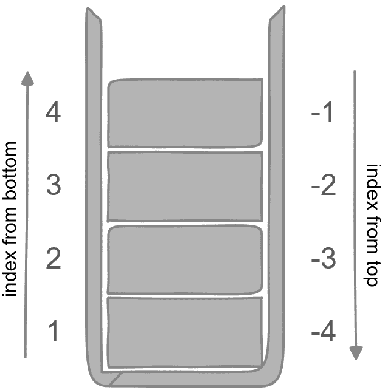
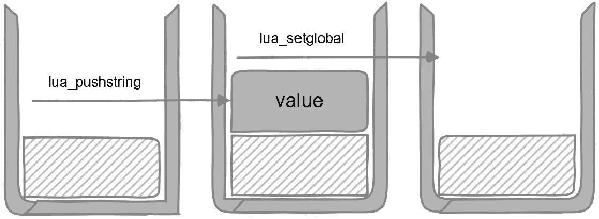

# 3

# 如何从 C++调用 Lua

在本章中，我们将实现一个 C++实用类来执行 Lua 脚本。这有两个目的。首先，通过这样做，你将详细了解如何集成 Lua 库并从 C++调用 Lua 代码。其次，你将拥有一个现成的 Lua 包装类。这有助于隐藏所有细节。我们将从一个基本的 Lua 执行器开始，然后随着我们的进展逐步添加更多功能。你将了解以下内容：

+   实现 Lua 执行器

+   执行 Lua 文件

+   执行 Lua 脚本

+   理解 Lua 堆栈

+   操作全局变量

+   调用 Lua 函数

## 技术要求

从本章开始，我们将更多地关注代码和 Lua 集成本身，并对工具链和项目设置进行简要说明。然而，你始终可以参考本书的 GitHub 仓库以获取完整的项目。请确保你满足以下要求：

+   你需要能够从源代码编译 Lua 库。*第一章*介绍了这一点。

+   你需要能够编写一些基本的 Lua 代码来测试我们将编写的 C++类。*第二章*介绍了这一点。

+   你可以创建一个`Makefile`项目，或者使用其他替代方案。在*第一章*中，我们创建了三个`Makefile`项目。我们将为这一章创建一个新的项目。

+   你可以在此处访问本章的源代码：[`github.com/PacktPublishing/Integrate-Lua-with-CPP/tree/main/Chapter03`](https://github.com/PacktPublishing/Integrate-Lua-with-CPP/tree/main/Chapter03)

# 实现 Lua 执行器

我们将逐步实现一个可重用的 C++ Lua 执行器类。让我们称它为`LuaExecutor`。我们将通过向其中添加新功能来继续改进这个执行器。

## 如何在 C++代码中包含 Lua 库

要与 Lua 库一起工作，你只需要三个头文件：

+   `lua.h`用于核心函数。这里所有内容都有`lua_`前缀。

+   `lauxlib.h`用于辅助库（`auxlib`）。辅助库在`lua.h`中的核心函数之上提供了更多辅助函数。这里所有内容都有`luaL_`前缀。

+   `lualib.h`用于加载和构建 Lua 库。例如，`luaL_openlibs`函数打开所有标准库。

Lua 是用 C 语言实现的，这三个头文件都是 C 语言的头文件。为了与 C++一起工作，Lua 提供了一个方便的包装器，`lua.hpp`，其内容如下：

```cpp
extern "C" {
#include "lua.h"
#include "lualib.h"
#include "lauxlib.h"
}
```

在你的 C++代码中，`lua.hpp`是唯一需要包含的 Lua 头文件。解决这个问题后，让我们开始我们的 Lua 执行器工作。

C++文件名扩展名

Lua 库使用`hpp`作为`lua.hpp`的头文件扩展名。这是为了将其与其他 Lua 库的 C 头文件区分开来。在本书中，对于我们的 C++代码，我们使用`h`作为声明头文件的扩展名，`hpp`用于包含所有实现的头文件，`cc`用于 C++类实现，`cpp`用于不属于类的 C++代码。这只是命名源代码文件的一种方式。请随意使用你自己的约定。

## 获取 Lua 实例

我们需要获取“一个”Lua 库的实例来执行 Lua 脚本。使用其他 C++ 库，你可能创建一个特定的类实例并与之交互。对于 Lua，你得到一个 **Lua 状态**，并将此状态传递给不同的操作。

我们的 Lua 执行器将隐藏低级 Lua 库的细节，并为你的项目提供高级 API。以下是从 `LuaExecutor.h` 类定义开始的示例：

```cpp
#include <lua.hpp>
class LuaExecutor
{
public:
    LuaExecutor();
    virtual ~LuaExecutor();
private:
    lua_State *const L;
};
```

我们定义了一个构造函数、一个析构函数和一个类型为 `lua_State` 的私有成员变量，即 Lua 状态，按照 Lua 习惯命名为 `L`。

以下是到目前为止的 `LuaExecutor.cc` 类实现的示例：

```cpp
#include "LuaExecutor.h"
LuaExecutor::LuaExecutor()
    : L(luaL_newstate())
{
    luaL_openlibs(L);
}
LuaExecutor::~LuaExecutor()
{
    lua_close(L);
}
```

类封装了 Lua 状态的创建和清理：

1.  `luaL_newstate()` 创建一个新的 Lua 状态。我们在构造函数初始化列表中这样做。

1.  `luaL_openlibs(L)` 为提供的 Lua 状态打开 Lua 标准库。这使得库函数——例如，`string.gmatch`——可用于 Lua 脚本中。

1.  `lua_close(L)` 关闭 Lua 状态并释放其分配的资源——例如，动态分配的内存等。

我们现在将更深入地了解 Lua 状态。

## 什么是 Lua 状态？

Lua 库不维护全局状态，除了 `luaL_newstate`，所有 Lua 库函数都期望 Lua 状态作为第一个参数。这使得 Lua 可重入，并且可以轻松用于多线程代码。

Lua 状态是一个名为 `lua_State` 的结构，它保存了所有 Lua 内部状态。要创建 Lua 状态，请使用 `luaL_newstate`。你可以使用 Lua 并透明地处理这个状态，而不必关心其内部细节。

我们可以将这比作 C++ 类。Lua 状态持有类成员变量和状态。Lua 库函数充当类成员函数的作用。更进一步，考虑 C++ 的 **pimpl**（指向实现的指针）惯用法：

```cpp
class Lua
{
public:
    void openlibs();
private:
    LuaState *pImpl;
};
struct LuaState
{
    // implementation details
};
```

在这个类比中，`class Lua` 是我们的伪 C++ Lua 库；`struct LuaState` 是定义并隐藏细节的私有实现。在头文件中，你只会看到它的前向声明，而不是定义。`openlibs` 公共成员函数内部使用 `pImpl`（Lua 状态）。

作为高级话题，编译后的 C++ 成员函数将 `this` 作为第一个参数。期望 `LuaState` 作为第一个参数的 Lua 库函数可以以类似的方式进行理解：`this` 和 `LuaState` 都指向类的私有细节。

所有这些信息都是为了让你在传递 Lua 状态时感到舒适，同时仍然对直接操作它感到安心。现在，让我们回到 Lua 执行器的构建中继续前进。

# 执行 Lua 文件

在 *第一章* 中，我们使用了 Lua 库来加载文件并运行脚本。我们在这里也将这样做，但将以更合适的 C++ 方式进行。在 `LuaExecutor.h` 中添加以下新代码：

```cpp
#include <string>
class LuaExecutor
{
public:
    void executeFile(const std::string &path);
private:
    void pcall(int nargs = 0, int nresults = 0);
    std::string popString();
};
```

你当然可以将所有这些成员函数都设置为 `const`，例如，`std::string popString() const`，因为在 `LuaExecutor` 中我们只透明地保持 Lua 状态 `L`，并不改变其值。在这里，我们省略它以防止代码列表中出现过多的换行符。

`executeFile` 是我们的公共函数，其他两个是内部辅助函数。在 `LuaExecutor.cc` 中，让我们首先实现 `executeFile`：

```cpp
#include <iostream>
void LuaExecutor::executeFile(const std::string &path)
{
    if (luaL_loadfile(L, path.c_str()))
    {
        std::cerr << "Failed to prepare file: "
                  << popString() << std::endl;
        return;
    }
    pcall();
}
```

我们使用 `luaL_loadfile` 加载脚本，提供文件路径。`luaL_loadfile` 将加载文件，将其编译成 **代码块**，并将其放置到 **Lua 栈** 上。我们将在稍后解释什么是代码块以及什么是 Lua 栈。

大多数 Lua 库函数在成功时将返回 0。你也可以将返回值与 `LUA_OK` 进行显式比较，它定义为 0。在我们的情况下，如果没有错误发生，我们将继续到下一步调用 `pcall`。如果有错误，我们将使用 `popString` 获取错误并将其打印出来。接下来，按照以下方式实现 `pcall`：

```cpp
void LuaExecutor::pcall(int nargs, int nresults)
{
    if (lua_pcall(L, nargs, nresults, 0))
    {
        std::cerr << "Failed to execute Lua code: "
                  << popString() << std::endl;
    }
}
```

在 `pcall` 中，我们使用 `lua_pcall` 执行编译后的代码块，该代码块已经位于栈顶。这将也会从栈中移除代码块。如果发生错误，我们将检索并打印出错误信息。

除了 `L`，`lua_pcall` 还需要三个其他参数。我们现在为它们传递 0。目前，你只需要知道第二个参数是 Lua 代码块期望的参数数量，第三个参数是 Lua 代码块返回的值数量。

最后，我们将实现最后一个函数，`popString`：

```cpp
std::string LuaExecutor::popString()
{
    std::string result(lua_tostring(L, -1));
    lua_pop(L, 1);
    return result;
}
```

这会将 Lua 栈顶的元素作为字符串弹出。我们将在你学习更多关于 Lua 栈的知识时进行更多解释。

在尝试 `LuaExecutor` 之前，我们需要解释两个概念。

## 什么是代码块？

Lua 中的编译单元称为代码块。从语法上讲，代码块只是一个代码块。当放置在栈上时，代码块是函数类型的一个值。所以，虽然不是完全准确，你可以将其视为一个函数，Lua 文件是一个隐式的函数定义。此外，函数可以在其中定义嵌套函数。

## 什么是 Lua 栈？

Lua 栈是一个栈数据结构。每个 Lua 状态内部维护一个 Lua 栈。栈中的每个元素可以持有对 Lua 数据的引用。如果你还记得函数也是一个基本的 Lua 类型，你将更舒服地认为栈元素代表一个函数。Lua 代码和 C++ 代码都可以将元素推入和从 Lua 栈中弹出，无论是显式还是隐式。我们将在本章后面讨论更多关于 Lua 栈以及我们的 `popString` 函数是如何工作的。

现在你已经了解了代码块和 Lua 栈，Lua 中的两个重要概念，我们可以测试 `LuaExecutor`。

## 到目前为止，正在测试 Lua 执行器

为了测试我们的执行器，我们需要编写一个 Lua 脚本和一些 C++ 测试代码来调用 `LuaExecutor`。编写 `script.lua` 如下所示：

```cpp
print("Hello C++")
```

这将在控制台打印 `Hello C++`。

编写 `main.cpp` 如下所示：

```cpp
#include "LuaExecutor.h"
int main()
{
    LuaExecutor lua;
    lua.executeFile("script.lua");
    return 0;
}
```

这将创建一个 `LuaExecutor` 实例并执行 Lua 脚本文件。

现在，编写 `Makefile`：

```cpp
LUA_PATH = ../lua/src
CXX = g++
CXXFLAGS = -Wall -Werror
CPPFLAGS = -I${LUA_PATH}
LDFLAGS = -L${LUA_PATH}
EXECUTABLE = executable
all: lua project
lua:
    @cd ../lua && make
project: main.cpp LuaExecutor.cc LuaExecutor.h
    $(CXX) $(CXXFLAGS) $(CPPFLAGS) $(LDFLAGS) -o
       $(EXECUTABLE) main.cpp LuaExecutor.cc -llua
clean:
    rm -f $(EXECUTABLE)
```

与 *第一章* 中的 `Makefiles` 相比，我们有一个额外的源文件 `LuaExecutor.cc` 和一个额外的头文件 `LuaExecutor.h`，`project` 目标依赖于它们。记住使用制表符进行缩进，而不是空格。如果你需要回顾，可以在 *第一章* 中找到如何编写 `Makefile` 的解释。

在编写完所有测试代码后，在终端中测试一下：

```cpp
Chapter03 % make
Chapter03 % ./executable
Hello C++
```

如果你一切操作正确，代码将编译。执行时，它将输出 `Hello C++`，这是来自 Lua 脚本文件的。

我们已经学习了如何从文件中执行 Lua 代码。现在让我们尝试直接执行一个 Lua 脚本。

# 执行 Lua 脚本

在某些项目中，你可能有一个文件层抽象，或者你可能从远程服务器获取 Lua 脚本。然后，你不能传递文件路径给 Lua 库并要求它为你加载它。你也许还希望将文件作为字符串加载以在执行之前进行更多审计。在这些情况下，你可以要求 Lua 库执行一个字符串作为 Lua 脚本。

要做到这一点，我们将向我们的 Lua 执行器添加一个新功能。在 `LuaExecutor.h` 中添加一个额外的函数：

```cpp
class LuaExecutor
{
public:
    void execute(const std::string &script);
};
```

这个新函数将直接接受字符串形式的 Lua 代码并执行它。

在 `LuaExecutor.cc` 中，添加以下实现：

```cpp
void LuaExecutor::execute(const std::string &script)
{
    if (luaL_loadstring(L, script.c_str()))
    {
        std::cerr << "Failed to prepare script: "
                  << popString() << std::endl;
        return;
    }
    pcall();
}
```

这个新函数与 `executeFile` 完全相同，只有一个区别。它调用 Lua 库的 `luaL_loadstring` 函数，将字符串编译成 Lua 代码并将编译后的代码块推入栈。然后，`pcall` 将弹出并执行代码块。

### 测试它

让我们测试一个 Lua 脚本。现在我们不再需要脚本文件。将 `main.cpp` 编写如下：

```cpp
#include "LuaExecutor.h"
int main()
{
    LuaExecutor lua;
    lua.execute("print('Hello Lua')");
    return 0;
}
```

这告诉 Lua 执行器运行 Lua 代码：

```cpp
print('Hello Lua')
```

编译并运行项目，你将看到输出 `Hello Lua`。

### 更多关于 Lua 编译和执行的内容

如前所述，`luaL_loadstring` 和 `luaL_loadfile` 将编译 Lua 代码，而 `lua_pcall` 将执行编译后的代码。在我们的 `LuaExecutor` 实现中，我们正在输出不同的错误消息——分别是 `Failed to prepare` 和 `Failed to execute`。让我们测试两种不同的场景，以更好地理解执行阶段。

#### 测试编译错误

在 `main.cpp` 中，更改执行 Lua 代码的语句，并故意删除关闭括号以制造 Lua 语法错误：

```cpp
lua.execute("print('Hello Lua'");
```

现在重新编译项目并运行它。你应该会看到以下错误输出：

```cpp
Failed to prepare script: [string "print('Hello Lua'"]:1:
')' expected near <eof>
```

`pcall` 没有被调用，因为 Lua 代码编译失败。

#### 测试运行时错误

这次，将 Lua 代码更改为以下内容：

```cpp
lua.execute("print(a / 2)");
```

没有语法错误。重新编译，运行项目，并查看新的错误：

```cpp
Failed to execute Lua code: [string "print(a / 2)"]:1:
attempt to perform arithmetic on a nil value (global 'a')
```

这是一个执行错误，因为变量 `a` 尚未定义，但我们使用了它进行除法。

到目前为止，我们有一个可重用的 Lua 执行器，它可以执行 Lua 脚本文件和 Lua 代码。在向我们的执行器添加更多功能之前，让我们先了解更多关于 Lua 栈的知识。

# 理解 Lua 栈

Lua 栈用于 C/C++ 代码和 Lua 代码之间，以便它们可以相互通信。C++ 代码和 Lua 代码都可以显式或隐式地操作这个栈。

我们已经看到了一些 Lua 库函数从栈中读取和写入。例如，`luaL_loadstring` 可以将编译后的代码块推送到栈上，而 `lua_pcall` 则从栈中弹出代码块。让我们学习一些显式操作栈的方法。

## 推送元素

Lua 库提供了将不同类型的值推送到栈上的函数：

```cpp
void lua_pushnil     (lua_State *L);
void lua_pushboolean (lua_State *L, int bool);
void lua_pushnumber  (lua_State *L, lua_Number n);
void lua_pushinteger (lua_State *L, lua_Integer n);
void lua_pushstring  (lua_State *L, const char *s);
```

有更多的 `lua_pushX` 函数，但上面显示的是基本函数。`lua_Number` 是一个类型别名，很可能是 `double` 或 `float`，而 `lua_Integer` 可以是 `long`、`long long` 或其他。这取决于 Lua 库的配置和你的操作系统默认设置。你需要决定你的项目将支持的不同平台的作用域，以及你希望如何将它们映射到 C++ 类型。在大多数情况下，将 `lua_Number` 映射到 `double` 和将 `lua_Integer` 映射到 `long` 可能已经足够好了，但如果需要，你可以以更可移植的方式实现它。

## 查询元素

我们可以使用 `lua_gettop` 来检查栈中有多少元素。栈中的第一个元素是栈底，索引为 1。第二个元素索引为 2，以此类推。你也可以通过引用栈顶来访问栈。在这个引用系统中，栈顶索引为 -1，栈顶下第二个索引为 -2，依此类推。你可以在下面的图中看到这两种引用系统：



图 3.1 – 访问栈元素的两种方式

如图中所示，每个元素都可以用两个数字来索引。当你需要访问刚刚推送到栈上的元素时，使用负数索引可以非常方便。

与用于推送元素的 `lua_pushX` 类似，我们有 `lua_toX` 来查询元素：

```cpp
int         lua_toboolean (lua_State *L, int index);
const char *lua_tostring  (lua_State *L, int index);
lua_Number  lua_tonumber  (lua_State *L, int index);
lua_Integer lua_tointeger (lua_State *L, int index);
```

查询函数始终会将值转换为请求的类型。这可能不是你想要的。在这种情况下，你可以使用 `lua_type` 来查询给定索引中元素的类型。还有相应的 `lua_isX` 函数来检查给定的栈索引是否包含某种类型。

## 弹出元素

要从栈中移除最顶部的 `n` 个元素，请使用 `lua_pop`：

```cpp
void lua_pop (lua_State *L, int n);
```

在你的项目中的高级操作中，大多数情况下你应该保持堆栈平衡。这意味着在你完成之后，堆栈大小保持与开始之前相同。与开始时相比，如果你从堆栈中移除更多元素，你将破坏堆栈，并在下次调用 Lua 时导致未定义的行为。另一方面，如果你从堆栈中移除较少的元素，你将浪费堆栈空间，并可能导致内存泄漏。因此，在操作结束时正确弹出元素非常重要。例如，在我们的 `LuaExecutor::pcall` 函数中，如果有错误，Lua 库将错误消息推送到堆栈上。因为这是由我们的操作触发的，我们需要使用 `LuaExecutor::popString` 来移除错误消息：

```cpp
std::string LuaExecutor::popString()
{
    std::string result(lua_tostring(L, -1));
    lua_pop(L, 1);
    return result;
}
```

此函数首先将堆栈顶部的元素读取为字符串，然后弹出堆栈顶部。

所有 C++ 和 Lua 之间的通信都需要使用 Lua 堆栈。有了对 Lua 堆栈的良好理解，我们可以继续学习 Lua 全局变量。

# 对全局变量进行操作

Lua 全局变量在整个 Lua 状态中都是可访问的。考虑以下 Lua 代码：

```cpp
whom = "C++"
function hello()
    print("Hello " .. whom)
end
```

`hello` 函数使用全局变量 `whom` 打印问候语。

我们如何从 C++ 获取和设置这个 Lua 全局变量？现在我们将扩展 `LuaExecutor` 来实现这一点，并使用 `hello` 函数来测试它。在本章中，我们只实现与字符串变量一起工作的方法，主要关注机制。

## 获取全局变量

你使用 Lua 库的 `lua_getglobal` 函数来获取全局变量。其原型如下：

```cpp
int lua_getglobal (lua_State *L, const char *name);
```

`lua_getglobal` 需要两个参数。第一个是 Lua 状态。第二个是全局变量的名称。`lua_getglobal` 将全局变量的值推送到堆栈上并返回其类型。类型如下定义：

```cpp
#define LUA_TNIL           0
#define LUA_TBOOLEAN       1
#define LUA_TLIGHTUSERDATA 2
#define LUA_TNUMBER        3
#define LUA_TSTRING        4
#define LUA_TTABLE         5
#define LUA_TFUNCTION      6
#define LUA_TUSERDATA      7
#define LUA_TTHREAD        8
```

你可以将返回的类型与这些常量进行比较，以查看返回的数据类型是否符合预期。

让我们扩展 `LuaExecutor` 来获取全局变量。在 `LuaExecutor.h` 中，添加一个新的函数声明：

```cpp
class LuaExecutor
{
public:
    std::string getGlobalString(const std::string &name);
};
```

此函数将获取一个 Lua 全局变量并将其作为字符串返回。在 `LuaExecutor.cc` 中实现它：

```cpp
std::string
LuaExecutor::getGlobalString(const std::string &name)
{
    const int type = lua_getglobal(L, name.c_str());
    assert(LUA_TSTRING == type);
    return popString();
}
```

我们调用 `lua_getglobal` 来获取全局变量并检查它是否为字符串类型。然后我们使用我们之前实现的 `popString` 函数从堆栈中弹出它以获取 Lua 库的错误消息。

## 设置全局变量

要从 C++ 设置 Lua 全局变量，我们同样使用堆栈。这次，我们将值推送到堆栈上。Lua 库将其弹出并分配给变量。Lua 库的 `lua_setglobal` 函数执行弹出和分配的部分。

我们将向我们的执行器添加设置全局变量的功能。在 `LuaExecutor.h` 中，添加一个额外的函数：

```cpp
class LuaExecutor
{
public:
    void setGlobal(const std::string &name,
                   const std::string &value);
};
```

它将设置一个 Lua 全局变量。变量的名称由 `name` 参数提供，值由 `value` 设置。在 `LuaExecutor.cc` 中添加实现：

```cpp
void LuaExecutor::setGlobal(const std::string &name,
                            const std::string &value)
{
    lua_pushstring(L, value.c_str());
    lua_setglobal(L, name.c_str());
}
```

代码影响 Lua 栈，如图所示：



图 3.2 – 设置全局变量

正如解释的那样，我们首先使用 `lua_pushstring` 将值推入栈中，然后调用 `lua_setglobal` 库函数来设置全局变量。我们保持了栈大小的平衡。

现在，让我们测试我们的实现。

## 测试操作

我们将获取和设置 `whom` 全局变量，并调用我们的 `hello` Lua 函数来测试我们的 Lua 执行器。将 `main.cpp` 修改如下：

```cpp
#include <iostream>
#include "LuaExecutor.h"
int main()
{
    LuaExecutor lua;
    lua.executeFile("script.lua");
    std::cout << "Lua variable whom="
              << lua.getGlobalString("whom")
              << std::endl;
    lua.execute("hello()");
    lua.setGlobal("whom", "Lua");
    std::cout << "Lua variable whom="
              << lua.getGlobalString("whom")
              << std::endl;
    lua.execute("hello()");
    return 0;
}
```

测试代码做了以下四件事情：

1.  加载 `script.lua`，其内容是引用 `whom` 全局变量的 `hello` 函数。

1.  调用我们的 `getGlobalString` 执行函数来检查 `whom` 全局变量的值，并执行 Lua `hello` 函数以从 Lua 的角度看到真相。

1.  使用我们的 `setGlobal` 执行函数将 `whom` 的值更改为 `"Lua"`。

1.  从 C++ 方面和 Lua 方面验证 `whom` 是否具有新的值。

如果你到目前为止一切操作正确，这个测试代码将输出以下内容：

```cpp
Lua variable whom=C++
Hello C++
Lua variable whom=Lua
Hello Lua
```

在 Lua 集成之旅中走这么远，做得很好。在了解获取和设置全局变量的知识后，让我们继续本章的最后一个主题：如何从 C++ 调用 Lua 函数。

# 调用 Lua 函数

在上一节中我们使用的 Lua `hello` 函数是一个很好的例子，用来展示全局变量，但它并不是你通常实现此类功能的方式。现在考虑一个更合适的实现：

```cpp
function greetings(whom)
    return "Hello " .. whom
end
```

这个 Lua `greetings` 函数期望 `whom` 作为函数参数，并返回问候字符串而不是打印它。你可以更灵活地使用问候字符串，例如，在 GUI 窗口中使用它。

在本章前面，当我们学习如何执行 Lua 脚本时，我们在执行器中实现了 `execute` 函数。我们可以用这个函数来调用 `greetings`：

```cpp
LuaExecutor lua;
lua.executeFile("script.lua");
lua.execute("greetings('Lua')");
```

但这并不是 C++ 调用 Lua 函数；这是一个 Lua 脚本调用 Lua 函数。C++ 只是编译 Lua 脚本，无法访问函数的返回值。要从 C++ 正确调用此函数，C++ 需要提供 Lua 函数参数并检索返回值。到目前为止，这应该不会令人惊讶：你需要使用 Lua 栈来完成这个操作。

## 实现函数调用

我们实际上已经学到了完成这项工作所需的一切。它的工作原理是对理解的一次飞跃。让我们先看看代码，然后再进行解释。

在 `LuaExecutor.h` 中添加一个执行 Lua 函数的函数：

```cpp
class LuaExecutor
{
public:
    std::string call(const std::string &function,
                     const std::string &param);
};
```

这个函数调用一个 Lua 函数，其名称由 `function` 提供。它向 Lua 函数传递一个参数，并期望 Lua 函数返回一个单一字符串类型的值。它现在并不非常通用，但对于目前的学习目的来说已经足够好了。

在 `LuaExecutor.cc` 中实现 `call` 函数：

```cpp
std::string
LuaExecutor::call(const std::string &function,
                  const std::string &param)
{
    int type = lua_getglobal(L, function.c_str());
    assert(LUA_TFUNCTION == type);
    lua_pushstring(L, param.c_str());
    pcall(1, 1);
    return popString();
}
```

我们在本章前面实现了 `pcall` 和 `popString`。`call` 函数执行以下操作：

1.  将 Lua 函数——在 `function` 参数中提供的名称——推入栈中。

1.  将 Lua 函数参数——在 `param` 参数中提供的值——推入栈中。

1.  调用 Lua 的 `lua_pcall` 库函数——表示 Lua 函数期望一个参数并返回一个值。

等等！代码的第一行看起来和获取全局变量完全一样，不是吗？确实如此！你还记得 `function` 是 Lua 中的基本类型之一吗？你正在将一个全局变量推入栈中，其名称是函数名，其值是函数体。实际上，你也可以用这种方式编写 Lua 函数：

```cpp
greetings = function (whom)
    return "Hello " .. whom
end
```

这写起来比较繁琐，但展示了底层实际发生的事情。

现在，让我们看看另一个相似之处：

+   在我们的 Lua `execute` 和 `executeFile` 执行函数中，我们首先将 Lua 脚本编译为一个代码块并将其推入栈中。然后我们调用 `lua_pcall`，表示参数数量为零和返回值数量为零。

+   要调用 Lua 函数，我们首先使用 `lua_getglobal` 将函数加载到栈中。然后我们将参数推入栈中。最后，我们调用 `lua_pcall` 来执行 Lua 函数，表示它需要一个参数并将返回一个值。

执行 Lua 脚本是一个简化版的调用 Lua 函数，无需传递参数和检索返回值。

通过观察相似之处而不是差异，你会更好地理解。现在让我们测试我们的工作。

## 测试

将 `main.cpp` 重新编写如下：

```cpp
#include <iostream>
#include "LuaExecutor.h"
int main()
{
    LuaExecutor lua;
    lua.executeFile("script.lua");
    std::cout << lua.call("greetings", "next adventure")
              << std::endl;
    return 0;
}
```

这将输出 `"Hello next adventure"` 并结束本章内容。

# 摘要

在本章中，我们实现了一个 Lua 执行器。它不仅能够加载和执行 Lua 脚本，还能够调用特定的 Lua 函数。我们还学习了如何获取和设置 Lua 全局变量。在章节的过程中，我们解释了 Lua 栈。

请花点时间思考在调用 Lua 函数的过程中 Lua 栈是如何变化的。

在下一章中，我们将继续改进这个 Lua 执行器，并处理 Lua 数据类型和 C++ 数据类型映射。

# 练习

1.  在 `LuaExecutor` 中实现另一个函数，用于调用具有两个参数和两个返回值的 Lua 函数。尝试使用不同的 Lua 数据类型。

1.  在 `LuaExecutor` 中，我们使用 `std::cerr` 将错误信息打印到控制台。到目前为止，调用者无法获取错误状态。设计一个接口来通知失败。你可以在 `LuaExecutor` 构造函数中传递此接口的实现。
