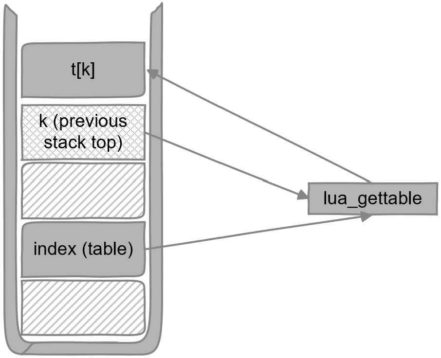

# 第五章：使用 Lua 表格

在本章中，我们将继续改进我们的 Lua 执行器以与表格一起工作。许多机制都是对上一章所学内容的扩展。你还将了解 Lua 中的**面向对象编程**（**OOP**）以及如何调用 Lua 对象方法。总的来说，Lua 对象本质上就是 Lua 表格。

我们将涵盖以下主题：

+   使用 Lua 表格条目

+   使用 Lua 数组

+   Lua 中的 OOP

+   使用 Lua 表格函数

# 技术要求

这里是本章的技术要求：

+   你可以在此章节的源代码[`github.com/PacktPublishing/Integrate-Lua-with-CPP/tree/main/Chapter05`](https://github.com/PacktPublishing/Integrate-Lua-with-CPP/tree/main/Chapter05)中找到。

+   你可以理解并执行前一个 GitHub 链接中的`begin`文件夹中的代码。如果你还没有这样做，请尝试自己完成前一章的练习，或者至少理解`begin`文件夹中的解决方案。

+   你可以理解位于 GitHub 中的`Makefile`并构建项目。或者，你也可以使用自己的方式来构建源代码。

# 使用 Lua 表格条目

**表格条目**是表格元素的键值对。Lua 表格键可以是多种数据类型——例如，函数类型。出于实际考虑，尤其是在与 C++集成时，我们只考虑字符串键和整数键。

在`script.lua`中添加一个简单的表格如下：

```cpp
position = { x = 0, y = 0 }
```

`position`通过字符串索引。我们将学习如何在 C++中读取和写入它。

## 获取表格条目值

到目前为止，在 C++代码中，我们只使用一条信息来定位 Lua 中的值。考虑我们如何实现`LuaExecutor::getGlobal`和`LuaExecutor::call`。为了定位全局变量或调用函数，我们将变量或函数的名称传递给 Lua 库方法。

要处理表格条目，我们需要两个信息——表格和表格条目键。首先，我们需要定位表格；之后，我们可以使用条目键来处理条目值。

获取条目值的 Lua 库方法声明如下：

```cpp
int lua_gettable(lua_State *L, int index);
```

等等！我们分析了我们需要两个信息来定位表格条目，不是吗？为什么`lua_gettable`除了 Lua 状态`L`之外，只接受一个有意义的参数`index`呢？还记得 Lua 栈吗？栈顶通常用于传递额外信息。引用 Lua 参考手册，`lua_gettable`执行以下操作：

*将值`t[k]`*推入栈中，其中`t`是给定索引处的值，`k`是栈顶的值。此函数从栈中弹出键，用结果值替换它。（[`www.lua.org/manual/5.4/manual.xhtml#lua_gettable`](https://www.lua.org/manual/5.4/manual.xhtml#lua_gettable)）

如解释所述，两个键都位于 Lua 栈中。如图 *图 5**.1* 所示，在调用之前，表格条目键必须位于栈顶，而表格可以位于栈中的任何其他位置。这是 Lua 的设计决策。由于您可能有时会处理同一个表格，您可以在栈中某个位置保留表格引用，以避免每次访问时都重复将其推入栈中：



图 5.1 – lua_gettable

在理解了机制之后，是时候做出设计决策了。我们应该如何在 C++ 中实现表格访问？以下是一些可能性：

+   我们可以将表格推入栈中并保留它。例如，如果我们正在处理一个复杂的表格，我们可以实现一个 C++ 类来加载栈底部的表格，并让 C++ 对象专门与该表格工作。

+   我们可以在需要时将表格推入栈中，并在不再需要时立即弹出。如果 C++ 类处理许多 Lua 值且每次推入 Lua 表格不是性能问题，这种方法效果很好。

由于我们正在实现一个通用的 Lua 执行器，我们将选择后者。在 `LuaExecutor.h` 中声明以下函数：

```cpp
class LuaExecutor
{
public:
    LuaValue getTable(const std::string &table,
                      const std::string &key);
};
```

它获取表格名称和表格条目键名称，并返回一个 `LuaValue` 实例。目前我们只关心字符串类型的键。在 `LuaExecutor.cc` 中实现如下：

```cpp
LuaValue LuaExecutor::getTable(
    const std::string &table, const std::string &key)
{
    int type = lua_getglobal(L, table.c_str());
    assert(LUA_TTABLE == type);
    lua_pushstring(L, key.c_str());
    lua_gettable(L, -2);
    auto value = popValue();
    lua_pop(L, 1);
    return value;
}
```

代码执行以下操作以获取表格条目值：

1.  它使用 `lua_getglobal` 将表格引用推入栈顶。

1.  它使用 `lua_pushstring` 将表格条目键推入栈顶。现在，表格位于栈顶的第二个位置。

1.  它调用 `lua_gettable` 弹出条目键并推入条目值。现在，条目值位于栈顶。

1.  它使用 `LuaExecutor::popValue` 弹出栈顶的 `LuaValue`。现在，栈顶再次是表格引用。

1.  它使用 `lua_pop` 弹出表格，因为它不再需要。

1.  它返回表格条目值。

在此实现中，我们限制自己仅与全局作用域中的表格一起工作。这是因为我们正在实现一个通用的 Lua 执行器。对于特殊用例，您可以实现特定的 C++ 类。

现在，让我们看看如何设置表格条目值。

## 设置表格条目值

设置表格条目值的 Lua 库函数声明如下：

```cpp
void lua_settable(lua_State *L, int index);
```

Lua 参考手册中的引言很好地解释了这一点：

*相当于* `t[k] = v`*，其中* `t` *是给定索引的值，* `v` *是栈顶的值，* `k` *是紧挨栈顶的值。从栈中弹出键和值。(*[`www.lua.org/manual/5.4/manual.xhtml#lua_settable`](https://www.lua.org/manual/5.4/manual.xhtml#lua_settable)*)*

这可以在 *图 5**.2* 中看到。现在，我们需要将条目键和条目值都推入 Lua 栈：


图 5.2 – lua_settable

在`LuaExecutor.h`中添加函数声明，如下所示：

```cpp
class LuaExecutor
{
public:
    void setTable(const std::string &table,
                  const std::string &key,
                  const LuaValue &value);
};
```

我们将值作为`LuaValue`传递。在`LuaExecutor.cc`中实现如下：

```cpp
void LuaExecutor::setTable(const std::string &table,
    const std::string &key, const LuaValue &value)
{
    int type = lua_getglobal(L, table.c_str());
    assert(LUA_TTABLE == type);
    lua_pushstring(L, key.c_str());
    pushValue(value);
    lua_settable(L, -3);
    lua_pop(L, 1);
}
```

代码的说明如下：

1.  它使用`lua_getglobal`将表引用推送到栈顶。

1.  它使用`lua_pushstring`将表条目键推送到栈上。

1.  它使用`LuaExecutor::pushValue`将表条目值推送到栈上。现在，表引用是栈顶的第三个元素。

1.  它使用`lua_settable`设置表条目。这也从栈中弹出顶部两个元素。

1.  它使用`lua_pop`弹出表。表是在*步骤 1*中推送到栈上的。

接下来，让我们测试我们到目前为止的实现。

## 使用字符串键测试表操作

在`main.cpp`中，添加以下辅助函数以打印出`position`表：

```cpp
void dumpPosition(LuaExecutor *lua)
{
    auto x = lua->getTable("position", "x");
    auto y = lua->getTable("position", "y");
    std::cout << "x=" << std::get<LuaNumber>(x).value
              << ", y=" << std::get<LuaNumber>(y).value
              << std::endl;
}
```

`dumpPosition`调用`LuaExecutor::getTable`，这是我们刚刚实现的，以获取并打印`x`字段和`y`字段。在`main()`中，将测试代码更改为如下：

```cpp
dumpPositon(lua.get());
lua->setTable("position", "x", LuaNumber::make(3));
lua->setTable("position", "y", LuaNumber::make(4));
dumpPositon(lua.get());
```

这首先打印一个`position`表，然后将`position.x`更改为`3`，将`position.y`更改为`4`，并再次打印表。如果你一切都做对了，你应该看到以下输出：

```cpp
x=0, y=0
x=3, y=4
```

接下来，让我们学习如何处理整数类型的表键。

你还记得吗？

如果一个 Lua 表只使用整数键，这个表还能被称为什么？

# 处理 Lua 数组

是的——只包含整数键的 Lua 表被称为数组或序列。在`script.lua`中添加以下数组：

```cpp
seq = { 0, 0, 0 }
```

从 C++方面来看，与字符串键相比，唯一的区别是键的数据类型。通过使用整数键，可以简单地通过重载`getTable`和`setTable`函数来处理。在`LuaExecutor.h`中添加以下声明：

```cpp
class LuaExecutor
{
public:
    LuaValue getTable(const std::string &table,
                      int index);
    void setTable(const std::string &table,
                  int index,
                  const LuaValue &value);
};
```

`index`是 Lua 数组索引——从 1 开始。不要与 Lua 栈索引混淆。在 Lua 执行器的公共 API 中，不应提及 Lua 栈或 Lua 状态。

一种实现方法是复制字符串键版本，而不是调用`lua_pushstring(L, key.c_str())`，而是调用`lua_pushinteger(L, index)`。这会起作用。但如果我们这样做，重复自己有什么意义？有没有其他技巧？

## 使用数组索引优化

Lua 非常注重速度。因为数组是 Lua 表的一种常见形式，Lua 库提供了特殊函数来处理数组，如下所示：

```cpp
void lua_geti(lua_State *L, int index, int key);
void lua_seti(lua_State *L, int index, int key);
```

这些函数接受两份数据。`index`参数是表在 Lua 栈中的位置。`key`参数是数组索引，因为它也是表条目的键。与使用`lua_gettable`和`lua_settable`相比，你不再需要将表条目键推送到栈上。`lua_seti`期望值在栈顶。

现在，让我们实现数组的`getTable`函数。在`LuaExecutor.cc`中添加以下代码：

```cpp
LuaValue LuaExecutor::getTable(
    const std::string &table, int index)
{
    int type = lua_getglobal(L, table.c_str());
    assert(LUA_TTABLE == type);
    lua_geti(L, -1, index);
    auto value = popValue();
    lua_pop(L, 1);
    return value;
}
```

代码正在执行以下操作：

1.  它从一个全局变量中获取表并将其引用推入栈顶。

1.  它使用指定的数组索引调用 `lua_geti`。Lua 库会将值推入栈中。

1.  它使用 `LuaExecutor::popValue` 将值作为 `LuaValue` 弹出。

1.  它弹出表引用。

1.  它返回值。

这根本不需要将数组索引推入栈中。同样，实现 `setTable` 函数用于数组。在 `LuaExecutor.cc` 中添加以下代码：

```cpp
void LuaExecutor::setTable(const std::string &table,
    int index, const LuaValue &value)
{
    int type = lua_getglobal(L, table.c_str());
    assert(LUA_TTABLE == type);
    pushValue(value);
    lua_seti(L, -2, index);
    lua_pop(L, 1);
}
```

之前的代码解释如下：

1.  它从一个全局变量中获取表并将其引用推入栈顶。

1.  它使用 `LuaExecutor::pushValue` 将 `index` 数组位置的值推入栈中。现在，表引用位于栈的第二个位置。

1.  它调用 `lua_seti` 来设置数组位置的值。它还从栈中弹出值。现在，表引用再次位于栈顶。

1.  它弹出表引用。

接下来，让我们测试一下。

## 测试数组索引优化

在 `main.cpp` 中，添加另一个辅助函数以打印一个 `seq` Lua 数组，如下所示：

```cpp
void dumpSeq(LuaExecutor *lua)
{
    auto v1 = lua->getTable("seq", 1);
    auto v2 = lua->getTable("seq", 2);
    auto v3 = lua->getTable("seq", 3);
    std::cout << "seq={"
              << std::get<LuaNumber>(v1).value << ", "
              << std::get<LuaNumber>(v2).value << ", "
              << std::get<LuaNumber>(v3).value << "}"
              << std::endl;
}
```

这使用 `LuaExecutor::getTable` 与整数键。将 `main()` 中的测试代码替换为以下内容：

```cpp
dumpSeq(lua.get());
lua->setTable("seq", 1, LuaNumber::make(3));
lua->setTable("seq", 2, LuaNumber::make(9));
lua->setTable("seq", 3, LuaNumber::make(27));
dumpSeq(lua.get());
```

这将 `seq` 数组更改为 `{ 3, 9, 27 }`。如果你一切都做对了，你应该看到以下输出：

```cpp
seq={0, 0, 0}
seq={3, 9, 27}
```

干得好，Lua，对于优化。还有，你自己做得很好，能走到这一步。但是字符串键呢？在现实场景中，很多时候，Lua 表不是一个数组。

## 回顾字符串键

当我们第一次学习使用字符串键来访问 Lua 表时，我们选择了更长的路径将键推入栈中。这是因为它是一个通用机制，一旦学会，你就可以改为使用其他数据类型作为表键。

对于字符串键，我们也应该期望有优化。以下是 Lua 库为此提供的函数：

```cpp
int lua_getfield(
    lua_State *L, int index, const char *k);
void lua_setfield(
    lua_State *L, int index, const char *k);
```

这些函数与 `lua_geti` 和 `lua_seti` 类似。`lua_getfield` 还会返回表条目值的类型。在本章结束时，你将得到作业，用它们重写 `LuaExecutor`。你也可以选择现在就做。

在学习如何从 Lua 表中调用函数之前，让我们编写一个 Lua 类。带有函数的 Lua 表更像是 C++ 对象。

# Lua 中的 OOP

Lua 中的 OOP 与 C++ 中的不同。在 C++ 中，你定义一个类并创建类的实例。定义的类在语言级别上是唯一的类型。

在 Lua 中，没有原生的类概念。Lua 中的 OOP 是基于原型的。如果你熟悉 JavaScript，这更像是 JavaScript。对于 Lua 表，如果一个条目不存在，你可以指示 Lua 检查另一个表，该表作为你显式引用的表的原型。

为了便于理解，我们可以将这个原型表称为“类”，将表称为“对象”。或者，你也可以将这种关系称为“继承”。尽管原型和类是两种不同的**面向对象**（**OO**）方法，但有时人们会交替使用这两个术语。

让我们编写一个类，我们将用它来学习如何调用 Lua 表函数。假设我们想要保存一个我们想去的地方的列表，并记录我们是否访问过它们。在`script.lua`中，定义一个用作原型的表，如下所示：

```cpp
Destinations = { places = {} }
setmetatable(Destinations.places, {
    __newindex = function (t, k, v)
        print("You cannot use Destinations directly")
    end,
})
```

我们定义了一个名为`Destinations`的表。它包含一个名为`places`的映射，用于跟踪位置并记录是否访问过。键将是我们想去的地方，值将是*布尔值*。在我们解释了如何使用**元表**来实现面向对象行为之后，我们将定义表函数。

## 使用 Lua 元表实现继承

由于`Destinations`首先是一个普通的表，默认情况下你可以修改它的`places`条目。我们如何防止用户直接使用它呢？你可能已经知道或者猜到了。我们需要设置一个 Lua 元表。我们可以使用`setmetatable`来覆盖表上的一些操作。这类似于 C++中的运算符重载。

在我们的例子中，我们将`__newindex` `Destinations.places`设置为一个只打印错误信息的函数。当我们将值赋给不存在的表键时，会调用`__newindex`。这类似于重载 C++的索引运算符。我们可以做得更极端，但这个简单的限制已经足够展示我们的态度。

我们还可以提供一个`__index`元方法，用于访问不存在的表键。这就是我们如何实现继承行为。假设我们有一个名为`dst`的表，它使用`Destinations`作为其原型。当我们调用`dst.wish()`向愿望列表添加一个城市时，Lua 实际上首先通过`dst["wish"]`查找函数。由于`dst`没有`wish`方法，Lua 会调用`__index`元方法，在其中我们可以调用`Destinations`表中的`wish`方法。这就是`Destinations`如何作为`dst`的原型。

要看到它的实际应用，在`script.lua`中为`Destinations`添加一个构造函数以创建新实例：

```cpp
function Destinations.new(global_name)
    local obj = { places = {} }
    setmetatable(obj, {__index = Destinations})
    if global_name then _G[global_name] = obj end
    return obj
end
```

`new`方法涉及以下步骤：

1.  它创建一个新的本地表`obj`，其中包含一个名为`places`的条目，与原型表匹配。

1.  它将`obj`的`__index`元方法设置为`Destination`表。这是你可以用来设置表作为元方法的另一种语法糖。然后，Lua 将直接将缺失键的查找重定向到原型表。

1.  如果提供了`global_name`，它将新创建的对象分配给一个全局变量。全局变量存储在唯一的表`_G`中。如果我们只使用 Lua 代码，我们就不需要这一步。这是为了让新对象在 C++中易于访问。

1.  它返回新的对象。

更多关于设计决策

我们提供了一个选项在对象创建器中设置全局变量。这有点不寻常，可以被认为是从构造函数中产生副作用。你不应该盲目地复制这种模式。考虑以下选项：

你需要创建一个 Lua 执行器，执行一些操作，然后让它运行。这就像调用一个 shell 命令。本书中的大多数示例都是这样使用 Lua 的。滥用全局作用域的可能性很小。因此，将对象分配给全局变量既方便又高效。

你需要大量地与 Lua 执行器一起工作。然后，你可以实现一个特殊的 C++ 函数来创建并保留表在栈上，另一个函数用于稍后删除它。

你需要专门与表对象一起工作。你可以在 C++ 的构造函数中创建它，并将表保持在 Lua 栈的底部，正如本章前面所指出的。

更好的做法是根本不使用 Lua 表。在这本书中，我们需要学习如何将 Lua 表与 C++ 集成，这样你就可以在需要时进行非常复杂的交互。但也许你可以更清晰地划分 C++ 领域和 Lua 领域，它们只互相发送简单的指令和结果。

在对象构造完成之后，我们可以实现其成员函数以使 `Destinations` 完成。

## 实现 Lua 类成员函数

为了实现一个功能齐全的目的地愿望清单，我们需要添加地点到愿望清单的方法、标记地点为已访问以及检查愿望清单的状态。让我们首先定义愿望清单修改函数。在 `script.lua` 中添加以下代码：

```cpp
function Destinations:wish(...)
    for _, place in ipairs{...} do
        self.places[place] = false
    end
end
function Destinations:went(...)
    for _, place in ipairs{...} do
        self.places[place] = true
    end
end
```

`wish` 函数接受可变数量的参数，将它们作为键添加到 `places` 映射中，并将它们的值设置为 `false` 以指示未访问状态。`went` 函数类似，它将参数标记为已访问。

冒号运算符 (`:`) 是一种语法糖，用于将表作为 `self` 参数传递给函数。例如，我们的 `wish` 函数声明等同于以下内容：

```cpp
function Destinations.wish(self, ...)
```

在这里，`self` 将是调用 `wish` 方法的引用表。这个 `self` 参数是大多数面向对象语言的工作方式。C++ 将它隐藏起来，并将 `this` 指针传递给编译后的成员方法。Python 需要在成员函数定义中显式使用 `self` 作为第一个参数，没有语法糖可用。但是，在调用 Python 成员函数时，你不需要显式传递 `self`。

接下来，在 `script.lua` 中实现愿望清单查询函数如下：

```cpp
function Destinations:list_visited()
    local result = {}
    for place, visited in pairs(self.places) do
        if visited then result[#result + 1] = place end
    end
    return table.unpack(result)
end
function Destinations:list_unvisited()
    local result = {}
    for place, visited in pairs(self.places) do
        if not visited then
            result[#result + 1] = place
        end
    end
    return table.unpack(result)
end
```

这些函数分别列出已访问地点和未访问地点。

## 测试它

在使用 C++ 之前，你可以在 Lua 解释器中测试 `Destinations` 类以确保其正确实现。以下是一个示例：

```cpp
Lua 5.4.6  Copyright (C) 1994-2023 Lua.org, PUC-Rio
> dofile("script.lua")
> dst = Destinations.new()
> dst:wish("London", "Paris", "Amsterdam")
> dst:went("Paris")
> dst:list_visited()
Paris
> dst:list_unvisited()
London  Amsterdam
```

你可以向愿望清单中添加一些城市，标记其中一个为已访问，并打印出清单。

在准备好 Lua 类之后，我们可以学习如何从 C++ 调用 Lua 表函数。

# 与 Lua 表函数一起工作

对于我们的 Lua 执行器，我们希望以调用全局函数相同的支持级别调用表函数。类似于 `call` 和 `vcall`，我们可以定义两个名为 `tcall` 和 `vtcall` 的函数，分别调用表函数并分别返回单个值和值列表。

我们需要向新的 C++ 成员函数中添加两条更多信息——即以下内容：

+   表名，这是显而易见的

+   是否应该将 `self` 参数传递给表函数

关于后者的更多内容：

+   当表函数不引用 `self` 并像 C++ 静态成员函数一样使用时，我们不需要传递 `self`

+   当表函数引用 `self` 并像 C++ 成员函数一样使用时，我们需要传递 `self`

让我们实现代码来巩固我们刚刚讨论的内容。

## 实现表函数支持

在 `LuaExecutor.h` 中添加以下声明：

```cpp
class LuaExecutor
{
public:
    template <typename... Ts>
    LuaValue tcall(
        const std::string &table,
        const std::string &function,
        bool shouldPassSelf,
        const Ts &...params);
    template <typename... Ts>
    std::vector<LuaValue> vtcall(
        const std::string &table,
        const std::string &function,
        bool shouldPassSelf,
        const Ts &...params);
};
```

`table` 是表名。`function` 是函数名，它是表中的一个键。`shouldPassSelf` 表示我们是否应该将表作为第一个参数传递给表函数。`params` 是函数参数的列表。

接下来，让我们在 `LuaExecutor.h` 中按照以下方式编写 `tcall` 函数；请注意，参数列表已被省略以节省空间：

```cpp
template <typename... Ts>
LuaValue LuaExecutor::tcall(...)
{
    int type = lua_getglobal(L, table.c_str());
    assert(LUA_TTABLE == type);
    type = lua_getfield(L, -1, function.c_str());
    assert(LUA_TFUNCTION == type);
    if (shouldPassSelf) {
        lua_getglobal(L, table.c_str());
    }
    for (auto param :
        std::initializer_list<LuaValue>{params...}) {
        pushValue(param);
    }
    int nparams = sizeof...(params) +
        (shouldPassSelf ? 1 : 0);
    pcall(nparams, 1);
    auto result = popValue();
    lua_pop(L, 1);
    return result;
}
```

在前面的列表中，它通过换行符分隔执行了六个步骤，如下所示：

1.  它获取一个全局表并将其推入栈中。

1.  它将表函数推入栈中。我们使用了 `lua_getfield` 快捷方式。

1.  如果 `shouldPassSelf` 为 `true`，则再次将表引用推入栈中。

1.  它推入剩余的函数参数。

1.  它调用表函数。请注意传递的参数数量。

1.  它弹出表函数的结果，弹出在 *步骤 1* 中推入的表引用，并返回函数结果。

如果你已经完成了上一章的作业，你可以在新行中插入 `dumpStack();` 来查看 Lua 栈如何变化。

仔细消化一下 `vcall` 的实现。现在，你需要自己实现 `vtcall`。

小贴士

参考 `vcall` 和 `tcall`。请注意获取返回值的数量以及你应该在哪里放置 `int stackSz = lua_gettop(L);`。

你可以使用下面的测试代码来测试你是否正确实现了 `vtcall`。

## 测试它

我们将在 C++ 中使用 Lua 的 `Destinations` 类。在 `main.cpp` 中，用以下代码替换测试代码：

```cpp
lua->tcall("Destinations", "new", false,
    LuaString::make("dst"));
lua->tcall("dst", "wish", true,
    LuaString::make("London"),
    LuaString::make("Paris"),
    LuaString::make("Amsterdam"));
lua->tcall("dst", "went", true,
    LuaString::make("Paris"));
auto visited = lua->vtcall(
    "dst", "list_visited", true);
auto unvisited = lua->vtcall(
    "dst", "list_unvisited", true);
```

这与我们在交互式 Lua 解释器中测试 `Destinations` 时所做的是同一件事。对此的解释如下：

1.  它创建了一个类的实例并将对象存储在 `dst` 全局变量中。在 `lua->tcall` 调用中，我们将 `shouldPassSelf` 设置为 `false`。

1.  它将三个城市添加到 `dst` 的愿望清单中。从现在起，我们正在使用 `dst` 并将实例作为 `self` 参数传递给表函数。

1.  它将 `Paris` 标记为已访问。

1.  它获取已访问城市的列表。

1.  它获取未访问城市的列表。

添加以下行以打印 `visited` 和 `unvisited` 列表：

```cpp
std::cout << "Visited:" << std::endl;
for (auto place : visited) {
    std::cout << std::get<LuaString>(place).value
              << std::endl;
}
std::cout << "Unvisited:" << std::endl;
for (auto place : unvisited) {
    std::cout << std::get<LuaString>(place).value
              << std::endl;
}
```

编译并运行代码。如果你一切都做得正确，你应该会看到以下输出：

```cpp
Visited:
Paris
Unvisited:
London
Amsterdam
```

恭喜！你已经在 C++ 中实现了一个调用 Lua 表格函数的机制。这到目前为止是我们学过的最复杂的逻辑！

# 概述

在本章中，我们学习了如何在 C++ 中使用 Lua 表格。我们还简要介绍了 Lua 中的面向对象编程（OOP）以及它与 C++ 中的 OOP 的不同之处。

我们还探讨了某些设计决策以及为什么 `LuaExecutor` 以这种方式实现。它是为了学习如何将 Lua 与 C++ 集成，具有可以分解为章节的结构。

到目前为止，你可以使用 `LuaExecutor` 调用大多数 Lua 脚本，尽管它有一些限制。例如，我们不支持将另一个表格（除了 `self`）作为参数传递给函数。你可以尝试自己实现这样的函数，但这可能不是一个好主意。最好是保持 Lua 和 C++ 之间的通信简单。

慢慢来，实验和实践我们所学的。到目前为止，重点是学习如何从 C++ 调用 Lua 代码。在下一章中，我们将开始学习如何从 Lua 调用 C++ 代码。

# 练习

1.  重新编写 `LuaExecutor::getTable` 和 `LuaExecutor::setTable` 的字符串键重载版本。使用 Lua 库函数 `lua_getfield` 和 `lua_setfield`。你可以使用本章中的相同测试代码来测试你是否正确实现了它们。

1.  实现 `LuaExecutor::vtcall`。无论你是否已经到达这个阶段，你都应该已经做到了。

# 第三部分 - 从 Lua 调用 C++

在你掌握了从 C++ 调用 Lua 的知识后，在这一部分，你将继续学习如何从 Lua 调用 C++。

你将首先学习如何实现和导出一个可以从 Lua 脚本中调用的 C++ 函数。然后，复杂性将逐步增加。你将导出一个 C++ 类作为 Lua 模块，并改进其导出过程。最后，你将拥有一个通用的模块导出器，可以帮助你导出任何 C++ 类到 Lua。

本部分包括以下章节：

+   *第六章*，*如何从 Lua 调用 C++*

+   *第七章*，*处理 C++ 类型*

+   *第八章*，*抽象 C++ 类型导出器*
