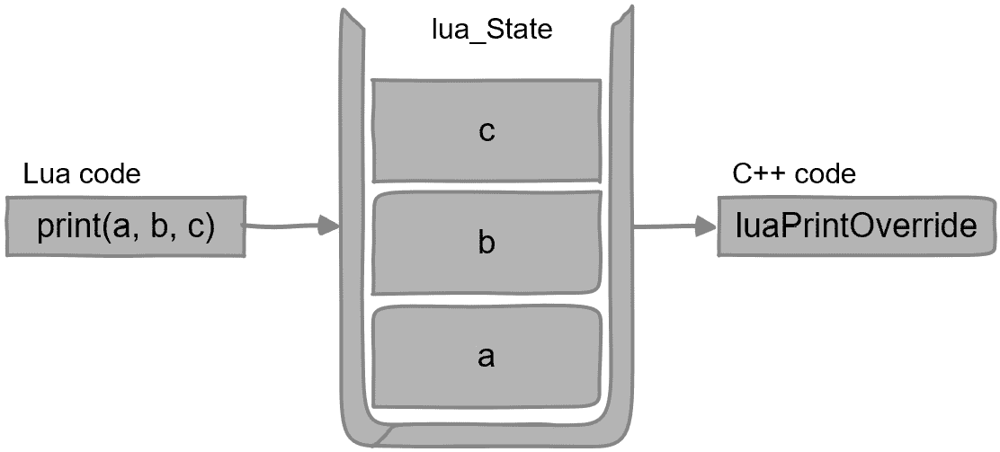

# 如何从 Lua 调用 C++

在前三个章节中，我们专注于学习如何从 C++ 调用 Lua。在本章中，我们将开始学习如何从 Lua 调用 C++。这对于你的应用程序来说很重要，因为虽然 Lua 脚本可以扩展你的 C++ 应用程序，但它们也可以从你提供的原生 C++ 代码中的函数中受益。

这也意味着我们将学习更多概念，并将不同的事物拼接在一起以使其工作。尽管章节以无缝流动的方式展开，使它们延续前一章，但你可能需要不同的节奏来吸收新概念。如果你需要练习编码，请多次阅读这些部分。

我们将涵盖以下主题：

+   如何注册 C++ 函数

+   如何覆盖 Lua 库函数

+   如何注册 C++ 模块

# 技术要求

这里是本章的技术要求：

+   你可以在 [`github.com/PacktPublishing/Integrate-Lua-with-CPP/tree/main/Chapter06`](https://github.com/PacktPublishing/Integrate-Lua-with-CPP/tree/main/Chapter06) 找到本章的源代码。

+   基于上一章的学习，你现在应该对我们的 Lua 执行器添加代码感到自信

本章将介绍许多新概念和 Lua 库 API。你可以通过在线查阅 Lua 参考手册来加强学习：[`www.lua.org/manual/5.4/`](https://www.lua.org/manual/5.4/)。

# 如何注册 C++ 函数

Lua 是用 C 编写的，因此它不能直接访问你的 C++ 类。从 Lua 调用 C++ 代码的唯一方法是通过使其调用 C++ 函数——即纯 C 函数。

## 如何为 Lua 声明 C++ 函数

要将函数注册到 Lua 中，它必须符合以下原型：

```cpp
typedef int (*lua_CFunction) (lua_State *L);
```

函数只接收一个参数，即 Lua 状态。它需要返回一个整数值，表示它产生多少返回值。Lua 状态是函数调用的私有，其栈包含从 Lua 代码调用 C++ 函数时传递的参数。C++ 函数需要将其返回值推送到栈上。

我们将首先实现一个简单的函数并将其导出到 Lua。然后，我们将看到更复杂的示例以了解更多。

## 实现你的第一个 Lua C++ 函数

让我们给我们的 Lua 执行器添加一个简单但有用的功能。它将提供一个函数来检查其版本代码，以便 Lua 代码可以查询它。在 `LuaExecutor.cc` 中，在 `#include` 指令下方，添加以下符合 `lua_CFunction` 的函数实现：

```cpp
namespace
{
    int luaGetExecutorVersionCode(lua_State *L)
    {
        lua_pushinteger(L, LuaExecutor::versionCode);
        return 1;
    }
}
```

函数将 `LuaExecutor::versionCode` 整数常量推送到其私有栈中，并返回 `1` 以指示它返回一个值。我们可以在 `LuaExecutor.h` 中如下定义此常量：

```cpp
class LuaExecutor
{
public:
    static const int versionCode = 6;
};
```

我们将使用值 `6` 表示 *第六章*。

你可能已经注意到函数位于匿名命名空间内。这是为了确保它不能被访问 `LuaExecutor.cc` 文件之外。这也帮助于逻辑代码分组。

接下来，让我们让这个函数对 Lua 可用。

## 如何将 C++ 函数注册到 Lua

有几种方法可以将 C++ 函数注册到 Lua 中。在这里，我们将查看注册 C++ 函数到 Lua 全局表中的最简单方法。在本章后面学习 C++ 模块时，我们将学习一种更合适的方法来注册 C++ 函数到它们自己的表中。您已经从 *第三章* 中知道了如何做这件事。我只需要用以下代码指出，您应该将其添加到您刚刚编写的相同匿名命名空间中：

```cpp
namespace
{
    void registerHostFunctions(lua_State *L)
    {
        lua_pushcfunction(L, luaGetExecutorVersionCode);
        lua_setglobal(L, "host_version");
    }
}
```

是的——我们只需要将其设置为 Lua 全局变量！我们使用 `lua_pushcfunction` 将 `lua_CFunction` 类型推送到栈上。然后，我们将其分配给名为 `host_version` 的全局变量。

使用全局变量来表示宿主执行器版本听起来非常合理。但您不应该过度使用 Lua 全局变量。现在，让我们试试看。

## 测试它

我们需要修改三个地方来测试我们到目前为止的进度。您可以从本章源代码的 `begin` 文件夹开始工作。

从我们的 Lua 执行器的构造函数中调用 `registerHostFunctions`，如下所示：

```cpp
LuaExecutor::LuaExecutor(...)
{
    ...
    registerHostFunctions(L);
}
```

这将我们的函数注册到 Lua。

将 `script.lua` 的内容替换如下：

```cpp
print("Host version is " .. host_version())
```

这将从 Lua 调用我们的 C++ 函数并打印出结果。

将 `main.cpp` 的内容替换为以下测试代码：

```cpp
#include "LuaExecutor.h"
#include "LoggingLuaExecutorListener.h"
int main()
{
    auto listener = std::make_unique<
        LoggingLuaExecutorListener>();
    auto lua = std::make_unique<LuaExecutor>(*listener);
    lua->executeFile("script.lua");
    return 0;
}
```

这将测试代码重置为仅创建 Lua 执行器并运行 `scripts.lua`。运行项目，如果您一切操作正确，您应该看到以下输出：

```cpp
Host version is 6
```

恭喜！您已经从 Lua 代码中调用了第一个 C++ 函数。基于这次学习，让我们来看看如何覆盖 Lua 库函数。

# 如何覆盖 Lua 库函数

为什么您想要覆盖 Lua 库函数？首先，这有助于以渐进的方式学习在 Lua 中调用 C++ 函数，然后再学习 C++ 模块。其次，但更重要的是，这是实际项目中的常见需求。

假设您正在制作一个游戏，其中资源打包在一个私有存档中，而您的 Lua 脚本需要访问它们。覆盖 Lua 的 `io` 和 `file` 库可以为您的 Lua 开发者提供无缝的体验，并在同时加强安全性。您可以确保 Lua 脚本只能访问您希望它们访问的资源，而不会访问宿主文件系统上的其他内容。当您的用户可以更改 Lua 脚本时，这一点尤为重要。

让我们实现一个更简单的情况。我们使用 Lua 的 `print` 函数来输出调试信息。我们希望将 Lua 调试输出与 C++ 输出合并，以便我们可以在同一位置按打印时间顺序获取所有日志。

## 重新实现 Lua 的 print 函数

因为 Lua 的 `print` 函数可以接受可变数量的参数，所以我们需要在我们的实现中考虑这一点。在 `LuaExecutor.cc` 中，在上一节中的命名空间下方，添加 *另一个* 命名空间，如下所示：

```cpp
namespace
{
    int luaPrintOverride(lua_State *L)
    {
        int nArgs = lua_gettop(L);
        std::cout << "[Lua]";
        for (int i = 1; i <= nArgs; i++)
        {
            std::cout << " "
                      << luaL_tolstring(L, i, NULL);
        }
        std::cout << std::endl;
        return 0;
    }
}
```

当你在 Lua 中调用 `print` 函数时，`luaPrintOverride` C++ 函数最终会被调用。它接受 `lua_State` 作为单个参数，其关联的 Lua 堆栈用于传递来自 Lua 调用站点的实际参数。为了理解发生了什么，请参阅以下图表：



图 6.1 – 覆盖 Lua 打印函数

Lua 的 `print` 函数将它的参数推入调用私有的 Lua 堆栈。C++ 函数首先使用 `lua_gettop` 检查 Lua 调用站点传递的参数数量。然后，它打印出 `"[Lua]"` 以指示打印来自 Lua 而不是 C++。接下来，它遍历每个参数并打印它们，用空格分隔。最后，它返回 `0` 以告诉 Lua 库它没有要返回给调用站点的值。

为了加强

对于每个 `lua_CFunction` 调用，Lua 状态和 Lua 堆栈都是私有的。因此，堆栈中的所有内容都是由 Lua 调用站点传递的参数组成的。在推送返回值之前，您不需要从堆栈中移除它们，因为您已经告诉 Lua 库有多少个值被推入堆栈作为 C++ 函数的返回值。

接下来，让我们看看我们如何可以用我们刚刚实现的 C++ 版本覆盖 Lua 的 `print` 函数。

## 覆盖 Lua 打印函数

在相同的匿名命名空间中，添加以下函数：

```cpp
namespace
{
    void overrideLuaFunctions(lua_State *L)
    {
        const struct luaL_Reg overrides[] = {
            {"print", luaPrintOverride},
            {NULL, NULL}};
        lua_getglobal(L, "_G");
        luaL_setfuncs(L, overrides, 0);
        lua_pop(L, 1);
    }
}
```

覆盖库函数的过程包括以下步骤：

+   获取库表

+   将感兴趣的功能重新分配到你的新实现中

每行代码执行以下操作：

+   它定义了一个 `luaL_Reg` 数组，这是一个表示名称和 `lua_CFunction` 对的结构。我们将名称设置为 `"print"`，与我们要覆盖的函数名称相同。我们将函数设置为我们的新实现。数组的最后一个条目必须是 `{NULL, NULL}` 以标记定义的结束。

+   它将 `_G` Lua 表推入堆栈，因为 `print` 函数是一个全局变量，而 `_G` 表包含所有全局变量。

+   它使用 `luaL_setfuncs` 将我们的函数列表从 *步骤 1* 设置到 `_G` 表中。现在您可以忽略最后一个参数；我们将在下一节中学习它。

+   它从堆栈中弹出 `_G` 表以保持堆栈平衡。

+   此外，`luaL_Reg` 在 Lua 库中定义如下：

```cpp
typedef struct luaL_Reg {
    const char *name;
    lua_CFunction func;
} luaL_Reg;
```

覆盖 Lua 库函数实际上就像重新分配一些表键到不同的值一样简单！现在，让我们看看它是否有效。

## 测试它

与上一节类似，从我们 Lua 执行器的构造函数中调用 `overrideLuaFunctions`，如下所示：

```cpp
LuaExecutor::LuaExecutor(...)
{
    ...
    overrideLuaFunctions(L);
}
```

您不需要更改其他任何内容。使用相同的 `main.cpp` 和 `script.lua` 文件，运行项目。如果您一切都做得正确，您应该看到以下输出：

```cpp
[Lua] Host version is 6
```

输出中现在有一个 `[Lua]` 前缀，证明它是从我们的 C++ 覆盖中打印出来的，而不是 Lua 库函数。

接下来，让我们了解 C++ 模块，这是将你的 C++ 功能添加到 Lua 的首选方式。

# 如何注册 C++ 模块

在本节中，我们将导出 C++ 类实例到 Lua。你可能之前使用过或甚至实现过 Lua 模块，这些模块可以被 Lua 解释器自动找到和加载，并通过 Lua 的 `require` 函数返回。在这里，重点是集成 Lua 到 C++ 中，在这种情况下，从 C++ 执行器开始，以利用你的 C++ 应用程序的其他部分。因此，如果你之前使用过独立的 Lua 模块，这里会有所不同。

在上一章中，我们实现了一个名为 `Destinations` 的 Lua 类来跟踪我们想要去的地点。现在让我们用 C++ 重新实现它，以便我们可以将其导出到 Lua。

## 实现 C++ 类

创建两个源文件，`Destinations.h` 和 `Destinations.cc`。请记住将 `Destinations.cc` 添加到 `Makefile` 中。编写头文件如下：

```cpp
#ifndef _DESTINATIONS_H
#define _DESTINATIONS_H
#include <map>
#include <vector>
#include <string>
class Destinations
{
public:
    Destinations(const std::string &name);
    void wish(const std::vector<std::string> &places);
    void went(const std::vector<std::string> &places);
    std::vector<std::string> listVisited() const;
    std::vector<std::string> listUnvisited() const;
private:
    std::string name;
    std::map<std::string, bool> wishlist;
};
#endif // _DESTINATIONS_H
```

我们使用一个 `map` 变量来保存地点列表以及我们是否访问过它们，并且有一个 `name` 成员变量来识别实例。成员函数的命名和 Lua 版本相同，如下所示：

+   `wish` 将地点列表添加到愿望列表中，作为 `未访问`。

+   `went` 将地点列表标记为 `已访问`。

+   `listVisited` 返回已访问的地点

+   `listUnvisited` 返回未访问的地点

现在，让我们在 `Destinations.cc` 中实现成员函数。它们是普通的 C++ 函数，不使用任何 Lua 功能。因此，我们将只列出代码，不做过多解释。首先，让我们实现构造函数：

```cpp
#include "Destinations.h"
Destinations::Destinations(const std::string &name)
    : name(name), wishlist({}) {}
```

这将初始化 `wishlist` 为一个空映射。

然后，按照以下方式编写 `wish` 函数：

```cpp
void Destinations::wish(
    const std::vector<std::string> &places)
{
    for (const auto &place : places)
    {
        wishlist[place] = false;
    }
}
```

然后，按照以下方式实现 `went` 函数：

```cpp
void Destinations::went(
    const std::vector<std::string> &places)
{
    for (const auto &place : places)
    {
        wishlist[place] = true;
    }
}
```

`wish` 函数和 `went` 函数非常相似，用于标记地点为已访问或未访问。

最后，实现查询函数。按照以下方式编写 `listVisited` 函数：

```cpp
std::vector<std::string>
Destinations::listVisited() const
{
    std::vector<std::string> results;
    for (const auto &[place, visited] : wishlist)
    {
        if (visited)
        {
            results.push_back(place);
        }
    }
    return results;
}
```

然后，按照以下方式编写 `listUnvisited` 函数：

```cpp
std::vector<std::string>
Destinations::listUnvisited() const
{
    std::vector<std::string> results;
    for (const auto &[place, visited] : wishlist)
    {
        if (not visited)
        {
            results.push_back(place);
        }
    }
    return results;
}
```

在准备好 C++ 类之后，我们的下一个任务是将其导出到 Lua。

## 要导出到 Lua 的内容

将 C++ 类导出到 Lua 实际上是将其实例导出到 Lua。有时，只导出一个实例，C++ 类作为工具库工作，类似于 Lua 的 `string` 库。有时，导出多个实例，Lua 扩展了 C++ 的 **面向对象** **编程**（**OOP**）。

重要的是要注意，无论你想要导出多少个实例，过程都是相同的。当覆盖 Lua 库函数时，我们检索一个现有的表，并将其中的一些函数设置为我们的实现。要导出 C++ 类实例，类似地，我们需要做以下操作：

+   创建一个新的表

+   将我们想要导出的函数添加到表中

如果你记得我们只能导出 `lua_CFunction` 原型的函数到 Lua，你将清楚地看到我们无法直接导出我们的公共成员函数到 Lua。我们需要一些包装函数。让我们首先编写一些存根。在 `Destinations.cc` 中的 `#include` 指令下方，添加以下代码：

```cpp
namespace
{
int luaWish(lua_State *L) { return 0; }
int luaWent(lua_State *L) { return 0; }
int luaListVisited(lua_State *L) { return 0; }
int luaListUnvisited(lua_State *L) { return 0; }
const std::vector<luaL_Reg> REGS = {
    {"wish", luaWish},
    {"went", luaWent},
    {"list_visited", luaListVisited},
    {"list_unvisited", luaListUnvisited},
    {NULL, NULL}};
}
```

我们定义了四个 `lua_CFunction` 原型的包装函数和一个 `luaL_Reg` 实例的列表。我们使用 `vector` 而不是 `array`，因为在 C++ 中我们更喜欢 `vector`，除非我们不得不使用数组。

接下来，让我们设计一个可重用的机制来导出我们的包装器到 Lua。

## 设计一个可重用的导出机制

有许多种方法可以做到这一点。我们选择一种与我们的 Lua 执行器一起工作并让它注册我们的 C++ 模块的方法。首先，让我们定义一个抽象类来表示 C++ 模块。创建一个名为 `LuaModule.h` 的新文件，并按照以下内容编写其内容：

```cpp
#ifndef _LUA_MODULE_H
#define _LUA_MODULE_H
#include <lua.hpp>
#include <string>
#include <vector>
class LuaModule
{
public:
    virtual const std::string &luaName()
        const override = 0;
    virtual const std::vector<luaL_Reg> &luaRegs()
        const overrode = 0;
    virtual ~LuaModule() = default;
};
#endif // _LUA_MODULE_H
```

`LuaModule` 抽象类定义了两个抽象方法，以提供将 C++ 模块注册到 Lua 所需的数据。`luaName` 返回模块实例的名称；我们将用它作为 Lua 表的名称。`luaRegs` 返回要随其 Lua 名称一起导出的函数列表。

让我们扩展我们的 `Destinations` C++ 类以符合此协议。更改其声明如下：

```cpp
class Destinations : public LuaModule
{
public:
    ...
    const std::string &luaName() const;
    const std::vector<luaL_Reg> &luaRegs() const;
    ...
};
```

然后，将以下实现添加到 `Destinations.cc`：

```cpp
const std::string &
Destinations::luaName() const
{
    return name;
}
const std::vector<luaL_Reg> &
Destinations::luaRegs() const
{
    return REGS;
}
```

代码简单地返回实例名称作为 `luaName` 以及我们为存根定义的 `REGS` 作为 `luaRegs`。

现在是时候最终将我们的 C++ 类注册到 Lua 中了。在 `LuaExecutor.h` 中，添加如下函数声明：

```cpp
class LuaExecutor
{
public:
    void registerModule(LuaModule &module);
};
```

`registerModule` 函数将 `LuaModule` 的一个实例注册到执行器持有的 Lua 状态。

接下来，在 `LuaExecutor.cc` 中实现它：

```cpp
void LuaExecutor::registerModule(LuaModule &module)
{
    lua_createtable(L, 0, module.luaRegs().size() - 1);
    luaL_setfuncs(L, module.luaRegs().data(), 0);
    lua_setglobal(L, module.luaName().c_str());
}
```

这需要一些解释。让我们按顺序探索这里每一行代码所做的事情：

1.  它使用 `lua_createtable` 创建一个表。这个库函数将表推入堆栈。第二个参数暗示表中将使用多少元素作为序列。我们没有，所以我们传递 `0`。第三个参数暗示表中将使用多少元素作为映射。我们所有的函数都是这样使用的，所以我们传递我们的向量计数减去结束标记。这些提示有助于 Lua 中的内存分配，因为 Lua 将负责创建一个适当大小的表，以避免在以后增加表容量的不必要重新分配。

1.  它使用 `luaL_setfuncs` 将我们的函数设置到表中。这与当我们覆盖 Lua 库函数时的工作方式完全相同。现在也忽略第三个参数。`module.luaRegs().data()` 返回我们的函数列表作为数组而不是向量。`std::vector::data` 是 C++ 的一个特性。

1.  它使用 `module.luaName()` 返回的名称将刚刚创建的表分配给一个全局变量。从现在起，我们的 C++ 模块可以通过这个表访问。

将 C++ 模块导出到 Lua 可能听起来很复杂且令人印象深刻。但实际上，涉及的粘合代码并不多。将我们刚刚所做的工作与覆盖 Lua 库函数进行比较。稍作停顿，然后我们将测试我们的机制以查看它是否正常工作。

## 测试我们的机制

在 `main.cpp` 中添加几行代码，使其看起来像这样：

```cpp
#include "LuaExecutor.h"
#include "LoggingLuaExecutorListener.h"
#include "Destinations.h"
int main()
{
    auto listener = std::make_unique<
       LoggingLuaExecutorListener>();
    auto lua = std::make_unique<LuaExecutor>(*listener);
    auto wishlist = std::make_unique<Destinations>(
        "destinations");
    lua->registerModule(*wishlist.get());
    lua->executeFile("script.lua");
    return 0;
}
```

我们创建了一个 `Destinations` 类的实例，并将其命名为 `"destinations"`。然后，我们将它注册到我们的 Lua 执行器中。

现在，将以下代码添加到 `script.lua` 中：

```cpp
destinations.wish("London", "Paris", "Amsterdam")
destinations.went("Paris")
print("Visited:", destinations.list_visited())
print("Unvisited:", destinations.list_unvisited())
```

这是在做以下操作：

1.  它将伦敦、巴黎和阿姆斯特丹添加到愿望清单中。

1.  它将巴黎标记为已访问。

1.  它打印出已访问的城市。

1.  它打印出未访问的城市。

运行项目，如果您正确地遵循了所有步骤，您应该看到以下输出：

```cpp
[Lua] Visited:
[Lua] Unvisited:
```

应该没有错误，并且由于我们的包装函数只是占位符，它不会返回任何有用的内容。因此，这就是我们构建架构基础的方式。接下来，我们将专注于使其在底层工作。

## 访问 C++ 类实例

我们的包装函数是 `lua_CFunction` 类型。它们本质上是与任何类无关的 C++ 静态方法。我们如何访问正确的类实例？我们必须做一些记账。

幸运的是，Lua 提供了一种机制来保存注册的 C++ 函数的数据。它被称为 **upvalue**。Upvalue 只能通过 C/C++ 代码中关联的函数访问，并且在不同函数调用之间共享。我们可以在 upvalue 中保存类实例的指针。

为什么它被称为 upvalue？在这个阶段，如果不解释，它更容易理解，就像变量被称为变量一样。

你注意到了吗？

从之前的描述中，upvalue 在函数作用域中表现得像 C++ 静态变量。那么，为什么我们使用 upvalue 而不是静态变量？因为 upvalue 与 Lua 库中的 C++ 函数相关联。这样，我们可以使用相同的 C++ 函数，但具有不同的 upvalue。

哪种 Lua 数据类型可以用来保存 C++ 指针？我们可以使用 **userdata**。这种类型用于存储任意 C/C++ 数据。特别是，在我们的情况下，我们需要使用 **light userdata**，其目的是存储 C/C++ 指针。这对我们来说是一个完美的匹配。

总之，我们需要将类实例的 `this` 指针作为 *light userdata* 保存在 `lua_CFunction` 实现的 *upvalue* 中。

在这里，我们涉及了两个新的 Lua 概念。它们专门用于与 C/C++ 代码一起工作，因此您可能不太熟悉 Lua 编程中的它们。让我们看看代码的实际运行情况，以帮助理解。

### 如何提供 upvalue

我们将只关注注册 C++ 模块的情况。到目前为止，我们已经忽略了 `luaL_setfuncs` 的第三个参数，并且始终传递 `0`。

这个第三个参数是什么意思？它是第二个参数中提供的列表中所有函数可用的 upvalue 的计数。

你如何提供 upvalues？当然——你将它们推送到栈上！

让我们重写函数，如下注册 C++模块：

```cpp
void LuaExecutor::registerModule(LuaModule &module)
{
    lua_createtable(L, 0, module.luaRegs().size() - 1);
    int nUpvalues = module.pushLuaUpvalues(L);
    luaL_setfuncs(L, module.luaRegs().data(), nUpvalues);
    lua_setglobal(L, module.luaName().c_str());
}
```

只有两处改动。首先，我们希望在`LuaModule`中实现另一个函数，用于将 upvalues 推送到栈上，并返回推送了多少个 upvalues。然后，我们将 upvalue 计数作为`luaL_setfuncs`的第三个参数传递。

记得将`pushLuaUpvalues`添加到`LuaModule.h`中，如下所示：

```cpp
class LuaModule
{
public:
    virtual int pushLuaUpvalues(lua_State *L)
    {
        lua_pushlightuserdata(L, this);
        return 1;
    }
};
```

我们提供了一个默认实现，将`this`作为 upvalue 推送。在派生类中，它们可以重写这个函数并推送更多的 upvalues。

接下来，让我们看看我们如何访问这个 upvalue。

### 如何访问 upvalues

Lua upvalues 的访问就像它们在栈上一样，尽管它们实际上并不在栈上。所以，一个魔法栈索引`LUA_REGISTRYINDEX`被用来标记 upvalue 伪区域的开始。Lua 提供了一个`lua_upvalueindex`宏来定位你的 upvalues 的索引，所以你实际上不需要处理这个魔法数字。

这样我们就可以访问存储为 upvalue 的 C++类实例了。在`Destinations.cc`中，向匿名命名空间添加以下函数：

```cpp
namespace
{
    inline Destinations *getObj(lua_State *L)
    {
        return reinterpret_cast<Destinations *>(
            lua_touserdata(L, lua_upvalueindex(1)));
    }
}
```

我们可以使用这个辅助函数来获取实例的指针。它使用`lua_touserdata`通过伪索引从栈中获取我们的 light userdata。这个辅助函数将从我们注册的存根中调用。

为了加强

传递给`lua_CFunction`函数的 Lua 状态和栈对该函数的每次调用都是私有的。

现在我们已经弄清楚如何访问类实例，我们可以完成我们的存根。

## 完成我们的存根

将`luaWish`编写如下：

```cpp
int luaWish(lua_State *L)
{
    Destinations *obj = getObj(L);
    std::vector<std::string> places;
    int nArgs = lua_gettop(L);
    for (int i = 1; i <= nArgs; i++)
    {
        places.push_back(lua_tostring(L, i));
    }
    obj->wish(places);
    return 0;
}
```

它首先使用我们刚刚实现的`getObj`辅助函数获取类实例。然后，它将 Lua 调用站点的所有参数放入一个 vector 中。最后，它调用真实对象的方法`obj->wish`。这就是包装器的作用——它将调用路由到真实对象。

`luaWent`的代码与此类似，如下所示：

```cpp
int luaWent(lua_State *L)
{
    Destinations *obj = getObj(L);
    std::vector<std::string> places;
    int nArgs = lua_gettop(L);
    for (int i = 1; i <= nArgs; i++)
    {
        places.push_back(lua_tostring(L, i));
    }
    obj->went(places);
    return 0;
}
```

唯一的区别是它调用`obj->went`而不是其他。

最后，按照以下方式实现查询函数：

```cpp
int luaListVisited(lua_State *L)
{
    Destinations *obj = getObj(L);
    auto places = obj->listVisited();
    for (const auto &place : places)
    {
        lua_pushstring(L, place.c_str());
    }
    return places.size();
}
int luaListUnvisited(lua_State *L)
{
    Destinations *obj = getObj(L);
    auto places = obj->listUnvisited();
    for (const auto &place : places)
    {
        lua_pushstring(L, place.c_str());
    }
    return places.size();
}
```

这些函数使用对象函数获取一个位置列表，然后将列表推送到栈上以返回到 Lua 调用站点。

现在，我们已经实现了所有功能，我们可以进行测试了。

## 进行测试

我们不需要修改任何测试代码，因为我们已经使用这些函数测试了我们的存根。现在，重新编译并运行项目。

回想一下，Lua 测试代码看起来是这样的：

```cpp
destinations.wish("London", "Paris", "Amsterdam")
destinations.went("Paris")
print("Visited:", destinations.list_visited())
print("Unvisited:", destinations.list_unvisited())
```

如果你一切操作正确，你应该看到以下输出：

```cpp
[Lua] Visited: Paris
[Lua] Unvisited: Amsterdam London
```

恭喜你让它工作起来！

这章与前面的章节相比，思维模式有很大的改变。如果你需要，请花点时间反思。

# 概述

在本章中，我们学习了如何在 Lua 中调用 C++ 代码。我们首先学习了如何将一个简单的 C++ 函数注册到 Lua 中。所有注册的函数都必须符合 `lua_CFunction`。然后，我们发现了如何覆盖 Lua 库函数。最后，我们实现了一个 C++ 类并将其导出到 Lua。在过程中，我们还遇到了 *upvalue* 和 *light userdata* 的概念。

在下一章中，我们将继续我们的旅程，更详细地介绍 C++ 中的用户定义数据以及更多的数据交换机制。

# 练习

1.  在 `Destinations` 类中，我们只使用了其中一个 upvalue。添加另一个 upvalue 并对其进行实验。哪个 upvalue 对应哪个伪索引？

1.  尝试修改函数中的第二个 upvalue，看看下次函数被调用时值是否被保留。当它在另一个函数中被访问时又会怎样呢？

1.  在 `LuaType.hpp` 中，添加 `LuaType::lightuserdata` 并为其实现一个结构体，命名为 `LuaLightUserData`。在执行器和辅助函数中支持这个情况。当从 Lua 栈中弹出值时，你不需要支持这个类型。
