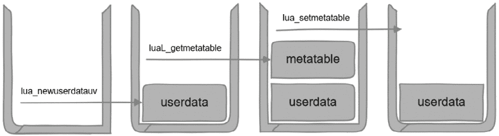
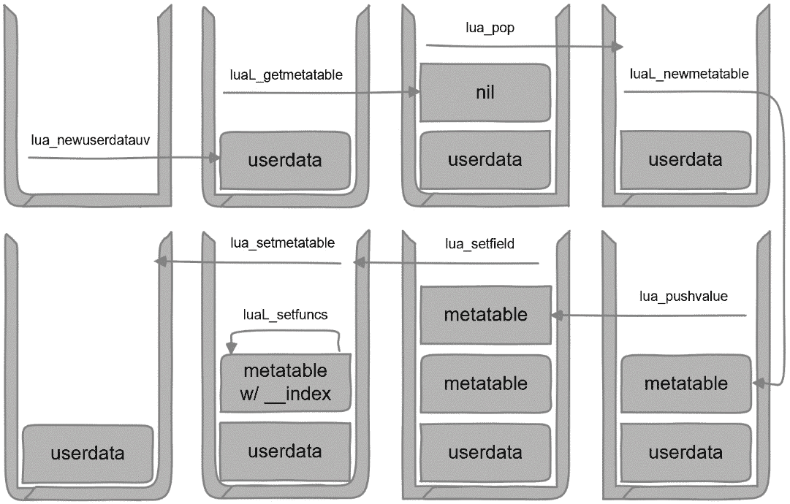
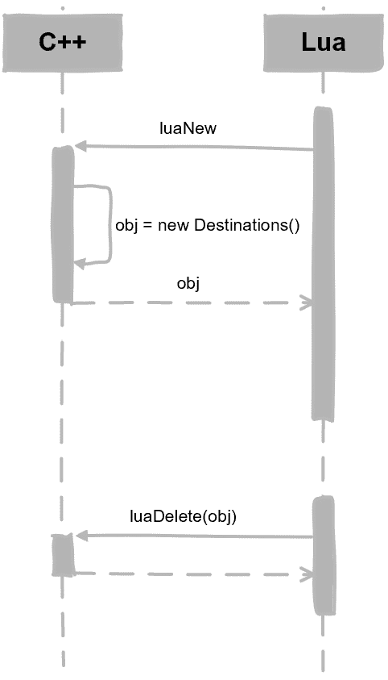

# 7

# 与 C++类型一起工作

在上一章中，我们学习了如何在 Lua 中调用 C++代码以及如何注册 C++模块。你可能已经注意到，你可以在 C++中创建对象并将它们注册到 Lua 中，但如何在 Lua 中自由创建 C++对象呢？这正是本章我们将要实现的目标。

我们将学习以下主题，并采用自顶向下的方法将 C++类型导出到 Lua：

+   如何使用 Lua 注册表

+   如何使用 userdata

+   将 C++类型导出到 Lua

# 技术要求

本章的技术要求如下：

+   你可以访问本章的源代码，请访问[`github.com/PacktPublishing/Integrate-Lua-with-CPP/tree/main/Chapter07`](https://github.com/PacktPublishing/Integrate-Lua-with-CPP/tree/main/Chapter07)。

+   上一章向您展示了如何注册 C++模块；您必须已经完成了编码问题。您可以在本书 GitHub 仓库中的`begin`文件夹中查看答案。

+   由于本章内容复杂，我们采用自顶向下的方法，以便你能在本章末尾获得一个可工作的实现。如果你更喜欢从开始就看到完整的代码，可以查看本书 GitHub 仓库中的`end`文件夹。

# 如何使用 Lua 注册表

**Lua 注册表**是一个全局表，可以被所有 C/C++代码访问。这是 C++代码可以在不同函数调用之间保持状态的地方之一。除非你使用 Lua *debug*库，否则你无法在 Lua 代码中访问这个表。然而，你不应该在生产代码中使用 debug 库；因此，注册表仅适用于 C/C++代码。

注册表与 upvalues 的比较

在上一章中，我们学习了 Lua *upvalues*。一个*upvalue*在调用之间保持特定 Lua C 函数的状态。另一方面，*注册表*可以被所有 Lua C 函数访问。

要将 C++类型导出到 Lua，我们将使用 Lua userdata 来表示类型和注册表，以便我们为类型提供函数的元表。我们首先学习注册表，然后是 userdata，最后将所有内容组合起来以将 C++类型导出到 Lua。

让我们在 Lua 执行器中添加对注册表的支持，以便我们知道如何使用它。

## 支持注册表

由于注册表是一个表，我们必须使用键来获取值，并使用键来设置值。我们可以使用`LuaValue`来表示不同类型的 Lua 值。

在`LuaExecutor.h`中添加以下函数声明：

```cpp
class LuaExecutor
{
public:
    LuaValue getRegistry(const LuaValue &key);
    void setRegistry(const LuaValue &key,
                     const LuaValue &value);
};
```

`getRegistry`将返回注册表中`key`对应的值。`setRegistry`将使用`key`将`value`设置到注册表中。

现在，让我们实现它们并学习哪些 Lua 库函数可以使用。在`LuaExecutor.cc`中实现`getRegistry`，如下所示：

```cpp
LuaValue LuaExecutor::getRegistry(const LuaValue &key)
{
    pushValue(key);
    lua_gettable(L, LUA_REGISTRYINDEX);
    return popValue();
}
```

这看起来很简单，对吧？它重用了我们从上一章中学到的两个知识点：

+   我们使用`lua_gettable`从一个表中获取值，其中栈顶是密钥，表位于由函数参数指定的栈中的位置。我们在*第五章*中学习了这一点。

+   与 upvalues 类似，注册是关于 Lua 栈的特殊用例，因此它也有一个名为`LUA_REGISTRYINDEX`的伪索引。我们第一次遇到这个伪索引是在*第六章*。

+   通过结合这两点，我们得到了一个比获取普通表值更简单的实现。这是因为我们不需要将表推入栈中。

接下来，我们将实现`setRegistry`。在`LuaExecutor.cc`中添加以下代码：

```cpp
void LuaExecutor::setRegistry(const LuaValue &key,
                              const LuaValue &value)
{
    pushValue(key);
    pushValue(value);
    lua_settable(L, LUA_REGISTRYINDEX);
}
```

这只需要调用一个 Lua 库函数：`lua_settable`。`value`位于栈顶，`key`位于次顶。这种简单性归功于 Lua API 在伪索引方面的优秀设计。

通过扩展我们的 Lua 执行器，让我们测试它以查看注册是如何工作的。

## 测试注册

在`main.cpp`中替换测试代码，如下所示：

```cpp
int main()
{
    auto listener = std::make_unique<
        LoggingLuaExecutorListener>();
    auto lua = std::make_unique<LuaExecutor>(*listener);
    auto key = LuaString::make("darabumba");
    lua->setRegistry(key,
        LuaString::make("gwentuklutar"));
    auto v1 = lua->getRegistry(key);
    lua->setRegistry(key, LuaString::make("wanghaoran"));
    auto v2 = lua->getRegistry(key);
    std::cout << getLuaValueString(key)
              << " -> " << getLuaValueString(v1)
              << " -> " << getLuaValueString(v2);
    return 0;
}
```

测试代码执行以下操作，通过换行符分隔：

+   创建`LuaExecutor`和监听器，就像往常一样

+   使用一些字符串设置一个键值对到注册中

+   将密钥设置为另一个值

+   打印出密钥、初始值和当前值

如果您一切操作正确，您应该看到以下输出：

```cpp
darabumba -> gwentuklutar -> wanghaoran
```

在上一章中，我们使用一个 upvalue 来存储 light userdata。现在，让我们通过注册来测试 light userdata。用以下操作替换注册操作：

```cpp
auto regkey = LuaLightUserData::make(listener.get());
lua->setRegistry(regkey, LuaString::make(
    "a LuaExecutorListener implementation"));
auto regValue = lua->getRegistry(regkey);
std::cout << std::hex << listener.get() << " is "
          << getLuaValueString(regValue);
```

在这里，我们使用 light userdata 作为密钥，并使用一个字符串作为值来解释密钥的含义。您应该看到以下类似的输出：

```cpp
0x14f7040d0 is a LuaExecutorListener implementation
```

您的密钥地址在每次运行中都会不同。

现在我们已经涵盖了注册并回顾了 light userdata，让我们来了解 Lua userdata。

# 如何使用 userdata

从本节开始，我们将把上一章的`Destinations`类转换并注册到 Lua 中作为一个类型，这样 Lua 代码就可以从中创建对象。在我们深入细节之前，让我们做一些高级的修改来展示我们在项目层面想要实现的内容。

## 准备 C++类型

在上一章中，我们向`Destinations`类的构造函数传递一个名称，因为我们是在 C++中创建其实例，并且需要为每个实例设置一个 Lua 名称。

在本章中，我们将导出 C++类型到 Lua。Lua 将创建对象并给它一个名字。所有更改都将发生在`Destinations`类中。我们在 Lua 执行器中实现的注册 C++模块的机制足够灵活，可以支持 C++类型的注册。

为了反映这个变化和差异，我们将修改构造函数以及模块名称的提供方式。在`Destinations.h`中修改构造函数，如下所示：

```cpp
class Destinations : public LuaModule
{
public:
    Destinations();
};
```

然后，删除以下私有成员变量：

```cpp
class Destinations : public LuaModule
private:
    std::string name;
};
```

我们将注册一个类型而不是一个实例。我们可以使用静态变量作为 Lua 表的名称。你可以在 `Destinations.cc` 中相应地更改构造函数：

```cpp
Destinations::Destinations() : wishlist({}) {}
```

现在，让我们重新实现如何提供 Lua 类型/表名称。在 `Destinations.cc` 中更改 `luaName`，使其使用静态变量：

```cpp
namespace
{
    const std::string NAME("Destinations");
}
const std::string &Destinations::luaName() const
{
    return NAME;
}
```

在匿名命名空间的开头添加一个名为 `NAME` 的字符串常量，其值为 `Destinations`，并在 `luaName` 中返回它。

最后，更改 `main.cpp` 中的测试代码，如下所示：

```cpp
int main()
{
    auto listener = std::make_unique<
        LoggingLuaExecutorListener>();
    auto lua = std::make_unique<LuaExecutor>(*listener);
    auto wishlist = std::make_unique<Destinations>();
    lua->registerModule(*wishlist.get());
    lua->executeFile("script.lua");
    return 0;
}
```

与 *第六章* 末尾的代码相比，这里唯一的改变是我们移除了 `Destinations` 类构造函数的参数。

这是我们希望在 C++ 端实现的内容。确保它能编译。从现在开始，我们将专注于重新封装 `Destinations` 类，并让 `script.lua` 从它创建对象。

接下来，让我们了解 userdata。

## 什么是 userdata？

在前一章中，我们将类的实例作为表导出，并将类成员函数作为表函数。要直接导出类型，我们将创建 userdata 而不是表。

在 *第二章* 中，我们了解到 userdata 是 Lua 中的基本类型之一，但我们没有深入探讨其细节。在前一章中，我们使用了 lightuserdata。userdata 和 lightuserdata 之间有什么区别？

userdata 是由 Lua 库通过调用 C/C++ 代码创建的任意数据序列，Lua 对其进行透明处理。另一方面，lightuserdata 必须是 C/C++ 指针。

使 userdata 更适合表示新类型的原因之一是，像表一样，你可以为其设置元方法和元表。这就是你提供类型函数并使其在 Lua 中成为有用类型的方式。

Lua 中的面向对象编程

在 *第五章* 中，我们学习了 Lua 中的面向对象编程和 `__index` 元表。如果这听起来不熟悉，请在继续之前回顾那章。

现在，让我们看看我们应该将什么放入 userdata 中，以便我们可以导出 C++ 类型。

## 设计 userdata

要创建 userdata，Lua 提供了以下函数：

```cpp
void *lua_newuserdatauv (
    lua_State *L, size_t size, int nuvalue);
```

这个函数分配了一个长度为 `size` 字节的连续内存块作为 userdata，并将 userdata 的引用压入堆栈。你还可以将用户值附加到 userdata 上。用户值的数量通过 `nuvalue` 传入。我们不会使用用户值，所以我们将传入 `0`。`lua_newuserdatauv` 返回已分配的原始内存的地址。

由于 Lua 是用 C 编写的，你可以使用 `lua_newuserdatauv` 来分配 C 数组或结构。Lua 甚至会在垃圾回收期间负责释放它。

使用 C++，我们希望 userdata 表示一个类。调用这个 Lua 库函数来分配 C++ 类既不便携也不方便。因此，我们将自己动手——我们将自己创建 C++ 对象，并使 userdata 成为对象的指针。

解耦

虽然我们将 Lua 集成到 C++ 中，但我们选择尽可能地将 C++ 方面和 Lua 方面解耦，并且只公开必要的接口。C++ 内存管理已经是一个复杂的话题。我们选择让 C++ 管理 C++ 对象的创建，并且只使用 Lua userdata 来保持指针并作为垃圾回收信号。

让我们从编写一个用于对象创建的 Lua C 函数开始。在 `Destinations.cc` 的匿名命名空间末尾，添加一个名为 `luaNew` 的函数。同时将其添加到 `REGS` 向量中：

```cpp
int luaNew(lua_State *L);
const std::vector<luaL_Reg> REGS = {
    {"new", luaNew},
    ...
    {NULL, NULL}};
int luaNew(lua_State *L)
{
    Destinations *obj = new Destinations();
    Destinations **userdata =
        reinterpret_cast<Destinations **>(
            lua_newuserdatauv(L, sizeof(obj), 0));
    *userdata = obj;
    return 1;
}
```

`luaNew` 将负责创建 `Destinations` 实例。这是一个三步过程：

首先，我们使用 `new` 在堆中创建类的实例，并将其指针存储在 `obj` 中。

然后，我们调用 `lua_newuserdatauv` 来创建一个 userdata，用于存储 `obj` 中的指针。`userdata` 的大小将是 `sizeof(obj)`，即 C++ 对象指针的大小。因为 `lua_newuserdatauv` 返回原始内存的指针，而我们已使此内存包含指向 `Destinations` 实例的指针，所以我们需要将分配的内存地址保存为一个指向指针的指针。

最后，我们将 `*userdata` 指向 `obj`。由于 `userdata` 已经在栈顶，我们可以返回 `1` 以将分配的 userdata 返回给 Lua。

当 Lua 代码通过 `luaNew` 创建 `Destinations` 实例时，Lua 方面将获得一个 userdata。

指向指针的指针

C++ 允许你创建一个指向指针的指针。在这种情况下，一个指针包含另一个指针的地址。这在纯 C++ 代码中不常用，但与 C APIs 交互时可能很有用。Lua 库是一个 C 库。

接下来，让我们准备 `script.lua`，以便它可以使用 C++ 类型。

## 准备 Lua 脚本

替换 `script.lua` 的内容，如下所示：

```cpp
dst = Destinations.new()
dst:wish("London", "Paris", "Amsterdam")
dst:went("Paris")
print("Visited:", dst:list_visited())
print("Unvisited:", dst:list_unvisited())
dst = Destinations.new()
dst:wish("Beijing")
dst:went("Berlin")
print("Visited:", dst:list_visited())
print("Unvisited:", dst:list_unvisited())
```

脚本的这个第一部分与上一章中使用的脚本类似，除了我们改为使用新的表名 `Destinations.new()`，并且我们切换到使用带有冒号的对象调用约定。脚本的第二部分是第一部分的重复，但使用了不同的城市名称。这是为了演示我们可以在 Lua 中创建许多 `Destinations` 实例。

如果你此时运行项目，你将看到以下错误：

```cpp
[LuaExecutor] Failed to execute: script.lua:2: attempt to index a userdata value (global 'dst')
```

目前，这是预期的。因为我们向 Lua 返回了 userdata 而不是 table，所以到目前为止，它只是一个对 Lua 来说透明的原始内存块。Lua 不知道如何在原始内存块上调用方法。如前所述，我们需要为 userdata 设置一个元表才能使其工作。我们将在下一步中这样做，以便将所有内容组合在一起。

# 将 C++ 类型导出到 Lua

在上一节中，我们将类实例的指针作为 userdata 返回给 Lua。在本节中，我们将为 userdata 导出成员函数。为此，我们需要为 userdata 设置元表。

## 为 userdata 设置元表

在 *第五章* 中，我们了解到每个表都可以有一个元表。同样，每个 userdata 也可以有一个元表。在 *第二章* 中，我们了解到在 Lua 代码中，元表需要在对象创建时设置。

在此，我们需要在 C++ 代码中设置元表，而不是为每个对象创建一个新的元表，我们可以创建一个单独的元表并将其存储在注册表中。然后，每个对象只需要引用这个单一的元表。这将提高效率并减少内存占用。Lua 库甚至为此提供了辅助函数。

首先，让我们看看代码；解释将随后进行。将 `luaNew` 的内容替换如下：

```cpp
const std::string METATABLE_NAME(
    "Destinations.Metatable");
int luaNew(lua_State *L)
{
    Destinations *obj = new Destinations();
    Destinations **userdata =
        reinterpret_cast<Destinations **>(
            lua_newuserdatauv(L, sizeof(obj), 0));
    *userdata = obj;
    int type = luaL_getmetatable(
        L, METATABLE_NAME.c_str());
    if (type == LUA_TNIL)
    {
        lua_pop(L, 1);
        luaL_newmetatable(L, METATABLE_NAME.c_str());
        lua_pushvalue(L, -1);
        lua_setfield(L, -2, "__index");
        luaL_setfuncs(L, REGS.data(), 0);
    }
    lua_setmetatable(L, 1);
    return 1;
}
```

如您所见，这里的代码通过换行符分隔。在这种情况下，我们只插入了第二部分。其余的代码保持不变。此外，我们声明了一个新的常量 `METATABLE_NAME`。您可以将它放在 `NAME` 常量之后。第二段代码执行以下操作：

1.  首先，它从注册表中获取包含 `METATABLE_NAME` 键的元表。为此使用了 `luaL_getmetatable` 库函数。

1.  如果找不到，则创建元表。我们将在稍后详细说明这一点。

1.  最后，代码部分使用 `lua_setmetatable` 将元表设置到 userdata 上。这个库函数期望元表位于栈顶。在我们的情况下，userdata 在栈中的位置通过 `1` 参数指定。`lua_setmetatable` 将从栈中弹出元表。

为了更好地理解这一点，请参阅以下图：



图 7.1 – 设置元表

前面的图显示了当元表已经在注册表中时，栈的状态如何变化。

接下来，让我们看看当元表不在注册表中时的案例。

## 为 userdata 创建元表

在我们的实现中，当 Lua 首次从 Lua 创建类实例时创建元表。具体来说，创建元表的代码如下；这是从之前的代码列表中复制的：

```cpp
    if (type == LUA_TNIL)
    {
        lua_pop(L, 1);
        luaL_newmetatable(L, METATABLE_NAME.c_str());
        lua_pushvalue(L, -1);
        lua_setfield(L, -2, "__index");
        luaL_setfuncs(L, REGS.data(), 0);
    }
```

当我们需要创建元表时，栈的状态会发生变化，如下面的图所示：



图 7.2 – 创建元表

这个过程涉及八个步骤。步骤 4 到 7 处理创建新的元表。

1.  使用 `lua_newuserdatauv` 创建一个 userdata，它包含对类实例的指针。

1.  尝试使用 `luaL_getmetatable` 从注册表中获取元表。元表尚不存在，因此我们将得到一个 nil 值。

1.  使用 `lua_pop` 从栈中弹出 nil 值。因为它没有用，并且位于 userdata 之上，我们需要将 userdata 作为栈顶返回。

1.  使用 `luaL_newmetatable` 在注册表中创建一个空的元表。

1.  使用`lua_pushvalue`将元表的引用副本推送到堆栈上。现在，我们有指向同一元表的两个引用；我们将在下一步中使用这些引用。

1.  使用`lua_setfield`将元表的`__index`字段设置为自身。这确保了我们不需要为`__index`字段创建另一个表。

1.  使用`luaL_setfuncs`将`REGS`中的类型函数设置为元表。

1.  使用`lua_setmetatable`将元表设置为 userdata。

通过这种方式，当 Lua 代码在 userdata 对象上调用方法时，它将调度到适当的 Lua C 函数包装器。

我们如何在 Lua C 包装函数中获取对象？

在上一章中，我们使用了 upvalue。尽管这仍然可以工作，但在这里已经不再适用了。让我们让 C++中的对象检索再次工作。

## 在 C++中获取对象

在`script.lua`中，我们已更改 Lua 代码，使其使用带有冒号的对象调用约定。这意味着对象将被作为第一个参数传递给 Lua C 函数。

要获取对象引用，重写`getObj`函数，如下所示：

```cpp
inline Destinations *getObj(lua_State *L)
{
    luaL_checkudata(L, 1, METATABLE_NAME.c_str());
    return *reinterpret_cast<Destinations **>(
        lua_touserdata(L, 1));
}
```

此函数从 Lua C 包装函数中调用以获取对象引用。这最初是在上一章中使用 upvalue 实现的。

首先，使用 Lua 的`luaL_checkudata`库函数，我们检查第一个参数是否是具有`METATABLE_NAME`注册表中元表的 userdata。这是一个安全措施，以确保 Lua 代码不会传递其他类型的对象。对元表名称的检查之所以有效，是因为只有 C/C++代码可以访问注册表。

然后，我们将第一个参数作为`Destinations **`的用户数据类型转换并解引用以获取对象指针。

由于我们现在在调用中从 Lua 传递对象，我们需要稍微修改我们的包装函数。

## 让包装器再次工作

在`luaWish`和`luaWent`中，我们期望得到一个城市列表。现在，我们需要排除第一个参数。只有一个字符需要更改。重写`luaWish`，如下所示：

```cpp
int luaWish(lua_State *L)
{
    Destinations *obj = getObj(L);
    std::vector<std::string> places;
    int nArgs = lua_gettop(L);
    for (int i = 2; i <= nArgs; i++)
    {
        places.push_back(lua_tostring(L, i));
    }
    obj->wish(places);
    return 0;
}
```

我们只将`for`循环中的`i = 1`更改为`i = 2`。你也可以对`luaWent`做同样的操作。

现在我们已经将`Destinations` C++类型导出到 Lua 中，让我们测试一下。

## 测试一下

由于我们在本章中采用了自顶向下的方法，所有测试代码都已完成。现在，我们只需要运行项目。

如果你一直在跟随，你应该看到以下输出：

```cpp
[Lua] Visited: Paris
[Lua] Unvisited: Amsterdam London
[Lua] Visited: Berlin
[Lua] Unvisited: Beijing
```

前两行来自`script.lua`中创建的第一个对象。最后两行来自创建的第二个对象。

如果你代码中有任何错误，你将在这里看到一些错误输出。回去看看你遗漏了什么。在本章中，代码是上一章的延续，但堆栈的状态相当复杂。

我们应该说“恭喜”吗？等等；你发现我们遗漏在导出类型中的东西了吗？

让我们在构造函数和析构函数中打印一些内容来追踪对象的生命周期。重写构造函数和析构函数，如下所示：

```cpp
Destinations::Destinations() : wishlist({})
{
    std::cout << "Destinations instance created: "
              << std::hex << this << std::endl;
}
Destinations::~Destinations()
{
    std::cout << "Destinations instance destroyed: "
              << std::hex << this << std::endl;
}
```

构造函数和析构函数只是简单地以十六进制格式输出对象指针值。

再次运行项目并查看结果。你应该会看到以下类似的输出：

```cpp
Destinations instance created: 0x12df07150
Destinations instance created: 0x12f804170
[Lua] Visited: Paris
[Lua] Unvisited: Amsterdam London
Destinations instance created: 0x12f8043a0
[Lua] Visited: Berlin
[Lua] Unvisited: Beijing
Destinations instance destroyed: 0x12df07150
```

创建了三个实例，但只有一个被销毁！被销毁的是在 `main.cpp` 中创建的，作为 `Destinations` 类原型的那个。这意味着我们在 Lua 中泄漏了对象！

我们需要修复这个问题！

## 提供一个终结器

你想知道为什么会有内存泄漏吗？

这是因为 Lua 使用垃圾回收。我们分配一个 userdata 并将其用作指针。当 userdata 在 Lua 中超出作用域时，这个指针会被垃圾回收。C++ 对象本身不会被删除。

Lua 完美支持以这种方式使用 userdata，但你需要在关联的 userdata 被垃圾回收时帮助 Lua 删除对象。为了帮助 Lua，你可以在元表中提供一个 `__gc` 元方法。这被称为**终结器**。它在垃圾回收过程中被调用以删除你的实际对象。

让我们为 `Destinations` 类型提供一个名为 `luaDelete` 的终结器。在 `luaNew` 之上添加另一个 Lua C 函数：

```cpp
int luaDelete(lua_State *L)
{
    Destinations *obj = getObj(L);
    delete obj;
    return 0;
}
```

很简单，对吧？Lua 在垃圾回收期间将 userdata 对象传递给终结器。

现在，让我们进行注册。在 `luaNew` 中添加两行，如下所示：

```cpp
int luaNew(lua_State *L)
{
    ....
    if (type == LUA_TNIL)
    {
        ...
        lua_pushcfunction(L, luaDelete);
        lua_setfield(L, -2, "__gc");
    }
    ...
}
```

这将元表中的 `__gc` 元方法设置为我们的 `luaDelete` 函数。

Lua 和 C++ 之间的交互可以在以下图中看到：



图 7.3 – 对象创建和销毁

当 Lua 代码创建 `Destinations` 类的对象时，它会触发对 `luaNew` 的调用，该调用创建 C++ 对象并返回其指针作为 userdata。当 Lua 完成对该对象的处理后，一段时间后，会触发垃圾回收并调用 `luaDelete` C++ 终结器。

让我们再次运行项目。你应该会看到以下类似的输出：

```cpp
Destinations instance created: 0x14c609a60
Destinations instance created: 0x14c704170
[Lua] Visited: Paris
[Lua] Unvisited: Amsterdam London
Destinations instance created: 0x14c7043a0
[Lua] Visited: Berlin
[Lua] Unvisited: Beijing
Destinations instance destroyed: 0x14c609a60
Destinations instance destroyed: 0x14c7043a0
Destinations instance destroyed: 0x14c704170
```

这样，我们已经创建了三个实例并销毁了三个实例。

恭喜！

# 摘要

在本章中，我们学习了如何将 C++ 类型导出到 Lua，以便 Lua 代码可以创建 C++ 对象。我们还了解了注册表和 userdata 类型。最后但同样重要的是，我们实现了垃圾回收的终结器。

本章的工作基于上一章中注册的 C++ 模块。你可以选择导出 C++ 类或 C++ 类实例。这是一个设计选择，取决于你的项目需求。

在下一章中，我们将学习如何实现模板类以帮助将 C++ 类型导出到 Lua。

# 练习

在 `main.cpp` 文件中，我们创建了一个 `Destinations` 实例并将其注册到 Lua 中。在 Lua 代码中，这个实例被用来创建更多的实例。考虑到 Lua 使用基于原型的面向对象编程，这是可以的。如果你想使你的 C++ 代码更接近 C++ 的编程方式，你可以为 `Destinations` 创建一个工厂类并将工厂注册到 Lua 中。这样做，并让工厂只导出 `luaNew` 函数。你不需要修改 `script.lua` 或 Lua C 封装函数的实现。
