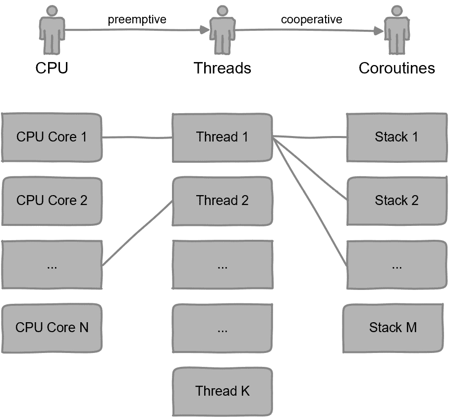

# 第十一章：使用 Lua 进行多线程

在上一章中，我们学习了一些在将 Lua 集成到 C++ 时管理资源的技术。在本章中，我们将学习如何使用 Lua 进行多线程操作。如果你在一个复杂的项目中使用 Lua，那么很可能你需要创建多个 Lua 实例。首先，我们将学习如何将多线程部分包含在 C++ 中，并使 Lua 对其无感知。然后，我们将看到 Lua 如何处理多线程，以防你需要使用它。理解多线程将有助于你项目的技术规划。

我们将涵盖以下主题：

+   C++ 中的多线程

+   Lua 中的多线程

+   使用 C++ 中的 `coroutine`

# 技术要求

我们将使用 *第十章* 的源代码作为本章节示例的基础。确保你可以访问这本书的源代码：[`github.com/PacktPublishing/Integrate-Lua-with-CPP/tree/main/Chapter11`](https://github.com/PacktPublishing/Integrate-Lua-with-CPP/tree/main/Chapter11)。

# C++ 中的多线程

什么是**多线程**？

根据不同的视角，有几个定义。从 CPU 的角度来看，能够同时执行多个指令线程的多核处理器是真正的多线程。从应用程序的角度来看，使用多个线程就是多线程。从开发者的角度来看，可能更多地关注线程安全和各种同步机制，这些不是多线程本身，而是其影响。

在本节中，我们将学习如何使用 Lua 与 C++ 的原生多线程支持。每个 C++ 线程都将有自己的 Lua 状态。因为 Lua 库不保留任何状态，Lua 状态也不会在不同线程之间共享，所以这是线程安全的。

## C++ 如何支持多线程？

自从 C++11 以来，标准库通过 `std::thread` 支持多线程。每个 `std::thread` 实例代表一个执行线程。提供给线程最重要的东西是线程函数。这就是线程执行的内容。在其最简单的形式中，我们可以创建线程如下：

```cpp
void threadFunc(...) {}
std::thread t(threadFunc, ...);
```

在这里，我们将一个 C++ 函数作为线程函数传递以创建一个线程。该函数可以可选地接受参数，`std::thread` 构造函数将参数转发给线程函数。线程创建后，线程函数开始在它自己的线程中执行。当线程函数完成后，线程结束。

我们也可以通过调用不同的构造函数，将类成员函数或类静态成员函数用作线程函数。你可以参考 C++ 参考手册来了解更多关于 `std::thread` 的信息。

在 C++11 之前

在 C++11 之前的时代，没有标准的多线程支持。人们不得不使用第三方库或使用低级库（如 **pthreads**）来实现自己的多线程。

这种多线程类型可能不会让你感到惊讶。这是人们谈论并广泛使用的一种多线程类型，即**抢占式多线程**。线程函数可以在任何时候暂停，也可以在任何时候恢复。

接下来，我们将通过一个真实示例来探索 C++ 多线程的实际应用。

## 使用多个 Lua 实例

在本节中，我们将实现一个线程函数，我们将执行一个 Lua 脚本。然后，我们将创建多个线程来执行这个相同的线程函数。

根据 *第十章* 的源代码，清理 `main.cpp` 并添加以下代码：

```cpp
#include "LuaExecutor.h"
#include "LoggingLuaExecutorListener.h"
#include <iostream>
#include <mutex>
#include <thread>
#include <vector>
auto listener = std::make_unique
  <LoggingLuaExecutorListener>();
std::mutex coutMutex;
```

在这里，我们添加了必要的头文件。`listener` 是 Lua 执行器监听器，并将为所有 Lua 执行器实例共享。`coutMutex` 是用于使用 `std::cout` 打印结果的互斥量，其用法我们将在下面看到。

接下来，实现线程函数，如下所示：

```cpp
void threadFunc(int threadNo, int a, int b, int c)
{
    auto lua = std::make_unique<LuaExecutor>(*listener);
    lua->execute("function add_params(a, b, c) return a + b
        + c end");
    auto result = lua->call("add_params",
        LuaNumber::make(a), LuaNumber::make(b),
        LuaNumber::make(c));
    std::lock_guard<std::mutex> lock(coutMutex);
    std::cout << "[Thread " << threadNo << "] "
              << a << "+" << b << "+" << c << "="
              << std::get<LuaNumber>(result).value
              << std::endl;
}
```

线程函数接受三个整数作为参数，创建一个 Lua 执行器，并执行一个 Lua 脚本来添加这三个整数。然后，它打印出结果。

由于标准输出只有一个可以打印的地方，我们使用互斥量来保护标准输出。否则，输出序列将是一个不同线程的混合，难以阅读。

我们使用互斥锁的方式是通过创建 `std::lock_guard` 而不是直接调用 `std::mutex::lock` 和 `std::mutex::unlock`。锁保护器将在构造期间获取互斥量，并在超出作用域和被销毁时释放互斥量。这是一个 *RAII* 原则的例子。

RAII 概述

在上一章中，我们学习了资源获取即初始化（RAII）的概念。C++ 标准库在许多地方采用了这一原则。假设我们不这样使用锁，而是手动获取和释放它。如果在中间发生任何错误，存在风险是锁没有被在线程中释放，从而破坏整个应用程序。使用锁保护器，即使在抛出异常的情况下，锁也会始终被释放，因为 C++ 语言保证当锁超出作用域时，会调用锁的析构函数。在 C++11 之前，人们会通过创建一个在构造函数中获取锁并在析构函数中释放锁的包装类来实现自己的锁保护器。这种习惯用法被称为 `std::scoped_lock`，它可以锁定多个互斥量。

最后，让我们实现 `main` 函数，如下所示：

```cpp
int main()
{
    std::vector<std::thread> threads;
    for (int i = 0; i < 5; i++)
    {
        int a = i * 3 + 1;
        threads.emplace_back(threadFunc, i + 1,
            a, a + 1, a + 2);
    }
    for (auto &t : threads)
    {
        t.join();
    }
    return 0;
}
```

这将创建一个线程列表并等待线程执行完成。

在第一个 `for` 循环中，我们使用 `std::vector::emplace_back` 在向量的末尾就地创建线程。对于大多数 C++ 实现，内部使用 *placement new* 并调用 `std::thread(threadFunc, i, a, a + 1, a + 2)`。我们这样做是因为 `std::thread` 不能复制构造。可以理解的是，复制一个线程是没有意义的。

在第二个 `for` 循环中，我们使用 `std::thread::join` 等待所有线程完成执行。`main` 函数在应用程序的主线程中运行。当 `main` 退出时，所有其他线程都将被终止，即使它们还没有完成执行。

接下来，我们将测试我们的示例。

## 进行测试

编译并执行项目。你应该会看到以下类似的输出：

```cpp
Chapter11 % ./executable
[Thread 2] 4+5+6=15
[Thread 3] 7+8+9=24
[Thread 5] 13+14+15=42
[Thread 1] 1+2+3=6
[Thread 4] 10+11+12=33
```

如果你多次运行项目，你会看到不同线程的结果顺序发生变化。这验证了我们在 Lua 中使用了多个线程。

对于大多数项目，当将 Lua 集成到 C++ 中时，这种机制应该足以用于多线程。这是 C++ 中的多线程。Lua 部分无需额外努力即可正常工作。每个 C++ 线程都有自己的 Lua 实例，并执行其 Lua 脚本的副本。不同的 Lua 实例不会相互干扰或了解彼此。

接下来，我们将探索 Lua 中的多线程。

# Lua 中的多线程

要理解 Lua 中的多线程，让我们从一个基本问题开始。

## Lua 如何支持多线程？

*Lua 不支持* *多线程。就这么简单*。

但我们还没有完成这个部分。我们将通过两种方法进一步解释这一点——一种当代方法和一种老式方法。

### 当代方法

Lua 是一种脚本语言，它不支持 *抢占式多线程*。它根本不提供创建新线程的库函数，因此无法实现。

现在，CPU 和操作系统都是围绕 *抢占式多线程* 设计的——也就是说，一个执行线程可以在任何时候暂停和恢复。线程对其执行调度没有控制权。

然而，Lua 为 `协程` 提供了一种机制，这通常是一个函数。

`协程` 在 Kotlin 用于 Android 和后端开发中也非常受欢迎。

协作式多线程

当我们谈论线程时，大多数情况下，其含义是指它们是用于 CPU 核心执行的线程。当我们谈论 *协作式多线程* 时，在某些情况下，例如 Lua，你可能会发现只有一个线程在执行，并且只使用了一个 CPU 核心，即使有协程。可以说，这根本不是多线程。但我们不需要评判。我们需要理解这一点，因为在不同的上下文中，可能会有多个术语用于此。我们也可以称之为 **协作式多任务处理**，这在历史上从技术角度来看更为准确。

让我们看看 Lua 的 `协程` 在实际中的应用，并对其进行更详细的解释。

#### 实现 Lua 协程

将 `script.lua` 的内容替换为以下代码：

```cpp
function create_square_seq_coroutine(n)
    return coroutine.create(function ()
        for i = 1, n do
            coroutine.yield(i * i)
        end
    end)
end
```

`create_square_seq_coroutine` 使用 `coroutine.create` 创建一个 `协程`，而 `coroutine.create` 又以一个匿名函数作为其参数。你可以大致认为内部匿名函数就是 `协程`。内部函数运行一个循环，从 `1` 到 `n`。

你只能与协程一起使用`yield`。当协程遇到`yield`语句时，它将停止执行。提供给`yield`的值将被返回到调用点，类似于`return`的作用。下次执行`coroutine`时，它将从上次`yield`的地方继续执行，直到它达到另一个`yield`语句或`return`语句。

让我们启动一个交互式 Lua 解释器来测试我们的`coroutine`：

```cpp
Chapter11 % ../lua/src/lua
Lua 5.4.6  Copyright (C) 1994-2023 Lua.org, PUC-Rio
> dofile("script.lua")
> co = create_square_seq_coroutine(3)
> coroutine.resume(co)
true    1
> coroutine.resume(co)
true    4
> coroutine.resume(co)
true    9
> coroutine.resume(co)
true
> coroutine.resume(co)
false   cannot resume dead coroutine
```

在这里，我们创建一个`coroutine`来返回从`1`到`3`的平方。第一次我们`resume` `coroutine`时，它从开始执行并返回两个值，`true`和`1`。`true`来自`coroutine.resume`，表示`coroutine`执行没有错误。`1`是`coroutine`产生的。下次我们`resume` `coroutine`时，循环继续进行下一个迭代并返回`4`。请注意，当`coroutine.resume`只返回一个值时的情况。循环已经完成，但还有代码需要为`coroutine`执行，例如隐式的返回语句。因此，`coroutine.resume`返回`true`。之后，`coroutine`已经完成，无法再恢复，`coroutine.resume`将返回带有错误信息的`false`。

如果这是你第一次在任何编程语言中使用`coroutine`，这可能会让你觉得神奇且不合逻辑。一个不在线程中的函数，怎么可能不达到其结束而再次从中部执行呢？我将在本节的最后部分解释为什么这是如此普通（但请记住，在面试中提到你知道`coroutine`以及为什么它如此辉煌），在此之前，让我们探索另一个例子，看看`coroutine`可以非常有用的一个场景。

#### Lua 协程作为迭代器

我们已经看到了如何使用迭代器与`generic for`来简化我们的生活，例如`ipairs`。

但迭代器究竟是什么？

一个`iterator`返回一个**迭代函数**，可以反复调用，直到它返回`nil`或无。

基于我们刚刚实现用于生成平方序列的`coroutine`，让我们构建一个迭代器。在`script.lua`中添加另一个函数，如下所示：

```cpp
function square_seq(n)
    local co = create_square_seq_coroutine(n)
    return function()
        local code, value = coroutine.resume(co)
        return value
    end
end
```

`square_seq`是一个 Lua `iterator`，因为它返回其内部函数作为`iterator` `function`。内部函数继续恢复使用`create_square_seq_coroutine`创建的协程。当`iterator` `function`返回`nil`或无时，调用者有责任停止调用`iterator` `function`。

让我们在交互式 Lua 解释器中测试这个`iterator`：

```cpp
Chapter11 % ../lua/src/lua
Lua 5.4.6  Copyright (C) 1994-2023 Lua.org, PUC-Rio
> dofile("script.lua")
> for v in square_seq(3) do print(v) end
1
4
9
```

你可以看到，对于`1`、`2`和`3`，打印出了预期的三个值。

通过查看使用情况，你甚至无法判断是否涉及到任何协程或协作多线程。我认为，这是这种编程范式比抢占式多线程更有价值的例子之一。

到目前为止，我们已经探讨了 Lua 的 `coroutine` 和 Lua 的 `iterator`。它们可能更加复杂，但这些示例已经足够展示它们是如何工作的。你可以参考 Lua 参考手册来了解更多关于 `coroutine` 和 `iterator` 的信息。

接下来，让我用自己的话来解释这一点。

#### 介绍多栈

传统上，一个线程是一个 CPU 核心的执行单元，与其相关的执行栈和 **程序计数器**（**PC**）。PC 是 CPU 寄存器，用于存储下一个要执行的指令的地址。正如你所见，这相当低级，涉及到更多我们不打算讨论的细节。

由于这种传统观念在我们心中已经根深蒂固，即使是无意识的，它可能已经成为了你理解协程的障碍。

或者，让我们借助计算机科学中的一个基本原理来寻求帮助——**解耦**。

广为人知的抢占式多线程机制已经是解耦的应用。它将线程从 CPU 核心中解耦。有了它，你可以在有限的物理 CPU 核心中拥有无限的线程池。

当你接受这一点，我们只需要再进一步。如果你接受执行栈也可以从执行线程中解耦，这就是 `coroutine` 的工作方式。

在这种合作式多线程机制中，一个线程可以有自己的执行栈池。一个执行栈包含调用栈和 PC。因此，现在我们有一个三层系统。

我将这些协程称为多栈，这是一个我创造的术语，用以更好地解释它。看看 *图 11.1*。1*，它暗示了以下内容：

+   **CPU 与线程之间的关系**：线程的数量多于 CPU 核心。一个 CPU 核心可以执行任何线程。当一个线程被恢复时，它可以被任何 CPU 核心拾取。这是我们熟知的 *抢占式多线程*，这通常需要 CPU 硬件支持，并由操作系统透明地管理。

+   **线程与协程之间的关系**：一个线程可以有多个协程，每个协程都有自己的执行栈。因为操作系统在线程级别停止，操作系统没有协程的概念。为了使一个线程执行另一个协程，当前的协程必须放弃其执行并自愿让出。这就是为什么它被称为 *合作式多线程*。协程也没有线程的概念；拥有它的线程可以被抢占，并在稍后由另一个 CPU 核心拾取，但这些对协程来说都是透明的。如果编程环境支持，协程也可以被不同的线程拾取。



图 11.1 – 多栈

抽空思考一下这两个关系，它们在*图 11**.1*中得到了解释和说明。这是解释协程的一种方式，尽管可能有些不寻常。这里的目的是在不同机制和技术之间找到相似之处。

接下来，我们将从另一个角度来探讨协作多线程和`协程`。

### 传统的做法

到目前为止，在本节中，我们一直专注于解释当代的`协程`概念。希望通过对这两个关系的解释，你能理解和说明为什么`协程`为现代计算系统增加了另一层宝贵的多线程支持。

然而，这并不是什么新鲜事。计算机从一开始就是这样工作的。

当然，在最开始，正如你所知，我们给机器喂入带孔的纸带。所以，多线程是毫无希望的。

然后，后来，它变得更加复杂。但仍然，CPU 中只有一个处理单元，有一个特权且原始的控制程序在一个死循环中运行。这个循环的主要作用是检查是否有其他程序想要运行。如果有，它将那个程序的起始地址加载到 PC 中——CPU 的程序计数器。然后，CPU 开始执行另一个程序。

你可能已经猜到了问题。如果有另一个程序想要运行呢？按照过去的做法，它必须等待第一个程序完成。正如你可以想象的那样，这并不公平。所以，我们改进了它，并规定所有程序都应该友好地轮流执行。这样做允许特权控制程序恢复运行，并找出是否有其他程序需要运行。

这被称为*协作多线程*。除了特权程序之外，每个程序都是一个`协程`实例，只不过在那个时代还没有发明这个术语。

这有助于，但并不总是如此。假设有一个程序决定等待一个永远不会发生的 I/O，并且不释放；计算机将无休止地徒劳等待。

更晚些时候，计算机变得更加强大，能够支持运行更复杂的操作系统。它将决定哪个程序运行的逻辑移到了操作系统中。如果一个程序正在等待 I/O 或已经运行了足够长的时间，操作系统将暂停它，并恢复另一个程序的运行。这就是*抢占式多线程*。结果证明，这是一个正确的举措。操作系统更加公平，计算机可以做得更多。

快进到近几年——摩尔定律不再适用，或者至少已经暂停。所以，CPU 不会得到 1,000 个核心，但工作计算机中的线程数量却在不断增加。因此，操作系统抢占和迭代所有线程的成本现在已经成为一个关注点。

我们能做什么？

一些聪明的人发现我们只需要做我们最初做的事情——再次使用协作多线程。但这次，控制程序是你的主程序——既然你不能对自己自私，你将尽你所能对所有协程公平。

这是一个计算机系统演变的简化版本。它并非在历史上完全准确，并且加入了一些戏剧性的元素。目标是让你意识到`协程`是一个简单的概念，并且你可以感到舒适地使用它。

接下来，我们将学习如何使用 C++中的协程。

# 使用 C++中的协程

如果你有一个替代方案，不要在 C++中使用 Lua `协程`。正如迭代器示例所示，你可以将`协程`包装在一个普通函数中，并不断调用它，直到它返回 nil。

但为了减少主观性并保证完整性，我们可以使用以下 Lua 库函数从 C++启动或恢复协程：

```cpp
int lua_resume (lua_State *L, lua_State *from, int narg,
                int *nresults);
```

这个函数类似于`pcall`。它期望被调用的函数以及可选的堆栈上的参数。这个函数将是协程。`L`是协程的栈。`from`是从中调用协程的栈。`narg`是`协程`函数的参数数量。`nresults`指向一个整数，Lua 将输出产生的或返回到整数的值的数量。

让我们通过一个例子来了解它是如何工作的。在`LuaExecutor.h`中添加一个函数声明，如下所示：

```cpp
class LuaExecutor
{
public:
    LuaValue resume(const std::string &function);
};
```

`resume`函数以有限的方式支持`协程`。它不支持传递参数，但这很容易做到，你可以参考`LuaExecutor::call`。它只期望一个作为整数的返回值。这只是为了演示 Lua API，而不是在我们的 Lua 执行器中添加对`协程`的完整支持。

实现`resume`，如下所示：

```cpp
inline LuaValue
LuaExecutor::resume(const std::string &function)
{
    lua_State *thd = lua_newthread(L);
    int type = lua_getglobal(thd, function.c_str());
    assert(LUA_TFUNCTION == type);
    int nresults = 0;
    const int status = lua_resume(thd, L, 0, &nresults);
    if (status != LUA_OK && status != LUA_YIELD)
    {
        lua_pop(thd, 1);
        return LuaNil::make();
    }
    if (nresults == 0)
    {
        return LuaNil::make();
    }
    const int value = lua_tointeger(thd, -1);
    lua_pop(thd, nresults);
    lua_pop(L, 1);
    return LuaNumber::make(value);
}
```

这是一个五步的过程，通过换行符分隔，具体解释如下：

1.  它使用`lua_newthread`创建一个新的 Lua 状态。这个新状态的引用也被推送到由`L`拥有的主栈上。我们可以称这个新状态为协程状态。但`thd`是协程栈。Lua 的`lua_newthread`库函数创建了一个新的 Lua 状态，它与主状态`L`共享相同的全局环境，但拥有自己的执行栈。是的，API 名称有点误导，但它就是这样。

1.  它将执行为协程的函数名称推送到新的 Lua 栈上。

1.  它调用`lua_resume`来启动或恢复协程。由于我们总是创建一个名为`thd`的新状态，我们总是从头开始启动协程。要恢复它，我们需要将`thd`保存在某个地方，并在未来的调用中传递它。

1.  它检查是否存在错误；或者，如果协程没有返回任何结果，这意味着它已经结束。

1.  它检索我们期望的单个整数，从协程栈中弹出，从主栈中弹出协程栈的引用，并返回该值。

照顾其他 Lua 状态

协程需要自己的 Lua 状态来执行。你需要将其 Lua 状态的引用保存在某个地方，直到你不再需要协程。如果没有引用，Lua 将在垃圾回收期间销毁状态。如果你有很多协程，将所有这些额外的 Lua 状态保留在主堆栈中可能会很混乱。因此，如果你想在 C++ 中与协程一起工作，你需要设计一个系统来保存和查询这些 Lua 状态。

接下来，将以下 Lua 函数添加到 `script.lua` 中：

```cpp
function squares()
    for i = 2, 3 do
        coroutine.yield(i * i)
    end
end
```

此函数产生两个值。`for` 循环是硬编码的，因为我们不支持在 `LuaExecutor::resume` 中传递参数。

对于演示的最后部分，编写 `main.cpp` 如下所示：

```cpp
#include "LuaExecutor.h"
#include "LoggingLuaExecutorListener.h"
#include <iostream>
int main()
{
    auto listener = std::make_unique<
        LoggingLuaExecutorListener>();
    auto lua = std::make_unique<LuaExecutor>(*listener);
    lua->executeFile("script.lua");
    auto result = lua->resume("squares");
    if (getLuaType(result) == LuaType::number)
    {
    std::cout << "Coroutine yields "
              << std::get<LuaNumber>(result).value
              << std::endl;
    }
    return 0;
}
```

这设置了 Lua 执行器并调用 `resume` 函数以启动 `coroutine`。

编译并运行项目；你应该看到以下输出：

```cpp
Coroutine yields 4
```

这展示了如何使用 `lua_resume`。你可以阅读 Lua 参考手册以获取有关此 API 的更详细信息。

C++ 代码也可以作为协程执行。这可以通过提供 `lua_CFunction` 实现给 `lua_resume` 或者在协程中的 Lua 代码调用 `lua_CFunction` 实现来完成。在这种情况下，C++ 代码也可以通过调用 `lua_yieldk` 来产生。

使用 C++ 与协程结合可能会非常复杂，但如果你已经定义了你的用例，这可以抽象出来以隐藏复杂的细节。本节只是一个引子。你可以决定是否以这种方式使用 Lua。

# 摘要

有了这些，我们已经完成了这本书的最后一章。在这一章中，我们重点介绍了多线程机制、抢占式多线程和协作式多线程，以及 Lua 协程。

Lua 协程可以在不使用 C++ 的情况下用于高级 Lua 编程，并且你可以将这些所有细节从 C++ 中隐藏起来。我们只是触及了冰山一角。你可以阅读 Lua 参考手册并多加练习。你也可以通过实验相关的 Lua 库函数来探索如何与 C++ 一起使用协程。

在这本书中，我们逐步实现了 `LuaExecutor`。每一章都为其添加了更多功能。然而，它并不完美。例如，`LuaValue` 可以改进以使其更容易使用，`LuaExecutor` 也可以支持更多的表操作。你可以在学习机制之后将 `LuaExecutor` 作为基础来适应你的项目，或者以完全不同的方式实现自己的。

我相信，到这一点，你可以进行改进并添加最适合你的更多功能。你总是可以回顾这些章节作为提醒，并在 Lua 参考手册中搜索你需要的内容。
