# 第二章：创建一个远程能源监控与控制设备

在本书的第二项目中，我们将继续使用 Arduino Yún 的功能，通过 web 服务 Temboo 连接到网络。人们通常在家庭自动化中想要做的一件事是跟踪他们的电器能源消耗，并远程打开或关闭它们，例如，使用他们的智能手机或平板电脑。

当然，目前许多设备可以测量电源插座上的能源消耗，同时还能开关连接到该插座的设备。这些设备现在非常紧凑，易于连接到本地 Wi-Fi 网络，并且它们还可以通过蓝牙与移动设备通信。许多大型电子产品制造商已经开发了他们自己的解决方案，现在每个人都可以购买这些产品并将它们安装在自己的家中。

在这个项目中，我们将构建我们自己的 DIY 版本这样的设备，并构建一个电源开关和能源计，以便开关电器以及跟踪其能源消耗。

以下本章的主要亮点：

+   将一个继电器连接到 Arduino Yún 的一个数字输出，并使用 Yún REST API 通过网页浏览器控制这个继电器

+   使用模拟电流传感器从连接到继电器的设备获取即时电流消耗的测量值，并从该测量值计算即时功耗

+   将这些数据发送到 Google Docs 电子表格，以便可以从任何网页浏览器或 Google Docs 移动应用程序远程访问，并计算连接到您的项目的设备的能源消耗和一些其他有用的数据，例如设备的总能源成本。

+   创建一个简单的网页界面，使用您的计算机或任何智能手机或平板电脑来控制灯

# 所需的硬件和软件组件

本项目的第一部分是获取我们将用于我们的能源消耗计和电源开关项目的所需部件。除了将成为项目“大脑”的 Arduino Yún 板外，在构建项目时，您需要在您的桌子上准备好两个主要部件。这些部件是继电器模块，我们将用它来开关灯，以及模拟电流传感器，它用于测量功率，后来是灯的能源消耗。

继电器基本上是一种电磁开关，用于需要使用小电压（如 Arduino 板上的 5V）作为命令信号来切换大电压（110V 或 230V）的项目。对于继电器，我们使用了一个基本的 5V 继电器模块，来自 Polulu，它可以切换高达 10A，对于许多家用电器如灯具来说已经足够了。（在欧洲，使用 230V，你可以连接高达 2300W。）该模块本身只是一个安装在印刷电路板上的继电器，以及操作继电器所需的必要组件和一些大型的引脚和走线，如果需要的话，可以承载高达 10A。它使用的是 Omron G5LE-14-DC5 继电器。以下图片是所使用的继电器：

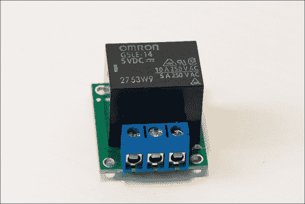

当然，你可以使用任何等效的继电器模块。只需确保它可以使用数字 5V 信号进行开关控制，就像我们在 Arduino Yún 板上所做的那样，并且它可以至少切换 5A，以确保这个项目的安全性。我们在这个项目中使用的灯只消耗大约 130 mA，但将来你可能想在项目中连接更大的设备。如果你想从继电器制作自己的模块，你只需要在继电器上串联一个二极管来保护你的 Arduino 板，当继电器切换时。

### 小贴士

不要尝试在面包板上单独使用继电器及其操作所需的组件。面包板上的小轨道无法支持高电流和高电压，如果你这样做，将会遇到严重的安全问题，例如这些轨道可能发生熔断，这可能导致火灾。因此，使用专门的继电器模块进行此项目。

然后，你需要一个电流传感器来获取灯的即时电流消耗。我们使用了一个来自 ITead Studio 的模块，它基本上是一个 ACS712 传感器的分线板。分线板简单来说就是一个由印刷电路板、芯片本身以及所有使芯片工作的组件（如电阻和电容器）组成的板。这个传感器输出一个模拟信号，该信号与测量的电流成正比。然后，这个信号可以很容易地转换成 Arduino Yún 板上的相应电流。我们将使用 Yún 板的一个集成模拟-数字转换器来获取这个模拟信号。请注意，还有非侵入式电流传感器，你可以简单地将其夹在你想测量的电缆周围，但这些通常更大，并且与 Arduino 项目不太兼容。以下是这个项目所使用的传感器的图片：

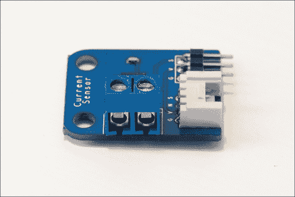

就像继电器模块一样，你可以为这个项目使用任何等效的电流传感器。需要考虑的重要参数是传感器能够流过的最大电流（我们使用的为 5A）和传感器的灵敏度（我们使用的为 185 mV/A）。如果这两个参数与我在这个项目中使用的传感器相似，或者更好，你可以使用该传感器。

你还需要以某种方式将灯连接到项目中。当然，一种方法就是直接切断灯的电源线，将灯直接连接到我们的项目中，但我不喜欢这个选项，因为它相当杂乱。正如我在这个项目的介绍中提到的，我不想让你以任何方式触摸你的灯或其他设备，并且如果你想的话，我希望你能将你的灯再次连接到墙上的电源插座。

我使用了两条电源线，这样我就可以将我的项目连接到墙上的插座一侧，并将灯连接到项目另一侧，就像我购买现成的商业设备一样。

以下是我用于插入灯的电源线的组件：

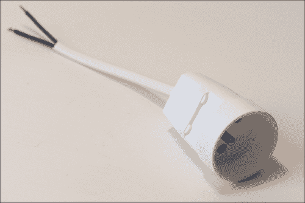

以下是我将用于将项目连接到墙插座的电源线：

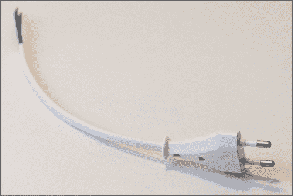

注意，一些电源插座有三条线（额外的线用于接地连接），但因为我们将会处理如灯这样的小负载，所以第三条线对这个项目不是必需的。

在硬件方面，我也使用了一小块面包板来制作继电器和电流传感器的电源连接（因为 Arduino Yún 板只有一个 5V 引脚）。当然，你也可以使用全尺寸面包板来制作这些连接。

在软件方面，你需要 Arduino IDE 的最新 beta 版本，这是唯一支持 Arduino Yún 板的版本（我在做这个项目时使用了版本 1.5.5）。

# 将组件连接到 Yún 板

现在我们将连接继电器模块和电流传感器到 Arduino Yún 板，连接将点亮灯的电源线，最后将所有东西连接到墙上的电源插座。这部分比第一章中硬件连接的部分要复杂一些，因为它涉及更多的步骤，并使用更高的电压，这要求你采取一些预防措施。所以，请小心并遵循所有步骤。

第一步是将 Arduino Yún 板、继电器模块和电流传感器板放在一起，如下面的图片所示：

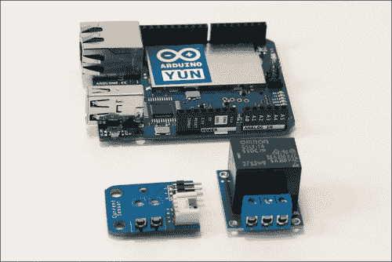

然后，我们将连接继电器模块和电流传感器的电源。正如我在本章前面所说，Arduino Yún 板只有一个 5V 引脚。这就是为什么我将两个模块的 5V 引脚首先连接到一小块面包板上，然后将这个面包板连接到 Arduino 的 5V 引脚，如图所示：

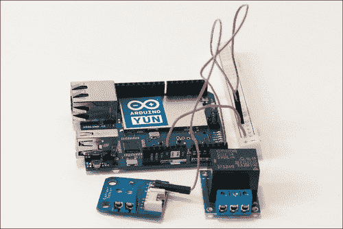

之后，我们必须将两个模块的地线引脚连接到 Arduino Yún 板上的地线引脚，如图所示。Arduino Yún 板上有两个地线引脚，因此您不需要为此使用面包板。

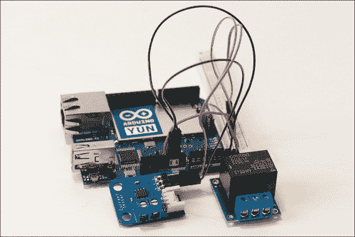

为了完成两个模块的连接，我们需要将它们的相应信号引脚连接到 Arduino 板。继电器将通过 Arduino Yún 板的 8 号引脚控制，因此将继电器模块的信号引脚连接到 Yún 板的 8 号引脚。

当前传感器具有模拟输出，因此它必须连接到 Arduino 板上的一个模拟输入，以便使用 Yún 集成的模拟-数字转换器之一来获取信号。此转换器将获取来自传感器的模拟信号并将其转换为从 0 到 1023（对应 10 位精度）的数字值。将电流传感器模块的输出引脚连接到 Arduino Yún 板的 A0 引脚，如图所示：

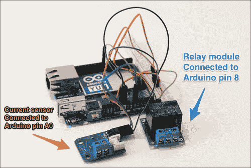

这基本上就是低功耗部分的全部内容。现在，我们将专注于将项目连接到两个电源线，以便我们可以将项目插入墙壁插座并将灯泡连接到项目上。我们将首先连接将通往墙壁的电缆，如图所示：

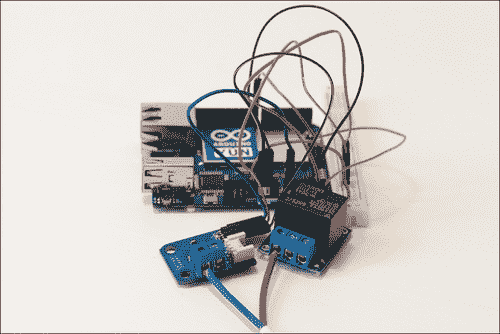

最后，连接我们将要连接到灯泡的雌性电源插头，如图所示：

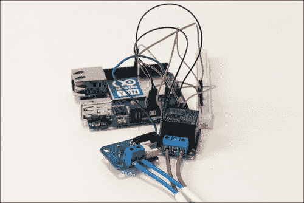

最后，是时候给所有设备供电了。您可以通过 USB 线将 Arduino Yún 板连接到计算机（如果您想直接上传草图并且希望计算机在项目附近）或通过墙壁电源插座连接到 USB 适配器（如果您计划通过 Wi-Fi 上传草图并让项目独立工作）。

然后，将您想要控制的灯泡或设备插入到项目的雌性电源插头中。完成连接后，将雄性电源插头连接到墙壁插座中的电源插座。在执行此步骤时请小心：确保没有电线暴露，所有螺钉端子都正确拧紧并牢固地固定着电缆，并且没有裸露的电线相互接触。

# 测试您的硬件连接

现在连接完成后，我们在开始将能耗数据发送到云和构建控制继电器的界面之前，将对所有内容进行测试。我们将像项目已经运行一样测试不同的模块。在整个测试期间，我们将把项目连接到墙上的电源插座和我们想要控制的灯。这样，我们就可以在进一步操作之前确保所有硬件连接都是正确的。

例如，继电器将通过 Arduino Yún REST API 通过 Wi-Fi 控制，就像在项目的最终版本中一样。基本上，我们只需从你的网络浏览器发送一个命令来直接设置连接到继电器的引脚的值。在项目的后期，我们将通过图形用户界面来调用这个命令，而不是在浏览器中实际输入命令。

对于电流传感器，我们将简单地读取 Yún 的模拟引脚 A0 上测量的值，使用 Yún 的模数转换器将其转换为可用的电流，然后根据我们已知的有效电压值（根据你所在地区可能是 110V 或 230V）计算有效电流和有效功率。

让我们先看看 Arduino 代码。它首先导入所需的库，如下所示代码所示。我们需要 `Bridge` 库以便可以使用 Yún 板载 Linux 机的功能，以及 `YunServer` 和 `YunClient` 库以便我们可以使用 REST API 接收外部命令。REST API 通常只被网络开发者使用，但 Arduino 实际上提供了一个实现此类 API 的 Arduino Yún 草图的示例。这个草图可以直接在 Arduino Yún 伴随的库中访问，在这个项目中，我使用了这个参考草图的修改版本。

```cpp
#include <Bridge.h>
#include <YunServer.h>
#include <YunClient.h>
```

要使用 Yún 的 REST API，我们需要创建一个 `YunServer` 实例，如下所示代码行。这个服务器将连续运行并等待接收到的命令。

```cpp
YunServer server;
```

我们还需要定义传感器连接到的引脚，如下所示代码行：

```cpp
#define CURRENT_SENSOR A0
#define RELAY_PIN 8
```

草图的一个重要部分是声明有效电压的值，该值将用于稍后计算设备的有效功率，如下所示代码行。这个值取决于你所在的位置（例如，欧洲为 `230`，美国为 `110`）：

```cpp
float effective_voltage = 230;
```

在 `setup()` 部分，我们需要启动 Arduino 微控制器和 Linux 机之间的桥接，如下所示：

```cpp
Bridge.begin();
```

我们还需要按照以下方式启动网络服务器：

```cpp
server.listenOnLocalhost();
server.begin();
```

然后，`setup()` 函数的最后也是最重要的部分是对传感器进行校准，以确定当电流为零时返回哪个值。这是通过以下代码行完成的：

```cpp
zero_sensor = getSensorValue();
```

让我们深入探讨这个函数。我们可以简单地从电流传感器获取一个测量值，但这不是一个好主意。实际上，从传感器获取的值会随时间略有变化，围绕一个我们实际上想要测量的平均值。这是使用具有重要灵敏度的模拟传感器（如我们在这里使用的传感器）时的典型行为。这就是为什么该函数基本上通过以下几行代码在多次测量中对信号进行采样和平均：

```cpp
for (int i = 0; i < nb_measurements; i++) {
  sensorValue = analogRead(CURRENT_SENSOR);
  avgSensor = avgSensor + float(sensorValue);
}  
avgSensor = avgSensor/float(nb_measurements);
```

在这些测量之后，我们返回平均值，如下所示：

```cpp
return avgSensor;
```

这样，我们每次都能确保获得一个稳定的传感器读数。然后，这个值在整个 sketch 中用作电流传感器读数的参考值。例如，如果测量的值等于这个参考值，我们就知道灯中的电流为零。在项目的操作过程中，实际传感器读数使用的是同一个函数，所以我们总是得到一个稳定的测量值。

现在，是 sketch 的`loop()`部分。它实际上由两部分组成：在第一部分中，我们将接收我们之前启动的 Yún 网络服务器上的传入连接；在第二部分中，我们将打印出来自电流传感器的测量值。

对于网络服务器部分，我们可以按如下方式监听连接：

```cpp
YunClient client = server.accept();
```

如果检测到客户端，我们将使用以下代码处理请求：

```cpp
if (client) {
  // Process request
  process(client);

  // Close connection and free resources.
  client.stop();
}
```

我不会详细说明`Process`函数，因为它与我们在之前的 Arduino Yún `Bridge`示例中使用的相同（这可以作为示例在 Yún `Bridge`库中找到）。要了解更多关于 Yún REST API 的信息，您可以访问 Arduino 网站上的官方 Arduino 文档，网址为[`arduino.cc/en/Guide/ArduinoYun`](http://arduino.cc/en/Guide/ArduinoYun)。

现在，我们将编写负责电流测量的 sketch 部分。它在你获得稳定测量值时开始，就像我们之前为无电流所做的如下：

```cpp
float sensor_value = getSensorValue();
```

我不会详细介绍这个函数，因为它与我们用来获取无电流值的函数相同。现在，我们可以对这个测量值进行一些计算。首先，我们需要将其转换为可用的电流值，如下所示：

```cpp
amplitude_current=(float)(sensor_value-zero_sensor)/1024*5/185*1000000;
```

这是电流的幅度，它是一个正弦电流。这个公式可以在传感器的数据表中找到，也可以在 ITead Studio 网站上找到。因为我们知道关于电流的这些信息，为了获取有效电流，我们只需将其除以根号二，如下所示：

```cpp
effective_value=amplitude_current/1.414;
```

为了获取有效功率，我们需要将这个安培电流值除以 1000，然后乘以有效电压。我还添加了一个绝对值运算符，这样功率总是正值，即使你连接电流传感器来测量负电流，如下所示：

```cpp
abs(effective_value*effective_voltage/1000);
```

草图通过在串行监视器上打印所有这些值并每 50 毫秒重复一次来结束。这部分完整的草图可在本书的 GitHub 存储库中找到：[`github.com/openhomeautomation/geeky-projects-yun/tree/master/chapter2/sensors_test`](https://github.com/openhomeautomation/geeky-projects-yun/tree/master/chapter2/sensors_test)。

现在你可以将草图上传到 Arduino 板。请记住，在这个阶段，Arduino Yún 板应该由你的电脑或 USB 电源适配器供电，灯应该通过母电源线连接到项目中，项目本身应该插入到墙壁插座中。

继电器很容易测试；你只需要在你的网页浏览器中输入正确的命令。Yún 的 REST API 通过输入你的 Arduino Yún 板名称后跟`.local`（在我的情况下，我将其命名为`myarduinoyun`）来工作。然后，如果后面跟着`arduino/`，你可以直接使用命令来改变 Arduino 引脚的值。例如，要将继电器引脚的值更改为 1，你需要添加`digital/8/1`，如下面的截图所示：


上述命令意味着你正在使用 REST API 调用`digitalWrite(8,HIGH)`命令。你应该立即听到继电器切换并看到灯光打开。尝试再次添加命令后面的`0`而不是`1`；继电器应该再次切换并关闭灯光。不要担心，在项目的后续部分，我们将构建一个漂亮的图形界面，这样你就不必每次都编写这个命令。

现在我们将检查来自电流传感器的测量值。确保灯是关闭的，重置 Arduino 微控制器以确保草图从开始再次运行，然后打开串行监视器。为此，Arduino Yún 板必须通过 USB 线连接到你的电脑。你应该首先看到以下无电流的测量值：

```cpp
Sensor value: 493.05

```

然后，草图会持续显示传感器读数、电流幅度、有效电流和有效功率的值。即使电流为零，也请记住，我们通过多次测量平均传感器读数，因此值可能会有轻微波动，如下面的代码所示：

```cpp
Sensor value: 492.87
Current amplitude (in mA): 
4.5
Current effective value (in mA)
3.2
Effective power (in W): 
0.7

```

如果你使用浏览器中的 REST 调用打开灯，你应该立即看到电流和功率读数的变化如下：

```cpp
Sensor value: 486.52
Current amplitude (in mA): 
-163.1
Current effective value (in mA)
-115.4
Effective power (in W): 
26.5

```

如果你可以看到这些值，并且你的继电器在浏览器中的 REST 调用中响应，这意味着你的硬件工作正常，你可以继续下一步。如果它不起作用，第一步是检查电流传感器和继电器模块的不同连接。还要检查你在串行监视器中是否选择了正确的串行速度，以确保它与草图定义的速度相匹配。

# 向 Google Docs 发送数据

第一步是为项目设置一个 Google Docs 电子表格。创建一个新的工作表，给它起个名字（我为此项目命名为 `Power`，但你可以按你的意愿命名），并为我们将要使用的列设置标题：**时间**、**间隔**、**功率**和**能量**（将从前两列计算得出），如下面的截图所示：


我们也可以使用其他测量值来计算能量的值。从理论上讲，我们知道在给定的时间内，能量是功率乘以时间；也就是说，*能量 = 功率 * 时间*。

然而，在我们的情况下，功率是在固定间隔内计算的，我们想要估计每个间隔的能耗。从数学的角度来说，这意味着我们需要计算功率作为时间的函数的积分。

我们没有时间与功率之间的确切函数，因为我们以固定的时间间隔采样这个函数，但我们可以使用称为梯形规则的方法来估计这个积分。这意味着我们基本上通过梯形来估计函数的积分，即功率曲线下的面积。电子表格中 `C2` 单元的能量由以下公式给出：

*能量 = (功率测量值 + 下一个功率测量值) * 时间间隔 / 2*。

具体来说，在 Google Docs 中，你需要公式 *D2 = (B2 + B3)*C2/2*。

Arduino Yún 板将提供功率测量，时间间隔由我们在草图中所设置的值给出。然而，两次测量之间的时间可能会因测量而异。这是由于网络引入的延迟造成的。为了解决这个问题，我们将传输确切的值以及功率测量值，以获得对能耗的更好估计。

然后，是时候构建我们将用于项目的草图了。这个草图的目的是基本上等待来自网络的命令，切换继电器的开或关，并且定期将数据发送到 Google Docs 电子表格以跟踪能耗。

我们将在之前构建的草图之上构建草图，所以我将解释需要添加哪些组件。首先，你需要使用以下代码行包含你的 Temboo 凭据：

```cpp
#include "TembooAccount.h"
```

由于我们无法连续测量能耗数据（传输的数据量会很大，我们很快就会超过 Temboo 的月度访问限制！），就像在测试草图中所做的那样，我们只需要在给定的间隔内进行测量。然而，同时，我们需要持续检查是否有来自外部的命令来切换继电器的状态。这是通过首先设置正确的定时来完成的，如下面的代码所示：

```cpp
int server_poll_time = 50;
int power_measurement_delay = 10000;
int power_measurement_cycles_max = power_measurement_delay/server_poll_time;
```

服务器轮询时间将是检查传入连接的间隔。正如你可以猜到的，功率测量延迟是测量功率的延迟。

然而，我们不能使用简单的延迟函数来完成这个任务，因为这将会使整个草图暂停。我们将要做的是计算主循环的周期数，然后使用简单的`if`语句在达到正确的周期数时触发测量。正确的周期数由功率测量的`cycles_max`变量给出。

您还需要使用以下代码行插入您的 Google Docs 凭据：

```cpp
const String GOOGLE_USERNAME = "yourGoogleUsername";
const String GOOGLE_PASSWORD = "yourGooglePass";
const String SPREADSHEET_TITLE = "Power";
```

在`setup()`函数中，您需要启动一个日期处理过程，以跟踪测量日期。我们希望跟踪多天的测量，因此我们将传输当天的日期和时间，如下面的代码所示：

```cpp
time = millis();
if (!date.running())  {
  date.begin("date");
  date.addParameter("+%D-%T");
  date.run();
}
```

在草图的`loop()`函数中，我们检查是否是时候从当前传感器执行测量，如下面的代码行所示：

```cpp
if (power_measurement_cycles > power_measurement_cycles_max)
```

如果是这样的话，我们将测量传感器值，如下所示：

```cpp
float sensor_value = getSensorValue();
```

我们还获得了精确的测量间隔，我们将将其与测量的功率一起传输，以获得能源消耗的正确估计，如下所示：

```cpp
measurements_interval = millis() - last_measurement;
last_measurement = millis();
```

然后，我们根据已有的数据计算有效功率。电流的幅度是从之前的传感器测量中获得的。然后，我们可以通过除以根号 2 来得到电流的有效值。最后，因为我们知道有效电压，而功率是电流乘以电压，所以我们可以计算出有效功率，如下面的代码所示：

```cpp
// Convert to current
amplitude_current=(float)(sensor_value-zero_sensor)/1024*5/185*1000000;
effective_value=amplitude_current/1.414;

// Calculate power
   float effective_power = abs(effective_value * effective_voltage/1000);
```

然后，我们将数据以时间间隔发送到 Google Docs，并重置功率测量的计数器，如下所示：

```cpp
runAppendRow(measurements_interval,effective_power);
power_measurement_cycles = 0;
```

将数据发送到 Google Docs 的函数几乎与我们在第一章中看到的相同，即*构建一个连接到云端的气象站*。让我们快速进入这个函数的细节。它首先声明我们想要使用的 Temboo 库的类型，如下所示：

```cpp
TembooChoreo AppendRowChoreo;
```

从以下代码行开始：

```cpp
AppendRowChoreo.begin();
```

我们需要设置与您的 Google 账户相关的数据，例如用户名，如下所示：

```cpp
AppendRowChoreo.addInput("Username", GOOGLE_USERNAME);
```

实际的数据格式化是通过以下代码行完成的：

```cpp
data = data + timeString + "," + String(interval) + "," + String(effectiveValue);
```

在这里，`interval`是两次测量之间的时间间隔，而`effectiveValue`是我们想要记录在 Google Docs 上的测量功率的值。然后，Choreo 将执行以下代码行：

```cpp
AppendRowChoreo.run();
```

最后，我们在每 50 毫秒后执行此操作，并且每次都会增加功率测量计数器，如下所示：

```cpp
delay(server_poll_time);
power_measurement_cycles++; 
```

本节完整的代码可在[`github.com/openhomeautomation/geeky-projects-yun/tree/master/chapter2/energy_log`](https://github.com/openhomeautomation/geeky-projects-yun/tree/master/chapter2/energy_log)找到。

这一部分的代码已经完成。现在您可以上传草图，然后打开 Google Docs 电子表格，然后只需等待第一次测量到达。以下截图显示了第一次我得到的测量结果：

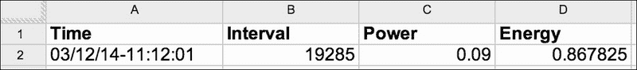

几分钟后，我在我的 Google Docs 电子表格中记录了几次测量。我还通过开关灯来玩了一会儿灯的控制，以便我们实际上可以看到测量数据的变化。以下截图显示了前几次测量：

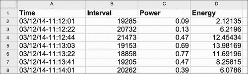

在电子表格中记录一些数据是好的，但将数据以图表形式展示则更好。我使用了 Google Docs 内置的绘图功能，在图表上绘制了随时间的功耗，如下面的截图所示：

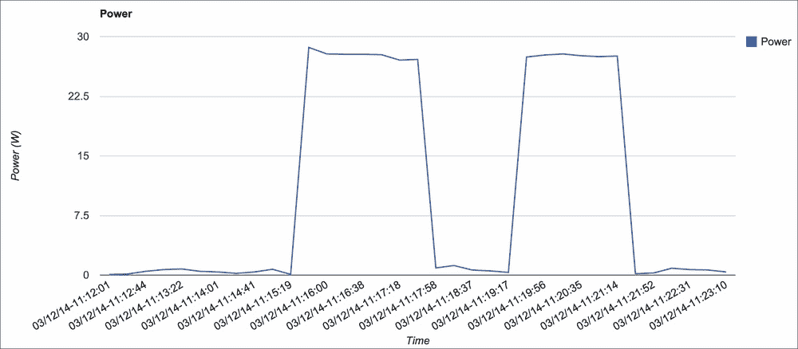

使用相同类型的图表，您还可以绘制随时间计算出的能耗数据，如下面的截图所示：

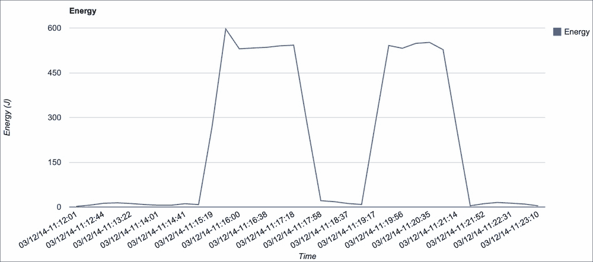

从您在 Google Docs 电子表格中获得的数据中，也可以轻松地获取其他有趣的数据。例如，您可以估计随时间的总能耗及其成本。第一步是使用 Google Docs 的集成求和功能计算能耗列的总和。

然后，您有了以焦耳为单位的能耗，但这并不是电力公司通常向您收费的单位。相反，他们使用千瓦时（kWh），这基本上是将焦耳值除以 3,600,000。我们最后需要的是每千瓦时的价格。当然，这取决于您所在的国家，但在撰写本书时，美国的电价大约是每千瓦时 0.16 美元。要得到总价格，您只需将总能耗（千瓦时）乘以每千瓦时的价格即可。

这是使用我记录的数据得到的结果。当然，由于我只取了很短的数据样本，最终成本几乎为零，如下面的截图所示：

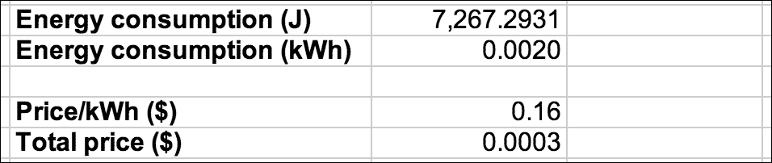

您还可以估计您正在测量的设备的开关时间。为此，我在“能量”旁边简单地添加了一个名为“开关”的额外列。我简单地使用了公式 `=IF(C2<2;0;1)`。

这意味着如果功率小于 2W，我们将其视为关闭状态；否则，我们将其视为开启状态。我没有将条件设置为 0W 以将其计为关闭状态，因为电流传感器随时间的小幅波动。然后，当您有了关于不同开关状态的数据时，计算每个状态的出现次数相当简单，例如，使用 `=COUNTIF(E:E,"1")`。

我在我的 Google Docs 电子表格中应用了这些公式，以下截图是使用我记录的样本数据得到的结果：


将这些数据以图表的形式表示也非常方便。为此，我使用了一个饼图，我认为这是最适合这种数据的图表。以下是我测量得到的截图：

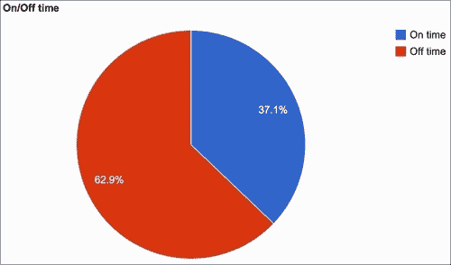

使用前面提到的这种图表，你可以比较特定灯具的日间使用情况，例如，了解你是否在不在这里时忘记了开灯。

# 建立一个远程开关灯的界面

现在我们已经在 Google Docs 上自动记录了有关能源消耗的数据，是时候回到继电器控制上了。到目前为止，我们通过进入网页浏览器并输入正确的 REST 函数以及我们想要更改的引脚名称来测试了继电器。

然而，这并不方便。你不想每次在家想打开灯时都在网页浏览器中输入一些内容。我们真正想要的是一个非常棒的图形界面，带有可以按下以打开或关闭灯的按钮。如果这个界面可以从你的电脑上的网页浏览器访问，也可以从家中的任何智能手机或平板电脑访问，那就更好了。这正是我们现在要构建的。

为了做到这一点，我们需要几个组件，并且我们将混合使用几种编程语言来构建最佳的图形界面。我们将使用 HTML 来构建包含开关按钮的主页，使用 JavaScript 来处理按钮的动作，使用 PHP 将正确的命令发送到 Arduino 服务器。我们还将使用一些 CSS 来使界面看起来更好，并自动适应你使用的设备，例如智能手机。

首先，我们来处理 HTML 代码。我们需要导入 jQuery 库以及包含所有 JavaScript 代码的文件，如下所示：

```cpp
<script src="img/jquery-2.0.3.min.js"></script>
<script src="img/script.js"></script>
```

还需要导入 CSS 样式文件，如下所示：

```cpp
<link rel="stylesheet" type="text/css" href="style.css">
```

这个 HTML 文件的核心是创建两个按钮；一个按钮用于打开继电器，另一个按钮用于关闭继电器。例如，以下代码是**打开**按钮的代码：

```cpp
<input type="button" id="on" class="commandButton" value="On" onClick="relayOn()"/>
```

现在，如果你直接使用这个文件，按钮的外观会很糟糕，因为一些默认样式会被应用到按钮上。这就是为什么我们附加了一个 CSS 文件，使界面看起来更好。例如，我决定将包含两个按钮的主要表单居中对齐，如下所示：

```cpp
#relay {
  text-align: center;
}
```

我也给按钮本身添加了一些样式，比如橙色背景；我使它们更大，并在它们周围添加了一个漂亮的黑色边框，如下面的代码所示：

```cpp
.commandButton {
  background-color: orange;
  border: 1px solid black; 
  font-size: 40px;
  cursor: pointer;
  border-radius: 10px;
  width: 300px;
  height: 100px;
}
```

现在界面在您的计算机上看起来要好得多。但如果有人从智能手机打开它呢？它根本不会适应智能手机的小屏幕。为了自动使界面适应您所使用的设备，我们将使用 CSS3 中的一个属性，称为媒体查询。CSS3 的这个功能可以检测是否使用了较小的屏幕尺寸来访问页面。然后，当您拥有这些信息时，您可以使用它来相应地修改不同元素的风格，例如，我们可能希望使我们的按钮在页面上以不同的方式显示。

在我们的案例中，我们希望按钮能够占据较小屏幕上所有可用的空间。我们还想将每个按钮的高度和字体大小都加倍，以便在像智能手机这样的小屏幕上真正可读。所有这些操作都通过以下代码片段完成：

```cpp
@media screen and (max-device-width: 400px) {
  .commandButton {
    width: 100%;
    height: 200px;
    border: 2px solid black; 
    font-size: 80px;
    margin-bottom: 50px;
       text-align: center;
       background-color: orange;
       }
}
```

JavaScript 文件简单地建立了我们刚刚设计的 GUI 与将实际连接到 Arduino Yún 板的 PHP 文件之间的接口。例如，以下代码是某个按钮调用的代码：

```cpp
function relayOn(){
  $.get( "update_state.php", { command: "1"} );
}
```

`command` 变量简单地包含我们想要发送到 Arduino Yún 板的继电器状态，并将设置继电器连接的引脚的值。

现在让我们看看 PHP 文件。代码的第一行从 JavaScript 获取 `command` 变量，构建将发送到 Yún 的命令，如下所示：

```cpp
$service_url = 'http://myarduinoyun.local/arduino/digital/8/' . $_GET["command"];
```

为了实际发送命令，我们将使用一个名为 `curl` 的 PHP 函数，我们将用它来调用 Yún 的 REST API。我们首先必须用我们之前构建的 URL 初始化这个函数，如下所示：

```cpp
$curl = curl_init($service_url);
```

最后，我们通过以下代码实际执行这个命令：

```cpp
curl_setopt($curl, CURLOPT_IPRESOLVE, CURL_IPRESOLVE_V4 ); 
$curl_response = curl_exec($curl);
curl_close($curl);
```

代码第一行中的 `set` 选项用于简单地加快对 Arduino 板的访问速度。在测试接口之前，请确保您的计算机上的网络服务器正在运行，并且项目的所有文件都位于网络服务器文件夹的根目录下。本部分项目的完整代码可在 [`github.com/openhomeautomation/geeky-projects-yun/tree/master/chapter2/web_interface`](https://github.com/openhomeautomation/geeky-projects-yun/tree/master/chapter2/web_interface) 找到。

您应该在浏览器中看到界面的两个按钮，如下面的截图所示：


现在，您可以测试这个简单的接口。只需点击一个按钮，PHP 代码就应该在您的 Arduino Yún 板上给出正确的命令，使开关立即打开或关闭。

您还可以在智能手机或平板电脑上测试界面。我使用了我的手机来这样做。只需打开您喜欢的浏览器，访问您的电脑 IP 地址或网络名称，您应该会看到项目中的不同文件被显示出来。只需点击**interface.html**，界面应该会打开并调整到您手机的屏幕大小，如下面的截图所示：

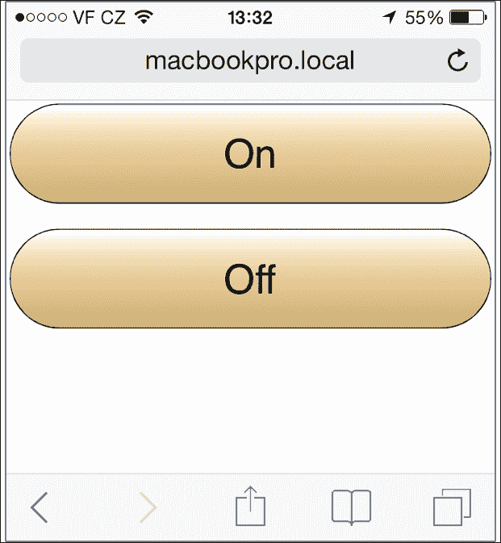

就像在电脑上的界面一样，您只需按下一个按钮，灯光就会立即打开或关闭。现在，您可以从家中任何地方控制这盏灯；您只需连接到您的本地 Wi-Fi 网络即可。

# 摘要

让我们看看在这个项目中我们学到了什么。在项目开始时，您看到了如何将这个项目的所需组件连接到 Arduino Yún 板上：一个继电器模块、一个电流传感器和一个将由 Yún 板控制的灯。

然后，我们编写了一个简单的草图来测试项目的不同组件，并确保它们都能正确工作。

然后，我们构建了项目的能耗记录部分，并在 Google Docs 电子表格中记录了功耗。我们还使用了 Google Docs 的内置功能来计算实际能耗、总能耗成本和设备的开关时间。

最后，在项目的最后一部分，我们构建了一个图形用户界面，可以从网页浏览器、您的电脑或智能手机/平板电脑控制继电器。

当然，有许多方法可以将您在这个项目中学到的知识进一步扩展。首先，您可以向项目中添加更多设备。例如，Arduino Yún 总共有六个模拟输入，所以理论上您可以将相同数量的电流传感器插入 Yún。遵循同样的原则，您也可以向项目中添加更多的 Arduino Yún 板。

您还可以使用具有更多 Temboo 功能的该项目，例如将电力测量与社会媒体集成，例如，当功耗超过给定阈值时通过 Twitter 提醒用户。然后，用户可以通过回复这条推文来关闭灯。

在下一章中，我们将使用 Arduino Yún 的其他功能，如 USB 端口和嵌入式 Linux 机器，来创建一个无线安全摄像头。这个摄像头将自动将图片上传到 Dropbox 文件夹，并在 YouTube 上实时直播视频，这样您就可以远程监控您的家。
