# 第三章：制作自己的云连接摄像头

在这个项目中，我们将构建一个自动上传照片到网络的监控摄像头。我们将把摄像头连接到 Arduino Yún 板，并利用其强大的功能轻松控制这个摄像头并上传照片到网络。我们将构建的是一个能够检测运动的系统，如果检测到运动，可以自动拍照，并将照片保存在 Yún 板上的本地 SD 卡和云端存储中；在我们的案例中是 Dropbox。我们还将使摄像头在私人 YouTube 频道上实时直播视频。

# 开始

让我们更详细地看看这个项目中我们将做什么：

+   首先，我们将使用一个典型的 USB 摄像头、一个 PIR 运动传感器和一张 SD 卡来构建项目的硬件部分。

+   然后，我们将编写一些代码来测试项目的所有硬件连接。我们将检查运动传感器是否工作正常，并尝试在连接到 Arduino Yún 板时用摄像头拍照。

+   在测试硬件之后，我们将构建第一个应用程序，该程序在检测到运动时捕捉照片，并自动将这些照片存储在 SD 卡上。

+   在构建这个简单的本地应用程序之后，我们将把项目连接到云端。项目将执行与之前案例相同的功能，当检测到运动时拍照，但这次照片也将上传到你的 Dropbox 文件夹。这样，你可以从任何地方实时查看照片，因为你可以从任何网络浏览器登录到 Dropbox。

+   最后，我们将把视频流式传输到 Web 上，这样你就可以随时随地通过手机或平板电脑检查家里的情况。为此，我们将在 Yún 板上安装一个流媒体库，并使其通过 Wi-Fi 持续流式传输视频。这个流将被你的电脑获取，并通过专用软件发送到 YouTube。在 YouTube 上，我们就可以像观看典型的 YouTube 视频一样访问这个实时流。

# 所需的硬件和软件组件

首先，让我们看看我们需要哪些组件来完成这个项目。除了 Yún 板之外，你还需要三个组件：一个 USB 摄像头、一个 PIR 运动传感器和一张 SD 卡。在这个部分，我们将直接连接到 Yún，所以你不需要面包板来制作电气连接。

这个项目最重要的组件是 USB 相机。我们使用的是罗技的标准 USB 网络摄像头，型号为 C700，它可以记录高达高清分辨率的图片。当然，如果你已经在你的桌子上有一个相机，你也可以使用其他相机。确保相机与**USB 视频类**（**UVC**）兼容。大多数最新的网络摄像头都与此协议兼容。它可能也适用于未官方兼容 UVC 的相机，但没有保证。你可以在[`en.wikipedia.org/wiki/List_of_USB_video_class_devices`](http://en.wikipedia.org/wiki/List_of_USB_video_class_devices)找到所有 UVC 兼容相机的列表。

此外，尽量选择至少具有高清分辨率的相机，这样你可以获得清晰漂亮的图片。对于流媒体部分来说这并不那么重要，但如果你想将这个项目用于除了安全以外的其他应用，比如创建时间流逝视频，那就太棒了。以下是我们使用的 USB 相机的图片，罗技的 C700 USB 网络摄像头：

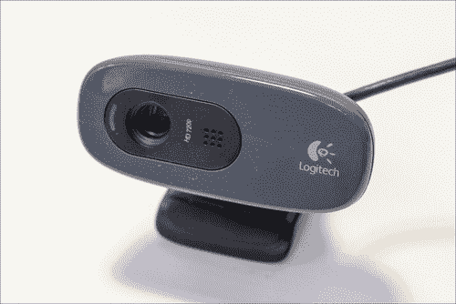

然后，还有 PIR 运动传感器。这个传感器是一个非常便宜的传感器，它使用红外图像来检测房间中任何散发热量的物体，例如人类。我们本可以直接使用相机来检测运动，但那样可能不太高效。当相机开启时，它消耗相当多的电力，而 PIR 运动传感器几乎不耗电。从相机记录中高效地检测运动所需的软件编写也会更困难。我们使用了一个来自 Parallax 的 PIR 运动传感器，你可以在下面的图片中看到：

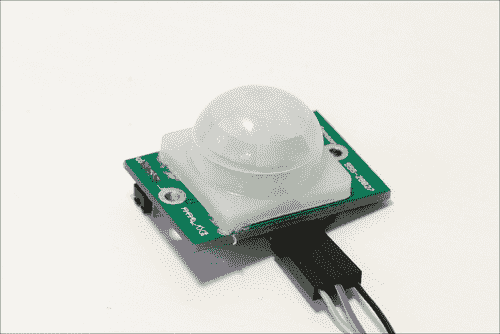

再次强调，你也可以使用其他品牌的 PIR 传感器。主要考虑的是它应该能够与 5V 电压等级工作，因为 Yún 使用的就是这种电压等级。大多数传感器都适用于 3.3V 和 5V 电压等级，所以你应该不会在这个特性上遇到太多问题。当检测到运动时，它应该简单地在其信号引脚上输出逻辑高电平。

对于 SD 卡，我们使用了一个标准的 micro SD 卡。通常，你已经在你的数码相机或智能手机中有一个了。你需要正确格式化它，以便 Yún 可以使用它。我们建议你使用 SD 卡协会的官方 SD 卡格式化工具，请参阅[`www.sdcard.org/downloads/formatter_4/`](https://www.sdcard.org/downloads/formatter_4/)。

现在，在软件方面，你需要的不仅仅是 Arduino IDE。当我们通过 SSH 连接到它时，我们将直接在 Yún 板上安装所需的相机软件。但是，你需要 Temboo Python SDK 来上传图片到 Dropbox。你可以在[`www.temboo.com/download`](https://www.temboo.com/download)找到 SDK。

然后，您还需要拥有一个 Dropbox 账户，以便您可以在上面上传图片。您只需访问 [`www.dropbox.com/home`](https://www.dropbox.com/home) 即可简单地创建一个账户。

一旦您的账户创建完成，您需要创建一个将被您的项目使用的应用。这基本上意味着您必须授权您将在本章中构建的项目，以便自动将图片发送到您的 Dropbox 账户，而无需每次都输入登录名和密码。您还将获得所有所需的信息（例如 API 密钥），我们将在 Yún 上的 Python 脚本中稍后输入。

执行以下步骤以创建应用：

1.  要创建应用，首先访问 [`www.dropbox.com/developers/apps`](https://www.dropbox.com/developers/apps)。

1.  然后，点击窗口右上角的 **创建应用**。您现在可以选择要创建的应用类型。在我们的案例中，我们想直接使用 **Dropbox API**，如下面的截图所示：

1.  然后，您将被提示选择您的应用需要存储的数据类型。我们想上传图片，所以选择 **文件和数据存储**，如下面的截图所示：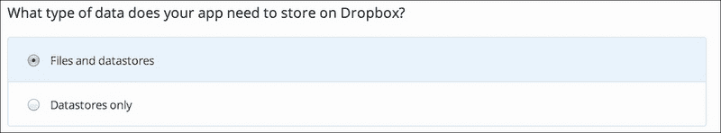

1.  然后，您就可以完成创建 Dropbox 应用的流程。

1.  在描述应用的确认页面上，您需要记下 **应用密钥** 和 **应用密钥**，这些是我们将在整个项目中需要的。

1.  此外，请确保 **权限类型** 字段设置为 **应用文件夹**。这将确保图片被上传到专门为应用设置的文件夹，并且 Yún 不会访问您的 Dropbox 文件夹的其他部分。

1.  您现在需要获取与您的 Dropbox 应用相关的 Token 密钥和 Token 密钥，以便您可以在我们项目的软件中稍后输入它们。

    要获取这些信息，首先需要访问 Temboo 网站上的 InitializeOAuth Choreo，网址为 [`temboo.com/library/Library/Dropbox/OAuth/InitializeOAuth/`](https://temboo.com/library/Library/Dropbox/OAuth/InitializeOAuth/)。在这里，您需要输入应用密钥和应用密钥。这将生成一些附加信息，例如回调 ID 和临时令牌密钥。您还将被要求访问 Dropbox 的链接以确认身份验证。

1.  最后，转到 FinalizeOAuth 页面以完成流程。您将被要求在 [`temboo.com/library/Library/Dropbox/OAuth/FinalizeOAuth/`](https://temboo.com/library/Library/Dropbox/OAuth/FinalizeOAuth/) 输入您的应用密钥、应用密钥、回调 ID 和临时令牌密钥。

    在此步骤之后，您将获得最终的 Token 密钥和 Token 密钥。请将它们记下来，因为您稍后需要它们。

# 进行硬件连接

现在是组装我们的项目的时候了。由于我们将使用 Yún 的大部分连接性，例如 USB 端口，因此组装项目将非常简单快捷。首先，只需将格式化的 micro SD 卡放入 Yún 板下方的 SD 卡读卡器中，如下面的图像所示：

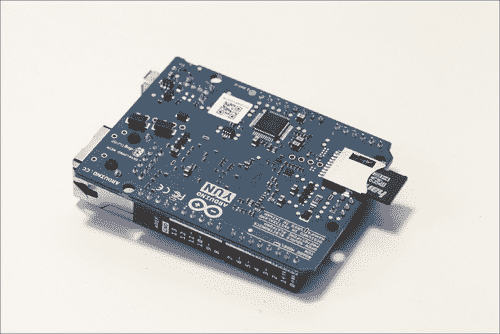

然后，将 USB 摄像头插入 Yún 的 USB 端口，如下所示：

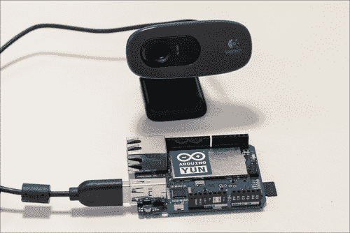

最后，您需要将 PIR 运动传感器连接到 Yún 板。它基本上有三个引脚：VCC、GND 和 SIG（信号引脚）。将 VCC 连接到 Yún 的 5V 引脚，GND 连接到 Yún 的地线，SIG 连接到 Yún 的第 8 号引脚。您应该得到一个类似于以下图像的设置：

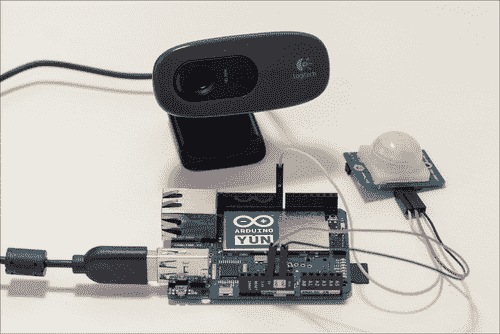

最后，您可以通过 micro USB 线将 Yún 连接到您的计算机，或者如果您想通过 Wi-Fi 远程使用项目并上传 Arduino 草图，可以使用 USB 适配器为其供电。

# 测试您的硬件连接

现在所有的连接都已经完成，我们可以测试项目了。为了开始，我们将关注运动传感器。为此，我们将编写一个非常简单的草图，它将仅使用 Yún 板上的嵌入式 Atmel 微控制器。我们首先需要声明传感器连接到的引脚，如下所示：

```cpp
const int sensor_pin = 8;
```

然后，在`setup()`函数中，我们将启动串行连接，如下所示：

```cpp
Serial.begin(9600);
delay(1000);
```

我们还可以在从传感器读取数据之前设置一些延迟，因为传感器需要一些时间来初始化并正确工作。在`loop()`函数中，我们持续从第 8 号引脚读取值。记住，如果检测到运动，传感器将简单地返回逻辑高状态，否则返回低状态。这意味着我们可以将传感器的读数存储到布尔变量中，如下面的代码行所示：

```cpp
boolean sensor_value = digitalRead(sensor_pin);
```

每秒钟，这个值将使用以下代码行在串行监视器上打印出来：

```cpp
Serial.println(sensor_value);
delay(100);
```

本部分的完整代码可以在[`github.com/openhomeautomation/geeky-projects-yun/tree/master/chapter3/pir_test`](https://github.com/openhomeautomation/geeky-projects-yun/tree/master/chapter3/pir_test)找到。

您现在可以将前面的代码上传到您的 Yún 板上。打开串行监视器，尝试将手放在传感器前；你应该会看到串行监视器上的值立即改变，如下面的截图所示：

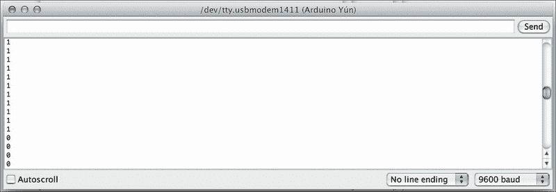

如果你在传感器前移动手时看到值立即改变，这意味着 Yún 的接线是正确的。你也会注意到当检测到运动时，传感器会变红。

现在我们将测试 USB 摄像头。实际上，我们可以在不编写任何 Arduino 脚本的情况下测试摄像头。我们将要做的是通过 SSH 直接连接到 Yún 板。确实，摄像头是通过 USB 端口直接连接到 Yún 的 Linux 机器的，因此 Arduino 脚本稍后必须使用 `Bridge` 库来访问摄像头。

现在，只需打开一个终端窗口（通常是随操作系统 X 或 Linux 安装的典型终端，或者如果您在 Windows 下，可以安装一个类似 HyperTerminal 的终端），然后输入以下命令：

```cpp
ssh root@yourYunName.local

```

当然，您必须将您为您的 Yún 给定的名称替换为 `yourYunName`。例如，我的 Yún 的名称是 `myarduinoyun`；因此，我需要输入 `myarduinoyun.local`。这将建立与 Yún 的 Linux 机器的直接连接。

然后，您将被提示输入为您的 Yún 选择密码。如果一切正常，您应该在终端上看到以下截图显示，这表明您现在正在直接在 Yún 上工作：

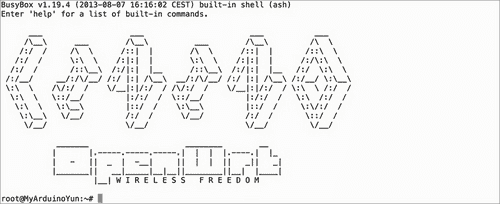

您可以从您的 Yún Linux 机器访问所有功能。我们现在将安装摄像头所需的软件。这需要将 Arduino Yún 连接到互联网，以便它能够获取所需的软件包，具体步骤如下：

1.  此过程首先通过更新软件包管理器 `opkg` 来开始，如下所示：

    ```cpp
    opkg update

    ```

1.  按照以下步骤安装 UVC 驱动程序：

    ```cpp
    opkg install kmod-video-uvc

    ```

1.  安装我们将在项目中使用的 `python-openssl` 软件包，如下所示：

    ```cpp
    opkg install python-openssl

    ```

1.  最后，您可以安装我们将用于拍照的 `fswebcam` 软件，如下所示：

    ```cpp
    opkg install fswebcam

    ```

1.  一旦这部分完成并且软件已安装在 Yún 上，我们就可以测试摄像头并拍照。为了同时测试 SD 卡是否正常工作，请转到 SD 卡文件夹，通常称为 `sda1`，使用以下命令：

    ```cpp
    cd /mnt/sda1

    ```

1.  您现在可以通过输入以下命令来拍照：

    ```cpp
    fswebcam test.png

    ```

1.  您应该会看到一些以以下内容开始的打印消息：

    ```cpp
    --- Opening /dev/video0...
    Trying source module v4l2...
    /dev/video0 opened. 

    ```

可能会打印出一些错误信息，但这对于拍照过程没有影响。

为了检查是否正确工作，您首先可以检查 SD 卡上是否存在名为 `test.png` 的文件。为此，您可以简单地输入以下命令：

```cpp
ls

```

上述命令将打印当前文件夹（在本例中为 SD 卡）中所有文件的列表。您应该至少看到一个名为 `test.png` 的文件。

现在，为了检查图片是否完好且未被损坏，你可以例如，先使用`unmount/dev/sda1`命令卸载 Yún 上的 SD 卡，然后使用微型 SD 卡到普通 SD 卡适配器直接将其连接到你的电脑。你应该能在浏览器中看到以下截图（我们已经在这一点上添加了项目下一部分所需的文件，这解释了 SD 卡上其他文件的位置）：

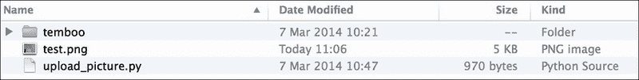

如果你此时在 SD 卡上看到一张图片，请打开它以检查它是否被正确拍摄。如果是这样，恭喜！现在一切都已经设置好了，你可以用这个项目编写令人兴奋的应用程序。如果你此时看不到图片，第一步是重复整个过程。请注意，在拍摄图片后，实际上要卸载 SD 卡。你也可以直接将相机连接到电脑上，以检查问题是否来自相机本身。

# 检测到运动时记录图片

我们将要使用刚刚搭建好的硬件构建的第一个应用程序将是本地的，所以目前不会将任何内容发送到 Web。在这一节中，我们只想构建一个由运动传感器触发的相机。

通过这种方式，例如，你可以检查在你不在家的时候是否有人进入了你的家，因为 PIR 运动传感器会立即注意到。这一部分实际上是整个项目的基础。我们将在编写将图片上传到 Dropbox 的代码时，重新使用这一部分开发的代码。

对于这个项目的一部分，我们不想再使用 SSH 访问来拍摄图片了；我们需要直接从 Arduino 草图触发相机。为此，我们将使用`Bridge`库和`Process`库在 Linux 机器上调用一个命令，就像你在终端窗口中输入一样。

草图首先声明我们需要使用的库：

```cpp
#include <Bridge.h>
#include <Process.h>
```

为了在 Yún 的 Linux 机器上调用一些命令，我们需要声明一个进程，这是一个我们将调用来模拟一些终端输入的对象：

```cpp
Process picture;
```

我们还将为每张要拍摄的图片构建一个文件名，如下代码所示。实际上，我们之前将文件命名为`test.png`，但在这个应用中，我们希望项目拍摄的每张图片都有一个不同的名字：

```cpp
String filename;
```

声明连接运动传感器的引脚，如下所示：

```cpp
int pir_pin = 8;
```

我们还需要定义图片将存储的位置。记住，我们希望将它们全部存储在 SD 卡上，如下所示：

```cpp
String path = "/mnt/sda1/";
```

你也可以在 Yún 上本地存储图片，但这会迅速耗尽 Arduino Yún 的内存。

然后，在`setup()`函数中，我们开始建立 Atmel 微控制器和 Yún 的 Linux 机器之间的桥梁，如下所示：

```cpp
Bridge.begin();
```

此外，我们将 PIR 运动传感器的引脚设置为输入，如下所示：

```cpp
pinMode(pir_pin,INPUT);
```

在`loop()`函数中，我们想要做的是持续从运动传感器读取数据，并在检测到任何运动时触发相机。

这是通过一个简单的`if`语句完成的，该语句检查传感器的值，如下所示：

```cpp
if (digitalRead(pir_pin) == true)
```

然后，如果检测到运动，我们需要准备拍照。第一步是构建一个包含拍照日期的文件名。为此，我们使用 Linux 日期命令输出当前日期和时间。这很重要，因为我们想知道拍照的时间，并为每张图片提供一个唯一的文件名。最后，我们还想指定这张图片将以`PNG`格式拍摄。文件名格式化部分是通过以下代码完成的：

```cpp
filename = "";
picture.runShellCommand("date +%s");
while(picture.running());

while (picture.available()>0) {
  char c = picture.read();
  filename += c;
  } 
filename.trim();
filename += ".png";
```

最后，我们可以拍照。我们在这里要做的是再次调用`fswebcam`命令，使用我们图片处理的`runShellCommand`函数来模拟终端输入。

我们还希望使用相机上可用的最大分辨率。在我们选择的相机中，它是 1280 x 720（标准高清分辨率）。我们 SD 卡上有相当多的空间（我使用的是 4 GB），因此你可以使用最大分辨率而不会遇到问题。我们建议你为这个项目使用一个专门的 SD 卡，以免与其他存储在卡上的文件发生问题。为了简单起见，我们不会添加自动检查卡是否已满的功能，但如果你想让项目长时间连续运行，你应该考虑这一点。你可以在调用末尾使用`–o`命令指定分辨率。最后，我们可以构建完整的代码来拍照：

```cpp
picture.runShellCommand("fswebcam " + path + filename + " -r 1280x720");
while(picture.running());
```

注意，我们在这里也使用了一个`while()`语句，以确保`fswebcam`工具有足够的时间拍照。完整的代码可以在[`github.com/openhomeautomation/geeky-projects-yun/tree/master/chapter3/triggered_camera`](https://github.com/openhomeautomation/geeky-projects-yun/tree/master/chapter3/triggered_camera)找到。

你现在可以将代码上传到 Yún 板并测试项目。一旦上传，尝试在传感器前移动你的手。Arduino Yún 应该触发相机拍照并将其保存到 SD 卡。为了确保此时已经拍照，你可以简单地检查相机本身。例如，我使用的罗技网络摄像头有一个小型的 LED 灯，每当它处于活动状态时就会变绿。

一段时间后，将 SD 卡从 Arduino Yún 中取出（如前所述，首先从 Yún 卸载 SD 卡），然后将其插入我们之前使用的适配器中的电脑。你应该在 SD 卡的根目录下看到所有拍摄的图片，如下面的截图所示：


再次检查这些图片，确保它们没有被损坏，并且一切按计划进行。

# 定期将图片发送到 Dropbox

我们现在将扩展上一节构建的代码，并编写一些自动将相机拍摄的图片上传到 Dropbox 的新代码。为此，我们需要构建比上一部分稍微复杂一些的软件。

目前，我们只使用了 Arduino Yún 的 Choreos（Temboo 库）。然而，实际上还有许多其他语言的可用的 Choreos，例如 Python。这是一个好消息，因为 Yún 的 Linux 机器能够直接运行 Python 代码。

实际上，从 Python 访问 Dropbox API 要容易得多，所以我们将在这个部分使用它。我们将构建一个 Python 脚本，将我们拍摄的图片上传到 Dropbox，并使用 `Bridge` 库和我们的图片处理过程从 Arduino 脚本中调用此脚本。

我现在将解释 Python 脚本的内容。稍后，我们将将这些代码行保存到单独的文件中，并将其与 Temboo Python SDK 一起放置在 SD 卡上。

Python 脚本以以下代码行开始：

```cpp
from temboo.core.session import TembooSession
from temboo.Library.Dropbox.FilesAndMetadata import UploadFile
```

Python 脚本还将接受一个参数：要上传的文件名。这样，我们可以直接将文件名（由 Arduino 代码与时间戳一起构建）传递给 Python 脚本。以下代码行正是这样做的：

```cpp
with open(str(sys.argv[1]), "rb") as image_file:
  encoded_string = base64.b64encode(image_file.read())
```

在脚本内部，您需要定义您的 Temboo 凭据，如下所示：

```cpp
session = TembooSession('yourTembooName', 'yourTembooApp', 'yourTembooKey')
```

这些正是我们之前用于 Temboo 的相同凭据。然后我们需要声明用于自动上传图片到 Dropbox 的 Python `upload file Choreo`，如下所示：

```cpp
uploadFileChoreo = UploadFile(session)
uploadFileInputs = uploadFileChoreo.new_input_set()
```

下一步是设置不同的输入，这是您在创建 Dropbox 应用时所做的，如下所示：

```cpp
uploadFileInputs.set_AppSecret("appSecret")
uploadFileInputs.set_AccessToken("accessToken")
uploadFileInputs.set_FileName(str(sys.argv[1]))
uploadFileInputs.set_AccessTokenSecret("accessTokenSecret")
uploadFileInputs.set_AppKey("appKey")
uploadFileInputs.set_FileContents(encoded_string)
uploadFileInputs.set_Root("sandbox")
```

最后，我们可以调用 `uploadFileChoreo` 来将文件上传到您应用对应文件夹中的 Dropbox 文件夹，如下所示：

```cpp
uploadFileResults = uploadFileChoreo.execute_with_results(uploadFileInputs)
```

您现在可以将此代码保存到名为 `upload_picture.py` 的文件中，并将其放置在 SD 卡的根目录下。还记得我们之前下载的 Temboo Python 库吗？现在是时候将其解压并放置在 SD 卡的根目录下了。只需确保它在 SD 卡根目录下以 `temboo` 的名称出现，这样我们刚刚创建的 Python 文件就可以正确访问它。如果尚未记录任何图片，以下截图显示了您的 SD 卡文件夹应该看起来像什么：

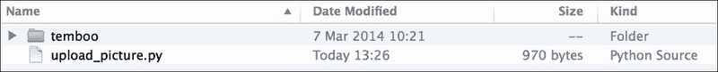

我们还需要稍微修改 Arduino 脚本来上传 Dropbox 上的图片。我们使用了与上一节完全相同的代码库，因此我们只需详细说明新添加的代码。

在检测到运动时执行的代码部分，在循环的末尾，您需要再次使用图片处理来执行 Python 脚本，如下面的代码所示：

```cpp
picture.runShellCommand("python " + path + "upload_picture.py " + path + filename);
while(picture.running());
```

注意，我们正在传递与 SD 卡上记录的图片相同的文件名和路径，所以相同的图片名称在本地记录并发送到 Dropbox。

本部分的完整代码可以在[`github.com/openhomeautomation/geeky-projects-yun/tree/master/chapter3/dropbox_log`](https://github.com/openhomeautomation/geeky-projects-yun/tree/master/chapter3/dropbox_log)找到。

现在，你可以将 SD 卡放回 Arduino Yún，上传更新的 Arduino 草图，然后前往你的 Dropbox 文件夹。此时，你应该注意在你的`Apps`文件夹中创建了一个新文件夹，其名称与你在 Dropbox 网站上设置的 Dropbox 应用名称相同，如下面的截图所示：


现在，如果检测到运动，草图不仅应该在 SD 卡上记录图片，还应该在你的 Dropbox 文件夹上。如果一切正常工作，你应该能看到当 Yún 使用 USB 摄像头拍照时，图片实时出现在你的 Dropbox 文件夹中。

我们项目应用的酷炫之处在于，这可以在世界上的任何地方完成。你当然可以从你的电脑上做这件事，也可以从网页浏览器上做。许多移动设备也可以运行 Dropbox 的移动版，所以你可以直接从你的移动设备上查看是否有人进入了你的家。例如，在我的电脑上，Dropbox 也会给我发送通知，告诉我有新文件上传，这样我就可以立即看到我的家里是否发生了什么，并据此采取行动。

# 通过 Wi-Fi 进行实时视频流

为了完成这一章节，我们将要了解另一个使用 Arduino Yún 和我们的 USB 摄像头可以实现的酷炫应用。请记住，这个摄像头实际上是一个标准的网络摄像头，它也是为了捕捉视频而设计的。在网络上自动流式传输视频到私人视频频道，这样你就可以通过进入网页浏览器在任何地方实时查看你的家，这不是很酷吗？这正是本节我们要做的。

许多商业 IP 摄像头实际上使用专有解决方案来做这件事，但我希望使用常见的工具；这就是我们选择 YouTube 直播事件服务来流式传输视频的原因，这样任何设备都可以访问。

要使应用程序工作，我们首先需要在 Yún 上安装一些额外的软件包，如下面的步骤所示：

1.  再次使用 Arduino Yún 的用户名和密码通过 SSH 连接到 Yún，并输入以下命令以获取正确的直播流软件包：

    ```cpp
    wget http://www.custommobileapps.com.au/downloads/mjpg-streamer.ipk

    ```

1.  注意，如果链接不再有效且你找不到文件，这个包也可以在本章的代码中找到。你现在可以使用以下命令安装它：

    ```cpp
    opkg install mjpg-streamer.ipk

    ```

1.  现在，你可以使用以下命令在你的 Arduino Yún 上启动直播流软件：

    ```cpp
    mjpg_streamer -i "input_uvc.so -d /dev/video0 -r 640x480 -f 25" -o "output_http.so -p 8080 -w /www/webcam" &

    ```

    在这里，`-h`后面的参数是分辨率，而`-i`后面的参数是流可用的端口。我们还使用`-I`命令指定了每秒的帧数。其他选项不太重要，你不必担心它们。

注意，我们没有以高清分辨率进行直播；显然这对 Arduino Yún 来说太多了，视频流出现了显著的延迟，并且还有损坏的图像，这根本不是我们想要的。你可以通过在你的网络浏览器中输入 Arduino Yún 的地址后跟`8080`来指定正确的端口来访问你的流。例如，在我的情况下，它是`http://myarduinoyun.local:8080/stream.html`。

这实际上让你可以直接访问直播流。你应该会看到页面中间的流界面，其中包含直播流，如下面的截图所示：

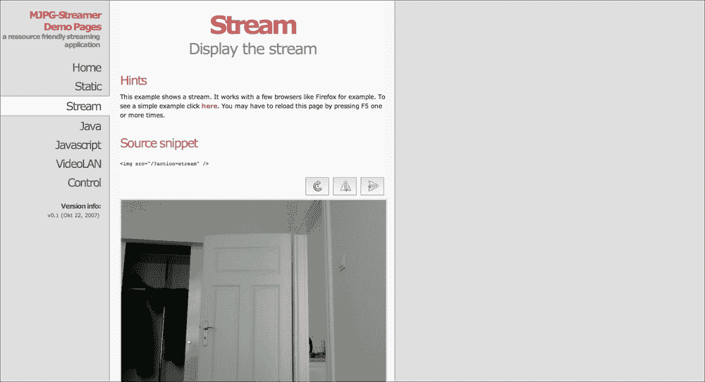

你还可以使用左侧菜单的不同元素来探索这个流软件的其他可能性。例如，你可以获取一个**VideoLAN**的链接，这样你就可以直接从 VLC 播放器访问你的流。

现在，这已经很不错了，你可以在这里停止以从你的本地 Wi-Fi 网络访问你的视频流。但如果流可以在网上访问，那就更好了，这样你就可以从世界任何地方访问它，即使没有连接到本地 Wi-Fi 网络。

第一步是进入你的 YouTube 账户的**视频管理器**，然后点击左侧的**直播活动**菜单，如下面的截图所示：


从这个菜单中，你可以创建你的流，就像创建一个新的 YouTube 视频一样。确保将视频设置为不公开，除非你不想让 YouTube 上的其他人看到你家里的情况。与私密视频相比，你仍然可以通过只给他们提供流的 URL 来与你知道的人分享视频。然后，在下一页，YouTube 会要求你选择你想要使用的编码器。

我从列表中选择了**Wirecast**并从他们的网站下载了它。在 Wirecast 界面中，你需要设置正确的视频源（默认情况下，它将从你的电脑摄像头进行直播）。在你可以选择视频源的菜单中，选择**Web Stream Source**并配置它，如下面的截图所示：

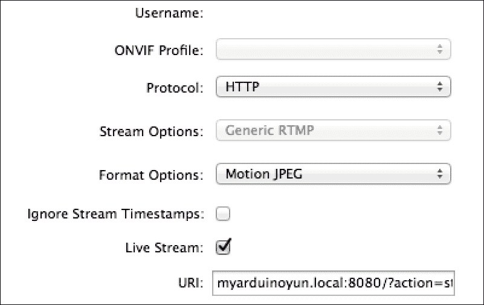

基本上，你需要选择 HTTP 作为协议，使用**Motion JPEG**作为格式，并将流界面视频标签页中的 URL 放入其中。例如，对于我的项目，它是`myarduinoyun.local:8080/?action=stream`。

一段时间后，如果一切正常，您应该看到来自 USB 摄像头的实时流直接出现在 Wirecast 的主窗口中。如果此时出现一些延迟，请不要担心；这通常只是延迟；在我的情况下，Wirecast 软件中大约有 1-2 秒的延迟。以下是在添加正确的视频流后我在 Wirecast 主界面中获得的图像：

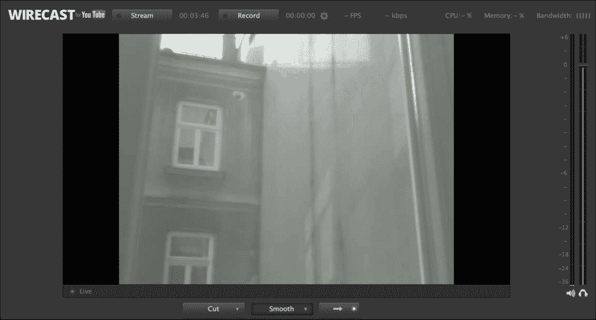

此外，请确保此流是唯一一个将被发送到 YouTube 的流。为此，请从 Wirecast 界面删除所有其他流。实际上，Wirecast 默认将来自您的网络摄像头的流放在界面上。

### 注意

此外，请注意使用 HTTP 流是 Wirecast 付费版本的功能；它在免费版本中运行得很好，但您会在视频上不时地看到水印。不用担心；实际上，监控您家中的情况并不是问题。

下一步是实际上传数据到 YouTube。点击界面顶部的**流**按钮，该按钮应变为红色，之后您将被提示输入您的 YouTube 凭证。然后它应该自动检测您刚刚在 YouTube 上创建的实时事件视频。

接受设置，确保直播来自 Wirecast，然后返回 YouTube 界面。现在您可以进入视频管理器，并转到**直播控制室**标签。这就是您应该看到 YouTube 实际上正在通过运行在您计算机上的 Wirecast 从您的 Arduino Yún 接收一些数据的地方。它应该指示**流状态**为**良好**，如下面的截图所示：


如果不是这种情况，请回到 Wirecast 应用程序，检查直播过程是否正常工作。此刻，请不要担心；您的直播还没有开始工作。您应该看到如下截图所示的**预览**按钮现在可用并可点击。只需点击它。


YouTube 将准备您的直播，如下面的截图所示，您将需要等待片刻（当我尝试时大约 30 秒）：


一段时间后，页面将自动更新，以便您可以进入下一步并实际开始直播，如下面的截图所示：

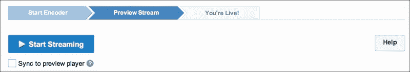

注意在将直播流设置为实时之前，您可以使用上一页上的选项预览它。如果看到的内容令人满意，现在您可以点击**开始直播**以最终完成此过程。然后您将能够在此页面上或直接在直播的专用页面上访问流。以下截图是 YouTube 界面上最终的结果：

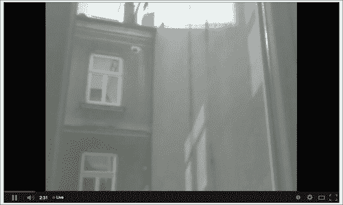

您可以从视频下方的红点看出，视频正在实时流式传输。因为视频被标记为**未列出**，只有拥有 URL 的人才能访问它。例如，您可以将视频标记为 YouTube 账户中的收藏夹，然后从任何地方访问它。您还可以与家人和朋友分享，这样他们也可以从他们的浏览器中观看直播。

注意，因为我们使用计算机上的 Wirecast 软件对视频流进行编码以上传到 YouTube，所以我们需要保持计算机开启才能使这个过程工作。在本书编写时，没有软件可以直接在 YouTube 上流式传输视频而不需要计算机的帮助，但这种情况在未来可能会改变，从而不再需要计算机来流式传输视频。

# 摘要

让我们现在总结一下在这个项目中我们学到了什么。我们在项目中构建的是一个安全摄像头，可以在检测到运动时自动将图片记录到本地和 Dropbox。我们还学会了如何通过 Wi-Fi 将来自这个摄像头的视频实时流式传输到 YouTube。

以下是本项目的主要收获：

+   在项目的第一部分，我们将 USB 摄像头连接到 Arduino Yún，以及 PIR 运动传感器。我们还连接了一个 micro SD 卡到 Yún，这样我们也可以在互联网连接不可用的情况下本地记录图片。我们还安装了项目所需的软件包，例如驱动程序，以便从终端命令访问 USB 摄像头。

+   然后，我们通过检查运动传感器是否正常工作，并确保我们可以使用 USB 摄像头实际拍照来测试我们的硬件。

+   然后，我们使用我们的硬件构建了一个简单的应用程序，当检测到运动时自动拍照并将其存储在 micro SD 卡上。我们在 Yún 上测试了此软件，后来检查时发现确实有一些图片存储在 SD 卡上。

+   在这个简单的应用之后，我们基于草图自动上传了我们的 Dropbox 文件夹中的图片。为此，我们编写了一个 Python 脚本，该脚本可以自动将文件上传到 Dropbox。然后，我们从 Arduino 草图调用这个脚本，以便在检测到运动时将图片上传到 Dropbox。

+   最后，在草图的最后一部分，我们使用了摄像头的视频功能，在 YouTube 上实时直播视频。这样，无论您在世界上的哪个地方，都可以监控您家的情况；我们只需要一个互联网连接和一个可以访问 YouTube 的设备，例如智能手机。

当然，您可以根据我们在本章中学到的知识以多种方式改进和扩展这个项目。您当然可以在您的家中安装许多带有摄像头和运动传感器的模块。这样，您就可以拥有一个完整的远程监控系统，以监控您的家。

提高项目的一种方法是将更多的 Choreos 集成到项目中。例如，你可以将我们在第一章中使用过的 Gmail Choreo 注入到项目中，以便在检测到运动时自动发送电子邮件警报。这将为你家的安全增加另一层保障。以类似的方式，你也可以使用 Twilio Choreo，当在家中发现运动时，它会给你发送短信。

你也可以将这个项目用于完全不同的目的。在测试项目时，例如，我们创建了一个定时摄影设备，它以固定的时间间隔拍照（例如，每分钟一次）并将这些照片上传到 Dropbox。

在下一章中，我们将利用 Arduino Yún 的 Wi-Fi 功能进行一个完全不同的应用：控制一个移动机器人。我们将利用 Arduino Yún 的力量远程控制这个机器人，并读取来自机器人的数据，所有这些都在你电脑上运行的一个简单网络应用程序中完成。
