# 第二章：气象站（物联网）

在第一章 *设置英特尔爱迪生* 中，我们学习了如何设置英特尔爱迪生并在各种语言中运行一些基本程序。在本章中，我们将事情扩展一点，将互联网引入物联网的画面。我们将经常听到这个术语，但还没有确切的定义。然而，如果我们尝试提取物联网的字面意义，它意味着将设备连接到互联网。它也可能被称为**连接设备**或**智能设备**。它是**机器对机器**（**M2M**）通信的高级形式。在本章中，主要关注物联网的架构以及英特尔爱迪生是如何成为围绕物联网开发系统的完美选择的。我们还将处理典型物联网项目的各种组件以及如何在组件级别进行扩展。到本章结束时，我们将构建一个使用英特尔爱迪生的系统，该系统将接收污染数据、温度数据和声音数据，并将其上传到网络并在仪表板上实时显示。

在本章中，我们将涵盖以下主题：

+   典型物联网系统架构，将传感器与英特尔爱迪生接口

+   连接设备并将数据上传到云端，部署带有英特尔爱迪生的微型气象站

# 物联网及其用法的概述

物联网有很多用途，可以使普通事物变得智能化。从工业开始，我们处理大型机械，如工业机器人和装配线工业单元，物联网的根源植根于许多用途，为云端或本地服务器提供关键数据，我们可以在任何使用物联网的地方远程监控并提供远程功能。现在想象一个医疗保健解决方案，我们家庭中有年迈的成员，我们需要定期监控他们。

智能医疗设备出现在画面中，从人体收集的数据不断推送到云端，并在本地层面监控任何异常迹象。在云端进行适当的分析，利用机器学习算法，我们可以预测个人的健康状况。考虑到将在第三章中讨论的智能家居自动化用例，*英特尔爱迪生和物联网（家庭自动化）*，我们可以远程控制设备并监控如灯光、风扇和空调等电气负载的用法，无论在世界任何地方。

# 典型物联网项目的架构

在处理物联网项目时，有一些关键因素应该牢记在心，以下是一些：

+   硬件选择

+   网络协议的选择

+   传感器的选择

+   物联网平台的选择

除了之前提到的点之外，还有一些其他因素将在本章后面的部分变得清晰。在处理物联网时，我们首先想到的是上传数据。通常，物联网项目涉及从传感器读取数据并将其上传到网络。在这个过程中，包括数据处理和过滤、分析和机器学习在内的几个子过程都会发挥作用。

以下图示展示了一个标准架构：

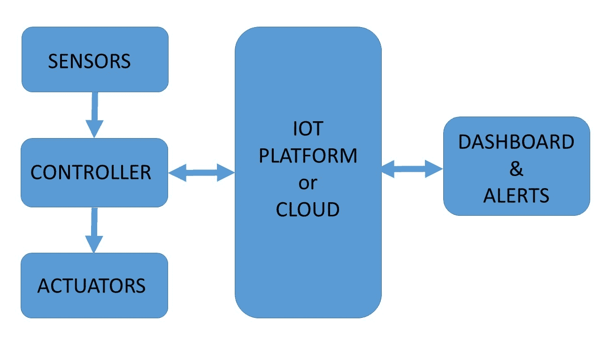

物联网架构概述

如前图所示，典型的物联网系统可能包括以下组件：

+   传感器

+   控制器执行器

+   物联网平台或云

+   仪表盘和警报

# 传感器

传感器在物联网空间中扮演着关键角色。它们充当物理世界和数字世界之间的一种连接层。传感器耦合提供了我们想要的整个系统的数据。目前我们并不专注于工业级传感器，但低功耗传感器适合小型概念验证。在处理传感器时，应考虑以下因素：

+   传感器使用的电源

+   提供的输出类型（数字或模拟）

+   传感器的灵敏度

传感器通常与控制器进行单向通信。传感器捕获的数据通过 ADC 转换为数字值，我们通过控制器获得输出。让我们考虑一个光传感器的用例。在这种情况下，传感器返回一个校准后的电阻值。因此，我们根据光强度得到一个电阻值。其他传感器的情况类似，任何物理组件都被读取并转换为数字组件。通常，传感器有三个引脚；Vcc、Gnd 和信号。传感器与控制器的接口将在本章后面讨论。

# 控制器

这些是物联网系统的“大脑”。控制器在物联网空间中执行大部分操作。在工业领域，控制器可能被称为物联网网关。从数据采集到处理这些数据，再到将其上传到云并控制执行器，所有这些操作都是由控制器完成的。通常，控制器具有网络和无线通信的能力。如果某些控制器没有这种能力，那么通常它们会与外部网络设备堆叠。Arduino、Raspberry Pi、Intel Galileo 和 Intel Edison 是最常用的控制器之一。控制器通常带有 GPIO 引脚，用于与其他设备接口。我们使用的控制器 Intel Edison 的大部分细节在第一章，*设置 Intel Edison*中已有讨论。

# 执行器

执行器主要由提供基于控制器信号的某些动作的机电装置组成。基于控制器发送的信号，执行器被激活或去激活。执行器主要是电机；伺服电机也属于这一类别。由于执行器的高功率需求或电流的性质（交流或直流），控制器不能直接控制执行器。接口的硬件组件称为驱动电路。

控制器向驱动电路发送控制信号，根据这些控制信号，执行器被激活。在处理本书的机器人模块时，我们将详细讨论执行器。

# 云或物联网平台

这可能是整个物联网（IoT）生态系统中最重要的一部分，因为最终我们需要上传数据，以便可以从任何地方访问，这是物联网的互联网部分。通常我们更倾向于选择物联网平台。这些平台都有自己的 SDK，我们只需使用这些 SDK 将我们的设备与物联网平台配对并上传数据。物联网平台中的顶级玩家包括微软 Windows Azure、IBM Bluemix 和亚马逊网络服务。还有其他提供这些服务的平台，例如 Datonis、Dweet、Thingspeak、Thingworx 等等。物联网平台的选择非常具体，取决于某些因素，例如：

+   **支持的协议**：这些主要是 REST、WebSockets 和 MQTT

+   **仪表板功能**：平台拥有自己的仪表板用于可视化，以及开发自定义仪表板的灵活性

+   **规则引擎**：这些包括基于传入数据需要定义的规则

+   **基于事件的 服务**：这些是基于规则引擎输出的触发事件的必要性

在本章中，我们将讨论在我们的项目中使用`dweet.io`，一个迷你气象站。

# 仪表板和警报

当我们有数据时，数据应以仪表盘、图表等形式呈现。在大多数情况下，平台本身提供支持，但有时会出现根据我们获得的数据构建自定义仪表板的需求。通常通过 REST API 调用，我们从物联网平台获取数据到我们的自定义仪表板。这些也是物联网生态系统的重要组成部分。仪表板还必须与从 PC 到移动设备等各种设备兼容。它们也必须是实时的。虽然仪表板处理数据可视化，但另一方面，警报负责通知用户系统中的任何故障或异常。通常警报的首选方式是某些可视化、推送通知、电子邮件、短信等等。

# 将传感器与英特尔爱迪生（Intel Edison）接口

在本章前面，我们简要地了解了一些传感器。现在我们将看到如何将这些传感器与英特尔爱迪生板进行接口。让我们考虑使用温度传感器的例子。如前所述，大多数传感器都有三或四引脚配置：

+   Vcc

+   地线

+   信号

如果你查看爱迪生板，板上会有模拟引脚。理想情况下，如果传感器返回一个模拟值，那么它就会进入模拟引脚。对于数字输出也是类似的：我们更倾向于使用数字引脚。让我们看看以下示例，我们将要连接一个温度传感器。通常，一个典型的温度传感器有三个引脚。配置与之前相同。然而，有时由于板兼容性问题，它可能带有四引脚配置，但在那种情况下，其中一个引脚是不使用的。

在这个例子中，我们将使用一个 Grove 温度传感器模块：

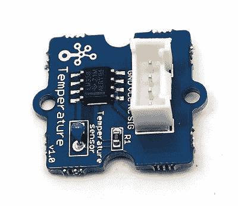

Grove 温度传感器模块

上一张图片是一个温度传感器。你可能注意到它有四个引脚，分别标记为 Vcc、Gnd、Sig 和 NC。为了与你的爱迪生板连接，请遵循以下电路图：

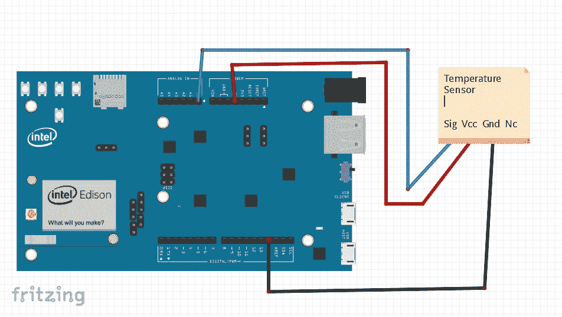

基本温度数据电路图

在这个电路图中，我们可以注意到 NC 引脚没有连接。因此，只有三个引脚，即 Vcc、Gnd 和 Sig，被连接。现在，一旦你完成了连接，我们需要编写一些读取数据的算法。标准程序是查找传感器的数据表。通常，我们也会得到传感器获取所需参数的数学方程。

对于 Grove 温度传感器模块，我们的第一个目标是获取制造商网站上的某些数据。通常，这些传感器根据电阻的变化来计算温度：

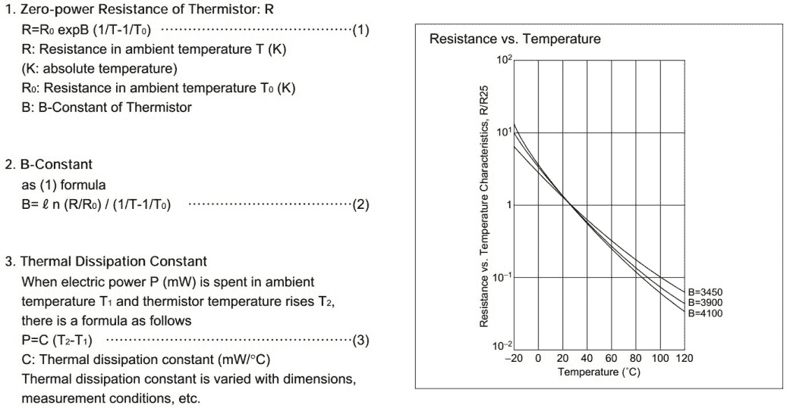

温度计算算法。图片来源：[h](http://wiki.seeed.cc/Grove-Temperature_Sensor_V1.2/)[t](http://wiki.seeed.cc/Grove-Temperature_Sensor_V1.2/)[t](http://wiki.seeed.cc/Grove-Temperature_Sensor_V1.2/)[p](http://wiki.seeed.cc/Grove-Temperature_Sensor_V1.2/)[://w](http://wiki.seeed.cc/Grove-Temperature_Sensor_V1.2/)[i](http://wiki.seeed.cc/Grove-Temperature_Sensor_V1.2/)[k](http://wiki.seeed.cc/Grove-Temperature_Sensor_V1.2/)[i](http://wiki.seeed.cc/Grove-Temperature_Sensor_V1.2/)[.](http://wiki.seeed.cc/Grove-Temperature_Sensor_V1.2/)[s](http://wiki.seeed.cc/Grove-Temperature_Sensor_V1.2/)[e](http://wiki.seeed.cc/Grove-Temperature_Sensor_V1.2/)[e](http://wiki.seeed.cc/Grove-Temperature_Sensor_V1.2/)[e](http://wiki.seeed.cc/Grove-Temperature_Sensor_V1.2/)[d](http://wiki.seeed.cc/Grove-Temperature_Sensor_V1.2/)[.](http://wiki.seeed.cc/Grove-Temperature_Sensor_V1.2/)[c](http://wiki.seeed.cc/Grove-Temperature_Sensor_V1.2/)[c](http://wiki.seeed.cc/Grove-Temperature_Sensor_V1.2/)[/G](http://wiki.seeed.cc/Grove-Temperature_Sensor_V1.2/)[r](http://wiki.seeed.cc/Grove-Temperature_Sensor_V1.2/)[o](http://wiki.seeed.cc/Grove-Temperature_Sensor_V1.2/)[v](http://wiki.seeed.cc/Grove-Temperature_Sensor_V1.2/)[e](http://wiki.seeed.cc/Grove-Temperature_Sensor_V1.2/)[-](http://wiki.seeed.cc/Grove-Temperature_Sensor_V1.2/)[T](http://wiki.seeed.cc/Grove-Temperature_Sensor_V1.2/)[e](http://wiki.seeed.cc/Grove-Temperature_Sensor_V1.2/)[m](http://wiki.seeed.cc/Grove-Temperature_Sensor_V1.2/)[p](http://wiki.seeed.cc/Grove-Temperature_Sensor_V1.2/)[e](http://wiki.seeed.cc/Grove-Temperature_Sensor_V1.2/)[r](http://wiki.seeed.cc/Grove-Temperature_Sensor_V1.2/)[a](http://wiki.seeed.cc/Grove-Temperature_Sensor_V1.2/)[t](http://wiki.seeed.cc/Grove-Temperature_Sensor_V1.2/)[u](http://wiki.seeed.cc/Grove-Temperature_Sensor_V1.2/)[r](http://wiki.seeed.cc/Grove-Temperature_Sensor_V1.2/)[e](http://wiki.seeed.cc/Grove-Temperature_Sensor_V1.2/)[_](http://wiki.seeed.cc/Grove-Temperature_Sensor_V1.2/)[S](http://wiki.seeed.cc/Grove-Temperature_Sensor_V1.2/)[e](http://wiki.seeed.cc/Grove-Temperature_Sensor_V1.2/)[n](http://wiki.seeed.cc/Grove-Temperature_Sensor_V1.2/)[s](http://wiki.seeed.cc/Grove-Temperature_Sensor_V1.2/)[o](http://wiki.seeed.cc/Grove-Temperature_Sensor_V1.2/)[r](http://wiki.seeed.cc/Grove-Temperature_Sensor_V1.2/)[_](http://wiki.seeed.cc/Grove-Temperature_Sensor_V1.2/)[V](http://wiki.seeed.cc/Grove-Temperature_Sensor_V1.2/)[1.](http://wiki.seeed.cc/Grove-Temperature_Sensor_V1.2/)[2/](http://wiki.seeed.cc/Grove-Temperature_Sensor_V1.2/)

最终公式如下：

*B=4275*

*R0=100000*

*R= 1023.0/a-1.0 R= 100000*R*

最终温度 = *1.0/(log(R/100000.0)/B+1/298.15)-273.15*

前面的推导来自[h](http://wiki.seeed.cc/Grove-Temperature_Sensor_V1.2/)[t](http://wiki.seeed.cc/Grove-Temperature_Sensor_V1.2/)[t](http://wiki.seeed.cc/Grove-Temperature_Sensor_V1.2/)[p](http://wiki.seeed.cc/Grove-Temperature_Sensor_V1.2/)[://w](http://wiki.seeed.cc/Grove-Temperature_Sensor_V1.2/)[i](http://wiki.seeed.cc/Grove-Temperature_Sensor_V1.2/)[k](http://wiki.seeed.cc/Grove-Temperature_Sensor_V1.2/)[i](http://wiki.seeed.cc/Grove-Temperature_Sensor_V1.2/)[.](http://wiki.seeed.cc/Grove-Temperature_Sensor_V1.2/)[s](http://wiki.seeed.cc/Grove-Temperature_Sensor_V1.2/)[e](http://wiki.seeed.cc/Grove-Temperature_Sensor_V1.2/)[e](http://wiki.seeed.cc/Grove-Temperature_Sensor_V1.2/)[d](http://wiki.seeed.cc/Grove-Temperature_Sensor_V1.2/)[.](http://wiki.seeed.cc/Grove-Temperature_Sensor_V1.2/)[c](http://wiki.seeed.cc/Grove-Temperature_Sensor_V1.2/)[c](http://wiki.seeed.cc/Grove-Temperature_Sensor_V1.2/)[/G](http://wiki.seeed.cc/Grove-Temperature_Sensor_V1.2/)[r](http://wiki.seeed.cc/Grove-Temperature_Sensor_V1.2/)[o](http://wiki.seeed.cc/Grove-Temperature_Sensor_V1.2/)[v](http://wiki.seeed.cc/Grove-Temperature_Sensor_V1.2/)[e](http://wiki.seeed.cc/Grove-Temperature_Sensor_V1.2/)[-](http://wiki.seeed.cc/Grove-Temperature_Sensor_V1.2/)[T](http://wiki.seeed.cc/Grove-Temperature_Sensor_V1.2/)[e](http://wiki.seeed.cc/Grove-Temperature_Sensor_V1.2/)[m](http://wiki.seeed.cc/Grove-Temperature_Sensor_V1.2/)[p](http://wiki.seeed.cc/Grove-Temperature_Sensor_V1.2/)[e](http://wiki.seeed.cc/Grove-Temperature_Sensor_V1.2/)[r](http://wiki.seeed.cc/Grove-Temperature_Sensor_V1.2/)[a](http://wiki.seeed.cc/Grove-Temperature_Sensor_V1.2/)[t](http://wiki.seeed.cc/Grove-Temperature_Sensor_V1.2/)[u](http://wiki.seeed.cc/Grove-Temperature_Sensor_V1.2/)[r](http://wiki.seeed.cc/Grove-Temperature_Sensor_V1.2/)[e](http://wiki.seeed.cc/Grove-Temperature_Sensor_V1.2/)[_](http://wiki.seeed.cc/Grove-Temperature_Sensor_V1.2/)[S](http://wiki.seeed.cc/Grove-Temperature_Sensor_V1.2/)[e](http://wiki.seeed.cc/Grove-Temperature_Sensor_V1.2/)[n](http://wiki.seeed.cc/Grove-Temperature_Sensor_V1.2/)[s](http://wiki.seeed.cc/Grove-Temperature_Sensor_V1.2/)[o](http://wiki.seeed.cc/Grove-Temperature_Sensor_V1.2/)[r](http://wiki.seeed.cc/Grove-Temperature_Sensor_V1.2/)[_](http://wiki.seeed.cc/Grove-Temperature_Sensor_V1.2/)[V](http://wiki.seeed.cc/Grove-Temperature_Sensor_V1.2/)[1.](http://wiki.seeed.cc/Grove-Temperature_Sensor_V1.2/)[2/](http://wiki.seeed.cc/Grove-Temperature_Sensor_V1.2/).

当将前面的推导转换为 Arduino IDE 的代码以部署到 Edison 时，结果如下：

```cpp
#include <math.h> 

constint B=4275; constint R0 = 100000; constint tempPin = A0; void setup() 

  { 

    Serial.begin(9600); 

  } 

void loop() 

  { 

    int a = analogRead(tempPin ); float R = 1023.0/((float)a)-1.0; 
    R = 100000.0*R; 

    float temperature=1.0/(log(R/100000.0)/B+1/298.15)-273.15;
    Serial.print("temperature = "); Serial.println(temperature); 
    delay(500); 

  } 

```

# 代码说明

让我们讨论我们需要遵循的步骤：

1.  初始时，我们声明`B`和`R0`的值。这些值来自数据表，如算法中所示。

1.  接下来，我们声明将使用的模拟引脚，`tempPin`。

1.  在`setup()`函数中，我们只是执行`Serial.begin(9600)`操作。问题是，我们没有将`tempPin`设置为输入模式，因为默认情况下模拟引脚是输入模式。

1.  在循环的下一个步骤中，我们将实现之前在代码中执行的运算，并在串行监视器上显示它。

1.  要访问串行监视器，请按右上角按钮。串行窗口打开后，您将看到您当前房间的温度：

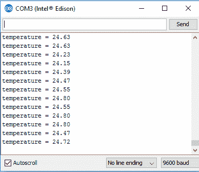

串行窗口。注意波特率和温度读数

从前面的屏幕截图，您可以注意到的温度读数，这非常接近原始温度。根据灵敏度，温度可能会有所不同。

现在我们知道了如何访问温度传感器的读数，我们可以继续进行其他传感器的集成，以完成我们的气象站项目。

# 连接设备并将数据上传到云端（dweet.io）

现在我们知道了如何读取传感器的数据，我们的下一个目标是选择一个物联网平台，我们将把数据上传到该平台。我们之前简要讨论过物联网平台。

在本节中，我们将处理`dweet.io`。这个物联网平台非常易于实现。我们将使用`dweet.io`的 Node.js SDK。在深入了解之前，让我们看看这个平台。我们的目标是把我们获取的温度数据推送到平台，并在仪表板上显示。

`dweet.io`是一个简单的机器（传感器、机器人、设备等）发布和订阅服务。它就像 Twitter，但针对事物。每个事物都分配了一个唯一的名称，通过 REST 服务，我们可以访问和更新它们。需要注意的是，我们创建的事物是公开的。为了创建一个私有事物，我们需要付费。在这里，我们将仅介绍其公开方面：

关于`dweet.io`的详细信息，请参阅以下链接：

[`dweet.io/faq`](https://dweet.io/faq)

1.  这将是我们的气象站的第一步之一，因为温度是其不可或缺的一部分：


Dweet.io 截图

1.  现在，点击播放标签进入创建区域：

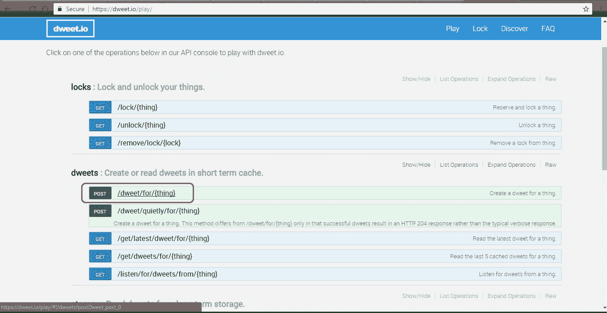

播放—dweet.io

1.  接下来，我们将为我们的事物提供一个名称：

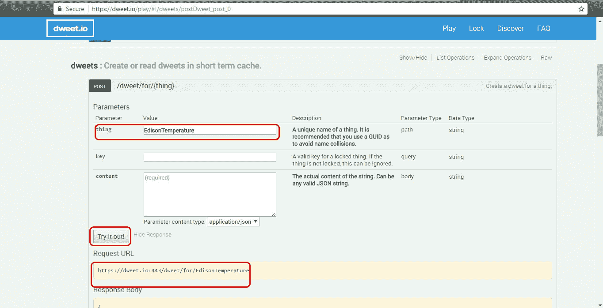

dweet.io—创建事物

1.  为您的“事物”命名。名称必须是唯一的。

1.  点击“试试看！”按钮后，您将获得一个请求 URL。

1.  现在，点击`https://dweet.io/follow/EdisonTemperature`浏览到您的公共事物页面。一旦 Edison 连接，我们就会在这里接收数据。所以，现在，让我们将一个温度传感器连接到 Edison，并将其连接到您的电脑。

1.  在这个迷你项目中，我们将编写一个 Node.js 程序，该程序将访问传感器的数据并将其上传到前面链接的此处。此外，我们不会将代码写入 Intel XDK，而是在 Notepad++中编写代码，并使用 FileZilla 客户端进行传输。

1.  但再次，我们还没有访问到这些库。因此，我们需要将这些库添加到我们的 Edison 设备中。为此，启动您的 PuTTY 终端并登录到您的 Edison：

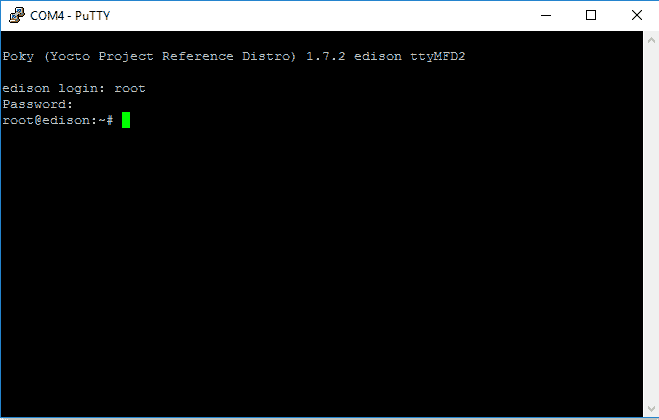

PuTTY console-setup—1

1.  接下来，使用`ifconfig`命令检查您的设备是否已连接到 Wi-Fi 网络：

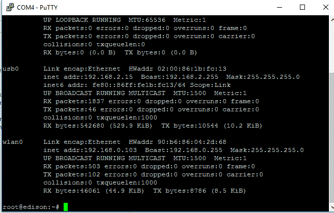

PuTTYconsole-setup—2

1.  接下来，我们将在我们的设备上安装`dweet.io`的 Node.js SDK。执行以下命令：

```cpp
 npm install node-dweetio -save

```

根据您的互联网连接速度，模块安装可能需要一些时间。警告可以忽略。

1.  安装完成后，我们将为 Edison 编写 Node.js 脚本。现在打开您的编辑器并输入以下代码：

```cpp
      function dweetSend()
        {
          vardweetClient = require("node-dweetio"); vardweetio =
          newdweetClient();
          var mraa= require('mraa'); var B=4275;
          var R0=100000;
          var tempPin=new mraa.Aio(0); var a=tempPin.read();
          var R=1023/a-1; R=100000*R;
          var temperature=1/(Math.log(R/100000)/B+1/298.15)-273.15;
          temperature = +temperature.toFixed(2);
          dweetio.dweet_for("WeatherStation",
          {Temperature:temperature}, function(err, dweet)
            {
              console.log(temperature); console.log(dweet.thing); //
              "my-thing"
              console.log(dweet.content); // The content
              of the dweet
              console.log(dweet.created); // The create
              date of the dweet
            });
          setTimeout(dweetSend,10000);
        }
      dweetSend();

```

为了解释代码，让我们将其分解成几个部分。如您所见，我们有一个名为`dweetSend`的主函数，它在每 10 秒后重复一次。最初，我们需要从温度传感器获取数据。我们已经将温度传感器连接到模拟引脚 3。如果您仔细查看在 Arduino IDE 中编写的代码，您会发现很多相似之处：

```cpp
vardweetClient = require("node-dweetio");
vardweetio = new dweetClient();

```

在这些行中，我们导入 node 的`dweetio`库。下一部分代码类似于 Arduino IDE，其中我们读取模拟读取的原始值并执行所需的计算：

```cpp
var mraa= require('mraa');
var B=4275; varR0=100000;
var tempPin=new mraa.Aio(0);
var a=tempPin.read();
var R=1023/a-1;
R=100000*R;
var temperature=1/(Math.log(R/100000)/B+1/298.15)-273.15; temperature = +temperature.toFixed(2);

```

如前所述的代码中所述，我们还将温度值四舍五入到两位小数。接下来，我们将值推送到`dweet.io`的 thing 通道。在这里，我们需要提到我们的 thing 名称`WeatherStation`，然后是参数名称`Temperature`和变量名称`temperature`：

```cpp
dweetio.dweet_for("WeatherStation", {Temperature:temperature}, function(err, dweet)
  {
    console.log(temperature); console.log(dweet.thing); // "my-thing"
    console.log(dweet.content); // The content of the dweet
    console.log(dweet.created); // The create date of the dweet
  });

```

整个工作流程就是这样。所以，总结一下：

1.  导入所需的库。

1.  根据电路，从使用的引脚读取原始值，并处理该值以获得所需的输出。

1.  将值推送到`dweet.io`。

将此代码保存为`dweetEdison.js`，要运行此代码，请输入以下命令：

```cpp
node dweetEdison.js

```

通过在 PuTTY 终端中执行前面的语句来运行代码后，您将看到以下输出：

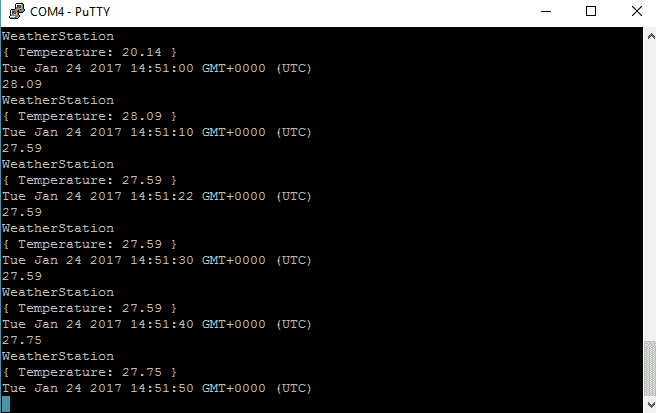

PuTTY console—output

有时，在导入`mraa`库时，前面的代码可能会抛出错误。存在读取模拟引脚值的问题。这通常发生在您从多个来源安装了`mraa`库的情况下。在这种情况下，重新刷新您的设备并遵循所有步骤。

现在，一旦您看到这个，那么您的代码就运行成功了。现在我们将转到`dweet.io`页面，看看我们的数据是否真的被上传了。我们命名为 WeatherStation。您的 thing 名称显然会有所不同，因为它是唯一的。

现在浏览到以下 URL：

`https://dweet.io/follow/YOUR_THING_NAME`

您应该有一个类似这样的图表或视觉表示：

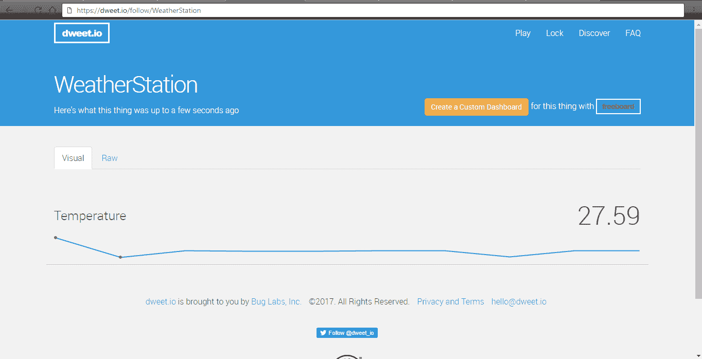

温度曲线图—dweet.io

除非我们有仪表，否则图表看起来不完整。有一个叫做`freeboard.io`的东西。它也是免费的，但同样它是公开的。所以，浏览到`freeboard.io`并登录或如果你没有账户则注册：

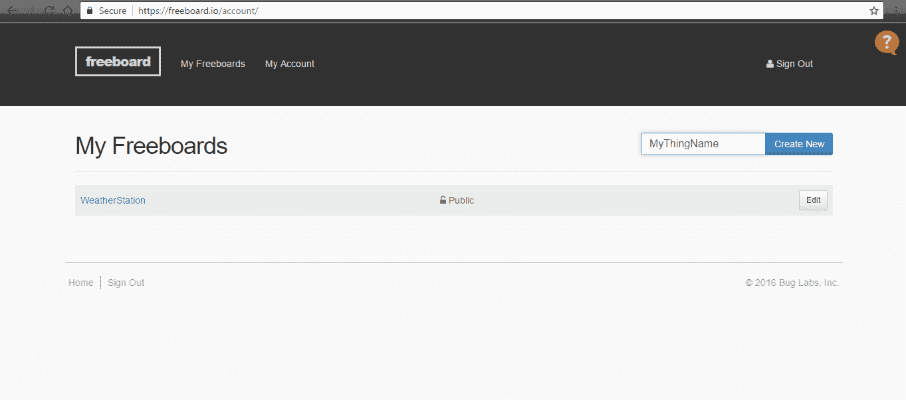

freeboard.io—账户页面

提供一个名称并点击“创建新”。这里我们提供了 WeatherStation。一旦创建板，你将自动重定向到板设计页面。接下来，在 DATASOURCES 下，点击“添加”：

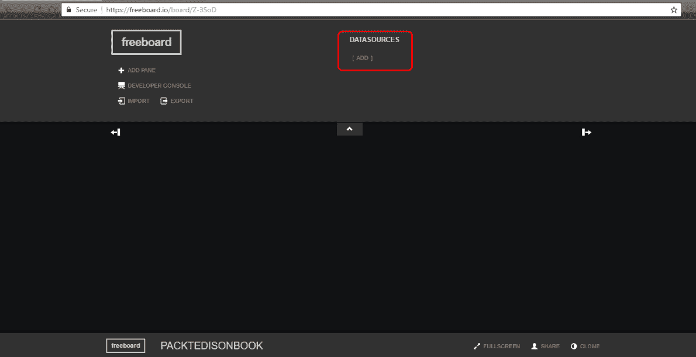

Freeboard 截图

现在，一旦你点击“添加”，你必须选择一个类型。选择 Dweet.io。在名称下，提供任何名称。为了简单起见，使名称和设备名称相同。由于你的设备在`dweet.io`上是公开的，我们不需要提供密钥。点击“保存”继续：

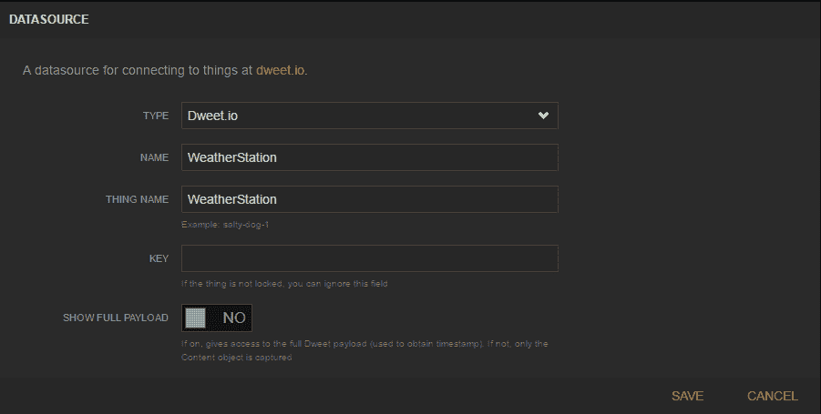

Dweet.io 数据源

完成后，我们需要为我们的传入数据添加一个面板。为此，点击“添加面板”并继续添加一个新的仪表。填写以下截图所示的详细信息。注意，在值字段下，我们已写入`datasources["WeatherStation"]["Temperature"]`。因此，`WeatherStation`是您的设备名称，后面跟着我们想要显示的参数名称。同样，本章即将讨论的项目也将有其他参数：

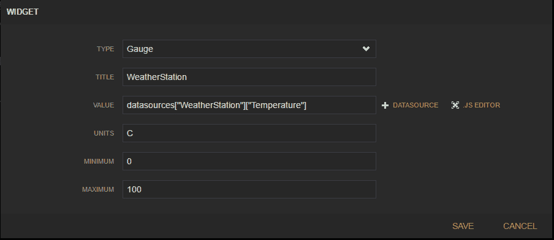

Freeboard

点击“保存”，你应该能在你的板主页上看到你的仪表。

由于你的代码尚未运行，这个仪表目前不会显示任何值。所以回到你的 PuTTY 控制台并运行你的 Node.js 代码。一旦你的代码启动并运行，那么仪表应该代表你的传入数据，如以下截图所示：

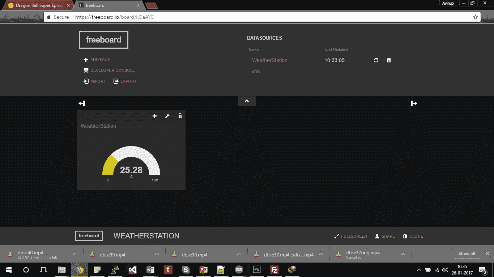

工作模式下的仪表

因此，我们已经部署了一个非常简单的用例，从 Edison 上传数据到`dweet.io`并在`freeboard.io`上显示。在下一节中，我们将处理一个实时物联网项目，我们将处理多个参数。

# 物联网项目实时用例 - 迷你气象站

在上一节中，我们看到了仅上传温度数据的用例。现在，使用迷你气象站，我们将处理三个参数：

+   温度

+   污染等级

+   声音等级

所有三个参数都将上传到云端并在仪表板上实时显示。项目将被分成几个部分，这将使其更容易理解，我们还将处理其他复杂项目：

+   系统架构

+   传感器和硬件组件以及详细的电路图

+   在控制台上本地获取数据并显示

+   将数据上传到云端

+   可视化数据

大多数细节之前已经使用温度传感器展示过了，所以我们将不会深入探讨，但会涵盖所有方面。

# 系统架构

系统的架构将与本章开头讨论的通用系统架构非常相似，只是缺少执行器和警报组件：

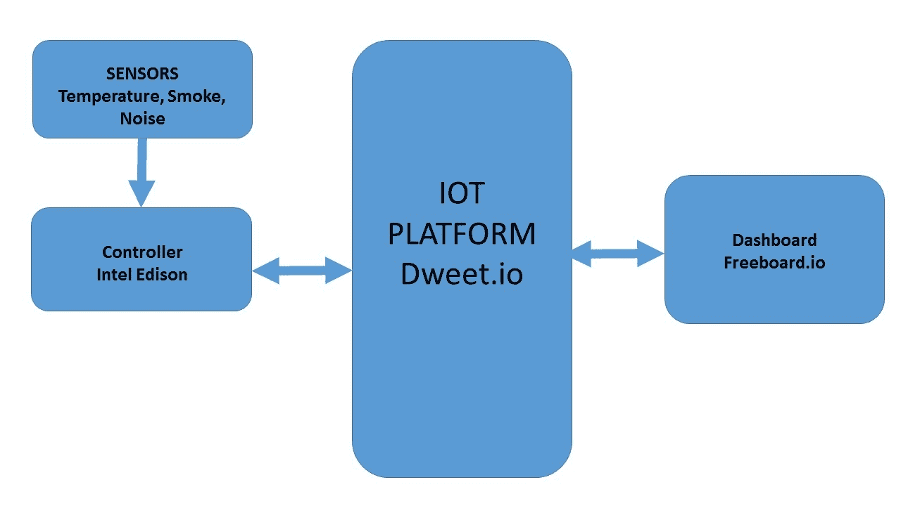

气象站的架构

如前图所示，我们有三个传感器（温度、烟雾和噪音）向控制器（即英特尔爱迪生）提供原始数据，控制器处理原始数据并将其上传到`dweet.io`的物联网平台，最终在`freeboard.io`的仪表板上显示。对于这个项目，我们不对警报和执行器感兴趣，所以它们不包括在内。

# 硬件组件和详细电路图

为了实现项目，我们将处理以下硬件组件：

+   Grove 温度传感器

+   Grove 声音传感器

+   MQ2 烟雾传感器

前面的三个传感器在引脚配置上或多或少有相似之处，所以连接相当简单。正如之前解释的，我们将使用英特尔爱迪生的模拟引脚来接收传感器的输入。

MQ2 传感器返回原始值。在这里，我们将使用原始值并根据烟雾水平校准传感器。

以下是系统的电路图。请注意，我们只提到了将要使用的引脚：

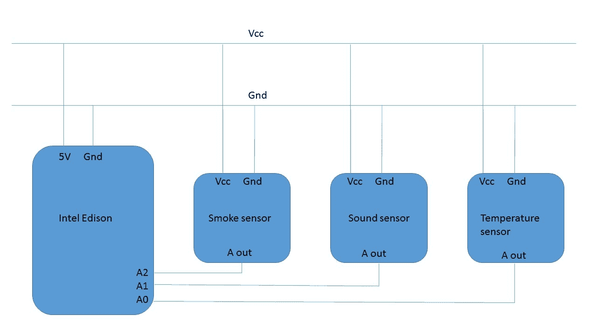

电路图 - 气象站

我们已经制作了一个公共**Vcc**和**Gnd**连接，所有传感器都连接在这里。接下来，我们需要三个模拟引脚。这些引脚连接到传感器的模拟输出引脚。需要注意的是，一些传感器可能有两个输出引脚，其中一个可能是模拟输出，而另一个是数字输出。由于我们只对模拟输出感兴趣，所以不会使用数字输出引脚。在这个项目中，MQ2 传感器（烟雾传感器）有这样的配置。

对于校准**烟雾传感器**，我们需要一些传感器敏感的烟雾存在。虽然我们将推送原始值，但对于本地警报，可以使用阈值技术。

根据前面的电路图连接您的传感器和爱迪生设备。一旦连接，您就可以使用代码了。

# 气象站阶段 1 的代码，从所有传感器获取数据并在控制台显示

在继续代码之前，让我们先看看算法：

1.  导入库。

1.  初始化输入引脚。

1.  读取原始值。

1.  处理值。

1.  在控制台显示它。

这与前面的例子类似，唯一的区别是我们将使用三个传感器。在这种情况下，代码将用 Node.js 编写，因为稍后我们将将其推送到云端，即`dweet.io`：

```cpp
functiondisplayRes() 

{ 

//Import mraa 

var mraa= require('mraa'); var B=4275; 
var R0=100000; 

//Temperature pin 

var tempPin=new mraa.Aio(0); 

//Sound pin 

varsoundPin= new mraa.Aio(1); 

//Smoke pin 

varpolPin= new mraa.Aio(2); 

//Processing of temperature var a=tempPin.read(); 
var R=1023/a-1; R=100000*R; 
var temperature=1/(Math.log(R/100000)/B+1/298.15)-273.15; temperature = +temperature.toFixed(2); 
//Smoke read 

varsmokeValue= polPin.read(); 

//Sound read 

varsndRead= soundPin.read(); 

console.log("Temperature=  ",temperature);console.log("Soundlevel=   ",sndRead);console.log("Smoke level= ", smokeValue); setTimeout(displayRes,500); 
} 

displayRes(); 

```

在解释代码之前，我们只对温度传感器进行了处理。对于声音水平，我们将发送原始值，因为要将值转换为分贝，这是一个相对量**，**我们需要访问两个实例的声音压力。因此，我们将限制自己使用原始值。然而，我们当然可以找到原始读数的阈值，并使用该阈值来触发一个动作，例如打开 LED 灯或发出蜂鸣声。

现在，让我们仔细看看代码。大部分代码与温度模块的代码相似。我们为烟雾和声音检测添加了一些额外的行：

```cpp
//Sound pin
varsoundPin= new mraa.Aio(1);
//Smoke pin
varpolPin= new mraa.Aio(2);

```

在前面的行中，我们声明了用于声音传感器输入和烟雾传感器输入的模拟引脚。在接下来的行中，我们将读取值：

```cpp
//Smoke read
varsmokeValue= polPin.read();
//Sound read
varsndRead= soundPin.read();

```

最终，我们使用控制台显示捕获的值。

当处理烟雾和声音等传感器时，我们可能无法直接获得标准单位值。在这些情况下，我们需要手动校准传感器来模拟已知值的 环境。假设在烟雾传感器的情况下，我们设置了一个我们知道值的环境，然后通过调节电位器改变可变电阻的值，从而校准传感器。这是许多标准程序之一。校准将在我们介绍机器人模块时详细讨论。

当你在控制台运行前面的代码时，你将获得所有传感器的输出。尝试在烟雾传感器周围增加烟雾或在大声传感器前大声说话以增加值，或者将温度传感器靠近笔记本电脑的通风口以获得更高的读数。以下是传感器获得值的截图：

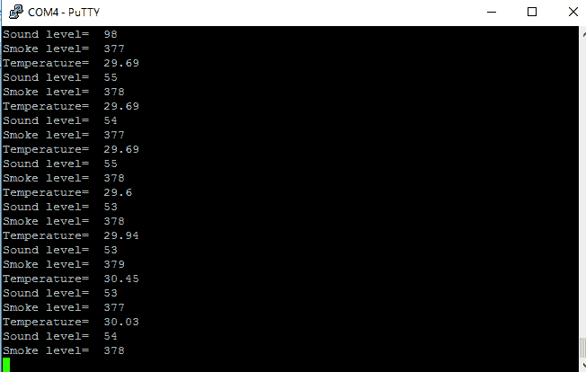

传感器读数输出

一旦获得读数，我们就可以将它们推送到云端并在仪表板上显示。

这里，如果你注意到你没有获得正确的读数，那么你需要调整传感器上的电位器来手动校准它。为了将其上传到云端，我们需要在代码中做一些更改。请参考以下代码，以将所有三个数据推送到`dweet.io`：

```cpp
function dweetSend()
  {
    vardweetClient = require("node-dweetio"); vardweetio = new
    dweetClient();
//Import mraa
    var mraa= require('mraa'); var B=4275;
    var R0=100000;
//Temperature pin
    var tempPin=new mraa.Aio(0);
//Sound pin
    varsoundPin= new mraa.Aio(1);
//Smoke pin
    varpolPin= new mraa.Aio(2);
//Processing of temperature var a=tempPin.read();
    var R=1023/a-1; R=100000*R;
    var temperature=1/(Math.log(R/100000)/B+1/298.15)-273.15;
    temperature = +temperature.toFixed(2);
//Smoke read
    varsmokeValue= polPin.read();
//Sound read
    varsndRead= soundPin.read();
    dweetio.dweet_for("WeatherStation",
      {Temperature:temperature, SmokeLevel:smokeValue,
      SoundLevel:sndRead}, function(err, dweet)
        {
          console.log(dweet.thing); // "my-thing"
          console.log(dweet.content); // The content
          of the dweet
          console.log(dweet.created); // The create
          date of the dweet
        });
      setTimeout(dweetSend,10000);
    }
dweetSend();

```

在前面的代码中，你又会发现与`温度`代码有很多相似之处。在这里，我们执行了三次读取操作，并分别发送了代表该参数的所有三个值。以下行中可以明显看出：

```cpp
dweetio.dweet_for("WeatherStation", {Temperature:temperature, SmokeLevel:smokeValue, SoundLevel:sndRead}, function(err, dweet)

```

通过遵循之前讨论的类似过程，使用 FileZilla 传输代码，并使用`node`命令执行它：

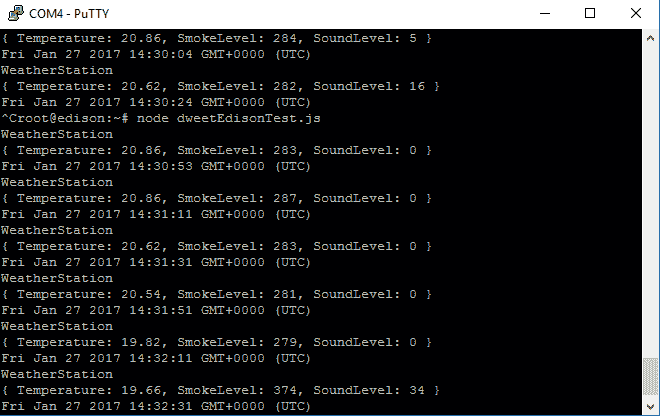

PuTTY 终端

看一下前面的截图，很明显数据正在被发送。现在，请注意声音和烟雾的值。最初，正在播放音乐，所以我们得到了 20-70 的范围内的声音值。对于烟雾传感器，标准值大约在 250-300 之间。在上一次读取中，我添加了一些烟雾，它飙升至 374。现在浏览到你的 `dweet.io` 门户，你会注意到数据正在实时更新：

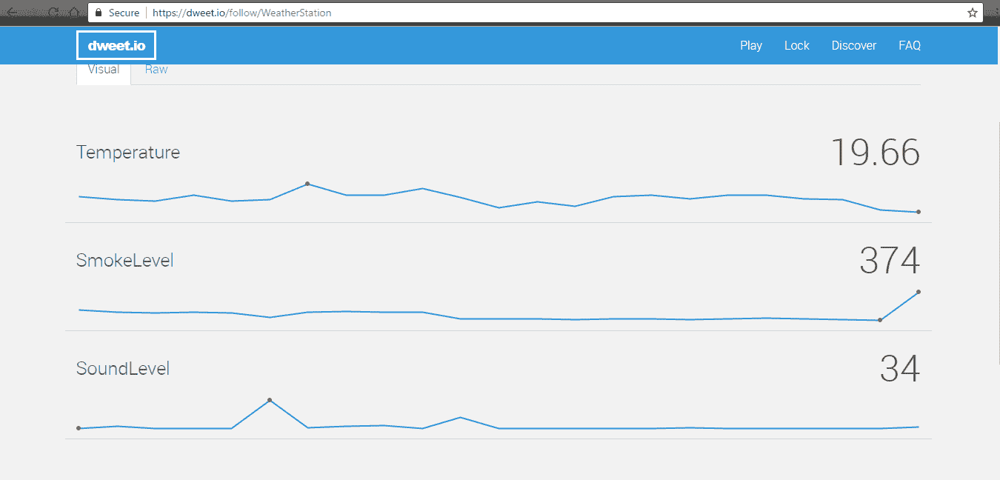

Dweet.io 实时数据截图

一旦我们在这一侧设置好东西，我们将在 `freeboard.io` 上添加两个额外的仪表进行可视化。登录到 `freeboard.io` 并按照之前解释的方法添加仪表。在匹配需要指定参数的 DATASOURCES 时要具体：

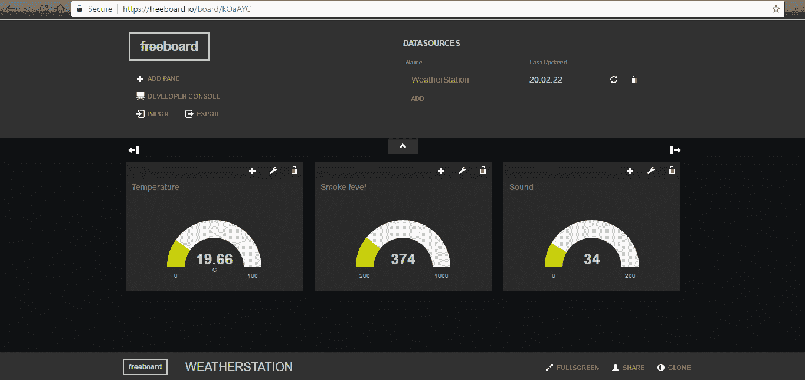

Freeboard.io 最终布局

完成这些后，嗯，你将拥有自己的气象站，并且可以投入使用。一旦我们理解了概念，实现这些小型项目就极其容易。

# 读者开放式任务

由于你已经对如何实现小型物联网项目有了相当的了解，我们将为你提供一个简单的开放式任务，供你实现。

我们使用了 `dweet.io` 和 `freeboard.io`。除此之外，还有其他几个物联网平台，如 Azure、IBM Bluemix 和 Thingspeak。你的任务是模拟其他物联网平台上的类似功能。Azure 和 IBM 要求你使用借记卡或信用卡注册，但前一个月是免费的，并且可以用于物联网，而另一方面，Thingspeak 是免费的，并且支持 Matlab。

# 摘要

在本章中，我们学习了物联网系统的架构，如何处理问题陈述，我们还学习了传感器及其接口。然后我们转向物联网平台，并可视化了一些温度数据。最后，我们构建了一个小型气象站，它可以测量温度、声音水平和污染水平。我们还简要讨论了传感器的校准。

在第三章，“英特尔爱迪生和物联网（家庭自动化）”，我们将处理平台到控制器的通信，即通过互联网控制设备。然后我们将参与一个家庭自动化项目，我们将使用 Android 和 WPF 应用程序控制两个设备。
