# 使用英特尔爱迪生进行自主机器人

机器人工程是工程的一个分支，涉及设计、开发和

机器人的应用。虽然机器人可以采取人类的形式，但大多数机器人都是

设计来执行一组特定的任务，它可能看起来就像一台机器或

任何非人类的东西。我们感兴趣的是英特尔爱迪生如何被用来

开发机器人。本章将涵盖机器人的自主方面，并将主要

将涵盖以下主题：

+   机器人系统的架构

+   英特尔爱迪生作为控制器

+   将传感器与英特尔爱迪生连接

+   使用实时环境校准传感器

+   执行器：电机、伺服电机等

+   电机驱动器：双 H 桥配置

+   速度控制

+   将一切整合：循线机器人

+   基于 PID 控制系统的更高级循线机器人

本章将处理循线机器人，并探讨其所有组件，并讨论一些高级循线的技巧和窍门。本章中的所有代码都将使用 Arduino IDE 编写。

# 典型机器人系统的架构

在典型的自主机器人系统中，**传感器**负责收集数据。基于这些数据，控制器最初对其进行处理，然后通过使用**执行器**执行动作：


机器人系统的架构

我们还可以有一个**仪表盘**，它可能只是显示正在发生的事情，或者有时可以向机器人提供一些命令。架构的模型有很多种。前面的架构是这样的，机器人的组件被认为是水平组织的。通过传感器收集的信息在执行动作之前需要经过多个步骤。除了水平流动之外，还可能有垂直流动，控制可以在整个流程完成之前随时转移到执行器。这就像高速公路上行驶的汽车队列，然后一辆车驶入出口匝道并离开。我们将开发的循线机器人将使用水平方法，这是最原始的方法。

# 英特尔爱迪生作为控制器

在整本书中，我们已经看到了英特尔爱迪生在各个应用中的使用。在每种情况下，我们都强调其作为控制器的作用，因为其特性。现在，在机器人领域，我们再次强调其作为微控制器的作用，但问题是，为什么？

好吧，当我们处理机器人时，在某些情况下，我们可能需要英特尔爱迪生的核心功能。英特尔爱迪生内置了蓝牙低功耗（BLE）、Wi-Fi 以及一些使其非常适合用于机器人的特性。Arduino 兼容的扩展板允许我们使用通用的 Arduino 外设板和电机驱动器，而核心功能为机器人提供了一些额外的功能，例如基于语音的命令和将数据上传到云端。

所有这些都在一个单元中。因此，我们不需要使用多个外围设备，英特尔 Edison 为我们提供了在单一屋檐下使用所有设备的灵活性。能够附加摄像头也为其增添了更多风味：

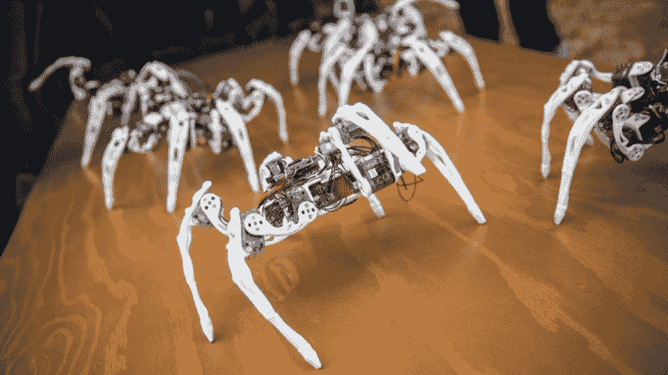

英特尔蜘蛛机器人。它使用英特尔 Edison 和定制的扩展板来控制伺服系统。图片来源：[`i.ytimg.com/vi/3NeJisPvHcU/maxresdefault.jpg`](https://i.ytimg.com/vi/3NeJisPvHcU/maxresdefault.jpg)

# 将传感器连接到 Intel Edison

在第二章 *气象站（物联网）*中，我们简要讨论了传感器。在这里，我们更关注那些帮助机器人确定其在环境中的确切位置的传感器。我们将处理两个传感器以及如何校准它们：

+   超声波传感器（HCSR04）

+   用于检测线条的红外传感器

使用前面传感器的理由是我们将这些传感器用于机器人技术。然而，其他传感器也被使用，但这些是最常用的。现在下一个问题是“它们是如何操作的，我们如何将它们连接到英特尔 Edison？”

让我们看看它们中的每一个。

# 超声波传感器（HCSR04）

使用此传感器的主要目的是测量距离。在我们的情况下可能不需要，但在初学者机器人技术中非常有用：

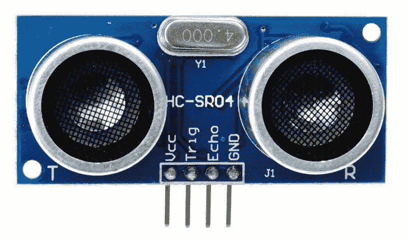

超声波传感器 HCSR04

它发出超声波，如果有物体存在，则反射并被接收器接收。根据脉冲输出时间和接收到的脉冲，我们计算距离。

该传感器可以提供从 2 厘米到 400 厘米的读数。它包含发射器和接收器，因此我们可以直接将我们的 Intel Edison 插入并使用。工作电压为+5V 直流。操作不受阳光或深色材料的影响，因此非常适合寻找距离。需要注意的是，光束角度为 15 度：

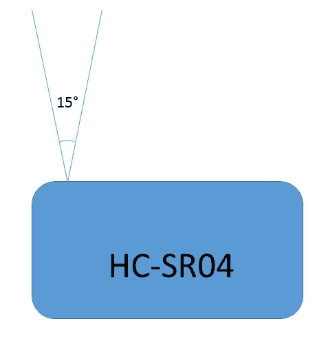

光束角度

让我们看看使用前面模块的一些示例代码。

从传感器直接计算距离没有直接的方法。我们需要使用两个 GPIO 引脚。第一个将是触发引脚，它将被配置为输出，而第二个将是回声引脚，它将处于输入模式。当我们通过触发引脚发送脉冲时，我们等待在回声引脚上接收到的脉冲。时间差和一些数学计算给出了距离：

```cpp
inttrigPin=2; 
intechoPin=3; 
void setup()  
  { 
    pinMode(trigPin,OUTPUT); 
    pinMode(echoPin, INPUT); 
    Serial.begin(9600); 
  } 
void loop()  
  { 
    long duration, distance; 
    //Send pulses 
    digitalWrite(trigPin, LOW); 
    delayMicroseconds(2); 
    digitalWrite(trigPin, HIGH); 
    delayMicroseconds(10); 
    digitalWrite(trigPin, LOW); 

    //Receive pulses 
    pinMode(echoPin, INPUT); 
    duration = pulseIn(echoPin, HIGH); 

    //Calculation 
    distance = microsecondsToCentimeters(duration); 
    Serial.println(distance); 
    delay(200); 
  } 

longmicrosecondsToCentimeters(long microseconds) 
  { 
    return microseconds / 29 / 2; 
  } 

```

在前面的代码中，关注循环方法。最初，我们发送一个低脉冲以获得干净的高脉冲。接下来，我们发送一个高脉冲`10`秒。最后，我们在回波引脚上获得高脉冲，并使用`pulseIn()`方法来计算持续时间。持续时间被发送到另一个方法，在那里我们使用已知的声速参数来计算距离。要在 Edison 上使用此代码，请按照以下电路图将 HCSR04 传感器连接到 Edison：

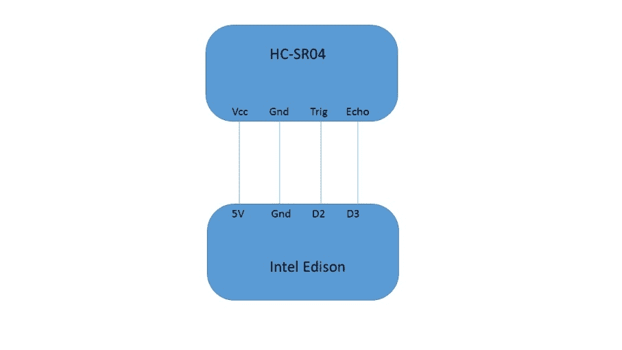

电路图

使用前面的电路连接您的 HCSR04 到您的 Edison。接下来，上传代码并打开串行监视器：

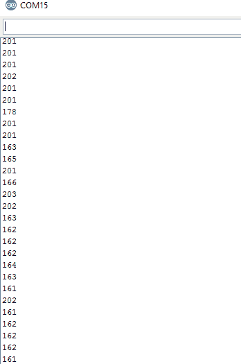

HCSR04 的串行监视器读数

前面的截图显示了我们的串行监视器，我们在其中获得了测量距离的读数。

# HCSR04 的应用

此传感器有众多应用，尤其是在自主机器人领域。甚至可以使用此传感器完成地图绘制。当 HCSR04 放置在伺服电机顶部时，HCSR04 可以用来绘制整个 360 度的地图。这些在我们要执行**同时定位与地图构建**（**SLAM**）时非常有用。

# 红外传感器

这些传感器有多种用途。从线检测到边缘检测，这些传感器甚至可以优化为用作接近传感器。甚至我们的智能手机也使用这些传感器。它们通常位于前置扬声器附近。这些传感器也基于发送和接收信号的原则工作。

# 工作方法

以下图像是常用的红外传感器：

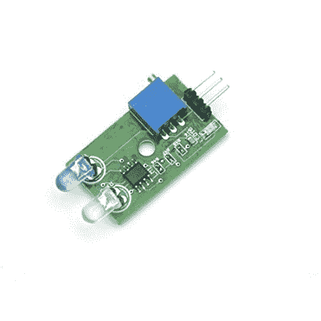

红外传感器：图片来源：[`www.amazon.in/Robosoft-Systems-Single-Sensor-Module/dp/B00U3LKGTG`](http://www.amazon.in/Robosoft-Systems-Single-Sensor-Module/dp/B00U3LKGTG)

它有一个发射器和接收器。输出可以是数字或模拟。发射器发送红外波。基于物体，它被反射回来，信号被接收器接收。基于此，我们知道我们附近有东西。

红外传感器有多个应用：

+   检测近距离物体

+   测量温度

+   红外相机

+   被动红外运动检测

第一个已经讨论过了。第二个是使用红外探测器来检测红外光谱，基于此，我们计算温度。红外相机在军事、消防和许多我们需要从远处知道温度很高的地方得到广泛应用。第三个是 PIR。被动红外模块用于运动检测，并用于家庭自动化。

# 红外传感器的数字和模拟输出

我们已经提到，这些传感器要么提供数字输出，要么提供模拟输出。但我们为什么如此关注这一点呢？主要是因为在典型的循线中，我们可能使用数字值，但在高速循线机器人中，我们选择模拟值。最大的优点是，从白色表面到黑色表面的过渡将更加平滑，在高速循线中，我们根据传感器的模拟输入控制电机的速度，因此具有更有效的控制。对于简单用途，我们选择数字输出。

# 红外传感器模块的校准

红外传感器模块需要校准的原因如下：

+   环境可能对传感器来说过于明亮，以至于无法实际检测到任何东西。

+   由于环境参数的变化，我们可能需要对其进行校准以满足我们的需求。

让我们考虑在两种条件下使用循线机器人：

+   在正常照明的环境中（室内）

+   在阳光明媚的环境中（户外）

当机器人在室内环境下的环境光下高效运行时，并不一定意味着它会在户外做同样的事情。原因是传感器是红外传感器，在明亮的环境中，尤其是在阳光下，检测会更困难。那么，我们如何校准传感器呢？每个传感器模块都有一个电位器，用于控制传感器的灵敏度。这个电位器需要根据周围环境进行调整，以便获得适当的读数。

现在，当你处理机器人时，请随身携带一些代码，因为可能需要。同样，对于校准，我们遵循非常简单的步骤。

让我们考虑一个简单的循线使用案例。我们需要跟随白色轨道上的黑色线条。步骤如下：

1.  将机器人或传感器放置在理想位置（理想位置指的是机器人需要所在的位置，即线的中心）。

1.  如果机器人尚未构建，请用纸覆盖传感器，并将其保持在或大约 2 厘米高于轨道的位置。

1.  现在，检查传感器的值，代码将在以下步骤中展示。

1.  白色线条上方的传感器和黑色线条上方的传感器之间应该有明显的差异。如果你两个传感器都在白色线条上方，那么它们的值应该完全相同，否则调整电位器。

1.  同样，通过将两个传感器都放置在黑色线条上方来执行此过程。

1.  如果环境或更确切地说，照明条件发生变化，请再次执行整个流程。

# 校准和传感器读数的硬件设置

按照以下电路图进行硬件设置：


传感器校准电路

电路相当直接且易于理解。只需将两个传感器连接到**A0**和**A1**引脚，以及公共的**Vcc**和**Gnd**连接。

现在，让我们继续编写代码：

```cpp
void setup()  
  { 
    Serial.begin(9600); 
  } 
void loop()  
  { 
    int a= analogRead(A0); 
    int b= analogRead(A1); 
    Serial.print(a); 
    Serial.print("       "); 
    Serial.println(b); 
    delay(200); 
  } 

```

上述代码返回了从传感器获取的值和读数。在将代码烧录到英特尔爱迪生之后，你将开始接收传感器的值。现在，需要按照校准中提到的测试进行测试以校准传感器。

# 执行器 - 直流电机和伺服电机

在每一个机器人项目中，机器人都需要获得一些移动性。为了移动性，我们使用直流电机或伺服电机。本节将讨论电机和电机类型。下一节将讨论如何使用英特尔爱迪生控制电机。

电动机是机电装置，将电能转换为机械能。电动机中的两个电气元件是磁场绕组和电枢。它是一个两极装置。电枢通常位于转子，而磁场绕组通常位于定子。

永磁电机使用永磁体提供磁场通量：

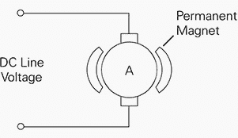

永磁电机

这些电机受其能驱动的负载限制，这是一个缺点。然而，考虑到我们专注于机器人和小规模应用，我们选择了这种类型的电机。

这些电机通常在 9V-12V 电压下运行，最大满载电流约为 2-3 A。在机器人技术中，我们主要处理三种类型的直流电机：

+   恒定直流

+   步进电机

+   伺服电机

恒定直流电机是连续旋转装置。当电源开启时，电机旋转，如果极性反转，则反向旋转。这些电机广泛应用于为机器人提供移动性。通常，直流电机带有齿轮，这提供了更多的扭矩：


直流电机。图片来源：[`img.directindustry.com/images_di/photo-g/61070-3667645.jpg`](http://img.directindustry.com/images_di/photo-g/61070-3667645.jpg)

下一个类别是伺服电机。这些电机的速度通过脉冲宽度调制技术，即通过改变脉冲宽度来控制。伺服电机通常由四个部分组成：直流电机、齿轮组、控制电路和位置传感器（通常是电位计）。通常，伺服电机包含三组线：Vcc、Gnd 和信号。由于其精确性，伺服电机有完全不同的应用场景，其中位置是一个重要参数。伺服电机不像标准直流电机那样自由旋转。相反，旋转角度限制在 180 度（或更多）的往返之间。控制信号以**脉冲宽度调制（PWM**）信号的形式出现：


伺服电机：图片来源：[`electrosome.com/wp-content/uploads/2012/06/Servo-Motor.gif`](https://electrosome.com/wp-content/uploads/2012/06/Servo-Motor.gif)

最后，步进电机是伺服电机的先进形式。它们提供完整的 360 度旋转，并且是连续运动。步进电机利用围绕中心齿轮排列的多个齿形电磁铁来定义位置。它们需要一个外部控制器电路来单独激励每个电磁铁。步进电机有两种类型：单极和双极。双极电机是步进电机中最强的一种，通常有四个或八个引脚：

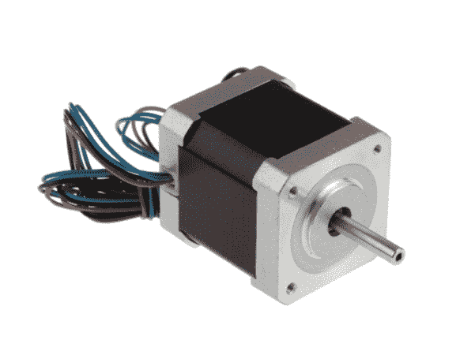

步进电机

在跟随线项目里，我们将处理直流电机。但是电机不能直接连接到英特尔爱迪生，因此我们需要一个接口电路，通常被称为电机驱动器。

# 电机驱动器

由于电机消耗的电压和电流不能仅由 GPIO 引脚提供，我们选择使用电机驱动器。这些驱动器有外部电源，并使用微控制器的 GPIO 引脚接收控制信号。根据接收到的控制信号，电机以特定的速度旋转。市场上有很多电机驱动器；我们最初将专注于 L293D，然后是定制和高功率驱动器。

任何电机驱动器的目标是从控制器这里，即英特尔爱迪生，接收控制信号，并将最终输出发送到电机。通常，电机驱动器可以控制电机在两个方向上旋转，也可以控制速度。

# L293D

L293D 是一种典型的电机驱动集成电路，可以驱动两个电机在两个方向上。它就像是每个机器人项目的启动器。它是一个 16 位 IC：

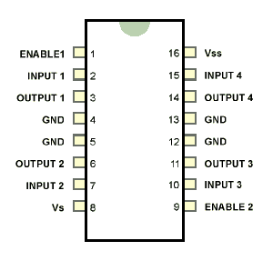

L293D 的引脚排列。图片来源：[`www.gadgetronicx.com`](http://www.gadgetronicx.com)

Vs 电机供电的最大电压是 36V。它可以为每个通道提供最大 600mA 的电流。

它基于 H 桥的概念。该电路允许电流在两个方向上流动。我们先看看 H 桥电路：

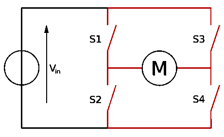

H 桥电路的简单布局。图片来源：[`en.wikipedia.org/`](https://en.wikipedia.org/)

在这里，**S1**、**S2**、**S3**和**S4**是开关，在现实生活中包含晶体管。操作极其简单。当**S1**和**S4**打开时，中心电机向一个方向旋转，而当**S2**和**S3**打开时，则发生相反的情况。**S1**、**S2**、**S3**和**S4**从微控制器接收控制信号，并相应地操作电机的方向。

L293D 由两个这样的电路组成。因此，我们可以控制多达两个电机。可以将 L293D 用作模块或仅作为独立的 IC。通常我们只需要担心四个引脚，我们将在这里发送控制信号。我们有 L293D 的引脚布局。让我们看看哪些信号会导致什么样的动作。

引脚 1-8 负责一个电机，而引脚 9-16 负责另一个。

使能引脚设置为逻辑高以进行操作。另一侧也是如此。

需要调整的是输入引脚 2、7、10 和 15。电机连接到引脚 3、6、11 和 14。Vss 是电机电源，而 Vss 或 Vcc 是内部电源。当使能 1 和使能 2，即引脚 1 和 9，根据条件设置为高时：

| **引脚 2 或 10** | **引脚 7 或 15** | **电机** |
| --- | --- | --- |
| 高 | 低 | 顺时针 |
| 高 | 高 | 停止 |
| 低 | 低 | 停止 |
| 低 | 高 | 逆时针 |

前面的表格总结了基于输入触发的动作。需要注意的是，如果两个输入引脚都开启或关闭，则电机不会旋转。在典型的 L293D 模块中，只有四个控制引脚和主要电压供电及 Gnd 引脚是暴露的。在前面的表格中，提到的是 **2 或 10** 和 **7 或 15**。这对引脚是 2 和 7 或 10 和 15。这意味着 2 是开启或 10 是关闭，其他引脚同理。电机的运动，即指定为 **顺时针** 和 **逆时针**，取决于电机的连接。假设当控制信号改变时，旋转方向会反转。

# 电路图

构建以下临时电路以测试电机。使能引脚应连接到英特尔爱迪生的 **5V**，而 **Gnd** 连接到 **Gnd**。

建议使用电机驱动模块而不是独立的 IC。这使我们能够以更简单的方式完成任务。

**CP1** 和 **CP2** 是第一台电机的控制引脚，而 **CP3** 和 **CP4** 是第二台电机的控制引脚：

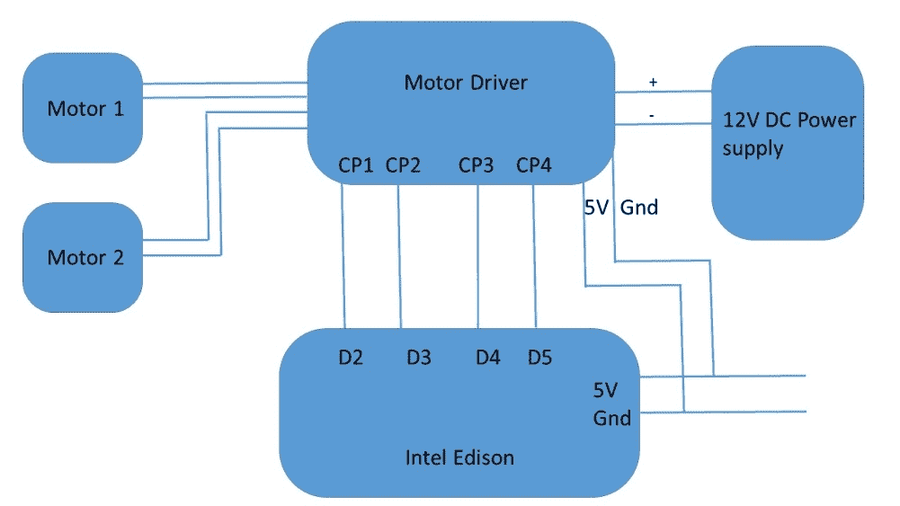

电机测试电路图

在处理机器人技术时，建议保留可以测试您的电机驱动器是否正常工作的示例代码。这里讨论的代码将解释如何做到这一点。

这部分特别重要，因为它是作为电机测试单元和校准所必需的。此代码也取决于您的电机连接，可能需要尝试和错误：

```cpp
#define M11 2 
#define M12 3 
#define M21 4 
#define M22 5 
void setup()  
  { 
    pinMode(M11,OUTPUT); 
    pinMode(M12,OUTPUT); 
    pinMode(M21,OUTPUT); 
    pinMode(M22,OUTPUT); 
  } 
void loop()  
  { 
    forward(); 
    delay(10000); 
    backward(); 
    delay(10000); 
    left(); 
    delay(10000); 
    right(); 
    delay(10000); 
    stop(); 
    delay(10000); 
  } 
void forward() 
  { 
    digitalWrite(M11,HIGH); 
    digitalWrite(M12,LOW); 
    digitalWrite(M21,HIGH); 
    digitalWrite(M22,LOW); 
  } 
void backward() 
  { 
    digitalWrite(M11,LOW); 
    digitalWrite(M12,HIGH); 
    digitalWrite(M21,LOW); 
    digitalWrite(M22,HIGH); 
  } 
void right() 
  { 
    digitalWrite(M11,HIGH); 
    digitalWrite(M12,LOW); 
    digitalWrite(M21,LOW); 
    digitalWrite(M22,HIGH); 
  } 
void left() 
  { 
    digitalWrite(M11,LOW); 
    digitalWrite(M12,HIGH); 
    digitalWrite(M21,HIGH); 
    digitalWrite(M22,LOW); 
  } 
void stop() 
  { 
    digitalWrite(M11,LOW); 
    digitalWrite(M12,LOW); 
    digitalWrite(M21,LOW); 
    digitalWrite(M22,LOW); 
  } 

```

前面的代码非常简单易懂。在这里，我们将它分解为几个方法，用于 `前进`、`后退`、`左转`、`右转` 和 `停止`。这些方法将负责通过 `digitalWrite` 向电机驱动器发送控制信号。需要注意的是，此代码可能无法正常工作。这完全取决于您的电机如何连接。因此，当您将此代码烧录到英特尔爱迪生时，请记录电机在前 10 秒内的旋转方向。如果两个电机以相同方向旋转，那么您很幸运，不需要调整连接。然而，如果您观察到相反方向的旋转，那么请将其中一个电机的连接从其电机驱动器中反转。这将允许电机以相反方向旋转，因此两个电机将以相同方向旋转。

另一个需要注意的重要点是，考虑到`left`和`right`方法，我们注意到电机以不同的方向旋转。这就是机器人转向系统实现的方式。它将在本章的后续部分讨论。

在处理电机驱动器时，请首先查阅规格说明。然后进行连接和编码。

# 直流电机速度控制

现在我们知道了如何控制电机及其旋转方向，让我们看看如何控制电机的速度，这对于高级操控是必要的。

速度控制是通过 PWM 技术实现的，其中我们通过改变脉冲宽度来控制速度。

这种技术用于通过数字方式获得模拟结果。英特尔爱迪生的数字引脚产生方波：

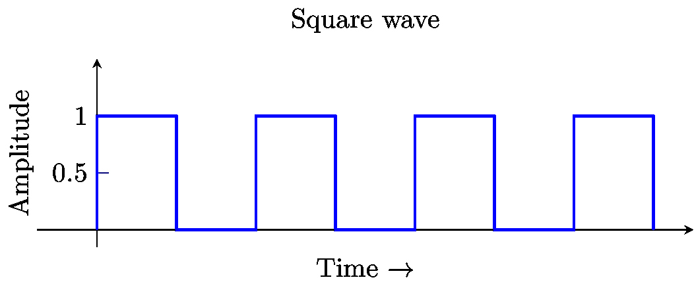

典型方波

开关模式可以模拟从全开**5V**到全关**0V**之间的电压。这是通过改变信号处于开启和关闭状态的时间来实现的。开启时间的持续时间称为**脉冲宽度**。为了获得变化的脉冲值，我们改变或调制脉冲宽度。如果这样做足够快，那么结果就是 0-5V 之间的一个值。

在 Arduino 扩展板上为英特尔爱迪生提供了 PWM 引脚。这些引脚被用于：

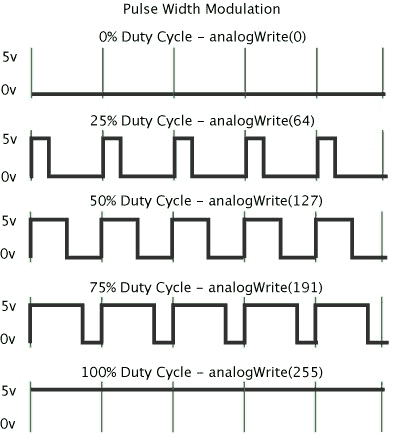

PWM 样本。图片来源：[www.arduino.cc](http://www.arduino.cc)

现在我们可以实现这个来控制我们自己的电机的速度。在先前的 L293D IC 中，使能引脚可以用作 PWM 输入。

L293D 模块主要暴露以下引脚：

+   电机 1 的输入 1

+   电机 1 的输入 2

+   电机 2 的输入 1

+   电机 2 的输入 2

+   使能 1 的电机

+   使能 2 的电机

+   Vcc

+   Gnd

看看以下模块：

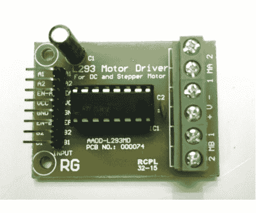

L293D 电机驱动模块：

如前所述，总共暴露了八个引脚。

将使能引脚连接到英特尔爱迪生上的任何 PWM 引脚：

+   使能 1 连接到数字引脚 6

+   使能 2 连接到数字引脚 9

接下来，为了控制速度，我们需要在英特尔爱迪生上那些已启用的 PWM 引脚中使用`analogWrite`方法。

要设置英特尔爱迪生 PWM 控制的频率，请使用以下链接中的示例并克隆它：

[`github.com/MakersTeam/Edison/blob/master/Arduino-Examples/setPWM_Edison.ino`](https://github.com/MakersTeam/Edison/blob/master/Arduino-Examples/setPWM_Edison.ino)

`analogWrite`方法的值范围是 0-255，其中 0 始终是关闭的，255 始终是开启的。

现在用这个修改前面的代码来设置使能引脚的值。这里展示了如何使用它的一个例子。在完全有动力的运动中控制引脚的任务留给读者：

```cpp
#define M11 2 
#define M12 3 
#define M21 4 
#define M22 5 
#define PWM 6 
void setup()  
  { 
    pinMode(M11,OUTPUT); 
    pinMode(M12,OUTPUT); 
    pinMode(M21,OUTPUT); 
    pinMode(M22,OUTPUT); 
  } 
void loop()  
  { 
    forward(); 
  } 
void forward() 
  { 
    digitalWrite(M11,HIGH); 
    digitalWrite(M12,LOW); 
    digitalWrite(M21,HIGH); 
    digitalWrite(M22,LOW); 
    analogWrite(PWM, 122); 
  } 

```

在前面的代码中，强调`forward`方法，我们使用了`analogWrite (PWM, 122)`。这意味着电机现在应该以原始速度的一半旋转。这种技术可用于更快的线跟踪机器人速度控制。

# 更高级的电机驱动器

在处理机器人技术时，可能会遇到一些情况，由于 L293D 的电流限制，它并不是一个好的选择。在这些情况下，我们选择更强大的驱动器。让我们看看 robokits 的另一个产品，它可以驱动高扭矩的电机：


双电机驱动高功率。图片来源：[`robokits.co.in/motor-drives/dual-dc-motor-driver-20a`](http://robokits.co.in/motor-drives/dual-dc-motor-driver-20a)

前面的电机驱动器是我个人的最爱。它具有多个控制功能，可以驱动高扭矩电机。驱动器有以下五个控制引脚：

+   **Gnd**: 地线。

+   **DIR**: 当低电平时，电机朝一个方向旋转；当高电平时，它朝另一个方向旋转。

+   **PWM**: 脉宽调制以控制电机的速度。推荐频率范围是 20 Hz - 400 Hz。

+   **BRK**: 当处于高电平时，它将停止电机的运行。

+   **5V**: 电机驱动板提供的调节后的 5V 输出。

从这里讨论的引脚描述中，应该很清楚为什么这是一个更好的选择。

电压和电流规格如下：

+   电压范围：6V 至 18V

+   最大电流：20 A

电流和电压规格帮助我们以最大负载驱动电机。我们已经在许多应用中使用了这个电机驱动器，并且它始终如一地提供服务。然而，市场上也有其他可以提供类似功能的电机驱动器。选择使用哪种电机驱动器取决于某些因素，如本节所讨论的：

+   **功率**: 这完全取决于电机在满载下运行所需的功率。满载和空载条件下的电流。如果你打算使用 L293D 的高扭矩电机驱动器，你可能会烧毁你的电机驱动器。

+   **操控**: 根据问题的使用案例，电机选择由你决定，最终是电机驱动器的选择。在高速线跟踪中，我们需要 PWM 功能，因此我们需要一个能够处理 PWM 信号的驱动器。

最终，根据你的使用案例选择你的电机驱动器。

下图是使用我们之前开发的电机驱动器的小型高性能 UGV 的图片：

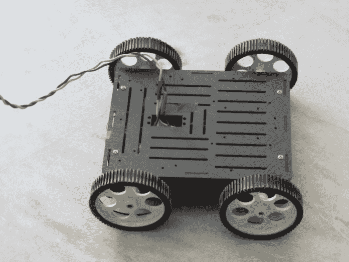

Black-e-Track UGV。UGV 的电机是高扭矩 300 RPM，可以爬上高达 75 度的陡坡。

现在我们对电机驱动器的工作原理以及如何选择一个好的电机驱动器有了相当好的了解。

# 线跟踪机器人（整合所有内容）

根据本章前面的部分，我们已经对如何将所有内容整合到一个平台上有了相当好的了解。让我们深入了解步骤，看看线跟踪机器人是如何工作的。

# 线跟踪的基本概念

下图展示了线跟踪机器人的概念：

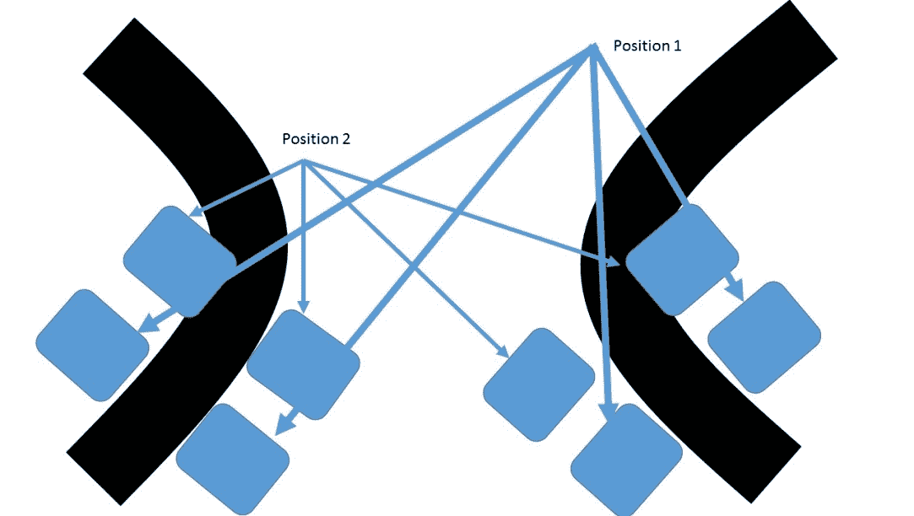

线跟踪概念

在前一个图中，我们有两种情况。第一种是当左侧传感器位于线条上时，第二种情况与右侧传感器相同。黑色线条是机器人应该跟随的轨道。有传感器用方块表示。让我们考虑前一个图的左侧。

初始时，两个传感器都位于前一个图中的位置 1 上的白色表面上。接下来，考虑图像左侧的位置 2。左侧传感器覆盖黑色线条，传感器被激活。基于此，我们拦截传感器读数并将控制信号中继到电机驱动器。在前一个案例中，针对图像的左侧，我们得到左侧传感器检测到线条，因此机器人不应该向前移动，而应该轻微向左转弯，直到两个传感器返回相同的值。

图的右侧情况也是如此，右侧传感器检测到黑色线条，并触发运动执行命令。这是一个简单的跟随线条的机器人案例，需要跟随单色线条。如果需要跟随多色线条，情况会有所不同。

既然我们已经知道了跟随线条的确切过程，现在我们可以更多地关注机器人如何执行转弯以及机器人结构。

# 机器人运动执行

为了理解机器人如何执行其运动，让我们考虑一个四轮驱动机器人：

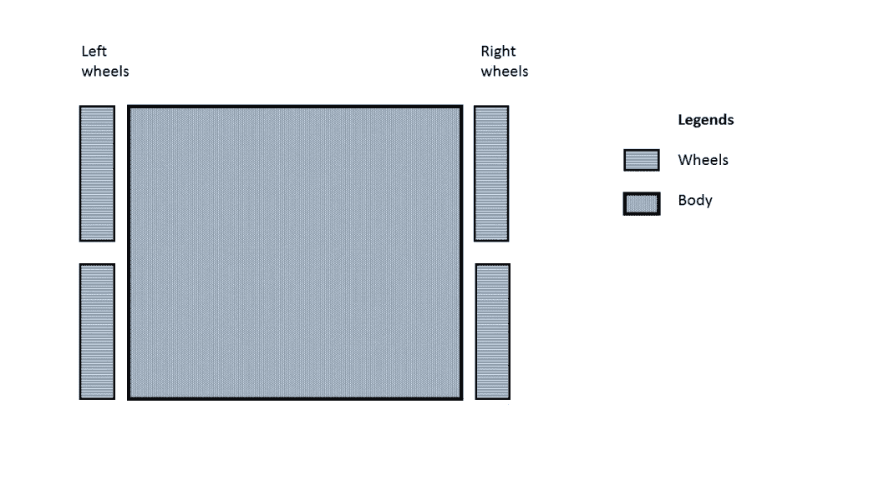

典型的 4WD 机器人结构

机器人可以跟随基于差速驱动的系统，其中转弯是在机器人转弯的一侧执行，该侧的轮子以相反方向旋转，或减速，或停止。如果你处理的是两个轮子，停止一侧并旋转另一侧也可以。然而，如果你使用四个轮子，那么始终选择反向旋转是安全的，否则会导致轮胎打滑。再次强调，当使用两个轮子时，我们选择使用万向轮，以保持机器人平衡。轮胎打滑条件和其他结构元素的详细信息将在第六章，*使用 Intel Edison 的机器人手册*中讨论。

# 跟随线条机器人所需的硬件清单

简单两轮驱动跟随线条机器人所需的硬件清单如下：

+   机器人底盘

+   9V 直流电机

+   电机驱动器 L293D

+   两个红外传感器

+   9V 直流电源

+   两个轮子

+   一个万向轮

+   Intel Edison，用作控制器

将电机连接到底盘和万向轮的过程将不会展示。将展示电路图，所有组件的排列取决于读者。

使用两轮或四轮驱动机器人底盘，由于我们使用两个轮子，因此将在机器人前方安装万向轮。传感器应位于机器人前部，两侧。让我们考虑一个 2D 模型：

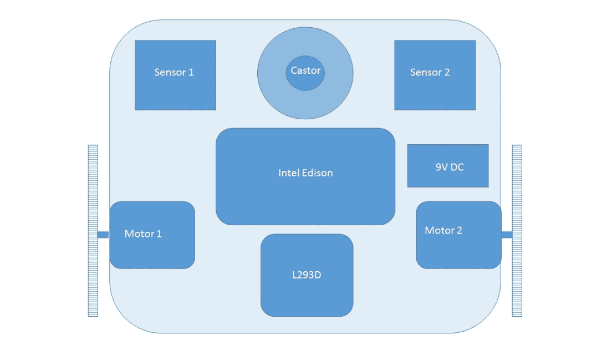

典型线跟踪机器人的 2D 机器人模型

前面的图是 2WD 线跟踪机器人的 2D 模型。传感器应位于两侧，万向轮位于中间。虽然 L293D 和 Intel Edison 可以放置在任何位置，但万向轮、传感器、电机以及显然是轮子的位置应该与前面图中所示的结构相同或相似。

确保传感器到地面的距离对于检测线条是最佳的。这个距离必须在传感器的校准期间计算。

硬件设置通常需要一些时间，因为它涉及到很多电线处理和松动的焊接接头通常会带来更多问题。现在，在继续编写代码之前，让我们使用以下电路图将所有东西连接起来：


线跟踪机器人的电路图

前面的电路是我们在本章中迄今为止所做内容的组合。创建了一个公共地线、一个**Vcc**线路，它连接了**L293D**、**Intel Edison**和**传感器**。**9V DC**电源为电机供电，而控制引脚负责从 Intel Edison 发送控制信号。传感器的输出连接到 Intel Edison 的数字引脚。最后，电机驱动器根据控制信号控制电机。

如果你仔细观察前面的电路图，那么所有内容都符合典型的机器人架构：

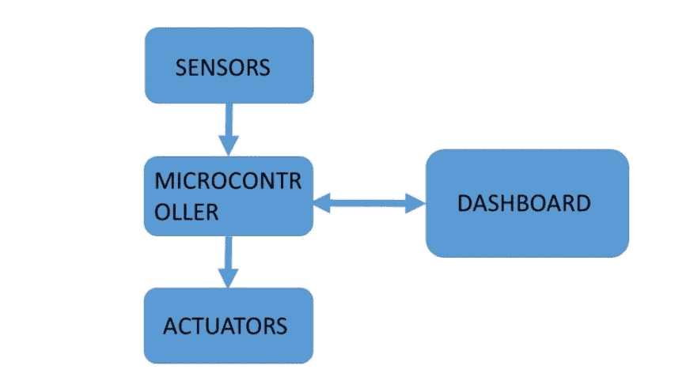

机器人架构

但仪表盘缺失。我们可能添加仪表盘，但到目前为止，我们对此不感兴趣。

现在硬件部分已经完成所有连接和电路，让我们添加代码让它运行。

算法非常简单，如下所示：

1.  检查左传感器值。

1.  如果检测到，向**左**转。

1.  否则，检查**右**传感器值。

1.  如果检测到，向**右**转。

1.  否则如果都检测到。

1.  停止运动。

1.  否则，就向前移动`前进`。

下面的代码是针对这个的：

```cpp
#define M11 2 
#define M12 3 
#define M21 4 
#define M22 5 
#define S1 7 
#define S2 8 
inta,b; 
void setup()  
  { 
    pinMode(M11,OUTPUT); 
    pinMode(M12,OUTPUT); 
    pinMode(M21,OUTPUT); 
    pinMode(M22,OUTPUT); 
    pinMode(S1,INPUT); 
    pinMode(S2,INPUT); 
  } 
void loop()  
  { 
    a=digitalRead(S1); 
    b=digitalRead(S2); 
    //Left turn condition 
    if(a==1&&b==0) 
      { 
        left(); 
      } 
    //Right turn condition 
    else if(a==0&&b==1) 
      { 
        right(); 
      } 
    //Stop condition 
    else if(a==1&&b==1) 
      { 
        stop(); 
      } 
    //By default forward 
    else 
      { 
        forward(); 
      } 
  } 
void forward() 
  { 
    digitalWrite(M11,HIGH); 
    digitalWrite(M12,LOW); 
    digitalWrite(M21,HIGH); 
    digitalWrite(M22,LOW); 
  } 
void backward() 
  { 
    digitalWrite(M11,LOW); 
    digitalWrite(M12,HIGH); 
    digitalWrite(M21,LOW); 
    digitalWrite(M22,HIGH); 
  } 
void right() 
  { 
    digitalWrite(M11,HIGH); 
    digitalWrite(M12,LOW); 
    digitalWrite(M21,LOW); 
    digitalWrite(M22,HIGH); 
  } 
void left() 
  { 
    digitalWrite(M11,LOW); 
    digitalWrite(M12,HIGH); 
    digitalWrite(M21,HIGH); 
    digitalWrite(M22,LOW); 
  } 
void stop() 
  { 
    digitalWrite(M11,LOW); 
    digitalWrite(M12,LOW); 
    digitalWrite(M21,LOW); 
    digitalWrite(M22,LOW); 
  } 

```

在前面的代码中，它与电机测试的代码非常相似，只是将`void loop()`替换为算法中描述的主要逻辑。我们使用了宏来定义传感器和电机引脚。

代码最初将引脚设置为输入模式或输出模式。接下来，我们存储传感器的输入值。最后，根据传感器输入，我们处理机器人的运动。

在你的 Intel Edison 上烧录代码后，机器人应该会运行。最初尝试一个简单的轨道，一旦你的机器人开始运行，然后尝试更紧密的转弯。再次提醒，要注意在前面代码中，我们的右传感器可能是你的左传感器。在这种情况下，你必须更改位置或只是更改条件。

因此，通过传感器和非常简单的处理相结合，我们可以控制机器人的电机并跟随线条。现在，如果问题陈述要求你反转条件，在黑色表面上跟随白色线条，我们需要稍微修改代码，特别是在条件检查方面。结果将如下：

```cpp
void loop()  
{ 
int a,b; 
  a=digitalRead(S1); 
  b=digitalRead(S2); 
  //Left turn condition 
if(a==0&&b==1) 
  { 
left(); 
  } 
  //Right turn condition 
else if(a==1&&b==0) 
  { 
right(); 
  } 
  //Stop condition 
else if(a==0&&b==0) 
  { 
stop(); 
  } 
  //By default forward 
else 
  { 
forward(); 
  } 
} 

```

只需交换 1 和 0。

现在我们对开发基本循线机器人有了相当基本的了解，让我们简要地看看循线的高级形式，并解决一些基本概念。

# 高级循线机器人概念

到目前为止，我们一直专注于跟随单条线的简单循线机器人。现在让我们稍微复杂一点，尝试使用之前的逻辑解决轨道的以下部分：


交叉轨道

在前面的轨道上，如果我们使用两个传感器，那么事情就会变得失控，因为机器人应该向前移动，但根据之前讨论的算法，当两个传感器都返回`1`时，机器人应该停止。那么我们如何处理这种情况？

答案在于使用超过两个传感器。让我们看看以下图示：

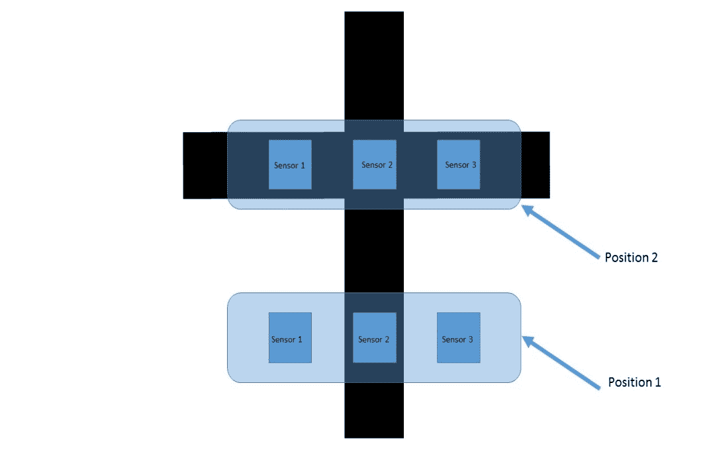

交叉 3 传感器概念

在前面的图中，我们展示了三个传感器的使用。让我们考虑以下值：

+   如果传感器位于黑色区域，它发送`1`

+   如果传感器位于白色区域，它发送`0`

现在，在**位置 1**，我们得到一个值为`010`，而在**位置 1**，值是`111`。这意味着`111`代表一个交叉点。我们也可以为左右交汇处使用它：

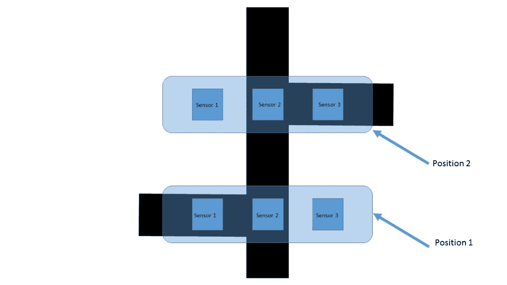

交叉 - 2

在这里，左侧（**位置 1**）的值为`110`，而右侧的值为`011`。现在更容易检测交点，同时也能防止机器人执行错误的转向。要在代码中实现这一点，非常简单：

```cpp
void loop()  
{ 
int a,b,c; 
  a=digitalRead(S1); 
  b=digitalRead(S2); 
  c=digitalRead(S3); 
  //Left turn condition 
if(a==1&&b==1&&c==0) 
  { 
left(); 
  } 
  //Right turn condition 
else if(a==0&&b==1&&c==1) 
  { 
right(); 
  } 
  //Stop condition 
else if(a==0&&b==0&&c==0) 
  { 
stop(); 
  } 
  //By default forward 
else 
  { 
forward(); 
  } 
} 

```

应该注意的是，前面的方法需要根据轨道的情景应用。有时甚至需要忽略交叉点。这完全取决于轨道。传感器的放置也在循线中扮演着非常关键的角色。

有一种流行的循线机器人，其传感器排列呈曲线状。它是 Polulu 3pi 机器人：

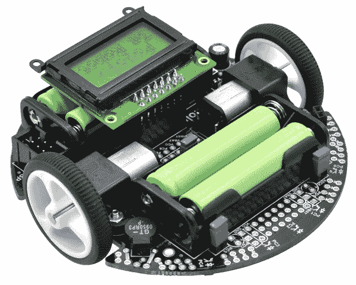

Polulu 3pi 机器人。图片来源：[`www.pololu.com/product/975`](https://www.pololu.com/product/975)

通常我们为循线机器人使用五个或六个传感器。它作为一个名为线传感器阵列的模块：

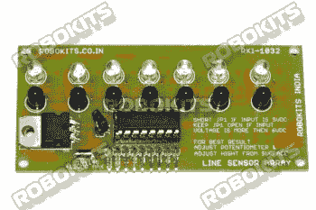

线传感器阵列。图片来源：[`robokits.co.in/sensors/line-sensor-array`](http://robokits.co.in/sensors/line-sensor-array)

# 比例积分微分（PID）控制

**比例积分微分**（**PID**）是一种控制回路反馈机制。使用基于 PID 的控制的主要目的是高效地控制电机或执行器。PID 的主要任务是使我们所控制的任何东西的误差最小化。

它接收输入并计算与预期行为的偏差或误差，最终调整输出。

在较低速度下，跟随线条可能很准确，但在较高速度下，事情可能会失控。这时 PID 就派上用场了。让我们看看一些术语：

+   **误差**：误差是设备没有正确执行的事情。如果电机的 RPM 是 380，而期望的 RPM 是 372，那么误差是 380-372=8。

+   **比例**（**P**）：它与误差成正比。

+   **积分**（**I**）：它取决于一段时间内的累积误差。

+   **导数**（**D**）：它取决于误差的变化率。

+   **常数因子**：当 P、I 和 D 项包含在代码中时，是通过乘以某些常数因子来完成的：

+   +   P: 因子（Kp）

    +   I: 因子（Ki）

    +   D: 因子（Kd）

+   **误差测量**：考虑一个具有五个传感器阵列的跟随线条机器人，该阵列返回数字值；让我们看看误差测量。从传感器获得的输入需要根据输入的可能组合进行加权。考虑以下表格：

| **                    二进制值** | **加权值** |
| --- | --- |
|                     00001 | 4 |
|                     00011 | 3 |
|                     00010 | 2 |
|                     00110 | 1 |
|                     00100 | 0 |
|                     01100 | -1 |
|                     01000 | -2 |
|                     11000 | -3 |
|                     10000 | -4 |
|                     00000 | -5 |

值的范围是从 -5 到 +5。机器人的位置测量每秒进行几次，然后，通过平均值，我们确定误差。

+   **PID 公式**：计算出的误差值需要影响机器人的实际运动。我们需要简单地将误差值添加到输出中，以调整机器人的运动。

+   **比例**：

*差分 = 目标位置 - 当前位置*

*比例 = Kp * 差分*

前面的方法有效，但发现对于快速响应时间，如果我们使用大的常数或误差值很大，则输出会超过设定点。为了避免这种情况，导数被引入到图中。

+   **导数**：导数是误差变化的速率。

*变化率 = （差分 - 上一次差分）/ 时间间隔*

*导数 = Kd * 变化率*

通过使用英特尔爱迪生的定时器控制来获取时间间隔。这有助于我们计算误差变化的快慢，并根据这一点设置输出。

+   **积分**：

*积分 = 积分 + 差分*

*积分 = Ki * 积分*

积分改善了稳态性能。因此，所有误差都被累加起来，并将结果应用于机器人的运动。

最终的控制信号来自这里：

*比例 + 积分 + 微分*

+   **调整**：PID 实现不能帮助你，除非它被调整，否则它将降低机器人的运动。调整参数是 Kp、Ki 和 Kd。调整值取决于各种参数，例如地面的摩擦、光照条件、质心等。它因机器人而异。

将所有设置都设为零，并首先设置 Kp。将 Kp 设为`1`并观察机器人的状态。目标是使机器人即使在摇摆的情况下也能跟随线条。如果机器人超出了界限并失去了线条，则减小 Kp。如果它无法转弯或看起来反应迟钝，则增加 Kp。

一旦机器人大致正确地跟随线条，将`1`分配给 Kd。现在跳过 Ki。增加 Ki 的值，直到你看到更少的摇摆。一旦机器人相当稳定并且能够大致正确地跟随线条，将 0.5-1 之间的值分配给 Ki。如果值太低，就不会发现太大的差异。如果值太高，那么机器人可能会快速左右摆动。你可能需要以`.01`的增量进行增加。

PID 如果不经过适当的调整，就不会产生有效结果，所以仅仅编码是无法得到正确结果的。

# 对读者的开放式问题

已经解释了 PID 用例。尝试在代码中实现它，并使用五到六个传感器编写和实现一个线跟踪算法。这些实践用例将解释线跟踪背后的所有概念。

# 摘要

在本章关于自主机器人的章节中，我们涵盖了多个主题，包括处理传感器和电机驱动器，以及如何校准传感器和测试电机驱动器。我们还详细介绍了线跟踪机器人的用例，并有机会了解更高级的控制方法，最终以基于 PID 的控制系统结束。

在第六章《使用英特尔爱迪生的手动机器人》中，我们将涵盖手动机器人并开发一些控制器软件。我们还将涵盖更多与机器人相关的硬件主题。
