# 使用英特尔爱迪生的手动机器人

在第五章《使用英特尔爱迪生的自主机器人》中，我们处理了机器人和其自主方面。在这里，我们将深入探讨手动机器人的领域。一个手动机器人可能通常不会被称作机器人，所以更具体地说，我们将处理具有一些自主特性的机器人的手动控制。我们主要处理 UGVs 的开发及其使用 WPF 应用程序的控制。WPF 应用程序已经在第三章《英特尔爱迪生和物联网（家庭自动化）》中讨论过，在那里我们使用 MQTT 协议与爱迪生通信。在这里，我们将使用串行端口通信做同样的事情。我们还将学习如何使我们的机器人完全无线化。我们将讨论的主题如下：

+   手动机器人系统——架构和概述

+   两轮驱动和四轮驱动机制

+   使用英特尔爱迪生的串行端口通信

+   使机器人无线化

+   一个简单的 WPF 应用程序，使用英特尔爱迪生开关 LED 的开关

+   带代码的高性能电机驱动器示例

+   黑色：地面无人车（UGV）的 e-track 平台

+   UGV 的通用机器人控制器

本章的所有代码都将使用 Arduino IDE 编写，而在 Visual Studio 的软件方面，我们使用 C#和 xaml。

# 手动机器人系统

我们已经研究了自主机器人架构。手动机器人也处理类似的架构；唯一的区别是我们有一个完整的控制器，负责大部分动作：

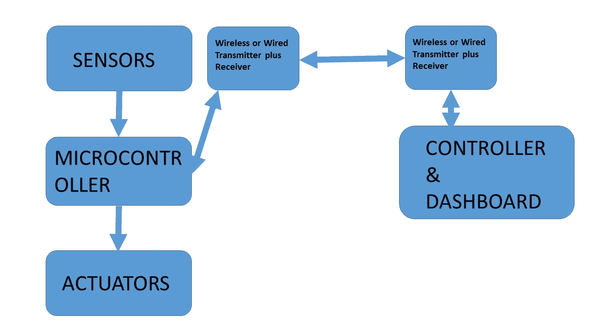

手动机器人架构

这里讨论的架构与第五章中讨论的架构没有太大区别，即《使用英特尔爱迪生的自主机器人》。我们在这里增加了一个接收器和发射器单元，这在早期的用例中也是存在的。在处理机器人时，整个架构都处于同一屋檐下。

手动机器人可能不仅限于只有手动机器人。它可能是手动和自主功能的结合，因为一个完全手动的机器人通常不会被称作机器人。然而，我们了解**地面无人车**（**UGVs**）和**无人机**（**UAVs**）。有时术语可能将它们定义为机器人，但除非它们至少有一些手动功能，否则可能不会被称作机器人。本章主要涉及 UGVs，就像每个机器人或 UGV 一样，我们需要一个坚固的车架。

# 机器人车架：两轮驱动和四轮驱动

预期读者将开发自己的机器人，因此你将需要了解驱动机制和底盘的选择。理想情况下，有两种类型的驱动机制，底盘的选择基于所使用的驱动机制。通常我们不希望底盘过度应力我们的电机，也不希望它在户外环境中可能会卡住。在典型的循线机器人中，如第五章自主机器人与英特尔爱迪生中讨论的，最常见且最广泛使用的驱动机制是两轮驱动，因为这些通常在平滑表面和室内环境中运行。

# 两轮驱动

**两轮驱动（2WD**）指的是涉及两个电机和两个轮子的驱动机制，它可能通常包含一个万向轮以实现平衡：

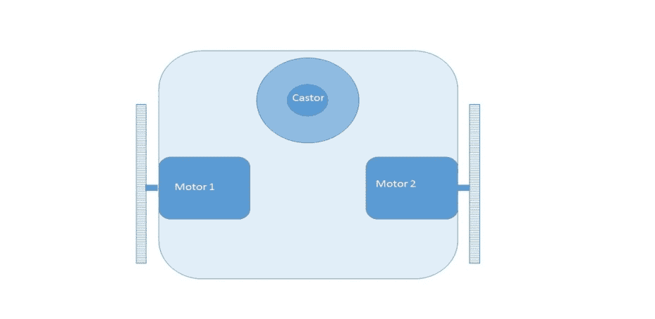

2WD 典型布局

后置电机提供移动性，并作为机器人的转向机制。为了使机器人向右移动，你可以关闭右侧电机，让左侧电机工作。然而，这样做的转弯半径可能会更极端，左侧电机的功耗会增加，因为它需要克服右侧轮子提供的摩擦力。万向轮提供的阻力较小，但这并不一定是首选的。另一种方法是让右侧轮子向后旋转，而左侧轮子向前移动；这种方法允许机器人在其轴上旋转，并提供零转弯半径：

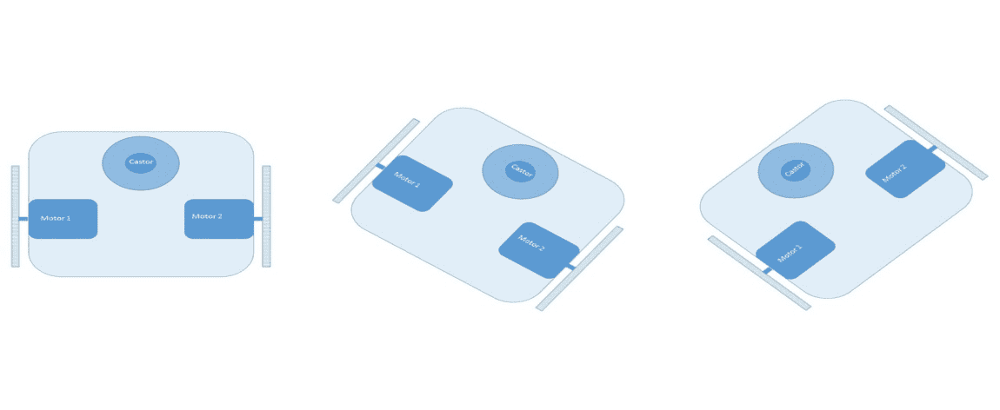

2WD 机器人在其轴上的转弯

当我们遵循前面的方法时，对电机的压力会小得多，由于万向轮是全方位的，机器人执行几乎完美的转弯。

底盘可以用任何材料制成，设计应该是这样的，它对电机施加的压力尽可能小。

然而，当处理四轮驱动时，设计起着作用：

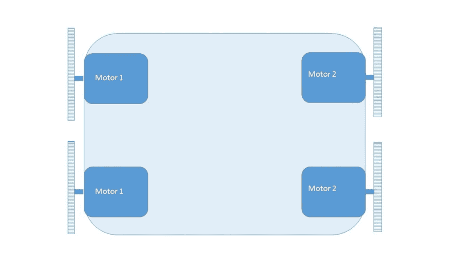

4WD 典型驱动

通常，这些由四个电机（在这里，电机 1 是左侧电机，而电机 2 是右侧电机）提供动力，可以独立控制。通常在旋转时，我们不会停止另一侧的电机，因为这会给这些电机造成很大的压力。另一个可能的选择是在相对的侧面旋转——但是有一个陷阱。

通常情况下，在这些情况下，机器人的长度需要等于宽度，甚至更短。否则，可能会出现一种称为打滑的条件。为了防止这种情况，设计通常是整个模型及其轮子都适合在一个圆圈内，如下所示：

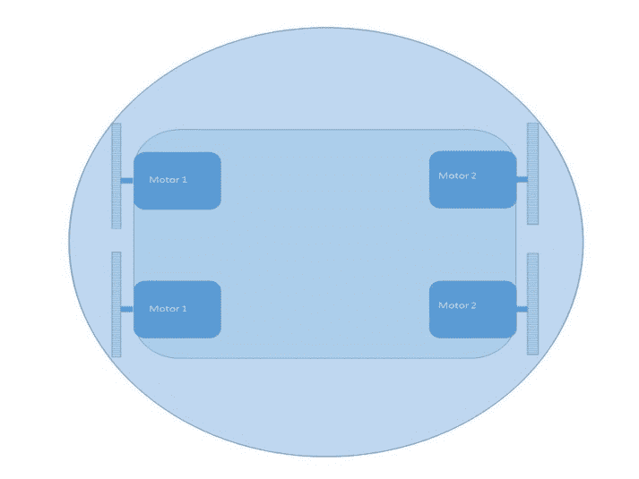

4WD—设计

另一个可能考虑的参数是两个轮子之间的距离，因为它必须小于轮子的直径。这是因为如果我们遇到崎岖地形，机器人将能够出来。

如果机器人的结构适合圆形，并且前后轮之间的长度和距离小于左右两侧的距离，这种情况就会发生。在这里，虽然会发生打滑，但打滑程度大大降低，几乎可以忽略不计。查看以下图片以获取更多信息：

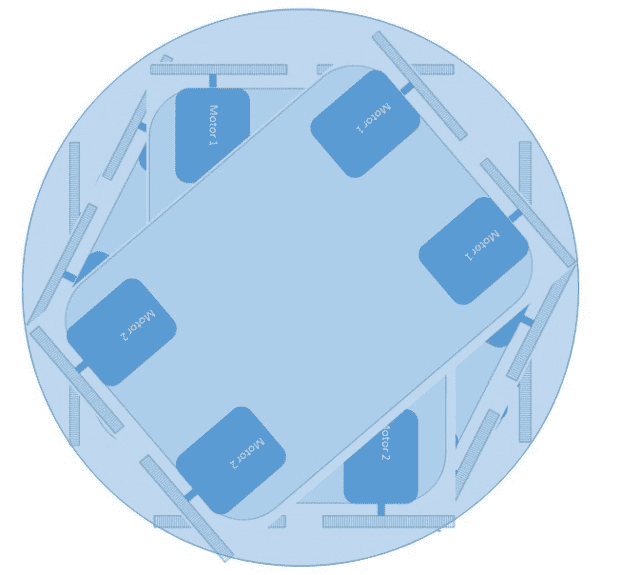

4WD 机器人的旋转

在前面的图像中，随着机器人倾向于保持在它所包围的圆形中，执行更多或更少的枢轴转向或零半径转向，这一概念应该会变得更加清晰。

既然我们已经知道了如何设计机器人底盘，让我们看看可用的现成设计。在亚马逊和 eBay 等网站上，有许多底盘是预制好的，遵循现有的设计模式。如果你想要自己制造底盘，那么最好遵循前面的设计模式，尤其是在 4WD 配置中。

# 与 Intel Edison 的串口通信

当我们有一个手动机器人时，我们需要控制它。因此，为了控制它，我们需要某种通信方式。这是通过使用串口通信来实现的。在 Intel Edison 中，我们有三个串口；让我们称它为 Serialx，其中 x 代表 1 或 2。这些串口可以通过 Arduino IDE 访问：

+   **Serial**:

+   +   **Name**: 多功能，固件编程，串行控制台或 OTG 端口

    +   **Location**: Arduino 扩展板中心附近的 USB 微型连接器

    +   **ArduinoSWname**: Serial

    +   **Linuxname**: `/dev/ttyGS0`

这个端口允许我们编程 Intel Edison，也是 Arduino IDE 的默认端口。在 Arduino 扩展板中，当切换开关或 SW1 指向 OTG 端口且远离 USB 插槽时，此端口被激活。

+   **Serial1**:

+   +   **Name**: UART1，通用 TTL 级端口（Arduino 屏蔽兼容性）

    +   **Location**: Arduino 屏蔽接口引脚上的 0（RX）和 1（TX）。

    +   **ArduinoSWname**: Serial1

    +   **Linuxname**: `/dev/ttyMFD1`

这个端口是 0 号和 1 号引脚，用作 Rx 和 Tx。这个端口用于通过 RF 网络或任何外部蓝牙设备远程控制 Edison。

+   **Serial2**:

    +   **Name**: UART2，Linux 内核调试或调试喷口

    +   **Location**: Arduino 板边缘附近的 USB 微型连接器

    +   **ArduinoSWname**: Serial2

    +   **Linuxname**: `/dev/ttyMFD2`

这是其中一个最有用的端口，其通信波特率为 115200。这通常是可以通过 PuTTY 控制台访问的端口，用于隔离启动问题。当创建并使用`Serial2.begin()`初始化 Serial2 对象时，内核对端口的访问被移除，直到调用`Serial2.end()`，Arduino 草图将获得对端口的控制。

+   **Virtual ports**:

    +   **Name**: VCP 或虚拟通信端口（仅在串行 USB 设备连接时出现）

    +   **Location**: 最靠近 Arduino 电源连接器的较大类型 A USB 端口

    +   **ArduinoSWname**: 默认不支持

    +   **Linuxname**: `/dev/ttyACMx` 或 `/dev/ttyUSBx`

这是英特尔爱迪生的 Arduino 扩展板的 USB 端口。开关必须朝向 USB 端口以启用设备。可以使用 USB 集线器连接多个 USB 设备。

考虑以下代码示例：

```cpp
void setup()
  {
    Serial.begin(9600);
  }

void loop()
  {
    Serial.println("Hi, Reporting in from Intel Edison");
    delay(500);
  }

```

这将在串行监视器中打印“Hi，来自英特尔爱迪生的报告”。从代码中可以看出，使用了`Serial`，这是默认的。

# 使系统无线化

在机器人技术中使系统无线化，有许多可用的选项。硬件和协议的选择取决于某些因素，如下所述：

+   移动网络覆盖的可用性

+   在您所在运营国家的射频（RF）规则和规定

+   需要的最大距离

+   互联网连接的可用性

如果我们使用 GSM 模块，那么移动网络覆盖是必须的。我们可能需要获得射频的许可，并确保它不会干扰其他信号。最大距离是另一个需要考虑的因素，因为在使用蓝牙时距离是有限的。如果距离超过，蓝牙连接可能会受到影响。对于射频来说也是一样，但基于使用的天线，射频覆盖可以增加。如果某个区域有互联网连接，那么可以使用 MQTT 本身，这已经在第三章中讨论过，*英特尔爱迪生和物联网（家庭自动化）*。

射频（RF）可用于小型应用。爱迪生也可以使用 Wi-Fi，但让我们覆盖广泛的设备，并看看射频如何被使用。

通常，射频模块遵循**通用异步接收发送器**（**UART**）协议。这些通常具有 USB 链路和串行链路。可以使用串行到 USB 转换器将串行链路转换为 USB 链路。购买射频模块套件时有很多选择。

记录最大范围和操作频率。所有详细信息都可以从购买产品的地点获得。

通常，射频串行链路的引脚图如下所示：

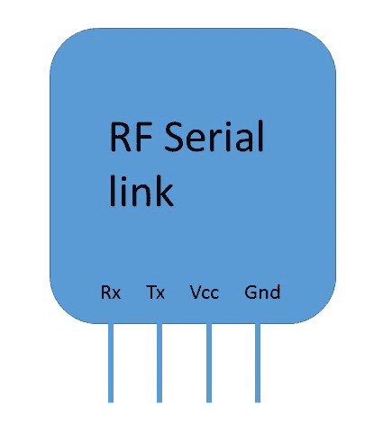

射频串行链路引脚图

这里是我们项目中使用的产品[`robokits.co.in/`](http://robokits.co.in/)：

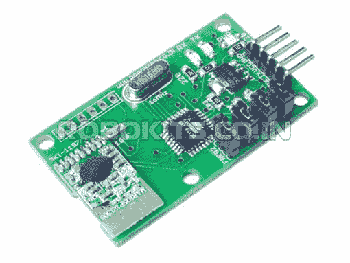

射频 USB 串行链路。图片来源：[`robokits.co.in/`](http://robokits.co.in/)

该模块可以由五个引脚组成。我们只需要处理前面提到的四个引脚。

使用射频套件可以通过发送命令手动控制机器人无线。这些命令是通过串行端口通信发送的。控制器可能使用具有 USB 链路的射频模块，或者您可以使用串行到 USB 转换器将其连接到您的 PC。射频串行链路与串行到 USB 转换器的连接如下所示：

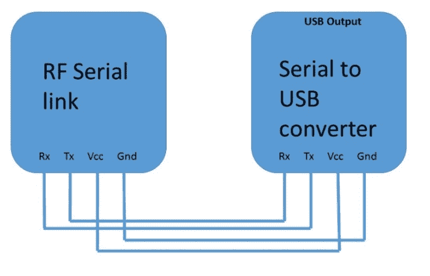

将射频串行链路连接到串行转 USB 转换器的连接

之前显示的连接用于将 RF 串行链路连接到 USB。这适用于计算机端，因为我们想通过 PC 来控制它。我们必须使用两个 RF 模块；一个用于爱迪生，另一个用于控制器应用程序或 PC。要将 RF 模块连接到英特尔爱迪生，请查看以下图像：

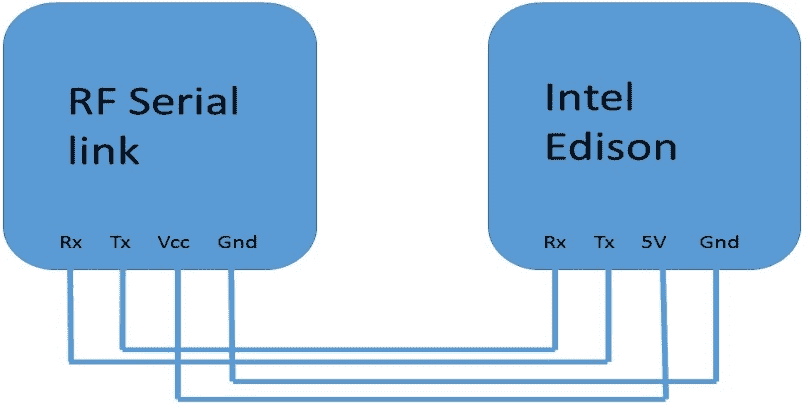

RF 串行链路连接到英特尔爱迪生的连接

英特尔爱迪生具有 Rx 和 Tx 引脚，分别对应引脚 0 和 1。整体架构如下所示：

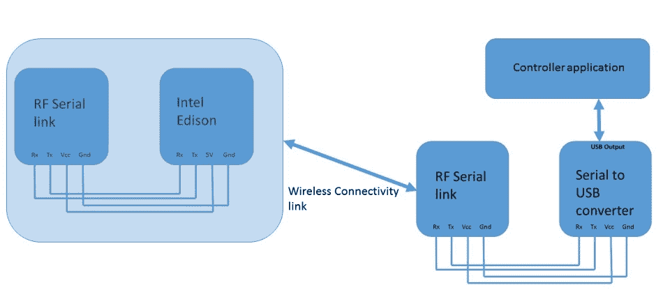

无线控制英特尔爱迪生

现在我们知道了硬件组件如何用于无线通信，英特尔爱迪生中先前模型的编程部分非常简单。只需将`Serial`替换为`Serial1`，因为我们正在使用 Rx 和 Tx 引脚：

```cpp
void setup()  
  { 
    Serial1.begin(9600); 
  } 

void loop()  
  { 
    Serial1.println("Hi, Reporting in from Intel Edison"); 
    delay(500); 
  } 

```

上述代码通过 RF 网络使用 Rx 和 Tx 引脚将数据发送到控制器应用程序。现在我们将查看控制器应用程序端，我们将开发一个 WPF 应用程序来控制我们的设备。

# LED 开关的 WPF 应用程序

在第三章中，我们探讨了使用 WPF 应用程序和 MQTT 连接，了解到我们可以使用 MQTT 协议来控制我们的英特尔爱迪生。然而，在这里，我们将处理串行端口通信。由于我们已经讨论了 WPF 应用程序以及如何创建项目，并创建了一个 hello world 应用程序，因此我们不会在本章中讨论基础知识，而是直接进入应用程序。本章的问题陈述是通过串行端口通信使用 WPF 应用程序开关 LED。

从创建一个新的 WPF 项目并命名为`RobotController`开始：

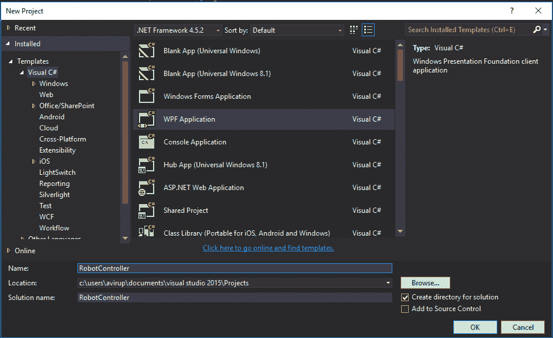

机器人控制器—1

接下来，在 MainWindow.xaml 中，我们将设计 UI。我们将使用以下控件：

+   `Buttons`

+   `TextBox`

+   `TextBlocks`

按照以下方式设计您的 UI：

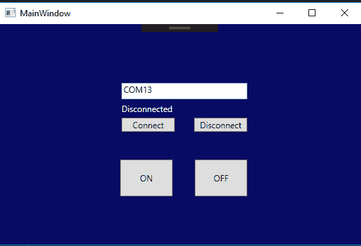

机器人控制器—2

上述 UI 的 xaml 代码如下：

```cpp
<Window x:Class="RobotController.MainWindow"        mc:Ignorable="d" Title="MainWindow" Height="350" Width="525" Background="#FF070B64 <Grid> <Grid.ColumnDefinitions> <ColumnDefinition Width="335*"/> <ColumnDefinition Width="182*"/> </Grid.ColumnDefinitions> <TextBlock x:Name="status" HorizontalAlignment="Left"
    Margin="172,111,0,0" TextWrapping="Wrap" Text="Disconnected"
    VerticalAlignment="Top" Foreground="White"/> <TextBox x:Name="comno" HorizontalAlignment="Left" Height="23"
    Margin="172,83,0,0" TextWrapping="Wrap" Text="COM13"
    VerticalAlignment="Top" Width="177" Grid.ColumnSpan="2"/> <Button x:Name="on" Content="ON" HorizontalAlignment="Left"
    Margin="170,191,0,0" VerticalAlignment="Top" Width="74" Height="52"
    Click="on_Click"/> <Button x:Name="off" Content="OFF" HorizontalAlignment="Left"
    Margin="275,191,0,0" VerticalAlignment="Top" Width="74" Height="52"
    Grid.ColumnSpan="2" Click="off_Click"/> <Button x:Name="connect" Content="Connect"
    HorizontalAlignment="Left" Margin="172,132,0,0"
    VerticalAlignment="Top" Width="75" Click="connect_Click"/> <Button x:Name="disconnect" Content="Disconnect"
    HorizontalAlignment="Left" Margin="274,132,0,0"
    VerticalAlignment="Top" Width="75" Grid.ColumnSpan="2"
    Click="disconnect_Click"/> </Grid> </Window>

```

默认情况下，我们已编写`COM13`；然而，这可能会改变。总共添加了四个按钮，分别是开、关、连接和断开连接。我们还有一个`TextBlock`来显示状态。您可以修改此代码以进行更多定制。

现在我们需要编写此代码的后端，这还将包括其背后的逻辑。

让我们先创建事件处理程序。双击每个按钮以创建一个事件。前面的代码包含事件处理程序。完成后，包含以下命名空间以使用`SerialPort`类：

```cpp
using System.IO.Ports;  

```

接下来，创建`SerialPort`类的对象：

```cpp
SerialPort sp= new SerialPort(); 

```

现在导航到连接按钮的事件处理程序方法，并在此处添加通过串行端口将您的应用程序连接到英特尔爱迪生的代码。添加了 try catch 块以防止连接时崩溃。崩溃的最常见原因是端口号码不正确或 USB 未连接：

```cpp
try 
  { 
    String portName = comno.Text; 
      sp.PortName = portName; 
      sp.BaudRate = 9600; 
      sp.Open(); 
      status.Text = "Connected"; 
  } 
    catch (Exception) 
  { 
     MessageBox.Show("Please give a valid port number or check your connection");    
  } 

```

在前面的代码中，我们将`com`端口号存储在一个字符串类型的变量中。接下来，我们将对象的`PortName`成员赋值为`portName`。我们还设置了波特率为`9600`。最后，我们打开端口并在状态框中写入`connected`。

接下来，我们编写断开连接的事件处理程序代码：

```cpp
try 
  { 
    sp.Close(); 
    status.Text = "Disconnected"; 
  } 
    catch (Exception) 
  { 
    MessageBox.Show("First Connect and then disconnect"); 
  } 

```

`sp.close()`断开连接。在 try catch 块下编写这些代码是安全的。

最后，我们编写了开和关按钮的事件处理程序代码：

```cpp
private void on_Click(object sender, RoutedEventArgs e) 
  { 
    try 
      { 
        sp.WriteLine("1"); 
      } 
        catch(Exception) 
      { 
         MessageBox.Show("Not connected"); 
      } 
  } 

private void off_Click(object sender, RoutedEventArgs e) 
  { 
    try 
      { 
        sp.WriteLine("2"); 
      } 
        catch (Exception) 
      { 
        MessageBox.Show("Not connected"); 
      } 
  } 

```

在前面的代码中，我们使用了`WriteLine`方法并发送了一个字符串。与使用串行端口连接到应用程序的设备接收到的字符串可能触发一个动作。这总结了整个过程。`MainWindow.xaml.cs`的整个代码如下所示：

```cpp
using System; 
using System.Collections.Generic; 
using System.Linq; 
using System.Text; 
using System.Threading.Tasks; 
using System.Windows; 
using System.Windows.Controls; 
using System.Windows.Data; 
using System.Windows.Documents; 
using System.Windows.Input; 
using System.Windows.Media; 
using System.Windows.Media.Imaging; 
using System.Windows.Navigation; 
using System.Windows.Shapes; 
using System.IO.Ports; 

namespace RobotController 
{ 
    /// <summary> 
    /// Interaction logic for MainWindow.xaml 
    /// </summary> 
    public partial class MainWindow : Window 
    { 
        SerialPort sp = new SerialPort(); 
        public MainWindow() 
        { 
            InitializeComponent(); 
        } 

        private void connect_Click(object sender, RoutedEventArgs e) 
        { 
            try 
            { 
                String portName = comno.Text; 
                sp.PortName = portName; 
                sp.BaudRate = 9600; 
                sp.Open(); 
                status.Text = "Connected"; 
            } 
            catch (Exception) 
            { 

                MessageBox.Show("Please give a valid port number or check your connection"); 
            } 

        } 

        private void disconnect_Click(object sender, RoutedEventArgs e) 
        { 
            try 
            { 
                sp.Close(); 
                status.Text = "Disconnected"; 
            } 
            catch (Exception) 
            { 

                MessageBox.Show("First Connect and then disconnect"); 
            } 
        } 

        private void on_Click(object sender, RoutedEventArgs e) 
        { 
            try 
            { 
                sp.WriteLine("1"); 
            } 
            catch(Exception) 
            { 
                MessageBox.Show("Not connected"); 
            } 
        } 

        private void off_Click(object sender, RoutedEventArgs e) 
        { 
            try 
            { 
                sp.WriteLine("2"); 
            } 
            catch (Exception) 
            { 
                MessageBox.Show("Not connected"); 
            } 
        } 
    } 
} 

```

现在我们已经准备好了控制英特尔爱迪生的应用程序。让我们来测试一下。打开 Arduino IDE。我们将为英特尔爱迪生编写一小段代码，该代码将从应用程序读取串行数据，以便根据传入的数据使板载 LED 灯亮和灭。

编写以下代码以执行相同操作：

```cpp
void setup()  
  { 
    pinMode(13,OUTPUT); 
    Serial.begin(9600); 
  } 
void loop()  
  { 
    if(Serial.available()>0) 
      { 
         char c= Serial.read(); 
         if(c=='1') 
         digitalWrite(13,HIGH); 
         else if(c=='2') 
         digitalWrite(13,LOW); 
       } 
  } 

```

当你烧录此代码时，转到 Visual Studio 并运行你的 WPF 应用程序。输入端口号；它必须与你的 Arduino 编程端口相同，即串行端口。然后，按下开按钮。板载 LED 应该会发光。当你按下关按钮时，它应该熄灭。因此，我们现在对如何通过 WPF 应用程序使用串行端口通信与爱迪生进行通信有了非常基本的了解。随着章节的进展，我们将看到如何通过键盘控制有效地控制机器人。

# 带代码的高性能电机驱动器示例

在第五章“使用英特尔爱迪生的自主机器人”中，我们看到了 L293D 的应用，并为它编写了一些代码来控制电机。然而，L293D 在高性能应用中失败了。为了解决这个问题，我们简要讨论了替代的高功率驱动器。

在这里，我们将深入探讨驱动器，因为它一直是我的最爱，并且几乎在我们的所有机器人中都得到了应用：


双电机驱动高功率。图片来源：[`robokits.co.in/motor-drives/dual-dc-motor-driver-20a`](http://robokits.co.in/motor-drives/dual-dc-motor-driver-20a)

驱动器有以下五个控制引脚：

+   **Gnd**：地

+   **DIR**：当低电平时，电机朝一个方向旋转；当高电平时，朝另一个方向旋转

+   **PWM**：脉冲宽度调制以控制电机速度；推荐频率范围是 20Hz - 400Hz

+   **BRK**：当处于高电平时，它将停止电机运行

+   **5V**：电机驱动板输出的调节 5V

现在，让我们编写一段简单的代码来操作这个驱动器及其所有电路：

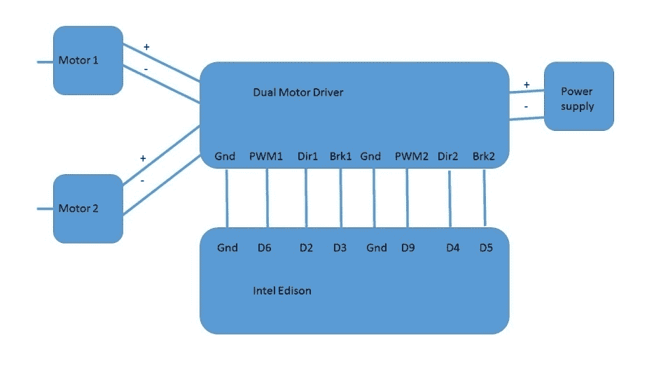

电机驱动电路图

上述电路非常简单易懂。您不需要连接 5V 引脚。您可以通过短路板上的两个地线来使用单个地线。现在让我们编写一段代码来操作这个驱动器。这个电机驱动器在控制高扭矩电机方面非常高效。由于使用了 PWM 功能，因此我们将使用原始速度`122`的一半：

```cpp
int pwm1=6,dir1=2,brk1=3,pwm2=9,dir2=4,brk2=5; 
void setup()  
{ 
  pinMode(2,OUTPUT); 
  pinMode(6,OUTPUT); 
  pinMode(3,OUTPUT); 
  pinMode(4,OUTPUT); 
  pinMode(5,OUTPUT); 
  pinMode(9,OUTPUT); 
} 
void loop()  
{ 
  forward(); 
  delay(10000); 
  backward(); 
  delay(10000); 
  left(); 
  delay(10000); 
  right(); 
  delay(10000); 
  stop(); 
  delay(10000); 
} 
void forward() 
{ 
  //Left side motors  
  digitalWrite(2,LOW); //Direction 
  digitalWrite(3,LOW); //Brake 
  analogWrite(6,122); 
  //Right side motor 
  digitalWrite(4,LOW); //Direction 
  digitalWrite(5,LOW); //Brake 
  analogWrite(9,122); 
} 
void backward() 
{ 
  //Left side motors  
  digitalWrite(2,HIGH);//Direction 
  digitalWrite(3,LOW); //Brake 
  analogWrite(6,122); 
  //Right side motor 
  digitalWrite(4,HIGH);//Direction 
  digitalWrite(5,LOW); //Brake 
  analogWrite(9,122); 
} 
void left() 
{ 
  //Left side motors  
  digitalWrite(2,LOW);//Direction 
  digitalWrite(3,LOW); //Brake 
  analogWrite(6,122); 
  //Right side motor 
  digitalWrite(4,HIGH);//Direction 
  digitalWrite(5,LOW); //Brake 
  analogWrite(9,122); 
} 
void right() 
{ 
  //Left side motors  
  digitalWrite(2,HIGH);//Direction 
  digitalWrite(3,LOW); //Brake 
  analogWrite(6,122); 
  //Right side motor 
  digitalWrite(4,LOW);//Direction 
  digitalWrite(5,LOW); //Brake 
  analogWrite(9,122); 
} 
void stop() 
{ 
  //Left side motors  
  digitalWrite(2,LOW);//Direction 
  digitalWrite(3,HIGH); //Brake 
  analogWrite(6,122); 
  //Right side motor 
  digitalWrite(4,LOW);//Direction 
  digitalWrite(5,HIGH); //Brake 
  analogWrite(9,122); 
} 

```

在前面的代码中，值得注意的是`Brake`和`pwm`的功能。即使您使用的是低扭矩电机，如果刹车设置为高，电机也不会旋转。同样，通过`pwm`引脚可以实现高效的速度控制。因此，我们默认将`pwm`上的其他所有设置都设置为低。这再次取决于您电机的极性。请随意调整连接，以确保所有设置都符合前面的代码。如果您在正向条件下发现两侧都出现相反的旋转，请反转电机连接。

观察电机是如何通过一个非常简单的代码进行高效控制的。

现在我们知道了如何更有效地控制电机，我们将继续介绍我们特殊的黑色轨道 UGV 平台，我们在该平台上开发了用于控制机器人的控制器。几乎所有部件都是从[`robokits.co.in`](http://robokits.co.in)购买的。

# 4WD UGV（黑色轨道）

名称可能有点花哨，但这个 UGV 相当简单，唯一的区别是它包含由单个双驱动器电机驱动电路供电的四个高扭矩电机。最初，我们使用了两个驱动电路，但后来我们转向使用一个。它由锂离子电池供电，但所有测试都是使用 SMPS 进行的。UGV 由名为通用遥控器的 WPF 应用程序控制。这个 UGV 还配备了一个工作频率为 5.8 GHz 的摄像头。UGV 还使用 2.4 GHz 射频模块进行无线连接。让我们看看除了 Intel Edison 之外所需的硬件：

+   30 cm x 30 cm 底盘(1)

+   10 cm 直径的轮子(4)

+   高扭矩电机 300 RPM 12V(4)

+   20A 双电机驱动器(1)

+   RF 2.4 GHz USB 链路(1)

+   RF 2.4 GHz 串行链路(1)

+   锂离子电池（最小电压：12V；最大电流：3-4A）

本节将涵盖其硬件方面以及如何使用 WPF 开发控制器应用程序。底盘与车轮的组合属于前述图中讨论的设计原则。让我们看看 UGV 的电路图。如果机器人使用前面提到的硬件制作，那么机器人在崎岖地形上表现良好，并且能够爬上 60-65 度的陡坡（已测试）：

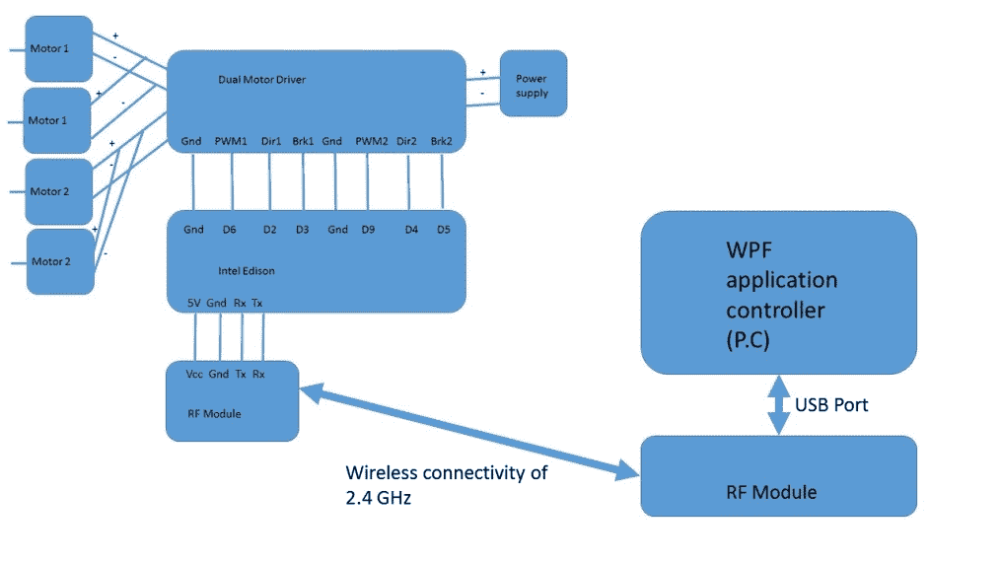

UGV 电路图

电机 1 代表左侧电机，而电机 2 代表右侧电机。左侧电机是短路的，同样右侧电机也是如此。这个特定的 UGV 被编程通过串口通信接收某些字符，并根据这些字符执行某些操作。现在，让我们看看 Intel Edison 的代码：

```cpp
#define SLOW_SPEED 165 
#define MAX_SPEED 255 
int pwm1=6,dir1=2,brk1=3,pwm2=9,dir2=4,brk2=5; 
void setup()  
{ 
Serial1.begin(9600); 
  pinMode(2,OUTPUT); 
  pinMode(6,OUTPUT); 
  pinMode(3,OUTPUT); 
  pinMode(4,OUTPUT); 
  pinMode(5,OUTPUT); 
  pinMode(9,OUTPUT); 
} 
/* 
         * 1: Fast front 
         * 0: Fast back 
         * 3: Fast right 
         * 4: Fast left 
         * 5: STOP 
         * 6: Slow front 
         * 7: Slow back 
         * 8: Slow right 
         * 9: Slow left 
         * */ 
void loop()  
{ 
  if(Serial1.available()>0) 
  { 
    char c= Serial1.read(); 
    if(c=='1') 
    forward(MAX_SPEED); 
    else if(c=='0') 
    backward(MAX_SPEED); 
    else if(c=='3') 
    right(MAX_SPEED); 
    else if(c=='4') 
    left(MAX_SPEED); 
    else if(c=='6') 
    forward(SLOW_SPEED); 
    else if(c=='7') 
    backward(SLOW_SPEED); 
    else if(c=='8') 
    right(SLOW_SPEED); 
    else if(c=='9') 
    left(SLOW_SPEED); 
    else if(c=='5') 
    stop();   
  } 
} 
void forward(int speed) 
{ 
  //Left side motors  
  digitalWrite(2,LOW); //Direction 
  digitalWrite(3,LOW); //Brake 
  analogWrite(6,speed); 
  //Right side motor 
  digitalWrite(4,LOW); //Direction 
  digitalWrite(5,LOW); //Brake 
  analogWrite(9,speed); 
} 
void backward(int speed) 
{ 
  //Left side motors  
  digitalWrite(2,HIGH);//Direction 
  digitalWrite(3,LOW); //Brake 
  analogWrite(6,speed); 
  //Right side motor 
  digitalWrite(4,HIGH);//Direction 
  digitalWrite(5,LOW); //Brake 
  analogWrite(9,speed); 
} 
void left(int speed) 
{ 
  //Left side motors  
  digitalWrite(2,LOW);//Direction 
  digitalWrite(3,LOW); //Brake 
  analogWrite(6,speed); 
  //Right side motor 
  digitalWrite(4,HIGH);//Direction 
  digitalWrite(5,LOW); //Brake 
  analogWrite(9,speed); 
} 
void right(int speed) 
{ 
  //Left side motors  
  digitalWrite(2,HIGH);//Direction 
  digitalWrite(3,LOW); //Brake 
  analogWrite(6,speed); 
  //Right side motor 
  digitalWrite(4,LOW);//Direction 
  digitalWrite(5,LOW); //Brake 
  analogWrite(9,speed); 
} 
void stop() 
{ 
  //Left side motors  
  digitalWrite(2,LOW);//Direction 
  digitalWrite(3,HIGH); //Brake 
  analogWrite(6,122); 
  //Right side motor 
  digitalWrite(4,LOW);//Direction 
  digitalWrite(5,HIGH); //Brake 
  analogWrite(9,122); 
} 

```

之前的代码根据接收到的数据执行函数。以下表格总结了负责接收数据的字符：

| **接收到的字符** | **执行的操作** |
| --- | --- |
| `0` | 快速后退 |
| `1` | 快速向前 |
| `3` | 快速向右 |
| `4` | 快速向左 |
| `5` | 停止 |
| `6` | 慢速向前 |
| `7` | 慢速后退 |
| `8` | 慢速向右 |
| `9` | 慢速向左 |

我们创建了两个宏，用于最大速度和慢速。运动执行方法参数是基于接收到的数据传递的速度。您可以使用串行监视器进行测试。现在，我们有了硬件，让我们为它编写软件。这个软件将能够通过键盘控制机器人。

# UGV 的通用机器人控制器

在深入探讨控制器之前，请将以下 GitHub 仓库克隆到您的电脑上。代码本身大约有 350+行，因此需要讨论的部分：

[`github.com/avirup171/bet_controller_urc`](https://github.com/avirup171/bet_controller_urc)

因此，让我们首先设计 UI：

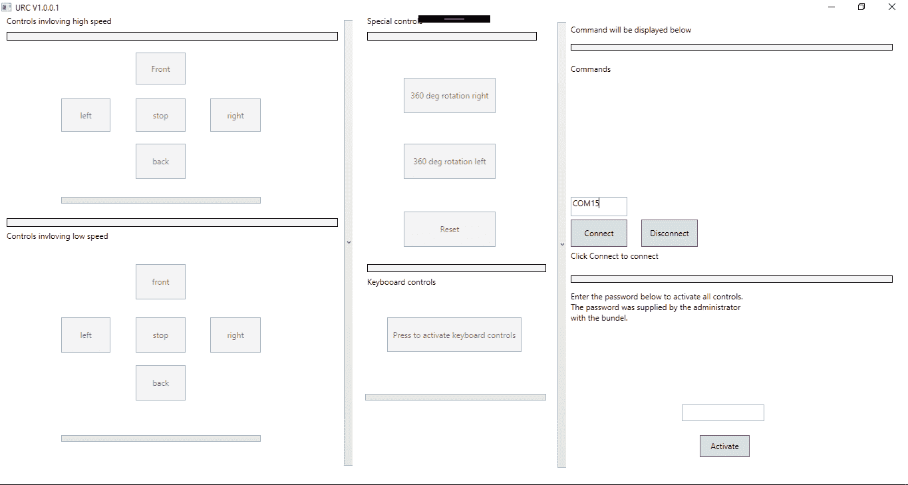

URC 截图

为了简化，包括了快速和慢速控制的两部分。然而，它们可以被合并为一个，并使用复选框。我们在右上角有一个连接面板。命令在此显示。添加了一个默认密码`12345`，这是为了避免崩溃和未经授权的使用。然而，这是一个简单的控制器，可以相当高效地与 UGVs 一起使用。

如果您仔细查看 UI，会发现一个名为“按下以激活键盘控制”的按钮。一旦点击该按钮，键盘控制就会被激活。现在您需要分配键盘按下和键盘释放事件。这可以通过选择控件并在属性窗口中点击以下图标来完成。这管理着所选控件的全部事件处理器：

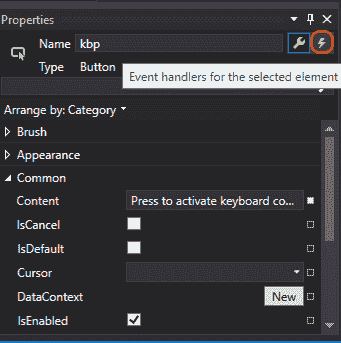

属性窗口

当我们在键盘上按下键时，会触发两个事件。第一个事件是我们按下键时，第二个事件是我们释放键时

现在当您点击它时，您将得到与之相关的所有可能事件。滚动到 KeyDown 和 KeyUp。双击两者以创建相关的事件处理器。控制按钮有不同的事件与之关联。也就是说，当按钮被按下时，我们发送数据。当按钮释放时，发送 5，这是停止的代码。您可以通过属性窗口（如前所述）分配事件：

```cpp
<Button x:Name="front_fast" Content="Front" HorizontalAlignment="Left" VerticalAlignment="Top" Width="75" Margin="204,56,0,0" Height="48" GotMouseCapture="front_fast_GotMouseCapture" LostMouseCapture="front_fast_LostMouseCapture" />

```

为所有按钮分配名称并创建它们各自的事件处理程序。我们还创建了三个进度条。进度条的 xaml 代码如下所示：

```cpp
<ProgressBar x:Name="pb1" HorizontalAlignment="Left" Height="10" Margin="92,273,0,0" VerticalAlignment="Top" Width="300"/>

```

对于键盘上下事件，相应的 xaml 代码如下：

```cpp
<Button Content="Press to activate keyboard controls" Name="kbp" HorizontalAlignment="Left" Margin="582,454,0,0" VerticalAlignment="Top" Width="202" Height="52" KeyDown="kbp_KeyDown" KeyUp="Kbp_KeyUp"/>

```

创建了两个事件。一个用于按键按下，另一个用于按键释放。

之前 UI 的 xaml 代码如下所示：

```cpp
<Window x:Class="BET_Controller_v2.MainWindow"        Title="URC V1.0.0.1" Height="720" Width="1360" Loaded="Window_Loaded">
 <Grid> <TextBlock HorizontalAlignment="Left" TextWrapping="Wrap"
    Text="Controls invloving high speed" VerticalAlignment="Top"
    Height="25" Width="269" Margin="10,0,0,0"/> <Rectangle Fill="#FFF4F4F5" HorizontalAlignment="Left" Height="13"
    Stroke="Black" VerticalAlignment="Top" Width="498"
    Margin="10,25,0,0"/> <Button x:Name="front_fast" Content="Front"
      HorizontalAlignment="Left" VerticalAlignment="Top" Width="75"
      Margin="204,56,0,0" Height="48"
      GotMouseCapture="front_fast_GotMouseCapture"
      LostMouseCapture="front_fast_LostMouseCapture" /> <Button x:Name="back_fast" Content="back"
      HorizontalAlignment="Left" VerticalAlignment="Top" Width="75"
      Margin="204,193,0,0" Height="53"
      GotMouseCapture="back_fast_GotMouseCapture"
      LostMouseCapture="back_fast_LostMouseCapture"/>
      <Button x:Name="left_fast" Content="left"
      HorizontalAlignment="Left" VerticalAlignment="Top" Width="74"
      Margin="92,125,0,0" Height="50"
      GotMouseCapture="left_fast_GotMouseCapture"
      LostMouseCapture="left_fast_LostMouseCapture" />
 <Button x:Name="right_fast" Content="right"
      HorizontalAlignment="Left" VerticalAlignment="Top" Width="76"
      Margin="316,125,0,0" Height="50"
      GotMouseCapture="right_fast_GotMouseCapture"
      LostMouseCapture="right_fast_LostMouseCapture" /> <Button x:Name="stop_fast" Content="stop"
      HorizontalAlignment="Left" VerticalAlignment="Top" Width="75"
      Margin="204,125,0,0" Height="50"
      RenderTransformOrigin="0.362,0.5" Click="stop_fast_Click" /> <Rectangle Fill="#FFF4F4F5" HorizontalAlignment="Left" Height="13"
    Stroke="Black" VerticalAlignment="Top" Width="498"
    Margin="10,305,0,0"/> <TextBlock HorizontalAlignment="Left" TextWrapping="Wrap"
  Text="Controls invloving low speed" VerticalAlignment="Top"
  Height="25" Width="269" Margin="10,323,0,0"/> <Button x:Name="front_slow" Content="front"
      HorizontalAlignment="Left" Margin="204,374,0,0"
      VerticalAlignment="Top" Width="75" Height="53"
      GotMouseCapture="front_slow_GotMouseCapture"
      LostMouseCapture="front_slow_LostMouseCapture"/> <Button x:Name="back_slow" Content="back"
      HorizontalAlignment="Left" Margin="204,526,0,0"
      VerticalAlignment="Top" Width="75" Height="53"
      LostMouseCapture="back_slow_LostMouseCapture"
      GotMouseCapture="back_slow_GotMouseCapture" /> <Button x:Name="right_slow" Content="right"
      HorizontalAlignment="Left" Margin="316,454,0,0"
      VerticalAlignment="Top" Width="76" Height="53"
      LostMouseCapture="right_slow_LostMouseCapture"
      GotMouseCapture="right_slow_GotMouseCapture" /> <Button x:Name="left_slow" Content="left"
      HorizontalAlignment="Left" Margin="92,454,0,0"
      VerticalAlignment="Top" Width="74" Height="53"
      GotMouseCapture="left_slow_GotMouseCapture"
      LostMouseCapture="left_slow_LostMouseCapture" /> <Button x:Name="stop_slow" Content="stop"
      HorizontalAlignment="Left" Margin="204,454,0,0"
      VerticalAlignment="Top" Width="75" Height="53"
      Click="stop_slow_Click"/> <Rectangle Fill="#FFF4F4F5" HorizontalAlignment="Left" Height="13"
    Stroke="Black" VerticalAlignment="Top" Width="255"
    Margin="552,25,0,0"/> <TextBlock HorizontalAlignment="Left" TextWrapping="Wrap"
  Text="Special controls" VerticalAlignment="Top" Height="25"
  Width="269" Margin="552,0,0,0"/> <Button x:Name="rr360" Content="360 deg rotation right"
      HorizontalAlignment="Left" Margin="607,94,0,0"
      VerticalAlignment="Top" Width="138" Height="53"
      RenderTransformOrigin="0.498,0.524" Click="rr360_Click"/> <Button x:Name="lr360" Content="360 deg rotation left"
      HorizontalAlignment="Left" Margin="607,193,0,0"
      VerticalAlignment="Top" Width="138" Height="53"
      RenderTransformOrigin="0.498,0.524" Click="lr360_Click" /> <TextBlock HorizontalAlignment="Left" TextWrapping="Wrap"
  Text="Command will be displayed below" VerticalAlignment="Top"
  Height="25" Width="484" Margin="858,13,0,0"/> <Rectangle Fill="#FFF4F4F5" HorizontalAlignment="Left" Height="10"
    Stroke="Black" VerticalAlignment="Top" Width="484"
    Margin="858,43,0,0"/> <TextBlock x:Name="cmd" HorizontalAlignment="Left"
  Margin="858,72,0,0" TextWrapping="Wrap" Text="Commands"
  VerticalAlignment="Top" Height="174" Width="484"/> <TextBox x:Name="cno" HorizontalAlignment="Left" Height="29"
  Margin="858,273,0,0" TextWrapping="Wrap" Text="COM13"
  VerticalAlignment="Top" Width="85"/> <Button x:Name="connect" Content="Connect"
      HorizontalAlignment="Left" Margin="858,307,0,0"
      VerticalAlignment="Top" Width="85" Height="41"
      RenderTransformOrigin="0.498,0.524" Click="connect_Click" /> <Button x:Name="disconnect" Content="Disconnect"
      HorizontalAlignment="Left" Margin="964,307,0,0"
      VerticalAlignment="Top" Width="85" Height="41"
      RenderTransformOrigin="0.498,0.524" Click="disconnect_Click" /> <Button x:Name="rst" Content="Reset" HorizontalAlignment="Left"
      Margin="607,295,0,0" VerticalAlignment="Top" Width="138"
      Height="53" RenderTransformOrigin="0.498,0.524" Click="rst_Click"
      /> <TextBlock HorizontalAlignment="Left" Margin="858,353,0,0" x:Name="s" 
  TextWrapping="Wrap" Text="Click Connect to connect"
  VerticalAlignment="Top" Height="33" Width="191"/> <ProgressBar x:Name="pbkc" HorizontalAlignment="Left" Height="10"
    Margin="549,569,0,0" VerticalAlignment="Top" Width="272"/> <ProgressBar x:Name="pb2" HorizontalAlignment="Left" Height="10"
    Margin="92,631,0,0" VerticalAlignment="Top" Width="300"/> <ProgressBar x:Name="pb1" HorizontalAlignment="Left" Height="10"
    Margin="92,273,0,0" VerticalAlignment="Top" Width="300"/> <Rectangle Fill="#FFF4F4F5" HorizontalAlignment="Left" Height="12"
    Stroke="Black" VerticalAlignment="Top" Width="269"
    Margin="552,374,0,0"/> <TextBlock HorizontalAlignment="Left" TextWrapping="Wrap"
  Text="Keybooard controls" VerticalAlignment="Top" Height="25"
  Width="269" Margin="552,392,0,0"/> <Button Content="Press to activate keyboard controls" Name="kbp"
      HorizontalAlignment="Left" Margin="582,454,0,0"
      VerticalAlignment="Top" Width="202" Height="52"
      KeyDown="kbp_KeyDown" KeyUp="Kbp_KeyUp"/> <Rectangle Fill="#FFF4F4F5" HorizontalAlignment="Left" Height="11"
    Stroke="Black" VerticalAlignment="Top" Width="484"
    Margin="858,391,0,0"/> <TextBlock HorizontalAlignment="Left" TextWrapping="Wrap" Text="Enter
  the password below to activate all controls. The password was
  supplied by the administrator with the bundel."
  VerticalAlignment="Top" Height="51" Width="269"
  Margin="858,414,0,0"/> <Button x:Name="activate" Content="Activate"
      HorizontalAlignment="Left" Margin="1052,631,0,0"
      VerticalAlignment="Top" Width="75" Height="33"
      Click="activate_Click" KeyDown="activate_KeyDown"/> <PasswordBox x:Name="pswrdbox" HorizontalAlignment="Left"
  Margin="1025,585,0,0" VerticalAlignment="Top" Height="25" Width="124"
  PasswordChar="*" FontSize="24"/> <Rectangle Fill="#FFF4F4F5" HorizontalAlignment="Left" Height="645"
    Stroke="Black" VerticalAlignment="Top" Width="5" Margin="834,8,0,0"
    RenderTransformOrigin="0.5,0.5"> </Rectangle><Rectangle Fill="#FFF4F4F5" HorizontalAlignment="Left"
    Height="645" Stroke="Black" VerticalAlignment="Top" Width="5"
    Margin="539,19,0,0" RenderTransformOrigin="0.5,0.5"/>
 </Grid> </Window>

```

现在 UI 已经准备好，让我们转到主要的 C#代码。事件处理程序也已就位。最初包含`System.IO.Ports`命名空间并创建该类的一个对象。之后，键盘按下事件将由我们的代码处理：

```cpp
private void kbp_KeyDown(object sender, KeyEventArgs e) 
        { 
            Keyboard.Focus(kbp); 
            if (e.Key == Key.W) 
            { 
                sp.WriteLine("1"); 
                pbkc.IsIndeterminate = true; 
                cmd.Text = "W: fast forward"; 
            } 
            else if (e.Key == Key.S) 
            { 
                sp.WriteLine("0"); 
                pbkc.IsIndeterminate = true; 
                cmd.Text = "S: fast back"; 
            } 
            else if (e.Key == Key.A) 
            { 
                sp.WriteLine("4"); 
                pbkc.IsIndeterminate = true; 
                cmd.Text = "A: fast left"; 
            } 
            else if (e.Key == Key.D) 
            { 
                sp.WriteLine("3"); 
                pbkc.IsIndeterminate = true; 
                cmd.Text = "D: fast right"; 
            } 
            else if (e.Key == Key.NumPad8) 
            { 
                sp.WriteLine("6"); 
                pbkc.IsIndeterminate = true; 
                cmd.Text = "9: slow front"; 
            } 
            else if (e.Key == Key.NumPad2) 
            { 
                sp.WriteLine("7"); 
                pbkc.IsIndeterminate = true; 
                cmd.Text = "2: slow back"; 
            } 
            else if (e.Key == Key.NumPad6) 
            { 
                sp.WriteLine("8"); 
                pbkc.IsIndeterminate = true; 
                cmd.Text = "6: slow right"; 
            } 
            else if (e.Key == Key.NumPad4) 
            { 
                sp.WriteLine("9"); 
                pbkc.IsIndeterminate = true; 
                cmd.Text = "D: slow left"; 
            } 

        } 

```

在前面的代码中，我们使用了以下键：

| **序列号** | **键盘按键** | **执行命令** |
| --- | --- | --- |
| `1` | *W* | 快速前进 |
| `2` | *A* | 快速左转 |
| `3` | *S* | 快速后退 |
| `4` | *D* | 快速右转 |
| `5` | 数字键盘 *8* | 慢速前进 |
| `6` | 数字键盘 *2* | 慢速后退 |
| `7` | 数字键盘 *4* | 慢速左转 |
| `8` | 数字键盘 *6* | 慢速右转 |

根据输入，我们发送特定的字符。而对于按键抬起或释放事件，我们简单地发送`5`，表示停止：

```cpp
private void Kbp_KeyUp(object sender, KeyEventArgs e) 
  { 
    sp.WriteLine("5"); 
    pbkc.IsIndeterminate = false; 
    cmd.Text = "STOP"; 
  } 

```

连接和断开事件与之前相同。现在每个按钮将有两个方法。第一个是`GotMouseCapture`，第二个是`LostMouseCapture`。

以快速控制下的前按钮为例：

```cpp
private void front_fast_GotMouseCapture(object sender, MouseEventArgs e) 
  { 
    sp.WriteLine("1"); 
    cmd.Text = "Fast Forward"; 
    pb1.IsIndeterminate = true; 
 } 

private void front_fast_LostMouseCapture(object sender, MouseEventArgs e) 
  { 
    sp.WriteLine("5"); 
    cmd.Text = "STOP"; 
    pb1.IsIndeterminate = false; 
  } 

```

类似地，应用于其他控制。只有左右 360 度旋转与按钮点击事件相关联。整个代码如下所示，粘贴自`MainWindow.xaml.cs`：

```cpp
using System; 
using System.Collections.Generic; 
using System.Linq; 
using System.Text; 
using System.Threading.Tasks; 
using System.Windows; 
using System.Windows.Controls; 
using System.Windows.Data; 
using System.Windows.Documents; 
using System.Windows.Input; 
using System.Windows.Media; 
using System.Windows.Media.Imaging; 
using System.Windows.Navigation; 
using System.Windows.Shapes; 
using System.IO.Ports; 

namespace BET_Controller_v2 
{ 
    /// <summary> 
    /// Interaction logic for MainWindow.xaml 
    /// </summary> 
    public partial class MainWindow : Window 
    { 
        SerialPort sp = new SerialPort(); 
        public MainWindow() 
        { 
            InitializeComponent(); 
            Closing += new System.ComponentModel.CancelEventHandler(MainWindow_Closing); 
        } 

        private void MainWindow_Closing(object sender, System.ComponentModel.CancelEventArgs e) 
        { 
            if (MessageBox.Show("Do you really want to exit?", "Exit", MessageBoxButton.YesNo) == MessageBoxResult.No) 
            { 
                e.Cancel = true; 
            } 
        } 
/* 
         * 1: Fast front 
         * 0: Fast back 
         * 3: Fast right 
         * 4: Fast left 
         * 5: STOP 
         * 6: Slow front 
         * 7: Slow back 
         * 8: Slow right 
         * 9: Slow left 
         * */ 
        //Keyboard Controls 
        private void kbp_KeyDown(object sender, KeyEventArgs e) 
        { 
            Keyboard.Focus(kbp); 
            if (e.Key == Key.W) 
            { 
                sp.WriteLine("1"); 
                pbkc.IsIndeterminate = true; 
                cmd.Text = "W: fast forward"; 
            } 
            else if (e.Key == Key.S) 
            { 
                sp.WriteLine("0"); 
                pbkc.IsIndeterminate = true; 
                cmd.Text = "S: fast back"; 
            } 
            else if (e.Key == Key.A) 
            { 
                sp.WriteLine("4"); 
                pbkc.IsIndeterminate = true; 
                cmd.Text = "A: fast left"; 
            } 
            else if (e.Key == Key.D) 
            { 
                sp.WriteLine("3"); 
                pbkc.IsIndeterminate = true; 
                cmd.Text = "D: fast right"; 
            } 
            else if (e.Key == Key.NumPad8) 
            { 
                sp.WriteLine("6"); 
                pbkc.IsIndeterminate = true; 
                cmd.Text = "9: slow front"; 
            } 
            else if (e.Key == Key.NumPad2) 
            { 
                sp.WriteLine("7"); 
                pbkc.IsIndeterminate = true; 
                cmd.Text = "2: slow back"; 
            } 
            else if (e.Key == Key.NumPad6) 
            { 
                sp.WriteLine("8"); 
                pbkc.IsIndeterminate = true; 
                cmd.Text = "6: slow right"; 
            } 
            else if (e.Key == Key.NumPad4) 
            { 
                sp.WriteLine("9"); 
                pbkc.IsIndeterminate = true; 
                cmd.Text = "D: slow left"; 
            } 

        } 
//Key release event handlers 
        private void Kbp_KeyUp(object sender, KeyEventArgs e) 
        { 
            sp.WriteLine("5"); 
            pbkc.IsIndeterminate = false; 
            cmd.Text = "STOP"; 
        } 
//Connect to the hardware 
        private void connect_Click(object sender, RoutedEventArgs e) 
        { 
            try 
            { 
                String pno = cno.Text; 
                sp.PortName = pno; 
                sp.BaudRate = 9600; 
                sp.Open(); 
                s.Text = "Connected"; 
            } 
            catch (Exception) 
            { 

                MessageBox.Show("Please check the com port number or the hardware attached to it"); 
            } 
        } 
        //Disconnect from the hardware 
        private void disconnect_Click(object sender, RoutedEventArgs e) 
        { 
            try 
            { 
                sp.Close(); 
                s.Text = "Disconnected"; 
            } 
            catch (Exception) 
            { 

                MessageBox.Show("Some error occured with the connection"); 
            } 
        } 

        private void front_fast_GotMouseCapture(object sender, MouseEventArgs e) 
        { 
            sp.WriteLine("1"); 
            cmd.Text = "Fast Forward"; 
            pb1.IsIndeterminate = true; 
        } 

        private void front_fast_LostMouseCapture(object sender, MouseEventArgs e) 
        { 
            sp.WriteLine("5"); 
            cmd.Text = "STOP"; 
            pb1.IsIndeterminate = false; 
        } 

        private void back_fast_GotMouseCapture(object sender, MouseEventArgs e) 
        { 
            sp.WriteLine("0"); 
            cmd.Text = "Fast Backward"; 
            pb1.IsIndeterminate = true; 
        } 

        private void back_fast_LostMouseCapture(object sender, MouseEventArgs e) 
        { 
            sp.WriteLine("5"); 
            cmd.Text = "STOP"; 
            pb1.IsIndeterminate = false; 
        } 

        private void left_fast_GotMouseCapture(object sender, MouseEventArgs e) 
        { 
            sp.WriteLine("4"); 
            cmd.Text = "Fast left"; 
            pb1.IsIndeterminate = true; 
        } 

        private void left_fast_LostMouseCapture(object sender, MouseEventArgs e) 
        { 
            sp.WriteLine("5"); 
            cmd.Text = "STOP"; 
            pb1.IsIndeterminate = false; 
        } 

        private void activate_Click(object sender, RoutedEventArgs e) 
        { 
         // Password and activation section 
            string s = pswrdbox.Password; 
            if(s=="12345") 
            { 
                MessageBox.Show("Congrats Black e Track Controller V2 is activated"); 
                front_fast.IsEnabled = true; 
                back_fast.IsEnabled = true; 
                stop_fast.IsEnabled = true; 
                left_fast.IsEnabled = true; 
                right_fast.IsEnabled = true; 
                front_slow.IsEnabled = true; 
                back_slow.IsEnabled = true; 
                right_slow.IsEnabled = true; 
                left_slow.IsEnabled = true; 
                stop_slow.IsEnabled = true; 
                rr360.IsEnabled = true; 
                lr360.IsEnabled = true; 
                rst.IsEnabled = true; 
                kbp.IsEnabled = true; 
            } 
            else 
            { 
                MessageBox.Show("Sorry you have entered wrong password. Please enter the correct credentials or contact your system administrator."); 
            } 
        } 

        private void right_fast_GotMouseCapture(object sender, MouseEventArgs e) 
        { 
            sp.WriteLine("3"); 
            cmd.Text = "Fast Right"; 
            pb1.IsIndeterminate = true; 
        } 

        private void right_fast_LostMouseCapture(object sender, MouseEventArgs e) 
        { 
            sp.WriteLine("5"); 
            cmd.Text = "STOP"; 
            pb1.IsIndeterminate = false; 
        } 

        private void front_slow_GotMouseCapture(object sender, MouseEventArgs e) 
        { 
            sp.WriteLine("6"); 
            cmd.Text = "Slow Front"; 
            pb2.IsIndeterminate = true; 
        } 

        private void front_slow_LostMouseCapture(object sender, MouseEventArgs e) 
        { 
            sp.WriteLine("5"); 
            cmd.Text = "STOP"; 
            pb2.IsIndeterminate = false; 
        } 
        private void back_slow_LostMouseCapture(object sender, MouseEventArgs e) 
        { 
            sp.WriteLine("5"); 
            cmd.Text = "STOP"; 
            pb2.IsIndeterminate = false; 
        } 

        private void back_slow_GotMouseCapture(object sender, MouseEventArgs e) 
        { 
            sp.WriteLine("7"); 
            cmd.Text = "Slow Back"; 
            pb2.IsIndeterminate = true; 
        } 
        private void left_slow_GotMouseCapture(object sender, MouseEventArgs e) 
        { 
            sp.WriteLine("9"); 
            cmd.Text = "Slow Left"; 
            pb2.IsIndeterminate = true; 
        } 

        private void left_slow_LostMouseCapture(object sender, MouseEventArgs e) 
        { 
            sp.WriteLine("5"); 
            cmd.Text = "STOP"; 
            pb2.IsIndeterminate = false; 
        } 

        private void right_slow_LostMouseCapture(object sender, MouseEventArgs e) 
        { 
            sp.WriteLine("5"); 
            cmd.Text = "STOP"; 
            pb2.IsIndeterminate = false; 
        } 

        private void right_slow_GotMouseCapture(object sender, MouseEventArgs e) 
        { 
            sp.WriteLine("8"); 
            cmd.Text = "Slow Right"; 
            pb2.IsIndeterminate = true; 
        } 

        private void stop_fast_Click(object sender, RoutedEventArgs e) 
        { 
            sp.WriteLine("5"); 
            cmd.Text = "STOP"; 
        } 

        private void stop_slow_Click(object sender, RoutedEventArgs e) 
        { 
            sp.WriteLine("5"); 
            cmd.Text = "STOP"; 
        } 

        private void rr360_Click(object sender, RoutedEventArgs e) 
        { 
            sp.WriteLine("4"); 
            cmd.Text = "360 deg right rotation"; 
        } 

        private void lr360_Click(object sender, RoutedEventArgs e) 
        { 
            sp.WriteLine("3"); 
            cmd.Text = "360 deg left rotation"; 
        } 

        private void rst_Click(object sender, RoutedEventArgs e) 
        { 
            MessageBox.Show("The control doesn't exist now"); 
        } 

   //Window loaded event handler for deactivating all controls by default 
        private void Window_Loaded(object sender, RoutedEventArgs e) 
        { 
            front_fast.IsEnabled = false; 
            back_fast.IsEnabled = false; 
            stop_fast.IsEnabled = false; 
            left_fast.IsEnabled = false; 
            right_fast.IsEnabled = false; 
            front_slow.IsEnabled = false; 
            back_slow.IsEnabled = false; 
            right_slow.IsEnabled = false; 
            left_slow.IsEnabled = false; 
            stop_slow.IsEnabled = false; 
            rr360.IsEnabled = false; 
            lr360.IsEnabled = false; 
            rst.IsEnabled = false; 
            kbp.IsEnabled = false; 
        } 
        private void activate_KeyDown(object sender, KeyEventArgs e) 
        {             
            if ((e.Key == Key.B) && Keyboard.IsKeyDown(Key.LeftCtrl) && Keyboard.IsKeyDown(Key.LeftAlt)) 
            { 
                MessageBox.Show("Password: 12345"); 
            } 
        }            
    } 
} 

```

在前面的代码中，需要注意以下事实：

+   如果未输入密码，所有按钮都将禁用。

+   密码为`12345`

+   所有按钮都与`gotMouseCapture`和`lostMouseCapture`相关联。

+   只有 360 度旋转按钮遵循点击事件

一旦您成功开发项目，进行测试。将射频 USB 链路连接到您的 PC。安装所有必需的驱动程序并测试。整个过程如下所述：

+   将射频 USB 链路连接到您的 PC。

+   确保您的英特尔爱迪生已开启并连接到我们的机器人。您可以使用 USB 集线器为英特尔爱迪生供电，并将集线器连接到充电宝。

+   点击连接后，WPF 应用程序应连接到您的射频设备。

+   测试您的机器人是否工作。使用 5.8 GHz FPV 摄像头从您的 UGV 获取实时视图。

# 对读者的开放式问题

我们迄今为止开发的是一种无人地面车辆（UGV），而不是典型的机器人，尽管我们可以配置它成为机器人。为了开发一个自主和手动控制的机器人，我们通常设计一个机器人来完成特定的任务，然而我们仍然保留手动控制，以便我们可以在任何时候取回控制权。更恰当地说，它可能既不完全手动也不完全自主。想想无人机。我们只需在地图上指定航点，无人机就会跟随航点。这是经典的例子之一。现在读者的任务是结合之前讨论的线跟踪机器人以及这里讨论的手动机器人，并将它们合并成一个单一的平台。

# 摘要

我们已经到达了本章以及本书的结尾。在本章中，我们有幸了解了手动机器人和 UGVs 的一些深入概念。我们为机器人控制开发了我们的软件。我们还学习了如何使我们的机器人无线，以及访问多个串行端口的方法。最后，我们使用自己的控制器控制了我们的机器人。在第三章“英特尔爱迪生和物联网（家庭自动化）”，我们学习了如何使用 MQTT 协议通过 Android 应用程序控制爱迪生。这项技术也可以通过使用`mraa`库来控制机器人。

整本书涵盖了与英特尔爱迪生（Intel Edison）相关的多个主题。现在，你的任务是利用讨论的概念来提出新的项目，并进一步探索。最后两章纯粹集中在基于英特尔爱迪生的机器人技术，但这些概念也可以应用于其他设备，例如 Arduino。访问[`software.intel.com/en-us/iot/hardware/edison/documentation`](https://software.intel.com/en-us/iot/hardware/edison/documentation)获取更多详细信息以及更深入的学习关于硬件的内容。
