# 第六章：目标无关代码生成器

在本章中，我们将涵盖以下内容：

+   LLVM IR 指令的生命周期

+   使用 GraphViz 可视化 LLVM IR CFG

+   使用 TableGen 描述目标

+   定义指令集

+   添加机器代码描述符

+   实现 MachineInstrBuilder 类

+   实现 MachineBasicBlock 类

+   实现 MachineFunction 类

+   编写指令选择器

+   合法化 SelectionDAG

+   优化 SelectionDAG

+   从 DAG 中选择指令

+   在 SelectionDAG 中调度指令

# 简介

在优化 LLVM IR 之后，需要将其转换为执行所需的机器指令。机器无关的代码生成器接口提供了一个抽象层，帮助将 IR 转换为机器指令。在这个阶段，IR 转换为 SelectionDAG（**DAG** 代表 **有向无环图**）。各种阶段在 SelectionDAG 的节点上工作。本章描述了目标无关代码生成中的重要阶段。

# LLVM IR 指令的生命周期

在前面的章节中，我们看到了高级语言指令、语句、逻辑块、函数调用、循环等如何被转换成 LLVM IR。然后，各种优化过程处理 IR 以使其更优化。生成的 IR 是 SSA 形式，在抽象格式上几乎独立于任何高级或低级语言约束，这有助于优化过程在其上运行。可能存在一些特定于目标的优化，它们在 IR 转换为机器指令时发生。

在我们得到最优的 LLVM IR 之后，下一个阶段是将它转换为特定于目标机的指令。LLVM 使用 SelectionDAG 方法将 IR 转换为机器指令。线性 IR 转换为 SelectionDAG，一个表示指令为节点的 DAG。SDAG 然后经过各种阶段：

+   SelectionDAG 是由 LLVM IR 创建的

+   合法化 SDAG 节点

+   DAG 合并优化

+   从目标指令中选择指令

+   调度和生成机器指令

+   寄存器分配——SSA 摧毁、寄存器分配和寄存器溢出

+   生成代码

所有的前一个阶段在 LLVM 中都是模块化的。

## C 代码到 LLVM IR

第一步是将前端语言示例转换为 LLVM IR。让我们举一个例子：

```cpp
    int test (int a, int b, int c) {
            return c/(a+b);
    }
```

其 LLVM IR 将如下所示：

```cpp
define i32 @test(i32 %a, i32 %b, i32 %c) {
      %add = add nsw i32 %a, %b
      %div = sdiv i32 %add, %c
      return i32 %div
    }
```

## IR 优化

然后 IR 经过各种优化过程，如前几章所述。在转换阶段，IR 经过 `InstCombiner::visitSDiv()` 函数在 `InstCombine` 过程中。在该函数中，它还经过 `SimplifySDivInst()` 函数，并尝试检查是否存在进一步简化指令的机会。

## LLVM IR 到 SelectionDAG

在 IR 转换和优化完成后，LLVM IR 指令通过一个**选择 DAG 节点**阶段。选择 DAG 节点由`SelectionDAGBuilder`类创建。`SelectionDAGISel`类中的`SelectionDAGBuilder::visit()`函数调用遍历每个 IR 指令以创建一个`SDAGNode`节点。处理`SDiv`指令的方法是`SelectionDAGBuilder::visitSDiv`。它从 DAG 请求一个新的`SDNode`节点，具有`ISD::SDIV`操作码，然后成为 DAG 中的一个节点。

## 选择 DAG 合法化

创建的`SelectionDAG`节点可能不被目标架构支持。在 Selection DAG 的初始阶段，这些不支持的节点被称为*非法*。在实际从 DAG 节点发出机器指令之前，这些节点会经历几个其他转换，合法化是其中重要阶段之一。

`SDNode`的合法化涉及类型和操作的合法化。目标特定的信息通过一个名为`TargetLowering`的接口传递给目标无关的算法。这个接口由目标实现，并描述了 LLVM IR 指令应该如何降低到合法的`SelectionDAG`操作。例如，x86 降低是通过`X86TargetLowering`接口实现的。`setOperationAction()`函数指定 ISD 节点是否需要通过操作合法化进行展开或定制。当`SelectionDAGLegalize::LegalizeOp`看到展开标志时，它将`SDNode`节点替换为`setOperationAction()`调用中指定的参数。

## 从目标无关的 DAG 转换为机器 DAG

现在我们已经合法化了指令，`SDNode`应该转换为`MachineSDNode`。机器指令在目标描述`.td`文件中以通用的基于表的格式描述。使用`tablegen`，这些文件随后被转换为具有寄存器/指令枚举的`.inc`文件，以便在 C++代码中引用。指令可以通过自动选择器`SelectCode`选择，或者可以通过在`SelectionDAGISel`类中编写定制的`Select`函数来专门处理。在此步骤中创建的 DAG 节点是一个`MachineSDNode`节点，它是`SDNode`的子类，它包含构建实际机器指令所需的信息，但仍然以 DAG 节点形式存在。

## 调度说明

一台机器执行一系列线性指令。到目前为止，我们仍然有以 DAG（有向无环图）形式存在的机器指令。要将 DAG 转换为线性指令集，可以通过对 DAG 进行拓扑排序来得到线性顺序的指令。然而，生成的线性指令集可能不会产生最优化代码，并且由于指令之间的依赖性、寄存器压力和流水线停滞问题，可能会导致执行延迟。因此，出现了指令调度的概念。由于每个目标都有自己的寄存器集和指令的定制流水线，每个目标都有自己的调度钩子和计算启发式算法来生成优化、更快的代码。在计算最佳指令排列方式后，调度器将机器指令输出到机器基本块中，并最终销毁 DAG。

## 寄存器分配

在发射机器指令之后，分配的寄存器是虚拟寄存器。实际上，可以分配无限数量的虚拟寄存器，但实际的目标具有有限的寄存器数量。这些有限的寄存器需要有效地分配。如果没有这样做，一些寄存器必须溢出到内存中，这可能会导致冗余的加载/存储操作。这也会导致 CPU 周期的浪费，从而减慢执行速度并增加内存占用。

存在着各种寄存器分配算法。在分配寄存器时进行的一个重要分析是变量的存活性和存活区间分析。如果两个变量在同一个区间内存活（即存在区间干扰），则它们不能分配到同一个寄存器。通过分析存活性创建一个干扰图，可以使用图着色算法来分配寄存器。然而，这个算法的运行时间是二次的。因此，它可能会导致编译时间更长。

LLVM 在寄存器分配上采用贪婪算法，首先为具有大存活范围的变量分配寄存器。小范围适合填充可用的寄存器间隙，从而减少溢出重量。溢出是一种由于没有可分配的寄存器而发生的加载/存储操作。溢出重量是涉及溢出操作的成本。有时，为了将变量放入寄存器，还会进行存活范围分割。

注意，在寄存器分配之前，指令处于 SSA（单赋值）形式。然而，由于可用的寄存器数量有限，SSA 形式在现实世界中无法存在。在某些类型的架构中，某些指令需要固定的寄存器。

## 代码发射

现在原始的高级代码已经被翻译成机器指令，下一步是生成代码。LLVM 以两种方式完成此操作；第一种是 JIT，它直接将代码输出到内存。第二种方式是通过使用 MC 框架为所有后端目标生成汇编和目标文件。《LLVMTargetMachine::addPassesToEmitFile》函数负责定义生成对象文件所需的操作序列。实际的 MI 到 MCInst 转换是在 `AsmPrinter` 接口的 `EmitInstruction` 函数中完成的。静态编译器工具 llc 为目标生成汇编指令。通过实现 `MCStreamer` 接口来完成对象文件（或汇编代码）的生成。

# 使用 GraphViz 可视化 LLVM IR CFG

使用 **GraphViz** 工具可以可视化 LLVM IR 控制流图。它以可视化的方式展示了形成的节点以及代码流如何在生成的 IR 中遵循。由于 LLVM 中的重要数据结构是图，这可以在编写自定义传递或研究 IR 模式行为时，成为一种非常有用的理解 IR 流的方式。

## 准备工作

1.  要在 Ubuntu 上安装 `graphviz`，首先添加其 `ppa` 仓库：

    ```cpp
    $ sudo apt-add-repository ppa:dperry/ppa-graphviz-test

    ```

1.  更新软件包仓库：

    ```cpp
    $ sudo apt-get update

    ```

1.  安装 `graphviz`：

    ```cpp
    $ sudo apt-get install graphviz

    ```

    ### 注意

    如果遇到 `graphviz : Depends: libgraphviz4 (>= 2.18) but it is not going to be installed` 错误，请运行以下命令：

    ```cpp
    $ sudo apt-get remove libcdt4
    $ sudo apt-get remove libpathplan4

    ```

    然后使用以下命令再次安装 `graphviz`：

    ```cpp
    $ sudo apt-get install graphviz

    ```

## 如何做到这一点...

1.  一旦 IR 转换为 DAG，它可以在不同的阶段进行查看。创建一个包含以下代码的 test.ll 文件：

    ```cpp
    $ cat test.ll
    define i32 @test(i32 %a, i32 %b, i32 %c) {
     %add = add nsw i32 %a, %b
     %div = sdiv i32 %add, %c
     ret i32 %div
    }

    ```

1.  要在构建后但在第一次优化传递之前显示 DAG，请输入以下命令：

    ```cpp
    $ llc -view-dag-combine1-dags test.ll

    ```

    以下图显示了第一次优化传递之前的 DAG：

    

1.  要显示合法化之前的 DAG，请运行以下命令：

    ```cpp
    $ llc -view-legalize-dags test.ll

    ```

    下面是一个显示合法化阶段之前 DAG 的图：

    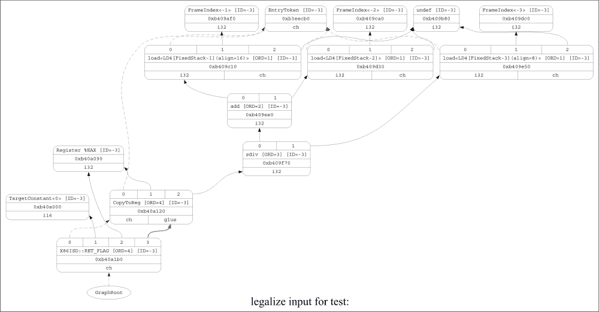

1.  要显示第二次优化传递之前的 DAG，请运行以下命令：

    ```cpp
    $ llc -view-dag-combine2-dags test.ll

    ```

    以下图显示了第二次优化传递之前的 DAG：

    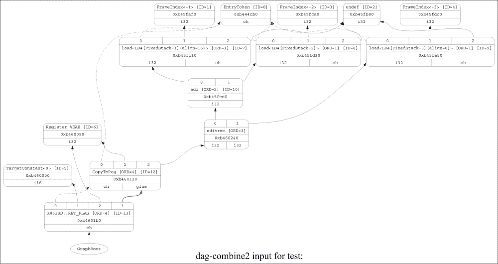

1.  要显示选择阶段之前的 DAG，请输入以下命令：

    ```cpp
    $ llc -view-isel-dags test.ll

    ```

    下面是一个显示选择阶段之前 DAG 的图：

    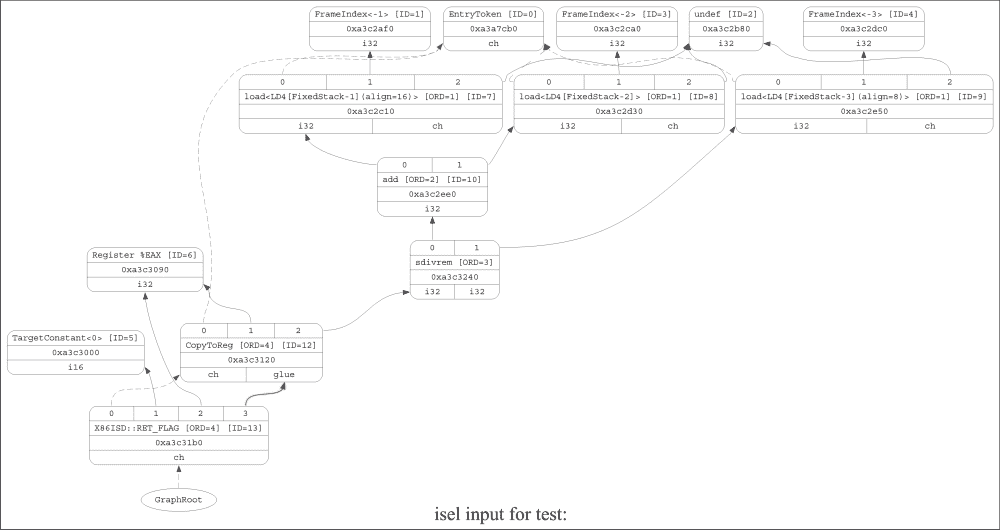

1.  要显示调度之前的 DAG，请运行以下命令：

    ```cpp
    $ llc -view-sched-dags test.ll

    ```

    以下图显示了调度阶段之前的 DAG：

    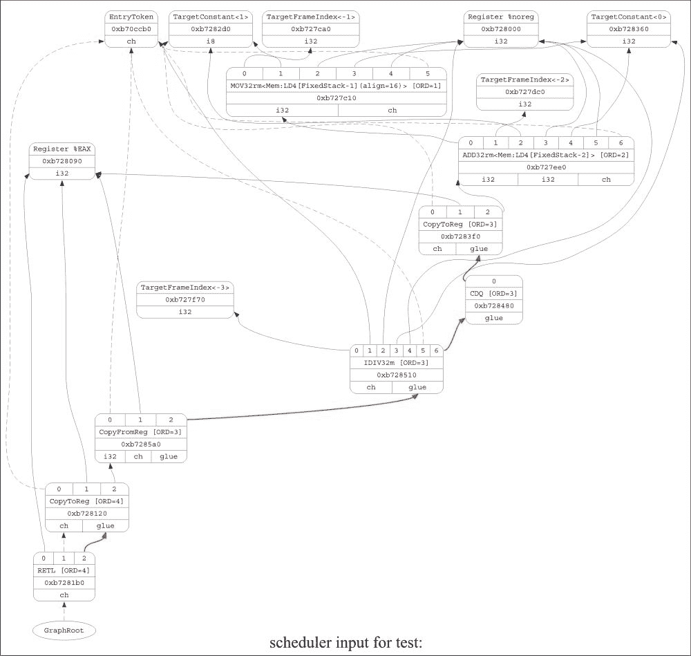

1.  要显示调度器的依赖图，请运行以下命令：

    ```cpp
    $ llc -view-sunit-dags test.ll

    ```

    此图显示了调度器的依赖图：

    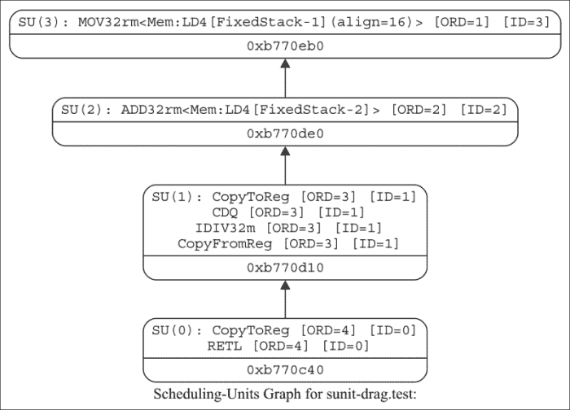

注意合法化阶段前后 DAG 的差异。`sdiv` 节点已被转换为 `sdivrem` 节点。x86 目标不支持 `sdiv` 节点，但支持 `sdivrem` 指令。从某种意义上说，`sdiv` 指令对于 x86 目标是不合法的。合法化阶段将其转换为 x86 目标支持的 `sdivrem` 指令。

还要注意指令选择 (ISel) 阶段前后 DAG 的差异。像 `Load` 这样的目标机无关指令被转换为 `MOV32rm` 机器代码（这意味着，将 32 位数据从内存移动到寄存器）。ISel 阶段是一个重要的阶段，将在后面的菜谱中描述。

观察 DAG 的调度单元。每个单元都与其他单元相连接，这显示了它们之间的依赖关系。这些依赖信息对于决定调度算法非常重要。在前面的例子中，调度单元 0 (SU0) 依赖于调度单元 1 (SU1)。因此，SU0 中的指令不能在 SU1 中的指令之前调度。SU1 依赖于 SU2，同样 SU2 也依赖于 SU3。

## 参见

+   关于如何在调试模式下查看图的更多详细信息，请访问 [`llvm.org/docs/ProgrammersManual.html#viewing-graphs-while-debugging-code`](http://llvm.org/docs/ProgrammersManual.html#viewing-graphs-while-debugging-code)

# 使用 TableGen 描述目标

目标架构可以用现有的寄存器、指令集等来描述。手动描述每一个都是一项繁琐的任务。`TableGen` 是一个用于后端开发者的工具，它使用声明性语言 `*.td` 来描述他们的目标机器。`*.td` 文件将被转换为枚举、DAG 模式匹配函数、指令编码/解码函数等，这些可以在其他 C++ 文件中用于编码。

为了在目标描述的 `.td` 文件中定义寄存器和寄存器集，`tablegen` 将目标 `.td` 文件转换为 `.inc` 文件，这些文件将在我们的 `.cpp` 文件中以 `#include` 语法引用寄存器。

## 准备工作

假设示例目标机器有四个寄存器，`r0-r3`；一个栈寄存器，`sp`；以及一个链接寄存器，`lr`。这些可以在 `SAMPLERegisterInfo.td` 文件中指定。`TableGen` 提供了 `Register` 类，它可以扩展以指定寄存器。

## 如何操作

1.  在 `lib/Target` 目录下创建一个名为 `SAMPLE` 的新文件夹：

    ```cpp
    $ mkdir llvm_root_directory/lib/Target/SAMPLE

    ```

1.  在新的 `SAMPLE` 文件夹中创建一个名为 `SAMPLERegisterInfo.td` 的新文件：

    ```cpp
    $ cd llvm_root_directory/lib/Target/SAMPLE
    $ vi SAMPLERegisterInfo.td

    ```

1.  定义硬件编码、命名空间、寄存器和寄存器类：

    ```cpp
    class SAMPLEReg<bits<16> Enc, string n> : Register<n> {
      let HWEncoding = Enc;
      let Namespace = "SAMPLE";
    }

    foreach i = 0-3 in {
      def R#i : R<i, "r"#i >;
    }

    def SP  : SAMPLEReg<13, "sp">;
    def LR  : SAMPLEReg<14, "lr">;

    def GRRegs : RegisterClass<"SAMPLE", [i32], 32,
      (add R0, R1, R2, R3, SP)>;
    ```

## 它是如何工作的

`TableGen` 处理这个 `.td` 文件以生成 `.inc` 文件，这些文件以枚举的形式表示寄存器，可以在 `.cpp` 文件中使用。当我们构建 LLVM 项目时，将生成这些 `.inc` 文件。

## 参见

+   要获取关于如何为更高级的架构（如 x86）定义寄存器的详细信息，请参考位于`llvm_source_code/lib/Target/X86/`的`X86RegisterInfo.td`文件。

# 定义指令集

架构的指令集根据架构中存在的各种特性而有所不同。这个配方演示了如何为目标架构定义指令集。

## 准备工作

在指令目标描述文件中定义了三件事：操作数、汇编字符串和指令模式。规范包含一个定义或输出列表和一个使用或输入列表。可以有不同类型的操作数类，如寄存器类，以及立即数或更复杂的`register + imm`操作数。

在这里，演示了一个简单的加法指令定义。它接受两个寄存器作为输入，一个寄存器作为输出。

## 如何操作…

1.  在`lib/Target/SAMPLE`文件夹中创建一个名为`SAMPLEInstrInfo.td`的新文件：

    ```cpp
    $ vi SAMPLEInstrInfo.td

    ```

1.  指定两个寄存器操作数之间加法指令的操作数、汇编字符串和指令模式：

    ```cpp
    def ADDrr : InstSAMPLE<(outs GRRegs:$dst),
              (ins GRRegs:$src1, GRRegs:$src2),
               "add $dst, $src1, $src2",
               [(set i32:$dst, (add i32:$src1, i32:$src2))]>;
    ```

## 它是如何工作的…

`add`寄存器指令指定`$dst`作为结果操作数，它属于通用寄存器类型类；`$src1`和`$src2`输入作为两个输入操作数，它们也属于通用寄存器类；指令汇编字符串为`add $dst, $src1, $src2`，它是 32 位整型。

因此，将生成两个寄存器之间加法的汇编，如下所示：

```cpp
add r0, r0, r1
```

这告诉我们将`r0`和`r1`寄存器的内容相加，并将结果存储在`r0`寄存器中。

## 参见

+   要获取关于高级架构（如 x86）各种类型指令集的更详细信息，请参考位于`lib/Target/X86/`的`X86InstrInfo.td`文件。

+   详细介绍了如何定义特定目标的相关信息将在第八章中介绍，*编写 LLVM 后端*。一些概念可能会重复，因为前面的配方只是简要描述，以了解目标架构描述并预览即将到来的配方。

# 添加机器代码描述符

LLVM IR 有函数，这些函数包含基本块。基本块反过来又包含指令。下一步合乎逻辑的操作是将这些 IR 抽象块转换为特定机器的块。LLVM 代码被转换成由`MachineFunction`、`MachineBasicBlock`和`MachineInstr`实例组成的特定机器表示形式。这种表示形式包含最抽象形式的指令——即具有操作码和一系列操作数。

## 如何完成…

现在必须将 LLVM IR 指令表示为机器指令。机器指令是 `MachineInstr` 类的实例。这个类是一种极端抽象的方式来表示机器指令。特别是，它只跟踪一个操作码数字和一组操作数。操作码数字是一个只有对特定后端有意义的简单无符号整数。

让我们看看在 `MachineInstr.cpp` 文件中定义的一些重要函数：

`MachineInstr` 构造函数：

```cpp
MachineInstr::MachineInstr(MachineFunction &MF, const MCInstrDesc &tid, const DebugLoc dl, bool NoImp)
  : MCID(&tid), Parent(nullptr), Operands(nullptr), NumOperands(0),
    Flags(0), AsmPrinterFlags(0),
    NumMemRefs(0), MemRefs(nullptr), debugLoc(dl) {
  // Reserve space for the expected number of operands.
  if (unsigned NumOps = MCID->getNumOperands() +
    MCID->getNumImplicitDefs() + MCID->getNumImplicitUses()) {
    CapOperands = OperandCapacity::get(NumOps);
    Operands = MF.allocateOperandArray(CapOperands);
  }

  if (!NoImp)
    addImplicitDefUseOperands(MF);
}
```

此构造函数创建一个 `MachineInstr` 类对象并添加隐式操作数。它为 `MCInstrDesc` 类指定的操作数数量预留空间。

其中一个重要的函数是 `addOperand`。它将指定的操作数添加到指令中。如果是隐式操作数，它将被添加到操作数列表的末尾。如果是显式操作数，它将被添加到显式操作数列表的末尾，如下所示：

```cpp
void MachineInstr::addOperand(MachineFunction &MF, const MachineOperand &Op) {
  assert(MCID && "Cannot add operands before providing an instr descriptor");
  if (&Op >= Operands && &Op < Operands + NumOperands) {
    MachineOperand CopyOp(Op);
    return addOperand(MF, CopyOp);
  }
  unsigned OpNo = getNumOperands();
  bool isImpReg = Op.isReg() && Op.isImplicit();
  if (!isImpReg && !isInlineAsm()) {
    while (OpNo && Operands[OpNo-1].isReg() && Operands[OpNo-1].isImplicit()) {
      --OpNo;
      assert(!Operands[OpNo].isTied() && "Cannot move tied operands");
    }
  }

#ifndef NDEBUG
  bool isMetaDataOp = Op.getType() == MachineOperand::MO_Metadata;
  assert((isImpReg || Op.isRegMask() || MCID->isVariadic() ||
          OpNo < MCID->getNumOperands() || isMetaDataOp) &&
         "Trying to add an operand to a machine instr that is already done!");
#endif

  MachineRegisterInfo *MRI = getRegInfo();
  OperandCapacity OldCap = CapOperands;
  MachineOperand *OldOperands = Operands;
  if (!OldOperands || OldCap.getSize() == getNumOperands()) {
    CapOperands = OldOperands ? OldCap.getNext() : OldCap.get(1);
    Operands = MF.allocateOperandArray(CapOperands);
    if (OpNo)
      moveOperands(Operands, OldOperands, OpNo, MRI);
  }
  if (OpNo != NumOperands)
    moveOperands(Operands + OpNo + 1, OldOperands + OpNo, NumOperands - OpNo,
                 MRI);
  ++NumOperands;
  if (OldOperands != Operands && OldOperands)
    MF.deallocateOperandArray(OldCap, OldOperands);
  MachineOperand *NewMO = new (Operands + OpNo) MachineOperand(Op);
  NewMO->ParentMI = this;
  if (NewMO->isReg()) {
        NewMO->Contents.Reg.Prev = nullptr;
    NewMO->TiedTo = 0;
        if (MRI)
      MRI->addRegOperandToUseList(NewMO);
        if (!isImpReg) {
            if (NewMO->isUse()) {
        int DefIdx = MCID->getOperandConstraint(OpNo, MCOI::TIED_TO);
        if (DefIdx != -1)
          tieOperands(DefIdx, OpNo);
      }
           if (MCID->getOperandConstraint(OpNo, MCOI::EARLY_CLOBBER) != -1)
        NewMO->setIsEarlyClobber(true);
    }
  }
}
```

目标架构也有一些内存操作数。为了添加这些内存操作数，定义了一个名为 `addMemOperands()` 的函数：

```cpp
void MachineInstr::addMemOperand(MachineFunction &MF,
                                 MachineMemOperand *MO) {
  mmo_iterator OldMemRefs = MemRefs;
  unsigned OldNumMemRefs = NumMemRefs;
  unsigned NewNum = NumMemRefs + 1;
  mmo_iterator NewMemRefs = MF.allocateMemRefsArray(NewNum);
  std::copy(OldMemRefs, OldMemRefs + OldNumMemRefs, NewMemRefs);
  NewMemRefs[NewNum - 1] = MO;
  setMemRefs(NewMemRefs, NewMemRefs + NewNum);
}
```

`setMemRefs()` 函数是设置 `MachineInstr` `MemRefs` 列表的主要方法。

## 它是如何工作的…

`MachineInstr` 类有一个 MCID 成员，用于描述指令的 `MCInstrDesc` 类型，一个 `uint8_t` 标志成员，一个内存引用成员 (`mmo_iterator` `MemRefs`)，以及一个 `std::vector<MachineOperand>` 的操作数成员。在方法方面，`MachineInstr` 类提供了以下功能：

+   一组基本的 `get**` 和 `set**` 函数用于信息查询，例如，`getOpcode()`，`getNumOperands()` 等

+   与捆绑相关的操作，例如，`isInsideBundle()`

+   检查指令是否具有某些属性，例如，`isVariadic()`，`isReturn()`，`isCall()` 等

+   机器指令操作，例如，`eraseFromParent()`

+   与寄存器相关的操作，例如，`ubstituteRegister()`，`addRegisterKilled()` 等

+   创建机器指令的方法，例如，`addOperand()`，`setDesc()` 等

注意，尽管 `MachineInstr` 类提供了创建机器指令的方法，但基于 `MachineInstrBuilder` 类的专用函数 `BuildMI()` 更方便。

# 实现 `MachineInstrBuilder` 类

`MachineInstrBuilder` 类公开了一个名为 `BuildMI()` 的函数。此函数用于构建机器指令。

## 如何做到这一点…

通过使用位于 `include/llvm/CodeGen/MachineInstrBuilder.h` 文件中的 `BuildMI` 函数创建机器指令。`BuildMI` 函数使得构建任意机器指令变得容易。

例如，您可以在代码片段中使用 `BuildMI` 来实现以下目的：

1.  要创建一个 `DestReg = mov 42`（在 x86 汇编中表示为 `mov DestReg, 42`）指令：

    ```cpp
    MachineInstr *MI = BuildMI(X86::MOV32ri, 1, DestReg).addImm(42);
    ```

1.  要创建相同的指令，但将其插入到基本块的末尾：

    ```cpp
    MachineBasicBlock &MBB = BuildMI(MBB, X86::MOV32ri, 1, DestReg).addImm(42);
    ```

1.  要创建相同的指令，但将其插入到指定的迭代器点之前：

    ```cpp
    MachineBasicBlock::iterator MBBI = 
    BuildMI(MBB, MBBI, X86::MOV32ri, 1, DestReg).addImm(42)
    ```

1.  要创建一个循环分支指令：

    ```cpp
    BuildMI(MBB, X86::JNE, 1).addMBB(&MBB);
    ```

## 它是如何工作的...

`BuildMI()` 函数用于指定机器指令将采用的操作数数量，这有助于有效的内存分配。它还必须指定操作数使用值还是定义。

# 实现 `MachineBasicBlock` 类

与 LLVM IR 中的基本块类似，`MachineBasicBlock` 类按顺序包含一组机器指令。大多数情况下，`MachineBasicBlock` 类映射到单个 LLVM IR 基本块。然而，也可能存在多个 `MachineBasicBlock` 类映射到单个 LLVM IR 基本块的情况。`MachineBasicBlock` 类有一个名为 `getBasicBlock()` 的方法，它返回映射到的 IR 基本块。

## 如何做到这一点...

以下步骤展示了如何添加机器基本块：

1.  `getBasicBlock` 方法将仅返回当前的基本块：

    ```cpp
    const BasicBlock *getBasicBlock() const { return BB; }
    ```

1.  基本块有后继和前驱基本块。为了跟踪这些，定义了如下向量：

    ```cpp
    std::vector<MachineBasicBlock *> Predecessors;
    std::vector<MachineBasicBlock *> Successors;
    ```

1.  应添加一个 `insert` 函数，用于将机器指令插入到基本块中：

    ```cpp
      MachineBasicBlock::insert(instr_iterator I, MachineInstr *MI) {
    assert(!MI->isBundledWithPred() && !MI->isBundledWithSucc()  && "Cannot insert instruction with bundle flags");

    if (I != instr_end() && I->isBundledWithPred()) {        MI->setFlag(MachineInstr::BundledPred);              MI->setFlag(MachineInstr::BundledSucc);
    }
        return Insts.insert(I, MI);
    }
    ```

1.  一个名为 `SplitCriticalEdge()` 的函数将从这个块到给定后继块的临界边拆分出来，并返回新创建的块，如果拆分不可行则返回 null。此函数更新 `LiveVariables`、`MachineDominatorTree` 和 `MachineLoopInfo` 类：

    ```cpp
    MachineBasicBlock *
    MachineBasicBlock::SplitCriticalEdge(MachineBasicBlock *Succ, Pass *P) {
    …
    …
    …
    }
    ```

### 注意

上述代码的完整实现位于 `lib/CodeGen/` 目录下的 `MachineBasicBlock.cpp` 文件中。

## 它是如何工作的...

如前所述，不同类别的几个代表性函数构成了 `MachineBasicBlock` 类的接口定义。`MachineBasicBlock` 类保持一个包含机器指令的列表，例如 `typedef ilist<MachineInstr>` 指令、`Insts` 指令和原始的 LLVM BB（基本块）。它还提供了如下目的的方法：

+   BB 信息查询（例如，`getBasicBlock()` 和 `setHasAddressTaken()`）

+   BB 级别操作（例如，`moveBefore()`、`moveAfter()`、`addSuccessor()`）

+   指令级操作（例如，`push_back()`、`insertAfter()` 等）

## 参见

+   要查看 `MachineBasicBlock` 类的详细实现，请查阅位于 `lib/CodeGen/` 的 `MachineBasicBlock.cpp` 文件。

# 实现 `MachineFunction` 类

与 LLVM IR 的 `FunctionBlock` 类类似，`MachineFunction` 类包含一系列 `MachineBasicBlocks` 类。这些 `MachineFunction` 类映射到指令选择器输入的 LLVM IR 函数。除了基本块列表外，`MachineFunction` 类还包含 `MachineConstantPool`、`MachineFrameInfo`、`MachineFunctionInfo` 和 `MachineRegisterInfo` 类。

## 如何做到这一点...

许多函数定义在 `MachineFunction` 类中，该类执行特定任务。还有许多类成员对象保持信息，如下所示：

+   `RegInfo`跟踪函数中每个正在使用的寄存器的信息：

    ```cpp
    MachineRegisterInfo *RegInfo;
    ```

+   `MachineFrameInfo`跟踪堆栈上分配的对象：

    ```cpp
    MachineFrameInfo *FrameInfo;
    ```

+   `ConstantPool`跟踪已溢出到内存中的常量：

    ```cpp
    MachineConstantPool *ConstantPool;
    ```

+   `JumpTableInfo`跟踪跳转表的 switch 指令：

    ```cpp
    MachineJumpTableInfo *JumpTableInfo;
    ```

+   函数中机器基本块的列表：

    ```cpp
    typedef ilist<MachineBasicBlock> BasicBlockListType;
    BasicBlockListType BasicBlocks;
    ```

+   `getFunction`函数返回当前机器代码表示的 LLVM 函数：

    ```cpp
    const Function *getFunction() const { return Fn; }
    ```

+   `CreateMachineInstr`分配一个新的`MachineInstr`类：

    ```cpp
    MachineInstr *CreateMachineInstr(const MCInstrDesc &MCID,
    DebugLoc DL,
    bool NoImp = false);
    ```

## 它是如何工作的…

`MachineFunction`类主要包含一个`MachineBasicBlock`对象列表（`typedef ilist<MachineBasicBlock> BasicBlockListType; BasicBlockListType BasicBlocks;`），并定义了各种用于检索机器函数信息以及操作基本块成员中对象的方法。一个需要注意的重要点是，`MachineFunction`类维护函数中所有基本块的**控制流图**（**CFG**）。CFG 中的控制流信息对于许多优化和分析至关重要。因此，了解`MachineFunction`对象和相应的 CFG 是如何构建的非常重要。

## 参见

+   `MachineFunction`类的详细实现可以在位于`lib/Codegen/`目录下的`MachineFunction.cpp`文件中找到。

# 编写指令选择器

LLVM 使用`SelectionDAG`表示法来表示 LLVM IR 的低级数据依赖 DAG，用于指令选择。可以对`SelectionDAG`表示法应用各种简化和特定于目标的优化。这种表示法是目标无关的。它是一个重要、简单且强大的表示法，用于实现 IR 降低到目标指令。 

## 如何做到这一点…

以下代码展示了`SelectionDAG`类的简要框架，其数据成员以及用于从该类设置/检索有用信息的各种方法。`SelectionDAG`类定义如下：

```cpp
class SelectionDAG {
const TargetMachine &TM;
const TargetLowering &TLI;
const TargetSelectionDAGInfo &TSI;
MachineFunction *MF;
LLVMContext *Context;
CodeGenOpt::Level OptLevel;

SDNode EntryNode;
// Root - The root of the entire DAG.
SDValue Root;

// AllNodes - A linked list of nodes in the current DAG.
ilist<SDNode> AllNodes;

// NodeAllocatorType - The AllocatorType for allocating SDNodes. We use

typedef RecyclingAllocator<BumpPtrAllocator, SDNode, sizeof(LargestSDNode),
AlignOf<MostAlignedSDNode>::Alignment>
NodeAllocatorType;

BumpPtrAllocator OperandAllocator;

BumpPtrAllocator Allocator;

SDNodeOrdering *Ordering;

public:

struct DAGUpdateListener {

DAGUpdateListener *const Next;

SelectionDAG &DAG;

explicit DAGUpdateListener(SelectionDAG &D)
: Next(D.UpdateListeners), DAG(D) {
DAG.UpdateListeners = this;
}

private:

friend struct DAGUpdateListener;

DAGUpdateListener *UpdateListeners;

void init(MachineFunction &mf);

// Function to set root node of SelectionDAG
const SDValue &setRoot(SDValue N) {
  assert((!N.getNode() || N.getValueType() == MVT::Other) &&
    "DAG root value is not a chain!");
  if (N.getNode())
    checkForCycles(N.getNode());
  Root = N;
  if (N.getNode())
    checkForCycles(this);
  return Root;
}

void Combine(CombineLevel Level, AliasAnalysis &AA,
CodeGenOpt::Level OptLevel);

SDValue getConstant(uint64_t Val, EVT VT, bool isTarget = false);

SDValue getConstantFP(double Val, EVT VT, bool isTarget = false);

SDValue getGlobalAddress(const GlobalValue *GV, DebugLoc DL, EVT VT, int64_t offset = 0, bool isTargetGA = false, 
unsigned char TargetFlags = 0);

SDValue getFrameIndex(int FI, EVT VT, bool isTarget = false);

SDValue getTargetIndex(int Index, EVT VT, int64_t Offset = 0,
unsigned char TargetFlags = 0);

// Function to return Basic Block corresponding to this MachineBasicBlock
SDValue getBasicBlock(MachineBasicBlock *MBB);

SDValue getBasicBlock(MachineBasicBlock *MBB, DebugLoc dl);

SDValue getExternalSymbol(const char *Sym, EVT VT);

SDValue getExternalSymbol(const char *Sym, DebugLoc dl, EVT VT);

SDValue getTargetExternalSymbol(const char *Sym, EVT VT,
unsigned char TargetFlags = 0);

// Return the type of the value this SelectionDAG node corresponds // to
SDValue getValueType(EVT);

SDValue getRegister(unsigned Reg, EVT VT);

SDValue getRegisterMask(const uint32_t *RegMask);

SDValue getEHLabel(DebugLoc dl, SDValue Root, MCSymbol *Label);

SDValue getBlockAddress(const BlockAddress *BA, EVT VT,
int64_t Offset = 0, bool isTarget = false,
unsigned char TargetFlags = 0);

SDValue getSExtOrTrunc(SDValue Op, DebugLoc DL, EVT VT);

SDValue getZExtOrTrunc(SDValue Op, DebugLoc DL, EVT VT);

SDValue getZeroExtendInReg(SDValue Op, DebugLoc DL, EVT SrcTy);

SDValue getNOT(DebugLoc DL, SDValue Val, EVT VT);

// Function to get SelectionDAG node.
SDValue getNode(unsigned Opcode, DebugLoc DL, EVT VT);

SDValue getNode(unsigned Opcode, DebugLoc DL, EVT VT, SDValue N);

SDValue getNode(unsigned Opcode, DebugLoc DL, EVT VT, SDValue N1, SDValue N2);

SDValue getNode(unsigned Opcode, DebugLoc DL, EVT VT,
SDValue N1, SDValue N2, SDValue N3);

SDValue getMemcpy(SDValue Chain, DebugLoc dl, SDValue Dst, SDValue Src,SDValue Size, unsigned Align, bool isVol, bool AlwaysInline,
MachinePointerInfo DstPtrInfo,MachinePointerInfo SrcPtrInfo);

SDValue getAtomic(unsigned Opcode, DebugLoc dl, EVT MemVT, SDValue Chain,
SDValue Ptr, SDValue Cmp, SDValue Swp,
MachinePointerInfo PtrInfo, unsigned Alignment,
AtomicOrdering Ordering,
SynchronizationScope SynchScope);

SDNode *UpdateNodeOperands(SDNode *N, SDValue Op);

SDNode *UpdateNodeOperands(SDNode *N, SDValue Op1, SDValue Op2);

SDNode *UpdateNodeOperands(SDNode *N, SDValue Op1, SDValue Op2,
SDValue Op3);

SDNode *SelectNodeTo(SDNode *N, unsigned TargetOpc, EVT VT);

SDNode *SelectNodeTo(SDNode *N, unsigned TargetOpc, EVT VT, SDValue Op1);

SDNode *SelectNodeTo(SDNode *N, unsigned TargetOpc, EVT VT,
SDValue Op1, SDValue Op2);

MachineSDNode *getMachineNode(unsigned Opcode, DebugLoc dl, EVT VT);
MachineSDNode *getMachineNode(unsigned Opcode, DebugLoc dl, EVT VT,
SDValue Op1);

MachineSDNode *getMachineNode(unsigned Opcode, DebugLoc dl, EVT VT,
SDValue Op1, SDValue Op2);

void ReplaceAllUsesWith(SDValue From, SDValue Op);

void ReplaceAllUsesWith(SDNode *From, SDNode *To);

void ReplaceAllUsesWith(SDNode *From, const SDValue *To);

bool isBaseWithConstantOffset(SDValue Op) const;

bool isKnownNeverNaN(SDValue Op) const;

bool isKnownNeverZero(SDValue Op) const;

bool isEqualTo(SDValue A, SDValue B) const;

SDValue UnrollVectorOp(SDNode *N, unsigned ResNE = 0);

bool isConsecutiveLoad(LoadSDNode *LD, LoadSDNode *Base,

unsigned Bytes, int Dist) const;

unsigned InferPtrAlignment(SDValue Ptr) const;

private:

bool RemoveNodeFromCSEMaps(SDNode *N);

void AddModifiedNodeToCSEMaps(SDNode *N);

SDNode *FindModifiedNodeSlot(SDNode *N, SDValue Op, void *&InsertPos);

SDNode *FindModifiedNodeSlot(SDNode *N, SDValue Op1, SDValue Op2,
void *&InsertPos);

SDNode *FindModifiedNodeSlot(SDNode *N, const SDValue *Ops, unsigned NumOps,void *&InsertPos);

SDNode *UpdadeDebugLocOnMergedSDNode(SDNode *N, DebugLoc loc);

void DeleteNodeNotInCSEMaps(SDNode *N);

void DeallocateNode(SDNode *N);

unsigned getEVTAlignment(EVT MemoryVT) const;

void allnodes_clear();

std::vector<SDVTList> VTList;

std::vector<CondCodeSDNode*> CondCodeNodes;

std::vector<SDNode*> ValueTypeNodes;

std::map<EVT, SDNode*, EVT::compareRawBits> ExtendedValueTypeNodes;

StringMap<SDNode*> ExternalSymbols;

std::map<std::pair<std::string, unsigned char>,SDNode*> TargetExternalSymbols;
};
```

## 它是如何工作的…

从前面的代码中可以看出，`SelectionDAG`类提供了许多目标无关的方法来创建各种类型的`SDNode`，并从`SelectionDAG`图中的节点检索/计算有用信息。`SelectionDAG`类还提供了更新和替换方法。这些方法中的大多数都在`SelectionDAG.cpp`文件中定义。请注意，`SelectionDAG`图及其节点类型`SDNode`的设计能够存储目标无关和目标特定的信息。例如，`SDNode`类中的`isTargetOpcode()`和`isMachineOpcode()`方法可以用来确定操作码是否是目标操作码或机器操作码（目标无关）。这是因为相同的类类型`NodeType`被用来表示真实目标的操作码和机器指令的操作码，但范围是分开的。

# Legalizing SelectionDAG

`SelectionDAG` 表示是指令和操作数的目标无关表示。然而，目标可能并不总是支持由 `SelectionDAG` 表示的指令或数据类型。从这个意义上说，最初构建的 `SelectionDAG` 图可以称为非法图。DAG 合法化阶段将非法 DAG 转换为目标架构支持的合法 DAG。

DAG 合法化阶段可以通过两种方式将不支持的数据类型转换为支持的数据类型——通过将较小的数据类型提升为较大的数据类型，或者通过截断较大的数据类型为较小的数据类型。例如，假设目标架构只支持 i32 数据类型。在这种情况下，较小的数据类型，如 i8 和 i16，需要提升为 i32 类型。较大的数据类型，如 i64，可以扩展为两个 i32 数据类型。可以添加 `Sign` 和 `Zero` 扩展，以确保在提升或扩展数据类型的过程中结果保持一致。

类似地，可以通过将向量拆分为更小的向量（通过从向量中提取元素）或将较小的向量类型扩展为较大的、受支持的向量类型来将向量类型合法化为受支持的向量类型。如果目标架构不支持向量，那么 IR 中的向量中的每个元素都需要以标量形式提取。

合法化阶段还可以指示支持给定数据的寄存器类。

## 如何操作…

`SelectionDAGLegalize` 类包含各种数据成员，跟踪数据结构以跟踪合法化节点，以及各种用于操作节点以合法化它们的方法。从 LLVM 主干中合法化阶段代码的示例快照显示了合法化阶段实现的基本框架，如下所示：

```cpp
namespace {
class SelectionDAGLegalize : public SelectionDAG::DAGUpdateListener {

const TargetMachine &TM;

const TargetLowering &TLI;

SelectionDAG &DAG;

SelectionDAG::allnodes_iterator LegalizePosition;

// LegalizedNodes - The set of nodes which have already been legalized.
SmallPtrSet<SDNode *, 16> LegalizedNodes;

public:
explicit SelectionDAGLegalize(SelectionDAG &DAG);
void LegalizeDAG();

private:

void LegalizeOp(SDNode *Node);

SDValue OptimizeFloatStore(StoreSDNode *ST);

// Legalize Load operations
void LegalizeLoadOps(SDNode *Node);

// Legalize Store operations
void LegalizeStoreOps(SDNode *Node);

// Main legalize function which operates on Selection DAG node
void SelectionDAGLegalize::LegalizeOp(SDNode *Node) {
// A target node which is constant need not be legalized further
  if (Node->getOpcode() == ISD::TargetConstant)
    return;

  for (unsigned i = 0, e = Node->getNumValues(); i != e; ++i)
    assert(TLI.getTypeAction(*DAG.getContext(), Node->getValueType(i)) == TargetLowering::TypeLegal && "Unexpected illegal type!");

  for (unsigned i = 0, e = Node->getNumOperands(); i != e; ++i)
    assert((TLI.getTypeAction(*DAG.getContext(),
    Node->getOperand(i).getValueType()) == TargetLowering::TypeLegal ||
      Node->getOperand(i).getOpcode() == ISD::TargetConstant) && "Unexpected illegal type!");

  TargetLowering::LegalizeAction Action = TargetLowering::Legal;
  bool SimpleFinishLegalizing = true;

// Legalize based on instruction opcode
  switch (Node->getOpcode()) {
    case ISD::INTRINSIC_W_CHAIN:
    case ISD::INTRINSIC_WO_CHAIN:
    case ISD::INTRINSIC_VOID:
    case ISD::STACKSAVE:
          Action = TLI.getOperationAction(Node->getOpcode(), MVT::Other);
    break;
…
…
}
```

## 如何工作…

`SelectionDAGLegalize` 类的许多函数成员，如 `LegalizeOp`，依赖于 `SelectionDAGLegalize` 类中由 `const TargetLowering &TLI` 成员提供的特定于目标的详细信息（其他函数成员也可能依赖于 `SelectionDAGLegalize` 类中的 `const TargetMachine &TM` 成员）。让我们通过一个例子来演示合法化是如何工作的。

合法化有两种类型：类型合法化和指令合法化。让我们首先看看类型合法化是如何工作的。使用以下命令创建一个 `test.ll` 文件：

```cpp
$ cat test.ll
define i64 @test(i64 %a, i64 %b, i64 %c) {
 %add = add nsw i64 %a, %b
 %div = sdiv i64 %add, %c
 ret i64 %div
}

```

在这种情况下，数据类型是 i64。对于只支持 32 位数据类型的 x86 目标，您刚才看到的数据类型是非法的。要运行前面的代码，数据类型必须转换为 i32。这是由 DAG 合法化阶段完成的。

要查看类型合法化前的 DAG，请运行以下命令行：

```cpp
$ llc -view-dag-combine1-dags test.ll

```

下图显示了类型合法化前的 DAG：

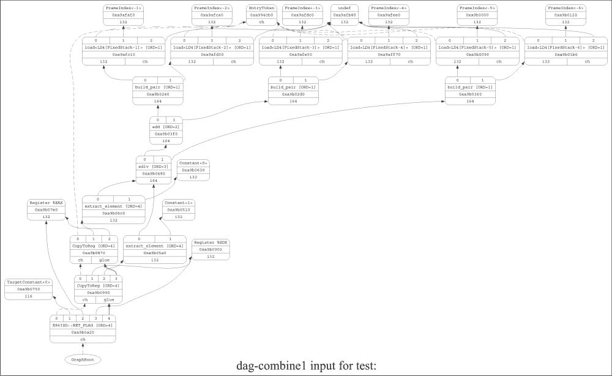

要查看类型合法化后的 DAG，请输入以下命令行：

```cpp
$ llc -view-dag-combine2-dags test.ll

```

下图显示了类型合法化后的 DAG：

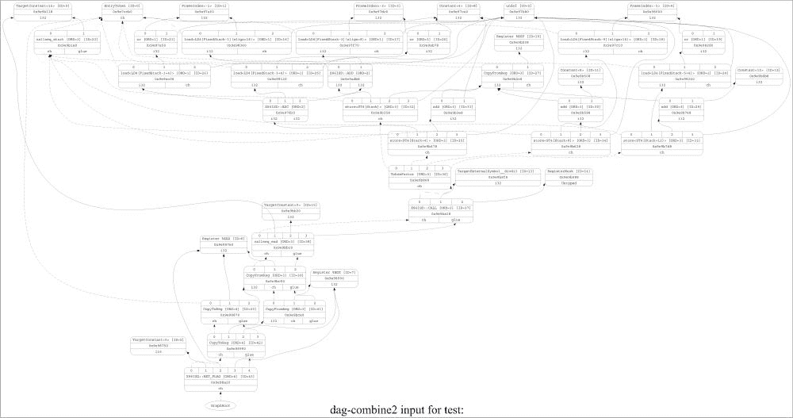

仔细观察 DAG 节点，你可以看到在合法化之前每个操作都有 i64 类型。这是因为 IR 有 i64 数据类型——IR 指令到 DAG 节点的单一映射。然而，目标 x86 机器只支持 i32 类型（32 位整数类型）。DAG 合法化阶段将不支持的 i64 类型转换为支持的 i32 类型。这个操作被称为扩展——将较大的类型拆分成较小的类型。例如，在一个只接受 i32 值的目标中，所有 i64 值都被分解成 i32 值的对。因此，在合法化之后，你可以看到所有操作现在都有 i32 作为数据类型。

让我们看看指令是如何合法化的；使用以下命令创建一个 `test.ll` 文件：

```cpp
$ cat test.ll
define i32 @test(i32 %a, i32 %b, i32 %c) {
 %add = add nsw i32 %a, %b
 %div = sdiv i32 %add, %c
 ret i32 %div
}

```

要查看合法化前的 DAG，请输入以下命令：

```cpp
$ llc –view-dag-combine1-dags test.ll

```

以下图显示了合法化前的 DAG：

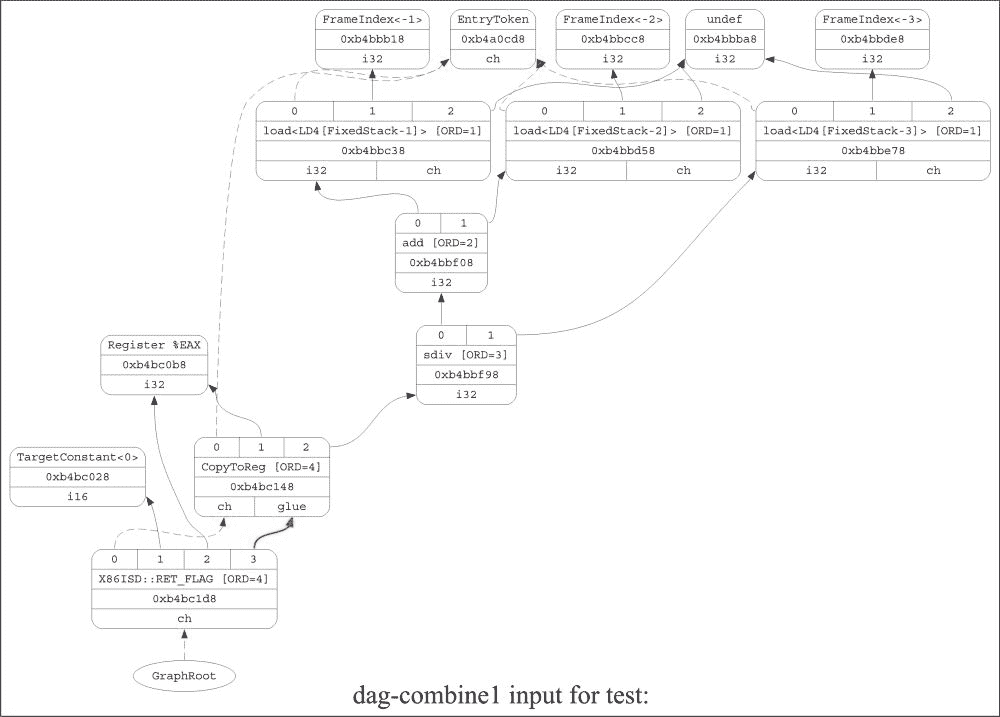

要查看合法化后的 DAG，请输入以下命令：

```cpp
$ llc -view-dag-combine2-dags test.ll

```

以下图显示了合法化阶段后的 DAG：

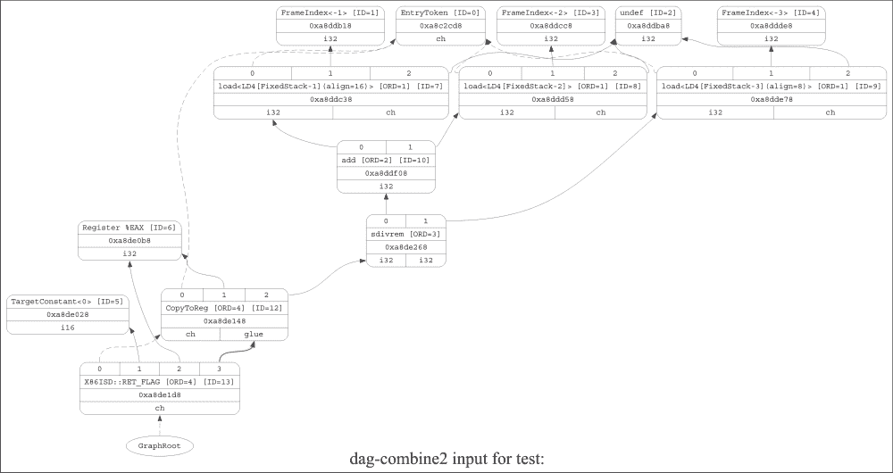

在指令合法化之前，DAG 由 `sdiv` 指令组成。现在，x86 目标不支持 `sdiv` 指令，因此对于目标来说是不合法的。然而，它支持 `sdivrem` 指令。因此，合法化阶段涉及将 `sdiv` 指令转换为 `sdivrem` 指令，如前述两个 DAG 所示。

# 优化 `SelectionDAG`

`SelectionDAG` 表示法以节点形式展示数据和指令。类似于 LLVM IR 中的 `InstCombine` 阶段，这些节点可以被合并和优化，形成一个最小化的 `SelectionDAG`。但是，优化 `SelectionDAG` 的不仅仅是 `DAGCombine` 操作。`DAGLegalize` 阶段可能会生成一些不必要的 DAG 节点，这些节点会在后续的 DAG 优化阶段运行中被清理。这最终以更简单、更优雅的方式表示了 `SelectionDAG`。

## 如何做到这一点…

在 `DAGCombiner` 类中提供了大量的函数成员（大多数命名方式如下：`visit**()`），用于通过折叠、重排、合并和修改 `SDNode` 节点来执行优化。请注意，从 `DAGCombiner` 构造函数中，我们可以推测一些优化需要别名分析信息：

```cpp
class DAGCombiner {
SelectionDAG &DAG;
const TargetLowering &TLI;
CombineLevel Level;
CodeGenOpt::Level OptLevel;
bool LegalOperations;
bool LegalTypes;

SmallPtrSet<SDNode*, 64> WorkListContents;
SmallVector<SDNode*, 64> WorkListOrder;

AliasAnalysis &AA;

// Add SDnodes users to worklist
void AddUsersToWorkList(SDNode *N) {
  for (SDNode::use_iterator UI = N->use_begin(),
        UE = N->use_end(); UI != UE; ++UI)
    AddToWorkList(*UI);
}
SDValue visit(SDNode *N);

public:

void AddToWorkList(SDNode *N) {
  WorkListContents.insert(N);
  WorkListOrder.push_back(N);
}

void removeFromWorkList(SDNode *N) {
  WorkListContents.erase(N);
}

// SDnode combine operations.
SDValue CombineTo(SDNode *N, const SDValue *To, unsigned NumTo,
bool AddTo = true);

SDValue CombineTo(SDNode *N, SDValue Res, bool AddTo = true) {
  return CombineTo(N, &Res, 1, AddTo);
}

SDValue CombineTo(SDNode *N, SDValue Res0, SDValue Res1,
bool AddTo = true) {
  SDValue To[] = { Res0, Res1 };
  return CombineTo(N, To, 2, AddTo);
}
void CommitTargetLoweringOpt(const TargetLowering::TargetLoweringOpt &TLO);

private:

bool SimplifyDemandedBits(SDValue Op) {
  unsigned BitWidth = Op.getValueType().getScalarType().getSizeInBits();
  APInt Demanded = APInt::getAllOnesValue(BitWidth);
  return SimplifyDemandedBits(Op, Demanded);
}
bool SimplifyDemandedBits(SDValue Op, const APInt &Demanded);

bool CombineToPreIndexedLoadStore(SDNode *N);

bool CombineToPostIndexedLoadStore(SDNode *N);

void ReplaceLoadWithPromotedLoad(SDNode *Load, SDNode *ExtLoad);

SDValue PromoteOperand(SDValue Op, EVT PVT, bool &Replace);

SDValue SExtPromoteOperand(SDValue Op, EVT PVT);

SDValue ZExtPromoteOperand(SDValue Op, EVT PVT);

SDValue PromoteIntBinOp(SDValue Op);

SDValue PromoteIntShiftOp(SDValue Op);

SDValue PromoteExtend(SDValue Op);

bool PromoteLoad(SDValue Op);

void ExtendSetCCUses(SmallVector<SDNode*, 4> SetCCs,
SDValue Trunc, SDValue ExtLoad, DebugLoc DL,
ISD::NodeType ExtType);

SDValue combine(SDNode *N);

// Various visit functions operating on instructions represented
// by SD node. Similar to instruction combining at IR level.
SDValue visitTokenFactor(SDNode *N);

SDValue visitMERGE_VALUES(SDNode *N);

SDValue visitADD(SDNode *N);
SDValue visitSUB(SDNode *N);
SDValue visitADDC(SDNode *N);
SDValue visitSUBC(SDNode *N);
SDValue visitADDE(SDNode *N);
SDValue visitSUBE(SDNode *N);
SDValue visitMUL(SDNode *N);

public:

DAGCombiner(SelectionDAG &D, AliasAnalysis &A, CodeGenOpt::Level OL)
: DAG(D), TLI(D.getTargetLoweringInfo()), Level(BeforeLegalizeTypes),
  OptLevel(OL), LegalOperations(false), LegalTypes(false), AA(A) {}

// Selection DAG transformation for following ops
SDValue DAGCombiner::visitMUL(SDNode *N) {
  SDValue N0 = N->getOperand(0);
  SDValue N1 = N->getOperand(1);
  ConstantSDNode *N0C = dyn_cast<ConstantSDNode>(N0);
  ConstantSDNode *N1C = dyn_cast<ConstantSDNode>(N1);
  EVT VT = N0.getValueType();
  if (VT.isVector()) {
    SDValue FoldedVOp = SimplifyVBinOp(N);
    if (FoldedVOp.getNode()) return FoldedVOp;
  }
  if (N0.getOpcode() == ISD::UNDEF || N1.getOpcode() == ISD::UNDEF)
    return DAG.getConstant(0, VT);

  if (N0C && N1C)
    return DAG.FoldConstantArithmetic(ISD::MUL, VT, N0C, N1C);

  if (N0C && !N1C)
    return DAG.getNode(ISD::MUL, N->getDebugLoc(), VT, N1, N0);

  if (N1C && N1C->isNullValue())
    return N1;

  if (N1C && N1C->isAllOnesValue())
    return DAG.getNode(ISD::SUB, N->getDebugLoc(), VT, DAG.getConstant(0, VT), N0);
  if (N1C && N1C->getAPIntValue().isPowerOf2())
    return DAG.getNode(ISD::SHL, N->getDebugLoc(), VT, N0,
           DAG.getConstant(N1C->getAPIntValue().logBase2(),
               getShiftAmountTy(N0.getValueType())));

  if (N1C && (-N1C->getAPIntValue()).isPowerOf2()) {
    unsigned Log2Val = (-N1C->getAPIntValue()).logBase2();
    return DAG.getNode(ISD::SUB, N->getDebugLoc(), VT, DAG.getConstant(0, VT),
    DAG.getNode(ISD::SHL, N->getDebugLoc(), VT, N0,
    DAG.getConstant(Log2Val, getShiftAmountTy(N0.getValueType()))));
  }

  if (N1C && N0.getOpcode() == ISD::SHL &&
      isa<ConstantSDNode>(N0.getOperand(1))) {
    SDValue C3 = DAG.getNode(ISD::SHL, N->getDebugLoc(), VT, N1, N0.getOperand(1));
    AddToWorkList(C3.getNode());
    return DAG.getNode(ISD::MUL, N->getDebugLoc(), VT,
    N0.getOperand(0), C3);
  }

  if (N0.getOpcode() == ISD::SHL && isa<ConstantSDNode>(N0.getOperand(1)) &&
      N0.getNode()->hasOneUse()) {
    Sh = N0; Y = N1;
  } else if (N1.getOpcode() == ISD::SHL && isa<ConstantSDNode>(N1.getOperand(1)) &&
            N1.getNode()->hasOneUse()) {
    Sh = N1; Y = N0;
  }
  if (Sh.getNode()) {
  SDValue Mul = DAG.getNode(ISD::MUL, N->getDebugLoc(), VT, Sh.getOperand(0), Y);
    return DAG.getNode(ISD::SHL, N->getDebugLoc(), VT,
    Mul, Sh.getOperand(1));
    }
  }
  if (N1C && N0.getOpcode() == ISD::ADD && N0.getNode()->hasOneUse() &&
      isa<ConstantSDNode>(N0.getOperand(1)))
    return DAG.getNode(ISD::ADD, N->getDebugLoc(), VT, DAG.getNode(ISD::MUL, N0.getDebugLoc(),
    VT, N0.getOperand(0), N1), DAG.getNode(ISD::MUL, N1.getDebugLoc(), VT, N0.getOperand(1), N1));

  SDValue RMUL = ReassociateOps(ISD::MUL, N->getDebugLoc(), N0, N1);

  if (RMUL.getNode() != 0) return RMUL;
  return SDValue();
}
```

## 它是如何工作的…

如前述代码所示，一些 `DAGCombine` 阶段会搜索一个模式，然后将模式折叠成一个单一的 DAG。这基本上减少了 DAG 的数量，同时降低了 DAG 的复杂度。结果是优化后的 `SelectionDAG` 类。

## 参见

+   要查看优化后的 `SelectionDAG` 类的更详细实现，请参阅位于 `lib/CodeGen/SelectionDAG/` 目录下的 `DAGCombiner.cpp` 文件。

# 从 DAG 中选择指令

在合法化和 DAG 组合之后，`SelectionDAG`表示处于优化阶段。然而，表示的指令仍然是目标无关的，需要映射到特定于目标的指令上。指令选择阶段以目标无关的 DAG 节点作为输入，匹配其中的模式，并给出输出 DAG 节点，这些节点是特定于目标的。

`TableGen` DAG 指令选择器从`.td`文件中读取指令模式，并自动构建部分模式匹配代码。

## 如何操作…

`SelectionDAGISel`是用于基于`SelectionDAG`的模式匹配指令选择器的通用基类。它继承自`MachineFunctionPass`类。它包含用于确定折叠等操作的合法性和盈利性的各种函数。此类的基本结构如下：

```cpp
class SelectionDAGISel : public MachineFunctionPass {
public:
const TargetMachine &TM;
const TargetLowering &TLI;
const TargetLibraryInfo *LibInfo;
FunctionLoweringInfo *FuncInfo;
MachineFunction *MF;
MachineRegisterInfo *RegInfo;
SelectionDAG *CurDAG;
SelectionDAGBuilder *SDB;
AliasAnalysis *AA;
GCFunctionInfo *GFI;
CodeGenOpt::Level OptLevel;
static char ID;

explicit SelectionDAGISel(const TargetMachine &tm,
CodeGenOpt::Level OL = CodeGenOpt::Default);

virtual ~SelectionDAGISel();

const TargetLowering &getTargetLowering() { return TLI; }

virtual void getAnalysisUsage(AnalysisUsage &AU) const;

virtual bool runOnMachineFunction(MachineFunction &MF);

virtual void EmitFunctionEntryCode() {}

virtual void PreprocessISelDAG() {}

virtual void PostprocessISelDAG() {}

virtual SDNode *Select(SDNode *N) = 0;

virtual bool SelectInlineAsmMemoryOperand(const SDValue &Op,
char ConstraintCode,
std::vector<SDValue> &OutOps) {
  return true;
}

virtual bool IsProfitableToFold(SDValue N, SDNode *U, SDNode *Root) const;

static bool IsLegalToFold(SDValue N, SDNode *U, SDNode *Root,
CodeGenOpt::Level OptLevel,
bool IgnoreChains = false);

enum BuiltinOpcodes {
OPC_Scope,
OPC_RecordNode,
OPC_CheckOpcode,
OPC_SwitchOpcode,
OPC_CheckFoldableChainNode,
OPC_EmitInteger,
OPC_EmitRegister,
OPC_EmitRegister2,
OPC_EmitConvertToTarget,
OPC_EmitMergeInputChains,
};

static inline int getNumFixedFromVariadicInfo(unsigned Flags) {
  return ((Flags&OPFL_VariadicInfo) >> 4)-1;
}

protected:
// DAGSize - Size of DAG being instruction selected.
unsigned DAGSize;

void ReplaceUses(SDValue F, SDValue T) {
  CurDAG->ReplaceAllUsesOfValueWith(F, T);
}

void ReplaceUses(const SDValue *F, const SDValue *T, unsigned Num) {
  CurDAG->ReplaceAllUsesOfValuesWith(F, T, Num);
}

void ReplaceUses(SDNode *F, SDNode *T) {
  CurDAG->ReplaceAllUsesWith(F, T);
}

void SelectInlineAsmMemoryOperands(std::vector<SDValue> &Ops);

public:
bool CheckAndMask(SDValue LHS, ConstantSDNode *RHS,
int64_t DesiredMaskS) const;

bool CheckOrMask(SDValue LHS, ConstantSDNode *RHS,
int64_t DesiredMaskS) const;

virtual bool CheckPatternPredicate(unsigned PredNo) const {
  llvm_unreachable("Tblgen should generate the implementation of this!");
}

virtual bool CheckNodePredicate(SDNode *N, unsigned PredNo) const {
  llvm_unreachable("Tblgen should generate the implementation of this!");
}

private:

SDNode *Select_INLINEASM(SDNode *N);

SDNode *Select_UNDEF(SDNode *N);

void CannotYetSelect(SDNode *N);

void DoInstructionSelection();

SDNode *MorphNode(SDNode *Node, unsigned TargetOpc, SDVTList VTs,
const SDValue *Ops, unsigned NumOps, unsigned EmitNodeInfo);

void PrepareEHLandingPad();

void SelectAllBasicBlocks(const Function &Fn);

bool TryToFoldFastISelLoad(const LoadInst *LI, const Instruction *FoldInst, FastISel *FastIS);

void FinishBasicBlock();

void SelectBasicBlock(BasicBlock::const_iterator Begin,
BasicBlock::const_iterator End,
bool &HadTailCall);

void CodeGenAndEmitDAG();

void LowerArguments(const BasicBlock *BB);

void ComputeLiveOutVRegInfo();
  ScheduleDAGSDNodes *CreateScheduler();
};
```

## 如何工作…

指令选择阶段涉及将目标无关指令转换为特定于目标的指令。`TableGen`类帮助选择特定于目标的指令。此阶段基本上匹配目标无关的输入节点，从而给出由目标支持的节点组成的输出。

`CodeGenAndEmitDAG()`函数调用`DoInstructionSelection()`函数，该函数遍历每个 DAG 节点，并为每个节点调用`Select()`函数，如下所示：

```cpp
SDNode *ResNode = Select(Node);
```

`Select()`函数是由目标实现的抽象方法。x86 目标在`X86DAGToDAGISel::Select()`函数中实现它。`X86DAGToDAGISel::Select()`函数拦截一些节点进行手动匹配，但将大部分工作委托给`X86DAGToDAGISel::SelectCode()`函数。

`X86DAGToDAGISel::SelectCode`函数由`TableGen`自动生成。它包含匹配器表，随后调用通用的`SelectionDAGISel::SelectCodeCommon()`函数，并传递该表。

例如：

```cpp
$ cat test.ll
define i32 @test(i32 %a, i32 %b, i32 %c) {
  %add = add nsw i32 %a, %b
  %div = sdiv i32 %add, %c
  ret i32 %div
}
```

要查看指令选择之前的 DAG，请输入以下命令行：

```cpp
$ llc –view-isel-dags test.ll

```

以下图显示了指令选择之前的 DAG：

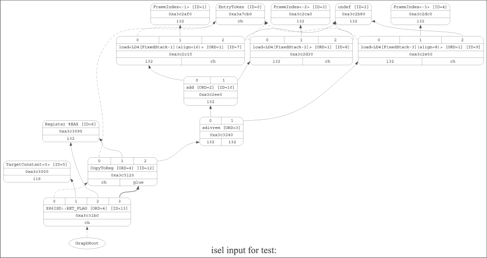

要查看指令选择之后的 DAG 看起来如何，请输入以下命令：

```cpp
$ llc –view-sched-dags test.ll

```

以下图显示了指令选择之后的 DAG：

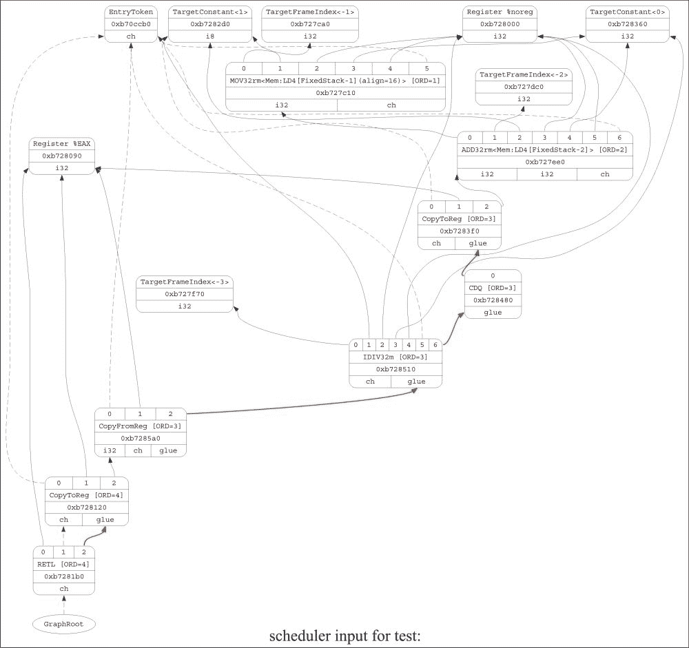

如所见，指令选择阶段将`Load`操作转换为`MOV32rm`机器代码。

## 参见

+   要查看指令选择的详细实现，请查看位于`lib/CodeGen/SelectionDAG/`的`SelectionDAGISel.cpp`文件。

# SelectionDAG 中的调度指令

到目前为止，我们已经有由目标支持的指令和操作数组成的`SelectionDAG`节点。然而，代码仍然以 DAG 表示形式存在。目标架构以顺序形式执行指令。因此，下一步合乎逻辑的步骤是对`SelectionDAG`节点进行调度。

调度器从 DAG（有向无环图）中分配指令的执行顺序。在这个过程中，它考虑了各种启发式方法，例如寄存器压力，以优化指令的执行顺序并最小化指令执行中的延迟。在将执行顺序分配给 DAG 节点之后，节点被转换成一个`MachineInstrs`列表，并且`SelectionDAG`节点被销毁。

## 如何操作…

在`ScheduleDAG.h`文件中定义了几个基本结构，并在`ScheduleDAG.cpp`文件中实现。`ScheduleDAG`类是其他调度器继承的基类，它仅提供与图相关的操作，例如迭代器、DFS（深度优先搜索）、拓扑排序、移动节点的函数等：

```cpp
class ScheduleDAG {
public:
  const TargetMachine &TM;              // Target processor
  const TargetInstrInfo *TII;           // Target instruction
  const TargetRegisterInfo *TRI;        // Target processor register info
  MachineFunction &MF;                  // Machine function
  MachineRegisterInfo &MRI;             // Virtual/real register map
  std::vector<SUnit> SUnits;            // The scheduling units.
  SUnit EntrySU;                        // Special node for the region entry.
  SUnit ExitSU;                         // Special node for the region exit.

  explicit ScheduleDAG(MachineFunction &mf);

  virtual ~ScheduleDAG();

  void clearDAG();

const MCInstrDesc *getInstrDesc(const SUnit *SU) const {
  if (SU->isInstr()) return &SU->getInstr()->getDesc();
    return getNodeDesc(SU->getNode());
}

virtual void dumpNode(const SUnit *SU) const = 0;

private:

const MCInstrDesc *getNodeDesc(const SDNode *Node) const;
};

class SUnitIterator : public std::iterator<std::forward_iterator_tag,
SUnit, ptrdiff_t> {
};

template <> struct GraphTraits<SUnit*> {
  typedef SUnit NodeType;
  typedef SUnitIterator ChildIteratorType;
  static inline NodeType *getEntryNode(SUnit *N) {
    return N;
  }
  static inline ChildIteratorType child_begin(NodeType *N) {
  return SUnitIterator::begin(N);
  }

static inline ChildIteratorType child_end(NodeType *N) {
  return SUnitIterator::end(N);
  }
};

template <> struct GraphTraits<ScheduleDAG*> : public GraphTraits<SUnit*> {
…};

// Topological sorting of DAG to linear set of instructions
class ScheduleDAGTopologicalSort {
  std::vector<SUnit> &SUnits;
  SUnit *ExitSU;
  std::vector<int> Index2Node;
  std::vector<int> Node2Index;
  BitVector Visited;
// DFS to be run on DAG to sort topologically
  void DFS(const SUnit *SU, int UpperBound, bool& HasLoop);

  void Shift(BitVector& Visited, int LowerBound, int UpperBound);

  void Allocate(int n, int index);

public:

  ScheduleDAGTopologicalSort(std::vector<SUnit> &SUnits, SUnit *ExitSU);

  void InitDAGTopologicalSorting();

  bool IsReachable(const SUnit *SU, const SUnit *TargetSU);

  bool WillCreateCycle(SUnit *SU, SUnit *TargetSU);

  void AddPred(SUnit *Y, SUnit *X);

  void RemovePred(SUnit *M, SUnit *N);

  typedef std::vector<int>::iterator iterator;

  typedef std::vector<int>::const_iterator const_iterator;

  iterator begin() { return Index2Node.begin(); }

  const_iterator begin() const { return Index2Node.begin(); }

  iterator end() { return Index2Node.end();}}
```

## 它是如何工作的…

调度算法在`SelectionDAG`类中实现了指令的调度，涉及多种算法，如拓扑排序、深度优先搜索、函数操作、节点移动和遍历指令列表。它考虑了各种启发式方法，例如寄存器压力、溢出成本、活跃区间分析等，以确定指令的最佳调度方案。

## 相关内容

+   有关调度指令的详细实现，请参阅位于`lib/CodeGen/SelectionDAG`文件夹中的`ScheduleDAGSDNodes.cpp`、`ScheduleDAGSDNodes.h`、`ScheduleDAGRRList.cpp`、`ScheduleDAGFast.cpp`和`ScheduleDAGVLIW.cpp`文件
